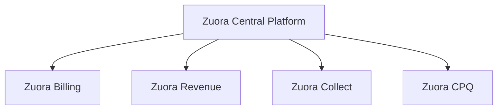
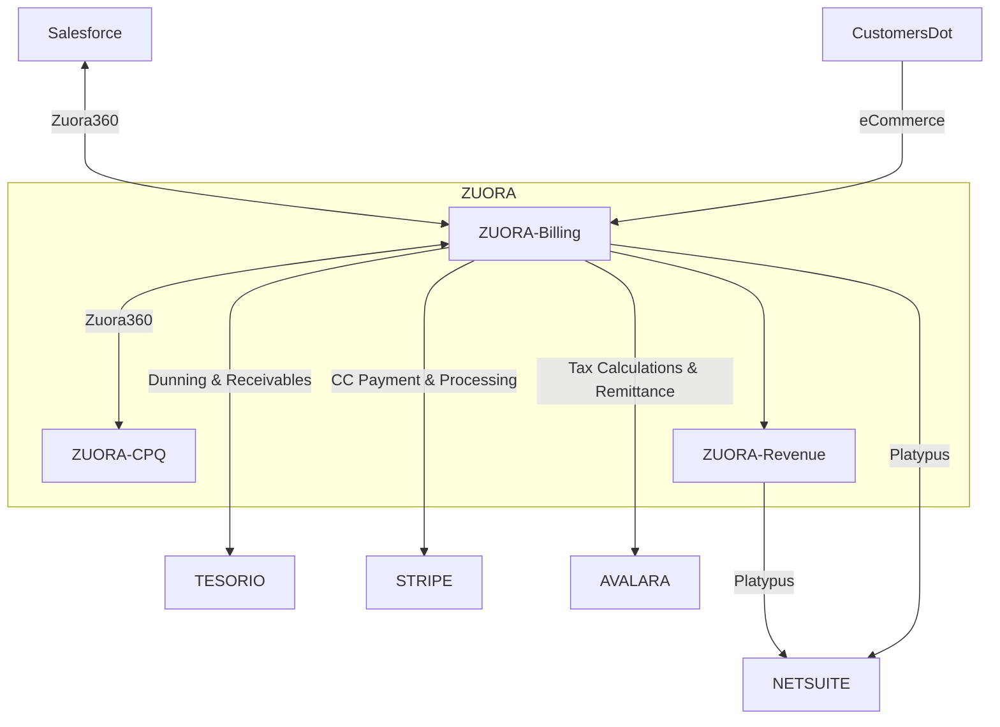
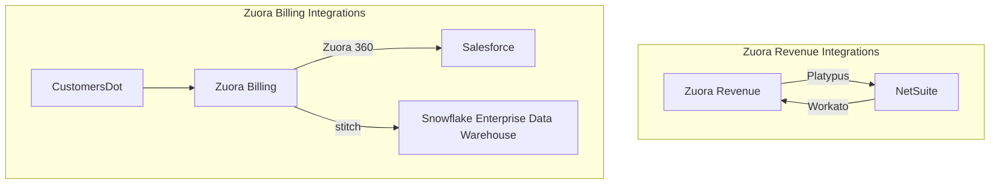

## テックスタックガイドとは？

> **注意:** テックスタックアプリを閲覧するには **[テックスタックインデックス](/handbook/business-technology/tech-stack/)** を使用してください。

すべてのアプリケーションには、そのアプリの使用方法・管理方法・他のシステムとのインテグレーション方法を誰もが理解できるように、専用の `テックスタックガイド` ハンドブックページが必要です。テックスタックガイドの対象読者は、そのアプリを使用したり、拡張したり、連携したり、あるいは GitLab テックスタックエコシステム全体の中でどのように位置づけられているかを理解する必要があるすべての人です。各ガイドの作成・維持管理はチームの共同作業であり、ビジネスシステムオーナー、テクニカルオーナー、および実装・運用に関わるその他のメンバーとのコラボレーションが必要です。各テックスタックガイドは、他の機能ベースのハンドブックコンテンツとともに、ビジネスオーナーの機能セクション内に配置されます。

## アプローチ

このページの目標は、アプリケーションの `テックスタックガイド` を文書化する方法を説明することです。**アプリのテックスタックガイドは、そのテクノロジーの機能ビジネスオーナーのセクションに配置する必要があります。** すべてのアプリの SSOT は [テックスタック YAML](https://gitlab.com/gitlab-com/www-gitlab-com/-/blob/master/data/tech_stack.yml) となり、YAML がページの主要部分を自動入力します。ただし、データモデル・インテグレーション・主要レポート/ダッシュボードなど、YAML ファイルに含まれていないセクションも必要に応じてドキュメントを完全なものにするために追加できます。

テックスタック YAML とテックスタックガイドの関係について考える方法：

- テックスタック YAML は GitLab が所有・運用するすべてのアプリのレジストリです（何が？）
- テックスタックガイドは各テックスタックアプリのビジネス・技術ワークフローをカバーします（なぜ？どのように？）
- YAML の `handbook_link` キー/プロパティが対応するテックスタックガイドへリンクします

また、内部ハンドブックに置かれるセキュリティアプリケーション用の Security Stack YAML という 2 番目の YAML ファイルを作成する予定です。これらのアプリケーションにも同じテンプレートアプローチを使用します。


{}
テックスタックガイドテンプレート
{}


## テックスタックアプリケーション名

テックスタックの唯一の情報源は [テックスタック YAML](https://gitlab.com/gitlab-com/www-gitlab-com/-/blob/master/data/tech_stack.yml) であり、このアプリの詳細情報が含まれています。

```markdown
{}
```

### 実装

アプリがどのように実装されたかに関する情報。GitLab のエピックや Issue へのリンクを含め、出発点とこのソリューションに至った経緯を理解できるようにしてください。

### システム図

システムがどのようにデプロイされ、他のアプリとどのように接続されているかを示す図を含めてください。[Mermaid 図](https://mermaid-js.github.io/docs/mermaid-live-editor-beta/#/edit/)が理想的ですが、どんな図でも無いよりはましです。

### データモデル

主要なデータオブジェクトとその相互関係を示す ER 図を含めてください。（理想的には）[Mermaid ER 図](https://mermaid-js.github.io/docs/mermaid-live-editor-beta/)、LucidChart、またはその他の図作成ツールで作成できます。

### インテグレーション

このアプリと他のテックスタックアプリやシステムとのインテグレーションを一覧します。開発プロジェクト、コード、図、Issue へのリンクなど、利用可能な追加資料へのリンクも含めてください。

### 主要レポート / ダッシュボード

アプリケーションの運用に使用される重要なレポートとダッシュボードを、利用可能な場合はリンクとともに一覧します。

## テックスタックガイド例 #1: Thought Industries LMS テックスタックガイド

[Thought Industries LMS テックスタックガイド](/handbook/customer-success/professional-services-engineering/education-services/lms/)

重要な注意事項：

1. このテックスタックガイドは、Professional Services がアプリのビジネスオーナーであるため、[GitLab Professional Education Services](/handbook/customer-success/professional-services-engineering/education-services) ハンドブック内に配置されています
2. Thought Industries Learning Management System の [テックスタック YAML](https://gitlab.com/gitlab-com/www-gitlab-com/-/blob/master/data/tech_stack.yml) の `handbook_link` キーがテックスタックガイドを参照しています

## テックスタックガイド例 #2: Zuora Billing

### コード

```markdown
テックスタックの唯一の情報源は [テックスタック YAML](https://gitlab.com/gitlab-com/www-gitlab-com/-/blob/master/data/tech_stack.yml) であり、このアプリの詳細情報が含まれています。

{}
```

### 結果

テックスタックの唯一の情報源は [テックスタック YAML](https://gitlab.com/gitlab-com/www-gitlab-com/-/blob/master/data/tech_stack.yml) であり、このアプリの詳細情報が含まれています。


<p class="my-2 text-sm text-gray-600"><strong>Zuora Billing</strong> — 詳細は <a href="https://handbook.gitlab.com/handbook/business-technology/tech-stack/" rel="external noopener">テックスタック (英語)</a> を参照してください。</p>


### 実装

Zuora は [Zuora Central Platform](https://www.zuora.com/products/zuora-platform/) 上に構築された複数のアプリモジュールで構成されています。[Zuora Billing](https://www.zuora.com/products/billing-software/) はそのモジュールの一つです。

### システム図

[Zuora Billing](https://www.zuora.com/products/billing-software/) は、より大きな [Zuora Central Platform](https://www.zuora.com/products/zuora-platform/) 内の複数モジュールの一つです。



### Quote to Cash ワークフロー

Zuora Billing は **[Quote to Cash ワークフロー](/handbook/business-technology/enterprise-applications/entapps-crm/quote-to-cash/#quote-to-cash-introduction)** の中核モジュールであり、他の多くのアプリと連携しています。



### Lead to Cash ワークフロー

Zuora Billing は **[Lead to Cash ワークフロー](/handbook/business-technology/enterprise-applications/entapps-crm/quote-to-cash/#lead-to-cash-flow)** の主要モジュールです。


### 主要レポート / ダッシュボード

Zuora Billing では、チームが [Zuora Standard Reports](https://knowledgecenter.zuora.com/Zuora_Platform/Data/Reporting/AB_Reporting_Quick_Reference/C_Standard_Reports) を使用しており、最も重要なレポートは以下のとおりです：

- ELP 変更
- 今後 30 日以内にキャンセル予定のサブスクリプションを持つアカウント
- 経時的なクレジットメモ

また、Zuora データを含む Tableau ダッシュボードのコレクションもあります。これらのダッシュボードには Salesforce など他のデータソースのデータも含まれています。

### データモデル

[Zuora Billing ビジネスオブジェクトモデル](https://knowledgecenter.zuora.com/Get_Started/Zuora_business_object_model)は、Zuora が内部でどのように構成されているかを示しています。


### 主要データオブジェクト

Zuora はこれらのオブジェクトの SSOT であり、データはそこで確認できます。また、主要オブジェクトは Snowflake でも確認できます：

- **生データ:** [`zuora.*`](https://gitlab-data.gitlab.io/analytics/#!/source_list/zuora)。主要オブジェクトは以下のとおり：
  - [`zuora.account`](https://gitlab-data.gitlab.io/analytics/#!/source/source.gitlab_snowflake.zuora.account)
  - [`zuora.invoice`](https://gitlab-data.gitlab.io/analytics/#!/source/source.gitlab_snowflake.zuora.invoice)
  - [`zuora.product`](https://gitlab-data.gitlab.io/analytics/#!/source/source.gitlab_snowflake.zuora.product)
  - [`zuora.subscription`](https://gitlab-data.gitlab.io/analytics/#!/source/source.gitlab_snowflake.zuora.subscription)
- **モデル化されたデータ:** [Bus Matrix](https://docs.google.com/spreadsheets/d/1j3lHKR29AT1dH_jWeqEwjeO81RAXUfXauIfbZbX_2ME/edit#gid=430467333)。主要オブジェクトは以下のとおり：
  - [`dim_billing_account`](https://gitlab-data.gitlab.io/analytics/#!/model/model.gitlab_snowflake.dim_billing_account)
  - [`dim_invoice`](https://gitlab-data.gitlab.io/analytics/#!/model/model.gitlab_snowflake.dim_invoice)
  - [`dim_product_detail`](https://gitlab-data.gitlab.io/analytics/#!/model/model.gitlab_snowflake.dim_product_detail)
  - [`dim_subscription`](https://gitlab-data.gitlab.io/analytics/#!/model/model.gitlab_snowflake.dim_subscription)

#### プロダクトカタログ

Zuora エンタープライズアプリガイドには、[GitLab のすべての SKU を管理するプロダクトカタログ](/handbook/business-technology/enterprise-applications/guides/zuora/#product-catalog)が含まれています。

### インテグレーション



#### Zuora から Salesforce へ

Zuora CPQ 経由で Zuora データを Salesforce に連携します。

#### Customers Dot から Zuora Billing へ

CustomersDot データを [IronBank GEM](https://gitlab.com/gitlab-org/customers-gitlab-com/-/tree/main/#ironbank) を使用して [Zuora Subscribe API](https://developer.zuora.com/v1-api-reference/introduction/#tag/Subscriptions) と [Zuora Amend API](https://developer.zuora.com/v1-api-reference/introduction/#tag/Amendments) 経由で Zuora に連携します。
     * [Orders Harmonization は](https://gitlab.com/gitlab-com/business-technology/enterprise-apps/intake/-/issues/616) [Zuora Orders API](https://developer.zuora.com/v1-api-reference/introduction/#tag/Orders) への移行を計画しています。

#### Zuora から Snowflake へ

[Stitch Zuora インテグレーション](https://www.stitchdata.com/integrations/zuora)を使用して Zuora データを [Snowflake エンタープライズデータウェアハウス](/handbook/enterprise-data/platform/#our-data-stack)に連携します。

#### Zuora から NetSuite へ

Zuora Revenue データは [Zuora Revenue to NetSuite インテグレーション](https://gitlab.com/gitlab-com/business-technology/enterprise-apps/integrations/platypus/-/wikis/Integrations/Zuora-Revenue-to-Netsuite)を使用して NetSuite と同期されます。
