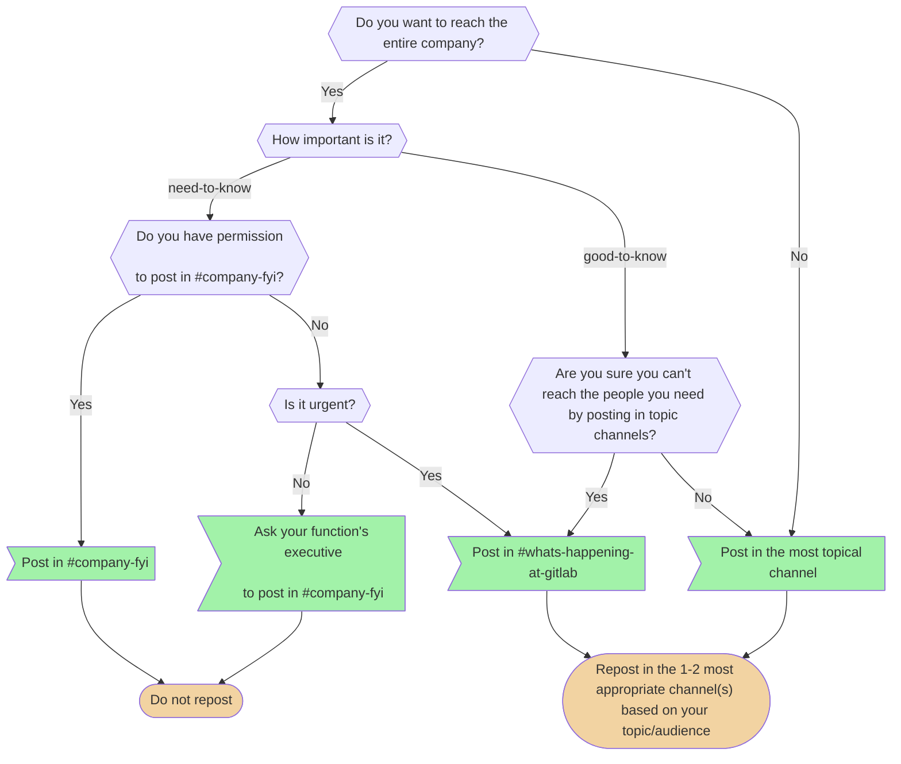

<!-- markdownlint-disable MD001 MD051 -->
私たちは [オールリモート](/handbook/company/culture/all-remote/) の企業であり、[世界中のほぼどこからでも](/handbook/people-group/employment-solutions/#country-hiring-guidelines)働けるようにしています。多くのロケーションにわたって優れた人材を採用しているため、つながりを保ちながらより効率的に働くために、明確なコミュニケーションを実践することが私たちにとって重要です。

これを実現するために、私たちは非同期コミュニケーションを起点とし、パブリックな Issue、マージリクエスト、Slack チャンネルを通じてコミュニケーションを取ることで、可能な限りオープンで透明性のある状態を保ちます。

また、オフラインの会話の結論を書き留めることも重視しています。

私たちは常に敬意を持ってプロフェッショナルにコミュニケーションを取ります。

## 効果的で責任あるコミュニケーションのガイドライン {#effective--responsible-communication-guidelines}

1. **[ポジティブな意図](/handbook/values/#collaboration)を前提とする。** 常にポジティブで思いやりのある姿勢から始めます。
1. **思いやりは重要です。** あなたが見ているのは画面ですが、実際には人と話しています。面と向かって言わないようなことを、テキストメッセージで送らないでください。
1. **自分の考えを責任を持って包括的に表現する。** 私たちは異なるロケーションに住んでおり、しばしば非常に異なる視点を持っています。私たちはあなたの考え、意見、感情を知りたいと思っています。同時に、機微な可能性のあるトピックを伝える際のガイドラインを考慮することもお願いします。
1. **当事者意識を持つ。** 口にしたこと、入力したことには責任を持ってください。それが意図せずとも会社や個人を傷つけたなら、他の視点から物事を見て、素直に謝ることをお勧めします。
1. **私たちの[バリュー](/handbook/values/)のロールモデルになる。**
1. **フィードバックは不可欠です。** 私たちのチームメンバーが暮らす 60 以上の国それぞれで何が適切かを知るのは困難です。チームメンバーには、思いやりを持ってフィードバックを与え、受け取ることをお勧めします。
1. **1:1 を過小評価しない。** 非同期コミュニケーション（例: テキストを通じたもの）は役に立ち、必要なものです。場合によっては（例: 誤解を解くために）、Zoom のビデオ通話に切り替える方がはるかに効果的なこともあります。
1. **私たちの[ハラスメント防止ポリシー](/handbook/people-group/anti-harassment/)と [GitLab Code of Business Conduct and Ethics](https://ir.gitlab.com/governance/governance-documents/default.aspx) に常に従う。** 誰もが職場環境で快適に過ごせるべきです。
1. **私たちが直接影響を与えられることに集中する。** 私たちが直接影響を与えられない要因は数多くあり、そうしたことを議論することに時間を費やすのは避けるべきです。たとえば、私たちは[時価総額](/handbook/company/being-a-public-company/#market-capitalization)について話しません。これにはコントロールできない側面があるためです。その代わりに、会社の目標を達成し、[年間経常収益](/handbook/sales/sales-term-glossary/arr-in-practice/)を成長させるために、どのように協力できるかに集中すべきです。
1. **[積極的かつ効果的な傾聴](/handbook/leadership/coaching/#essential-coaching-skills)に取り組む**。

### 非同期コミュニケーション {#asynchronous-communication}

 非同期コミュニケーションとは、あなたの通信文を送ったのと同じタイミングで追加のステークホルダーが対応可能である必要 *なしに*、コミュニケーションを取りプロジェクトを前進させる技術です。

 分散システムにおいて、非同期と同期のコミュニケーションはイデオロギーではありません。それらはツールであり、それぞれに役割があります。非同期メッセージング（キュー、pub/sub、イベントストリーム）はスケールさせる手段です。プロデューサーをコンシューマーから切り離し、バースト的な負荷を吸収し、ピアが遅延したりダウンしたりしているときでもサービスが動き続けられるようにします。同期呼び出し（RPC、リクエスト/レスポンス）は、今この瞬間に新鮮で合意された答えに正しさが依存する場合に協調する手段です。たとえば支払いの承認、ロックの取得、リーダー選出などです。すべてを非同期で構築すれば、見事にスケールするが意思決定ができないシステムになります。すべてを同期で構築すれば、正しいが脆弱なシステムになり、1 つの遅いノードがグラフ全体を停滞させます。

 同じパターンが私たちの働き方にも当てはまります。Slack、ドキュメント、GitLab の Issue は私たちの非同期レイヤーです。それらはタイムゾーンを越えてスケールし、永続的なアーティファクトを作り出し、互いをブロックすることなく人々が働けるようにします。それが仕事の大半であり、そうあるべきです。しかし、一部の意思決定には同期的なトランザクションが必要です。戦略転換について足並みをそろえること、本当の意見の相違を解決すること、新しいエグゼクティブとの信頼を築くこと、コンテキストがまだ書き留められるほど明瞭でない問題をデバッグすること——これらは、非同期の往復遅延（収束するのに 4 日と 17 件の返信を要するスレッド）が 30 分の同期よりも悪い場面です。「非同期のみ」の失敗モードは、同期エンドポイントを持たないイベント駆動アーキテクチャの失敗モードと同じです。意思決定が結果整合性になってしまうのです。スレッドが分岐し、コンテキストがずれ、誰が何を決めたのか誰も分からなくなり、本来はクリーンなコミットポイントを必要としていた仕事が、代わりに遅々として進まないコンセンサス問題になってしまいます。

 *チームメンバー向けリソース*: 非同期コミュニケーションと同期コミュニケーションをいつ使うかについて詳しく学ぶには、追加のガイダンスを含む[非同期と同期の全体像](https://docs.google.com/document/d/192o14Euw2n1v3enmXVuf-yvqb31HPwT7NAHqaenwaZc/edit?tab=t.0)をご覧ください。

### 全員がモデレーター {#everyone-is-a-moderator}

Slack、Issue、マージリクエスト、ビデオ、メール、その他あらゆるフォーラムで気になることを見かけたら、その個人に対して 1:1 形式で敬意を持って直接伝えることをお勧めします。

誰かのコミュニケーションや振る舞いについて提起すべき問題がある場合、チームメンバーは[コミュニケーションに関する懸念を提起する](/handbook/people-group/team-member-relations/#raising-communication-concerns)プロセスに従い、マネージャーに懸念を共有するか、希望すれば Team Member Relations (teammemberrelations@gitlab.com) に直接メールを送ってください。

### 生成 AI ツールを使うときのコミュニケーション {#communicating-when-using-generative-ai-tools}

1. **[自分のアウトプットに責任を持つ](/handbook/values/#have-ownership--accountability)**: あなたは、どのように作成されたかにかかわらず、共有するあらゆるコンテンツの正確性、適切性、価値に責任を負います。最終的な著者として、コメント、コード、その他のアーティファクトを他者にレビューを依頼する前に、読み、理解し、磨き上げるべきです。
   - **共有する前に検証する**: AI はもっともらしいが不正確な情報を生成することがあります。投稿する前に、事実、コードの機能、技術的な詳細を必ず検証してください。
   - **[包括的な言葉づかい](/handbook/values/#inclusive-language--pronouns)を使う**: AI の出力にバイアスがないかレビューし、私たちの[ダイバーシティ、インクルージョン、ビロンギング](/handbook/values/#diversity-inclusion)のバリューに沿っていることを確認してください。
   - **[ブロードキャストは短く保つ](/handbook/values/#keep-broadcasts-short)**: AI ツールは冗長で反復的なコンテンツを生成することがあります。特に 1 対多のコミュニケーションでは、簡潔さと明瞭さのために編集してください。[適切なグループにとっての効率](/handbook/values/#efficiency-for-the-right-group)を最適化してください。何を共有するか決める際には、相手の時間を考慮してください。
1. **機密情報を保護する**: 使用しているデータと AI ツールについて、[データ分類基準](/handbook/security/policies_and_standards/data-classification-standard/)を認識してください。機微なコンテンツには、承認された社内ツールのみを使用してください。
1. **真正性を保つ**: あなたのコミュニケーションが純粋に人間の判断を反映し、私たちの[バリュー](/handbook/values/)に沿っていることを確認してください。これは顧客とのやり取りや、[フィードバックを提供する](/handbook/values/#give-feedback-effectively)際に特に重要です。
1. **AI の使用開示を責任回避に使わない**: AI の使用に言及する前に、その意図を考えてください。透明性は価値を加えるべきであり、あなたの責任を軽減する免責事項として機能すべきではありません。誤りに対する予防線として言及しているなら、そのコンテンツはまだ共有する準備ができていないかもしれません。

AI ツールは[効率](/handbook/values/#efficiency)を高められますが、効果的かつプロフェッショナルにコミュニケーションを取るあなたの責任を軽減するものではありません。

このガイダンスに達していないと思われるコンテンツ（「AI スロップ」と呼ばれることもあります）を受け取った場合は、私たちの原則である[「ポジティブな意図を前提とする」](/handbook/values/#assume-positive-intent)、[「ネガティブなフィードバックは 1 対 1 で」](/handbook/values/#negative-feedback-is-1-1)、[「効果的にフィードバックを与える」](/handbook/values/#give-feedback-effectively)に基づいて行動してください。

## GitLab にとって機微な可能性のあるトピックのコミュニケーション {#communicating-potentially-gitlab-sensitive-topics}

（このガイダンスは、[GitLab の SAFE フレームワーク](/handbook/legal/safe-framework/)、[社内ハンドブック](/handbook/about/handbook-usage/#the-internal-handbook)の使用に関するガイダンス、およびこのページの追加ガイダンスを補足し、一部重複します。チームメンバーには、コミュニケーションにおいて以下の要因を考慮することをお願いします。）

GitLab が成熟するにつれて、私たちは議論を促進し続けると同時に、GitLab にとって機微な可能性のあるトピックが適切なフォーラムで議論されるよう、コミュニケーションのガイドラインを進化させたいと考えています。これは、チームメンバーがマージリクエスト、Issue やエピック、Slack でのコミュニケーションを含む非同期のコミュニケーション手段を多用しているため、特に重要です。

言葉は書かれた後も長く影響を持ち続けます。社内でコミュニケーションを取っているときでさえ、互いに話す際のあり方は外部の視点を通して見られるべきです。追加情報については、[テキストを通じて効果的かつ責任を持ってコミュニケーションを取るためのガイドライン](/handbook/company/culture/all-remote/)をご覧ください。

### 機密レベル {#confidentiality-levels}

GitLab では、私たちは[デフォルトでパブリック](/handbook/values/#public-by-default)ですが、一部の情報は社内限定またはアクセス制限付きに分類されています。詳細については[機密レベル](/handbook/communication/confidentiality-levels/)のハンドブックページをご覧ください。

### GitLab にとって機微な可能性のあるトピックの例 {#examples-of-potentially-gitlab-sensitive-topics}

1. チームメンバーのデータ（個人のパフォーマンス、開始日、退職）
1. ポリシーや現地の規則・規制の違反、またはその可能性
1. 顧客またはパートナーの情報（ロゴ、商標、支出）
1. 重要な未公開情報

上記の例は、[GitLab の SAFE フレームワーク](/handbook/legal/safe-framework/)の例と重複しています。詳細とコンテキストについては、そのページをさらにレビューすることをお勧めします。

### リスクとは何か? {#what-are-the-risks}

1. **法的リスク:** これらは、GitLab またはその事業を展開する市場を規制する規則や法律から生じるリスクです。これには、GitLab のチームメンバー、顧客、ユーザーの個人データやプライバシーを損なうようなコンテンツが含まれますが、これに限定されません。
1. **モラルリスク:** 明確化のための質問をする機会がないまま誤解される可能性のある GitLab にとって機微なトピックを提起すると、チームの文化やモラルにリスクを生む可能性があります。
1. **PR リスク:** あなたが文書化したものはすべて、最終的に外部に共有・閲覧される可能性があることを忘れないでください。パブリックな MR や Issue での議論は、私たちがどのように協力しているかをもっと知ろうとする GitLab 外部の人々に対して、私たちの[バリュー](/handbook/values/)を示すものであることを考慮してください。

私たちは、GitLab、そのチームメンバー、または顧客に対するリスクを、同期的な 1:1 の場で伝えることをお勧めします。

## どのコミュニケーションフォーラムを使うかの判断 {#determining-which-communication-forum-to-use}

以下の表は、GitLab におけるさまざまなコミュニケーションフォーラムの概要と、どのフォーラムを活用するか判断する際に、GitLab にとって機微な可能性のあるトピックに関連してチームメンバーが考えるべき検討事項をまとめたものです。

| コミュニケーションフォーラム | 利用する場面 |
| ---------- | ---------- |
| ガイドラインに沿った[社内ハンドブック](/handbook/about/handbook-usage/#the-internal-handbook)を使う | [社内限定](/handbook/communication/confidentiality-levels/#internal)（[非公開](/handbook/communication/confidentiality-levels/#not-public)を含み、[アクセス制限付き](/handbook/communication/confidentiality-levels/#limited-access)ではない）の情報をチームメンバー向けに文書化したいとき |
| 外部 MR/Issue（機密ではない） | （直接的にも後からも）リスクが疑われたり特定されたりしておらず、[非公開](/handbook/communication/confidentiality-levels/#not-public)カテゴリに該当しない場合の議論とコラボレーション |
| 社内 MR/機密 Issue | リスクが疑われたり特定されたりしていないが、[社内限定](/handbook/communication/confidentiality-levels/#internal)、[非公開](/handbook/communication/confidentiality-levels/#not-public)、SAFE フレームワーク/一般コミュニケーションガイドラインに該当することを守る場合の議論とコラボレーション |
| あなたのマネージャー、DRI、または法務 | 潜在的なリスクについて疑問があり、リスクがあるかどうかをレビューしたい場合の議論とコラボレーション |
| DRI | リスクが疑われたり特定されたりしている場合の議論とコラボレーション。Zoom を通じて口頭で DRI と直接コミュニケーションを取ります。例として、アクセス制限が適用される Issue や、People プロセス/ポリシーの変更を扱う場合があります。 |
| People Group（あなたの People Business Partner または Team Member Relations） | リスクが疑われたり特定されたりしている場合、ポリシー違反がある場合、または私的な事柄である場合の議論とコラボレーション |
| [GitLab の内部通報ポリシー](https://drive.google.com/drive/folders/1kB3k5FRnR3OUBP0Eyo3SxxyPKeiRFfUk) | ポリシーで定められた違反となる状況を報告する場合 |

疑問がある場合は、あなたの People Business Partner やリーダーシップチームに直接連絡してください。

### 組織のコードネーム {#organization-code-names}

[プロジェクト名のセクション](/handbook/communication/confidentiality-levels/#project-names)をご覧ください。

## 社内コミュニケーション {#internal-communication}

社内コミュニケーションとは、会社における仕事関連のあらゆるコミュニケーションです。
社内コミュニケーションには、チームメンバー同士の会話、より広いチームでの議論、会社への社内アナウンス、または選ばれた社内オーディエンスへのターゲットを絞った働きかけが含まれます。
GitLab では、意図的な透明性やオープンな対話への人々の参加といった GitLab 文化の側面を支えるために、誰もが社内コミュニケーションの効果に貢献できます。

私たちはすべてのチームメンバーが [Manager of One](/handbook/leadership/#managers-of-one) でなければならないと信じているため、ほとんどのコミュニケーションは関連するグループによって処理されますが、一部のコミュニケーションは他のものよりも機微で議論を呼ぶものであることも分かっています。
そうした場合、DRI は[社内コミュニケーション機能](/handbook/people-group/employment-branding/people-communications/)に関わってもらいたいと考えるかもしれません。

### トップティップスとベストプラクティス {#top-tips-and-best-practices}

1. すべての書面によるコミュニケーションは英語で行います。1 対 1 で送る場合でも同様です。メールやチャットを転送する必要が出てくることがあるためです。
1. 可能な場合は **非同期コミュニケーション** を使います: マージリクエスト（推奨）または Issue。アナウンスは適切な Slack チャンネルで行い、人々がチャットに邪魔されることなく自分の仕事ができるようにすべきです。
1. Issue やマージリクエストでの議論が、他の何よりも優先されます。緊急に返信が必要な場合は、Issue やマージリクエストのコメントへのリンクとともに誰かに Slack で連絡し、そこで返信するよう依頼できますが、相手がすぐには気づかない可能性があることに注意してください。詳細は [Slack](/handbook/communication#slack) をご覧ください。
1. チャットの代わりにメールを選ぶ場合、チャットで使うのと同じように、短いメッセージだけを含む *社内* メールを送ってもかまいません。
1. 常に対応可能であることは期待されていません。計画された勤務時間外にメッセージに返信する必要はありません。
1. 同期コミュニケーションの方が良い選択肢である場合もありますが、それをデフォルトにしないでください。たとえば、ブロックされているときはビデオ通話で素早く物事を解決できます。詳細は[ビデオチャットのガイドライン](#video-calls)をご覧ください。
1. 質問は好きなだけしてかまいません。多くの人が答えられるように、また他の人が答えを見て恩恵を受けられるように質問してください。ダイレクトメッセージや 1 対 1 のメールではなく、Issue やパブリックなチャットチャンネル（`#questions` など）を使ってください。ハンドブックで調べても答えが見つからなかった、または明確にする必要がある場合は、レビューしていたハンドブックのリンクを含め、「ハンドブックを見ていたが x, y, z が見つからなかった」と述べてください。
1. 質問への答えとして誰かにハンドブックのリンクを送る場合、特に相手が GitLab に新しい場合は、いくらかコンテキストを加えることを検討してください。答えが文書化されていることが多いのは素晴らしいことですが、新しいチームメンバーにとっては必ずしも見つけやすいとは限りません。
1. 質問への答えが文書化されていない場合は、すぐにマージリクエストを作成して、あなたが探していた場所のハンドブックに追加してください。質問に答えた人が、その質問に答えるのが一度だけで済むよう、あなたが率先して模範を示しているのを見るのは素晴らしいことです。マージリクエストは、助けてもらったことへの最良の感謝の伝え方です。
1. 何か（マージリクエスト、Issue、コミット、ウェブページ、コメントなど）に言及する場合は、それへのリンクを含めてください。
1. すべての会社データはデフォルトで **共有可能** であるべきです。ローカルのテキストファイルを使うのではなく、Issue にコメントを残してください。
1. 誰かが何かを依頼したら、期限を伝えるか、やったことを伝えてください。「やります」「OK」「やることリストに入れました」といった答えは役に立ちません。小さなことなら、2 分かけてタスクをやってしまう方が良いです。そうすれば相手はそれを頭の中から消せます。大きなことなら、いつやるか把握する必要があります。その情報を返すことで、時間がかかりすぎる場合に相手が別の方法で解決すると決められるかもしれません。
1. CC（"cc @user"）で誰かに Issue を知らせるのは問題ありませんが、誰かから特定のアクションが必要な場合は CC だけでは不十分です。メンションされたユーザーは Issue を読んでそれ以上のアクションを取らないかもしれません。何かが必要な場合は、誰に必要なのかを @ メンションしつつ、あなたのニーズを明示的に伝えてください。
1. 社内の議論のためにプライベートグループを作るのは避けてください:
   1. 邪魔になります（グループ内の全ユーザーがメッセージごとに通知を受けます）。
   1. 検索できません。
   1. 共有できません: グループに人を追加する方法がありません（これがしばしば複数のグループ作成につながります）。
   1. 件名がないため、参加者に基づいて各プライベートグループのトピックを誰もが覚えておかなければならず、または内容を読むためにグループを再度開く必要があります。
   1. グループを離れたとき、または [90 日後](/handbook/communication/#slack)に履歴が失われます。
1. 単一の顧客ミーティングのためであっても、チャンネルを作るのはまったく問題ありません。これらのチャンネルは、その「社内」的な性質（顧客とは共有されない）を示すために "a\_<customer-name>-internal" と名付けるべきです。
1. {} コミュニケーションにおいて明示的になることで、[ローコンテキストコミュニケーション](https://en.wikipedia.org/wiki/High-context_and_low-context_cultures)を使ってください。私たちはオールリモートの企業で、世界中に拠点があります。混乱を避けるために、できる限り多くのコンテキストを提供してください。関連して、私たちはコミュニケーションの効率のために[ユビキタス言語](#ubiquitous-language)を使います。
1. 概念について議論するとき、仮定の話に傾きすぎないように注意してください。価値が下がり、全員が統一された意思決定に至る助けとしてもはや建設的でなくなる転換点があります。
1. [より良い文章を書くためのヒント](/handbook/company/culture/all-remote/)を参考にしてください。

### 社内コミュニケーションチャンネルのガイダンス {#internal-communication-channel-guidance}

| 何を/いつ | GitLab ハンドブック | The Loop | Slack | メール/ニュースレター | ミーティング |
| ---------- | ---------- | ----------- | ----------- | -----------| -----------|
| **主な目的** | GitLab の手続きに関する透明性、ハンドブックファーストでの情報の文書化 | チームメンバーをニュース、情報、ストーリーとつなげる | リアルタイムのコラボレーションと素早いコミュニケーション | 公式なコミュニケーション、選ばれた会社の更新、ターゲットを絞ったオーディエンスへの統合された更新 | 同期的な議論とコラボレーション |
| **最適な用途** | 1.) 顧客、コミュニティ、候補者にとって価値のあるプロセスや手続きの共有 2.) 外部への透明性の創出（コアバリュー、ミッション、ビジョン） 3.) ワークフローと標準化されたプロセスの文書化 | 1.) 会社の情報、アナウンス、イベントの検索/共有 2.) プログラムやイニシアチブの学習/共有 3.) パーソナライズされた関連性の高いコンテンツへのアクセス 4.) チームメンバーのストーリーテリング、つながり、エンゲージメント 5.) チームのショーケースと成果 | 1.) 即時の議論 2.) 素早い質問 3.) チームの調整 4.) 時間に敏感で非公式な更新 5.) 即座のフィードバック/コミュニケーション 6.) チャンネル固有の議論 | 1.) 重要または公式なアナウンス 2.) ターゲットを絞った更新を含むニュースレター 3.) 外部コミュニケーション（顧客、ベンダーなど） 4.) 公式なメール通知を必要とする項目 5.) ターゲットを絞ったオーディエンスへの通知 6.) 選ばれたリーダーシップのコミュニケーション | 1.) 複雑な議論 2.) 意思決定のセッション 3.) 関係構築 4.) プロジェクトのキックオフ/レビュー 5.) インタラクティブなセッション 6.) アイデア出しや問題解決 7.) 魅力的でビジュアルなプレゼンテーション 8.) 対立の解決 |
| **適さない用途** | 1.) 時間に敏感な更新 2.) 社内コミュニケーション 4.) チーム固有のニュース 5.) 日々の運用上の事柄 | 1.) 技術文書 2.) 少人数のオーディエンスへのコミュニケーション 3.) 高度に機密性の高い情報。注: アクセスを保護する選択肢として Private Sites があります | 1.) 詳細な文書 2.) 複雑なコンテンツの共有 3.) 恒久的または長期的な情報の共有 | 1.) 協働的な議論 2.) 素早い返信を必要とする質問 3.) 即座の対応を要する緊急の問題 | 1.) 単純な更新 2.) 情報共有のみ 3.) プロセスの文書化 4.) 非同期で処理できるもの |
| **主な特徴/利点** | 1.) バージョン管理 2.) パブリックなアクセシビリティ 3.) プロセスの信頼できる唯一の情報源 | 1.) カスタマイズとパーソナライゼーション 2.) ニュースレター、フィード、従業員生成コンテンツ 3.) AI を活用した検索とコンテンツガバナンス 4.) コミュニケーション、つながり、文化を育む | 1.) コラボレーションとつながり 2.) インテグレーション 3.) リアルタイムコミュニケーション 4.) 生産性と効率 5.) プロジェクト、チーム、透明性のサポート | 1.) 認知度の向上 2.) 合理化されたコミュニケーション 3.) パーソナライズされたコンテンツ配信 | 1.) 対面でのやり取り 2.) 画面とプレゼンテーションの共有 3.) ブレイクアウトルーム 4.) 録画機能 |

### マルチモーダルコミュニケーション {#multimodal-communication}

重要な意思決定をブロードキャストするには、マルチモーダルコミュニケーションを活用してください。分散した組織に届けるために、会社のアナウンス用 Slack チャンネルで重要な意思決定をアナウンスし、適切なチームのメールリストにメールを送り、適切なチャンネルに Slack で投稿し、同じ日に同じ情報を 1:1 やその他の重要なミーティングでターゲットを絞って伝えます。

これを行う際は、[信頼できる唯一の情報源](/handbook/company/culture/all-remote/handbook-first/)を作成しリンクしてください: 理想的には[ハンドブック](/handbook/about/handbook-usage/#why-handbook-first)、そうでなければエピック、Issue、または Google Doc です。メールや Slack メッセージが信頼できる唯一の情報源であるべきではありません。

受信者が受け取っているはずのメールに言及するときは、見つけやすいように送信者と件名を参照してください。たとえば、「Jane Smith から件名『Training Seminar Details』のメールを受け取っているはずです」のように。

#### 「これは既知ですか」と尋ねる {#asking-is-this-known}

[https://gitlab.com](https://gitlab.com) で何かが奇妙な動作をしている場合、それはバグかもしれません。意図的に変更された可能性もあります。

その問題がすでに[報告されている](https://gitlab.com/groups/gitlab-org/-/issues)かどうかを検索してください。報告されておらず、バグだと確信している場合は、[Issue を作成](#issues)してください。

経験している動作がバグかどうか分からない場合は、Slack チャンネル [#is-this-known](https://gitlab.slack.com/messages/CETG54GQ0/) で尋ねてもかまいません。

尋ねる際は:

- チャンネルの過去のメッセージを確認して、誰もこの問題を経験していないことを確認してください。
- 経験している動作を説明してください。これにより検索可能になり、理解しやすくなります。
  同じスクリーンショットでも、人によって異なるものを探すかもしれません。
- 単一のチャンネルで尋ねることは、発見可能性を高め、重複した取り組みを防ぎ、他のチャンネルのノイズを減らします。
  [#frontend](https://gitlab.slack.com/messages/C0GQHHPGW/)、[#backend](https://gitlab.slack.com/messages/C8HG8D9MY/)、[#development](https://gitlab.slack.com/messages/C02PF508L/)、[#questions](https://gitlab.slack.com/messages/C0AR2KW4B/) のような汎用チャンネルで尋ねるのは控えてください。
- 重要な本番環境の問題については、[`#incidents-dotcom`](https://gitlab.enterprise.slack.com/archives/C08FMPK1DDF) に関連する進行中のインシデントがあるかどうかを確認してください。なければ、[インシデントを報告](/handbook/engineering/infrastructure-platforms/incident-management/#reporting-an-incident)してください。

#### 番号は参照用であり、シグナルではない {#numbering-is-for-reference-not-as-a-signal}

アジェンダ、ハンドブック、その他のドキュメントでメモを取るときは、Item 3 や 4a を参照できるように項目に番号を付けておいてください。
番号は、明示的にそうだと述べられていない限り、その主題の重要性やランクのシグナルではありません。
単に参照を容易にするためのものです。

#### 確認受領（ACK） {#acknowledgement-receipts-ack}

##### 非公式な ACK {#informal-acks}

Slack や Issue のコメントなど、非公式な確認のシナリオでは、以下を使うのが一般的です:

- `:ack:` の Slack 絵文字リアクションまたは `ACK` の返信 => 確認した、またはメッセージを受け取った
- 目 👀 => これを確認します | 見た | 取り組み中
- いいね 👍 => 良いアイデア
- 白いチェックマーク ✅ => タスクが完了した、または済んだ
- ハート ❤ ️= 感謝や評価の表現
- cc @mentions => 誰かがメッセージを見る必要がある場合

##### 公式な ACK {#formal-acks}

数百人の分散した従業員に重要な変更を効果的に伝えるために、私たちは時折 ACK プロセスを使います。

使いすぎを防ぐため、これはエグゼクティブチームのメンバーのみが使うべきです。誰でもエグゼクティブにスポンサーになるよう依頼できます。

ガイドラインとして、四半期に 1 回を超えないことを想定しています。ACK が多すぎると効力を失います。

ACK プロセスを開始するには:

1. [ACK テンプレート](https://docs.google.com/forms/d/1BPllKiwhOpvgdRbV_SYTCWevJLWMCAQJyegbVvJ1L6Q)からフォームを複製し、記入します。
   1. フォーム内でコンテンツを複製するのではなく、MR やハンドブックページにリンクしてください。[なぜハンドブックファーストか?](/handbook/about/handbook-usage/#why-handbook-first)
1. People Ops に、First Name、Last Name、Job Title、Department、Manager、Work Email の列ヘッダーを持つレポートを Workday から取得するよう依頼します。それを再確認し、次のような Excel の数式でメールアドレスをカンマ区切りの文字列に変換します: `=TEXTJOIN(", ", true, Sheet1!E2:E432)`
1. フォームを送信し、最初の 24 時間で 50% の回答が得られると見込みます。残りを集めるには:
   1. 共通の Slack チャンネルに投稿します。
   1. スタッフミーティングのアジェンダに追加します。
   1. チームのマネージャーに、自分のチームの Slack チャンネルに投稿し、明示的な `:ack:` を求め、全員が回答するまでチャンネルにピン留めするよう提案します。
   1. 最後に、休暇期間を尊重しつつ、出遅れている人に 1 対 1 で連絡します。

#### 感謝を伝える {#say-thanks}

私たちがインクルージョンを築き続ける中で、認知は重要かつ変革的な戦術です。チームメンバーに感謝することは、彼らの貢献が認められる機会を提供し、エンゲージメント行動に影響を与え、彼らの仕事が見られていることをチームメンバーに認めさせます。

1. 素晴らしい仕事をした人に、私たちの `#thanks` Slack チャンネルで感謝しましょう。
1. 認知を示せる他のチャンネルも検討してください: チームミーティング、Issue、会社の全体会議、1 対 1 ミーティングなど。
1. 相手がチームメンバーであれば、ただ `@` メンションし、複数の人が何かに取り組んでいたなら、それぞれの人を `@` メンションしてみてください。
1. 完了したプロジェクトをアナウンスするときは、主要な貢献者を挙げてください。
1. 認知はできる限りタイムリーに行ってください。
1. 可能であれば、感謝の対象となった主題を指すリンクを感謝とともに含めてください。たとえばマージリクエストへのリンクです。
1. 私たちは一般に、勤務時間外に働くプレッシャーを最小限にするため、勤務時間外の働きを認知することは避けています。時にチームメンバーは、タスクを完了したりイベントに参加したりするために、コアの勤務時間外に働くことを選ぶかもしれません。チームメンバーが成果を出すためにコアの時間外に働くとき、私たちは彼らの柔軟性と貢献を透明性を持って認めます。顧客の緊急事態の解決であれ、グローバルなチームミーティングへの対応であれ、重要な期限の達成であれ、GitLab の目標を満たすためにスケジュールを柔軟に調整したチームメンバーに感謝するのは適切です。
1. 会社が支払ったことについて CEO や他のエグゼクティブに感謝しないでください。代わりに GitLab に感謝してください。
1. チームメンバーではない人に感謝するには、[その人を Notable Contributor として推薦](https://contributors.gitlab.com/docs/notable-contributors)してください。
1. 誰もが認知を必要としたり望んだりするわけではないことを理解してください。そう知らされたら、彼らが望まないときはそれを尊重してください。

#### 対応可能状況を示す {#indicating-availability}

Google の["不在"](https://www.theverge.com/2018/6/27/17510656/google-calendar-out-of-office-option)機能を使って自分のカレンダーを更新し、不在予定の日付を自動返信に含めることで、対応可能状況を示してください。この機能は、選択した期間中のミーティング招待を自動的に辞退することに注意してください。

1. 祝日、休暇、移動時間、その他の休暇を含む不在予定を、自分のカレンダーに入れてください。詳細は[休暇の伝え方](/handbook/people-group/time-off-and-absence/time-off-types/)をご覧ください。
1. Google Calendar の設定で勤務時間を設定してください。
1. Time Off by Deel を活用して、他の GitLab チームメンバーが Slack 内であなたの[計画された休暇](/handbook/people-group/time-off-and-absence/time-off-types/)を把握できるようにしてください。

#### 非公式なコミュニケーション {#informal-communication}

[非公式なコミュニケーション](/handbook/company/culture/all-remote/informal-communication/)は、性質上公式ではない同僚間のやり取りで構成され、典型的なビジネス構造の通常の階層の外で社会的な関係を築くことに焦点を当てます。

言い換えれば、私たちが互いを知り、仕事以外の何かについて話すときに起こることです。

### マージリクエストから始める {#start-with-a-merge-request}

可能な場合、Issue ではなく[マージリクエスト（MR）](https://docs.gitlab.com/ee/user/project/merge_requests/)で議論を始めるのがベストプラクティスです。MR は提案された特定の変更に関連付けられ、誰もがレビューしオープンに議論できるよう透明性があります。MR の性質は、実行可能な問題への提案された解決策をめぐる議論を促進します。MR は実行可能ですが、Issue はアクションを起こすまでに時間がかかります。

1. 提案していることについては、常に MR を **オープン** してください。何かが正しく機能していない場合でも、新しい社内プロセスをイテレーションしている場合でも、特定の変更を直接提案せずに問題へのオープンなフィードバックを促す Issue を開くのではなく、最小限の価値ある変更を含むマージリクエストを開く価値があります。MR も議論を呼び込みますが、それは提案された変更に特化しており、焦点を絞った意思決定を促進することを覚えておいてください。
1. 誰かがマージリクエストをデフォルトにできるのに、Issue を作成するよう頼まないでください。
1. マージリクエストから始めることは[ハンドブックファースト](/handbook/about/handbook-usage/#why-handbook-first)の一部であり、意思決定がなされたときにハンドブックが最新であることを保証する助けになります。また、これは[誰もが貢献できる](/handbook/company/mission/#mission)ようにする方法でもあります。これはハンドブックの更新だけでなく、あらゆるものの更新について当てはまります。
1. マージリクエストはデフォルトで **機密ではありません**。ただし、[デフォルトでパブリックではないもの](/handbook/communication/confidentiality-levels/#not-public)については、提案する特定の変更への提案を含む機密 Issue を開いてください。[機密マージリクエスト](https://docs.gitlab.com/ee/user/project/issues/confidential_issues.html#merge-requests-for-confidential-issues)を作成する機能も利用できます。可能な場合は、より広いコミュニティが貢献できるよう、機微な情報を含めないことを検討してください。
1. すべての解決策が当面の問題を解決するわけではありません。**まず問題を定義し**、MR で提案する[最小限の価値ある変更（MVC）](/handbook/values/#minimal-valuable-change-mvc)の背後にある **理論的根拠を説明する** ことで、議論の焦点を保ってください。
1. 顧客などの外部ステークホルダーがいる議論では、コミュニケーションを積極的かつ一貫して行ってください。全員を最新の状態に保つために、コミュニケーションを流し続けることが重要です。最近の議論がなく、フィードバックに基づいて次の更新がいつ提供されるかの明確な定義がないと、MR は停滞しているように見えることがあります。これにより購読者は暗中模索の状態になり、何かが遅延して突然次のマイルストーンに飛んだときに不要な驚きを引き起こします。MR が、オープンなリクエストを承認または却下することでタイムリーにクローズされることが重要です。
1. **アクション志向** を持ち、[コンセンサスを目指さないでください](/handbook/leadership/#making-decisions)。すべての MR は[提案](/handbook/values/#make-a-proposal)です。MR の作者が反応しない場合は、その当事者意識を持って完成させてください。何らかの改善は、まったくないよりも良いものです。
1. 関連する会話のある Issue や他の MR を **相互リンク** してください。たとえば、GitLab.com の MR を作成するきっかけになった Zendesk チケットがある場合、Zendesk チケットに MR のリンクを文書化し、逆も同様にしてください。そして MR を承認または却下するときは、Zendesk からの理由や応答を含めてください。各 MR の説明の冒頭にリンクを置き、その関係（Report、Dependency など）を短く記し、一方を中心とし、重複している場合は理想的にはもう一方をクローズしてください。
   1. MR に関連する特定のコード行へのリンクを提供するときは、**常にパーマリンク**（そのファイルの特定のコミットへのリンク）を使ってください。これにより、ファイルが変更されても参照が有効なままになります。詳細は [Link to specific lines of code](https://docs.gitlab.com/ee/development/documentation/styleguide/index.html#link-to-specific-lines-of-code) をご覧ください。
1. 機能の変更を提出する場合は、**最終的な結論で説明を更新** してください（MR がなぜ却下されたか、またはなぜ承認されたか）。これにより、実装に関わる全員が Issue の現在の状態をはるかに見やすくなり、後の混乱や議論を防ぎます。
1. [**最小限の** 実行可能で価値あるもの](/handbook/values/#iteration)を提出してください。変更を提案するときは、最小限の合理的なコミットを提出し、他の機能強化への提案は別の Issue/MR に入れてリンクしてください。MR は[問題の説明と TODO コメント](https://gitlab.com/gitlab-org/gitlab/-/merge_requests/35239/diffs?diff_id=97449459)だけから始めてもかまいません。GitLab に新しく、ドキュメントや手順を書いている場合は、最初のマージリクエストを最大 20 行にしてください。
1. MR を長期間オープンにしたままにしないでください。MR は **実行可能** であるべきです——ステークホルダーは、何が変わり、最終的に何を承認または却下しているのかを明確に理解しているべきです。
1. 自分の仕事に **優先順位を付ける** よう意識的に努めてください。項目の優先順位は複数の要因に依存します: 誰かが答えを待っているか? 遅らせた場合の影響は何か? 何人に影響するか? などです。これは [Engineering Workflow](/handbook/engineering/workflow/) で詳しく説明されています。
1. MVC を提出するときは、仲間に **フィードバックを求めて** ください。たとえば、あなたがデザイナーでデザインを提案するなら、仲間のデザイナーに作業をレビューしてもらうよう声をかけてください。変更を提案されれば、デザインを改善し、代替の MR を提案する機会が得られます。これはコラボレーションを促進し、全員のスキルを向上させます。
1. **スレッド化された議論** の中でコメントに返信してください。まだ議論スレッドがない場合は、コメントの [Reply to comment](https://docs.gitlab.com/ee/user/discussions/#start-a-discussion-by-replying-to-a-standard-comment) ボタンを使って作成できます。これにより、追いにくい返信が入り混じった多くの議論をコメントが含むことを防げます。
1. コメントや回答が別々のトピックを含む場合は、それぞれに別々のコメントを書いてください。そうすれば、他の人が [Reply to comment](https://docs.gitlab.com/ee/user/discussions/#start-a-discussion-by-replying-to-a-standard-comment) ボタンを使ってトピックに独立して対応できます。
1. MR にフィードバックや質問を受け取ったら、コメントに応答するよう努めてください。[そうすることで、すべてのチームメンバーにとってのビロンギングの環境を作れるからです](/handbook/company/culture/inclusion/#gitlabs-definition-of-diversity-inclusion--belonging)。回答や応答をせずに MR をそのままマージすると、コメントした人は自分の意見が聞かれていないと感じます。あなたが素早い意思決定をする必要のない[直接の責任者](/handbook/people-group/directly-responsible-individuals/)（DRI）である場合、MR を変更しないことを選べますが、コメントやフィードバックには応答し、それらが MR の変更に値するかを検討し、[何をだけでなくなぜかを言う](/handbook/values/#say-why-not-just-what)べきです。
   コメントが多い場合は、主要なフィードバック領域を要約し、高いレベルで応答を共有することを選べます。私たちは、[DRI に説明させすぎると、こっそりとプロジェクトを出荷するインセンティブを作ってしまうことを理解しています。永遠の説明ループに陥る恐れは DRI を脱線させ、アクション志向で働くのではなく先送りさせる原因になります](/handbook/people-group/directly-responsible-individuals/#empowering-dris)。これは私たちが避けたいことです。
   素早い意思決定が必要なときは、[人々が私たちの話を聞いてくれたが、全員のインプットに基づく素早い意思決定のために説明する義務はないことを受け入れなければなりません](/handbook/leadership/#making-decisions)。目標は透明性を持って協働することであり、効率を失うことではありません。全員が同意するわけではありませんが、すべての人が[同意しなくてもコミットし、それでも意見を異にする](/handbook/values/#disagree-and-commit)ことを期待しています。
1. GitLab については、プロダクトのマージリクエストガイドラインは [Contribution guide](https://docs.gitlab.com/ee/development/contributing/merge_request_workflow.html#merge-request-guidelines) にあり、レビュアーやメンテナー向けのコードレビューガイドラインは私たちの [Code Review Guidelines](https://docs.gitlab.com/ee/development/code_review.html) で説明されています。
1. 何かが完了していないときでも、人々が早期にコメントして手戻りを防げるよう、社内で共有してください。
1. 誤って早期にマージされるのを防ぐために、<b>[ドラフト](https://docs.gitlab.com/ee/user/project/merge_requests/drafts.html)</b> マージリクエストを作成してください。ドラフトは、マージすることが **事態を悪化させる** 場合にのみ使ってください。ハンドブックへの貢献ではめったにそうなりません。進行中のほとんどのマージリクエストは事態を悪化させません。この場合はドラフトを使わないでください。誰かが予想より早くマージしたら、追加の項目について新しいマージリクエストを作成するだけです。まだドラフトステータスのものについて、最終レビューやマージを誰かに依頼しないでください。その時点で、あなたはそれが世に出すのに十分良いと確信しているべきです。
1. マージリクエストがマージされた後に Issue でフォローアップのアクションが必要な場合（顧客への報告やドキュメントの作成など）は、Issue の自動クローズを避けてください。
1. プロジェクトがあなたの MR を受け入れるのに複数の承認を必要とする場合、複数のレビュアーを同時にアサインしてもかまいません。こうすれば、先行するレビュアーにブロックされるのではなく、最も早く対応可能なレビュアーがすぐに開始できます。

### Issue {#issues}

Issue は、提案されている特定のコード変更がない場合に価値があります。たとえば:

- 問題や解決策を検証するための調査提案を作成する
- 特定の問題を解決するためにデザインのアイデアを出す
- 解決策をイテレーティブに提供するために実装タスクを分解する
- 特定のタスクの進捗を追跡する（特に Issue ボードが必要な場合）

Issue を活用するときも、議論の単一の特定のトピックと、Issue の解決につながる望ましい結果を定義することで、焦点を保つことが重要です。Issue は、解決の欠如によりオープンエンドになったり停滞したりすべきではありません。たとえば、チームメンバーは、特定の日付までに完了する必要のある関連 ToDo 項目（最初の下書き、ピアレビュー、公開など）を持つブログ記事の進捗を追跡するために Issue を開くかもしれません。特定の項目が完了したら、その Issue は問題なくクローズできます。

Issue を作成するときに覚えておくべきことをいくつか挙げます:

1. Issue を **クローズ** するときは、なぜクローズするのか、そして議論の MVC の結果が何だったか（実装されたかどうか）を説明するコメントを残してください。
1. 私たちは **約束** を守り、社内の合意なしに外部への約束をしません。
1. 顧客などの外部ステークホルダーがいる議論では、コミュニケーションを積極的かつ一貫して行ってください。全員を最新の状態に保つために、コミュニケーションを流し続けることが重要です。最近の議論がなく、フィードバックに基づいて次の更新がいつ提供されるかの明確な定義がないと、Issue は停滞しているように見えることがあります。これにより購読者は暗中模索の状態になり、何かが遅延して突然次のマイルストーンに飛んだときに不要な驚きを引き起こします。Issue がタイムリーにクローズされることが重要です。これを行う 1 つの方法は、現在の担当者が次の更新を提供する期限を設定することです。状況、優先順位付け、利用可能なキャパシティに応じて、数日先でも数週間先でもかまいません。

<i>**プロのヒント:**</i> マージリクエストを作成するとき、`closes: #[ここに Issue 番号を挿入]` を追加でき、マージリクエストがマージされると Issue が自動的にクローズされます。例は[こちら](https://gitlab.com/gitlab-com/people-group/peopleops-eng/employment-automation/-/merge_requests/60)で確認できます。**注:** [Issue の自動クローズ](https://docs.gitlab.com/ee/user/project/issues/managing_issues.html#disable-automatic-issue-closing)は一部のプロジェクトで無効化されています。

1. ユーザーが機能強化を提案したら、その懸念に対処する既存の Issue を見つけるか、新しいものを作成してください。後続の MR を通じて最初の MVC を定義する助けとして、Issue でアイデアを詳しく述べたいか尋ねてください。
1. 関連する会話のある Issue や MR を **相互リンク** してください。別の例として、関連する Issue や機能リクエストへのリンクを含む「Report: 」行を Issue の説明に追加することがあります。完了したら、関連する Issue にコメントを追加します（報告する責任があるならクローズし、そうでないなら再アサインします）。これにより、社内の混乱や報告者への報告漏れを防げます。
1. Issue や MR を相互リンクするときは、[ローコンテキストコミュニケーション](/handbook/communication/#low-context)を促進するために、リンクしているコンテンツのプレビューを含めてください:
   1. 良い例: `this would cause performance issue similar to #123456`。読者は最初に読んだ時点で完全な情報を得られ、詳細はリンクを参照できます。
   1. 避ける例: `this would cause issue similar to #123456`。読者はリンクをクリックし、他の議論スレッドの中から関連情報を見つけ、元の議論に戻る必要があります。
1. Issue に関連する特定のコード行へのリンクを提供するときは、**常にパーマリンク**（そのファイルの特定のコミットへのリンク）を使ってください。これにより、ファイルが変更されても参照が有効なままになります。詳細は [Link to specific lines of code](https://docs.gitlab.com/ee/development/documentation/styleguide/#link-to-specific-lines-of-code) をご覧ください。
1. 現在の[マイルストーン](https://gitlab.com/groups/gitlab-org/-/milestones)の Issue で自分の仕事に優先順位を付けてください。
1. [私たちはオープンに働いている](https://about.gitlab.com/blog/2015/08/03/almost-everything-we-do-is-now-open/)ので、すべてに GitLab.com のパブリックな Issue トラッカーを使ってください。Issue トラッカーは、ハンドブックの関連ページや [gitlab-com グループ](https://gitlab.com/gitlab-com/)配下のプロジェクトで見つけられます。
1. Issue に取り組み始めたらすぐに自分にアサインしてください。ただし、それより前にはしないでください。Issue の一部を完了し、誰か他の人に次のステップを取ってもらう必要がある場合は、その人に Issue を **再アサイン** してください。
1. Issue の **タイトル** が、望ましい結果が何であるべきかを示していることを確認してください。たとえばバグについては、現在の動作ではなく望ましい結果を Issue が述べていることを確認してください。
1. 特に議論中に重要な意思決定がなされたときは、最新情報と現在のステータスで Issue の説明を **定期的に更新** してください。Issue の説明は **信頼できる唯一の情報源** であるべきです。
1. 誰かに Issue をレビューしてもらいたい場合は、その人をアサインしないでください。代わりに、Issue のコメントで @ メンションしてください。Issue にアサインされることは、担当者がそれに取り組むべき、または取り組むつもりであるというシグナルです。ですから、誰かを Issue にアサインして、誤ったシグナルでこれを偽って伝えるべきではありません。
1. 誰かに Issue について知らせたり、タスクをアサインしたりしたい場合は、説明に追加するだけでなく、Issue のコメントを通じて行ってください。Issue の説明で誰かをメンションしたときに生成される ToDo 項目は、あなたが依頼しているアクションについてのコンテキストをほとんど提供しません。しかし、取ってほしいアクションを明示的に知らせるコメントを使えば、彼らが関連する ToDo 項目を読んだときに、作業を完了するために必要なコンテキストを集めるために Issue 全体を読む必要がなくなります。
1. Issue は[**完了**](https://docs.gitlab.com/ee/development/contributing/merge_request_workflow.html#definition-of-done)するまでクローズしないでください。イテレーションするか、オープンな Issue をクローズするか、MVC を実装するために後続の MR を作成するか、どう進めるかについて全員が賛同し合意しているかを明示的に尋ねるのは問題ありません。
1. 機能が[**完了**](https://docs.gitlab.com/ee/development/contributing/merge_request_workflow.html#definition-of-done)したら、対応するドキュメントへのリンクを追加するよう説明を更新してください。検索エンジンを使うと、Issue がドキュメントページより前に表示されることが多く、機能に関する関連情報を見つけにくくなります。
1. Issue は私的な情報を除外して書いてください。こうすれば Issue をパブリックにできます。Issue が[非公開情報](/handbook/communication/confidentiality-levels/#not-public)を含む必要がある場合にのみ、機密 Issue を使ってください。**注:** 機密 Issue は[レポーターアクセス以上を持つプロジェクトの全メンバーがアクセスできます](https://docs.gitlab.com/ee/user/project/issues/confidential_issues.html#permissions-and-access-to-confidential-issues)。より厳格なレベルの機密性を要する項目には、Google Doc の使用を検討してください。
1. パブリックな Issue 内のコンテンツが機密の[非公開情報](/handbook/communication/confidentiality-levels/#not-public)とみなされるものに移行した場合、その Issue を機密にできます。
1. パブリックな Issue のコンテンツが、私たちの[行動規範](https://about.gitlab.com/community/contribute/code-of-conduct/)に違反するとみなされるコメントを引き起こした場合、その Issue はロックされ、[モデレーションを受ける](/handbook/marketing/developer-relations/workflows-tools/code-of-conduct-enforcement/#overview)ことがあります。

### 会社全体へのアナウンスの仕方 {#how-to-make-a-company-wide-announcement}

1. 主題とオーディエンスを考慮してください。
   自問したい質問: これは世界中のすべてのチームメンバーに関連するか?
   これは重要で、緊急で、優先度が高いものか? このコミュニケーションにはもっと適した場所、たとえばもっと非公式な Slack チャンネルがあるか?
1. シンプルかつ簡潔に保ち、重要なことを要約してください。5 つの W をカバーします。What、Why、Who、When、Where（必要ならアクションの呼びかけとして How を加えてもかまいません）。情報の大半は、リンクを含めるハンドブックにあるべきです。
1. 一般的な会社全体のアナウンスには、以下が含まれます（これらに限定されません）: 組織変更、ポリシーのイテレーション、会社のサーベイへの参加依頼、次回の GitLab Contribute 開催地の発表、コードベースの移行、プロセス改善、セキュリティ/安全に関するアナウンス。
1. ハンドブックファーストを忘れないでください。
   何かをアナウンスするときは、詳細についてそれぞれのハンドブックページへのリンクを含めてください。情報がまだパブリックでない場合は、Issue へのリンクを追加することを検討してください。
1. 任意の AMA。
   望ましく適切であれば、AMA（Ask Me Anything）をホストする会社全体の Zoom 通話を提供してください。多くの場合、質問は GitLab の Issue やマージリクエストのディスカッションタブ内で管理できます。GitLab Contribute の登録開始のような広範なアナウンスについては、大量の問い合わせには AMA の方が適しているかもしれません。会社全体の通話をスケジュールするには、`#people-connect` Slack チャンネルでリクエストし、質問用の Google Doc を招待に含めてください。
1. 私たちは大きなタイムゾーンの差があるグローバル企業であることを忘れないでください。そうしない理由がない限り、時間に敏感なアクションの呼びかけやアナウンスは、会社全体が対応するのに十分な時間があるときに行ってください。異なるタイムゾーン、非線形な勤務日、PTO を考慮してください。アナウンスは理想的には期限の 72 時間前（最低でも 24 時間前）に行うべきです。これは、APAC/EMEA のチームメンバーが通常の勤務時間外に投稿された重要なアナウンスを見逃すのを防ぐためです。
時には遅れたアナウンスでも、まったくないよりは良いことがあり、それを見逃す人々を気遣うのは親切な振る舞いかもしれません。たとえば「APAC/EMEA の仲間のみなさん、遅いお知らせで申し訳ありません」のように。

#### #company-fyi への投稿 {#posting-in-company-fyi}

私たちの会社全体のアナウンスチャンネルは **#company-fyi** です。
これは **アナウンス専用** チャンネルです。つまり、投稿する前にコミュニケーションが承認される必要があります。ノイズを最小限にするため、`#company-fyi` で行われたアナウンスを `#whats-happening-at-gitlab` で重複させるべきではありません。[アテンションエコノミー](https://en.wikipedia.org/wiki/Attention_economy)に留意してください。

`#company-fyi` に投稿する、またはメッセージを投稿してもらうには、メッセージを承認して投稿できる[社内コミュニケーションチーム](/handbook/people-group/employment-branding/people-communications/)またはあなたの機能のエグゼクティブに連絡してください。

**#company-fyi** に投稿す **べきでない** ものの例（新しいグループのガイドラインに従う）:

- コンテストの賞品当選者のアナウンス
- 組織変更や新しいチームメンバーのアナウンス（E-group でない限り）
- 任意の会社全体でない社内イベントの宣伝
- チームメンバーの 75% 未満に直接影響するアナウンス
- チームメンバーに求められるアクションが重要でも時間に敏感でもないもの

**上記はすべて新しい #whats-happening-at-GitLab チャンネル**（以前の `#company-announcement` チャンネル）に投稿すべきです。

#### #whats-happening-at-gitlab への投稿 {#posting-in-whats-happening-at-gitlab}

この Slack チャンネルの投稿量が多いため、情報が失われたりミュートされたりする可能性があるので、重要なアナウンスの唯一の場所として #whats-happening-at-gitlab を使わないことをお勧めします。重要な項目の例には、以下が含まれますが、これらに限定されません:

- 福利厚生の変更、法律、レビューサイクルなど、GitLab チームメンバーのポリシーに関わるもの
- サービス停止や直前のイベント変更など、#company-fyi を待てないが全員に伝える必要のある緊急の事柄

## ミーティング {#meetings}

### よくあるミーティングの問題 {#common-meeting-problems}

ミーティングは同期的な時間を必要とするため、非常にコストがかかります。
最もよくあるミーティングの問題はすべて、ミーティングのスケジュールに関する上記のガイドラインに従うことで対処できます。
最もよくあるミーティングの問題のいくつかを以下にまとめます:

| 問題 | 解決策 |
| ----------------------------------------------------------------------------------- | -------------------------------------------------------------------------------------------------------- |
| Q&A ではなくプレゼンテーション | プレゼンテーションを YouTube に事前録画し、ミーティングを Q&A のみにする |
| ブレインストーミング用に設定された、またはデフォルトでそうなるミーティング | 人々はデフォルトで、思慮深い提案を非同期で行い、必要ならミーティングでそれを発展させるべきです |
| 全員に編集権限のあるアジェンダがない | すべてのミーティングにアジェンダがあり、全員が編集できるようにする |
| 人々がミーティングに遅れる、またはミーティングの間にトイレに行く時間がない | Speedy Meetings を使って、次のミーティングまでの余裕を人々に与える |

### 全員がメモの責任を持つ {#everyone-is-responsible-for-notes}

ミーティングに関わっていて、そうするキャパシティがある人は、GitLab の [Live Doc Meetings の原則](/handbook/company/culture/all-remote/live-doc-meetings/)を使ってメモを取るべきです。これが重要な理由は:

1. GitLab のミーティングにはメモがあるべきです（信頼できる唯一の情報源のため、また非同期での参加を可能にするためなど）
1. このメモ取りへの共同のコミットメントがないと、これは[過小評価されたグループ](https://amp-theguardian-com.cdn.ampproject.org/c/s/amp.theguardian.com/society/2022/may/09/they-feel-guilty-why-women-should-say-no-to-office-housework)に不釣り合いに偏りがちな種類の仕事です。これは私たちの[ダイバーシティ、インクルージョン、ビロンギングのバリュー](/handbook/company/culture/inclusion/)に沿っていません。

すでに数人がメモを取っているように見えるかもしれませんが、これを手助けの妨げとは見ないでください。最初のメモ取りの人は最初に現れた人で、他の誰も手を挙げないなら続けるのが自分の責任だと考えているのかもしれません。

ミーティングの録画は役に立ちますが、書かれたメモの方が読むのが効率的で、非同期での関わりの機会をより多く提供します。ミーティングが録画されているときでもメモを取ってください。

#### メモ取りに EBA を関わらせる {#engaging-ebas-in-note-taking}

[GitLab Executive Business Administrator](/handbook/eba/) は、時にメモを取ることでチームを支援します。メモ取りは彼らの他の活動の時間を奪い、しばしば他の人でもできるため、メモ取りのためだけにミーティングに EBA を関わらせる前に、以下を検討してください。

1. すでにこのミーティングにいる人がメモ取りの責任を担えるか、それとも EBA をこの役割で関わらせる理由があるか?
1. 十分なカバーを確保するために、事前またはミーティングの開始時に他の人を特定できるか?
1. これは EBA の他の優先事項と比べてどうか? EBA 本人またはそのマネージャーに直接確認できます。

### ミーティングでのスマートなメモ取り {#smart-note-taking-in-meetings}

メモ取りは私たちが非同期で働く助けになります。チームメンバーはミーティングの前にアジェンダに考えを追加でき、参加できなくても何が議論されたか理解できます。また、議論の記録も提供します。

ミーティングでメモを取るときは、以下のベストプラクティスを考慮してください:

1. ミーティングの開始時に、すべてのチームメンバーがメモ取りに貢献しそうにない場合は、ミーティング内でこの活動の責任を持つメモ取りのメンバーを特定してください

1. Zoom の AI Companion を活用して、ミーティングの要約を作成または共有してください。Zoom AI Companion によるミーティング要約は、サードパーティのモデルを含むことがある AI 技術を使い、ミーティングのホストが AI 生成の要約を開始できるようにします。ホストがミーティングでこの機能を有効にすると、ホストが共有することを選んだ場合、参加者はミーティング終了後に自動的に要約を受け取ることがあります。
1. メモ取りは、特に多くの話者がいる速い会話のときは、一人で対応するには大変なことがあります。担当者がいても、チームメンバーは必要に応じてメモを手伝うことで貢献できると感じるべきです。
   - もう 1 つの良い参考は、CEO Shadow の[ハンドブックページのヒントセクション](/handbook/ceo/shadow/#taking-notes)で、具体的には `It's helpful if shadow one takes notes as the first speaker is talking, then shadow two starts when the next speaker continues the conversation. Shadow one can pick up note taking again when the next speaker contributes. By alternating this way, the shadows are better able to keep up with all the participants in the conversation.`（最初の話者が話している間に shadow one がメモを取り、次の話者が会話を続けると shadow two が始めると役に立ちます。次の話者が貢献するとき、shadow one が再びメモ取りを引き継げます。このように交互に行うことで、shadow は会話のすべての参加者についていきやすくなります。）というものです。このアドバイスは一般的なミーティングでも使えます。
1. 質問した人が答えに集中できるよう、他の人にリアルタイムで答えを記録してもらってください。会話がそれほど関連しないことに移ったら、答えを整えてください。
1. 速いやり取りの会話があるとき、対話についていって質の高いメモを取るのは難しいことがあります。率先して模範を示し、自分が話していないときに書いてください。あなたが話しているときは他の人が書いてくれると期待してください。
1. すべての発言を捉えるよりも、話者とその要点を記録することに集中してください。正確なメモ取りを犠牲にしてまで広範なメモ取りをすべきではありません。
1. 声に出す前に、アジェンダに[質問を書き留めて](/handbook/values/#write-things-down)ください。最も詳細なコンテキストを提供するため、また音声のみの再生のために、常に人々に質問を声に出すよう求めてください。
1. 機微なトピックが議論されている場合は、メモを取る際に慎重に判断してください。たとえば、この情報を知るべきでないオーディエンスがアジェンダにアクセスできる可能性がある場合は、[非公開情報](/handbook/communication/confidentiality-levels/#not-public)についてメモを取らないでください。
1. 誰かがメモ取りをやめるよう求めたら、メモ取りを再開すべきという口頭での確認がない限り、その議論の間は止めてください。メモ取りを再開する前に、入力する前に確認を求めてください。
1. ミーティングの終わりに、主要な要点、次のステップ、[DRI](/handbook/people-group/directly-responsible-individuals/#what-is-a-directly-responsible-individual) を明確に記録してください。

何が機微なトピックであるか、またはないかについて質問があれば、私たちの SAFE フレームワークを参照するか、`#safe` Slack チャンネルで連絡してください。

### プレゼンテーションのあるミーティングは少なく {#few-meetings-with-presentations}

ミーティング中の[プレゼンテーション](/handbook/communication/#common-meeting-problems)は貴重な同期的時間を必要とします。代わりに、録画されたプレゼンテーションはコンテンツをアクセス可能にし、混乱を防ぎ、[非同期で](/handbook/values/#bias-towards-asynchronous-communication)コンテンツを消費することを好むチームメンバーの参加を増やします。プレゼンテーションを持つこと、事前録画されたプレゼンテーションを持つことは必須ではないことを覚えておいてください。

以下のビデオでは、GitLab の共同創業者 Sid Sijbrandij が、なぜほとんどのミーティングにプレゼンテーションがないのかを説明しています。



**事前録画されたプレゼンテーションが可能にすること:**

- Q&A の時間を確保でき、出席者が時間切れになることなく質問に答えてもらえます。
- 分散したチームが非同期でプレゼンテーションを消費できるため、GitLab の[非同期コミュニケーションへのバイアス](/handbook/values/#bias-towards-asynchronous-communication)を強化します。
- Q&A 中にチームメンバーの声が確実に聞かれるようにミーティング時間の効率を最大化することで、[セルフサービスとセルフラーニング](/handbook/values/#self-service-and-self-learning)を強化します。
- 組織全体でミーティングへのアプローチを標準化します。
- コンテンツの価値を高め、チームメンバーが集中する助けになり、アクセシビリティを高める文字起こしを含みます。
- 巻き戻しと再生速度の調整を使った視聴の柔軟性。
- 質問する前に処理し熟考するのに追加の時間を要するかもしれない[ニューロダイバースなチームメンバー](/handbook/values/#embracing-neurodiversity)からのより大きな参加を促し可能にします。
- 一定期間、プレゼンテーション資料の選択的な視聴を可能にします。

ミーティング中にプレゼンテーションが必要なときもあります。これはスライドで特定のトピックにさらなるコンテキストを加えるときに起こるかもしれません。この場合は、以下を検討してください:

- 任意出席かつ録画必須のプレゼンテーション。これにより、明確化のための質問を効率的に尋ね、答えることができ、チームメンバーが非同期で視聴できます。
- プレゼンテーションに出席しなかったチームメンバーのために非同期の Q&A ドキュメントを含めます。
- 非同期の Q&A ドキュメントが YouTube の説明にリンクされていることを確認します。

**事前録画プレゼンテーションのベストプラクティス**

1. Zoom を使って事前録画のビデオプレゼンテーションを作成します。
1. 録画を GitLab の [Unfiltered YouTube チャンネル](https://www.youtube.com/channel/UCMtZ0sc1HHNtGGWZFDRTh5A)に投稿し、ミーティングのアジェンダに添付します。
1. ミーティングの少なくとも 24 時間前に、ミーティングに事前録画ビデオがあること、すべての出席者は事前に視聴することが推奨されることを Slack チャンネルでアナウンスします。

#### プレゼンテーションのあるミーティングのフレームワーク {#framework-for-meetings-with-presentations}

ほとんどのミーティングはプレゼンテーションを持つべきではありませんが、いくつかの例外があります。具体的には、多数の人がいるミーティングでは同期的な接点を使うことがあります。これらはチームの結束と足並みをそろえるために使われるミーティングである傾向があります。たとえば [GitLab Assembly](/handbook/company/gitlab-all-company-meetings/) や [Functional Leaders Meeting](/handbook/company/offsite/#functional-leaders-meetings) です。

GitLab には、どのミーティングがプレゼンテーションを持つべきかを判断するための以下のミーティングフレームワークがあります:

| プレゼンテーションのアプローチ | 参加者が少ないミーティングの種類 | 参加者が多いミーティングの種類 |
| ------------- | ------------- | ------------- | ------------- |
| プレゼンテーションなし（非同期の準備） | ほとんどのミーティング | [AMA](/handbook/communication/ask-me-anything/) |
| プレゼンテーションあり | これらのミーティングは行うべきではありません | [Assembly](/handbook/company/gitlab-all-company-meetings/) やその他の大規模なチームミーティング |

### ミーティングの自己紹介のガイドライン {#meeting-introduction-guidelines}

自己紹介は、エグゼクティブのセールスコールなど、一部の外部ミーティングで役に立つことがあります。そうしたミーティングでは、以下のガイドラインを使ってください:

1. 全員が準備できるよう、事前に自己紹介をすることに合意してください。
1. 共有アジェンダに役割とともに人々のリストを作成し、それを自己紹介の順序に使ってください。
1. 全員が Zoom でその人を見られるように、各人が自己紹介をすべきです。
1. 自己紹介する人は、アジェンダの次の人にバトンを渡します。
人々が自己紹介しているときは、決して画面共有をしていないことを確認してください。

### ミーティングのスケジュール {#scheduling-meetings}

1. スケジュールされたすべてのミーティングには、Google プレゼンテーション（たとえば参加を必要としない機能の更新のため）または Google Doc（ほとんどのミーティング）のいずれかがリンクされているべきです。Google Doc の場合は、準備資料（プレゼンテーションでもよい）を含む[アジェンダ](https://docs.google.com/document/d/1eH-adpjfyo_RnlfbPvJ3i0e1Qb-aVoNc4yajnkZgJcU/edit#heading=h.6upuyp25d0wm)があるべきです。GitLab のミーティングのベストプラクティスのステップバイステップガイドについては、[Live Doc Meetings ページ](/handbook/company/culture/all-remote/live-doc-meetings/)をご覧ください。
   - [コーヒーチャット](/handbook/company/culture/all-remote/informal-communication/#coffee-chats)にアジェンダは不要です。主に社交的な性質のミーティングのみを、カレンダーの招待でコーヒーチャットとラベル付けすべきであることに注意してください。
   - 1:1 のアジェンダの推奨フォーマットは [1:1 リーダーシップページ](/handbook/leadership/1-1/)にあります。
1. EMEA のチームメンバーと定期的に協働する AMER タイムゾーンで働くチームメンバーについて:
   - すべてのミーティング出席者が AMER タイムゾーンにいる場合、そのミーティングは [PST の午前のブロック](/handbook/communication/#emeaamer)の外でスケジュールすべきです。
   - PST の午前のブロックは、タイムゾーンの都合で日中の遅い時間に会うのが難しいチームメンバーとの[地域横断的なコラボレーション](/handbook/communication/#cross-regional-working-hours-recommendations)のために確保すべきです。
1. APAC のチームメンバーと定期的に協働する AMER タイムゾーンで働くチームメンバーについて:
   - すべてのミーティング出席者が AMER タイムゾーンにいる場合、そのミーティングは [PST の午後のブロック](/handbook/communication/#apacamer)の外でスケジュールすべきです。
   - PST の午後のブロックは、タイムゾーンの都合で日中の早い時間に会うのが難しいチームメンバーとの[地域横断的なコラボレーション](/handbook/communication/#cross-regional-working-hours-recommendations)のために確保すべきです。
   - APAC でカバーされるタイムゾーンの数のため、[PST の午後のブロック](/handbook/communication/#apacamer)は最も東にある APAC 諸国とのみ重なります
1. GitLab のチームメンバーがイベントに対応可能か尋ねたい場合は、Google GitLab アカウントを使って Google Calendar でカレンダー招待を相手の Google GitLab アカウントに送ってください。Google Calendar で GitLab のチームメンバーを「ゲスト」として追加すると、See Guest Availability ボタンをクリックして対応可能状況を確認し、彼らのカレンダーで時間を見つけられます。これらのカレンダー招待は、メールが開かれていなくても自動的にすべての当事者のカレンダーに表示されます。これは、全員がミーティングとメンバーのステータスを把握できるようにする簡単な方法です。人々が必要な計画を立てられるよう、招待には素早く返信してください。
1. チームメンバーが外部ミーティングに対応可能か確認したい場合は、カレンダーの予定を作成し、チームメンバーが yes と答えてから外部の人を招待してください。
1. 複数人と通話をスケジュールするときは、自分自身の Google Calendar、または参加する人々に特化したものを使って招待してください。そうすれば、カレンダー項目が他の人のカレンダーに不必要に表示されません。
1. ミーティングを移動したい場合は、他のチャンネルを通じて連絡するのではなく、カレンダーの予定を移動してください。変更点を説明の冒頭に記してください。
1. 人々が他のチャンネルを通じて連絡する必要なくカレンダーで時間を更新できるよう、'Guests can modify event' をクリックしてください。これは[イベント設定](https://calendar.google.com/calendar/r/settings)でデフォルトでチェックされるよう設定できます。
1. ミーティングをスケジュールするとき、私たちは人々の時間を大切にし、[Google Calendar の設定](https://calendar.google.com/calendar/r/settings)の「speedy meetings」を好みます。これにより、たとえば 25 分や 50 分のミーティングになり、以下のための時間が残ります:
   - メモを書き、振り返る
   - 緊急のメッセージに返信する
   - [バイオブレイク](https://www.merriam-webster.com/wordplay/bio-break-meaning-and-origin)を取る
   - 脚を伸ばす
   - 軽食を取る
1. ミーティングをスケジュールするときは、出席者のカレンダーで他のミーティングのために一般的な開始時刻を空けておけるよう、:00（毎時）または :30（毎時半）に開始するようにしてください。ミーティングは必要な時間だけにすべきなので、15 分必要ならそれだけ予約してください。
1. 会社全体で使われるカレンダーイベントを作成するときは、[GitLab Team Meetings Calendar に配置してください](/handbook/tools-and-tips/#gitlab-team-meetings-calendar)。そうすれば、すべての個人がイベントを簡単に見つけられます。
1. ミーティングをキャンセルする必要があるときは、ミーティングを削除/辞退し、**Delete & update guests** オプションを選んで、全員があなたが出席できないことを知り、あなたを待たないようにしてください。
1. チームにいない人とミーティングをスケジュールしたい場合は、[Calendly](/handbook/tools-and-tips/other-apps/#calendly) を使ってください。GitLab のチームメンバーとスケジュールする場合は、Google Calendar を直接使ってください。
1. **Materials Review** は、スケジュールされた通話の 3 日前のリマインダーとして、終日の予定なし（not busy）イベントとしてスケジュールされます。
1. 定期的なミーティングをスケジュールするときは、ミーティングのタイムゾーンとして **(UTC+00:00) Coordinated Universal Time** を使うことを検討してください。
   そうすれば、あなたのローカルタイムゾーンが変わったときに、他の人のミーティング時刻が変わりません。

#### 地域横断的な勤務時間の推奨事項 {#cross-regional-working-hours-recommendations}

複数の地域にまたがるミーティングをスケジュールする場合は、一般的な勤務時間を尊重するために以下の時間帯の利用を検討してください。

提案された時間は、対応しようとしている地域ごとに整理されています。
各提案ウィンドウはローカルタイムゾーンで示されています。
たとえば、ミーティングに EMEA と AMER のチームメンバーが含まれる場合、太平洋時間の午前 8:00 から午前 10:00 でのスケジュールを検討できます。

注: タイムゾーンのオフセットは、サマータイム、夏時間、その他類似の時間変更により年間を通じて変わるため、これらの提案時間は時期によっては都合が悪いことがあります。

##### EMEA/AMER

| タイムゾーン          | 開始     | 終了      |
|-------------------|-----------|----------|
| London/Lisbon     | 04:00 PM  | 06:00 PM |
| Paris/Rome        | 05:00 PM  | 07:00 PM |
| Istanbul/Tel Aviv | 06:00 PM  | 08:00 PM |
| Abu Dhabi         | 07:00 PM  | 09:00 PM |
| Mumbai            | 08:30 PM  | 09:30 PM |
| Pacific Time      | 08:00 AM  | 10:00 AM |
| Eastern Time      | 11:00 AM  | 01:00 PM |

##### APAC/AMER

| タイムゾーン     | 開始    | 終了      |
|--------------|----------|----------|
| Sydney       | 09:00 AM | 11:00 AM |
| Tokyo        | 08:00 AM | 10:00 AM |
| Hong Kong    | 07:00 AM | 09:00 AM |
| Ho Chi Minh  | 07:00 AM | 08:00 AM |
| Pacific Time | 04:00 PM | 06:00 PM |
| Eastern Time | 07:00 PM | 09:00 PM |

##### EMEA/APAC

| タイムゾーン          | 開始    | 終了      |
| ------------------|----------|----------|
| Lisbon/Dublin     | 08:00 AM | 10:00 AM |
| Paris/Rome        | 09:00 AM | 11:00 AM |
| Istanbul/Tel Aviv | 10:00 AM | 12:00 PM |
| Mumbai            | 12:30 PM | 02:30 PM |
| Ho Chi Minh       | 02:00 PM | 04:00 PM |
| Hong Kong         | 03:00 PM | 05:00 PM |
| Sydney            | 05:00 PM | 07:00 PM |

#### 複数セッションのミーティングの命名 {#multi-session-meeting-naming}

2 つ以上のセッションを持つミーティングをスケジュールするとき（通常はすべてのチームメンバーへの世界的なカバーを確保しようとする場合）は、
それらをトピックにちなんで名付け、カレンダーに表示される順序に基づいたセッション番号を付けてください。
チームメンバーは、自分のローカルタイムゾーンに対応してメールやカレンダーでミーティング招待を見るので、自分の勤務時間に基づいてどのセッションに出席するかを自分で決められます。

避けること:

- `friendly` や `early` / `late` のような用語。これらの用語は過度に主観的です。
  あるチームメンバーにとって早いミーティングは、別のタイムゾーンの誰かにとっては遅く感じるかもしれません。
  あるいは AMER の西海岸のミーティングは「APAC フレンドリー」に見えるかもしれませんが、ミーティング開始時にまだ寝ている西側 APAC の人にとってはそうではありません。
- ミーティングが特定のタイムゾーンのメンバーを対象としている場合を除き、`AMER`、`EMEA`、`APAC`、または `only` を使うこと。
  これらの用語は、どのタイムゾーンのどんな働き方の人でも歓迎されるのに、それらのタイムゾーンのチームメンバーだけが歓迎されているかのような印象を与えます。

たとえば:

| スケジュールされた時刻 | 推奨                         | 避ける |
|----------------|-----------------------------------|-------|
| `07:00:00 UTC` | "All members meeting - Session 1" | "All members meeting - EMEA/AMER" |
| `15:00:00 UTC` | "All members meeting - Session 2" | "All members meeting - AMER/APAC friendly" |
| `23:00:00 UTC` | "All members meeting - Session 3" | "All members meeting - APAC/EMEA only" |

### ビデオ通話 {#video-calls}

1. Issue/メール/チャットで何度もやり取りしていることに気づいたら、ビデオ通話を使ってください。ガイドライン: **3 回往復した** ら、ビデオ通話の時間です。
1. 時には、ビデオ通話を *しない* 方が良いこともあります。次のトレードオフを考慮してください:
   - ビデオ通話中にマルチタスクをするのは難しい（または不可能）です。
   - トピックによっては、Issue で非同期の会話をする方が効率的なことがあります。
   - ビデオ通話は時間に制約があります: Issue での会話は、関心があるときにいつでも始めたり止めたりできます。非同期です。
   - ビデオ通話は人数に制約があります: Issue では、いつでも誰でも非同期の会話に招待できます。事前に関係者が誰か知っている必要はありません。誰もがいつでも貢献できます。ビデオ通話は招待された出席者（と承諾した人）に限定されます。
   - Issue から必要に応じて非同期の会話をビデオ通話に「昇格」させるのは簡単です。逆は難しいです。ですから、非同期の会話から始める方がリスクが低いのです。
   - 会話に新しく加わる人にとっては、ビデオの文字起こしを読んだり視聴したりするよりも、Issue を解析する方が簡単で効率的です。
   - Issue での会話は簡単に検索できます。ビデオ通話はできません。
1. 参加者にとってはるかに魅力的なので、常にビデオをオンにするようにしてください。
   - 他のことをしていて[ミーティングに集中できなくても](/handbook/communication/)心配しないでください。あなたは自分の注意のマネージャーです。自分の注意のマネージャーであることの裏面は、他の人が必要なときにあなたの注意を求めることをためらうべきではないということです。
   - 社内通話中は、お腹が空いていたり通話がランチタイムだったりする場合、ビデオで食事をしても問題ありません（マイクはオフにしてください）。プロフェッショナリズムを保つため、顧客通話でプレゼンテーションやファシリテーションをしている場合は、食事を避けるようにしてください。顧客通話中の食事が避けられない場合は、ビデオをオフにしマイクをミュートしてください。
   - すべてのビデオ通話に適切に身なりを整えているべきです。適切に身なりを整えているとは、体の上半身と下半身を覆う服を着ていることを意味します。厳格なドレスコードのポリシーはありませんが、ビデオ通話のすべての参加者が快適に感じられるようにしたいと考えています。通話の全体を通して適切に身なりを整えられない場合は、参加せず、後で録画を視聴してください。
   - ビデオチャット中にペット、子ども、配偶者、友人、家族が映ることは推奨されています。彼らが人間なら、リモートのチームメンバーに手を振って[「あなたの母語でこんにちは」](https://www.araioflight.com/hello-in-different-languages-world/)と言うよう頼んでください。
   - ビデオをオンにすることを強制されたと感じないでください。最善の判断を使ってください。
1. 顧客やパートナーとのビデオ通話に関する追加のポイント:
   - 結果が最優先です。あなたの外見、ロケーション、背景は、顧客を成功させることほど重要ではありません。完璧な時間/場所を待たず、すぐに顧客と関われるときに関わってください。
   - GitLab がエンタープライズグレードの製品・サービスプロバイダーであることを伝えるのは、あなた自身の見せ方によって支えられます。多くの場合、顧客のオフィス、候補者の面接、パートナーミーティングに対面で行くときに着ないようなもの、あるいは特定の見せ方をしないようなものは、彼らとのビデオ通話でもおそらく正しい選択ではありません。
   - グリーンスクリーンは素晴らしい背景の解決策です。ガレージや地下室で働くのは素晴らしいことです! 背後にグリーンスクリーンを置き、プロフェッショナルな背景画像を表示すれば、外部に対してよく見せられ、それでいて部屋の残りは好きなように使えます!
1. 私たちは [Zoom](https://gitlab.zoom.us/) を好みます。
1. Google Calendar には [Zoom プラグイン](https://chrome.google.com/webstore/detail/zoom-scheduler/kgjfgplpablkjnlkjmjdecgdpfankdle?hl=en-US)もあり、ビデオ通話の Zoom リンクを招待に簡単に追加できます。
1. Zoom でスケジュールされたミーティングについて:
   - [Zoom](/handbook/tools-and-tips/zoom/) ハンドブックページをレビューした後、追加の質問があれば、Slack の Compass アプリ（上部の検索バーに「Compass」と入力して探してください）または it-help@gitlab.com からお問い合わせください。
   - ミーティングをクラウドに録画することを選択する場合（Zoom 内の設定）、[スケジュールされたパイプライン](https://gitlab.com/gitlab-com/zoom-sync/pipelines)を通じて 1 時間ごとに Google Drive の `GitLab Videos Recorded` フォルダに自動的に配置したい場合は、ミーティングタイトルに `[REC]` というテキストを含める必要があることに注意してください。
   - これらのビデオは、Google Drive の `Shared drives` と `GitLab Videos Recorded` の下で見つけられます。このドライブにアクセスできない場合は、[IT Ops](https://gitlab.com/gitlab-com/business-ops/team-member-enablement/issue-tracker/issues) に連絡してください。
   - [ファイルを同期するスクリプトはこちら](https://gitlab.com/gitlab-com/zoom-sync)にあります。
   - また、ミーティング終了後、Zoom が録画を実際に利用可能にするまでに処理時間がかかることがあることにも注意してください。Google Drive への同期は毎時 0 分に行われるので、録画が利用できない場合は、転送されるまでさらに 1 時間かかることがあります。
1. 自分を簡単にミュート/ミュート解除できるユーティリティの使用を検討してください。ツールセクションの [Shush](/handbook/tools-and-tips/other-apps/#shush) をご覧ください。
1. [ハイブリッド通話は煩わしいです](#hybrid-calls-are-annoying)。
1. 不要な背景ノイズがある場合は、話者がすべての出席者に確実に聞こえるように、参加者にマイクをミュートするよう常に助言してください。
1. 私たちは時間どおりに開始し、人々を待ちません。人々はミーティングのスケジュールされた分（:00 にスケジュールされている場合は :01 より前）までに参加することが期待されています。「全員揃っていますか」という質問は不要です。
1. ビデオ通話で人を遮るのは失礼に感じられます。
   これは、オールリモートのミーティングを機能させるために、直感に反することをしなければならない状況です。
   GitLab では、誰もがビデオ通話で話者を遮って質問したりコンテキストを提供したりすることが推奨されています。
   私たちは独白ではなく、全員が貢献することを望んでいます。
   遮ることは、Zoom で「Raise Hand」をクリックすること、ビデオで物理的に手を挙げること、または口頭で遮ることでできます。
   話者として、自分が遮られることを許してください。
   聞き手として、手を挙げた人を（必要なら口頭で）擁護してください。
   対面のミーティングと同じように、いつ、誰を、どのように遮るかに気を配ってください。私たちは[マンターラプティング](https://time.com/3666135/sheryl-sandberg-talking-while-female-manterruptions/)を望んでいません。
1. 私たちはスケジュールされた時刻に終了します。ミーティングを終わらせるのは失礼に感じられるかもしれませんが、実際にはすべての出席者が次のミーティングに時間どおりに参加できるようにしているのです。
1. 通話中のコミュニケーションに Zoom などの製品のチャットを使わないでください。代わりにリンクされたドキュメントを使ってください。Zoom Chat は 30 日間の保持期間に設定されています。これにより、誰もが関連する場所に追加の質問、回答、リンクを貢献できます。また、タイムゾーンが合わない人が通話前に質問を貢献しやすくなり、通話後（録画を視聴する前でもよい）に質問と回答をレビューしやすくなります。
1. 他の人に質問を声に出すよう念を押す必要はありません。ただその人の名前と質問のキーワードを言ってください。たとえば「Jay、クレジットカードについて」のように。
1. すべてのコメントは記録に値します。`+1` や `Very Cool!` のような小さな支持のコメントでも同様です。
1. [すべてを私たちの YouTube Unfiltered チャンネルに録画し共有すること](/handbook/marketing/marketing-operations/youtube/)を推奨しています。
1. オープンオフィスやビデオ会議で喫煙するのは珍しいことであり、ベイピングはこれと関連付けられます。このため、通話中はベイピングをしないようお願いします。どうしてもしなければならない場合は、カメラをオフにしてください。
1. 何かがうまくいっていないことに気づいたら声を上げてください。誰かのマイク、ウェブカメラ、レイテンシが問題を引き起こしていることに気づいたら、声を上げるのが良いでしょう。ビデオ通話では、対面の会話と比べて、話者が自分が理解されていないことに気づくのが難しいことがあります。ですから、早めに声を上げて問題が起きていることを知らせれば、その人の助けになります。詳しい説明については [Hear nothing say something](https://www.youtube.com/watch?v=LZ5spXU5HbU) もご覧ください。

#### あなたは自分の注意のマネージャー {#you-are-the-manager-of-your-attention}

<a id="paying-attention-in-meetings">

あなたは自分の注意のマネージャーであり、ミーティングでいつ注意を払うか、払わないかを決めます。

人生において、時間よりも仕事の方が常に多いものです。
行くべきでないと思うミーティングに招待されたら、そのミーティングを辞退すべきです。
出席して注意を払わないよりは、キャンセルする方が良いのです。

一方で、ミーティングのすべての部分が関連しているわけではありませんが、通話により多くの人がいると役立つこともあります。
議論したい点が 1 つだけなら、可能であれば、自分の点を最初に持ってくるようミーティングのアジェンダを並べ替え、その後通話から抜けるようにしてください。
注意を払っていないときに質問されたら、時々質問を繰り返すのは時間の良い使い方です。
役割に研修が必要な場合、チームメンバーは研修に十分な注意を払う計画を立てるべきです——特に議論やブレイクアウトルームへの関与が必要な場合は。研修がチームメンバーにとって「学べると良い」または「任意」のものなら、マルチタスクはチームメンバーの裁量で行えます。

私たちは、[Amazon でしているように](https://www.forbes.com/sites/carminegallo/2019/06/18/how-the-first-15-minutes-of-amazons-leadership-meetings-sparks-great-ideas-and-better-conversations/#6be165bd54ca)ミーティングの最初の 15 分を資料を読むために使うことはしません。必要なら、ミーティングの開始時に資料をレビューするのに使えますが（注意を払う必要はないので）、それが資料に基づく質問をすでに持っている人々のためのミーティング開始を遅らせるべきではありません。[GitLab ではミーティングは時間どおりに始まります。](/handbook/communication/#scheduling-meetings)

注意を払っていないことを示すためにカメラを使わないでください。[カメラは常にオンであるべきです](/handbook/communication/#video-calls)。

#### ミーティング出席者に注意を払うよう求めない {#do-not-ask-meeting-attendees-to-pay-attention}

1 週間にある時間はあまりに少ないので、私たちは各チームメンバーが[自分の注意をマネジメントする](#you-are-the-manager-of-your-attention)ことを期待しています。ミーティングをホストしている場合、人々に注意を向けるよう、またはマルチタスクをやめるよう言わないでください。各チームメンバーの自分の時間に対する主体性を尊重してください。注意を要求する代わりに、出席者にとって魅力的になるようミーティングを組織しファシリテートすることで、参加者の注意を勝ち取ってください。

#### 最初の投稿は名誉のバッジ {#first-post-is-a-badge-of-honor}

ミーティングのアジェンダに最初に質問を追加する人になることを誇りに思うべきですが、[First post](https://knowyourmeme.com/memes/first) ミームとは異なり、私たちは最初の投稿が単なる「First!」以上のものであることを望んでいます。ミーティングの DRI は、ミーティングを始める前に質問が準備されているのを見て喜ぶでしょう。ミーティングの DRI は、最初の質問をしてくれた人に感謝することを忘れないでください。

#### 通話を終える前にカウントダウンをしない {#do-not-do-a-countdown-before-ending-a-call}

決してカウントダウンをしたり、「x 秒待ちます」のようなことを言ったりしないでください。そうすると人々が質問する可能性は非常に低くなります。質問を求めるか、質問を待つか、通話を終えるかのいずれかにしてください。

#### ハイブリッド通話は煩わしい {#hybrid-calls-are-annoying}

リモート参加者がいる通話では、全員が自分自身の機材（カメラ、ヘッドセット、画面）を使うべきです。

複数の人が機材を共有すると、**リモート参加者にとって以下の問題が生じます**:

- 共有している人々の声がよく聞こえない
- 共有している人々のマイクが常にオンになっているため、背景ノイズがある
- 各顔が画面のごく一部しか占めないため、表情がはっきり見えない
- 画面に複数の人が映るため、誰が話しているか簡単に分からない
- 共有している人々よりも遅延が長いため、言葉を挟むのが難しい

**機材を共有している人々にも問題があります**。自分自身の機材を持っていないためです:

- 自分で何かを画面共有するのが簡単でない
- 画面が遠くにあるため、画面共有の詳細が見えにくい
- 自分のペースでスライドデッキをスクロールできない
- 共有している人々は、アジェンダとミーティングメモのある共有ドキュメントに簡単に参加（閲覧や入力）できない

リモートの人々にとっての不利益は、共有している人々にとってよりもはるかに大きく、共有している人々には気づきにくいものです。
この不利益により、以前はリモートだった参加者が、より良い体験のために対面でミーティングに行くようになります。
余分な移動は、時間がかかり、費用がかかり、環境に悪く、健康に悪いため、非効率的です。

理論的には、複数の人が自分自身の機材を持って 1 つの部屋にいることは可能ですが、実際には別々の部屋にいる方がはるかに良いです:

- 最初に部屋で誰かが話すのを聞き、その後遅延を伴って音声でそれを聞くのは煩わしいです。
- 話していないときに、他の人の声が自分のマイクからも入るのを防ぐために、一貫して自分をミュートするのは難しいです。

### ミーティングの種類 {#types-of-meetings}

#### Ask Me Anything ミーティング {#ask-me-anything-meetings}

[Ask Me Anything ミーティング](/handbook/communication/ask-me-anything/)は、チームメンバーが新しいリーダーに会ったり、既存のチームメンバーについてもっと知ったり、最近の変更について明確にしたりする有用な機会となります。

1. フォーマット: AMA はミーティング時間全体を出席者からの質問に使い、ホストが答えます。

#### ファイヤーサイドチャット {#fireside-chats}

ファイヤーサイドチャットは、ホストとゲストの間の非公式な会話です。ゲストは通常、新しいリーダー、取締役会メンバー、またはゲストスピーカーです。これらは、こうした個人やその職業上のキャリア、個人的な関心について特定の情報を学ぶ有用な機会です。ファイヤーサイドチャットは、オーディエンスがカジュアルで親しみやすい場でゲストについてもっと知ることを可能にします。

フォーマット: 通話の前に、ホストは質問を準備し、ゲストと共有します。通話中、ホストは準備した質問を声に出すことで、ゲストとの会話を進行します。アジェンダの最後には、出席者からの質問のために特定の時間が確保されています。

#### Walk and Talk 通話 {#walk-and-talk-calls}

Walk and Talk 通話は、チームメンバーがコンピューターから離れ、ミーティングのために外に出ることです。[コーヒーチャット](/handbook/company/culture/all-remote/informal-communication/#coffee-chats)と Walk and Talk 通話の違いは、Walk and Talk 通話が GitLab で頻繁にやり取りする人々と行えることです。社交的な性質のこともあれば、議論する必要のある特定の問題/トピックに焦点を当てることもあります。問題解決に焦点を当てた議論なら、その結果はマージリクエストに記録すべきです。議論する問題が画面共有や詳細なメモ取りを必要とする場合は使うべきではありません。Walk and Talk 通話には、身体的・精神的な健康上の大きな利益があります。また、[集中力と創造性の向上](https://www.quora.com/What-are-the-advantages-of-a-walking-1-1-meeting)という利益もあります。Walk and Talk は、[Zoom 疲れ](https://news.northeastern.edu/2020/05/11/zoom-fatigue-is-real-heres-why-youre-feeling-it-and-what-you-can-do-about-it/)を防ぐ助けにもなります。

チームメンバーは、モバイルデバイスで Zoom の音声のみ機能を使うか、好みのモバイルデバイスから互いに電話できます。Walk and Talk 通話は、両方のロケーションで散歩に適した天候であること、そして両方のチームメンバーのスケジュールに合うことを確認するために、事前に合意すべきです。私たちは #walk-and-talk-meetings という Slack チャンネルを作りました。希望すれば、散歩ミーティングの写真を共有できます。

#### リリースのレトロスペクティブとキックオフ {#kickoffs}

GitLab が[毎月](/handbook/engineering/releases/)新しいバージョンをリリースした後、数日後に何がより良くできたかを振り返る 30 分の通話を行います:

1. 今月うまくいったことは何か?
1. 今月うまくいかなかったことは何か?
1. もっとうまくできたことは何か?

レトロスペクティブミーティングの最初の部分は、前月のアクションアイテムのレビューに費やします。

毎月 8 日（または次の営業日）に、翌月にリリースされるバージョンのキックオフミーティングを行います。プロダクトチームやその他のリードは、そのリリースで何を優先すべきかについてすでに議論を済ませています。このキックオフの目的は、全員の認識をそろえ、コメントを募ることです。

レトロスペクティブとキックオフはどちらも[私たちの GitLab Unfiltered YouTube チャンネルにライブストリーミングされ](/handbook/marketing/marketing-operations/youtube/)、私たちの [Unfiltered YouTube チャンネル](https://www.youtube.com/channel/UCMtZ0sc1HHNtGGWZFDRTh5A)に投稿されます。

#### Deep Dives

GitLab が成長し続ける中で、コミュニティ全体で知識を共有することはさらに重要になります。
[Deep Dives ページ](/handbook/communication/deep-dives/)では、私たちが奨励しようとしているイニシアチブを説明しています。
これは、GitLab のすべてが[デフォルトでパブリック](/handbook/values/#public-by-default)であるという私たちの働き方に沿っています。

#### Daily Sync エスカレーションプロセス {#daily-sync-escalation-process}

GitLab には、効果的なコミュニケーションを確保するために危機的状況で従う特定のプロセスがあります。詳細は[社内ハンドブック](https://internal.gitlab.com/handbook/company/daily-sync-escalation-process/)で見つけられます。

## プレゼンテーション {#presentations}

1. すべてのプレゼンテーションは、[私たちのテンプレート](/handbook/tools-and-tips/#google-slides)を使って Google Slides で作成します。
1. GitLab の誰もがプレゼンテーションを編集できる（推奨）、または少なくともコメントできるようにしてください。
1. コンテンツがパブリックにできる場合は、File > Publish to the web > Publish を使って URL を取得し、それを最初のスライド（通常はタイトルスライド）のスピーカーノートに貼り付けてください。
1. すべてのスライドのタイトルは、主題ではなく、オーディエンスに持ち帰ってほしいメッセージであるべきです。ですから「収益成長」ではなく「私たちの収益は 2 倍以上になりました」を使ってください。
1. スライドのタイトルは 1 行を超えるべきではありません。あなたが伝えたい要点を強調するのに簡潔にしてください。
1. タイトルの末尾にピリオドを付けないでください。
1. 自己紹介中は、誰もプレゼンテーションしていないことを確認してください。私たちは人々の顔と表情をはっきり見るとき、人をよりよく覚え、より共感します。
1. プレゼンテーションの最後に Q&A に移るときは、Zoom でのプレゼンテーションを停止してください。こうすれば、他の人が話している人をはるかによく見られます。
1. GitLab のすべてのプレゼンテーションは、ハンドブック、Issue、マージリクエスト、レビューアプリ、GitLab Insights や Sisense チャートのデータのスクリーンショットに基づくべきです。ほとんどの場合、プレゼンテーション用にコンテンツを独自に作る必要はないはずです。まだ存在しないものが必要なら、それが属する場所に追加してから、それをプレゼンテーションにコピーしてください。こうすれば、私たちが行うすべてについて[信頼できる唯一の情報源](/handbook/values/#single-source-of-truth)を持てます。スクリーンショットを使うことで、あなたが正しいことをしたと人々に示し、彼らは適切な場所で正規のソースを見つけられます。古いプレゼンテーションを掘り返して情報を見つけなければならないのはスケールしません。スクリーンショットを元のソースにリンクすることを検討してください。
1. 社内では累積グラフを使わないでください。たとえば、総 ARR、総ユーザー、総貢献者、総マージリクエストなどです。代わりに、支出 1 ドルあたりの IACV、月あたりに追加されたユーザー、月あたりの貢献、または [MR レート](/handbook/product/groups/product-analysis/engineering/metrics/#development-department-mr-rate)を使ってください。累積グラフは[トレンドを隠す](https://www.heap.io/blog/how-to-lie-with-data-visualization)ことがあり、[誤解されるはるかに可能性が高い](https://measuringu.com/cumulative-graphs/)ものです。累積グラフの唯一許容される使い方は、オーディエンスにそれが期待され、一般的に使われている外部向けプレゼンテーションです。
1. プレゼンテーションにグラフやその他のデータが含まれる場合は、グラフに明確なタイトルと次元があることを確認してください。データに有効数字とラベルがあることを確認してください。たとえば「January: 1.95M」ではなく「January: 1.95M projects」を使ってください。特に非同期でプレゼンテーションを読む場合、オーディエンスが完全なコンテキストを持っていないかもしれないことを念頭に置いてください。
1. プレゼンテーションを行うとき、あなたの解説はスライドの言葉の繰り返しであるべきではありません。オーディエンスはスライドを自分で読めます。あなたの解説は最も重要な要点に焦点を当てるべきです。

### Lorraine Lee によるビデオとプレゼンテーションのヒント {#video-and-presentation-tips-with-lorraine-lee}

2022-01-20 に、L&D チームは [Lorraine Lee](https://linkedin.com/in/lorraineklee) を招き、オールリモートのワークスペースにおけるビデオとプレゼンテーションの技法についてのライブスピーカーシリーズをホストしました。

研修で扱った要点には以下が含まれます:

- 照明、ビジュアル、環境の整え方を使って **ビデオでの自信を高める**
- 動き、パワーワード、think/do/feel マトリックスで **オーディエンスを引きつけ続ける**
- 笑顔、アイコンタクト、ビデオでの自分の構図づくりで **オーディエンスとつながり続ける**
- 立ち上がり、声を張り、ハンドジェスチャーを使って **エネルギーを注入する**

以下のリプレイをご覧ください:



## 文章スタイルのガイドライン {#writing-style-guidelines}

GitLab のために外部向けまたはビジネス向けのコンテンツを作成するときは、[GitLab Content Style Guide](/handbook/marketing/brand-and-product-marketing/brand/content-style-guide/)を参照してください。技術コンテンツについては、[この単語リスト](https://docs.gitlab.com/ee/development/documentation/styleguide/word_list.html)を参照できます。

このリストは、GitLab における書面によるコミュニケーションのための追加のガイダンスを提供します:

1. リッチテキストを使わないでください。コピー/ペーストが難しくなります。Git リポジトリに保存されるテキストをフォーマットするには [Markdown](https://handbook.gitlab.com/docs/markdown-guide/) を使ってください。Google Docs では、スタイル/見出し/フォーマットのドロップダウンを使って「Normal text」を使い、フォーマットなしで貼り付けてください。
1. Markdown を使う際の詳細については、私たちの [Markdown Style Guide](https://handbook.gitlab.com/docs/markdown-guide/) を読んでください。
1. ALL CAPS は[叫んでいるように感じられる](https://en.wikipedia.org/wiki/All_caps#Association_with_shouting)ので使わないでください。ただし、善意の叫びのニーズには [`#all-caps` Slack チャンネル](https://gitlab.slack.com/archives/C01BC085AVB)があります。
1. 私たちは Windows 形式（`crlf`）ではなく Unix 形式（`lf`）の改行を使います。リポジトリの `.gitattributes` に `*.md text eol=lf` が設定されていることを確認し、クライアントで `git config --global core.autocrlf input` を実行してください。
1. 測定値を指定するときは、メートル法とヤード・ポンド法の両方の換算を含めてください。
1. チームメンバーが自分の現地通貨に換算する必要があるかもしれない金額（福利厚生、経費、ボーナスなど）に言及するときは、その金額を私たちの[為替レート](/handbook/total-rewards/compensation/#exchange-rates)セクションにリンクしてください（例: [500 USD](/handbook/total-rewards/compensation/#exchange-rates)）。
1. 金額は 1 桁にすべきではないので、$19.9 より $19.90 を好んでください。
1. GitLab は国際的に多様な企業です。米国を拠点とするチームメンバーは、米国外のチームメンバーを「international」と呼ぶべきではありません。代わりに「non-US」を使ってください。また、非アメリカ大陸を指すのに「offshore/overseas」を使うことも避けてください。
1. コメントやメールに複数の点がある場合は、番号を付けてください。番号付きリストは、箇条書きよりも議論中に参照しやすくなります。
1. Issue、マージリクエスト、コメント、コミット、ページ、ドキュメントなどに言及し、URL が利用可能な場合は、それを含めてください。
1. URL を作るときは、常にアンダースコアよりハイフンを好み、常に小文字を使ってください。
1. コミュニティには、ユーザー、貢献者、コアチームメンバー、顧客、GitLab Inc. で働く人々、GitLab の友人が含まれます。「GitLab Inc. で働いていない人々」を指したい場合は、ただそう言い、「community」という言葉を使わないでください。GitLab Inc. で働く人々を指したい場合は、「the GitLab Inc. team」を使うこともできますが、「GitLab Inc. employees」は使わないでください。
1. GitLab コミュニティ（GitLab のチームメンバーを除く）を指すときは、「community」ではなく「wider community」と言ってください。
1. GitLab（会社）で働くすべての人々は [GitLab team](/handbook/company/team/) です。私たちにはボランティアで構成される [Core team](https://about.gitlab.com/community/core-team/) もあります。
1. GitLab Inc. の人々は常に従業員ではなく GitLab のチームメンバーと呼んでください。
1. すべての文章で[包括的でジェンダーニュートラルな言葉づかい](https://techwhirl.com/gender-neutral-technical-writing/)を使ってください。
1. URL 内を除き、「GitLab.com」と書くときでも、常に「G」と「L」を大文字にして「GitLab」と書いてください。「gitlab.com」が URL の一部である場合は、小文字にすべきです。
1. 曖昧さやぎこちなさを排除する場合を除き、「open source」という用語を書くときにハイフンを使わないでください。
1. メールに返信が必要な場合は、その先頭に答えを書いてください。
1. 言葉の未来版を使ってください。ちょうど私たちが internet をもう大文字で書かないように。私たちは frontend や webhook をハイフンやスペースなしで書きます。
1. 私たちのホームページは <https://about.gitlab.com/>（`about.` 付き、`https` 付き）です。
1. 見出しを使う場合は、適切にフォーマットしてください（Markdown では `##`、Google Docs では「Heading 2」）。見出しレベル 1 はタイトル用なので、2 番目の見出しレベルから始めてください。見出しをコロンで終わらせないでください。リンクに奇妙な文字が入る原因になるので、見出しに絵文字を使わないでください。
1. 避けられるなら略語を使わないでください。略語は、特定の用語に馴染みのない人々を会話から排除する効果があります。例: `MR` ではなく `merge request (MR)` と書いてください。
1. 略語を使う場合は、会話やドキュメントで少なくとも一度展開し、[Kramdown の略語構文](https://kramdown.gettalong.org/syntax.html#abbreviations)を使ってドキュメント内で定義してください。あるいは、定義にリンクしてください。
1. 略語の意味が分からない場合は、尋ねてください。[声を上げる](/handbook/values/#share)のは常に問題ありません。

### 日付と時刻のコミュニケーション {#communicating-dates-and-time}

1. 外部向けコンテンツについては、[GitLab Content Style Guide](/handbook/marketing/brand-and-product-marketing/brand/content-style-guide/#dates-and-times)のガイダンスを参照してください。
1. 社内向けコンテンツには、ISO 日付を使ってください: `yyyy-mm-dd`
1. 月については `yyyy-mm` を使ってください。たとえば 1 月なら 2018-01 です。
1. 会計年度や四半期との混同を防ぐため、年は CY18（決して 2018 ではなく）で、四半期は CY18-Q1 で参照してください。コンテキストから年が明らかな場合は Dec 4 を使ってもかまいませんが、12/4 はだめです。
1. GitLab は暦年からずれた[会計年度](/handbook/finance/#fiscal-year)で運営されています。会計年度や四半期を参照するときは、以下の略語を使ってください:
   1. 「FY20」が推奨フォーマットで、意味は: 会計年度 2020、2019 年 2 月 1 日から 2020 年 1 月 31 日までの期間です
   1. 「Q1」= 現在の会計年度の第 1 四半期です。ですから 2020 年 2 月 1 日には、「Q1」は 2020 年 2 月 1 日から 2020 年 4 月 30 日までの期間です。GitLab の Epic は暦年と暦四半期に従うことに注意してください。
   1. 将来または過去の年の四半期を参照するときは、上記の 2 つを組み合わせます: 「FY21-Q1」
   1. 財務データを提示するときは、会計年度を示すための注記を含めてください（例: 「Fiscal Year ending January, 31 'YYYY」）
1. 時刻フォーマットのガイドラインについては、[GitLab Content Style Guide](/handbook/marketing/brand-and-product-marketing/brand/content-style-guide/#time-formatting)を参照してください。
1. 全員が同じタイムゾーンで働いているわけではないことを覚えておいてください。あなたにとって朝でも、誰かにとっては夕方です。「3 時間前」や「今から 4 時間後」と言うか、タイムゾーン参照を含むタイムスタンプを使うようにしてください。
1. 成果物が[地球上のどこか](https://en.wikipedia.org/wiki/Anywhere_on_Earth#:~:text=World%20map%20of%20time%20zones,it%20ends%20on%20Howland%20Island)の終わりに期限となることで構わない場合を除き、「EOD」や「end of day」（「COB」や「close of business」、「EOB」や「end of business」）を使わないでください。チームメンバーはタイムゾーンをまたいでコミュニケーションを取り、「end of day」は正確な日時を指定しません。何かを特定の時刻までに期限としたいときは、リクエストがいつまでに完了すべきかの[日付と時刻を伝えて](/handbook/communication/#communicating-dates-and-time)ください。たとえば: `Please review before 2023-06-10 5PM PT`。

### ビジュアル {#visuals}

多くの場合、ビジュアルによって説明が助けられます。
図を提示するときも、私たちは全員が貢献できるようにすべきです。
可能な場合は、ハンドブックの [Mermaid](https://docs.gitlab.com/ee/user/markdown.html#mermaid) サポートを活用してください。Mermaid を使うのが初めての場合や、Mermaid コードのエラーのトラブルシューティングに助けが必要な場合は、[Mermaid Live Editor](https://mermaid-js.github.io/mermaid-live-editor/) が役立つツールになります。
Mermaid の活用が不可能な場合は、誰もが図を編集できるよう、私たちの Google Drive の元の図にリンクしてください。

### ユビキタス言語 {#ubiquitous-language}

GitLab では、コミュニケーションの効率を高めるために[ユビキタス言語](https://martinfowler.com/bliki/UbiquitousLanguage.html)を使います。

これは[ドメイン駆動設計](https://en.wikipedia.org/wiki/Domain-driven_design)で次のように定義されています: 「ドメインモデルを中心に構築され、チームのすべての活動をソフトウェアと結びつけるためにすべてのチームメンバーが使う言語。」

私たちはこれを GitLab における活動に使います。ソフトウェアで実装されていないものについても同様です。

概念を識別するユビキタスな言葉を持つことで、私たちは何を意味しているかの混乱を防ぎます。たとえば、私たちは正確に何を意味するかに応じて、[私たちの組織の一部](/handbook/company/structure/)を function、department、group と呼びます。

ドメインが重複しないようにしてください。たとえば、[組織の規模](/handbook/sales/sales-term-glossary/)と[取引の規模](/handbook/sales/sales-term-glossary/)は、重複を防ぐために言葉を再利用しません。

ある用語が曖昧なら使わないでください。たとえば、私たちの採用チームは `roles` と `vacancies` という用語を使いますが、曖昧な `job` という言葉は避けます。

プロジェクトやワーキンググループに明確で直接的な名前を付けてください。「Project Raven Working Group」より「CI Spend Reduction Working Group」を好んでください。

人々が言葉からできる限り多くを推測できるようにしてください。たとえば、私たちの[サブスクリプションオプション](/handbook/marketing/brand-and-product-marketing/product-and-solution-marketing/tiers/)では、誰かが self-managed と GitLab.com のどちらを使っているか分かります。

用語が、どのように、なぜかを明確に定義せずに重複しないようにしてください。たとえば、私たちの[ティア定義](/handbook/marketing/brand-and-product-marketing/product-and-solution-marketing/tiers/#definitions)をご覧ください。

人々が用語を短縮することで曖昧さを持ち込まないよう、用語を 1 語、多くても 2 語に保ってください。2 語を使うときは、人々が 2 番目の語を落としがちなので、最初の語をユニークにしてください。

### MECEFU 用語 {#mecefu-terms}

MECEFU は、Mutually Exclusive Collectively Exhaustive Few words Ubiquitous-language の頭字語です。

発音は: MessiFu。偉大なサッカー選手 Lionel Messi と彼の[カンフー](https://en.wikipedia.org/wiki/Chinese_martial_arts)、つまりサッカーフースキルを思い浮かべてください。

私たちは、効率的なコミュニケーションを確保するために、ドメインを記述する MECEFU 用語を使いたいと考えています。MECEFU 用語には、効率に役立つ 4 つの特徴があります:

1. Mutually Exclusive（相互排他的）: 何も複数の用語で参照されない
1. Collectively Exhaustive（網羅的）: すべてがいずれかの用語でカバーされる
1. Few words（少ない語数）: 用語が長いほど人々がすべてを使わず混乱を引き起こす可能性が高いので、単一の用語の上限は 2 語と考えてください。略語は覚えにくいので避けてください（MECEFU を頭字語として置き換える数語のアイデアは歓迎します :)
1. Ubiquitous language（ユビキタス言語）: [上で定義](#ubiquitous-language)

MECEFU 用語の例は、私たちの[セールスセグメンテーション](/handbook/sales/field-operations/gtm-resources/)です:

1. Mutually Exclusive: 数字の間に重複がなく、単一の次元があります。
1. Collectively Exhaustive: 0 から無限の従業員数まですべてがカバーされています。
1. Few words: Mid-market は自然な組み合わせで、SMB は略されています。
1. Ubiquitous language: すでに私たちの Enterprise Edition ディストリビューションを指せる「Enterprise」という言葉を使っていません。

1 つの細かい難点は、SMB の Medium と Mid-Market の Mid が非常に似ていることです。

### シンプルな言葉

<a id="simple-language">

シンプルな言葉は、GitLab の全員に、私たちが使う言葉をシンプルにするよう促すためのものです。
私たちはあらゆる会話で、常に可能な限り明確で、率直で、意味のある言葉を使うべきです。
価値を加えない「ふわふわした」言葉、専門用語、「企業っぽい」フレーズの使用は避けてください。

シンプルな言葉を **使わない** と、あなたは:

- 人々を混乱させ、会話の参加者に障壁を作ります。
- あなたが言っていることを理解できないため、他の人がミーティングで声を上げなくなる原因になります。
- 英語を母語としない人々を包括していません。
- 言葉で価値を加えていません。

シンプルな言葉を **使う** と、あなたは:

- より効率的に仕事を進められます。
- オーディエンス（チーム、同僚、顧客など）との信頼を築けます。
- 話している間、人々の注意を保てます。
- より自信があり、知識豊富に見えます。

**例を挙げます:**

*元の文*

> We're now launching an optimization of our approach leveraging key learnings from the project's postmortem.

*シンプルな言葉の文*

> We're creating a new plan based on what we learned from this project.

シンプルな言葉は、他のチームメンバーと話すときも、社外の人々に対して GitLab を代表するときも、どちらにおいても重要です。

書面によるコミュニケーションでも必ずシンプルな言葉を使ってください。
私たちのハンドブック、ウェブサイト、ドキュメント、マーケティング資料、候補者や顧客へのメールは、明確で、簡潔で、効果的であるべきです。
コーポレートマーケティングは [GitLab のトーン・オブ・ボイス](https://design.gitlab.com/brand/overview/#tone-of-voice)に関するガイドラインを維持しています。

| 以下の代わりに...                       | こうしてみてください...                                        |
| ----------------------------------- | --------------------------------------------- |
| Getting buy-in/Getting alignment    | DRI が意思決定するのでフィードバックを求める |
| Synergy                             | 効果的なコラボレーション                       |
| Get all your ducks in a row         | 整理する                                  |
| Do not let the grass grow too long  | 素早く働く                                  |
| Leverage                            | より明示的な言い回しを使う- debt など        |
| Send it over the wall               | 顧客と共有する                       |
| Boil the ocean                      | 時間を浪費する                                    |
| Punt                                | 優先度を下げる                          |
| Helicopter view/100 foot view       | ビジネスの広い視野                  |
| Turtles all the way down            | 組織全体にカスケードする                |
| When someone has spare/extra cycles | 誰かが対応可能なとき                     |

#### 非効率なものをポジティブに聞こえさせない {#inefficient-things-shouldnt-sound-positive}

たとえば、物事が混乱しているときに「リアルタイムで対応している」と示唆しないでください。整理の欠如が結果を妨げていることを伝え、解決のためのフィードバックと明確なステップを提供してください。

[既存の「ワーキンググループ」という用語](/handbook/company/working-groups/)の方が正確なときに、「tiger team」のようなかっこいい用語を使わないでください。こうしたかっこいい用語は、解決に向けて一緒に取り組むよう同僚を説得するのに役立つかもしれませんが、正しい方法は華やかな言葉を使うことではありません。

最後の例は、私たちが headcount reset に改名したものに「Prioritizing for Global Optimization」を使っていたときです。それを[改名した](https://gitlab.com/gitlab-com/www-gitlab-com/-/merge_requests/31101/diffs)とき、人々をあちこち動かすこの破壊的な慣行の使用が大きく減りました。

### 追加の言語を使う {#using-additional-languages}

標準言語としてアメリカ英語を使うことは、効率、結果、透明性といった私たちのバリューを支えます。
他者の言語を慎重に使うことは、多様性を祝福し、インクルージョンの雰囲気を築くことができます。

このセクションのガイダンスは、書面による 1 対 1 のコミュニケーション、たとえば著者とレビュアーの間のマージリクエストのコメントに適用され、マージリクエストの説明やコミットメッセージには適用されません。また、以下を念頭に置いてください:

- 追加の言語の使用は任意です。
- 以下の表のいくつかのシンプルなフレーズにとどめてください。
- 常に使った言語と英語への翻訳を含めてください。
- チームメンバーは、自分が話す言語を Slack プロフィールに示すことを選べます。
- 疑問があるときは、アメリカ英語を使ってください。

**例を挙げます:**
<!-- vale handbook.Spelling = NO -->
> Hey @nmalcolm, I left some suggestions for your merge request. Ka mau te wehi! (Te Reo Māori: great work / well done!)
>
> ありがとうございます (Japanese: thank you very much) for the review @cynthia!

| 言語 | こんにちは | ありがとう | 素晴らしい仕事 / よくやった |
|----------|-------|-----------|------------------------|
| Croatian | | Hvala | |
| Japanese | | ありがとうございます | |
| Te Reo Māori | Kia ora | Ngā mihi  | Ka mau te wehi! |

<!--
Note to table contributors:

- Keep the list in alphabetical order
- Provide guidance when required, e.g. regarding plurals, formality, gender. If possible provide simple language that is suitable for all circumstances.
- Provide a template if the placement of a person's name is important, e.g. "Kia ora `NAME`".
-->
<!-- vale handbook.Spelling = YES -->
### プロジェクト名に Git を使わない {#avoid-using-git-in-project-names}

社内外の会社関連プログラムの命名に *Git* を使うのは避けてください（BagGit、GitFit、Gitty、GitIt など）。Git を参照すると、GitLab が狭い焦点を持っているという不正確な認識を生みます。GitLab はソース管理プラットフォームとして始まりましたが、[The DevOps Platform](https://about.gitlab.com/solutions/devops-platform/) になりました。

## メール {#email}

私たちは、他の形式のコミュニケーション（Slack など）の方が効率が高いと考えているため、社内のメール文化は低いです。メールを送る場合は、以下のガイドラインを使ってください:

1. 1 件のメールにつき 1 つの件名を送ってください。1 件のメールに複数の項目があると、遅延（すべてに返信しなければならない）や見落とし（項目の 1 つを忘れる）の原因になります。
1. アクションが不要な場合でも、常に全員に返信することでメールに返信してください。これにより、相手はあなたが受け取ったことを知ります。スレッドは、OK、thanks、done のような一語の返信があれば完了です。
1. 大人数（または配信リスト）にメールを送る場合は、全員返信が何百人もの人を呼び出さないよう、それらの受信者を「To」フィールドではなく BCC に入れてください。
1. 他のコメントなしにメールを転送する場合は、FYI（for your information）、FYA（for your action）、または FYC（for your consideration）を追加してください。外部のリクエストを FYC で転送する場合、それは転送した人がそのリクエストをフォローアップせず、あなたがフォローアップすべきかどうかを判断することを期待していることを意味します。この用語は[投票者への映画プロモーション](<https://en.wikipedia.org/wiki/For_Your_Consideration_(advertising)>)に由来します。
1. メールの転送ルールは、会社の人々のみがアクセスできる共有の [*Email, Slack, and GitLab Groups and Aliases*](https://docs.google.com/document/d/1rrVgD2QVixuAf07roYws7Z8rUF2gJKrrmTE4Z3vtENo/) Google Doc で指定されています。社内のエイリアスに追加または削除されたい、ルールを変更したい、または転送メールエイリアスを追加したい場合は、ドキュメントで[編集を提案](https://support.google.com/docs/answer/6033474?hl=en)し、[新しいアクセスリクエストを提出](https://gitlab.com/gitlab-com/team-member-epics/access-requests/-/issues/new?issuable_template=Individual_Bulk_Access_Request)してください。
1. Google Groups とメール配信をプロビジョニングできるのは、Google Workspace のドメイン管理者のみです。
1. メールは非同期です。たとえば、マネージャーが週末にメールを送ってきても、平日に返信して問題ありません。
1. メールが **緊急** である、または緊急になった場合は、メールの件名を参照してチャットで人々に連絡してかまいません。
1. あなたまたはあなたのチームが、現在の [Google メールグループ](https://gitlab.com/gitlab-com/security-tools/report-gsuite-group-members)にまとめられていないチームメンバーのグループに、特に個人を特定できる情報（ロケーション、州、国など）に関連したメールを送る必要がある場合は、total-rewards@gitlab の Total Rewards Analyst に連絡してください。承認があれば、Workday のデータからメールリストを作成できます。
1. 適切な場合は、Hi や Hello を含むプロフェッショナルな挨拶を使うことを検討し、Hey、Oh、Sup のような口語表現を避けてください。時には人の名前だけが適切なこともあります。社内のチームメンバーと外部の人々の両方とコミュニケーションを取るとき、フォーマルさのレベルは、しばしば以前のメッセージのフォーマルさを反映すべきです。
1. メッセージを開始または返信するときは、特に複数の人が cc されている場合、宛先の人があなたが彼らに話しかけていると分かるよう、常に人の名前を使うようにしてください。
1. 文の始まりや「I」という語など、大文字が必要なすべての文字と単語が大文字になっていることを確認してください。
1. 文が正しく句読点を打たれ、タイプミスが修正され、文法が訂正されるよう、メッセージを校正してください。非常に役立つ [Grammarly](https://www.grammarly.com/) ツールの使用を検討してください。このツールは、英語のネイティブスピーカーにも、英語を追加言語として使う人々にも優れています。
1. すべてのメッセージと返信は、プロフェッショナルな結びの言葉（例: Best regards）、あなたの名前、署名ブロックで署名してください。

## Slack

Slack は以下に使われます:

- 社内限定のコミュニケーションと、すべてのチームメンバーに影響するアナウンス
  - Slack でアナウンスを共有するときは、議論ができる GitLab の Issue やマージリクエスト（必要なら機密）へのリンクを推奨します
- 会社のニュースレターとチームの更新
- 非同期のチームスタンドアップ、質問、素早いコラボレーション
- 非公式なコミュニケーション

コラボレーションとアクションを必要とする会話を、素早く Slack から Issue に移すために[アクション志向](/handbook/values/#operate-with-a-bias-for-action)を使ってください。

Slack のアクティビティは 90 日間のみ保持されるので、Slack は特に以下には使うべきでは **ありません**:

- 承認の取得
- 意思決定の文書化
- 公式な会社の記録や文書の保存
- 個人に関する個人的または機微な情報の共有

チームメンバー間の社内 Slack メッセージは、依然としてプロフェッショナルなコミュニケーションとみなされます。政治的、宗教的、または性的な性質の絵文字を Slack で使ったり追加したりしないでください。ハンドブックの[職場における宗教と政治](/handbook/values/#religion-and-politics-at-work)セクションを参照できます。疑問があるときは、その絵文字を使ったり追加したりしないでください。使われた絵文字について懸念がある場合は、作者に連絡するか、それが心地よくない場合はあなたの [People Business Partner](/handbook/people-group/people-business-partners/#people-business-partner-alignments) に連絡してください。

Slack は GitLab のコミュニケーションの重要な部分なので、Slack に関する情報は多くあります。[Slack tools and tips ページ](/handbook/tools-and-tips/slack)をご覧ください。

### 一般ガイドライン {#general-guidelines}

1. 誰もが貢献でき、視点を提供するために意見は重要ですが、私たちは[提案](/handbook/values/#make-a-proposal)と[イテレーション](/handbook/values/#iteration)を重視します。その主題がより広いコミュニティにとって価値がある場合は、既存の Issue にコメントするか、新しい[マージリクエスト](#start-with-a-merge-request)を開くことを検討してください。
1. 問い合わせに回答があったことを示すには、`:white_check_mark:` 絵文字または類似のものを使ってください。誰でもその絵文字を追加できます。分からない場合は、尋ねた人に委ねてもかまいません。絵文字のインジケーターは、`#questions` や `#git-help` のように多くの質問が投稿されるチャンネルで特に役立ちます。
1. 一般に、絵文字リアクションは、実際の会話で使うボディランゲージの応答、たとえば口頭（Slack では書かれた）の応答が過剰なときに励ましとしてうなずくようなものと同等と考えられます。ただし、ボディランゲージと同じように、絵文字の使用と理解は普遍的ではないことに注意してください。他の人は、特に自閉症やその他のニューロダイバージェントな人々は、あなたと同じようにそれらの手段でコミュニケーションを取らないかもしれません。疑問があるときは、テキストを使って明確にできます。
1. パブリックチャンネルでもプライベートチャンネルでも、[スレッド](https://slack.com/intl/en-gb/help/articles/115000769927-Use-threads-to-organise-discussions-)は会話をまとめておくのに役立ちます。チャンネルの質問やコメントに応答したい場合は、チャンネルでその下に応答するのではなく、スレッドを始めてください。これは、議論を追いやすい 1 つの場所にまとめておく助けになり、スレッド内の各メッセージがチャンネル内の全員にとっての未読メッセージにならないため、ノイズを減らします。
1. アクティブなチャットでない限り、トピックを複数のメッセージに分割しないでください。それぞれが通知になり、邪魔になることがあります。投稿した質問/コメントに追加情報を提供したい場合は[スレッド](https://slack.com/intl/en-gb/help/articles/115000769927-Use-threads-to-organise-discussions-)を使ってください。
1. メッセージについていくのが大変な場合は、Slack がすべての通知をメールで送るよう設定を更新できます。設定を変更するには、`Preferences > Notifications > When I'm not active on desktop...` に移動し、「send me email notifications」を選んでください。
1. メッセージでビデオ通話を始めることに同意した場合（通常は「Call?」と尋ねることで）、最後のコメントを残さなかった人が通話を始めます。ですから、「Call?」リクエストにビデオリンクで応答するか、「Yes」と言って相手に始めさせてください。「Yes」と言って 5 秒後に通話を始めないでください。おそらく 2 人とも同時にビデオ通話リンクを作ることになるからです。
1. Slack ワークスペースの管理者として、メッセージから添付ファイルを削除するときに *"Disable future attachments from this website"* オプションが与えられた場合、**これは Slack ワークスペース全体でそのリンク/ドメインが[アンファール](/handbook/tools-and-tips/slack/#unfurling-links-in-messages)されるのをブロックします**。これはワークスペースのすべてのユーザーに影響するので、このオプションを選ぶときは注意深く慎重に行ってください。
1. GitLab.com の Issue で Slack スレッドを参照するときは、スレッドにリンクするだけにしないでください。GitLab 組織外の人々がコンテンツにアクセスできないだけでなく、Slack の保持期間が切れた後にリンクが期限切れになります。代わりに:
   1. 投稿する前に、ユーザー、顧客、その他の機微な情報の機密性について **内容をレビュー** してください。
   1. ブロッククォートのフォーマットを使って、スレッドの関連部分を Issue にコピー＆ペーストしてください。
   1. Slack スレッドにリンクし、リンクの後に `(internal)` を含めてください。例: https://gitlab.slack.com/archives/C0AR2KW4B/p1555347101079800 (internal)
   1. 議論が Issue に移ったことを他の人に知らせるために、Slack スレッドに Issue ノートへのリンクを投稿してください。
1. Slack の表示名を選ぶときは、書面によるコミュニケーションでしばしば[叫んでいると関連付けられる](https://en.wikipedia.org/wiki/All_caps#Association_with_shouting)ので、名前をすべて大文字にしないでください。

### ダイレクトメッセージを避ける {#avoid-direct-messages}

**注:** 私たちは *プライベートメッセージ* という用語を使いません。これらの *ダイレクトメッセージ* は、電話や私信のように本質的に *プライベート* ではないからです。これらのメッセージは、ワークスペース管理者によって、またはバックアップを通じてアクセス可能な可能性があります。Slack はこの種のメッセージを[ダイレクトメッセージそのもの](https://slack.com/intl/en-de/help/articles/212281468-What-is-a-direct-message)と呼んでいます。

仕事関連の目的で Slack を使うときは、ダイレクトメッセージを避けてください。[ダイレクトメッセージはコラボレーションを妨げます](https://web.archive.org/web/20140603034414/https://blog.flowdock.com/2014/04/30/beware-of-private-conversations/)。実際には間違った人に連絡しているかもしれず、その人はあなたを正しい人に簡単にリダイレクトできません。その人が今対応できない場合、他の人が飛び込んで助けられないため、効率が落ちます。パブリックチャンネルを使い、連絡したい人やグループをメンションしてください。これにより、他の人が口を挟みやすくなり、必要なら他の人を巻き込み、議論されたことから学べるようになります。

誰かが仕事関連のダイレクトメッセージを送ってきた場合、ハンドブックのこのセクションにリンクして、会話をパブリックチャンネルに移したいと知らせてかまいません。プロセスは次のようになるかもしれません:

- ダイレクトメッセージで: `Thanks for reaching out, that's a great question/idea I think the rest of the team could benefit from. I'm going to move this to #public-channel based on [our desire to avoid direct messages](/handbook/communication/#avoid-direct-messages)`
- 適切なパブリックチャンネルで: `@Person asked "question" in a DM, pulling that out here if anyone else has input.`
- 他の人が恩恵を受けられるよう、そのチャンネルメッセージのスレッドで質問に答えます。

パブリックチャンネルに投稿すべきダイレクトメッセージをたくさん受け取っていることに気づいたら、Slack ステータスを注意を引く絵文字に変え、次のようなものに設定することを検討してください:

- `Please consider posting in a public channel before direct messaging`
- `Why direct message me when you can post in a public channel?`

仕事関連のダイレクトメッセージを送らなければならない場合は、何も伝えずに相手の仕事を中断させるので、「Hi」や「Hey」で会話を始めないでください。簡単な質問なら、ただ質問を直接尋ねれば、相手は非同期で応答します。本当に同期的なコミュニケーションが必要な場合は、主題に言及しつつ、それを明示的に求めることから始めてください。たとえば「I'm having trouble understanding issue #x, can we talk about it quickly?」のように。

#### グループダイレクトメッセージを使わない {#do-not-use-group-direct-messages}

グループダイレクトメッセージの代わりにプライベートチャンネルを使ってください。グループダイレクトメッセージは、維持、追跡、応答が非常に困難です。また、会話に人を追加できないという重要な制約もあります。これはコラボレーションと透明性の妨げになります。

会話がパブリックチャンネルで行えるかどうかを検討してください。そうでない場合は、代わりにプライベートチャンネルを使ってください。このチャンネルは短期的な目的を持つかもしれません。あなたがもはやアクティブな参加者でない場合や、チャンネルがもはや使われていない場合は、チャンネルを離れたり、アーカイブしたりしてかまいません。

人員が増えるにつれて、私たちはコミュニケーションの線を指数関数的に増やします——3 人なら 3 本のコミュニケーション線、4 人なら 6 本、41 人なら 820 本です。
その結果、人々がプライベートなコミュニケーションチャンネルを好む自然な傾向があります。
人々が他の人のためにノイズを減らそうとしているので意図は良いのですが、これはこのページの他の場所で説明されているのと同じ問題、特に以下につながることがあります:

- コミュニケーションがサイロ化されます。
- 私たちが成長するにつれて、人々は間違った人に連絡しているかもしれません。
- あなたに質問があれば、他の人にもあるかもしれません。

Slack は私たちのチャットコミュニケーションの主要な情報源であり、多くの個人的なやり取りが起こる場所です。
私たちは、人々が互いに個人的な関係を築くことを引き続き奨励したいと考えており、それはしばしば DM で起こります。

### パブリックチャンネルを使う {#use-public-channels}

- Slack を使い、3 人以上にメッセージを送る予定がある場合は、顧客/Issue/プロジェクト/問題/パートナーシップ用のチャンネルをお勧めします。
- [一般的なチャンネルとチャンネル命名規則](/handbook/communication/chat/)について学んでください。
- 何かが重要だが緊急でない場合——たとえばチーム全体を称賛したり励ましたりする場合——はメールを使うか、チームを `@` メンションせずにチャンネルに投稿してください。
- チャンネルを離れるのは失礼ではありません。質問に答えてもらった、またはもはや関心がない場合は、もう気を散らさないようチャンネルを離れてかまいません。
- インテグレーションのための ChatBot の使用は、時にチャンネルの名前に依存することがあります。インテグレーションを意図せず壊さないよう、よく使われる/人気のチャンネルの名前を変更する前に、そうしたインテグレーションについてチャンネルに相談すべきです。

### 他の人の時間を尊重する {#be-respectful-of-others-time}

まず、時間を尊重するとはどういう意味かを理解することから始めましょう。私たちは、より多くの人が読めるメッセージが増えることを理解しつつも、DM よりチャンネル、プライベートチャンネルよりパブリックチャンネルに情報を置く方に傾くべきです。時間を尊重することは、チームメンバーが受け取るチャンネルメッセージの全体量を減らすことではありません。それは、メッセージがターゲットを絞られ、非同期の応答への期待が明確で、配慮を持ってコミュニケーションを取ることを確認することです。

以下のヒントは、このコンテキストを踏まえて他の人と敬意を持って働く方法を提供しますが、網羅的なリストではありません:

- 誰かに言及しているだけで、実際にはその人の注意は必要なく、通知されるのを避けたい場合は、`@` メンションせずに普通に名前を書いてください。
- 誰かが Slack スレッドの一部である場合、Slack にはスレッド専用のビューがあるので、その人の注意が必要（レビューや応答など）でない限り、`@` メンションする必要もありません。
- Slack メッセージは非同期コミュニケーションとみなされるべきで、即座の応答を期待すべきではありません。相手が何をしているか分からないからです。
- 働いていないときに Slack メッセージに応答する義務を感じないでください。
- Slack でのコミュニケーションを **非同期で** 行うべき場合は、同僚にこれらのガイドラインへのリンクを送ってかまいません。
- **緊急かつ重要なことについてでない限り、@here や @channel の使用は避けてください。** チャットでは、チャンネル全体をメンションするキーワードの使用を最小限に保つようにしてください。これらは、緊急かつ重要なピング（単に重要なだけでなく）にのみ使うべきです。チャンネルメンションを使いすぎると、人々が頻繁にピングされるため、個人へのメンションに速やかに応答するのが難しくなります。さらに、特定のチーム（[Slack User Group](https://slack.com/intl/en-gb/help/articles/212906697-Create-a-user-group#browse-user-groups-and-view-members)）を `@mention` する予定なら、メンションするグループの規模（[グループメンバーシップを見る](https://gitlab.com/gitlab-com/security-tools/report-slack-group-members)）と、その特定の状況でこれらすべての人々をピングする影響を考慮してください。何かが緊急かつ重要な場合:
  - 現在 *アクティブ* なルームのすべてのメンバーに通知するには `@here` を使ってください。メッセージが重要 *かつ* 緊急の場合のみ `@here` を使ってください。
  - 退席ステータスに関係なく、ルームの *すべての* メンバーに通知するには `@channel` を使ってください。メッセージが重要 *かつ* 緊急の場合のみ `@channel` を使ってください。
- チームメイトが休暇中であることを知っている場合は、投稿量の多いチャンネルでその人をメンションするのは避けてください。戻ってきたときに情報や質問を見つけるのが難しくなります。スレッドを必ず参照してもらう必要がある場合は、ダイレクトメッセージで関連する Slack メッセージへのリンクを送るようにしてください。

#### 質問 {#questions}

ハンドブックで答えが見つからない質問がある場合（またはハンドブックで何かを見つける助けが必要な場合）、会社中のチームメンバーが助けるためにいます。質問が確実に対応されるよう、[指定された Slack チャンネル](/handbook/communication/chat)の専門家/情報源に直接行ってください。

質問が既存のトピックのいずれにも関連しない場合:

- `#questions` Slack チャンネルで尋ねてください
- 回答を受け取ったら、ハンドブックに文書化し、質問スレッドに MR リンクを投稿してください
- 助けてもらったら :heavy_check_mark: をつけてください

#### GitLab はいつ Corporate Export を使うか? {#when-would-gitlab-use-corporate-export}

この機能が使われるのは、特定の義務を遵守するためです。Corporate Export は、Slack のポリシーに従って Slack によって有効化される必要があります。ポリシーは[こちら](https://slack.com/help/articles/204897248-Guide-to-Slack-import-and-export-tools)で見つけられます。

GitLab がこの機能を使う必要があるかもしれないケースの例には、[Slack のドキュメント](https://slack.com/help/articles/204897248-Guide-to-Slack-import-and-export-tools)に挙げられた状況が含まれますが、これらに限定されません。

### 私のダイレクトメッセージとプライベートチャンネルの会話は完全にプライベートですか? {#are-my-direct-messages-and-private-channel-conversations-completely-private}

いいえ。Slack ワークスペースのオーナーは、GitLab が設定した最大保持期間（現在 90 日に設定）の間、すべてのダイレクトメッセージとプライベートチャンネルの会話からデータをエクスポートできます。90 日より古いすべてのメッセージは、ワークスペースのオーナーや GitLab の他のチームメンバーがエクスポートできません。メッセージは積極的に監視されていませんが、GitLab は、チームメンバーの安全と保護、知的財産の保護、法的請求の行使または防御を含むがこれに限定されない、[従業員プライバシーポリシー](/handbook/legal/privacy/employee-privacy-policy/)に記載された理由でソフトウェアを監視する権利を留保します。

他のチームメンバーと直接コミュニケーションを取るときは、[GitLab のバリュー](/handbook/values/)を念頭に置いてください。
ビジネス提供の社内コミュニケーションツールを通じて議論するのが心地よくない機密の個人的な問題がある場合は、テキストメッセージや電話など、個人的なコミュニケーション形式を使うことをお勧めします。
追加の質問については、[Issue](https://gitlab.com/gitlab-com/business-ops/change-management/issues/3) で対応してください。

### 緊急時のチャット {#emergency-chat}

#### Slack がダウンしている {#slack-is-down}

Zoom で「Slack Down!」グループチャットを使うには:

1. Zoom デスクトップアプリで `Team Chat` タブに移動します
1. `+` をクリックします
1. `Join a Channel` をクリックします
1. `Slack down!` を検索します
1. `Join` をクリックします

サービスが復旧したら、Slack に戻ってください。

#### Zoom がダウンしている {#zoom-is-down}

Slack Huddle を使うには:

1. 適切な Slack チャンネルまたはダイレクトメッセージに移動します。
1. `/huddle` を使ってハドルを起動します。これは音声とビデオの両方の通話をサポートします。
1. Slack 通話を初めて使う場合は、権限を付与する必要があるかもしれません。

サービスが復旧したら、Zoom に戻ってください。

#### Slack と Zoom の両方がダウンしている {#slack-and-zoom-are-down}

Hangouts Chat の [Slack Down!](https://chat.google.com/preview/room/AAAAGAd_BaQ) ルームに参加してください。
サービスが復旧したら、Slack と Zoom に戻ってください。

## ドキュメントの種類 {#types-of-documents}

### Google Docs

ウェブサイトや **ハンドブック** に最終的に載せる必要のある機密でないものに、決して Google Doc / プレゼンテーションを使わないでください。これらの編集はマージリクエストへのコミットを通じて行ってください。それからマージリクエストや diff にリンクして、変更を人々に提示してください。これにより、取り組みの重複や古いハンドブックを防げます。

Google Docs は、コンテンツを素早く[イテレーション](/handbook/values/#iteration)/コメント/提案するときに役立ちますが、コンテンツが長期間存続することを意図している場合は、SSOT としてハンドブックに移し、ハンドブックページへのリンクとともに非推奨にすべきです。コンテンツが短期間のもの、たとえば 2〜3 週間を超えて参照されない 1 回限りのレポートなら、Google Doc や[プレゼンテーション](#presentations)に残せます。

#### Pageless が GitLab の推奨フォーマット {#pageless-is-the-gitlab-preferred-format}

Google Docs の [Pageless フォーマット](https://support.google.com/docs/answer/11528737?hl=en)は、印刷されない会社のドキュメントに推奨されるフォーマットです。[デフォルトを Pageless に設定](https://support.google.com/docs/answer/11528737?hl=en)すると、これは将来のすべてのドキュメントにも適用されます。ドキュメントが印刷される可能性が高い場合（たとえば契約書）は、古いページ付きスタイルでも問題ありません。pageless フォーマットのナビゲーションの助けについては、[良い実践と役立つヒント](#good-practices--helpful-tips)をご覧ください。

#### リンク共有 {#link-sharing}

Google Doc が *本当に* 必要な場合は、会社の Google Workspace（旧 G Suite）アカウントで作成し、以下のガイドラインに従って可視性、アクセス制御、検索可能フラグを設定してください。

GitLab 社内目的でドキュメントを共有するときの推奨デフォルトは、可視性を **GitLab**、アクセスを **Editor**、検索可能を **Can find in search results** に設定し、全員が貢献できるようにすることです!

**注:**
私たちの知る限り、デフォルトを **Can Edit** に設定することは不可能で、**View** から手動で権限を変更する必要があります。Google が将来この機能を追加することを期待しています。

| **可視性設定**                | **ユースケース**                                                                                                                                                                                             |
| ------------------------------------- | --------------------------------------------------------------------------------------------------------------------------------------------------------------------------------------------------------- |
| Anyone with the link             | この設定は避けてください。代わりに **GitLab** を選び、希望する外部の個人と明示的にドキュメントを共有してください。ドキュメントをパブリックにしたいが Google にインデックスされたくない場合のみ、これを使ってください。 |
| **GitLab（推奨デフォルト）** | これは推奨デフォルトです。GitLab 内の誰もが Drive 内で名前を検索することでドキュメントを簡単に発見できるためです。                                                                 |
| Restricted                | ドキュメントに、直属の部下との 1:1 など、高度に機微または私的な情報が含まれる場合                                                                                                                                    |
| **検索可能設定**                    | **効果**                                                                                                                                                                                             |
| --------------                        | --------- |
| Can find in search results. | GitLab の Google アカウントを持つ誰もがファイルを利用でき、GitLab の Google Drive の検索機能内で発見可能にします。 |
| Must have link to access | リンクを持つ GitLab の Google アカウントを持つ誰もがファイルを利用できるようにします。 |
| **アクセス設定**                    | **ユースケース**                                                                                                                                                                                             |
| --------------                        | ---------   |
| Editor                              | ドキュメントを閲覧できる誰もがそれを編集できます。これは、ドキュメントに **On - GitLab** が有効化されているときの推奨設定です                                                                           |
| Commenter                           | ドキュメントを閲覧できる誰もがコメントを追加できますが、ドキュメントを編集できません。可視性を提供しつつ、ドキュメント編集をより細かく制御したい場合に理想的です。               |
| Viewer                                  | ドキュメントにアクセスできる個人は、それを閲覧することしかできません。                                                                                                                                     |

リンク共有について詳しく学ぶには、Google の[ドキュメント](https://support.google.com/drive/answer/2494822?visit_id=637102981721473693-3129607436&p=link_sharing_options&hl=en&rd=1#link_sharing)を参照してください。

#### 良い実践と役立つヒント {#good-practices--helpful-tips}

1. Google Doc にあるコンテンツが後でウェブサイトやハンドブックに移された場合は、[Google Doc を非推奨にしてください](#how-to-deprecate-a-google-doc)。
1. ハンドブックで Google Drive の Google Doc やフォルダを参照するときは、直接リンクするのは控えてください。代わりに、ドキュメントの名前を示してください。URL をリンクすると、組織外の人々がアクセスをリクエストでき、作業負荷とミスの可能性を生みます。（過去に、Google Doc をリンクしたことで、意図した以上に共有設定が不用意に開かれることがありました。）これは、リンクをクリックしたときに GitLab 外部の人々がドキュメントへのアクセスをリクエストするスパムを防ぐ助けにもなります。人々の時間を節約するため、誰もアクセスをリクエストできずに人々が素早くドキュメントにたどり着ける[検索結果ページへのリンク](https://drive.google.com/drive/search?q=%22this%20is%20a%20link%20to%20the%20search%20results%20page%22)にすることもできます。検索に複数のドキュメントが表示される場合は、[オーナーを追加して検索リンクをフィルタリング](https://drive.google.com/drive/search?q=%22this%20is%20a%20link%20to%20the%20search%20results%20page%22%20owner:email%40gitlab.com)できます。
1. 共有された Google Doc を見つけるのに苦労している場合は、Google Drive で [Search &lt;your domain&gt;](https://support.google.com/a/answer/3187967?hl=en) を確認してください。
1. ハンドブックで、Google Doc へのパブリックリンクを提供するのとウェブサイトにコンテンツを書き出すのとどちらが良いか迷ったら、以下のガイドラインを使ってください: このドキュメントは頻繁に適応/カスタマイズされるか? もしそうなら、リンクを提供し、リンクを持つ *誰もが* ドキュメントに *コメントできる* ことを確認してください。たとえば、これが私たちが雇用[契約](/handbook/people-group/contracts-probation-periods/)を共有する方法です。ドキュメントがめったにカスタマイズされないなら、サイトに直接コンテンツを提供し、Google Doc を非推奨にしてください。
1. Google Doc 内でチームメンバーのカーソルがどこにあるか素早く見つけたい場合は、ドキュメント上部の彼らのアイコンをクリックすると、アプリが現在の場所にジャンプします。これは Sheets や Presentations でも機能します。
1. Google Doc の通知を設定すると、すべてのコメントでメールを受け取る代わりに、誰かがあなたを直接タグ付けしたときだけメールを受け取れます。「notifications」をクリックして「Only yours」を選んでください。ちなみに、ドキュメントを作成するときはデフォルトで All ですが、ただ共有された場合はデフォルトで Only yours です。[グローバルなデフォルトはありません](https://productforums.google.com/forum/#!msg/docs/1C3PZX1AY7Q/6EXXQKQSPCMJ)。 
    
1. 共有 Google Drive に [GitLab レターヘッド](https://docs.google.com/document/d/1gN1Z2FHPIfPk7QLIey1KF9dR1yTl0R7QrMSb5_Iqfh4/edit)のテンプレートがあります。テンプレートを自分の用途にカスタマイズする前に、必ずドキュメントを自分の Google Drive にコピーしてください。
1. Google Doc を一般に読めるようにしたい場合は、共有設定を「Editable by Everyone at GitLab」から変更せず、代わりに[ドキュメントを公開](https://support.google.com/docs/answer/183965)してください。
1. いずれの場合も、Google Doc の共有設定（ドキュメントが誰と共有されているか、会社全体に見えるかなど）は、ドキュメントの機密性の信頼できる唯一の情報源であるべきです。
1. Google Docs にコンテンツを追加するときや他の人を参照するときは、自分のイニシャルを使うのを避けてください。フルネームを使ってください。Google Docs の [Smart Compose](https://support.google.com/docs/answer/9643962?hl=en) が名前を自動補完し、ホバー時に GitLab のチームメンバーに関する情報を表示します。これにより、特にあなたのチーム/部門外の人々にとって、ドキュメントがより読みやすく消費しやすくなります。
1. Google Doc に記録された Issue や MR についての同期的な議論があるときは、その議論を Issue や MR に必ず要約し、それが議論されたアジェンダ項目に[ブックマーク](https://support.google.com/docs/answer/45893?hl=en&co=GENIE.Platform%3DDesktop)でリンクしてください。メモが[アクセス制限付き](/handbook/communication/confidentiality-levels/#limited-access)である、またはメモが取られなかった場合は、そう述べてください。これにより、関心のある GitLab のチームメンバーが議論の要約とコンテキストの両方を見られるようになります。
1. [pageless フォーマット](#pageless-is-the-gitlab-preferred-format)では、COMMAND+OPTION+SHIFT+J または **View-->Hide Comments** を使って、ドキュメントの幅を狭めるコメントを素早く非表示にできます。
1. Google Docs を使うときは、テキストをリンクするのではなく、完全な URL を貼り付けてください。[チップ](https://support.google.com/docs/answer/10710316?hl=en)は、別の Google ドキュメントにリンクするときの 1 つの許容される代替手段です。ハイパーリンクではなく URL を使う利点には以下が含まれます:
   1. 長く具体的な URL のときに可視性が高い。リンクは重要ですが、そうでなければ見逃しやすい（短く、色や下線が違うだけ）です。
   1. ホバーせずにコンテンツが何かを見られる（モバイルでは素早くない）。
   1. コンテンツをフォーマットのないテキスト（リッチテキストではない）として貼り付けやすくなる。これは私たちが好み、時には唯一の選択肢です。

#### Google Doc を非推奨にする方法 {#how-to-deprecate-a-google-doc}

1. タイトルの先頭に「Deprecated: 」を追加します。
1. 移したコンテンツを削除します。
1. ドキュメント/最初のスライド/最初のタブの先頭に新しい場所へのリンクを追加します。
1. （該当する場合）それを移したマージリクエストやコミットへのリンクを追加します。

### ハンドブックページ {#handbook-page}

このようなページは[ハンドブック](/handbook/)の一部です。GitLab ハンドブックは、私たちが会社をどのように運営しているかの中心的なリポジトリです。

### プロダクトドキュメント {#product-documentation}

[GitLab Docs](https://docs.gitlab.com/) - `docs.gitlab.com` は、プロダクトとしての GitLab に関するドキュメントを見つけられる場所です。

### GitLab リポジトリ {#gitlab-repositories}

`repository`/`repositories` は、[ソースコード管理](https://about.gitlab.com/solutions/source-code-management/)の下でファイルが保管される場所です。ほとんどの場合、マージには MR が必要です。ハンドブックはリポジトリにあり、私たちのコードはリポジトリにある、などです。

### README

`README` - `README.md` ファイルは、リポジトリを閲覧するときにデフォルトで表示されるものです。プロジェクト/リポジトリが何のためのものかのコンテキストを与える有用な情報を含みます。これらは、個人の README として[ユーザープロフィール](https://docs.gitlab.com/ee/user/profile/#add-details-to-your-profile-with-a-readme)にも使えます。

## Google Calendar

Google Calendar のアクセス権限を「Make available for GitLab - See all event details」に設定することをお勧めします。以下の予定は「Private」とマークすることを検討してください:

- 個人的な予定
- GitLab 外部の第三者との機密かつ機微なミーティング
- 1-1 のパフォーマンスまたは評価のミーティング
- 組織変更に関するミーティング

GitLab の全員とカレンダーを共有することには、いくつかの利点と理由があります:

- 透明性は私たちのバリューの 1 つであり、自分が取り組んでいることを共有することは、「可能な限り多くのことについてオープンである」という私たちのメッセージに沿っています。
- タイムゾーンの違いのため、私たちの対応可能時間が重なる小さな窓があります。他のメンバーが新しいミーティングをスケジュールする必要がある場合、定期的なミーティング（1-1 など）の詳細を見られれば、チームメンバーからの確認を待つ必要なく、より柔軟にスケジュールできます。これは、より効率的であるという私たちのバリューを物語っています。

物事をするのを思い出すために定期的なタスクに費やす時間のブロックを Google Calendar に追加する場合（例: 「Check Google Analytics」）は、それらのイベントで自分を「Free」とマークすることを検討してください。そうすれば、同僚は他に都合の良い時間が見つからない場合、その時間にミーティングをスケジュールできると分かります。

### Google Calendar の予約スケジュール {#google-calendar-appointment-scheduling}

この機能を使うと、あなたの対応可能スケジュールへのリンクを作成し、それを顧客や同僚に送って、あなたの対応可能時間に応じて通話をスケジュールしてもらえます。

これにより、他の通話をプライベートに保ちながら、対応可能な枠だけを表示できます。また、互いに何度もやり取りして、両者にとって最適な日時を見つける必要もなくなります。これはネイティブの Google Calendar 機能なので、他のスケジューリングツールのようにカレンダーとのインテグレーションを設定する必要はありません。

私たちの Customer Success チームのメンバーが、[この機能の使い方のデモビデオ](https://youtu.be/NqJu_tg4aLs)を作成しました。

## 外部コミュニケーション {#external-communication}

あらゆるミーティング中に考慮すべき主要な実践を以下に挙げます。

1. ビデオ通話 - 顧客/見込み客/パートナーなどに会うのが初めての場合は、Zoom にログインしたらカメラをオンにしてください。これは、あなたの全注意が彼らに向けられていることが確かなので、顧客/見込み客がより快適に感じる助けになります。
1. 「No agenda, no attenda」 - [アジェンダを準備して用意しておく](/handbook/company/culture/all-remote/live-doc-meetings/)ことを常に行ってください。ただし、[コーヒーチャット](/handbook/company/culture/all-remote/informal-communication/#coffee-chats)は例外です。これをオーディエンスと共有してください。アジェンダのすべてが正確であることを確認し、この通話中または将来に対処する必要のある不足しているものがないか尋ねてください。アジェンダがないと、それはあなたが気にかけていないことに変換されます。顧客やパートナーとアジェンダを共有するときは、当事者が見ていないものがあることを示唆する「External Agenda」ではなく、「GitLab + Name Shared Collaboration & Agenda」と呼ぶべきです。
1. 70/30 ルール - オーディエンスが 70% の時間話し、あなたが 30% の時間話すような、自由回答の質問をしてください。これはあなたが行うミーティングの種類によって変わることに注意してください。どんな質問をする必要があるか、それらの項目を捉えるかを意識してください。
1. メモを取る - 効果的なメモ取りは、重要な詳細を記憶し思い出す助けになる貴重なスキルです。オーディエンスのニーズのすべての詳細を覚えている人になってください。
1. オーディエンスのトーンに適応する - ミーティングのビジネス部分に入る前に、まずオーディエンスのトーンを評価してください。さまざまなタイプの個性に訴えるために、それに応じて自分のトーンを適応させてください。
1. ミッドコール - ミーティングの半分が過ぎたら、オーディエンスに確認してください。このミーティングの進行についての考えや、あなたが提示しているものが正しい方向に進んでいるかを尋ねてください。これは、期待を再調整し、ミーティングが正しい方向に進んでいることを確認することで、あなたとオーディエンスの両方を助けます。
1. プレクローズサマリー - 通話を終える 10 分前（1 時間のミーティング）または 5 分前（30 分のミーティング）に、オーディエンスに次のステップやミーティングのアジェンダを構築するよう求めてください。これは、次のステップを確保し、見落としがないようにする助けになります。
1. ミーティング後のアクション - すぐにメモと次のステップを書き留め、適切なディレクトリ（Google Drive、Salesforce など）に入力してください。
1. ツーブロックルール - 外部の当事者との対面ミーティングでは、ミーティングの結果を議論する前に、ミーティングから 2 ブロック以上離れるまで待つべきです。誰も自分がトイレで議論されているのを聞きたくありません。

### メディアや業界アナリストとのコミュニケーション {#communicating-with-media-and-industry-analysts}

GitLab のチームメンバーは、私たちの Marketing 部門に承認されない限り、会社を代表してメディアやアナリストと話す権限を持っていません。承認されない限り、パブリックになる可能性のあるコミュニケーションで、GitLab を代表して話しているという印象を与えないでください。これには、オンラインフォーラム、ソーシャルメディアサイト、ブログ、チャットルーム、掲示板への投稿が含まれます。このポリシーは、私たちのビジネスに関連する特定の事柄についてのジャーナリストへのコメント、編集者への手紙、製品やサービスの推薦にも適用されます。

詳細については、[Corporate Communications ハンドブックセクション](/handbook/marketing/corporate-communications/)をご覧ください。

### 有料の外部講演依頼 {#paid-external-speaking-requests}

オールリモートワークのリーダーとしての GitLab は、チームメンバーが外部の第三者からパネル、ブログ、ニュース出版物や記事に参加する依頼を受ける機会を生みます。最近、私たちのチームメンバーは、クライアントを導く助けとして GitLab のリモート実践について議論するために、GitLab のチームメンバーの時間に対して支払いや報酬を提供しようとする外部の第三者からアプローチを受けています。他の第三者は、GitLab での役割によって持っているかもしれない専門知識を提供するために、GitLab のチームメンバーに連絡することがあります。あらゆる依頼と同様に、情報源が本当に有効で正当な依頼であることを確認するために、チームメンバーが誰と話しているかを検証することをお願いします。常にあなたが GitLab を代表していることを忘れず、どんな質問でも不快に感じたり、答えるべきか躊躇したりするなら、答えないことをお勧めします。GitLab の財務、セールス、コンプライアンス、エグゼクティブ、または特に会社の向かう先に関する第三者の質問は、最も慎重に扱うべきです。私たちはすべてのチームメンバーがリモートの伝道者であることを望み奨励しており、これは GitLab について非常に具体的な情報を与えずに行えます。依頼について懸念がある場合は、[#external-comms](https://gitlab.slack.com/archives/CB274TZRR) で Slack で連絡してください。

### ソーシャルメディア {#social-media}

私たちの[チームメンバーソーシャルメディアポリシー](/handbook/marketing/team-member-social-media-policy/)をご覧ください。

### YouTube への投稿またはストリーミング {#posting-or-streaming-to-youtube}

私たちの YouTube チャンネルへの録画の投稿とライブストリーミングのオプションと手順については、[YouTube ページ](/handbook/marketing/marketing-operations/youtube/)をご覧ください。

### ベンダーミーティングのガイドライン {#guidelines-for-vendor-meetings}

1. 私たちは、必要なら素早く通話に参加してセッションを録画できるよう、外部ベンダーミーティングで私たちのビデオ会議ツールを使うよう依頼します。通話を録画できることにベンダーが同意するか確認してください。ベンダーミーティングの DRI が Zoom リンクを生成し、ベンダーと共有します。
1. ミーティングの前に、誰を招待すべきか、つまり最も多くを得られそうな人を決めてください。
1. ミーティングの前に、社内のアジェンダ項目/要件/優先事項に合意し、外部のプロバイダーに提供すべきです。
1. 時間を最大限に活用するため、特に私たちの多くが出席する場合は、通話でのチームの自己紹介を避けたいと考えています。アジェンダとともに出席者のリストを含め、ミーティングの前または後にベンダーに渡せます。一部の外部通話では自己紹介が役立つこともあります。そうしたミーティングでは、[これらのガイドライン](#meeting-introduction-guidelines)を使ってください。
1. アジェンダで質問や問題が提起されたとき、それを提起した人が出席していれば通話でライブで声に出し、出席していなければ誰かが代わりに提起します。これは GitLab の一般的な実践です。
1. 可能な場合は、ベンダーがミーティングの後にスライド/プレゼンテーション資料やその他の関連情報を提供することを依頼します。
1. ツールをライブでデモしないでください。ツールの事前録画ウォークスルーを作成し、必要なら質問できるよう、ミーティングの前に GitLab に提供してください。
1. 包括的な言葉づかいを使うことを意識してください。
1. 通話の目的を効果的に管理する助けとなるよう、全員が利用可能な時間に留意することを謹んでお願いします。

### ユーザーコミュニケーションのガイドライン {#user-communication-guidelines}

- 価値を加えつつ、会話をポジティブ、フレンドリー、リアル、生産的に保ってください。
- 間違いをしたら、それを認めてください。率直に、素早く訂正してください。ブログに投稿している場合は、以前の投稿を修正することを選べます。ただ、そうしたことを明確にしてください。
- 健全な議論と扇動的な反応の間には微妙な境界線があることがあります。他者を炎上させずに異なる視点を招くよう、書くことを組み立ててみてください。すべての批判や嫌味に応答する必要はありません。注意深く配慮してください。
- [ポジティブな意図を前提とし](/handbook/values/#assume-positive-intent)、応答する前に、批判しやすい弱い解釈ではなく、誰かが言ったことの最も強くもっともらしい解釈を明示的に述べてください。[Rapoport のルール](https://rationalwiki.org/wiki/Rapoport%27s_Rules)も、合意点を挙げ、学んだことに言及することを求めています。
- 質問に答え、たとえ数語でも人々に感謝してください。双方向の会話にしてください。
- 提案やフィードバックに感謝してください。
- 守れない約束をしないでください。
- [決まり文句](https://en.wikipedia.org/wiki/Platitude)を提供しないでください。直接的かつ敬意を持ってください。[例](https://gitlab.com/gitlab-com/www-gitlab-com/-/merge_requests/105891)として、私たちの行動が実際には他の理由で行われているとき、「フィードバックを聞いた」からだと示唆する必要はありません。
- 助けを求めたり提案をしたりするユーザーを導き、リンクを共有してください。[Improving Open Development for Everyone](https://about.gitlab.com/blog/2015/12/16/improving-open-development-for-everyone/)、[Types of requests](https://about.gitlab.com/blog/2014/12/08/explaining-gitlab-bugs/)。
- ネガティブなコメントに直面したときは、辛抱強く応答し、すべてのユーザーを個人として扱ってください。最も強い意見を持つ人々が、[最も強い支持者](https://about.gitlab.com/blog/2015/05/20/gitlab-gitorious-free-software/)になることがあります。
- デフォルトで、Issue や MR での議論はパブリックであり、より広いコミュニティメンバーの参加を含むことがあります。より広いコミュニティメンバーが議論に参加し、自分の見解を共有することを歓迎されていると感じられるようにすることが重要です。より広いコミュニティメンバーは、[私たちのウェブサイト/ハンドブックを改善する助けとなる MR を提出する](https://gitlab.com/gitlab-com/www-gitlab-com/merge_requests?scope=all&utf8=%E2%9C%93&state=merged&label_name[]=Community%20contribution)こともあり、これはしばしば彼らの GitLab への最初の貢献です。私たちは彼らの貢献に応答し、GitLab の改善を助けてくれたことに感謝するようにしたいと考えています。
- すべてのコミュニケーションで[行動規範](https://about.gitlab.com/community/contribute/code-of-conduct/)に従ってください。同様に、GitLab チームや GitLab コミュニティの他のメンバーとコミュニケーションを取るとき、ユーザーが同じ規範に従うことを期待してください。誰も不当に扱われることを受け入れるべきではありません。

### 会社の電話番号 {#company-phone-number}

<a id="phone-number">

GitLab の連絡先情報の詳細を提供する必要がある場合は、参考として[訪問ページの住所](https://about.gitlab.com/company/visiting/)を取れます。あるいは、より適切なら、オランダのオフィスの[郵送先住所](/handbook/people-group/#addresses)を取れます。

電話番号が必要な場合は、デフォルトでこのフィールドを空のままにしてください。それが不可能な場合は、一般番号（+1-650-667-4852）を使ってください。ただし、この番号は単に、メールで連絡し直すよう発信者に案内するボイスメッセージに導くだけであることに注意してください。

## 効果的なコミュニケーションのコンピテンシー {#effective-communication-competency}

[コンピテンシー](/handbook/people-group/competencies/)は、チームメンバーに学んでほしいことの信頼できる唯一の情報源（SSoT）フレームワークです。

オールリモートの組織では、効果的なコミュニケーションが知識、アイデア、情報を交換する鍵です。GitLab における効果的なコミュニケーションは:

- [非同期](/handbook/company/culture/all-remote/asynchronous/)コミュニケーションを起点とし、パブリックな Issue、マージリクエスト、Slack チャンネルを通じて（DM よりも）[テキストでコミュニケーションを取る](/handbook/communication/#writing-style-guidelines)ことで、可能な限りオープンで透明性のある状態を保ちます。
- オフラインの会話の結論を書き留め、[信頼できる唯一の情報源](https://docs.gitlab.com/development/documentation/styleguide/#documentation-is-the-single-source-of-truth-ssot)を確保することを重視します。
- 必要なときに[ビデオを制作](/handbook/marketing/marketing-operations/youtube/)します。

GitLab におけるコミュニケーションに関連するトピックについてスキルを向上させたり知識を広げたりしたい場合は、私たちのリソースをチェックしてください:

- [テキストを通じて効果的かつ責任を持ってコミュニケーションを取る](/handbook/company/culture/all-remote/)
- [非同期コミュニケーションを受け入れる](/handbook/company/culture/all-remote/asynchronous/)

**チームメンバーとして効果的なコミュニケーションを適用するスキルと行動**:

- テキストを通じたコミュニケーションを効果的に実践する。
- 可能な場合は非同期コミュニケーションを使う: [マージリクエスト](/handbook/communication/#start-with-a-merge-request)（推奨）または [Issue](/handbook/communication/#issues)。
- すべてのコミュニケーションを適切なチャンネル（Slack、GitLab、メール）に向ける。
- 同期コミュニケーションがより適切な選択肢であるときを認識する。
- すべての意思決定と議論を、信頼できる唯一の情報源としてのハンドブックに向ける。
- コンテンツを消費する最も効率的で効果的な方法であるときに、情報を伝えるためにビデオを録画する。
- 重要な意思決定をブロードキャストするためにマルチモーダルコミュニケーションを活用する。
- ローコンテキストコミュニケーションを実践し、混乱を避けるためにテキストでコミュニケーションを取るときにできる限り多くの背景を提供する。

**ピープルマネージャーとして効果的なコミュニケーションを適用するスキルと行動**:

- チーム、部門、または会社全体で非同期に働くことを実装する。可能な場合はコミュニケーションを非同期のチャンネルに向ける。
- チームメンバーがテキストで効果的にコミュニケーションを取る責任を持たせる。
- チーム、部門、またはディビジョン全体で、非同期コミュニケーションが起点となる環境を育む。
- ビデオの制作がいつ適切かについてチームメンバーを導く。レベルに応じて、チーム、部門、または会社全体でインタラクティブなコミュニケーションツールを実装する。
- チーム、ディビジョン、会社全体で、会話を正しいチャンネルに向け流す。
