## 概要

会社のあらゆる事象は一定のケイデンスで起こります。
各ケイデンスの期間はそれぞれ異なります。
期間と期間の時間スケールはおおむね 4 倍であり、3 倍から 5 倍の範囲で変動します。
以下は、GitLab における各ケイデンスです。

1. [30 年](#30-years)（10 年の 3 倍）
1. [10 年](#10-years)（3 年の 3.3 倍）
1. [3 年](#3-years)（年の 3 倍）
1. [年](#year)（四半期の 4 倍）
1. [四半期](#quarter)（月の 3 倍）
1. [月](#month)（週の 4.3 倍）
1. [週](#week)

このページの項目は、その項目が更新されるタイミングではなく、その項目が関係する基礎的な時間期間に基づいてケイデンスへとグループ化されています。たとえば、私たちの戦略は 3 年先を見据えていますが、[E-Group によって年次でレビュー](/handbook/company/offsite/#offsite-topic-calendar)され、必要が生じればより頻繁に更新される場合もあります。

FY25 の主な会社の日程の概要は[こちら](https://docs.google.com/spreadsheets/d/11n44QyIVLD2rZwOnjLHlN1CvfmsVfFdyDfCK8qCLGM4/edit?usp=sharing)で確認できます。

### ケイデンスの例

ケイデンスの要素が時系列でどのように組み合わさるか:

1. [私たちのミッション](/handbook/company/mission)は、私たちのプロダクトを使い、私たちのプロダクトに、そして私たちの会社に対して、**すべての人が貢献できる**ようにすることです。
1. [私たちのビジョン](/handbook/company/vision)は、今後 10 年で私たちのプロダクトを発展させたい姿、つまり **AllOps**（DevSecOps、ModelOps、サービスデスクのための単一アプリケーション）です。
1. 私たちの戦略は、ビジョンの達成に向けて今後 3 年間で何に注力するかを示すものです。私たちの戦略は、3 つの戦略の柱（Customer Results、プラットフォームの成熟、キャリアの成長）に注力することで、業界をリードする **DevSecOps プラットフォーム**になることです。

ケイデンスに関連するその他の要素:

1. クロスファンクショナルな最重要イニシアチブは通常 1 年続き、年次目標と密接に連携している必要があります。
1. [Key Performance Indicators（KPI）](/handbook/company/kpis/)は、会社として常時行う重要な事柄に関するパフォーマンス指標です。ある四半期で KPI を変えたい場合、それは通常 OKR となります。
1. [私たちのバリュー](/handbook/values/)は、このケイデンスページの項目を追求するうえで従う原則ですが、いずれのケイデンスにも属しません。

### ケイデンスの流れ {#cadence-flow}

以下は、[ケイデンスの流れ](#cadence-flow)の各項目がどのように組み合わさるかを示す一例で、短期的な目標を着実に達成することによって、より長期的な目標がどのように達成されるかを表しています。

1. イノベーションをより身近なものにすることで、**プロダクトへのユーザーの貢献**が増え、より多くのオーディエンスに成果がもたらされ、それによってさらに多くのユーザーが私たちのプロダクトに貢献できるようになります。この好循環がプロダクトのイノベーション速度を高め、より多くの人々がイノベーションを起こし、貢献できるようにします。
1. [AllOps ビジョン](/handbook/company/vision/)を実現するために必要な要素の 1 つが、[GitLab ServiceDesk](https://docs.gitlab.com/ee/user/project/service_desk/) の改善です。これは外部関係者をソフトウェア開発プロセスにつなぎ、より多くの人が貢献できるようにします。ServiceDesk は完全な**バリューストリームデリバリーの全体像**を提供するために必要で、これによってより多くの人が[アイデアから顧客へ](https://about.gitlab.com/solutions/value-stream-management/#:~:text=new%20innovation%20from-,idea%20to%20customers,-.)のイノベーションの流れを管理できるようになり、より多くのチームや企業が AllOps ソリューションとして GitLab に依存するようになるはずです。
1. [3 年戦略](https://internal.gitlab.com/handbook/company/three-year-strategy/)の柱の 1 つは [Customer Results](/handbook/values/#results) であり、これには [Value Stream Analytics](https://about.gitlab.com/solutions/value-stream-management/) のような項目を通じて [マネージャーや経営陣など](https://about.gitlab.com/direction/plan/value_stream_management/#who-are-we-focusing-on)のより幅広いユーザー層に価値とイノベーションを届ける支援を行う **Proving Value** が含まれます。より幅広いユーザー層に価値を証明することは、完全なバリューストリームデリバリーの全体像を提供することに近づき、AllOps ビジョンへの前進を生み出します。

ベータ版バリューストリームという KR の達成に成功することは、年次のバリューストリームダッシュボード目標、バリューストリーム管理をより多くのユーザーに広げるという戦略的目標、AllOps ソリューションというビジョン、そしてすべての人が貢献できるというミッションに対する前進を意味します。KR はあくまで 1 つのビルディングブロックに過ぎませんが、四半期内での着実な完了が、より長期的な目標に向けた前進につながります。

## 更新のケイデンス

私たちは要素のレビューにもケイデンスを設けています。具体的には、各要素は、その 1 つ下の階層にある要素のケイデンスでレビューされます。たとえば、3 年戦略は毎年見直され、これは年次目標を策定するタイミングと対応します。そして年次目標は四半期ごとに見直され、これが OKR を作成するタイムフレームと一致します。

これらのレビューにより、各要素が現在の優先事項を反映し、陳腐化しないようになっています。あらかじめ決まったレビューのタイミングはありますが、決定した変更を反映するためにレビューサイクルを待つ必要はありません。

1. [30 年のミッション](/handbook/company/mission): 10 年ごとにレビュー
1. [10 年のビジョン](/handbook/company/vision): 3 年ごとにレビュー
1. 3 年戦略: 毎年レビュー

## 30 年 {#30-years}

- [私たちのミッション](/handbook/company/mission/)
- [私たちのパーパス](/handbook/company/purpose/)
- [企業の平均寿命](https://www.bbc.com/news/business-16611040)。S&P500 入りまでに 10 年、その後 15 年、そして 5 年の衰退期で計 30 年
- [Amazon の寿命](https://www.forbes.com/sites/richardkestenbaum/2018/11/16/amazon-is-not-too-big-to-fail-bezos/#65fba0621626) 「Amazon は失敗しないほど大きいわけではない……実際、私はいつか Amazon は失敗すると予測している。Amazon は倒産するだろう。大企業を見れば、その寿命は 100 年超ではなく 30 年超である傾向にある。」
- [世代もまた 30 年である](https://pubmed.ncbi.nlm.nih.gov/10677323/)

## 10 年 {#10-years}

- [ビジョン](/handbook/company/vision/)
- [プロダクトビジョン](https://about.gitlab.com/direction/#vision)
- [DZ のコミットメント](https://about.gitlab.com/blog/2021/11/10/a-special-farewell-from-gitlab-dmitriy-zaporozhets/)
- [カテゴリ創出に必要な時間](https://about.gitlab.com/blog/2023/08/30/origin-of-devsecops-platform-category/)

## 3 年 {#3-years}

1. 戦略
1. [3 年のプロダクト方向性戦略](https://about.gitlab.com/direction/#3-year-strategy)
1. [長期見通し](/handbook/finance/financial-planning-and-analysis/#long-range-outlook-lro)
1. [制限付株式ユニットのベスティング](/handbook/total-rewards/stock-options/#rsu-vesting--grant-cadence)（6 か月のクリフを超えた後）
1. チームメンバーの平均在職期間は約 3 年

## 年 {#year}

1. [年次計画](/handbook/finance/financial-planning-and-analysis/#annual-operating-plan-aop)
1. [4 四半期ローリングフォーキャスト](/handbook/finance/financial-planning-and-analysis/#quarterly--monthly-cycle-incl-close-variance-forecast-guidance)
1. [Direction](https://about.gitlab.com/direction/) の大部分
1. [会計年度プロダクト投資テーマ](https://about.gitlab.com/direction/#fiscal-year-product-investment-themes)

## 四半期 {#quarter}

1. [取締役会](/handbook/board-meetings/#board-meeting-process)
1. セールス目標（[Clari](/handbook/business-technology/tech-stack/#clari) 内）
1. [E-group オフサイト](/handbook/company/offsite/)
1. [GitLab Assembly](/handbook/company/gitlab-all-company-meetings/)
1. [決算関連活動](/handbook/finance/investor-relations/)

## 月 {#month}

1. [リリース](https://about.gitlab.com/releases/)
1. [振り返り](/handbook/communication/#kickoffs)
1. [ほとんどの KPI](/handbook/company/kpis/)

## 週 {#week}

1. [部下との 1-1 のケイデンス](/handbook/leadership/1-1/)
1. [E-Group Weekly](/handbook/company/e-group-weekly/)

## ガントチャート

以下は、私たちのケイデンスを示すビジュアル例であり、会社やチームのスケジュールによって変更される可能性があります。日付は概算です。

```mermaid
gantt
    title Year Overview
    dateFormat MM-DD
    axisFormat %b

    section Fiscal Year at a Glance
    FY starts                   :milestone, m1, 02-01, 1d
    Q1 Quarter Kickoff          :02-20, 1d
    GitLab Assembly             :03-15, 1d
    End of Q1                   :milestone, m2,04-30, 1d
    Q2 Quarter Kickoff          :05-15, 1d
    GitLab Assembly             :06-15, 1d
    End of Q2                   :milestone, m3,07-31, 1d
    Q3 Quarter Kickoff          :08-15, 1d
    GitLab Assembly             :09-15, 1d
    End of Q3                   :milestone, m4,10-31, 1d
    Q4 Quarter Kickoff          :11-15, 1d
    GitLab Assembly             :12-15, 1d
    End of Q4                   :milestone, m5,01-31, 1d

    section Finance Activities
    Start Q4 Earnings Prep      :01-26, 1d
    Long Range Outlook planning exercise :04-15, 90d
    Start Q1 Earnings Prep      :04-25, 1d
    Start Q2 Earnings Prep      :07-25, 1d
    Annual Plan Prep            :09-15, 135d
    Start Q3 Earnings Prep      :10-25, 1d

    section E Group Offsite
    March                       :03-20, 4d
    June                        :06-20, 4d
    September                   :09-20, 4d
    December                    :12-05, 4d

    section Board Meeting
    Prep led by CFO             :03-10, 21d
    March                       :03-24, 1d
    Prep led by CFO             :06-05, 21d
    June                        :06-24, 1d
    Prep led by CFO             :09-10, 21d
    September                   :09-25, 1d
    Prep led by CFO             :11-24, 21d
    December                    :12-11, 1d

    section Monthly Releases
    Release                     :milestone, m12,01-22, 1d
    Release                     :milestone, m1,02-22, 1d
    Release                     :milestone, m2,03-22, 1d
    Release                     :milestone, m3,04-22, 1d
    Major Release               :milestone, m4,05-22, 1d
    Release                     :milestone, m5,06-22, 1d
    Release                     :milestone, m6,07-22, 1d
    Release                     :milestone, m7,08-22, 1d
    Release                     :milestone, m8,09-22, 1d
    Release                     :milestone, m9,10-22, 1d
    Release                     :milestone, m10,11-22, 1d
    Release                     :milestone, m11,12-22, 1d

    section OKR
    OKR prep                    :01-01, 31d
    next FQ starts              :02-01, 1d
    OKR prep                    :03-15, 46d
    next FQ starts              :05-01, 1d
    OKR prep                    :06-15, 46d
    next FQ starts              :08-01, 1d
    OKR prep                    :08-15, 46d
    next FQ starts              :10-01, 1d
    OKR prep                    :12-15, 16d

    section Sales Key Dates
    SKO                         :02-13, 4d
    Q1 QBRs                     :02-04 5d
    Q2 QBRs                     :05-05, 5d
    Q3 QBRs                     :08-04, 5d
    Q4 QBRs                     :11-03, 5d

    section Compensation Review Cycle
    Audit Annual Compensation Review :02-01
    Canada Benefits Implementation :02-01
    Job Family Alignment         :03-01
    Compensation Philosophy Training :04-01
    Benefits Survey Released  :06-01
    Benefits Survey Results Analyzed :07-01
    Catch-up Compensation Review Manager Review :08-01
    Catch-up Compensation Review  :09-01
    Compensation Training         :10-01
    Performance Factor Review            :11-01
    Annual Comp Review Inputs Evaluated/Proposed to Compensation Group for next FY :12-01

    section People Dates
    DIB Survey                      :05-02, 14d
    Code of Conduct Acknowledgement :04-01, 30d
    360s                            :07-25, 60d
    Engagement Survey(estimated)    :05-16, 14d

    section Annual Mandated Compliance Reports
    California Pay Data Report      :01-03, 24d
    EEO-1 Report                    :01-03, 32d
    AAP                             :01-03, 116d
    Australia WGEA                  :03-13, 80d
    VETS-4212                       :05-01, 25d

    section Dates when Team Members are more likely to be OOO
    Popular Spring Break Periods    :03-04, 30d
    Easter Holidays                 :03-30, 9d
    Popular Summer Travel Periods   :07-01, 62d
    American Thanksgiving           :11-20, 9d
    Christmas and New Year Celebrations          :12-23, 9d
```

{}
