```mermaid
gantt
    title Year Overview
    dateFormat MM-DD
    axisFormat %b

    section Fiscal Year at a Glance
    FY starts                   :milestone, m1, 02-01, 1d
    Q1 Quarter Kickoff          :02-20, 1d
    GitLab Assembly             :03-15, 1d
    End of Q1                   :milestone, m2,04-30, 1d
    Q2 Quarter Kickoff          :05-15, 1d
    GitLab Assembly             :06-15, 1d
    End of Q2                   :milestone, m3,07-31, 1d
    Q3 Quarter Kickoff          :08-15, 1d
    GitLab Assembly             :09-15, 1d
    End of Q3                   :milestone, m4,10-31, 1d
    Q4 Quarter Kickoff          :11-15, 1d
    GitLab Assembly             :12-15, 1d
    End of Q4                   :milestone, m5,01-31, 1d

    section Finance Activities
    Start Q4 Earnings Prep      :01-26, 1d
    Long Range Outlook planning exercise :04-15, 90d
    Start Q1 Earnings Prep      :04-25, 1d
    Start Q2 Earnings Prep      :07-25, 1d
    Annual Plan Prep            :09-15, 135d
    Start Q3 Earnings Prep      :10-25, 1d

    section E Group Offsite
    March                       :03-20, 4d
    June                        :06-20, 4d
    September                   :09-20, 4d
    December                    :12-05, 4d

    section Board Meeting
    Prep led by CFO             :03-10, 21d
    March                       :03-24, 1d
    Prep led by CFO             :06-05, 21d
    June                        :06-24, 1d
    Prep led by CFO             :09-10, 21d
    September                   :09-25, 1d
    Prep led by CFO             :11-24, 21d
    December                    :12-11, 1d

    section Monthly Releases
    Release                     :milestone, m12,01-22, 1d
    Release                     :milestone, m1,02-22, 1d
    Release                     :milestone, m2,03-22, 1d
    Release                     :milestone, m3,04-22, 1d
    Major Release               :milestone, m4,05-22, 1d
    Release                     :milestone, m5,06-22, 1d
    Release                     :milestone, m6,07-22, 1d
    Release                     :milestone, m7,08-22, 1d
    Release                     :milestone, m8,09-22, 1d
    Release                     :milestone, m9,10-22, 1d
    Release                     :milestone, m10,11-22, 1d
    Release                     :milestone, m11,12-22, 1d

    section OKR
    OKR prep                    :01-01, 31d
    next FQ starts              :02-01, 1d
    OKR prep                    :03-15, 46d
    next FQ starts              :05-01, 1d
    OKR prep                    :06-15, 46d
    next FQ starts              :08-01, 1d
    OKR prep                    :08-15, 46d
    next FQ starts              :10-01, 1d
    OKR prep                    :12-15, 16d

    section Sales Key Dates
    SKO                         :02-13, 4d
    Q1 QBRs                     :02-04 5d
    Q2 QBRs                     :05-05, 5d
    Q3 QBRs                     :08-04, 5d
    Q4 QBRs                     :11-03, 5d

    section Compensation Review Cycle
    Audit Annual Compensation Review :02-01
    Canada Benefits Implementation :02-01
    Job Family Alignment         :03-01
    Compensation Philosophy Training :04-01
    Benefits Survey Released  :06-01
    Benefits Survey Results Analyzed :07-01
    Catch-up Compensation Review Manager Review :08-01
    Catch-up Compensation Review  :09-01
    Compensation Training         :10-01
    Performance Factor Review            :11-01
    Annual Comp Review Inputs Evaluated/Proposed to Compensation Group for next FY :12-01

    section People Dates
    DIB Survey                      :05-02, 14d
    Code of Conduct Acknowledgement :04-01, 30d
    360s                            :07-25, 60d
    Engagement Survey(estimated)    :05-16, 14d

    section Annual Mandated Compliance Reports
    California Pay Data Report      :01-03, 24d
    EEO-1 Report                    :01-03, 32d
    AAP                             :01-03, 116d
    Australia WGEA                  :03-13, 80d
    VETS-4212                       :05-01, 25d

    section Dates when Team Members are more likely to be OOO
    Popular Spring Break Periods    :03-04, 30d
    Easter Holidays                 :03-30, 9d
    Popular Summer Travel Periods   :07-01, 62d
    American Thanksgiving           :11-20, 9d
    Christmas and New Year Celebrations          :12-23, 9d
```

## 概要

企業内のすべての活動は一定のカデンスで行われます。
各カデンスの周期は異なります。
各周期の間隔は約4倍で、3倍から5倍の範囲で変化します。
以下は GitLab のカデンス一覧です：

1. [30年](#30-years)（10年の3倍）
1. [10年](#10-years)（3年の3.3倍）
1. [3年](#3-years)（1年の3倍）
1. [年](#year)（四半期の4倍）
1. [四半期](#quarter)（月の3倍）
1. [月](#month)（週の4.3倍）
1. [週](#week)

このページの項目は、項目が更新されるタイミングではなく、その項目が関連する基本的な期間に基づいてカデンスにグループ化されています。例えば、私たちの戦略は3年先を見据えていますが、[E-Group によって年次でレビューされ](/handbook/company/offsite/#offsite-topic-calendar)、必要に応じてより頻繁に更新されることがあります。

FY25の主要な会社日程の概要は[こちら](https://docs.google.com/spreadsheets/d/11n44QyIVLD2rZwOnjLHlN1CvfmsVfFdyDfCK8qCLGM4/edit?usp=sharing)でご確認いただけます。

### カデンスの例

カデンスの要素が時間とともにどのように組み合わさるか：

1. [私たちのミッション](/handbook/company/mission)は、製品を使うことで、製品に貢献することで、そして会社に貢献することで、**誰もが貢献できるようにする**ことです。
1. [私たちのビジョン](/handbook/company/vision)は、製品が今後10年間でどのように進化するかです。**AllOps** — DevSecOps、ModelOps、サービスデスクのための単一アプリケーション。
1. 私たちの戦略は、ビジョンに向けて進むために今後3年間で注力することです。私たちの戦略は、3つの戦略的柱（顧客の成果、プラットフォームの成熟、キャリアの成長）に集中することで、主要な **DevSecOps プラットフォーム**となることです。

カデンスに関連する他の要素：

1. トップクロスファンクショナルイニシアチブは通常1年間続き、年次目標と密接に連携している必要があります。
1. [主要業績評価指標（KPI）](/handbook/company/kpis/)は、私たちが会社として常に行っている重要なことのパフォーマンス指標です。ある四半期に KPI を変更したい場合、それは通常 OKR になります。
1. [私たちの価値観](/handbook/values/)は、このカデンスページの項目を追求する際に従う原則ですが、いかなるカデンスの一部でもありません。

### カデンスの流れ {#cadence-flow}

以下は、[カデンスの流れ](#cadence-flow)のカデンス項目がどのように組み合わさるかの例で、短期的な目標を達成することで長期的な目標をどのように実現するかを示しています。

1. 私たちの[ミッション](/handbook/company/mission)の一部は、誰もが[GitLab というアプリケーションに貢献できる](/handbook/company/mission/#contribute-to-gitlab-application)ことです。イノベーションをよりアクセスしやすくすることで、**製品へのユーザー貢献**が増え、より多くのユーザーが恩恵を受け、より多くのユーザーが製品に貢献できるようになります。この好循環が製品の高い革新速度を生み出し、より多くの人がイノベーションと貢献をできるようにします。
1. [AllOps ビジョン](/handbook/company/vision/)を実現するために必要な1つのコンポーネントは、[GitLab ServiceDesk](https://docs.gitlab.com/ee/user/project/service_desk/) の改善です。これは外部の関係者をソフトウェア開発プロセスとつなぎ、より多くの人が貢献できるようにします。ServiceDesk は完全な**バリューストリームデリバリーの概要**を提供するために必要であり、これにより[アイデアから顧客まで](https://about.gitlab.com/solutions/value-stream-management/#:~:text=new%20innovation%20from-,idea%20to%20customers,-)のイノベーションのフローを管理するより多くの人々を支援し、GitLab を AllOps ソリューションとして依存するチームや企業を増やすことができます。
1. [3年戦略](https://internal.gitlab.com/handbook/company/three-year-strategy/)の柱の一つは[顧客の成果](/handbook/values/#results)であり、これには[バリューストリーム分析](https://about.gitlab.com/solutions/value-stream-management/)などのアイテムによる**価値の実証**が含まれます。これにより、[マネージャーやエグゼクティブのような](https://about.gitlab.com/direction/plan/value_stream_management/#who-are-we-focusing-on)より広いユーザー層が価値とイノベーションを提供できるようになります。より広いユーザー層に価値を実証することで、完全なバリューストリームデリバリーの概要の提供に近づき、AllOps ビジョンへの進展が生まれます。

KR のベータ版バリューストリームを達成することは、年間バリューストリームダッシュボードの目標、より多くのユーザーにバリューストリーム管理を拡大するという戦略目標、AllOps ソリューションのビジョン、そして誰もが貢献するというミッションに対して進展があることを意味します。KR は一つのビルディングブロックですが、四半期内での達成が長期的な目標に対する進展につながります。

## 更新カデンス

私たちは要素をレビューするためのカデンスを持っています。具体的には、各要素は1つ下のレベルの要素のカデンスでレビューされます。例えば、3年戦略は毎年見直します。これは年次の Yearly 作業を行うタイミングに対応します。そして Yearly は毎四半期見直します。これは OKR を作成する時間枠です。

これらのレビューにより、要素が現在の優先事項を反映し、陳腐化しないことを確保します。設定されたレビュー時期がありますが、決定した変更を反映するために更新サイクルを待つ必要はありません。

1. [30年ミッション](/handbook/company/mission)：10年ごとにレビュー
1. [10年ビジョン](/handbook/company/vision)：3年ごとにレビュー
1. 3年戦略：毎年レビュー

## 30年 {#30-years}

- [私たちのミッション](/handbook/company/mission/)
- [私たちのパーパス](/handbook/company/purpose/)
- [平均的な企業の寿命](https://www.bbc.com/news/business-16611040)：S&P500 に入るまで10年、その後15年在籍し、5年の衰退期で合計30年
- [アマゾンの寿命](https://www.forbes.com/sites/richardkestenbaum/2018/11/16/amazon-is-not-too-big-to-fail-bezos/#65fba0621626)「アマゾンは大きすぎて失敗しないわけではありません…実際、私はいつかアマゾンが失敗すると予測しています。アマゾンは倒産するでしょう。大企業を見ると、その寿命は100年以上ではなく、30年以上になる傾向があります。」
- [世代も30年](https://pubmed.ncbi.nlm.nih.gov/10677323/)

## 10年 {#10-years}

- [ビジョン](/handbook/company/vision/)
- [プロダクトビジョン](https://about.gitlab.com/direction/#vision)
- [DZ のコミットメント](https://about.gitlab.com/blog/2021/11/10/a-special-farewell-from-gitlab-dmitriy-zaporozhets/)
- [カテゴリ創出に必要な時間](https://about.gitlab.com/blog/2023/08/30/origin-of-devsecops-platform-category/)

## 3年 {#3-years}

1. 戦略
1. [3年プロダクト方向戦略](https://about.gitlab.com/direction/#3-year-strategy)
1. [長期見通し](/handbook/finance/financial-planning-and-analysis/#long-range-outlook-lro)
1. [制限付き株式ユニットの付与](/handbook/total-rewards/stock-options/#rsu-vesting--grant-cadence)（6ヶ月のクリフ経過後）
1. チームメンバーの平均在籍期間は約3年

## 年 {#year}

1. [年次計画](/handbook/finance/financial-planning-and-analysis/#annual-operating-plan-aop)
1. [4四半期ローリング予測](/handbook/finance/financial-planning-and-analysis/#quarterly--monthly-cycle-incl-close-variance-forecast-guidance)
1. [方向性](https://about.gitlab.com/direction/)の大部分
1. [会計年度プロダクト投資テーマ](https://about.gitlab.com/direction/#fiscal-year-product-investment-themes)

## 四半期 {#quarter}

1. [取締役会議](/handbook/board-meetings/#board-meeting-process)
1. 営業目標（[Clari](/handbook/business-technology/tech-stack/#clari) で管理）
1. [E-group オフサイト](/handbook/company/offsite/)
1. [GitLab Assembly](/handbook/company/gitlab-all-company-meetings/)
1. [決算活動](/handbook/finance/investor-relations/)

## 月 {#month}

1. [リリース](https://about.gitlab.com/releases/)
1. [レトロスペクティブ](/handbook/communication/#kickoffs)
1. [ほとんどの KPI](/handbook/company/kpis/)

## 週 {#week}

1. [直属レポートとの 1:1 カデンス](/handbook/leadership/1-1/)
1. [E-Group 週次ミーティング](/handbook/company/e-group-weekly/)

## ガントチャート

以下は私たちのカデンスの視覚的な例であり、会社やチームのスケジュールに基づいて変更される場合があります。日付は概算です。

<!-- include omitted: includes/take-gitlab-for-a-spin.md (no localized version under content/ja/) -->

