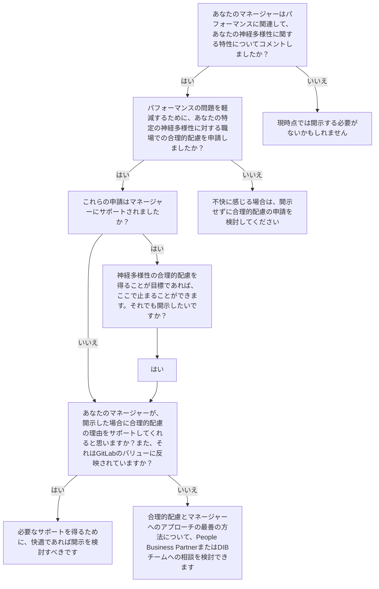

## サポート、合理的配慮＆リソース

このページでは、GitLabで神経多様性を持つチームメンバー、およびニューロインクルーシブな仕事を支援するすべての人に向けて、サポートの経路、合理的配慮のプロセス、リソースを提供します。

---

> **クイックリンク:**
>
> - [HelpLabを通じて合理的配慮を申請する](https://helplab.gitlab.systems/)
> - [グローバルアクセシビリティ＆合理的配慮ポリシー](/handbook/people-policies/#global-accessibility-and-accommodations-policy)
> - [障害＆神経多様性TMRGに参加する](/handbook/company/culture/inclusion/tmrg-tmag/erg-gitlab-diversability/)
> - [Modern Healthサポートにアクセスする](https://about.gitlab.com/benefits/)

---

## 職場での合理的配慮

私たちは、障害や神経多様性を持つ人々が単に参加するだけでなく、活躍し、リードし、仕事の未来を形作れる環境を作っています。障壁を除去しビロンギングを育むことへのコミットメントを通じて、アクセシビリティがすべてのことに組み込まれたインクルーシブな職場においてGitLabをリーダーとして確立しています。

**現在のチームメンバーへ:**
合理的配慮の申請方法、利用可能な配慮の種類、インタラクティブプロセスについては、[グローバルアクセシビリティ＆合理的配慮ポリシー](/handbook/people-policies/#global-accessibility-and-accommodations-policy)をご覧ください。

**候補者および応募者へ:**
GitLabの面接を受けており、採用プロセス中に合理的配慮が必要な場合は、[障害・神経多様性＆アクセシビリティページ](https://about.gitlab.com/jobs/accessibility/)をご覧ください。

---

## 神経多様性を持つ方向けリソース

- GitLabの従業員支援プログラム [Modern Health](/handbook/total-rewards/benefits/modern-health/) では、神経多様性を持つチームメンバーをサポートするリソースを提供しています：
  - **デジタルコンテンツ**: Modern Healthは、感覚的マインドフルネスのためのメディテーションや集中力のための戦略を提供するプログラムなど、役立つ[デジタルリソース](https://my.joinmodernhealth.com/resources)を提供しています。
  - **コーチング＆セラピー**: GitLabのチームメンバーは[コーチングおよびセラピーセッション](/handbook/total-rewards/benefits/modern-health/#understanding-your-options)を利用できます。Modern Healthには、神経多様性のスペクトラム全体にわたる人々と専門的に取り組むカウンセラーやセラピストがいます。メンバーはhelp@joinmodernhealth.comに連絡して、この種の専門性を持つ提供者を依頼することができます（具体的であるほど良い）。
- [競争上の優位性としての神経多様性](https://hbr.org/2017/05/neurodiversity-as-a-competitive-advantage)
- [職場でのADHD](https://www.webmd.com/add-adhd/adhd-in-the-workplace)
- [ADHDに関する豊富な情報、インタビュー、個人的な経験を扱うYouTubeチャンネル](https://www.youtube.com/c/HowtoADHD)
- [The Autistic Life リソースストア](https://www.theautistic.life/shop?Collection=Worksheets)
- Slackの[#neurodiversity](https://gitlab.slack.com/archives/CQRDJ0TLN)チャンネルに参加して、他のGitLabチームメンバーとのサポート＆コミュニティや、他者の経験について学びましょう
- Slackの[#bodydouble_friends](https://gitlab.slack.com/archives/C03EX45QPGB)チャンネルに参加して、["ボディダブリング"](https://www.healthyadhd.com/body-doubling-for-adhd/)バーチャル作業セッションを行う仲間を見つけましょう。これにより、他の人を「バーチャルアンカー」および説明責任のバディとして、プロジェクトやタスクを開始するサポートを受けることができます。このチャンネルを使って、[コラボレーション](/handbook/values/#collaboration)と[多様性・インクルージョン＆ビロンギング](/handbook/values/#diversity-inclusion)という私たちのバリューに沿った、別のGitLabチームメンバーとのボディダブルセッションをリクエストしましょう。
- Slackの[#neurodiverse-coffee-chat](https://gitlab.slack.com/archives/C01LPT0LGVC)チャンネルに参加して、神経多様性GitLabコミュニティの他のメンバーとコーヒーチャットのペアになりましょう

## マネージャー向けリソース

「神経多様性を持つ方向けリソース」のリンクはすべて有用で、さらに以下のリソースもマネージャーに利用可能です：

- [DIBマスタークラス：人事マネージャーが神経多様性チームメンバーをよりよくサポートするための準備](https://www.youtube.com/watch?v=l72XBuuvxSY) — [Dr. Samantha Hiew](https://samanthahiew.com/)による

## 開示するかどうか？

[DiverseabilityリソースーあなたのチームおよびGitLabへの障害の開示](/handbook/company/culture/inclusion/tmrg-tmag/erg-gitlab-diversability/#disclosing-your-disability-to-your-team-and-gitlab)

## チームメンバーおよびマネージャー以上向けリソース

- [Modern Health](/handbook/total-rewards/benefits/modern-health/) は、神経多様性コミュニティの人々をサポートするチームメンバーとマネージャーのためのコーチングセッションを提供しています。チームメンバーはModern Healthプラットフォームを通じてコーチングセッションをスケジュールできます。セッションのスケジューリングに関してご不明な点は、[HelpLab](https://helplab.gitlab.systems/esc?id=emp_taxonomy_topic&topic_id=b7d7b30d474c069067429ee0026d4382)にお問い合わせください。
- [人事管理の実践に神経多様性を組み込む方法](https://hrzone.com/how-to-embed-neurodiversity-into-your-people-management-practices/)
- [自閉症アドボカシーリソース](https://autisticadvocacy.org/resources/accessibility/)
- [認定神経多様性職場](https://ibcces.org/certified-neurodiverse-workplace/)
- [職場における神経多様性のメリットの理解](https://www.hays.com.au/blog/insights/understanding-the-benefits-of-neurodiversity-in-the-workplace)
- [雇用主向け神経多様性リソース](https://www.neurodiversityhub.org/resources-for-employers)
- [Neurodiver-city.org](https://www.neurodiver-city.org/)
- ADHDを外部から理解するための有用なビデオ：[ADHDとは何か？](https://www.youtube.com/watch?v=xMWtGozn5jU)および[なぜニューロタイピカルの基準に自分を当てはめるのか？](https://www.youtube.com/watch?v=IMeCxDQZeqY)
- [Specialisterneブログ](https://us.specialisterne.com/category/blog/)
- [ADHDに関する豊富な情報、インタビュー、個人的な経験を扱うYouTubeチャンネル](https://www.youtube.com/c/HowtoADHD)

## チームメンバープロファイル

すべてのチームメンバーをサポートし、開示しないことを選択した神経多様性を持つチームメンバーや未診断かもしれないチームメンバーが必要なサポートを確実に受けられるようにする方法として。すべてのチームメンバーには個別のニーズがあり、パーソナライゼーションを取り入れることで、全員が包括されていると感じられるようになります。

この[テンプレート](https://gitlab.com/gitlab-com/people-group/dib-diversity-inclusion-and-belonging/diversity-and-inclusion/-/blob/master/.gitlab/issue_templates/Team-Member-Profile.md)を使用して、コミュニケーション、作業、フィードバックスタイルのシンプルなチームメンバープロファイルを構築するのに役立ててください。

## 合理的配慮

私たちは、成功への人工的な障壁を取り除くために個人に[合理的配慮](/handbook/people-policies/inc-usa/#reasonable-accommodation)を提供します。私たちの[EAPプログラム](/handbook/total-rewards/benefits/modern-health/)も、チームメンバーが自分に最適な合理的配慮を特定するために常に利用可能です。

*以下に記載されている配慮はすべて、ケースバイケースで検討可能な潜在的な配慮ですが、保証されるものではありません。行われた配慮や調整は、対象の管轄区域の適用される法律・規制に沿っています。*

### パフォーマンス評価

フィードバックを受け取るための最善の方法についてチームメンバーとディスカッションを持つことが重要です。パフォーマンス基準は変更されませんが、マネージャーはアプローチを変える必要があるかもしれません。マネージャーとしての自分のコミュニケーションスタイルを振り返り、個人のニーズに最適な形に調整することが良い出発点となります。コミュニケーションに万能な方法はありませんが、以下にいくつかのアイデアを示します：

- より頻繁な1対1ミーティングの実施
- 消化しやすい視覚的に構造化された形式（表、色分け）でフィードバックを提供する
- あらゆる種類のフィードバックを直接的かつ明確にする

### コーチング

- 後で見直せる録画済みの指示

### 時間管理

- メンターの割り当て
- ToDoリストの提供
- 優先順位付けの支援
- 支援技術（タイマー、アプリ、カレンダーなど）

### さらなるアイデアのための参考資料

- [注意欠如・多動症（AD/HD）](https://askjan.org/disabilities/Attention-Deficit-Hyperactivity-Disorder-AD-HD.cfm)
