## インフラストラクチャ標準の概要

このハンドブックセクションでは、GitLab チームメンバー向けのインフラストラクチャおよびセキュリティ標準の最新イテレーションを定義します。これらは GitLab 組織のベースラインを提供し、特定のビジネスニーズを満たすためにこれらの標準を上書きする各インフラチームのインフラストラクチャレルムがあります。

以下の標準が含まれます:

- アクセスリクエスト
- AWS クラウドプロバイダー
  - アーキテクチャ図
  - 組織ポリシー
  - IAM とアクセスリクエスト
  - IT レルム
  - SaaS レルム
  - サンドボックスレルム
  - Project Horse レルム
- GCP クラウドプロバイダーアーキテクチャ
  - アーキテクチャ図
  - 組織ポリシー
  - IAM とアクセスリクエスト
  - IT レルム
  - SaaS レルム
  - サンドボックスレルム
- Infrastructure-as-Code
  - Terraform
  - Ansible
- [ラベルとタグ](/handbook/company/infrastructure-standards/labels-tags/)
- [ポリシー](/handbook/company/infrastructure-standards/policies/)
- セキュリティ標準
  - アプリケーションセキュリティ
  - インフラストラクチャセキュリティ
- [チュートリアル](/handbook/company/infrastructure-standards/tutorials/)

### 背景コンテキスト

これらの標準は、この [sandbox-cloud#3 予算とコスト配分](https://gitlab.com/gitlab-com/demo-systems/sandbox-cloud/sandbox-cloud-issue-tracking/-/issues/3) Issue と [infrastructure&257 非本番利用のためのクラウドリソースの提供](https://gitlab.com/groups/gitlab-com/gl-infra/-/epics/257) において部門横断的なコラボレーションによって作成されました。

これらの標準は新しいインフラストラクチャに適用されます。既存のリソースは、Infrastructure Security・IT・Reliability SRE からの指示がない限り、インフラストラクチャのイテレーション時にこれらの標準を採用できます。

## レルム

各レルムは、そのレルムを使用する部門やグループが他の部門やレルムに影響を与えることなく、インフラストラクチャの設定やセキュリティポリシーを必要に応じてカスタマイズできる柔軟性を提供するドメインまたは名前空間と考えることができます。

クラウドインフラストラクチャでは、「レルム」と呼ばれる各クラウドプロバイダーのトップレベル組織アカウント配下に AWS のトップレベル組織単位と GCP フォルダーを作成しています。

### どのレルムを使用すべきですか？

| レルム      | データ分類 | 管理者 | 使用ドキュメント | Slack チャンネル |
|------------|---------------------|----------------------|---------------------|---------------|
| `infra-shared-services`  | Red/Orange/Yellow/Green | `infra-realm-owners` | [レルムドキュメント](/handbook/company/infrastructure-standards/realms/infra-shared-services) | `#infra-realm-owners` |
| `it`       | Orange/Yellow/Green | [IT Engineering](/handbook/security/corporate/end-user-services/) | [レルムドキュメント](/handbook/company/infrastructure-standards/realms/it) | `#it_help` (`@it-eng` をタグ付け) |
| `saas`     | Red/Orange/Yellow/Green | [Reliability Engineering](/handbook/engineering/infrastructure/team/) | [レルムドキュメント](/handbook/company/infrastructure-standards/realms/saas) | `#infrastructure-lounge` |
| `sandbox`  | Green | セルフサービス（チームメンバー） | [サンドボックスクラウド](/handbook/company/infrastructure-standards/realms/sandbox) | `#sandbox-cloud-questions` |
| `security` | Orange/Yellow/Green | [Infrastructure Security](/handbook/security/product-security/infrastructure-security/) | [レルムドキュメント](/handbook/company/infrastructure-standards/realms/security) | `#security-infrasec` |

### インフラチームによる管理

**本番または本番に近いサービスをデプロイしようとしていますか？** すべてのエンジニアリングまたは製品関連の本番インフラストラクチャは、SRE オンコールカバレッジを持つエンジニアリングインフラストラクチャチームが管理する `saas` レルムにデプロイ・管理されるべきです。すべてのビジネス（非エンジニアリング）本番インフラストラクチャは、セキュリティチームが指定する GCP プロジェクトまたは AWS アカウントの `it` レルムにデプロイされるべきです。`saas` または `it` レルムで管理されない標準化されたセキュリティおよびロギングリソースはすべて `security` レルムにデプロイされるべきです。

**レルムを追加したいですか？** 独自のレルムを持たない部門は、`sandbox` または `it` レルムにグループ（チーム）向けのリソースを作成すべきです。新しいレルムの作成を正当化するのに十分なクラウドリソースと専任のインフラエンジニアチームメンバーがいる場合は、[新しいインフラストラクチャレルムを作成するための手順](/handbook/company/infrastructure-standards/tutorials/realms/create-realm)をご覧ください。

### セルフサービスインフラストラクチャ

GitLab チームメンバーのうち約 750 人が、開発・実験・テスト・**非本番**目的でクラウドインフラストラクチャを使用する部門にいます。これには Customer Success・エンジニアリング部門・Support などのチームメンバーが含まれます。**ドキュメントの目的上、これを *GitLab インフラストラクチャコミュニティ* と呼びます。**

GitLab インフラストラクチャコミュニティに属さないグループ（Finance・Marketing・Sales など）については、インフラストラクチャのニーズについて `#it_help` にお問い合わせください。

GitLab チームメンバーがプロビジョニングするエフェメラル（サンドボックス）インフラストラクチャの作成と管理方法を標準化しました。

**過度に単純化したユーザーストーリーは「GCP または AWS で VM やクラスターを立ち上げて何か（何でも、GitLab 製品固有でなくても）試みる必要があります。会社のインフラストラクチャ標準は何ですか？」というものです。**

サンドボックスクラウドは、エフェメラルなサンドボックスおよびテストのユースケースに必要な各 GitLab チームメンバー向けに AWS アカウントまたは GCP プロジェクトのプロビジョニングを自動化するカスタムビルドのウェブアプリケーションです。

目標は、コスト配分に必要なタグ付け・ベストプラクティスのセキュリティ設定を含む技術的なチームメンバー向けの摩擦のないアプローチを作成し、AWS または GCP ウェブコンソールを使用して必要なリソースを作成するか、各ユーザーアカウントの Terraform 設定ファイルにコピーできるドキュメントと使用例を含む Terraform モジュールの共有ライブラリを使用する能力を提供することです。Okta でサインインすると、Workday と統合された Okta メタデータを使用して部門とエンティティをコスト報告に決定し、作成するリソースのタグ付けポリシーの自動作成に使用します。

詳細は[サンドボックスレルム ハンドブックページ](/handbook/company/infrastructure-standards/realms/sandbox)をご覧ください。

#### 個人環境

**サンドボックスまたはテスト用の AWS アカウントまたは GCP プロジェクトをお探しですか？** オーナー権限と GitLab マスターアカウントによる集中管理された請求が付与された、プライベートな AWS アカウントまたは GCP プロジェクトへのアクセスを提供する [GitLab サンドボックスクラウド](/handbook/company/infrastructure-standards/realms/sandbox/#individual-aws-account-or-gcp-project)を使用してください。

#### グループ環境

**チームと共有する実験的またはテスト用リソースをデプロイするための AWS アカウントまたは GCP プロジェクトをお探しですか？** サンドボックスクラウドを使用してグループ AWS アカウントまたは GCP プロジェクトをリクエストできます。[手順については ハンドブックページ](/handbook/company/infrastructure-standards/realms/sandbox/#collaborative-aws-account-or-gcp-project-non-production)をご覧ください。

#### サンドボックスおよびテストインフラストラクチャの定義

- **実際の顧客またはチームメンバーのデータ/情報や RED/ORANGE データを含まない**、あなたまたはチームが管理するインフラストラクチャ。つまり、テスト用のダミーデータを使用した実際のインフラストラクチャです。
- 内部でのみ使用され（スクリプト・テストアプリ・ツールなど）、サービスが一時的に利用できなくてもビジネス継続性に影響しないインフラストラクチャ。
- 外部からアクセス可能だが実際の顧客データ/情報/知的財産や RED/ORANGE データを含まないエフェメラルなインフラストラクチャ。これには、（ダミーデータを使用した）顧客問題の共同再現・デモ・概念実証・トレーニング・ワークショップなどが含まれます。
- グローバルなインフラストラクチャサポートカバレッジを持たないインフラストラクチャ（例: SRE チームによって管理されているか？）。
- インフラストラクチャに機密情報が含まれていないことを確認するために、[データ分類ポリシー](/handbook/security/policies_and_standards/data-classification-standard/)と[データ分類インデックス](https://internal.gitlab.com/handbook/security/data_classification/)を確認してください。インフラストラクチャがグレーゾーンにある場合は、[セキュリティチーム](/handbook/security/)にレビューを依頼することがベストプラクティスです。

近い将来、より多くのインフラストラクチャレルムに対して[レディネスレビュー](/handbook/engineering/infrastructure-platforms/production/readiness.md)を導入する予定です。

### レルムオーナー {#realm-owners}

各レルムには、そのレルムのすべてのインフラストラクチャアーキテクチャ・請求・リソースプロビジョニング・セキュリティポリシーを担当する [DRI](/handbook/people-group/directly-responsible-individuals/) またはステーブルカウンターパートであるシステムオーナーとなるチームメンバーが 1 人以上います。

各レルムの DRI またはカウンターパートは、セキュリティインシデントへの対応やレルム内のグループオーナーおよびカウンターパートのサポートを含む、レルムの日常管理に必要なすべての操作を実行できるエンジニアリングマネージャーまたは経験豊富なインフラエンジニアです。

私たちのインフラストラクチャ標準は、明確に定義されたベースラインを提供しながら、レルムオーナーがレルム内で必要に応じてカスタマイズするためのガイドラインを提供するように設計されています。

インフラストラクチャレルムオーナーのリストは [Google グループ](https://groups.google.com/a/gitlab.com/g/infra-realm-owners/members)（社内）でご覧いただけます。

## GCP アーキテクチャ図

```mermaid
graph LR;

    subgraph gcp["Google Cloud Platform"]

        subgraph gcp-realms["<br />GitLab Realms<br />(Folders)"]
            gcp-realm-saas[/saas<br />GitLab SaaS/]
            gcp-realm-eng-dev[/eng-dev<br />Engineering Development/]
            gcp-realm-eng-infra[/eng-infra<br />Engineering Infrastructure/]
            gcp-realm-eng-security[/eng-security<br />Engineering Security/]
            gcp-realm-eng-support[/eng-support<br />Engineering Support/]
            gcp-realm-sales-cs[/sales-cs<br />Customer Success/]
            gcp-realm-business-tech[/business-tech<br />Business Technology/]
            gcp-realm-sandbox[/sandbox<br />Compute Sandbox/]
        end

        subgraph gcp-saas-accounts["eng-saas Realm GCP Projects"]
            gcp-saas-account-ops["saas-ops"]
            gcp-saas-account-stg["saas-stg"]
            gcp-saas-account-prd["saas-prd"]
        end

        subgraph gcp-business-tech["business-tech Realm GCP Projects"]
            gcp-ga-accounting-x["ga-accounting-x"]
            gcp-ga-business-tech-x["ga-business-tech-x"]
            gcp-ga-ceo-x["ga-ceo-x"]
            gcp-ga-finance-x["ga-finance-x"]
            gcp-ga-legal-x["ga-legal-x"]
            gcp-ga-people-x["ga-people-x"]
            gcp-ga-talent-acquisition-x["ga-talent-acquisition-x"]
            gcp-mktg-x["mktg-x"]
            gcp-sales-alliances-x["sales-alliances-x"]
            gcp-sales-commercial-x["sales-commercial-x"]
            gcp-sales-ent-x["sales-ent-x"]
            gcp-sales-field-ops-x["sales-field-ops-x"]
            gcp-sales-practice-mgmt-x["sales-practice-mgmt-x"]
        end

        subgraph gcp-eng-dev-accounts["eng-dev Realm GCP Projects"]
            gcp-eng-dev-manage-x["eng-dev-manage-x"]
            gcp-eng-dev-plan-x["eng-dev-plan-x"]
            gcp-eng-dev-create-x["eng-dev-create-x"]
            gcp-eng-dev-verify-x["eng-dev-verify-x"]
            gcp-eng-dev-package-x["eng-dev-package-x"]
            gcp-eng-dev-release-x["eng-dev-release-x"]
            gcp-eng-dev-configure-x["eng-dev-configure-x"]
            gcp-eng-dev-monitor-x["eng-dev-monitor-x"]
            gcp-eng-dev-secure-x["eng-dev-secure-x"]
            gcp-eng-dev-govern-x["eng-dev-govern-x"]
            gcp-eng-dev-growth-x["eng-dev-growth-x"]
            gcp-eng-dev-enablement-x["eng-dev-enablement-x"]
            gcp-eng-quality-x["eng-quality-x"]
            gcp-eng-ux-x["eng-ux-x"]
            gcp-product-x["product-x"]
        end

        subgraph gcp-eng-infra-accounts["eng-infra Realm GCP Projects"]
            gcp-eng-infra-x["eng-infra-x"]
        end

        subgraph gcp-eng-security-accounts["eng-security Realm GCP Projects"]
            gcp-eng-security-x["eng-security-x"]
        end

        subgraph gcp-eng-support-accounts["eng-support Realm GCP Projects"]
            gcp-eng-support-x["eng-support-x"]
        end

        subgraph gcp-sales-cs-accounts["sales-cs Realm GCP Projects"]
            gcp-sales-cs-demo-cloud-x["sales-cs-demo-cloud-x"]
            gcp-sales-cs-training-cloud-x["sales-cs-training-cloud-x"]
            gcp-sales-cs-sa-x["sales-cs-sa-x"]
            gcp-sales-cs-tam-x["sales-cs-tam-x"]
            gcp-sales-cs-ps-x["sales-cs-ps-x"]
        end

        subgraph gcp-sandbox-departments-folders["sandbox Realm GCP Folders <br />(GitLab Departments)"]
            gcp-sandbox-dept-eng-support[/"eng-support"/]
            gcp-sandbox-dept-eng-dev[/"eng-dev"/]
            gcp-sandbox-dept-eng-infra[/"eng-infra"/]
            gcp-sandbox-dept-eng-quality[/"eng-quality"/]
            gcp-sandbox-dept-eng-security[/"eng-security"/]
            gcp-sandbox-dept-eng-ux[/"eng-ux"/]
            gcp-sandbox-dept-ga-accounting[/"ga-accounting"/]
            gcp-sandbox-dept-ga-business-tech[/"ga-business-tech"/]
            gcp-sandbox-dept-ga-ceo[/"ga-ceo"/]
            gcp-sandbox-dept-ga-finance[/"ga-finance"/]
            gcp-sandbox-dept-ga-legal[/"ga-legal"/]
            gcp-sandbox-dept-ga-people[/"ga-people"/]
            gcp-sandbox-dept-ga-talent-acquisition[/"ga-talent-acquisition"/]
            gcp-sandbox-dept-mktg-awareness[/"mktg-awareness"/]
            gcp-sandbox-dept-mktg-brand-design[/"mktg-brand-design"/]
            gcp-sandbox-dept-mktg-campaigns[/"mktg-campaigns"/]
            gcp-sandbox-dept-mktg-communications[/"mktg-communications"/]
            gcp-sandbox-dept-mktg-community[/"mktg-community"/]
            gcp-sandbox-dept-mktg-content[/"mktg-content"/]
            gcp-sandbox-dept-mktg-digital[/"mktg-digital"/]
            gcp-sandbox-dept-mktg-field[/"mktg-field"/]
            gcp-sandbox-dept-mktg-inbound[/"mktg-inbound"/]
            gcp-sandbox-dept-mktg-ops[/"mktg-ops"/]
            gcp-sandbox-dept-mktg-events[/"mktg-events"/]
            gcp-sandbox-dept-mktg-partner[/"mktg-partner"/]
            gcp-sandbox-dept-mktg-sales-dev[/"mktg-sales-dev"/]
            gcp-sandbox-dept-mktg-strategic[/"mktg-strategic"/]
            gcp-sandbox-dept-product[/"product"/]
            gcp-sandbox-dept-sales-alliances[/"sales-alliances"/]
            gcp-sandbox-dept-sales-channel[/"sales-channel"/]
            gcp-sandbox-dept-sales-commercial[/"sales-commercial"/]
            gcp-sandbox-dept-sales-cs[/"sales-cs"/]
            gcp-sandbox-dept-sales-ent[/"sales-ent"/]
            gcp-sandbox-dept-sales-field-ops[/"sales-field-ops"/]
            gcp-sandbox-dept-sales-practice-mgmt[/"sales-practice-mgmt"/]
        end

        subgraph gcp-sandbox-departments-accounts["sandbox eng-support GCP Projects"]
            gcp-sandbox-dept-eng-support-account-amulvaney["amulvaney-a1b2c3d4"]
            gcp-sandbox-dept-eng-support-account-asmith["asmith-b2c3d4e5"]
            gcp-sandbox-dept-eng-support-account-hramachandran["hramachandran-c3d4e5f6"]
            gcp-sandbox-dept-eng-support-account-jyoung["jyoung-d4e5f6g7"]
        end

    end

    gcp-realm-saas-->gcp-saas-account-ops;
    gcp-realm-saas-->gcp-saas-account-stg;
    gcp-realm-saas-->gcp-saas-account-prd;

    gcp-realm-business-tech-->gcp-ga-accounting-x;
    gcp-realm-business-tech-->gcp-ga-business-tech-x;
    gcp-realm-business-tech-->gcp-ga-ceo-x;
    gcp-realm-business-tech-->gcp-ga-finance-x;
    gcp-realm-business-tech-->gcp-ga-legal-x;
    gcp-realm-business-tech-->gcp-ga-people-x;
    gcp-realm-business-tech-->gcp-ga-recruiting-x;
    gcp-realm-business-tech-->gcp-mktg-x;
    gcp-realm-business-tech-->gcp-sales-alliances-x;
    gcp-realm-business-tech-->gcp-sales-commercial-x;
    gcp-realm-business-tech-->gcp-sales-ent-x;
    gcp-realm-business-tech-->gcp-sales-field-ops-x;
    gcp-realm-business-tech-->gcp-sales-practice-mgmt-x;

    gcp-realm-eng-dev-->gcp-eng-dev-manage-x;
    gcp-realm-eng-dev-->gcp-eng-dev-plan-x;
    gcp-realm-eng-dev-->gcp-eng-dev-create-x;
    gcp-realm-eng-dev-->gcp-eng-dev-verify-x;
    gcp-realm-eng-dev-->gcp-eng-dev-package-x;
    gcp-realm-eng-dev-->gcp-eng-dev-release-x;
    gcp-realm-eng-dev-->gcp-eng-dev-configure-x;
    gcp-realm-eng-dev-->gcp-eng-dev-monitor-x;
    gcp-realm-eng-dev-->gcp-eng-dev-secure-x;
    gcp-realm-eng-dev-->gcp-eng-dev-govern-x;
    gcp-realm-eng-dev-->gcp-eng-dev-growth-x;
    gcp-realm-eng-dev-->gcp-eng-dev-enablement-x;
    gcp-realm-eng-dev-->gcp-eng-quality-x;
    gcp-realm-eng-dev-->gcp-eng-ux-x;
    gcp-realm-eng-dev-->gcp-product-x;

    gcp-realm-eng-infra-->gcp-eng-infra-x;

    gcp-realm-eng-security-->gcp-eng-security-x;

    gcp-realm-eng-support-->gcp-eng-support-x;

    gcp-realm-sales-cs-->gcp-sales-cs-demo-cloud-x;
    gcp-realm-sales-cs-->gcp-sales-cs-training-cloud-x;
    gcp-realm-sales-cs-->gcp-sales-cs-sa-x;
    gcp-realm-sales-cs-->gcp-sales-cs-tam-x;
    gcp-realm-sales-cs-->gcp-sales-cs-ps-x;

    gcp-realm-sandbox-->gcp-sandbox-dept-eng-support;
    gcp-realm-sandbox-->gcp-sandbox-dept-eng-dev;
    gcp-realm-sandbox-->gcp-sandbox-dept-eng-infra;
    gcp-realm-sandbox-->gcp-sandbox-dept-eng-quality;
    gcp-realm-sandbox-->gcp-sandbox-dept-eng-security;
    gcp-realm-sandbox-->gcp-sandbox-dept-eng-ux;
    gcp-realm-sandbox-->gcp-sandbox-dept-ga-accounting;
    gcp-realm-sandbox-->gcp-sandbox-dept-ga-business-tech;
    gcp-realm-sandbox-->gcp-sandbox-dept-ga-ceo;
    gcp-realm-sandbox-->gcp-sandbox-dept-ga-finance;
    gcp-realm-sandbox-->gcp-sandbox-dept-ga-legal;
    gcp-realm-sandbox-->gcp-sandbox-dept-ga-people;
    gcp-realm-sandbox-->gcp-sandbox-dept-ga-talent-acquisition;
    gcp-realm-sandbox-->gcp-sandbox-dept-mktg-awareness;
    gcp-realm-sandbox-->gcp-sandbox-dept-mktg-brand-design;
    gcp-realm-sandbox-->gcp-sandbox-dept-mktg-campaigns;
    gcp-realm-sandbox-->gcp-sandbox-dept-mktg-communications;
    gcp-realm-sandbox-->gcp-sandbox-dept-mktg-community;
    gcp-realm-sandbox-->gcp-sandbox-dept-mktg-content;
    gcp-realm-sandbox-->gcp-sandbox-dept-mktg-digital;
    gcp-realm-sandbox-->gcp-sandbox-dept-mktg-field;
    gcp-realm-sandbox-->gcp-sandbox-dept-mktg-inbound;
    gcp-realm-sandbox-->gcp-sandbox-dept-mktg-ops;
    gcp-realm-sandbox-->gcp-sandbox-dept-mktg-events;
    gcp-realm-sandbox-->gcp-sandbox-dept-mktg-partner;
    gcp-realm-sandbox-->gcp-sandbox-dept-mktg-sales-dev;
    gcp-realm-sandbox-->gcp-sandbox-dept-mktg-strategic;
    gcp-realm-sandbox-->gcp-sandbox-dept-product;
    gcp-realm-sandbox-->gcp-sandbox-dept-sales-alliances;
    gcp-realm-sandbox-->gcp-sandbox-dept-sales-channel;
    gcp-realm-sandbox-->gcp-sandbox-dept-sales-commercial;
    gcp-realm-sandbox-->gcp-sandbox-dept-sales-cs;
    gcp-realm-sandbox-->gcp-sandbox-dept-sales-ent;
    gcp-realm-sandbox-->gcp-sandbox-dept-sales-field-ops;
    gcp-realm-sandbox-->gcp-sandbox-dept-sales-practice-mgmt;

    gcp-sandbox-dept-eng-support-->gcp-sandbox-dept-eng-support-account-amulvaney;
    gcp-sandbox-dept-eng-support-->gcp-sandbox-dept-eng-support-account-asmith;
    gcp-sandbox-dept-eng-support-->gcp-sandbox-dept-eng-support-account-hramachandran;
    gcp-sandbox-dept-eng-support-->gcp-sandbox-dept-eng-support-account-jyoung;

```

### AWS アーキテクチャ図

AWS アーキテクチャは現在設計中です。暫定的に、GitLab Issue を作成して `jeffersonmartin`・`dawsmith`・`jurbanc` をタグ付けしてサポートを依頼してください。
