## インフラストラクチャ標準の概要

このハンドブックセクションでは、GitLab チームメンバー向けのインフラストラクチャとセキュリティ標準の最新イテレーションを定義します。これらは GitLab 組織のためのベースラインを提供するもので、各インフラストラクチャチーム向けに、特定のビジネスニーズに合わせてこれらの標準を上書きする Infrastructure Realm があります。

カバーされる標準は以下のとおりです:

- Access Requests
- AWS クラウドプロバイダー
  - アーキテクチャ図
  - 組織ポリシー
  - IAM とアクセスリクエスト
  - IT Realm
  - SaaS Realm
  - Sandbox Realm
  - Project Horse Realm
- GCP クラウドプロバイダーアーキテクチャ
  - アーキテクチャ図
  - 組織ポリシー
  - IAM とアクセスリクエスト
  - IT Realm
  - SaaS Realm
  - Sandbox Realm
- Infrastructure-as-Code
  - Terraform
  - Ansible
- [Labels and Tags](/handbook/company/infrastructure-standards/labels-tags/)
- [Policies](/handbook/company/infrastructure-standards/policies/)
- セキュリティ標準
  - アプリケーションセキュリティ
  - インフラストラクチャセキュリティ
- [チュートリアル](/handbook/company/infrastructure-standards/tutorials/)

### 背景

これらの標準は、[sandbox-cloud#3 Budget and Cost Allocation](https://gitlab.com/gitlab-com/demo-systems/sandbox-cloud/sandbox-cloud-issue-tracking/-/issues/3) Issue と [infrastructure&257 Provide cloud resources for non-production usage](https://gitlab.com/groups/gitlab-com/gl-infra/-/epics/257) における部門横断的なコラボレーションによって作成されました。

これらの標準は新しいインフラストラクチャに適用されます。既存のリソースは、Infrastructure Security、IT、Reliability SRE によるアドバイスがない限り、インフラストラクチャがイテレーションされるにつれてこれらの標準を採用できます。

## Realm

各 realm は、その realm を使用する部門やグループが、他の部門や realm に影響を与えずに、必要に応じてインフラストラクチャ構成やセキュリティポリシーをカスタマイズできる柔軟性を提供する、ドメインまたはネームスペースのようなものと考えることができます。

クラウドインフラストラクチャについては、それぞれのクラウドプロバイダーのトップレベル組織アカウントの下に、トップレベルの AWS Organizational Unit と GCP フォルダを作成しており、これらを「realm」と呼んでいます。

### どの realm を使うべきか?

| Realm      | データ分類 | リソース管理者 | 使用ドキュメント | Slack チャンネル |
|------------|---------------------|----------------------|---------------------|---------------|
| `infra-shared-services`  | Red/Orange/Yellow/Green | `infra-realm-owners` | [Realm ドキュメント](/handbook/company/infrastructure-standards/realms/infra-shared-services) | `#infra-realm-owners` |
| `it`       | Orange/Yellow/Green | [IT Engineering](/handbook/security/corporate/end-user-services/) | [Realm ドキュメント](/handbook/company/infrastructure-standards/realms/it) | `Compass`（`@it-eng` をタグ） |
| `saas`     | Red/Orange/Yellow/Green | [Reliability Engineering](/handbook/engineering/infrastructure-platforms/) | [Realm ドキュメント](/handbook/company/infrastructure-standards/realms/saas) | `#infrastructure_platforms` |
| `sandbox`  | Green | セルフサービス（チームメンバー） | [Sandbox Cloud](/handbook/company/infrastructure-standards/realms/sandbox) | `#sandbox-cloud-questions` |
| `security` | Orange/Yellow/Green | [Infrastructure Security](/handbook/security/product-security/infrastructure-security/) | [Realm ドキュメント](/handbook/company/infrastructure-standards/realms/security) | `#security-infrasec` |

### インフラストラクチャチームによる管理

**本番または本番相当のサービスをデプロイする予定ですか?** すべてのエンジニアリングまたはプロダクト関連の本番インフラストラクチャは、SRE オンコールカバレッジを伴う Engineering Infrastructure チームが管理する `saas` realm にデプロイ・管理する必要があります。すべてのビジネス（非エンジニアリング）本番インフラストラクチャは、セキュリティチームによって指定された GCP プロジェクトまたは AWS アカウントの `it` realm にデプロイする必要があります。`saas` または `it` realm で管理されないすべての標準化されたセキュリティおよびロギングリソースは、`security` realm にデプロイする必要があります。

**realm を追加したい?** 自身の realm を持たない部門は、`sandbox` または `it` realm にグループ（チーム）用のリソースを作成する必要があります。新しい realm の作成を正当化できるだけの十分なクラウドリソースと専属のインフラストラクチャエンジニアチームメンバーがいる場合は、[新しいインフラストラクチャ realm を作成する手順](/handbook/company/infrastructure-standards/tutorials/realms/create-realm) を参照してください。

### セルフサービスインフラストラクチャ

GitLab のチームメンバーのおよそ 750 人が、開発、実験、テスト、または **非本番** 目的でクラウドインフラストラクチャを使用する部門に所属しています。これには Customer Success、Engineering ディビジョンの部門、Support などのチームメンバーが含まれます。**ドキュメント上はこれを *GitLab インフラストラクチャコミュニティ* と呼びます。**

GitLab インフラストラクチャコミュニティに属さないグループ（例: Finance、Marketing、Sales など）の方は、インフラストラクチャに関するニーズについて、Slack の Compass アプリ（上部の検索バーに「Compass」と入力して見つけます）または it-help@gitlab.com 経由で IT にお問い合わせください。

私たちは、GitLab チームメンバーがプロビジョニングするエフェメラル（sandbox）インフラストラクチャの作成と管理方法を標準化しました。

**過度に単純化したユーザーストーリーは「何か（GitLab プロダクト固有でない可能性もある）を試したいので、GCP または AWS で VM またはクラスタをスピンアップする必要があります。これを行うための会社のインフラストラクチャ標準は何ですか?」というものです。**

Sandbox Cloud は、エフェメラルな sandbox やテストのユースケースのために必要な GitLab チームメンバーごとに、AWS アカウントまたは GCP プロジェクトのプロビジョニングを自動化するカスタムビルドの Web アプリケーションです。

目標は、技術系チームメンバーにとって、コスト配分のためのタグ付け、ベストプラクティスのセキュリティ設定を含み、AWS や GCP の Web コンソールを使うか、ドキュメントと使用例を含む共有 Terraform モジュールのライブラリを使って各ユーザーアカウントの Terraform 設定ファイルにコピーすることで、必要なあらゆるリソースを作成できる能力を提供する、摩擦のないアプローチを作ることです。OKTA でサインインすると、Workday と統合された OKTA メタデータを使って部門とエンティティを特定し、これをコスト報告に使用するとともに、作成したリソースのタグ付けポリシーの自動作成にも使用します。

詳しくは [sandbox realm ハンドブックページ](/handbook/company/infrastructure-standards/realms/sandbox) をご覧ください。

#### 個別環境

**sandbox またはテスト用の AWS アカウントや GCP プロジェクトを探していますか?** [GitLab Sandbox Cloud](/handbook/company/infrastructure-standards/realms/sandbox/#individual-aws-account-or-gcp-project) を使用してください。これにより、オーナー権限を付与する自分専用のプライベート AWS アカウントまたは GCP プロジェクトにアクセスでき、GitLab マスターアカウントで一元管理された請求になっています。

#### グループ環境

**チームと共有する実験用またはテスト用のリソースをデプロイするための AWS アカウントまたは GCP プロジェクトを探していますか?** Sandbox Cloud を使用して Group AWS アカウントまたは GCP プロジェクトをリクエストできます。詳細は [手順を記載したハンドブックページ](/handbook/company/infrastructure-standards/realms/sandbox/#collaborative-aws-account-or-gcp-project-non-production) を参照してください。

#### Sandbox およびテストインフラストラクチャの定義

- あなたまたはあなたのチームが管理する、**実際の顧客またはチームメンバーのデータ/情報、または RED/ORANGE データを含まない**インフラストラクチャ。言い換えれば、テスト用の偽データを使う実際のインフラストラクチャ。
- 内部のみで使用される（スクリプト、テストアプリ、ツールなど）インフラストラクチャで、サービスが一時的に利用不能になってもビジネス継続性に影響を与えないもの。
- エフェメラルな性質を持ち、外部から利用可能ながら、実際の顧客データ/情報/知的財産または RED/ORANGE データを含まないインフラストラクチャ。これには、顧客の問題の協力的な再現（偽データを使用）、デモ、概念実証、トレーニング、ワークショップなどが分類上含まれます。
- グローバルなインフラストラクチャサポートカバレッジを持たないインフラストラクチャ（例: SRE チームによって管理されているか?）。
- インフラストラクチャに機密情報が含まれないことを保証するため、[データ分類ポリシー](/handbook/security/policies_and_standards/data-classification-standard/) と [Data Classification Index](https://internal.gitlab.com/handbook/security/data_classification/) を必ず確認してください。インフラストラクチャがグレーな領域にある場合は、[セキュリティチーム](/handbook/security/) にレビューを依頼するのがベストプラクティスです。

近い将来、より多くのインフラストラクチャ realm 向けに [readiness review](/handbook/engineering/infrastructure-platforms/production/readiness.md) を導入する予定です。

### Realm オーナー

各 realm には、すべてのインフラストラクチャアーキテクチャ、請求、リソースプロビジョニング、セキュリティポリシーを担当する [DRI](/handbook/people-group/directly-responsible-individuals/) または安定したカウンターパートとしてのシステムオーナーが 1 名以上います。

各 realm DRI またはカウンターパートは、realm の日常管理（セキュリティインシデントへの対応、その realm のグループオーナーやカウンターパートのサポートを含む）に必要なすべてのアクションを実行できるエンジニアリングマネージャーまたは経験豊富なインフラストラクチャエンジニアです。

私たちのインフラストラクチャ標準は、realm 内で必要に応じて realm オーナーがカスタマイズできるガイドラインを持つ、明確に定義されたベースラインを提供するように設計されています。

インフラストラクチャ realm オーナーのリストは [Google Group](https://groups.google.com/a/gitlab.com/g/infra-realm-owners/members)（内部）で確認できます。

## GCP アーキテクチャ図

```mermaid
graph LR;

    subgraph gcp["Google Cloud Platform"]

        subgraph gcp-realms["<br />GitLab Realms<br />(Folders)"]
            gcp-realm-saas[/saas<br />GitLab SaaS/]
            gcp-realm-eng-dev[/eng-dev<br />Engineering Development/]
            gcp-realm-eng-infra[/eng-infra<br />Engineering Infrastructure/]
            gcp-realm-eng-security[/eng-security<br />Engineering Security/]
            gcp-realm-eng-support[/eng-support<br />Engineering Support/]
            gcp-realm-sales-cs[/sales-cs<br />Customer Success/]
            gcp-realm-business-tech[/business-tech<br />Business Technology/]
            gcp-realm-sandbox[/sandbox<br />Compute Sandbox/]
        end

        subgraph gcp-saas-accounts["eng-saas Realm GCP Projects"]
            gcp-saas-account-ops["saas-ops"]
            gcp-saas-account-stg["saas-stg"]
            gcp-saas-account-prd["saas-prd"]
        end

        subgraph gcp-business-tech["business-tech Realm GCP Projects"]
            gcp-ga-accounting-x["ga-accounting-x"]
            gcp-ga-business-tech-x["ga-business-tech-x"]
            gcp-ga-ceo-x["ga-ceo-x"]
            gcp-ga-finance-x["ga-finance-x"]
            gcp-ga-legal-x["ga-legal-x"]
            gcp-ga-people-x["ga-people-x"]
            gcp-ga-talent-acquisition-x["ga-talent-acquisition-x"]
            gcp-mktg-x["mktg-x"]
            gcp-sales-alliances-x["sales-alliances-x"]
            gcp-sales-commercial-x["sales-commercial-x"]
            gcp-sales-ent-x["sales-ent-x"]
            gcp-sales-field-ops-x["sales-field-ops-x"]
            gcp-sales-practice-mgmt-x["sales-practice-mgmt-x"]
        end

        subgraph gcp-eng-dev-accounts["eng-dev Realm GCP Projects"]
            gcp-eng-dev-manage-x["eng-dev-manage-x"]
            gcp-eng-dev-plan-x["eng-dev-plan-x"]
            gcp-eng-dev-create-x["eng-dev-create-x"]
            gcp-eng-dev-verify-x["eng-dev-verify-x"]
            gcp-eng-dev-package-x["eng-dev-package-x"]
            gcp-eng-dev-release-x["eng-dev-release-x"]
            gcp-eng-dev-configure-x["eng-dev-configure-x"]
            gcp-eng-dev-monitor-x["eng-dev-monitor-x"]
            gcp-eng-dev-secure-x["eng-dev-secure-x"]
            gcp-eng-dev-govern-x["eng-dev-govern-x"]
            gcp-eng-dev-growth-x["eng-dev-growth-x"]
            gcp-eng-dev-enablement-x["eng-dev-enablement-x"]
            gcp-eng-quality-x["eng-quality-x"]
            gcp-eng-ux-x["eng-ux-x"]
            gcp-product-x["product-x"]
        end

        subgraph gcp-eng-infra-accounts["eng-infra Realm GCP Projects"]
            gcp-eng-infra-x["eng-infra-x"]
        end

        subgraph gcp-eng-security-accounts["eng-security Realm GCP Projects"]
            gcp-eng-security-x["eng-security-x"]
        end

        subgraph gcp-eng-support-accounts["eng-support Realm GCP Projects"]
            gcp-eng-support-x["eng-support-x"]
        end

        subgraph gcp-sales-cs-accounts["sales-cs Realm GCP Projects"]
            gcp-sales-cs-demo-cloud-x["sales-cs-demo-cloud-x"]
            gcp-sales-cs-training-cloud-x["sales-cs-training-cloud-x"]
            gcp-sales-cs-sa-x["sales-cs-sa-x"]
            gcp-sales-cs-tam-x["sales-cs-tam-x"]
            gcp-sales-cs-ps-x["sales-cs-ps-x"]
        end

        subgraph gcp-sandbox-departments-folders["sandbox Realm GCP Folders <br />(GitLab Departments)"]
            gcp-sandbox-dept-eng-support[/"eng-support"/]
            gcp-sandbox-dept-eng-dev[/"eng-dev"/]
            gcp-sandbox-dept-eng-infra[/"eng-infra"/]
            gcp-sandbox-dept-eng-quality[/"eng-quality"/]
            gcp-sandbox-dept-eng-security[/"eng-security"/]
            gcp-sandbox-dept-eng-ux[/"eng-ux"/]
            gcp-sandbox-dept-ga-accounting[/"ga-accounting"/]
            gcp-sandbox-dept-ga-business-tech[/"ga-business-tech"/]
            gcp-sandbox-dept-ga-ceo[/"ga-ceo"/]
            gcp-sandbox-dept-ga-finance[/"ga-finance"/]
            gcp-sandbox-dept-ga-legal[/"ga-legal"/]
            gcp-sandbox-dept-ga-people[/"ga-people"/]
            gcp-sandbox-dept-ga-talent-acquisition[/"ga-talent-acquisition"/]
            gcp-sandbox-dept-mktg-awareness[/"mktg-awareness"/]
            gcp-sandbox-dept-mktg-brand-design[/"mktg-brand-design"/]
            gcp-sandbox-dept-mktg-campaigns[/"mktg-campaigns"/]
            gcp-sandbox-dept-mktg-communications[/"mktg-communications"/]
            gcp-sandbox-dept-mktg-community[/"mktg-community"/]
            gcp-sandbox-dept-mktg-content[/"mktg-content"/]
            gcp-sandbox-dept-mktg-digital[/"mktg-digital"/]
            gcp-sandbox-dept-mktg-field[/"mktg-field"/]
            gcp-sandbox-dept-mktg-inbound[/"mktg-inbound"/]
            gcp-sandbox-dept-mktg-ops[/"mktg-ops"/]
            gcp-sandbox-dept-mktg-events[/"mktg-events"/]
            gcp-sandbox-dept-mktg-partner[/"mktg-partner"/]
            gcp-sandbox-dept-mktg-sales-dev[/"mktg-sales-dev"/]
            gcp-sandbox-dept-mktg-strategic[/"mktg-strategic"/]
            gcp-sandbox-dept-product[/"product"/]
            gcp-sandbox-dept-sales-alliances[/"sales-alliances"/]
            gcp-sandbox-dept-sales-channel[/"sales-channel"/]
            gcp-sandbox-dept-sales-commercial[/"sales-commercial"/]
            gcp-sandbox-dept-sales-cs[/"sales-cs"/]
            gcp-sandbox-dept-sales-ent[/"sales-ent"/]
            gcp-sandbox-dept-sales-field-ops[/"sales-field-ops"/]
            gcp-sandbox-dept-sales-practice-mgmt[/"sales-practice-mgmt"/]
        end

        subgraph gcp-sandbox-departments-accounts["sandbox eng-support GCP Projects"]
            gcp-sandbox-dept-eng-support-account-amulvaney["amulvaney-a1b2c3d4"]
            gcp-sandbox-dept-eng-support-account-asmith["asmith-b2c3d4e5"]
            gcp-sandbox-dept-eng-support-account-hramachandran["hramachandran-c3d4e5f6"]
            gcp-sandbox-dept-eng-support-account-jyoung["jyoung-d4e5f6g7"]
        end

    end

    gcp-realm-saas-->gcp-saas-account-ops;
    gcp-realm-saas-->gcp-saas-account-stg;
    gcp-realm-saas-->gcp-saas-account-prd;

    gcp-realm-business-tech-->gcp-ga-accounting-x;
    gcp-realm-business-tech-->gcp-ga-business-tech-x;
    gcp-realm-business-tech-->gcp-ga-ceo-x;
    gcp-realm-business-tech-->gcp-ga-finance-x;
    gcp-realm-business-tech-->gcp-ga-legal-x;
    gcp-realm-business-tech-->gcp-ga-people-x;
    gcp-realm-business-tech-->gcp-ga-recruiting-x;
    gcp-realm-business-tech-->gcp-mktg-x;
    gcp-realm-business-tech-->gcp-sales-alliances-x;
    gcp-realm-business-tech-->gcp-sales-commercial-x;
    gcp-realm-business-tech-->gcp-sales-ent-x;
    gcp-realm-business-tech-->gcp-sales-field-ops-x;
    gcp-realm-business-tech-->gcp-sales-practice-mgmt-x;

    gcp-realm-eng-dev-->gcp-eng-dev-manage-x;
    gcp-realm-eng-dev-->gcp-eng-dev-plan-x;
    gcp-realm-eng-dev-->gcp-eng-dev-create-x;
    gcp-realm-eng-dev-->gcp-eng-dev-verify-x;
    gcp-realm-eng-dev-->gcp-eng-dev-package-x;
    gcp-realm-eng-dev-->gcp-eng-dev-release-x;
    gcp-realm-eng-dev-->gcp-eng-dev-configure-x;
    gcp-realm-eng-dev-->gcp-eng-dev-monitor-x;
    gcp-realm-eng-dev-->gcp-eng-dev-secure-x;
    gcp-realm-eng-dev-->gcp-eng-dev-govern-x;
    gcp-realm-eng-dev-->gcp-eng-dev-growth-x;
    gcp-realm-eng-dev-->gcp-eng-dev-enablement-x;
    gcp-realm-eng-dev-->gcp-eng-quality-x;
    gcp-realm-eng-dev-->gcp-eng-ux-x;
    gcp-realm-eng-dev-->gcp-product-x;

    gcp-realm-eng-infra-->gcp-eng-infra-x;

    gcp-realm-eng-security-->gcp-eng-security-x;

    gcp-realm-eng-support-->gcp-eng-support-x;

    gcp-realm-sales-cs-->gcp-sales-cs-demo-cloud-x;
    gcp-realm-sales-cs-->gcp-sales-cs-training-cloud-x;
    gcp-realm-sales-cs-->gcp-sales-cs-sa-x;
    gcp-realm-sales-cs-->gcp-sales-cs-tam-x;
    gcp-realm-sales-cs-->gcp-sales-cs-ps-x;

    gcp-realm-sandbox-->gcp-sandbox-dept-eng-support;
    gcp-realm-sandbox-->gcp-sandbox-dept-eng-dev;
    gcp-realm-sandbox-->gcp-sandbox-dept-eng-infra;
    gcp-realm-sandbox-->gcp-sandbox-dept-eng-quality;
    gcp-realm-sandbox-->gcp-sandbox-dept-eng-security;
    gcp-realm-sandbox-->gcp-sandbox-dept-eng-ux;
    gcp-realm-sandbox-->gcp-sandbox-dept-ga-accounting;
    gcp-realm-sandbox-->gcp-sandbox-dept-ga-business-tech;
    gcp-realm-sandbox-->gcp-sandbox-dept-ga-ceo;
    gcp-realm-sandbox-->gcp-sandbox-dept-ga-finance;
    gcp-realm-sandbox-->gcp-sandbox-dept-ga-legal;
    gcp-realm-sandbox-->gcp-sandbox-dept-ga-people;
    gcp-realm-sandbox-->gcp-sandbox-dept-ga-talent-acquisition;
    gcp-realm-sandbox-->gcp-sandbox-dept-mktg-awareness;
    gcp-realm-sandbox-->gcp-sandbox-dept-mktg-brand-design;
    gcp-realm-sandbox-->gcp-sandbox-dept-mktg-campaigns;
    gcp-realm-sandbox-->gcp-sandbox-dept-mktg-communications;
    gcp-realm-sandbox-->gcp-sandbox-dept-mktg-community;
    gcp-realm-sandbox-->gcp-sandbox-dept-mktg-content;
    gcp-realm-sandbox-->gcp-sandbox-dept-mktg-digital;
    gcp-realm-sandbox-->gcp-sandbox-dept-mktg-field;
    gcp-realm-sandbox-->gcp-sandbox-dept-mktg-inbound;
    gcp-realm-sandbox-->gcp-sandbox-dept-mktg-ops;
    gcp-realm-sandbox-->gcp-sandbox-dept-mktg-events;
    gcp-realm-sandbox-->gcp-sandbox-dept-mktg-partner;
    gcp-realm-sandbox-->gcp-sandbox-dept-mktg-sales-dev;
    gcp-realm-sandbox-->gcp-sandbox-dept-mktg-strategic;
    gcp-realm-sandbox-->gcp-sandbox-dept-product;
    gcp-realm-sandbox-->gcp-sandbox-dept-sales-alliances;
    gcp-realm-sandbox-->gcp-sandbox-dept-sales-channel;
    gcp-realm-sandbox-->gcp-sandbox-dept-sales-commercial;
    gcp-realm-sandbox-->gcp-sandbox-dept-sales-cs;
    gcp-realm-sandbox-->gcp-sandbox-dept-sales-ent;
    gcp-realm-sandbox-->gcp-sandbox-dept-sales-field-ops;
    gcp-realm-sandbox-->gcp-sandbox-dept-sales-practice-mgmt;

    gcp-sandbox-dept-eng-support-->gcp-sandbox-dept-eng-support-account-amulvaney;
    gcp-sandbox-dept-eng-support-->gcp-sandbox-dept-eng-support-account-asmith;
    gcp-sandbox-dept-eng-support-->gcp-sandbox-dept-eng-support-account-hramachandran;
    gcp-sandbox-dept-eng-support-->gcp-sandbox-dept-eng-support-account-jyoung;

```

### AWS アーキテクチャ図

AWS アーキテクチャは現在設計中です。当面の支援が必要な場合は、GitLab Issue を作成し、`jeffersonmartin`、`dawsmith`、`jurbanc` にタグ付けしてください。
