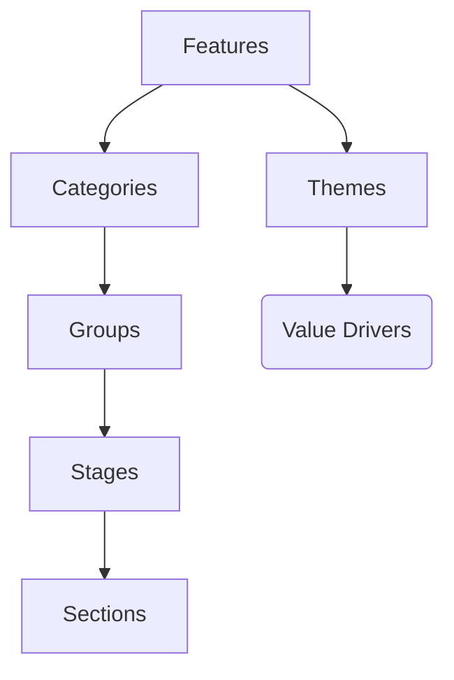

GitLab の料金戦略は CEO が設定します。誰でも貢献でき、最良のコミュニケーション方法は #pricing Slack チャンネルです。

以下の担当者が日常業務の一部として貢献しています：

- Principal Pricing Manager（Sean Hall）
- Senior Pricing Manager（Sarah DeVries）
- VP、Product Management（Justin Farris）

## 料金戦略

GitLab の機能のほとんどは、無料の Free ティアで利用可能であり、今後も提供し続けます。有料ティアには
[マネージャー、ディレクター、エグゼクティブに特に関連性の高い](/handbook/company/stewardship/#what-features-are-paid-only)機能が含まれています。
[私たちは約束しています](/handbook/company/stewardship/#promises)。[私たちのスコープ](https://about.gitlab.com/direction/#scope)内のすべての主要機能は
Free でも利用可能です。スコープの特定の部分（CI、監視など）を課金対象にするのではなく、多くのユーザーで GitLab を使用している場合により必要になる可能性が高い小規模な機能を課金対象にしています。これには 2 つの理由があります：

1. 私たちはオープンソースプロダクトの良い[管理者](/handbook/company/stewardship/)であり続けたいと考えています。
1. 優れた無料プロダクトを提供することは私たちの GoToMarket 戦略の一部であり、新しいユーザーと顧客の獲得に役立ちます。
1. すべてのユーザーがスコープを利用できるようにすることで、スコープの採用が促進され、[シングルアプリケーション](/handbook/product/categories/gitlab-the-product/single-application/)のメリットを実感してもらうことができます。
1. すべての主要機能を Free に含めることで、CE と EE のマージコンフリクトを減らすことができます。

優れた無料プロダクトがあるため、単一の価格を設定することはできません。高い価格を設定すると、無料版との差が大きくなりすぎてしまいます。低い価格を設定すると、持続可能なビジネスを運営することが難しくなります。どちらの価格も機能する中間点はありません。

そのため、[Premium と Ultimate のティア](#three-tiers)を設けています。
それらの価格差は半オーダーの大きさ（5 倍）です。

ユーザーごと、アプリケーションごと、またはインスタンスごとに料金を請求します。ユーザーが使い始めやすくなるよう、サブスクリプションとトライアルには無料の利用分を含めています。SaaS でのデプロイ関連機能が増えるにつれて、例えば Google Cloud Platform（GCP）などのコンピュートを提供してその上にパーセンテージを上乗せして課金することは魅力的に思えます。しかし、他のプロバイダーの上に曖昧なマージンを課金することは、ユーザーの選択肢を制限し、透明性がないため行いません。そのため、常に BYOK（Bring Your Own Kubernetes）を可能にし、不透明なプレミアムを課金するために私たちのインフラにロックインさせることは決してありません。

### 無料ユーザーの価値

商業組織として、私たちは常に有料顧客の数を増やしたいと考えており、無料から有料への転換率を高めることに注力しています。しかし、GitLab は無料プロダクトを提供しており、無料ユーザーはいつか有料顧客になる可能性があるということ以外にも、会社に多大な価値をもたらします。

1. 認知・マインドシェア：大規模な無料ユーザーベースは、GitLab を開発者コミュニティに知らしめ、常に意識されることに役立ちます。
1. プロダクト習熟度・トレーニング：無料プロダクトを提供することで、誰でも障壁なく GitLab を試すことができ、多くの開発者が GitLab に習熟します。無料プロダクトを使用することで、多くのユーザーが GitLab の機能の使い方を習得し、仕事で GitLab を使用する際により効果的になります。
1. 支持・社内チャンピオン：忠実な無料ユーザーは GitLab の支持者となり、より多くのユーザーを引き込み、ブランドを強化します。個人プロジェクトで GitLab を使用していたユーザーが、雇用主に GitLab の購入を推薦する社内チャンピオンになるケースもよく見られます。この個人使用→組織使用への移行とボトムアップの成長は、無料プロダクトなしには実現できません。
1. 貢献・コミュニティ：多くの無料ユーザーはプロダクトの積極的な貢献者でもあり、GitLab をより良くします。また、無料ユーザーと有料顧客すべてにとってより価値のある資産となるコミュニティの成長にも貢献しています。
1. サードパーティサポート・プラットフォーム：無料ユーザーは総ユーザーベースを拡大し、大規模なユーザーベースはサードパーティツール・ API ・インテグレーションが GitLab をサポートする可能性を高め、エコシステムを成長させ、プラットフォームとしての地位を強化します。
1. プロダクト主導の成長を可能にし、顧客獲得コストを削減する：私たちの無料プロダクトにより、GitLab はより低い顧客獲得コストで多くのユーザーを獲得できます。なぜなら、すでに GitLab に慣れているため、購入を説得するための完全なセールスサイクルを必要とせず、セルフサービスで購入するユーザーもいるからです。
1. ユーザー習慣・リテンションのレバー：無料プロダクトを提供することで、ユーザーは支払いをする前に習慣を形成できるため、有料顧客は GitLab の ROI をより高く実感できる可能性があります。さらに、顧客が無料プランを継続したとしても、その顧客を競合他社に奪われることにはなりません。

## 料金哲学

私たちの料金哲学は[GitLab バリュー](/handbook/values/)と整合しています。

- **コラボレーション**：長続きする顧客関係を支えるアプローチを通じて、顧客の信頼を維持したいと考えています。
- **成果**：顧客に優れた ROI を提供しながら、長期にわたって GitLab の IACV を最大化することを目指します。
- **効率性**：料金アプローチは、理解・計画・注文が簡単であるべきです。
- **多様性、包括性、帰属感**：教育機関やさまざまな地理的地域の組織など、幅広い組織にとって最良の選択肢となる GitLab を構築します。
- **イテレーション**：時間をかけて GitLab のスコープ全体が採用されることを奨励したいと考えています。
- **透明性**：私たちは料金の根拠について公開かつ明示的にしています。

## 料金方法論

私たちは GitLab でバリューベースの料金アプローチを採用しています。バリューベースの料金の核心は、私たちのイノベーションが現在および将来の顧客に対してそのオファリングに提供する価値提案を理解することです。顧客と GitLab の双方にとって継続的な成長と財務的な成功を達成するために、オファリングに適切な価格を設定することを目指します。

### 1. 価値提案

顧客に提供する価値を理解するために、顧客がビジネス目標を達成するために得られるメリットに焦点を当てています。顧客への価値には次のものが含まれます：

- 開発コストの削減
- 市場投入時間の短縮による収益向上
- 信頼性とセキュリティの向上
- より充実した効果的なコラボレーション
- 喜んでいるユーザーを持つことの感情的な貢献

### 2. 顧客との協働

提供される価値の定義と定量化は孤立して行われるものではありません。私たちは定期的に顧客とエンゲージし、私たちのソリューションがどのように役立っているかを理解します。これらのエンゲージメントは重要です。なぜなら、顧客がイノベーションをどのように評価しているか、そして顧客の支払い意思にどう影響しているかについての洞察を提供するからです。支払い意思は、オファリングの価格とパッケージングを決定する際の重要な要素です。

### 3. 競合他社の動向

顧客が購入を決定する際には選択肢があることを理解しています。したがって、プロダクトの競合状況を理解することは非常に重要です。競合に関しては、私たちの価値提案と競合他社の価値提案の主な違いに焦点を当てています。私たちの料金は、私たちが提供する差別化された価値を反映することを目指しています。価格指標を含め、競合他社と比較して顧客にとって最も適した料金体系を設計することを目指します。

### 4. 相互成功

料金哲学に従い、長続きする顧客関係を支援することを目指します。料金を開発する際、顧客と GitLab の両方が共に成功することを目標とします。持続可能なビジネスを運営し、会社の財務目標を達成できる長期的な成功のために、料金決定の際のコストとマージンも考慮要素として考えています。コストとマージンは料金の要素ではありますが、顧客への価値提供が基本的な要素であることを強調することが重要です。

## 部門と意思決定

料金は Product、Marketing、Sales に影響します。
したがって、一般的な料金決定は CEO が行います。

Product は、[有料ティア](#three-tiers)に基づいてどの機能をどのプランに入れるかについて、日常的な意思決定のほとんどを行います。

次の表は、大きなクロスファンクショナルな料金決定をどのように行うかを示しています。このような決定の大きなビジネスリスクとクロスファンクショナルな性質から、この意思決定方法は通常の[RADCIE](/handbook/people-group/directly-responsible-individuals/)方法とは異なります。

| **責任** | **役割** | **説明** |
| --- | --- | --- |
| **Responsible（実行責任）** | Group Manager, Pricing | 分析と推薦に責任を持つ |
| **Agree（合意）** | VP Monetization、Chief Product Officer、CRO | 推薦に理想的には同意する |
| **Perform（実行）** | Pricing、Fulfillment、Sales Ops、Product Marketing、Website チーム | 推薦を実行する |
| **Input（インプット）** | CMO、CFO | 意思決定前にコンサルテーションを受け、インプットを提供できる |
| **Decide（決定）** | CEO | 最終的な意思決定者 |

ステークホルダー間の調整を確実にするため、今後の収益化の決定に調整し、過去の洞察・トレンドを議論し、機会の優先順位を付けるための月次料金運営委員会が開催されています。

## 3 つのティア {#three-tiers}

料金ティアは 3 つあります。
日常的な意思決定方法は[管理ページ](/handbook/company/stewardship/#what-features-are-paid-only)で指定されています。

| Self-Managed/SaaS ティア | Free | Premium | Ultimate |
| ---------- | ------ | ------ | ---- |
| ユーザーあたり月額 | $0 | $29 | 営業窓口へ |
| [機能を最も気にする人](/handbook/company/pricing/#buyer-based-open-core) | 個人貢献者 | ディレクター | エグゼクティブ |
| 主な競合 | GitHub Team | GitHub Enterprise | Veracode、Checkmarx |
| 販売タイプ | 販売なし | ベネフィット/ソリューション | トランスフォーメーション |

### バイヤーベースのティア分類の明確化

製品ティア決定の際にバイヤーを考慮するにあたり、以下のガイダンスを使用します：

1. Free は単一の開発者向けで、購入決定はその同じ人物が行う
1. Premium はチームでの使用向けで、購入決定は 1 人以上のディレクターが行う
1. Ultimate は戦略的な組織全体での使用向けで、購入決定は 1 人以上のエグゼクティブが行う

機能のティア評価においては、[管理の約束](/handbook/company/stewardship/#promises)がこのガイダンスよりも優先されます。

### 例

バイヤーベースモデルの区別を理解することは難しい場合があります。このモデルでは、機能のユーザーではなく、バイヤーと、バイヤー自身が必ずしもユーザーでなくてもその機能が役立つ場合に焦点を当てています。これらの決定を行う際、私たちは次のような質問をします：

1. この機能の需要を誰が生み出すか？
1. この機能はどの組織レベルで価値を付加するか？

以下に製品カテゴリと、バイヤーベースモデルが実際にどのように機能するかを示す現在および提案された機能を、特定のティアに存在するものとして列挙します。

#### 機能 - かんばんボード

1. **プロジェクトとグループのボード（Free）**：Issue ボード全体の主なユーザーとバイヤーは個人貢献者です。グループボードはチームをまたぐ可能性が高いですが、個人がいくつかのプロジェクトのコードを整理し、グループレベルで複数プロジェクトの Issue を管理するための有効なユースケースもあります。重要な違いは、個人貢献者が必要とするグループレベルの Issue ボードはおそらく 1 つだけですが、マネージャーはチームのワークフローを促進するために複数のグループレベルの Issue ボードが必要だということです。（[ドキュメント](https://docs.gitlab.com/ee/user/project/issue_board.html)）
1. **ボード上の Issue Weight（Premium）**：Issue weight を割り当てるユーザーは個人貢献者ですが、その weight の価値は適切なマイルストーン計画を確保するためのディレクターにあります。（[ボードに関するドキュメント](https://docs.gitlab.com/ee/user/project/issue_board.html#sum-of-issue-weights)）
1. **複数のグループ Issue ボード（Premium）**：グループをまたぐ Issue ボードは、グループのグループに価値があり、そのレベルのバイヤーはディレクターが適切です。（[関連ドキュメント](https://docs.gitlab.com/ee/user/project/issue_board.html#group-issue-boards)）
1. **Issue ボードの Epic スイムレーン（Ultimate）**：スイムレーンの日常的なユーザーは個人貢献者かもしれませんが、その価値はエグゼクティブによる会社全体のポートフォリオ管理のための活動の可視化にあります。（[関連 Issue](https://gitlab.com/gitlab-org/gitlab/issues/7371)）

#### 機能 - マージリクエスト

1. **マージコンフリクト解決（Free）**：マージコンフリクトの解決は日常のワークフローの一部であり、個人貢献者にとって価値があります。（[ドキュメント](https://docs.gitlab.com/ee/user/project/merge_requests/conflicts.html#methods-of-resolving-conflicts)）
1. **マージ承認（Premium）**：MR の承認を必須にすることは、プロジェクトでチームが作業していて、特定の個人の承認を必要とするディレクター（承認のユーザーである可能性は低い）がいる場合にのみ有用です。（[ドキュメント](https://docs.gitlab.com/ee/user/project/merge_requests/approvals/)）
1. **MR レビュー（Premium）**：MR レビューにより、MR に対する複数のチームメンバーによる迅速なレビューが可能になります。MR レビューに伴うチャットの削減を価値と感じる十分な規模のチームは、通常ディレクター配下にあります。（[ドキュメント](https://docs.gitlab.com/ee/user/discussions/index.html)）

#### 機能 - パイプライン

1. **組み込みの CI パイプライン（Free）**：CI パイプラインは GitLab の不可欠な要素であり、主に個人貢献者が使用します。（[ドキュメント](https://docs.gitlab.com/ee/ci/)）
1. **パイプラインのコードカバレッジ率の表示（Premium）**：コードカバレッジ率を決定する能力はディレクターにとって特に価値があります。（[ドキュメント](https://docs.gitlab.com/ee/user/group/repositories_analytics/index.html)）
1. **パイプラインダッシュボード（Premium）**：グループとプロジェクトにまたがるパイプラインのダッシュボードは主にディレクターが使用・評価します。（[ドキュメント](https://docs.gitlab.com/ee/user/operations_dashboard/)）
1. **ダウンロード可能な全パイプラインログ（Ultimate）**：パイプラインログは個人貢献者によって生成されダウンロードされる場合もありますが、これらのログをまとめることの価値は、コンプライアンスを確保する責任を持つエグゼクティブに提供されます。

### バイヤーベースのティア分類よりも使用量が重要な場合がある

私たちの[ティア](#three-tiers)は購入決定を誰が主導するかに基づいていますが、常に低いティアに向けて機能を移動する方向で、使用量の増加が自然なバイヤーベースのティア分類よりも優先される場合があります。その理由は：
GitLab が有料ティアになりそうな新しいカテゴリを開発するにあたり、早い段階の MVC バージョンを Free または低い有料ティアに配置して採用を促し、貢献を奨励し、より広いユーザーベースからフィードバックを得ることは依然として合理的（多くの場合は推奨）です。時間とともに、チームは MVC 機能の上にさらに多くの機能を追加でき、それらは有料ティアに配置されます。ただし、プロダクトマネージャーは、適切な有料ティアで追加・収益化できる基本機能に意味のある追加を行う具体的で信頼性の高い計画がない限り、バイヤーベースモデルに違反して機能を引き下げるべきではありません

1. 私たちのデュアルフライホイールは、ユーザーの増加によって機能します。チーム向けのものでさえ、機能をオープンソースに含めることで、より多くの使用が促進され、ユーザーが増加します。そのユーザーは、貢献者を生み出し、プロダクトを改善し、将来のティア機能を作り出すために不可欠です。

ティア分類を検討する際、機能が個人によって使用（購入ではない）されるように設計されており、「誰がこの機能を最も気にするか？」という質問への答えが「今日 - ほとんど誰もいない」である場合は、より多くの使用と貢献者を得るためにオープンソース化を検討すべきです。機能の引き下げの背後にある理由にかかわらず、[プロセス](/handbook/company/pricing/#changing-tiers-and-pricing-changes)は遵守されるべきです。

### ティア分類の回避を防ぐ

無料ティアの機能（通常は個人貢献者に有用だが他にも有用）がティアポリシーを回避または悪用する可能性がある場合、極めて慎重に対処し、有料ティアに機能を維持することを優先すべきです。その一例として、[リポジトリのプルミラーリング](https://docs.gitlab.com/ee/user/project/repository/mirror/pull/)があります。これは個人貢献者に有用で、採用にも役立ちます（GitLab を試してみる等）。しかし、Free ティアのより大きなインスタンスが有料ティアの機能を利用するために有料ティアのより小さなインスタンスにミラーリングするような可能性もあります。これは料金の利用規約に反するため、この機能を Free ティアではなく有料ティアに維持することを選択しました。

### パートナーインテグレーションの考慮事項

パートナーへのインテグレーションを構築する際、私たちのティアがパートナーのティアとうまく一致しない場合、バイヤーベースモデルに例外を設けることができますが、常に低いティアに向けてのみです。例えば、無料ティアを持つチームコラボレーションツールを提供するパートナーは、明らかに単一チームの使用に適切であるにもかかわらず、GitLab 上のインテグレーションを無料ティアに配置することを望む場合があります。このパートナーシップの GoToMarket のメリットは、バイヤーベースモデルからの乖離を上回る可能性があります。

### テーマ

機能をティア内でテーマにまとめることが、[料金ページでのコンバージョンパフォーマンスの向上につながった](https://gitlab.com/groups/gitlab-com/marketing/inbound-marketing/-/epics/11)ことがわかりました。これはティアの価値を提示する方法ですが、このテーマベースの表現はバイヤーベースのティア決定の補完的なフィルターとして機能し、それを置き換えるものではありません。

テーマは[顧客価値ドライバー](/handbook/sales/command-of-the-message/#customer-value-drivers)にまとめられます。

#### 現在のテーマリスト

以下が現在の機能セットです：

{}

#### テーマがバイヤーベースのティア決定と一致しない場合はどうするか？

テーマはバイヤーベースのティアのフィルターであるため、機能のティアとその自然なテーマが一致しない場合があります。その場合は次のいずれかを行うべきです：

1. 機能のティアを調整して一致させる
1. 機能を異なるテーマに調整して一致させる
1. テーマの名称を調整して、ティア間の区別をより明確に捉える

注意 - 機能のテーマを記載されたティアおよびそれ以下のティアに含めることは問題ありません。

## 低いティアは相対的な価値が高い

低いティアには：

1. 低い価格。
1. 低い割引率（割引後の価格が絶対値でもパーセンテージとしても定価に近い）。
1. 生み出す価値に対して請求される価格が低い。
1. ドルあたりより高い価値（絶対数では高いティアがより高い純価値を生み出す）

高いティアは依然として顧客にとって最良の選択肢です：

1. 高いティアはより多くの絶対的な価値を付加します。例えば、上位ティアは下位ティアと比べて 2,000%以上の価値を付加しながら、相対的な価値は少ない場合があります。
1. 高いティアの投資対効果（ROI）は、サブスクリプション外のコストにより、低いティアよりも良い傾向があります。例えば、GitLab に切り替える際には実装とトレーニングに固定コストがかかります。低いティアを使用すると、使用できない機能の回避策を見つける必要があり、コストが増加し効率が低下します。

低いティアの相対的価値が高い理由は複数あります：

1. 低いティアは古いため、機能を蓄積する時間が多くありました。
1. あらゆる料金モデルはオープンソースティアと互換性がある必要があります。オープンソースティアは有料ティアの最上の代替であるべきです。そのティアはコストゼロ、割引ゼロ、生み出す価値に対して請求される価格ゼロ、ドルあたり無限の価値を持っています。最低の有料ティアは、人々が無料から有料に移行できるようにするために、最もオープンソースティアに近いティアであるべきです。有料になれば、GitLab をより有効活用してより多くの価値を生み出すことを支援できます。例えば、より多くのステージを使用することで。より多くの価値を実感した場合、ティアを上げることができます。
1. 低いティア（オープンソースを含む）は、高いティアの将来の顧客のパイプラインです。
1. 価格の引き上げや低いティアの魅力を低下させることで（もちろん[機能を上げることによってではない](#default-to-move-features-down)）、今後 3 年間で収益を簡単に増加させることができます。しかし、私たちは 10%の年割引率で会社の正味現在価値（[NPV](https://www.investopedia.com/terms/n/npv.asp)）を最適化しています。これは 3 年を超えて見る必要があることを意味します。
1. 低いティアの価格を引き上げることで、直接的にも、ほとんどの組織を高いティアに移行させることによっても、短期的に多くの収益が得られるかもしれません。しかし、競合他社に移行する少数の組織は、将来において私たちにとって到達がはるかに難しくなり、競合他社自身のフライホイール効果を可能にします。このトレードオフは、価格を引き上げる際に明示的に計算する必要があります。
1. 低いティアが人気があることは料金の問題ではなく、コミュニケーションの問題です。高い価格のティアはパーセンテージとして一ドルあたりの相対的価値は低いですが、絶対的な純価値は多く生み出します。製品、マーケティング、営業インタラクションにおいてその価値を説明することは私たちの責任です。
1. オープンコアプロジェクトは、専有プロジェクトよりも少ない価値しか獲得（作成された価値と獲得した価値の比率）しません。料金ティアが作成された価値に対して低いため、ティア間の差はプロプライエタリソフトウェアよりもはるかに高くなります。1%を獲得する場合、5 倍の新しいティアを容易に導入できますが、50%を獲得する場合は価格を 2 倍にするだけで顧客にとってすべてのメリットが失われます。
1. Premium ユーザーはいても Free ユーザーはいません。Premium にいる見える顧客だけに集中すると、最大の機会を見逃してしまいます。Premium も価格が設定されています。Premium から Ultimate への転換が、無料を使用した後に顧客になる組織よりも低い場合は特にそうです。現在、無料ユーザーは顧客ではなく、高いティアの価値について議論する連絡先がいないため、無料ユーザーにリーチすることははるかに難しいです。

低いティアの価格引き上げ（必ずしも行うわけではない）の議論は：

1. プランによって営業努力があまり変わらないため、低いティアは販売するのに相対的にはるかに高コストです。
1. [バイヤーベースオープンコアモデル](#buyer-based-open-core)により、低いティアに機能を追加し続けるため、価格が上昇することが予想されます。
1. 高いティアの絶対値の方が優れており、それが最も合理的な尺度のように思われますが、人々は相対的な価値も見ており、高いティアへの移行コストが良く認識されるようにすべきです。
1. 多くの成功したオープンソース企業は、最も手頃なプランに比較的高い価格を設定しています。
1. GitLab の将来の成長は、低いティアよりもオープンソースバージョンを使用している人数にはるかに影響されるため、有料ユーザーが少なくなることは比較的小さな影響です。
1. GitLab への将来の競合は、低いティアのみと競合する専有製品のみよりも、オープンソースプロジェクトから来る可能性がはるかに高いです。
1. 機能をオープンソース化することによって最低ティアの相対的な魅力を低下させることができますが、これもそのティアの価格引き上げを難しくします。
1. 多くの企業がサポートを確保したいと考えており、特に最初の年においては、そこには価格弾力性がほとんどありません。

以上はすべて、低いティアに機能を追加するかしないかの申し立てではなく、[バイヤーベースオープンコアモデル](#buyer-based-open-core)に従うべきです。

## 一貫した名称

SaaS と Self-Managed のティアに同じ名称を使用する理由：

1. SaaS と Self-Managed のオファリングの機能セットはほぼ一致しており、SaaS と Self-Managed のティアをできるだけ類似させたいと考えています。
1. 一貫した命名は、顧客にとって理解しやすく使いやすいです。

## 販売タイプ

1. 機能販売とは、人々が追加機能を購入したいと思うことを意味します。これはセルフサービスで行えます。
1. ベネフィット販売とは、GitLab を最大限に活用することで得られるビジネス成果を人々が購入することを意味します。[DevOps スコア](https://docs.gitlab.com/ee/administration/analytics/dev_ops_reports.html#devops-score)のようなケーススタディや指標が必要で、Customer Success のカスタマーサクセスマネージャーとの四半期ごとのチェックインで採用計画の状況をレビューします。競争プロセスには、GitLab で新しいプロジェクトを開始するのが 10 倍速いことを示すベイクオフが含まれる場合があります。
1. トランスフォーメーション販売とは、組織として変革したいと人々が望むことを意味します。サイクルタイムを 10 倍削減したいと思い、支援を求めます。トランスフォーメーションコンサルタントとワークショップを行い、完全な共有プロジェクトを定義します。

## ハイブリッド販売モデル

異なるティア間には大きな価格差があります（$0、$29、カスタムユーザーあたり月額、無限、5 倍の価格差）。GitLab Inc.の収益の大部分は、上位 2 ティアを購入する大企業から得られています。

同様の状況にある多くの企業は、最高ティアのみに集中するでしょう。
しかし、私たちが以下の理由でハイブリッドモデルを機能させたいと考えています：

1. [オープンソースプロジェクトの良い管理者](/handbook/company/stewardship/)であり続けたいと考えています。
1. 無料ティアは将来の顧客を生み出すためのスケーラブルな方法です。

5 倍の高い価格は 5 倍の価値があることを意味しません。ちょうど Premium ティアが無料の Free ティアと比べて無限の価値を提供するわけでないように。
ティアを選択する際、組織は余分に得る価値と余分に支払う金額の比率を見るべきです。
この比率が快適に 1 を超えている場合、高いティアに移行することが理にかなっています。
その価値は、人々をより効果的にし、ツールの統合時間を節約し、価値実現を速め、他のツールを廃止することにあります。
これはより高いティアの価格増加をはるかに上回るはずです。
Apple の iphone が良い例えです：平均的な Android 電話の 2 倍の価格ですが、2 倍の価値を提供するわけではなく、追加の価値が追加コストに見合っています。

[Stripe が文書化したように](https://stripe.com/en-ca/guides/atlas/business-of-saas#hybrid-sales-approaches)：ハイブリッドは困難です。「両方のモデルを同時に試みる最も一般的な結果は、一方のモデルのみが牽引力を得て、（これらのモデルは会社のすべての業務に組み込まれているため）通常もう一方を窒息させてしまうことです。」

このハイブリッドモデルは、セルフサービスとエンタープライズ間の[キャズムを渡る](https://www.worklife.vc/blog/crossing-the-chasm)方法です。

## プランで機能をまとめる

一度に一つの機能を販売しようとしましたが、これは実行不可能でした。
それを改善したバージョンは、3 つのプランの代わりに 7 つの主要機能を販売することでした。
主要機能の例：高可用性、セキュリティ、サービスデスクなど。

メリットは：

1. より高価な機能への段階的なアップグレード。
1. 使用する機能のみに支払う。
1. アドオンはこれを販売する一般的な方法です。

デメリットは：

1. [バイヤーと GitLab Inc.の両方にとって最適でない](https://cdixon.org/2012/07/08/how-bundling-benefits-sellers-and-buyers/)。
1. バイヤーが各機能をどれだけ必要とするかを見積もることが難しい。
1. 複雑さが、バイヤーが各グループについて個別のティア決定をしなければならないため、販売プロセスを長引かせる可能性がある。
1. ユーザーにとって、どの機能を使用できるかが不明確。
1. 業界では一般的ではなく、バイヤーはそれを期待していないため、つまらないソリューションではない（[効率性バリュー](/handbook/values/#efficiency)の下の運営原則）。
1. トゥルーアッププロセスがより複雑になる。
1. 顧客はユーザーがより多くの機能を得られるようにするためのプロセスを管理しなければならない。
1. 機能の使用が少なくなり、改善が遅くなる。
1. 最低と最高の有料プランの間に 25 倍の差があるハイブリッド販売モデルでは実施が難しい。

現時点では、デメリットがメリットを上回ると考えています。

## 一顧客に対して単一プラン {#single-plan-for-one-customer}

メリットは：

1. ユーザーはより多くのステージのより多くの機能を均一に使用できます。DevOps アプリケーション全体の力を活用することで、顧客にとってより良い ROI が得られます。
1. バイヤーは各ティアをどれだけ必要とするかを見積もる必要がありません。
1. ユーザーが使用できるかどうかに混乱が生じません。
1. シンプルな料金とトゥルーアッププロセス。
1. ユーザーごとに機能をオン/オフにするための製品の複雑さが増加しない。
1. 管理が簡単：顧客はユーザーをティア間で移動させるためのプロセスを管理する必要がない。

デメリットは：

1. 顧客は十分に利用していないと感じる機能に支払うことになる場合がある。
1. 異なるグループに対して個別のライセンスを持つ複数のインスタンスにつながる場合がある。
1. 事前の交渉が多くなる。
1. 更新リスクが増加する。

メリットがデメリットを上回るため、一顧客に対して単一プランがうまく機能すると信じています。

GitLab 営業チームと GitLab の顧客にとって、[価値とビジネス成果](/handbook/sales/training/)に焦点を当てることでこの異議申し立てに対処することをお勧めします

### レポーターユーザー権限の料金

顧客が GitLab を DevOps ライフサイクル全体の単一アプリケーションとして採用するにつれて、アジャイルプロジェクト管理のために GitLab を使用する非開発者のユースケースがますます多くなっています。一部の非開発者ロールが必要とする主な機能は、ラベルの管理、Issue の割り当て、Epic の作成と編集などを含む[レポーター権限](https://docs.gitlab.com/ee/user/permissions.html#project-members-permissions)アクセスとほぼ一致しています。これらのユーザーは他のほとんどの開発者機能を必要としません。

現在、レポーター権限のみを必要とするユーザーに異なる定価を提供していません。その理由は：

1. この料金アプローチは[バイヤーベースオープンコアモデル](#buyer-based-open-core)と整合しています。
1. 私たちのプランの定価は、開発者と非開発者の両方のユースケースを考慮したブレンド価格です。
1. 私たちは[スイートのみを販売](#only-sell-a-suite)しており、製品の一部を使用しないことを条件とした割引を行うことで、特定の非開発者のユースケースを対応します。
1. シンプルな料金・パッケージング（PnP）戦略は、業界のベストプラクティスとして最適な方法で顧客にサービスを提供します。SKU が増えると、会社が拡大するにつれて PnP モデルが複雑になり、最終的に顧客に大きな混乱をもたらします。
1. GitLab ではライセンスを[レポーター権限](https://docs.gitlab.com/ee/user/permissions.html#project-members-permissions)に制限しません。レポーターユーザーは同じライセンスを使用して通常の開発者ユーザーに更新できます。

顧客に非開発者のユースケースがあることを理解しています。具体的なユースケースについては、[営業チームへお問い合わせ](https://about.gitlab.com/sales/)いただくか、[この Issue](https://gitlab.com/gitlab-org/gitlab/-/issues/213185)を通じてお知らせください。

## トゥルーアップ料金

1. トゥルーアップ料金では、ライセンス/販売はユーザーの成長を妨げることはありません。
1. 一部の組織が 50%を請求した際に意図的に低い見積もりを行っていたため、現在は年間に追加されたユーザーに対して 100%を請求しています。技術的に「ユーザー日数」をカウントできれば、全員に対して公平にすることができます。これの前提条件は、[クラウドライセンシング](https://about.gitlab.com/pricing/licensing-faq/cloud-licensing/)の顧客への採用です。
1. クラウドライセンシングを使用している顧客には、[四半期サブスクリプション調整](https://docs.gitlab.com/ee/subscriptions/quarterly_reconciliation.html)を提供しています。

## コンサンプション料金の原則

1. 以下はいくつかの有用と思われる原則です。これらは約束や権利ではありません。私たちの[料金ページ](https://about.gitlab.com/pricing/)には、以下の原則とは異なる場合がある現在の価格が含まれています。
1. 私たちの価格はクラウドのオンデマンドコストの 5 倍であるため、80%のマージンがあります。これは私たちの市場では一般的と思われます（例えば[GitHub](https://github.com/pricing)や[CircleCI](https://circleci.com/pricing/)）ですが、定価でファクトチェックしていただける他の企業がいれば歓迎です。これが 20%の利益マージンを可能にする方法を示す[長期コストモデル](/handbook/finance/financial-planning-and-analysis/#long-range-outlook-lro)はこちらです。
1. ユーザーは実用的な場合はいつでも自分のリソースを持ち込む柔軟性があります（例えば、ランナーやクラスター）。これはオンプレミスの機器や自分のクラウド契約からのものでも構いません。
1. 主要なクラウドは私たちのパートナーであるため、競合したくありません。独自のサービスを提供する唯一の理由は、それが私たちのインフラに含まれる必要がある場合（リポジトリストレージ）とエンドユーザーにとって便利な場合（ランナー）です。
1. スケールと継続使用の割引の恩恵を受けます。これを使用して、価格が設定されていないリソース使用を後援します。例えば：ランナーの調整、ログイン、インターフェースの表示、メールの送信。
1. コストが重要になるにつれて、課金を開始する場合があります（例：帯域幅コスト）。
1. Static Application Security Testing (SAST)、Dynamic Application Security Testing (DAST)、その他の Auto DevOps 機能を実行するクラスターなど、GitLab をより使いやすくする新しいサービスを提供できます。
1. ティア間のコンサンプションの差は、有料プランのティア間の価格差に比例するべきです。無料ティアは等しい差があるべきです。現在、すべてのティア間で 5 倍です。
1. アカウントに含まれるコンサンプションのすべてが使用されるわけではないと予想しています。
1. 可能な限り顧客の料金モデルをシンプルにします。例えば、基礎となるリポジトリが Solid State Drive（SSD）または Hard Disk Drive（HDD）上にある場合でも、ストレージの料金は 1 つです。
1. 将来的には、ユーザーが会社に価値をもたらすことをした場合に追加クレジットを提供できます。Dropbox の「友人を招待して GB を獲得する」オファリングと同様に。例：新しいステージの使用、パートナー（AWS/GCP）へのリンク、新しいユーザーの招待。
1. 前払い対後払い：ビットコインマイナーなどの未払い問題を解決するため前払いを選択しています。また、ユーザーにとってより予測可能で予期しない請求が少なく、予算管理が容易です。後払いはインフラが資金不足で停止するリスクを軽減します。GitLab では、消費のほとんどは顧客からではなく組織内の人々によって促進されます。これにより、必要な場合に支払いを迅速に行ってもらえる可能性が高くなります。注文サイクルが長い企業顧客のための緊急プロセスを考える必要があります。
1. 手動対自動注文：両方が必要です。作成が簡単であり、いずれにせよ必要であり、顧客に予期しない請求が少なくなるため、手動注文から始めます。自動注文は、顧客が分数不足によって開発者が非効率になるのを防ぐのに役立ちます。将来的には、デフォルトを手動から自動に変更する場合があります。その場合は、これを十分に伝え、顧客が手動を維持できるオプションを常に提供するべきです。
1. 定期対非定期：手動注文されたものは定期、自動注文されたものは非定期にします。定期は顧客側の作業を減らします。非定期は顧客が不要なコンサンプションに支払うことを減らします。
1. 返金可対非返金：返金可能にするのは実装が複雑で法律上の制約があり、収益認識が難しくなるため、今のところ非返金可能にします。返金可能は、必要なコンサンプションよりも多く購入した顧客にとっては良いでしょう。
1. 分割対統合料金：ストレージと分数を別々に請求するか、それとも両方に使用できるクレジットのバンドルを購入するか？分かりやすいため分割料金を選択します。ハイパークラウドも[リザーブドインスタンス](https://aws.amazon.com/ec2/pricing/reserved-instances/)でこの方向に進んでおり、[無料ティア](https://aws.amazon.com/free/?all-free-tier.sort-by=item.additionalFields.SortRank&all-free-tier.sort-order=asc)も特定製品向けです。
1. ドル対クレジット対ネイティブ：アカウントに x ドルを追加するか、クレジットを追加するか、コンピュート分とストレージ GB を追加するか。分割料金を行う場合に最もわかりやすいため、ネイティブを選択します。すべての分が同じではありません（サイズ、オペレーティングシステム）が、乗数を使用できます。分の 95%以上が 1x タイプであるため、ほとんどの状況でクレジットよりもネイティブが使いやすいです。
1. 部分的対完全な補充：コミュニケーション、理解、請求、管理がよりシンプルであるため、完全な補充を行います。CircleCI は通常のクレジットの 25%の部分補充を行います。
1. 無料の量：有料ティア間に 5 倍の差があるため、おそらく最低ティアよりも 5 倍少ない量にするべきです。GitHub は私たちの料金を参考にしたため、比較の良いソースではありません。CircleCI は無料プランで 250 分を提供しています。
1. 累積対非累積：
現在は非累積アプローチのメリットが累積アプローチのメリットを上回ると考えています。
    1. 名前空間ごとの方がコミュニケーションしやすいと思われます。
    1. 顧客は、契約、更新、ユーザー追加などの際に取得する合計分数とストレージを計算する必要がありません。合計の範囲内であれば予測可能な請求です。
    1. 実装がシンプルで、既にあります。
    1. プランと共に割り当てられるのは、別途購入できる本格的な消費ではなく、使い始めるためのものです。
    1. より大きな分数とストレージの数字に見えます。
    1. GitLab を試すことが購入の大きな障壁になる無料ユーザーに最も多く与えます。
    1. 有料ティアが無料ユーザーの割当から恩恵を受けないようにする必要があります。
    1. 一部の他のベンダーの料金指標もこのようになっています。
    1. より論理的に理にかなっています。
    1. より多くのユーザーをサインアップするにつれて、より多くの分数とストレージを持つことになるため、より公平です。
    1. ティアの料金指標と整合しています。
    1. 名前空間あたりのユーザー数を多くすることを奨励し、これがコンバージョンを促進することがわかっています。
    1. 無料ユーザーが消費をより迅速に購入し、顧客に転換するように促します。
1. ユーザーごと対名前空間ごと：コンサンプション制限はユーザーごとまたは名前空間ごとにプロビジョニングされますか？名前空間ごとの場合、ユーザーは別の名前空間を作成するとより多くの分数とストレージを取得します。ユーザーごとの場合、ユーザーはすべての貢献にわたって固定の分数とストレージを受け取ります。現在、名前空間ごとにコンサンプション制限をプロビジョニングしています。ユーザー名前空間もグループ名前空間のクォータを受け取ります。
1. ストレージ料金には他のストレージタイプ（添付ファイル、コンテナなど）が含まれますか？単一のストレージ料金はレジストリ（コンテナはその一部）、リポジトリ、アーティファクト、添付ファイルなどをカバーします。
1. 料金はスケーラビリティの代替ではありません。例えば、スケーラビリティを心配しているからといって何かを高いティアに配置することは私たちが行うことではありません。代わりに Beta、限定アクセス、メーリングリストなどから始めるべきです。

## Self-Managed と SaaS 間の価格差

SaaS により高い価格を設定する議論：

1. SaaS のコストは GitLab にとって高い。
1. 収益認識においてより論理的。

少なくとも同等にする議論：

1. Self-Managed の価格設定は一般的に高い傾向がある。
1. Self-Managed の市場需要が多い。
1. 営業にとって Self-Managed よりも SaaS を販売するインセンティブがない。
1. SaaS への移行を顧客に奨励したい。なぜなら、私たちはより多くのデータ（より良いカスタマーサクセスの成果）を持っており、Self-Managed から SaaS に移行する際に再度獲得する必要がないからです。

市場での標準が何かは不明確です。Adobe はうまくやりましたが、永久ライセンスからサブスクリプションへと移行し、[2 つの価格を比較するのが難しい](https://blog.adobe.com/en/publish/2015/05/27/a-new-way-to-buy-acrobat-dc-subscription)。

## 1 ドルが 1 ドルでない場合

これは[素晴らしい記事](https://www.codingvc.com/p/when-is-a-dollar-not-a-dollar)のタイトルで、その 8 つのポイントを GitLab に当てはめます：

1. コスト対収益：コストの削減と収益の増加の両方を支援できます。見込み客の優先事項に合わせることを確認してください。
1. プリンシパルエージェント問題：エンジニアリングの VP には、開発者の時間を節約する機能よりも、より高い可視性を提供する機能を強調したいでしょう。
1. 既存の費用対新規費用：既存の予算を活用できます。複数が当てはまる可能性があることを認識してください（開発ツール、セキュリティ、オペレーション、DevOps トランスフォーメーション）。
1. 裁量的支出制限の上下：複数の料金ティアを持つもう一つの理由。
1. サービス対カスタマイズ製品対既製品の販売：高マージン製品を販売し、顧客がプロダクトをより成功させるために必要な場合にサービスを補強します。
1. 多数のステークホルダー対一つのステークホルダーへの販売：これが複数のティアのもう一つの理由です。Premium は開発チームの単一ステークホルダーに販売され、Ultimate はトランスフォーメーションを実施するために CIO を必要とする複数のステークホルダーに販売されます。
1. 月次対前払い支払い：そのため、私たちは年間前払いを優先し、時には複数年前払いを行います。また、年間はエンタープライズの標準です（Salesforce はこのように Sales しています）、そして SaaS（おそらく月次）と Self-Managed 間で桁違いに大きなサポートコストを削減するのに役立ちます。
1. 販売対アップセル：これが複数のティアを持つ理由です。

## 月次料金より年次料金を優先

年間前払い料金は現在のところ唯一のオファリングです。
比較をシンプルにするため、すべての社内システムは年次料金のみを表示するべきです。
外部には月次料金も表示しています。

年間前払い料金を支持する議論：

1. [Redpoint の 2020 年 Go To Market（GTM）サーベイのスライド 7](https://docs.google.com/presentation/d/e/2PACX-1vTUqJyPtn3dQKP8YlmCwiSXgKNyCAe2qfAfkfh2R68rXCC_lhLlzhtJPQQjOCUP-fvPqAozCx1IoUTs/pub?start=false&loop=false&delayms=3000&slide=id.g8864de4371_0_264)では、$5k からは年次料金が大多数でした。
1. 顧客の獲得、オンボーディング、サポートのコストを回収するのに役立ちます。
1. 顧客のために新しいプロダクト機能の提供を速めるための再投資を可能にします。
1. 顧客の自己選択とプロダクトとの成功した展開へのコミットメントを支援し、成功した成果を得るための十分な時間を与えます。
1. 月次料金に比べて割引で提供できます。
1. 多くの顧客タイプに対応するため、無料ティアを含む幅広いプロダクトティアと任意のティアの無料トライアルを提供しています。
1. 営業、請求、カスタマーサポートのコストが低い。
1. 継続的なプロダクト可用性と、より少ない頻度の管理と請求の連絡によるより良い顧客体験。
1. ライセンスの権利行使を年に一度だけ実施するのがはるかに容易で、より低い製品開発コストをもたらします。
1. より予測可能なビジネスを可能にし、プロダクトの使用から優れた成果を確保するためのカスタマーサクセスへのより多くの先行投資を可能にします。
1. 年次料金は、収益が期間にわたって均等に認識されるシンプルな収益認識モデルをもたらし、消費は関係ありません。月次料金で同等のものを得るには、月ごとの「使用しなければ消滅」条件が必要ですが、業界標準は翌月への持ち越しを許可しています。
1. SMB 顧客のチャーンを削減するのに役立ちます。これは業界で問題となっていました。

月次料金の提供も支持する議論：

1. 月次請求により、顧客はもう一つの購入方法を得られるため、プロダクト採用の障壁を減らします。
1. 月次料金は、すでに月次で請求されている組み合わせまたは依存製品/サービスの請求と一致する場合があります（例：別の月次サービスとバンドルされている場合）。

## なぜウェブサイトに月次料金を表示するのか

ほぼすべての SaaS プロダクトは料金ページに月次料金を表示しています。GitLab は[ウェブサイトに月次料金](https://about.gitlab.com/pricing/)を表示し、年次請求であることを明確に記載しています。これは[Salesforce](https://www.salesforce.com/sales/pricing/)のような企業でも行われている標準的な慣行です。以前にウェブサイトで年次料金を表示しようとしたことがありましたが、顧客から混乱しているというフィードバックを繰り返し受け取りました。料金が月次単位で表示されることを期待し、年次料金を月額として読むため、実際よりも大幅に高いと思っていたことが多くありました。

## スイートのみを販売 {#only-sell-a-suite}

ほとんどの企業は以下のように進化します：

1. 単一プロダクトを販売
1. 複数のプロダクトを販売
1. 複数のプロダクトとそれらのスイートを販売
1. スイートのみを販売

Microsoft Office がその例で、Office365 のコンポーネントを個別に購入するのはコスト高ですが、高いティアにはより多くの製品が含まれています。
GitLab では、中間ステップを省略し、すべての製品を含むスイートのみを提供することに即座に決定しました。
完全なスコープをオープンソースバージョンに含めることは、[管理の約束](/handbook/company/stewardship/#promises)の一部でさえあります。

スイートのみを販売することにはリスクがあり、=>の後に GitLab でのリスク軽減方法を示します：

1. すべての製品を欲しい人に対してお金を残す。=> 完全な GitLab を採用する場合に大きな価値がある Ultimate ティアを提供する。
1. すべての製品が欲しくない人への割引。=> 製品の一部を使用しないことを条件に割引を行う。
1. 別々のプロダクトがある場合よりもティアを定義するのが難しい。=> 軽減が難しく、違いを伝えるためにより多くの作業が必要です。
1. 顧客がどの製品をより重視するかについての収益フィードバックがない。=> プロダクト機能は価値の最良のプロキシとして使用データに焦点を当てます。

企業がスイートのみを販売するように進化する理由は以下の通りで、=>の後に GitLab への適用方法を示します：

1. 組織が他の製品を採用しやすくなる。=> これは不可欠です。組織には公式のソリューションがあり、GitLab は開発者からの有機的な採用とともに成長します。
1. [シングルアプリケーション](/handbook/product/categories/gitlab-the-product/single-application/)のメリットを顧客に示す。=> これは不可欠です。人々は懐疑的なため（見せることは言うことよりも効果的）。
1. すべての製品のより多くの使用。=> これは、シードとナーチャーのプロダクト戦略のために私たちにとって不可欠です。
1. 一度スイートが導入されると、代替するのが難しくなる。=> これは競合他社が私たちのオープンソースコードに基づいてサービスを提供する場合に役立ちます。

すべてを単一アプリケーションに統合することで、スイートを販売すること以上に進んでいます。これを行う理由は、[シングルアプリケーションについてのハンドブックページ](/handbook/product/categories/gitlab-the-product/single-application/)に記載されているメリットによるものです。二次的な効果として、ユーザーが購入または採用の決定をする必要がなくなります。

すべてのステージを組み込んだ 1 つの価格を請求することは、**完璧なバンドル**です。

## 価値創出

組織にとって GitLab が生み出す価値の大きさを決定する 2 つの要素は、重要度順に：

1. スコープ：GitLab をどれだけ多くの部分を使用しているか（DevOps スコアで示される、GitLab のコンポーネントをどれだけ使用しているか）。
1. サイズ：組織内で GitLab を使用する人数。

組織が大きくなるほど、GitLab のメリットが大きくなる理由：

1. 調整がより多くの作業を占めるようになる。80%が調整コストであり、20%の場合よりもはるかに価値が高い。
1. 人々をトレーニングしてベストプラクティスを実践させるのがより難しく、費用がかかる。
1. インナーソーシングから恩恵を受けるサイロが多い。
1. より多くのキャンセル、より長いサイクル、勝利に時間がかかる。
1. ガバナンスの要件が高い。

## 価値獲得 {#value-capture}

GitLab はオープンコアプロジェクトであるため、（獲得できる）よりもはるかに多くの価値を常に創出します。創出された価値に基づき、価値を獲得する直接的な方法は：

1. スコープ：GitLab をより多く使用するほど、ユーザーあたりの価格を高くする。
1. サイズ：ユーザーが多いほど、シートあたりの価格を高くする。

これらの直接的な方法は以下の理由で不可能です：

1. スコープ：採用に対して請求すると、ライフサイクル全体での GitLab の採用を妨げます。2018 年 1 月には、バージョンコントロールが次の機能（CI）よりも 10 倍人気がありました。機能が有機的に広まるように必要とし、人々が GitLab でより多くの価値を生み出せるようにする必要があります。人々はライフサイクルの一部をすでに使用している場合、はるかに支払う意欲が高いです。
1. サイズ：他の多くのソフトウェア企業は、特定の[ティア](#three-tiers)でユーザーの最大数を制限しています。GitLab では、[オープンソースバージョンに人工的な制限を含まないという約束](/handbook/company/stewardship/#promises)があるため、これはできません。プロプライエタリティアではできますが、これは対称的ではないように思えます。また、単に制限よりも少し大きいという理由だけでより多く支払わなければならないのは不公平に感じます。

そのため、機能の課金に残っています。
それぞれの機能を別々に課金するのはユーザーにとって扱いにくいです。
そのため、機能のバンドルを含むティアを課金します。
（より高価な）有料ティアの機能を選択する際、以下の基準を使います：

1. スコープ：DevOps スコアが高まるにつれてより有用で価値が高くなる
1. サイズ：組織規模が拡大するにつれてより有用で価値が高くなる

（より高価な）有料ティアに機能を追加することは、ユーザーがそれを採用することを妨げる唯一のことではありませんが、非常に重要な要因です。

上記を簡略化するため、チャンピオンポジションに基づいて機能のグループ分けを行います（以下を参照）。

## バイヤーベースオープンコア {#buyer-based-open-core}

機能のティア決定は以下に基づいて行います：**「誰がその機能を最も気にするか」**。
私たちの[3 つのティア](#three-tiers)は、個人貢献者からマネージャー/ディレクター、エグゼクティブまでの[バイヤーペルソナ](/handbook/product/personas/#buyer-personas)または IC に基づいて差別化されています。会社のすべての人は、すべての機能を使用しない場合でも[同じティア](#single-plan-for-one-customer)を使用します。
機能は、どのチャンピオンが最も**気にする**かに基づいてプランに配置されます。
バイヤーは意味があります。なぜなら、より高コストのプランにはより上位のバイヤーが必要だからです。

機能しない代替案：

1. 会社規模に基づく料金は機能しません。一部の小さな企業は最も高いプランの機能が必要です。
1. [スコープとサイズ](#value-capture)は機能しません。
1. 成熟度に基づく料金は奇妙です。なぜなら、DevOps の旅の始まりにいる組織が最も多く支払うべきだからです。グリーンフィールドでは GitLab のメリットをより迅速かつ広範に受けることができます。

詳細は Sid が[Open Source Leadership Summit 2019](https://about.gitlab.com/blog/2019/04/03/five-ways-resist-service-wrapping-buyer-based-open-core/)と[Heavybit](https://www.heavybit.com/library/video/commercial-open-source-business-strategies/)でのバイヤーベースオープンコアについての発表にあります。

また、懸念事項の中の[フォークと商品化](https://internal.gitlab.com/handbook/leadership/mitigating-concerns/#fork-and-commoditize)（社内）もご覧ください。

### 顧客返答のテンプレート例

**顧客がなぜ MR 承認が無料に含まれていないのかを尋ねた場合：**

> ご質問ありがとうございます。私たちは、個人貢献者よりもマネージャーが MR 承認をより気にする可能性が高いと考えています。これは個人貢献者がそれを気にしないということではありません。また、すべてのケースでマネージャーがより気にするということでもなく、ほとんどのケースでそうであるということです。詳細については、バイヤーベースオープンコアモデルをご覧ください：[#buyer-based-open-core](#buyer-based-open-core)。

### Infracost.io の共同創業者とのオープンソースの収益化について CEO が語る動画



## 機能を引き下げられる場合は迅速に行う {#if-a-feature-can-be-moved-down-do-it-quickly}

機能をオープンソース化することを躊躇すべきではありません。機能を高すぎるティアに配置した場合は、すべてのティアでその機能を使用できないことによる影響が以下の点で悪影響を及ぼすため、迅速に移動すべきです：

1. より多くのユーザーの獲得：プロダクトが自分自身を売り込むようにするために効率的です。プロダクトが使用されてそれが売り込むためには、より多くのオープンソース機能がライバルのオファリングに対して GitLab の人気を高める可能性があります。
1. より多くの[ユーザーあたりのステージ](https://internal.gitlab.com/handbook/company/performance-indicators/product/#stages-per-user-spu)（社内）の獲得：オープンソース機能がユーザーを新しいステージの採用に導く場合、[シングルアプリケーション](/handbook/product/categories/gitlab-the-product/single-application/)のメリットがより多くのステージを採用すると指数的に成長するため、一人のユーザーが GitLab から得る価値が大幅に増加します。
1. 機能を改善するためのより多くのオープンソース貢献の獲得：貢献の数はユーザーの数とともに増加するため。
1. オープンソース化したものの上の有料機能への需要の増加：機能を引き下げることで、その特定の機能の使用が増加します。例えば、サービスデスク機能。機能が人気になると、後でサービスデスクのカスタムテンプレートなどの有料機能の需要が生まれます。

ほとんどの場合、以下のガイドラインが適用されます：

1. 収益化を試みる前に、無料での機能採用を優先する。
1. この機能を使用することでより多くのユーザーが有料機能に到達できる場合は、おそらくオープンソース化すべきです。例えば、複数の Kubernetes クラスターのサポートにより、Kubernetes クラスターの追加が促進され、ブラウザパフォーマンステストの有料機能を使用できるようになります。
1. どのバイヤーも機能を気にしない場合、それはどのバイヤーの焦点にもなっていないことを意味し、オープンソース化すべきです。
1. 同等のオファリングの基本機能をオープンソースにすることを確認すべきです。同等のオファリングが追加料金を取る機能を課金対象にすべきです。初期採用を促進するためには、機能をオープンソースにする必要があります。

以下は CEO がプロダクトマネージャーとこの哲学について議論する動画です：



## デフォルトで機能を引き下げる {#default-to-move-features-down}

不確かな場合は、[迅速に引き下げる](#if-a-feature-can-be-moved-down-do-it-quickly)ことをデフォルトとして機能を低いティアに移動します。
データがより適切であることを示した場合に。すべてのティア変更が低価格プランへの移動を伴うわけではなく、有料機能がより高いティアに移動する場合もありますが、
[オープンソース機能は有料ティアに移動しない](/handbook/company/stewardship/#promises)というルールがあります。

バグにより機能が低いティアで意図せず利用可能になる場合があります。これは無料（オープンソース）ティアを含む場合もあります。バグを修正して機能を正しいティアに戻す場合、これはオープンソース機能を有料ティアに移動することとは異なります。特定の機能のティアの決定的な情報源は[私たちのドキュメント](https://docs.gitlab.com/ee/development/documentation/styleguide/index.html#product-tier-badges)です。

バイヤーが望む新機能を構築し、新機能の初期評価が低くなりすぎないようにすることに集中すべきです。機能を上のティアに移動する能力を持っていますが、既存の機能のリーチを拡大するのではなく制約するため、必要性を証明するためのバーははるかに高くなります。

また、CEO が料金とティアの責任を持ち、これを日常的な作業のためにプロダクトに委任していることに注意してください。
GitLab 組織の他の部分はコンサルテーションされますが、CEO が[直接責任個人](/handbook/people-group/directly-responsible-individuals/)です。

## ティア変更と料金変更

料金に影響する変更や Feature のティアを変更する（例：機能を Premium から Free に移動する）ことを提案するには、[Feature Tier or Pricing Change Issue テンプレート](https://gitlab.com/gitlab-com/Product/issues/new?issuable_template=Feature-Tier-Or-Pricing-Change)に概説されているプロセスに従ってください。

## DevOps スコアは成熟度ではない

興味深いことに、GitLab はより多く採用するほど多くの価値を創出します。
これは DevOps の成熟度と混同されるべきではありません。
DevOps の成熟度とは、実践がどれほど高度であり、[サイクルアナリティクス](https://docs.gitlab.com/ee/user/group/value_stream_analytics/)に示されている DevOps ライフサイクルがどれほど速いかということです。
GitLab に組み込まれたベストプラクティスを活用することで、なしの場合よりも速く成熟します。GitLab は 200%速い DevOps ライフサイクルを可能にします。
しかし、DevOps の成熟度は主に組織変革に関するものです。GitLab というプロダクトはそのエネーブラーにすぎません。
組織が GitLab のすべてを使用している場合（DevOps スコアが高い）でも、依然として遅いプロセス（遅いライフサイクル）を持つことができます。
DevOps スコアが高いほどライフサイクルが速いという相関関係があることはわかっていますが、特に DevOps 初心者の組織にとっては、傾向ではあっても絶対的なものではありません。
ティアを成熟度にリンクさせることは、現在遅いライフサイクルを持ちながら、GitLab を完全に採用することでそれを速めている大規模組織からお金を取らないことを意味します。
遅いライフサイクルを持つこれらの大規模組織は、既存のツールチェーンに縛られていないため、GitLab を完全に採用できるため、GitLab から最も恩恵を受けます。

## 地域別料金

[X のユーザー](https://x.com/javierfeldman/status/1101246338824572928)（X へのログインが必要）による提案。
これは、ビジネス全体で地域市場への適応という GitLab のアプローチを考慮すると、検討するべき良い提案です。GitLab は全体的な料金戦略計画においてこのアイデアの実現可能性を評価します。これを行うのは困難であり、評価には以下の点が考慮されます：

1. これは複雑な問題であり、変更が地理を考慮して行われた場合にすべての当事者が良い状態になることが必要です。これをうまく実行するのは難しいことを完全に認めています。
1. 顧客と GitLab の両方にとって良い方法がある場合、これを別々に扱いません。統一された料金戦略の一部として扱います。
1. グローバルかつデジタルの市場では、顧客が自分で申告することを頼りにするか、複数の地理的な場所にユーザーがいる大規模組織であるかのどちらかであるため、顧客がどこに地理的に位置しているかを確実に特定することは困難です。
1. よりシンプルな割引ポリシーで解決できるかもしれません
1. ライセンスあたりのコスト総削減は、新しい料金での増加ボリュームによって補って余りあるものでなければなりません
