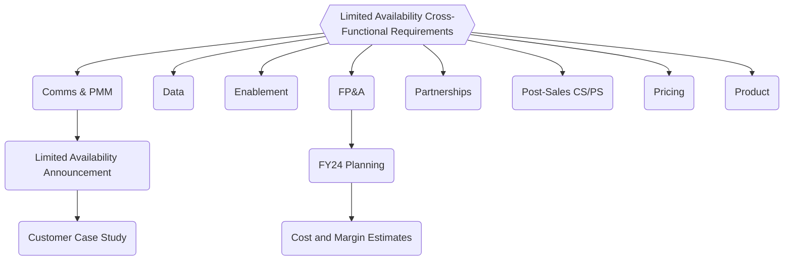

## 属性

| プロパティ            | 値             |
|---------------------|-------------------|
| 作成日        | 2022-06-29 |
| 終了日            | 2023-06-15 |
| Slack               | [#f_gitlab_dedicated](https://gitlab.slack.com/archives/C01S0QNSYJ2)（GitLab Dedicated に関する質問用、社内からのみアクセス可能） |
| Slack               | [#wg_dedicated_cross_functional](https://gitlab.slack.com/archives/C046P7F0N2J)（ワーキンググループのアイテム用、社内からのみアクセス可能） |
| Google Doc          | [ワーキンググループアジェンダ](https://docs.google.com/document/d/1vuKnUwJYrSKAqu0kYtR503LQbuYM_VSD4_z90MR_cQU/edit)（社内からのみアクセス可能） |
| Epic                | クロスファンクショナル Epic（社内からのみアクセス可能） |

## 追加リソース

- [GitLab Dedicated 外部ウェブページ](https://about.gitlab.com/dedicated/)
- [製品カテゴリの方向性](https://about.gitlab.com/direction/gitlab_dedicated/#limited-availability-roadmap)
  - [限定提供ロードマップ](https://about.gitlab.com/direction/gitlab_dedicated/#limited-availability-roadmap)
- [エンジニアリングチーム](/handbook/engineering/infrastructure-platforms/gitlab-dedicated/)
  - [プロジェクト管理](/handbook/engineering/infrastructure-platforms/gitlab-dedicated/#project-management)
- [内部ハンドブック](/handbook/engineering/infrastructure-platforms/gitlab-dedicated/)
- [トップレベルイニシアティブ Epic](https://gitlab.com/groups/gitlab-com/gl-infra/-/epics/479)（社内からのみアクセス可能）
- [Limited Availability Epic - メインプロジェクト Epic](https://gitlab.com/groups/gitlab-com/gl-infra/-/epics/484)（社内からのみアクセス可能）
- [クロスファンクショナル Limited Availability 要件](https://gitlab.com/groups/gitlab-com/gl-infra/-/epics/866)（社内からのみアクセス可能）

## 戦略

### 計画

クロスファンクショナル作業のマイルストーンを含む[限定提供ロードマップ](https://about.gitlab.com/direction/gitlab_dedicated/#limited-availability-roadmap)を参照してください。

### 終了基準 {#exit-criteria}

GitLab Dedicated トップクロスファンクショナルイニシアティブの終了基準は、[Limited Availability の終了基準](https://about.gitlab.com/direction/gitlab_dedicated/#limited-availability)と同一です。

## プロジェクト管理

### 作業の進め方

GitLab Dedicated イニシアティブ ワーキンググループは、Dedicated エンジニアリングチームページに記載されている [Dedicated エンジニアリングチームと同じプロセス](/handbook/engineering/infrastructure-platforms/gitlab-dedicated/#how-we-work)に従います。これには以下が含まれます。

- [Epic 管理](/handbook/engineering/infrastructure-platforms/gitlab-dedicated/#epic-hierarchy)
- [ステータス更新](/handbook/engineering/infrastructure-platforms/gitlab-dedicated/#status-updates)
- [ラベルと使用方法](/handbook/engineering/infrastructure-platforms/gitlab-dedicated/#labels)

### Epic 管理

[Dedicated チームページの Epic 管理と階層](/handbook/engineering/infrastructure-platforms/gitlab-dedicated/#epic-hierarchy)を参照してください。

[クロスファンクショナル LA 要件 Epic](https://gitlab.com/groups/gitlab-com/gl-infra/-/epics/866) は、GitLab Dedicated の[トップレベル Epic](https://gitlab.com/groups/gitlab-com/gl-infra/-/epics/479) の子 Epic です。このクロスファンクショナル Epic は、各機能エリアの DRI が管理する機能別の子 Epic で構成されています。これらの機能別子 Epic には、[限定提供ロードマップ](https://about.gitlab.com/direction/gitlab_dedicated/#limited-availability-roadmap)の特定のフェーズで提供される関連タスクのグループを表すサブ Epic や Issue が含まれています。

[クロスファンクショナル LA 要件 Epic](https://gitlab.com/groups/gitlab-com/gl-infra/-/epics/866) の機能作業のマイルストーンは、[限定提供ロードマップ](https://about.gitlab.com/direction/gitlab_dedicated/#limited-availability-roadmap)に含まれています。

## ステータス更新

GitLab Dedicated イニシアティブ ワーキンググループは、Dedicated エンジニアリングチームページから[ステータス更新プロセス](/handbook/engineering/infrastructure-platforms/gitlab-dedicated/#status-updates)に従います。機能 DRI が各機能 Epic で行うステータス更新は、[ステータス更新のリズム](/handbook/engineering/infrastructure-platforms/gitlab-dedicated/#status-updates)に組み込まれ、[クロスファンクショナル Epic](https://gitlab.com/groups/gitlab-com/gl-infra/-/epics/866) および[トップレベルイニシアティブ Epic](https://gitlab.com/groups/gitlab-com/gl-infra/-/epics/479) のステータス更新に使用されます。

[Dedicated チームページのステータスプロセス](/handbook/engineering/infrastructure-platforms/gitlab-dedicated/#status-updates)に加えて、Dedicated イニシアティブにはイニシアティブ DRI が責任を持つ、トップクロスファンクショナルイニシアティブとしての追加ステータス更新要件があります。

- キーレビュー
- トップイニシアティブ四半期ミーティング

## キーレビュー

- イニシアティブ DRI は、Chief Product Officer がこのイニシアティブのエグゼクティブスポンサーであるため、製品キーレビューで更新内容を提供します。

## トップイニシアティブ四半期ミーティング

- トップイニシアティブ四半期ミーティングは、イニシアティブの健全性、リスク、ブロッカーを確認するために四半期に 1 回開催されます。
- イニシアティブ DRI は、このミーティングで Dedicated の現在のステータスとイニシアティブの計画を提供します。
- イニシアティブ DRI は、[トップレベルイニシアティブ Epic](https://gitlab.com/groups/gitlab-com/gl-infra/-/epics/479) の最新更新のサマリーを共有します。
- イニシアティブ DRI は、予定されたプレゼンテーション日の少なくとも 3 営業日前に Dedicated リーダーシップチームおよび Dedicated エグゼクティブスポンサーに四半期更新のドラフトを共有し、フィードバックを収集した上で、トップイニシアティブミーティングの少なくとも 1.5 日前にトップイニシアティブアジェンダに回答を追加します。

## 役割と責任

### イニシアティブ DRI

1. **エグゼクティブスポンサー**: David DeSanto - Chief Product Officer
1. **イニシアティブ DRI**: Ryan Wedmore - Director, Strategy & Operations
    - [ワーキンググループ DRI の責任](/handbook/company/working-groups/#required-roles) およびクロスファンクショナルイニシアティブ DRI の責任
    - クロスファンクショナルイニシアティブの戦略、コラボレーション、ワークストリームの DRI
1. **エンジニアリング DRI**: Marin Jankovski - Director of Infrastructure, Platforms
    - エンジニアリング、インフラ、エンジニアリング戦略全体の DRI
1. **プロダクト DRI**: Fabian Zimmer - Director of Product Management, SaaS Platforms
    - SaaS プラットフォーム製品、製品戦略、製品変更全体の DRI

### 機能エリアと DRI

以下は、このクロスファンクショナルイニシアティブに関与する機能エリアとその機能エリアを代表する機能 DRI です。

| ワーキンググループの機能（アルファベット順）  | チームメンバー        | 肩書き  |
|-----------------------------------------|--------------------|--------------------------------------------------|
| 機能リード: チャネルパートナー       | Honora Duncan      | Senior Channel Services Manager                  |
| 機能リード: Comms & PMM            | Saumya Upadhyaya   | Principal Product Marketing Manager              |
| 機能リード: Enablement             | Kelley Shirazi     | Manager, Sales Enablement                        |
| 機能リード: エンジニアリング            | Marin Jankovski    | Director, Infrastructure Platforms               |
| 機能リード: FP&A                   | Shuang Shackleford | Director, FP&A                                   |
| 機能リード: ポストセールス（CS/PS）     | Brian Will         | Senior Manager, Professional Services            |
| 機能リード: 価格設定・フルフィルメント  | Justin Farris      | Senior Director, Product Monetization            |
| 機能リード: プロダクト                | Andrew Thomas      | Principal Product Manager                        |
| 機能リード: セールス                  | Aileen Lu          | Director, Sales Strategy                         |
| メンバー                                  | Josh Lambert       | Director of Product, Enablement                  |
| メンバー                                  | Jake Bielecki      | VP, Sales Strategy & Analytics                   |

機能 DRI は、[エピック構造](/handbook/engineering/infrastructure-platforms/gitlab-dedicated/#epic-structure)に従い、[クロスファンクショナル LA 要件 Epic](https://gitlab.com/groups/gitlab-com/gl-infra/-/epics/866) における各機能の子 Epic の説明の冒頭にも記載されています。

### 機能 DRI の責任

[ワーキンググループページの機能リード](/handbook/company/working-groups#required-roles)を参照してください。

機能 DRI は、[Epic オーナーの責任](/handbook/engineering/infrastructure-platforms/gitlab-dedicated/#epic-owner-responsibilities)と[Epic 構造](/handbook/engineering/infrastructure-platforms/gitlab-dedicated/#epic-structure)に記載されているプロセスに従って、各機能の Epic を維持する責任があります。

### Dedicated チームの DRI

以下は、Dedicated チーム内の具体的な責任エリアです。

| エリア | タスク | DRI |
| ------ | ------ | --- |
| E-Group レポート       | ステータス更新、キーレビュー更新の作成 | `@rwedmore`    |
| プログラム管理      | クロスファンクショナルワークストリームの調整、ローンチリストの作成、アドホック調整リクエスト | `@rwedmore`   |
| カスタマーサクセス（CS） | [オンボーディング PS パッケージの定義](https://gitlab.com/gitlab-com/gl-infra/gitlab-dedicated/team/-/issues/1316)、ポストセールスの CS エンゲージメントの概要 | `@rwedmore` |
| 環境自動化ロードマップ  | ディレクションページの更新、優先順位の変更など | `@awthomas`（`@o-lluch` と協議・協力） |
| Switchboard ロードマップ  | ディレクションページの更新、優先順位の変更など | `@fzimmer`（`@marin` と協議） |
| 商談前の顧客対応 | 見込み顧客との面談、顧客資格審査、[オンボーディングプロセス](https://internal.gitlab.com/handbook/engineering/dedicated/#new-customer-process)のステップ 1〜6、CS パッケージが定義されるまでの顧客サポート | `@awthomas` |
| 商談後のオンボーディング管理 | CS パッケージが定義されるまでの[オンボーディングプロセス](https://internal.gitlab.com/handbook/engineering/dedicated/#new-customer-process)のステップ 7〜9 | `@rwedmore` または `@fzimmer` |
| [手動オンボーディングタスクの自動化](https://gitlab.com/groups/gitlab-com/gl-infra/gitlab-dedicated/-/epics/56) | ドキュメント変更の推進を含む | `@awthomas`  |
| Dedicated に必要なクロスプロダクト機能リクエストの推進 | メンテナンスモードの Prometheus メトリクス、サイレントモードなど | `@awthomas` |
| [市場投入定義](https://gitlab.com/groups/gitlab-com/gl-infra/-/epics/482) | PMM と PM が残りの GTM アイテムを定義し、クロスファンクショナルワークストリームの調整を行う | `@awthomas`|
| Finance との調整 | FY24 収益見通し、コスト最適化、P&L、最小シート数（後日） | `@fzimmer`（`@marin` と協議）  |

この表は毎月末にレビューされます。
