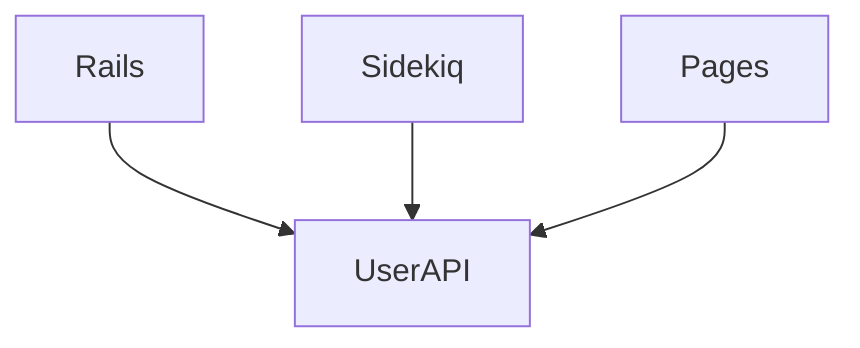

## フォールトトレランス

GitLab は高可用性でミッションクリティカルなシステムでなければなりません。これを実現するため、次の原則を満たすようにシステムを設計・展開する必要があります:

1. 単一障害点 (SPOF) を排除する: 単一ノードの障害がダウンタイムを引き起こしてはならない。
1. [障害を分離する](https://gitlab.com/groups/gitlab-org/-/epics/2283): 障害が発生した場合、特定のプロジェクトやユーザーなどにできるだけ分離されるべきである。影響範囲は最小化されるべきである。
1. ロールバック: ソフトウェア開発においてエラーは必ず発生する。バグが発生した場合、多くのユーザーに問題を露呈することなく迅速にリバートできなければならない。

### GitLab の改善例

以下は、GitLab のフォールトトレランス向上に役立つ具体的な項目の例です:

#### SPOF

1. NFS の使用を排除する
   1. https://gitlab.com/gitlab-com/gl-infra/scalability/issues/62
   1. https://gitlab.com/gitlab-org/gitlab/issues/32203
1. [Rails.cache で複数の Redis キャッシュインスタンスを使用する](https://gitlab.com/gitlab-com/gl-infra/scalability/issues/49)

#### Isolation

[Isolation エピック](https://gitlab.com/groups/gitlab-org/-/epics/2283)

1. 単一の Gitaly ノードがダウンしても GitLab が機能できるようにする
    1. https://gitlab.com/gitlab-org/gitlab/issues/34722
    1. https://gitlab.com/gitlab-org/gitlab/issues/39509
1. TODO

### マイクロサービスは必ずしも障害分離を提供するわけではない

上のリストには、万能薬としてのマイクロサービスは言及されていない点に注意してください。マイクロサービスアーキテクチャは障害分離を提供するのに**役立つ**可能性がありますが、本質的にそうするわけではありません。例えば、システム内のすべてのサービスがユーザーを取得するための API を作成する `UserAPI` マイクロサービスを導入するとします。すると、アーキテクチャは次のようになる可能性があります:

ここでも `UserAPI` マイクロサービスは単一障害点となり得ます。これがダウンすると、システム内の他のすべてのサービス (Rails、Sidekiq など) も動作を停止します。単一のチームが所有できる新しいサービスを導入しましたが、そうすることで必ずしも分離を改善したわけではありません。このサービスなしでシステムは機能できるでしょうか? おそらく機能しませんが、これには他に有利な点もあるかもしれません (例: 複数のサーバーでユーザーデータをシャーディングすることを可能にする、パフォーマンスなど)。SPOF を避ける方法については依然として考える必要があります。

加えて、私たちが作成するすべてのマイクロサービスは顧客に出荷する必要があるという点で、GitLab はユニークでもあります。そのため、これらのサービスの設定と冗長性を管理するオーバーヘッドもあります。

とはいえ、保守性、スケーラビリティ、信頼性に対するエンジニアリング上の利点を明確に定義できるのであれば、マイクロサービスは価値があるかもしれません。例えば、CI キューをより適切に処理できる [GitLab CI service daemon](https://gitlab.com/gitlab-org/gitlab/issues/19435) の導入を検討しています。
