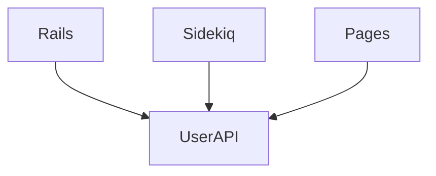

## フォールトトレランス

GitLab は高可用性のミッションクリティカルなシステムでなければなりません。これを実現するには、いくつかの原則を満たす方法でシステムを設計・デプロイする必要があります:

1. 単一障害点（SPOF）の排除: 単一ノードの障害がダウンタイムを引き起こしてはなりません。
1. [障害の分離](https://gitlab.com/groups/gitlab-org/-/epics/2283): 障害が発生した場合、特定のプロジェクトやユーザーなどにできる限り局所化される必要があります。影響範囲（ブラストラジウス）を最小化しなければなりません。
1. ロールバック: ソフトウェア開発においてエラーは不可避です。バグが発生した場合、多数のユーザーに問題が及ぶ前に迅速に元に戻せる必要があります。

### GitLab の改善例

以下は GitLab のフォールトトレランス向上に役立つ具体的な項目の例です:

#### SPOF

1. NFS の使用を排除する
   1. https://gitlab.com/gitlab-com/gl-infra/scalability/issues/62
   1. https://gitlab.com/gitlab-org/gitlab/issues/32203
1. [Rails.cache で複数の Redis キャッシュインスタンスを使用する](https://gitlab.com/gitlab-com/gl-infra/scalability/issues/49)

#### 分離

[分離 Epic](https://gitlab.com/groups/gitlab-org/-/epics/2283)

1. 単一の Gitaly ノードがダウンしても GitLab が機能できるようにする
    1. https://gitlab.com/gitlab-org/gitlab/issues/34722
    1. https://gitlab.com/gitlab-org/gitlab/issues/39509
1. TODO

### マイクロサービスは必ずしも障害分離を実現するわけではない

上記のリストでは、マイクロサービスを万能の解決策として挙げていないことに注意してください。マイクロサービスアーキテクチャは障害分離の**支援**にはなりますが、本質的にそれを実現するわけではありません。例えば、システム内のすべてのユーザーを取得する API を提供する `UserAPI` マイクロサービスを導入したとします。アーキテクチャは次のようになります:

この場合でも `UserAPI` マイクロサービスは単一障害点になり得ます。これがダウンすると、システム内の他のすべてのサービス（Rails、Sidekiq など）も機能しなくなります。単一チームが所有できる新しいサービスを導入しましたが、それによって必ずしも分離が改善されたわけではありません。このサービスなしでシステムは機能できるでしょうか？おそらくできません。ただし、これを行うことで他の利点がある場合もあります（例: 複数のサーバーでユーザーデータをシャーディングできるようにする、パフォーマンスの向上など）。それでも SPOF を回避する方法を考える必要があります。

さらに、GitLab は固有の事情として、作成するすべてのマイクロサービスを顧客に提供しなければならないため、これらのサービスの設定と冗長性の管理にもオーバーヘッドが生じます。

とはいえ、保守性、スケーラビリティ、信頼性に対するエンジニアリング上のメリットを明確に定義できる場合は、マイクロサービスが価値をもたらす可能性があります。例えば、CI キューをより適切に処理できる [GitLab CI サービスデーモン](https://gitlab.com/gitlab-org/gitlab/issues/19435)の導入が検討されています。
