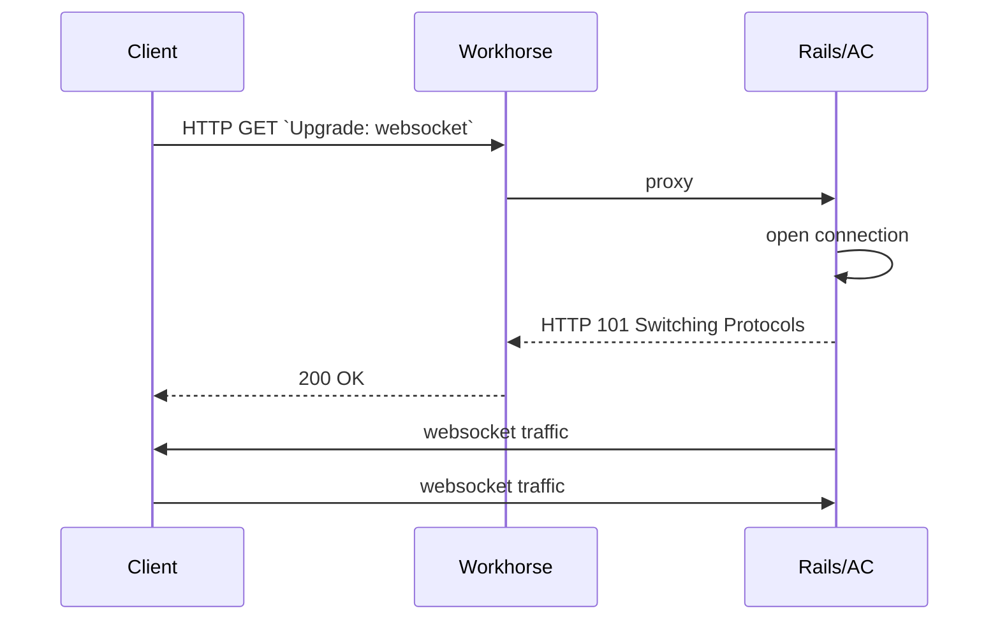

## はじめに

このドキュメントは、GitLab のリアルタイム機能の現在の実装に関する設計上の意思決定を記録しています。[このエピック](https://gitlab.com/groups/gitlab-org/-/epics/3056)内の Issue の説明と議論から抜粋・編集されています。

## 問題

私たちはリアルタイムの Issue ボードを実装したいと考えていますが、現在のリアルタイム実装方法（ETag キャッシングを用いたポーリング）ではうまく機能しません。Issue ボードでは多くの要素（リストの変更、リスト内の Issue の変更など）を追跡する必要があり、必要なリクエスト数とサーバーノードやデータベースへの結果的な負荷を考えると、それぞれをポーリングすることは現実的ではありません。1つのポーリングエンドポイントだけを使用することも可能ですが、コードが理解しにくくなるだけです。

また、ポーリング間隔を大幅に短縮しない限り、ポーリングはあまりリアルタイムとは言えません。

MR ページでタイトルや説明、ノート、ウィジェットなどに複数のポーリングリクエストを活用しているページでも、より高速な更新から恩恵を受けられるでしょう。

<!--
We decided to explore Pub/Sub messaging systems because it would make these simpler. On a page, we could subscribe to multiple channels / events and they would go through one connection.

This could also potentially take some load off Redis and our web servers when we eliminate those polling requests. We'd have extra load going to the websocket server and Redis for Pub/Sub but I think that's more efficient so we'd still see a gain overall.
-->

## 目標

以下の基準を満たすリアルタイムソリューションを実装することが目標です。

- クライアントとサーバー間の低レイテンシで双方向の通信を実現する
- あらゆる規模のセルフマネージドインスタンスおよび GitLab.com でスケーラブルにデプロイ可能
- オプションであり、優雅にデグレードする
- 重要なインフラから安全に分離されている
- 可能な限り既存のコードと確立されたテクノロジーを再利用する（つまり[退屈なソリューション](/handbook/values/#boring-solutions)である）
- 小規模で低リスクな機能から始めるイテレーティブなアプローチを促進する

この目標は、リアルタイムコラボレーションを実装するための長期計画における段階的なステップです。

## 提案するソリューション

小規模で比較的リスクの低い機能から始めることで、WebSocket の使用を展開していきます。大規模な WebSocket 接続の維持に関する問題を特定・解決し、永続的な接続のための機能設計から得た教訓を得た後に、他の開発者がリアルタイム機能に取り組めるようにするドキュメントを作成します。

初期機能は[Issue のアサイニーをリアルタイムで表示する](https://gitlab.com/gitlab-org/gitlab/-/issues/17589)ことであり、選択された技術は Action Cable です。

### 仕組み

最もシンプルなデプロイメントでは、[Action Cable を有効化](https://docs.gitlab.com/omnibus/settings/actioncable.html)するだけでデフォルトで最初の機能が有効になります。

機能は2つのフィーチャーフラグを使用してトグルすることもできます。

| | |
| --- | --- |
| `real_time_issue_sidebar` | Issue を表示する際に WebSocket 接続の確立を試み、更新シグナルに応答します |
| `broadcast_issue_updates` | Issue が更新された際にシグナルをブロードキャストします |

WebリクエストとWebSocket接続を処理するノードが異なる場合（「オンプレミスでの実装方法」を参照）は、Action Cable が有効になっていない場合があります。フィーチャーフラグを使用して機能を明示的に有効化できます。

この図は、双方向通信のための開いた WebSocket 接続を確立する現在の手順を示しています。作業の進捗に伴い変更される可能性があります。

1. クライアントが `/-/cable` に接続アップグレードリクエストを送信します
1. Workhorse がこれを正しいバックエンドにプロキシします（`cableBackend` オプションで設定、デフォルトは `authBackend`）
1. バックエンドが 101 Switching Protocols で応答し、リクエストをアップグレードします
1. クライアントが関心のあるチャンネル（`project_path` と `iid` を指定した `IssuesChannel`）にサブスクライブします
1. サーバーがサブスクリプションを確認し、Issue の更新が行われた際にシグナルを発行します
1. クライアントが **GraphQL 経由で最新の状態をリクエストする**ことで応答します†

†: このステップは、代わりに GraphQL Subscriptions の使用を検討しているため、特に変更される可能性があります。

### 問題の解決方法

### プロトタイプモデル / テスト計画

この機能は現在、dev.gitlab.org インスタンスで社内チームメンバーがデモできるよう提供されています。これは [CE のシングルインスタンスデプロイメント](/handbook/engineering/infrastructure-platforms/gitlab-delivery/distribution/maintenance/dev-gitlab-org/#devgitlaborg)です。

[Action Cable と Puma のパフォーマンステスト](https://gitlab.com/gitlab-org/quality/performance/-/issues/256)では、アイドル時のみのテストでリソース使用量への影響がないことが確認されましたが、模擬ワークロードでのテストはありませんでした。模擬ワークロードがない状況で、[段階的に機能をロールアウトする](https://gitlab.com/gitlab-org/quality/performance/-/issues/256#note_444323391)ことが推奨されました。

リアルタイムアサイニーのエンドツーエンドテストは[この MR](https://gitlab.com/gitlab-org/gitlab/-/merge_requests/44214)で追加されました。

### オンプレミスでの実装方法

インスタンス管理者は Action Cable を使用するためのいくつかの選択肢があります。最もシンプルな方法は既存のノードから WebSocket 接続を提供することで、[14.5](https://gitlab.com/gitlab-org/gitlab/-/merge_requests/71953) からデフォルトで有効になっています。

大規模デプロイメントでの WebSocket サポートの広範なテストと経験から[これはおそらく不要である](https://gitlab.com/gitlab-org/quality/performance/-/issues/256)ことが示されていますが、大規模デプロイメントの管理者はメインの Web ノードが過負荷にならないよう WebSocket 接続を別のノードセットにプロキシしたい場合があります。これはロードバランサーまたはイングレスの段階で、通常はパスに基づいて WebSocket トラフィックを分割することで行えます。これが gitlab.com で使用されている方法です。

Action Cable では組み込みモードのみがサポートされています。トラフィックを分割する場合でも、すべてのノードで Action Cable が有効になったフル GitLab Web プロセスが実行されています。組み込みモードのみをサポートする決定については[こちら](https://gitlab.com/gitlab-org/gitlab/-/issues/214061)を参照してください。

Action Cable チャンネル（コントローラーに類似）は、モデルの使用やキャッシュからの読み取りなど、Web コンテキストで行えることを何でも実行できることに注意が必要です。そのため、これらのプロセスは既存の Web プロセスと同様に扱うことが重要です。同じ設定を持ち、DB、Redis キャッシュ、共有ステート、Sidekiq などに接続できるようにする必要があります。初期実装では権限チェックのみを行う可能性が高いですが、これらの依存関係が適切に設定されていない場合、将来的に奇妙なバグの原因になる可能性があります。

### .com での実装方法

1. WebSocket 接続をサポートするインフラは Kubernetes 上で実行されます
1. WebSocket トラフィックは[パスによって分割](https://gitlab.com/gitlab-org/charts/gitlab/-/issues/2334)され、独立してスケーラブルなデプロイメントに送られます
1. WebSocket 接続を処理する Pod は Action Cable が有効になった通常の `webservice` プロセスを実行します

当初、gitlab.com では Web リクエストを処理するノードに Action Cable が有効になっていませんでした。フィーチャーフラグ `:real_time_issue_sidebar` と `:broadcast_issue_updates` を使用して機能を制御する必要があり、これらが制御されたロールアウトに使用されました。このセットアップが簡素化され、WebSocket リクエストを処理するか Web リクエストを処理するかにかかわらず、ノードに Action Cable が有効になっています。これにより、Web リクエストを処理するノードがフィーチャーフラグに依存せずに Action Cable が利用可能であることを認識できます。

### モニタリング

- スレッドプールサイズとアクティブ接続数に関する Prometheus メトリクスは [ActionCableSampler](https://gitlab.com/gitlab-org/gitlab/-/blob/master/lib/gitlab/metrics/samplers/action_cable_sampler.rb) によってサンプリングされます。
- [gitlab-org/gitlab#296845](https://gitlab.com/gitlab-org/gitlab/-/issues/296845) で実装された追加メトリクスにより、GitLab.com を含むインスタンス管理者はメッセージ数やサイズなど、標準的なサービスダッシュボードの構築に適した有用なメトリクスを取得できます。
- GitLab.com には [WebSocket SLI](https://dashboards.gitlab.net/d/websockets-main/websockets-overview?orgId=1)、Kubernetes [コンテナ](https://dashboards.gitlab.net/d/websockets-kube-containers/websockets-kube-containers-detail?orgId=1)、および全体的な[デプロイメント](https://dashboards.gitlab.net/d/websockets-kube-deployments/websockets-kube-deployment-detail?orgId=1)の（社内向け）ダッシュボードがあります。

### 想定コスト

最初のリアルタイム機能のロールアウトに基づいて、ピーク時の接続あたりの現在の推定コストは月額 $0.02（USD）です。

この数値は、WebSocket ノードの総コストをピーク時の同時接続数で割ることで導出されており、[このチャート](https://dashboards.gitlab.net/d/websockets-main/websockets-overview?viewPanel=1357460996&orgId=1&from=now-24h&to=now)（社内向け）で確認できます。データベースや Redis などのダウンストリームサービスへの負荷は考慮していません。これはおそらく過大評価であり、現在のノードがさらに多くの接続をサポートできるため、接続が増加するにつれて減少すると予想されます。

### 検討した代替案

Action Cable は Rails に含まれているため最初の選択肢でした。スケーラビリティが懸念事項ですが、問題になった場合は Anycable が同じ API を実装しています。アプリケーションコードへの変更を最小限または全くなしに、将来的に切り替えることができます。

1. ロングポーリング / Server-sent Events（SSE）

   ロングポーリングと SSE の両方とも、上記で説明した複数のエンドポイントをポーリング / リクエストしなければならない問題があります。また、これを行う場合でも、Redis などをチェックする現在の ETag キャッシングに類似したカスタムバックエンドロジックを実装する必要があります。ActionCable がフルスタックを提供しているため、その価値はありません。

   [message_bus](https://github.com/discourse/message_bus) gem は1つのポーリングエンドポイントで複数のサブスクリプションを実装します。しかし、より低レイテンシと双方向通信が必要なリアルタイムコラボレーションを計画しているため、WebSocket に直接進む方が良いでしょう。

1. Go / Erlang / Elixir WebSocket サーバー

   これらの言語が Ruby よりも並行性に優れていることは知られていますが、Rails アプリ / Ruby ライブラリを起動しないと、例えば権限チェックなど既存のコードを再利用できません。これらは複雑で非常に間違いやすいため、絶対に再実装したくありません。Rails バックエンドへの別の API 呼び出しを行うこともできますが、詳細は以下を参照してください。

1. Anycable

   Anycable は Go / Erlang の WebSocket サーバーを持ち、gRPC を使用することで Rails コンテキストを持たない問題を解決しています。欠点は、Rails アプリを起動する別の gRPC サーバーを起動する必要があることです。これによりインフラのセットアップが複雑になり、必要なものをすべてセットアップするのに時間がかかります。このオプションは[この Issue](https://gitlab.com/gitlab-org/gitlab/issues/21249)で議論されました。

   後で必要に応じて切り替えることが容易なため、このオプションを先送りし Action Cable から始めることにしました。

1. その他の Ruby WebSocket サーバー（Faye）

   Gitter はこれを使用しており、私たちも簡単に調査しましたが、Action Cable よりこれを選ぶ強い理由はありませんでした。

### ドキュメント

- [Omnibus の設定](https://docs.gitlab.com/omnibus/settings/actioncable.html)
- [リアルタイム Issue サイドバーのユーザードキュメント](https://docs.gitlab.com/ee/user/project/issues/managing_issues.html#real-time-sidebar)
- [開発者向けドキュメント](https://docs.gitlab.com/ee/development/real_time.html)
- [パフォーマンステスト](https://gitlab.com/gitlab-org/quality/performance/-/issues/256)
- [GitLab.com のレディネスレビュー](https://gitlab.com/groups/gitlab-com/gl-infra/-/epics/355)
