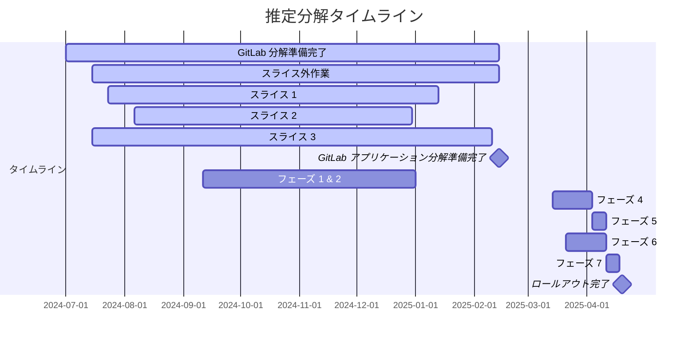

## 属性

| プロパティ      | 値              |
|----------------|-----------------|
| 作成日          | 2024年5月1日 |
| 開始日          | 2024年5月13日 |
| 終了日          | 2025年8月4日 |
| Slack           | [#wg_sec-database-decomposition](https://gitlab.slack.com/archives/C01NB475VDF)（社内からのみアクセス可能） |
| Google Doc      | [ワーキンググループ アジェンダ](https://docs.google.com/document/d/16JxSsh7AleszlsXU8h0Xevk5nZ-if7YJtRPjpwgqhn4/edit)（社内からのみアクセス可能） |
| Issue ボード    | [Epic ダッシュボードリスト](https://epic-dashboard-gitlab-org-tenant-scale-group-4aecf10d1d02154641.gitlab.io/epic_13043#only-open) |
| ミーティング頻度 | 毎週月曜日。録画あり。EMEA および APAC のオプションあり。 |

### 完了基準

このワーキンググループの使命は以下の通りです。

- GitLab.com の主要 DB への負荷を軽減し、将来のスケーラビリティと安定性の課題を支援するために、Sec データセットを別の `gitlab_sec` データベースへの分解を成功させる。
- 関連テーブルの GitLab.com DB パフォーマンスと最適化に向けた追加の取り組みの優先順位付けと実装に関連した分解のタイミング、スコープ、および影響を検討する - [OKR](https://gitlab.com/gitlab-com/gitlab-OKRs/-/work_items/7863)（GitLab 内部）
- 機能の同等性、パフォーマンス / ハードウェア要件、異なるサイズの DB に対する改善、および管理者のサポート努力に関するセルフマネージドインスタンスへの分解の影響を評価する。

セルフマネージドまたは Dedicated でのデコンポジションのサポートは、このワーキンググループのスコープ外です。

### 目標

ワーキンググループのスコープ内で達成したい重要な結果であり、成果が最も望ましい結果を確保するためのものです。

| 目標 | 備考 | 達成日 |
| --- | --- | --- |
| 可能な限り、実装によって CI 分解の結果と同様に、セルフマネージドユーザーのコストや負担が増加しないようにする。 | | |
| 変更はリファレンスアーキテクチャによって承認され、適切にドキュメント化されている。 | 必要なアドバイスをアドホックに集めるために、リファレンスアーキテクチャトラッカーに Issue を提起する。 | |
| 分解のプロセスで GitLab.com への混乱を最小限に抑える。 | カットオーバー前にデータベースへのすべてのトラフィックを停止する必要がある物理レプリケーションを選択する場合、これは避けられない可能性があります。 | |

### 用語集

| 推奨用語 | 意味 | 使用しない用語 | 例 |
|---------|------|--------------|-----|
| クラスター | データベースクラスターは、データを複製する相互接続されたデータベースインスタンスの集合です。 | | GitLab.com の PostgreSQL クラスター（Patroni によって管理）。メインの論理データベースをホストし、プライマリデータベースインスタンスとその読み取り専用レプリカで構成されています。 |
| 分解（Decomposition） | 機能が所有するデータベーステーブルが、複数のデータベースインスタンス上の多くの論理データベースにあります。GitLab.com においては、望ましい分解の成果にはこれらのインスタンスを異なるデータベースサーバーに分離することも含まれます。アプリケーションはさまざまな操作（ID 生成、リバランシングなど）を管理します。 | Y-Axis、垂直シャーディング | コアテーブルとは別の論理データベースにあるすべての Sec テーブル。[設計図](https://gitlab.com/groups/gitlab-org/-/epics/5883#design-overview) |
| インスタンス | データベースインスタンスは、データベースサーバーで実行されている関連プロセスで構成されています。各インスタンスは独自のデータベースプロセスセットを実行します。 | Physical Database | |
| 論理データベース | 論理データベースはスキーマやテーブルなどのデータベースオブジェクトを論理的にグループ化します。データベースインスタンス内で利用可能で、他の論理データベースとは独立しています。 | Database | GitLab の Rails データベース。 |
| ノード | このワーキンググループの文脈ではデータベースサーバーに相当します。 | Physical Database | |
| レプリケーション | バイアスなしのデータのレプリケーション。 | X-Axis、クローニング | 読み取りトラフィックを書き込みトラフィックから分離できるようにするためにデータベースクラスターで行うこと。 |
| WAL（Write Ahead Log） | Write Ahead Log は Postgres が挿入されたデータを記録するメカニズムです。WAL レコードは別のプロセスで格納されたデータセットを変更するために処理されます。これらのログはレプリケート可能です。 | | |
| 論理レプリケーション | PUB-SUB モデルを介して WAL を転送するために組み込みの Postgres レプリケーションプロセスを使用したデータのレプリケーション | | |
| 物理レプリケーション | 書き込まれたディスク上の実際のファイルを新しい物理データベースにコピーすることによるデータのレプリケーション。 | | |
| アプリケーションレプリケーション | GitLab 自体のレプリケーションルーティンの設定によって別のデータベースにデータをレプリケーション。 | | |
| DB スキーマ | SQL データベーススキーマはテーブル、ビュー、インデックス、データ型、関数、ストアドプロシージャ、演算子などの名前付きデータベースオブジェクトを含む名前空間です。[ドキュメント参照](https://www.postgresql.org/docs/current/ddl-schemas.html) | | |
| GitLab DB スキーマ | 基礎となるデータベース接続を抽象化するアプリケーションレベルのテーブル分類スキーマ。[ドキュメント参照](https://docs.gitlab.com/ee/development/database/multiple_databases.html#gitlab-schema) | | |
| サーバー | データベースサーバーは1つ以上のデータベースインスタンスを実行しているオペレーティングシステムを実行している物理または仮想システムです。 | Physical Database | |
| テーブル | データベーステーブルは共通のデータ構造（同じ数の属性、同じ順序、位置ごとに同じ名前と型）を持つタプルの集合です（[ソース](https://www.postgresql.org/docs/13/glossary.html#GLOSSARY-TABLE)）。 | | |
| テーブルパーティショニング | パーティションテーブルのデータの一部を含むテーブル（水平スライス）。（[ソース](https://www.postgresql.org/docs/12/ddl-partitioning.html)） | Partition | |
| データセット | 論理データベース内に含まれるテーブルとそのデータのセット。 | | Sec データセットには、脆弱性や依存関係追跡を含む（ただしこれに限定されない）GitLab のセキュリティ機能に関連するすべてのテーブルが含まれます。 |
| フィーチャーセット | 参照のしやすさのために GitLab 内の何らかの概念に関連付けられた機能のセット。 | | Core、Sec |
| Core | データセットまたはフィーチャーセットの観点から、プロジェクト、名前空間、ユーザーなど、標準的な GitLab の操作に関連した情報または機能です。 | | |
| Sec | データセットまたはフィーチャーセットの観点から、脆弱性、依存関係（SBOM）、セキュリティの知見、ポリシーなど、標準的な GitLab の操作に関連した情報または機能です。 | | |

### 概要

GitLab 内では、主要な GitLab データベースサーバーへの負荷を軽減するための強い要求があります。データベースおよびスケーラビリティチームは、長期的に GitLab の成長と安定性を維持するために、データベースサーバーへの継続的な負荷を軽減するためのさまざまな手段を講じています。そのひとつが Cells ですが、短期から中期的に追加の軽減策を提供したいという要望があります。過去の CI 分解が同様の課題に対処したのと同様に、主要データベースからの Sec データセットの分解が強力な解決策として特定されました。

Sec データセットの分解は、これらの機能に関連するデータインタラクションの規模の大きさから、重要なエンジニアリング作業です。このドメインはすべてのデータベース書き込みトラフィックの25%を占めており、フィーチャーセットを拡張し顧客ベースを成長させるにつれて増加する一方です。さらなる統計と技術的な詳細は関連する [Epic](https://gitlab.com/groups/gitlab-org/-/epics/13043) で確認できます。

GitLab.com 全体のスケーラビリティと安定性の懸念事項となり、継続的に増大するパフォーマンスの懸念から Sec セクションのステージが新機能を実装する能力を著しく制約しているため、このプロジェクトを効果的に達成するための組織的な取り組みを形成する必要があります。

私たちには、過去の CI データベースの分解を達成したデータベーススケーラビリティ ワーキンググループの先行事例と経験から大きく恩恵を受けられるというメリットがあります。しかし、直面する可能性のある主な課題は、既存の Sec コードベースの規模と、顧客ベースへの（なし / 最小限の）中断でオペレーションを継続する必要性です。顧客とのアップタイム SLA 契約のため、完全な GitLab.com のダウンタイムは強く忌避されていますが、私たちのオペレーションの規模によっては、このような分解のための一部のプロセスが実行不可能な場合があります。

### メリット

1. Cells 1.5 に先立って GitLab.com の主要書き込みデータベースへの書き込み負荷を軽減する
2. 主要データベースを Sec 機能の負荷から分離することで、GitLab オペレーションの安定性を向上させる
3. 懸念事項の分離により、Core と Sec の両方のフィーチャーセットの全般的なパフォーマンスを向上させる
4. プラットフォームの安定性を損なう重大な懸念なしに Sec 機能開発のイテレーション速度を向上させる

### リスク

1. 現在未知の期間にわたる重大な開発者のコミットメント。
2. 新しい分解されたデータベースとそれに関連するレプリカに対する増加したデータベースメンテナンス要件。
3. Cells 2.0 のリリース前に提供できない可能性がある。
4. GitLab.com の完全なダウンタイムが必要な場合があり、顧客との調整が難しい可能性がある。

### 相互依存関係

Sec データはユーザー、プロジェクト、名前空間などの CI や標準的な GitLab データと高度に統合されています。過去の CI 分解は、関連する CI データセットのクエリの相互依存性をうまく解除しましたが、コア GitLab データセットと Sec 機能の間で同じことを行うには多大な努力が必要です。

### タイムライン

グループは段階的なロールアウトは主要なデータベースクラスターへの負荷を軽減せず、実施すべき作業量が増加するため推奨しないと判断しました。そのため、すべてのスライスが gitlab.com に同時にロールアウトされます。

#### 進捗

[ソース](https://gitlab.com/groups/gitlab-org/-/epics/14165#note_2351215673)。

##### 分解

| スライス | 完了率 | 推定完了日 |
| --- | --- | --- |
| [スライス 1](https://gitlab.com/groups/gitlab-org/-/epics/14116?force_legacy_view=true) | 100% | 完了 |
| [スライス 2](https://gitlab.com/groups/gitlab-org/-/epics/14196?force_legacy_view=true) | 100% | 完了 |
| [スライス 3](https://gitlab.com/groups/gitlab-org/-/epics/14197?force_legacy_view=true) | 100% | 完了 |
| [スライス外作業](https://gitlab.com/groups/gitlab-org/-/epics/13043?force_legacy_view=true) | 97% | 2025-02 |

最終更新日: [2025-02-18](https://gitlab.com/groups/gitlab-org/-/epics/14165#note_2351215673)。

### 計画

1. 別の `gitlab_sec` スキーマを導入する
1. `gitlab_sec` データベース接続を導入する（デフォルトでは `gitlab_main` データベースへのフォールバックを使用）
1. 並行して、SBOM、セキュリティ、脆弱性コード境界の大まかな順序に従って外部キーとクロスデータベーストランザクションの分解を開始する。各スライスについて以下の分解を実施する：
    1. 参照性の低いテーブル（外部キーが少ない）を移行する
    1. 参照性の高いテーブル（外部キーが多い）を移行する
    1. 対処すべき[クロスジョインをホワイトリストに登録](https://docs.gitlab.com/ee/development/database/multiple_databases.html#allowlist-for-existing-cross-database-foreign-keys)して特定する
    1. 対処すべきクロスデータベーストランザクションを特定してホワイトリストに登録する
    1. 以前に特定されたクロスジョインおよびクロスデータベーストランザクションの許可を削除する
1. 新しい物理データベースへの Sec データセットの安全な移行のための論理レプリケーションパスを策定する
1. 分解スコープ内のすべてのテーブルに対して単一のレプリケーションイベントを使用してテーブルを移行するための変更リクエストを開く

#### データ移行提案

詳細については[ロールアウト](https://gitlab.com/groups/gitlab-org/-/epics/15236)を参照してください。

1. 物理から論理レプリケーションを使用して、論理レプリケーションに変換する前に完全な DB をレプリケートします
    1. 分解されたデータベースインスタンスをメインのストリーミングレプリカとしてデプロイする
    1. 新しいデータベースインスタンスへの全 Sec データのレプリケーションを開始する
    1. 同じメイン DB を指す別の sec DB 接続を確立する
    1. GitLab.com が新しい DB 接続を汎用的にすべての Sec 機能に対して使用し始めるために必要なコードを記述する
    1. これは潜在的にリスクの高い操作であるため、本番スナップショットの準備が整っており、失敗時の問題やデータロスについて顧客に十分な情報提供がなされていることを確認する
    1. 新しいデータベースインスタンスを新しいプライマリとして使用する Sec フィーチャーセットの移行テストを開始する（gstg -> canary -> grpd）
    1. 成功した場合、完全なフィーチャーセットに対して分解されたデータベースの使用をグローバルにロールアウトする
2. GitLab のメインデータベースからレガシーの sec テーブルを切り捨てる

## 役割と責任

| ワーキンググループの役割 | 担当者           | 職位 |
| -------- | -------- | -------- |
| エグゼクティブステークホルダー | Jerome Ng         | Engineering Director, Expansion |
| 機能リード | Gregory Havenga   | Senior Backend Engineer, Govern: Threat Insights  |
| 機能リード | Lucas Charles     | Principal Software Engineer, Sec |
| ファシリテーター AMER | Neil McCorrison   | Manager, Software Engineering |
| ファシリテーター APAC | Thiago Figueiró   | Manager, Software Engineering |
| メンバー | Fabien Catteau    | Staff Engineer, SSCS: Pipeline Security |
| メンバー | Arpit Gogia       | Backend Engineer, AST: Dynamic Analysis |
| メンバー | Schmil Monderer   | Staff Backend Engineer, APM: Threat Insights |
| メンバー | Ethan Urie        | Staff Backend Engineer, AST: Secret Detection |
| メンバー | Jon Jenkins       | Senior Backend Engineer, Database |
| メンバー | Ved Prakash       | Staff Data Engineer, Data Science|
| メンバー | Dylan Griffith    | Principal Engineer, Create |
| メンバー | Thong Kuah        | Principal Engineer, Data Stores |
| メンバー | Rick Mar          | Manager, Core Infrastructure |

### 関連パフォーマンスプロジェクト

1. [タプル削減](https://gitlab.com/groups/gitlab-org/-/epics/13616)
   - Brian Williams（DRI）
   - Fabien Catteau
   - Michael Becker
1. [脆弱性管理アプリケーション制限](https://gitlab.com/groups/gitlab-org/-/epics/13571)と[脆弱性管理保持ポリシー](https://gitlab.com/groups/gitlab-org/-/epics/12229)
   - Mehmet Emin Inaç（DRI）
   - Joey Khabie
1. [Cells 1.0](https://gitlab.com/groups/gitlab-org/-/epics/13087)
   - Subashis Chakraborty（DRI）

## 参考資料

| 参考 | 説明 |
| --- | --- |
| [リンク](https://gitlab.com/gitlab-org/omnibus-gitlab/-/blob/master/doc/architecture/multiple_database_support/_index.md) | GitLab デプロイメントアーキテクチャにおける複数データベースサポートレベルの提案。 |
| [リンク](https://epic-dashboard-gitlab-org-tenant-scale-group-4aecf10d1d02154641.gitlab.io/epic_13043) | 分解完了に向けた残作業追跡のための Epic ダッシュボード |

## 謝辞

多くの情報、インスピレーション、経験は CI データベースの分解を成功させたデータベーススケーラビリティ ワーキンググループから享受しています。
