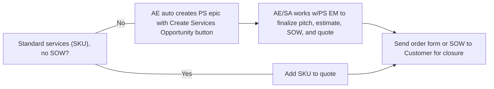

サービスの販売方法については、[セールスイネーブルメントセッション](/handbook/customer-experience/professional-services-engineering/sales-enablement)もご視聴いただけます。

社内のチームメンバーは、Professional Services のプロセス全体を理解するために、詳細な[社内ハンドブックページ](https://internal.gitlab.com/handbook/customer-experience/professional-services/)を参照してください。

## パートナーのプロフェッショナルサービスについての注意

[Professional Services の販売に関するエンゲージメントルール](/handbook/sales/selling-professional-services)を必ず守り、特に以下の点に注意してください:

- まず、お客様／見込み客に資格を持つ優先プロフェッショナルサービスパートナーがいるかを確認し、そのパートナーと連携してお客様／見込み客向けのソリューションを検討することから始めます。
- **SMB** クライアントは [SKU 提供物](https://about.gitlab.com/services/catalog/) を購入できます。すべてのカスタムな **SMB** ニーズは、[ROE](/handbook/sales/selling-professional-services) で概説されているとおり、プロフェッショナルサービスのチャネルパートナー経由でルーティングしてください。詳細は下記の FAQ を参照してください。
- SFDC で GitLab Professional Services の Opportunity を作成した後、何らかの理由で作業がパートナーによる販売・提供に移行した場合は、SFDC の Professional Services Opportunity を **「closed lost」** に更新することを忘れないでください。次に、その作業に対してパートナーが登録する Services Attach Registration が、SFDC の関連するライセンス Opportunity に必ず紐付けられるようにします。このプロセスについて質問があれば、（SFDC のパートナーアカウントで確認できる）パートナー担当の Channel Account Manager と連携してください。

## GitLab が Professional Services を販売するワークフロー

GitLab Professional Services の販売には主に 4 つのステップがあります:

1. 必要な適切なサービスを特定する。
1. SFDC に適切なライセンスまたは子 Opportunity が存在することを確認する（[詳細は後述](#step-2-create-the-opportunity-in-sfdc)）。
1. [担当の Professional Services Engagement Manager](https://docs.google.com/document/d/1bdVOf3jL6aJF79qRMFLQsmMxIgQh5ZQ-WiLuNgsWB08/edit?tab=t.b4x70ea3f0er#heading=h.qzgxpwqxme5)に連絡し、必要に応じて提案資料、概算、見積、SOW を作成するか、Professional Services 全般のポジショニングについて支援を受ける。
1. 見積を確認し、Opportunity をクローズする。

### ステップ 1: 適切なサービスを特定する

AE は、PS チームが提供する一般的なサービスを[フルカタログ](https://about.gitlab.com/professional-services/catalog/)で確認できます。AE は、顧客要件に基づいて必要なサービスを選択するために、SA/CSM の支援を得ることができます。

### ステップ 2: SFDC で Opportunity を作成する {#step-2-create-the-opportunity-in-sfdc}

AE は[Professional Services Only Opportunity を作成](/handbook/sales/field-operations/gtm-resources/#creating-a-professional-services-opportunity)します。

### 標準サービスのみの場合

顧客がサービスカタログから標準サービスのみを必要とする場合、AE は新しく作成された SFDC PS Opportunity 内から以下の手順で見積を生成できます:

1. `New Quote` をクリックします。
1. 適切な請求先アカウントを選択します。_Quote Type_ セクションで `New Subscription` を選択します。`Next` をクリックします。
1. _Create New Subscription Quote_ 画面で、必要に応じて必須フィールド（例: _Start Date_）を更新します。`Next` をクリックします。
1. _New Quote Flow_ 画面で、_New Quote Flow_ の隣のドロップダウンボックスをクリックし、`Add Add on Products` を選択します。
1. `Professional Services and Training` の行で、`Select Plan` のドロップダウンをクリックして、Opportunity に追加できる現在の SKU 提供物を確認します。`Next` をクリックします。

上記の手順に従った後、`Generate PDF` をクリックして、署名のために顧客と共有する Order Form を取得します。AE は顧客と会ってサービスの成果物、期間、価格を確認し、カスタマイズが不要であることを確認すべきです。必要に応じて、再度 EM の支援を得ることができます。

### カスタムスコープサービス {#custom-scoped-services}

アカウントチーム（AE/SA/CSM）が、顧客が[フルカタログ](https://about.gitlab.com/services/catalog/)に記載されているもの以外のサービスを必要とすると判断した場合は、標準の親ライセンスまたはサブスクリプション Opportunity から `Create Services Opportunity` ボタンを使用して、子の PS Opportunity を作成し、PS Epic と関連スコーピング Issue の作成を開始します。これにより、[アサインされた PS Engagement Manager](https://docs.google.com/document/d/1bdVOf3jL6aJF79qRMFLQsmMxIgQh5ZQ-WiLuNgsWB08/edit?tab=t.0#heading=h.qzgxpwqxme5) のキューに Issue が追加され、次のステップについてフォローアップされます。カスタムスコープの契約に関する詳細は、[詳細手順](#custom-scoped-services-detailed-workflow) を参照してください。

### Professional Services 見積の作成手順

Deal Desk は、上記いずれのサービスオプションでも見積を必要とします。見積の作成方法は[こちら](/handbook/sales/field-operations/sales-operations/deal-desk/#quoting-professional-services)で確認できます。

### ステップ 3: サービス Opportunity のポジショニングとクローズに向けて担当の PS EM に連絡する

標準 SKU の場合、Order Form は SFDC の Quote オブジェクトから直接[こちら](/handbook/sales/field-operations/sales-operations/deal-desk/#quoting-professional-services)で生成されます。顧客から受領したら、署名済みバージョンをアップロードします。

カスタムスコープの SOW については、Professional Services Engagement Manager に顧客との会話に参加してもらい、プロフェッショナルサービスの提案と正確な概算の提示を支援してもらいます。アサインされた Engagement Manager から SOW を受け取り、顧客から署名付きで戻ってきたら、SOW ドキュメントを SFDC の PS Opportunity に添付します。

### ステップ 4: Opportunity をクローズする

### Closed Won

サービスが提供され、プロジェクトがクローズしたら、SAE/ISR は顧客から署名を取得すべきです。SAE/ISR は Opportunity を `Closed Won` ステータスに移動すべきです。

契約が `Closed Won` に近づくにつれ、[PS エンゲージメント開始までの典型的なリードタイム](/handbook/customer-experience/professional-services-engineering/working-with/#lead-time-for-starting-a-professional-services-engagement)を踏まえて、[Professional Services の Slack チャンネル](/handbook/customer-experience/professional-services-engineering/working-with/#slack)で `@ps-scheduling` に潜在的な開始日の特定を必ず依頼してください。

### パートナーへの移行 - Closed Lost

SFDC で GitLab Professional Services Opportunity を作成した後、何らかの理由で作業がパートナーによる販売・提供に移行した場合は、SFDC の Professional Services Opportunity を **「closed lost」** に更新することを忘れないでください。次に、その作業に対してパートナーが登録する Services Attach Registration が、SFDC の関連するライセンス Opportunity に必ず紐付けられるようにします。このプロセスについて質問があれば、（SFDC のパートナーアカウントで確認できる）パートナー担当の Channel Account Manager と連携してください。

### カスタムスコープサービスの詳細ワークフロー {#custom-scoped-services-detailed-workflow}

1. アカウントチーム: 標準のライセンスまたはサブスクリプション親 Opportunity から `Create Services Opportunity` ボタンを使用して、子の PS Opportunity を作成します。
1. SA/CSM: 顧客要件に関する初期スコーピング詳細を、自動生成されるスコーピング Issue に追加します。
1. SA/CSM & PS Engagement Manager: 顧客との詳細スコーピングコールを実施します。
1. PSEM: 顧客向けにカスタム SOW と価格を策定します。
1. アカウントチーム: SOW を顧客に提供し、Salesforce (SFDC) の Opportunity に追加します。
1. 署名のために送付します（ソフトウェア契約条件と同様）。
1. Closed Won となった時点で、PS チームがスタッフィングを処理します。平均リードタイムは毎週更新されます。クライアントへの期待値設定のため、EM に確認してください。

<!-- ### Detailed Process

1. Sales and account team to introduce early in discussions.
1. The SA can do basic scoping and use the [calculator](/handbook/customer-experience/professional-services-engineering/selling/#services-calculator) for an estimate.
  - This should be a good estimate to secure budget.
1. Customer should execute Subscription Agreement AND Consulting Services Agreement.
1. The SA can use the [custom SoW scoping details](/handbook/customer-experience/professional-services-engineering/professional-services-presale-methodology/#2-scoping) page to help drive the conversation and uncover required capabilities for the custom SoW.
1. The SA will create the SoW from the [calculator](/handbook/customer-experience/professional-services-engineering/selling/#services-calculator), scoping the project and estimating both schedule and cost for the SoW.
1. The calculator automatically creates an approval issue on the [SoW Proposal Approval board](https://gitlab.com/groups/gitlab-com/customer-success/professional-services-group/-/boards/1353982?&label_name[]=Services%20Calculator).
1. SA: Check and add any more details to the issue created on the SoW Proposal Approval board.
1. SA: Fill out any additional scoping details. Ensure the issue is assigned to a Solutions Manager for review, and move it to the `proposal::Scoping` step.
1. SA & PSE: Conduct more detailed scoping call (only when needed) to [prepare SoW](/handbook/customer-experience/professional-services-engineering/#statement-of-work-creation).
1. If there are additional scoping questions needed to scope the engagement, Professional Services Engineering will inform the account team within three (3) business days of this call.
1. Once all scoping questions are complete, move the SoW to the `proposal::Writing` step.
1. Once written, move the SoW to the `proposal::Cost Estimate` step where a Manager of Professional Services will provide a [cost estimate](/handbook/customer-experience/customer-success-vision/#professional-services-standard-cost) used to calculate the expected margin for the project. It will be completed and ready for the account team review within one (1) business week.
1. Move the SoW to the `proposal::ReadyForApproval` step.
1. The SoW is approved by the Senior Director of Professional Services or VP of Customer Success.
1. Move the SoW to the `proposal::Approved` step. Assign the issue to the SA for delivery to the customer via the account team. -->

## FAQ

### 利用できる SKU はありますか？

はい - 既製のアイテムについては [SKU](https://about.gitlab.com/services/catalog/) があります。

### 1 日または 1 時間あたりの料金はいくらですか？

現時点では時間単位や日単位の料金はありません。今後も時間料金の導入予定はありません。GitLab サポートと同様に、私たちの Professional Service グループのミッションは時間を請求することではなく、お客様の成功を達成することです。サポートをコールや時間単位で提供しないのと同様に、Professional Services を日や時間単位で提供することはしません。

将来的には、日料金やオンサイトサポートの日料金が登場するかもしれません。しかし、上記と同じ理由で、現在は提供していません。

### 顧客がトレーニングのみを希望する場合はどうしますか？

顧客が EE 顧客の場合、トレーニングを提供できます。トレーニング SKU は上記の SKU リンクに加え、[GitLab University](https://university.gitlab.com/learn/dashboard)にも記載されています。ただし、カスタムトレーニングは、価格を見積る前に Customer Success 部門でスコープを確定する必要があります。Account Executive はまた、トレーニングのみが必要な理由のユースケースを提供する必要があります。

ユースケースの例:

- 顧客のライセンス利用率が低く、解約防止と、追加のグループや他のビジネスユニットへの利用拡大を支援する必要がある。

### CE 顧客にはどのようなオプションがありますか？

GitLab CE は、ユーザー管理やワークフロー制御のニーズが最小限の個人プロジェクトや小規模グループに最適です。これらのグループは典型的にはスケールされた実装やトレーニングへの注力をあまり必要としないため、私たちは現在、CE 顧客には実装、統合、トレーニングサービスを提供していません。多くの[パートナー](https://about.gitlab.com/partners/)がこのようなサービスを提供しています。ただし、CE インスタンスを運用してきた多くの顧客が GitLab のスケールされた実装への移行を検討する場合、お客様の長期的なニーズを判断するために [Discovery Engagement](/handbook/customer-experience/professional-services-engineering/offerings/#discovery-engagement) を必要とすることが多いです。

顧客が CE から EE にアップグレードする場合、移行に際してサービスを必要とするのであれば、移行の要件をスコープするために Professional Services を関与させる必要があります。

### SMB 顧客にはどのようなオプションがありますか？

SMB 顧客は私たちのプロフェッショナルサービス提供物に十分な予算がないことが多く、私たちは伝統的に[チャネルパートナー](https://about.gitlab.com/partners/)を通じてニーズに応えようとしています。クライアントが私たちの [SKU](https://about.gitlab.com/professional-services/catalog/) のうち 1 つ以上の予算を持っている場合は、SKU を添付でき、Professional Services チームとスコーピング Issue を作成する必要はありません。

ご注意: GitLab SaaS への移行には現在、admin トークンの使用が必要であり、これはパートナーには提供されていません。そのため、これらの移行は **必ず** 現時点では GitLab Professional Services チームを通して実行する必要があります。
