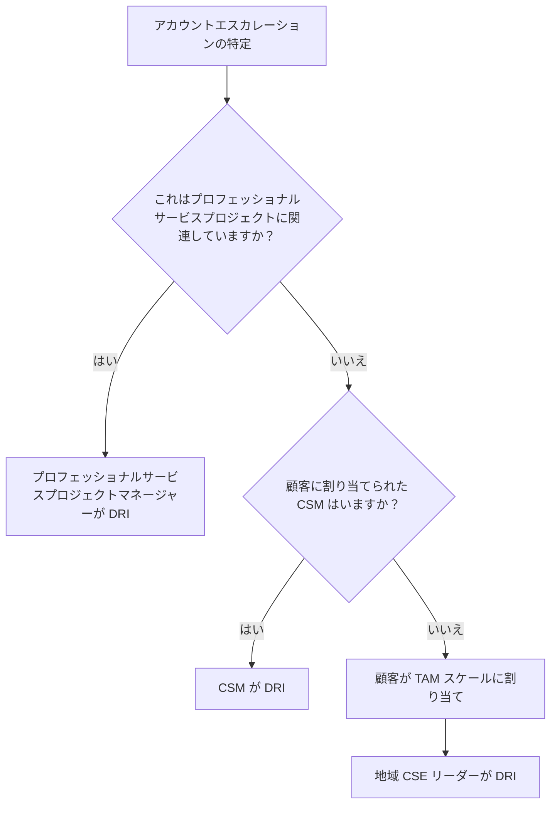
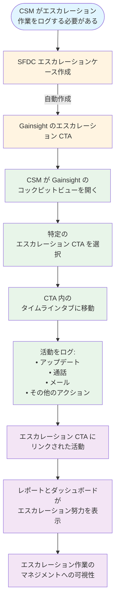

追加の CSM 関連ハンドブックページは [CSM ハンドブックホームページ](/handbook/customer-success/csm/)をご覧ください。

---

## 背景

エスカレーションには少なくとも 2 つの異なる形態があります:

1. アカウントエスカレーション。これは、顧客が課題を表明した場合、または GitLab チームメンバーが顧客が困難な状況に直面していることを特定した場合に発生します。これは特定のサポートチケットに関連している場合もそうでない場合もあります。GitLab の誰でも[アカウントエスカレーションを開始](#opening-the-escalation)し、[適切なグループのリーダーシップに回覧して DRI を見つける](#escalation-dri)ことができます。
1. サポートチケット注意リクエスト（STAR）。これは、オープンなサポートチケットの進みが遅すぎる、または優先度を上げる必要があると判断された場合に発生します。

このハンドブックエントリの目的は、__アカウントエスカレーション__のプロセスを説明することです。サポートケースに注意が必要な場合や重大度を上げる必要がある場合は、アカウントエスカレーションではなく STAR プロセスに従ってください。サポートチケットのエスカレーションをリクエストする方法の詳細については、[サポートチケット注意リクエスト](/handbook/support/internal-support/support-ticket-attention-requests/)を参照してください。

サポートアカウントエスカレーションは、複数のサポートチケットにわたる遅延、チケット内のサポート対応に対する顧客満足度、サポート体験に関する組織的な懸念、またはその他のアカウント関連の問題に焦点を当てる必要があります。サポートチケットの優先度を上げるためにアカウントエスカレーションを開始__しないでください__。

プロセスの詳細なウォークスルーについては、GitLab Unfiltered にログインしてこの[動画](https://youtu.be/-nDaRndgy4Y)をご覧ください。

## 目的

アカウントエスカレーションを管理するためのプロセスを定義し、顧客エスカレーションのコミュニケーション、活動、期待のフレームワークを定義します。

## 対象範囲

このプロセスは、CS 担当顧客のエスカレーションに対応します。戦略的なパートナーシップや関係が存在する場合は、他のセグメントにも適用できます。GitLab のすべてのチームメンバーが顧客に代わってアカウントをエスカレーションできます。

## 重大度レベルの定義 {#definitions-of-severity-levels}

| 重大度レベル | 説明 | ケイデンス | 関与レベル |
| ------------ | ---- | ---------- | ---------- |
| クリティカル | 顧客がソリューションをデプロイまたは使用する能力に重大な影響を与える主要な問題、ソリューションの損失や使用リスク、顧客の高い損失リスクや大幅な縮小、または関係とブランドへの重大なリスク。 | 毎日 | VP of Sales、Product、CRO、CEO、VP of Customer Success、グローバル/公共部門 CSM リーダー |
| 高 | 顧客がソリューションをデプロイまたは使用する能力に重大な影響を与える主要な問題、現在の採用リスク、顧客損失または縮小リスク、アカウントの将来の成長、関係へのダメージ。 | 週に複数回 | VP of Sales、Product、CRO、CEO、VP of Customer Success、グローバル/公共部門 CSM リーダー |
| 中 | 顧客が製品をデプロイまたは使用する能力に影響を与える問題、現在の採用と更新のリスク。 | 週次から隔週 | グローバル/公共部門 CSM リーダー |
| 低 | 顧客が製品をデプロイまたは使用する能力に影響を与える問題、顧客の価値実現、タイムライン、顧客満足度、採用レベルへのリスク。 | 通常のコミュニケーション | 地域 CSM マネージャー、アカウントマネージャー |

- ケイデンスは、顧客への内部および外部のミーティングとコミュニケーションのケイデンスを指します。
- 関与レベルは、内部コミュニケーションと認知の範囲を定義します。関与している問題の種類に基づいて、他の人を含めることができます。

### エスカレーション DRI {#escalation-dri}

エスカレーションの DRI は、以下のオプションを順番に評価することで決定されます:

1. エスカレーションが進行中のプロフェッショナルサービスプロジェクトに関連している場合、プロフェッショナルサービスプロジェクトマネージャーがエスカレーションの DRI になります。
1. エスカレーションが進行中のプロフェッショナルサービスプロジェクトに関連していない場合で、アカウントに CSM が割り当てられている場合は、CSM が DRI になります。
1. 顧客に割り当てられた CSM がいないが、TAM スケール（カスタマーサクセスエンジニアリング）に割り当てられている場合は、地域 CSE リーダーが DRI となり、CSE が必要に応じて技術サポートを提供します。

エスカレーション開始時に DRI を決定する必要があります。DRI は以下の責任と主要なステップを持ちます:

- 解決へのアプローチの全体的な説明、計画とアプローチが理解されていることの確認
- 内部の GitLab および顧客リソースの調整によるトラブルシューティングと問題解決の推進
- 顧客および内部コミュニケーションの管理（非同期および同期）
- 次のステップの所有、緊急度レベルに応じた適切なタイムラインとともに決定・明確な伝達の確保

### エスカレーション（プロフェッショナルサービスプロジェクト以外） {#escalation-for-non-professional-services-projects}

- DRI はアカウントエンゲージメント（チケットではなく）の管理を担当します。これには以下が含まれます:

  - フォローアップ活動のための内部チームおよび顧客ミーティングの管理
    - 注意: DRI が問題の解決を遅らせないよう、DRI はすべてのミーティングに参加する必要はありません（例: 顧客とサポート/開発との技術的なトラブルシューティング）
  - 顧客との内外のエスカレーションプロセスの推進・調整（関連するコミュニケーションとエグゼクティブレベルのミーティングを含む）
  - Salesforce での CS Help - エスカレーションサポートケースの開始またはレビュー
  - Gainsight での割り当てられたエスカレーションタスクの管理
  - 顧客関連の問題（例: 応答の遅延、オープンなアクション、非準拠のインストールまたは製品使用など）のエスカレーションポイントとして機能
  - 機能強化リクエストに関連するエスカレーションのための Product へのビジネスケースの正当化とエスカレーションの作成
  - Gainsight タイムラインへのアップデートの投稿（一時的な Slack チャンネルと `#escalated_customers` Slack チャンネルの両方への通知をトリガー）

- サポートエンジニアリングの責任:

  - 技術リソース（開発、品質保証、SRE、サポートエンジニアリングスタッフなど）との協力による技術的問題の解決推進
  - 24x7 インシデント解決とエスカレーションプロセスの管理（サポートエンジニアリング、SRE、開発）
  - エグゼクティブおよび顧客コールのサポート（必要に応じて）

エスカレーションが高または クリティカルで開始され、かつエスカレーションが製品に関連する場合は、製品 DRI が必要です。この[リスト](https://docs.google.com/spreadsheets/d/124nDAb7p6yViLCsEHaqQTcDTMMT2-FPxeTwZxKOyLwM/edit?gid=0#gid=0)から該当する製品 DRI を割り当ててください。

### アカウントエスカレーションとインシデントエスカレーションの違いは何ですか？

- このページでは、顧客に影響を与える問題が単一のインシデントまたは問題の集積であり得るアカウントレベルのリスクについて説明します。評価では顧客への影響、その顧客との将来のビジネスへのリスク、GitLab ブランドを考慮します。
- テクニカルサポートは、エンジニアリング、セキュリティ、インフラチームへのエスカレーションを含む、サポートケースの解決推進に最終的な責任を持ちます。インシデントエスカレーションプロセスは、単一のインシデント/サポートケースに活用する必要があります。

- GitLab.com での広範な問題が疑われる場合は [GitLab.com インシデントを宣言する](/handbook/engineering/infrastructure-platforms/incident-management/#report-an-incident-via-slack)
- 標準の優先順序外での処理が必要なコンテキストがあるケースについては[個別のサポートチケットをサポートマネジメントにエスカレーションする](/handbook/support/internal-support/support-ticket-attention-requests)
- S1/インスタンスダウンの問題でオンコールのサポートエンジニアに直接連絡するには、顧客に[緊急サポートをトリガー](https://about.gitlab.com/support/#how-to-trigger-emergency-support)してもらう
  - 顧客が緊急事態を起こそうとしたがオンコールエンジニアがページされなかったという情報を受け取った場合は、[オンコールサポートマネージャーをページ](/handbook/support/on-call/#engaging-the-on-call-manager)することもできます。
- このページでは、アカウントエスカレーションのさまざまなレベルに対する追加のサポートと運用手順を概説しています。

## エスカレーションの開始、管理、クローズ

以下のステップはエスカレーション DRI が実施します:

### エスカレーションの開始 {#opening-the-escalation}

__即座に__

1. [CS Help リクエスト](#cs-help-request)を開始またはレビューする
      1. CSM が DRI の場合は、CS Help - エスカレーションサポートケースを開始する
      1. 地域 CSE リーダーが DRI の場合は、エスカレーションを特定した AE、RM、SA、または他の GitLab 従業員によって開始された CS Help - エスカレーションサポートケースをレビューする
1. GitLab 内部でのエスカレーション中のコミュニケーションを促進するための [Slack チャンネル](#temporary-slack-channel)を作成する
1. [エスカレーション DRI と即座の依頼を特定する](#identify-escalation-dri-and-immediate-asks)
1. `#escalated_customers` でのエスカレーション宣言の自動確認を待つ

__24 時間以内に__

1. エスカレーション実行中の[内部スタンドアップケイデンス](#internal-standup-cadence)シリーズを設定して文書化し、詳細をエスカレーションケースに記載する

__継続的に__

1. [重大度レベルの定義](#definitions-of-severity-levels)で説明されているケイデンスに従って、Gainsight ケース CTA にアップデートを投稿する
1. [CS Help リクエスト](#cs-help-request)の終了基準と DRI を最新の状態に保つ

#### 一時的な Slack チャンネル {#temporary-slack-channel}

このチャンネルはエスカレーションがクローズされるまで開いたままにし、エスカレーションケースに記載します。チャンネル名は #esc_顧客名 とし（データ保持ポリシーに含まれるよう必ず #esc_ で始める）、パブリックチャンネルにすることで、関連する GitLab 内部の関係者が簡単に追加/チャンネルを見つけられるようにします。一時的な Slack チャンネルの開始と管理に関するその他のヒントとコツを以下に示します:

- a. エスカレーションチャンネルに開始メッセージを作成します。このメッセージにはエスカレーションケースへのリンクと最初の依頼を含めます。また、顧客ノートドキュメントへのリンクも入れます。
  - 開始用のメッセージ例:
    - "*ようこそ！このチャンネルは、ユーザーベース全体に影響を与えている継続的なパフォーマンス問題に関する <顧客名> エスカレーションのチャンネルです。*"
      - *エスカレーションケースは "<リンク>" で準備・利用可能です*
      - *DRI（CSM）からの GitLab マネジメントへの最初の依頼/必要事項がエスカレーションケースに定義されています - 引用:*
        - "*パフォーマンス問題の根本原因を分析し、ユーザーのパフォーマンス問題を軽減するための潜在的な変更を特定するために、日次でお客様と関わることができる GitLab チーム（メンバー）が必要です。*"
        - "*根本原因が特定されたら、必要な変更を実施するためにお客様と協力するチームが必要です。この変更は、設定の更新から GitLab プラットフォームのアーキテクチャの変更、または基盤となるインフラの変更のためのクラウドベンダーサポートの関与まで多岐にわたる可能性があります。*"
    - "次は何ですか？"
      - "お客様チームとの次回の同期は月曜日の CEST 午前 10:30 にスケジュールされています。その時点で、翌日以降のお客様との関与（午後の別途コールになる可能性あり）のために紹介できる社内チーム（メンバー）を定義しておきたいと思います。"

- b. 投稿したら、開始メッセージをチャンネルにピン留めして全員が簡単に見つけられるようにします。また、エスカレーションケースリンクを SLACK チャンネルのブックマークとして追加します。

#### CS Help リクエスト {#cs-help-request}

[エスカレーション（プロフェッショナルサービスプロジェクト以外）](#escalation-for-non-professional-services-projects)が特定された場合は、Salesforce にエスカレーションケースを作成します。ケース開始の手順:

1. Salesforce のアカウントページに移動する
1. 「Opportunities」の下にある次の更新機会に移動する。「Close Date」の降順でオポチュニティリストをソートすると便利です。（注意: オポチュニティが見つからない場合は、Salesforce アプリを変更する必要があるかもしれません。左上隅の 9 ドットのボックスをクリックして、Salesforce アプリを「Sales」に変更してください）
1. 右上隅の「Request Support」をクリックし、ドロップダウンフィールドで「CS Help」をクリックする
1. ケースタイプを選択する: エスカレーション（CSM/CSE アカウント）
1. エスカレーションケースの必須フィールドに入力する。以前に作成した内部顧客エスカレーション Slack チャンネルへのリンクを含めます。
1. 必須フィールド「Internal Customer Escalation Slack Channel」に Slack チャンネルリンク（チャンネル名だけでなく）を貼り付けます。このリンクを取得するには、Slack で #esc_顧客名 チャンネルにカーソルを合わせて右クリックし、コピー > リンクをコピーに進みます。このリンクを Salesforce の必須フィールドに貼り付けます。
1. 「Create case」をクリックする
1. 開いたケースの他のフィールドに入力する: 顧客コラボレーションプロジェクト、顧客ミーティングノート、エスカレーション終了基準。この時点で、ケース開始時に入力したフィールドを編集することもできます。

CSM 管理アカウントの場合、ケースオーナーは割り当てられた CSM になります。CSE アカウントの場合、ケースオーナーは地域 CSE リーダーになります。

Salesforce ケースは、その特定の顧客の Gainsight CTA を作成します。これは Gainsight コックピットで確認できます。Salesforce と Gainsight 間の同期は 2 時間ごとに行われます。Gainsight CTA が作成されると、ケースオーナーは必須タスクを完了するための Gainsight 通知を受け取ります。データは Salesforce と Gainsight 間で双方向であるため、どちらのツールでも変更できます。ただし、すべてのエスカレーションアップデートは、「Health Update」タイプのタイムラインエントリを追加することで Gainsight CTA に行う必要があります（これはレッドアカウント管理に使用されるのと同じタイムラインエントリタイプです）。

#### 内部スタンドアップケイデンス {#internal-standup-cadence}

エスカレーション実行中の内部スタンドアップケイデンスシリーズを設定して文書化し、詳細をエスカレーションケースに記載します。

- エスカレーションに関与している各チームからの主要なステークホルダーをカレンダー招待に直接招待します。
- 一時的な Slack チャンネルで内部スタンドアップについて投稿します。
- 一時的な Slack チャンネルにエスカレーションケース URL を投稿し、メッセージをピン留めして見つけやすくします。
- ヒント: 各スタンドアップの 10 分前に、エスカレーションケースと顧客ノートドキュメントへのリンクと、予定時刻にスタンドアップが行われるというメモを投稿します。SLACK でメッセージをスケジュール・自動化することもできます。

内部ケイデンス中は、終了基準または DRI の変更をメモし、エスカレーションケースに変更を反映させてください。

#### エスカレーション DRI と即座の依頼の特定 {#identify-escalation-dri-and-immediate-asks}

このエスカレーションの最初の依頼と必要事項（最初に進捗するため）を、できる限り明確に書き留め、それに[ブックマーク](https://support.google.com/docs/answer/45893?hl=en&co=GENIE.Platform%3DDesktop#zippy=%2Ccreate-a-bookmark)を追加します。[エスカレーション Slack チャンネル](#temporary-slack-channel)内の最初のメッセージにリンクできます。前述のとおり、GitLab エグゼクティブ/マネジメントチームがエスカレーションの終了基準を理解する必要があるため、できる限り具体的に記載してください。

例:

- 必要なスキル（リモート EMEA タイムゾーン）
- プロダクションログの分析能力
- GitLab の大規模プロダクションアーキテクチャへの精通
- SQL クエリを理解する能力
- PostgreSQL、Patroni、PGBouncer への精通

#### エスカレーションの宣言 {#declare-the-escalation}

Salesforce でエスカレーションケースが開始された後、エスカレーションを宣言するための投稿が自動的に `#escalated_customers` チャンネルに追加されます。このプロセスは PubSec 顧客を除くすべての顧客に適用されます。PubSec 顧客の場合は、以下のテンプレートを使用してエスカレーションを手動で投稿する必要があります:

- New Escalation
- __Customer__: "顧客名"
- __Slack Channel__: "#esc_顧客名"
- __Meeting Notes__: "<リンク: 顧客ミーティングノート>"
- __SFDC Escalation case URL__: "<リンク: エスカレーションケース>
- __Severity__: High
- __Status__: Opened
- __Product DRI__: "[割り当てられた製品 DRI](https://docs.google.com/spreadsheets/d/124nDAb7p6yViLCsEHaqQTcDTMMT2-FPxeTwZxKOyLwM/edit?gid=0#gid=0)"
- __Support DRI__: "サポートの関与が必要な場合は @support-manager-oncall Slack ハンドルを使用します。問題の説明を含むサポートチケットが開かれていることを確認してください。サポートは[RFH プロセス](/handbook/support/workflows/how-to-get-help/#how-to-formally-request-help-from-the-gitlab-development-team)に従ってエンジニアリングと連携します。"
- __Description__: "<例: 顧客プラットフォームは数週間前からパフォーマンス問題の影響を受けており、ユーザーは日常的に影響を受けています。これにより顧客は重大な状態に陥っています。パフォーマンス問題はライセンス拡張にもリスクをもたらしています。>"
- __FYI__: "<自分のマネージャーをタグ>"

エスカレーションが製品に関連する場合は、製品 DRI が必要です。この[リスト](https://docs.google.com/spreadsheets/d/1x44kzJE4_Ixj20utn4g5Mggn1Jc3kKMWaY16F2WmLWg/edit#gid=242012002)から該当する製品 DRI を割り当ててください。製品 DRI は #esc_顧客名 チャンネルに追加され、エスカレーション全体を通じて製品関連の項目を推進します。

### エスカレーションの管理

DRI はここで概説されている機能を所有します:

- エスカレーションの状態が大幅に変化した場合は、Gainsight エスカレーション CTA > タイムライン > アクティビティタイプ = 「Health Update」にアップデートが記録されていることを確認します。
- 「Post to Slack」フィールドのドロップダウンで「Update」を選択します。これは `#escalated_customers` チャンネルに送信される自動通知をトリガーするために使用されます。この時間ごとのプロセスは PubSec 顧客を除くすべての顧客に適用されます。PubSec 顧客の場合はアップデートを手動で投稿する必要があります。
- エスカレーションアップデートで提示される情報の一貫性を確保するために、「Escalation Update」タイムラインテンプレートを適用します（タイムラインの「Notes」ボックスの右上隅から選択可能）。
- Gainsight エスカレーションアップデートタイムラインテンプレートの質問は以下の通りです:

1. エスカレーションの現在の状態は何ですか？
1. エスカレーションケースを前進させるための次のステップは何ですか？
1. 次のステップのオーナーは誰ですか？
1. このエスカレーションの終了基準は変わりましたか？変わった場合、新しい終了基準は何ですか？

- 必要に応じてエスカレーションに関与しているすべての DRI に ping しながら、一時的な顧客 Slack チャンネルにも投稿してください。
- 一時的なエスカレーション Slack チャンネルを最低でも毎日更新する
- エスカレーションの進捗は定期的に顧客にも伝える必要があります。状況に応じて週 3 回以上を目安としてください。

ヒントとコツ:

- エスカレーションケースと一時的な Slack チャンネルを最新のステータス/次のステップで更新するための毎日のリマインダー（例えば退社前の午後）を Google カレンダーに設定します。これにより全員が情報を把握し続けられます。
- エスカレーションの状態に応じて、内部ケイデンスミーティングを設定し、必要なすべてのチームメンバーを含めることも検討してください。
  - CSM、AE、SA、CSM およびセールスリーダーシップ、および関与している可能性のある他のステークホルダー。

#### 1 顧客に対する複数のエスカレーション

まれに、複数の理由でエスカレーションが同時に必要になることがあります。エスカレーションの理由と解決手順を集中させるために、各状況ごとにエスカレーションを設けるべきです。各エスカレーションは宣言され、関連するステークホルダーを含む別々の Slack チャンネルが開かれます。混乱を減らすために、チャンネル名にエスカレーションの理由を含めてください（例: 1 つの顧客が DAST 問題とパフォーマンス問題の両方でエスカレーションされている場合、esc_顧客名_dast と esc_顧客名_perf の 2 つのチャンネルが必要です）。各エスカレーションは別々に定義されたエスカレーションプロセスに従いますが、アカウントチームとリーダーシップは全体的なアカウントの健全性がどこにあるかについてアラインを保ち、両方のエスカレーションに関連するアクションがあるかどうかについて確認する必要があります。アカウントの全体的なセンチメントに重大なリスクがある場合は、E グループなどの追加リーダーシップの関与が正当化される場合があります。

## エスカレーションエンゲージメントの追跡

エスカレーション管理は、顧客の更新と満足度に直接影響する重要な作業です。この作業が可視化・計測可能であるよう、CSM は Gainsight でエスカレーションエンゲージメント活動を追跡する必要があります。これにより、リーダーシップはエスカレーションに必要な時間投資を把握し、パフォーマンスレビューでこの作業を認識できます。

### エスカレーションエンゲージメントを追跡する理由

- __可視性__: エスカレーション作業をリーダーシップとパフォーマンスメトリクスに可視化させる
- __説明責任__: CSM がエスカレーション管理に投資する時間と労力を文書化する
- __レポーティング__: エスカレーションの量、費やした時間、成果を示すダッシュボードとレポートを有効化する
- __認識__: エスカレーション管理が高価値な顧客アドボカシー作業として認識されることを確保する

#### エスカレーション活動のログ方法

CSM は、Gainsight の__エスカレーション CTA のタイムラインタブ__に、すべてのエスカレーション関連活動（通話、メール、内部調整、アップデートなど）をログする必要があります。これは顧客タイムラインへのステータスアップデートの投稿とは異なります。

__ステップバイステッププロセス:__

1. __Gainsight を開き、コックピットビューに移動する__
   - これがアカウントのすべての CTA を管理する場所です

2. __特定のエスカレーション CTA を選択する__
   - Salesforce エスカレーションケースから自動作成されたエスカレーション CTA を見つける
   - CTA はエスカレーションケースに基づいて名前が付けられます

3. __CTA 内のタイムラインタブに移動する__
   - CTA 内で、タイムラインタブをクリックします

4. __エスカレーション活動をログする__
   - すべてのエスカレーション関連作業のタイムラインエントリを追加します:
     - 顧客通話とミーティング
     - エンジニアリング、サポート、製品、またはリーダーシップとの内部調整通話
     - 顧客とのメールコミュニケーション
     - ステータスアップデートと進捗メモ
     - エスカレーション解決を推進するために取られたその他のアクション

#### エスカレーションエンゲージメント追跡フローの可視化

#### 重要なメモ

- __すぐに開始する__: エスカレーションが開始されたらすぐに活動のログを始め、最初からすべての調整作業が記録されるようにする
- __具体的に記録する__: 各タイムラインエントリに、議論された内容、下された決定、次のステップの詳細を含める
- __現在の制限__: Gainsight タイムラインエントリは現在、実際の所要時間（時間/分）を追跡していません。タイムラインエントリは開始日時のみを記録します。Gainsight に時間追跡機能が追加されれば、CSM はエスカレーション活動に費やした時間をログできるようになります
- __ヘルスアップデートとの区別__: ヘルスアップデート（エスカレーション進捗に関するステータスアップデート）はエンゲージメント活動とは別です。両方とも CTA タイムラインにログする必要がありますが、エンゲージメント活動は CSM 作業の詳細な追跡を提供します

### エスカレーションのクローズ

- エスカレーションをクローズするには、GitLab ステークホルダーと顧客間（Issue またはメールでの文書化を含む）の明確な合意が必要です。両当事者が状況が解決されたことに合意する必要があります。

- 顧客が RCA を要求し、エスカレーションがプラットフォーム関連であった場合、GitLab エンジニアリングが RCA を主導し、エスカレーションを管理・クローズしている GitLab DRI に書面で提供します。

- エスカレーションに関連する問題が解決された場合、またはエスカレーション状態でなくなった場合:

  - Gainsight CTA にエスカレーションクロージャータイムラインエントリを投稿し、ステータスと解決内容を記録します。アップデートで「Escalation Closure」タイムラインテンプレートを使用してください（タイムラインの「Notes」ボックスの右上隅から選択可能）。
  - 「Post to Slack」フィールドのドロップダウンで「Closure」を選択します。これは `#escalated_customers` チャンネルに送信される自動通知をトリガーするために使用されます。この時間ごとのプロセスは PubSec 顧客を除くすべての顧客に適用されます。PubSec 顧客の場合はエスカレーションクロージャーアップデートを手動で投稿する必要があります。
  - 一時的な Slack チャンネルをアーカイブする
  - 顧客の CSM センチメントを Gainsight でアカウントの新しい状態を反映するように更新する

- Gainsight エスカレーションクロージャータイムラインテンプレートの質問:

- 以下の質問に答えるクロージャーアップデートを提供してください:

1. エスカレーションの状況はポジティブな結果、ネガティブな結果、または結果なしのどれで終了しましたか？
1. 定義された終了基準は満たされましたか？
1. このエスカレーションチケットのクローズに役立ったチームの行動の簡単な概要を示してください

## CSM マネージャーのエスカレーションにおける役割

CSM マネージャーの責任は、CSM が上記のプロセスに精通しており、Slack チャンネルのアップデートとエスカレーションドキュメントの管理を含むエスカレーションを積極的に管理していることを確認することです。

顧客がエスカレーション状態にある場合、解決への道は、内部ステークホルダーと顧客の両方が現在のアクションと次のステップについて明確に把握した状態で、前進し続ける必要があります。CSM マネージャーは、この前進と明確なアラインが存在することを確認し、必要に応じてアクションやアラインを推進する役割を担います。

## エンジニアリングのエスカレーションにおける役割

エンジニアリングサポートは通常サポートエンジニアリングを通じて提供されますが、一部の条件下では[エンジニアリング/プロダクトがエスカレーションに関連するバグ修正や機能リクエストを優先する](/handbook/engineering/#critical-customer-escalations)場合があることに注意が必要です。

## プロダクトのエスカレーションにおける役割

プロダクトがエスカレーションをサポートするために必要な場合があります。これは欠陥や問題を発見した場合、またはエスカレーションに対処するための優先順位付けや回避策に影響を与えるフィードバックを提起した場合に起こります。ほとんどの場合、CSM とサポートは該当エリアを担当する PM と直接協力します。

時折、顧客はエスカレーションをサポートするための安定したカウンターパートとして機能するプロダクトリーダーを必要とします。これにより、顧客は GitLab の組織構造を理解したり、エスカレーション中に PM の間をたらい回しにされる必要がなくなります。これを実現するために、以下のプロセスに従います:

1. CSM は高または クリティカルなエスカレーション状態に達した各アカウントを評価し、プロダクトメンバーが必要かどうかを判断します。
1. エスカレーションが High 状態に達した場合、グループプロダクトマネージャーまたはプロダクトディレクターが割り当てられます。クリティカル状態に達した場合は、PLT メンバーが割り当てられます。
1. エスカレーション中、GMP+ プロダクトリーダーは顧客とエスカレーションに寄り添い、安定したカウンターパートとして機能します。懸念事項に対処するために必要に応じて追加の PM を参加させますが、Slack および顧客とのコールに関与し続け、プロダクト部門の一貫した顔と代表者として存在します。
1. 個々の PM はエスカレーションに参加・離脱することがありますが、割り当てられた GMP+ プロダクトカウンターパートはエスカレーションが解決されるまで関与し続けます。

## CSE のエスカレーションにおける役割

必要に応じて、地域 CSE リーダーはエスカレーションのサポートのために CSE をリクエストします。CSE は地域 CSE リーダーと協力して次のステップを決定します。

## 関連リンク

- [サポートエンジニアリングページ](/handbook/support/)および[サポートエンジニアリングエスカレーション手順](/handbook/support/workflows/working-with-issues/)
- [製品エスカレーション Issue テンプレート](https://gitlab.com/gitlab-com/Product/issues/new?issuable_template=Product-Support-Request): ロードマップ/将来のニーズ、機能強化と Issue の優先順位付け、顧客問題のトラブルシューティングのためのプロダクトチームサポートをリクエストする
- [顧客ヘルスアセスメントとアカウントトリアージ](/handbook/customer-success/csm/health-score-triage/)
