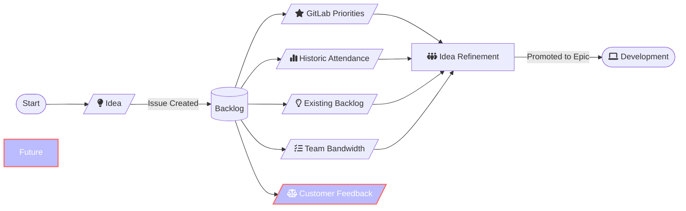

## <i class="fa-solid fa-door-open" style="color: #B197FC;"></i> CSE コンテンツハンドブックへようこそ

## <i class="fa-solid fa-signs-post" style="color: #B197FC;"></i> クイックリンク

### チームワークフロー、計画、コラボレーション

<!---
#### Issue テンプレート

- [<i class="far fa-edit"></i> 新規コンテンツ Issue](...)

--->

#### Issue ボード

- [<i class="far fa-clipboard"></i> コンテンツ開発](https://gitlab.com/gitlab-com/customer-success/customer-success-engineering/content/-/boards/7697122?label_name[]=content-idea&group_by=epic)
- [<i class="far fa-clipboard"></i> コンテンツアイデアバックログ](https://gitlab.com/gitlab-com/customer-success/customer-success-engineering/scale-cse/-/boards/7694684?label_name[]=content-idea)
- [<i class="far fa-clipboard"></i> プログラム開発](https://gitlab.com/gitlab-com/customer-success/customer-success-engineering/content/-/boards/7672022?group_by=epic)
- [<i class="far fa-clipboard"></i> リリース管理](https://gitlab.com/gitlab-com/customer-success/customer-success-engineering/content/-/boards/7672054?group_by=epic)

### ロードマップ

- [<i class="far fa-clipboard"></i> カスタマーサクセスエンジニアリングロードマップ](https://gitlab.com/groups/gitlab-com/customer-success/customer-success-engineering/-/roadmap?state=opened&sort=START_DATE_ASC&layout=MONTHS&timeframe_range_type=CURRENT_YEAR&progress=COUNT&show_progress=true&show_milestones=true&milestones_type=SUBGROUP&show_labels=true)

### チームリソース

- [<i class="far fa-calendar-alt"></i> ウェビナーとラボのカレンダー](https://university.gitlab.com/pages/gitlab-user-webinars)

### チームと連携したいですか？

- [<i class="far fa-edit"></i> コンテンツアイデアテンプレート](https://gitlab.com/gitlab-com/customer-success/customer-success-engineering/scale-cse/-/issues/new?issuable_template=content-idea-template)
- [<i class="far fa-edit"></i> コンテンツバグの報告](https://gitlab.com/gitlab-com/customer-success/customer-success-engineering/content/-/issues/new?issuable_template=bug)

---

## <i class="fa-solid fa-map-location-dot" style="color: #B197FC;"></i> CSE コンテンツチーム戦略

CSE コンテンツチームの主な目標は次のとおりです:

- 市場のニーズに合わせた、カスタマーサクセスエンジニアリングのゴールを支援する高品質で顧客に整合したコンテンツを制作する
- すべてのコンテンツを効果的にマーケティングする
- データ駆動型分析のための明確なメトリクスを確立する
- クロスファンクショナルなコラボレーションを促進する

<!---
### OKR

### Highspot

チームのコンテンツは [Highspot](https://gitlab.highspot.com/) で配布されています...

### プロダクト採用イニシアチブ

- [タイトル](Issue/Epic)（内部）。
- [タイトル](Issue/Epic)（内部）。
--->

## <i class="fa-solid fa-users" style="color: #B197FC;"></i></i> チームメンバーとフォーカス領域

私たちは[カスタマーサクセスエンジニアリングチーム](/handbook/customer-success/csm/segment/cse)のメンバーです。

| チームメンバー | 責任 |
|-------------|-------------|
| [Nicole Esplin](/handbook/company/team/#nesplin)   コンテンツストラテジスト | クロスファンクショナルコラボレーション、コンテンツ戦略、マーケティング/プロモーション、コンテンツ最適化、コンテンツデリバリー |
| [Tearyne Almendariz](/handbook/company/team/#talmendariz)   コンテンツアーキテクト | 四半期計画/バックログ管理、コンテンツ作成（デモ以外）、コンテンツオペレーション |
| [James Wormwell](/handbook/company/team/#jwormwell)   デモアーキテクト | コンテンツ作成（デモ）、デモ/ラボコンテンツ作成、デモオペレーション、デモアセットのメンテナンス |

{}
---

> **注**: 以下の RACI チャートは、各 `責任` 領域においてコンテンツ作成のステークホルダーがどのように連携するかを理解するために使用できます。チームの進化と成熟に合わせて継続的に更新されます。

### コンテンツチームの責任マトリクス

| 責任 | コンテンツストラテジスト | コンテンツアーキテクト | デモアーキテクト | CSEs | CSSO | CSE リーダーシップ |
| ------------------------------------------------------------ | --------------------------- | ---------------------------------------- | ---------------------------------------- | --------- | -------------- | -------------- |
| **クロスファンクショナルコラボレーション**: 他のコンテンツステークホルダー（EDU、フィールドマーケティング、SA、DevRel）とのアライメントを維持する | DRI | Consulted | Consulted | Informed | Informed | Consulted |
| **コンテンツ戦略**: 複数のコンテンツ配信方法を通じて規模で GitLab 採用を促進するための戦略と実行を監督する（CSE の四半期目標/イニシアチブに合わせて） | DRI | Consulted | Consulted | Consulted | Informed | Consulted |
| **四半期計画/バックログ管理**: 戦略/四半期目標に合わせてコンテンツ作成がアラインされるよう、見えるバックログを整理・維持する。 | Consulted | DRI | Consulted | Informed | Informed | Consulted |
| **マーケティング/プロモーション**: 様々なチャネルを通じて可視性、エンゲージメント、インパクトを最大化するよう設計された内外の戦略を作成・実行する | DRI | Consulted | Consulted | Informed | Informed | Informed |
| **コンテンツ作成**: コンテンツ戦略に対して開発・実行する。SME と連携してデリバリーのワークバックプランを確保する | Consulted | DRI（ウェビナー、ブログ） | DRI（ラボ） | Consulted | Informed | Informed |
| **デモ/ラボコンテンツ作成** | Consulted | Consulted（デッキ、トークトラック、デリバリー） | DRI（構造、アーキテクチャ、メッセージング） | Consulted | Informed | Informed |
| **コンテンツ最適化**: データを使用して様々なチャネルにわたってコンテンツのパフォーマンス、リーチ、エンゲージメントを改善・強化する。メールテキストの作成/イテレーションとキャンペーンの有効性のモニタリングを含む | DRI | Consulted | Consulted | Informed | Consulted | Consulted |
| **コンテンツデリバリー**: スケジュールを監督し、適切な SME が最も効果的な方法でデリバリーしていることを確保する | DRI | Consulted | Consulted | Informed | Informed | Consulted |
| **コンテンツオペレーション**: GLU カレンダー（Thought Industries）の更新、Zoom 登録プロセス、すべてのコンテンツのアップロード。GS でのメールキャンペーン管理も含む。 | Informed | DRI | Informed | Informed | Consulted | Informed |
| **デモオペレーション**: ハンズオンラボのデモコードを管理する。CSE ニーズのためにアーキテクチャチームと協力する（PTO カバレッジのために SA DA が対応） | Informed | Informed | DRI | Informed | Informed | Informed |
| **GL リリース管理**: 各 GL リリース後にラーンラボを更新する。CSE 組織向けに月次 TLDR を作成し、すべてのコンテンツデリバリーに使用する。リリースにより変更されたコンテンツアセットを更新し、CSE が価値とトークトラックを理解していることを確認する | Consulted | Consulted | DRI | Informed | Informed | Informed |
{}

## <i class="fa-solid fa-book" style="color: #B197FC;"></i> コンテンツカタログ

コンテンツチームは、顧客が利用できるよう維持・再利用可能なコンテンツを作成します。

[#cse-content-team](https://gitlab.enterprise.slack.com/archives/C07EE4FNM9T) Slack チャンネルで関連コンテンツを検索したり、チームに連絡したりすることができます。

以下のセクションでは、すべてのコンテンツアセットの概要とリンクを提供します。

### コンテンツデモをサポートする環境/インフラ

- **自分でビルド -** セルフサービスのパブリッククラウドインフラ/ツール/環境。個々の AWS アカウントまたは GCP プロジェクトのアクセスは、[Sandbox Cloud Realm](/handbook/company/infrastructure-standards/realms/sandbox)ハンドブックページに記載されており、[gitlabsandbox.cloud](https://gitlabsandbox.cloud)からアクセスできます。
  - *ユースケース:*
    - *競合分析/デモ/調査*
    - *個人ランナー/フリートのデモ/調査*
    - *セルフマネージドデプロイ*
    - *顧客環境シミュレーション*
    - *自己管理デプロイメントターゲット*
- **セルフマネージド -** [cs.gitlabdemo.cloud](https://cs.gitlabdemo.cloud)（内部）で管理領域の可視性があり、[gitlabdemo.cloud](https://gitlabdemo.cloud)を通じてアクセスできる、共有カスタマーサクセス Omnibus インスタンス。デモアーキテクチャチームによってメンテナンスされています。
  - *ユースケース:*
    - *セルフマネージドのデモ/調査*
    - *管理エリアのデモ/調査*
    - *ユーザーなりすまし*
- **SaaS -** GitLab ライセンス付きデモグループ [プレミアムおよびアルティメットアクセスリクエスト](https://gitlab.com/gitlab-com/team-member-epics/access-requests/-/issues/new?issuable_template=GitlabCom_Licensed_Demo_Group_Request)（内部）。
  - *ユースケース:*
    - *ライセンスティア比較*
    - *プラットフォームの個人的な調査*
    - *アドホックデモエリア*
- [OBS Studio を使用して効果的なデモを作成する](https://docs.google.com/document/d/1kchnm55N8zx8tBBsxilWadGqBndhvb5d4eG9LsSS6DA/edit#heading=h.quzn6r2hna1l)（内部）

### ウェビナー

| タイトル | グループ | 最終更新 | YouTube |
| ------------------------------------------------------------ | ------------- | ------------ | ------- |
| [開発ライフサイクルセキュリティへの総合的なアプローチ](https://drive.google.com/file/d/11-mPw0aNXcazOMVVVvxEo97meQz1TYMW/view?usp=drive_link) | Secure | 2023-10-13 | https://youtu.be/WWA7z2WtFvM |
| [Git の基礎](https://drive.google.com/file/d/17BvOGiXmWNLYm3MXmIqZ6kAkC0b4cow7/view?usp=drive_link) | Create | 2023-10-13 | https://youtu.be/WMWoi6for1M |
| [GitLab 入門](https://drive.google.com/file/d/14vWu6oCIcWwrkNtcZw_pioC8K3c2hNEt/view?usp=drive_link) | All | 2023-12-07 | https://youtu.be/E1tKfOPKMA8 |
| [CI/CD 入門](https://drive.google.com/file/d/1V3sH4rTQSMzFfwZpzZgmi9wZJq8vSoMm/view?usp=drive_link) | Verify | 2023-10-13 | https://youtu.be/bE2YXhAVBeE |
| [高度な CI/CD](https://drive.google.com/file/d/1GlGg0Q7p7gsAGGWgZ1vj82NZmap7PX3w/view?usp=drive_link) | Verify | 2023-10-23 | https://youtu.be/9VTGW1pCTC8 |
| [AI 搭載 DevSecOps](https://drive.google.com/file/d/1Y426FrNWLIFl3u40-yXBEdy-D_RM4TAO/view?usp=drive_link) | Data Science | 2024-06-25 | https://youtu.be/4Tzp88KYzZM |
| [DevSecOps メトリクスの始め方](https://drive.google.com/file/d/1YRBQzNyp1Fdb-kt_PUFk9fYWHpCR7gOz/view?usp=drive_link) | Plan | 2023-10-23 | https://youtu.be/3Tyad8o8E_A |
| [セキュアな方法での継続的変更管理](https://drive.google.com/file/d/1ctwS4FpaEbrywn_ybZlsZDGLkfdYKe8G/view?usp=drive_link) | Secure | 2023-10-23 | https://youtu.be/oerKHtULwa0 |
| [セキュリティとコンプライアンス](https://drive.google.com/file/d/1UK56of57h-BVccZODI5awKTZUnpEq8fF/view?usp=drive_link) | Secure | 2023-10-31 | https://youtu.be/cx2sPBJOStE |
| [Jira から GitLab へ](https://drive.google.com/file/d/1ME_oU5zGtySPoAf8_I-3u5jJZW-kBMSo/view?usp=drive_link) | Verify | 2023-12-18 | https://youtu.be/wGnl2fs75Pg |
| [GitLab 管理（SaaS）](https://drive.google.com/file/d/1JQYVed7StwOBGEnzmsT7yiDmDfNSkx_a/view?usp=drive_link) | Core Platform | 2023-10-23 | https://youtu.be/lXtBV9o7q68 |
| [GitLab ランナー](https://drive.google.com/file/d/1nxglK5j8D5XsbZTaylN-HbbVJ0gKojJd/view?usp=drive_link) | Verify | 2024-01-17 | https://youtu.be/Xq0kNaGxcaM |
| [脆弱性管理戦略](https://drive.google.com/file/d/1DRhHsgeqRPGpu2NR5726QSGqg6bh7aJS/view?usp=drive_link) | Software Supply Chain Security | 2024-05-07 | https://youtu.be/CS_GlJGtnpM |
| [職務分離](https://drive.google.com/file/d/16YcUdYDNPP0x0vXzG01OsCODVnYhYe4O/view?usp=drive_link) | Software Supply Chain Security | 2024-06-18 | https://youtu.be/vFbgzta5cyA |
| [最新情報！GitLab 17.0](https://drive.google.com/file/d/11EhjSsgMepd9iZYY9vNz8LFoQPLGVNuS/view?usp=drive_link) | All | 2024-06-04 | https://youtu.be/3gROieX0-9Q |
| [CI/CD コンポーネント](https://drive.google.com/file/d/1mSj3YhvTu5llgRzqRMZ0Lk08KlFLlhp4/view?usp=drive_link) | Create | 2024-07-11 | https://youtu.be/2MosExpnxsw |
| [DAST API とセキュリティテスト](https://drive.google.com/file/d/1G8XeiaQDpGQAyd1gwLsYmaf-tp3N4p91/view?usp=drive_link) | Secure | 2024-07-12 | https://youtu.be/R6nO_0u2UqA |
| [GitLab Duo Pro AI ウェビナーのロック解除](https://drive.google.com/file/d/11zmxdA7XUGeqrHwZ2LuCtgdctajT5qu7/view?usp=drive_link) | AI | 2024-08-29 | https://youtu.be/mI9F6QCtEI4 |

> **注**: 録音は[ウェビナーマスター録音フォルダ](https://drive.google.com/drive/folders/1x0_7J30cTpfbRXjrXgG_2XOIARLusNt3?usp=drive_link)（内部）に保存されています。

### ラボ

| タイトル | プロジェクト | グループ | 最終更新 |
| ------------------------------------------------------------ | ------------------------------------------------------------ | -------------- | ------------ |
| [DevSecOps における AI](https://docs.google.com/presentation/d/1GdS0MQI53_mxQG-VvPxK2g9AmeJDmm403vSl8zZvy7I/edit?usp=drive_link) | [DevSecOps における AI](https://gitlab.com/gitlab-learn-labs/onboarding-cohort-projects/ai-in-dev-sec-ops/) | Data Science | 2024-04-30 |
| [GitLab CI](https://docs.google.com/presentation/d/1IiRo4KHAgYqmzNiLkNYEatzHo75ax1BNKy-HsHoZW3k/edit?usp=drive_link) | [CICD 採用ワークショップ](https://gitlab.com/gitlab-learn-labs/sample-projects/cicd-adoption-workshop) | Verify | 2023-10-23 |
| [GitLab 高度な CI](https://docs.google.com/presentation/d/1g36th6wlPUj9YMHooAr7M0koscEdDAnxJULTu3F93Fg/edit?usp=drive_link) | [高度な CI ラボ](https://gitlab.com/gitlab-learn-labs/onboarding-cohort-projects/advanced-ci-lab/-/tree/main?ref_type=heads) | Package/Verify | 2024-05-10 |
| [Jenkins ユーザー向け CI/CD 採用](https://docs.google.com/presentation/d/1d2u6Ls_ELgEAv8VXMatljVkPydOelUQ3_hsOvUe2k28/edit?usp=drive_link) | [CICD 採用ワークショップ](https://gitlab.com/gitlab-learn-labs/sample-projects/cicd-adoption-workshop) | Verify | 2024-01-10 |
| [セキュリティとコンプライアンス](https://docs.google.com/presentation/d/1_o1UbmM0u96f9XTpjYBLG3jnHeJuwJAVOrCg7Ri4ti4/edit#slide=id.g2e71b1d1f20_1_598) | [Tanuki Racing セキュリティとコンプライアンス](https://gitlab.com/gitlab-learn-labs/onboarding-cohort-projects/tanuki-racing-security-and-compliance) | Software Supply Chain Security/Secure | 2024-06-26 |

## <i class="fa-solid fa-folder-plus" style="color: #B197FC;"></i> コンテンツ作成プロセス

CSE コンテンツチームは、GitLab の機能、ツール、ベストプラクティスの顧客イネーブルメントと採用に焦点を当てたコンテンツを作成、プロモーション、配布します。現在作成しているコンテンツの種類は**ショートフォームデモ、ラボ、ウェビナー**です。このコンテンツは、CSE（カスタマーサクセスエンジニア）による 1:many オーディエンス向けに当初設計されていますが、1:1 の顧客エンゲージメントや GitLab 内の他の用途にも適用・活用できることを目指しています。

### コンテンツの提案

私たちは常に顧客をイネーブルするための新しいコンテンツの提案を受け付けています。まず[こちらのコンテンツアイデアバックログ](https://gitlab.com/gitlab-com/customer-success/customer-success-engineering/scale-cse/-/boards/7694684)でトピックが既に存在するか確認してください。また、まだ提案されていないコンテンツがある場合は、[アイデアテンプレートを使用してこちらからアイデアを提出](https://gitlab.com/gitlab-com/customer-success/customer-success-engineering/scale-cse/-/issues/new?issuable_template=content-idea-template)してください。

提出物は、チームのコンテンツアーキテクトが主導するバックログレビューの中で、四半期ごとにレビューおよび精査されます。アイデアが作成のために選ばれた場合、カスタマーサクセスエンジニアリンググループのエピックに昇格し、そのコンテンツタイプに関連する作成プロセスの Issue が割り当てられます。これは協力的なプロセスですが、カスタマーサクセスエンジニアリングチームのディレクターが各四半期に作成するコンテンツについての最終決定権を持っています。

私たちの目標は、測定可能で顧客に価値を提供できる、より構造化されたプロセスを確立することですが、CSE は顧客のニーズや個人の成長のために必要なトピックを研究することが推奨されています。CSE は、公式の CSE コンテンツチームのプロセスとワークフロー以外のコンテンツプロジェクトについては、マネージャーと直接話し合うよう求められています。将来のウェビナーやラボに適応することを提案したい個人プロジェクトを独自に評価するために使用できる品質保証ガイドラインと基準の策定に取り組んでいます。

#### コンテンツアイデアライフサイクル

