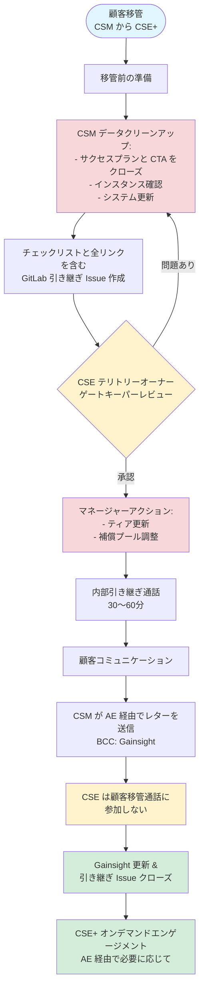

**概要**

このプロセスは、専任 CSM エンゲージメントから CSE+ プールサポートモデルへと顧客アカウントを移管するものです。

**主要原則:**

- CSE+ は**オンデマンドのプールリソース**（専任ではない）
- 顧客エンゲージメントは **AE 主導**
- **CSE は顧客移管通話に参加しない**
- タイムライン: **3〜4週間**

## プロセスフロー

## ステップバイステッププロセス

### 1. 移管前（1〜2週目）- CSM

**データクリーンアップ:**

- すべてのサクセスプランと CTA をクローズする
- インスタンス分類（本番 vs 非本番）を確認する
- 6ヶ月以上 ping がないインスタンスにフラグを立てる
- Gainsight、Salesforce、GDocs、Gong を更新する

**引き継ぎ Issue の作成:**

- [CSM-to-CSE-Handover プロジェクト](https://gitlab.com/gitlab-com/customer-success/csm-to-cse-handover/-/issues)の[Issue テンプレート](https://gitlab.com/gitlab-com/customer-success/csm-to-cse-handover/-/issues/new?issuable_template=CSM_to_CSE_handover)を使用する
- 必要なすべての情報を記入する
- リンクを追加する: コラボレーションプロジェクト、顧客ノート GDoc、Gong 録画
- `@mention` で CSE テリトリーオーナーにタグを付ける
- Gainsight タイムラインに Issue をリンクする

### 2. レビューと承認（2週目）

**CSE テリトリーオーナーレビュー**（3営業日以内）:

- すべてのサクセスプラン/CTA がクローズされていることを確認する
- インスタンス分類が正確であることを確認する
- システムが最新の状態であることを確認する

**マネージャーアクション**（CSE 承認後）:

- アカウントを TAM Scale ティアに更新する
- 補償プールを調整する
- Issue の「マネージャーアクション完了」にチェックを入れる

### 3. 内部引き継ぎ（2〜3週目）

**引き継ぎ通話**（30〜60分 | CSM + CSE テリトリーオーナー）:

- 引き継ぎ Issue を一緒に確認する
- 知っておくべき上位3事項を話し合う
- 関係のダイナミクスと注意点をカバーする
- 質問に対応する
- Issue を更新し「引き継ぎ通話完了」にチェックを入れる

### 4. 顧客コミュニケーション（3週目）- CSM

**プロセス:**

1. [承認済みテンプレート](https://gitlab.com/-/project/42504524/uploads/36d5cb3fc13f971e0af65ad321fea3fb/__NEW___CSM_Email_to_Customers_Moving_into_Scale_.docx)を使用して移管レターを下書きする
2. AE とタイミングを合わせる
3. レターを送信する（BCC: Gainsight メール）
4. Issue に送信日を更新する
5. 顧客の質問に対応する

**レターの強調事項:**

- AE = 主要連絡先
- CSE = AE 経由のオンデマンド（プールモデル、専任ではない）
- セルフサービスリソース利用可能
- **❗ CSE は顧客通話に参加しない**

### 5. 完了（3〜4週目）- CSM

- Gainsight タイムラインを更新する（完了日、引き継ぎリンク、フィードバック）
- アクティブなブックから顧客を削除する
- Issue で CSE+ のサインオフを取得する
- 引き継ぎ Issue をクローズする

## RACI

| アクティビティ | CSM | CSE テリトリーオーナー | CSM マネージャー | AE |
|----------|-----|---------------------|-------------|----|
| データクリーンアップと Issue 作成 | R/A | I | I | I |
| 引き継ぎのレビュー/承認 | C | R/A | I | - |
| ティアと補償プールの更新 | I | I | R/A | I |
| 引き継ぎ通話 | R/A | R/A | I | - |
| 顧客レターの下書き/送信 | R/A | I | C | C |
| タイミングの調整 | C | - | - | R/A |
| Gainsight 更新とクローズ | R/A | C | R/A | I |
| 成功の検証 | C | R/A | I | R/A |

**R** = 実行責任 | **A** = 説明責任 | **C** = 相談 | **I** = 情報共有

## CSM → CSE+ 引き継ぎ中の CSE の推奨責任

このセクションでは、CSE が CSM → CSE+ 引き継ぎプロセスをサポートするための**推奨**ステップを説明します。これは、**CSE が顧客移管通話に参加しない**ことを含む、上記で定義されたコアプリンシプルを補完するものであり（変更するものではありません）。これらのステップは、実現可能な範囲で従い、特定の状況に応じて柔軟に対応してください。

このセクション全体を通じて、**「担当 CSE」**は**特定のアカウントの引き継ぎをサポートしている CSE** を指します。

---

### 1. 引き継ぎ Issue を確認する

CSM が[標準テンプレート](https://gitlab.com/gitlab-com/customer-success/csm-to-cse-handover/-/blob/master/.gitlab/issue_templates/CSM_to_CSE_handover.md)を使用して引き継ぎ Issue を作成し、**CSE テリトリーオーナー**が承認したら、**担当 CSE** は以下を確認することが推奨されます:

- 確認事項:
  - **アカウント概要**と**知っておくべき上位3事項**
  - **技術的セットアップ**（デプロイメント、ティア、シート数、最終 ping）
  - **戦略的コンテキスト**（主要なユースケース、目標、ブロッカー）
  - **コラボレーションプロジェクト**、**顧客ノート GDoc**、**Gong** 録画へのリンク
- 引き継ぎ Issue のコメントとして、明確化のための質問や仮定を投稿する（例えば、部分的なチャーン、組織再編のコンテキスト、単一連絡先の状況を指摘するなど）。

> **成果:** CSE は、AE、SA、RM がこのアカウントの CSE エンゲージメントをリクエストしたときに効果的に対応するのに十分なコンテキストを持つことができます。

### 2. 短い CSM ↔ CSE 内部引き継ぎ通話をスケジュールする

すべてのアカウントで必須ではありませんが、以下の場合に CSE が退任 CSM との**15〜30分の内部同期**を手配することが推奨されます:

- アカウントが複雑な場合（複数のインスタンス、SaaS/セルフマネージドの混在、規制された環境）、または
- オープンな**リスク**、デリケートな関係のダイナミクス、または大きな直近のマイルストーンがある場合、または
- 書面による引き継ぎに**ギャップ**やオープンな質問がある場合。

**CSM** または**担当 CSE** のいずれかがこの通話を開始できます。重要なのは、メモが引き継ぎ Issue に記録されることです。

**推奨アジェンダ:**

- **スコープの確認:**
  - CSE+ サポートの対象となるチーム/インスタンス
  - 他のチーム（サポート、PS、SA など）が主に担当し続ける領域
- **主要コンテキストの明確化:**
  - 主要な**ペルソナ、チャンピオン、デトラクター**
  - 既知の**リスク/注意点**
  - 今後の**プロジェクト、更新、拡張**
- **フォローアップ成果物の特定**（アーキテクチャ図、デッキ、過去のイネーブルメント）を引き継ぎ Issue にリンクする。

将来の CSE と広いアカウントチームが見えるように、主要ポイントを**引き継ぎ Issue** に直接記録します（例えば「知っておくべき上位3事項」の下や短いコメントとして）。

> **注意:** これは**内部**の CSM ↔ CSE 通話です。CSE が顧客移管通話に参加**しない**というプリンシプルを変更するものではありません。

### 3. CSM の顧客メールのための CSE 役割の説明文を提供する

顧客コミュニケーションは CSM が主導しますが、CSE は CSM が移管メールに貼り付けられる CSE の役割の短くて再利用可能な説明文を提供することで、これを容易にすることができます。CSM は、特定の顧客関係に合わせてこのテキストを適応させることが推奨されます。

**CSE が CSM と共有できる段落の例:**

> 今後は、GitLab の採用に関するご質問には**Customer Success Engineering（CSE とも呼ばれます）**チームがサポートします。チームは、**GitLab を最大限に活用するためのさまざまなトピックに関するトレーニングとイネーブルメント**を提供するためにここにいます。
>
> このケースバイケースのサポートに加えて、CSE チームは様々なトピックについて顧客向けの定期的な**ウェビナーとハンズオンラボ**も実施しています。今後のウェビナーの詳細とサインアップはこちらでご確認いただけます: https://university.gitlab.com/pages/gitlab-user-webinars
>
> また、チームがどのように顧客と連携するかについての詳細は、**CSE エンゲージメントハンドブックページ**でご確認いただけます。社内の同僚とも自由に共有してください: https://handbook.gitlab.com/handbook/customer-success/csm/segment/cse/
>
> CSE チームへの関わり方についてご質問がある場合は、**[AE 名]** にお知らせください。CSE の一人との簡単な紹介通話をスケジュールして、詳しくご説明します。

CSE は、必要に応じてこのテキストを最新の状態に保ってください（例えば、特定のウェビナー日付を「今後の」ウェビナーへの一般的な参照に置き換えるなど）。**ハンドブック更新の前に、すべてのリンク URL がアクティブであることを確認してください。**

### 4. CSE 固有のコンテキストで引き継ぎ Issue を充実させる

最初のレビュー（ステップ 1）および/または CSM との内部同期（ステップ 2）の後、引き継ぎ Issue に **CSE に焦点を当てたメモ**を追加します。ステップ 1 がアカウントを*理解*することであるとすれば、このステップは将来の CSE エンゲージメントを支援するコンテキストで引き継ぎを*充実させる*ことです:

- 主要な**アーキテクチャ上の制約**や「必須の知識」（例えば、非標準のデプロイメントパターン、接続性やコンプライアンスの制約）。
- **CSE 関連の履歴**: 顧客がすでに利用したラボ、ウェビナー、ワークショップ、または高インパクトなイネーブルメント。
- 将来のエンゲージメントに関連する可能性がある **CSE コンテンツ**へのポインター（ウェビナー、ハンズオンラボ、またはプレイブック）。
- **エンゲージメントレベルとコンテキスト**に関するメモ（例えば、「アクティブなエンゲージメントなし; 組織再編後に残った単一の主要連絡先; すでに部分的なチャーンが実現」）。
- このアカウントの CSE をいつどのように参加させるかについての AE/SA/RM との内部**連携**。

> **成果:** 引き継ぎ Issue は、CSE 固有のコンテキストを明確にレイヤーした状態で、将来の CSE と広いアカウントチームのための実践的な**唯一の情報源**として機能します。

### 5.（オプション）引き継ぎ後の CSE エンゲージメントについて AE と連携する

必須ではありませんが、**担当 CSE** が（該当する場合は SA/RM も含めて）**AE** と直接連携することが推奨されます:

- CSE を顧客会話に参加させる適切なタイミング（例えば、特定のユースケースや機能に関するイネーブルメント）。
- CSE サポートを依頼するための**良いユースケースの例**:
  - 特定の GitLab 機能の採用と活用に関する質問
  - ユースケース中心のイネーブルメントと「ハウツー」ガイダンス
  - イネーブルメントセッション、ラボ、またはウェビナーへの準備
- AE が顧客の代わりに **CSE エンゲージメントをリクエスト**する方法（例えば、[CSE オペレーティングリズムページ](/handbook/customer-success/csm/segment/cse/cse-operating-rhythm.md)に説明されている CSE ヘルプリクエストプロセス経由）。

この連携は非同期（Slack、引き継ぎ Issue へのコメント）または短い内部通話で行うことができ、CSM → CSE+ 引き継ぎ完了後に AE が CSE をいつどのように参加させるかを理解していることを確保し、移管後の顧客エンゲージメントの摩擦を減らすのに役立ちます。

> **成果:** AE は CSE をいつどのように参加させるかを明確に理解しており、引き継ぎ後の顧客エンゲージメントの摩擦が減少します。
