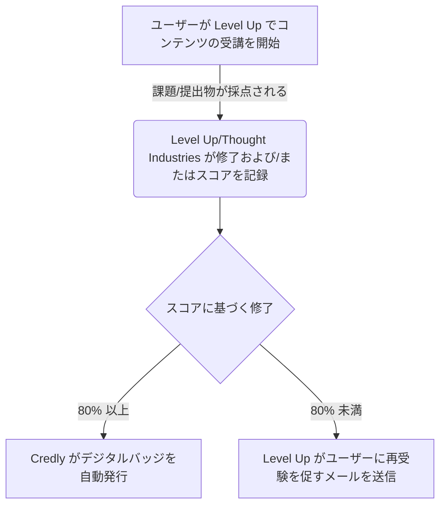
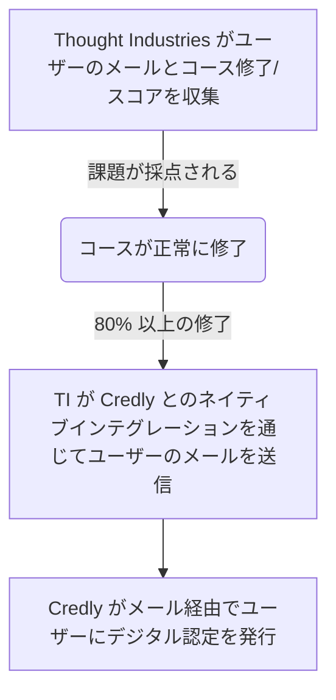

テックスタックの唯一の情報源は [Tech Stack YAML](https://gitlab.com/gitlab-com/www-gitlab-com/-/blob/master/data/tech_stack.yml) であり、このアプリについての詳細情報が含まれています。

<strong>Credly</strong> — 詳細は <a href="https://handbook.gitlab.com/handbook/business-technology/tech-stack/" rel="external noopener">テックスタック (英語)</a> を参照してください。

### 実装

このシステムの実装は 2022 年 5 月から 6 月にかけて行われました。すべてのデジタルバッジが以前のシステム Badgr から Credly に移行されました。

### システム図

Credly デジタル認定システムは SaaS アプリであり、[Thought Industries LMS](https://gitlab.com/gitlab-com/www-gitlab-com/-/blob/master/data/tech_stack.yml) と統合されています。

### データモデル

データモデルは以下のとおりです:

### インテグレーション

Credly デジタル認定システムは SaaS アプリであり、[Thought Industries LMS](https://gitlab.com/gitlab-com/www-gitlab-com/-/blob/master/data/tech_stack.yml) と統合されています。

### 主要レポート / ダッシュボード

すべてのダッシュボードとレポートはシステム自体の一部です。別途 Sisense レポートは利用できず、計画もありません。

### サポートガイドとステップバイステップ記事

[Credly サポートページ](https://credlyissuer.zendesk.com/hc/en-us)では、プロセスに関する詳細な記事とシステム使用のステップバイステップガイドを含むドキュメントサイトを提供しています。
