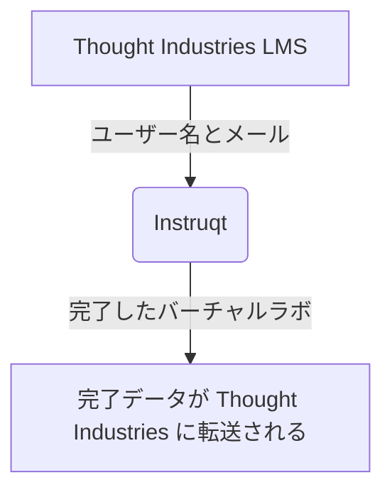

テックスタックの唯一の情報源は [Tech Stack YAML](https://gitlab.com/gitlab-com/www-gitlab-com/-/blob/master/data/tech_stack.yml) であり、このアプリについての詳細情報が含まれています。

<strong>Instruqt</strong> — 詳細は <a href="https://handbook.gitlab.com/handbook/business-technology/tech-stack/" rel="external noopener">テックスタック (英語)</a> を参照してください。

### 実装

GitLab の Instruqt 実装はまだ進行中であり、完全には実装されていません。

### システム図

Instruqt の実装は SaaS アプリであり、[Thought Industries LMS](https://gitlab.com/gitlab-com/www-gitlab-com/-/blob/master/data/tech_stack.yml?_gl=1%2anrxy62%2a_ga%2aNjk5OTc1OTcxLjE2NTg3ODM3ODE.%2a_ga_ENFH3X7M5Y%2aMTY3NDE0NTMxNC4xNDQuMS4xNjc0MTQ3ODY5LjAuMC4w) と統合されています。

### データモデル

データモデルは利用できません。Instruqt はクローズドシステムです。

### インテグレーション

Instruqt の実装は SaaS アプリであり、[Thought Industries LMS](https://gitlab.com/gitlab-com/www-gitlab-com/-/blob/master/data/tech_stack.yml?_gl=1%2anrxy62%2a_ga%2aNjk5OTc1OTcxLjE2NTg3ODM3ODE.%2a_ga_ENFH3X7M5Y%2aMTY3NDE0NTMxNC4xNDQuMS4xNjc0MTQ3ODY5LjAuMC4w) と統合されています。

### 主要レポート / ダッシュボード

すべてのダッシュボードとレポートはシステム自体の一部です。別途 Sisense レポートは利用できず、計画もありません。

### サポートガイドとステップバイステップ記事

[Instruqt サポートページ](https://docs.instruqt.com/)では、プロセスに関する詳細な記事とシステム使用のステップバイステップガイドを含むドキュメントサイトを提供しています。
