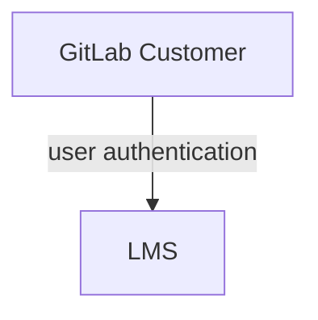

## Thought Industries LMS テックスタックガイド

テックスタックの唯一の情報源は [Tech Stack YAML](https://gitlab.com/gitlab-com/www-gitlab-com/-/blob/master/data/tech_stack.yml) であり、このアプリに関する詳細情報が含まれています。

<strong>Thought Industries LMS</strong> — 詳細は <a href="https://handbook.gitlab.com/handbook/business-technology/tech-stack/" rel="external noopener">テックスタック (英語)</a> を参照してください。

### 実装

Professional Services 向け LMS の実装は[複数のフェーズに分けて整理](https://gitlab.com/groups/gitlab-com/business-technology/enterprise-apps/-/epics/390#project-scope)されています。

### システム図

Thought Industries LMS の実装は SaaS アプリであり、他の GitLab システムとは統合されていません。

### データモデル

データモデルは公開されておらず、LMS はクローズドシステムです。

### インテグレーション

Thought Industries LMS の実装はスタンドアロンの SaaS アプリであり、他の GitLab アプリとは統合されていません。

### 主要レポート / ダッシュボード

すべてのダッシュボードとレポートは LMS 自体に含まれています。別途の Sisense レポートは利用可能でなく、計画もありません。
