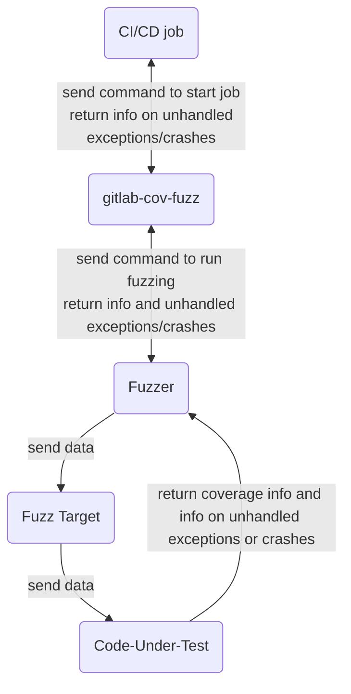

> 推定所要時間: 15 分

## 目標

このラボでは、コード内の単一関数のバグを探すカバレッジガイドファズテストを実演します。Web API ファズテストも同様に機能しますが、ここでは扱いません。

ファズテストはコード内で予期しない動作を引き起こそうとします。予期しない例外やクラッシュは、対処が必要なバグや潜在的なセキュリティ問題を示している可能性があります。ファズテストは他の QA プロセスが見逃す問題を発見することが多いです。

ファズテストはコード内の関数にデータを送信します。プログラムのインストルメンテーションを使用して、その入力によってコードのどの行が実行されるかを追跡し、この情報を使用して関数のコードをできるだけ多く実行するために将来の入力をどのように変更するかについて情報に基づいた決定を行います。

ファズテストしたい関数ごとに別の CI/CD パイプラインジョブを定義する必要があります。ただし、テスト対象のコードの関数が他の関数を呼び出す場合、ファズテストはコールスタックのどこかで発生する問題を検出します。このラボでは 1 つの関数のファズテストのみ行います。

GitLab でのファズテストワークフローの概要は次のとおりです。

1. CI/CD ジョブが `gitlab-cov-fuzz`（GitLab のコマンドラインユーティリティ）を実行し、これがさらにファザーを実行します。ファザーはデータを生成してファズターゲットに送信します。ファズターゲットはそのデータをテスト対象コードに送信します。ファズターゲットに送信されたすべてのデータのコレクションを「コーパス」と呼びます。

1. テスト対象コードがデータを正常に処理した場合（予期しないエラーやクラッシュが発生しない場合）、ファザーはその入力によってテスト対象コードのどの行が実行されたかを追跡します。ファザーはコーパス内のデータの変異を生成してテスト対象コードのさまざまな部分を実行し、その新しい変異した入力をファズターゲットに送信してサイクルを繰り返します。

1. 入力データがテスト対象コードで予期しないエラーやクラッシュを引き起こした場合、その問題はファザーに送り返され、`gitlab-cov-fuzz` ユーティリティに報告され、テスト対象コードの潜在的なバグとして CI/CD パイプラインに渡されます。その問題はパイプライン詳細ページの **Security** タブの下の GitLab GUI に表示されます。

同じワークフローの図は次のとおりです。



## 前提条件

1. ラボ 1 で作成した **Security Labs** プロジェクトをブラウザで開きます。

   > タブを閉じたかリンクを失った場合は、セルフペーストレーニングの場合はブラウザのタブを開いて URL に https://gitlab.com/gitlab-learn-labs と入力すると、プロジェクトが履歴に表示されるはずです。

1. このラボおよびその後のすべてのラボを開始する前に、前のラボで有効化したジョブとスキャナーを無効化してパイプラインの実行時間を短縮してください。これはラボ 3 の終了時に完了しているはずです。ラボ 4 のライセンススキャンは無効化する必要はありません。

## タスク A. テストコードを書く

> ファズテストは、予期しない動作を引き起こすためにアプリケーションの一部にランダムな入力を送信します。このプロセスを示すために、テスト用のシンプルな関数を作成しましょう。

1. これはファズテスターがバグをスキャンするコードです。この Python 関数をプロジェクトのルートにある `codeundertest.py` という新しいファイルにペーストします。

   ```python
   def is_third_byte_zero(my_bytes):
       """Return True if and only if the third byte passed in is 0."""
       return my_bytes[2] == 0  # start counting from 0, so "2" refers to the 3rd byte
   ```

   > このテスト対象コードは、バイトのリストが渡されることを期待する関数を定義しています。そのリストの 3 番目のバイトが 0 の場合、コードは `True` 値を返します。
   >
   > **このテスト対象コードにはバグがあります:** 少なくとも 3 バイトが渡されていることを確認していません。3 バイト未満を渡すと、コードが 3 番目のバイトを探すがそれを見つけられないときにエラーが発生します。言語によって異なりますが、Python は予期しない `IndexError` をスローします。そのエラーはこの関数を呼び出すコードで問題を引き起こす可能性があるため、この動作はバグと見なされます。ファズテストはこのバグを発見するのに最適なツールです。

1. 適切なコミットメッセージで新しいファイルをコミットします。

## タスク B. ファズターゲットを書く

> ファズテストは、コードを書く必要がある GitLab スキャンの唯一のタイプです。ファズターゲットです。以下のファズターゲットはこのラボの特定の「テスト対象コード」でのみ機能します。異なるテスト対象コードのファズターゲットは少し異なって見えます。

1. この Python ファズターゲットコードをプロジェクトのルートにある `FuzzTarget.py` という新しいファイルにペーストします。コメントはファズターゲットコードの各行を説明しています。

   ```python
   from codeundertest import is_third_byte_zero  # import function to be tested
   from pythonfuzz.main import PythonFuzz        # import fuzz test infrastructure

   # The fuzz engine calls a function called `fuzz` in the fuzz target and
   # passes it random bytes, so we need to define a function with that name,
   # and that function must accept 1 parameter.

   @PythonFuzz                           # Python decorator required by fuzz test infrastructure
   def fuzz(random_bytes):               # Accept random data...
       is_third_byte_zero(random_bytes)  # ...and pass it on to the code-under-test.

   if __name__ == '__main__':            # required by fuzz test infrastructure
       fuzz()
   ```

   > このファズターゲットは Python ベースのファズテストの典型的なものです。他の言語のファズターゲットの書き方については[GitLab ドキュメント](https://docs.gitlab.com/ee/user/application_security/coverage_fuzzing/#supported-fuzzing-engines-and-languages)を参照してください。

1. 適切なコミットメッセージで新しい `FuzzTarget.py` をコミットします。

## タスク C. ファズテストの有効化と設定

1. `.gitlab-ci.yml` の既存の `stages:` セクションの末尾にこの行をペーストして、`fuzz` という新しいステージを定義します。正しくインデントされていることを確認してください。

   ```yml
   stages:
   - test
   - fuzz
   ```

1. `.gitlab-ci.yml` の既存の `include:` セクションにこのテンプレートをペーストしてファズテストを有効化します。正しくインデントされていることを確認してください。

   ```yml
   include:
   - template: Coverage-Fuzzing.gitlab-ci.yml
   ```

1. `.gitlab-ci.yml` に新しいジョブを定義してファズテストを設定します。

   ```yml
   fuzz-test-is-third-byte-zero:
     extends: .fuzz_base  # This anchor is defined in the template included above.
     image: python:latest    # This image must be able to run the code-under-test.
     script:
       # Install the fuzz engine from a GitLab-hosted PyPi repo.
       - pip install --extra-index-url https://gitlab.com/api/v4/projects/19904939/packages/pypi/simple pythonfuzz

       # Run a language-agnostic binary, specifying the type of fuzz engine,
       # the root of the project, and the fuzz target.
       - ./gitlab-cov-fuzz run --engine pythonfuzz --project-path ./ -- FuzzTarget.py
   ```

   > ファズテストのジョブ定義はファズターゲットと同様に、テストする言語によって少し異なります。他の言語のファズテストジョブ定義の書き方については <a target="_blank" href="https://docs.gitlab.com/ee/user/application_security/coverage_fuzzing/#configuration">ドキュメント</a>を参照してください。

1. 適切なコミットメッセージで `.gitlab-ci.yml` の編集をコミットします。

## タスク D. 結果を確認する

1. `.gitlab-ci.yml` に変更をコミットした後にパイプラインが実行されるのを確認します。完了まで最大 3 分かかる場合があります。

1. パイプラインが完了したら、**Build > Artifacts** をクリックします。

1. `fuzz-test-is-third-byte-zero` ジョブをクリックします。

1. この画面には、ファズジョブのサマリーが表示されます。この画面で、`is_third_byte_zero` 関数に対して実行されたファズテストを確認できます。出力に `bytearray index out of range error` が含まれていることを確認します。

## ラボガイド完了

このラボ演習を完了しました。[このコースの他のラボガイド](/handbook/customer-success/professional-services-engineering/education-services/secessentialshandson)を参照できます。

## ご提案

*GitLab Security Essentials ハンズオンガイド*への変更を提案される場合は、マージリクエストで提出してください。
