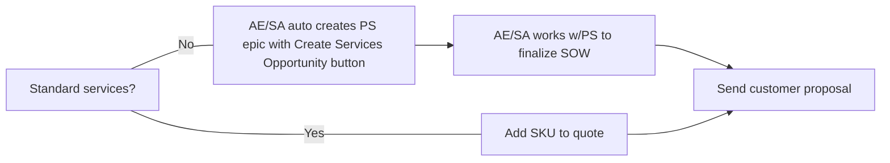

### Professional Services への問い合わせ方法

GitLab において、Professional Services（PS）は [Customer Success 部門](/handbook/customer-success/) の一部です。そのため、PS と関わる際には、[Solutions Architect（SA）](/handbook/customer-success/solutions-architects#when-and-how-to-engage-a-solutions-architect) と関わるためのガイドラインに従ってください。このプロセスにより、Customer Success 部門全体としてアカウントエグゼクティブと顧客のインバウンドニーズを把握できます。

#### Slack

PS は [#professional-services](https://gitlab.slack.com/archives/CFRLYG77X) Slack チャンネルを使用して、サービスに関する一般的な質問への回答や、PS Engagement Estimate や SOW などの PS スコープ業務の納品連絡を行います。プライベートな [#professional-services-us-pubsec](https://gitlab.slack.com/archives/C025UHLTR50/p1625778195002900) Slack チャンネルは US Public Sector のサービス向けに使用されます。[#professional-services-us-pubsec](https://gitlab.slack.com/archives/C025UHLTR50/p1625778195002900) へのアクセス権は [#professional-services](https://gitlab.slack.com/archives/CFRLYG77X) でリクエストしてください。

#### GitLab メンバー向けのトレーニング依頼

**チームリード向け**

社内 GitLab チームリードは、Professional Services が提供するチーム向けトレーニングセッションを依頼できます。リクエストの手順は以下のとおりです。

1. Education Services 名前空間に internal_trainer_request Issue テンプレート（または internal-team-member-training-request）を使って [新しい Issue を作成](https://gitlab.com/gitlab-com/customer-success/professional-services-group/education-services/-/issues/new?issue%5Bassignee_id%5D=&issue%5Bmilestone_id%5D=#) します。
1. Issue 説明文の Requestor Tasks を完了します。
1. PS Project Coordinator がトレーニングセッションの計画とスケジューリングのために連絡します。

**個別のチームメンバー向け**

個別の GitLab メンバーは、Professional Services が提供する顧客向けトレーニングセッションの聴講をリクエストできます。参加リクエストの手順は以下のとおりです。

1. Education Services 名前空間で internal-team-member-training-request テンプレートを使い、[新しい Issue を作成](https://gitlab.com/gitlab-com/customer-success/professional-services-group/education-services/-/issues/new?issue%5Bassignee_id%5D=&issue%5Bmilestone_id%5D=#) します。
1. Issue 説明文の Requestor Tasks を完了します。
1. PS Project Coordinator が日程を確認し、登録リンクを案内します。

### Sales Rep および SA 向け: Professional Services の発注方法

1. Professional Services を発注するには、SAE または ISR が標準ライセンスもしくはサブスクリプションの親 Opportunity から `Create Services Opportunity` ボタンを使って [SFDC 上で子の PS Opportunity を作成](/handbook/sales/field-operations/gtm-resources/#creating-a-professional-services-opportunity) します。

1. 次のステップは、必要なサービスが標準サービスかカスタムサービスかによって異なります。

- **Standard Services（カスタマイズなし）**: 事前定義された Statement of Work（SOW）書類を伴う Professional Services SKU を用いて販売されます。これらの提供形態はカスタムスコーピングを必要とせず、SFDC 内の Zuora から直接発注されます。現在提供している標準サービスの一覧は [フルカタログ](https://about.gitlab.com/professional-services/catalog/) を参照してください。

- **Custom Services**: 標準サービスでは顧客のニーズを満たせない場合に、カスタム SOW を用いて販売されます。[地域別の Professional Services Engagement Manager](https://docs.google.com/document/d/1bdVOf3jL6aJF79qRMFLQsmMxIgQh5ZQ-WiLuNgsWB08/edit?tab=t.0#heading=h.qzgxpwqxme5) に連絡してください。上記ステップ 1 で PS Opportunity を作成すると、[Professional Services Epic](https://gitlab.com/groups/gitlab-com/customer-success/professional-services-group/-/epics?state=opened&page=1&sort=start_date_desc) と [スコーピング Issue](https://gitlab.com/gitlab-com/customer-success/professional-services-group/ww-consulting/ps-plan/-/issues/?sort=created_date&state=opened&first_page_size=100) が自動的に作成されます。Epic と Issue を使って情報を入力し、Engagement Manager と連携してください。

**Sales Rep および SA 向けプロセス**

Professional Services の販売に関する詳細は、[Selling Professional Services](/handbook/customer-success/professional-services-engineering/selling) を参照してください。

Professional Services を顧客に対してどのようにポジショニングするかについての情報は、[Positioning Professional Services](/handbook/customer-success/professional-services-engineering/positioning) を参照してください。

#### Professional Services エンゲージメント開始までのリードタイム

「プロジェクトを開始するまでのリードタイムはどれくらいですか？」と聞かれることがしばしばあります。また、顧客が特定の期間内にプロジェクトを納品してほしいと希望する場合もあります。
常時多くのプロジェクトや提案が進行中である可能性があるため、エンゲージメントの優先順位付けとスケジューリングにあたっていくつかのルールがあります。

- PS Opportunity が Closed/Won となり、PS Operations チームがプロジェクトをスケジュールするまでは、いかなるエンゲージメントスケジュールもコミットできません。それより前のタイミングでスケジュールを合わせる努力はできますが、サービスエンゲージメントを契約済みの顧客に対して公平であるためには、そちらを優先する必要があります。
- 最新のリードタイムについて、より正確な見積もりが必要な場合は、[professional services Slack チャンネル](#slack) で `@ps-scheduling` グループにメンションして PS Operations チームに確認してください。
- PS Operations チームは SFDC ステージ 5 のプロジェクトをレビューします。私たちは SFDC ステージが Closed/Won となってから数日以内にプロジェクトを開始することを目指しています。

#### カスタムサービス SOW の作成と承認

カスタム SOW のスコーピングにあたっては、Professional Services Engagement Manager が SA/CSM/SAE と連携し、顧客のニーズを満たすカスタムエンゲージメントを作成し、SOW を適切な承認プロセスに通します。すべての Custom SOW には PS Leadership の承認が必要です。

##### 見積もり作成

- アカウントチーム（SAE/ISR/SA/CSM）は、標準の親 SFDC Opportunity から `Create Services Opportunity` ボタンを使って、新しい Professional Services Epic と関連する子のスコーピング Issue を作成することでプロセスを開始できます（[上記参照](#sales-rep-および-sa-向け-professional-services-の発注方法)）。スコーピング Issue 上に SSOT のテーブルが表示され、これがスコーピングプロセスを駆動します。SA/CSM は最初に顧客と協力してこれをできる限り埋めてください。Professional Services Engagement Manager は提供されたインプットを基に Estimate を作成し、レビュー用のリンクを提供します。

##### SOW 作成

- Estimate がアカウントチームと顧客によってレビューされ、フィードバックが反映され、調整が完了したら、SOW の生成に進めます。スコーピング Issue の中で Engagement Manager は MSA が締結されているか、または標準条項を使用するかを把握する必要があります。
- 顧客が変更を希望する場合は、私たちの契約書および SOW 文書にマークアップしてもらうことを推奨します。顧客自身のサービス条項や SOW の使用が必要な場合は、PS チームに連絡してください。

##### SOW Proposal Approval Board

[SOW Proposal Approval Board](https://gitlab.com/groups/gitlab-com/customer-success/professional-services-group/-/boards/1353982?label_name[]=Services%20Calculator) は、すべての SOW をスコーピングと承認プロセスを通して進行させ、顧客にレビューと署名のために送付するまで管理するために使用されます。

**SOW 承認ワークフローのラベル**

ラベル（左から右）は以下のとおりです。

- `Open`: Services Calculator によって Issue が作成され、Engagement Manager の確認待ちです。
- `proposal::Awaiting_Discovery`: エンゲージメントをスコープするために必要な情報を、アカウントチームと顧客から収集中です。
- `proposal::Strawman_WIP`: Engagement Manager がレビュー用の初期見積もりをドラフト中です。
- `proposal::Estimate_Feedback`: Estimate がアカウントチームおよび／または顧客によるレビュー中です。Engagement Manager は SOW へ進む前にフィードバックと確認を待っています。
- `proposal::SOW_WIP`: Engagement Manager が SOW をドラフト中で、マージン計算のために [SOW Cost Estimate Calculator](https://docs.google.com/spreadsheets/d/16KFNRFe4E_oaqU7_ZGivoO7eU3-65dkMgVvK5Jvb7ZQ/edit#gid=158441360) を使って [Cost Estimate](/handbook/customer-success/customer-success-vision/#professional-services-standard-cost) を準備しています。なお、この Cost Estimate Calculator は、Engagement Manager が幅広い PS エンゲージメントの見積もり作成に使用するより大きな見積もりツールに組み込まれています。
- `proposal::Ready For Approval`: Engagement Manager が必要な SOW を準備し、承認リクエストをトリガーしました。SOW をリリースする前に承認が必要です。
- `proposal::Approved`: SOW が承認され、実行準備が整いました。SAE/AE は SOW を署名のためにリリースする前に、SFDC で Legal Case を起こして Legal の承認を得る必要があります。

### Professional Services のスケジューリング

現在、顧客プロジェクトは Opportunity が Closed-Won となった順にスケジューリングされます。プロジェクトのスケジューリングに関する懸念は、スコーピングプロセスの Discovery フェーズで議論してください。Discovery フェーズの一環として、Project Scheduling Intake Issue を更新してください。Project Coordinator はこの情報を用いて要員配置をレビューします。リードタイムや空き状況に関する質問がある場合は、professional services Slack チャンネル（#professional-services）で @ps-scheduling グループにメンションして Engagement Manager または Project Coordinator に確認してください。
SOW／契約書の署名前に、PS Project Coordinator の確認なしにプロジェクト開始日をコミットすることは控えてください。

Opportunity が Close/Won に更新された後、次のステップは以下のとおりです。

- PS Project Coordinator が SOW と Order Form をレビューし、Kantata でプロジェクトをセットアップします。
- Project Scheduling Intake Issue で顧客連絡先の情報が提供されていない場合、PS Project Coordinator がアカウントチームに連絡します。
- PS Project Coordinator は、Opportunity の予約から営業 72 時間以内に顧客に Welcome to PS メールを送付し、アカウントチームと Professional Services リーダーを CC に入れます。
