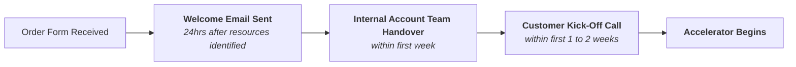

GitLab の Success Tier は、お客様に専任の技術的専門知識、構造化されたイネーブルメントプログラム、強化されたサポートを提供する有料サービスオファリングです。各ティアは、オンデマンドのプールリソースから完全に指定されたチームまで、お客様のニーズの異なるレベルに合わせて設計されています。

Success Tier チームには [Slack チャンネル](https://gitlab.enterprise.slack.com/archives/C05US54ETB3)（内部のみ）で連絡を取ることができます。

ティアの価値のポジショニング、ティアの価格設定/見積もり、異議処理に関するコンテンツは、内部ハンドブックページ [Success Services (aka Success Plan Services)](https://internal.gitlab.com/handbook/customer-success/success-services/) を参照してください。

## ティア概要

| ティア | 割り当てリソース | Accelerator | トレーニング割引 | 認定資格バウチャー |
|------|-------------------|:------------:|:-----------------:|:----------------------:|
| **On-Demand** | プールされた [CSE](/handbook/customer-success/csm/segment/cse/) | — | — | — |
| **Essentials** | 指定された [CSM](/handbook/customer-success/csm/) | — | 5% | 20 |
| **Advanced** | 指定された [CSA](/handbook/customer-success/csm/segment/csa/) | 2/年 | 10% | 40 |
| **Signature** | 指定された [CSA](/handbook/customer-success/csm/segment/csa/) + [ASE](/handbook/support/enhanced-support-offerings/offering-assigned-support-engineer/) | 4/年 | 20% | 60 |

- **On-Demand** はすべての GitLab のお客様に利用可能です。CSE がプールされたウェビナー、ハンズオンラボ、オフィスアワーを提供します。
- **Essentials** は、サクセスプラン、ケイデンスコール、リニューアル戦略を所有する指名 CSM を提供します。
- **Advanced** は、より深い技術的専門知識と構造化された Accelerator プログラムを持つ指名 CSA を提供します。
- **Signature** は、最高レベルのホワイトグローブサポートのために、CSA と並んで Assigned Support Engineer (ASE) を追加します。

有料の Success Tier を始めるには、[about.gitlab.com/services/](https://about.gitlab.com/services/) にアクセスしてください。

## Accelerator とは何か?

Accelerator は、お客様の CSA によって提供される 12 週間の構造化されたイネーブルメントプログラムで、相互のサクセスプランに沿っています。各 Accelerator は 4 段階のライフサイクルに従います: **Discovery → Design → Deliver → Measure**。Accelerator は Advanced（年 2 回）と Signature（年 4 回）ティアに含まれます。

利用可能な Accelerator プログラムの完全なリストについては、[Accelerator Catalog](/handbook/customer-success/success-services/accelerator-catalog/) を参照してください。

## 顧客対応ロール

| ロール | ティア | 説明 |
|------|------|-------------|
| [Customer Success Engineer (CSE)](/handbook/customer-success/csm/segment/cse/) | On-Demand | すべてのお客様にプールされたオンデマンドイネーブルメントを提供する技術的製品エキスパート |
| [Customer Success Manager (CSM)](/handbook/customer-success/csm/) | Essentials | 採用、サクセスプランニング、リニューアル戦略を推進する指名アドバイザー |
| [Customer Success Architect (CSA)](/handbook/customer-success/csm/segment/csa/) | Advanced / Signature | アーキテクチャガイダンスと Accelerator プログラムを提供する最高評価の技術的エキスパート |
| [Assigned Support Engineer (ASE)](/handbook/support/enhanced-support-offerings/offering-assigned-support-engineer/) | Signature | プロアクティブな監視と加速されたインシデント解決を提供する専任サポートエンジニア |

すべての CS および SA ロールのサイドバイサイド比較については、[CS および SA ロール概要](/handbook/customer-success/roles-overview/)を参照してください。

## Success Tier

### 概要

私たちの Success Tier は、お客様にベストプラクティスとより高ティアのホワイトグローブサポートを提供しながら、GitLab 製品の採用と価値の実現を推進します。これは、[Assigned Support Engineer (ASE)](/handbook/support/enhanced-support-offerings/offering-assigned-support-engineer/)、[Customer Success Architect (CSA)](/job-description-library/sales/customer-success-architect/)/[Customer Success Manager (CSM)](/handbook/customer-success/csm/#what-is-a-customer-success-manager-csm-at-gitlab)、Education Services を年間更新可能サービスとして単一の SKU にバンドルすることで実現します。

[Assigned Support Engineer (ASE)](/handbook/support/assigned-support-engineer/) は、お客様のプライマリコンタクトポイントであり、そのお客様によってログされたサポートチケットのトリアージを行い、Signature ティアに含まれます。一貫したリソーシングのため、お客様のニーズ、環境、アーキテクチャに関する知識が時間とともに蓄積され、最も一般的にログされる問題に対する解決時間が短縮されます。

[Customer Success Architect (CSA)](/job-description-library/sales/customer-success-architect/) は、よく理解されたベストプラクティスを使用した GitLab 製品の採用を通じて、お客様の成功に責任を負います。CSA は、業界の伝統的な CSM ロールよりも深い製品知識と技術的深さを持ちます。多くのお客様にわたる経験から、彼らは機能が最大限の価値を得るために正しい方法で活用されるよう確実にするエキスパートです。このカスタマーエクスペリエンスは、ベストプラクティスのコンテンツと処方的なロードマップの開発につながりました。このコンテンツは、Success Tier オファリングに「Accelerator」として組み込まれています。

> Customer Success はお客様に対して「キーボードに手を置く」ことは許可されていません。私たちはベストプラクティス、アーキテクチャガイダンスを提供し、特定のお客様のニーズに合わせて採用とサクセスプランをカスタマイズすることはできますし、実際にしています。お客様が GitLab にオーダーメイドのソリューションを開発したり、構成を積極的に変更または管理したりすることを必要とする場合、私たちは [Professional Services](/handbook/customer-success/professional-services-engineering/) チームを巻き込む必要があります。

Success Tier に含まれる Education Services は、1 日のインストラクター主導トレーニングと、トレーニング認定試験バウチャーの大幅な数を網羅しています。これにより、特定の Accelerator の実行をトレーニングと認定に整列させて、チームが GitLab がもたらすコストメリットを推進する準備と能力を確保することができます。

### Success Tier のリソースとサポート

#### 1. Success Tier 資格認定フレームワーク

Sales チームが Success Tier を効果的にポジショニングして販売できるよう、[包括的なフレームワーク](https://gitlab.highspot.com/items/68138e0af1e7d5daacbfcfae#1)を作成しました。このフレームワークは以下を提供します:

- 各ティアの明確な資格認定基準
- お客様のニーズに合わせた価値提案
- 構造化された異議処理応答
- セグメント別のカスタマーサクセスストーリー

#### 2. Regional Champion サポート

Regional Champion は、Success Tier のポジショニングに関するエキスパートガイダンスを提供できます。

##### サポートをリクエストする方法

1. [#success-tiers](https://gitlab.enterprise.slack.com/archives/C05US54ETB3) Slack チャンネルに移動します
2. チャンネル上部の **Workflows** をクリックします
3. **Success Tier - Request for Help** を選択します
4. 必要なものを指定します:
    - ライブコールサポート
    - ポジショニングガイダンス
    - クイックブレインストーミングセッション

##### 地域連絡先

- **EMEA**: 

チームメンバー情報は <a href="https://handbook.gitlab.com/handbook/customer-success/success-services/" rel="external noopener">原文 (英語)</a> を参照してください。

- **AMER**: 

チームメンバー情報は <a href="https://handbook.gitlab.com/handbook/customer-success/success-services/" rel="external noopener">原文 (英語)</a> を参照してください。

- **APJ**: 

チームメンバー情報は <a href="https://handbook.gitlab.com/handbook/customer-success/success-services/" rel="external noopener">原文 (英語)</a> を参照してください。

- **エスカレーション**: 

チームメンバー情報は <a href="https://handbook.gitlab.com/handbook/customer-success/success-services/" rel="external noopener">原文 (英語)</a> を参照してください。

### Success Tier カスタマーオンボーディング

完全に新規ではないアカウントをオンボーディングしている可能性があることに注意してください。アカウントチームとのスムーズなコラボレーションとハンドオーバーを確保するため、責任マトリックスの[Issue](https://gitlab.com/gitlab-com/customer-success/success-services/csa/-/issues/16)を参照することをお勧めします。

### Success Tier カスタマーオンボーディングの成果物

1. 紹介メール
   1. このメールは、CSA と ASE の両方のリソースが特定されてから 24 時間以内に、お客様から注文書を受領した時点にできるだけ近いタイミングで送信されます。
   2. 適切な歓迎メールテンプレートを利用してください -
      1. [Signature | Success Tiers - Welcome Email](https://gitlab.highspot.com/items/67fe720d040d7ec85356346f#2)
      2. [Advanced | Success Tiers - Welcome Email](https://gitlab.highspot.com/items/67fe720f040d7ee3c8b160a1?lfrm=srp.2)
      3. [Essentials | Success Tiers - Welcome Email](https://gitlab.highspot.com/items/67fe7212040d7ea6e1af7af0?lfrm=srp.6)
   3. 最優先事項は、プログラムをレビューしてお客様の前に立てるよう、キックオフコールを確定することです

### Success Tier カスタマーオンボーディング活動

1. 内部キックオフコール
   1. CSA がナレッジ転送を行い、Accelerator を巻きつける優先作業についてアカウントチームと調整するための内部準備コール。
   2. このコールの目的は、注文書がサインされる前に特定されているはずのお客様の目的について、アカウントチームと CSM/A の間で議論することです。
      - アカウントコンテキストおよび技術ドキュメンテーションテンプレート
         1. このテンプレートは、アカウントオンボーディング中に収集された重要なお客様の情報、技術的構成、ステークホルダー、戦略的目的のドキュメンテーションを標準化し、CS チームメンバー間での効果的なハンドオフを可能にし、一貫したナレッジキャプチャを確保するのに役立ちます。
         2. [この内部テンプレート](https://docs.google.com/document/d/1uIcF7sBN84vyyfzikmMm_GrDgcjOyhB8SVkkWYque78/edit?usp=sharing)を利用し、お客様のニーズにカスタマイズしてください
            - ヒント: キックオフコールの前に、アカウントチーム（SA、CS）とプレイバック/ウォークスルーミーティングを設定して理解を検証することができます
         3. このテンプレートは、ビジネスドライバー、技術要件、ステークホルダーの優先順位を、容易に検証および拡張できる標準化された形式でキャプチャすることで、ディスカバリーワークショップとコラボレーションプロジェクトの基盤を作成し、アカウントの理解を構造化して SA/CS チームにプレイバックするのに役立ちます。

2. カスタマーキックオフコール
   1. これは、お客様の利用可能性に応じて、契約の最初の 1 週間以内にスケジュールされます。
   2. お客様が正式なキックオフのために最初の週に利用できない場合、ASE と CSA の両方が非同期で作業を開始し、メールを通じて必要な会話を開始します。
   3. 適切なキックオフデッキを利用し、必要に応じてカスタマイズします（内部）。
      1. [Signature | Success Tiers - Kickoff Deck](https://gitlab.highspot.com/items/67fe720b1d0a83d481b69449#1)
         - [Demo](https://gitlab.highspot.com/items/680f8ee83cc2d050572efa00)
      2. [Advanced | Success Tiers - Kickoff Deck](https://gitlab.highspot.com/items/67fe7209be150cb32b8b47f2?lfrm=srp.9)
         - [Demo](https://gitlab.highspot.com/items/680b978897caecb740bc6504)
      3. [Essentials | Success Tiers - Kickoff Deck](https://gitlab.highspot.com/items/67fe7205040d7eb57aaf784c?lfrm=srp.8)
         - [Demo](https://gitlab.highspot.com/items/6812783bf1e7d50ea1f7888a)
   4. コール後にすぐの次のステップ（サブディスカバリーワークショップなど）と共に `.pdf` バージョンを共有します。

3. ディスカバリーワークショップ
   1. このワークショップの成果は、お客様のビジネス目的/成功メトリクス、テクノロジースタック、プロセスの深い理解を得ることです。
   2. これは、お客様とのサクセスプランを定義し、取り組む潜在的な Accelerator のバックログを特定するための最初のステップです。
   3. ヒント: Accelerator 開発バックログ項目のトリアージを可能にし、お客様にフィードバックを提供するため、キックオフコールから 2 週間以内にディスカバリーワークショップを実施します。Accelerator 開発で影響を与える DORA メトリクスのベースラインを得るために、このインタラクションを活用します。
   4. この[インテーク質問票](https://gitlab.com/gitlab-com/customer-success/success-services/csa/-/issues/15)を出発点として利用してください。当社のお客様の 1 人のために作成されたディスカバリードキュメントの例: [内部ディスカバリードキュメント](https://docs.google.com/document/d/1yf1RGS-pNGccHfGiiIVsvg8VL56ctJNSMZDeRLT1eDs/edit?tab=t.0#heading=h.azdjicqpfuh9)。

### GitLab University Panorama

GitLab University Panorama は、**Signature Success Tier** に含まれる、専用の管理された学習ポータルです。GitLab University Enterprise を別途購入したお客様も対象となります。SSO 統合、カスタムコンテンツホスティング、お客様固有のレポーティングを提供し、GitLab トレーニングと認定資格のための一元化されたハブをチームに提供します。

**オンボーディングのための主要な議論ポイント**

オンボーディング会話中に、以下を議論します:

- **学習の優先事項**: 上位 3 つのフォーカスエリアは何ですか? (例: CI/CD、AI/Duo、セキュリティ)
- **認証**: SSO（IT の関与が必要）またはよりシンプルな登録コードのどちらを希望しますか?
- **認定資格**: 認定資格バウチャーをいくつ購入しましたか?
- **カスタムコンテンツ**: GitLab コースと並んで内部トレーニング教材をホストしたいですか?
- **レポーティング**: 利用ダッシュボードを表示するための管理者アクセスを誰が持つべきですか?

お客様の希望を集めたら、[GitLab University Panorama リクエストワークフロー](/handbook/customer-success/success-services/glu-panorama/)に従って正式なリクエストを提出します。セットアップは通常 5 営業日かかります。

### オンボーディング後

#### CSM プロセス

[CSM の高レベル責任](/handbook/customer-success/csm/#high-level-responsibilities-of-a-csm)を参照してください

#### CSA プロセス

CSM ロールを超えた CSA 固有のプロセスがあります。これは、CSM プロセスと責任の上に重ねられることが期待されています。

##### Accelerator

Success Tier には、Signature ティア用に最大 4 つ、Advanced 用に 2 つの Accelerator が含まれており、[Customer Success Architect (CSA)](/handbook/customer-success/csm/segment/csa/) が提供します。

> Accelerator は、GitLab CSA が定義してお客様に提供するカスタマイズされた形式のイネーブルメントです。これらの Accelerator は四半期にわたり、相互のサクセスプランにマッピングされています。

Accelerator は、お客様の要件と定義された成果に応じて、以下のコンテンツモジュールの 1 つ以上をまとめます。通常、Accelerator は 12 週間にわたって実行されます。必要なお客様の成果を文書化するためのディスカバリーワークショップで開始されます。それから、お客様と一緒に成果を達成するために必要なステップをアウトラインする計画ワークショップを実行します。計画ワークショップの成果は、GitLab プロジェクトでログされた Issue のバックログで、それらの成果を達成して Accelerator をクローズアウトするために次の 10 週間にわたって管理されるすべての必要な活動を含みます

###### Accelerator コンテンツモジュール

| カテゴリー | コンテンツモジュール | 説明 | 成果|
|---|---|---|---|
|CI/CD|Introduction to CI/CD Workshop|CI Pipeline トラックの Intro to CI Accelerator は Getting Started/How to Accelerator で、プラットフォームに不慣れなユーザーが GitLab CI の使用について初期のなじみと基本的な理解を構築することに焦点を当てています。|GitLab ci.yml と GitLab Runner のアーキテクチャ、gitlab-ci.yml の作成方法、一般的なパターンとルールを理解することができます|
|CI/CD|Runner fleet guidance  |GitLab Runner フリートを大規模に最適化および管理するための Customer Success Accelerator。|CSA は成熟度評価、情報セッション、インタラクティブトレーニングを含むウォークスルーを行います|
|CI/CD|Rules and pipeline flow|CI Pipeline トラックの Rules & Pipeline Flow Accelerator は Advanced Concepts Accelerator で、ルール、DAG、parent/child パイプラインを使用したパイプラインのフローの定義方法、およびパイプラインの操作を制御するためのその他の最適化方法をカバーします。|ベストプラクティスで提供されるトレーニング|
|CI/CD|CI templates and reusability|CI Pipeline トラックの Templates & Reusability Accelerator は Advanced Concepts Accelerator で、CI テンプレートの作成と使用、ワークフローの最適化をカバーします。|あなたの成熟度レベルに合わせて調整されたベストプラクティス|
|CI/CD|Product coach|CI Pipeline トラックの Product Coach Accelerator は Deep Dive Accelerator で、お客様のパイプラインのベストプラクティスとパイプライン最適化に関するコンサルティングガイダンスに焦点を当てています。|CSA は、パイプラインを最適化するための 20 以上のカテゴリーを持つ詳細な「ガイダンスレポート」を提供します|
|CI/CD|Pipeline Template Optimization|あなたの組織の特定のプロジェクトタイプ、言語、コンプライアンス要件に合わせた標準化された再利用可能なテンプレートの開発を通じて CI/CD 実装を最適化する構造化された 12 週間プログラムを提供します。|この Accelerator の終わりまでに、開発者がパイプラインの実装に費やす時間が減り、価値の提供により多くの時間を費やすという測定可能な効率向上、標準化された慣行による組織全体のコンプライアンスの向上、継続的なパイプライン管理とガバナンスのための持続可能なフレームワークを達成できます。|
|セキュリティとコンプライアンス|Intro to security workshop|セキュリティの概念、セキュリティ機能、開始時の推奨事項の 60〜90 分のプレゼンテーション|お客様はセキュリティスキャナー、脆弱性ダッシュボード、これらの機能の使用開始方法について評価されます|
|セキュリティとコンプライアンス|Hands-on security lab|gitlab.com サンドボックスにアクセスできる 90〜120 分のハンズオンラボ。コードを提供し、セキュリティとコンプライアンス機能を構成するための処方的なステップがあります|お客様は、パイプラインへのセキュリティスキャナーの追加、セキュリティポリシーとコンプライアンスフレームワークの構成、脆弱性のトリアージ方法の実際の経験を得ます|
|セキュリティとコンプライアンス|Ultimate Onboarding|このシリーズは、初期セットアップ探索から高度なスキャン実装、ポリシー構成、組織のニーズに合わせた脆弱性管理戦略まで、堅牢なセキュリティ慣行の実装に関する包括的なガイダンスを提供します。|この Accelerator の終わりまでに、最適化されたスキャン能力、カスタマイズされたガバナンスポリシー、開発ライフサイクル全体のリスクを大幅に削減する効率的な脆弱性管理ワークフローを備えた、完全に構成された GitLab セキュリティフレームワークを持つことができます。|
|セキュリティとコンプライアンス|Intro to audit, compliance, and separation of duties workshop|監査の概念、コンプライアンスとセキュリティポリシー機能、ベストプラクティスの 60〜90 分のプレゼンテーション|CSA はこのコンテンツをあなたのニーズと成熟度に合わせて調整します。監査に合格し、グループ全体で一貫性を機関化し、次にどこに進むかの推奨事項を含む知識を得ることができます|
|セキュリティとコンプライアンス|Security rollout strategy|このコンテンツモジュールは、GitLab のベストプラクティスと相互合意のあるタイムラインとマイルストーンを含む、セキュリティとコンプライアンス機能をロールアウトするための完全な計画を提供します |このコンテンツモジュールの結果は、ロールアウト戦略のプレゼンテーションと、それがあなたの成果とタイムラインにどのようにマッピングされるかです。さらに、マイルストーンとタスクはコラボレーションプロジェクトのバックログに入るので、CSA はロールアウトプロセスについて引き続きガイドできます|
|セキュリティとコンプライアンス|Product Coach - Compliance Framework/Security Policies Audit|セキュリティとコンプライアンストラックの Product Coach Accelerator は Deep Dive Accelerator で、セキュリティポリシー、開発者ワークフロー、職務分掌のベストプラクティスに関するコンサルティングガイダンスに焦点を当てています|CSA は数週間かけて既存のワークフローを学び、ベストプラクティスと推奨事項を含むガイダンスレポートを提供します|
|セキュリティとコンプライアンス|Security Policy Rollout Strategy|セキュリティとコンプライアンストラックの Security Policy Accelerator は、CSA がガイドするマルチクォータープログラムです。作業は 5 つのフェーズに分けられます: Architecture & Design、Compliance、Audit & Enablement、Dashboards & Integration、Scaling。 |私たちのベストプラクティスに従うことで、標準化されて監査可能な GitLab インスタンスを持つことができます。CSA が活用する[内部資料](https://drive.google.com/drive/folders/1r_d1Lk5RyKoPvdN9HmzNKhHhAfKsSVAh)。|
|アジャイル計画|Intro to GitLab Plan workshop|GitLab Issue 管理とバックログワークフローの概要|チームはバックログ計画のすべての機能、レポーティング、ベストプラクティスの理解を得ます|
|アジャイル計画|Jira + GitLab workshop|このワークショップでは、Jira と GitLab を統合する際のオプションを詳しく説明します|CSA は時間をかけて現在のニーズとセットアップを発見し、その後あなたの成果に合わせてカスタマイズされたワークショップを提供します|
|AI/ML|AI/ML hands on lab|GitLab が持つすべての AI/ML 機能とその使用方法について開発者をブートストラップします|チームは、すべての AI 機能を呼び出す方法とそれらの推奨される使用法に精通して帰ります。実験を続けるために 3 日間の gitlab.com サンドボックスへのアクセスも提供されます|
|AI| Duo Enterprise Onboarding | この Accelerator は、カスタマイズされたデモンストレーション、ガイドされた採用戦略、特定のワークフローとチーム構造に合わせた継続的なエキスパートサポートを通じて、組織全体に AI 駆動の開発ツールを戦略的に実装する包括的な 12 週間プログラムを提供します|プログラム完了までに、複数の Duo 機能にわたる積極的な採用、自立した内部チャンピオンネットワーク、サイクルタイムの削減、コード品質の改善、強化されたセキュリティポスチャを含むキーメトリクスでの定量化可能な利益を含む、開発効率の測定可能な改善を達成できます。|
|システム管理|Upgrade package|この Deep Dive Accelerator は、システム管理チームに今後のアップグレードの準備をさせます|成果は、詳細なアップグレード計画、廃止予定と認識する必要がある新機能のプレゼンテーション、アップグレードに向けて持つすべての質問を追跡するためのコラボレーションプロジェクトです|
|システム管理|Managing Monorepos & Large Repositories |特定の環境と開発者ワークフローに合わせたリポジトリ構造、Git LFS 実装、CI/CD パイプライン効率の包括的な最適化を通じて、過大なリポジトリのパフォーマンスの課題に対処します。|短縮されたクローンとフェッチ時間、最適化されたストレージ使用率、合理化された CI/CD パイプライン実行、全体的な開発者の生産性を向上させて継続的なリポジトリの成長を支える持続可能な保守手順を含む、リポジトリパフォーマンスの測定可能な改善。|
|システム管理|Optimizing Platform Resiliency |組織の重要なデジタル資産に合わせたセキュリティハードニング、バックアップ戦略、インシデント対応計画、ポリシー制御の構造化された実装を通じて、サイバー脅威に対する GitLab プラットフォームの保護を強化します。|この Accelerator の終わりまでに、強化されたセキュリティ監視、検証されたバックアップとリカバリー機能、文書化されたインシデント対応手順、ビジネスの継続性とクラウンジュエルリポジトリの保護を確保する実装されたセキュリティポリシー制御を備えた、大幅に弾力性のある GitLab 環境を達成できます。|

 

### Gainsight での Success Tier タイムライン活動の記録

主要な Success Tier 活動を Gainsight で一貫して記録することは、私たちのカスタマーサクセスオペレーションに不可欠です。このドキュメンテーションにより、すべてのチームメンバーがお客様のインタラクションをログする際に標準化された手順に従うことが保証されます。

Gainsight での正確な活動追跡により以下が可能になります:

- お客様エンゲージメント履歴の完全な可視性
- Success Tier デリバリーメトリクスに関する正確なレポーティング
- 同じお客様と作業するチーム間でのより良いコラボレーション
- Success Tier オファリングを改善するためのデータ駆動型インサイト
- チームメンバーの移行中のサービスの継続性

これらのガイドラインに従うことで、運用効率と戦略的意思決定の両方をサポートする信頼できる記録システムを維持します。

#### 一般的な手順（すべての活動に適用）

Gainsight で活動を記録するには、お客様のアカウントに移動して C360 にアクセスして開始します。次に、活動のコンテキストに応じて:

- **Call to Action (CTA) に関連する活動**:
   1. アカウント内の Cockpit タブをクリックします
   2. 活動が適用される特定の CTA を選択します
   3. 適切な関連付けを確保するため、実際の CTA の Timeline タブから活動を追加します

- **Success Plan に関連する活動**:
   1. アカウントナビゲーションの Success Plan タブをクリックします
   2. 関連する Success Plan を選択します
   3. Cockpit タブをクリックします
   4. 活動をログしたい目的の Objective をクリックします
   5. 右上で、Timeline タブをクリックします
   6. Add Activity をクリックして、エントリを Success Plan に関連付けます

- **一般的な活動** (CTA や Success Plan に関連しない):
   1. アカウント内のどこからでも、右上の Create ボタンをクリックします

##### 特定の活動タイプ

###### キックオフコール

1. 上記の一般セクションで説明されている Gainsight の正しい場所に移動します。
2. Activity Timeline Entry フォームが開いたら、Activity Type ドロップダウンリストから **Customer Call** または **In-Person Meeting** を選択します。
3. Meeting Type ドロップダウンリストで **Kickoff** オプションを選択します。
4. 残りのフィールドにすべての関連情報を記入します。
5. 完了したら **Log Activity** をクリックします。

###### Accelerator

1. 上記の一般セクションで説明されている Gainsight の正しい場所に移動します。
2. Activity Timeline Entry フォームが開いたら、Activity Type ドロップダウンリストから **CSA Engagement** を選択します。
   - 注意: このタイプの下にログされた活動は Accelerator と見なされます。
3. 残りのフィールドにすべての関連情報を記入します。
4. 完了したら **Log Activity** をクリックします。

###### ワークショップ

1. 上記の一般セクションで説明されている Gainsight の正しい場所に移動します。
2. Activity Timeline Entry フォームが開いたら、Activity Type ドロップダウンリストから **Workshop** を選択します。
3. 残りのフィールドにすべての関連情報を記入します。
   - **重要**: 必須フィールドではありませんが、以下をログすることを強く推奨します:
      - 外部参加者
      - ワークショップトピック
4. 完了したら **Log Activity** をクリックします。

###### Executive Business Review (EBR)

1. 上記の一般セクションで説明されている Gainsight の正しい場所に移動します。
2. Activity Timeline Entry フォームが開いたら、Activity Type ドロップダウンリストから **Customer Call** または **In-Person Meeting** を選択します。
3. Meeting Type ドロップダウンリストから **Executive Business Review** を選択します。
4. 残りのフィールドにすべての関連情報を記入します。
   - **重要**: この情報はレポーティング目的に重要なため、できるだけ多くのフィールドを記入してください。

完了したら **Log Activity** をクリックします。
