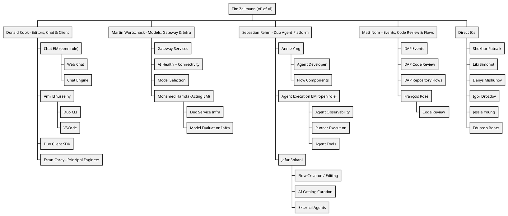

## ビジョン {#vision}

 **私たちの目標は、単に機能をリリースすることではなく、それらが確実に定着し、お客様に真の価値を提供することを保証することです。** 私たちは、高品質の基準を満たしながら、信頼性を確保し、多様なお客様のニーズに応えるための運用の容易さとスケーラビリティを維持することで、すべてのユーザーグループの期待を超えるクラス最高のプロダクトを開発することに努めています。すべてのチームメンバーは、私たちが行うすべてのことにおいて、ターゲットとするお客様とサポートする複数のプラットフォームを常に意識しておくべきです。

私たちのプロダクトが、特に主要なお客様である大企業の[組織アーキタイプ](/handbook/product/personas/organization-archetype/)に対して、あらゆる面で優れていることを保証します。これには、スケーラビリティ、適応性、シームレスなアップグレードパスが含まれます。機能を設計および実装する際は、すべてのデプロイメントオプション（セルフマネージド、Dedicated、Software as a Service (SaaS)）の互換性を常に念頭に置いてください。

私たちの[バリュー](/handbook/values/)と[独自の働き方](/handbook/company/culture/all-remote/guide/)を維持しながら、私たちのプロダクトとお客様の成長を支える成果を推進するために、技術力があり、多様でグローバルなチームを育成します。

## ミッション {#mission}

GitLab の独自の働き方である非同期での作業、ハンドブックファーストの手法、私たちが開発するプロダクトの活用、そしてバリューへの明確な焦点が、非常に高い生産性を実現しています。私たちは、最大限のお客様満足度に到達するために、プロダクトの品質、ユーザビリティ、信頼性を絶えず向上させることに焦点を当てています。コミュニティからのコントリビューションやお客様とのやり取りは、効率的で効果的なコミュニケーションに依存しています。私たちは、データドリブンで、カスタマーエクスペリエンスを最優先する、1 つの安全で信頼性が高く世界をリードする DevSecOps プラットフォームを提供するオープンコアの組織です。新しい基準を設定し、イノベーションを推進し、DevSecOps の限界を押し広げ、お客様に一貫して卓越した成果を提供するために、私たちに加わってください。

## 組織構造 {#organizational-structure}

## AI Engineering チーム {#ai-engineering-teams}

このセクションでは、AI 機能の実装と保守に携わるすべてのチームの概要を説明します。私たちの AI ポートフォリオは、カテゴリーを横断した取り組みです。

これらが各チームです（古くなっている場合は更新してください）。

| チーム | 担当 |
|------|-----------------|
| [Agent Foundations](/handbook/engineering/ai/agent-foundations/) | エージェントのオブザーバビリティ / 再利用可能なエージェントコンポーネント / Duo workflow service |
| [AI Coding](/handbook/engineering/ai/ai-coding/) | Code Suggestions、Duo Code Review、コード関連のスラッシュコマンド（/explain、/refactor、/tests、/fix）、Semantic Indexing、Duo Context Exclusion、Repository X-Ray |
| [AI Framework](/handbook/engineering/ai/ai-framework/) | 抽象化レイヤー / アプリケーションへの LLM 統合のための AI Gateway（GitLab Chat、Code Suggestions、その他の AI 機能） |
| [AI Framework](/handbook/engineering/ai/ai-framework/)（旧 Model Validation） | カスタム機能の評価ツール、評価サポート、自動評価ツール |
| [Duo Chat](/handbook/engineering/ai/duo-chat/) | VS Code および WebIDE 向けの GitLab Chat |
| [Editor Extensions: VS Code](/handbook/engineering/ai/editor-extensions-vscode/) | GitLab Workflow VS Code Extension（[メンテナー](https://gitlab-org.gitlab.io/gitlab-roulette/?currentProject=gitlab-vscode-extension&mode=show&hidden=reviewer)）、[Web IDE](https://gitlab.com/gitlab-org/gitlab-web-ide) 拡張機能、[language server](https://gitlab.com/groups/gitlab-org/-/epics/2431) を保守します。また、GitLab Workflow 内の Code Suggestions の UX 改善にも貢献します。 |
| [Editor Extensions: Multi-Platform](/handbook/engineering/ai/editor-extensions-multi-platform/) | <ul><li>[JetBrains](https://gitlab.com/gitlab-org/editor-extensions/gitlab-jetbrains-plugin)、[Neovim](https://gitlab.com/gitlab-org/editor-extensions/gitlab.vim)、[Visual Studio](https://gitlab.com/gitlab-org/editor-extensions/gitlab-visual-studio-extension) エディター拡張機能</li> <li>[Editor Extensions: VS Code](/handbook/engineering/ai/editor-extensions-vscode/) と [Language Server](https://gitlab.com/gitlab-org/editor-extensions/gitlab-lsp) を共同所有</li><li>Duo CLI（アイデア出し / MVC フェーズ）</li></ul> |
| [Global Search](/handbook/engineering/ai/search/) | 抽象化レイヤー / ベクトルストレージ / セマンティック |
| [Infrastructure Platforms - Runway](/handbook/engineering/infrastructure-platforms/gitlab-delivery/runway/) | AI Gateway のスケーラビリティ / Runway インフラ |
| [Workflow Catalog](/handbook/engineering/ai/workflow-catalog) | AI Catalog / カスタムエージェント / カスタムフロー |

## カウンターパート {#counterparts}

AI 部門のエンジニアリング構造は、Product の構造とは異なります。私たちがどのように協業し、カウンターパートが誰であるかについては、[AI プロダクトのページ](/handbook/product/ai/)を参照してください。

## ClickHouse データストアの利用 {#clickhouse-datastore-usage}

[Analytics:Platform Insights グループによる ClickHouse の利用](/handbook/engineering/data-engineering/analytics/platform-insights/#clickhouse-datastore)

## AI の実験 {#ai-experimentation}

私たちは、チームメンバーが探求と学習の旅の一環として、AI 関連のプロジェクトを実験し開発することを強く奨励します。これらの実験的な取り組みは、私たちの作業を加速し、AI チームが新たな課題と機会を受け入れることを可能にします。

既存のプロジェクトは、GitLab が管理するプロジェクトへの移行の可能性について、Product チームと Engineering チームによってケースバイケースでレビューされる場合があります。

透明性へのコミットメントを維持しながら GitLab のブランドを保護するために、すべての実験的な AI プロジェクトは、その README の冒頭に以下の免責事項を目立つように表示する必要があります。

「⚠️ これは非公式のプロジェクトです。GitLab Inc. によって承認またはサポートされておらず、本番環境での使用は推奨されません。」
