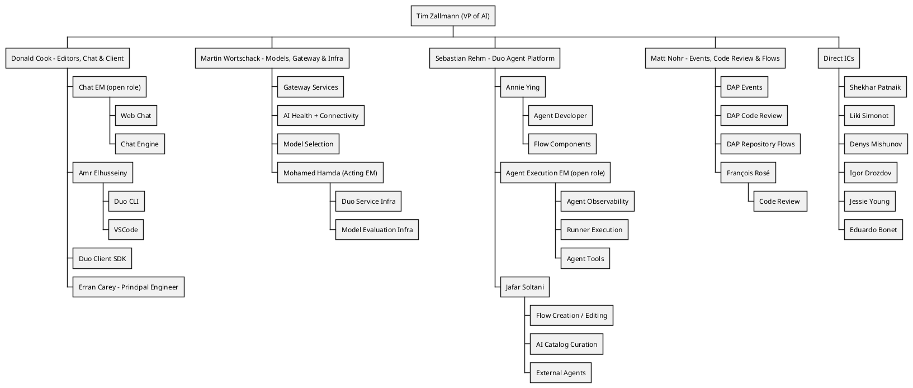

## Vision

 **私たちの目標は、単に機能をローンチすることではなく、それらが確実に定着し、顧客に真の価値を提供することです。** 私たちは、信頼性を確保し、運用のしやすさとスケーラビリティを維持しながら高い品質基準を満たすことで、すべてのユーザーグループの期待を上回る、クラス最高のプロダクトの開発に努めています。すべてのチームメンバーは、私たちが行うすべての事柄において、ターゲット顧客とサポートする複数のプラットフォームを常に意識すべきです。

私たちのプロダクトが、特に主要顧客である大企業の[組織アーキタイプ](/handbook/product/personas/organization-archetype/)に対して、あらゆる面で卓越していることを確実にします。これには、スケーラビリティ、適応性、シームレスなアップグレードパスが含まれます。機能を設計・実装する際は、私たちのすべてのデプロイオプション、すなわち self-managed、Dedicated、Software as a Service (SaaS) への互換性を常に念頭に置いてください。

[私たちのバリュー](/handbook/values/)と[独自の働き方](/handbook/company/culture/all-remote/guide/)を維持しながら、プロダクトと顧客の成長を支える成果を生み出すために、技術力が高く、多様でグローバルなチームを育成します。

## Mission

GitLab 独自の非同期な働き方、ハンドブックファーストの手法、自社開発するプロダクトの活用、そしてバリューへの明確なフォーカスにより、非常に高い生産性が実現されています。私たちは、最大限の顧客満足度に到達するために、プロダクトの品質、ユーザビリティ、信頼性を絶えず向上させることに注力しています。コミュニティからのコントリビューションと顧客とのやり取りは、効率的かつ効果的なコミュニケーションに依存しています。私たちは、データドリブンで、カスタマーエクスペリエンスを第一に考えるオープンコア組織であり、安全で信頼性が高く、世界をリードする単一の DevSecOps プラットフォームを提供しています。新たな標準を打ち立て、イノベーションを推進し、DevSecOps の限界を押し広げ、顧客に対して一貫して卓越した成果を提供する私たちに、ぜひ加わってください。

## Organizational Structure

## AI Engineering stakeholders

このセクションでは、AI 機能の実装と保守に携わるすべてのチームの概要を示します。私たちの Duo イニシアチブは、カテゴリーをまたぐ取り組みです。

ステークホルダーは次のとおりです。

| Team | Responsible For |
|------|-----------------|
| [Agent Foundations](/handbook/engineering/ai/agent-foundations/) | エージェントの可観測性 / 再利用可能なエージェントコンポーネント / Duo workflow サービス |
| [AI Coding](/handbook/engineering/ai/ai-coding/) | Code Suggestions、Duo Code Review、コード関連のスラッシュコマンド (/explain、/refactor、/tests、/fix)、Semantic Indexing、Duo Context Exclusion、Repository X-Ray  |
| [AI Framework](/handbook/engineering/ai/ai-framework/) | 抽象化レイヤー / アプリケーションへの LLM 統合のための AI Gateway (GitLab Chat、Code Suggestions、その他の AI 機能) |
| [AI Framework](/handbook/engineering/ai/ai-framework/) (旧 Model Validation) | カスタム機能評価ツール、評価サポート、自動評価ツール |
| [Duo Chat](/handbook/engineering/ai/duo-chat/)  | VS Code および WebIDE 向けの GitLab Chat  |
| [Editor Extensions: VS Code](/handbook/engineering/ai/editor-extensions-vscode/) | GitLab Workflow VS Code 拡張機能 ([メンテナー](https://gitlab-org.gitlab.io/gitlab-roulette/?currentProject=gitlab-vscode-extension&mode=show&hidden=reviewer))、[Web IDE](https://gitlab.com/gitlab-org/gitlab-web-ide) 拡張機能、[language server](https://gitlab.com/groups/gitlab-org/-/epics/2431) の保守。また、GitLab Workflow 内の Code Suggestions に対する UX 改善にも貢献。 |
| [Editor Extensions: Multi-Platform](/handbook/engineering/ai/editor-extensions-multi-platform/) | <ul><li>[JetBrains](https://gitlab.com/gitlab-org/editor-extensions/gitlab-jetbrains-plugin)、[Neovim](https://gitlab.com/gitlab-org/editor-extensions/gitlab.vim)、[Visual Studio](https://gitlab.com/gitlab-org/editor-extensions/gitlab-visual-studio-extension) のエディター拡張機能</li> <li>[Editor Extensions: VS Code](/handbook/engineering/ai/editor-extensions-vscode/) と共同で [Language Server](https://gitlab.com/gitlab-org/editor-extensions/gitlab-lsp) をオーナー</li><li>Duo CLI (アイデア出し / MVC フェーズ)</li></ul>  |
| [Global Search](/handbook/engineering/ai/search/) | 抽象化レイヤー / ベクトルストレージ / Semantic |
| [Infrastructure Platforms - Runway](/handbook/engineering/infrastructure-platforms/gitlab-delivery/runway/) | AI Gateway のスケーラビリティ / Runway インフラストラクチャ |
| [Workflow Catalog](/handbook/engineering/ai/workflow-catalog) | AI Catalog / Custom Agents / Custom Flows |

## Counterparts

AI 部門のエンジニアリング構造は、Product の構造とは異なります。どのように協業するか、そしてカウンターパートが誰であるかについては、[AI プロダクトのページ](/handbook/product/ai/)を参照してください。

## ClickHouse Datastore usage

[Analytics:Platform Insights グループによる ClickHouse の利用](/handbook/engineering/data-engineering/analytics/platform-insights/#clickhouse-datastore)

## Operating Principles

[AI Engineering グループのための運用原則](/handbook/engineering/ai/operating-principles)

## AI Experimentation

私たちは、チームメンバーが探求と学習の旅の一環として、AI 関連プロジェクトを実験・開発することを強く奨励しています。こうした実験的な取り組みは、私たちの業務を加速させ、AI チームが新たな課題と機会を受け入れることを可能にします。

既存のプロジェクトは、GitLab 管理プロジェクトへの移行の可能性について、プロダクトおよびエンジニアリングチームによってケースバイケースでレビューされる場合があります。

透明性へのコミットメントを維持しつつ GitLab のブランドを保護するため、すべての実験的な AI プロジェクトは、README の冒頭に次の免責事項を目立つように表示しなければなりません。

「⚠️ これは非公式なプロジェクトです。GitLab Inc. によって承認またはサポートされておらず、本番環境での使用は推奨されません。」
