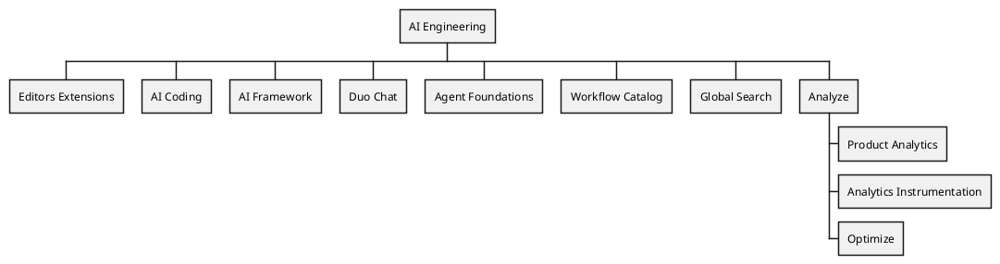

## ビジョン

 **私たちのゴールは、単に機能をローンチすることではなく、それらが成功裏に着地し、顧客に真の価値を提供することを保証することです。** すべてのユーザーグループの期待を超える、クラス最高のプロダクトを開発することを目指し、高い品質基準を満たしつつ、信頼性を確保し、多様な顧客のニーズに応える運用の容易さとスケーラビリティを維持します。すべてのチームメンバーは、私たちが行うすべての中で、ターゲット顧客とサポートする複数のプラットフォームを意識し続ける必要があります。

特に大規模エンタープライズという主要な顧客の [organization archetype](/handbook/product/personas/organization-archetype/) のすべての側面でプロダクトが優れていることを保証してください。これにはスケーラビリティ、適応性、シームレスなアップグレードパスが含まれます。機能を設計および実装する際は、self-managed、dedicated、Software as a Service (SaaS) というすべてのデプロイオプションとの互換性を常に念頭に置いてください。

私たちの [価値観](/handbook/values/) と [ユニークな働き方](/handbook/company/culture/all-remote/guide/) を維持しながら、プロダクトと顧客の成長をサポートする結果を推進する技術的、多様、グローバルなチームを開発します。

## ミッション

GitLab のユニークな非同期の働き方、ハンドブックファーストの方法、私たちが開発するプロダクトの活用、そして価値観への明確な焦点が、非常に高い生産性を可能にしています。私たちはプロダクトの品質、ユーザビリティ、信頼性を継続的に改善し、最大の顧客満足度を達成することに焦点を当てています。コミュニティ貢献と顧客とのインタラクションは、効率的かつ効果的なコミュニケーションに依存しています。私たちはデータドリブンで、カスタマーエクスペリエンスファーストの、オープンコア組織であり、安全で信頼性が高く、世界をリードする 1 つの DevSecOps プラットフォームを提供しています。新しい基準を設定し、イノベーションを推進し、DevSecOps の境界を押し広げ、顧客に常に卓越した結果を提供することに参加しましょう。

## 組織構造

## AI Engineering ステークホルダー

このセクションでは、AI 機能の実装と保守に投資しているすべてのチームの概要を提供します。私たちの Duo イニシアチブは、カテゴリ横断的な取り組みです。

これらがステークホルダーです。

| チーム | 担当範囲 |
|------|-----------------|
| [Agent Foundations](/handbook/engineering/ai/agent-foundations/) | Agentic observability / 再利用可能な Agentic コンポーネント / Duo workflow service |
| [AI Coding](/handbook/engineering/ai/ai-coding/) | Code Suggestions、Duo Code Review、コード関連のスラッシュコマンド (/explain、/refactor、/tests、/fix)、Semantic Indexing、Duo Context Exclusion、Repository X-Ray |
| [AI Framework](/handbook/engineering/ai/ai-framework/) | アプリケーション (GitLab Chat、Code Suggestions、その他の AI 機能) への LLM 統合のための Abstraction Layer / AI Gateway |
| [AI Framework](/handbook/engineering/ai/ai-framework/) (旧 Model Validation) | カスタム機能の評価器、評価サポート、自動評価ツール |
| [Cloud Connector](/handbook/engineering/infrastructure/team/cloud-connector/) (`@mkaeppler`、`@nmilojevic1`) | Self-Managed 向けの Duo へのアクセスをサポート: Cloud Connector、Unit Primitives |
| [Duo Chat](/handbook/engineering/ai/duo-chat/)  | VS Code および WebIDE 向けの GitLab Chat |
| [Editor Extensions: VS Code](/handbook/engineering/ai/editor-extensions-vscode/) | GitLab Workflow VS Code Extension ([maintainer](https://gitlab-org.gitlab.io/gitlab-roulette/?currentProject=gitlab-vscode-extension&mode=show&hidden=reviewer)) と [Web IDE](https://gitlab.com/gitlab-org/gitlab-web-ide) 拡張機能、および [language server](https://gitlab.com/groups/gitlab-org/-/epics/2431) を保守。GitLab Workflow 内の Code Suggestions の UX 改善にも貢献。 |
| [Editor Extensions: Multi-Platform](/handbook/engineering/ai/editor-extensions-multi-platform/) | <ul><li>[JetBrains](https://gitlab.com/gitlab-org/editor-extensions/gitlab-jetbrains-plugin)、[Neovim](https://gitlab.com/gitlab-org/editor-extensions/gitlab.vim) と [Visual Studio](https://gitlab.com/gitlab-org/editor-extensions/gitlab-visual-studio-extension) のエディタ拡張機能</li> <li>[Editor Extensions: VS Code](/handbook/engineering/ai/editor-extensions-vscode/) と [Language Server](https://gitlab.com/gitlab-org/editor-extensions/gitlab-lsp) を共同所有</li><li>Duo CLI (アイデア出し/MVC フェーズ)</li></ul>  |
| [Global Search](/handbook/engineering/ai/search/) | Abstraction Layer / Vector Storage / Semantic |
| [Infrastructure Platforms - Runway](/handbook/engineering/infrastructure-platforms/gitlab-delivery/runway/) | AI Gateway のスケーラビリティ / Runway インフラストラクチャ |
| [Workflow Catalog](/handbook/engineering/ai/workflow-catalog) | AI Catalog / Custom Agents / Custom Flows |

## カウンターパート

AI 部門のエンジニアリング構造はプロダクト構造とは異なります。私たちがどのようにコラボレーションし、誰がカウンターパートであるかについては、[AI プロダクトのページ](/handbook/product/ai/) を確認してください。

## ClickHouse データストアの利用

[Analytics:Platform Insights グループによる ClickHouse 利用](/handbook/engineering/data-engineering/analytics/platform-insights/#clickhouse-datastore)

## 運用原則

[AI Engineering グループの運用原則](/handbook/engineering/ai/operating-principles)

## AI 実験

私たちは、チームメンバーが探索と学習の旅の一環として、AI 関連プロジェクトを実験し開発することを強く奨励しています。これらの実験的なイニシアチブは、私たちの作業を加速し、AI チームが新たな課題と機会を受け入れることを可能にします。

既存のプロジェクトは、GitLab 管理プロジェクトへの移行の可能性について、プロダクトおよびエンジニアリングチームによってケースバイケースでレビューされる場合があります。

GitLab のブランドを保護しつつ、透明性へのコミットメントを維持するため、すべての実験的な AI プロジェクトは、README の上部に次の免責事項を目立つように表示する必要があります。

「⚠️ This is an unofficial project. It is not endorsed or supported by GitLab Inc. and is not recommended for use in production environments.」
