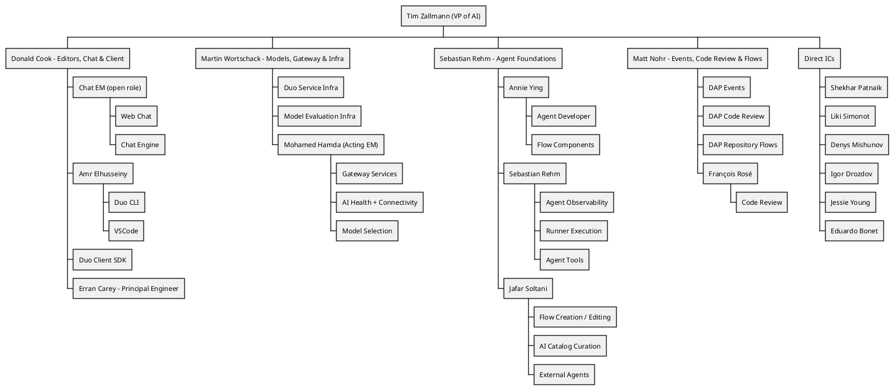

## ビジョン

 **私たちの目標は、単に機能をリリースすることではなく、それらが確実に定着し、お客様に真の価値を提供するようにすることです。** 私たちは、高い品質基準を満たし、信頼性を確保しながら、多様なお客様のニーズに応える運用の容易さとスケーラビリティを維持することで、すべてのユーザーグループの期待を超えるクラス最高のプロダクト開発に努めています。すべてのチームメンバーは、私たちが行うあらゆることにおいて、対象となるお客様と、私たちがサポートする複数のプラットフォームを常に意識する必要があります。

私たちのプロダクトが、特に主要なお客様である大企業の[組織アーキタイプ](/handbook/marketing/brand-and-product-marketing/product-and-solution-marketing/roles-personas/organization-archetype/)に対して、あらゆる面で優れたものになるようにします。これには、スケーラビリティ、適応性、シームレスなアップグレードパスが含まれます。機能を設計および実装する際は、セルフマネージド、Dedicated、Software as a Service (SaaS) というすべてのデプロイオプションとの互換性を常に考慮してください。

私たちの[バリュー](/handbook/values/)と[独自の働き方](/handbook/company/culture/all-remote/guide/)を維持しながら、プロダクトとお客様の成長を支える成果を生み出すために、技術力があり、多様でグローバルなチームを育成します。

## ミッション

GitLab 独自の非同期な働き方、ハンドブックファーストの手法、私たちが開発するプロダクトの活用、そしてバリューへの明確な集中により、非常に高い生産性を実現できます。私たちは、お客様の満足度を最大化するために、プロダクトの品質、使いやすさ、信頼性を絶えず向上させることに注力しています。コミュニティからのコントリビューションとお客様とのやり取りには、効率的かつ効果的なコミュニケーションが欠かせません。私たちは、データドリブンかつカスタマーエクスペリエンスを第一に考えるオープンコア組織として、安全で信頼性が高い世界トップクラスの単一 DevSecOps プラットフォームを提供しています。新たな基準を打ち立て、イノベーションを推進し、DevSecOps の限界を押し広げ、お客様に卓越した成果を一貫して届ける取り組みに、ぜひ参加してください。

## 組織構造

```plantuml
@startwbs
* Tim Zallmann (VP of AI)
** Donald Cook - Editors, Chat & Client
*** Chat EM (open role)
**** Web Chat
**** Chat Engine
*** Amr Elhusseiny
**** Duo CLI
**** VSCode
*** Duo Client SDK
*** Erran Carey - Principal Engineer
** Martin Wortschack - Models, Gateway & Infra
*** Duo Service Infra
*** Model Evaluation Infra
*** Mohamed Hamda (Acting EM)
**** Gateway Services
**** AI Health + Connectivity
**** Model Selection
** Sebastian Rehm - Agent Foundations
*** Annie Ying
**** Agent Developer
**** Flow Components
*** Sebastian Rehm
**** Agent Observability
**** Runner Execution
**** Agent Tools
*** Jafar Soltani
**** Flow Creation / Editing
**** AI Catalog Curation
**** External Agents
** Matt Nohr - Events, Code Review & Flows
*** DAP Events
*** DAP Code Review
*** DAP Repository Flows
*** François Rosé
**** Code Review
** Direct ICs
*** Shekhar Patnaik
*** Liki Simonot
*** Denys Mishunov
*** Igor Drozdov
*** Jessie Young
*** Eduardo Bonet
@endwbs
```

## AI Engineering チーム

このセクションでは、AI 機能の実装と保守に取り組むすべてのチームの概要を説明します。私たちの AI ポートフォリオは、複数のカテゴリにまたがる取り組みです。

以下が該当するチームです（情報が古い場合は更新してください）。

| チーム | 担当範囲 |
|------|-----------------|
| [Agent Foundations](/handbook/engineering/ai/agent-foundations/) | エージェント型 AI の基盤セクション： <ul><li>[Agent Developer](/handbook/engineering/ai/agent-foundations/agent-developer/)</li><li>[AI Catalog](/handbook/engineering/ai/agent-foundations/ai-catalog/)</li><li>[Agent Execution](/handbook/engineering/ai/agent-foundations/agent-execution/)</li></ul> |
| [AI Coding](/handbook/engineering/ai/ai-coding/) | Code Suggestions、Duo Code Review、コード関連のスラッシュコマンド (/explain, /refactor, /tests, /fix)、Semantic Indexing、Duo Context Exclusion、Repository X-Ray  |
| [AI Core Infra](/handbook/engineering/ai/ai-core-infra/) | アプリケーション（GitLab Chat、Code Suggestions、その他の AI 機能）に LLM を統合するための Abstraction Layer / AI Gateway |
| [AI Core Infra](/handbook/engineering/ai/ai-core-infra/)（旧 Model Validation） | 機能別のカスタム評価機能、評価サポート、自動評価ツール |
| [AI Clients: Developer Clients](/handbook/engineering/ai/ai-clients/developer-clients/) | VS Code 拡張機能、JetBrains プラグイン、Duo CLI |
| [AI Clients: Duo Client SDK](/handbook/engineering/ai/ai-clients/duo-client-sdk/) | GitLab Language Server、およびすべてのエディター拡張機能にわたる AI 機能を支える共有クライアント SDK |
| [AI Clients: Duo Chat](/handbook/engineering/ai/ai-clients/duo-chat/) | Web と IDE の各サーフェスにわたる Duo Chat（Web Chat、Chat Engine） |
| [AI Model Services](/handbook/engineering/ai/ai-model-services/) | Model Selection（モデルのライフサイクル、選択エンジンと UI）/ Health & Connectivity（Duo Health Check、セットアップ、接続性）/ Gateway Services（Prompt Registry、イベント追跡、AIGW 請求） |
| [Global Search](/handbook/engineering/ai/search/) | Abstraction Layer / Vector Storage / セマンティック検索 |
| [Infrastructure Platforms - Runway](/handbook/engineering/infrastructure-platforms/gitlab-delivery/runway/) | AI Gateway のスケーラビリティ / Runway インフラストラクチャ |

## カウンターパート

AI 部門の Engineering 組織構造は、Product の組織構造とは異なります。連携方法とカウンターパートについては、[AI プロダクトのページ](/handbook/product/ai/)を参照してください。

## ClickHouse データストアの利用

[Analytics:Platform Insights グループによる ClickHouse の利用](/handbook/engineering/data-engineering/analytics/platform-insights/#clickhouse-datastore)

## AI の実験

チームメンバーには、探求と学習の一環として AI 関連プロジェクトを試し、開発することを強く推奨します。こうした実験的な取り組みは、私たちの作業を加速させ、AI チームが新たな課題や機会を受け入れられるようにします。

既存のプロジェクトについては、GitLab が管理するプロジェクトへ移行できる可能性を判断するため、Product チームと Engineering チームがケースバイケースでレビューする場合があります。

透明性への取り組みを維持しながら GitLab のブランドを保護するため、すべての実験的な AI プロジェクトでは README の冒頭に次の免責事項を目立つように表示する必要があります。

「⚠️ これは非公式プロジェクトです。GitLab Inc. が推奨またはサポートするものではなく、本番環境での使用は推奨されません。」
