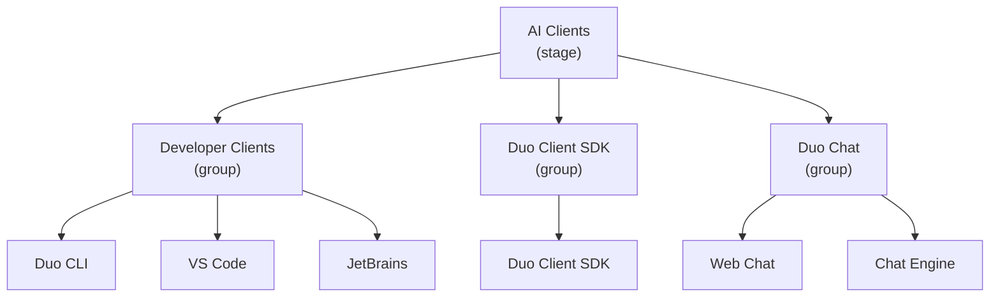

## 🚀 ミッション

AI Clients ステージは、顧客が GitLab Duo を体験するサーフェスを担当します。顧客がすでに使用しているツール（IDE、ターミナル、GitLab の Web インターフェース）に GitLab の AI 機能を直接提供し、プラットフォームをまたいでそれらの体験を支える共有クライアント SDK を提供します。

---

## 組織構造

AI Clients ステージは 3 つのグループで構成され、各グループに機能別チームがあります。

| グループ | Engineering Manager | Product Manager | UX | 機能別チーム |
|---|---|---|---|---|
| [Developer Clients](developer-clients/) | Amr Elhusseiny | James Casey | Yi-Ann Chen | Duo CLI、VS Code、JetBrains |
| [Duo Client SDK](duo-client-sdk/) | Donald Cook | James Casey | Yi-Ann Chen | Duo Client SDK |
| [Duo Chat](duo-chat/) | Donald Cook | Dasha Adushkina | Nick Leonard | Web Chat、Chat Engine |

---

## 👥 リーダーシップ

| 人物 | 役割 |
|---|---|
|  | Engineering Manager — AI Clients ステージ（Duo Client SDK と Duo Chat） |
| ↳  | Engineering Manager — Developer Clients |

---

## 🤝 安定したカウンターパート

以下の人々は、AI Clients ステージの[安定したカウンターパート](/handbook/leadership/#stable-counterparts)です。



---

## グループ

### Developer Clients

エディター拡張機能との統合と Duo CLI を担当します。[Developer Clients グループのページ](developer-clients/)を参照してください。機能別チームは以下のとおりです。

- [Duo CLI](developer-clients/duo-cli/)
- [VS Code](developer-clients/vscode/)
- [JetBrains](developer-clients/jetbrains/)

### Duo Client SDK

すべてのエディター拡張機能にわたる AI 機能を支える、共有 Language Server とクライアント SDK を担当します。[Duo Client SDK グループのページ](duo-client-sdk/)を参照してください。機能別チームは以下のとおりです。

- [Duo Client SDK](duo-client-sdk/duo-client-sdk/)

### Duo Chat

すべてのサーフェスにわたる Duo Chat 体験を担当します。[Duo Chat グループのページ](duo-chat/)を参照してください。機能別チームは以下のとおりです。

- [Web Chat](duo-chat/web-chat/)
- [Chat Engine](duo-chat/chat-engine/)

---

## 🏷️ Issue とマージリクエストへのラベル付け方法 {#-how-we-label-issues-and-merge-requests}

ラベルは、triage-ops の自動化、レポート、Technical Writing の計画に使用されます。すべての Issue と MR には、`section::ai`、ステージラベル（`devops::*`）を 1 つだけ、グループラベル（`group::*`）を 1 つだけ、関連するカテゴリラベルを付ける必要があります。以下の組み合わせをデフォルトとして使用してください。

| 領域 | ラベル |
|---|---|
| Duo CLI（ターミナルクライアント） | `section::ai`、`devops::ai clients`、`group::developer clients`、`category: duo cli` |
| VS Code 拡張機能 | `section::ai`、`devops::ai clients`、`group::developer clients`、`category: vs code` |
| JetBrains プラグイン | `section::ai`、`devops::ai clients`、`group::developer clients`、`category: jetbrains` |
| Duo Client SDK / Language Server | `section::ai`、`devops::ai clients`、`group::duo client sdk`、`category: duo client sdk` |
| Duo Chat（UI と GitLab 内のチャット体験） | `section::ai`、`devops::ai clients`、`group::duo chat`、`category: web chat` |
| Duo Chat（バックエンド / Chat Engine の機能作業） | `section::ai`、`devops::ai clients`、`group::duo chat`、`category: chat engine` |
| Duo Developer（エンドツーエンドフロー、Agent Foundations） | `section::ai`、`devops::agent foundations`、`group::agent developer`、`category: duo developer` |
| Flow Components（再利用可能なフロー / オーケストレーションコンポーネント） | `section::ai`、`devops::agent foundations`、`group::agent developer`、`category: flow components` |

変更が実際に複数のプロダクト領域にまたがる場合は、複数のカテゴリラベルを付けますが、ステージラベルとグループラベルは主要なオーナーに合わせてください。

従来の `Editor Extensions::*` ラベルはこの分類体系に含まれません。オーナーシップを示すものとして頼らず、テンプレートから徐々に削除してください。

---

## 💬 連絡先

### Slack

私たちは、[GitLab Slack チャンネルのプレフィックス規約](/handbook/communication/chat/#channel-categories)に従います。`s_` はチーム横断のステージチャンネル、`f_` は機能別チームのチャンネルを示します。

| チャンネル | 目的 |
|---|---|
| [`#s_ai-clients-questions`](https://gitlab.enterprise.slack.com/archives/C058YCHP17C) | 質問や連絡に使用する公開の AI Clients ステージチャンネル |
| [`#s_ai-clients`](https://gitlab.slack.com/archives/C0BFY0ZRR7W/p1785161570031899?thread_ts=1784037442.282119&cid=C0BFY0ZRR7W) | チームの同期のみに使用する社内ステージチャンネル |
| [`#s_ai-clients-social`](https://gitlab.enterprise.slack.com/archives/C062W19B8NR) | ステージのソーシャルチャンネル |
| [`#f_duo_cli`](https://gitlab.enterprise.slack.com/archives/C09GLR7UK0D) | Duo CLI 機能別チーム |
| [`#f_vscode_extension`](https://gitlab.enterprise.slack.com/archives/C013QJ9NEPL)  | VS Code 拡張機能の機能別チーム |
| [`#f_jetbrains_plugin`](https://gitlab.enterprise.slack.com/archives/C02UY9XKABH) | JetBrains プラグインの機能別チーム |
| [`#f_duo-client-sdk`](https://gitlab.enterprise.slack.com/archives/C05B1PFHRPU) | Duo Client SDK 機能別チーム（`#f_language_server` から名称変更） |
| [`#duo-chat-lounge`](https://gitlab.enterprise.slack.com/archives/C06LWENL58F) | Duo Chat ラウンジ |

### 共有カレンダー {#shared-calendar}

AI Clients 共有カレンダー（カレンダー ID：c_673d889354d021f7fa9f20a003b5867185a9bf12989b5eaacbc8b537cc9ef27c@group.calendar.google.com）

### プロダクトカテゴリ

各 AI Clients グループはプロダクトカテゴリを担当します。詳しくは[プロダクトカテゴリのページ](/handbook/product/categories/)に記載されています。

- [Developer Clients グループ](/handbook/product/categories/#developer-clients-group) — Duo CLI、VS Code、JetBrains
- [Duo Chat グループ](/handbook/product/categories/#duo-chat-group) — Web Chat、Chat Engine
- [Duo Client SDK グループ](/handbook/product/categories/#duo-client-sdk-group) — Duo Client SDK
