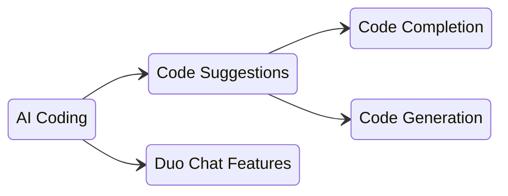

## 概要

Code Suggestions は、AI Coding グループが開発する主要な機能の 1 つです。次の 2 つの主な機能を通じて、IDE 内で AI 生成のコードを提供します。

- **Code Completion**: 既存の行やコードブロックを補完することを意図した、短い AI 生成のサジェスチョン
- **Code Generation**: 関数、クラス、コードブロック全体などを作成することを意図した、長い AI 生成のサジェスチョン

## お問い合わせ

| カテゴリ                 | 名前                |
|--------------------------|---------------------|
| Group Slack Channel      | #g_ai_coding        |
| Code Suggestions Channel | #f_code-suggestions |

## 主要な概念

この領域で私たちが使う用語の多くは似通っており、最初は混乱しやすいものです。ここでは、私たちが使う基本的な用語を紹介します。

- **Code Suggestions**: IDE 内で AI 生成のコードを提供する AI Coding 内の機能
  - **Code Completion**: 既存の行やコードブロックを補完することを意図した、短い AI 生成のサジェスチョン
  - **Code Generation**: 関数、クラス、コードブロック全体などを作成することを意図した、長い AI 生成のサジェスチョン
- **Duo Chat**: GitLab Duo Chat とやり取りして、新しいコードを書いたり、既存のコードをリファクタリングしたり、コードに脆弱性がないかスキャンしたりするもう 1 つの機能

参考までに、これらの用語を図で示します。

## 技術的な実装

Code Suggestions の仕組みに関する詳細な技術情報（アーキテクチャ図や API の詳細を含む）については、[Engineering Overview](/handbook/engineering/ai/ai-coding/feature-stewardship/code_suggestions/engineering_overview/) を参照してください。

## ダッシュボードとモニタリング

- [User Metrics](https://10az.online.tableau.com/#/site/gitlab/views/PDCodeSuggestions/ExecutiveSummary) ([README](https://10az.online.tableau.com/#/site/gitlab/views/PDCodeSuggestions/README?:iid=1)) - 使用状況、受け入れ率、レイテンシ、エラー率など (Tableau)
- [General Metric Reporting](https://10az.online.tableau.com/#/site/gitlab/views/DRAFTCentralizedGMAUDashboard/MetricReporting?:iid=1) - Code Suggestions のレート制限、X-Ray の使用状況などを確認できます (Tableau)
- [Log Visualization Dashboard](https://log.gprd.gitlab.net/app/dashboards#/view/6c947f80-7c07-11ed-9f43-e3784d7fe3ca?_g=(refreshInterval:(pause:!t,value:0),time:(from:now-6h,to:now))) - レイテンシ、レスポンスコード、リクエスト数などの別ビュー (Kibana)
- [Latency Dashboard](https://log.gprd.gitlab.net/app/r/s/mMaY3): Code Suggestions のサーバーサイドレイテンシの内訳 (Kibana)
- [LSP Sentry Alerts](https://new-sentry.gitlab.net/organizations/gitlab/alerts/rules/gitlab-language-server/51/details/) と、アラートが投稿される対応する Slack チャンネル: [#g_code_creation_alerts](https://gitlab.enterprise.slack.com/archives/C096BUFJHFU)

## ドキュメント

- [Development Guide](/handbook/engineering/ai/ai-coding/feature-stewardship/code_suggestions/development_guide/) - エンジニア向けの開発ガイド
- [GitLab Duo](https://docs.gitlab.com/user/gitlab_duo/) - GitLab Documentation
- [GitLab Documentation](https://docs.gitlab.com/ee/user/project/repository/code_suggestions/) - GitLab Documentation
- [Direction](https://about.gitlab.com/direction/create/code_creation/code_suggestions/)
- [Difference between Code Completion and Code Generation](https://youtu.be/9dsyqMt9yg4) - YouTube
- [Engineering Overview](/handbook/engineering/ai/ai-coding/feature-stewardship/code_suggestions/engineering_overview/) - Code Suggestions の技術概要
- [Epic](https://gitlab.com/groups/gitlab-org/-/epics/18077)
