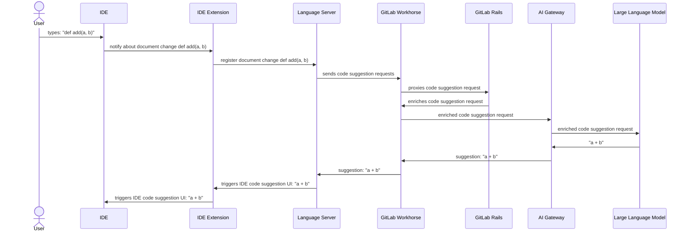
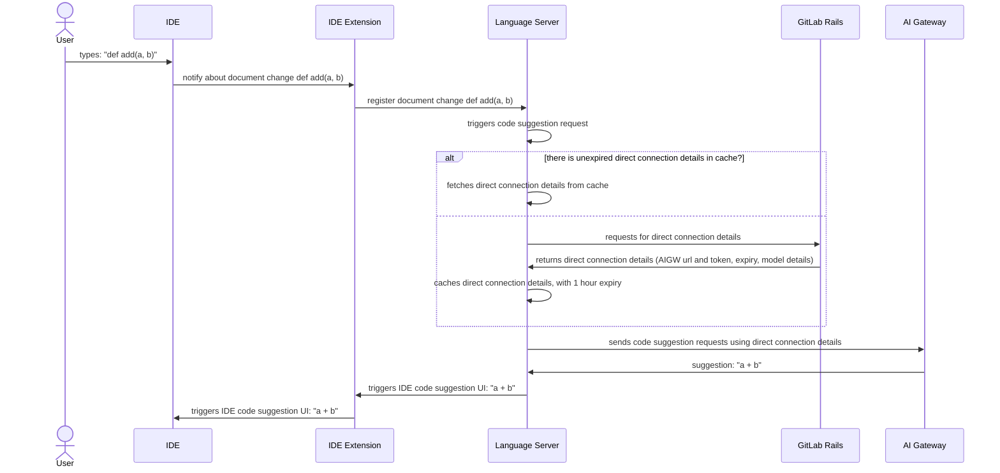
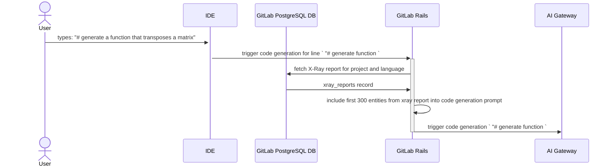

## はじめに

GitLab の Code Suggestions の技術概要へようこそ。これは、高度な AI 技術を開発環境内に直接統合することでコーディング体験を向上させるために設計された機能です。このページは、インテリジェントな補完と生成的なコーディング機能によってコーディングプロセスを大幅に効率化する、革新的な Code Suggestions 機能の背後にあるアーキテクチャとインタラクションを理解するためのガイドとなります。

Code Suggestions の中核は、IDE 拡張機能、Language Server、GitLab Workhorse、そして AI Gateway といった複数のコンポーネントを含む洗練されたワークフローを通じて動作し、それらすべてが連携して、リアルタイムでコンテキストを認識したコーディング候補を提供します。入力作業を高速化するシンプルなコード補完から、コードブロック全体を作り出す複雑なコード生成まで、私たちのシステムは幅広いコーディング活動をサポートし、生産性を高めるように設計されています。

以下では、このエコシステムにおける各コンポーネントの役割を詳しく説明し、システム内のデータの流れを示し、迅速な候補提示と詳細なコード生成の両方を提供するために、さまざまな種類のコーディングインタラクションがどのように処理されるかを解説します。

## Code Suggestions の技術概要 {#code-suggestions-technical-overview}

Code Suggestions は通常、次の図に示すシーケンスに従います。

図に示されているコンポーネントは以下のとおりです。

1. IDE 拡張機能: GitLab は、他の機能とともに Language Server との統合も提供する多数の IDE 拡張機能（別名プラグイン）を提供しています
   1. VSCode Extension: https://gitlab.com/gitlab-org/gitlab-vscode-extension/
   1. JetBrains Extension: https://gitlab.com/gitlab-org/editor-extensions/gitlab-jetbrains-plugin
   1. NeoVim Extension: https://gitlab.com/gitlab-org/editor-extensions/gitlab.vim
1. [Language Server](https://gitlab.com/gitlab-org/editor-extensions/gitlab-lsp): さまざまな IDE 間で共有できる機能を統一された方法で提供し、重複を削減します。Language Server は、IDE 拡張機能との通信に [LSP プロトコル](https://microsoft.github.io/language-server-protocol/) を使用するコンポーネントです。
1. [GitLab Workhorse](https://docs.gitlab.com/ee/development/workhorse/) - GitLab Workhorse は、リソースを多く消費する長時間実行リクエストを処理することを目的とした GitLab 用のスマートなリバースプロキシです。
1. [GitLab Rails](https://gitlab.com/gitlab-org/gitlab) - 大半の機能を提供する GitLab の主要コンポーネントです。
1. [AI Gateway](https://gitlab.com/gitlab-org/modelops/applied-ml/code-suggestions/ai-assist) - self-managed、dedicated、GitLab.com のいずれのインスタンスを使用しているかに関わらず、すべての GitLab ユーザーに AI 機能へのアクセスを提供するスタンドアロンサービスです。より概念的な情報については [アーキテクチャブループリント](https://docs.gitlab.com/ee/architecture/blueprints/ai_gateway/index.html) を参照してください
1. Large Language Model - コード生成機能を提供する AI モデルです

Code Suggestions には 2 種類のインタラクションがあります。

- **[Code Completion](#code-completion)**: 既存の行やコードブロックを補完することを目的とした、短い AI 生成の候補
- **[Code Generation](#code-generation)**: 関数、クラス、コードブロック全体などを作成することを目的とした、より長い AI 生成の候補

各コード候補リクエストは 1 つのカテゴリに分類されます。リクエストの分類は、リクエストが GitLab Workhorse に送信される前に Language Server によって行われます。Language Server で分類が行われない場合は、この分類は GitLab Rails によって行われます。

## Code Completion

Code Completion インタラクションは、IDE によってトリガーされる 2 種類のコード候補リクエストの 1 つです。その目標は、候補のサイズが小さくなり、周囲のソースコードやリポジトリファイルのコンテキスト認識が低くなることと引き換えに、非常に高速な応答（1 秒未満）を提供することです。

デフォルトでは、Code Completion リクエストは、[以下に説明するシーケンス](#code-completion-direct-connection-diagram) に示すように、GitLab Rails モノリスから取得した直接接続の詳細を使って AI Gateway に直接送信されます。あるいは、[Code Suggestions の技術概要の図](#code-suggestions-technical-overview) に示すように、リクエストを GitLab Rails モノリス経由でルーティングすることもできます。

Language Server が準備したリクエストは、追加のコンテキストが付与されることなく、ほぼ変更されていない形でプロキシされます。この機能における GitLab Rails の役割は、主に、対象ユーザーが Code Suggestions 機能の使用を許可されていることを保証する認可エンティティに限定されます。

### Code Completion ダイレクト接続ダイアグラム {#code-completion-direct-connection-diagram}

図に示されているコンポーネントは、[技術概要](#code-suggestions-technical-overview) のセクションで説明されています。

## Code Generation

Code Generation インタラクションは、IDE によってトリガーされるもう 1 種類のコード候補リクエストです。その目標は、関数やクラスなどの完全なコードブロックを生成する、長く広範な応答を提供することです。応答時間は Code Completion よりもはるかに長くなります（最大 30 秒）。この種のコード候補リクエストは、ユーザーのタスクを解決する際に拡張コンテキストを考慮します。このコンテキストは、IDE 内の現在のファイルと、[Repository X-Ray](https://docs.gitlab.com/ee/user/project/repository/code_suggestions/repository_xray.html) レポートから取得されます。

上の図では、一部のコンポーネント（GitLab Workhorse や Language Server など）は簡潔さのために省略されています。ただし、[技術概要](#code-suggestions-technical-overview) のセクションで示したリクエストの大まかな流れは変わりません。

## API リファレンス

Rails モノリスと AI Gateway プロジェクトの両方で使用される Code Suggestion API エンドポイントの完全な概要については、以下を参照してください。

- [Rails app Code Suggestions API Reference](https://docs.gitlab.com/api/code_suggestions/)
- [AI Gateway API Reference](https://gitlab.com/gitlab-org/modelops/applied-ml/code-suggestions/ai-assist/-/blob/main/docs/api.md?ref_type=heads)
