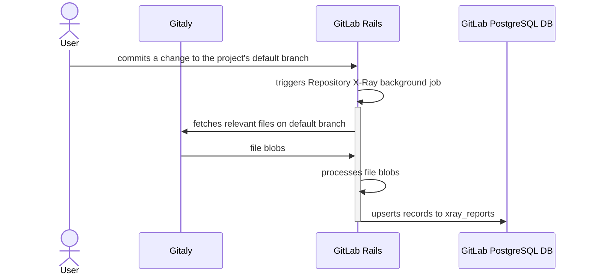

## 概要

[Repository X-Ray](https://docs.gitlab.com/ee/user/project/repository/code_suggestions/repository_xray.html) は、リポジトリを解析してメタデータとコンテキスト情報を抽出する機能です。これらの情報はコード生成リクエストの追加コンテキストとして使われ、AI モデルがプロジェクトのコーディングパターンを理解しやすくします。

## 動作の仕組み

Repository X-Ray は、リポジトリを自動的に解析し、プロジェクトで使用されている外部依存関係やライブラリを抽出します。

抽出されたメタデータはデータベースに保存され、コード生成リクエストに含められて、より正確でコンテキストに沿った提案を提供します。

## 技術的な実装

Repository X-Ray のレポートは、プロジェクトのデフォルトブランチに変更がコミットされたタイミングで自動生成されます。

図に登場するコンポーネントは次のとおりです。

1. [Gitaly](https://docs.gitlab.com/ee/administration/gitaly/) - Git リポジトリへのハイレベルな RPC アクセスを提供するアプリケーション。
1. GitLab PostgreSQL DB - GitLab の運用データを保存するリレーショナルデータベースエンジン。

生成されたレポートは、その後コード生成リクエストに自動的に含まれ、AI モデルのプロジェクトコンテキスト理解を強化します。

## ダッシュボードとモニタリング

- [X-Ray Dependency Parsing Errors Dashboard](https://log.gprd.gitlab.net/app/dashboards#/view/a828978b-8f41-489a-9e3b-aa71937e25b9?_g=h@e98e959): X-Ray の依存関係スキャンで発生したパースエラーの内訳（Kibana）
- [General Metric Reporting](https://10az.online.tableau.com/#/site/gitlab/views/DRAFTCentralizedGMAUDashboard/MetricReporting?:iid=1) - X-Ray の利用メトリクスを含む（Tableau）

## ドキュメント

- [Repository X-Ray ユーザードキュメント](https://docs.gitlab.com/ee/user/project/repository/code_suggestions/repository_xray.html)
