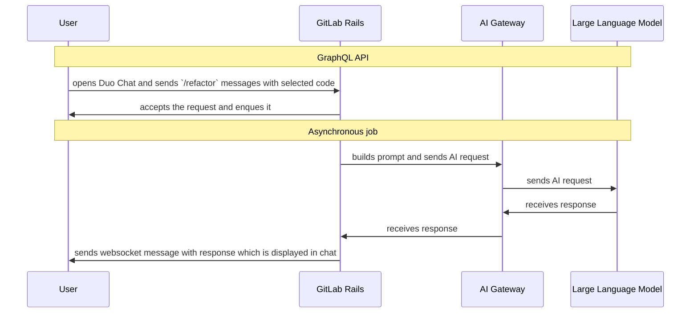

## 概要

コード関連のスラッシュコマンドは、よくある開発タスクに対する対話型 AI 支援を提供します。これらのコマンドは GitLab Duo Chat と統合されており、開発者がコードを理解・改善・テストするのを助けます。

利用可能なコマンド

- `/explain` - 選択したコードについて詳細な解説を提供し、複雑なロジックやアルゴリズム、見慣れないコードパターンの理解を助けます。[ドキュメント](https://docs.gitlab.com/user/gitlab_duo_chat/examples/#explain-selected-code)
- `/refactor` - 選択したコードに対して、コード品質、可読性、保守性に焦点を当てた改善やリファクタリングの機会を提案します。[ドキュメント](https://docs.gitlab.com/user/gitlab_duo_chat/examples/#refactor-code-in-the-ide)
- `/tests` - 選択したコードに対するユニットテストを生成し、開発者がテストカバレッジを向上させ、コードの信頼性を確保するのを助けます。[ドキュメント](https://docs.gitlab.com/user/gitlab_duo_chat/examples/#write-tests-in-the-ide)
- `/fix` - 選択したコードに潜むバグや問題を解析し、修正案や改善案を提示します。[ドキュメント](https://docs.gitlab.com/user/gitlab_duo_chat/examples/#fix-code-in-the-ide)

## 利用方法

これらのコマンドは GitLab 拡張機能経由の IDE 内、または直接 GitLab Duo Chat で使用できます。解析したいコードを選択し、利用可能なコマンドのいずれかを使うことで AI による支援を受けられます。

## 技術的な実装

ユーザーは事前定義されたチャットコマンドのいずれかを使って、選択したコードに対する変更を提案できます。

これらのコマンドは Duo Chat 内で利用でき、応答は Duo Chat ウィンドウに表示されます。

## 評価

一部のチャットコマンドには評価用のデータセットがあります。以下から参照できます。

- [/fix データセット](https://gitlab.com/gitlab-org/code-creation/fix-dataset)
- [/tests データセット](https://gitlab.com/gitlab-org/code-creation/tests-dataset)

## ドキュメント

これらのコマンドの利用に関する詳細は以下を参照してください。

- [Duo Chat の利用例](https://docs.gitlab.com/ee/user/gitlab_duo_chat/examples.html)
- [IDE 内のコードタスク](https://docs.gitlab.com/ee/user/gitlab_duo_chat/examples.html#refactor-code-in-the-ide)
- [Epic](https://gitlab.com/groups/gitlab-org/-/epics/18079)
