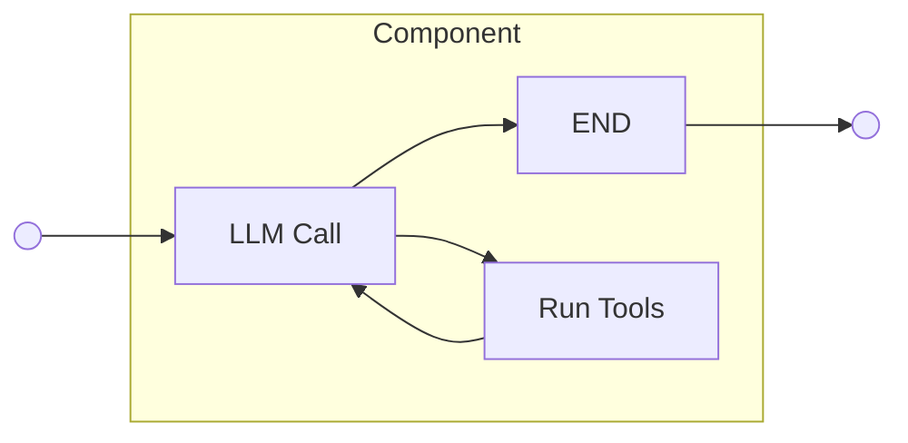
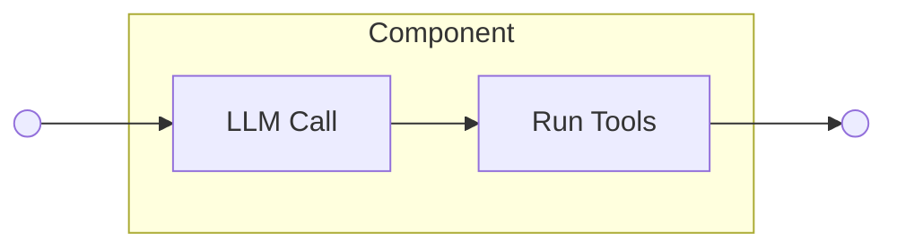
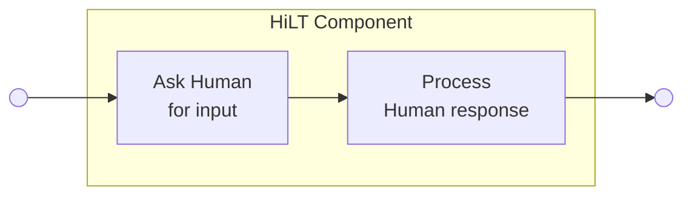
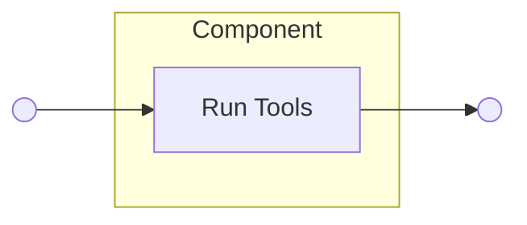
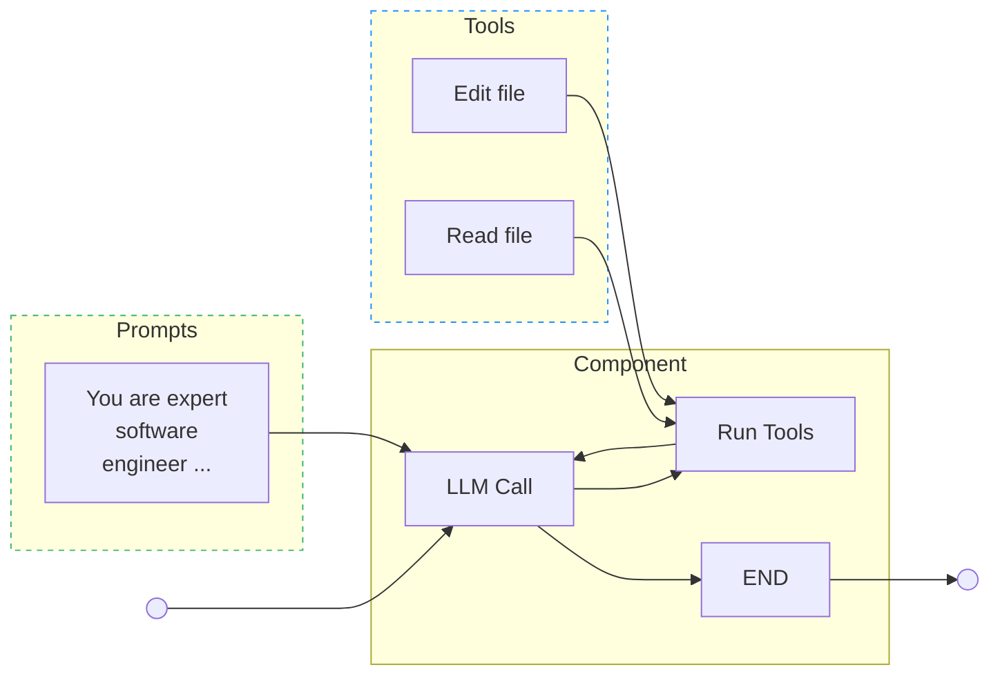
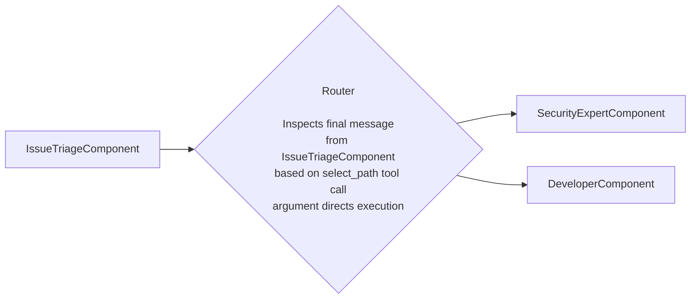




## Summary

このブループリントでは、GitLab の拡大する Duo Agent Platform フローのコレクションを集中管理するため、AI Gateway の一部として Flow Registry を実装することを提案します。
GitLab が AI 機能をエージェント型に変換し、新しいエージェント能力を構築し続ける中で、これらのエージェントセットアップを構築・管理・オーケストレーションする標準化アプローチが必要になっています。
提案する Flow Registry は、GitLab プラットフォーム全体におけるエージェント型 AI 開発とオーケストレーションのための単一エントリーポイントとして機能します。

## 前置き

このセクションでは、GitLab におけるエージェントとフローを定義する主要概念の高レベル概要を示します。
これらの概念は一般的な詳細を説明します。具体的な実装詳細は後続セクションで確認できます。

### Large Language Models

Large Language Models（LLM）は、膨大な訓練データのパターンを識別することでコードとテキストを処理・生成し、多様なトピックとタスクにわたって一貫性があり文脈に即した応答を生み出す AI システムです。
LLM は書籍、記事、Web コンテンツ、ソースコードリポジトリなどの膨大なテキストデータで訓練されており、言語のパターンを学習し、人間の知識についての広範な理解を発達させます。
LLM は入力テキストを処理し、最も適切な次の単語やフレーズを予測することで動作し、会話、質問への回答、コンテンツの執筆、さまざまな言語関連タスクの支援を可能にします。

### プロンプティング

LLM と効果的にコミュニケーションするためには、プロンプトと呼ばれる明確な指示を提供する必要があります。
プロンプトとは、LLM に何のタスクを実行するか、どんな役割を取るか、あるいはどんな種類の応答が期待されているかを伝える入力テキストです。
例えば、プロンプトは「親切なアシスタントとして振る舞い、量子物理学を簡単な言葉で説明してください」や「以下の記事を 3 つの箇条書きで要約してください」のようになります。
プロンプトの質と具体性は、LLM の出力に直接影響します。よく作られたプロンプトは、より正確で有用な応答につながります。
プロンプティング技術は、単純な質問から、モデルを推論プロセスに誘導する複雑な多段階の指示まで多岐にわたり、LLM の潜在能力を引き出すのに不可欠です。

### エージェント

LLM はテキスト生成に優れていますが、現実世界と直接相互作用することはできません。
この制限を解決するため、外部ツール（Web 検索、API、データベースクエリなど）を LLM に接続し、ツール使用を活用した高度なプロンプトを実装します。
LLM はユーザーの入力に基づいてどのツールを使うかを決定し、システムは選択されたツールを実行してユーザーに実際の現実世界のデータを提供します。
例えば、ユーザーが「ニューヨークの現在の天気は?」と尋ねると、LLM は Web 検索ツールの使用を選択するでしょう。
エージェントは、LLM と外部ツールのこの組み合わせであり、現実世界でアクションを取り特定の目標を達成できるようにします。
これにより、エージェントはトピックのオンライン調査、メール送信、ソフトウェアアプリケーションの制御など、複雑な多段階タスクを実行でき、現実世界の問題解決により実用的になります。

### マルチエージェントセットアップ

マルチエージェントシステムとは、何らかの形でオーケストレーションされた複数の専門エージェントから構成されるセットアップです。
市場では、マルチエージェントセットアップが、単一のエージェントが単独で扱うには困難な複雑なユーザータスクを解決するのに極めて効果的であることが実証されています。
例えば、Anthropic は最近、Claude Opus 4 をリードエージェント、Claude Sonnet 4 をサブエージェントとするマルチエージェント研究システムが、単一エージェントの Claude Opus 4 を [90.2%](https://www.anthropic.com/engineering/built-multi-agent-research-system) 上回ることを実証しました。
マルチエージェントシステムには、シーケンシャルチェーン、ポーリング、ピアツーピア、他のサブエージェントを管理するリードエージェント方式など、多くのアーキテクチャが利用可能です。
この ADR は、マルチエージェントアーキテクチャに依存せず、特定のものを規定することなく多様なオプションをサポートすることを目指します。

### Agents vs Flow vs Duo Agent Platform: 違いは何か?

Agent とは、LLM が自身のプロセスとツール使用を動的に指示し、タスクの達成方法をコントロールし続けるシステムです。
Flow（以前は Workflow と呼ばれていました）は、1 つまたは複数のエージェントと、事前定義された決定論的アクション（コミット作成や API 呼び出しなど）を、特定のタスクや目標を達成するために設計された事前定義されたコードパスを通じて接続された一連のステップにオーケストレーションします。
Duo Agent Platform は Flow を実行するエンジンです。

用語に関するさらなる詳細については、GitLab Duo Agent Platform 用語の[ドキュメンテーション](https://docs.gitlab.com/development/ai_features/glossary/#gitlab-duo-agent-platform-terminology) を参照してください。

> 注: 進行中の開発とレガシーコードのため、Workflow という用語は今も活発に使用されており、複雑なユーザータスクを解決するための単一またはマルチエージェントセットアップを意味します。

## Motivation

私たちは最近、Duo Workflow Service の AI Gateway への移行を完了しました。
また、Duo Workflow コードベースを使用して Duo Chat を再実装し、Duo Workflow インフラをさまざまなエージェントベースセットアップ向けの柔軟なエンジンに変換する最初の成功した試みとなりました。
この進化をよりよく反映するため、Duo Workflow を **Duo Agent Platform** と改名しました。
既存の Software Developer セットアップは、新しい Flow [概念](https://docs.gitlab.com/development/ai_features/glossary/#gitlab-duo-agent-platform-terminolog) の基盤的な例として機能します。
これらの変更により、Duo Agent Platform を通じてスケーラブルかつ効率的に多様なエージェントとフローを作成する明確な道筋が確立されます。

しかし、個別のエージェント実装を超えて拡大し、新しい複雑なエージェント型フローの開発を加速させるにつれ、拡大する AI スタック全体の集中管理とオーケストレーションのニーズが重要になってきました。

この要件に対応するため、AI Gateway には以下を提供する **Flow Registry** が必要です:

- 利用可能な Flow の **発見性**
- **ガバナンス** とバージョン管理
- プラットフォーム全体にわたる、さまざまな複雑度の新しい Flow の **シームレスな実装**

## Goal

AI Gateway 内に、さまざまな複雑度とオーケストレーションアプローチのエージェント型フローセットアップを簡単に構築・実行・管理できる中央 Flow Registry を構築する。

## Objectives

ゴールとモチベーションに基づき、以下の目的を定義します:

1. AI Gateway と Workflow Service の一部として Flow Registry を構築する。
1. レジストリ実装の一部として、カスタム Python ベース API または YAML 構文のいずれかを使用して Flow を構築する内部メカニズムを提供する。
1. 開発者が新しい Flow を構築・保守するのを助けるため、明確なドキュメンテーションを書く。

## Non-goals

1. 顧客向け DSL の実装。このブループリントは、AI Gateway 内のスケーラブルな Flow 実装のための内部 YAML ベース DSL の構築を含みます。
   この DSL は完全に内部向けであり、既存の AI スタックを改善するものです。顧客が独自のカスタム Flow を構築するために使用する顧客向け DSL の構築は、このブループリントの範囲外です。ただし、この提案で行われた作業は、AI Catalog チームが顧客向けに機能をさらに拡張するために再利用可能です。

## 実装の詳細

GitLab では、LangChain の上に構築されたフレームワークである LangGraph を使用しています。これは、有向グラフを使用して複雑でステートフルなマルチエージェントセットアップの作成を可能にします。
すべてのグラフは、特定のロジック（LLM 呼び出し、ツール実行、Python コードなど）を含むノードと、操作の順序を統括するノードをオーケストレーションするエッジで構成されます。
これにより、異なるコンポーネントを接続することで複雑なエージェント動作を作成できます。
グラフのすべての部分間でデータを共有するため、LangGraph はノードが読み書きできる共有 state オブジェクトを提供します。

GitLab で開発するあらゆるエージェントセットアップ（単一またはマルチエージェント）は、独自の状態を持つグラフとして表現できます。
次のセクションでは、開発・発見・保管が容易な再利用可能で保守可能なエージェント型フローを構成するため、Flow Registry が提供するプリミティブのセットを定義します。

### Agent Flow Graph 構成

エージェント型 AI 開発のために Flow Registry がサポートするプリミティブのリストを以下に定義します:

1. Components
1. Routers
1. State
1. Prompts
1. Tools

提案するフレームワークは [PoC](https://gitlab.com/gitlab-org/modelops/applied-ml/code-suggestions/ai-assist/-/merge_requests/2881) で早期テストされており、いくつかのデモ録画の基礎として機能しました:

- [Python API](https://gitlab.zoom.us/rec/share/MvGkn2wnv4OohOYJhzN9EQXnXiJBZEyz87yPB0r9D49yrvXwmpZtEf1HDrweMdgi.dbSRQylaJ7OcoNdr?startTime=1750073407000)
- 内部 YAML ベース DSL（TODO: リンクを追加）

#### 1\. Components

Components は、エージェント型フローを構成する基本的な原子操作単位で、プロセス内で特定の役割を持つエンティティを表します。
例えば、コンポーネントはマージリクエストのレビューを担当することも、プロジェクトのテストカバレッジを向上させるための新しいユニットテストの作成を担当することもあります。
Components は、組織内の個人として捉えることができ、ビジネスプロセス内のさまざまなタスクを委任できます。それらのタスクは複雑度が異なり、単発のインタラクション（例: メール送信）のような単純なものから、マージリクエストのレビューのようなより精巧なものまで多岐にわたります。重要な区別は、コンポーネントがフロー内で **単一の役割** を持たなければならないという点です。
例えば、機能を開発する際、エンジニアは機能実装を作成しますが、テクニカルライターはユーザー向けドキュメントの提供を担当します。
これらのペルソナはそれぞれ自分の分野の専門家であり、出力の品質を保証します。

##### 実装

より技術的なレベルでは、コンポーネントは、特定のカテゴリの問題を解決するために設計された特定のアーキテクチャに配置された LangGraph ノードのコレクションです。
循環エージェント、単発エージェント、HiTL（Human-in-the-loop）コンポーネント、プロセス内の事前定義された非 AI ステップとして機能するように設計されたコンポーネントが存在し得ます。
言及されたコンポーネントの図の例は下の[セクション](#proposed-components) に示されています。

##### 提案するコンポーネント {#proposed-components}

提案するフレームワークの出発点を概説する一般的なコンポーネントの非網羅的なリスト。

1. Cyclic agent



1. One-off agent



1. HiLT



1. Deterministic step



##### 入力 {#inputs}

Components は必須入力のセットを定義できます。
コンポーネントの入力は、コンポーネントがその役割を果たすために必要な情報を含むグローバルグラフ [state](#3-state) オブジェクト内の属性を反映します。

##### 出力

Components は、実行中に変更または追加するグローバルグラフ [state](#3-state) オブジェクト内の属性のセットを指定する必要があります。これは、グラフ内の後続のコンポーネントが入力を確実に持てるようにするために必要です。

##### Components のカスタマイズ

一部の[コンポーネント](#proposed-components) は、異なる役割で再利用できるほど柔軟なカスタマイズ可能なブループリントとして機能します。一般的なコンポーネントを特定の役割に specialize するには、[prompt](#4-prompts) を割り当て、モデル化されたプロセス内で個人に利用可能なアクションを制限する [tools](#5-tools) のセットを使ってコンポーネントの能力を定義します。

下の図は役割の specialization を示しています:



カスタマイズされたコンポーネントの実装例

```python
agent_component = AgentComponent(
    name="agent",
    prompt_id="agents/awesome",
    prompt_version="^1.0.0",
    toolset=agents_toolset,
    inputs=["context:task"],
    output_type=AgentFinalOutput,
    output="context:agent.answer"
)
```

#### 2\. Routers

Routers は Components を事前定義された構造にオーケストレーションし、Flow セットアップ内の操作順序を統括します。
Flow セットアップは Components で構成されますが、これらのコンポーネントは効果的なビジネスプロセスをモデル化するために特定の構造に配置される必要があります。
Routers は異なるコンポーネント間をナビゲートし、必要な操作順序が尊重されることを保証します。

技術的なレベルでは、Routers はコンポーネントを接続する LangGraph エッジをラップし、Flow セットアップを通じた正しい実行を強制するロジックを実装します。
Routers は、Flow セットアップの状態内の属性（前のコンポーネントからのステータスやメッセージなど）に基づいて経路選択の決定を行います。
1 つの例は、1 つのエージェントがリードで、他のエージェントが特定の小さなタスクを実行するサブエージェントである supervisor アプローチです。

Router 図の例を以下に示します:



#### 3\. State

各 Flow セットアップは、異なるコンポーネント間で情報を運ぶために使用されるグローバル State オブジェクトを持ちます。

##### 実装

State オブジェクトは、事前定義された必須属性と柔軟な _context_ 属性を含む辞書です。
context はネストされた辞書で、Flow セットアップ内のすべてのコンポーネントが、後続のコンポーネントが使用するために、出力をキーと値のペアとして書き込めるようにします。

```python
class AgentState(TypedDict):
    status: AgentStatusEnum
    conversation_history: Annotated[
        dict[str, list[BaseMessage]]
    ]
   ui_chat_log: Annotated[list[UiChatLog]]
   context: dict[str, str | int | float]
```

#### 4\. Prompts

Prompts は、汎用コンポーネントの役割を指定するために使用されるテキストテンプレートです。
構成時、汎用コンポーネントは _prompt id_ を介してプロンプトに接続されなければなりません。
Prompt テンプレートは動的な値のためのプレースホルダーフィールドを持つことができます。プロンプトテンプレートにプレースホルダーがある場合、その名前はコンポーネントの[入力](#inputs) と一致しなければなりません。

##### 実装

すべてのプロンプトは、AI Gateway 内で定義されたプロンプトレジストリに配置される必要があります。

#### 5\. Tools

Tools は、コンポーネントが実行中に取れる外部環境のアクションを表します。
類比として、ツールは個人が持つスキルとして想像できます。そして、組織内で指定された役割を果たすには、その役割の説明に合うように正しいスキルセットを持つことが要求されます。
例えば、CFO は組織全体を代表して財務諸表を発行できますが、データベース管理者はデータベースサーバーを再起動できます。同様に、ツールは Flow セットアップ内のコンポーネントの役割に基づいて割り当てられるべきです。

##### 実装

この提案は、ツールの開発と管理に関する既存の決定を変更しません。
ツールの実装はこの[ドキュメント](https://gitlab.com/gitlab-org/modelops/applied-ml/code-suggestions/ai-assist/-/blob/main/docs/adding_new_tool.md?ref_type=heads) に記述されており、ツールの権限と設定は Duo Workflow アーキテクチャの[ブループリント](../duo_workflow/_index.md) に記述されています。

## 将来の進化

顧客向け DSL の実装は、次のステップとして検討される可能性があります。
この作業には追加の取り組みと、AI Catalog チームとのコラボレーションが必要となります。
