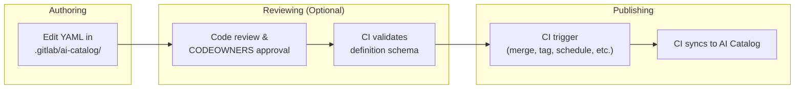
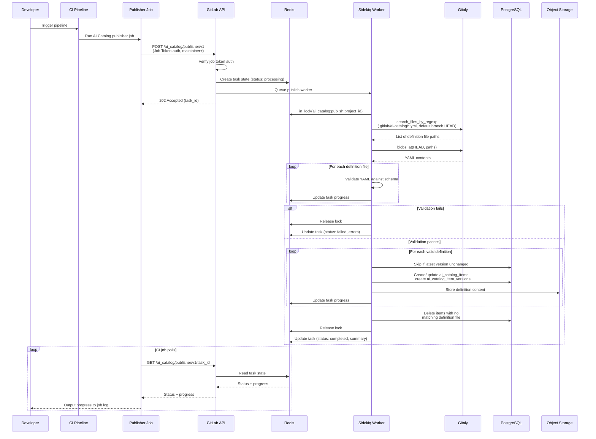



## Introduction

このドキュメントでは、AI カタログのアイテム定義のオーサリングを、現在のデータベースベースのアプローチから、定義を git リポジトリ内の YAML ファイルとしてオーサリングし CI パイプラインを通じて公開するリポジトリベースのアプローチへ移行することを評価します。

この評価は [issue #587714](https://gitlab.com/gitlab-org/gitlab/-/issues/587714) を契機としており、リポジトリベースと DB ベースのオーサリングを恒久的な選択肢として両方サポートするのではなく、DB ベースの定義オーサリングを完全に置き換えることを評価するというプロダクトの方針に従います。

この評価では、リポジトリベースのパターンを採用することが AI カタログにとってメリットになるか、移行パスがどのようなものになるか、どのようなトレードオフが関わるかを評価します。

### Motivation

CI/CD カタログは、コンポーネント定義が git リポジトリ内に存在し CI/CD カタログに公開されるリポジトリオーサリングをうまく活用しています。このパターンは以下を提供します。

- **ガバナンスと監査可能性**: リポジトリベースの定義は、既存の GitLab 機能を通じて CODEOWNERS ルール、マージ承認ポリシー、保護ブランチ、バージョン履歴を活用できます
- **マージリクエストを通じたコラボレーション**: 定義の変更を標準的な MR ワークフローに通すことができ、公開前のコードレビュー、議論、承認を可能にします。

### Scope

このドキュメントは以下を扱います。

- AI カタログ定義のために提案するリポジトリベースのオーサリングおよび公開ワークフロー
- CI/CD カタログとの類似点および相違点
- カスタム（ユーザーが作成した）アイテムの段階的な移行パス
- 技術的・プロダクト的なリスク、制限事項、未解決の問題

## Current Architecture

現在の AI カタログのアーキテクチャは [AI カタログアーキテクチャ設計ドキュメント](../ai_catalog/_index.md) に記載されています。

この提案に関連する、そのドキュメントの重要なポイントは以下のとおりです。

- アイテムタイプには agent、flow、external agent の 3 種類があります
- アイテム定義は UI および GraphQL API を通じてオーサリングされ、`ai_catalog_item_versions.definition` に JSONB として保存されます。なお、ストレージは [issue #591638](https://gitlab.com/gitlab-org/gitlab/-/work_items/591638) でオブジェクトストレージへ変更される予定です。
- Foundational なアイテムは GitLab とともに出荷されます。

## Proposed Architecture

### Principle

アイテム定義は git リポジトリ内の YAML ファイルとしてオーサリングされ、現在の UI および GraphQL ベースのオーサリングサーフェスを置き換えます。公開時には、定義がリポジトリから抽出され、ランタイムアクセスのためにオブジェクトストレージに保存されます（[issue #591638](https://gitlab.com/gitlab-org/gitlab/-/work_items/591638) を参照）。git リポジトリが定義の信頼できる唯一の情報源（source of truth）になります。

PostgreSQL は、カタログのメタデータ、バージョン、有効化（enablement）のクエリ可能なストアとして残ります。有効化サブシステム（アイテムのコンシューマーとトリガー）は完全に PostgreSQL に残ります。

Foundational なアイテム定義は git リポジトリへ移動されず、代わりに（現在と同様、モノリスまたは Duo Workflow Service 内の）「フィクスチャ」として残ります。

これは、4 つのシステムがそれぞれ異なる役割を担うことを意味します。

- **Git リポジトリ** — 定義のオーサリングサーフェスかつ信頼できる唯一の情報源
- **オブジェクトストレージ** — 定義コンテンツのランタイムでの読み取り元
- **PostgreSQL** — カタログのメタデータ、バージョンレコード、有効化、検索のクエリ可能なストア
- **インメモリフィクスチャ** — Foundational なアイテム定義

これは CI/CD カタログと類似したアーキテクチャパターンに従うもので、CI/CD カタログではコンポーネント定義がリポジトリ内に存在し、クエリを補助するために公開時にメタデータが PostgreSQL に抽出されます。

AI カタログは CI/CD カタログとパターンや関心事を共有しますが、モデルやサービスを直接共有するわけではありません。ドメインの違いが大きすぎます（organization スコープ対 project スコープ、3 種類のアイテムタイプ対 1 種類、CI/CD カタログに相当するものがない有効化サブシステム）。

次の表は、各アイテムタイプがどのようにオーサリング、クエリ、ランタイムでの読み取りが行われるかをまとめたものです。

| Item type | Definition source | Queryable metadata | Definition read from |
| --- | --- | --- | --- |
| **Custom items** (user-created, owned by projects) | YAML files in a git repository | PostgreSQL (unchanged) | Object Storage (unchanged) |
| **Foundational items** (GitLab-maintained, owned by organizations) | Fixtures (unchanged) | PostgreSQL (unchanged) | In-memory Fixtures (partly unchanged) |

### What Moves to Repositories

git リポジトリが定義の信頼できる唯一の情報源かつオーサリングの手段になります。なお、公開時には定義がリポジトリから抽出され、ランタイムアクセスのためにオブジェクトストレージに保存されます。これは [#591638](https://gitlab.com/gitlab-org/gitlab/-/work_items/591638) で開発中のアプローチに従います。

### What Stays in PostgreSQL

1. **カタログのメタデータ**: `ai_catalog_items`（名前、説明、可視性、検証レベル）。
1. **バージョンレコード**: `ai_catalog_item_versions` は引き続きリリース済みバージョンを追跡します。なお、リリース間の中間的な変更は git でのみ追跡されるため、git のバージョン履歴が行われたすべての変更について唯一の完全な信頼できる情報源になります。
1. **有効化**: `ai_catalog_item_consumers`、`ai_flow_triggers`、サービスアカウント、foundational なアイテムの有効化（`enabled_foundational_flows`、`*_foundational_agent_statuses`）。
1. **検索と発見**: 全文検索、フィルタリング、ソート、ページネーション。

### High-level Overview of New Authoring and Publishing Flow

以下は、オーサリングおよび公開フローへの提案された変更の概要です。

1. オーサリング: 開発者がリポジトリの `.gitlab/ai-catalog/` ディレクトリ内の YAML ファイルを編集してアイテムを定義します
2. レビュー: オプションのステップで、コードレビューと CODEOWNERS 承認ルールがデフォルトブランチへのアイテムのマージを管理します
3. 公開: CI パイプラインジョブが定義を AI カタログに公開します。公開エンドポイントは常にデフォルトブランチの HEAD から読み取るため、ユーザーは CI ルールを自由に設定して任意の方法で公開をトリガーできます。



### Proposed Similarities with CI/CD Catalog

- **リポジトリベースの定義**: ガバナンス機能を可能にします。
- **CI ジョブを通じた公開**: パイプライン UI とジョブログを通じて、公開の進捗やエラーを可視化します
- **クエリ可能なストアとしての PostgreSQL**: どちらもカタログのメタデータ、バージョンレコード、検索インデックス、発見のために PG を使用します。

### Proposed Differences with CI/CD Catalog

- **プロジェクトごとに複数のアイテム**: CI/CD カタログはプロジェクトとコンポーネントの 1:1 マッピングを強制します。AI カタログでは、プロジェクトが通常のリポジトリの一部として複数の AI カタログアイテムを保持できるようにします。
- **通常のプロジェクトリポジトリ内での共存**: AI カタログ定義は、通常のプロジェクトファイルと並んでより容易に共存でき、issue テンプレートやマージリクエストテンプレートなど他の GitLab 定義をプロジェクトが管理するのと同じ方法で管理されます。カタログへの公開は、プロジェクトのタグ付けやリリースプロセスを妨げることなく行われます。CI/CD カタログの公開では、コンポーネントを公開するための専用プロジェクトを作成する必要があるように見えます。
- **タグではなくデフォルトブランチ上の CI ジョブを通じた公開**: CI カタログは git タグリリースを通じて公開します。AI カタログは CI ジョブを通じて公開し、データはデフォルトブランチから読み取られますが、正確なトリガーは標準的な CI ルールを通じて設定可能です。
- **タグから導出するのではなく YAML でバージョンを指定**: 各アイテムは自身の YAML 定義ファイルで自身のバージョンを指定します。1 つのプロジェクトには独立したバージョン番号を持つ複数の AI カタログアイテムを含めることができるため、1 つの git タグでそれらすべてを表すことはできません。
- **異なるプロジェクト登録メカニズム**: どちらのカタログも、公開前にプロジェクトレベルのオプトインを必要とします。CI/CD カタログはプロジェクトごとに専用の `catalog_resources` レコードを使用し、これはプロジェクトのコンポーネントをグループ化する閲覧可能なカタログエントリとしても機能します。AI カタログにはこれに相当するプロジェクトレベルのラッパーがなく（各アイテムが独立して閲覧可能）、そのためオプトインは単なるプロジェクト設定（`ai_catalog_publishing_enabled`）です。

### Project Requirements

リポジトリベースの AI カタログアイテムを公開するには、プロジェクトに次の 3 つが必要です。

1. プロジェクト設定で AI カタログの公開を有効にしていること。これはプロジェクトレベルでの明示的なオプトインであり、誤った公開を防ぎます（[なぜプロジェクト設定なのか？](#why-a-project-setting) を参照）。
1. リポジトリの `.gitlab/ai-catalog/` 配下にアイテム定義ファイルがあること。
1. `.gitlab-ci.yml` の設定。CI コンポーネントは GitLab.com の顧客向けにこれを抽象化できます。Self-Managed と Dedicated では、ドキュメントからコピーできるより冗長な設定が必要になります。

#### Why a project setting?

プロジェクト設定は、リポジトリのフォークには引き継がれない明示的なオプトインとして機能し、フォークが誤ってカタログに公開してしまうことを防ぎます。

この設定は、プロジェクト設定 UI または API を通じて maintainer 以上が設定できるようにします。

### Definition Files

#### Naming structure

AI カタログ定義は `.gitlab/ai-catalog/` ディレクトリ配下に置かれ、GitLab プロジェクトレベルの機能設定に `.gitlab/` を使用するという確立された慣習（現在は issue テンプレートやマージリクエストテンプレートで使用されている）に従います。

`.gitlab/ai-catalog/` 配下の各 YAML ファイルは個別のカタログアイテムを表し、1 つのプロジェクトが複数のアイテムを管理・公開できるようにします。

任意の深さのサブディレクトリがサポートされ、チームが定義を整理し、ディレクトリレベルで CODEOWNERS ルールを適用できるようにします。例えば次のとおりです。

```plaintext
.gitlab/ai-catalog/
  team-alpha/
    agents/
      code-assistant.yml
    flows/
      review-flow.yml
  team-beta/
    agents/
      security-scanner.yml
```

これにより、次のような CODEOWNERS ルールが可能になります。

```plaintext
.gitlab/ai-catalog/team-alpha/ @team-alpha-leads
.gitlab/ai-catalog/team-beta/ @team-beta-leads
```

アイテムタイプ（agent、flow、external agent）は、ディレクトリ構造から推測されるのではなく、YAML ファイル内のプロパティとして指定されます。

Gitaly の `SearchFilesByName` RPC は任意の深さでのファイルマッチングをサポートしているため、すべての定義ファイルを 1 回の呼び出しで取得でき、大きな結果セットにはページネーションがサポートされます。

#### YAML metadata

すべてのアイテムタイプの YAML 定義は、`catalog_metadata` キーによって config から分離された同じメタデータを含みます。

```yaml
catalog_metadata:
  id: code-assistant
  name: Code Assistant
  description: Helps developers write, review, and refactor code
  type: agent # agent | flow | external_agent
  lifecycle: released # draft | released | deleted
  visibility: public # public | private
  version: 1.2.0
# ... agent, flow, or external agent definition follows
```

##### `id`

- Type: String
- Required

アイテムの安定した識別子で、プロジェクトごとに一意でなければなりません。

`id` は、公開時にファイルのパスや名前にかかわらず、定義ファイルを既存の `ai_catalog_items` レコードにマッチさせるために使用されます。
アイテムの `id` はファイルの再編成を経ても存続するため、ファイルの名前変更や移動は安全です。

[検証](#api-endpoints) では、同じプロジェクト内の 2 つのファイルが同じ `id` を共有している場合にエラーになります。

アイテムが `id` で一度公開されると、それを変更すると新しいアイテムを作成するものとして扱われ、古いアイテムは削除されます。

##### `name`, `description`

- Type: String
- Required

`Ai::Catalog::Item` の同じプロパティに直接マッピングされます。

##### `type`

- Type: Enum (`agent, flow, external_agent`)
- Required

AI カタログアイテムのタイプ。

##### `lifecycle`

- Type: Enum (`draft, released, deleted`)
- Optional. Default: `released`

カタログにおけるアイテムの draft から released への状態を制御します（現在 AI カタログではバックエンドのみでサポートされています）。

`lifecycle: deleted` の状態は、アイテム定義を削除する代わりの削除方法を可能にし、YAML ファイル内のプロパティ変更として表現することで、監査証跡としてファイルをリポジトリに残します。

拡張可能であり、将来的に `archived` や `deprecated` などの追加状態をサポートできます。

##### `visibility`

- Type: Enum (`public, private`)
- Optional. Default: `private`.

既存の `Ai::Catalog::Item#public` ブール値を制御しますが、将来的に `internal` のようなオプションをサポートする拡張性を許容します。

##### `version`

- Type: String in SemVer format
- Optional

`Ai::Catalog::ItemVersion#version` の既存ルールに従います。

指定されない場合、公開はマイナーバージョンでリリースをインクリメントするため、顧客は AI カタログにバージョン管理を任せることができます。

### Validation and publishing

検証および公開の操作は API エンドポイントを通じて公開され、CI ジョブを通じてトリガーされます。

#### Publishing Guardrails

公開エンドポイントは、ガバナンス制御が尊重されることを保証するためにいくつかのガードレールを強制します。

1. **プロジェクト設定の有効化**: プロジェクトは設定で AI カタログの公開を有効にしている必要があります。
1. **デフォルトブランチのみ**: 公開エンドポイントは、どのブランチがパイプラインをトリガーしたかにかかわらず、常にプロジェクトのデフォルトブランチの HEAD から定義ファイルを読み取ります。これにより、プロジェクトのレビューと承認のプロセスを経たコンテンツのみが公開されることが保証されます（[公開ブランチの設定可能化](#configurable-publishing-branch) に関する未解決の問題も参照）
1. **ジョブトークン認証のみ**: 公開エンドポイントは CI ジョブトークンを必要とします。PAT、OAuth、その他の認証方法ではトリガーできません。これにより、公開は常に CI パイプラインを通じて行われることが保証されます。
1. **maintainer 以上の認可**: ジョブトークンユーザーはプロジェクトで maintainer 以上のロールを持っている必要があります。
1. **公開前の検証**: すべての定義はレコードが作成される前にスキーマに対して検証され、参照が解決されます。1 つでも検証に失敗すると公開は停止します。
1. **排他リースロック**: プロジェクトごとに一度に 1 つの公開のみ実行でき、競合状態を防ぎます。

これらのガードレールは、ユーザーが CI ルールを自由に設定して任意の方法で公開をトリガーできる（マージ時、タグ時、スケジュール時、手動）ことを意味します。エンドポイントは*いつ*ではなく*何が*公開されるかを強制します。

検証エンドポイントは意図的により制限が緩くなっています。（デフォルトブランチではなく）パイプラインブランチから読み取り、developer 以上のアクセスのみを必要とし、任意のパイプラインから呼び出せます。これにより、MR パイプラインがマージ前に提案された変更を検証できます。

#### CI Configuration

AI カタログアイテムの検証と公開は CI ジョブを通じて行われます。

公開イベントは標準的な CI ルールを通じて設定可能です。デフォルトブランチへのマージを推奨されるデフォルトトリガーにできます。

検証は公開とは独立して実行でき、アイテムスキーマが有効かどうかについて MR パイプラインでフィードバックを得られます。

##### CI Component (GitLab.com only)

GitLab.com の顧客向けに CI コンポーネントを作成して CI 設定を抽象化し、設定可能な入力を許可できます。例えば次のとおりです。

```yaml
include:
  - component: gitlab.com/gitlab-org/ai-catalog-publisher@1.0.0
  - component: gitlab.com/gitlab-org/ai-catalog-validator@1.0.0
```

カスタマイズした使用例:

```yaml
include:
  - component: gitlab.com/gitlab-org/ai-catalog-publisher@1.0.0
    inputs:
      publish_on: tag # publish on tag instead of default branch
```

##### Full CI configuration

このオプションは、Self-Managed と Dedicated の顧客が利用できる唯一のものになります。

次の場合の CI 設定の例です。

- 任意の MR パイプラインで検証し、マージ前に検証フィードバックを提供します。
- デフォルトブランチへのマージ後に公開します。

```yaml
stages:
  - test
  - deploy
.ai_catalog_polling_script: &ai_catalog_polling_script
  - |
    RESPONSE=$(curl --fail --silent --request POST \
      --header "JOB-TOKEN: $CI_JOB_TOKEN" \
      "${CI_API_V4_URL}/projects/${CI_PROJECT_ID}/ai_catalog/${ENDPOINT}")
    TASK_ID=$(echo "$RESPONSE" | jq -r '.task_id')
    echo "${ENDPOINT} initiated. Task ID: $TASK_ID"
    TIMEOUT=${TIMEOUT:-300}
    INTERVAL=${INTERVAL:-5}
    ELAPSED=0
    while [ $ELAPSED -lt $TIMEOUT ]; do
      STATUS_RESPONSE=$(curl --fail --silent --request GET \
        --header "JOB-TOKEN: $CI_JOB_TOKEN" \
        "${CI_API_V4_URL}/projects/${CI_PROJECT_ID}/ai_catalog/${ENDPOINT}/${TASK_ID}")
      STATUS=$(echo "$STATUS_RESPONSE" | jq -r '.status')
      PROGRESS=$(echo "$STATUS_RESPONSE" | jq -r '.progress // empty')
      if [ -n "$PROGRESS" ]; then
        echo "$PROGRESS"
      fi
      if [ "$STATUS" = "completed" ]; then
        echo "$(echo "$STATUS_RESPONSE" | jq -r '.summary')"
        exit 0
      elif [ "$STATUS" = "failed" ]; then
        echo "$(echo "$STATUS_RESPONSE" | jq -r '.errors')"
        exit 1
      fi
      sleep $INTERVAL
      ELAPSED=$((ELAPSED + INTERVAL))
    done
    echo "${ENDPOINT} timed out after ${TIMEOUT}s"
    exit 1
ai-catalog-validate:
  stage: test
  variables:
    ENDPOINT: validator/v1
    INTERVAL: 3
  rules:
    - if: $CI_PIPELINE_SOURCE == "merge_request_event"
      changes:
        - .gitlab/ai-catalog/**/*
  script: *ai_catalog_polling_script
ai-catalog-publish:
  stage: deploy
  variables:
    ENDPOINT: publisher/v1
    INTERVAL: 5
  rules:
    - if: $CI_COMMIT_BRANCH == $CI_DEFAULT_BRANCH
      changes:
        - .gitlab/ai-catalog/**/*
  script: *ai_catalog_polling_script
```

CI ジョブを使用することは、次のことを意味します。

- **失敗の可視性**: 同期エラーは、ユーザーが調査できるログとともに、失敗したパイプラインジョブとして表示されます
- **ユーザーによる制御**: 標準的な CI ルールで公開を実行するタイミングを制御できます

未解決の問題 [検証エラーと同期進捗 UI](#validation-error-and-syncing-progress-ui) では、公開と同期の進捗を管理するためのアプリのカスタムな別パートについて説明しており、これは大幅に高いエンジニアリング投資を伴いますが CI ジョブの必要性を置き換えるものです。

#### API Endpoints

検証と公開のロジックは API エンドポイントにカプセル化されます。

1. （GitLab.com 向けの）CI コンポーネントは、エンドポイントを呼び出すだけの薄いラッパーになります
2. Self-Managed と Dedicated の顧客は、インラインの CI ジョブ定義から同じエンドポイントを呼び出せます
3. コアロジック（ファイル検出、スキーマ検証、PG レコード作成）は、CI 設定自体ではなく Rails サービス内に置かれます。これにより、Self-Managed と Dedicated で最小限の CI 設定が可能になります

検証と公開はどちらも、多数のアイテムを持つプロジェクトを API タイムアウトのリスクなしに処理し、CI ジョブログで段階的なフィードバックを提供するために、非同期で処理されます。

エンドポイントは、後方互換性のためにバージョン管理され（例: `v1`）、古い統合を壊すことなくエンドポイントの動作やレスポンスを時間とともに進化させることができます。

- `POST /api/v4/projects/:id/ai_catalog/validator/v1` — 非同期検証を開始
- `GET /api/v4/projects/:id/ai_catalog/validator/v1/:task_id` — 検証ステータスをポーリング
- `POST /api/v4/projects/:id/ai_catalog/publisher/v1` — 非同期公開を開始
- `GET /api/v4/projects/:id/ai_catalog/publisher/v1/:task_id` — 公開ステータスをポーリング

##### Async Processing Model

両方のエンドポイントは同じ非同期パターンに従います。

1. **開始**: `POST` リクエストがリクエストパラメータを検証し、バックグラウンドジョブをキューに入れ、TTL 付きで `Redis::SharedState` にタスク状態レコードを作成し、`task_id` を即座に返します。
2. **処理**: Sidekiq ワーカーが作業を実行し、進行に応じて Redis のタスク状態を進捗で更新します。Sidekiq ワーカーは冪等であり、失敗後の再試行を許可します。
3. **ポーリング**: CI ジョブが対応する `GET` エンドポイントを一定間隔でポーリングします。各レスポンスには現在のステータス（`processing`、`completed`、`failed`）と、CI ジョブがログに出力する進捗メッセージが含まれます。
4. **完了**: `completed` または `failed` の時点で、CI ジョブは適切なステータスコードで終了します。

このアプローチは、次のことを意味します。

- **タイムアウトのリスクなし** — 最初の API リクエストはすぐに返り、重い作業はバックグラウンドワーカーで行われます
- **豊富な進捗出力** — CI ジョブログは、長い待機後の単一のサマリーではなく、アイテムが検証・公開される様子を処理されるにつれて表示します
- **API ノードからの作業のオフロード** — 処理は API リクエストのライフサイクル内ではなく Sidekiq ワーカーで行われます

##### Validate

ジョブトークンから推測されるパイプラインブランチから定義ファイルを読み取り、スキーマと参照解決を検証し、エラーを報告します。
任意の MR パイプラインから呼び出しても安全で、マージ前に提案された変更についてフィードバックを得られます。

**認可**: プロジェクトは設定で AI カタログの公開を有効にしている必要があります。プロジェクトの developer 以上であれば誰でも可能です。認可はジョブトークンである必要はなく、通常の API 操作を通じて呼び出せます。

##### Publish

検証を行い、PG レコードを作成/更新し、定義をオブジェクトストレージに保存します。

公開は、どのブランチがパイプラインをトリガーしたかにかかわらず、常にプロジェクトのデフォルトブランチの HEAD から定義ファイルを読み取ります（[公開のガードレール](#publishing-guardrails) を参照）。ユーザーは CI ルールを自由に設定して任意の方法で公開をトリガーできます（マージ時、タグ時、スケジュール時、手動）が、公開がデフォルトブランチからのみ行われることを考慮する必要があります。

**認可**: プロジェクトは設定で AI カタログの公開を有効にしている必要があります。認証は（CI ジョブからの）ジョブトークンである必要があり、ジョブトークンユーザーは maintainer 以上である必要があります。`task_id` パラメータは、以前に同じプロジェクトが所有していた状態と一致する必要があります。

##### Optional arguments

これらは後で両方のエンドポイントに追加できます。

- アイテムへの更新をアトミックとして扱うかどうか。`atomic: true` の場合、更新はトランザクション内で行われ、すべての更新が成功するか失敗します。`atomic: false` の場合、一部の更新が成功し一部が失敗する可能性があります。デフォルト: `atomic: false`。
- リース設定: `lease_wait` と `lease_retry`。

##### Validation rules

（両方のエンドポイントで共有される）検証フェーズは、次の場合に失敗します。

1. 同じプロジェクト内の 2 つのファイルが同じ `id` を宣言している。
1. アイテムスキーマが無効、または ActiveRecord モデルが無効だった。

検証が失敗すると、タスクステータスは `failed` になります。ジョブは失敗し、エラーがジョブログに表示されます。

##### Publish steps

バックグラウンドワーカーが公開を処理するとき:

1. 最初に検証が実行され、失敗があればジョブを失敗させます。
1. プロジェクトに対して複数の公開が同時に発生しないように、排他リースロックが取得されます。最終的に失敗すると CI ジョブが失敗するため、リースの待機時間と再試行をある程度寛大に設定します。リースロックの期間と再試行は、エンドポイントに引数を渡すことで顧客が設定できるようにできます。
1. 定義ファイルは、どのブランチがパイプラインをトリガーしたかにかかわらず、常にプロジェクトのデフォルトブランチの HEAD から読み込まれます（[公開のガードレール](#publishing-guardrails) を参照）。
1. 定義ファイルは `Repository#search_files_by_regexp` を使用して読み込まれます。これは、指定された ref で git ツリーをスキャンし、正規表現にマッチするすべてのパスを返す単一の Gitaly RPC です。これは CI/CD カタログが `templates/` 配下のコンポーネントファイルを検出するために使用するのと同じメカニズムです。
1. YAML 定義がスキーマに対して検証されます。
1. `ai_catalog_items` レコードが作成または更新され、新しいバージョンには `ai_catalog_item_versions` レコードが作成されます。パブリッシャーは、YAML 定義内の `id` が `internal_id` プロパティにマッピングされることで、プロジェクトにスコープされた既存の `ai_catalog_items` レコードにマッチさせます。マッチが存在しない場合は新しいアイテムが作成されます。定義が最新バージョンから変更されていない場合、そのアイテムはスキップされます。
1. レコードが削除されます。リポジトリに対応する定義ファイルがない既存のプロジェクト AI カタログアイテムは削除されます。これは破壊的であるため、まずリポジトリからすべての定義ファイルを正常に読み込んだことに注意が必要です。アイテムが（ハード削除ではなく）ソフト削除されたとき、プロジェクトが新しいアイテムに同じ識別子を再利用できるように、その `internal_id` を解除したい場合があります。

#### Publishing Flow



#### Data Mapping

公開時に、PostgreSQL レコードのデータがマッピングされます。

| `ai_catalog_items` column | Source |
| --- | --- |
| `name` | YAML definition file |
| `description` | YAML definition file |
| `item_type` | YAML definition file (`type` property) |
| `public` | YAML definition file (`visibility` property) |
| `project_id` | The repository's project |
| `organization_id` | The project's organization |
| `internal_id` | YAML definition file (`id` property). Stable identifier used to map the definition YAML to the record, uniquely scoped to item and project. |
| `verification_level` | The project's namespace verified status |

| `ai_catalog_item_versions` column | Source |
| --- | --- |
| `version` | YAML definition file (optional, must be valid semver greater than current version). Defaults to a minor bump from the latest version if absent. |
| `release_date` | Timestamp of the publish event when lifecycle becomes `released` |
| `commit_sha` | The SHA of the commit read from during the publish (stored for auditability, but not used) |
| `created_by_id` | The job token user |

### Foundational Items

Foundational なアイテムは、ユーザーがオーサリングするものではない GitLab が保守するカタログアイテムです。カスタムアイテムとは異なり、これらはプロジェクトではなく organization に属するため、リポジトリベースにすることはできません。これらはバージョン管理されておらず、GitLab とともに出荷される必要があります。

Foundational なアイテムは、引き続きモノリスで出荷されるフィクスチャとして定義を保守します。これは、定義がすでにコードベースに由来する現在のパターンと一貫しています。

Foundational なアイテムのアーキテクチャは [#590241](https://gitlab.com/gitlab-org/gitlab/-/work_items/590241) で活発に議論されていますが、この設計ドキュメントの目的上、そのデータソースはフィクスチャであると考えることができます。

## Custom Agent Definition YAML

flow や external agent とは異なり、カスタム agent は現在 YAML として定義されておらず、提案された YAML 構文を必要とします。

agent 定義は現在、組み込みツールと MCP サーバーを内部識別子によって参照しています。

- **組み込みツール** — 整数 ID で参照され（例: `"tools": [1, 3, 10, 39]`）、`Ai::Catalog::BuiltInTool` フィクスチャにマッピングされます
- **MCP ツール** — 文字列名で参照され（例: `"mcp_tool_names": ["search"]`）、インメモリの `Ai::Catalog::McpTool` レコードにマッピングされます
- **MCP サーバー** — 整数のデータベース ID で参照され（例: `"mcp_servers": [42, 57]`）、`ai_catalog_mcp_servers` 行にマッピングされます

整数のデータベース ID は YAML 定義ファイルでは実現可能ではありません。コードレビューにおいて意味を持たず（この提案のコラボレーションとガバナンスの目標を損ないます）、YAML 内の参照は人間が読めて自己文書化されているべきです。

上記の 3 種類すべては、YAML 定義内で人間が読める名前によって参照されるべきです。

```yaml
tools:
  - gitlab_blob_search/1.0.0
  - gitlab_create_merge_request/1.0.0
mcp_tool_names:
  - search/1.0.0
mcp_servers:
  - jira_cloud/1.0.0
  - slack/1.0.0
```

上記のいずれも現在はバージョン管理されていません。バージョンサフィックス（`/1.0.0`）は将来の互換性のために含まれており、YAML フォーマットへの変更を必要とせずにこれらの関連付けのバージョン管理を導入できるようにします。

**組み込みツール**については、これは簡単です。`BuiltInTool` はすでに一意で安定した `name` フィールド（例: `"gitlab_blob_search"`）を持っています。

**MCP ツール**については、これはすでに現在の動作です。現在、文字列名で参照されています。

**MCP サーバー**については、これは解決メカニズムを必要とします。MCP サーバーは organization スコープのデータベースレコード（`ai_catalog_mcp_servers`）です。現在、`name` フィールドを持っていますが、これは人間が読むためのものです。

新しい `internal_id` カラムを一意性制約とともに追加し、`name` は表示専用フィールドとして残します。これにより、人間が読めるラベルと機械的な参照が分離されます。

`internal_id` は、一度選択されると不変である必要があります。変更すると関連付けが壊れるためです。

公開フェーズ中、YAML 内の名前ベースの参照は、アイテムの organization 内の `ai_catalog_mcp_servers` に対して内部識別子に解決されます。

agent YAML の例:

```yaml
catalog_metadata:
  id: code-assistant
  name: Code Assistant
  description: Helps developers write, review, and refactor code
  type: agent
  lifecycle: released
  visibility: public
  version: 1.2.0
system_prompt: |
  You are a senior software engineer assistant. You help developers
  write clean, well-tested code following the project's conventions.
  Always explain your reasoning and suggest tests for any changes.
tools:
  - gitlab_blob_search/1.0.0
  - gitlab_create_merge_request/1.0.0
mcp_tool_names:
  - search/1.0.0
mcp_servers:
  - jira_cloud/1.0.0
  - slack/1.0.0
```

## Migration Phases

カスタムアイテムは、プロジェクトが所有するユーザー作成のカタログアイテムです。リポジトリベースの定義への移行は、オーサリングサーフェスを GraphQL ミューテーションと UI フォームから、プロジェクトのリポジトリ内の YAML ファイルへ移します。

3 つのカスタムアイテムタイプすべて（agent、flow、external agent）がこの移行の対象です。

必須のフェーズが 2 つあります。

1. **フェーズ 1: 新しいアーキテクチャを追加**
2. **フェーズ 2: 新しいアイテムをリポジトリベースの作成に切り替え**

オプションのフェーズが 2 つあります。

1. **フェーズ 3: 移行経路を提供**: 既存の DB ベースのアイテムをリポジトリベースに変換できる
2. **フェーズ 4: データベースベースの方法の完全な非推奨化と削除**

### Phase 1: Add New Architecture

このフェーズの終わりまでに、プロジェクトはリポジトリを通じて AI カタログへの公開を開始できるようになります。既存の DB ベースのアイテム（`source: database`）は、現在の GraphQL ミューテーションを通じて引き続き動作します。両方のタイプがカタログに表示され、同じファインダーと GraphQL API を通じてクエリ可能になります。

#### Work Streams

**1. スキーマ移行**

リポジトリベースのアイテムをサポートするために新しいカラムを追加します。

| Change | Detail |
| --- | --- |
| New column: `project_settings.ai_catalog_publishing_enabled` | Boolean, default `false`. [Project-level opt-in](#why-a-project-setting) for publishing to the AI Catalog. |
| New column: `ai_catalog_items.source` | Enum: `database`, `repository`, `fixture`. Identifies where the item's definition originates from and how it is authored. |
| New column: `ai_catalog_items.internal_id` | Stable identifier from YAML `id` field, unique within project |
| New column: `ai_catalog_items.foundational_item_ref` | Stable identifier mapping to fixture (generalizes `foundational_flow_reference`) |
| New column: `ai_catalog_item_versions.commit_sha` | Repository SHA of item version at publish (stored for auditability, but not used) |
| New column: `ai_catalog_mcp_servers.internal_id` | Immutable identifier for YAML references |

**2. agent YAML 定義スキーマ**

カスタム agent のための YAML スキーマを設計・実装します。flow と external agent はすでに YAML 定義を持っています。agent は現在、UI フォームを通じてオーサリングされる構造化された JSON 形式のみを持っています。これには、組み込みツール、MCP ツール、MCP サーバーのための人間が読める参照形式の確立が含まれます。

詳細は [カスタム agent 定義 YAML](#custom-agent-definition-yaml) を参照してください。

**3. 公開 API とサービスレイヤー**

コアとなる公開インフラを構築します（[API エンドポイント](#api-endpoints) を参照）。

- バージョン管理された REST エンドポイント（`POST .../validator/v1`、`GET .../validator/v1/:task_id`、`POST .../publisher/v1`、`GET .../publisher/v1/:task_id`）
- 検証および公開タスクの非同期処理のための Sidekiq ワーカー
- TTL 付きの `Gitlab::Redis::SharedState` を通じたタスク状態の追跡。Ruby クラス（例: `Ai::Catalog::PublishTaskState`）がタスクの進捗、ステータス、エラーを Redis に読み書きします。タスク状態は一時的で自動的に期限切れになるため、データベーステーブルは不要です。
- Gitaly を通じたファイル検出（`search_files_by_regexp`）、YAML パース、スキーマ検証、agent ツールと MCP 名の [参照解決](#custom-agent-definition-yaml) のための Rails サービス
- レコードの作成/更新ロジック: `ai_catalog_items` と `ai_catalog_item_versions` レコードの作成または更新

**4. パブリッシャー CI コンポーネント**

GitLab.com の顧客向けに、REST エンドポイントとポーリングロジックをラップする CI/CD カタログコンポーネントを構築・公開します。Self-Managed と Dedicated の顧客向けにインラインの CI ジョブ設定をドキュメント化します。

**5. アイテムの複製**

現在、アイテムの複製はフロントエンドのみのアクションです。フォームにソースアイテムのデータが事前入力され、ユーザーがそれを新しいアイテムとして送信します。リポジトリベースのオーサリングでは、複製にはプロジェクトリポジトリへの書き込みが必要です。

提案するフロー:

1. ユーザーが既存のアイテムから複製を開始し、ターゲットプロジェクトを選択します。ターゲットはソースプロジェクト自身、または同じ organization 内の他の任意のプロジェクトにできます。
1. システムがターゲットプロジェクトのリポジトリに新しいブランチを作成します。
1. 複製された YAML 定義がそのブランチに書き込まれます。すべての `id` 値がターゲットプロジェクトのリポジトリ内で一意であることを保証します。これはパフォーマンスに優れています。単一の Gitaly 呼び出しでターゲットプロジェクトのすべての定義ファイルを読み込みます。これは公開で使用されるのと同じメカニズムです。重複があれば一意の `id` を生成できます（例: ソース `id` に `-copy` を追加し、必要に応じてインクリメントする）。
1. マージリクエストが自動的に開かれ、ユーザーがマージ前にレビューできるようにします。
1. マージ時に、プロジェクトの既存の公開 CI 設定が残りを処理します。

この作業は、Web ノードから負荷を取り除くために非同期で行われます。
複製が完了したときにユーザーに通知する必要があります。例えば次のとおりです。

1. 複製が完了したときの AI カタログ内のトースト通知。
1. MR が開かれたときに生成される todo。

よりシンプルな初期のイテレーションでは、複製された定義をファイルとしてユーザーに提供する「YAML をダウンロード」アクションを提供し、ユーザーが手動で自分のプロジェクトリポジトリにコミットすることに任せることもできます。これは自動 MR の利便性を失いますが、エンジニアリング作業が少なく、先にリリースできます。

### Phase 2: Switch to Repo-Backed Creation for New Items

すべての新しいアイテムがリポジトリベースのアイテムとしてのみ作成されることを強制します。

- DB ベースのアイテムの作成 UI を削除
- GraphQL 作成ミューテーションをブロック
- 既存のデータベースベースのアイテムに対してのみ、更新 UI と GraphQL ミューテーションを引き続き許可

### Phase 3 (Optional): Provide a Migration Pathway

PostgreSQL ベースからリポジトリベースへアイテムを移動する UI ベースの移行を提供できます。

- ユーザーによって開始され、オーナープロジェクトのリポジトリにアイテムを YAML ファイルとして含む MR を開きます。Duo が `.gitlab-ci.yml` の変更を支援できます。
- マージ時に、同期がファイルを取り込み、アイテムの `source` が `database` から `repository` に切り替わります。

アイテムがリポジトリベースになると、定義を更新するための既存の UI と GraphQL ミューテーションはロックアウトされます。

### Phase 4 (Optional): Full Deprecation and Removal of Database-backed method

移行には顧客のリポジトリへの書き込みが必要なため、アップグレードを簡単に強制することはできません。
リスクの [継続的なレガシーサポート](#ongoing-legacy-support) を参照してください。

最終的には、アナウンスされた非推奨化期間の後に、UI と GraphQL ミューテーションを通じてレガシーな DB ベースのアイテムを更新する能力をロックアウトし、ユーザーに移行を強制できます。これは、これらの顧客にとって現在のオーサリングワークフローに対する破壊的変更になります。

## Migration: Foundational Items

Foundational なアイテムはすでにフィクスチャベースです。それらの定義は、ユーザー入力ではなくコードベースに由来します。移行パスはカスタムアイテムよりも単純です。データベースからリポジトリへ移行するユーザーオーサリングのデータがないためです。

主な変更は次のとおりです。

1. **PostgreSQL での定義キャッシュの削除** — 現在、external agent はその定義が `ai_catalog_item_versions.definition` に JSONB としてシードされています。提案するアーキテクチャでは、定義はランタイムにフィクスチャから直接読み取られるため、このカラムは foundational なアイテムには入力されなくなります。

2. **PostgreSQL でのカタログメタデータの保持** — `ai_catalog_items` レコードは引き続きシードされ（名前、説明、アイテムタイプ、検証レベル）、foundational なアイテムがカタログでクエリ可能かつ発見可能なまま残ります。

3. **フィクスチャ参照の記録** — `ai_catalog_items` の `foundational_item_ref` カラムが、各データベースレコードをそのフィクスチャ定義にマッピングし直す安定した識別子を提供します。これは、既存の `foundational_flow_reference` カラム（現在は foundational flow にのみ使用される）を一般化して、すべての foundational アイテムタイプをカバーします。

foundational なアイテムへのさらなるアーキテクチャ変更（有効化パターンの統一など）は範囲外であり、[#590241](https://gitlab.com/gitlab-org/gitlab/-/work_items/590241) で追跡されています。

## Risks

### Significantly Slower Iteration Feedback Loop

**リスクタイプ**: プロダクト。

現在の UI は定義の迅速なイテレーションを可能にします。編集、保存、テスト、改良をタイトなループで行えます。リポジトリベースのモデルは、はるかに長いフィードバックサイクルを導入します。YAML を編集し、コミットし、プッシュし、デフォルトブランチ（または他の設定されたトリガー）にマージし、パブリッシャージョブを待ち、その後テストします。

定義が期待どおりに動作しない場合（例: プロンプトのチューニングが必要、またはツールが不足している）、新しいコミットとマージが必要です。

作者は、アイデアを迅速に試すためのテスト用サンドボックスを欠くことになり、アイテムの開発がフラストレーションが溜まる遅い体験になる可能性があります。
これは、複数の迅速なイテレーションが一般的な新しいアイテムの初期開発時に特に影響が大きくなります。

### YAML Validation UX Regression

**リスクタイプ**: プロダクト。

現在、ユーザーはアイテム config の作成または更新時にフィールドごとの即時検証エラーを受け取ります。これは、間違えやすい複雑な定義を持つ flow に特に役立ちます。

リポジトリベースのモデルでは、検証は後で行われます。プッシュまたはマージ後の同期中であり、フィードバックが非同期になります。

これは、特に定義スキーマに不慣れなユーザーにとって、意味のある UX のリグレッションです。

軽減策:

- スキーマを認識する検証を備えたエディタツール（[AI カタログ定義エディタ](#ai-catalog-definition-editor) を参照）。

### Agent Editing UX Regression

**リスクタイプ**: プロダクト。

ガイド付きの UI から生の YAML 編集への移行は、カスタム agent を定義するための重大な体験のリグレッションになります。

ユーザーは、次の正しい名前を入力する必要があります。

- 組み込みツール
- MCP ツール
- MCP サーバー

そうでなければ、同期中に参照解決が失敗します。

agent は現在、プロンプト用の構造化されたフォームフィールドとオートコンプリート駆動のツール選択を持つ、最も UI 駆動なアイテムタイプです。flow と external agent はすでに YAML でオーサリングされているため、これらのタイプではこの移行はそれほど破壊的ではありません。

軽減策:

- スキーマを認識する検証を備えたエディタツール（[AI カタログ定義エディタ](#ai-catalog-definition-editor) を参照）。

### Item Duplication UX Regression

**リスクタイプ**: プロダクト。

現在の AI カタログは、フロントエンドのみのアクションを通じてアイテムの迅速な複製を可能にします。フォームにソースアイテムのデータが事前入力され、ユーザーは 1 クリックでそれを新しいアイテムとして送信します。

リポジトリベースのモデルでは、複製にはターゲットリポジトリへのファイルのコミットが必要です。ブランチ作成、ファイル書き込み、MR 作成を自動化するツールがあっても、ユーザーは依然として MR をレビューしてマージし、その後複製されたアイテムがカタログに表示される前に公開ジョブを待つ必要があります。

さらに、まだ AI カタログの公開を有効にしていない（`.gitlab-ci.yml` 設定がない、プロジェクト設定が有効になっていない）プロジェクトへの複製は、マージとしては成功しますが、それらの前提条件が設定されるまでアイテムはカタログに公開されません。複製ツールは MR に `.gitlab-ci.yml` の変更を含めません。CI 設定の追加は大幅な複雑さを導入し、ユーザーの既存の CI セットアップと競合するリスクがあるためです。

### Workflow Breaking Changes

**リスクタイプ**: プロダクト。

[フェーズ 2](#phase-2-switch-to-repo-backed-creation-for-new-items) は、顧客が UI を通じて新しいアイテムを作成できなくなることを意味します。
すべての新しいカスタムアイテムはリポジトリベースである必要があります。これは意図的な破壊的プロダクト変更になります（[issue 587714](https://gitlab.com/gitlab-org/gitlab/-/work_items/587714#note_3064035412) を参照）。

軽減策:

- フェーズ 2 をオプションにする。

### Sync Visibility for Non-Merge Triggers

**リスクタイプ**: プロダクト。

公開が「デフォルトブランチへのマージ」以外のトリガー（例: タグ時、スケジュール時、手動）で発生するように設定されている場合、定義の変更がデフォルトブランチに到達したものの、まだカタログに公開されていない期間が存在します。

この期間中:

- 作者は変更をマージし、公開に（タグの作成などの）さらなるアクションが必要であることに気づかない場合があります。
- リポジトリを閲覧する他のプロジェクトメンバーは、デフォルトブランチ上の新規または更新されたアイテムを目にしますが、それがカタログに同期されたのか、同期待ちなのか、同期に失敗したのかを簡単には確認できません。
- 混乱を解消するには、作者に尋ねるか、パイプライン履歴を手動で調べる必要があります。

このリスクは、公開とマージを切り離すトリガー設定に固有のものです。デフォルトブランチへのマージで公開をトリガーするプロジェクトは、この期間を経験しません。MR がマージ後のパイプラインを通じて同期ステータスを直接表面化させます。

部分的な軽減策:

- 私たちが推奨するデフォルト CI 設定（GitLab.com の CI コンポーネントのデフォルトを含む）は、デフォルトブランチへのマージで公開をトリガーします。異なるトリガーを選択するプロジェクトは、このトレードオフを受け入れます。

### Ongoing Legacy Support

**リスクタイプ**: エンジニアリング。

既存の DB ベースのアイテムに対して [移行経路を提供](#phase-3-optional-provide-a-migration-pathway) できます。しかし、この移行は顧客のリポジトリへの書き込みを伴うため、強制することはできません。

エンジニアリングは、リポジトリベースではないレガシーなアイテムを、おそらく無期限にサポートし続ける必要があります。

これは、次の点でアーキテクチャに無期限に複雑さを追加します。

- アイテムの更新と削除のための UI と GraphQL ミューテーションの保守
- すべての定義関連機能が両方のコードパスにわたって動作する必要があるため、バグと保守のサーフェスエリアが増加する

軽減策:

- [フェーズ 4（オプション）: 完全な非推奨化と削除](#phase-4-optional-full-deprecation-and-removal-of-database-backed-method) を参照。

### Atomicity

**リスクタイプ**: エンジニアリング。

現在、定義とメタデータの更新は単一の PostgreSQL トランザクション内で行われます。リポジトリベースのモデルでは、公開は git コミットの後に PostgreSQL の更新を伴います。コミットが到達した後に PG 更新が失敗すると、リポジトリには新しい定義があるが PG はまだ古いバージョンを指している、という不整合な状態になります。

部分的な軽減策:

- CI ベースの公開は影響の軽減に役立ちます。失敗した PG 更新は、調査して再試行できる失敗したパイプラインジョブとして表面化します。同期は冪等であるため、ジョブを再実行すると状態が修正されます。

### Semi-Feature Freeze During Migration Period

**リスクタイプ**: プロダクト、エンジニアリング。

移行期間中は、アイテム定義に影響する重要な新機能の追加を避け、代わりに移行の完了に集中することが望ましいです。

有効化、検索、カタログメタデータのみに触れる機能は影響を受けません。

### Feature Outages From Reliance on New Service: Gitaly

**リスクタイプ**: エンジニアリング。

リポジトリベースのアーキテクチャは、公開のために健全な Gitaly サービスへの新しい依存関係を導入します。

Gitaly のエラーやダウンタイムは、AI カタログの公開の停止を引き起こします。

### CI Compute Minutes Consumption

**リスクタイプ**: プロダクト。

現在、アイテムは無料で作成・リリースできます。CI ジョブを通じた公開は CI コンピュート時間を消費します。影響は最小限と予想されます。パブリッシャージョブは小さな runner で数秒かかる軽量な API 呼び出しです。しかしこれはコストゼロからの変更です。

## Recommendations

### AI Catalog Definition Editor

リポジトリベースの定義への移行は、オーサリングをガイド付きの UI から YAML ファイルへ移します。これは、特に agent にとって重大な UX のリグレッションです（[agent 定義 UX のリグレッション](#agent-editing-ux-regression) を参照）。

[CI/CD パイプラインエディタ](https://docs.gitlab.com/ci/pipeline_editor/) に類似した AI カタログ定義エディタに投資できます。このエディタは次を提供します。

- agent のためのフォームベースの編集（プロンプトフィールド、オートコンプリート付きのツールと MCP サーバーの選択）で、裏側で有効な YAML を生成
- flow と external agent のためのスキーマを認識する YAML 編集で、リアルタイム検証とエラーのハイライト付き
- リポジトリに変更を書き込みマージリクエストを作成する組み込みのコミットワークフロー

## Open Questions

### Validation error and syncing progress UI

CI ジョブは、ジョブログで検証エラーを表面化させたり、アイテムの公開の進捗を知らせたりできるため便利です。代わりに公開の進捗、検証、エラーを管理するカスタムアプリに投資することもできます。これは大幅なエンジニアリング工数を追加しますが、CI ジョブのセットアップの必要性を取り除けます。

### Configurable Publishing Branch

公開エンドポイントの提案は、現在デフォルトブランチの HEAD からのみ読み取ることを強制しています。代わりに、公開エンドポイントが読み取れる独自のブランチをプロジェクトが定義できるようにすべきでしょうか？

これにより、チームは実験やテストの目的でフィーチャーブランチから公開できるようになり、一方でガバナンスを優先するチームは公開をデフォルトブランチのみに制限できます。

### Default when `version` is absent

YAML から `version` フィールドが欠落している場合の提案するバージョン管理のデフォルトは、リリース時のマイナーバンプです。

ユーザーが自分でデフォルトのバンプレベル（major、minor、patch）を指定できるようにすべきでしょうか？

### Abuse protections

不正利用から保護するために、どのような制限、またはレート制限を適用すべきでしょうか？
