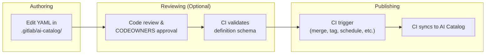
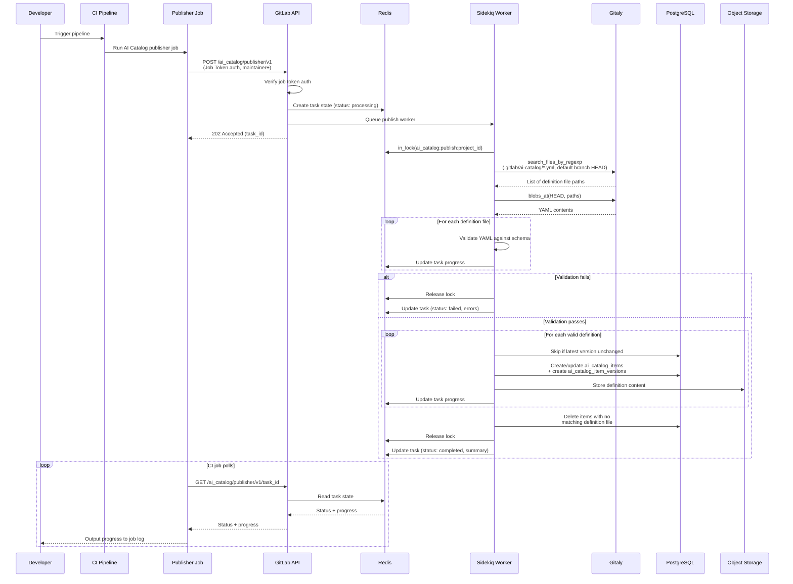



## はじめに

このドキュメントは、AI Catalog アイテム定義のオーサリングを、現在のデータベースベースの方式から、定義を git リポジトリ内の YAML ファイルとしてオーサリングし CI パイプラインを通じて公開するリポジトリベースの方式へ移行することを評価します。

この評価は [issue #587714](https://gitlab.com/gitlab-org/gitlab/-/issues/587714) を契機とし、リポジトリベースと DB ベースのオーサリングを恒久的な選択肢として両方サポートするのではなく、DB ベースの定義オーサリングを完全に置き換えるかどうかを評価するというプロダクトの方向性に従っています。

この評価では、リポジトリベースのパターンを採用することが AI Catalog にとって有益かどうか、移行のパスがどのようなものになるか、どのようなトレードオフが伴うかを評価します。

### 動機

CI/CD Catalog は、コンポーネント定義を git リポジトリに置き、それを CI/CD Catalog に公開するリポジトリオーサリングをすでにうまく活用しています。このパターンは次のものを提供します。

- **ガバナンスと監査可能性**: リポジトリベースの定義により、既存の GitLab の機能を通じて CODEOWNERS ルール、マージ承認ポリシー、保護ブランチ、バージョン履歴を利用できます
- **マージリクエストを通じたコラボレーション**: 定義の変更を標準的な MR ワークフローに通すことができ、公開前のコードレビュー、議論、承認を可能にします。

### スコープ

このドキュメントは次の内容をカバーします。

- AI Catalog 定義に提案されるリポジトリベースのオーサリングと公開のワークフロー
- CI/CD Catalog との類似点と相違点
- カスタム（ユーザー作成）アイテムに対する段階的な移行のパス
- 技術的・プロダクト的なリスク、制限、未解決の課題

## 現在のアーキテクチャ

現在の AI Catalog アーキテクチャは [AI Catalog アーキテクチャ設計ドキュメント](../ai_catalog/_index.md)に記載されています。

この提案に関連する、そのドキュメントの要点は次のとおりです。

- アイテムタイプは agent、flow、external agent の 3 つです
- アイテム定義は UI と GraphQL API を通じてオーサリングされ、`ai_catalog_item_versions.definition` に JSONB として保存されます。なお、ストレージは [issue #591638](https://gitlab.com/gitlab-org/gitlab/-/work_items/591638) で Object Storage に変更される予定です。
- Foundational アイテムは GitLab に同梱されます。

## 提案するアーキテクチャ

### 原則

アイテム定義は git リポジトリ内の YAML ファイルとしてオーサリングされ、現在の UI と GraphQL ベースのオーサリング面を置き換えます。公開時には、定義がリポジトリから抽出され、ランタイムアクセス用に Object Storage に保存されます（[issue #591638](https://gitlab.com/gitlab-org/gitlab/-/work_items/591638) を参照）。git リポジトリが定義の信頼できる情報源（source of truth）になります。

PostgreSQL は、カタログのメタデータ、バージョン、有効化（enablement）のクエリ可能なストアとして残ります。有効化サブシステム（アイテムのコンシューマーとトリガー）は完全に PostgreSQL に残ります。

Foundational アイテムの定義は git リポジトリには移動されず、代わりに（現在のとおり、モノリスまたは Duo Workflow Service 内の）「フィクスチャ」のまま残ります。

これは、4 つのシステムがそれぞれ別個の役割を担うことを意味します。

- **Git リポジトリ** — 定義のオーサリング面であり信頼できる情報源
- **Object Storage** — 定義内容のランタイムでの読み取り元
- **PostgreSQL** — カタログのメタデータ、バージョンレコード、有効化、検索のクエリ可能なストア
- **インメモリのフィクスチャ** — Foundational アイテムの定義

これは CI/CD Catalog と類似したアーキテクチャパターンに従っており、コンポーネント定義はリポジトリに置かれ、クエリを補助するために公開時にメタデータが PostgreSQL に抽出されます。

AI Catalog は CI/CD Catalog とパターンや関心事を共有しますが、モデルやサービスを直接共有するわけではありません。ドメインの差異が大きすぎます（organization スコープ対 project スコープ、3 つのアイテムタイプ対 1 つ、CI/CD Catalog に相当するものがない有効化サブシステム）。

次の表は、各アイテムタイプがどのようにオーサリング・クエリされ、ランタイムで読み取られるかをまとめたものです。

| アイテムタイプ | 定義のソース | クエリ可能なメタデータ | 定義の読み取り元 |
| --- | --- | --- | --- |
| **カスタムアイテム**（ユーザー作成、project が所有） | git リポジトリ内の YAML ファイル | PostgreSQL（変更なし） | Object Storage（変更なし） |
| **Foundational アイテム**（GitLab がメンテナンス、organization が所有） | フィクスチャ（変更なし） | PostgreSQL（変更なし） | インメモリのフィクスチャ（一部変更なし） |

### リポジトリに移動するもの

git リポジトリが定義の信頼できる情報源であり、オーサリングの手段になります。なお、公開時には定義がリポジトリから抽出され、ランタイムアクセス用に Object Storage に保存されます。これは [#591638](https://gitlab.com/gitlab-org/gitlab/-/work_items/591638) で開発中のアプローチに従います。

### PostgreSQL に残るもの

1. **カタログメタデータ**: `ai_catalog_items`（名前、説明、可視性、検証レベル）。
1. **バージョンレコード**: `ai_catalog_item_versions` は引き続きリリース済みバージョンを追跡します。なお、リリース間の中間的な変更は git でのみ追跡されるため、git のバージョン履歴が加えられたすべての変更の唯一の完全な情報源になります。
1. **有効化**: `ai_catalog_item_consumers`、`ai_flow_triggers`、サービスアカウント、Foundational アイテムの有効化（`enabled_foundational_flows`、`*_foundational_agent_statuses`）。
1. **検索とディスカバリ**: 全文検索、フィルタリング、ソート、ページネーション。

### 新しいオーサリングと公開のフローの概要

以下は、提案するオーサリングと公開のフローの変更点の概要です。

1. オーサリング: 開発者がリポジトリの `.gitlab/ai-catalog/` ディレクトリ内の YAML ファイルを編集してアイテムを定義します
2. レビュー: 任意のステップであり、コードレビューと CODEOWNERS の承認ルールがアイテムのデフォルトブランチへのマージを統制します
3. 公開: CI パイプラインジョブが定義を AI Catalog に公開します。公開エンドポイントは常にデフォルトブランチの HEAD から読み取るため、ユーザーは公開のトリガー方法を自由に CI ルールで設定できます。



### 提案する CI/CD Catalog との類似点

- **リポジトリベースの定義**: ガバナンス機能を利用できます。
- **CI ジョブを通じた公開**: パイプライン UI とジョブログを通じて、公開の進行状況とエラーを可視化します
- **クエリ可能なストアとしての PostgreSQL**: 両者ともカタログメタデータ、バージョンレコード、検索インデックス、ディスカバリに PG を使用します。

### 提案する CI/CD Catalog との相違点

- **1 プロジェクトに複数アイテム**: CI/CD Catalog は project とコンポーネントの 1:1 マッピングを強制します。AI Catalog は、通常のリポジトリの一部として project が複数の AI Catalog アイテムを管理できるようにします。
- **通常の project リポジトリ内に共存**: AI Catalog 定義は、project が issue やマージリクエストのテンプレートなど他の GitLab 定義を管理するのと同じ方法で、通常の project ファイルと並んでより容易に共存します。カタログへの公開は、project のタグ付けやリリースのプロセスに干渉せずに行われます。CI/CD Catalog の公開は、コンポーネントを公開するために専用の project を作成する必要があるようです。
- **タグではなくデフォルトブランチ上の CI ジョブによる公開**: CI Catalog は git タグのリリースを通じて公開します。AI Catalog は CI ジョブを通じて公開し、データはデフォルトブランチから読み取りますが、正確なトリガーは標準的な CI ルールで設定可能です。
- **タグから導出されるのではなく YAML で指定するバージョン**: 各アイテムは自身の YAML 定義ファイルで独自のバージョンを指定します。1 つの project が独立したバージョン番号を持つ複数の AI Catalog アイテムを含むことができるため、単一の git タグではそれらすべてを表現できません。
- **異なる project 登録のメカニズム**: どちらのカタログも公開前に project レベルでのオプトインを必要とします。CI/CD Catalog は project ごとに専用の `catalog_resources` レコードを使用し、これは project のコンポーネントをグループ化する閲覧可能なカタログエントリも兼ねます。AI Catalog にはこれに相当する project レベルのラッパーがなく、各アイテムが独立して閲覧可能なため、オプトインは単なる project の設定（`ai_catalog_publishing_enabled`）です。

### Project の要件

リポジトリベースの AI Catalog アイテムを公開するには、project に次の 3 つが必要です。

1. project 設定で AI Catalog の公開が有効になっていること。これは project レベルでの明示的なオプトインであり、誤った公開を防ぎます（[なぜ project 設定なのか？](#why-a-project-setting)を参照）。
1. リポジトリの `.gitlab/ai-catalog/` 配下にあるアイテム定義ファイル。
1. `.gitlab-ci.yml` の設定。CI コンポーネントが GitLab.com の顧客向けにこれを抽象化できます。Self-Managed と Dedicated では、ドキュメントからコピーできるより冗長な設定が必要になります。

#### なぜ project 設定なのか？ {#why-a-project-setting}

project 設定は、リポジトリのフォークに引き継がれない明示的なオプトインとして機能し、フォークが誤ってカタログに公開してしまうことを防ぎます。

この設定は、project 設定 UI または API を通じて、メンテナー以上の権限で設定できます。

### 定義ファイル

#### 命名構造

AI Catalog 定義は `.gitlab/ai-catalog/` ディレクトリ配下に置かれ、GitLab の project レベルの機能設定に `.gitlab/` を使用するという確立された慣例（現在 issue テンプレートとマージリクエストテンプレートに使われている）に従います。

`.gitlab/ai-catalog/` 配下の各 YAML ファイルが個別のカタログアイテムを表し、単一の project が複数のアイテムを管理・公開できるようにします。

任意の深さのサブディレクトリがサポートされ、チームが定義を整理し、ディレクトリレベルで CODEOWNERS ルールを適用できるようにします。例えば次のようになります。

```plaintext
.gitlab/ai-catalog/
  team-alpha/
    agents/
      code-assistant.yml
    flows/
      review-flow.yml
  team-beta/
    agents/
      security-scanner.yml
```

次のような CODEOWNERS ルールを可能にします。

```plaintext
.gitlab/ai-catalog/team-alpha/ @team-alpha-leads
.gitlab/ai-catalog/team-beta/ @team-beta-leads
```

アイテムタイプ（agent、flow、external agent）は、ディレクトリ構造から推測されるのではなく、YAML ファイル内のプロパティとして指定されます。

Gitaly の `SearchFilesByName` RPC は任意の深さでのファイルマッチングをサポートするため、すべての定義ファイルを単一の呼び出しで取得でき、大きな結果セットに対するページネーションもサポートされます。

#### YAML メタデータ

すべてのアイテムタイプの YAML 定義は、`catalog_metadata` キーによって設定と分離された同じメタデータを含みます。

```yaml
catalog_metadata:
  id: code-assistant
  name: Code Assistant
  description: Helps developers write, review, and refactor code
  type: agent # agent | flow | external_agent
  lifecycle: released # draft | released | deleted
  visibility: public # public | private
  version: 1.2.0
# ... agent, flow, or external agent definition follows
```

##### `id`

- 型: 文字列
- 必須

アイテムの安定した識別子であり、project ごとに一意でなければなりません。

`id` は、ファイルのパスや名前にかかわらず、公開時に定義ファイルを既存の `ai_catalog_items` レコードにマッチさせるために使用されます。
アイテムの `id` はファイルの再編成を生き残るため、ファイル名の変更や移動は安全です。

同じ project 内の 2 つのファイルが同じ `id` を共有している場合、[検証](#api-endpoints)はエラーになります。

`id` を付けてアイテムを公開した後にそれを変更すると、新しいアイテムの作成として扱われ、古いアイテムは削除されます。

##### `name`、`description`

- 型: 文字列
- 必須

`Ai::Catalog::Item` の同じプロパティに直接マッピングされます。

##### `type`

- 型: 列挙型（`agent, flow, external_agent`）
- 必須

AI Catalog アイテムのタイプ。

##### `lifecycle`

- 型: 列挙型（`draft, released, deleted`）
- 任意。デフォルト: `released`

カタログ内でアイテムの draft から released への状態を制御します（現在は AI Catalog でバックエンドのみがサポート）。

`lifecycle: deleted` 状態は、アイテム定義を削除する代わりの削除方法を可能にし、YAML ファイル内のプロパティ変更として表現されるため、監査証跡としてファイルをリポジトリに残します。

拡張可能であり、将来的に `archived` や `deprecated` などの追加状態をサポートできます。

##### `visibility`

- 型: 列挙型（`public, private`）
- 任意。デフォルト: `private`。

既存の `Ai::Catalog::Item#public` boolean を制御しますが、将来的に `internal` などのオプションをサポートできるよう拡張性を持たせます。

##### `version`

- 型: SemVer 形式の文字列
- 任意

既存の `Ai::Catalog::ItemVersion#version` のルールに従います。

指定されない場合、公開はマイナーバージョンでリリースをインクリメントするため、顧客は AI Catalog にバージョン管理を任せることができます。

### 検証と公開

検証と公開の操作は API エンドポイントを通じて公開され、CI ジョブを通じてトリガーされます。

#### 公開のガードレール {#publishing-guardrails}

公開エンドポイントは、ガバナンス制御が尊重されることを保証するために、いくつかのガードレールを強制します。

1. **project 設定が有効**: project の設定で AI Catalog の公開が有効になっている必要があります。
1. **デフォルトブランチのみ**: 公開エンドポイントは、どのブランチがパイプラインをトリガーしたかにかかわらず、常に project のデフォルトブランチの HEAD から定義ファイルを読み取ります。これにより、project のレビューと承認のプロセスを通過したコンテンツのみが公開されることが保証されます（[公開ブランチの設定可能化](#configurable-publishing-branch)に関する未解決の課題も参照）
1. **ジョブトークン認証のみ**: 公開エンドポイントは CI ジョブトークンを必要とします。PAT、OAuth、その他の認証方法ではトリガーできません。これにより、公開は常に CI パイプラインを通じて行われることが保証されます。
1. **メンテナー以上の権限**: ジョブトークンのユーザーは project でメンテナー以上のロールを持っている必要があります。
1. **公開前の検証**: すべての定義はスキーマに対して検証され、レコードが作成される前に参照が解決されます。1 つでも検証に失敗すると公開は中止されます。
1. **排他リースロック**: project ごとに一度に 1 つの公開しか実行できず、競合状態を防ぎます。

これらのガードレールは、ユーザーが公開のトリガー方法（マージ時、タグ時、スケジュール、手動）を自由に CI ルールで設定できることを意味します。エンドポイントは*いつ*ではなく*何が*公開されるかを強制します。

検証エンドポイントは意図的に制約が緩くなっています。デフォルトブランチではなくパイプラインのブランチから読み取り、developer 以上のアクセスのみを必要とし、任意のパイプラインから呼び出せます。これにより、MR パイプラインがマージ前に提案された変更を検証できます。

#### CI 設定

AI Catalog アイテムの検証と公開は CI ジョブを通じて行われます。

公開イベントは標準的な CI ルールで設定可能です。デフォルトブランチへのマージを推奨デフォルトトリガーとすることができます。

検証は公開とは独立して実行でき、アイテムのスキーマが有効かどうかについて MR パイプラインでフィードバックを得られます。

##### CI コンポーネント（GitLab.com のみ）

GitLab.com の顧客向けに、CI 設定を抽象化し設定可能な入力を許可する CI コンポーネントを作成できます。例えば次のようになります。

```yaml
include:
  - component: gitlab.com/gitlab-org/ai-catalog-publisher@1.0.0
  - component: gitlab.com/gitlab-org/ai-catalog-validator@1.0.0
```

カスタマイズした使用例:

```yaml
include:
  - component: gitlab.com/gitlab-org/ai-catalog-publisher@1.0.0
    inputs:
      publish_on: tag # publish on tag instead of default branch
```

##### 完全な CI 設定

このオプションは、Self-Managed と Dedicated の顧客が利用できる唯一のものになります。

次のための CI 設定の例:

- 任意の MR パイプラインで検証し、マージ前に検証フィードバックを得る。
- デフォルトブランチへのマージ後に公開する。

```yaml
stages:
  - test
  - deploy
.ai_catalog_polling_script: &ai_catalog_polling_script
  - |
    RESPONSE=$(curl --fail --silent --request POST \
      --header "JOB-TOKEN: $CI_JOB_TOKEN" \
      "${CI_API_V4_URL}/projects/${CI_PROJECT_ID}/ai_catalog/${ENDPOINT}")
    TASK_ID=$(echo "$RESPONSE" | jq -r '.task_id')
    echo "${ENDPOINT} initiated. Task ID: $TASK_ID"
    TIMEOUT=${TIMEOUT:-300}
    INTERVAL=${INTERVAL:-5}
    ELAPSED=0
    while [ $ELAPSED -lt $TIMEOUT ]; do
      STATUS_RESPONSE=$(curl --fail --silent --request GET \
        --header "JOB-TOKEN: $CI_JOB_TOKEN" \
        "${CI_API_V4_URL}/projects/${CI_PROJECT_ID}/ai_catalog/${ENDPOINT}/${TASK_ID}")
      STATUS=$(echo "$STATUS_RESPONSE" | jq -r '.status')
      PROGRESS=$(echo "$STATUS_RESPONSE" | jq -r '.progress // empty')
      if [ -n "$PROGRESS" ]; then
        echo "$PROGRESS"
      fi
      if [ "$STATUS" = "completed" ]; then
        echo "$(echo "$STATUS_RESPONSE" | jq -r '.summary')"
        exit 0
      elif [ "$STATUS" = "failed" ]; then
        echo "$(echo "$STATUS_RESPONSE" | jq -r '.errors')"
        exit 1
      fi
      sleep $INTERVAL
      ELAPSED=$((ELAPSED + INTERVAL))
    done
    echo "${ENDPOINT} timed out after ${TIMEOUT}s"
    exit 1
ai-catalog-validate:
  stage: test
  variables:
    ENDPOINT: validator/v1
    INTERVAL: 3
  rules:
    - if: $CI_PIPELINE_SOURCE == "merge_request_event"
      changes:
        - .gitlab/ai-catalog/**/*
  script: *ai_catalog_polling_script
ai-catalog-publish:
  stage: deploy
  variables:
    ENDPOINT: publisher/v1
    INTERVAL: 5
  rules:
    - if: $CI_COMMIT_BRANCH == $CI_DEFAULT_BRANCH
      changes:
        - .gitlab/ai-catalog/**/*
  script: *ai_catalog_polling_script
```

CI ジョブを使用することは次を意味します。

- **失敗の可視化**: 同期エラーは失敗したパイプラインジョブとして表示され、ユーザーが確認できるログが残ります
- **ユーザーによる制御**: 標準的な CI ルールで公開の実行タイミングを制御できます

未解決の課題である[検証エラーと同期進行状況の UI](#validation-error-and-syncing-progress-ui)では、公開と同期の進行状況を管理するアプリの独自部分という代替案を説明しています。これは CI ジョブの必要性を置き換えますが、はるかに高いエンジニアリング投資が必要になります。

#### API エンドポイント {#api-endpoints}

検証と公開のロジックは API エンドポイントにカプセル化されます。

1. CI コンポーネント（GitLab.com 向け）はエンドポイントを呼び出すだけの薄いラッパーになります
2. Self-Managed と Dedicated の顧客は、インラインの CI ジョブ定義から同じエンドポイントを呼び出せます
3. コアロジック（ファイルの検出、スキーマ検証、PG レコードの作成）は CI 設定そのものではなく Rails サービスに置かれます。これにより、Self-Managed と Dedicated は最小限の CI 設定で済みます

検証と公開はどちらも非同期に処理され、多くのアイテムを持つ project でも API のタイムアウトリスクなしに扱い、CI ジョブログで段階的なフィードバックを提供します。

エンドポイントは後方互換性のためにバージョン管理され（例: `v1`）、古い統合を壊さずにエンドポイントの動作やレスポンスを時間とともに進化させることができます。

- `POST /api/v4/projects/:id/ai_catalog/validator/v1` — 非同期検証を開始
- `GET /api/v4/projects/:id/ai_catalog/validator/v1/:task_id` — 検証ステータスをポーリング
- `POST /api/v4/projects/:id/ai_catalog/publisher/v1` — 非同期公開を開始
- `GET /api/v4/projects/:id/ai_catalog/publisher/v1/:task_id` — 公開ステータスをポーリング

##### 非同期処理モデル

両方のエンドポイントは同じ非同期パターンに従います。

1. **開始**: `POST` リクエストがリクエストパラメータを検証し、バックグラウンドジョブをキューに入れ、TTL 付きで `Redis::SharedState` にタスク状態レコードを作成し、即座に `task_id` を返します。
2. **処理**: Sidekiq ワーカーが作業を実行し、進行に応じて Redis のタスク状態を進捗とともに更新します。Sidekiq ワーカーは冪等であり、失敗後のリトライを可能にします。
3. **ポーリング**: CI ジョブは対応する `GET` エンドポイントを一定間隔でポーリングします。各レスポンスには現在のステータス（`processing`、`completed`、`failed`）と、CI ジョブがログに出力する進捗メッセージが含まれます。
4. **完了**: `completed` または `failed` で、CI ジョブは適切なステータスコードで終了します。

このアプローチは次を意味します。

- **タイムアウトのリスクなし** — 最初の API リクエストは即座に返り、重い作業はバックグラウンドワーカーで行われます
- **豊富な進捗出力** — CI ジョブログには、長い待機の後に単一のサマリーが出るのではなく、アイテムが処理されるにつれて検証・公開される様子が表示されます
- **API ノードから作業をオフロード** — 処理は API リクエストのライフサイクル内ではなく Sidekiq ワーカーで行われます

##### 検証（Validate）

ジョブトークンから推測されるパイプラインのブランチから定義ファイルを読み取り、スキーマと参照解決を検証し、エラーを報告します。
任意の MR パイプラインから安全に呼び出せ、マージ前に提案された変更についてフィードバックを得られます。

**権限**: project の設定で AI Catalog の公開が有効になっている必要があります。project の developer 以上であること。権限はジョブトークンである必要はなく、通常の API インタラクションを通じて呼び出せます。

##### 公開（Publish）

検証を行い、かつ PG レコードを作成・更新し、定義を Object Storage に保存します。

公開は、どのブランチがパイプラインをトリガーしたかにかかわらず、常に project のデフォルトブランチの HEAD から定義ファイルを読み取ります（[公開のガードレール](#publishing-guardrails)を参照）。ユーザーは公開のトリガー方法（マージ時、タグ時、スケジュール、手動）を自由に CI ルールで設定できますが、公開がデフォルトブランチからのみ行われることを考慮する必要があります。

**権限**: project の設定で AI Catalog の公開が有効になっている必要があります。認証は（CI ジョブからの）ジョブトークンでなければならず、ジョブトークンのユーザーはメンテナー以上である必要があります。`task_id` パラメータは、以前に同じ project が所有していた状態と一致しなければなりません。

##### 任意の引数

これらは後から両方のエンドポイントに追加できます。

- アイテムへの更新をアトミックに扱うかどうか。`atomic: true` の場合、更新はトランザクション内で行われ、すべての更新が成功するか失敗するかのいずれかになります。`atomic: false` の場合、一部の更新が成功し一部が失敗する可能性があります。デフォルト: `atomic: false`。
- リース設定: `lease_wait` と `lease_retry`。

##### 検証ルール

検証フェーズ（両方のエンドポイントで共有）は、次の場合に失敗します。

1. 同じ project 内の 2 つのファイルが同じ `id` を宣言している。
1. アイテムのスキーマが無効、または ActiveRecord モデルが無効である。

検証が失敗すると、タスクステータスは `failed` になります。ジョブは失敗し、エラーはジョブログで確認できます。

##### 公開のステップ

バックグラウンドワーカーが公開を処理するとき:

1. まず検証が実行され、失敗があればジョブが失敗します。
1. 同一 project で複数の公開が同時に発生しないように排他リースロックが取得されます。十分に寛大なリース待機時間とリトライを与えます。最終的に失敗すると CI ジョブが失敗するためです。リースロックの期間とリトライは、エンドポイントへの引数の指定によって顧客が設定できます。
1. 定義ファイルは、どのブランチがパイプラインをトリガーしたかにかかわらず、常に project のデフォルトブランチの HEAD から読み込まれます（[公開のガードレール](#publishing-guardrails)を参照）。
1. 定義ファイルは `Repository#search_files_by_regexp` を使用して読み込まれます。これは、指定された ref で git ツリーをスキャンし正規表現に一致するすべてのパスを返す単一の Gitaly RPC です。これは CI/CD Catalog が `templates/` 配下のコンポーネントファイルを検出するのに使うのと同じメカニズムです。
1. YAML 定義はスキーマに対して検証されます。
1. `ai_catalog_items` レコードが作成または更新され、新しいバージョンには `ai_catalog_item_versions` レコードが作成されます。パブリッシャーは、YAML 定義内の `id` を `internal_id` プロパティにマッピングすることで、project にスコープされた既存の `ai_catalog_items` レコードにマッチさせます。マッチが存在しなければ、新しいアイテムが作成されます。定義が最新バージョンから変更されていなければ、そのアイテムはスキップされます。
1. レコードが削除されます。リポジトリ内に対応する定義ファイルがない既存の project の AI Catalog アイテムは削除されます。これは破壊的操作であるため、まずリポジトリからすべての定義ファイルを正常に読み込んでいることに注意が必要です。アイテムがソフト削除される場合（ハード削除とは対照的に）、project が同じ識別子を新しいアイテムに再利用できるよう、`internal_id` を解除したい場合があります。

#### 公開フロー



#### データマッピング

公開時には、PostgreSQL レコードのデータがマッピングされます。

| `ai_catalog_items` カラム | ソース |
| --- | --- |
| `name` | YAML 定義ファイル |
| `description` | YAML 定義ファイル |
| `item_type` | YAML 定義ファイル（`type` プロパティ） |
| `public` | YAML 定義ファイル（`visibility` プロパティ） |
| `project_id` | リポジトリの project |
| `organization_id` | project の organization |
| `internal_id` | YAML 定義ファイル（`id` プロパティ）。定義 YAML をレコードにマッピングするために使う安定した識別子であり、アイテムと project に一意にスコープされます。 |
| `verification_level` | project の namespace の検証済みステータス |

| `ai_catalog_item_versions` カラム | ソース |
| --- | --- |
| `version` | YAML 定義ファイル（任意、現在のバージョンより大きい有効な semver でなければなりません）。欠落している場合は最新バージョンからのマイナーバンプがデフォルトです。 |
| `release_date` | lifecycle が `released` になったときの公開イベントのタイムスタンプ |
| `commit_sha` | 公開時に読み取ったコミットの SHA（監査可能性のために保存されますが、使用されません） |
| `created_by_id` | ジョブトークンのユーザー |

### Foundational アイテム

Foundational アイテムは、GitLab がメンテナンスする、ユーザーがオーサリングしないカタログアイテムです。カスタムアイテムとは異なり、project ではなく organization に属するため、リポジトリベースにはできません。バージョン管理されておらず、GitLab に同梱される必要があります。

Foundational アイテムは、引き続きモノリスに同梱されるフィクスチャとして定義がメンテナンスされます。これは、定義がすでにコードベースから生じている現在のパターンと一致しています。

Foundational アイテムのアーキテクチャは [#590241](https://gitlab.com/gitlab-org/gitlab/-/work_items/590241) で活発に議論されていますが、この設計ドキュメントの目的上、そのデータソースをフィクスチャと見なすことができます。

## カスタム Agent 定義の YAML {#custom-agent-definition-yaml}

flow や external agent とは異なり、カスタム agent は現在 YAML として定義されておらず、提案する YAML 構文が必要です。

agent 定義は現在、組み込みツールと MCP サーバーを内部識別子で参照しています。

- **組み込みツール** — 整数 ID で参照され（例: `"tools": [1, 3, 10, 39]`）、`Ai::Catalog::BuiltInTool` フィクスチャにマッピングされます
- **MCP ツール** — 文字列名で参照され（例: `"mcp_tool_names": ["search"]`）、インメモリの `Ai::Catalog::McpTool` レコードにマッピングされます
- **MCP サーバー** — 整数のデータベース ID で参照され（例: `"mcp_servers": [42, 57]`）、`ai_catalog_mcp_servers` の行にマッピングされます

整数のデータベース ID は YAML 定義ファイルでは実用的ではありません。コードレビューにおいて意味的な意味を持たず（この提案のコラボレーションとガバナンスの目標を損ないます）。YAML 内の参照は人間が読めて自己文書化されているべきです。

上記の 3 つのタイプはすべて、YAML 定義では人間が読める名前で参照されるべきです。

```yaml
tools:
  - gitlab_blob_search/1.0.0
  - gitlab_create_merge_request/1.0.0
mcp_tool_names:
  - search/1.0.0
mcp_servers:
  - jira_cloud/1.0.0
  - slack/1.0.0
```

上記のいずれも現在バージョン管理されていません。バージョンサフィックス（`/1.0.0`）は将来の互換性のために含まれており、YAML 形式の変更を必要とせずにこれらの関連付けのバージョン管理を導入できるようにします。

**組み込みツール**については、これは単純です。`BuiltInTool` はすでに一意で安定した `name` フィールド（例: `"gitlab_blob_search"`）を持っています。

**MCP ツール**については、これはすでに現在の動作です。今日では文字列名で参照されています。

**MCP サーバー**については、これは解決メカニズムを必要とします。MCP サーバーは organization スコープのデータベースレコード（`ai_catalog_mcp_servers`）です。現在は `name` フィールドを持っていますが、これは人間が読めるようにするためのものです。

一意性制約を持つ新しい `internal_id` カラムを追加し、`name` は表示専用のフィールドとして保持します。これにより、人間が読めるラベルとマシン参照が分離されます。

`internal_id` は、一度選んだら変更すると関連付けが壊れるため、不変である必要があります。

公開フェーズでは、YAML 内の名前ベースの参照が、アイテムの organization 内の `ai_catalog_mcp_servers` に対して内部識別子に解決されます。

agent YAML の例:

```yaml
catalog_metadata:
  id: code-assistant
  name: Code Assistant
  description: Helps developers write, review, and refactor code
  type: agent
  lifecycle: released
  visibility: public
  version: 1.2.0
system_prompt: |
  You are a senior software engineer assistant. You help developers
  write clean, well-tested code following the project's conventions.
  Always explain your reasoning and suggest tests for any changes.
tools:
  - gitlab_blob_search/1.0.0
  - gitlab_create_merge_request/1.0.0
mcp_tool_names:
  - search/1.0.0
mcp_servers:
  - jira_cloud/1.0.0
  - slack/1.0.0
```

## 移行フェーズ

カスタムアイテムは、project が所有するユーザー作成のカタログアイテムです。リポジトリベースの定義への移行は、オーサリング面を GraphQL ミューテーションと UI フォームから project のリポジトリ内の YAML ファイルへ移します。

3 つのカスタムアイテムタイプ（agent、flow、external agent）すべてがこの移行のスコープに含まれます。

必須のフェーズが 2 つあります。

1. **フェーズ 1: 新しいアーキテクチャの追加**
2. **フェーズ 2: 新規アイテムのリポジトリベース作成への切り替え**

任意のフェーズが 2 つあります。

1. **フェーズ 3: 移行パスの提供**: 既存の DB ベースのアイテムをリポジトリベースに変換できる
2. **フェーズ 4: データベースベースの方式の完全な非推奨化と削除**

### フェーズ 1: 新しいアーキテクチャの追加

このフェーズの終わりまでに、project はリポジトリを通じて AI Catalog への公開を開始できるようになります。既存の DB ベースのアイテム（`source: database`）は、現在の GraphQL ミューテーションを通じて引き続き動作します。どちらのタイプもカタログに表示され、同じファインダーと GraphQL API を通じてクエリ可能です。

#### ワークストリーム

**1. スキーマ移行**

リポジトリベースのアイテムをサポートするために新しいカラムを追加します。

| 変更 | 詳細 |
| --- | --- |
| 新しいカラム: `project_settings.ai_catalog_publishing_enabled` | Boolean、デフォルト `false`。AI Catalog への公開のための [project レベルのオプトイン](#why-a-project-setting)。 |
| 新しいカラム: `ai_catalog_items.source` | 列挙型: `database`、`repository`、`fixture`。アイテムの定義がどこから生じ、どのようにオーサリングされるかを識別します。 |
| 新しいカラム: `ai_catalog_items.internal_id` | YAML の `id` フィールドからの安定した識別子、project 内で一意 |
| 新しいカラム: `ai_catalog_items.foundational_item_ref` | フィクスチャにマッピングする安定した識別子（`foundational_flow_reference` を一般化したもの） |
| 新しいカラム: `ai_catalog_item_versions.commit_sha` | 公開時のアイテムバージョンのリポジトリ SHA（監査可能性のために保存されますが、使用されません） |
| 新しいカラム: `ai_catalog_mcp_servers.internal_id` | YAML 参照のための不変の識別子 |

**2. Agent YAML 定義スキーマ**

カスタム agent の YAML スキーマを設計・実装します。flow と external agent はすでに YAML 定義を持っていますが、agent は現在 UI フォームを通じてオーサリングされる構造化された JSON 形式しか持っていません。これには、組み込みツール、MCP ツール、MCP サーバーの人間が読める参照形式の確立が含まれます。

詳細は[カスタム Agent 定義の YAML](#custom-agent-definition-yaml)を参照してください。

**3. 公開 API とサービスレイヤー**

コアとなる公開インフラを構築します（[API エンドポイント](#api-endpoints)を参照）。

- バージョン管理された REST エンドポイント（`POST .../validator/v1`、`GET .../validator/v1/:task_id`、`POST .../publisher/v1`、`GET .../publisher/v1/:task_id`）
- 検証と公開タスクの非同期処理のための Sidekiq ワーカー
- TTL 付きの `Gitlab::Redis::SharedState` を介したタスク状態の追跡。Ruby クラス（例: `Ai::Catalog::PublishTaskState`）がタスクの進捗、ステータス、エラーを Redis に読み書きします。タスク状態は一時的で自動的に期限切れになるため、データベーステーブルは不要です。
- Gitaly を介したファイル検出（`search_files_by_regexp`）、YAML パース、スキーマ検証、agent ツールと MCP 名の[参照解決](#custom-agent-definition-yaml)のための Rails サービス
- レコードの作成・更新ロジック: `ai_catalog_items` と `ai_catalog_item_versions` レコードの作成または更新

**4. パブリッシャー CI コンポーネント**

GitLab.com の顧客向けに REST エンドポイントとポーリングロジックをラップする CI/CD Catalog コンポーネントを構築・公開します。Self-Managed と Dedicated の顧客向けにインラインの CI ジョブ設定を文書化します。

**5. アイテムの複製**

現在、アイテムの複製はフロントエンドのみのアクションです。ソースアイテムのデータがフォームに事前入力され、ユーザーがそれを新しいアイテムとして送信します。リポジトリベースのオーサリングでは、複製には project リポジトリへの書き込みが必要です。

提案するフロー:

1. ユーザーが既存のアイテムから複製を開始し、ターゲット project を選択します。ターゲットはソース project 自身でも、同じ organization 内の他の任意の project でもかまいません。
1. システムがターゲット project のリポジトリに新しいブランチを作成します。
1. 複製された YAML 定義がそのブランチに書き込まれます。すべての `id` 値がターゲット project のリポジトリ内で一意になるようにします。これは高性能です。単一の Gitaly 呼び出しがターゲット project のすべての定義ファイルを読み込みます。これは公開で使うのと同じメカニズムです。重複があれば一意の `id` を生成できます（例: ソースの `id` に `-copy` を付加し、必要に応じてインクリメントする）。
1. マージリクエストが自動的に開かれ、ユーザーがマージ前にレビューできるようにします。
1. マージ時に、project の既存の公開 CI 設定が残りを処理します。

この作業は、web ノードから負荷を取り除くために非同期に行われます。
複製が完了したときにユーザーに通知する必要があります。例えば次のようになります。

1. 複製が完了したときの AI Catalog 内のトーストポップアップ。
1. MR が開かれたときに todo が生成されます。

よりシンプルな初期イテレーションとして、ユーザーに複製された定義をファイルとして渡す「YAML をダウンロード」アクションを提供し、ユーザーが手動で project リポジトリにコミットするようにできます。これは自動 MR の利便性を失いますが、エンジニアリングの作業量が少なく、先にリリースできます。

### フェーズ 2: 新規アイテムのリポジトリベース作成への切り替え {#phase-2-switch-to-repo-backed-creation-for-new-items}

すべての新規アイテムがリポジトリベースのアイテムとしてのみ作成されることを強制します。

- DB ベースのアイテムの作成 UI を削除
- GraphQL の作成ミューテーションをブロック
- 既存のデータベースベースのアイテムのみ、引き続き更新 UI と GraphQL ミューテーションを許可

### フェーズ 3（任意）: 移行パスの提供 {#phase-3-optional-provide-a-migration-pathway}

PostgreSQL ベースからリポジトリベースへアイテムを移す UI ベースの移行を提供できます。

- ユーザーが開始すると、アイテムを YAML ファイルとして含む MR を所有 project のリポジトリに開きます。Duo が `.gitlab-ci.yml` の変更を支援できます。
- マージ時に同期がファイルを取り込み、アイテムの `source` が `database` から `repository` に切り替わります。

アイテムがリポジトリベースになると、定義を更新するための既存の UI と GraphQL ミューテーションはロックアウトされます。

### フェーズ 4（任意）: データベースベースの方式の完全な非推奨化と削除 {#phase-4-optional-full-deprecation-and-removal-of-database-backed-method}

移行には顧客のリポジトリへの書き込みが必要なため、アップグレードを容易に強制することはできません。
リスクの[継続的なレガシーサポート](#ongoing-legacy-support)を参照してください。

予告された非推奨期間の後、レガシーの DB ベースのアイテムを UI と GraphQL ミューテーションを通じて更新する機能を最終的にロックアウトし、ユーザーに移行を強制することができます。これは、これらの顧客の現在のオーサリングワークフローに対する破壊的変更になります。

## 移行: Foundational アイテム

Foundational アイテムはすでにフィクスチャベースです。その定義はユーザー入力ではなくコードベースから生じます。データベースからリポジトリへ移行するユーザーがオーサリングしたデータがないため、移行パスはカスタムアイテムよりもシンプルです。

主な変更は次のとおりです。

1. **PostgreSQL での定義キャッシュの削除** — 現在、external agent はその定義が `ai_catalog_item_versions.definition` に JSONB としてシードされています。提案するアーキテクチャでは、定義はランタイムにフィクスチャから直接読み取られるため、このカラムは Foundational アイテムに対して populate されなくなります。

2. **PostgreSQL でのカタログメタデータの保持** — `ai_catalog_items` レコードは引き続きシードされ（名前、説明、アイテムタイプ、検証レベル）、Foundational アイテムがカタログ内で引き続きクエリ可能で発見可能であるようにします。

3. **フィクスチャ参照の記録** — `ai_catalog_items` の `foundational_item_ref` カラムが、各データベースレコードをそのフィクスチャ定義にマッピングする安定した識別子を提供します。これは（現在 Foundational flow にのみ使われている）既存の `foundational_flow_reference` カラムを一般化し、すべての Foundational アイテムタイプをカバーします。

Foundational アイテムへのさらなるアーキテクチャ変更（有効化パターンの統一など）はスコープ外であり、[#590241](https://gitlab.com/gitlab-org/gitlab/-/work_items/590241) で追跡されています。

## リスク

### 著しく遅くなるイテレーションのフィードバックループ

**リスクの種類**: プロダクト。

現在の UI は、定義に対する迅速なイテレーションを可能にします。タイトなループで編集、保存、テスト、改良ができます。リポジトリベースのモデルははるかに長いフィードバックサイクルを導入します。YAML を編集し、コミットし、プッシュし、デフォルトブランチにマージ（または他の設定されたトリガー）し、パブリッシャージョブを待ち、それからテストします。

定義が期待どおりに動作しない場合（例: プロンプトの調整が必要、またはツールが欠けている）、新しいコミットとマージが必要になります。

オーサーはアイデアを迅速に試すためのテスト用サンドボックスを持たないため、アイテムの開発がフラストレーションの多い遅い体験になる可能性があります。
これは、複数の迅速なイテレーションが典型的な新規アイテムの初期開発時に特に影響が大きくなります。

### YAML 検証 UX の後退

**リスクの種類**: プロダクト。

現在、ユーザーはアイテム設定を作成または更新するときに、フィールドごとの検証エラーを即座に受け取ります。これは、複雑な定義を持ち間違えやすい flow に特に役立ちます。

リポジトリベースのモデルでは、検証は後で行われます。プッシュまたはマージ後の同期中であり、フィードバックが非同期になります。

これは、特に定義スキーマに不慣れなユーザーにとって、意味のある UX の後退です。

緩和策:

- スキーマを認識する検証を備えたエディターツール（[AI Catalog 定義エディター](#ai-catalog-definition-editor)を参照）。

### Agent 編集 UX の後退 {#agent-editing-ux-regression}

**リスクの種類**: プロダクト。

ガイド付きの UI から生の YAML 編集への移行は、カスタム agent を定義する上で大きな体験の後退になります。

ユーザーは次のものについて正しい名前を入力する必要があります。

- 組み込みツール
- MCP ツール
- MCP サーバー

そうでなければ、同期中に参照解決が失敗します。

agent は現在最も UI 駆動なアイテムタイプであり、プロンプト用の構造化フォームフィールドと、オートコンプリート駆動のツール選択があります。flow と external agent はすでに YAML でオーサリングされているため、これらのタイプではこの移行の混乱が少なくなります。

緩和策:

- スキーマを認識する検証を備えたエディターツール（[AI Catalog 定義エディター](#ai-catalog-definition-editor)を参照）。

### アイテム複製 UX の後退

**リスクの種類**: プロダクト。

現在の AI Catalog は、フロントエンドのみのアクションを通じてアイテムの迅速な複製を可能にします。ソースアイテムのデータがフォームに事前入力され、ユーザーがワンクリックで新しいアイテムとして送信します。

リポジトリベースのモデルでは、複製にはターゲットリポジトリへのファイルのコミットが必要です。ブランチ作成、ファイル書き込み、MR 作成を自動化するツールがあっても、ユーザーは依然として MR をレビューしてマージし、複製されたアイテムがカタログに表示される前に公開ジョブを待つ必要があります。

さらに、まだ AI Catalog の公開を有効にしていない project（`.gitlab-ci.yml` の設定なし、project 設定が無効）への複製は、マージとしては成功しますが、それらの前提条件が設定されるまでアイテムはカタログに公開されません。複製ツールは MR に `.gitlab-ci.yml` の変更を含めません。CI 設定の追加は大きな複雑さを導入し、ユーザーの既存の CI 設定と競合するリスクがあるためです。

### ワークフローの破壊的変更

**リスクの種類**: プロダクト。

[フェーズ 2](#phase-2-switch-to-repo-backed-creation-for-new-items)は、顧客が UI を通じて新規アイテムを作成できなくなることを意味します。
すべての新規カスタムアイテムはリポジトリベースでなければなりません。これは意図的な破壊的プロダクト変更になります（[issue 587714](https://gitlab.com/gitlab-org/gitlab/-/work_items/587714#note_3064035412) を参照）。

緩和策:

- フェーズ 2 を任意にする。

### マージ以外のトリガーでの同期の可視性

**リスクの種類**: プロダクト。

公開が「デフォルトブランチへのマージ」以外のトリガー（例: タグ時、スケジュール、手動）で行われるように設定されている場合、定義の変更がデフォルトブランチに到達したがまだカタログに公開されていないという期間が生じます。

この期間中:

- オーサーが変更をマージし、公開にさらなるアクション（タグの作成など）が必要であることに気づかない可能性があります。
- リポジトリを見ている他の project メンバーは、デフォルトに新しいまたは更新されたアイテムを見ますが、それがカタログに同期されたのか、同期待ちなのか、同期に失敗したのかを容易に確認できません。
- 混乱の解消には、オーサーに尋ねるか、パイプライン履歴を手動で確認する必要があります。

このリスクは、公開とマージを切り離すトリガー設定に固有のものです。デフォルトブランチへのマージで公開をトリガーする project はこの期間を経験しません。MR がマージ後のパイプラインを通じて同期ステータスを直接表示するためです。

部分的な緩和策:

- 私たちが推奨するデフォルトの CI 設定（GitLab.com の CI コンポーネントのデフォルトを含む）は、デフォルトブランチへのマージで公開をトリガーします。異なるトリガーを選ぶ project はこのトレードオフを受け入れます。

### 継続的なレガシーサポート {#ongoing-legacy-support}

**リスクの種類**: エンジニアリング。

既存の DB ベースのアイテムに対して[移行パスを提供](#phase-3-optional-provide-a-migration-pathway)できます。しかし、これは顧客のリポジトリへの書き込みを伴うため、この移行を強制することはできません。

エンジニアリングは、おそらく無期限に、リポジトリベースでないレガシーアイテムのサポートを続ける必要があります。

これは次の点でアーキテクチャに無期限の複雑さを加えます。

- アイテムの更新と削除のための UI と GraphQL ミューテーションのメンテナンス
- すべての定義関連の機能が両方のコードパスで動作しなければならないため、バグとメンテナンスの面積が増加

緩和策:

- [フェーズ 4（任意）: 完全な非推奨化と削除](#phase-4-optional-full-deprecation-and-removal-of-database-backed-method)を参照。

### アトミック性

**リスクの種類**: エンジニアリング。

現在、定義とメタデータの更新は単一の PostgreSQL トランザクションで行われます。リポジトリベースのモデルでは、公開は git コミットと、その後の PostgreSQL 更新を伴います。コミットが到達した後に PG 更新が失敗すると、リポジトリには新しい定義があるが PG はまだ古いバージョンを指しているという不整合な状態にシステムが陥ります。

部分的な緩和策:

- CI ベースの公開は影響の緩和に役立ちます。PG 更新の失敗は、確認・リトライできる失敗したパイプラインジョブとして表示されます。同期は冪等なので、ジョブを再実行すれば状態が修正されます。

### 移行期間中の準機能フリーズ

**リスクの種類**: プロダクト、エンジニアリング。

移行期間中は、アイテム定義に影響する大きな新機能の追加を避け、代わりに移行の完了に集中することが望ましいでしょう。

有効化、検索、カタログメタデータのみに触れる機能は影響を受けません。

### 新しいサービスへの依存による機能停止: Gitaly

**リスクの種類**: エンジニアリング。

リポジトリベースのアーキテクチャは、公開のために正常な Gitaly サービスへの新しい依存を導入します。

Gitaly のエラーとダウンタイムは AI Catalog の公開停止を引き起こします。

### CI コンピュート分の消費

**リスクの種類**: プロダクト。

現在、アイテムの作成とリリースは無料です。CI ジョブを通じた公開は CI コンピュート分を消費します。影響は最小限と予想されます。パブリッシャージョブは小さなランナーで数秒で済む軽量な API 呼び出しです。しかしゼロコストからの変更ではあります。

## 推奨事項

### AI Catalog 定義エディター {#ai-catalog-definition-editor}

リポジトリベースの定義への移行は、オーサリングをガイド付きの UI から YAML ファイルへ移します。これは、特に agent にとって大きな UX の後退です（[Agent 定義 UX の後退](#agent-editing-ux-regression)を参照）。

[CI/CD パイプラインエディター](https://docs.gitlab.com/ci/pipeline_editor/)に類似した、AI Catalog 定義エディターに投資できます。このエディターは次を提供します。

- agent のためのフォームベースの編集（プロンプトフィールド、オートコンプリート付きのツールと MCP サーバーの選択）、裏で有効な YAML を生成
- flow と external agent のためのスキーマを認識する YAML 編集、リアルタイムの検証とエラーのハイライト付き
- 変更をリポジトリに書き込みマージリクエストを作成する組み込みのコミットワークフロー

## 未解決の課題

### 検証エラーと同期進行状況の UI {#validation-error-and-syncing-progress-ui}

CI ジョブは、ジョブログに検証エラーを表示でき、アイテムの公開の進行状況を示すことができるため便利です。代わりに、公開の進行状況、検証、エラーを管理するカスタムアプリに投資することもできます。これには大きなエンジニアリングの労力が加わりますが、CI ジョブの設定の必要性をなくすことができます。

### 公開ブランチの設定可能化 {#configurable-publishing-branch}

公開エンドポイントの提案は現在、デフォルトブランチの HEAD からのみ読み取ることを強制しています。代わりに、公開エンドポイントが読み取れる独自のブランチを project が定義できるようにすべきでしょうか？

これにより、チームは実験とテストの目的で機能ブランチから公開でき、一方でガバナンスを優先するチームは公開をデフォルトブランチのみに制限できます。

### `version` が欠落しているときのデフォルト

YAML から `version` フィールドが欠落しているときに提案するバージョン管理のデフォルトは、リリース時のマイナーバンプです。

ユーザーがデフォルトのバンプレベル（メジャー、マイナー、パッチ）を自分で指定できるようにすべきでしょうか？

### 悪用対策

悪用から保護するために、どのような制限、またはレート制限を適用すべきでしょうか？
