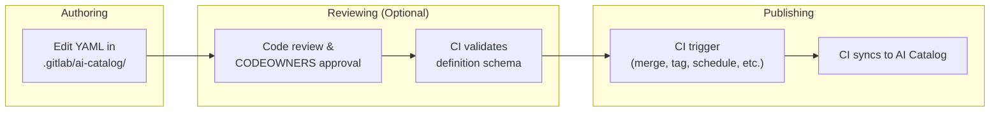
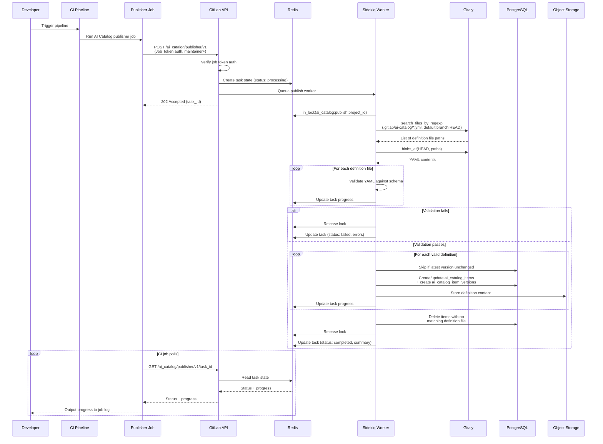



## はじめに {#introduction}

このドキュメントでは、AI Catalog アイテム定義のオーサリングを、現在のデータベースベースのアプローチから、定義を git リポジトリ内の YAML ファイルとしてオーサリングし CI パイプラインを通じて公開するリポジトリベースのアプローチへ移行することを評価します。

この評価は [issue #587714](https://gitlab.com/gitlab-org/gitlab/-/issues/587714) を契機としており、リポジトリベースと DB ベースの両方のオーサリングを恒久的な代替手段としてサポートするのではなく、DB ベースの定義オーサリングを完全に置き換えることを検討するというプロダクトの方向性に従っています。

この評価では、リポジトリベースのパターンを採用することが AI Catalog にとって有益かどうか、移行パスがどのようなものになるか、そしてどのようなトレードオフが含まれるかを評価します。

### 動機 {#motivation}

CI/CD Catalog は、コンポーネント定義が git リポジトリに存在し CI/CD Catalog に公開されるリポジトリオーサリングをうまく活用しています。このパターンは以下を提供します。

- **ガバナンスと監査可能性**: リポジトリベースの定義は、既存の GitLab 機能を通じて CODEOWNERS ルール、マージ承認ポリシー、保護ブランチ、バージョン履歴を利用できるようにします
- **マージリクエストを通じたコラボレーション**: 定義の変更を標準の MR ワークフローを通じて行え、公開前にコードレビュー、議論、承認を可能にします。

### スコープ {#scope}

このドキュメントは以下を扱います。

- AI Catalog 定義に提案するリポジトリベースのオーサリングおよび公開ワークフロー
- CI/CD Catalog との類似点と相違点
- カスタム（ユーザー作成）アイテムのための段階的な移行パス
- 技術的およびプロダクト上のリスク、制限、未解決の課題

## 現在のアーキテクチャ {#current-architecture}

現在の AI Catalog アーキテクチャは [AI Catalog Architecture Design Document](../ai_catalog/_index.md) に記載されています。

この提案に関連する、そのドキュメントの要点は以下のとおりです。

- アイテムタイプは agent、flow、external agent の 3 つがあります
- アイテム定義は UI および GraphQL API を通じてオーサリングされ、`ai_catalog_item_versions.definition` に JSONB として保存されます。なお、ストレージは [issue #591638](https://gitlab.com/gitlab-org/gitlab/-/work_items/591638) で Object Storage へ変更されつつあります。
- Foundational アイテムは GitLab に同梱されています。

## 提案するアーキテクチャ {#proposed-architecture}

### 原則 {#principle}

アイテム定義は git リポジトリ内の YAML ファイルとしてオーサリングされ、現在の UI および GraphQL ベースのオーサリング面を置き換えます。公開時には、定義がリポジトリから抽出され、ランタイムアクセスのために Object Storage に保存されます（[issue #591638](https://gitlab.com/gitlab-org/gitlab/-/work_items/591638) を参照）。git リポジトリが定義の信頼できる唯一の情報源 (source of truth) になります。

PostgreSQL は、カタログメタデータ、バージョン、有効化 (enablement) のクエリ可能なストアとして残ります。有効化サブシステム（アイテムコンシューマーとトリガー）は完全に PostgreSQL に残ります。

Foundational アイテムの定義は git リポジトリには移動されず、代わりに（現在のように、monolith か Duo Workflow Service のいずれかで）「フィクスチャ」として残ります。

これは、4 つのシステムがそれぞれ異なる役割を担うことを意味します。

- **Git リポジトリ** — オーサリング面であり、定義の信頼できる唯一の情報源
- **Object Storage** — 定義コンテンツのランタイム読み取りソース
- **PostgreSQL** — カタログメタデータ、バージョンレコード、有効化、検索のためのクエリ可能なストア
- **In-Memory Fixtures** — Foundational アイテムの定義

これは、コンポーネント定義がリポジトリに存在し、公開時にメタデータが PostgreSQL に抽出されてクエリを支援する CI/CD Catalog と類似したアーキテクチャパターンに従っています。

AI Catalog は CI/CD Catalog とパターンや関心事を共有しますが、モデルやサービスを直接共有することはありません。ドメインの相違が大きすぎます（組織スコープ対プロジェクトスコープ、3 つのアイテムタイプ対 1 つ、CI/CD Catalog に相当物のない有効化サブシステム）。

次の表は、各アイテムタイプがどのようにオーサリング、クエリ、ランタイムでの読み取りが行われるかをまとめています。

| アイテムタイプ | 定義ソース | クエリ可能なメタデータ | 定義の読み取り元 |
| --- | --- | --- | --- |
| **カスタムアイテム**（ユーザー作成、プロジェクトが所有） | git リポジトリ内の YAML ファイル | PostgreSQL（変更なし） | Object Storage（変更なし） |
| **基盤アイテム**（GitLab がメンテナンス、組織が所有） | フィクスチャ（変更なし） | PostgreSQL（変更なし） | In-memory フィクスチャ（一部変更なし） |

### リポジトリへ移動するもの {#what-moves-to-repositories}

git リポジトリが、定義の信頼できる唯一の情報源、およびオーサリングの手段になります。なお、公開時には定義がリポジトリから抽出され、ランタイムアクセスのために Object Storage に保存されます。これは [#591638](https://gitlab.com/gitlab-org/gitlab/-/work_items/591638) で開発中のアプローチに従っています。

### PostgreSQL に残るもの {#what-stays-in-postgresql}

1. **カタログメタデータ**: `ai_catalog_items`（name、description、visibility、verification level）。
1. **バージョンレコード**: `ai_catalog_item_versions` は引き続きリリース済みバージョンを追跡します。なお、リリース間の中間的な変更は git でのみ追跡され、git のバージョン履歴が、行われたすべての変更について唯一完全で信頼できる情報源になります。
1. **有効化**: `ai_catalog_item_consumers`、`ai_flow_triggers`、サービスアカウント、foundational アイテムの有効化（`enabled_foundational_flows`、`*_foundational_agent_statuses`）。
1. **検索と発見**: 全文検索、フィルタリング、ソート、ページネーション。

### 新しいオーサリングおよび公開フローの概要 {#high-level-overview-of-new-authoring-and-publishing-flow}

以下は、オーサリングおよび公開フローへの提案された変更の概要です。

1. オーサリング: 開発者がリポジトリの `.gitlab/ai-catalog/` ディレクトリ内の YAML ファイルを編集してアイテムを定義します
2. レビュー: オプションのステップで、コードレビューと CODEOWNERS 承認ルールがデフォルトブランチへのアイテムのマージを管理します
3. 公開: CI パイプラインジョブが定義を AI Catalog に公開します。公開エンドポイントは常にデフォルトブランチの HEAD から読み取るため、ユーザーは公開のトリガーを自由に CI ルールで設定できます。



### CI/CD Catalog との提案された共通点 {#proposed-similarities-with-cicd-catalog}

- **リポジトリベースの定義**: ガバナンス機能を可能にします。
- **CI ジョブを通じた公開**: パイプライン UI とジョブログを通じて公開の進捗とエラーへの可視性を提供します
- **クエリ可能なストアとしての PostgreSQL**: いずれもカタログメタデータ、バージョンレコード、検索インデックス、発見のために PG を使用します。

### CI/CD Catalog との提案された相違点 {#proposed-differences-with-cicd-catalog}

- **プロジェクトあたり複数のアイテム**: CI/CD Catalog はプロジェクトとコンポーネントの 1:1 マッピングを強制します。AI Catalog は、プロジェクトが通常のリポジトリの一部として複数の AI Catalog アイテムをメンテナンスできるようにします。
- **通常のプロジェクトリポジトリとの共存**: AI Catalog 定義は、通常のプロジェクトファイルと共存しやすく、プロジェクトが Issue テンプレートやマージリクエストテンプレートなど他の GitLab 定義を管理するのと同じ方法で管理されます。カタログへの公開は、プロジェクトのタグ付けやリリースプロセスを妨げることなく行われます。CI/CD Catalog の公開は、コンポーネントを公開するためだけに専用のプロジェクトを作成する必要があるように見えます。
- **タグではなくデフォルトブランチ上の CI ジョブを通じた公開**: CI Catalog は git タグのリリースを通じて公開します。AI Catalog は CI ジョブを通じて公開し、データはデフォルトブランチから読み取られますが、正確なトリガーは標準の CI ルールで設定可能です。
- **タグから導出されるのではなく YAML で指定されるバージョン**: 各アイテムは、自身の YAML 定義ファイルで自身のバージョンを指定します。1 つのプロジェクトに独立したバージョン番号を持つ複数の AI Catalog アイテムを含めることができるため、1 つの git タグでそれらすべてを表すことはできません。
- **異なるプロジェクト登録メカニズム**: いずれのカタログも、公開前にプロジェクトレベルでのオプトインを必要とします。CI/CD Catalog はプロジェクトごとに専用の `catalog_resources` レコードを使用し、これはプロジェクトのコンポーネントをグループ化する閲覧可能なカタログエントリとしても機能します。AI Catalog にはこれに相当するプロジェクトレベルのラッパーがなく、各アイテムは独立して閲覧可能なため、オプトインは単なるプロジェクト設定 (`ai_catalog_publishing_enabled`) です。

### プロジェクトの要件 {#project-requirements}

リポジトリベースの AI Catalog アイテムを公開するには、プロジェクトは 3 つのものを必要とします。

1. プロジェクト設定で AI Catalog 公開を有効にすること。これはプロジェクトレベルでの明示的なオプトインであり、誤った公開を防ぎます（[なぜプロジェクト設定なのか?](#why-a-project-setting) を参照）。
1. リポジトリ内の `.gitlab/ai-catalog/` 配下のアイテム定義ファイル。
1. `.gitlab-ci.yml` の設定。CI コンポーネントによって GitLab.com のお客様向けにこれを抽象化できます。Self-Managed と Dedicated では、ドキュメントからコピーできる、より冗長な設定が必要になります。

#### なぜプロジェクト設定なのか? {#why-a-project-setting}

プロジェクト設定は、リポジトリのフォークに引き継がれない明示的なオプトインとして機能し、フォークが誤ってカタログに公開することを防ぎます。

この設定は、プロジェクト設定 UI または API を通じて、maintainer 以上のロールが設定可能です。

### 定義ファイル {#definition-files}

#### 命名構造 {#naming-structure}

AI Catalog 定義は `.gitlab/ai-catalog/` ディレクトリ配下に存在し、GitLab プロジェクトレベルの機能設定に `.gitlab/` を使用する確立された慣例（現在は Issue テンプレートやマージリクエストテンプレートに使用）に従います。

`.gitlab/ai-catalog/` 配下の各 YAML ファイルは個別のカタログアイテムを表し、1 つのプロジェクトが複数のアイテムを管理・公開できるようにします。

任意の深さのサブディレクトリがサポートされ、チームが定義を整理し、ディレクトリレベルで CODEOWNERS ルールを適用できるようにします。例えば次のようになります。

```plaintext
.gitlab/ai-catalog/
  team-alpha/
    agents/
      code-assistant.yml
    flows/
      review-flow.yml
  team-beta/
    agents/
      security-scanner.yml
```

これにより、次のような CODEOWNERS ルールが可能になります。

```plaintext
.gitlab/ai-catalog/team-alpha/ @team-alpha-leads
.gitlab/ai-catalog/team-beta/ @team-beta-leads
```

アイテムタイプ（agent、flow、external agent）は、ディレクトリ構造から推測されるのではなく、YAML ファイル内のプロパティとして指定されます。

Gitaly の `SearchFilesByName` RPC は任意の深さでのファイルマッチングをサポートしているため、すべての定義ファイルを 1 回の呼び出しで取得でき、大きな結果セットに対するページネーションもサポートしています。

#### YAML メタデータ {#yaml-metadata}

すべてのアイテムタイプの YAML 定義には、`catalog_metadata` キーによって config から分離された同じメタデータが含まれます。

```yaml
catalog_metadata:
  id: code-assistant
  name: Code Assistant
  description: Helps developers write, review, and refactor code
  type: agent # agent | flow | external_agent
  lifecycle: released # draft | released | deleted
  visibility: public # public | private
  version: 1.2.0
# ... agent, flow, or external agent definition follows
```

##### `id` {#id}

- 型: String
- 必須

アイテムの安定した識別子であり、プロジェクトごとに一意である必要があります。

`id` は、ファイルのパスや名前にかかわらず、公開時に定義ファイルを既存の `ai_catalog_items` レコードと照合するために使用されます。
アイテムの `id` はファイルの再編成を生き残るため、ファイルのリネームや移動は安全です。

[バリデーション](#api-endpoints) は、同じプロジェクト内の 2 つのファイルが同じ `id` を共有している場合にエラーになります。

アイテムがある `id` で公開されると、それを変更することは新しいアイテムの作成として扱われ、古いアイテムは削除されます。

##### `name`, `description` {#name-description}

- 型: String
- 必須

`Ai::Catalog::Item` の同じプロパティに直接マッピングされます。

##### `type` {#type}

- 型: Enum (`agent, flow, external_agent`)
- 必須

AI Catalog アイテムのタイプ。

##### `lifecycle` {#lifecycle}

- 型: Enum (`draft, released, deleted`)
- 任意。デフォルト: `released`

カタログ内でアイテムの draft から released への状態を制御します（現在 AI Catalog ではバックエンドのみでサポートされています）。

`lifecycle: deleted` 状態は、アイテム定義の削除に代わる削除方法を可能にします。これは YAML ファイル内のプロパティ変更として表現され、ファイルを監査証跡としてリポジトリに残します。

拡張可能であり、将来的に `archived` や `deprecated` などの追加状態をサポートできます。

##### `visibility` {#visibility}

- 型: Enum (`public, private`)
- 任意。デフォルト: `private`。

既存の `Ai::Catalog::Item#public` ブール値を制御しますが、将来的に `internal` などのオプションをサポートする拡張性を持たせます。

##### `version` {#version}

- 型: SemVer 形式の String
- 任意

`Ai::Catalog::ItemVersion#version` の既存ルールに従います。

指定されない場合、公開時にリリースをマイナーバージョンでインクリメントするため、お客様は AI Catalog にバージョニングを任せることができます。

### バリデーションと公開 {#validation-and-publishing}

バリデーションと公開の操作は API エンドポイントを通じて公開され、CI ジョブを介してトリガーされます。

#### 公開ガードレール {#publishing-guardrails}

公開エンドポイントは、ガバナンス制御が尊重されることを保証するためにいくつかのガードレールを強制します。

1. **プロジェクト設定が有効**: プロジェクトの設定で AI Catalog 公開が有効になっている必要があります。
1. **デフォルトブランチのみ**: 公開エンドポイントは、どのブランチがパイプラインをトリガーしたかにかかわらず、常にプロジェクトのデフォルトブランチの HEAD から定義ファイルを読み取ります。これにより、プロジェクトのレビューおよび承認プロセスを経たコンテンツのみが公開されることを保証します（[設定可能な公開ブランチ](#configurable-publishing-branch) に関する未解決の課題も参照）
1. **ジョブトークン認証のみ**: 公開エンドポイントは CI ジョブトークンを必要とします。PAT、OAuth、その他の認証方法を通じてトリガーすることはできません。これにより、公開が常に CI パイプラインを通じて行われることを保証します。
1. **Maintainer+ の認可**: ジョブトークンのユーザーは、プロジェクトで maintainer 以上のロールを持っている必要があります。
1. **公開前のバリデーション**: すべての定義はスキーマに対してバリデーションされ、レコードが作成される前に参照が解決されます。1 つのバリデーション失敗で公開が停止します。
1. **排他リースロック**: プロジェクトごとに一度に 1 つの公開のみ実行でき、競合状態を防ぎます。

これらのガードレールは、ユーザーが公開のトリガーを自由に CI ルールで設定できることを意味します（マージ時、タグ時、スケジュール時、手動）。エンドポイントは公開される *内容* を強制し、*タイミング* は強制しません。

バリデーションエンドポイントは意図的により制限が緩くなっています。パイプラインブランチ（デフォルトブランチではない）から読み取り、developer+ アクセスのみを必要とし、任意のパイプラインから呼び出せます。これにより、MR パイプラインがマージ前に提案された変更をバリデーションできます。

#### CI 設定 {#ci-configuration}

AI Catalog アイテムのバリデーションと公開は、CI ジョブを通じて行われます。

公開イベントは、標準の CI ルールを通じて設定可能です。デフォルトブランチへのマージを推奨デフォルトトリガーにできます。

バリデーションは公開とは独立して実行でき、アイテムスキーマが有効かどうかについて MR パイプラインでフィードバックを提供できます。

##### CI コンポーネント（GitLab.com のみ） {#ci-component-gitlabcom-only}

GitLab.com のお客様向けに、CI 設定を抽象化し設定可能な入力を可能にする CI コンポーネントを作成できます。例えば次のようになります。

```yaml
include:
  - component: gitlab.com/gitlab-org/ai-catalog-publisher@1.0.0
  - component: gitlab.com/gitlab-org/ai-catalog-validator@1.0.0
```

カスタマイズした使用例:

```yaml
include:
  - component: gitlab.com/gitlab-org/ai-catalog-publisher@1.0.0
    inputs:
      publish_on: tag # publish on tag instead of default branch
```

##### 完全な CI 設定 {#full-ci-configuration}

このオプションは、Self-Managed および Dedicated のお客様が利用できる唯一のものになります。

以下のための CI 設定の例:

- 任意の MR パイプラインでバリデーションし、マージ前のバリデーションフィードバックを可能にする。
- デフォルトブランチへのマージ後に公開する。

```yaml
stages:
  - test
  - deploy
.ai_catalog_polling_script: &ai_catalog_polling_script
  - |
    RESPONSE=$(curl --fail --silent --request POST \
      --header "JOB-TOKEN: $CI_JOB_TOKEN" \
      "${CI_API_V4_URL}/projects/${CI_PROJECT_ID}/ai_catalog/${ENDPOINT}")
    TASK_ID=$(echo "$RESPONSE" | jq -r '.task_id')
    echo "${ENDPOINT} initiated. Task ID: $TASK_ID"
    TIMEOUT=${TIMEOUT:-300}
    INTERVAL=${INTERVAL:-5}
    ELAPSED=0
    while [ $ELAPSED -lt $TIMEOUT ]; do
      STATUS_RESPONSE=$(curl --fail --silent --request GET \
        --header "JOB-TOKEN: $CI_JOB_TOKEN" \
        "${CI_API_V4_URL}/projects/${CI_PROJECT_ID}/ai_catalog/${ENDPOINT}/${TASK_ID}")
      STATUS=$(echo "$STATUS_RESPONSE" | jq -r '.status')
      PROGRESS=$(echo "$STATUS_RESPONSE" | jq -r '.progress // empty')
      if [ -n "$PROGRESS" ]; then
        echo "$PROGRESS"
      fi
      if [ "$STATUS" = "completed" ]; then
        echo "$(echo "$STATUS_RESPONSE" | jq -r '.summary')"
        exit 0
      elif [ "$STATUS" = "failed" ]; then
        echo "$(echo "$STATUS_RESPONSE" | jq -r '.errors')"
        exit 1
      fi
      sleep $INTERVAL
      ELAPSED=$((ELAPSED + INTERVAL))
    done
    echo "${ENDPOINT} timed out after ${TIMEOUT}s"
    exit 1
ai-catalog-validate:
  stage: test
  variables:
    ENDPOINT: validator/v1
    INTERVAL: 3
  rules:
    - if: $CI_PIPELINE_SOURCE == "merge_request_event"
      changes:
        - .gitlab/ai-catalog/**/*
  script: *ai_catalog_polling_script
ai-catalog-publish:
  stage: deploy
  variables:
    ENDPOINT: publisher/v1
    INTERVAL: 5
  rules:
    - if: $CI_COMMIT_BRANCH == $CI_DEFAULT_BRANCH
      changes:
        - .gitlab/ai-catalog/**/*
  script: *ai_catalog_polling_script
```

CI ジョブを使用することは、以下を意味します。

- **失敗の可視性**: 同期エラーは失敗したパイプラインジョブとして表示され、ユーザーが調査できるログが残ります
- **ユーザーの制御**: 標準の CI ルールで公開の実行タイミングを制御できます

未解決の課題 [バリデーションエラーと同期進捗 UI](#validation-error-and-syncing-progress-ui) では、公開と同期の進捗を管理するアプリの独自部分という代替案を説明しています。これは CI ジョブの必要性を置き換えますが、はるかに高いエンジニアリング投資というコストがかかります。

#### API エンドポイント {#api-endpoints}

バリデーションと公開のロジックは API エンドポイントにカプセル化されます。

1. （GitLab.com 向けの）CI コンポーネントは、エンドポイントを呼び出すだけの薄いラッパーになります
2. Self-Managed および Dedicated のお客様は、インラインの CI ジョブ定義から同じエンドポイントを呼び出せます
3. コアロジック（ファイルの発見、スキーマバリデーション、PG レコードの作成）は CI 設定そのものではなく、Rails サービスに置かれます。これにより、Self-Managed と Dedicated は最小限の CI 設定で済みます

バリデーションと公開はいずれも非同期で処理され、多数のアイテムを持つプロジェクトを API タイムアウトのリスクなしに扱い、CI ジョブログで段階的なフィードバックを提供します。

エンドポイントは後方互換性のためにバージョン管理され（例: `v1`）、古い統合を壊さずにエンドポイントの動作やレスポンスを時間をかけて進化させられるようにします。

- `POST /api/v4/projects/:id/ai_catalog/validator/v1` — 非同期バリデーションを開始
- `GET /api/v4/projects/:id/ai_catalog/validator/v1/:task_id` — バリデーションステータスをポーリング
- `POST /api/v4/projects/:id/ai_catalog/publisher/v1` — 非同期公開を開始
- `GET /api/v4/projects/:id/ai_catalog/publisher/v1/:task_id` — 公開ステータスをポーリング

##### 非同期処理モデル {#async-processing-model}

両方のエンドポイントは同じ非同期パターンに従います。

1. **開始**: `POST` リクエストがリクエストパラメータをバリデーションし、バックグラウンドジョブをキューに入れ、TTL 付きで `Redis::SharedState` にタスク状態レコードを作成し、即座に `task_id` を返します。
2. **処理**: Sidekiq ワーカーが作業を実行し、進行に応じて Redis のタスク状態を進捗で更新します。Sidekiq ワーカーは冪等であり、失敗後のリトライを許可します。
3. **ポーリング**: CI ジョブが対応する `GET` エンドポイントを一定間隔でポーリングします。各レスポンスには現在のステータス（`processing`、`completed`、`failed`）と、CI ジョブがログに出力する進捗メッセージが含まれます。
4. **完了**: `completed` または `failed` の時点で、CI ジョブは適切なステータスコードで終了します。

このアプローチは以下を意味します。

- **タイムアウトリスクなし** — 最初の API リクエストは即座に返り、重い作業はバックグラウンドワーカーで行われます
- **豊富な進捗出力** — CI ジョブログは、長い待機の後の単一のサマリーではなく、アイテムが処理されるにつれてバリデーションおよび公開されていく様子を表示します
- **API ノードからの作業のオフロード** — 処理は API リクエストのライフサイクルではなく Sidekiq ワーカーで行われます

##### バリデーション {#validate}

ジョブトークンから推測されるパイプラインブランチから定義ファイルを読み取り、スキーマと参照解決をバリデーションし、エラーを報告します。
任意の MR パイプラインから安全に呼び出せるため、マージ前に提案された変更へのフィードバックが可能になります。

**認可**: プロジェクトの設定で AI Catalog 公開が有効になっている必要があります。プロジェクトの任意の developer+。認可はジョブトークンである必要はなく、通常の API インタラクションを通じて呼び出せます。

##### 公開 {#publish}

バリデーションを行い、かつ PG レコードを作成/更新し、定義を Object Storage に保存します。

公開は、どのブランチがパイプラインをトリガーしたかにかかわらず、常にプロジェクトのデフォルトブランチの HEAD から定義ファイルを読み取ります（[Publishing Guardrails](#publishing-guardrails) を参照）。ユーザーは公開のトリガーを自由に CI ルールで設定できますが（マージ時、タグ時、スケジュール時、手動）、公開はデフォルトブランチからのみ行われることを考慮する必要があります。

**認可**: プロジェクトの設定で AI Catalog 公開が有効になっている必要があります。認証は（CI ジョブからの）ジョブトークンである必要があり、ジョブトークンのユーザーは maintainer+ である必要があります。`task_id` パラメータは、以前に同じプロジェクトが所有していた状態と一致する必要があります。

##### オプション引数 {#optional-arguments}

これらは後で両方のエンドポイントに追加できます。

- アイテムへの更新をアトミックとして扱うべきかどうか。`atomic: true` の場合、更新はトランザクション内で行われ、すべての更新が成功するか失敗するかのいずれかになります。`atomic: false` の場合、一部の更新が成功し一部が失敗することがあります。デフォルト: `atomic: false`。
- リース設定: `lease_wait` と `lease_retry`。

##### バリデーションルール {#validation-rules}

（両方のエンドポイントで共有される）バリデーションフェーズは、以下の場合に失敗します。

1. 同じプロジェクト内の 2 つのファイルが同じ `id` を宣言している。
1. アイテムスキーマが無効だった場合、または ActiveRecord モデルが無効だった場合。

バリデーションが失敗すると、タスクステータスは `failed` になります。ジョブは失敗し、エラーはジョブログで確認できます。

##### 公開ステップ {#publish-steps}

バックグラウンドワーカーが公開を処理する際、以下が行われます。

1. まずバリデーションが実行され、失敗があればジョブが失敗します。
1. 排他リースロックが取得され、プロジェクトに対して複数の公開が同時に発生しないようにします。最終的な失敗が CI ジョブを失敗させるため、合理的に余裕のあるリース待機時間とリトライを設定します。リースロックの期間とリトライは、エンドポイントに引数を提供することでお客様が設定可能にできます。
1. 定義ファイルは、どのブランチがパイプラインをトリガーしたかにかかわらず、常にプロジェクトのデフォルトブランチの HEAD からロードされます（[Publishing Guardrails](#publishing-guardrails) を参照）。
1. 定義ファイルは `Repository#search_files_by_regexp` を使用してロードされます。これは、指定された ref で git ツリーをスキャンし、正規表現にマッチするすべてのパスを返す単一の Gitaly RPC です。これは、CI/CD Catalog が `templates/` 配下のコンポーネントファイルを発見するために使用するのと同じメカニズムです。
1. YAML 定義はスキーマに対してバリデーションされます。
1. `ai_catalog_items` レコードが作成または更新され、新しいバージョンに対して `ai_catalog_item_versions` レコードが作成されます。publisher は、YAML 定義内の `id` を `internal_id` プロパティにマッピングし、プロジェクトにスコープを限定して、既存の `ai_catalog_items` レコードと照合します。一致がなければ、新しいアイテムが作成されます。定義が最新バージョンから変更されていない場合、アイテムはスキップされます。
1. レコードが削除されます。リポジトリ内に対応する定義ファイルがない既存のプロジェクト AI Catalog アイテムは削除されます。これは破壊的操作であるため、まずリポジトリからすべての定義ファイルを正常にロードできたことに注意する必要があります。アイテムが（ハード削除ではなく）ソフト削除される場合、プロジェクトが同じ識別子を新しいアイテムに再利用できるよう、その `internal_id` の設定を解除することが望ましい場合があります。

#### 公開フロー {#publishing-flow}



#### データマッピング {#data-mapping}

公開時には、PostgreSQL レコードのデータがマッピングされます。

| `ai_catalog_items` のカラム | ソース |
| --- | --- |
| `name` | YAML 定義ファイル |
| `description` | YAML 定義ファイル |
| `item_type` | YAML 定義ファイル（`type` プロパティ） |
| `public` | YAML 定義ファイル（`visibility` プロパティ） |
| `project_id` | リポジトリのプロジェクト |
| `organization_id` | プロジェクトの組織 |
| `internal_id` | YAML 定義ファイル（`id` プロパティ）。定義 YAML をレコードにマッピングするために使用される安定した識別子であり、アイテムとプロジェクトに一意にスコープされる。 |
| `verification_level` | プロジェクトの namespace の検証ステータス |

| `ai_catalog_item_versions` のカラム | ソース |
| --- | --- |
| `version` | YAML 定義ファイル（オプション、現在のバージョンより大きい有効な semver である必要がある）。省略された場合は最新バージョンからのマイナーバンプがデフォルト。 |
| `release_date` | lifecycle が `released` になったときの公開イベントのタイムスタンプ |
| `commit_sha` | 公開中に読み取られたコミットの SHA（監査可能性のために保存されるが、使用はされない） |
| `created_by_id` | ジョブトークンのユーザー |

### Foundational アイテム {#foundational-items}

Foundational アイテムは、GitLab がメンテナンスする、ユーザーがオーサリングしないカタログアイテムです。カスタムアイテムとは異なり、これらはプロジェクトではなく組織に属するため、リポジトリベースにはできません。これらはバージョン管理されず、GitLab に同梱される必要があります。

Foundational アイテムは、引き続き定義が monolith に同梱されるフィクスチャとしてメンテナンスされます。これは、定義がすでにコードベースに由来する現在のパターンと一貫しています。

Foundational アイテムのアーキテクチャは [#590241](https://gitlab.com/gitlab-org/gitlab/-/work_items/590241) で活発に議論されていますが、この設計ドキュメントの目的上、そのデータソースはフィクスチャであると考えてよいでしょう。

## カスタム agent 定義 YAML {#custom-agent-definition-yaml}

flow や external agent とは異なり、カスタム agent は現在 YAML として定義されておらず、提案された YAML 構文が必要です。

agent 定義は現在、組み込みツールと MCP サーバーを内部識別子で参照しています。

- **組み込みツール** — 整数 ID（例: `"tools": [1, 3, 10, 39]`）で参照され、`Ai::Catalog::BuiltInTool` フィクスチャにマッピングされます
- **MCP ツール** — 文字列名（例: `"mcp_tool_names": ["search"]`）で参照され、in-memory の `Ai::Catalog::McpTool` レコードにマッピングされます
- **MCP サーバー** — 整数のデータベース ID（例: `"mcp_servers": [42, 57]`）で参照され、`ai_catalog_mcp_servers` の行にマッピングされます

整数のデータベース ID は YAML 定義ファイルでは実用的ではありません。コードレビューにおいて意味を持たず（この提案のコラボレーションとガバナンスの目標を損なう）。YAML 内の参照は人間が読めて自己説明的であるべきです。

これら 3 つのタイプはすべて、YAML 定義内で人間が読める名前で参照されるべきです。

```yaml
tools:
  - gitlab_blob_search/1.0.0
  - gitlab_create_merge_request/1.0.0
mcp_tool_names:
  - search/1.0.0
mcp_servers:
  - jira_cloud/1.0.0
  - slack/1.0.0
```

上記のいずれも現在バージョン管理されていません。バージョンサフィックス（`/1.0.0`）は将来の互換性のために含まれており、これらの関連付けのバージョニングを YAML 形式の変更を必要とせずに導入できるようにします。

**組み込みツール** については、これは簡単です。`BuiltInTool` にはすでに一意で安定した `name` フィールド（例: `"gitlab_blob_search"`）があります。

**MCP ツール** については、これはすでに現在の動作です。これらは現在、文字列名で参照されています。

**MCP サーバー** については、これには解決メカニズムが必要です。MCP サーバーは組織スコープのデータベースレコード (`ai_catalog_mcp_servers`) です。現在 `name` フィールドがありますが、これは人間が読むためのものです。

新しい `internal_id` カラムを一意性制約付きで追加し、`name` を表示専用フィールドとして残します。これにより、人間が読めるラベルとマシン参照が分離されます。

`internal_id` は、変更すると関連付けが壊れるため、一度選んだら不変である必要があります。

公開フェーズ中、YAML 内の名前ベースの参照は、アイテムの組織内の `ai_catalog_mcp_servers` に対して内部識別子へ解決されます。

agent YAML の例:

```yaml
catalog_metadata:
  id: code-assistant
  name: Code Assistant
  description: Helps developers write, review, and refactor code
  type: agent
  lifecycle: released
  visibility: public
  version: 1.2.0
system_prompt: |
  You are a senior software engineer assistant. You help developers
  write clean, well-tested code following the project's conventions.
  Always explain your reasoning and suggest tests for any changes.
tools:
  - gitlab_blob_search/1.0.0
  - gitlab_create_merge_request/1.0.0
mcp_tool_names:
  - search/1.0.0
mcp_servers:
  - jira_cloud/1.0.0
  - slack/1.0.0
```

## 移行フェーズ {#migration-phases}

カスタムアイテムは、プロジェクトが所有するユーザー作成のカタログアイテムです。リポジトリベースの定義への移行により、オーサリング面が GraphQL ミューテーションと UI フォームから、プロジェクトのリポジトリ内の YAML ファイルへ移ります。

3 つのカスタムアイテムタイプすべて（agent、flow、external agent）がこの移行の対象です。

必須のフェーズが 2 つあります。

1. **Phase 1: 新しいアーキテクチャの追加**
2. **Phase 2: 新しいアイテムをリポジトリベースの作成に切り替え**

オプションのフェーズが 2 つあります。

1. **Phase 3: 移行パスウェイの提供**: 既存の DB ベースのアイテムをリポジトリベースに変換できる
2. **Phase 4: データベースベースの方式の完全な廃止と削除**

### Phase 1: 新しいアーキテクチャの追加 {#phase-1-add-new-architecture}

このフェーズの終わりまでに、プロジェクトはリポジトリを通じて AI Catalog への公開を開始できます。既存の DB ベースのアイテム (`source: database`) は、現在の GraphQL ミューテーションを通じて引き続き動作します。両方のタイプがカタログに表示され、同じファインダーと GraphQL API を通じてクエリ可能になります。

#### ワークストリーム {#work-streams}

**1. スキーママイグレーション**

リポジトリベースのアイテムをサポートするための新しいカラムを追加します。

| 変更 | 詳細 |
| --- | --- |
| 新規カラム: `project_settings.ai_catalog_publishing_enabled` | Boolean、デフォルト `false`。AI Catalog への公開のための[プロジェクトレベルのオプトイン](#why-a-project-setting)。 |
| 新規カラム: `ai_catalog_items.source` | Enum: `database`、`repository`、`fixture`。アイテムの定義がどこに由来し、どのようにオーサリングされるかを識別する。 |
| 新規カラム: `ai_catalog_items.internal_id` | YAML の `id` フィールド由来の安定した識別子、プロジェクト内で一意 |
| 新規カラム: `ai_catalog_items.foundational_item_ref` | フィクスチャにマッピングされる安定した識別子（`foundational_flow_reference` を一般化） |
| 新規カラム: `ai_catalog_item_versions.commit_sha` | 公開時のアイテムバージョンのリポジトリ SHA（監査可能性のために保存されるが、使用はされない） |
| 新規カラム: `ai_catalog_mcp_servers.internal_id` | YAML 参照のための不変識別子 |

**2. agent YAML 定義スキーマ**

カスタム agent のための YAML スキーマを設計・実装します。flow と external agent はすでに YAML 定義を持っており、agent は現在 UI フォームを通じてオーサリングされる構造化された JSON 形式のみを持っています。これには、組み込みツール、MCP ツール、MCP サーバーのための人間が読める参照形式の確立が含まれます。

詳細は [Custom Agent Definition YAML](#custom-agent-definition-yaml) を参照してください。

**3. 公開 API とサービス層**

コアとなる公開インフラを構築します（[API Endpoints](#api-endpoints) を参照）。

- バージョン管理された REST エンドポイント（`POST .../validator/v1`、`GET .../validator/v1/:task_id`、`POST .../publisher/v1`、`GET .../publisher/v1/:task_id`）
- バリデーションと公開タスクの非同期処理のための Sidekiq ワーカー
- TTL 付きの `Gitlab::Redis::SharedState` を介したタスク状態の追跡。Ruby クラス（例: `Ai::Catalog::PublishTaskState`）がタスクの進捗、ステータス、エラーを Redis に読み書きします。タスク状態は一時的で自動的に期限切れになるため、データベーステーブルは不要です。
- Gitaly を介したファイル発見 (`search_files_by_regexp`)、YAML 解析、スキーマバリデーション、および agent ツールと MCP 名の[参照解決](#custom-agent-definition-yaml)のための Rails サービス
- レコード作成/更新ロジック: `ai_catalog_items` および `ai_catalog_item_versions` レコードの作成または更新

**4. publisher CI コンポーネント**

GitLab.com のお客様向けに、REST エンドポイントとポーリングロジックをラップする CI/CD Catalog コンポーネントを構築・公開します。Self-Managed および Dedicated のお客様向けにインラインの CI ジョブ設定をドキュメント化します。

**5. アイテムの複製**

現在、アイテムの複製はフロントエンドのみのアクションです。フォームにソースアイテムのデータが事前入力され、ユーザーがそれを新しいアイテムとして送信します。リポジトリベースのオーサリングでは、複製はプロジェクトリポジトリへの書き込みが必要です。

提案されるフロー:

1. ユーザーが既存のアイテムから複製を開始し、ターゲットプロジェクトを選択します。ターゲットはソースプロジェクト自体、または同じ組織内の他の任意のプロジェクトにできます。
1. システムがターゲットプロジェクトのリポジトリに新しいブランチを作成します。
1. 複製された YAML 定義がブランチに書き込まれます。すべての `id` 値がターゲットプロジェクトのリポジトリ内で一意であることを保証します。これは高速です。単一の Gitaly 呼び出しでターゲットプロジェクトのすべての定義ファイルがロードされます。これは公開で使用されるのと同じメカニズムです。重複があれば一意の `id` を生成できます（例: ソース `id` に `-copy` を追加し、必要に応じてインクリメント）。
1. マージリクエストが自動的にオープンされ、ユーザーがマージ前にレビューできます。
1. マージ時に、プロジェクトの既存の公開 CI 設定が残りを処理します。

この作業は、web ノードから負荷を取り除くために非同期で行われます。
複製が完了したときにユーザーに通知する必要があります。例えば次のとおりです。

1. 複製が完了したときの AI Catalog 内のトースト・ポップアップ。
1. MR がオープンされたときに To-Do が生成される。

よりシンプルな初期のイテレーションでは、複製された定義をファイルとしてユーザーに提供する「YAML をダウンロード」アクションを提供し、ユーザーが手動でプロジェクトリポジトリにコミットできるようにすることが考えられます。これは自動 MR の利便性を失いますが、エンジニアリングの作業量が少なく、先にリリースできます。

### Phase 2: 新しいアイテムをリポジトリベースの作成に切り替え {#phase-2-switch-to-repo-backed-creation-for-new-items}

すべての新しいアイテムがリポジトリベースのアイテムとしてのみ作成されることを強制します。

- DB ベースのアイテムの作成 UI を削除
- GraphQL 作成ミューテーションをブロック
- 既存のデータベースベースのアイテムについてのみ、更新 UI と GraphQL ミューテーションを引き続き許可

### Phase 3（オプション）: 移行パスウェイの提供 {#phase-3-optional-provide-a-migration-pathway}

アイテムを PostgreSQL ベースからリポジトリベースへ移動する UI ベースの移行を提供できます。

- ユーザーが開始すると、所有者プロジェクトのリポジトリに、そのアイテムを YAML ファイルとして含む MR をオープンします。Duo が `.gitlab-ci.yml` の修正を支援できます。
- マージ時に、同期がファイルを取得し、アイテムの `source` が `database` から `repository` へ切り替わります。

アイテムがリポジトリベースになると、定義を更新するための既存の UI と GraphQL ミューテーションはロックアウトされます。

### Phase 4（オプション）: データベースベースの方式の完全な廃止と削除 {#phase-4-optional-full-deprecation-and-removal-of-database-backed-method}

移行にはお客様のリポジトリへの書き込みが必要なため、アップグレードを簡単に強制することはできません。
リスクの [継続的なレガシーサポート](#ongoing-legacy-support) を参照してください。

最終的には、告知された廃止期間の後に、UI と GraphQL ミューテーションを通じてレガシーな DB ベースのアイテムを更新する機能をロックアウトし、ユーザーに移行を強制できます。これは、これらのお客様にとって現在のオーサリングワークフローに対する破壊的変更になります。

## 移行: Foundational アイテム {#migration-foundational-items}

Foundational アイテムはすでにフィクスチャベースです。その定義はユーザー入力ではなくコードベースに由来します。データベースからリポジトリへ移行するユーザーがオーサリングしたデータがないため、移行パスはカスタムアイテムよりもシンプルです。

主な変更は以下のとおりです。

1. **PostgreSQL での定義キャッシュの削除** — 現在、external agent はその定義が `ai_catalog_item_versions.definition` に JSONB としてシードされています。提案されたアーキテクチャでは、定義はランタイムにフィクスチャから直接読み取られるため、このカラムは foundational アイテムに対してもう設定されません。

2. **PostgreSQL でのカタログメタデータの保持** — `ai_catalog_items` レコードは引き続きシードされ（name、description、item type、verification level）、foundational アイテムがカタログで引き続きクエリ可能かつ発見可能なままになります。

3. **フィクスチャ参照の記録** — `ai_catalog_items` 上の `foundational_item_ref` カラムは、各データベースレコードをそのフィクスチャ定義に対応付ける安定した識別子を提供します。これは、既存の `foundational_flow_reference` カラム（現在 foundational flow のみに使用）を一般化し、すべての foundational アイテムタイプをカバーします。

foundational アイテムへのさらなるアーキテクチャ変更（有効化パターンの統一など）は対象外であり、[#590241](https://gitlab.com/gitlab-org/gitlab/-/work_items/590241) で追跡されています。

## リスク {#risks}

### イテレーションのフィードバックループが大幅に遅くなる {#significantly-slower-iteration-feedback-loop}

**リスクタイプ**: プロダクト。

現在の UI では、定義を素早くイテレーションできます。編集、保存、テスト、改善をタイトなループで行えます。リポジトリベースのモデルでは、はるかに長いフィードバックサイクルが導入されます。YAML を編集し、コミットし、プッシュし、デフォルトブランチへマージ（または他の設定されたトリガー）し、publisher ジョブを待ち、それからテストします。

定義が期待どおりに動作しない場合（例: プロンプトの調整が必要、またはツールが欠落）、新しいコミットとマージが必要になります。

作者はアイデアを素早く試すためのテスト用サンドボックスを持てないため、アイテムの開発がフラストレーションを伴う遅い体験になる可能性があります。
これは、複数の素早いイテレーションが一般的な新しいアイテムの初期開発中に特に影響します。

### YAML バリデーション UX のリグレッション {#yaml-validation-ux-regression}

**リスクタイプ**: プロダクト。

現在、ユーザーはアイテム config の作成または更新時にフィールドごとの即座のバリデーションエラーを得られます。これは、間違えやすい複雑な定義を持つ flow に特に役立ちます。

リポジトリベースのモデルでは、バリデーションが後で行われます。プッシュまたはマージ後の同期中に行われ、フィードバックが非同期になります。

これは、特に定義スキーマに不慣れなユーザーにとって、意味のある UX のリグレッションです。

緩和策:

- スキーマ対応バリデーションを備えたエディターツール（[AI Catalog Definition Editor](#ai-catalog-definition-editor) を参照）。

### agent 編集 UX のリグレッション {#agent-editing-ux-regression}

**リスクタイプ**: プロダクト。

ガイド付きの UI から生の YAML 編集への移行は、カスタム agent の定義において大きな体験のリグレッションになります。

ユーザーは以下の正しい名前を入力する必要があります。

- 組み込みツール
- MCP ツール
- MCP サーバー

そうしないと、同期中に参照解決が失敗します。

agent は現在、プロンプトのための構造化されたフォームフィールドとオートコンプリート駆動のツール選択を備えた、最も UI 駆動のアイテムタイプです。flow と external agent はすでに YAML でオーサリングされているため、これらのタイプではこの移行の混乱は少なくなります。

緩和策:

- スキーマ対応バリデーションを備えたエディターツール（[AI Catalog Definition Editor](#ai-catalog-definition-editor) を参照）。

### アイテム複製 UX のリグレッション {#item-duplication-ux-regression}

**リスクタイプ**: プロダクト。

現在の AI Catalog では、フロントエンドのみのアクションを通じてアイテムを素早く複製できます。フォームにソースアイテムのデータが事前入力され、ユーザーがワンクリックで新しいアイテムとして送信します。

リポジトリベースのモデルでは、複製はターゲットリポジトリへのファイルのコミットが必要です。ブランチ作成、ファイル書き込み、MR 作成を自動化するツールがあっても、ユーザーは依然として MR をレビューしてマージし、複製されたアイテムがカタログに表示される前に publish ジョブを待つ必要があります。

さらに、AI Catalog 公開をまだ有効にしていないプロジェクト（`.gitlab-ci.yml` 設定なし、プロジェクト設定が無効）への複製は、マージとしては成功しますが、これらの前提条件が設定されるまでアイテムはカタログに公開されません。複製ツールは MR に `.gitlab-ci.yml` の修正を含めません。CI 設定の追加は大きな複雑さをもたらし、ユーザーの既存の CI 設定と競合するリスクがあるためです。

### ワークフローの破壊的変更 {#workflow-breaking-changes}

**リスクタイプ**: プロダクト。

[Phase 2](#phase-2-switch-to-repo-backed-creation-for-new-items) は、お客様が UI を通じて新しいアイテムを作成できなくなることを意味します。
すべての新しいカスタムアイテムはリポジトリベースである必要があります。これは意図的なプロダクト上の破壊的変更になります（[issue 587714](https://gitlab.com/gitlab-org/gitlab/-/work_items/587714#note_3064035412) を参照）。

緩和策:

- Phase 2 をオプションにする。

### マージ以外のトリガーにおける同期の可視性 {#sync-visibility-for-non-merge-triggers}

**リスクタイプ**: プロダクト。

公開が「デフォルトブランチへのマージ」以外のトリガー（例: タグ時、スケジュール時、手動）で行われるよう設定されている場合、定義の変更がデフォルトブランチに到達したものの、まだカタログに公開されていない期間が存在します。

この期間中は以下が起こります。

- 作者が変更をマージしても、公開にさらなるアクション（タグの作成など）が必要であることに気づかない場合があります。
- リポジトリを閲覧する他のプロジェクトメンバーは、デフォルトに新しいまたは更新されたアイテムを見ますが、それがカタログに同期されたのか、同期待ちなのか、同期に失敗したのかを簡単には確認できません。
- 混乱を解消するには、作者に尋ねるか、パイプライン履歴を手動で調査する必要があります。

このリスクは、公開をマージから切り離すトリガー設定に固有のものです。デフォルトブランチへのマージで公開をトリガーするプロジェクトは、この期間を経験しません。MR がマージ後のパイプラインを通じて同期ステータスを直接表示するためです。

部分的な緩和策:

- 私たちが推奨するデフォルトの CI 設定（GitLab.com の CI コンポーネントのデフォルトを含む）は、デフォルトブランチへのマージで公開をトリガーします。異なるトリガーを選択するプロジェクトは、このトレードオフを受け入れます。

### 継続的なレガシーサポート {#ongoing-legacy-support}

**リスクタイプ**: エンジニアリング。

既存の DB ベースのアイテムに対して[移行パスウェイを提供](#phase-3-optional-provide-a-migration-pathway)できます。しかし、お客様のリポジトリへの書き込みを伴うため、この移行を強制することはできません。

エンジニアリングは、リポジトリベースでないレガシーアイテムを、おそらく無期限にサポートし続ける必要があります。

これにより、以下の点でアーキテクチャに無期限に複雑さが加わります。

- アイテムの更新と削除のための UI と GraphQL ミューテーションのメンテナンス
- すべての定義関連機能が両方のコードパスで動作する必要があるため、バグとメンテナンスの対象範囲が増加

緩和策:

- [Phase 4 (Optional): Full Deprecation and Removal](#phase-4-optional-full-deprecation-and-removal-of-database-backed-method) を参照。

### アトミック性 {#atomicity}

**リスクタイプ**: エンジニアリング。

現在、定義とメタデータの更新は単一の PostgreSQL トランザクションで行われます。リポジトリベースのモデルでは、公開は git コミットの後に、その後の PostgreSQL 更新を伴います。コミットが到達した後に PG 更新が失敗すると、リポジトリには新しい定義があるのに PG はまだ古いバージョンを指している、という不整合な状態にシステムが陥ります。

部分的な緩和策:

- CI ベースの公開は影響の緩和に役立ちます。失敗した PG 更新は、調査・リトライ可能な失敗したパイプラインジョブとして表示されます。同期は冪等であるため、ジョブを再実行すれば状態が修正されます。

### 移行期間中の準機能フリーズ {#semi-feature-freeze-during-migration-period}

**リスクタイプ**: プロダクト、エンジニアリング。

移行期間中は、アイテム定義に影響する重要な新機能の追加を避け、代わりに移行の完了に集中することが望ましいでしょう。

有効化、検索、またはカタログメタデータのみに触れる機能は影響を受けません。

### 新しいサービスへの依存による機能停止: Gitaly {#feature-outages-from-reliance-on-new-service-gitaly}

**リスクタイプ**: エンジニアリング。

リポジトリベースのアーキテクチャは、公開のために健全な Gitaly サービスへの新たな依存を導入します。

Gitaly のエラーやダウンタイムは、AI Catalog の公開停止を引き起こします。

### CI コンピュート分の消費 {#ci-compute-minutes-consumption}

**リスクタイプ**: プロダクト。

現在、アイテムの作成とリリースは無料です。CI ジョブを通じた公開は CI コンピュート分を消費します。影響は最小限であると予想されますが（publisher ジョブは小さなランナーで数秒かかる軽量な API 呼び出しです）、コストがゼロだったところからの変化です。

## 推奨事項 {#recommendations}

### AI Catalog 定義エディター {#ai-catalog-definition-editor}

リポジトリベースの定義への移行は、オーサリングをガイド付きの UI から YAML ファイルへ移します。これは、特に agent にとって大きな UX のリグレッションです（[Agent Definition UX Regression](#agent-editing-ux-regression) を参照）。

[CI/CD Pipeline Editor](https://docs.gitlab.com/ci/pipeline_editor/) に類似した AI Catalog 定義エディターに投資できます。このエディターは以下を提供します。

- agent のためのフォームベースの編集（プロンプトフィールド、オートコンプリート付きのツールと MCP サーバーの選択）、背後で有効な YAML を生成
- flow と external agent のためのスキーマ対応 YAML 編集、リアルタイムのバリデーションとエラーハイライト付き
- 変更をリポジトリに書き込み、マージリクエストを作成する組み込みのコミットワークフロー

## 未解決の課題 {#open-questions}

### バリデーションエラーと同期進捗の UI {#validation-error-and-syncing-progress-ui}

CI ジョブは、ジョブログでバリデーションエラーを表示し、アイテムの公開の進捗を伝えられるため便利です。代わりに、公開の進捗、バリデーション、エラーを管理するカスタムアプリに投資することもできます。これは大きなエンジニアリングの労力を追加しますが、CI ジョブのセットアップの必要性を取り除くことができます。

### 設定可能な公開ブランチ {#configurable-publishing-branch}

公開エンドポイントの提案は現在、デフォルトブランチの HEAD のみからの読み取りを強制しています。プロジェクトが、公開エンドポイントが代わりに読み取れる独自のブランチを定義できるようにすべきでしょうか?

これにより、チームは実験やテストの目的で機能ブランチから公開できる一方で、ガバナンスを優先するチームは公開をデフォルトブランチのみに制限できます。

### `version` が省略された場合のデフォルト {#default-when-version-is-absent}

YAML から `version` フィールドが省略された場合に提案されるバージョニングのデフォルトは、リリース時のマイナーバンプです。

ユーザーがデフォルトのバンプレベル（major、minor、patch）を自分で指定できるべきでしょうか?

### 不正利用対策 {#abuse-protections}

不正利用から保護するために、どのような制限またはレート制限を適用すべきでしょうか?
