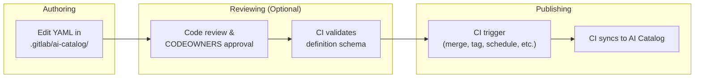
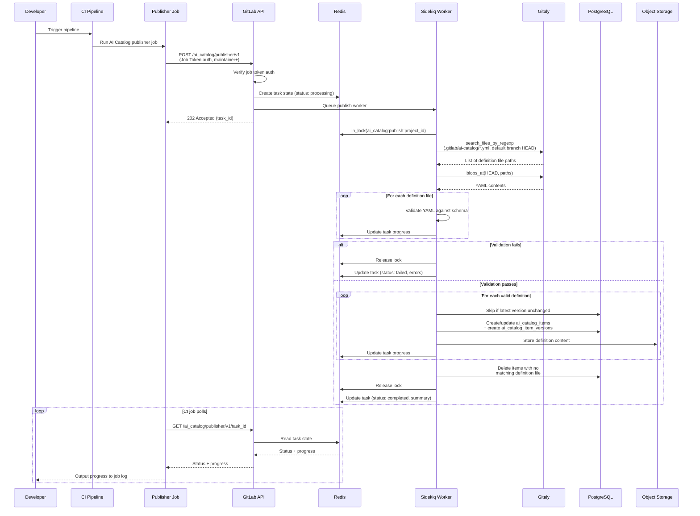



## Introduction

このドキュメントでは、AI Catalog アイテム定義のオーサリングを、現在のデータベースベースのアプローチから、定義を git リポジトリ内の YAML ファイルとしてオーサリングし CI パイプラインを通じて公開するリポジトリベースのアプローチへ移行することを評価します。

この評価は [issue #587714](https://gitlab.com/gitlab-org/gitlab/-/issues/587714) を契機としており、リポジトリベースと DB ベースのオーサリングを恒久的な代替手段として両方サポートするのではなく、DB ベースの定義オーサリングを完全に置き換えることを評価するというプロダクトの方向性に従っています。

この評価では、リポジトリベースのパターンを採用することが AI Catalog にとってメリットがあるかどうか、移行パスがどのようなものになるか、どのようなトレードオフが伴うかを評価します。

### Motivation

CI/CD Catalog では、コンポーネント定義が git リポジトリに置かれ CI/CD Catalog に公開されるというリポジトリオーサリングが成功裏に使われています。このパターンは次のものを提供します。

- **ガバナンスと監査可能性**: リポジトリベースの定義は、既存の GitLab の機能を通じて CODEOWNERS ルール、マージ承認ポリシー、保護ブランチ、バージョン履歴を実現します。
- **マージリクエストを通じたコラボレーション**: 定義の変更は標準的な MR ワークフローを通すことができ、公開前のコードレビュー、ディスカッション、承認を可能にします。

### Scope

このドキュメントは次の内容を扱います。

- AI Catalog 定義に提案されるリポジトリベースのオーサリングと公開ワークフロー
- CI/CD Catalog との類似点と相違点
- カスタム（ユーザー作成）アイテムのための段階的な移行パス
- 技術面・プロダクト面のリスク、制限、未解決の課題

## Current Architecture

現在の AI Catalog アーキテクチャは [AI Catalog Architecture Design Document](../ai_catalog/_index.md) に記載されています。

そのドキュメントのうち、本提案に関連する要点は次のとおりです。

- アイテムタイプは agents、flows、external agents の 3 つがあります。
- アイテム定義は UI と GraphQL API を通じてオーサリングされ、`ai_catalog_item_versions.definition` に JSONB として保存されます。なお、ストレージは [issue #591638](https://gitlab.com/gitlab-org/gitlab/-/work_items/591638) で Object Storage に変更される予定です。
- Foundational なアイテムは GitLab に同梱されて出荷されます。

## Proposed Architecture

### Principle

アイテム定義は git リポジトリ内の YAML ファイルとしてオーサリングされ、現在の UI および GraphQL ベースのオーサリング面を置き換えます。公開時には、定義がリポジトリから抽出され、ランタイムアクセスのために Object Storage に保存されます（[issue #591638](https://gitlab.com/gitlab-org/gitlab/-/work_items/591638) を参照）。git リポジトリが定義の信頼できる唯一の情報源（source of truth）になります。

PostgreSQL は引き続き、カタログのメタデータ、バージョン、有効化（enablement）のためのクエリ可能なストアとして残ります。有効化サブシステム（アイテムのコンシューマーとトリガー）は完全に PostgreSQL に残ります。

Foundational なアイテム定義は git リポジトリには移動されず、代わりに（現在と同じく、モノリスまたは Duo Workflow Service 内のいずれかの）「fixtures」として残ります。

これは、4 つのシステムがそれぞれ異なる役割を果たすことを意味します。

- **Git repository** — 定義のオーサリング面であり、信頼できる唯一の情報源
- **Object Storage** — 定義コンテンツのランタイム読み取り元
- **PostgreSQL** — カタログのメタデータ、バージョンレコード、有効化、検索のためのクエリ可能なストア
- **In-Memory Fixtures** — Foundational なアイテム定義

これは CI/CD Catalog と類似したアーキテクチャパターンに従っており、CI/CD Catalog ではコンポーネント定義がリポジトリに置かれ、クエリを支援するために公開時にメタデータが PostgreSQL に抽出されます。

AI Catalog は CI/CD Catalog とパターンや関心事を共有しますが、モデルやサービスを直接共有することはありません。両ドメインは差異が大きすぎます（organization スコープと project スコープ、3 つのアイテムタイプと 1 つ、CI/CD Catalog に相当するもののない有効化サブシステム）。

次の表は、各アイテムタイプがどのようにオーサリングされ、クエリされ、ランタイムで読み取られるかをまとめたものです。

| Item type | Definition source | Queryable metadata | Definition read from |
| --- | --- | --- | --- |
| **Custom items** (user-created, owned by projects) | YAML files in a git repository | PostgreSQL (unchanged) | Object Storage (unchanged) |
| **Foundational items** (GitLab-maintained, owned by organizations) | Fixtures (unchanged) | PostgreSQL (unchanged) | In-memory Fixtures (partly unchanged) |

### What Moves to Repositories

git リポジトリが定義の信頼できる唯一の情報源となり、オーサリングの手段になります。なお、公開時には定義がリポジトリから抽出され、ランタイムアクセスのために Object Storage に保存されます。これは [#591638](https://gitlab.com/gitlab-org/gitlab/-/work_items/591638) で開発が進められているアプローチに従います。

### What Stays in PostgreSQL

1. **カタログメタデータ**: `ai_catalog_items`（name、description、visibility、verification level）。
1. **バージョンレコード**: `ai_catalog_item_versions` は引き続きリリース済みバージョンを追跡します。なお、リリース間の中間的な変更は git でのみ追跡されるため、git のバージョン履歴がすべての変更の唯一の完全な信頼できる情報源になります。
1. **有効化**: `ai_catalog_item_consumers`、`ai_flow_triggers`、サービスアカウント、foundational なアイテムの有効化（`enabled_foundational_flows`、`*_foundational_agent_statuses`）。
1. **検索とディスカバリー**: 全文検索、フィルタリング、ソート、ページネーション。

### High-level Overview of New Authoring and Publishing Flow

以下は、オーサリングと公開フローへの提案された変更の概要です。

1. オーサリング: 開発者がリポジトリの `.gitlab/ai-catalog/` ディレクトリ内の YAML ファイルを編集してアイテムを定義します。
2. レビュー: 任意のステップで、コードレビューと CODEOWNERS 承認ルールがアイテムのデフォルトブランチへのマージを管理します。
3. 公開: CI パイプラインジョブが定義を AI Catalog に公開します。公開エンドポイントは常にデフォルトブランチの HEAD から読み取るため、ユーザーは公開をトリガーする CI ルールを自由に設定できます。



### Proposed Similarities with CI/CD Catalog

- **リポジトリベースの定義**: ガバナンス機能を可能にします。
- **CI ジョブを通じた公開**: パイプライン UI とジョブログを通じて、公開の進捗とエラーを可視化します。
- **クエリ可能なストアとしての PostgreSQL**: どちらもカタログメタデータ、バージョンレコード、検索インデックス、ディスカバリーに PG を使用します。

### Proposed Differences with CI/CD Catalog

- **プロジェクトごとに複数のアイテム**: CI/CD Catalog はプロジェクトとコンポーネントの 1:1 マッピングを強制します。AI Catalog では、プロジェクトが通常のリポジトリの一部として複数の AI Catalog アイテムを保持できるようにします。
- **通常のプロジェクトリポジトリ内での共存**: AI Catalog 定義は、プロジェクトが Issue テンプレートやマージリクエストテンプレートなど他の GitLab 定義を管理するのと同じ方法で管理され、通常のプロジェクトファイルと共存しやすくなります。カタログへの公開は、プロジェクトのタグ付けやリリースプロセスに干渉することなく行われます。CI/CD Catalog の公開は、コンポーネントを公開するために専用のプロジェクトを作成する必要があるように見えます。
- **タグではなくデフォルトブランチでの CI ジョブによる公開**: CI Catalog は git タグのリリースを通じて公開します。AI Catalog は CI ジョブを通じて公開し、データはデフォルトブランチから読み取られますが、正確なトリガーは標準的な CI ルールを通じて設定可能です。
- **タグから導出されるのではなく YAML で指定されるバージョン**: 各アイテムは自身の YAML 定義ファイルで自身のバージョンを指定します。1 つのプロジェクトには独立したバージョン番号を持つ複数の AI Catalog アイテムを含めることができるため、1 つの git タグですべてを表すことはできません。
- **異なるプロジェクト登録メカニズム**: どちらのカタログも公開前にプロジェクトレベルでのオプトインが必要です。CI/CD Catalog はプロジェクトごとに専用の `catalog_resources` レコードを使用し、これがプロジェクトのコンポーネントをグループ化する閲覧可能なカタログエントリとしても機能します。AI Catalog にはこれに相当するプロジェクトレベルのラッパーがなく、各アイテムが独立して閲覧可能なため、オプトインは単なるプロジェクト設定（`ai_catalog_publishing_enabled`）です。

### Project Requirements

リポジトリベースの AI Catalog アイテムを公開するには、プロジェクトに次の 3 つが必要です。

1. プロジェクト設定で AI Catalog の公開が有効になっていること。これはプロジェクトレベルでの明示的なオプトインであり、誤った公開を防ぎます（[Why a project setting?](#why-a-project-setting) を参照）。
1. リポジトリの `.gitlab/ai-catalog/` 配下のアイテム定義ファイル。
1. `.gitlab-ci.yml` の設定。GitLab.com のお客様向けには CI コンポーネントでこれを抽象化できます。Self-Managed および Dedicated では、ドキュメントからコピーできる、より冗長な設定が必要になります。

#### Why a project setting?

プロジェクト設定は、リポジトリのフォークには引き継がれない明示的なオプトインとして機能し、フォークが誤ってカタログに公開してしまうのを防ぎます。

この設定は、プロジェクト設定 UI または API を通じて、maintainer 以上の権限を持つユーザーが設定できます。

### Definition Files

#### Naming structure

AI Catalog 定義は `.gitlab/ai-catalog/` ディレクトリ配下に置かれ、GitLab のプロジェクトレベルの機能設定に `.gitlab/` を使用するという確立された慣例（現在は Issue テンプレートやマージリクエストテンプレートで使用）に従います。

`.gitlab/ai-catalog/` 配下の各 YAML ファイルは個別のカタログアイテムを表し、1 つのプロジェクトで複数のアイテムを管理・公開できるようにします。

任意の深さのサブディレクトリがサポートされ、チームが定義を整理し、ディレクトリレベルで CODEOWNERS ルールを適用できるようになります。例:

```plaintext
.gitlab/ai-catalog/
  team-alpha/
    agents/
      code-assistant.yml
    flows/
      review-flow.yml
  team-beta/
    agents/
      security-scanner.yml
```

次のような CODEOWNERS ルールを可能にします。

```plaintext
.gitlab/ai-catalog/team-alpha/ @team-alpha-leads
.gitlab/ai-catalog/team-beta/ @team-beta-leads
```

アイテムタイプ（agent、flow、external agent）は、ディレクトリ構造から推測されるのではなく、YAML ファイル内のプロパティとして指定されます。

Gitaly の `SearchFilesByName` RPC は任意の深さでのファイルマッチングをサポートしているため、すべての定義ファイルを 1 回の呼び出しで取得でき、大きな結果セットに対するページネーションもサポートされます。

#### YAML metadata

すべてのアイテムタイプの YAML 定義は、`catalog_metadata` キーによって config から分離された同じメタデータを含みます。

```yaml
catalog_metadata:
  id: code-assistant
  name: Code Assistant
  description: Helps developers write, review, and refactor code
  type: agent # agent | flow | external_agent
  lifecycle: released # draft | released | deleted
  visibility: public # public | private
  version: 1.2.0
# ... agent, flow, or external agent definition follows
```

##### `id`

- Type: String
- Required

アイテムの安定した識別子で、プロジェクトごとに一意である必要があります。

`id` は、ファイルのパスや名前に関係なく、公開時に定義ファイルを既存の `ai_catalog_items` レコードにマッチさせるために使用されます。
アイテムの `id` はファイルの再編成後も維持されるため、ファイルのリネームや移動を安全に行えます。

[validation](#api-endpoints) は、同じプロジェクト内の 2 つのファイルが同じ `id` を共有している場合にエラーになります。

ある `id` でアイテムが公開された後にそれを変更すると、新しいアイテムの作成として扱われ、古いアイテムは削除されます。

##### `name`, `description`

- Type: String
- Required

`Ai::Catalog::Item` の同じプロパティに直接マッピングされます。

##### `type`

- Type: Enum (`agent, flow, external_agent`)
- Required

AI Catalog アイテムのタイプ。

##### `lifecycle`

- Type: Enum (`draft, released, deleted`)
- Optional. Default: `released`

カタログ内でのアイテムの draft から released への状態を制御します（現在 AI Catalog ではバックエンドのみでサポート）。

`lifecycle: deleted` の状態は、アイテム定義を削除する代わりの削除方法を可能にし、YAML ファイル内のプロパティ変更として表現され、ファイルを監査証跡としてリポジトリに残します。

拡張可能であるため、将来的には `archived` や `deprecated` などの追加の状態をサポートできます。

##### `visibility`

- Type: Enum (`public, private`)
- Optional. Default: `private`.

既存の `Ai::Catalog::Item#public` ブール値を制御しますが、将来的に `internal` のようなオプションをサポートできるよう拡張性を持たせています。

##### `version`

- Type: String in SemVer format
- Optional

`Ai::Catalog::ItemVersion#version` に対する既存のルールに従います。

指定がない場合、公開時にリリースをマイナーバージョンでインクリメントするため、お客様は AI Catalog にバージョン管理を任せることができます。

### Validation and publishing

検証と公開の操作は API エンドポイントを通じて公開され、CI ジョブを通じてトリガーされます。

#### Publishing Guardrails

公開エンドポイントは、ガバナンス制御が尊重されるよう、いくつかのガードレールを強制します。

1. **プロジェクト設定が有効**: プロジェクトの設定で AI Catalog の公開が有効になっている必要があります。
1. **デフォルトブランチのみ**: 公開エンドポイントは、どのブランチがパイプラインをトリガーしたかに関係なく、常にプロジェクトのデフォルトブランチの HEAD から定義ファイルを読み取ります。これにより、プロジェクトのレビューと承認プロセスを通過したコンテンツのみが公開されるようになります（[Configurable Publishing Branch](#configurable-publishing-branch) に関する未解決の課題も参照）。
1. **ジョブトークン認証のみ**: 公開エンドポイントは CI ジョブトークンを必要とします。PAT、OAuth、その他の認証方法ではトリガーできません。これにより、公開は常に CI パイプラインを通じて行われるようになります。
1. **maintainer 以上の権限**: ジョブトークンのユーザーは、プロジェクトで maintainer 以上のロールを持っている必要があります。
1. **公開前の検証**: すべての定義はスキーマに対して検証され、レコードが作成される前に参照が解決されます。検証が 1 つでも失敗すると公開は中止されます。
1. **排他的リースロック**: 1 プロジェクトにつき一度に 1 つの公開のみ実行でき、競合状態を防ぎます。

これらのガードレールは、ユーザーが公開をトリガーする CI ルールを自由に設定できる（マージ時、タグ時、スケジュール時、手動）ことを意味します。エンドポイントは公開される *内容（what）* を強制するのであって、*タイミング（when）* を強制するものではありません。

検証エンドポイントは意図的に制限を緩くしています。パイプラインのブランチ（デフォルトブランチではない）から読み取り、developer 以上のアクセスのみを必要とし、どのパイプラインからでも呼び出せます。これにより、MR パイプラインがマージ前に提案された変更を検証できます。

#### CI Configuration

AI Catalog アイテムの検証と公開は CI ジョブを通じて行われます。

公開イベントは標準的な CI ルールを通じて設定可能です。デフォルトブランチへのマージが推奨されるデフォルトのトリガーになり得ます。

検証は公開とは独立して実行でき、アイテムのスキーマが有効かどうかについて MR パイプラインでフィードバックを得られます。

##### CI Component (GitLab.com only)

GitLab.com のお客様向けに、CI 設定を抽象化し設定可能な入力を許可する CI コンポーネントを作成できます。例:

```yaml
include:
  - component: gitlab.com/gitlab-org/ai-catalog-publisher@1.0.0
  - component: gitlab.com/gitlab-org/ai-catalog-validator@1.0.0
```

カスタマイズした使用例:

```yaml
include:
  - component: gitlab.com/gitlab-org/ai-catalog-publisher@1.0.0
    inputs:
      publish_on: tag # publish on tag instead of default branch
```

##### Full CI configuration

このオプションは、Self-Managed および Dedicated のお客様が利用できる唯一の選択肢になります。

次の用途の CI 設定の例です。

- すべての MR パイプラインで検証し、マージ前に検証フィードバックを得られるようにする。
- デフォルトブランチへのマージ後に公開する。

```yaml
stages:
  - test
  - deploy
.ai_catalog_polling_script: &ai_catalog_polling_script
  - |
    RESPONSE=$(curl --fail --silent --request POST \
      --header "JOB-TOKEN: $CI_JOB_TOKEN" \
      "${CI_API_V4_URL}/projects/${CI_PROJECT_ID}/ai_catalog/${ENDPOINT}")
    TASK_ID=$(echo "$RESPONSE" | jq -r '.task_id')
    echo "${ENDPOINT} initiated. Task ID: $TASK_ID"
    TIMEOUT=${TIMEOUT:-300}
    INTERVAL=${INTERVAL:-5}
    ELAPSED=0
    while [ $ELAPSED -lt $TIMEOUT ]; do
      STATUS_RESPONSE=$(curl --fail --silent --request GET \
        --header "JOB-TOKEN: $CI_JOB_TOKEN" \
        "${CI_API_V4_URL}/projects/${CI_PROJECT_ID}/ai_catalog/${ENDPOINT}/${TASK_ID}")
      STATUS=$(echo "$STATUS_RESPONSE" | jq -r '.status')
      PROGRESS=$(echo "$STATUS_RESPONSE" | jq -r '.progress // empty')
      if [ -n "$PROGRESS" ]; then
        echo "$PROGRESS"
      fi
      if [ "$STATUS" = "completed" ]; then
        echo "$(echo "$STATUS_RESPONSE" | jq -r '.summary')"
        exit 0
      elif [ "$STATUS" = "failed" ]; then
        echo "$(echo "$STATUS_RESPONSE" | jq -r '.errors')"
        exit 1
      fi
      sleep $INTERVAL
      ELAPSED=$((ELAPSED + INTERVAL))
    done
    echo "${ENDPOINT} timed out after ${TIMEOUT}s"
    exit 1
ai-catalog-validate:
  stage: test
  variables:
    ENDPOINT: validator/v1
    INTERVAL: 3
  rules:
    - if: $CI_PIPELINE_SOURCE == "merge_request_event"
      changes:
        - .gitlab/ai-catalog/**/*
  script: *ai_catalog_polling_script
ai-catalog-publish:
  stage: deploy
  variables:
    ENDPOINT: publisher/v1
    INTERVAL: 5
  rules:
    - if: $CI_COMMIT_BRANCH == $CI_DEFAULT_BRANCH
      changes:
        - .gitlab/ai-catalog/**/*
  script: *ai_catalog_polling_script
```

CI ジョブを使用することは次を意味します。

- **失敗の可視化**: 同期エラーは失敗したパイプラインジョブとして表示され、ユーザーが確認できるログが残ります。
- **ユーザーによる制御**: 標準的な CI ルールで公開がいつ実行されるかを制御できます。

未解決の課題 [Validation Error and Syncing Progress UI](#validation-error-and-syncing-progress-ui) では、公開と同期の進捗を管理するアプリの専用部分という代替案を説明しています。これは、はるかに大きなエンジニアリング投資というコストと引き換えに、CI ジョブの必要性をなくすものです。

#### API Endpoints

検証と公開のロジックは API エンドポイントにカプセル化されます。

1. CI コンポーネント（GitLab.com 向け）は、エンドポイントを呼び出すだけの薄いラッパーになります。
2. Self-Managed および Dedicated のお客様は、インラインの CI ジョブ定義から同じエンドポイントを呼び出せます。
3. コアロジック（ファイルの発見、スキーマ検証、PG レコードの作成）は CI 設定そのものではなく Rails サービス内に置かれます。これにより、Self-Managed および Dedicated で最小限の CI 設定が可能になります。

検証と公開はどちらも非同期で処理され、多くのアイテムを持つプロジェクトでも API のタイムアウトのリスクなしに処理し、CI ジョブログで段階的なフィードバックを提供します。

エンドポイントは後方互換性のためにバージョン管理され（例: `v1`）、古い統合を壊すことなくエンドポイントの動作やレスポンスを時間をかけて進化させられます。

- `POST /api/v4/projects/:id/ai_catalog/validator/v1` — 非同期検証を開始
- `GET /api/v4/projects/:id/ai_catalog/validator/v1/:task_id` — 検証ステータスをポーリング
- `POST /api/v4/projects/:id/ai_catalog/publisher/v1` — 非同期公開を開始
- `GET /api/v4/projects/:id/ai_catalog/publisher/v1/:task_id` — 公開ステータスをポーリング

##### Async Processing Model

両エンドポイントは同じ非同期パターンに従います。

1. **開始（Initiate）**: `POST` リクエストがリクエストパラメータを検証し、バックグラウンドジョブをキューに入れ、TTL 付きで `Redis::SharedState` にタスク状態レコードを作成し、`task_id` を即座に返します。
2. **処理（Process）**: Sidekiq ワーカーが作業を実行し、進行に応じて Redis のタスク状態を進捗で更新します。Sidekiq ワーカーは冪等であり、失敗後の再試行を許可します。
3. **ポーリング（Poll）**: CI ジョブが対応する `GET` エンドポイントを一定間隔でポーリングします。各レスポンスには現在のステータス（`processing`、`completed`、`failed`）と、CI ジョブがログに出力する進捗メッセージが含まれます。
4. **完了（Complete）**: `completed` または `failed` になると、CI ジョブは適切なステータスコードで終了します。

このアプローチは次を意味します。

- **タイムアウトのリスクなし** — 最初の API リクエストは即座に返り、重い作業はバックグラウンドワーカーで行われます。
- **豊富な進捗出力** — CI ジョブログには、長い待機の後に 1 つのサマリーが表示されるのではなく、アイテムが処理されるにつれて検証・公開される様子が表示されます。
- **API ノードからの作業のオフロード** — 処理は API リクエストのライフサイクルではなく Sidekiq ワーカーで行われます。

##### Validate

ジョブトークンから推測されるパイプラインのブランチから定義ファイルを読み取り、スキーマと参照解決を検証し、エラーを報告します。
どの MR パイプラインからでも安全に呼び出せ、マージ前に提案された変更についてのフィードバックを得られます。

**権限**: プロジェクトの設定で AI Catalog の公開が有効になっている必要があります。プロジェクトの developer 以上であれば誰でも可。権限はジョブトークンである必要はなく、通常の API 操作を通じて呼び出せます。

##### Publish

検証を行い、さらに PG レコードを作成・更新し、定義を Object Storage に保存します。

公開は、どのブランチがパイプラインをトリガーしたかに関係なく、常にプロジェクトのデフォルトブランチの HEAD から定義ファイルを読み取ります（[Publishing Guardrails](#publishing-guardrails) を参照）。ユーザーは公開をトリガーする CI ルールを自由に設定できますが（マージ時、タグ時、スケジュール時、手動）、公開はデフォルトブランチからのみ行われることを考慮する必要があります。

**権限**: プロジェクトの設定で AI Catalog の公開が有効になっている必要があります。認証は（CI ジョブからの）ジョブトークンである必要があり、ジョブトークンのユーザーは maintainer 以上である必要があります。`task_id` パラメータは、以前に同じプロジェクトが所有していた状態と一致する必要があります。

##### Optional arguments

これらは後で両エンドポイントに追加できます。

- アイテムへの更新をアトミックとして扱うかどうか。`atomic: true` の場合、更新はトランザクション内で行われ、すべての更新が成功するか失敗するかのいずれかになります。`atomic: false` の場合、一部の更新が成功し一部が失敗することがあります。デフォルト: `atomic: false`。
- リース設定: `lease_wait` と `lease_retry`。

##### Validation rules

検証フェーズ（両エンドポイントで共有）は、次の場合に失敗します。

1. 同じプロジェクト内の 2 つのファイルが同じ `id` を宣言している。
1. アイテムスキーマが無効、または ActiveRecord モデルが無効である。

検証が失敗すると、タスクのステータスは `failed` になります。ジョブは失敗し、エラーはジョブログで確認できます。

##### Publish steps

バックグラウンドワーカーが公開を処理するとき:

1. まず検証が実行され、失敗があればジョブを失敗させます。
1. 排他的リースロックが取得され、同じプロジェクトに対して複数の公開が同時に行われないようにします。リースの待機時間と再試行は十分に余裕を持たせます。最終的に失敗すると CI ジョブが失敗するためです。リースロックの期間と再試行は、エンドポイントへの引数の指定を通じてお客様が設定できるようにできます。
1. 定義ファイルは、どのブランチがパイプラインをトリガーしたかに関係なく、常にプロジェクトのデフォルトブランチの HEAD から読み込まれます（[Publishing Guardrails](#publishing-guardrails) を参照）。
1. 定義ファイルは `Repository#search_files_by_regexp` を使って読み込まれます。これは、特定の ref で git ツリーをスキャンし、正規表現にマッチするすべてのパスを返す単一の Gitaly RPC です。これは CI/CD Catalog が `templates/` 配下のコンポーネントファイルを発見するために使用するのと同じメカニズムです。
1. YAML 定義はスキーマに対して検証されます。
1. `ai_catalog_items` レコードが作成または更新され、新しいバージョンに対して `ai_catalog_item_versions` レコードが作成されます。publisher は、YAML 定義内の `id` を `internal_id` プロパティにマッピングし、プロジェクトにスコープして既存の `ai_catalog_items` レコードにマッチさせます。マッチがなければ新しいアイテムが作成されます。定義が最新バージョンから変更されていなければ、アイテムはスキップされます。
1. レコードが削除されます。リポジトリに対応する定義ファイルがない既存のプロジェクトの AI Catalog アイテムは削除されます。これは破壊的な操作であるため、まずリポジトリからすべての定義ファイルを正常に読み込めていることに注意を払う必要があります。アイテムが（ハード削除ではなく）ソフト削除されるとき、プロジェクトが同じ識別子を新しいアイテムに再利用できるよう、その `internal_id` の設定を解除したい場合があります。

#### Publishing Flow



#### Data Mapping

公開時に、PostgreSQL レコードのデータがマッピングされます。

| `ai_catalog_items` column | Source |
| --- | --- |
| `name` | YAML definition file |
| `description` | YAML definition file |
| `item_type` | YAML definition file (`type` property) |
| `public` | YAML definition file (`visibility` property) |
| `project_id` | The repository's project |
| `organization_id` | The project's organization |
| `internal_id` | YAML definition file (`id` property). Stable identifier used to map the definition YAML to the record, uniquely scoped to item and project. |
| `verification_level` | The project's namespace verified status |

| `ai_catalog_item_versions` column | Source |
| --- | --- |
| `version` | YAML definition file (optional, must be valid semver greater than current version). Defaults to a minor bump from the latest version if absent. |
| `release_date` | Timestamp of the publish event when lifecycle becomes `released` |
| `commit_sha` | The SHA of the commit read from during the publish (stored for auditability, but not used) |
| `created_by_id` | The job token user |

### Foundational Items

Foundational なアイテムは、GitLab がメンテナンスする、ユーザーがオーサリングしないカタログアイテムです。カスタムアイテムとは異なり、プロジェクトではなく organization に属するため、リポジトリベースにすることはできません。バージョン管理されず、GitLab に同梱されて出荷される必要があります。

Foundational なアイテムは、引き続きモノリスに同梱される fixtures として定義をメンテナンスします。これは、定義がすでにコードベースに由来している現在のパターンと一貫しています。

Foundational なアイテムのアーキテクチャは [#590241](https://gitlab.com/gitlab-org/gitlab/-/work_items/590241) で活発に議論されていますが、この設計ドキュメントの目的上、それらのデータソースは fixtures であると考えることができます。

## Custom Agent Definition YAML

flows や external agents とは異なり、カスタム agents は現在 YAML として定義されておらず、提案された YAML 構文を必要とします。

agent 定義は現在、組み込みツールや MCP サーバーを内部識別子で参照しています。

- **組み込みツール（Built-in tools）** — 整数 ID で参照され（例: `"tools": [1, 3, 10, 39]`）、`Ai::Catalog::BuiltInTool` fixtures にマッピングされます。
- **MCP ツール（MCP tools）** — 文字列名で参照され（例: `"mcp_tool_names": ["search"]`）、インメモリの `Ai::Catalog::McpTool` レコードにマッピングされます。
- **MCP サーバー（MCP servers）** — 整数のデータベース ID で参照され（例: `"mcp_servers": [42, 57]`）、`ai_catalog_mcp_servers` の行にマッピングされます。

整数のデータベース ID は YAML 定義ファイルでは実用的ではありません。コードレビューにおいて意味的な意味を持たず（本提案のコラボレーションとガバナンスの目標を損ないます）。YAML 内の参照は、人間が読めて自己文書化されているべきです。

上記 3 つのタイプはすべて、YAML 定義では人間が読める名前で参照されるべきです。

```yaml
tools:
  - gitlab_blob_search/1.0.0
  - gitlab_create_merge_request/1.0.0
mcp_tool_names:
  - search/1.0.0
mcp_servers:
  - jira_cloud/1.0.0
  - slack/1.0.0
```

上記のいずれも現在はバージョン管理されていません。バージョンのサフィックス（`/1.0.0`）は将来の互換性のために含まれており、YAML フォーマットの変更を必要とすることなくこれらの関連付けのバージョン管理を導入できるようにしています。

**組み込みツール（built-in tools）** については、これは単純です。`BuiltInTool` にはすでに、一意かつ安定した `name` フィールド（例: `"gitlab_blob_search"`）があります。

**MCP ツール（MCP tools）** については、これはすでに現在の動作です。今日でも文字列名で参照されています。

**MCP サーバー（MCP servers）** については、これは解決メカニズムを必要とします。MCP サーバーは organization スコープのデータベースレコード（`ai_catalog_mcp_servers`）です。現在は `name` フィールドを持っていますが、これは人間が読むためのものです。

新しい `internal_id` カラムを一意性制約とともに追加し、`name` は表示専用フィールドとして保持します。これにより、人間が読めるラベルとマシン参照が分離されます。

`internal_id` は、一度選択されたら変更すると関連付けが壊れるため、不変である必要があります。

公開フェーズ中に、YAML 内の名前ベースの参照は、アイテムの organization 内の `ai_catalog_mcp_servers` に対して内部識別子に解決されます。

agent YAML の例:

```yaml
catalog_metadata:
  id: code-assistant
  name: Code Assistant
  description: Helps developers write, review, and refactor code
  type: agent
  lifecycle: released
  visibility: public
  version: 1.2.0
system_prompt: |
  You are a senior software engineer assistant. You help developers
  write clean, well-tested code following the project's conventions.
  Always explain your reasoning and suggest tests for any changes.
tools:
  - gitlab_blob_search/1.0.0
  - gitlab_create_merge_request/1.0.0
mcp_tool_names:
  - search/1.0.0
mcp_servers:
  - jira_cloud/1.0.0
  - slack/1.0.0
```

## Migration Phases

カスタムアイテムは、プロジェクトが所有するユーザー作成のカタログアイテムです。リポジトリベースの定義への移行は、オーサリング面を GraphQL ミューテーションと UI フォームから、プロジェクトのリポジトリ内の YAML ファイルへ移します。

3 つのカスタムアイテムタイプ（agents、flows、external agents）すべてがこの移行の対象です。

必須のフェーズが 2 つあります。

1. **Phase 1: 新しいアーキテクチャの追加**
2. **Phase 2: 新規アイテムのリポジトリベース作成への切り替え**

任意のフェーズが 2 つあります。

1. **Phase 3: 移行パスの提供**: 既存の DB ベースのアイテムをリポジトリベースに変換できます。
2. **Phase 4: データベースベースの方式の完全な非推奨化と削除**

### Phase 1: Add New Architecture

このフェーズの終わりには、プロジェクトはリポジトリを通じて AI Catalog への公開を開始できるようになります。既存の DB ベースのアイテム（`source: database`）は、現在の GraphQL ミューテーションを通じて引き続き機能します。どちらのタイプもカタログに表示され、同じファインダーと GraphQL API を通じてクエリ可能になります。

#### Work Streams

**1. スキーママイグレーション**

リポジトリベースのアイテムをサポートするために新しいカラムを追加します。

| Change | Detail |
| --- | --- |
| New column: `project_settings.ai_catalog_publishing_enabled` | Boolean, default `false`. [Project-level opt-in](#why-a-project-setting) for publishing to the AI Catalog. |
| New column: `ai_catalog_items.source` | Enum: `database`, `repository`, `fixture`. Identifies where the item's definition originates from and how it is authored. |
| New column: `ai_catalog_items.internal_id` | Stable identifier from YAML `id` field, unique within project |
| New column: `ai_catalog_items.foundational_item_ref` | Stable identifier mapping to fixture (generalizes `foundational_flow_reference`) |
| New column: `ai_catalog_item_versions.commit_sha` | Repository SHA of item version at publish (stored for auditability, but not used) |
| New column: `ai_catalog_mcp_servers.internal_id` | Immutable identifier for YAML references |

**2. agent YAML 定義スキーマ**

カスタム agents のための YAML スキーマを設計・実装します。flows と external agents はすでに YAML 定義を持っています。agents は現在、UI フォームを通じてオーサリングされる構造化された JSON フォーマットのみを持っています。これには、組み込みツール、MCP ツール、MCP サーバーのための、人間が読める参照フォーマットの確立が含まれます。

詳細は [Custom Agent Definition YAML](#custom-agent-definition-yaml) を参照してください。

**3. 公開 API とサービス層**

コアとなる公開インフラを構築します（[API Endpoints](#api-endpoints) を参照）。

- バージョン管理された REST エンドポイント（`POST .../validator/v1`、`GET .../validator/v1/:task_id`、`POST .../publisher/v1`、`GET .../publisher/v1/:task_id`）
- 検証と公開タスクの非同期処理のための Sidekiq ワーカー
- TTL 付きの `Gitlab::Redis::SharedState` を通じたタスク状態の追跡。Ruby クラス（例: `Ai::Catalog::PublishTaskState`）が、タスクの進捗、ステータス、エラーを Redis に読み書きします。タスク状態は一時的で自動的に期限切れになるため、データベーステーブルは不要です。
- Gitaly を通じたファイルの発見（`search_files_by_regexp`）、YAML パース、スキーマ検証、agent ツールおよび MCP 名の[参照解決](#custom-agent-definition-yaml)のための Rails サービス
- レコードの作成・更新ロジック: `ai_catalog_items` および `ai_catalog_item_versions` レコードの作成または更新

**4. Publisher CI コンポーネント**

GitLab.com のお客様向けに、REST エンドポイントとポーリングロジックをラップする CI/CD Catalog コンポーネントを構築・公開します。Self-Managed および Dedicated のお客様向けには、インラインの CI ジョブ設定を文書化します。

**5. アイテムの複製**

現在、アイテムの複製はフロントエンドのみのアクションです。フォームにソースアイテムのデータが事前入力され、ユーザーがそれを新しいアイテムとして送信します。リポジトリベースのオーサリングでは、複製はプロジェクトリポジトリへの書き込みを必要とします。

提案されるフロー:

1. ユーザーが既存のアイテムから複製を開始し、ターゲットプロジェクトを選択します。ターゲットはソースプロジェクト自身でも、同じ organization 内の他の任意のプロジェクトでもかまいません。
1. システムがターゲットプロジェクトのリポジトリに新しいブランチを作成します。
1. 複製された YAML 定義がブランチに書き込まれます。ターゲットプロジェクトのリポジトリ内ですべての `id` の値が一意になるようにします。これはパフォーマンスに優れています。単一の Gitaly 呼び出しがターゲットプロジェクトのすべての定義ファイルを読み込みます。これは公開で使われるのと同じメカニズムです。重複があれば、一意の `id` を生成できます（例: ソースの `id` に `-copy` を追加し、必要に応じてインクリメントする）。
1. マージリクエストが自動的に開かれ、ユーザーがマージ前にレビューできます。
1. マージ時に、プロジェクトの既存の公開 CI 設定が残りを処理します。

この作業は、Web ノードから負荷を取り除くために非同期で行われます。
複製が完了したときにユーザーに通知する必要があります。例:

1. 複製が完了したときに AI Catalog 内にトースト通知を表示する。
1. MR が開かれたときに Todo を生成する。

よりシンプルな初期イテレーションとして、複製された定義をファイルとしてユーザーに提供する「download YAML」アクションを提供し、ユーザーが自分でプロジェクトリポジトリにコミットするようにすることもできます。これは自動 MR の利便性は失われますが、エンジニアリング作業が少なく、先に出荷できます。

### Phase 2: Switch to Repo-Backed Creation for New Items

すべての新規アイテムがリポジトリベースのアイテムとしてのみ作成されることを強制します。

- DB ベースのアイテムの作成 UI を削除する
- GraphQL の作成ミューテーションをブロックする
- 既存のデータベースベースのアイテムに対してのみ、更新 UI と GraphQL ミューテーションを引き続き許可する

### Phase 3 (Optional): Provide a Migration Pathway

PostgreSQL ベースからリポジトリベースへアイテムを移す、UI ベースの移行を提供できます。

- ユーザーによって開始され、所有者プロジェクトのリポジトリに、アイテムを YAML ファイルとして含む MR を開きます。Duo が `.gitlab-ci.yml` の修正を支援できます。
- マージ時に、同期がファイルを取り込み、アイテムの `source` が `database` から `repository` に切り替わります。

アイテムがリポジトリベースになると、定義を更新するための既存の UI および GraphQL ミューテーションはロックアウトされます。

### Phase 4 (Optional): Full Deprecation and Removal of Database-backed method

移行はお客様のリポジトリへの書き込みを必要とするため、アップグレードを簡単に強制することはできません。
リスクの [Ongoing Legacy Support](#ongoing-legacy-support) を参照してください。

最終的には、告知された非推奨期間の後に、UI および GraphQL ミューテーションを通じてレガシーな DB ベースのアイテムを更新する機能をロックアウトし、ユーザーに移行を強制できます。これは、これらのお客様にとって現在のオーサリングワークフローへの破壊的変更になります。

## Migration: Foundational Items

Foundational なアイテムはすでに fixture ベースです。それらの定義は、ユーザー入力ではなくコードベースに由来します。移行パスはカスタムアイテムよりもシンプルです。データベースからリポジトリへ移行すべき、ユーザーがオーサリングしたデータがないためです。

主な変更点は次のとおりです。

1. **PostgreSQL での定義キャッシュの削除** — 現在、external agents はその定義が `ai_catalog_item_versions.definition` に JSONB としてシードされています。提案されたアーキテクチャでは、定義はランタイムに fixtures から直接読み取られるため、foundational なアイテムについてはこのカラムは設定されなくなります。

2. **PostgreSQL でのカタログメタデータの保持** — `ai_catalog_items` レコードは引き続きシードされ（name、description、item type、verification level）、foundational なアイテムがカタログ内で引き続きクエリ可能・発見可能であり続けます。

3. **fixture 参照の記録** — `ai_catalog_items` の `foundational_item_ref` カラムが、各データベースレコードをその fixture 定義にマッピングする安定した識別子を提供します。これは既存の `foundational_flow_reference` カラム（現在は foundational flows のみで使用）を一般化し、すべての foundational なアイテムタイプをカバーします。

foundational なアイテムへのさらなるアーキテクチャ変更（有効化パターンの統一など）は範囲外であり、[#590241](https://gitlab.com/gitlab-org/gitlab/-/work_items/590241) で追跡されています。

## Risks

### Significantly Slower Iteration Feedback Loop

**リスクの種類**: プロダクト。

現在の UI は定義の高速なイテレーションを可能にします。編集、保存、テスト、改良を緊密なループで行えます。リポジトリベースのモデルは、はるかに長いフィードバックサイクルを導入します。YAML を編集し、コミットし、プッシュし、デフォルトブランチ（または他の設定されたトリガー）にマージし、publisher ジョブを待ち、それからテストします。

定義が期待どおりに動作しない場合（例: プロンプトのチューニングが必要、またはツールが欠けている）、新しいコミットとマージが必要になります。

オーサーは、アイデアを高速に試すためのテスト用サンドボックスを欠くことになり、アイテムの開発がフラストレーションの溜まる遅い体験になる可能性があります。
これは、複数の高速なイテレーションが典型的である新しいアイテムの初期開発時に特に影響します。

### YAML Validation UX Regression

**リスクの種類**: プロダクト。

現在、ユーザーはアイテム config を作成・更新する際に、即座にフィールドごとの検証エラーを受け取ります。これは、間違いやすい複雑な定義を持つ flows に特に役立ちます。

リポジトリベースのモデルでは、検証は後で行われます。プッシュやマージの後の同期中に行われ、フィードバックが非同期になります。

これは、特に定義スキーマに不慣れなユーザーにとって、意味のある UX のリグレッションです。

緩和策:

- スキーマ対応の検証を備えたエディタツール（[AI Catalog Definition Editor](#ai-catalog-definition-editor) を参照）。

### Agent Editing UX Regression

**リスクの種類**: プロダクト。

ガイド付きの UI から生の YAML 編集への移行は、カスタム agents を定義する上で大きな体験のリグレッションになります。

ユーザーは次の正しい名前を入力する必要があります。

- 組み込みツール
- MCP ツール
- MCP サーバー

そうしないと、同期中に参照解決が失敗します。

agents は現在、プロンプト用の構造化されたフォームフィールドとオートコンプリート駆動のツール選択を備えた、最も UI 駆動のアイテムタイプです。flows と external agents はすでに YAML でオーサリングされているため、これらのタイプではこの移行はそれほど破壊的ではありません。

緩和策:

- スキーマ対応の検証を備えたエディタツール（[AI Catalog Definition Editor](#ai-catalog-definition-editor) を参照）。

### Item Duplication UX Regression

**リスクの種類**: プロダクト。

現在の AI Catalog は、フロントエンドのみのアクションを通じてアイテムの素早い複製を可能にします。フォームにソースアイテムのデータが事前入力され、ユーザーはワンクリックでそれを新しいアイテムとして送信します。

リポジトリベースのモデルでは、複製はターゲットリポジトリへのファイルのコミットを必要とします。ブランチ作成、ファイル書き込み、MR 作成を自動化するツールがあっても、ユーザーは依然として MR をレビューしてマージし、それから複製されたアイテムがカタログに表示されるまで publish ジョブを待つ必要があります。

さらに、まだ AI Catalog の公開を有効にしていない（`.gitlab-ci.yml` 設定がなく、プロジェクト設定も有効でない）プロジェクトへの複製は、マージとしては成功しますが、それらの前提条件が設定されるまでアイテムはカタログに公開されません。複製ツールは MR に `.gitlab-ci.yml` の修正を含めません。CI 設定の追加は大きな複雑さを導入し、ユーザーの既存の CI 設定と競合するリスクがあるためです。

### Workflow Breaking Changes

**リスクの種類**: プロダクト。

[Phase 2](#phase-2-switch-to-repo-backed-creation-for-new-items) は、お客様が UI を通じて新しいアイテムを作成できなくなることを意味します。
すべての新しいカスタムアイテムはリポジトリベースである必要があります。これは意図的な破壊的プロダクト変更になります（[issue 587714](https://gitlab.com/gitlab-org/gitlab/-/work_items/587714#note_3064035412) を参照）。

緩和策:

- Phase 2 を任意にする。

### Sync Visibility for Non-Merge Triggers

**リスクの種類**: プロダクト。

公開が「デフォルトブランチへのマージ」以外のトリガー（例: タグ時、スケジュール時、手動）で行われるよう設定されている場合、定義の変更がデフォルトブランチに到達したものの、まだカタログに公開されていないという期間が存在します。

この期間中:

- オーサーが変更をマージしたものの、公開にさらなるアクション（タグの作成など）が必要であることに気づかない可能性があります。
- リポジトリを閲覧している他のプロジェクトメンバーは、デフォルトブランチ上で新しいまたは更新されたアイテムを見ますが、それがカタログに同期されたのか、同期待ちなのか、同期に失敗したのかを簡単には確認できません。
- 混乱を解消するには、オーサーに尋ねるか、パイプライン履歴を手動で確認する必要があります。

このリスクは、公開とマージを分離するトリガー設定に固有のものです。デフォルトブランチへのマージで公開をトリガーするプロジェクトはこの期間を経験しません。MR がマージ後のパイプラインを通じて同期ステータスを直接表示するためです。

部分的な緩和策:

- 私たちが推奨するデフォルトの CI 設定（GitLab.com の CI コンポーネントのデフォルトを含む）は、デフォルトブランチへのマージで公開をトリガーします。異なるトリガーを選択するプロジェクトはこのトレードオフを受け入れます。

### Ongoing Legacy Support

**リスクの種類**: エンジニアリング。

既存の DB ベースのアイテムに[移行パスを提供](#phase-3-optional-provide-a-migration-pathway)できます。しかし、お客様のリポジトリへの書き込みを伴うため、この移行を強制することはできません。

エンジニアリングは、リポジトリベースでないレガシーなアイテムを、おそらく無期限にサポートし続ける必要があります。

これは、次の点でアーキテクチャに無期限の複雑さを追加します。

- アイテムの更新と削除のための UI と GraphQL ミューテーションの維持
- すべての定義関連機能が両方のコードパスで動作する必要があるため、バグとメンテナンスの対象範囲が増加すること

緩和策:

- [Phase 4 (Optional): Full Deprecation and Removal](#phase-4-optional-full-deprecation-and-removal-of-database-backed-method) を参照してください。

### Atomicity

**リスクの種類**: エンジニアリング。

現在、定義とメタデータの更新は単一の PostgreSQL トランザクション内で行われます。リポジトリベースのモデルでは、公開は git コミットの後に PostgreSQL の更新が続くことになります。コミットが到達した後に PG の更新が失敗すると、システムは、リポジトリには新しい定義があるが PG はまだ古いバージョンを指しているという不整合な状態になります。

部分的な緩和策:

- CI ベースの公開は影響の緩和に役立ちます。PG の更新の失敗は、確認・再試行できる失敗したパイプラインジョブとして表示されます。同期は冪等であるため、ジョブを再実行すれば状態が修正されます。

### Semi-Feature Freeze During Migration Period

**リスクの種類**: プロダクト、エンジニアリング。

移行期間中は、アイテム定義に影響する大きな新機能の追加を避け、代わりに移行の完了に集中するのが望ましいでしょう。

有効化、検索、カタログメタデータのみに触れる機能は影響を受けません。

### Feature Outages From Reliance on New Service: Gitaly

**リスクの種類**: エンジニアリング。

リポジトリベースのアーキテクチャは、公開のために正常な Gitaly サービスへの新しい依存を導入します。

Gitaly のエラーやダウンタイムは、AI Catalog の公開停止を引き起こします。

### CI Compute Minutes Consumption

**リスクの種類**: プロダクト。

現在、アイテムの作成とリリースは無料です。CI ジョブを通じた公開は CI コンピュート分を消費します。影響は最小限と予想されます。publisher ジョブは小さな runner で数秒かかる軽量な API 呼び出しですが、ゼロコストからの変更ではあります。

## Recommendations

### AI Catalog Definition Editor

リポジトリベースの定義への移行は、オーサリングをガイド付き UI から YAML ファイルへ移します。これは、特に agents にとって大きな UX のリグレッションです（[Agent Definition UX Regression](#agent-editing-ux-regression) を参照）。

[CI/CD Pipeline Editor](https://docs.gitlab.com/ci/pipeline_editor/) に類似した AI Catalog 定義エディタに投資できます。このエディタは次を提供します。

- agents 向けのフォームベースの編集（プロンプトフィールド、オートコンプリート付きのツールと MCP サーバーの選択）。背後で有効な YAML を生成します。
- flows と external agents 向けのスキーマ対応の YAML 編集。リアルタイムの検証とエラーのハイライト付き。
- 変更をリポジトリに書き込みマージリクエストを作成する、組み込みのコミットワークフロー。

## Open Questions

### Validation error and syncing progress UI

CI ジョブは、検証エラーをジョブログに表示でき、アイテムの公開の進捗を示せるため便利です。代わりに、公開の進捗、検証、エラーを管理するカスタムアプリに投資することもできます。これは大きなエンジニアリングの労力を追加しますが、CI ジョブの設定の必要性をなくせます。

### Configurable Publishing Branch

公開エンドポイントの提案は、現在デフォルトブランチの HEAD のみからの読み取りを強制しています。代わりに、プロジェクトが公開エンドポイントの読み取り元となる独自のブランチを定義できるようにすべきでしょうか。

これにより、チームは実験やテストの目的でフィーチャーブランチから公開でき、一方でガバナンスを優先するチームは公開をデフォルトブランチのみに制限できます。

### Default when `version` is absent

YAML から `version` フィールドが欠けている場合に提案されるバージョン管理のデフォルトは、リリース時のマイナーバンプです。

ユーザーがデフォルトのバンプレベル（major、minor、patch）を自分で指定できるようにすべきでしょうか。

### Abuse protections

不正利用から保護するために、どのような制限やレート制限を適用すべきでしょうか。
