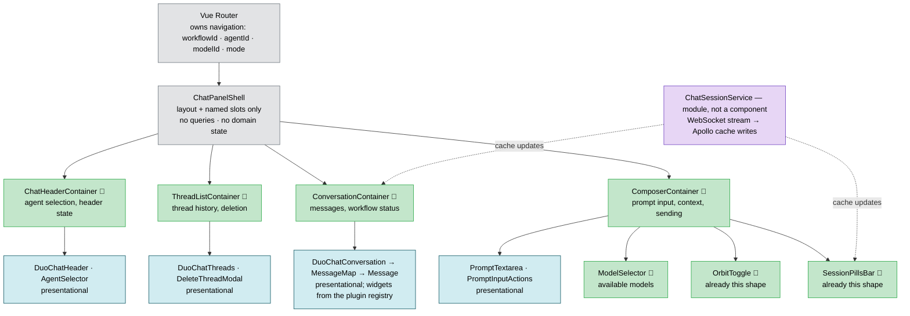
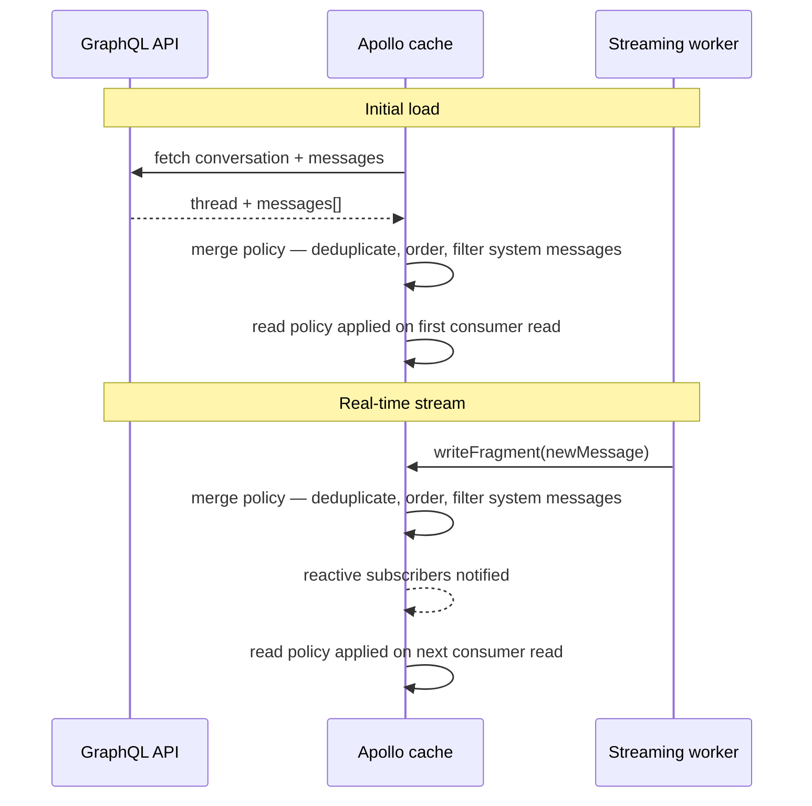
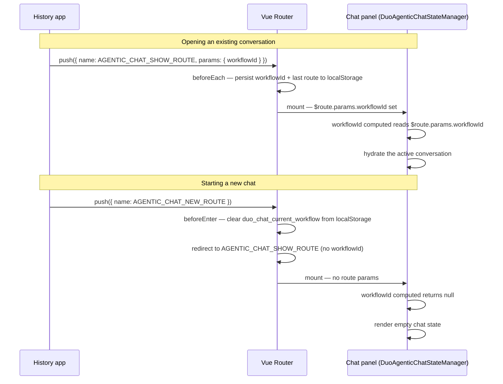
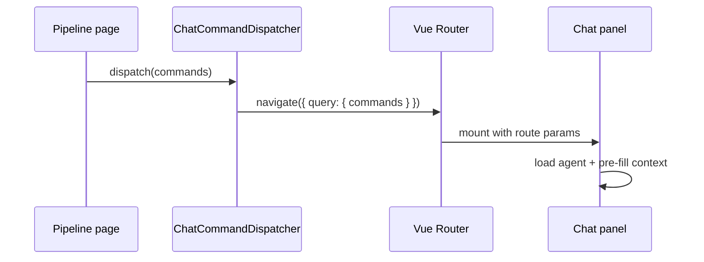



> [!NOTE]
> このブループリントは、**[Duo Agentic Chat](https://docs.gitlab.com/user/gitlab_duo_chat/agentic_chat/) Web クライアントのフロントエンド**のみを対象とします。[Classic（非エージェント型）Chat](https://docs.gitlab.com/user/gitlab_duo_chat/)は別途非推奨化されており、対象外です。Editor Extensions の Chat クライアントも対象外であり、このドキュメントは Web クライアントだけを扱います。

## 動機

このブループリントは、チームの認識を揃えてガードレールを設け、Chat を安定させ、信頼性を高め、今後の作業をより速く構築できるようにするためのものです。このドキュメントは、全員が合意して足並みを揃えられる 1 つのターゲットアーキテクチャという共通の方向性を定めます。これにより、個々の Issue やエピックを孤立してではなく、一貫した計画に照らしてスコープ設定できます。

## 主な問題

> [!NOTE]
> これらは新しい問題ではありません。これまで通常の Issue を通じて個々の症状を修正してきましたが、その修正は断片的でした。根本原因を残したまま 1 つの症状だけを直したり、別の場所に新たな不整合を生んだりすることがよくありました。多くのエンジニアが同時に Duo Chat に取り組むため、共通の方向性がなければ作業が分岐したり重複したりします。

1. **断片化した状態管理。**Chat の状態は多数のストレージシステムに分散しており、信頼できる唯一の情報源がありません。それらが食い違うと、あるビューにはメッセージが表示されても別のビューには表示されない、設定がリセットされる、メッセージが重複・競合するなど、一貫しない動作がユーザーに見えます。データが予測不能な方法で流れるため、バグの再現は困難です。たとえば、2 つのデータストリームが UI の同じ部分を誤った順序で更新したため、「利用可能なクレジットがない」というメッセージが一瞬表示されて消えたことがありました。明確なデータフローパターンがなければ、このような問題をテストで検出することはほぼ不可能です。

2. **テストとオブザーバビリティの不足。**リグレッションを検出する自動テストが不足しており、複数のレイヤーにまたがるバグを追跡するのが困難です。多くのエンジニアが Duo Chat に取り組んでいますが、変更によって別の箇所が壊れることを防ぐガードレールはほとんどありません。データが多数の分断された経路を通るため、小さな表示不具合に見えても複数の状態ソースにまたがる一連のイベントが関係し、根本原因の特定に時間がかかります。スクロールの破損、入力の無反応、メッセージの欠落など、本来テストで検出すべきバグをユーザーが本番環境で見つけることになります。オブザーバビリティも不十分です。エラー監視、利用状況の追跡、ログ集約が一貫して整備されていないため、本番環境の障害や利用パターンを把握しにくくなっています。

3. **限定的な UI 拡張性。**GitLab 全体のチームは、独自のエージェント、ツール、カスタム UI を Chat に簡単に追加できません。明確な拡張ポイントがないため、コアコードを回避するハックを行うか、Chat チームによる変更を待つ必要があり、プラットフォームとしての Duo Chat の成長を遅らせています。

## 目標

1. **統一された状態管理。**Chat の状態を意図的に選んだ 2 つのストアに限定します。サーバー由来およびストリーミングされたすべてのデータの信頼できる唯一の情報源である Apollo キャッシュと、ナビゲーションおよびビュー間で共有される状態の信頼できる唯一の情報源である Vue Router です。ブラウザストレージには、ページの再読み込み後にルーター状態を復元するために必要な最小限の情報だけを永続化します。データフローは予測可能になり、バグを再現できます。
2. **拡張可能なプラグインアーキテクチャ。**他の GitLab チームが Chat のコアコードを変更せずに拡張できるプラットフォームとして Duo Agentic Chat を確立します。チームは、Duo Chat の責任範囲外にある共有レジストリを通じてメッセージウィジェット、空の状態、スラッシュコマンド、アラートを登録し、型付きコマンドを通じて GitLab のどこからでも Chat を開きます。自己完結した拡張機能がコア Chat を不安定にしてはなりません。
3. **オブザーバビリティ。**エラー監視、プロダクト分析、ログ集約を通じて、Chat フロントエンドの本番障害と利用状況を可視化し、それぞれの役割を明確に定義します。新機能には計装を組み込んでリリースします。LLM レベルのトレース（AI Gateway の LangSmith）はバックエンドの関心事であり、このドキュメントの対象外です。
4. **包括的なテストカバレッジ。**どのテスト種別をどこに配置するかについて明確なガイダンスを示すテストガードレールを追加します。インテグレーションテストを主要なリグレッション防止策とし、ユニットテストで分離されたロジックをカバーし、エンドツーエンドテストで CI におけるコアフローを確認します。

> [!NOTE]
> 成功は測定可能です。本番環境に到達するリグレッションバグの減少、新機能の実装時間の短縮、独立してコントリビュートされたプラグインとウィジェット数の増加です。現在、リグレッション率は一貫して追跡されていないため、計装が整った時点でベースラインを記録することが最初の成果物です。その後の進捗は、このドキュメントで推測した数値ではなく、記録されたベースラインに対して測定します。エラー率、ストリーミングの信頼性、機能エンゲージメントという主要な Chat 健全性メトリクスを扱うダッシュボードが、具体的な目標成果です。

## 用語

| 用語 | 定義 |
| ------ | ------------ |
| **ストリーミング** | WebSocket 接続を介して AI のレスポンスをリアルタイムのチャンクで受信し、ユーザーに段階的に表示するプロセス。 |
| **スレッド** | ユーザーと AI アシスタント間の一連のメッセージで構成される 1 つの会話。 |
| **コマンド** | GitLab の任意の場所（パイプラインページのトラブルシューティングボタンなど）からディスパッチされ、Chat コンポーネントの外部から Duo Chat を開いて事前入力する型付き命令。 |
| **プラグイン** | プラグインレジストリを通じてチームが登録する、メッセージウィジェット、空の状態、スラッシュコマンド、アラートから成る自己完結した拡張機能のバンドル。 |
| **メッセージウィジェット** | 特定のメッセージまたはツール種別向けのカスタム UI をレンダリングし、プラグインシステムを通じて登録される自己完結したコンポーネント。 |
| **スラッシュコマンド** | ユーザーが Chat 入力で `/` を入力したとき、候補メニューに表示される、プラグインによって登録されたアクション。 |
| **エージェント** | Chat の応答方法と使用できるツールを決定する AI ペルソナまたは機能セット。 |
| **モデル** | レスポンスの生成に使用する、Claude や GPT などの基盤 AI モデル。 |

## 設計と実装の詳細

### 統一された状態管理（目標 1）

Chat の各状態は二次コピーを持たず、厳密に 1 か所だけに存在します。Vue Router がナビゲーションの信頼できる情報源となり、Apollo キャッシュがサーバー由来のすべての共有状態を所有し、Vuex は使用しません。ブラウザストレージには、再起動後にセッションを復元するために必要な最小限の情報だけを永続化します。Rails ビューの初期化データは、ルーターを介して型付き Vue props として Chat に届き、バックエンド設定に単一の型安全なエントリポイントを提供します。

#### 状態レイヤーの要約

| レイヤー | テクノロジー | スコープ | 再起動後も永続化するか？ |
| --- | --- | --- | --- |
| 1 — サーバーデータ | Apollo 正規化キャッシュ | ページ | いいえ（再取得） |
| 2 — ナビゲーション | Vue Router（`$route`） | ページ | ルーターガードが最後のルートを `localStorage` に永続化 |
| 3 — ユーザー設定とセッション | `localStorage` | デバイス | はい |
| 4 — 初期化データと一時的な UI | Vue props（ルーター経由）+ コンポーネントの `data()` | コンポーネントのライフタイム | いいえ |
| 5 — リアルタイムストリーム | WebSocket／ストリーミングワーカー | コンポーネントのライフタイム | いいえ |

#### Apollo キャッシュの状態

2 つの問題が妨げになっています。Chat の状態が Apollo と Vuex に同時に分割され、どちらも単一の神コンポーネント `duo_agentic_chat_state_manager.vue` 内に存在します。これは 1,938 行あり、8 つの Apollo クエリ、Vuex バインディング、WebSocket マネージャー、41 個の `data()` エントリを所有しています。その下のすべてに props チェーンでデータが供給されます。

Apollo に統合すると分割が解消されます。Apollo キャッシュは、メッセージ、スレッド、エージェントという、サーバー由来およびストリーミングされたすべての Chat データの信頼できる唯一の情報源です。このデータをめぐってシステム間で競合することはありません。

神コンポーネントを**接続コンポーネント**に分割します。機能境界ごとに 1 つとし、それぞれがその機能のクエリとミューテーションだけを所有します。これにより、長い props チェーンとテストの複雑さが解消されます。その下のすべてはプレゼンテーションのままです。props を受け取り、イベントを出力し、`$apollo` は使用しません。

##### 接続コンポーネントの境界

`duo_agentic_chat_state_manager.vue` を機能境界に沿って接続コンポーネントへ分割し、それぞれが神コンポーネントの責務の一部を置き換えます：

1. `ChatHeaderContainer` — エージェント選択とヘッダー状態
1. `ThreadListContainer` — スレッド履歴と削除
1. `ConversationContainer` — メッセージとワークフロー状態
1. `ComposerContainer` — プロンプト入力、コンテキスト、モデル選択、送信

`ChatPanelShell` はレイアウトと名前付きスロットだけを担当し、クエリもドメイン状態も持ちません。そのため、次の神コンポーネントには成長できません。ルーター（`ai_panel_router.js`）は、後述する Vue Router の状態のとおり、横断的なナビゲーション状態を所有します。コンポーネントではなく `ChatSessionService` モジュールが WebSocket ストリームを所有し、受信メッセージを Apollo キャッシュに書き込みます。接続コンポーネントがクエリするのと同じキャッシュであるため、兄弟コンポーネントは直接通信せず同期を保ちます。



##### キャッシュの読み書きフロー

Vuex を完全に削除し、残っていた最後の仕事を Apollo が引き継ぎます。現在 Vuex ミューテーションが行うメッセージの重複排除、並べ替え、表示用の整形という変換ロジックを、`messages` フィールドの Apollo フィールドポリシーへ移します。その後、`ConversationContainer` やメッセージをクエリする他の接続コンポーネントは、ユーティリティ関数を明示的に呼び出さなくても、一貫した変換済みリストを受け取ります。この移行後、サーバー由来の Chat データが GraphQL キャッシュの外に存在することはありません。



#### メッセージストリーミング

メッセージストリーミングは、UI とは独立して動作するバックグラウンドプロセスである `WorkflowStream` サービスで行われます。受信メッセージは WebSocket 接続からこのサービスを経由してキャッシュへ直接流れます。ユーザーがレスポンスの途中で別の場所へ移動しても、応答は受信し続けます。戻ったときには、不在中にストリーミングされたすべてを含む完全な最新の会話が表示され、メッセージは失われません。

#### Vue Router の状態

Vue Router は、どのパネルが開いているか、どのモードが有効か、どの会話、エージェント、モデルが選択されているかというナビゲーション状態を所有します。エージェントの切り替え、会話の読み込み、新しい Chat の開始はすべてルーターナビゲーションであり、共有変数のミューテーションではありません。ルーターガードが現在のルートをブラウザストレージへ永続化し、ページを再読み込みしても同じ状態に戻れるようにします。これは現在この目的に使われている Cookie を置き換えます。

ルーターは Chat モード間で共有されるインフラストラクチャです。Classic Chat と Agents Platform の体験はこのブループリントの対象外ですが、完全性のため以下の行に含めています。

| ルート定数 | パス | レンダリング内容 |
| --- | --- | --- |
| `AGENTIC_CHAT_SHOW_ROUTE` | `/agentic-chat/:workflowId?` | Chat パネル（`DuoAgenticChatStateManager`） |
| `AGENTIC_CHAT_NEW_ROUTE` | `/agentic-chat/new` | リダイレクトのみ。`workflowId` なしで `AGENTIC_CHAT_SHOW_ROUTE` へルーティング |
| `AGENTIC_CHAT_HISTORY_ROUTE` | `/agentic-chat/history` | 履歴アプリ（独立したコンポーネント） |
| `CLASSIC_CHAT_SHOW_ROUTE` | `/classic-chat` | Classic `DuoChat` コンポーネント |
| `CLASSIC_CHAT_NEW_ROUTE` | `/classic-chat/new` | リダイレクトのみ |
| `AGENTS_PLATFORM_SHOW_ROUTE` | `/agent-sessions/:id` | `AgentsPlatformShow` |
| `CLOSED_ROUTE` | `/closed` | 何も表示しない。パネルは閉じている |

| パラメーター | 種別 | 設定元 | 利用先 | 目的 |
| --- | --- | --- | --- | --- |
| `workflowId` | ルートパラメーター | 履歴アプリ | Chat パネルで算出される `workflowId` | 読み込む会話を識別する。ない場合は新しい Chat |
| `resourceId` | クエリパラメーター | アクティブな Work item が変わったときの AI パネル | Chat パネルで算出される `resourceId` | コンテキストクエリを現在の Work item に限定する |
| `agentId` | クエリパラメーター | 新規 Chat のエントリポイント | Chat パネルで算出される `currentAgent` | 新しい会話のエージェントを事前選択する |
| `modelId` | クエリパラメーター | モデルセレクター | Chat パネルで算出される `selectedModel` | 会話に使用する AI モデルを識別する |
| `focus` | クエリパラメーター | タブ切り替えハンドラー | Chat パネルの `mounted()` | Chat 入力にフォーカスし、処理後にクリアする |

パネル状態に関するすべての問いはルートを直接読むことで答えられ、別のシグナルは不要です。有効なモードはパスのプレフィックス（`/agentic-chat` または `/classic-chat`）、パネルが開いているかどうかは `CLOSED_ROUTE` 以外のルートかどうかで分かります。読み込まれた会話、エージェント、モデル、Work item のコンテキストは上記のパラメーターから直接得られます。状態変更も同じパターンに従い、モードの切り替え、会話の読み込み、新しい Chat の開始、入力へのフォーカスはすべてルーターナビゲーションであり、共有変数への書き込みではありません。コンポーネントの `mounted()` ライフサイクルがパネル自身の「開いた」シグナルとなり、ルートによって表示された正確なタイミングで発火します。



#### 初期化データ

`DuoAgenticChatStateManager` は、ルーターのクエリ文字列やアドホックなグローバル検索ではなく、型付き Vue props として初期化データを受け取ります。Rails ビューが DOM データセットへレンダリングした設定パラメーターは `init_duo_panel.js` で一度だけ解析され、ルート定義にあるルーターの `props` オプションを介してコンポーネントへ渡されます：

```js
// ai_panel_router.js
{
  name: AGENTIC_CHAT_SHOW_ROUTE,
  path: '/agentic-chat/:workflowId?',
  component: DuoAgenticChatStateManager,
  props: chatConfiguration.defaultProps,
}
```

これらを props として宣言すると、コンポーネントに型付きで自己文書化されたインターフェースが与えられ、ルーターがバックエンド設定を Chat に渡す唯一のメカニズムになります。会話、エージェント、モデル、Work item のコンテキストという動的なナビゲーション値は、初期化 props ではなく、前述のとおり `$route` から直接読み取ります。

特定のドロップダウンが開いているかどうかなど、コンポーネントの外へ出ない一時的な UI 状態は、コンポーネント自身の `data()` に保持します。そのインスタンスにローカルで共有されず、コンポーネント自身のライフサイクルとともに作成・破棄されます。

#### 永続化されたクライアント状態

ルーターのインメモリ状態はページ更新後に残らないため、`localStorage` は更新後にルーター状態を復元する目的だけで存在します。ルートガードが書き込みパスを所有し、Chat パネルの算出プロパティが読み取りパスを所有します。起動時に対応するルートパラメーターがない場合は `localStorage` にフォールバックします。

| キー | 書き込み時 | 読み取り時 |
| --- | --- | --- |
| `duo_chat_last_route` | 任意のナビゲーション | 起動時。モードとタブを含む最後のアクティブルートを復元する |
| `duo_chat_current_workflow` | `workflowId` ルートパラメーターの変更時 | 起動時。ルートパラメーターがない場合にフォールバックする |
| `duo_chat_model` | `modelId` クエリパラメーターの変更時 | 起動時。ルートパラメーターがない場合にフォールバックする |

#### 適用

規律だけに依存するターゲットアーキテクチャはドリフトするため、上記のルールを CI で機械的に適用します。違反があるとレビューに到達する前にパイプラインが失敗します：

- **Lint ルールが禁止パターンをブロックします。**Chat ディレクトリを対象とする ESLint の `no-restricted-imports` ルールは、Vuex、イベントバスユーティリティ、承認された永続化モジュール外からのブラウザストレージへの直接アクセスの新規インポートを拒否します。各移行では、パターンを確立するのと同じ MR で Lint ルールを導入します。
- **縮小専用の許可リストで移行を追跡します。**レガシーパターンが残るファイルを Lint 設定で列挙します。このリストは縮小しかできません。GitLab が他のコードベース全体の移行に使用するのと同じ方法で、新しいエントリを追加する MR は CI で失敗します。これにより、単一の書き換えではなくモジュールごとに段階的に移行し、許可リストのサイズがリアルタイムの進捗指標になります。
- **所有権でコアを保護します。**状態管理、ストリーミングワーカー、プラグインレジストリは `CODEOWNERS` の対象であるため、変更には Chat メンテナーのレビューが必要です。

### 拡張可能なプラグインアーキテクチャ（目標 2）

Duo Chat は他のチームがその上に構築するプラットフォームであり、変更しなければならないコードベースではありません。

チームはプラグインレジストリを通じてコントリビュートします。たとえば、特定の種類のメッセージのレンダリング方法をカスタマイズするメッセージウィジェットをプラグインが提供します。
別のプラグインは、特定のエージェント向けのカスタム空状態コンポーネントと推奨プロンプトを登録します。ユーザーがそのエージェントを開いたときに表示されるすべてを、構築したチームが所有します。プラグイン
アーキテクチャの主な動機は、Chat のコアコンポーネントと個々の機能を分離することです。

各拡張機能は自己完結しています。独自のデータを管理し、独自のエラーを処理し、Chat の無関係な部分を壊すことはできません。

#### コマンド

GitLab の他の部分は Chat の内部を知らなくても、Chat を開いて事前入力できます。失敗したパイプラインの「トラブルシューティング」ボタンや Issue の「要約」リンクは、それぞれ標準インターフェースを通じて型付きコマンドをディスパッチします。
Chat はそれを受け取り、適切なエージェントを読み込み、適切なコンテキストを表示します。Duo Chat は、GitLab 開発者ドキュメントで説明する複数の組み込みコマンドを実装します。

```typescript
interface ChatCommand<Name extends string, Params extends object> {
    name: Name;
    params?: Params;
}

interface NewChatCommandParams {
    selectedAgent?: string;
    selectedModel?: string;
    autoSend?: boolean;
    resourceId?: string;
    prompt?: string;
    suggestedPrompts?: Array<string>;
    welcomeMessage?: string;
    emptyStateComponentName?: string;
    additionalContext?: ChatContext;
}

type NewChatCommand = ChatCommand<'newChat', NewChatCommandParams>;

type AnyChatCommand = NewChatCommand;

interface DuoChatCommandDispatcher {
    dispatch(commands: Array<AnyChatCommand>): Promise<void>;
}

// Usage from any GitLab page:
ChatCommandDispatcher.dispatch([
    {
        name: 'newChat',
        params: {
            selectedAgent: 'explain-code',
            prompt: "Explain this function"
        },
    },
]);
```



#### プラグインレジストリ

プラグインは Duo Chat Web を拡張する基盤メカニズムです。コマンドと同様に、Duo Chat はプラグインを定義・登録するための標準インターフェースを公開します。各プラグインは、
異なる種類の機能を提供できます。

```typescript
interface DuoChatPlugin {
    messageWidgets?: Array<MessageWidget>;
    emptyStates?: Array<EmptyState>;
    slashCommands?: Array<SlashCommand>;
    alerts?: Array<ChatAlert>;
    // Shape to be defined alongside ChatContext, see below.
    additionalContext?: Array<AdditionalContext>;
}

interface DuoChatPluginRegistry {
    registerPlugin(plugin: DuoChatPlugin): void;
}
```

##### プラグイン登録コンテキスト

Duo Chat の機能が、ユーザーが Work item を開いたときなど、特定のコンテキストでのみ関連する場合があります。エンジニアは
対象のコンテキストで `duoChatPluginRegistry` オブジェクトをインポートし、機能を利用できる範囲を限定できます：

```typescript
import { duoChatPluginRegistry } from 'ee/ai/duo_agentic_chat';

duoChatPluginRegistry.registerPlugin({
    emptyStates: [
        {
            when: (chatContext) => chatContext.selectedAgent.name === 'Planner',
            component: PlannerEmptyState,
        },
    ],
});
```

その他の機能は、GitLab アプリケーションのすべてのコンテキストで利用できる必要があります。この場合、
`global_plugin_registry.ts` モジュールにプラグインを登録します：

```typescript
// ee/ai/duo_agentic_chat/global_plugin_registry.ts
import { duoChatPluginRegistry } from 'ee/ai/duo_agentic_chat';

duoChatPluginRegistry.registerPlugin({
    slashCommands: [
        {
            name: 'new',
            description: s_('DuoAgenticChat|Starts a new chat conversation while preserving selected model and agent'),
            async onRun(commandDispatcher: DuoChatCommandDispatcher) {
                await commandDispatcher.dispatch([{
                    name: 'newChat',
                    params: {}
                }])
            }
        }
    ]
})
```

##### メッセージウィジェット

メッセージウィジェットは、特定のメッセージ向けにカスタム UI をレンダリングするコンポーネントです。登録は、処理する種類とレンダリングするコンポーネントを指定する単一の宣言です。Chat はレンダリング時に適切なウィジェットを解決し、コアコードに `if/else` チェーンは不要です。

```typescript
interface MessageWidget {
    component: Component;
    matchMessage: (message: Message) => boolean;
}

// Registration:
duoChatPluginRegistry.registerPlugin({
    messageWidgets: [
        {
            matchMessage: (message) => message.message_type === 'tool' && message.tool_info?.name === 'pipeline_summary',
            component: PipelineSummaryWidget,
        }
    ]
});
```

##### 空の状態と推奨プロンプト

空状態プラグインを使用すると、現在のコンテキストに基づいて Duo Chat の初期ビューをカスタマイズできます。たとえば、ユーザーがプランナーエージェントを初めて開くと、
Chat はこのエージェント向けの空の状態を 1 つ以上の推奨プロンプトとともにレンダリングします。

```typescript
interface EmptyState {
  when: (chatContext: ChatContext) => boolean;
  component: Component;
  suggestedPrompts?: string[];
}

// Example
duoChatPluginRegistry.registerPlugin({
    emptyStates: [
        {
            when: (chatContext) => chatContext.selectedAgent.name === 'Planner Agent',
            component: PlannerAgentEmptyState,
        },
    ],
});
```

##### スラッシュコマンド

スラッシュコマンドは、ユーザーが Chat プロンプトのテキストエリアに `/` 文字を入力すると表示される候補メニューへアクションを登録します。各スラッシュコマンドは `onRun` コールバックを公開し、
プラグインがカスタム操作を実行したり、コマンドディスパッチャーで Chat コマンドを呼び出したりできるようにします。

```typescript
interface SlashCommandParam {
    value: string;
    label: string;
}

interface SlashCommand {
    name: string;
    description: string;
    params?: () => Promise<Array<SlashCommandParam>>;
    onRun: (commandDispatcher: DuoChatCommandDispatcher, selectedParam?: SlashCommandParam) => Promise<void>;
}
```

##### アラートとお知らせ

Chat は、情報通知、警告、エラー、機能のお知らせなど複数種類のシステムメッセージを表示します。共有システムがなければ、それぞれが異なるスタイル、配置、ライフサイクルロジックで実装されます。

単一のアラートレジストリでこれを解決します。チームは重大度と条件を指定してアラートコンポーネントを登録します。Chat は条件を評価し、一致するアラートを一貫した場所に一貫したスタイルでレンダリングします。新しい通知の追加とは、コア UI コードに押し込む場所を探すのではなく、登録することです。

```typescript
interface ChatAlert {
  id: string;
  severity: 'info' | 'warning' | 'error';
  component: Component;
  condition: () => boolean | Ref<boolean>;
}

// Registration:
duoChatPluginRegistry.registerPlugin({
    alerts: [
        {
            id: 'no-credits',
            severity: 'warning',
            component: NoCreditsAlert,
            condition: () => useCredits().isExhausted,
        }
    ]
});
```

##### Chat コンテキスト

[今後のイテレーションで定義予定]

#### 将来の拡張ポイント

プラグインシステムは成長を前提に設計されています。すでに 2 つの方向性が見えています：

**Generative UI。**AI はテキストだけでなく、フロントエンドがインタラクティブなコンポーネントとしてレンダリングする構造化データを返せます。将来の拡張ポイントでは、チームが AI 生成 UI ペイロード向けのレンダラーを登録し、モデルから直接返された動的でコンテキスト固有のインターフェースを Chat が表示できるようにします。

**マルチモーダル入力。**現在、ユーザーはテキストでやり取りします。将来の拡張ポイントでは、チームが画像、音声、添付ファイルといった代替入力方法を提供できるようにします。各方法は同じレジストリパターンに従い、Chat のコア入力処理から独立します。

#### セキュリティ

Duo Chat の拡張機能は外部または公開の開発者ではなく GitLab のエンジニアリングチームがコントリビュートするため、堅牢化されたマルチテナントサンドボックスではありません。しかし共有プラットフォームには、悪意だけでなく、不具合がある、または侵害された拡張機能に対する基本的なガードレールが必要です：

- **追加データでメッセージを拡充するウィジェットは、そのデータに対する認可を確認しなければなりません。**Chat 自体へのアクセスには、すでに会話自身のメッセージへのアクセスが含まれるため、これは新しいリスクではありません。リスクはより限定的です。関連する GitLab データ（リンクされたパイプラインや Issue の詳細など）を取得してメッセージを拡充するウィジェットは、レンダリング前に現在のユーザーがその追加データを見る権限を持つことを確認しなければなりません。ウィジェットが独自に取得したデータを表示することが暗黙に信頼されることはありません。
- **AI 生成コンテンツはレンダリング前にサニタイズします。**メッセージウィジェットと、リリース後の Generative UI ペイロードはモデル出力をレンダリングします。これは意図にかかわらず信頼できない入力です。プロンプトインジェクションによって、そのままでは安全にレンダリングできないコンテンツをモデルが出力する可能性があります。ウィジェットはフレームワークの標準エスケープを通じて、サニタイズされたテキストと構造化データをレンダリングします。モデルやウィジェットの生 HTML をサニタイズせずに挿入することはありません。
- **プラグイン契約は型付けされます。**拡張機能は、このドキュメントで定義された TypeScript インターフェースだけを通じて統合します。サポートされる他の API サーフェスはないため、レジストリを迂回するとレビュー担当者の注意力ではなく型チェックで失敗します。
- **プラグイン契約はバージョン管理されます。**このドキュメントの TypeScript インターフェースはプラットフォームの公開 API です。破壊的変更では、他チームの登録済み拡張機能が依存するインターフェースを変更するのではなく、非推奨期間を設けた新しい契約バージョンをリリースします。

### オブザーバビリティ（目標 3）

3 つのツールが、本番環境で Chat が行っていることを可視化します。それぞれが異なるデータを取得し、異なる宛先に送り、異なる対象者に役立ちます。相互に自動連携するものはありません：

| ツール | 取得対象 | 宛先 | 対象者 |
|------|----------|-------------|----------|
| **Sentry** | フロントエンドの JS エラーとパフォーマンス。接続切断、失敗したリクエスト、未処理の例外 | Sentry UI | 本番環境の問題をデバッグするエンジニア |
| **Snowplow** | ユーザー行動イベント。選択したエージェント、メッセージ送信頻度、離脱箇所 | Snowflake → Tableau | Product アナリストとデータアナリスト |

単一画面の統合ビューは標準では存在しません。Sentry と Snowplow は宛先が異なる別々のシステムで、相互に自動連携しません。そのため、エラー率、ストリーミングの信頼性、機能エンゲージメントを 1 つの健全性ビューにまとめるには、両方から選択した集計値を共有レポーティングレイヤーへエクスポートするなど、明示的な統合作業が必要です。この統合ビューは引き続き目標成果ですが、無料で得られると仮定するものではなく、構築すべき成果物です。完成するまでは、定義された役割によって、すべての問いを既知の 1 か所で答えられます。「Chat でエラーが発生しているか」は Sentry、「どのように利用されているか」は Tableau 経由の Snowplow です。

#### 全般的な自動計装

Chat のコアコードにもプラグインと同じ要件があります。計装はエンジニアが追加を覚えていることに依存してはなりません。コア機能が呼び出す少数のメソッドとして公開される共有計装レイヤーを、パスごとに配線するのではなく Chat フロントエンド全体の下に配置します：

- **エンジニアが `try/catch` で囲むことを思いついたものだけでなく、すべての未処理エラーと Promise の拒否を Sentry へ自動的に取得します。**その量を考えると、生データの取得だけでは重要なものを把握できません。取得したエラーの上で AI を活用したフィルタリングと分類を実行し、重複をグループ化し、新しい障害を浮き彫りにし、実際のリグレッションとノイズを分離します。
- **基本的なパフォーマンスデータを自動的に収集します。**特に Chat メッセージの処理とレンダリングに注目し、メッセージ到着からレンダリングまでの時間、最初のストリーミングトークンまでの時間、メッセージごとのレンダリング時間を測定します。ユーザーが感じる遅さはここに現れるため、苦情の後で追加するのではなく、デフォルトで計装します。

#### プラグインの自動計装

同じ要件はプラグインにも及びます。プラグインレジストリを通じてメッセージウィジェット、空の状態、スラッシュコマンド、アラートを登録すると、プラグイン作成者が追跡コードを書かなくてもデフォルトで計装される必要があります。

具体的には、レジストリがこれを組み込む自然な場所です。各 `duoChatPluginRegistry.registerPlugin` 呼び出しは、プラグインが提供したコンポーネントとそのライフサイクルを前述の共有計装レイヤーでラップできます。プラグインの識別情報を付けてレンダリングエラーを Sentry へ報告し、標準的な Snowplow イベント（登録、レンダリング、操作、エラー）を自動的に発行します。

検出には対応が必要です。Sentry におけるプラグインのエラーがしきい値を超えた場合や、ウィジェットに不具合または侵害が見つかった場合、モノリスをデプロイせず停止できる必要があります。各レジストリエントリは、登録時とレンダリング時に確認されるリモート切り替え可能なフラグであるキルスイッチを持ちます。これにより、所有チームが修正する間、Chat メンテナーは無関係なプラグインに触れたりコードをリリースしたりせず、単一の拡張機能をその場で無効にできます。

> [!NOTE]
> この計装レイヤーの正確な形、公開するメソッド、追跡するパフォーマンスメトリクスと粒度、AI ベースのエラー分類方法、プラグインごとのエラーのスコープ設定方法は、このドキュメントの対象外であり、将来の追加で定義します。完成するまでは、暫定的な期待は現在と変わりません。エンジニアがコア機能とプラグインの両方に関連する Snowplow イベントと Sentry エラー処理を手動で追加します。

<!-- -->

> [!NOTE]
> バックエンドのログ集約（相関 ID、リクエストトレース）は、完全なエンドツーエンドのトレーサビリティに必要な依存関係です。適切な方法はバックエンドチームと連携して定義します。

### 包括的なテストカバレッジ（目標 4）

現在の問題はテスト数だけでなく、その配置にもあります。既存の Chat テストの大半は、キャッシュ同期、ストリーミング更新、コンポーネント間の相互作用という、本番バグが実際に発生するレイヤーをモックで取り除く浅いユニットテストです。「2 つのデータストリームが競合すると重複メッセージが表示される」というリグレッションは、各ユニットが分離状態では正しいため、すべてのユニットテストを通過します。障害は組み立て部分に存在します。このドキュメントでは、バグが存在する場所に合わせてテストの重点を移します。

**インテグレーションテストを主要なリグレッションガードレールにします。**実際のコンポーネント、実際の Apollo キャッシュ、モックリゾルバーを通じて提供される現実的な GraphQL レスポンス（モノリスでは `createMockApollo`、`duo-ui` では Jest + Vue Test Utils）を使用して、組み立て済みの Chat パネルをマウントします。スクリプト化された WebSocket フィクスチャが、チャンク化された応答、順序外の更新、ストリーム途中の切断といった記録済みストリーミングシーケンスを再生し、ストリーミング動作をモックで取り除かず決定論的にテストします。初期シナリオリストは「主な問題」セクションから直接得られます。競合するデータストリームによるメッセージの重複、ストリーム途中で別の場所へ移動して戻った場合の状態維持、キャッシュ変更に応じたアラートの表示と消去です。その後、本番環境で修正するすべてのバグには、再現するインテグレーションテストを含めなければなりません。

**ユニットテストは分離されたロジックだけをカバーします**。ユーティリティ、Apollo フィールドポリシーの変換（重複排除、並べ替え）、ストリーミングサービスのメッセージバッファリングです。テストの実行に複数のコラボレーターをモックする必要がある場合、その動作はインテグレーションテストに属します。

**エンドツーエンドテストは意図的に小さく保ちます。**小規模な GitLab QA スモークスイートを CI から実環境に対して実行し、決して壊れてはならない 1 つのフロー、Chat を開き、メッセージを送信し、ストリーミングされたレスポンスを受信する流れを確認します。E2E テストは大規模になると高コストで不安定になるため、この重要なパスだけを保護し、その他はすべてインテグレーションレベルでカバーします。

**プラグインアーキテクチャは独自のテスト契約を持ちます。**メッセージウィジェット、空の状態、スラッシュコマンド、アラートというすべてのレジストリエントリは、レンダリングとエラー処理をカバーするインテグレーションテストとともにリリースしなければなりません。拡張機能は自己完結しているため、そのテストはコア Chat スイートに依存せず所有者のパイプラインで実行され、拡張機能のテスト失敗がコア Chat の CI をブロックすることはありません。

#### テストツール

各テストファイルでモック GraphQL リゾルバーと WebSocket ストリーミングフィクスチャをゼロから構築しても、オブザーバビリティの手動計装と同様にスケールしません。適切なデフォルトで Apollo キャッシュをモックし、ストリーミングフィクスチャを再生し、初期シナリオリストに対してアサーションするヘルパーを公開する共有テストライブラリによって、新しいインテグレーションテストを書くことを手間のかかる方法ではなく簡単な方法にします。

> [!NOTE]
> このテストライブラリの正確な形、公開するヘルパー、ストリーミングフィクスチャの作成・共有方法、モックリゾルバー設定のうち生成する範囲と手書きする範囲は、このドキュメントの対象外です。前述のオブザーバビリティセクションで説明した計装ツールと同様に、将来の追加で定義します。

## イテレーション

作業は 4 つのフェーズで導入し、各フェーズ内の移行も単一の切り替えではなくモジュールごとに進めます。ビッグバン方式の書き換えではありません。各フェーズは単独で価値を提供し、次のフェーズを可能にします。具体的な Work item は、[実装エピック](https://gitlab.com/groups/gitlab-org/-/work_items/21423)でこれらのフェーズから導出します。

1. **オブザーバビリティを最初に。**既存フローのエラー（Sentry）と利用状況（Snowplow）を計装し、後続のすべてのフェーズを測定する基準となるベースラインを記録します。
2. **状態の統一。**ストリーミングを Apollo キャッシュへ書き込むバックグラウンドワーカーへ移し、Vuex の変換ロジックを Apollo フィールドポリシーへ移行し、ナビゲーション状態を Vue Router へ移し、初期の縮小専用許可リストとともに適用用 Lint ルールを導入します。
3. **テストガードレール。**インテグレーションテストハーネス（モック GraphQL リゾルバーとストリーミングフィクスチャ）を構築し、「主な問題」セクションのシナリオを追加します。GitLab QA スモークフローを CI に組み込みます。
4. **プラグインプラットフォーム。**コマンドディスパッチャーとレジストリを、前述の 4 つのプラグイン契約（メッセージウィジェット、空の状態、スラッシュコマンド、アラート）とともにリリースします。実証のため、各契約へ既存の内部機能を 1 つずつ移行し、その後ほかのチームに登録を開放します。

## 関連プロジェクト

`duo-ui` npm ライブラリと GitLab モノリスの分割は摩擦を生みます。どれほど小さな変更でも、リリース前にライブラリの更新、公開、バージョンアップが必要です。この分割の解決は、このブループリントの対象外です。

Duo Chat Micro Frontend プロジェクトは、この分割を解決するための[提案](https://gitlab.com/gitlab-com/content-sites/handbook/-/merge_requests/20055)です。この方向性は、まだ決定されていない全社的なフロントエンドモジュール化の方針に依存します。このドキュメントは意図的に特定の結果へ依存しません。ここで説明するアーキテクチャは、Chat が Micro Frontend としてリリースされる場合も、モノリス所有のアプリケーションにとどまる場合も、別のパッケージングモデルを採用する場合も適用されます。
