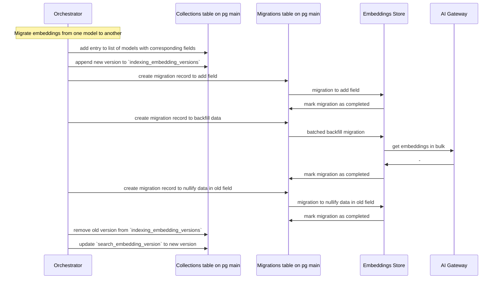

<!-- Design Documents often contain forward-looking statements -->

<!-- This renders the design document header on the detail page, so don't remove it-->

<div class="my-3 border-l-4 border-blue-500 bg-blue-50 px-4 py-3 rounded-r text-sm text-blue-800">
このページには今後予定されている製品・機能・機能性に関する情報が含まれています。ここに示す情報は参考目的のみです。購入・計画の決定にこの情報を使用しないでください。製品・機能・機能性の開発、リリース、タイミングは変更または延期される可能性があり、GitLab Inc. の独自の判断に委ねられています。
</div>

<div class="overflow-x-auto my-4">
<table class="w-full text-sm border-collapse">
<thead>
<tr class="bg-gray-100 text-left">
<th class="px-3 py-2 border border-gray-300">Status</th>
<th class="px-3 py-2 border border-gray-300">Authors</th>
<th class="px-3 py-2 border border-gray-300">Coach</th>
<th class="px-3 py-2 border border-gray-300">DRIs</th>
<th class="px-3 py-2 border border-gray-300">Owning Stage</th>
<th class="px-3 py-2 border border-gray-300">Created</th>
</tr>
</thead>
<tbody>
<tr>
<td class="px-3 py-2 border border-gray-300"><span class="inline-block rounded px-2 py-0.5 text-xs font-medium bg-gray-100 text-gray-700">ongoing</span></td>
<td class="px-3 py-2 border border-gray-300"><a href="https://gitlab.com/dgruzd" class="text-blue-600 hover:underline">@dgruzd</a></td>
<td class="px-3 py-2 border border-gray-300"><a href="https://gitlab.com/shekharpatnaik" class="text-blue-600 hover:underline">@shekharpatnaik</a></td>
<td class="px-3 py-2 border border-gray-300"></td>
<td class="px-3 py-2 border border-gray-300"><span class="inline-block rounded px-2 py-0.5 text-xs font-medium bg-gray-100 text-gray-700">~devops::foundations</span></td>
<td class="px-3 py-2 border border-gray-300">2024-09-11</td>
</tr>
</tbody>
</table>
</div>


## 概要

AI 機能のグラウンディング（根拠付け）を強化するために、Retrieval Augmented Generation (RAG) が必要です。RAG は進化を続けており、現時点では単一の手法やストレージソリューションですべての潜在的なユースケースに対応できるものはありません。さらに、LLM の進歩とコンテキストウィンドウの拡大に伴い、私たちのソリューションは柔軟であり続ける必要があります。すでにほとんどの検索機能と埋め込みで Elasticsearch を利用していますが、すべての self-managed のお客様が Elasticsearch を実行しているわけではないため、一部の機能を Postgres でもサポートしたいと考えています。したがって、さまざまな RAG と埋め込みソリューションを統合する抽象化レイヤーを構築することで、多様なユースケースを効率的にサポートできるようになります。

## 動機

RAG 抽象化レイヤーは、以下のような重要なメリットを提供します。

- **お客様の柔軟性**: 現在 Elasticsearch を実行していないお客様でも、Postgres による RAG 機能の一部を利用できるようになります。
- **ベンダーロックインの回避**: 単一ベンダーへの依存を防ぐようにアーキテクチャを設計しています。
- **モジュール化された機能開発**: 基盤となるデータストアの制約とは独立して機能を構築できます。
- **適応性**: 新しい技術、モデル、ベンダーが登場しても、私たちのソリューションは進化できます。

## ゴール

- グローバル検索チームが、データベース間でコードを最大限共有しつつ、複数のベクターデータベースおよび埋め込みモデルをサポートできるようにします。
- チャットルーティング、メモリ、Issue 検索、コードコンテキストなど、多様な機能のための抽象化レイヤーを構築します。

## 提案

GitLab Data Layer の提案インターフェイスの概要は次のとおりです。

### セットアップ

管理者が新しい対応データベースをセットアップする際は、それを GitLab Data Layer の設定に追加します。アダプターが実装されているデータベースのいずれかである必要があります。

`gitlab.rb` ファイルでは次のように設定します。

```ruby
gitlab_rails['ai_context_abstraction_layer'] = {
  enabled: true,
  databases: {
    es1: {
      adapter: 'elasticsearch',
      options: {
          prefix: 'gitlab', # Optional, but important to allow using the same DB for multiple instances
          url: 'https://elastic.host'
      }
    },
    os1: {
      adapter: 'opensearch',
      options: {
          prefix: 'gitlab', # Optional, but important to allow using the same DB for multiple instances
          url: 'https://elastic.host'
      }
    },
    pg1: {
      adapter: 'postgresql',
      options: {
          prefix: 'gitlab', # Optional, but important to allow using the same DB for multiple instances
          host: 'postgres.host',
          username: 'postgres',
          password: '..'
      }
    },
    # ...
  }
}
```

### 安定したインターフェイス

このセクションでは、ユーザー（チームメンバー）がコレクションをどのように定義し、データを移行し、クエリするかの概要を示します。

#### コレクションの定義

最初のステップは、コレクション用のトップレベルクラスを作成することです。

コレクションごとに 1 つのクラスを用意し、他の reference/indexing/searching クラスを指す役割と、ルーティングを定義する役割を持たせます。

```ruby
module Ai
  module Search
    module Context
      module Collections
        class Issue
          class << self
            def reference_class
              Issue
            end

            # ...
          end
        end
      end
    end
  end
end
```

これは reference クラスで、ドキュメントの生成と、ZSET との間でのシリアライズ/デシリアライズを担当します。

```ruby
module Ai
  module Search
    module Context
      class Issue < Reference
        include Ai::Search::Context::Concerns::DatabaseReference

        MODELS = {
          0: {
               field: 'embeddings_gecko',
               model: 'textembedding-gecko@003',
               chunking_strategy: {
                 # We can start with a naive approach first, but eventually
                 # we'll need to introduce chunking strategies
                 # ..
               }
             },
          1: {
               field: 'embeddings_mistral',
               model: 'mistral7B',
               chunking_strategy: {
                 # We can start with a naive approach first, but eventually
                 # we'll need to introduce chunking strategies
                 # ..
               }
             }
        }

        override :as_indexed_jsons
        def as_indexed_jsons
          [
            {
              issue_id: target.issue_id,
              namespace_id: target.namespace_id,
              embedding_gecko: Ai::Search::Context.embedding(embeddings_content, collection: :issues, model_version: 0),
              embedding_mistral: Ai::Search::Context.embedding(embeddings_content, collection: :issues, model_version: 1)
              # ...
            }
          ]
        end

        private

        def embeddings_content
          "issue with title '#{target.title}' and description '#{target.description}'"
        end
      end
    end
  end
end
```

#### データマイグレーション

```ruby
class AddIssueCollection < Gitlab::Ai::Context::Migration[1.0]
  milestone '18.0'

  def change
    create_collection :issues, number_of_partitions: 5 do |c|
      c.bigint :issue_id
      c.bigint :namespace_id
      c.bigint :project_id
      c.prefix :traversal_ids
      c.vector :embeddings_gecko, options: { dimensions: 768, m: 16, ef_construction: 100 }
      c.integer :embeddings_version

      # These will only be used with pgvector adapter since Elasticsearch
      # indexes fields automatically
      # we could also consider adding `index: true` to field definitions as syntactic sugar
      c.index [:namespace_id, :project_id]
      c.index :traversal_ids
      c.index :embeddings_gecko
    end
  end
end
```

##### コレクションの状態追跡

各コレクションについて、以下のような動的な属性を追跡するためのレコードを 1 件追加する予定です。

- search_embedding_version: `0`
- indexing_embedding_versions: `[0, 1]`

##### コレクションのマイグレーション

```ruby
class AddContentToIssueCollection < Gitlab::Ai::Context::Migration[1.0]
  milestone '18.0'

  def change
    add_field :issues, field: :content, type: :text
  end
end
```

```ruby
class BackfillContentToIssueCollection < Gitlab::Ai::Context::Migration[1.0]
  milestone '18.0'

  def change
    backfill_collection :issues, field: :content
  end
end
```

##### マイグレーションの状態追跡

すべてのマイグレーションの状態を追跡するための新しいテーブル（メイン DB 内）を追加します。テーブルは次のような構造になる想定です。

- version: text
- status: pending, in_progress, finished, failed (enum)
- created_at
- updated_at
- completed_at
- metadata/info: jsonb

特定のマイグレーションが完了しているかどうかをコードが知る必要があるため、現在のマイグレーション状態を取得するためのヘルパーメソッドを用意します。

```ruby
Ai::Search::Context.migration(:backfill_content_to_issue_collection).state

# or

Ai::Search::Context.migration_finished?(:backfill_content_to_issue_collection)
```

##### 異なるモデル間でのマイグレーション

異なる LLM 間のマイグレーションをダウンタイムなしで簡単に行えるようにする予定です。計画としては、モデルとフィールド名のマッピングのリストを保持します。これにより、現在/有効なモデルを追跡し、バックフィルが完了次第新しいモデルに切り替えることができます。



#### インジェスト

```ruby
Ai::Search::Context.track!(objects)
```

これにより内部で reference が作成され、シャーディングされた Redis ZSET（重複排除されたキューとして使われる）に追加されます。

その後、別のワーカーが、指定されたレートリミットの範囲内でキューを処理します。

モデルにインクルードする concerns を導入し、変更が自動的に追跡されるようにする予定です。
[`Elastic::ApplicationVersionedSearch`](https://gitlab.com/gitlab-org/gitlab/-/blob/66a6ae61dde6c942cfbaf8f230cbc177c8fc3fd2/ee/app/models/concerns/elastic/application_versioned_search.rb#L48-50) と同様の仕組みです。

注意: 1 つのインデックスイベントを複数の別々のコレクションに配信する必要がある場合があります。例えば、コードや別のドキュメントタイプに対する異なるチャンキング戦略などです。

#### 取得 (Retrieval)

```ruby
embedding = Ai::Search::Context.embedding('Abstraction layer', collection: :issues, model_version: 0, user: current_user)
# or for batching
embeddings = Ai::Search::Context.embeddings(['Abstraction layer'], collection: :issues, model_version: 0, user: current_user)

Ai::Search::Context.collection(:issues).query(prefix: { traversal_ids: '9970-' }, model_version: 0, embeddings: embedding, limit: 5)
```

すべてのクエリロジックを Ruby ベースの API で表現するのが難しい場合は、GLQL コンパイラを使用してクエリを AST に変換することも検討できます。現在、GLQL は [Rust で書き直し中](https://gitlab.com/gitlab-org/gitlab-query-language/glql-rust)であり、これを利用すれば抽象化レイヤーの一部としてモノリスに組み込むことができます。GLQL から始めないことにしたのは、他の複雑なプロジェクトへの新たな依存関係を導入することになり、また GLQL のもとの設計目標である「GitLab UI でデータを表示するためのユーザー向けクエリ言語」というユースケースとは合致しないためです。

もう 1 つの代替案は、Elasticsearch が採用しているように JSON オブジェクトを使ってクエリを表現することです。
ただし、この方法の欠点として、複雑な AND/OR クエリの表現がかなり難しくなります。
SQL ライクな構文の方がチームメンバーにとって便利で馴染みやすいかもしれません。

重要な注意: 初期実装の一部として、redaction ロジックを組み込むべきです。

### 初期機能

抽象化レイヤーは、GitLab における幅広い機能をサポートできるように構築する予定です。最終的にサポートしたい機能は以下のとおりです。

- ドキュメント埋め込み
- コード埋め込み
- Issue/MR/Epic 埋め込み
- CI ログ埋め込み

コード（Gitaly に保存され、git push で更新され、同時に複数のバージョンが存在する）は、Issue やマージリクエスト（Postgres に保存され、アプリケーションコードによって更新され、常に 1 つのバージョンしか存在しない）とは大きく異なるため、グローバル検索チームは両方のリファレンス実装を構築する必要があります。私たちが構築するアーキテクチャは、埋め込みを構築・検索する多くの異なる方法に柔軟に対応する必要がありますが、特定の機能に対してどのアプローチが有用かを学ぶには実験が必要です。そのため、グローバル検索チームは、すべてのお客様にロールアウトされない可能性のある実験的なリファレンス実装を構築すると想定しています。今わかっていることに基づいて機能を有用に設計するために最善を尽くしますが、このトピックに関するより深い研究を待つために初期のリファレンス実装を遅らせることはしません。

明確なリファレンス実装が整えば、他の機能チームが自分たちの機能をサポートするのに必要なインデックスや検索の機能を構築するのが容易になります。
