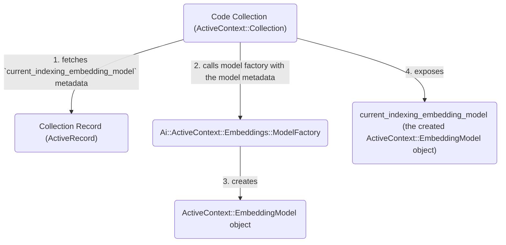

## 概要

Semantic Search のユースケースでは、インデックスと検索に使用する埋め込みを生成するために、Active Context Collection 向けの埋め込みモデルを定義する必要があります。

[埋め込みモデルの切り替え](#embedding-model-switching)では、新しいモデルを使用して埋め込みを再生成するためのバックフィルが必要です。
そのため、Active Context の Embedding Model Selection メカニズムは、
[他の GitLab Duo 機能で使用される Model Configuration 機能](https://docs.gitlab.com/administration/gitlab_duo/model_selection/)とは分離されています。ただし、同じ [AI Gateway の Model Switching フレームワークに支えられ、AI Feature Settings と同期されます](#ai-gateway-aifeaturesetting-and-gitlabllmembeddings)。

## 埋め込みモデルのメタデータ

埋め込みモデルは、`Ai::ActiveContext::Collection` レコードの `metadata` に次のように保存されます。

- `current_indexing_embedding_model`: コンテンツのインデックス作成に現在使用されているモデル
- `next_indexing_embedding_model`: 現在のモデルを置き換えるためにキューに入っているモデル（新しいモデルへ切り替える際に使用）
- `search_embedding_model`: 検索中のクエリ埋め込みに使用されるモデル。これは `current_indexing_embedding_model` と一致します

各埋め込みモデルのメタデータには、次の情報が含まれます。

- `model_type`: `gitlab_managed` または `self_hosted`
- `model_ref`: モデル識別子（例: `text_embedding_005_vertex`、または `Ai::SelfHostedModel` ID）
- `field`: 埋め込みが保存されるベクターストアフィールド
- `dimensions`: 埋め込みベクトルの次元数。ベクターストアフィールドの作成と埋め込み生成に使用されます

GitLab-managed モデルと Self-hosted モデル、およびそれぞれに対応するモデル識別子の詳細については、下記の [GitLab-managed モデルと Self-hosted モデルのセクション](#gitlab-managed-vs-self-hosted-models)を参照してください。

## Collection クラスから埋め込みモデルを参照する

Collection クラス（例: `Ai::ActiveContext::Collections::Code`）は、コレクションレコードに永続化されているモデルメタデータハッシュを直接参照しません。
代わりに、`current_indexing_embedding_model`、`next_indexing_embedding_model`、`search_embedding_model` に対して `ActiveContext::EmbeddingModel` オブジェクトを公開します。

**`current_indexing_embedding_model` の図**



### `ActiveContext::EmbeddingModel`

`ActiveContext::EmbeddingModel` は、次の情報を保持します。

- モデルメタデータ（`model_type`、`model_ref`、`field`、`dimensions`）
- `llm_class`: 埋め込みを生成するために呼び出される `Gitlab::Llm` クラス。例: `Gitlab::Llm::Embeddings::CodeEmbeddings`
- `llm_params`: 次を含むハッシュ
  - `model_definition`: 埋め込み生成の呼び出しに必要なすべての関連情報を含む `Gitlab::Llm::Embeddings::ModelDefinition` オブジェクト
  - `batch_size`（任意）: バッチ化された埋め込み生成呼び出しごとのコンテンツ数

埋め込み生成は、次のように `ActiveContext::EmbeddingModel` オブジェクトの `generate_embeddings` メソッドを通じて呼び出されます。

```ruby
ac_embedding_model.generate_embeddings([array, of, contents], user: optional_user_param)
```

### モデルファクトリ

`Ai::ActiveContext::Embeddings::ModelFactory` クラスは、次の情報を受け取って `ActiveContext::EmbeddingModel` オブジェクトを作成します。

- モデルメタデータ
- 現在のインスタンスタイプ（例: SaaS または Self-Managed）
- インスタンスが独自の [Self-hosted AI Gateway](https://docs.gitlab.com/administration/gitlab_duo_self_hosted/)に接続されているかどうか
- 埋め込み生成が検索処理向けか、インデックス作成処理向けか

`ModelFactory` を通じて `ActiveContext::EmbeddingModel` を作成する例:

```ruby
ac_embedding_model = Ai::ActiveContext::Embeddings::ModelFactory.for(model_metadata, search: false)
```

### Collection クラスですべてをまとめる

すべての Collection クラスは、たとえば次のように `Ai::ActiveContext::Embeddings::ModelFactory` を `embedding_model_factory` として定義する必要があります。

```ruby
# the Ai::ActiveContext::Collections::Code overrides the `embedding_model_factory` to return `Ai::ActiveContext::Embeddings::ModelFactory`
class Ai::ActiveContext::Collections::Code
  def self.embedding_model_factory
    Ai::ActiveContext::Embeddings::ModelFactory
  end
end

# the ::ActiveContext::Concerns::Collection defines `current_indexing_embedding_model` as:
module ActiveContext::Concerns::Collection
  class_methods do
    def current_indexing_embedding_model
      # collection_record.current_indexing_embedding_model is what holds the stored model metadata
      embedding_model_factory.for(collection_record.current_indexing_embedding_model)
    end
  end
end

# when generating embeddings using the Code collection's current indexing model, we simply call:
Ai::ActiveContext::Collections::Code
  .current_indexing_embedding_model
  .generate_embeddings([array, of, contents], user: optional_user_param)
```

## AI Gateway、`Ai::FeatureSetting`、`GitLab::Llm::Embeddings` {#ai-gateway-aifeaturesetting-and-gitlabllmembeddings}

Active Context Collection の埋め込みを生成するには、その Collection を独自のキーを持つ Embeddings AI Feature として実装し、AI Gateway でサポートし、`Ai::FeatureSetting` と同期し、
`GitLab::Llm::Embeddings::*` クラスで呼び出す必要があります。

**Embeddings AI Feature キー**

各 Collection には、対応する Embeddings AI Feature キーが必要です。

Code Collection（Semantic Code Search）の場合、対応する AI Feature キーは `embeddings_code` です。

**AI Gateway**

- 各 Embeddings 機能には、`/v1/embeddings` 配下に定義された独自のエンドポイント、またはエンドポイントのペアがあります。

  `embeddings_code` 機能は、インデックス作成処理と検索処理を区別するために 2 つのエンドポイントを使用します。

  - `/v1/embeddings/code_embeddings/index`
  - `/v1/embeddings/code_embeddings/search`

- 各 Embeddings 機能には、[Prompt Registry](https://gitlab.com/gitlab-org/modelops/applied-ml/code-suggestions/ai-assist/-/blob/main/docs/aigw_prompt_registry.md)に独自のエントリがあります。これは `ai_gateway/prompts/definitions/<feature_setting_key>` 配下に定義されます。これは [passthrough prompt](https://gitlab.com/gitlab-org/modelops/applied-ml/code-suggestions/ai-assist/-/blob/main/ai_gateway/prompts/embedding.py)であり、リクエストからの入力パラメータが追加のプロンプトなしで LiteLLM クラスに渡されることを意味します。[`embeddings_code` の定義例](https://gitlab.com/gitlab-org/modelops/applied-ml/code-suggestions/ai-assist/-/blob/main/ai_gateway/prompts/definitions/embeddings_code/base/1.0.0.yml)を参照してください。

- 各 Embeddings 機能には、受け入れられる `unit_primitives` と `selectable_models` を持つ独自のエントリ `ai_gateway/model_selection/unit_primitives.yml` があります。

  `selectable_models` は `ai_gateway/model_selection/models.yml` に定義され、`family=embedding` を持ちます。

- 実際の埋め込み生成は [`EmbeddingLiteLLM`](https://gitlab.com/gitlab-org/modelops/applied-ml/code-suggestions/ai-assist/-/blob/main/ai_gateway/models/v2/embedding_litellm.py) に実装されています。これは LiteLLM を通じた埋め込みエンドポイント用の `Runnable` ラッパーです

**`Ai::FeatureSetting`**

Self-hosted モデルでは、各 Embeddings 機能が次に追加されます。

- `Ai::FeatureSetting::STABLE_FEATURES` または `Ai::FeatureSetting::FLAGGED_FEATURES`
- `Ai::ModelSelection::FeaturesConfigurable::FEATURES`
- `ee/lib/gitlab/ai/feature_settings/feature_metadata.yml`

`current_indexing_embedding_model` は、[埋め込みモデル切り替えプロセス](#embedding-model-switching)の一環として `Ai::FeatureSetting` と同期されます。

**Rails `GitLab::Llm::Embeddings::*` クラス**

AI Gateway の埋め込みエンドポイントを呼び出すために、各機能は `GitLab::Llm::Embeddings::*` クラスを実装します。
Semantic Code Search は `GitLab::Llm::Embeddings::CodeEmbeddings` クラスを使用します。このクラスは、埋め込み対象コンテンツの配列、
`GitLab::Llm::Embeddings::ModelDefinition` オブジェクト、および任意の user パラメータを受け取ります。

`GitLab::Llm::Embeddings::ModelDefinition` クラスには、埋め込み生成の呼び出しに必要なすべての関連情報が含まれます。これには `unit_primitive`、AI Feature キー、呼び出す AI Gateway デプロイメント（つまり Cloud AIGW または Self-hosted AIGW）などが含まれます。

## GitLab-managed モデルと Self-hosted モデル {#gitlab-managed-vs-self-hosted-models}

他の AI 機能と同様に、Active Context の埋め込みモデルは GitLab-managed または Self-hosted のどちらかです。

**GitLab-managed モデル**

[GitLab-operated AI Gateway](https://docs.gitlab.com/administration/gitlab_duo/gateway/)で提供されます。これらは `family=embedding` を持つ `ai_gateway/model_selection/models.yml` 上で定義されたモデルです。

モデル識別子は、各エントリの `gitlab_identifier` フィールドである必要があります。

**Self-hosted モデル**

[Self-Managed インスタンス](https://docs.gitlab.com/administration/gitlab_duo/configure/)上で Admin ユーザーによって定義され、独自の [Self-hosted AI Gateway](https://docs.gitlab.com/administration/gitlab_duo_self_hosted/)に接続されたモデルです。ユーザーは、`embedding` モデルファミリーを持つ [Self-hosted モデルを自分で追加](https://docs.gitlab.com/administration/gitlab_duo_self_hosted/configure_duo_features/#add-a-self-hosted-model)する必要があります。

モデル識別子は、`Ai::SelfHostedModel` レコードの ID である必要があります。

## 埋め込みモデルの切り替え {#embedding-model-switching}

埋め込みモデルを切り替えると、新しい埋め込みモデルを使用してインデックス済みコンテンツの埋め込みを再生成する非同期バックフィルプロセスが開始されます。このバックフィルプロセスは、`Ai::ActiveContext::EmbeddingModelActivationService` を通じてタスクチェーンを作成することで、[Active Context Tasks フレームワーク](./active_context_tasks.md)を活用します。

### `Ai::ActiveContext::EmbeddingModelActivationService`

#### パラメータ

- `collection_class`: 例: `Ai::ActiveContext::Collections::Code`
- `model_ref`: モデル識別子
- `dimensions`: 埋め込み次元数
- `model_type`: `gitlab_managed` または `self_hosted`
- `skip_embeddings_request_test`: テスト用の埋め込み生成呼び出しをスキップするかどうかを示す boolean 値。デフォルトは `false`
- `chunk_strategy`: Collection の[チャンク化アルゴリズム](../codebase_as_chat_context/chunking.md#chunk-strategy-and-chunk-size)（例: `code_bytes` または `code_pre_bert`）。最初のモデル設定時にのみ適用されます
- `chunk_strategy_size`: 各コンテンツの[最大チャンクサイズ](../codebase_as_chat_context/chunking.md#chunk-strategy-and-chunk-size)。最初のモデル設定時にのみ適用されます
- `user`: 埋め込みモデルの切り替えを呼び出したユーザー。Self-hosted AI Gateway を使用する Self-Managed インスタンスでのみ必要です

#### 実行フロー

1. 指定されたパラメータを検証する
2. 指定されたモデルメタデータを使用して実際の埋め込み生成リクエストを実行し、リクエストが失敗した場合はエラーを発生させる
3. Collection の `next_indexing_embedding_model` を設定する
4. 非同期バックフィルプロセス向けに [Active Context Tasks](./active_context_tasks.md) のチェーンを作成する

### バックフィルタスクチェーン

これは `EmbeddingModelActivationService` によって作成されるタスクチェーンです。
これらは `Ai::ActiveContext::Tasks` 配下に名前空間化されたクラスであり、`::ActiveContext::Task[1.0]` 基底クラスを継承します。

1. `AddEmbeddingsField`
   - ベクターストアインデックスに新しい埋め込みフィールドを追加する
1. `BackfillEmbeddings`
   - ベクターストアからドキュメントを読み取る
   - コンテンツから埋め込みを生成する
   - 新しい埋め込みフィールドに値を入れる
1. `UpdateCollectionMetadata`
   - `next_indexing_embedding_model` を `current_indexing_embedding_model` と `search_embedding_model` にコピーする
   - `next_indexing_embedding_model` を `nil` に設定する
1. `SyncFeatureSettings`
   - `current_indexing_embedding_model` を AI Feature Settings レコードと同期する
1. `NullifyField`
   - ベクターストア内の以前の埋め込みフィールドを null 化する
