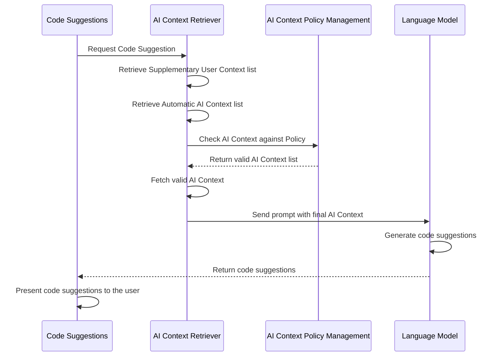

<div class="my-3 border-l-4 border-blue-500 bg-blue-50 px-4 py-3 rounded-r text-sm text-blue-800">
このページには今後予定されている製品・機能・機能性に関する情報が含まれています。ここに示す情報は参考目的のみです。購入・計画の決定にこの情報を使用しないでください。製品・機能・機能性の開発、リリース、タイミングは変更または延期される可能性があり、GitLab Inc. の独自の判断に委ねられています。
</div>

<div class="overflow-x-auto my-4">
<table class="w-full text-sm border-collapse">
<thead>
<tr class="bg-gray-100 text-left">
<th class="px-3 py-2 border border-gray-300">Status</th>
<th class="px-3 py-2 border border-gray-300">Authors</th>
<th class="px-3 py-2 border border-gray-300">Coach</th>
<th class="px-3 py-2 border border-gray-300">DRIs</th>
<th class="px-3 py-2 border border-gray-300">Owning Stage</th>
<th class="px-3 py-2 border border-gray-300">Created</th>
</tr>
</thead>
<tbody>
<tr>
<td class="px-3 py-2 border border-gray-300"><span class="inline-block rounded px-2 py-0.5 text-xs font-medium bg-gray-100 text-gray-700">proposed</span></td>
<td class="px-3 py-2 border border-gray-300"><a href="https://gitlab.com/dmishunov" class="text-blue-600 hover:underline">@dmishunov</a></td>
<td class="px-3 py-2 border border-gray-300"><a href="https://gitlab.com/jessieay" class="text-blue-600 hover:underline">@jessieay</a></td>
<td class="px-3 py-2 border border-gray-300"><a href="https://gitlab.com/bvenker" class="text-blue-600 hover:underline">@bvenker</a>, <a href="https://gitlab.com/dmishunov" class="text-blue-600 hover:underline">@dmishunov</a></td>
<td class="px-3 py-2 border border-gray-300"><span class="inline-block rounded px-2 py-0.5 text-xs font-medium bg-gray-100 text-gray-700">~devops::data-stores</span></td>
<td class="px-3 py-2 border border-gray-300">2023-06-03</td>
</tr>
</tbody>
</table>
</div>


## 用語集

- **AI Context（AI コンテキスト）**: この技術ブループリントの範囲では、「AI Context」とは、主要なプロンプトと併せて AI システムに提供される補足情報を指します。
- **AI Context Policy（AI コンテキストポリシー）**: 「AI Context Policy」は、AI に文脈情報として送信できるコンテンツを精緻にコントロールするための、ユーザー定義かつユーザー管理の仕組みです。本ブループリントでは、_AI Context Policy_ は YAML 設定ファイルとして提案されています。
- **AI Context Policy Management（AI コンテキストポリシー管理）**: 本ブループリントにおける「Management」とは、特定の要件や好みに応じて AI Context Policy を作成・変更・削除する、ユーザー主導のプロセスを指します。
- **Automatic AI Context（自動 AI コンテキスト）**: アクティブなドキュメントに基づいて自動的に取得される _AI Context_ です。_Automatic AI Context_ は、アクティブなドキュメントの依存関係（モジュール、メソッドなど、アクティブなドキュメントにインポートされているもの）、検索ベースの仕組み、またはユーザーがほとんど制御できない他の仕組みなどから取得されるものです。
- **Supplementary User Context（補足的ユーザーコンテキスト）**: ユーザーが定義した _AI Context_ で、IDE で開いているタブ、ローカルファイル、フォルダーなど、ユーザーがローカル環境からデフォルトの _AI Context_ を拡張するために提供するものです。
- **AI Context Retriever（AI コンテキストリトリーバー）**: 以下の能力を持つバックエンドシステムです。
  - _AI Context Policy Management_ と通信する
  - _AI Context Policy Management_ に基づいて、_Automatic AI Context_ と _Supplementary User Context_ で定義されたコンテンツ（完全なファイル、定義、メソッドなど）を取得する
  - LLM に送信する前に、ユーザープロンプトを AI Context で正しく拡張する。おそらくこの部分はすでに [AI Gateway](https://docs.gitlab.com/ee/architecture/blueprints/ai_gateway/) で処理されています。
- **Project Administrator（プロジェクト管理者）**: 本ブループリントにおける「Project Administrator」とは、「プロジェクト設定の編集」権限を持つ任意の個人を意味します（[プロジェクトメンバーの権限](https://docs.gitlab.com/ee/user/permissions.html#project-members-permissions)で定義されている「Maintainer」または「Owner」ロール）。


## 概要

正しいコンテキストは、AI 応答の品質を劇的に向上させることができます。本ブループリントは、さまざまな AI 機能から提供される追加コンテキストに対応できるソリューションを設計することにより、AI Context を私たちの製品提供にシームレスに組み込むことを目指しています。

しかし、私たちはセキュリティと信頼の重要性を認識しており、これは自動化されたソリューションでは必ずしも提供されません。AI Context に投入されるコンテンツに対するユーザーの懸念に対処するために、本ブループリントでは、ユーザーに制御とカスタマイズのオプションを提供することを提案しています。これにより、ユーザーは好みに応じてコンテンツを調整でき、どの情報が利用されているかを明確に把握できます。

本ブループリントでは、_Project Administrator_ レベルおよび個々のユーザーレベルで _AI Context_ を管理するシステムを提案します。その目的は、_Project Administrator_ が AI プロンプトのコンテキストとして含めることができるコンテンツについての高レベルなルールを設定できるようにする一方で、ユーザーが自分のプロンプト用に _Supplementary User Context_ を指定できるようにすることです。グローバルな _AI Context Policy_ には YAML 設定ファイル形式を使用し、同じ Git リポジトリに保存されます。提案する YAML 設定ファイルの形式については後述します。

## 動機

AI が正しいコンテキストを持つことは、正確で関連性の高いコード提案や応答を生成するために不可欠です。AI 支援開発の採用が拡大するにつれ、組織やユーザーが AI モデルへのコンテキストとして送信されるプロジェクトコンテンツを制御できるようにすることが重要になります。一部のファイルやディレクトリには、共有すべきでない機密情報が含まれている場合があります。同時に、ユーザーはより関連性の高い提案を得るために、自分のプロンプトに追加のコンテキストを提供したい場合があります。これらのケースに対応するためには、柔軟な _AI Context_ 管理システムが必要です。

### ゴール

### _Project Administrator_ 向け

- _Project Administrator_ が、LLM へのリクエスト時にコンテンツが _AI Context_ に自動的に含められるかどうかを制御するためのデフォルトの _AI Context Policy_ を設定できるようにする
- _Project Administrator_ がデフォルトの _AI Context Policy_ に対する例外を指定できるようにする
- デフォルトの _AI Context Policy_ とその例外リストを簡単に管理するための UI を提供する

### ユーザー向け

- 自分のプロンプトの AI コンテキストとして含める _Supplementary User Context_ を設定できるようにする
- _Supplementary User Context_ を簡単に管理するための UI を提供する

### 非ゴール

- _AI Context Retriever_ のアーキテクチャ - 異なる環境（Web、IDE）はそれぞれ独自のリトリーバーを実装する可能性が高いです。ただし、リトリーバーの統一されたパブリックインターフェイスは検討されるべきです。
- 個々のコード行の許可/除外といった極めて細かい制御
- ユーザープロジェクトのファイル全文の保存。パスのみが永続化されます

## 提案 {#proposal}

提案するアーキテクチャは、3 つの主要な部分で構成されます。

- _AI Context Retriever_
- _AI Context Policy Management_
- _Supplementary User Context_

_AI Context Retriever_ のさまざまな実装に関連した複数の取り組みが進行中です。
[Web 向け](https://gitlab.com/groups/gitlab-org/-/epics/14040) と [IDE 向け](https://gitlab.com/groups/gitlab-org/editor-extensions/-/epics/55) の両方があります。
そのため、_AI Context Retriever_ のアーキテクチャは本ブループリントの範囲外です。ただし、本ブループリントの文脈では、以下を前提としています。

- _AI Context Retriever_ は、_Automatic AI Context_ を自動的に取得・フェッチして _AI Context_ として LLM に渡すことができる。
- _AI Context Retriever_ は、_Supplementary User Context_ を自動的に取得・フェッチして _AI Context_ として LLM に渡すことができる。
- _AI Context Retriever_ の実装は、モデルに _AI Context_ として渡されるすべてのコンテンツが、グローバルな _AI Context Policy_ に準拠していることを保証できる。
- _AI Context Retriever_ は、特定の Duo 機能で使用される LLM のコンテキストウィンドウ要件に合わせて _AI Context_ をトリミングできる。

### _AI Context Policy Management_ の提案

_AI Context Policy Management_ システムを実装するために、以下を提案します。

- グローバルポリシーを設定するための YAML ファイル形式を導入する
- YAML 設定ファイルで、2 つの `ai_context_policy` タイプをサポートする：
  - `block`: 指定された `exclude` のパスを除いて、すべてのコンテンツをブロックします。除外されたファイルは許可されます。（**デフォルト**）
  - `allow`: 指定された `exclude` のパスを除いて、すべてのコンテンツを許可します。除外されたファイルはブロックされます。
  - `version`: AI コンテキストファイルのスキーマバージョンを指定します。`version: 1` から始まります。省略された場合、クライアントが認識している最新バージョンとして扱われます。
- YAML 設定ファイルで、グローバルポリシーから特定のパスを除外するための glob パターンをサポートする
- サブフォルダー内の _AI Context_ をより細かく制御するためにネストされた _AI Context Policies_ をサポートする。例えば、`/src/tests` のポリシーは `/src` のポリシーを上書きし、それがさらに `/` のグローバルな _AI Context Policy_ を上書きします。

### _Supplementary User Context_ の提案

_Supplementary User Context_ システムを実装するために、以下を提案します。

- プロンプト用の _Supplementary User Context_ を指定するためのユーザーレベル UI を導入する。UI の特定の実装は環境（IDE、Web など）ごとに異なる場合がありますが、これらの実装の実際のデザインは本アーキテクチャブループリントの範囲外です
- ユーザーレベル UI は、_Supplementary User Context_ に何が含まれているかをいつでもユーザーに伝える必要がある
- ユーザーレベル UI は、ユーザーが _Supplementary User Context_ の内容を編集できるようにする必要がある

### オプションのステップ

- _Project Administrator_ がグローバル _AI Context Policy_ を設定するための UI を提供する。この種の YAML ファイル形式のエディターとして、[セキュリティポリシーエディター](https://docs.gitlab.com/ee/user/application_security/policies/index.html#policy-editor)と同様に、[Source Editor](https://docs.gitlab.com/ee/development/fe_guide/source_editor.html) を使用できます。
- _AI Context Policies_ の検証メカニズムを実装し、YAML 設定ファイルの形式が無効な場合に _Project Administrator_ に何らかの形で通知する。CI のジョブとして実装できます。ただし、起こりうる問題を事前に検出するため、[pre-push 静的解析](https://docs.gitlab.com/ee/development/contributing/style_guides.html#pre-push-static-analysis-with-lefthook) の一環として検証ステップを導入することも推奨されます。

## 設計と実装の詳細

- **YAML 設定ファイル形式**: グローバル _AI Context Policy_ を定義するために提案される YAML 設定ファイル形式は次のとおりです。

  ```yaml
  ai_context_policy: [allow|block]

  exclude:
  - glob/**/pattern
  ```

  `ai_context_policy` セクションは、このフォルダーおよび配下のすべてのフォルダーに対する現在のポリシーを指定します。

  `exclude` セクションは、`ai_context_policy` に対する例外を指定します。技術的には、ポリシーの反転です。
  例えば、`exclude` に `foo_bar.js` を指定した場合：

  - `allow` ポリシーでは、`foo_bar.js` がブロックされます
  - `block` ポリシーでは、`foo_bar.js` が許可されます

- **_Supplementary User Context_ のユーザーレベル UI**: プロンプト用の _Supplementary User Context_ を指定するための UI は、環境（IDE、Web など）に応じて異なる方法で実装できます。ただし、実装は、ユーザーが自分のプロンプトに追加のコンテキストを提供できることを保証する必要があります。各ユーザーに指定された _Supplementary User Context_ は、以下のように保存できます。

  - GitLab のユーザープロファイルに保存された設定として

    - **メリット**: デバイスや環境（Web、IDE など）間で一貫性がある
    - **デメリット**: モノリス側での追加作業、データベースへの新たな読み書きが多くなる可能性

  - ローカル IDE/Web ストレージに保存された設定として

    - **メリット**: ユーザー中心、ユーザー環境に対してローカル
    - **デメリット**: 環境（Web、IDE など）ごとに異なる実装が必要、環境やデバイスを切り替えると引き継がれない

 どちらの場合でも、ストレージは設定を特定のリポジトリと関連付けられるようにする必要があります。データの一貫性、パフォーマンス、実装の複雑さといった要素から、どのタイプのストレージを使用するかを判断するべきです。

- 潜在的なパフォーマンスやスケーラビリティの問題を緩和するため、_AI Context Retriever_ と _AI Context Policy Management_ は、それらを必要とする機能と同じ環境に配置するのが理にかなっています。IDE での Duo 機能では [Language Server](https://gitlab.com/gitlab-org/editor-extensions/gitlab-lsp)、Web での Duo 機能ではモノリス内の異なるサービスとなります。

### データフロー

ここでは、コード提案機能を例に、_AI Context_ の役割を示すデータフローのドラフトを示します。



_AI Context Retriever_ が _AI Context_ から何らかのコンテンツを取得できなかった場合、プロンプトは正常に取得できた _AI Context_ と共に送信されます。確率は低いですが、_AI Context Retriever_ が何のコンテンツも取得できない場合は、プロンプトをそのまま送信します。

## 代替ソリューション

### JSON 設定ファイル

- **メリット**: 広く使用されており、Web 技術との統合が容易。
- **デメリット**: 複雑な設定では YAML に比べて可読性が劣る。

### データベースバックの設定

- **メリット**: 集中管理、動的な更新。
- **デメリット**: バージョン管理されない。

### 環境変数

- **メリット**: デプロイとスケーリングのための設定を簡素化する。
- **デメリット**: 複雑な設定にはあまり適さない。

### Policy as Code（YAML を使わない）

- **メリット**: バージョン管理されたコードによる優れた制御と監査。
- **デメリット**: ユーザーがコードを書く必要があり、私たちはそのための言語を考案する必要がある。

### `.ai_ignore` などの Git 風ファイルにポリシーを記述

- **メリット**: 本ブループリントで提案されている `exclude` リストを伴う `allow` ポリシーと同じ、シンプルなアプローチを提供する
- **デメリット**: `allow` ポリシーのみをサポートし、このファイルタイプの処理はまだ実装が必要

これらの代替案を踏まえて、Git でのバージョン管理が可能で、`.ai_ignore` の代替案と比較して柔軟性が高いことから、本ブループリントの形式として YAML ファイルが選択されました。

## 推奨されるイテレーティブな実装計画

各イテレーションの項目の詳細な説明については、[提案](#proposal) セクションを参照してください。

### イテレーション 1

- _AI Context Policy Management_ の一部として、グローバル `.ai-context-policy.yaml` YAML 設定ファイル形式とこのファイルタイプのスキーマを導入する。
- _AI Context Retrievers_ で _Supplementary User Context_ のサポートを導入する。
- オプション: `.ai-context-policy.yaml` の検証メカニズム（CI ジョブや pre-push 静的解析など）

**イテレーションの成功基準:** IDE のコード提案機能から送信されるプロンプトが、リポジトリのルートにあるグローバル _AI Context Policy_ に準拠した、開いている IDE タブのみを _AI Context_ として含む。

### イテレーション 2

- _AI Context Retrievers_ で _Automatic AI Context_ のサポートを導入する。
- より多くの機能を _AI Context Management_ システムに接続する。

**イテレーションの成功基準:** IDE のコード提案機能から送信されるプロンプトが、リポジトリのルートにあるグローバル _AI Context Policy_ に準拠した _Automatic AI Context_ の項目を _AI Context_ として含む。

### イテレーション 3

- Web および IDE のすべての Duo 機能を _AI Context Retrievers_ に接続し、グローバル _AI Context Policy_ に準拠させる。

**イテレーションの成功基準:** すべての環境のすべての Duo 機能が、グローバル _AI Context Policy_ に準拠した _AI Context_ を送信する。

### イテレーション 4

- ネストされた `.ai-context-policy.yaml` YAML 設定ファイルをサポートする。

**イテレーションの成功基準:** リポジトリのサブフォルダーに配置された _AI Context Policy_ が、プロンプト送信時に上位レベルのポリシーを上書きする。

### イテレーション 5

- _Supplementary User Context_ のためのユーザーレベル UI。

**イテレーションの成功基準:** ユーザーが _Supplementary User Context_ の内容を見たり編集したりでき、コンテキストが環境（Web、IDE など）内のすべての Duo 機能間で共有される。

### イテレーション 6

- オプション: グローバル _AI Context Policy_ を設定するための UI。

**イテレーションの成功基準:** ユーザーが UI エディターで _AI Context Policies_ の内容を見たり編集したりできる。
