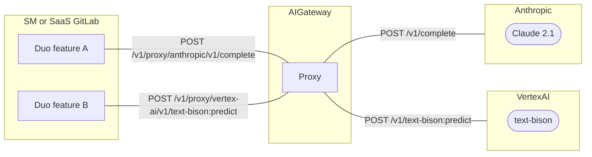

## 概要

AI Gateway は、GitLab-Rails の既存のクライアントライブラリがアクセスできるよう、[AI プロバイダーへのプロキシエンドポイント](../index.md#exposing-ai-providers) を公開します。
これはドロップインリプレースメントであり、ステージグループが [単一目的エンドポイント](../index.md#single-purpose-endpoints) に移行するまで使用されるべきものです。
self-managed の GitLab インスタンスにこれらの機能をより早く市場投入するために、私たちは最終的に望むアーキテクチャから逸れています。

## コンテキスト

ブループリントの最初のイテレーションでは、各 AI 機能ごとに単一目的エンドポイントを持つことを提案していました。
これには複数の理由がありました。

- お客様が私たちの最新の機能を採用するのに必要な時間を最小限にするため、AI 関連のロジックを GitLab モノリスのコードベースにハードコーディングすることを避ける。
- 古いインスタンスのロングテールを壊さずに、製品に変更を加える柔軟性を維持する。

[Issue 454543](https://gitlab.com/gitlab-org/gitlab/-/issues/454543) では、self-managed GitLab で既存の AI 機能を有効にするためのさまざまなオプションを議論しました。

## 決定事項

この Issue では、Ruby クライアントライブラリ [`Anthropic::Client`](https://gitlab.com/gitlab-org/gitlab/-/blob/master/ee/lib/gitlab/llm/anthropic/client.rb) と [`VertexAi::Client`](https://gitlab.com/gitlab-org/gitlab/-/blob/master/ee/lib/gitlab/llm/vertex_ai/client.rb) がそのまま動作するよう、[AI プロバイダーへのプロキシエンドポイント](../index.md#exposing-ai-providers) を導入することを決定しました。理由は以下のとおりです。

- 既存のビジネスロジックを Python AI Gateway で書き直すのは難しい:
  - ビジネスロジックの一部は、GitLab モノリスでのみ利用できる依存関係を使用しています（例: フィーチャーフラグ、Redis でのキャッシング）。これは私たちにこれらの実装を回避することを要求し、エラーが発生しやすくなります。
  - `Gitlab::LLm` 名前空間における集中的な継承のため、実際に効果のあるビジネスロジックを抽出するのは困難です。
  - 変更前後で機能の品質と機能性が一貫していることを評価するツールが不足しています。
- Duo Chat は、プロキシエンドポイントとして機能する既存の `POST /v1/chat/agent` エンドポイントに関係なく GA になりました。技術的には、これはまだ単一目的エンドポイントではありません。

### 技術的詳細

リクエストフローの概要は次のとおりです。



#### Anthropic

AI Gateway で次の HTTP/1.1 エンドポイントを公開します。

```plaintext
POST /v1/proxy/anthropic/(*path)
```

`path` は以下のエンドポイントに転送できます。

- [`/v1/complete`](https://docs.anthropic.com/en/api/complete)
- [`/v1/messages`](https://docs.anthropic.com/en/api/messages)（将来のイテレーション）

#### Vertex AI

AI Gateway で次の HTTP/1.1 エンドポイントを公開します。

```plaintext
POST /v1/proxy/vertex-ai/(*path)
```

`path` は以下のエンドポイントに転送できます。

- [`/v1/{endpoint}:predict`](https://cloud.google.com/vertex-ai/docs/reference/rest/v1/projects.locations.publishers.models/predict)
  - `endpoint` は次のいずれかである必要があります: `chat-bison`、`code-bison`、`codechat-bison`、`text-bison`、`textembedding-gecko@003`。

#### 共通の動作

- リクエストボディはそのまま AI プロバイダーに送信されます。
- リクエストヘッダーは AI Gateway によって適宜フィルタリング/置換されます。例: `accept`、`content-type`、`anthropic-version` のみを許可し、残りはフィルタリングします。`x-api-key` が追加されます。
- レスポンスボディはそのままクライアントに返されます。
- レスポンスヘッダーは AI Gateway によって適宜フィルタリング/置換されます。例: `date`、`content-type`、`transfer-encoding` のみを許可し、残りはフィルタリングします。
- レスポンスステータスはそのままクライアントに返されます。
- HTTP ストリーミングがサポートされます。
- サポートされていない `path` が指定された場合、AI Gateway は 404 Not Found エラーで応答します。

#### アクセス制御

- クライアントは GitLab.com または Customer Dot によって発行された JWT を送信する必要があります。
  - この JWT には `scopes` が含まれており、GitLab インスタンスに付与された権限を示します。この `scopes` は Duo サブスクリプション層によって異なります。
  - これらのプロキシエンドポイントにアクセスするには、`scopes` に次のいずれかが**含まれる**必要があります: `explain_vulnerability`、`resolve_vulnerability`、`generate_description`、`summarize_all_open_notes`、`generate_commit_message`、`summarize_review`、`analyze_ci_job_failure`。
  - 指定された基準を満たさないリクエストは、401 Unauthorized Access エラーになります。
- クライアントは HTTP リクエストで `X-Gitlab-Feature-Usage` ヘッダーを送信する必要があります。
  - この `X-Gitlab-Feature-Usage` ヘッダーは API リクエストの目的を示します。
  - これらのプロキシエンドポイントにアクセスするには、`X-Gitlab-Feature-Usage` が次のいずれかで**ある**必要があります: `explain_vulnerability`、`resolve_vulnerability`、`generate_description`、`summarize_all_open_notes`、`generate_commit_message`、`summarize_review`、`analyze_ci_job_failure`。
  - 指定された基準を満たさないリクエストは、401 Unauthorized Access エラーになります。
- ロギングのために、AI Gateway のアクセスログに `X-Gitlab-Feature-Usage` ヘッダーの値を追加します。
- メトリクスのために、AI Gateway 内で `ModelRequestInstrumentator` を使用して同時リクエストを、`TextGenModelInstrumentator` を使用して入出力トークンを計測します。これは `X-Gitlab-Instance-Id`、`X-Gitlab-Global-User-Id`、`X-Gitlab-Feature-Usage` でラベル付けされる必要があります。
- テレメトリのために、GitLab-Rails の各機能に [Internal Event Tracking](https://docs.gitlab.com/ee/development/internal_analytics/internal_event_instrumentation/quick_start.html) を追加します。
  代わりに AI Gateway の既存の Snowplow トラッカーを使用することもできますが、これには統一されたスキーマを導入するための追加作業が必要です。

さらなるアクセス制御の改善については、[この Issue](https://gitlab.com/gitlab-org/gitlab/-/issues/458350) を参照してください。

## 結果

- 実験的な AI 機能が self-managed インスタンスで有効になります。
- ステージグループは機能のビジネスロジックを改善する作業を開始できます。このプロキシ作業は並行して進めることができます。
- ステージグループは、GA リリースに向けて Python AI Gateway でビジネスロジックをリファクタリングすることに急ぐ必要はありません。GA 後に時間をかけて取り組むことができます。
- ログとメトリクスの `X-Gitlab-Instance-Id`、`X-Gitlab-Global-User-Id`、`X-Gitlab-Feature-Usage` をチェックすることで、不正利用者を検出できます。
- Cloud Connector LB（Cloud Flare）または AI Gateway ミドルウェアでアクセスをゲートすることで、不正利用者をブロックできます。
