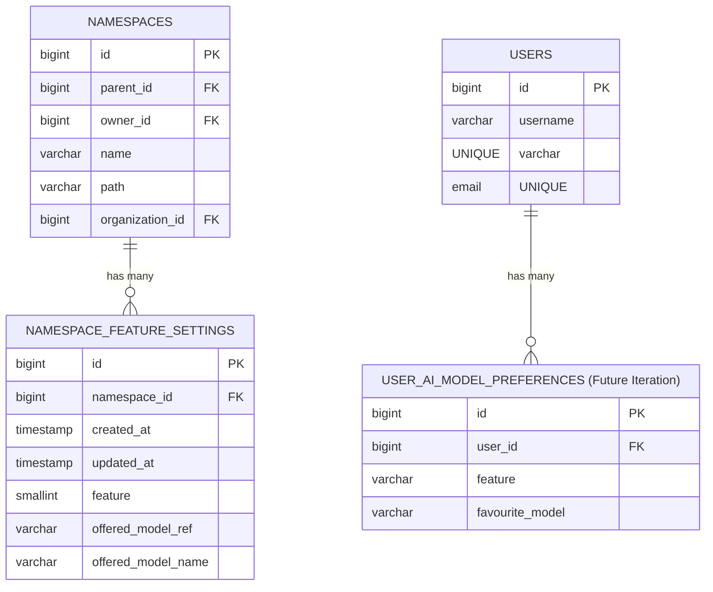
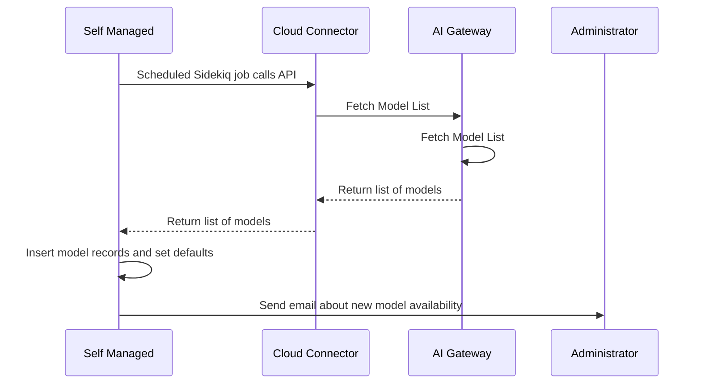
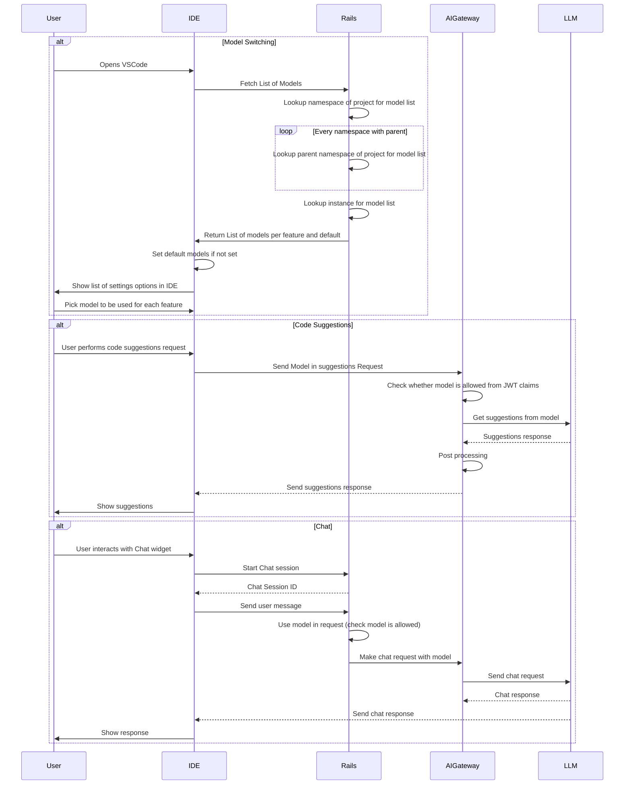

<!-- Design Documents often contain forward-looking statements -->

<!-- This renders the design document header on the detail page, so don't remove it-->




## 背景

オープンソースかプロプライエタリかを問わず、レイテンシ、最大トークン長、トレーニングのアプローチ、出力品質といった独自の特徴を備えた AI モデルが次々と登場し、その数は増え続けています。今日、GitLab Duo はコード提案、Chat、Duo Code Review、脆弱性分析などの機能に対して固定されたモデルセットに依存しています。この硬直性は、管理者、運用チーム、エンドユーザーが自身のニーズに最適なモデルを選択することを制限しています。

加えて、新しいサブプロセッサーやモデルを導入するたびに、お客様は徹底的なレビューと脅威評価のプロセスを実施する必要があります。これらの手続きは数ヶ月に及ぶ場合があります。このレビューはコンプライアンスとガバナンスのために重要ですが、新しい、潜在的により優れたパフォーマンスを発揮するモデルを採用する能力も低下させます。

これらの課題を踏まえ、複数の機能グループにまたがって柔軟なモデル選択を可能にするエンドツーエンドのソリューションが必要です。本ブループリントでは、GitLab Duo 全体にモデル選択オプションを統合し、管理者、運用者、エンドユーザーに使用可能なモデルに対する細かい制御を提供しつつ、ガバナンスとコンプライアンスのワークフローを合理化するために必要な技術アーキテクチャの概要を示します。さらなる背景については、[Issue #513430](https://gitlab.com/gitlab-org/gitlab/-/issues/513430) を参照してください。

## 現状

**フィーチャーフラグによるモデル切り替え:**

gitlab.com および self-managed インスタンスでは、現在モデル選択はフィーチャーフラグによって制御されています。これらのフラグは通常、管理者または運用ユーザーがオン/オフを切り替えます。これらのフラグはユーザーレベルやグループレベルではなくインスタンスレベルで適用されるため、個々のユーザーや企業は特定のタスクに応じて異なるモデル間を切り替える自由がありません。

**self-hosted モデルの設定:**

self-managed のインストールについては、管理者がインスタンスレベルで self-hosted モデルを設定できます。これにより、モデルの選択や更新にある程度の柔軟性が得られますが、依然としてエンドユーザー（開発者）が UI または IDE で機能ごとにモデルを選択することは許可されていません。さらに、.com のお客様には現在、組織のメンバーが使用できるモデルを指定するガバナンスメカニズムがありません。

## フェーズ

この作業をイテレーションで提供することで、お客様に段階的に価値を提供できます。

**イテレーション 1: トップレベルネームスペース設定**: このフェーズでは、お客様はルートネームスペースレベルで各機能のモデルを選択できるようになります。これにより、.com のお客様は自分のネームスペースで使用したいモデルを決定できます。
特定のアクションに使用されるモデルは、ユーザーがいるコンテキスト（プロジェクトまたはネームスペース）に応じて、トップレベルネームスペースで設定されたものになります。
関連する [エピック](https://gitlab.com/groups/gitlab-org/-/epics/17570)。

**イテレーション 2: 機能リリースの統合**
関連する [エピック](https://gitlab.com/groups/gitlab-org/-/epics/18092)。

**今後のイテレーションと検討事項**
**サブレベルネームスペースのカスケード設定**:
子ネームスペースは、トップレベルイテレーションと同じように各機能に特定のモデルを割り当てることができるようになります。それに加えて、ダウンストリームのネームスペースが選択できる利用可能なモデルのサブセットを選択できるようになります。
特定のアクションに使用されるモデルは、ユーザーがいるコンテキストに応じて、機能設定が構成されている、現在のネームスペースを含む最も近い上位ネームスペースで設定されたものになります。
このイテレーションの計画を検討する前に、さらなる需要を待ちます。関連する [Issue](https://gitlab.com/gitlab-org/gitlab/-/issues/514948)。

**組織レベルの設定**: このフェーズでは、`.com`、`self-managed`、`dedicated` の組織レベルで管理されたモデル設定を有効にします。サポートされているモデルは AI Gateway に保存されます。これらのモデルは、gitlab.com、self-managed インスタンス、Dedicated インスタンスから取得されます。_組織機能が GA になっていないため、これは現在計画されていません_

将来のイテレーションでは、ユーザーが IDE と GitLab UI の両方で特定の機能に使用するモデルを決定できるようになります。ユーザーはネームスペースレベルで選択されたサブセットから選択できます。これらの機能の追跡は [このエピック](https://gitlab.com/groups/gitlab-org/-/epics/17720) で確認できます。

Duo Code Review、脆弱性分析、その他の機能でモデル切り替えのケイパビリティを構築していきます。これに加えて、self-hosted のお客様が独自のモデルを持ち込めるようにすることも考えています。

> 注: この設計は、ユーザークエリに基づいて異なる `recommended_model` を選択するシナリオには対応していません。例えば、コンテキストの長さが非常に大きくなった場合は `Google Gemini` を、コーディング関連の質問の場合は `Claude Sonnet` を選びたい場合があるかもしれません。動的なモデル切り替えは別のブループリントでカバーする必要があります。

## 新しい設計（最終形）

これは最終形を表しており、フェーズごとに分割されているわけではありません。各フェーズで、このアーキテクチャの一部が提供されます。

### データモデル

データモデルは、組織がさまざまなレベルで AI 機能設定を管理するための構造化された方法を提供するように設計されています。**ネームスペース管理者**がさまざまな機能（コード提案、Chat など）のデフォルトの AI モデルを定義できる一方で、**個々のユーザー**もこれらのデフォルトを自分の好みの AI モデルで上書きできます。

目標は、管理上の制御とユーザーの柔軟性のバランスを取り、AI による機能が組織のポリシーと個人の好みの両方に整合するようにすることです。



#### **エンティティとリレーションシップ**

##### **1. NAMESPACES**

- GitLab のグループ/サブグループを表します。
- **既存**

##### **2. NAMESPACE_FEATURE_SETTINGS**

- ネームスペースで有効になっている機能のセット。
- このテーブルは、機能カテゴリー（Duo Chat など）と機能（コード補完など）で構成されます
- これにはネームスペースレベルの推奨モデルも保存されます
- **新規**
- **理由:**
  - グループ管理者が、各機能で使用したいモデルをオプションで設定できるようにする必要があります。

##### **5. NAMESPACE_AI_FEATURE_MODELS**

- 各機能の許可されたモデルのリストを保存します。このリストが空の場合、ユーザーには GitLab がサポートするすべてのモデルを表示します
- **将来**

##### **6. USERS**

- AI 機能と対話できる個々のユーザーを表します。
- **既存**

##### **7. USER_AI_MODEL_PREFERENCES**

- ユーザーが機能ごとに**好みの AI モデル**を選択できるようにし、ネームスペースのデフォルトを上書きします。
- **将来**
- **理由:**
  - 組織のデフォルトを維持しながら、ユーザーに柔軟性を与えます。
  - AI 支援ワークフローのパーソナライズを可能にします。

> **注**: AI_SELF_HOSTED_MODELS、AI_FEATURE_SETTINGS、USER_AI_SETTINGS には `organization_id` フィールドが追加され、Cells と連携できるようになります。

#### **主要な設計上の検討事項**

##### **1. デフォルトと上書きのメカニズム**

- **ネームスペース管理者** が各機能のデフォルト AI モデルを定義します。
- **ユーザー** は個人の好みのために、これらのデフォルトを上書きできます（将来）。
- **フォールバックロジック:**
  1. ユーザーの好みについては `USER_AI_SETTINGS` をチェックします。
  2. ユーザーの好みがない場合は、`NAMESPACE_FEATURE_SETTINGS` でネームスペースをチェックします。
  現在は、トップレベルネームスペースのデフォルトのみをチェックします。
  将来のイテレーションでは、ネームスペースの選択をカスケード的にチェックする可能性があります（最も近い親からルート祖先まで）。
  3. ネームスペースのデフォルトがない場合は、システム全体のデフォルトに戻します。
- **理由:**
  - 構造化された意思決定プロセスを保証します。
  - 組織のポリシーを破ることなく、ユーザーに自律性を与えます。

##### **2. スケーラビリティとパフォーマンス**

- ネームスペース階層全体でモデルのリストを階層的に検索できる必要があります。

##### **3. インシデント管理**

- デフォルトモデルが選択された場合、またはモデル選択が無効になっている場合、インシデント管理メカニズムが導入されます。AI Gateway で実装されるメカニズムは、デフォルトモデルが応答できない場合に呼び出しを別のモデルに再ルーティングします。関連する [Issue](https://gitlab.com/gitlab-org/gitlab/-/issues/478067)。

- ユーザーが機能のためにモデルを選択した場合、ユーザーの選択を尊重する必要があるため、インシデント管理を実行できません。ユーザーはこの動作を認識する必要があります。

##### **4. 非推奨化のための柔軟性**

- 管理者がモデルを非推奨にする方法、それを他のレベルにカスケードするためのプロセス、およびそのデータベースパフォーマンスへの影響について考えられる必要があります。

### GitLab rails への変更

1. インスタンスレベルのモデルのリストは、ユーザーがモデル選択設定ページと対話する際に AI Gateway から取得され、インスタンスで 1 時間キャッシュされます。

1. `.com` のすべての Cell とすべての self-managed インスタンスにモデルを同期する方法が必要です。これは、GitLab 管理モデルを各 Cell および self-managed インスタンスと同期する別の Sidekiq ジョブを使用して実現できます。



1. 最初のイテレーション用に、`データモデル` セクションで説明されているように、Rails モデル、コントローラー、ビューを構築しました。

1. AI Gateway に API 呼び出しを行うすべての機能は、特定のネームスペース、グループなどで許可されているモデルのリストからモデルを選択できる必要があります。すべての機能は、機能のデフォルトモデルを参照できる必要もあります。

1. トップレベルネームスペースで提供されたセットからネームスペースのデフォルトを選択できるように、グループ設定ページを構築しました。子ネームスペースのモデルのリストの選択は将来の検討事項です。

1. モデルが非推奨化/非アクティブ化されたとき、その非推奨化をネームスペースレベルにカスケードする方法が必要です。これを実行できる Sidekiq ジョブを構築する必要があります。

1. ユーザーがネームスペースレベルで recommended_model / default_model を選んでいる際、Rails では GitLab 管理モデル（AI Gateway 設定から）と self-hosted モデル画面で構成されたモデルのリストから選択できるようになります。

**ユーザーがモデルを選択できるようになった際の将来の変更:**

1. すべての機能（Chat、コード提案、コードレビュー）は、UI で利用可能なモデルのリストを表示できる必要があります。お客様がモデルを選択すると、それがデフォルトモデルとして設定されます。

> `Duo Code Review` のように、お客様が UI と能動的に対話していない一部の機能では、単一のモデルの選択のみを許可する場合があります。

1. ユーザーが使用を許可されているモデルのリストを取得するための新しい API を構築する必要があります。

```gql
query {
  aiFeatureSettings {
    nodes {
      feature,
      defaultModel,
      validModels {
        nodes {
          name
        }
      }
    }
  }
}
```

### AI Gateway の変更

AI Gateway は、Rails が許可されたモデルのリストを取得できるようにする新しい API をサポートする必要があります。

設定は、次のペアのファイルで行われます。

- [モデル詳細設定ファイル](https://gitlab.com/gitlab-org/modelops/applied-ml/code-suggestions/ai-assist/-/blob/main/ai_gateway/model_selection/models.yml): モデルメタデータを設定します。

- [Unit Primitive 設定ファイル](https://gitlab.com/gitlab-org/modelops/applied-ml/code-suggestions/ai-assist/-/blob/main/ai_gateway/model_selection/unit_primitives.yml): モデルが機能設定に割り当てられます。

モデルをリリースまたは非推奨にする必要がある場合、両方のファイルを更新する必要があります。

AI Gateway はすでに `/v2/chat` や `/v4/suggestions` のようなさまざまな API でモデルの受け渡しをサポートしています。

AI Gateway はすでに、異なるプロバイダー向けのプロンプトバージョニングもサポートしているため、特定のケースでプロンプトを調整できます。

お客様が実行しているものとの後方互換性を確保するために、異なるモデルファミリーとバージョンにわたってプロンプトの変更をテストする必要があります。
最も人気のあるモデルを把握できるよう、異なる機能にわたってメトリクスを収集し、モデル調整の取り組みをそれらに集中させるようにすべきです。

**重要な注意点:** モデル選択では現在、AI Gateway でモデルを段階的にロールアウトする方法はありません。モデルが設定されると、お客様に送信されます。新しいモデルを追加する際はこのことを念頭に置いて、開発サイクルの最後にこれらのファイルへの変更をコミットしてください。

### Duo Workflow への変更

Duo Workflow でモデル切り替えを許可するためには、GitLab プロジェクトで利用可能なモデルのリストを表示する新しいフィールドを作成する必要があります。Duo Workflow を開始するには GitLab プロジェクトが必要なため、プロジェクトを使用してグループ/サブグループ情報を判別し、許可されたモデルのリストを取得できます。ユーザーがモデルを選択すると、そのモデル情報を Duo Workflow Executor に渡されるパラメーターに追加する必要があり、Executor はモデル名を Duo Workflow Service に渡します。Duo Workflow Service と Executor の間の [protobuf 契約](https://gitlab.com/gitlab-org/duo-workflow/duo-workflow-service/-/blob/main/contract/contract.proto?ref_type=heads) には、model という新しいフィールドを持たせる必要があります。

```proto
message StartWorkflowRequest {
    string clientVersion = 1;
    string workflowID = 2;
    string workflowDefinition = 3;
    string goal = 4;
    string workflowMetadata = 5;
    repeated string clientCapabilities = 6;
    string model = 7;
}
```

これに加えて、異なるモデルをサポートするために、Duo Workflow のモデル [factory](https://gitlab.com/gitlab-org/duo-workflow/duo-workflow-service/-/blob/main/duo_workflow_service/llm_factory.py?ref_type=heads) を更新できる必要があります。

### IDE の変更

IDE は GitLab を呼び出して各機能に対する許可されたモデルのリストを取得し、選択されたモデルを AI Gateway または Rails へのリクエストに渡す必要があります。
関連する [Issue](https://gitlab.com/gitlab-org/gitlab/-/issues/541382)。

**1. モデルリストの更新**

- IDE は、利用可能なモデルの更新リストを定期的に取得するか、特定の GitLab: Update Model List コマンドをリッスンします。
- ユーザーが GitLab アカウントを切り替えたり、管理者がモデルの可用性を更新したりすると、変更がトリガーされる場合もあります。

**2. ユーザー設定**

- IDE の設定画面で、ユーザーは機能ごとにデフォルトモデルを選択できます。
- IDE は引き続き Chat とコード提案リクエストで選択したモデルを渡します。

**重要な注意点**

現在、ユーザーが補完用のモデルが選択された少なくとも 1 つのプロジェクトにシートを割り当てられている場合、IDE は [AI Gateway への直接接続](https://docs.gitlab.com/user/gitlab_duo/gateway/#region-support) を [コード補完](https://docs.gitlab.com/user/project/repository/code_suggestions/) 呼び出しに対して無効にし、GitLab モノリス経由で接続するようになります。これにより、ユーザーの好みに応じて使用するモデルが最終的に選択されます。お客様にはドキュメントを通じてこのことを認識してもらう必要があります。



> **注:** これは簡略化された図であり、リクエストの認証/認可など、すべての詳細は含まれていません。

## 未解決の質問 / リスク

**競合の解決**

複数のネームスペース管理者が、階層の異なるレベルで競合するデフォルトモデルを設定した場合はどうなりますか。どのデフォルトを選ぶべきでしょうか?
> **決定**: 子ネームスペースの設定が親ネームスペースよりも優先されます。

**今後のモデル機能のパリティ**

一部のモデルには異なるケイパビリティがあります（例: Google Gemini 2.0 はインターネット検索をサポートし、o1 は `thinking` をサポートします）。このようなサブ機能の有効化はどのように扱うべきでしょうか。

**非推奨化と強制**

AI モデルが非推奨としてマークされた場合、ハードスイッチを強制すべきでしょうか、それとも猶予期間を設けるべきでしょうか。
