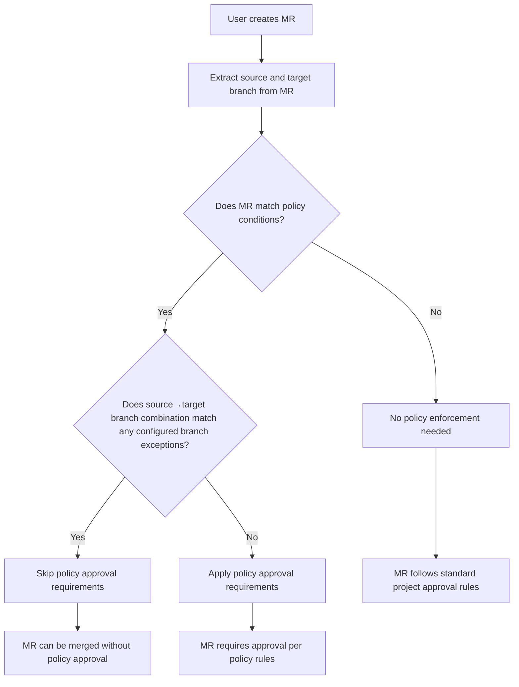
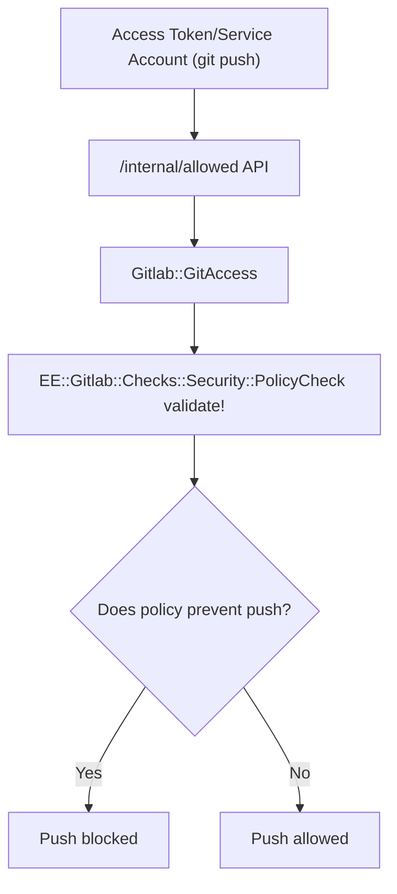
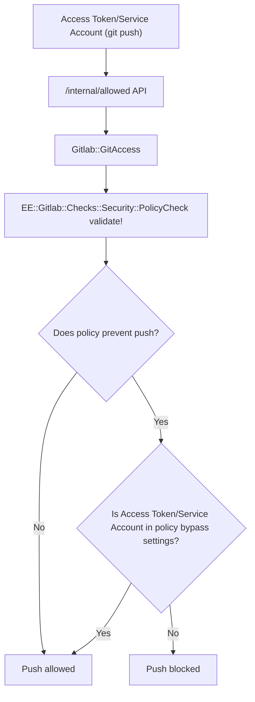

<!-- Design Documents often contain forward-looking statements -->
<!-- vale gitlab.FutureTense = NO -->

<!-- This renders the design document header on the detail page, so don't remove it-->

<div class="my-3 border-l-4 border-blue-500 bg-blue-50 px-4 py-3 rounded-r text-sm text-blue-800">
このページには今後予定されている製品・機能・機能性に関する情報が含まれています。ここに示す情報は参考目的のみです。購入・計画の決定にこの情報を使用しないでください。製品・機能・機能性の開発、リリース、タイミングは変更または延期される可能性があり、GitLab Inc. の独自の判断に委ねられています。
</div>

<div class="overflow-x-auto my-4">
<table class="w-full text-sm border-collapse">
<thead>
<tr class="bg-gray-100 text-left">
<th class="px-3 py-2 border border-gray-300">Status</th>
<th class="px-3 py-2 border border-gray-300">Authors</th>
<th class="px-3 py-2 border border-gray-300">Coach</th>
<th class="px-3 py-2 border border-gray-300">DRIs</th>
<th class="px-3 py-2 border border-gray-300">Owning Stage</th>
<th class="px-3 py-2 border border-gray-300">Created</th>
</tr>
</thead>
<tbody>
<tr>
<td class="px-3 py-2 border border-gray-300"><span class="inline-block rounded px-2 py-0.5 text-xs font-medium bg-gray-100 text-gray-700">implemented</span></td>
<td class="px-3 py-2 border border-gray-300"><a href="https://gitlab.com/sashi_kumar" class="text-blue-600 hover:underline">@sashi_kumar</a></td>
<td class="px-3 py-2 border border-gray-300"><a href="https://gitlab.com/theoretick" class="text-blue-600 hover:underline">@theoretick</a></td>
<td class="px-3 py-2 border border-gray-300"><a href="https://gitlab.com/g.hickman" class="text-blue-600 hover:underline">@g.hickman</a>, <a href="https://gitlab.com/alan" class="text-blue-600 hover:underline">@alan</a></td>
<td class="px-3 py-2 border border-gray-300"><span class="inline-block rounded px-2 py-0.5 text-xs font-medium bg-gray-100 text-gray-700">~devops::security risk management</span></td>
<td class="px-3 py-2 border border-gray-300">2025-05-13</td>
</tr>
</tbody>
</table>
</div>


## 概要

GitLab のマージリクエスト承認ポリシーを導入している組織は、標準的な開発プロセス向けに設計されたセキュリティ統制が、自動化（CI/CD パイプライン、プルミラーリング、Bot 操作）、緊急ホットフィックス、GitFlow のような複雑なブランチ戦略といった正当な運用ワークフローをブロックしてしまうという、重大な摩擦点に直面しています。これにより、組織は強固なセキュリティガバナンスと運用効率のどちらかを選ばざるを得ず、結果としてカスタムの回避策を実装してセキュリティポリシーそのものを骨抜きにしてしまったり、例外が必要なプロジェクトでは完全にポリシーを外してしまったりして、コンプライアンス上のギャップを生み、開発ライフサイクル全体のセキュリティ態勢を弱めることになります。

## 動機

GitLab は、自動化された CI/CD プロセスから緊急時のインシデント対応まで、開発ワークフローの全領域を、セキュリティ態勢を損なうことなくサポートします。具体的には次のとおりです。

- **ソースブランチ例外**: 指定したターゲットブランチへのマージ時に承認要件を自動的にバイパスする、柔軟なソースブランチパターンを定義します。これにより、セキュリティガバナンスを維持したまま承認のボトルネックを解消します。
- **サービスアカウントおよびアクセストークン例外**: 特定のサービスアカウント、Bot ユーザー、アクセストークン（インスタンス／グループ／プロジェクトトークン）を指定して、CI/CD パイプライン、プルミラーリング、自動化されたバージョン更新の承認要件をバイパスします。サービスアカウントは、承認済みトークンを使って保護ブランチに直接プッシュできる一方、人間のユーザーには制限が維持されます。
- **指定ユーザーによるオーバーライド**: 重要な状況下で、特定のユーザー、グループ、カスタムロールがマージリクエスト承認ポリシーをバイパスできるようにし、その間も包括的な監査証跡とガバナンス制御を維持します。

### Goals

- **自動化ワークフローの実現**: サービスアカウント、アクセストークン、Bot ユーザーが、セキュリティ境界を維持したまま、正当な自動化プロセスのために承認ポリシーをバイパスできるようにします。
- **緊急対応の支援**: 重要なインシデント時にも監査証跡とガバナンスを維持できる、文書化された緊急時オーバーライド機能を提供します。
- **複雑なブランチ戦略への対応**: 従来の承認ワークフローでは現実的でなくなる GitFlow などのエンタープライズブランチ戦略をサポートします。
- **セキュリティガバナンスの維持**: すべてのバイパスを適切に文書化・監査・追跡可能にし、コンプライアンス要件に応えます。
- **カスタム回避策の削減**: 組織がリスクのあるカスタムスクリプトを実装したり、ポリシーを完全に無効化したりする必要をなくします。

### Non-Goals

- **セキュリティ態勢の弱体化**: この機能は、承認ポリシーの全体的なセキュリティ有効性を低下させたり、制御不能なバイパス機構を生み出したりするものではありません。
- **既存承認ワークフローの置き換え**: 標準的なマージリクエスト承認プロセスは、典型的な開発ワークフローでは変更されません。
- **無制限の例外サポート**: バイパス機能は制御され、適切な正当化を必要とします。包括的な許可ではありません。

## 提案

提案するアーキテクチャは 3 回のイテレーションで実装します。

- [ソースブランチ例外](https://gitlab.com/groups/gitlab-org/-/epics/18113)
- [サービスアカウントおよびアクセストークン例外](https://gitlab.com/groups/gitlab-org/-/epics/18112)
- [ユーザーおよびグループ例外](https://gitlab.com/groups/gitlab-org/-/epics/18114)

## 設計と実装の詳細

### ソースブランチ例外

**問題**: GitFlow ワークフローを使用していると、`release/*` ブランチから `main` へのマージ時に、対象となる承認者がほとんど（あるいはまったく）残っていないことがよくあります。これは、ほとんどのコントリビューターがすでにリリースブランチの開発に参加しているためです。これにより、重要なリリースをブロックする承認デッドロックが発生します。

**解決策**: ソースブランチパターン例外により、ソースブランチとターゲットブランチの組み合わせに基づいて、ポリシーが自動的に承認要件を免除できるようにします。チームは、機能ブランチから main へのマージには厳格な承認を必須としつつ、リリースから main へのワークフローは効率化するポリシーを構成できます。

#### フロー図



#### ポリシースキーマ

```yaml
name: Merge request approval policy
rules:
  - type: scan_finding
    ...
actions:
  - type: require_approval
    ...
approval_settings:
  prevent_pushing_and_force_pushing: true
bypass_settings:
  branches:
    - source:
        pattern: 'release/*'
      target:
        name: 'master'
```

#### 監査ログ

マージリクエストがポリシーによって例外扱いされるたびに、そのマージリクエストの詳細を含む監査ログが作成されます。

#### 主な考慮事項

- マージリクエスト作成後にターゲットブランチが別のブランチに更新された場合にも、例外が適用されます。

### サービスアカウントおよびアクセストークン例外

**問題**: バージョン更新をコミットする CI/CD パイプライン、プルミラーリング操作、Bot 駆動のプロセスといった、最新の DevOps プラクティスに不可欠な自動化ワークフローが、承認ポリシー内のブランチ保護設定（`prevent_pushing_and_force_pushing`）によってブロックされます。

**解決策**: サービスアカウントおよびアクセストークン（個人／プロジェクト／グループ）をポリシーの例外として設定し、CI/CD パイプライン、プルミラーリング、自動化されたバージョン更新の承認要件をバイパスできるようにし、監査ログを残します。

#### フロー図

##### 現在のフロー



##### 提案するフロー



#### ポリシースキーマ

```yaml
name: Merge request approval policy
rules:
  - type: scan_finding
    ...
actions:
  - type: require_approval
    ...
approval_settings:
  prevent_pushing_and_force_pushing: true
bypass_settings:
  service_accounts:
    - id: 123
    - id: 345
  access_tokens:
    - id: 456
    - id: 567
```

#### 監査ログ

バイパスチェックを通過してプッシュが行われるたびに、サービスアカウントまたはアクセストークンとブランチの詳細を含む監査ログが作成されます。

#### 主な考慮事項

- [サービスアカウント](https://docs.gitlab.com/api/user_service_accounts/#list-all-service-account-users)と[アクセストークン](https://docs.gitlab.com/api/project_access_tokens/#list-all-project-access-tokens)を一覧化する API は、管理者権限を必要とします。そのため、セキュリティポリシーの編集権限を持つユーザー向けにこれらのリソースを公開し、ポリシーエディター UI でサービスアカウントとアクセストークンを読み込むために API を利用できるようにする必要があります。

### ユーザーおよびグループ例外

**問題**: 緊急時には、セキュリティポリシーによる承認で MR がブロックされている場合に、プッシュ、強制プッシュ、または必要な承認をすべて満たさないままマージすることでマージする必要があるかもしれません。

**解決策**: 特定のユーザー／グループ／ロール／カスタムロールを構成して、ポリシー承認をバイパスしつつ、監査ログ用に理由を収集できるようにします。

#### フロー図

#### ポリシースキーマ

```yaml
name: Merge request approval policy
rules:
  - type: scan_finding
    ...
actions:
  - type: require_approval
    ...
approval_settings:
  prevent_pushing_and_force_pushing: true
bypass_settings:
  users:
    - id: 123
    - id: 345
  groups:
    - id: 456
    - id: 567
  roles:
    - id: 145
```

#### データベーススキーマ

ユーザーによるバイパスを保存するため、新しいテーブル `approval_policy_bypass_events` を作成します。

```sql
CREATE TABLE approval_policy_bypass_events (
  id bigint NOT NULL,
  project_id bigint NOT NULL,
  merge_request_id bigint, // this can be NULL for cases when the user force pushes to a branch directly
  user_id bigint,
  security_policy_id bigint,
  source_branch text,
  target_branch text,
  reason text,
  created_at timestamp with time zone NOT NULL,
  updated_at timestamp with time zone NOT NULL
)
```

#### API & GraphQL

- [`ApprovalRule`](https://docs.gitlab.com/api/graphql/reference/#approvalrule) GraphQL 型に、現在のユーザーが承認をバイパスできる対象であるか、およびルールがすでにバイパスされているかを示す 2 つの新しい属性 `allow_bypass` と `bypassed` を追加します。

#### 監査ログ

バイパスチェックを通過してプッシュが行われるたびに、ユーザーやマージリクエスト、ソース／ターゲットブランチの詳細を含む監査ログが作成されます。

#### 主な考慮事項

- ユーザーが保護ブランチにコミットする際に理由を取得するため、[GitLab の既存のプッシュオプション](https://docs.gitlab.com/topics/git/commit/#push-options)とともに、新しい [git push オプション](https://git-scm.com/docs/git-push#Documentation/git-push.txt---push-optionltoptiongt)（`git push -o policy.bypass=<reason>`）を導入します。
