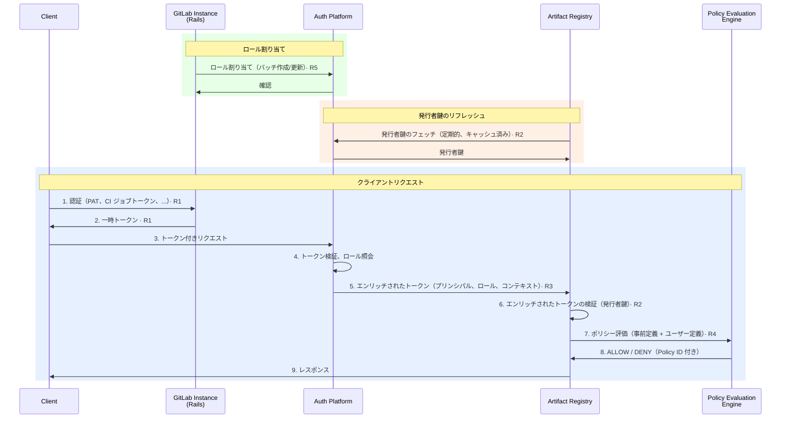
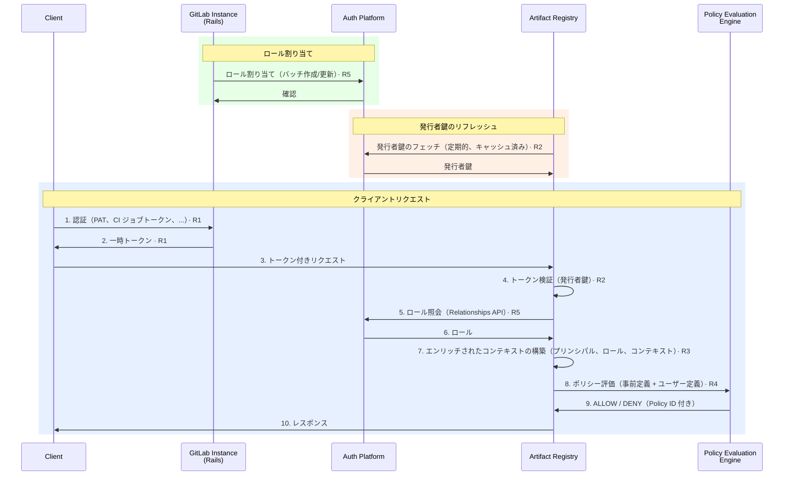

<!-- vale gitlab.FutureTense = NO -->

## 概要

Artifact Registry は、GitLab の最初のステートフルなモジュラーサービスです。Artifact Registry の認証・認可はネットワーク境界をまたぐ可能性があり（セルフマネージドの Rails → SaaS の Artifact Registry）、プラットフォームが所有するコンポーネント（トークン交換、トークン検証、ポリシー評価、ロール保存）に依存しています。Artifact Registry が必要とするもの、Artifact Registry が提供するもの、そして境界がどこにあるかを両チームが一致させるために、インターフェース合意書が必要です。

このドキュメントは、Artifact Registry と Auth Platform のインターフェース合意書を定義します。Auth Platform チームが「どのように」を決定し、このドキュメントは「何を」を定義します。議論は時間をまたいでさまざまな形で行われており、関係者全員が容易に追跡できるわけではありません。別の場所で行われた関連する決定は、このドキュメントに記録・承認されるまで、関係者に知らされたり受け入れられたりしたことにはなりません。

## コンテキスト

[2026-03-27 の CTO レビュー](https://docs.google.com/document/d/1qkcOZYSHM_h9k9pYjHze2KHG5qZYMDeZ1UE4GZgD1jw/edit) および [Auth ワーキングセッション](https://gitlab.com/groups/gitlab-org/-/work_items/21373#note_3190382284)（2026-03-25）に基づき、モジュラーサービスにおける Auth の方向性が合意されました。[Auth 方向性 Work Item](https://gitlab.com/gitlab-org/gitlab/-/work_items/595148) が現在の設計のソースです。[モジュール設計原則](https://docs.google.com/document/d/15yZ9wLCIYvHtg5tcWDPrFKIY-H6v7WfFDXf1RnsQVQk/edit) は追加のコンテキストを提供しますが、このドキュメントに基づいて行動するために必ずしも読む必要はありません。

## タイムライン

Artifact Registry は、FY27 Q2 終了前（2026年7月31日）に .com での本番公開を目指しています。このドキュメントの MUST 要件は、Artifact Registry がカスタマーオンボーディングを開始する前に満たす必要があります。

### 暫定状態

Auth Platform のトークンエンリッチメント層は、本番公開までに利用可能にならない可能性があります。それまでの間、Artifact Registry がその役割を担います: Artifact Registry はインカミングトークンを自身で検証し、[Relationships API](#r5--relationships-api) 経由でロールを解決します。暫定的な検証は、目標状態よりも手順が多くなる可能性がありますが、具体的なメカニズムは Artifact Registry の実装の懸念事項です。その他のすべての Auth Platform 機能（認証情報発行、Relationships API、ポリシー評価エンジン）は初日から利用可能です。

暫定状態の影響を受ける要件（[R2](#r2--token-validation)、[R3](#r3--token-payload)）には、変更内容を説明する **暫定** サブセクションが含まれています。

## 要件レベル

このドキュメントは [RFC 2119](https://www.rfc-editor.org/rfc/rfc2119) のキーワードを使用します: **MUST**、**MUST NOT**、**SHOULD**、**SHOULD NOT**、**MAY** は要件レベルを示します。

## アーキテクチャ上の制約

以下の2つの制約は、以下のすべての要件に適用されます。これらは個別の要件ではなく、すべての要件がどのように実現されるかを形作るものです。

### リクエスト処理中のコールバック禁止 {#no-callbacks-during-request-processing}

Artifact Registry は、リクエスト処理中に GitLab インスタンス、Rails、またはリモートサービスにコールバックしません。ネットワーク状況（ファイアウォール、エアギャップ環境）により、セルフマネージドインスタンスに到達できない可能性があります。Artifact Registry がリクエストを認可するために必要なすべての情報は、トークン内またはローカルで利用可能でなければ **なりません**。

この制約は到達不能になる可能性のあるサービスを対象としており、SaaS 側の共存するプラットフォームサービス（例: Relationships API）はこの制約の対象ではありません。

### GitLab のロールボキャブラリー {#gitlab-role-vocabulary}

ロールの割り当ては、既存の GitLab ロールセット（`guest`、`reporter`、`developer`、`maintainer`、`owner`）を使用します。これらはグローバルなプラットフォームの概念であり、Artifact Registry は独自のロールを定義しません。カスタムロールは Artifact Registry の初期リリースのスコープ外です。

## 認証要件

### R1 — トークン交換サービス {#r1--token-exchange-service}

Auth Platform は、クライアント認証情報を受け入れ、Artifact Registry で使用可能な一時トークンを返す GitLab インスタンス上のエンドポイントを**公開しなければなりません**。

このエンドポイントは、スクリプト（例: `curl`）、`glab ar` CLI サブコマンド、または CI ジョブによってプログラム的に呼び出すことができます。CI ジョブは、Artifact Registry が利用可能な場合、事前にトークン交換を自動的に実行します。クライアント認証情報管理の詳細は[クライアント認証情報管理 Work Item](https://gitlab.com/gitlab-org/gitlab/-/work_items/595150) で追跡されています。

Artifact Registry はトークン発行に関与しません。Artifact Registry はクライアント認証情報を見ることはありません。

| 要件 | レベル | オーナー | 詳細 |
| ----------------------------- | ------- | ----------------------------- | -------------------------------------------------------------- |
| トークン交換エンドポイント | MUST | Auth Platform | GitLab インスタンスはクライアント認証情報を受け入れ、Artifact Registry で使用可能な一時トークンを返すエンドポイントを公開しなければなりません。 |
| サポートされる認証情報タイプ | MUST | Auth Platform | エンドポイントは PAT、OAuth トークン、CI ジョブトークン、デプロイトークン、プロジェクト/グループアクセストークンをサポートしなければなりません。 |
| トークン期間 | MUST | Auth Platform | トークンはデフォルト期間を使用するか、上限付きのリクエスト期間を受け入れなければなりません。[クライアント認証情報管理 Work Item](https://gitlab.com/gitlab-org/gitlab/-/work_items/595150) を参照してください。 |
| 有効化の強制 | SHOULD | Auth Platform | Artifact Registry を有効化していない組織に対しては、トークン交換が失敗するべきです。アクセスは Unit Primitives やアドオンに依存しません。クレジットベースの課金モデルでは Artifact Registry アドオンは存在しません。 |
| クロスバウンダリーサポート | MUST | Auth Platform | Artifact Registry と Rails が共存していても、リモート（セルフマネージド Rails → SaaS Artifact Registry）でも、エンドポイントが機能しなければなりません。 |

### R2 — トークン検証 {#r2--token-validation}

Auth Platform は、発行者の公開鍵を提供するエンドポイントを**公開しなければなりません**。Artifact Registry はすべてのインカミングトークンをこれらの鍵に対して検証します。

複数のセルフマネージドインスタンスが同一の SaaS Artifact Registry に接続する場合でも、すべてのトークンは単一の発行者鍵で検証可能でなければ**なりません**。

鍵のローテーション中、発行者は短い重複ウィンドウで追加の鍵を JWKS にアドバタイズ**しても構いません**が、単一発行者の要件には影響しません。

| 要件 | レベル | オーナー | 詳細 |
| ---------------------------- | ------- | ----------------- | -------------------------------------------------------------- |
| JWKS 公開鍵エンドポイント | MUST | Auth Platform | Auth Platform は発行者の公開鍵を提供するエンドポイントを公開しなければなりません。Artifact Registry はこれらの鍵を使用してインカミングトークンを検証します。 |
| 単一発行者鍵 | MUST | Auth Platform | どの GitLab インスタンスがトークン交換を行ったかに関わらず、すべてのトークンは単一の発行者鍵で検証可能でなければなりません。 |
| キャッシュ | SHOULD | Artifact Registry | Artifact Registry は発行者の公開鍵をキャッシュし、定期的に更新するべきです。リクエストごとにフェッチするべきではありません。 |

#### 暫定

R2 の要件はコントラクトレベルでは変更ありません。発行者は目標状態とは異なり、Artifact Registry が実行する暫定的な検証には追加のステップが含まれる場合があります。

### R3 — トークンペイロード {#r3--token-payload}

Artifact Registry が受け取るトークンは、コールバックなしにリクエストを認可するための十分な情報を**含まなければなりません**。Artifact Registry はトークン形式やその生成方法を規定しません。

| 要件 | レベル | オーナー | 詳細 |
| ---------------------- | ------- | ----------------- | -------------------------------------------------------------- |
| プリンシパル ID | MUST | Auth Platform | トークンにはプリンシパルの GitLab ID が含まれなければなりません。 |
| 割り当てられたロール | SHOULD | Auth Platform | トークンにはアクセスされるリソースに対するプリンシパルの割り当てられたロールが含まれるべきです。 |
| コンテキスト | SHOULD | Auth Platform | トークンには組織 ID などのコンテキスト情報が含まれるべきです。 |

#### 暫定

ペイロードの要件は同じです。エンリッチされたトークンは、誰がそれを生成するかに関わらず、プリンシパル ID、割り当てられたロール、コンテキストを含みます。目標状態では、Auth Platform のエンリッチメント層が Artifact Registry に到達する前にエンリッチされたトークンを生成します。暫定状態では、Artifact Registry がインカミングトークンを検証し、[Relationships API](#r5--relationships-api) 経由でロールを解決することで、自身でそれを生成します。

## 認可要件

### R4 — ポリシー評価エンジン

Artifact Registry は、ライブラリとして利用可能なポリシー評価エンジンを必要とします。エンジンは事前定義されたポリシーとユーザー定義ポリシーに基づいて認可の決定を評価します。

| 要件 | レベル | オーナー | 詳細 |
| ------------------------ | ------- | ----------------- | -------------------------------------------------------------- |
| Go ライブラリ | MUST | Auth Platform | ポリシー評価エンジンは Artifact Registry が組み込める Go ライブラリとして利用可能でなければなりません。 |
| 事前定義ポリシー | MUST | Auth Platform | エンジンは事前定義ポリシーをサポートしなければなりません。これらはデフォルトのロールから権限へのマッピングを定義します。 |
| ユーザー定義ポリシー | MUST | Auth Platform | エンジンは評価時に渡されるユーザー定義ポリシーをサポートしなければなりません。ユーザー定義ポリシーは事前定義ポリシーを厳格化することのみが可能で、拡張することはできません。 |
| 決定トレーサビリティ | MUST | Auth Platform | エンジンは監査ログとデバッグのために、決定を決定した Policy ID を返さなければなりません。 |

### R5 — Relationships API {#r5--relationships-api}

Auth Platform は、Artifact Registry リソースのロール割り当て（リレーションシップ）を管理する API を**公開しなければなりません**。各リレーションシップは、プリンシパルをロールを持つリソースにバインドします。

管理者はローカルインスタンスの GitLab UI を通じてリレーションシップを管理します。Rails はリレーションシップの作成、更新、削除のためのフロントエンドと API を提供します。

| 要件 | レベル | オーナー | 詳細 |
| ------------------------ | ------- | ----------------- | -------------------------------------------------------------- |
| CRUD 操作 | MUST | Auth Platform | API はバッチ作成/更新、バッチ削除、取得（継承解決あり）、リソースによるリスト、プリンシパルによるリストをサポートしなければなりません。 |
| クロスバウンダリーサポート | MUST | Auth Platform | API はネットワーク境界（セルフマネージド → SaaS）をまたいで機能しなければなりません。企業のプロキシやファイアウォールがプロトコルを制限する可能性があります。 |
| 認証 | MUST | Auth Platform | この API への認証は同じ[トークン交換エンドポイント](#r1--token-exchange-service)を使用しなければなりません。 |

### R6 — ブートストラッピング

組織オーナーは、すべての Artifact Registry リソースに対してすべての権限を**持たなければなりません**。これにより、組織で Artifact Registry が有効化され、明示的なロール割り当てが存在しない場合でも、組織オーナーがリポジトリを作成し、他のユーザーにロールを割り当てることができるようになります。

| 要件 | レベル | オーナー | 詳細 |
| --------------------------- | ------- | --------------------- | -------------------------------------------------------------- |
| 組織オーナーアクセス | MUST | Auth Platform + Artifact Registry | 組織オーナーはすべての Artifact Registry リソースに対してすべての権限を持たなければなりません。 |

メカニズムは未指定です。これは自動プロビジョニングされたリレーションシップ、トークンペイロード、またはその他の手段によって実現できます。

## インタラクションダイアグラム

以下のシーケンスダイアグラムは、SaaS Artifact Registry に接続したセルフマネージド GitLab インスタンスで要件がどのように連携するかを示しています。ロール割り当て、発行者鍵のリフレッシュ、クライアントリクエストの3つのフローが示されています。

### 目標状態

Auth Platform のトークンエンリッチメント層が、Artifact Registry に到達する前にエンリッチされたトークンを生成します。

### 暫定状態

Artifact Registry は、発行者の鍵に対してトークンを検証し、[Relationships API](#r5--relationships-api) 経由でロールを解決することで、トークンを自己エンリッチします。検証には追加のステップが含まれる場合があります。

## 参考資料

1. [ADR-020: 認証フロー](../decisions/020_authentication_flow.md)
1. [ADR-022: 名前空間の分離](../decisions/022_namespace_decoupling.md)
1. Organizations インターフェース合意書（保留中、[Organizations インターフェース合意書 MR](https://gitlab.com/gitlab-com/content-sites/handbook/-/merge_requests/19216) を参照）
1. [インフラストラクチャインターフェース合意書](infrastructure.md)
1. [Auth 方向性 Work Item](https://gitlab.com/gitlab-org/gitlab/-/work_items/595148)
1. [暫定ソリューションのストレージと API の提案](https://gitlab.com/gitlab-org/gitlab/-/work_items/595148#note_3212799359)
1. [クライアント認証情報管理](https://gitlab.com/gitlab-org/gitlab/-/work_items/595150)
1. [モジュール設計原則](https://docs.google.com/document/d/15yZ9wLCIYvHtg5tcWDPrFKIY-H6v7WfFDXf1RnsQVQk/edit)
1. [CTO レビュー（2026-03-27）](https://docs.google.com/document/d/1qkcOZYSHM_h9k9pYjHze2KHG5qZYMDeZ1UE4GZgD1jw/edit)
1. [Auth ワーキングセッション（2026-03-25）](https://gitlab.com/groups/gitlab-org/-/work_items/21373#note_3190382284)
