<!-- Design Documents often contain forward-looking statements -->
<!-- vale gitlab.FutureTense = NO -->

## コンテキスト

Artifact Registry には、以下を考慮したデータベース構成が必要です。

- **異なるアクセスパターン**: アーティファクト管理クライアントは、フォーマットごとに大きく異なる独自のプロトコルを使用します。
- **スケーラビリティ**: アーティファクトのストレージは、すぐに数百万行に達する可能性があります。
- **パフォーマンス**: 上記 2 点を踏まえつつ、操作の大半を占めることになる読み取りクエリの実行時間を高速に保ちたいと考えています。
- **過去の落とし穴**: 現在のコンテナレジストリおよびパッケージレジストリのデータ構成にはいくつかの綻びが見え始めており（[例](https://gitlab.com/groups/gitlab-org/-/work_items/16000)、[例](https://gitlab.com/groups/gitlab-org/-/epics/9415)）、ここではそれを回避します。

意思決定の詳細に入る前に、以下のスキーマについていくつか補足します。これらは、提示するテーブル数が多いため、主に可読性を高めることを目的としています。

- このドキュメントでは、機能のコアとなるテーブルについて説明します。サブ機能には追加のテーブルが必要になりますが、ここでは説明しません。例として、blob ストレージのクリーンアップに必要な補助テーブルの背景については [クリーンアップタスク](#cleanup-tasks) を参照してください。
- テーブル名は可読性のために短縮されています。実際には、ここには示されていない共通のプレフィックスを共有します（例: `artifacts_registry_container_repositories`）。
- Artifact Registry は名前空間にスコープされます。根拠については [ADR-001](001_organizations_as_anchor_point.md) を参照してください。
- 主キーやタイムスタンプなど、いくつかの共通カラムは明確さのために省略されています。
- すべてのテーブルには `namespace_id` カラムが含まれます。[Cells のシャーディングキー要件](https://docs.gitlab.com/ee/development/database/multiple_databases/#guidelines-on-choosing-a-sharding-key) はサテライトサービスのデータベースには適用されません。行は、名前空間のアンカータプル（`platform`、`entity_type`、`entity_id`）を通じて間接的に Organization に帰属します。このカラムは、以下のすべてのテーブル定義で明示的に示されています。
- すべての `jsonb` カラムは、際限のないペイロードを防ぎ、期待される構造を強制するために、永続化の前に厳格な JSON スキーマに対して検証する必要があります。これは、このドキュメント内のすべての `jsonb` カラム（例: `rule_configuration` および `package_json`）に適用されます。
- テーブルに複数の暗号化された認証情報カラム（例: リモートリポジトリテーブルの `encrypted_username` と `encrypted_password`）がある場合、すべての認証情報カラムが設定されているか、まったく設定されていないかのいずれかを CHECK 制約で強制する必要があります。部分的な認証情報（例: パスワードのないユーザー名）は受け付けられません。
- リモートリポジトリテーブルの暗号化された認証情報カラム（`encrypted_username`、`encrypted_password`、`encrypted_auth_token`）は、平文の入力を 2048 文字に制限し、暗号化の前に Go の検証レイヤーで強制します。この制限は平文に対するものであり、平文はアプリケーションレイヤーにのみ存在します。データベースは `bytea` の暗号文しか見えないため、DB 側の CHECK（例: `octet_length(...) <= N`）では、暗号化方式の固定オーバーヘッド（IV、認証タグ、key-id ヘッダー）を介して間接的に平文を制限できるにすぎず、制限の近似値となるうえ、必須の Go チェックと冗長になります。CHECK を省略することで、スキーマを暗号のフレーミングから切り離した状態にも保てます。暗号、key-id レイアウト、エンベロープ構造を変更しても、スキーマのマイグレーションは不要です。
- すべての `id` カラムは、Artifact Registry インスタンスのスコープ内で一意でなければなりません。`namespaces.id` は UUIDv7（[RFC 9562](https://datatracker.ietf.org/doc/rfc9562/)）を使用して、すべての Artifact Registry デプロイメントにわたるグローバルな一意性を保証します。PostgreSQL バージョンごとに利用可能な生成パスを含む完全な根拠については、[名前空間 ID の型](#namespace-id-type) を参照してください。その他のすべての `id` カラムは `bigint DEFAULT nextval('<table>_id_seq')` であり、これによりロジカルレプリケーションの互換性が保たれます（[出典](https://gitlab.com/gitlab-com/gl-infra/data-access/dbo/dbo-issue-tracker/-/work_items/691#note_3309931104)）。これらの一意性は単一の Artifact Registry データベース内でローカルに強制されますが、常に名前空間の配下にスコープされるため、それで十分です。

## 意思決定

データの領域は 6 つあります。

- [名前空間テーブル](#namespaces)。不変のスラッグと仮想的なアンカータプルを持つ内部的な名前空間エンティティを導入することで、Artifact Registry を外部の識別子から切り離します。完全な根拠については [ADR-022](022_namespace_decoupling.md) を参照してください。
- [リポジトリコレクションテーブル](#repository-collections)。名前空間内のリポジトリの論理的なグルーピングです。初日からスキーマには存在しますが、まだユーザーには公開されていません。すべての名前空間には「デフォルト」のリポジトリコレクションが用意され、すべてのリポジトリが自動的にそこへ割り当てられます。
- 名前空間レベルのテーブル。これらは、名前空間に直接スコープされる [ライフサイクルポリシーの設定とルール](#lifecycle-policies) および [名前空間レベルのストレージ統計](#storage-usage-calculation) を扱います。
- [リポジトリの親テーブル](#repositories)。すべてのフォーマットにわたるすべてのリポジトリ（ローカル、仮想、リモート）の統合レジストリであり、ランディングページのハイブリッドリストとクロスフォーマットクエリを支えます。
- アーティファクトフォーマットレベルのテーブル。ここには各フォーマット専用のテーブルがあります。ローカルリポジトリ（[Container](#container-repositories)、[Maven](#maven-repositories)、[NPM](#npm-repositories)）、リモートリポジトリ（[Container](#container-remote-repositories)、[Maven](#maven-remote-repositories)、[NPM](#npm-remote-repositories)）、仮想リポジトリ（[Container](#virtual-container-repositories)、[Maven](#maven-virtual-repositories)、[NPM](#npm-virtual-repositories)）です。それぞれ `repository_id` を介して親の `repositories` テーブルを参照します。
- [blob ストレージレベルのテーブル](#blob-storage)。実際のストレージメタデータと [進行中のアップロードセッションの追跡](#upload-sessions) を扱います。

### 名前空間 {#namespaces}

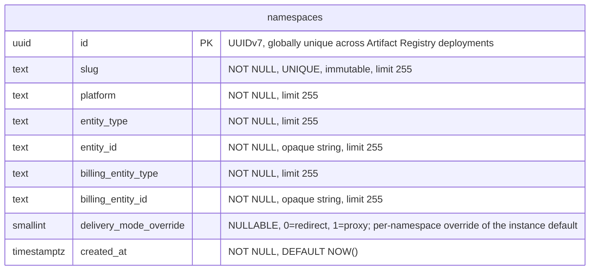

- **namespaces**: 他のすべてのテーブルが `namespace_id` を介して参照するルートエンティティです。各名前空間は、URL とクライアント設定で使用される、不変かつグローバルに一意な `slug` を持ちます（スラッグの設計とグローバルな一意性の強制については [ADR-022](022_namespace_decoupling.md) を参照してください）。`(platform, entity_type, entity_id)` のタプルは、その意味を解釈することなく、名前空間を外部エンティティ（デフォルトでは Organization）にリンクします。`entity_id` は、基になる値が数値の場合でも `TEXT` として格納され、アンカー種別をまたいでスキーマを統一的に保ちます。Organizations v1 では、すべての行が `('gitlab', 'organization', '<rails_org_id>')` を持ちます。`billing_entity_type` と `billing_entity_id` は、使用量イベントの課金アンカーを識別します。外部から提供されるカラム（`platform`、`entity_type`、`entity_id`、`billing_entity_type`、`billing_entity_id`）はいずれもスキーマレベルのデフォルトを持ちません。その根拠については [ADR-022](022_namespace_decoupling.md) を参照してください。`delivery_mode_override` カラムは、[ADR-005](005_artifact_delivery_mode.md) で定義された名前空間ごとのアーティファクト配信のオーバーライドを保持します。`NULL` はインスタンスのデフォルト（`StorageConfig.delivery_mode`）を継承し、`0`（`redirect`）はこの名前空間に対してリダイレクトを強制し、`1`（`proxy`）はプロキシを強制します。ダウンロードリクエストの実効的な配信パターンは `namespace.delivery_mode_override ?? instance.delivery_mode` です。このカラムは、リクエストハンドラーが認可とルーティングのために実行する既存の名前空間ルックアップの一部として読み取られるため、個別のクエリやインデックスは必要ありません。カラム型は `SMALLINT` で、整数からラベルへのマッピングは Go アプリケーションで定義されており（`0 = redirect`、`1 = proxy`）、enum 風カラムについては [Artifact Registry のデータベース規約](https://gitlab.com/gitlab-org/ops/artifact-registry/-/blob/main/docs/dev/database.md#enums) に従います（PostgreSQL の `ENUM` 型は安全に変更するのが難しいため避けています）。将来、アーティファクト配信の選択を格納するカラム（例: S17 がリポジトリごとのオーバーライドを導入する場合）はすべて、同じ整数マッピングを再利用します。

#### スラッグの不変性

PostgreSQL には、不変カラムをネイティブにサポートする仕組みはありません。スラッグの不変性（[ADR-022](022_namespace_decoupling.md)）は、値が変更された場合に例外を発生させる `BEFORE UPDATE OF slug` トリガーによってデータベースレベルで強制されます。これにより、アプリケーションレイヤーを回避するあらゆるコードパス（直接的なデータベースアクセス、管理ツール、マイグレーション）を捕捉します。トリガーは、スラッグの変更を必要とする緊急操作のために無効化できます（例: `ALTER TABLE namespaces DISABLE TRIGGER trg_namespaces_immutable_slug`）。

#### インデックス

- **`namespaces`**: `(slug)` の一意インデックス — スラッグで名前空間を検索します。`(platform, entity_type, entity_id)` の一意制約 — アンカーの重複を防ぎます。`delivery_mode_override` にはインデックスを設けません。このカラムは、`id` をキーとする既存の名前空間ルックアップの一部としてのみ読み取られます（ハンドラーは認可とルーティングのためにすでに名前空間行を結合しています）。

### リポジトリコレクション {#repository-collections}

リポジトリコレクションは、名前空間内のリポジトリの論理的なグルーピングであり、チーム、セキュリティドメイン、または製品ラインごとにアーティファクトを整理します。リポジトリコレクションを UI と API に公開することは MVP の対象外です。このエンティティは、純粋に前方互換性のために初日から存在します。MVP の期間中は、すべての名前空間に作成時に単一の「デフォルト」リポジトリコレクションが用意され、すべてのリポジトリがそこに割り当てられます。MVP 後にリポジトリコレクションの概念が公開されると、ユーザーは追加のリポジトリコレクションを作成し、リポジトリをそれらに再割り当てできるようになります。

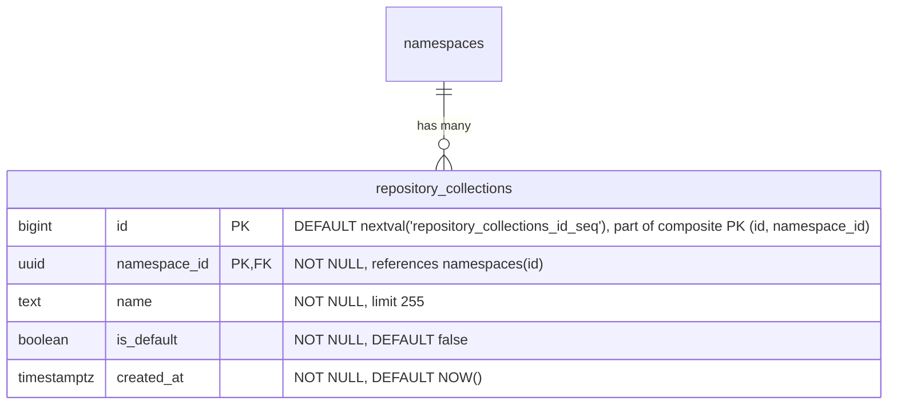

- **repository_collections**: 名前空間内のリポジトリの論理的なグルーピングです。`name` は、名前空間内で一意の人間が読めるラベルです。`is_default` は、すべての名前空間とともに自動的に作成され、MVP の期間中はすべてのリポジトリが割り当てられるリポジトリコレクションを示します。`HASH(namespace_id)` で 64 パーティションにパーティショニングされます。

すべての名前空間の作成では、デフォルトのリポジトリコレクション行をアトミックに挿入する必要があります。

```sql
INSERT INTO repository_collections (namespace_id, name, is_default)
VALUES (<new_namespace_id>, 'default', true)
ON CONFLICT (namespace_id, name) DO NOTHING;
```

#### インデックス

- **`repository_collections`**: `(id, namespace_id)` の主キー — `HASH(namespace_id)` パーティショニングで必要となる複合 PK であり、`repositories` からの複合外部キーの参照先も兼ねます。`(namespace_id, name)` の一意インデックス — 名前空間内で名前によりリポジトリコレクションを検索します。`(namespace_id) WHERE is_default IS TRUE` の部分一意インデックス — 名前空間ごとにデフォルトのリポジトリコレクションを最大 1 つに強制します。

#### クエリ例

- 名前空間のデフォルトのリポジトリコレクションを取得します。

  ```sql
  SELECT *
  FROM repository_collections
  WHERE namespace_id = '018f4d6f-0e10-7e3a-9bfd-23a4c5d6e7f8' AND is_default = true;
  ```

- 名前空間のすべてのリポジトリコレクションを一覧表示します。

  ```sql
  SELECT id, name, is_default, created_at
  FROM repository_collections
  WHERE namespace_id = '018f4d6f-0e10-7e3a-9bfd-23a4c5d6e7f8'
  ORDER BY created_at;
  ```

- 新しい（デフォルトではない）リポジトリコレクションを作成します。

  ```sql
  INSERT INTO repository_collections (namespace_id, name)
  VALUES ('018f4d6f-0e10-7e3a-9bfd-23a4c5d6e7f8', 'team-backend');
  ```

### リポジトリ {#repositories}

`repositories` テーブルは、フォーマットや種別を問わず、システム内のすべてのリポジトリを登録する統合された親テーブルです。これは、すべてのフォーマットにわたるローカル、仮想、リモートのリポジトリを表示する、単一のソート可能・フィルター可能・ページネーション可能なビューであるランディングページのハイブリッドリストを支えます。各フォーマット専用のリポジトリテーブル（ローカル、仮想、リモート）は、`repository_id` を介してここの単一の行を参照します。

このモデル（ローカル、リモート、仮想を参照によって構成される対等なスタンドアロン型として扱う）は、JFrog Artifactory、Sonatype Nexus、Google Cloud AR のいずれも採用しているものです。

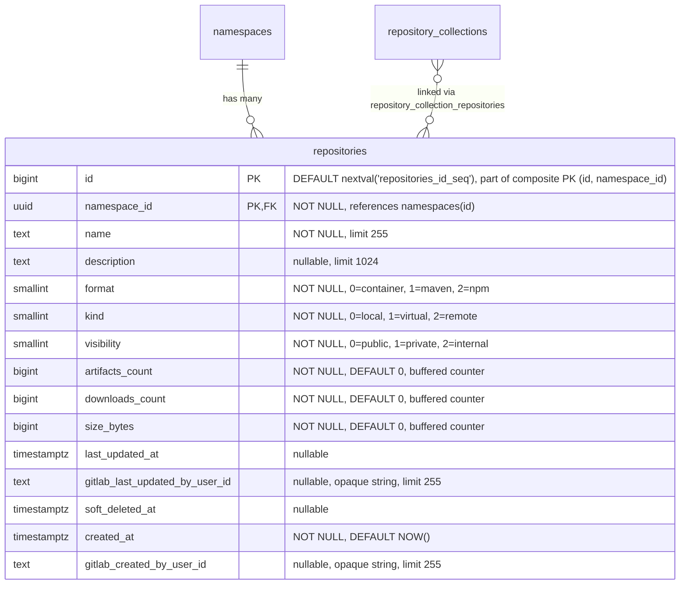

- **repositories**: すべてのリポジトリの親エンティティです。`format` はアーティファクトフォーマット（container、Maven、npm）を識別します。`kind` はリポジトリの種別（ローカル、仮想、リモート）を識別します。リポジトリは [`repository_collection_repositories`](#repository-collection-repositories) 結合テーブルを介してリポジトリコレクションにリンクされ、リポジトリがその名前空間内の 1 つ以上のリポジトリコレクションに属することを可能にします。MVP の期間中は、すべてのリポジトリが名前空間のデフォルトのリポジトリコレクションにリンクされます。`name` は名前空間内で一意でなければならず、これはすべての競合製品と一致します。カウンターカラム（`artifacts_count`、`downloads_count`、`size_bytes`）は、ホット行の競合を避けるために [バッファリング/非同期書き込み](#buffered-and-asynchronous-writes) を介して維持されます。`last_updated_at` は、ダウンロードではなくコンテンツの変更（アーティファクトの公開・変更・削除、キャッシュイベント）を追跡します。`gitlab_created_by_user_id` と `gitlab_last_updated_by_user_id` は、どの GitLab ユーザーがリポジトリを作成し最後に変更したかを記録します。どちらも外部キーを持たず、アプリケーション側の検証もない null 許容の不透明な参照です。これは、ユーザーレコードがモノリスに存在するためです。ユーザーハンドルとアバターのレンダリングは消費側の責任であり、AR スキーマは ID のみを格納します。これらは `namespaces.entity_id` と同じ理由で `TEXT` として格納されます。上流のユーザー ID 形式が将来変更されても（例: UUID への変更）、スキーマのマイグレーションは不要です。`description` が親にあるのは、UI が仮想リポジトリだけでなくすべてのリポジトリ種別の説明を表示するためです。`soft_deleted_at` タイムスタンプは、リポジトリがソフト削除された時刻を記録し、必要に応じた復元を可能にします。ソフト削除を親テーブルに置くことで、すべてのリポジトリ種別（ローカル、仮想、リモート）がフォーマット固有の処理なしに同じ削除セマンティクスを共有できます。`HASH(namespace_id)` で 64 パーティションにパーティショニングされます。

#### インデックス

- **`repositories`**: `(namespace_id, name)` の一意インデックス — アクティブとソフト削除済みの両方のリポジトリにわたって名前の一意性を強制し、名前の競合によって復元が失敗しないことを保証します。名前の再利用には、まずハード削除が必要です。`(namespace_id, name) WHERE soft_deleted_at IS NULL` のインデックス — アクティブリポジトリのルックアップと名前順の一覧表示のための最適化されたスキャンパスです。`(namespace_id, format) WHERE soft_deleted_at IS NULL` のインデックス — アクティブリポジトリをフォーマットでフィルターします。`(namespace_id, kind) WHERE soft_deleted_at IS NULL` のインデックス — アクティブリポジトリを種別でフィルターします。`(namespace_id, visibility) WHERE soft_deleted_at IS NULL` のインデックス — リポジトリを可視性レベルでフィルターするためのものです（可視性監査クエリ「この名前空間内で今 public になっているリポジトリはどれか？」を支えます）。ランディングページ用にソート可能なカラムごとに 1 つのインデックスを設け、すべてに `WHERE soft_deleted_at IS NULL` を付けます。`(namespace_id, artifacts_count DESC)`、`(namespace_id, downloads_count DESC)`、`(namespace_id, size_bytes DESC)`、`(namespace_id, last_updated_at DESC NULLS LAST)`。`(namespace_id, soft_deleted_at DESC) WHERE soft_deleted_at IS NOT NULL` のインデックス — この名前空間内のソフト削除済みリポジトリを削除時刻順に一覧表示します（ゴミ箱一覧クエリ「ゴミ箱に何があり、いつ削除されたか？」を支えます）。この逆の部分述語は、上記のアクティブ行の部分インデックスを反転したものです。このテーブルの他のすべての部分インデックスはゴミ箱を除外し、完全な `(namespace_id, name)` 一意インデックスは `soft_deleted_at` をキーにしていないため、これがないとゴミ箱の一覧表示は名前空間内のすべての行を訪問してフィルターおよびソートする必要が生じます。GC の対象適格性は [ADR-010](010_data_retention.md) に従い `soft_deleted_at + retention_window` から導出され、個別のカラムは不要です。

MVP の期間中は、すべてのリポジトリが単一のデフォルトのリポジトリコレクションにリンクされるため、`(namespace_id, ...)` のソートインデックスは名前空間全体のクエリとコレクションでフィルターされたクエリの両方を支えます。MVP 後、名前空間が複数のリポジトリコレクションを持つようになると、コレクションでフィルターされたクエリは `repository_collection_repositories` を介して結合されます。追加の補助インデックスは、リポジトリコレクションが公開される際に評価されます。

#### クエリ例

- 名前空間のすべてのリポジトリ（すべてのリポジトリコレクション）を、最終更新順に一覧表示します。

  ```sql
  SELECT id, name, description, format, kind, artifacts_count,
         downloads_count, size_bytes, last_updated_at
  FROM repositories
  WHERE namespace_id = '018f4d6f-0e10-7e3a-9bfd-23a4c5d6e7f8' AND soft_deleted_at IS NULL
  ORDER BY last_updated_at DESC NULLS LAST
  LIMIT 20;
  ```

- 名前空間のリポジトリを、リポジトリコレクションでフィルターし、最終更新順に一覧表示します。

  ```sql
  SELECT r.id, r.name, r.description, r.format, r.kind, r.artifacts_count,
         r.downloads_count, r.size_bytes, r.last_updated_at
  FROM repositories r
  JOIN repository_collection_repositories rcr
    ON rcr.namespace_id = r.namespace_id AND rcr.repository_id = r.id
  WHERE r.namespace_id = '018f4d6f-0e10-7e3a-9bfd-23a4c5d6e7f8' AND rcr.repository_collection_id = 456 AND r.soft_deleted_at IS NULL
  ORDER BY r.last_updated_at DESC NULLS LAST
  LIMIT 20;
  ```

- リポジトリコレクションとフォーマットでフィルターしてリポジトリを一覧表示します。

  ```sql
  SELECT r.id, r.name, r.description, r.format, r.kind, r.artifacts_count,
         r.downloads_count, r.size_bytes, r.last_updated_at
  FROM repositories r
  JOIN repository_collection_repositories rcr
    ON rcr.namespace_id = r.namespace_id AND rcr.repository_id = r.id
  WHERE r.namespace_id = '018f4d6f-0e10-7e3a-9bfd-23a4c5d6e7f8' AND rcr.repository_collection_id = 456 AND r.format = 0
    AND r.soft_deleted_at IS NULL
  ORDER BY r.name
  LIMIT 20;
  ```

- 名前で単一のリポジトリを検索します。

  ```sql
  SELECT *
  FROM repositories
  WHERE namespace_id = '018f4d6f-0e10-7e3a-9bfd-23a4c5d6e7f8' AND name = 'my-repo' AND soft_deleted_at IS NULL;
  ```

- 可視性監査: 名前空間内のすべての public リポジトリを一覧表示します（`(namespace_id, visibility) WHERE soft_deleted_at IS NULL` の部分インデックスを使用します）。

  ```sql
  SELECT id, name, format, kind
  FROM repositories
  WHERE namespace_id = '018f4d6f-0e10-7e3a-9bfd-23a4c5d6e7f8' AND visibility = 0 AND soft_deleted_at IS NULL
  ORDER BY name;
  ```

- ゴミ箱一覧: 名前空間内のすべてのソフト削除済みリポジトリを、最近削除されたものから順に一覧表示します（`(namespace_id, soft_deleted_at DESC) WHERE soft_deleted_at IS NOT NULL` の部分インデックスを使用します）。スコープは名前空間全体であるため、管理者は「今すぐ復元可能なものは何か？」を 1 つのクエリで回答できます。親ごとのゴミ箱ビューは別個の UI の関心事であり、必要に応じて後から親をキーとするインデックスを追加することで対応できます。

  ```sql
  SELECT id, name, format, kind, soft_deleted_at
  FROM repositories
  WHERE namespace_id = '018f4d6f-0e10-7e3a-9bfd-23a4c5d6e7f8' AND soft_deleted_at IS NOT NULL
  ORDER BY soft_deleted_at DESC
  LIMIT 50;
  ```

### リポジトリコレクションリポジトリ {#repository-collection-repositories}

`repository_collection_repositories` 結合テーブルは、リポジトリを、それが属するリポジトリコレクションにマッピングします。リポジトリはその名前空間内の 1 つ以上のリポジトリコレクションのメンバーになることができ、共通のユーティリティリポジトリを複数のチームのリポジトリコレクションを通じて公開するといった共有アクセスのシナリオを可能にします。

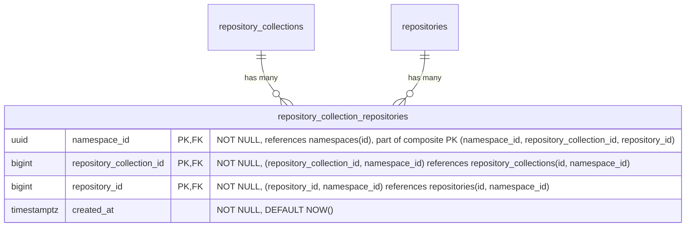

- **repository_collection_repositories**: リポジトリをリポジトリコレクションにリンクします。MVP の期間中は、すべてのリポジトリが正確に 1 つのリポジトリコレクション（名前空間のデフォルト）にリンクされますが、スキーマは複数のリンクを許可しているため、MVP 後にはリポジトリをリポジトリコレクションをまたいで共有できます。アプリケーションは、すべてのリポジトリが少なくとも 1 つのリポジトリコレクションリンクを持つという不変条件を強制します。Postgres はこれを宣言的に表現できません。複合 FK により、リポジトリコレクションとリポジトリは同じ名前空間内でのみリンクできることが保証されます。`HASH(namespace_id)` で 64 パーティションにパーティショニングされます。

#### インデックス

- **`repository_collection_repositories`**: `(namespace_id, repository_collection_id, repository_id)` の主キー — リンクの一意性を強制し、リポジトリコレクションによるルックアップを支えます。`(namespace_id, repository_id)` のインデックス — 特定のリポジトリが属するすべてのリポジトリコレクションを検索します。

#### クエリ例

- リポジトリが属するすべてのリポジトリコレクションを一覧表示します。

  ```sql
  SELECT repository_collection_id
  FROM repository_collection_repositories
  WHERE namespace_id = '018f4d6f-0e10-7e3a-9bfd-23a4c5d6e7f8' AND repository_id = 789;
  ```

- リポジトリをリポジトリコレクションにリンクします。

  ```sql
  INSERT INTO repository_collection_repositories (namespace_id, repository_collection_id, repository_id)
  VALUES ('018f4d6f-0e10-7e3a-9bfd-23a4c5d6e7f8', 456, 789)
  ON CONFLICT (namespace_id, repository_collection_id, repository_id) DO NOTHING;
  ```

### ライフサイクルポリシー {#lifecycle-policies}

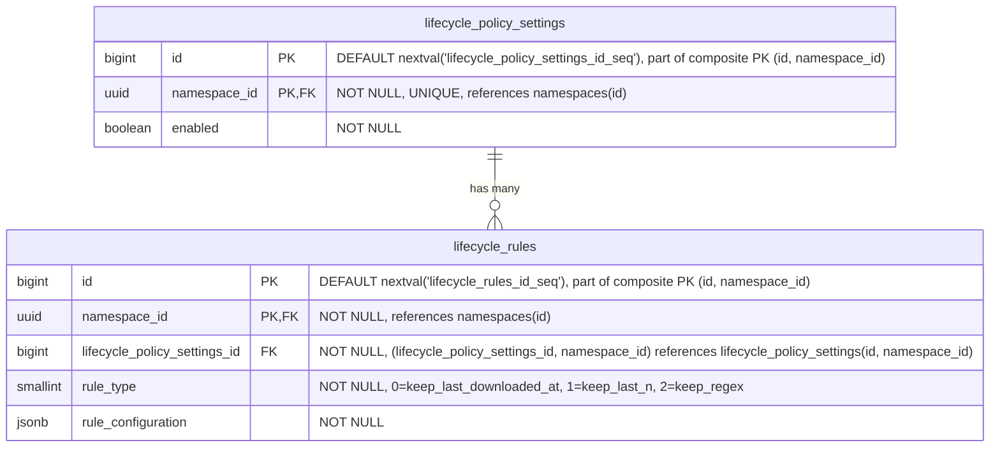

- **lifecycle_policy_settings**: 名前空間レベルでライフサイクル管理の設定を定義し、すべてのリポジトリのデフォルトポリシーとして機能します。有効化されると、関連するライフサイクルルールが名前空間全体に適用されます。これらのポリシーは、リポジトリレベルのポリシーによって [オーバーライド](#repository-level-overrides) できます。`HASH(namespace_id)` で 64 パーティションにパーティショニングされます。
- **lifecycle_rules**: 名前空間レベルで特定のアーティファクトのライフサイクルの挙動を支配する、個々の保持およびクリーンアップのルールを指定します。これらのルールは、リポジトリレベルで [オーバーライド](#repository-level-overrides) されない限り、すべてのリポジトリに適用されます。ポリシーレコードごとのライフサイクルルールの数は、ルール評価時のパフォーマンス低下を防ぐために制限されます。これは、ユーザーが、たとえば特定のアーティファクトをどのくらいの期間保持するかを指定するために使用されます（例: Maven の snapshot ファイルは 1 か月のみ保持するなど）。`HASH(namespace_id)` で 64 パーティションにパーティショニングされます。

#### インデックス

- **`lifecycle_policy_settings`**: `(namespace_id)` の一意インデックス — 名前空間ごとに 1 つのポリシー設定レコードです。
- **`lifecycle_rules`**: `(namespace_id, lifecycle_policy_settings_id)` のインデックス — 特定のポリシーのすべてのルールを取得します。

リポジトリレベルのオーバーライドテーブルも同じパターンに従います。設定テーブルには `(namespace_id, repository_id)` の一意インデックス、ルールテーブルには `(namespace_id, <format>_repository_lifecycle_policy_settings_id)` のインデックスを設けます。

#### クエリ例

- 特定の名前空間のポリシーを取得します

  ```sql
  SELECT lp.*
  FROM lifecycle_policy_settings lp
  WHERE lp.namespace_id = '018f4d6f-0e10-7e3a-9bfd-23a4c5d6e7f8';
  ```

- 特定のアーティファクトリポジトリのポリシーを取得します

  ```sql
  SELECT *
  FROM container_repository_lifecycle_policy_settings
  WHERE container_repository_lifecycle_policy_settings.namespace_id = '018f4d6f-0e10-7e3a-9bfd-23a4c5d6e7f8'
    AND container_repository_lifecycle_policy_settings.repository_id = 123;
  ```

- 新しいライフサイクルルールを作成します

  ```sql
  INSERT INTO lifecycle_rules (namespace_id, lifecycle_policy_settings_id, rule_type, rule_configuration)
  VALUES ('018f4d6f-0e10-7e3a-9bfd-23a4c5d6e7f8', 123, 1, '{"count": 10}'::jsonb);
  ```

- ライフサイクルルールを更新します

  ```sql
  UPDATE lifecycle_rules
  SET rule_configuration = '{"count": 20}'::jsonb
  WHERE namespace_id = '018f4d6f-0e10-7e3a-9bfd-23a4c5d6e7f8'
    AND id = 123;
  ```

- ライフサイクルルールを破棄します

  ```sql
  DELETE FROM lifecycle_rules
  WHERE namespace_id = '018f4d6f-0e10-7e3a-9bfd-23a4c5d6e7f8'
    AND id = 123;
  ```

#### リポジトリレベルのオーバーライド {#repository-level-overrides}

各リポジトリ種別（[container](#container-repositories)、[maven](#maven-repositories)、[npm](#npm-repositories)）は、名前空間レベルの値に対するオーバーライドを提供するために、同様に名付けられたテーブルを持ちます。これにより、名前空間（最低）→ リポジトリ（最高）という優先順位システムが生まれます。オーバーライドは、`repository_id` を介して親の `repositories` テーブルを参照します。


（`artifact_type` は、各アーティファクトフォーマットにオーバーライドテーブルがあるため、`container`、`maven`、`npm` に置き換える必要があります。これらのオーバーライドは、ローカル、仮想、リモートのリポジトリにも同様に適用されます。`repository_id` FK は親の `repositories` テーブルを参照し、フォーマット専用のテーブルはリポジトリの `format` カラムによって決定されます。）

これらのテーブルは、ある意味で [カスケード設定](https://docs.gitlab.com/development/cascading_settings/) のように機能します。その説明は、パーティショニングを含め、[名前空間レベル](#lifecycle-policies) の同様に名付けられたテーブルとまったく同じです。すべてのオーバーライドテーブルは `HASH(namespace_id)` で 64 パーティションにパーティショニングされます。現在の 2 階層の優先順位システム（名前空間 → リポジトリ）は、MVP 後にリポジトリコレクションが公開される際に、3 階層（名前空間 → リポジトリコレクション → リポジトリ）に拡張できます。これには、同じパターンに従ってリポジトリコレクションレベルのオーバーライドテーブルを追加する必要があります。既存の名前空間レベルまたはリポジトリレベルのテーブルへの変更は不要です。

### Container リポジトリ {#container-repositories}

この部分での課題は、[OCI Distribution Spec v1.1](https://github.com/opencontainers/distribution-spec/blob/main/spec.md) に準拠することです。

<!--TODO This link will not live for long since it's an artifact output-->
このアプローチは、[GitLab Container Registry のスキーマ](https://gitlab.com/gitlab-org/container-registry/-/jobs/12449560500/artifacts/file/db-DAG.png) から大きく着想を得ています。

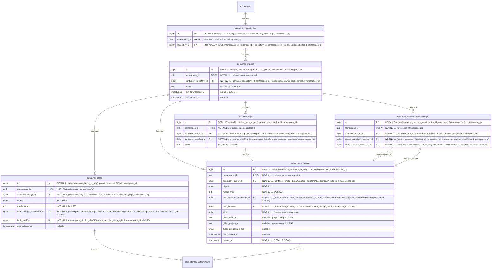

- **container_repositories**: 複数のイメージのコンテナです。各リポジトリは、独立したバージョン管理を持つ複数のイメージをホストできます。名前、可視性、クロスフォーマットクエリのために、`repository_id` を介して親の `repositories` テーブルを参照します。`HASH(namespace_id)` で 64 パーティションにパーティショニングされます。
- **container_images**: リポジトリ内の名前付きコンテナイメージ（例: `myapp`、`backend`）を表します。`last_downloaded_at` は、イメージが最後に pull された時刻を記録します。[バッファリング/非同期書き込み](#buffered-and-asynchronous-writes) を介して維持されます。`keep_last_downloaded_at` ライフサイクルルールによって、ダウンロードベースの保持を評価するために使用されます（[ADR-010](010_data_retention.md)）。`soft_deleted_at` タイムスタンプは、イメージがソフト削除された時刻を記録し、必要に応じた復元を可能にします。`HASH(namespace_id)` で 64 パーティションにパーティショニングされます。
- **container_blobs**: コンテナイメージを構成する、個々のコンテンツアドレス可能なレイヤーと設定オブジェクトを格納します。マニフェストとその構成レイヤー（blob）の関係は暗黙的であり（実行時にマニフェストの内容を解析することで決定されます）、データベースの外部キーとしてはモデル化されていません。`soft_deleted_at` タイムスタンプは、blob がソフト削除された時刻を記録し、必要に応じた復元を可能にします。`HASH(namespace_id)` で 64 パーティションにパーティショニングされます。
- **container_manifests**: 特定のイメージバージョンの設定とレイヤーを記述するイメージマニフェストを表します。`size` カラムは、ここをルートとするマニフェストツリーの合計バイトサイズを保持します。すなわち、このマニフェスト自身のペイロードに加え、そこから到達可能なすべての blob を、マニフェストリストや OCI インデックスの子マニフェストを介して推移的に含めたものです。`gitlab_user_id` は、どの GitLab ユーザーがこのマニフェストをプッシュしたかを記録します。外部キーを持たない null 許容の不透明なテキスト参照であり、[repositories](#repositories) の同等カラムと同じ根拠です。ユーザーレコードはモノリスに存在し、ユーザーハンドルとアバターのレンダリングは消費側の責任で、AR スキーマは ID のみを格納し、`TEXT` により上流のユーザー ID 形式の将来の変更からスキーマを隔離します。`gitlab_project_id` と `gitlab_git_commit_sha` は、その帰属情報を公開コンテキストの残りで拡張します。`gitlab_project_id` はプッシュ元の GitLab プロジェクト（例: `CI_PROJECT_ID`）であり、`gitlab_user_id` と同じモノリス参照の理由で null 許容の不透明なテキストとして格納されます。`gitlab_git_commit_sha` は公開時の Git コミット（例: `CI_COMMIT_SHA`）であり、ハッシュカラムのスキーマ規約に従って null 許容の `bytea` として格納されます。可変長で、SHA-1（20 バイト）と SHA-256（32 バイト）の両方に適合します。これはモノリス参照ではなく公開時の事実であるため、外部キーは不要です。CI コンテキストなしでプッシュが到着した場合（例: 開発者のワークステーションからの手動プッシュ）、両方とも NULL になります。`soft_deleted_at` タイムスタンプは、マニフェストがソフト削除された時刻を記録し、必要に応じた復元を可能にします。`created_at` は、マニフェストが最初にプッシュされた時刻を記録します。名前空間ごとの時系列インデックスと組み合わせることで、公開履歴および時間範囲のアーティファクト来歴クエリ（例: 「午前 2 時から午前 8 時の間にこの名前空間に何がプッシュされたか？」）を支えます。公開イベント自体は削除によって消去されないため、ソフト削除済みの行も公開履歴に引き続き表示されます。`HASH(namespace_id)` で 64 パーティションにパーティショニングされます。
- **container_manifest_relationships**: 親マニフェストが複数の他のマニフェストを参照できる、Docker のマニフェストリストと OCI インデックス（マルチアーキテクチャイメージなど）を扱います。`HASH(namespace_id)` で 64 パーティションにパーティショニングされます。
- **container_tags**: 特定のマニフェストを指す、人間が読める名前（例: `latest`、`v1.2.3`）を提供します。`HASH(namespace_id)` で 64 パーティションにパーティショニングされます。
- **blob_storage_attachments**: 詳細は [Blob ストレージ](#blob-storage) のセクションを参照してください。

`container_blobs` テーブルは、他のコンテナレジストリのアーキテクチャが行うように、コンテナレジストリの物理的な blob を直接格納することはありません。ここでの違いは、blob のストレージが（重複排除とガベージコレクションとともに）[blob ストレージ](#blob-storage) テーブルで扱われる点です。したがって、`container_*` レベルでは、単に `blob_storage_attachments` レコードへの参照を格納するだけで済みます。

#### インデックス

- **`container_repositories`**: `(namespace_id, repository_id)` の一意インデックス — 親リポジトリ参照により container リポジトリを検索します。
- **`container_images`**: `(namespace_id, container_repository_id, name) WHERE soft_deleted_at IS NULL` の一意インデックス — イメージ名はリポジトリ内で一意のイメージを識別し、重複すると OCI の名前ベースのルックアップが壊れます。部分条件により、ソフト削除後に同じ名前でイメージを再作成できます。`(namespace_id, container_repository_id, last_downloaded_at NULLS FIRST) WHERE soft_deleted_at IS NULL` のインデックス — `keep_last_downloaded_at` ライフサイクルルールの評価をサポートします。リポジトリ内のすべてのイメージをスキャンして行ごとにフィルターするのではなく、境界付きの範囲スキャンによって、期限切れになったイメージのみを返します。`NULLS FIRST` は、ダウンロードされたことのないイメージを最も古い行とグループ化するため、両方が同じ範囲スキャンで返されます。
- **`container_blobs`**: `(namespace_id, container_image_id, digest) WHERE soft_deleted_at IS NULL` の一意インデックス — blob のダイジェストはコンテンツアドレス可能であり、同じイメージ内の同じダイジェストは定義上同じ blob です。部分条件により、ソフト削除後に同じダイジェストを再プッシュできます。`(namespace_id, blob_storage_attachment_id)` のインデックス — ストレージアタッチメントにより blob を検索します。`(namespace_id, blob_sha256)` のインデックス — 格納された blob の sha256 から、それを参照するすべての container blob への逆引きであり、クロスフォーマットのチェックサム検索や、脆弱性影響クエリ「この侵害されたダイジェストを参照しているイメージはどれか？」を支えます。既存の `(namespace_id, container_image_id, digest)` インデックスはイメージをキーとしており、1 つのイメージ内でしかスキャンできないため、このインデックスがないとクエリは名前空間ごとのパーティションスキャンにフォールバックします。この MR の他のすべての逆引きインデックスにも同じ形が適用されます。無条件（`soft_deleted_at` 述語なし）であるため、かつて参照されたダイジェストは監査証跡に引き続き表示されます。現在影響を受けているアーティファクトのみを求める脆弱性影響では、クエリ時に親テーブル（イメージ/バージョン/パッケージ）への結合に `soft_deleted_at IS NULL` を追加します。これは小さな中間集合に対する安価な後置フィルターです。
- **`container_manifests`**: `(namespace_id, container_image_id, digest) WHERE soft_deleted_at IS NULL` の一意インデックス — マニフェストのダイジェストはコンテンツアドレス可能であり、同じイメージ内の同じダイジェストは定義上同じマニフェストです。部分条件により、ソフト削除後に同じダイジェストを再プッシュできます。`(namespace_id, blob_storage_attachment_id)` のインデックス — ストレージアタッチメントによりマニフェストを検索します。`(namespace_id, blob_sha256)` のインデックス — マニフェストペイロードの格納された blob の sha256 から、それを参照するすべてのマニフェストへの逆引きであり、クロスフォーマットのチェックサム検索を支えます。[`container_blobs`](#container-repositories) のインデックスを反映しており、単一の sha256 ルックアップでレイヤーとマニフェストの両方の参照を 1 回の走査で返します。`(namespace_id, soft_deleted_at DESC) WHERE soft_deleted_at IS NOT NULL` のインデックス — ソフト削除済みマニフェストを削除時刻順に一覧表示し、container イメージのアーティファクト粒度のゴミ箱一覧クエリを支えます。`(namespace_id, created_at DESC)` のインデックス — 名前空間にわたる時系列スキャンであり、公開履歴のページネーションと時間範囲のアーティファクト来歴クエリを支えます。無条件（`soft_deleted_at` 述語なし）であるため、後でソフト削除された公開イベントも監査証跡に引き続き表示されます。
- **`container_manifest_relationships`**: `(namespace_id, parent_container_manifest_id, child_container_manifest_id)` の一意インデックス — 親子関係の重複を防ぎ、特定の親マニフェストのすべての子を検索します。`(namespace_id, child_container_manifest_id)` のインデックス — 特定の子マニフェストのすべての親を検索します。`(namespace_id, container_image_id)` のインデックス — 特定のイメージのすべてのマニフェスト関係を検索します。
- **`container_tags`**: `(namespace_id, container_image_id, name)` の一意インデックス — イメージ内で名前によりタグを検索します。`(namespace_id, container_manifest_id)` のインデックス — 特定のマニフェストを指すすべてのタグを検索します。

#### クエリ例

- 名前でイメージを取得します

  ```sql
  SELECT *
  FROM container_images
  WHERE namespace_id = '018f4d6f-0e10-7e3a-9bfd-23a4c5d6e7f8' AND container_repository_id = 123 AND name = 'myapp/backend'
    AND soft_deleted_at IS NULL;
  ```

- リポジトリ ID について、ダイジェストで blob を取得します

  ```sql
  SELECT cb.*
  FROM container_blobs cb
  JOIN container_images ci
    ON cb.container_image_id = ci.id AND cb.namespace_id = ci.namespace_id
  WHERE ci.namespace_id = '018f4d6f-0e10-7e3a-9bfd-23a4c5d6e7f8' AND ci.container_repository_id = 123
    AND cb.digest = 'sha256:abcd1234...'::bytea
    AND ci.soft_deleted_at IS NULL AND cb.soft_deleted_at IS NULL;
  ```

- リポジトリ ID について、ダイジェストでマニフェストを取得します

  ```sql
  SELECT cm.*
  FROM container_manifests cm
  JOIN container_images ci
    ON cm.container_image_id = ci.id AND cm.namespace_id = ci.namespace_id
  WHERE ci.namespace_id = '018f4d6f-0e10-7e3a-9bfd-23a4c5d6e7f8' AND ci.container_repository_id = 123
    AND cm.digest = 'sha256:efgh5678...'::bytea
    AND ci.soft_deleted_at IS NULL AND cm.soft_deleted_at IS NULL;
  ```

- チェックサム検索と脆弱性影響: 格納された blob の `sha256` を与えて、それを参照する名前空間内のすべてのアーティファクトを検索します（各フォーマットテーブルの `(namespace_id, blob_sha256)` インデックスを使用します）。`namespace_id` の等価条件によりテーブルごとに単一のパーティションに絞り込まれ、その後インデックスがパーティションをスキャンする代わりに一致する行を直接返します。チェックサム検索はすべての参照を返します。脆弱性影響（「この侵害されたダイジェストの影響を現在受けているアーティファクトはどれか？」）は、結果をアクティブなアーティファクトに制限するために `soft_deleted_at IS NULL` を追加します。

  ```sql
  -- Single format: container layer/config blobs referencing the digest
  SELECT cb.id, cb.container_image_id, cb.digest
  FROM container_blobs cb
  WHERE cb.namespace_id = '018f4d6f-0e10-7e3a-9bfd-23a4c5d6e7f8'
    AND cb.blob_sha256 = 'sha256:abcd1234...'::bytea;

  -- Cross-format: every artifact referencing the digest, active rows only (vulnerability impact)
  SELECT 'container_blob' AS artifact_kind, cb.id AS artifact_id, cb.container_image_id AS parent_id
  FROM container_blobs cb
  WHERE cb.namespace_id = '018f4d6f-0e10-7e3a-9bfd-23a4c5d6e7f8'
    AND cb.blob_sha256 = 'sha256:abcd1234...'::bytea AND cb.soft_deleted_at IS NULL
  UNION ALL
  SELECT 'container_manifest', cm.id, cm.container_image_id
  FROM container_manifests cm
  WHERE cm.namespace_id = '018f4d6f-0e10-7e3a-9bfd-23a4c5d6e7f8'
    AND cm.blob_sha256 = 'sha256:abcd1234...'::bytea AND cm.soft_deleted_at IS NULL
  UNION ALL
  SELECT 'maven_file', mf.id, mf.maven_version_id
  FROM maven_files mf
  WHERE mf.namespace_id = '018f4d6f-0e10-7e3a-9bfd-23a4c5d6e7f8'
    AND mf.blob_sha256 = 'sha256:abcd1234...'::bytea AND mf.soft_deleted_at IS NULL
  UNION ALL
  SELECT 'npm_file', nf.id, nf.npm_version_id
  FROM npm_files nf
  WHERE nf.namespace_id = '018f4d6f-0e10-7e3a-9bfd-23a4c5d6e7f8'
    AND nf.blob_sha256 = 'sha256:abcd1234...'::bytea AND nf.soft_deleted_at IS NULL;
  ```

  同じ `(namespace_id, blob_sha256)` のアクセスパスは、キャッシュ側のテーブル（`container_remote_blobs`、`container_remote_manifests`、`maven_remote_files`、`npm_remote_files`）および `npm_metadata_files` / `npm_remote_metadata_files` にも適用されます。キャッシュされた参照もカバーするには、`UNION ALL` をそれらのテーブルにも拡張してください。

### Container リモートリポジトリ {#container-remote-repositories}

リモートリポジトリは、プロキシおよびキャッシュできる外部のコンテナレジストリを表します。これらは独自のライフサイクルを持つスタンドアロンのエンティティであり、複数の仮想リポジトリ間で共有可能です。これらは、親の `repositories` テーブルを介して仮想リポジトリの upstream から参照されます。


- **container_remote_repositories**: 外部のコンテナレジストリを表します。URL、オプションの認証 URL（`auth_url`）、認証情報、キャッシュ TTL（`cache_validity_hours`）を含みます。ヘルスチェックのステータスは監視のために追跡されます。`repository_id` を介して親の `repositories` テーブルを参照します。リモートリポジトリはスタンドアロンであるため、同じリモートを使用する 2 つの仮想リポジトリは 1 つのキャッシュを共有します。`HASH(namespace_id)` で 64 パーティションにパーティショニングされます。
- **container_remote_images**: リモートリポジトリ内のキャッシュされたコンテナイメージです。`container_images` を反映しています。`last_downloaded_at` は、キャッシュされたイメージが最後に pull された時刻を記録します。ホット行の競合を避けるために、バッファリング/非同期書き込み（`repositories.downloads_count` と同じパターン）を介して維持されます。`keep_last_downloaded_at` ライフサイクルルールとキャッシュ保持の評価によって使用されます（[ADR-010](010_data_retention.md)）。`HASH(namespace_id)` で 64 パーティションにパーティショニングされます。
- **container_remote_blobs**: キャッシュされたレイヤーまたは設定 blob です。`HASH(namespace_id)` で 64 パーティションにパーティショニングされます。
- **container_remote_manifests**: キャッシュされたイメージマニフェストです。`size` カラムは、このキャッシュが把握しているサブツリーのバイトフットプリントを保持します。すなわち、キャッシュ時点でのマニフェスト自身のペイロードに、子が到着するにつれて各子の `size` を加えたものです。イメージマニフェストの場合、この値はキャッシュ時点で完全です。マニフェストリストと OCI インデックスの場合、子が取得されるにつれて完全なツリーフットプリントに段階的に収束し、一部の子が pull されない場合は部分的なままになることがあります。この段階的なセマンティクスは、遅延リモートキャッシングを反映しています。`size` を完全に保つためだけに子を先行取得すると、遅延設計が損なわれます。`created_at` は、マニフェストが最初にキャッシュされた時刻を記録し、ローカルの同等物（[`container_manifests`](#container-repositories)）と同じ公開履歴および時間範囲の来歴スキャンを支えます。`HASH(namespace_id)` で 64 パーティションにパーティショニングされます。
- **container_remote_manifest_relationships**: キャッシュされたマルチアーキテクチャのマニフェストリスト関係です。ローカルと同じ構造です。`HASH(namespace_id)` で 64 パーティションにパーティショニングされます。
- **container_remote_tags**: キャッシュされたタグからマニフェストへのマッピングです。タグは可変のポインターです。キャッシュの再検証時に、タグが新しいマニフェストに再ポイントされることがあります。`upstream_checked_at` は、タグが upstream のレジストリに対して最後に検証された時刻を記録します。再検証が必要かどうかを判断するために `cache_validity_hours` と比較されます。`upstream_etag` は、upstream から返された ETag を格納し、条件付きリクエスト（`If-None-Match`）を可能にして、タグが依然として同じマニフェストを指している場合に完全なマニフェスト解決を回避します。マニフェストと blob は、暗号学的ハッシュによってコンテンツアドレス可能であるため、鮮度の追跡を必要としません。格納されたバイトがダイジェストと一致すれば、コンテンツが正しいことが保証されます。`HASH(namespace_id)` で 64 パーティションにパーティショニングされます。
- **blob_storage_attachments**: 詳細は [Blob ストレージ](#blob-storage) のセクションを参照してください。

#### インデックス

- **`container_remote_repositories`**: `(namespace_id, repository_id)` の一意インデックス — 親参照によりリモートリポジトリを検索します。
- **`container_remote_images`**: `(namespace_id, container_remote_repository_id, name) WHERE soft_deleted_at IS NULL` の一意インデックス — 名前でキャッシュされたイメージを検索します。部分条件により、ソフト削除後に同じ名前でイメージを再作成できます。
- **`container_remote_blobs`**: `(namespace_id, container_remote_image_id, digest) WHERE soft_deleted_at IS NULL` の一意インデックス — イメージ内でダイジェストによりキャッシュされた blob を検索します。部分条件により、ソフト削除後に同じダイジェストを再キャッシュできます。`(namespace_id, blob_storage_attachment_id)` のインデックス — ストレージアタッチメントにより blob を検索します。`(namespace_id, blob_sha256)` のインデックス — 格納された blob の sha256 から、それを参照するすべてのキャッシュされた blob への逆引きであり、ローカルの [`container_blobs`](#container-repositories) インデックスを反映して、チェックサム検索と脆弱性影響がキャッシュ側の参照もカバーするようにします。
- **`container_remote_manifests`**: `(namespace_id, container_remote_image_id, digest) WHERE soft_deleted_at IS NULL` の一意インデックス — イメージ内でダイジェストによりキャッシュされたマニフェストを検索します。部分条件により、ソフト削除後に同じダイジェストを再キャッシュできます。`(namespace_id, blob_storage_attachment_id)` のインデックス — ストレージアタッチメントによりマニフェストを検索します。`(namespace_id, blob_sha256)` のインデックス — マニフェストペイロードの格納された blob の sha256 から、それを参照するすべてのキャッシュされたマニフェストへの逆引きであり、ローカルの [`container_manifests`](#container-repositories) インデックスを反映しています。`(namespace_id, soft_deleted_at DESC) WHERE soft_deleted_at IS NOT NULL` のインデックス — ソフト削除済みのキャッシュされたマニフェストを削除時刻順に一覧表示し、キャッシュされた container イメージのアーティファクト粒度のゴミ箱一覧クエリを支えます。`(namespace_id, created_at DESC)` のインデックス — 名前空間にわたる時系列スキャンであり、ローカルの [`container_manifests`](#container-repositories) インデックスを反映して、キャッシュ側の公開履歴と来歴をカバーします。ローカルのインデックスと同じ監査証跡の理由で無条件（`soft_deleted_at` 述語なし）です。
- **`container_remote_manifest_relationships`**: `(namespace_id, parent_container_remote_manifest_id, child_container_remote_manifest_id)` の一意インデックス — 親子関係の重複を防ぎます。`(namespace_id, child_container_remote_manifest_id)` のインデックス — 特定の子マニフェストのすべての親を検索します。`(namespace_id, container_remote_image_id)` のインデックス — 特定のイメージのすべてのマニフェスト関係を検索します。
- **`container_remote_tags`**: `(namespace_id, container_remote_image_id, name)` の一意インデックス — イメージ内で名前によりタグを検索します。`(namespace_id, container_remote_manifest_id)` のインデックス — 特定のマニフェストを指すすべてのタグを検索します。

#### クエリ例

- リモートリポジトリを作成します

  ```sql
  -- 名前空間のデフォルトのリポジトリコレクションを解決します
  SELECT id FROM repository_collections WHERE namespace_id = '018f4d6f-0e10-7e3a-9bfd-23a4c5d6e7f8' AND is_default = true;
  -- 親リポジトリを作成します
  INSERT INTO repositories (namespace_id, name, format, kind, visibility)
  VALUES ('018f4d6f-0e10-7e3a-9bfd-23a4c5d6e7f8', 'docker-hub', 0, 2, 1)
  RETURNING id;
  -- リポジトリをリポジトリコレクションにリンクします
  INSERT INTO repository_collection_repositories (namespace_id, repository_collection_id, repository_id)
  VALUES ('018f4d6f-0e10-7e3a-9bfd-23a4c5d6e7f8', <repository_collection_id>, <returned_id>);
  -- 次にフォーマット専用のレコードを作成します
  INSERT INTO container_remote_repositories (namespace_id, repository_id, url, encrypted_username, encrypted_password)
  VALUES ('018f4d6f-0e10-7e3a-9bfd-23a4c5d6e7f8', <returned_id>, 'https://registry.hub.docker.com', $1, $2);
  ```

- キャッシュされたマニフェストが最新かどうかを確認します

  ```sql
  SELECT crm.digest
  FROM container_remote_manifests crm
  JOIN container_remote_tags crt
    ON crt.container_remote_manifest_id = crm.id AND crt.namespace_id = crm.namespace_id
  JOIN container_remote_images cri
    ON crt.container_remote_image_id = cri.id AND crt.namespace_id = cri.namespace_id
  WHERE cri.namespace_id = '018f4d6f-0e10-7e3a-9bfd-23a4c5d6e7f8'
    AND cri.container_remote_repository_id = 789
    AND cri.name = 'library/nginx'
    AND crt.name = 'latest'
    AND cri.soft_deleted_at IS NULL AND crm.soft_deleted_at IS NULL;
  ```

- ダイジェストでキャッシュされた blob を pull します（blob ストレージへの読み取りパスのショートカット）

  ```sql
  SELECT bsb.object_storage_key, bsb.size
  FROM container_remote_blobs crb
  JOIN blob_storage_blobs bsb
    ON bsb.namespace_id = crb.namespace_id AND bsb.sha256 = crb.blob_sha256
  WHERE crb.namespace_id = '018f4d6f-0e10-7e3a-9bfd-23a4c5d6e7f8'
    AND crb.container_remote_image_id = 456
    AND crb.digest = 'sha256:abcd1234...'::bytea
    AND crb.soft_deleted_at IS NULL;
  ```

### Container 仮想リポジトリ {#virtual-container-repositories}

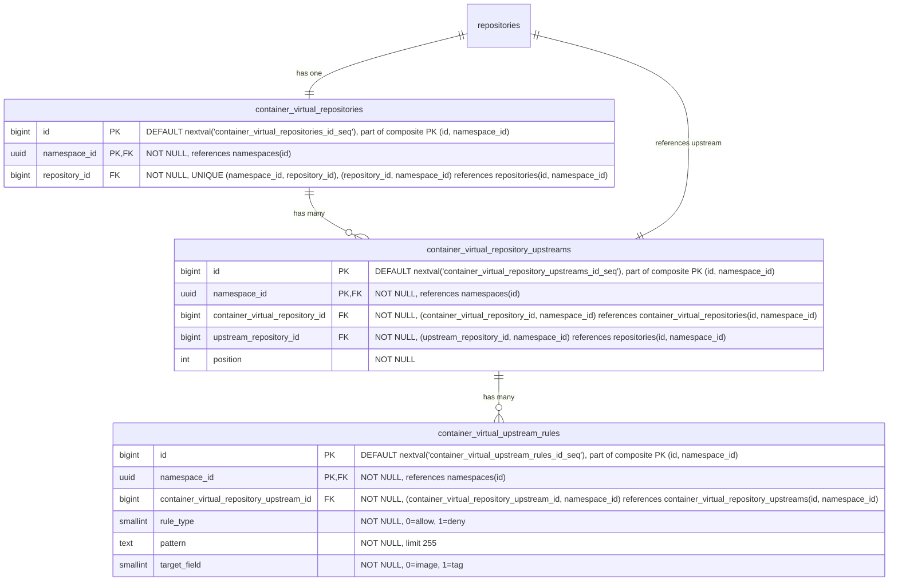

- **container_virtual_repositories**: コンテナイメージ用の仮想リポジトリです。名前、可視性、クロスフォーマットクエリのために、`repository_id` を介して親の `repositories` テーブルを参照します。`HASH(namespace_id)` で 64 パーティションにパーティショニングされます。
- **container_virtual_repository_upstreams**: 仮想リポジトリとその upstream を結合するテーブルです。各仮想リポジトリは、順序付けられた upstream のリストを持ちます。各エントリは `upstream_repository_id` を介して upstream リポジトリを参照し、これは `repositories(namespace_id, id)` を指します。複合 FK `(namespace_id, upstream_repository_id)` は、upstream が同じ名前空間内にあることを強制します。これはレジストリが名前空間にスコープされること（[ADR-001](001_organizations_as_anchor_point.md)）と一貫しています。`HASH(namespace_id)` で 64 パーティションにパーティショニングされます。
- **container_virtual_upstream_rules**: upstream の許可/拒否フィルタールールを定義します。各ルールは、この upstream を通じて解決する際にどのアーティファクトを含めるか除外するかを制御するために、ワイルドカードパターンとターゲットフィールドを指定します。パターンは MVP ではワイルドカードのみです。正規表現のサポートは、顧客からのフィードバックがそれを正当化するまで延期されています（[ディスカッション](https://gitlab.com/gitlab-org/gitlab/-/work_items/597754#note_3291871207)）。ルールは（リモートリポジトリごとではなく）upstream 参照ごとに保持され、include/exclude パターンが仮想 upstream の関連付けごとに設定される JFrog モデルと一致します。`HASH(namespace_id)` で 64 パーティションにパーティショニングされます。

#### インデックス

- **`container_virtual_repositories`**: `(namespace_id, repository_id)` の一意インデックス — 親参照により仮想リポジトリを検索します。
- **`container_virtual_repository_upstreams`**: `(namespace_id, container_virtual_repository_id, position) DEFERRABLE INITIALLY DEFERRED` の一意インデックス — 仮想リポジトリの順序付けられた upstream を取得します。トランザクション内での並べ替えを可能にするために deferrable です。`(namespace_id, container_virtual_repository_id, upstream_repository_id)` の一意インデックス — 同じ upstream が仮想リポジトリに 2 回追加されるのを防ぎます。
- **`container_virtual_upstream_rules`**: `(namespace_id, container_virtual_repository_upstream_id)` のインデックス — 特定の upstream のすべてのルールを取得します。

#### クエリ例

- 仮想リポジトリを作成します

  ```sql
  -- まず親リポジトリを作成します
  INSERT INTO repositories (namespace_id, name, format, kind, visibility)
  VALUES ('018f4d6f-0e10-7e3a-9bfd-23a4c5d6e7f8', 'my-virtual-repo', 0, 1, 1)
  RETURNING id;
  -- リポジトリをリポジトリコレクションにリンクします
  INSERT INTO repository_collection_repositories (namespace_id, repository_collection_id, repository_id)
  VALUES ('018f4d6f-0e10-7e3a-9bfd-23a4c5d6e7f8', 456, <returned_id>);
  -- 次にフォーマット専用のレコードを作成します
  INSERT INTO container_virtual_repositories (namespace_id, repository_id)
  VALUES ('018f4d6f-0e10-7e3a-9bfd-23a4c5d6e7f8', <returned_id>);
  ```

- 仮想リポジトリを upstream に関連付けます

  ```sql
  INSERT INTO container_virtual_repository_upstreams (namespace_id, container_virtual_repository_id, upstream_repository_id, position)
  VALUES ('018f4d6f-0e10-7e3a-9bfd-23a4c5d6e7f8', 123, 789, 1);
  ```

### Maven リポジトリ {#maven-repositories}

Maven パッケージは、ファイル（`.jar`、`.pom`、`maven-metadata.xml`）の集まりを表します。したがって、単一の Maven パッケージのダウンロードは、4 ～ 15 個の API リクエストに相当することがあります。

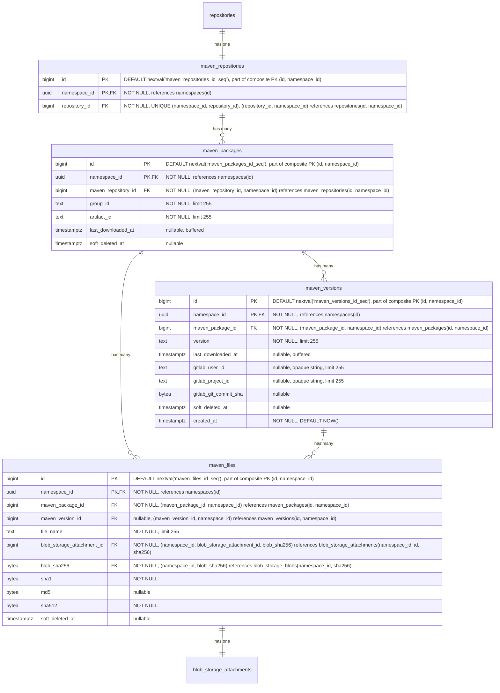

- **maven_repositories**: 複数のパッケージのコンテナです。各リポジトリは、グループ ID とアーティファクト ID で識別される複数のパッケージをホストできます。名前、可視性、クロスフォーマットクエリのために、`repository_id` を介して親の `repositories` テーブルを参照します。`HASH(namespace_id)` で 64 パーティションにパーティショニングされます。
- **maven_packages**: [グループ ID とアーティファクト ID](https://maven.apache.org/pom.html#Maven_Coordinates)（例: `com.example:myapp`）で識別される Maven パッケージを表します。`last_downloaded_at` は、パッケージのいずれかのファイルが最後にダウンロードされた時刻を記録します。[バッファリング/非同期書き込み](#buffered-and-asynchronous-writes) を介して維持されます。`NULL` は、パッケージが一度もダウンロードされていないことを意味し、`keep_last_downloaded_at` ライフサイクルルールの評価では可能な限り古いダウンロード時刻として扱われます（すなわち、ダウンロードベースの保持の下で削除対象となります）。`keep_last_downloaded_at` ライフサイクルルールによって、ダウンロードベースの保持を評価するために使用されます（[ADR-010](010_data_retention.md)）。`HASH(namespace_id)` で 64 パーティションにパーティショニングされます。
- **maven_versions**: Maven パッケージの個々の [バージョン](https://maven.apache.org/pom.html#Maven_Coordinates)（例: `1.0.0`、`2.1.3-SNAPSHOT`）を格納します。`last_downloaded_at` は、バージョンのいずれかのファイルが最後にダウンロードされた時刻を記録します。[バッファリング/非同期書き込み](#buffered-and-asynchronous-writes) を介して維持されます。`keep_last_downloaded_at` ライフサイクルルールによって使用されます。`gitlab_user_id`、`gitlab_project_id`、`gitlab_git_commit_sha` は、どの GitLab ユーザーがこのバージョンを公開したか、および公開の背後にある CI コンテキスト（プロジェクト、コミット）を記録し、[`container_manifests`](#container-repositories) の同等カラムと同じ形と根拠を持ちます。`created_at` は、バージョンが最初に公開された時刻を記録し、[`container_manifests`](#container-repositories) と同じ公開履歴および時間範囲の来歴スキャンを支えます。`HASH(namespace_id)` で 64 パーティションにパーティショニングされます。
- **maven_files**: Maven パッケージに関連付けられた個々のファイルを表します。ファイルは、`maven_version_id` が設定されたバージョン固有のもの（JAR、POM、ソース、Javadoc、チェックサム）か、`maven_version_id` が NULL のパッケージレベルのもの（`maven-metadata.xml` とそのチェックサムなど）のいずれかになります。`maven_package_id` は常に設定されており、パッケージからそのすべてのファイルへの直接のパスを提供します。また、パフォーマンスのボトルネックを改善するためにレジストリが使用する補助ファイルである場合もあります。`sha1` と `md5` カラムは、整合性検証のために [Maven プロトコルが要求するチェックサム](https://maven.apache.org/resolver/about-checksums.html) を格納します。Maven クライアントは、すべてのアーティファクトとともに `.sha1` と `.md5` のサイドカーファイルを期待します。これらのカラムは、blob の普遍的なプロパティではなく Maven プロトコルの関心事であるため、`blob_storage_blobs` ではなく `maven_files` にあります。他のフォーマット（OCI コンテナ）は SHA256 のみを使用します。これらをここに置くことで、`blob_storage_blobs` をフォーマット固有のカラムやインデックスを持たないフォーマット非依存のテーブルとして保ちます。`sha1` は Maven プロトコルが要求するため `NOT NULL` です。`md5` は、Maven 3.9 以降で [MD5 チェックサムが非推奨](https://maven.apache.org/resolver/about-checksums.html) になったため null 許容です。`sha512` は、Maven プロトコルがレジストリが提供できなければならない `.sha512` サイドカーを公開しており、その値はアップロード中にバイトが永続化される前にハンドラーを通過する際に常に計算可能であるため、`NOT NULL` です。`HASH(namespace_id)` で 64 パーティションにパーティショニングされます。
- **blob_storage_attachments**: 詳細は [Blob ストレージ](#blob-storage) のセクションを参照してください。

パッケージ名、つまりこの場合はグループ ID とアーティファクト ID、およびバージョンを同じテーブルには格納していません。その理由は、UI がこのデータにパッケージ名でアクセスするためです。パッケージ名がフォルダーであり、それを開くと各バージョンに対応するサブフォルダーが 1 つずつ存在するツリー状の UI を想像してください。この最初のリクエストは、フォルダー、つまりパッケージ名を一覧表示する必要があります。フォルダーを開くと、すべてのサブフォルダー、つまりパッケージバージョンを一覧表示するリクエストがトリガーされます。したがって、このアクセスパターンを容易にするために、2 つの専用テーブル（`maven_packages` と `maven_versions`）を用意しています。

#### インデックス

- **`maven_repositories`**: `(namespace_id, repository_id)` の一意インデックス — 親リポジトリ参照により Maven リポジトリを検索します。
- **`maven_packages`**: `(namespace_id, maven_repository_id, group_id, artifact_id) WHERE soft_deleted_at IS NULL` の一意インデックス — リポジトリ内で Maven 座標によりパッケージを検索します。部分条件により、ソフト削除後に同じ座標でパッケージを再作成できます。`(namespace_id, maven_repository_id, last_downloaded_at NULLS FIRST) WHERE soft_deleted_at IS NULL` のインデックス — `keep_last_downloaded_at` ライフサイクルルールの評価をサポートします。リポジトリ内のすべてのパッケージをスキャンして行ごとにフィルターするのではなく、境界付きの範囲スキャンによって、期限切れになったパッケージのみを返します。`NULLS FIRST` は、ダウンロードされたことのないパッケージを最も古い行とグループ化するため、両方が同じ範囲スキャンで返されます。
- **`maven_versions`**: `(namespace_id, maven_package_id, version) WHERE soft_deleted_at IS NULL` の一意インデックス — パッケージ内で特定のバージョンを検索します。部分条件により、ソフト削除後に同じ識別子でバージョンを再作成できます。`(namespace_id, maven_package_id, last_downloaded_at NULLS FIRST) WHERE soft_deleted_at IS NULL` のインデックス — `maven_packages` と同じ範囲スキャン戦略を使用して、パッケージのバージョンにスコープされた `keep_last_downloaded_at` ライフサイクルルールの評価をサポートします。`(namespace_id, soft_deleted_at DESC) WHERE soft_deleted_at IS NOT NULL` のインデックス — ソフト削除済みバージョンを削除時刻順に一覧表示し、Maven アーティファクトのアーティファクト粒度のゴミ箱一覧クエリを支えます。`(namespace_id, created_at DESC)` のインデックス — 名前空間にわたる時系列スキャンであり、公開履歴のページネーションと時間範囲のアーティファクト来歴クエリを支えます。無条件であるため、ソフト削除済みの公開イベントも監査証跡に引き続き表示されます。
- **`maven_files`**: `(namespace_id, maven_version_id, file_name) WHERE soft_deleted_at IS NULL AND maven_version_id IS NOT NULL` の一意インデックス — バージョン固有のファイル名は、バージョン内で一意でなければなりません。部分条件はソフト削除済みの行とパッケージレベルのファイルを除外します。`(namespace_id, maven_package_id, file_name) WHERE soft_deleted_at IS NULL AND maven_version_id IS NULL` の一意インデックス — パッケージレベルのファイル名（`maven-metadata.xml` など）は、パッケージ内で一意でなければなりません。`(namespace_id, blob_storage_attachment_id)` のインデックス — ストレージアタッチメントによりファイルを検索します。`(namespace_id, blob_sha256)` のインデックス — 格納された blob の sha256 から、それを参照するすべての Maven ファイルへの逆引きであり、クロスフォーマットのチェックサム検索を支えます。既存の親をキーとするインデックスはバージョンまたはパッケージをキーとしており、ダイジェストをキーとするスキャンを直接満たすことはできません。

#### クエリ例

- 特定のリポジトリ ID とパッケージ名について、パッケージバージョンを取得します。

  ```sql
  SELECT mv.*
  FROM maven_versions mv
  JOIN maven_packages mp
    ON mv.maven_package_id = mp.id AND mv.namespace_id = mp.namespace_id
  WHERE mp.namespace_id = '018f4d6f-0e10-7e3a-9bfd-23a4c5d6e7f8' AND mp.maven_repository_id = 123 AND mp.group_id = 'com.example' AND mp.artifact_id = 'myapp'
    AND mv.version = '1.0.0'
    AND mp.soft_deleted_at IS NULL AND mv.soft_deleted_at IS NULL;
  ```

- バージョン ID とファイル名を指定してファイルを取得します。

  ```sql
  SELECT mf.*
  FROM maven_files mf
  WHERE mf.namespace_id = '018f4d6f-0e10-7e3a-9bfd-23a4c5d6e7f8' AND mf.maven_version_id = 456 AND mf.file_name = 'myapp-1.0.0.jar'
    AND mf.soft_deleted_at IS NULL;
  ```

- 特定のパッケージのパッケージレベルのファイル（例: `maven-metadata.xml`）を取得します。

  ```sql
  SELECT mf.*
  FROM maven_files mf
  WHERE mf.namespace_id = '018f4d6f-0e10-7e3a-9bfd-23a4c5d6e7f8' AND mf.maven_package_id = 123 AND mf.maven_version_id IS NULL
    AND mf.soft_deleted_at IS NULL;
  ```

- ゴミ箱一覧: 名前空間内のすべてのソフト削除済み Maven バージョンを、最近削除されたものから順に一覧表示します（`(namespace_id, soft_deleted_at DESC) WHERE soft_deleted_at IS NOT NULL` の部分インデックスを使用します）。コンプライアンスのユースケースは名前空間全体（「今ゴミ箱に何があるか？」）です。親にスコープされたビュー（「このパッケージのゴミ箱に入ったバージョン」）には、別個の `(namespace_id, maven_package_id, soft_deleted_at DESC) WHERE soft_deleted_at IS NOT NULL` インデックスが有用であり、その UI が構築される場合に後から追加できます。同じパターンが [`npm_versions`](#npm-repositories)、[`container_manifests`](#container-repositories)、およびそれらのリモートの同等物に適用されます。

  ```sql
  SELECT mv.id, mv.maven_package_id, mv.version, mv.soft_deleted_at
  FROM maven_versions mv
  WHERE mv.namespace_id = '018f4d6f-0e10-7e3a-9bfd-23a4c5d6e7f8' AND mv.soft_deleted_at IS NOT NULL
  ORDER BY mv.soft_deleted_at DESC
  LIMIT 50;
  ```

### Maven リモートリポジトリ {#maven-remote-repositories}

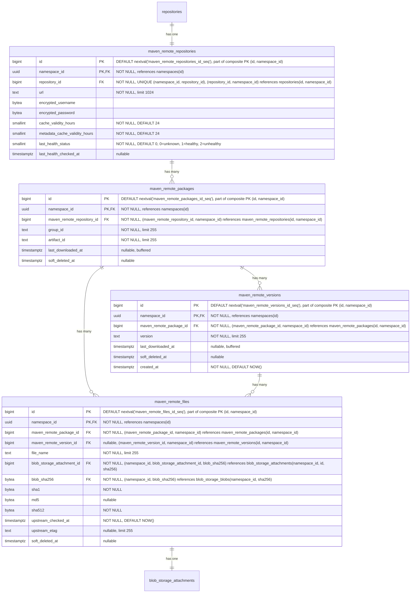

- **maven_remote_repositories**: 外部の Maven リポジトリを表します。URL、認証情報、アーティファクトのキャッシュ TTL（`cache_validity_hours`）、および `maven-metadata.xml` などのメタデータレスポンス用の個別の TTL（`metadata_cache_validity_hours`）を含みます。ヘルスチェックのステータスは監視のために追跡されます。`repository_id` を介して親の `repositories` テーブルを参照します。`HASH(namespace_id)` で 64 パーティションにパーティショニングされます。
- **maven_remote_packages**: グループ ID とアーティファクト ID で識別される、キャッシュされた Maven パッケージです。`maven_packages` を反映しています。`last_downloaded_at` は、パッケージのキャッシュされたいずれかのファイルが最後にダウンロードされた時刻を記録します。ホット行の競合を避けるために、バッファリング/非同期書き込みを介して維持されます。`keep_last_downloaded_at` ライフサイクルルールとキャッシュ保持の評価によって使用されます。`HASH(namespace_id)` で 64 パーティションにパーティショニングされます。
- **maven_remote_versions**: Maven パッケージのキャッシュされたバージョンです。`maven_versions` を反映しています。`last_downloaded_at` は、バージョンのキャッシュされたいずれかのファイルが最後にダウンロードされた時刻を記録します。ホット行の競合を避けるために、バッファリング/非同期書き込みを介して維持されます。`keep_last_downloaded_at` ライフサイクルルールとキャッシュ保持の評価によって使用されます。`created_at` は、バージョンが最初にキャッシュされた時刻を記録し、[`maven_versions`](#maven-repositories) を反映してキャッシュ側の公開履歴と来歴スキャンを支えます。`HASH(namespace_id)` で 64 パーティションにパーティショニングされます。
- **maven_remote_files**: キャッシュされたファイル（JAR、POM、チェックサム、`maven-metadata.xml`）です。null 許容の `maven_remote_version_id` は、ローカルと同じパターン、すなわちバージョン固有のファイルとパッケージレベルのファイル（`maven-metadata.xml` など）の区別を保持します。`sha1` と `md5` は、コンテンツがローカルかキャッシュかにかかわらず、Maven プロトコルがこれらのチェックサムの提供を要求するため保持されます。`sha512` は同等性の観点から追加され、ローカルの `maven_files` のカラム形を反映することで、Maven Virtual の仕様（S14）がいずれのバックエンドからでも 1 つのクエリパスで `.sha512` サイドカーを提供できるようにします。この値は、プロキシ書き込みステップ中に他のチェックサムとともにキャッシュされたバイトから計算されるため、初日から `NOT NULL` を達成できます。`upstream_checked_at` は、ファイルが upstream のリポジトリに対して最後に検証された時刻を記録します。再検証が必要かどうかを判断するために、アーティファクトファイルでは `cache_validity_hours`、メタデータファイル（例: `maven-metadata.xml`）では `metadata_cache_validity_hours` と比較されます。`upstream_etag` は、upstream から返された ETag を格納し、条件付きリクエスト（`If-None-Match`）を可能にして、変更されていないファイルの再ダウンロードを回避します。`HASH(namespace_id)` で 64 パーティションにパーティショニングされます。
- **blob_storage_attachments**: 詳細は [Blob ストレージ](#blob-storage) のセクションを参照してください。

#### インデックス

- **`maven_remote_repositories`**: `(namespace_id, repository_id)` の一意インデックス — 親参照によりリモートリポジトリを検索します。
- **`maven_remote_packages`**: `(namespace_id, maven_remote_repository_id, group_id, artifact_id) WHERE soft_deleted_at IS NULL` の一意インデックス — Maven 座標によりキャッシュされたパッケージを検索します。部分条件により、ソフト削除後に同じ座標でパッケージを再作成できます。
- **`maven_remote_versions`**: `(namespace_id, maven_remote_package_id, version) WHERE soft_deleted_at IS NULL` の一意インデックス — パッケージ内でキャッシュされたバージョンを検索します。部分条件により、ソフト削除後に同じ識別子でバージョンを再作成できます。`(namespace_id, soft_deleted_at DESC) WHERE soft_deleted_at IS NOT NULL` のインデックス — ソフト削除済みのキャッシュされたバージョンを削除時刻順に一覧表示し、キャッシュされた Maven アーティファクトのアーティファクト粒度のゴミ箱一覧クエリを支えます。`(namespace_id, created_at DESC)` のインデックス — 名前空間にわたる時系列スキャンであり、ローカルの [`maven_versions`](#maven-repositories) インデックスを反映して、キャッシュ側の公開履歴と来歴をカバーします。ローカルのインデックスと同じ監査証跡の理由で無条件（`soft_deleted_at` 述語なし）です。
- **`maven_remote_files`**: `(namespace_id, maven_remote_version_id, file_name) WHERE soft_deleted_at IS NULL AND maven_remote_version_id IS NOT NULL` の一意インデックス — バージョン固有のファイル名は、バージョン内で一意でなければなりません。`(namespace_id, maven_remote_package_id, file_name) WHERE soft_deleted_at IS NULL AND maven_remote_version_id IS NULL` の一意インデックス — パッケージレベルのファイル名は、パッケージ内で一意でなければなりません。`(namespace_id, blob_storage_attachment_id)` のインデックス — ストレージアタッチメントによりファイルを検索します。`(namespace_id, blob_sha256)` のインデックス — 格納された blob の sha256 から、それを参照するすべてのキャッシュされた Maven ファイルへの逆引きであり、ローカルの [`maven_files`](#maven-repositories) インデックスを反映して、チェックサム検索がキャッシュ側の参照もカバーするようにします。

#### クエリ例

- リモートリポジトリを作成します

  ```sql
  -- まず親リポジトリを作成します
  INSERT INTO repositories (namespace_id, name, format, kind, visibility)
  VALUES ('018f4d6f-0e10-7e3a-9bfd-23a4c5d6e7f8', 'central', 1, 2, 0)
  RETURNING id;
  -- リポジトリをリポジトリコレクションにリンクします
  INSERT INTO repository_collection_repositories (namespace_id, repository_collection_id, repository_id)
  VALUES ('018f4d6f-0e10-7e3a-9bfd-23a4c5d6e7f8', 456, <returned_id>);
  -- 次にフォーマット専用のレコードを作成します
  INSERT INTO maven_remote_repositories (namespace_id, repository_id, url, encrypted_username, encrypted_password)
  VALUES ('018f4d6f-0e10-7e3a-9bfd-23a4c5d6e7f8', <returned_id>, 'https://repo.maven.apache.org/maven2', $1, $2);
  ```

- 座標でキャッシュされた Maven ファイルを検索します

  ```sql
  SELECT mrf.*, bsb.object_storage_key
  FROM maven_remote_files mrf
  JOIN maven_remote_versions mrv
    ON mrf.maven_remote_version_id = mrv.id AND mrf.namespace_id = mrv.namespace_id
  JOIN maven_remote_packages mrp
    ON mrv.maven_remote_package_id = mrp.id AND mrv.namespace_id = mrp.namespace_id
  JOIN blob_storage_blobs bsb
    ON bsb.namespace_id = mrf.namespace_id AND bsb.sha256 = mrf.blob_sha256
  WHERE mrp.namespace_id = '018f4d6f-0e10-7e3a-9bfd-23a4c5d6e7f8'
    AND mrp.maven_remote_repository_id = 789
    AND mrp.group_id = 'com.example'
    AND mrp.artifact_id = 'myapp'
    AND mrv.version = '1.0.0'
    AND mrf.file_name = 'myapp-1.0.0.jar'
    AND mrp.soft_deleted_at IS NULL AND mrv.soft_deleted_at IS NULL AND mrf.soft_deleted_at IS NULL;
  ```

- パッケージのキャッシュされた `maven-metadata.xml` を検索します

  ```sql
  SELECT mrf.*
  FROM maven_remote_files mrf
  JOIN maven_remote_packages mrp
    ON mrf.maven_remote_package_id = mrp.id AND mrf.namespace_id = mrp.namespace_id
  WHERE mrp.namespace_id = '018f4d6f-0e10-7e3a-9bfd-23a4c5d6e7f8'
    AND mrp.maven_remote_repository_id = 789
    AND mrp.group_id = 'com.example'
    AND mrp.artifact_id = 'myapp'
    AND mrf.maven_remote_version_id IS NULL
    AND mrf.file_name = 'maven-metadata.xml'
    AND mrp.soft_deleted_at IS NULL AND mrf.soft_deleted_at IS NULL;
  ```

### Maven 仮想リポジトリ {#maven-virtual-repositories}

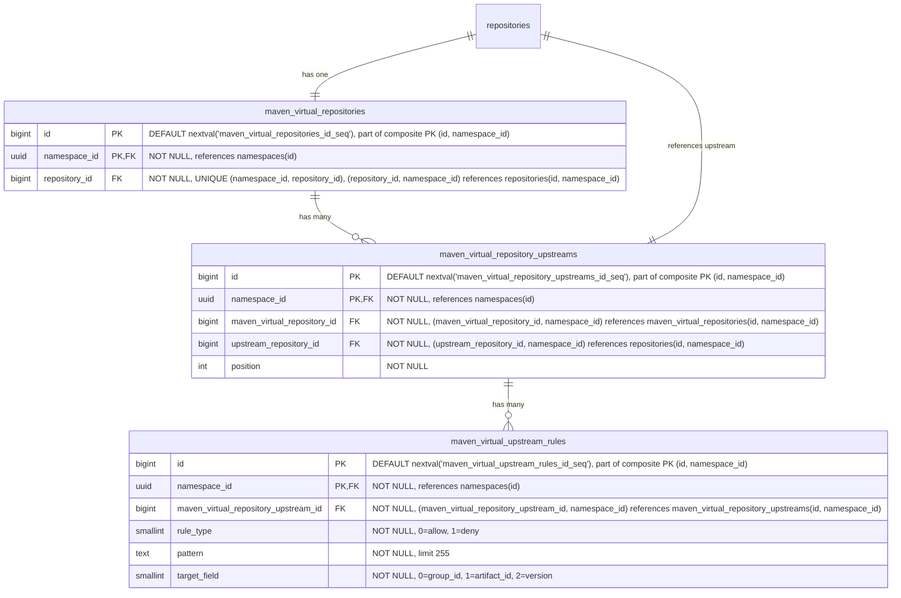

- **maven_virtual_repositories**: Maven パッケージ用の仮想リポジトリです。名前、可視性、クロスフォーマットクエリのために、`repository_id` を介して親の `repositories` テーブルを参照します。`HASH(namespace_id)` で 64 パーティションにパーティショニングされます。
- **maven_virtual_repository_upstreams**: 仮想リポジトリとその upstream を結合するテーブルです。各仮想リポジトリは、順序付けられた upstream のリストを持ちます。各エントリは `upstream_repository_id` を介して upstream リポジトリを参照し、これは `repositories(namespace_id, id)` を指します。複合 FK `(namespace_id, upstream_repository_id)` は、upstream が同じ名前空間内にあることを強制します。これはレジストリが名前空間にスコープされること（[ADR-001](001_organizations_as_anchor_point.md)）と一貫しています。`HASH(namespace_id)` で 64 パーティションにパーティショニングされます。
- **maven_virtual_upstream_rules**: upstream の許可/拒否フィルタールールを定義します。各ルールは、この upstream を通じて解決する際にどのアーティファクトを含めるか除外するかを制御するために、ワイルドカードパターンとターゲットフィールドを指定します。パターンは MVP ではワイルドカードのみです。正規表現のサポートは、顧客からのフィードバックがそれを正当化するまで延期されています（[ディスカッション](https://gitlab.com/gitlab-org/gitlab/-/work_items/597754#note_3291871207)）。`HASH(namespace_id)` で 64 パーティションにパーティショニングされます。

#### インデックス

- **`maven_virtual_repositories`**: `(namespace_id, repository_id)` の一意インデックス — 親参照により仮想リポジトリを検索します。
- **`maven_virtual_repository_upstreams`**: `(namespace_id, maven_virtual_repository_id, position) DEFERRABLE INITIALLY DEFERRED` の一意インデックス — 仮想リポジトリの順序付けられた upstream を取得します。トランザクション内での並べ替えを可能にするために deferrable です。`(namespace_id, maven_virtual_repository_id, upstream_repository_id)` の一意インデックス — 同じ upstream が仮想リポジトリに 2 回追加されるのを防ぎます。
- **`maven_virtual_upstream_rules`**: `(namespace_id, maven_virtual_repository_upstream_id)` のインデックス — 特定の upstream のすべてのルールを取得します。

#### クエリ例

- 仮想リポジトリを作成します

  ```sql
  -- まず親リポジトリを作成します
  INSERT INTO repositories (namespace_id, name, format, kind, visibility)
  VALUES ('018f4d6f-0e10-7e3a-9bfd-23a4c5d6e7f8', 'my-virtual-repo', 1, 1, 1)
  RETURNING id;
  -- リポジトリをリポジトリコレクションにリンクします
  INSERT INTO repository_collection_repositories (namespace_id, repository_collection_id, repository_id)
  VALUES ('018f4d6f-0e10-7e3a-9bfd-23a4c5d6e7f8', 456, <returned_id>);
  -- 次にフォーマット専用のレコードを作成します
  INSERT INTO maven_virtual_repositories (namespace_id, repository_id)
  VALUES ('018f4d6f-0e10-7e3a-9bfd-23a4c5d6e7f8', <returned_id>);
  ```

- 仮想リポジトリを upstream に関連付けます

  ```sql
  INSERT INTO maven_virtual_repository_upstreams (namespace_id, maven_virtual_repository_id, upstream_repository_id, position)
  VALUES ('018f4d6f-0e10-7e3a-9bfd-23a4c5d6e7f8', 123, 789, 1);
  ```

### NPM リポジトリ {#npm-repositories}

Node パッケージは基本的に `.tar.gz` ファイルであり、各バージョンが単一のアーカイブになります。ただし、node クライアントはより豊富な機能セットを持ち、たとえば私たちが扱う必要のある distribution タグの使用などがあります。


- **npm_repositories**: 複数のパッケージのコンテナです。各リポジトリは、オプションのスコープを持つ複数のパッケージをホストできます。名前、可視性、クロスフォーマットクエリのために、`repository_id` を介して親の `repositories` テーブルを参照します。`HASH(namespace_id)` で 64 パーティションにパーティショニングされます。
- **npm_packages**: npm パッケージを表します。`name` カラムは、スコープを含む完全なパッケージ名（例: `@myorg/mypackage` または `lodash`）を格納します。`versions_count` は、ソフト削除済みのものを含むパッケージの `npm_versions` の行数をカウントし、ガベージコレクションが行をハード削除したときにのみデクリメントされます。`tags_count` はその `npm_tags` の行数をカウントします（`npm_tags` にはソフト削除カラムがないため、この問題は生じません）。両方とも、[ADR-004](004_data_and_application_limits.md#entity-count-limits) のパッケージごとのエンティティ数制限（25,000 バージョン、1,000 タグ）を強制するバッファリングされたカウンターであり、[バッファリング/非同期書き込み](#buffered-and-asynchronous-writes) を介して維持されます。ソフト削除済みのバージョンを含めることは `namespace_statistics.deduplicated_size_bytes` の扱いを反映しており、不正利用の経路を塞ぎます。上限からソフト削除済みの行を除外できる顧客は、ソフト削除と再公開を繰り返すことで、25,000 バージョンの制限を無期限に下回り続けることができてしまいます。すべてのソフト削除済みの行は依然としてストレージを占有し、復元可能なままであるにもかかわらずです。どちらの上限も 32 ビットの上限を十分に下回るため、`bigint` ではなく `integer` 型です。他の場所の境界のないカウンター（`downloads_count`、`size_bytes`）は、際限なく増加するため `bigint` が必要です。`last_downloaded_at` は、パッケージのいずれかのファイルが最後にダウンロードされた時刻を記録します。[バッファリング/非同期書き込み](#buffered-and-asynchronous-writes) を介して維持されます。`keep_last_downloaded_at` ライフサイクルルールによって使用されます。`HASH(namespace_id)` で 64 パーティションにパーティショニングされます。
- **npm_versions**: npm パッケージの個々のバージョンを、埋め込まれた package.json のメタデータとともに格納します。`last_downloaded_at` は、バージョンのいずれかのファイルが最後にダウンロードされた時刻を記録します。[バッファリング/非同期書き込み](#buffered-and-asynchronous-writes) を介して維持されます。`keep_last_downloaded_at` ライフサイクルルールによって使用されます。`gitlab_user_id`、`gitlab_project_id`、`gitlab_git_commit_sha` は、どの GitLab ユーザーがこのバージョンを公開したか、および公開の背後にある CI コンテキスト（プロジェクト、コミット）を記録し、[`container_manifests`](#container-repositories) の同等カラムと同じ形と根拠を持ちます。`created_at` は、バージョンが最初に公開された時刻を記録し、[`container_manifests`](#container-repositories) と同じ公開履歴および時間範囲の来歴スキャンを支えます。`HASH(namespace_id)` で 64 パーティションにパーティショニングされます。
- **npm_tags**: 特定のパッケージバージョンを指す [NPM distribution タグ](https://docs.npmjs.com/cli/v11/commands/npm-dist-tag)（例: `latest`、`next`、`beta`）を提供します。`HASH(namespace_id)` で 64 パーティションにパーティショニングされます。
- **npm_files**: npm パッケージバージョンのファイルを表します。これらは主に tarball アーカイブです。また、パフォーマンスのボトルネックを改善するためにレジストリが使用する補助ファイルである場合もあります。`HASH(namespace_id)` で 64 パーティションにパーティショニングされます。
- **npm_metadata_files**: npm パッケージの事前計算されたメタデータファイルを、`kind` ごとに 1 つずつ格納します。`kind` カラムはメタデータのバリアントを区別します。`full`（0）はすべてのバージョンを含む完全な packument を、`dist_tags`（1）は distribution タグのマッピングのみを、`abbreviated`（2）はリクエストが `Accept: application/vnd.npm.install-v1+json` を伴う場合に提供されるインストール専用の射影を含みます。適切なファイルが、クライアントのリクエストに基づいて npm メタデータエンドポイントで提供されます。メタデータはパッケージのすべてのバージョンにまたがるため、（`npm_versions` ではなく）`npm_packages` にリンクされています。メタデータファイルは、バージョンが公開または公開取り消しされた後に非同期で生成されます。`expires_at` カラムはキャッシュの鮮度を駆動します。ライター（公開、非推奨化、公開取り消し、dist-tag の変更）は、データ書き込みと同じトランザクション内で、対象パッケージのすべての行に `expires_at = NOW()` を設定することでキャッシュを強制的に期限切れにします。再構築ジョブは、新たに生成された blob で行を upsert する際に `expires_at = NOW() + npm.packument_cache_ttl` を設定します。リーダーは `expires_at > NOW()` でフィルターし、ミス時にはインラインビルドのパスにフォールスルーするため、期限切れの行がクライアントに提供されることはありません。このカラムは、ハード削除の期限ではなく、キャッシュの鮮度シグナルです。強制的な期限切れは blob とアタッチメントをそのまま残すため、それらに対してすでに解決中のレスポンスは、再構築ジョブがアタッチメントを差し替えるまで正常に完了します。`HASH(namespace_id)` で 64 パーティションにパーティショニングされます。
- **blob_storage_attachments**: 詳細は [Blob ストレージ](#blob-storage) のセクションを参照してください。

[Maven](#maven-repositories) と同様に、パッケージ名とバージョンはまったく同じ理由で 2 つの異なるテーブルに格納されます。

#### インデックス

- **`npm_repositories`**: `(namespace_id, repository_id)` の一意インデックス — 親リポジトリ参照により NPM リポジトリを検索します。
- **`npm_packages`**: `(namespace_id, npm_repository_id, name) WHERE soft_deleted_at IS NULL` の一意インデックス — リポジトリ内で名前によりパッケージを検索します。部分条件により、ソフト削除後に同じ名前でパッケージを再作成できます。`(namespace_id, npm_repository_id, last_downloaded_at NULLS FIRST) WHERE soft_deleted_at IS NULL` のインデックス — `keep_last_downloaded_at` ライフサイクルルールの評価をサポートします。リポジトリ内のすべてのパッケージをスキャンして行ごとにフィルターするのではなく、境界付きの範囲スキャンによって、期限切れになったパッケージのみを返します。`NULLS FIRST` は、ダウンロードされたことのないパッケージを最も古い行とグループ化するため、両方が同じ範囲スキャンで返されます。
- **`npm_versions`**: `(namespace_id, npm_package_id, version) WHERE soft_deleted_at IS NULL` の一意インデックス — パッケージ内で特定のバージョンを検索します。部分条件により、ソフト削除後に同じ識別子でバージョンを再作成できます。`(namespace_id, npm_package_id, last_downloaded_at NULLS FIRST) WHERE soft_deleted_at IS NULL` のインデックス — `npm_packages` と同じ範囲スキャン戦略を使用して、パッケージのバージョンにスコープされた `keep_last_downloaded_at` ライフサイクルルールの評価をサポートします。`(namespace_id, soft_deleted_at DESC) WHERE soft_deleted_at IS NOT NULL` のインデックス — ソフト削除済みバージョンを削除時刻順に一覧表示し、npm アーティファクトのアーティファクト粒度のゴミ箱一覧クエリを支えます。`(namespace_id, created_at DESC)` のインデックス — 名前空間にわたる時系列スキャンであり、公開履歴のページネーションと時間範囲のアーティファクト来歴クエリを支えます。無条件であるため、ソフト削除済みの公開イベントも監査証跡に引き続き表示されます。
- **`npm_tags`**: `(namespace_id, npm_package_id, name)` の一意インデックス — パッケージ内で名前により distribution タグを検索します。`(namespace_id, npm_version_id)` のインデックス — 特定のバージョンを指すすべてのタグを検索します。
- **`npm_files`**: `(namespace_id, npm_version_id, file_name) WHERE soft_deleted_at IS NULL` の一意インデックス — ファイル名は、バージョン内で一意でなければなりません。部分条件により、ソフト削除後に同じ名前でファイルを再作成できます。`(namespace_id, blob_storage_attachment_id)` のインデックス — ストレージアタッチメントによりファイルを検索します。`(namespace_id, blob_sha256)` のインデックス — 格納された blob の sha256 から、それを参照するすべての npm ファイルへの逆引きであり、クロスフォーマットのチェックサム検索を支えます。既存のバージョンをキーとするインデックスは、ダイジェストをキーとするスキャンを直接満たすことはできません。
- **`npm_metadata_files`**: `(namespace_id, npm_package_id, kind)` の一意インデックス — パッケージごと・kind ごとに 1 つのメタデータファイルです。`(namespace_id, blob_storage_attachment_id)` のインデックス — ストレージアタッチメントによりメタデータファイルを検索します。`(namespace_id, blob_sha256)` のインデックス — 格納された blob の sha256 から、それを参照するすべてのメタデータファイルへの逆引きであり、[`npm_files`](#npm-repositories) を反映して、単一の sha256 ルックアップで tarball と packument 形式のメタデータの両方をカバーします。

#### クエリ例

- リポジトリ ID とパッケージ名を指定してすべてのバージョンを取得します

  ```sql
  SELECT nv.*
  FROM npm_versions nv
  JOIN npm_packages np
    ON nv.npm_package_id = np.id AND nv.namespace_id = np.namespace_id
  WHERE np.namespace_id = '018f4d6f-0e10-7e3a-9bfd-23a4c5d6e7f8' AND np.npm_repository_id = 123 AND np.name = '@myorg/mypackage'
    AND np.soft_deleted_at IS NULL AND nv.soft_deleted_at IS NULL;
  ```

- 公開パスの制限の事前チェックのために、パッケージごとのエンティティ数カウンターを読み取ります（参考情報。`npm_versions` と `npm_tags` の部分一意インデックスが、信頼できる競合のないガードです）。

  ```sql
  SELECT versions_count, tags_count
  FROM npm_packages
  WHERE namespace_id = '018f4d6f-0e10-7e3a-9bfd-23a4c5d6e7f8' AND id = 456 AND soft_deleted_at IS NULL;
  ```

- バージョン ID とファイル名を指定してファイルを取得します

  ```sql
  SELECT nf.*
  FROM npm_files nf
  WHERE nf.namespace_id = '018f4d6f-0e10-7e3a-9bfd-23a4c5d6e7f8' AND nf.npm_version_id = 456 AND nf.file_name = 'mypackage-1.0.0.tgz'
    AND nf.soft_deleted_at IS NULL;
  ```

- パッケージの事前計算された完全なメタデータファイルを取得します（npm メタデータエンドポイントで提供されます）

  ```sql
  SELECT bsb.object_storage_key, bsb.size
  FROM npm_metadata_files nmf
  JOIN blob_storage_blobs bsb ON bsb.namespace_id = nmf.namespace_id AND bsb.sha256 = nmf.blob_sha256
  WHERE nmf.namespace_id = '018f4d6f-0e10-7e3a-9bfd-23a4c5d6e7f8' AND nmf.npm_package_id = 456 AND nmf.kind = 0
    AND nmf.expires_at > NOW();
  ```

  読み取りは `expires_at > NOW()` でフィルターします。ミス（行がない、またはライターが強制的に期限切れにしたか TTL が経過したために `expires_at <= NOW()` である場合）は、インラインビルドのパスにフォールスルーします。下記のキャッシュ再構築ジョブが新しい行を復元します。

- 書き込み時に packument キャッシュを強制的に期限切れにします

  公開、非推奨化、公開取り消し、dist-tag の変更は、データ書き込みと同じトランザクション内で、対象パッケージのすべての kind について `expires_at` を `NOW()` に切り替えることでキャッシュを無効化します。blob とアタッチメントはそのまま残されるため、すでに処理中のレスポンスは、再構築ジョブがアタッチメントを差し替えるまで既存の blob に対して解決を続けます。

  ```sql
  UPDATE npm_metadata_files
  SET expires_at = NOW()
  WHERE namespace_id = '018f4d6f-0e10-7e3a-9bfd-23a4c5d6e7f8' AND npm_package_id = 456;
  ```

  初回の公開ではまだ行が存在しないため、`UPDATE` は 0 行に影響します。再構築ジョブが最初の実行時にキャッシュ行を挿入します。

- バージョンの公開または公開取り消しの後にメタデータファイルを upsert します

  キャッシュ再構築ジョブは、これをパッケージの kind ごとに 1 回実行します。孤立したアタッチメントが blob のガベージコレクションをブロックするのを防ぐために、古いアタッチメントは同じトランザクション内で削除する必要があります（[クリーンアップタスク](#cleanup-tasks) を参照してください）。

  ```sql
  -- 新しい blob とアタッチメント（id=789）は、同じトランザクション内で先に作成されます。
  -- 下記の interval は、設定された `npm.packument_cache_ttl`（デフォルト 7 日）を反映しています。
  WITH old AS (
    SELECT blob_storage_attachment_id, blob_sha256
    FROM npm_metadata_files
    WHERE namespace_id = '018f4d6f-0e10-7e3a-9bfd-23a4c5d6e7f8' AND npm_package_id = 456 AND kind = 0
  ),
  upsert AS (
    INSERT INTO npm_metadata_files (namespace_id, npm_package_id, kind, blob_storage_attachment_id, blob_sha256, expires_at)
    VALUES ('018f4d6f-0e10-7e3a-9bfd-23a4c5d6e7f8', 456, 0, 789, 'abcd1234...'::bytea, NOW() + interval '7 days')
    ON CONFLICT (namespace_id, npm_package_id, kind)
    DO UPDATE SET blob_storage_attachment_id = EXCLUDED.blob_storage_attachment_id,
                  blob_sha256 = EXCLUDED.blob_sha256,
                  expires_at = EXCLUDED.expires_at
  )
  DELETE FROM blob_storage_attachments bsa
  USING old
  WHERE bsa.namespace_id = '018f4d6f-0e10-7e3a-9bfd-23a4c5d6e7f8'
    AND bsa.id = old.blob_storage_attachment_id
    AND bsa.sha256 = old.blob_sha256;
  ```

  初回の挿入時には `old` CTE は行を返さないため、アタッチメントは削除されません。
  競合（更新）時には、以前のアタッチメントが削除されます。古い blob は、
  他のアタッチメントが参照していなければガベージコレクションされます（重複排除に対して安全です。
  各クライアントは自身のアタッチメントを保持するため、1 つを削除しても同じ blob を
  共有する他のクライアントには影響しません）。

### NPM リモートリポジトリ {#npm-remote-repositories}


- **npm_remote_repositories**: 外部の npm レジストリを表します。URL、認証情報、アーティファクトのキャッシュ TTL（`cache_validity_hours`）、およびパッケージメタデータレスポンス用の個別の TTL（`metadata_cache_validity_hours`）を含みます。ヘルスチェックのステータスは監視のために追跡されます。`repository_id` を介して親の `repositories` テーブルを参照します。`HASH(namespace_id)` で 64 パーティションにパーティショニングされます。
- **npm_remote_packages**: キャッシュされた npm パッケージです。`last_downloaded_at` は、パッケージのキャッシュされたいずれかのファイルが最後にダウンロードされた時刻を記録します。ホット行の競合を避けるために、バッファリング/非同期書き込みを介して維持されます。`keep_last_downloaded_at` ライフサイクルルールとキャッシュ保持の評価によって使用されます。`HASH(namespace_id)` で 64 パーティションにパーティショニングされます。
- **npm_remote_versions**: `package_json` メタデータを持つキャッシュされたバージョンです。packument が取得される際に（すべてのバージョンメタデータを含むため）データが投入されます。`last_downloaded_at` は、バージョンのキャッシュされたいずれかのファイルが最後にダウンロードされた時刻を記録します。ホット行の競合を避けるために、バッファリング/非同期書き込みを介して維持されます。`keep_last_downloaded_at` ライフサイクルルールとキャッシュ保持の評価によって使用されます。`created_at` は、バージョンが最初にキャッシュされた時刻を記録し、[`npm_versions`](#npm-repositories) を反映してキャッシュ側の公開履歴と来歴スキャンを支えます。`HASH(namespace_id)` で 64 パーティションにパーティショニングされます。
- **npm_remote_tags**: キャッシュされた dist-tag からバージョンへのマッピング（例: `latest`、`next`）です。packument からデータが投入されます。`HASH(namespace_id)` で 64 パーティションにパーティショニングされます。
- **npm_remote_metadata_files**: upstream のレジストリからキャッシュされた事前計算済みメタデータファイルを、パッケージごと・kind ごとに 1 つずつ格納します。`kind` は、すべてのバージョンを含む完全な packument（`0`）と、dist-tags のみのマッピング（`1`）を区別します。`upstream_checked_at` は、メタデータが upstream のレジストリに対して最後に検証された時刻を記録します。再検証が必要かどうかを判断するために `metadata_cache_validity_hours` と比較されます。`upstream_etag` は、upstream から返された ETag を格納し、条件付きリクエスト（`If-None-Match`）を可能にして、変更されていないメタデータの再ダウンロードを回避します。`HASH(namespace_id)` で 64 パーティションにパーティショニングされます。
- **npm_remote_files**: キャッシュされた tarball です。`upstream_checked_at` は、ファイルが upstream のレジストリに対して最後に検証された時刻を記録します。再検証が必要かどうかを判断するために `cache_validity_hours` と比較されます。`upstream_etag` は、upstream から返された ETag を格納し、条件付きリクエスト（`If-None-Match`）を可能にして、変更されていない tarball の再ダウンロードを回避します。`HASH(namespace_id)` で 64 パーティションにパーティショニングされます。
- **blob_storage_attachments**: 詳細は [Blob ストレージ](#blob-storage) のセクションを参照してください。

#### インデックス

- **`npm_remote_repositories`**: `(namespace_id, repository_id)` の一意インデックス — 親参照によりリモートリポジトリを検索します。
- **`npm_remote_packages`**: `(namespace_id, npm_remote_repository_id, name) WHERE soft_deleted_at IS NULL` の一意インデックス — 名前でキャッシュされたパッケージを検索します。部分条件により、ソフト削除後に同じ名前でパッケージを再作成できます。
- **`npm_remote_versions`**: `(namespace_id, npm_remote_package_id, version) WHERE soft_deleted_at IS NULL` の一意インデックス — パッケージ内でキャッシュされたバージョンを検索します。部分条件により、ソフト削除後に同じ識別子でバージョンを再作成できます。`(namespace_id, soft_deleted_at DESC) WHERE soft_deleted_at IS NOT NULL` のインデックス — ソフト削除済みのキャッシュされたバージョンを削除時刻順に一覧表示し、キャッシュされた npm アーティファクトのアーティファクト粒度のゴミ箱一覧クエリを支えます。`(namespace_id, created_at DESC)` のインデックス — 名前空間にわたる時系列スキャンであり、ローカルの [`npm_versions`](#npm-repositories) インデックスを反映して、キャッシュ側の公開履歴と来歴をカバーします。ローカルのインデックスと同じ監査証跡の理由で無条件（`soft_deleted_at` 述語なし）です。
- **`npm_remote_tags`**: `(namespace_id, npm_remote_package_id, name)` の一意インデックス — 名前により distribution タグを検索します。`(namespace_id, npm_remote_version_id)` のインデックス — 特定のバージョンを指すすべてのタグを検索します。
- **`npm_remote_metadata_files`**: `(namespace_id, npm_remote_package_id, kind)` の一意インデックス — パッケージごと・kind ごとに 1 つのメタデータファイルを強制します。`(namespace_id, blob_storage_attachment_id)` のインデックス — ストレージアタッチメントによりメタデータファイルを検索します。`(namespace_id, blob_sha256)` のインデックス — 格納された blob の sha256 から、それを参照するすべてのキャッシュされたメタデータファイルへの逆引きであり、ローカルの [`npm_metadata_files`](#npm-repositories) インデックスを反映しています。
- **`npm_remote_files`**: `(namespace_id, npm_remote_version_id, file_name) WHERE soft_deleted_at IS NULL` の一意インデックス — ファイル名は、バージョン内で一意でなければなりません。部分条件により、ソフト削除後に同じ名前でファイルを再作成できます。`(namespace_id, blob_storage_attachment_id)` のインデックス — ストレージアタッチメントによりファイルを検索します。`(namespace_id, blob_sha256)` のインデックス — 格納された blob の sha256 から、それを参照するすべてのキャッシュされた npm ファイルへの逆引きであり、ローカルの [`npm_files`](#npm-repositories) インデックスを反映して、チェックサム検索がキャッシュ側の参照もカバーするようにします。

#### クエリ例

- リモートリポジトリを作成します

  ```sql
  -- まず親リポジトリを作成します
  INSERT INTO repositories (namespace_id, name, format, kind, visibility)
  VALUES ('018f4d6f-0e10-7e3a-9bfd-23a4c5d6e7f8', 'npm-registry', 2, 2, 0)
  RETURNING id;
  -- リポジトリをリポジトリコレクションにリンクします
  INSERT INTO repository_collection_repositories (namespace_id, repository_collection_id, repository_id)
  VALUES ('018f4d6f-0e10-7e3a-9bfd-23a4c5d6e7f8', 456, <returned_id>);
  -- 次にフォーマット専用のレコードを作成します
  INSERT INTO npm_remote_repositories (namespace_id, repository_id, url, encrypted_auth_token)
  VALUES ('018f4d6f-0e10-7e3a-9bfd-23a4c5d6e7f8', <returned_id>, 'https://registry.npmjs.org', $1);
  ```

- パッケージのすべてのキャッシュされたバージョンを取得します（packument レスポンスを提供します）

  ```sql
  SELECT nrv.version, nrv.package_json
  FROM npm_remote_versions nrv
  JOIN npm_remote_packages nrp
    ON nrv.npm_remote_package_id = nrp.id AND nrv.namespace_id = nrp.namespace_id
  WHERE nrp.namespace_id = '018f4d6f-0e10-7e3a-9bfd-23a4c5d6e7f8'
    AND nrp.npm_remote_repository_id = 789
    AND nrp.name = '@myorg/mypackage'
    AND nrp.soft_deleted_at IS NULL AND nrv.soft_deleted_at IS NULL;
  ```

- キャッシュされた tarball を pull します（読み取りパスのショートカット）

  ```sql
  SELECT bsb.object_storage_key, bsb.size
  FROM npm_remote_files nrf
  JOIN blob_storage_blobs bsb
    ON bsb.namespace_id = nrf.namespace_id AND bsb.sha256 = nrf.blob_sha256
  WHERE nrf.namespace_id = '018f4d6f-0e10-7e3a-9bfd-23a4c5d6e7f8'
    AND nrf.npm_remote_version_id = 456
    AND nrf.file_name = 'mypackage-1.0.0.tgz'
    AND nrf.soft_deleted_at IS NULL;
  ```

### NPM 仮想リポジトリ {#npm-virtual-repositories}

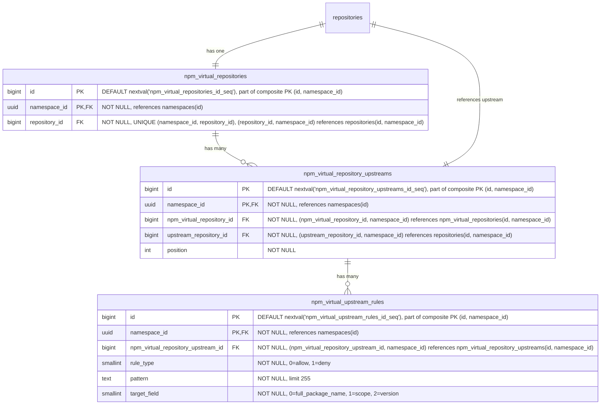

- **npm_virtual_repositories**: npm パッケージ用の仮想リポジトリです。名前、可視性、クロスフォーマットクエリのために、`repository_id` を介して親の `repositories` テーブルを参照します。`HASH(namespace_id)` で 64 パーティションにパーティショニングされます。
- **npm_virtual_repository_upstreams**: 仮想リポジトリとその upstream を結合するテーブルです。各仮想リポジトリは、順序付けられた upstream のリストを持ちます。各エントリは `upstream_repository_id` を介して upstream リポジトリを参照し、これは `repositories(namespace_id, id)` を指します。複合 FK `(namespace_id, upstream_repository_id)` は、upstream が同じ名前空間内にあることを強制します。これはレジストリが名前空間にスコープされること（[ADR-001](001_organizations_as_anchor_point.md)）と一貫しています。`HASH(namespace_id)` で 64 パーティションにパーティショニングされます。
- **npm_virtual_upstream_rules**: upstream の許可/拒否フィルタールールを定義します。各ルールは、この upstream を通じて解決する際にどのアーティファクトを含めるか除外するかを制御するために、ワイルドカードパターンとターゲットフィールドを指定します。パターンは MVP ではワイルドカードのみです。正規表現のサポートは、顧客からのフィードバックがそれを正当化するまで延期されています（[ディスカッション](https://gitlab.com/gitlab-org/gitlab/-/work_items/597754#note_3291871207)）。`HASH(namespace_id)` で 64 パーティションにパーティショニングされます。

#### インデックス

- **`npm_virtual_repositories`**: `(namespace_id, repository_id)` の一意インデックス — 親参照により仮想リポジトリを検索します。
- **`npm_virtual_repository_upstreams`**: `(namespace_id, npm_virtual_repository_id, position) DEFERRABLE INITIALLY DEFERRED` の一意インデックス — 仮想リポジトリの順序付けられた upstream を取得します。トランザクション内での並べ替えを可能にするために deferrable です。`(namespace_id, npm_virtual_repository_id, upstream_repository_id)` の一意インデックス — 同じ upstream が仮想リポジトリに 2 回追加されるのを防ぎます。
- **`npm_virtual_upstream_rules`**: `(namespace_id, npm_virtual_repository_upstream_id)` のインデックス — 特定の upstream のすべてのルールを取得します。

#### クエリ例

- 仮想リポジトリを作成します

  ```sql
  -- まず親リポジトリを作成します
  INSERT INTO repositories (namespace_id, name, format, kind, visibility)
  VALUES ('018f4d6f-0e10-7e3a-9bfd-23a4c5d6e7f8', 'my-virtual-repo', 2, 1, 1)
  RETURNING id;
  -- リポジトリをリポジトリコレクションにリンクします
  INSERT INTO repository_collection_repositories (namespace_id, repository_collection_id, repository_id)
  VALUES ('018f4d6f-0e10-7e3a-9bfd-23a4c5d6e7f8', 456, <returned_id>);
  -- 次にフォーマット専用のレコードを作成します
  INSERT INTO npm_virtual_repositories (namespace_id, repository_id)
  VALUES ('018f4d6f-0e10-7e3a-9bfd-23a4c5d6e7f8', <returned_id>);
  ```

- 仮想リポジトリを upstream に関連付けます

  ```sql
  INSERT INTO npm_virtual_repository_upstreams (namespace_id, npm_virtual_repository_id, upstream_repository_id, position)
  VALUES ('018f4d6f-0e10-7e3a-9bfd-23a4c5d6e7f8', 123, 789, 1);
  ```

### Blob ストレージ {#blob-storage}

blob ストレージのデータ構成は、以下の前提のもとで行われています。

- blob への 1 対多の関連を扱う必要はありません。これは blob ストレージのクライアント領域で扱われます。したがって、1 対 1 の関連のみが必要です。
- 適切な [クリーンアップ処理](#cleanup-tasks) のために、単一の blob を使用している blob ストレージクライアントの数（重複排除）を追跡する必要があります。
- さらに、単一の blob に対する各使用の異なる出所を追跡したい場合があります。

ここで提示するスキーマは、データのストレージ側のみを考慮しています。メトリクスや [クリーンアップ](#cleanup-tasks) などの追加的な側面のために補助テーブルが必要になる場合がありますが、これらの部分はまだ評価中であるため、ここでは説明しません。アップロードセッションの追跡については、[アップロードセッション](#upload-sessions) で説明します。

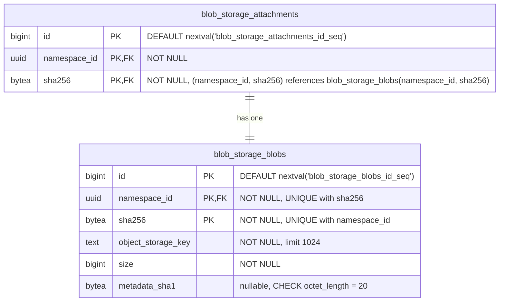

- **blob_storage_attachments**: 特定の blob の使用状況を追跡します。各クライアント（Container、NPM、Maven のリポジトリテーブル）は、blob レコードを使用（作成または再利用）したいときには毎回ここにレコードを作成する必要があります。各使用は、ここに 1 つのレコードを持つ _必要があります_。クライアントは、参照元のアーティファクトレコード（ファイル、blob、キャッシュエントリ）を削除する際に、アタッチメントレコードを削除する責任を負います。孤立したアタッチメントが blob のクリーンアップをブロックするのを防ぐために、両方の削除は同じトランザクション内で行われなければなりません。クライアントテーブルから `blob_storage_attachments` への外部キーは参照整合性を強制します（ダングリング参照を防ぎます）が、`ON DELETE CASCADE` は使用しません。クリーンアップはアプリケーション管理です。たとえば、まったく同じファイルを持つ 2 つの Maven パッケージは、それぞれ異なるアタッチメントレコードを参照し、それらが同じ blob レコードを参照することになります。`namespace_id` カラムは Cells のシャーディングに必要です。`sha256` カラムは、パーティションプルーニングされた結合を可能にするために、参照元の `blob_storage_blobs` レコードから伝播されます（[パーティショニング戦略](#blob-storage-partitioning-strategy) を参照してください）。主キーは、従来の `(id)` ではなく `(id, namespace_id, sha256)` です。`sha256` が必要なのは、PostgreSQL がハッシュパーティショニングされたテーブルのすべての一意制約にパーティションキーを含めることを強制するためであり、`namespace_id` が必要なのは、PK をデプロイメントをまたいでグローバルに一意に保つためです。ローカルの `bigint id` は単一の Artifact Registry データベース内でのみ一意であるため（[名前空間 ID の型](#namespace-id-type) を参照してください）、デプロイメントをまたぐ名前空間の移行（[ADR-022](022_namespace_decoupling.md)）の際に、同じ `(id, sha256)` のペアがターゲットデータベースにすでに存在する可能性があります。UUIDv7 の `namespace_id` を PK に追加することで、その衝突を構造的に排除します。クライアントテーブルは、この複合 PK を `(namespace_id, blob_storage_attachment_id, blob_sha256)` を介して参照します。
- **blob_storage_blobs**: このテーブルは、オブジェクトストレージに存在するすべてのファイルコンテンツ（blob として）を一覧表示します。オブジェクトストレージキーは専用のカラムに完全に格納され、blob が使用されるたびに計算されることはありません。`sha256` は基本的なコンテンツアドレス可能な識別子であり、常に存在します（`NOT NULL`）。`namespace_id` カラムは、重複排除を Organization にスコープします。フォーマット固有のチェックサム（例: Maven の SHA1 と MD5）は、ここではなくフォーマット専用のファイルテーブルに格納され、このテーブルをフォーマット非依存に保ちます。コンテンツタイプも同じ理由で除外されています。これは blob 自体のプロパティではなく、フォーマットが blob をどう解釈するかのプロパティであり、フォーマット専用のテーブルに属します。`metadata_sha1` カラムは、そのフォーマット非依存のルールに対する意図的かつ限定された例外です。これは、コミット時に blob に付与される MVP のユーザーメタデータ許可リストからの SHA-1 を反映しており、SHA-1 が提供されなかった場合は `NULL` になります。これが（フォーマット専用のテーブルではなく）`blob_storage_blobs` にあるのは、ストレージレイヤーの blob 情報ルックアップが、push と pull のホットパスにおいて契約上単一の DB ラウンドトリップであるためです。DB ミラーなしにユーザーメタデータを公開すると、ダイジェストごとのオブジェクトストレージ HEAD のファンアウトや部分的な API での公開を強いられることになります。同じ値が、コミット時にバックエンドネイティブの `x-amz-meta-checksum-sha1` / `x-goog-meta-checksum-sha1` ヘッダーとしてストレージオブジェクトに付与され、行は不変であるため、DB とストレージオブジェクトのコピーがずれることはありません。将来の許可リストへの追加は、修正によってそれぞれ独自の null 許容カラムを追加します。完全な根拠については [Artifact Registry S06 ストレージレイヤー仕様](https://gitlab.com/gitlab-org/ops/artifact-registry/-/blob/main/docs/specs/S06-storage-layer.md) を参照してください。主キーは、上記の `blob_storage_attachments` と同じ理由で `(id, namespace_id, sha256)` です。`sha256` は PostgreSQL のパーティションキー包含ルールを満たし、UUIDv7 の `namespace_id` は PK をデプロイメントをまたいでグローバルに一意に保ち、サロゲートの `bigint id` は行識別子の形をスキーマ内の他のすべてのテーブルと一貫させます。Organization ごとの重複排除は、別個の `UNIQUE (namespace_id, sha256)` 制約によって強制され、これはコンテンツハッシュによるルックアップのインデックスとしても機能し、このテーブルへのすべての外部キーの参照先となります。PK を直接参照する FK はありません。`(namespace_id, sha256)` はすでに行を一意に識別し、UUIDv7 の `namespace_id` を介してそれ自体でグローバルに一意であるため、呼び出し側はサロゲートの `id` を持ち回ることなく自然キーで結合します。

blob ストレージのテーブルは、Artifact Registry の外部でも再利用できるように設計されています。これにより、他の機能が同じ重複排除とストレージのインフラストラクチャを活用できます。

すべてのハッシュカラム（`digest` と `sha256`、および Maven 固有の `sha1`、`md5`、`sha512`）は `bytea` として格納されます。正確なエンコード戦略（例: [Container Registry](https://gitlab.com/gitlab-org/container-registry) で使用されているインラインのアルゴリズムプレフィックス、または別個の `digest_algorithm` カラム）はまだ未定です。

### アップロードセッション {#upload-sessions}

アップロードセッションは、[ADR-008](008_content_addressable_storage.md#two-phase-upload-strategy) で説明されている 2 フェーズのアップロードライフサイクルを通じて、進行中の blob アップロードを追跡します。各セッションは、名前空間のストレージパーティション内の `uploads/{upload_id}` にある一時的なストレージオブジェクトにマッピングされます。セッションは、アップロード API（再開可能なアップロード、並行アップロードの解決）をサポートし、オブジェクトストレージの列挙なしに [アップロードのパージ](#cleanup-tasks) を可能にする（[ADR-011](011_data_reconciliation.md)）ために、最初のスキーマからデータベースで追跡されます。

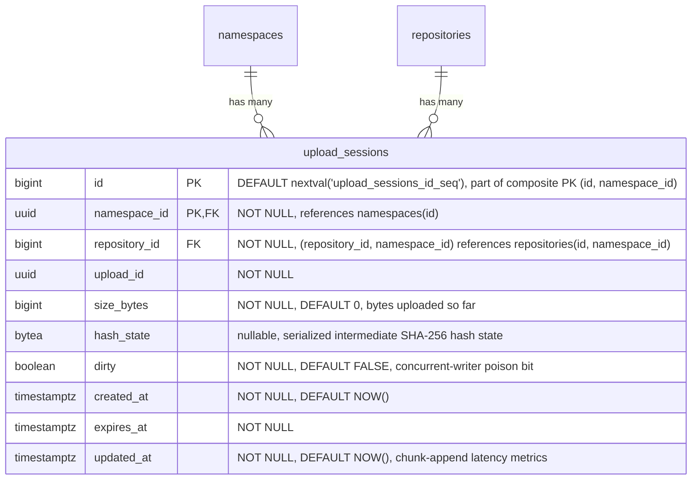

- **upload_sessions**: 進行中の各 blob アップロードを追跡します。このテーブルは、[コンテナレジストリのパターン](https://gitlab.com/gitlab-org/container-registry/-/blob/master/registry/storage/blobwriter.go) を反映した二値的な存在モデルに従います。行が存在すれば、アップロードは進行中またはクリーンアップが必要であり、存在しなければ、アップロードは完了したかパージされています。完了時、ストレージレイヤーは blob をコンテンツアドレス可能なストアに移動し、その後 `blob_storage_blobs` レコードを作成するのと同じトランザクション内でセッション行を削除します。フォーマット固有の行（`blob_storage_attachments` とフォーマットテーブル）は、その後に呼び出し元のフォーマットサブシステムによって別個のトランザクションで作成されます。これにより、ストレージレイヤーはフォーマット非依存に保たれます。`upload_id`（UUID）は、一時オブジェクトのパス（`uploads/{upload_id}`）で使用されるストレージレベルの識別子です。`repository_id` は、アップロードを開始したリポジトリを記録します。後続のリクエストでは、サーバーは URL 内のリポジトリが session.repository_id と一致することを検証し、upload_id が漏洩した場合のリポジトリをまたぐ再利用を防ぎます。各リクエストの認可は、URL のリポジトリに対してリクエストミドルウェアによって実行され、このカラムには依存しません。複合 FK `(namespace_id, repository_id)` は、アップロードがターゲットリポジトリと同じ名前空間内にあることを強制します。`size_bytes` は、一時ストレージに書き込まれたバイト数を追跡します。再開可能なアップロードの場合、各チャンクが到着するたびに更新され、クライアントにどこから再開するかを伝える `Range` レスポンスヘッダーを生成するために使用されます（[OCI Distribution Spec](https://github.com/opencontainers/distribution-spec/blob/main/spec.md)）。モノリシックなアップロードの場合、blob データが書き込まれた後に設定されます。`created_at` は、アップロードが開始された時刻を記録します。これにより、アップロード時間のメトリクス（所要時間と blob サイズの相関）が可能になり、アプリケーションの TTL 設定が引き下げられた場合の遡及的な期限切れ（`WHERE created_at < NOW() - :new_ttl`）が可能になります。既存のセッションは元の期限を保持するため、`expires_at` だけではこれをサポートできません。`expires_at` はセッションの期限切れタイムスタンプであり、アップロード種別（再開不可の場合は短く、再開可能なアップロードの場合は長く）に基づいて作成時に `NOW() + :configured_ttl` として計算されます。期限切れのセッションは、アップロードのパージの対象となります。パージャーは一時ストレージオブジェクトを削除し、行を削除します（[ADR-008](008_content_addressable_storage.md#temporary-object-cleanup)）。再開可能なアップロードのハッシュ状態は、シリアライズされた中間 SHA-256 状態として `hash_state` カラムに格納されます。単一行の `UPDATE` は、PATCH ごとのオブジェクトストレージのラウンドトリップよりも単純です（[ADR-008](008_content_addressable_storage.md#resumable-uploads-and-hash-state) を参照してください）。その `UPDATE` は行ロックを取得しません。1 つの `upload_id` に対する並行ライターは、`SELECT ... FOR UPDATE` ロックではなく、`size_bytes` に対する比較交換（compare-and-swap）と `dirty` ポイズンビットによって調整されます（分岐時に終了）。`dirty` はそのポイズンビットであり、CAS の敗者によって設定され、行の削除によってのみクリアされます。失敗ごとのフローは、[Artifact Registry S06 ストレージレイヤー仕様](https://gitlab.com/gitlab-org/ops/artifact-registry/-/blob/main/docs/specs/S06-storage-layer.md) の「Consistency & Crash-Recovery Model」で定義されています。`updated_at` は、セッションの最終変更時刻を記録し、チャンク追加のレイテンシーメトリクスと最終アクティビティの可観測性をサポートします。これがアクセスログから導出されるのではなくストアドカラムであるのは、リクエスト時の同期的な再開パスの判断を支えるためです。書き込みコストは、既存の `size_bytes`/`hash_state` の `UPDATE` に便乗するため無視できます。`HASH(namespace_id)` で 64 パーティションにパーティショニングされ、スキーマ内の他のすべての `namespace_id` スコープのテーブルと一貫しています。セッションは短命ですが、アップロードのパージャーは延期されている（[ADR-011](011_data_reconciliation.md)）ため、それが導入されるまで期限切れの行が蓄積されます。初日からのパーティショニングは後のマイグレーションを避け、`repositories` とのパーティション単位の結合の適格性を保ち、空のパーティションには何のコストもかかりません。主キーは、従来の `(id)` ではなく `(id, namespace_id)` です。PostgreSQL はハッシュパーティショニングされたテーブルのすべての一意制約にパーティションキーを要求し、この PK のパーティションキーは UUIDv7 の `namespace_id` であるため、すでにデプロイメントをまたいでグローバルに一意です。これは、`sha256` でパーティショニングし同じ保証のために `namespace_id` を追加する `blob_storage_attachments` および `blob_storage_blobs` とは異なります。

#### インデックス

- **`upload_sessions`**: `(namespace_id, upload_id)` の一意インデックス — 名前空間内でアップロード UUID によりセッションを検索します。`expires_at` のインデックス — アップロードのパージのために期限切れのセッションを検索します。`(namespace_id, repository_id)` のインデックス — 特定のリポジトリのすべてのセッションを検索します。認可チェックとリポジトリ削除時のクリーンアップに使用されます。

#### クエリ例

- アップロードセッションを作成します

  ```sql
  INSERT INTO upload_sessions (namespace_id, repository_id, upload_id, expires_at)
  VALUES ('018f4d6f-0e10-7e3a-9bfd-23a4c5d6e7f8', 456, 'a0eebc99-9c0b-4ef8-bb6d-6bb9bd380a11', NOW() + INTERVAL '1 hour')
  RETURNING id, upload_id;
  ```

- チャンク化されたアップロード中にセッションを検索します

  ```sql
  SELECT *
  FROM upload_sessions
  WHERE namespace_id = '018f4d6f-0e10-7e3a-9bfd-23a4c5d6e7f8' AND upload_id = 'a0eebc99-9c0b-4ef8-bb6d-6bb9bd380a11';
  ```

- チャンク追加後にセッション状態を更新します（`hash_state` + `updated_at`、`size_bytes` に対する比較交換）

  ```sql
  UPDATE upload_sessions
  SET size_bytes = 1048576, hash_state = 'a1b2c3...'::bytea, updated_at = NOW()
  WHERE namespace_id = '018f4d6f-0e10-7e3a-9bfd-23a4c5d6e7f8' AND upload_id = 'a0eebc99-9c0b-4ef8-bb6d-6bb9bd380a11'
    AND size_bytes = 524288;  -- CAS: 並行ライターが行を進めていない場合のみ永続化します。行数 0 の結果は競合です
  ```

- アップロードのパージのために期限切れのセッションを検索します

  ```sql
  SELECT id, namespace_id, upload_id
  FROM upload_sessions
  WHERE expires_at < NOW()
  ORDER BY expires_at
  LIMIT 100;
  ```

  このクエリはパーティションプルーニングされません。述語が `namespace_id` を含まないため、64 パーティションすべてをスキャンします。ここではそれが許容されます。パージャーは境界付きのバックグラウンドジョブ（`LIMIT 100`、`expires_at` のインデックスに支えられる）であり、ホットパスのクエリではないため、ファンアウトはパフォーマンス上重要ではありません。

- クリーンアップ後にセッションを削除します

  ```sql
  DELETE FROM upload_sessions
  WHERE namespace_id = '018f4d6f-0e10-7e3a-9bfd-23a4c5d6e7f8' AND id = 789;
  ```

### パーティショニングの不変条件 {#partitioning-invariant}

**`namespace_id` を含むすべてのテーブルはパーティショニングされます。** デフォルトのパーティションキーは `HASH(namespace_id)` で 64 パーティションです。特定のテーブルは、文書化された理由がある場合に異なるキーを使用することがあります（`HASH(sha256)` の例外については [Blob ストレージのパーティショニング戦略](#blob-storage-partitioning-strategy) を参照してください）。`namespace_id` を含まないテーブルはパーティショニングされません。

このルールは、テーブルごとの判断ではなく、行のプロパティとして述べられています。`namespace_id` がスキーマの一部であれば、そのテーブルはパーティショニングされます。「このテーブルは小さい」「このテーブルは親と 1 対 1 である」「パーティショニングは後から追加できる」といった例外規定はありません。小さなテーブルも大きなテーブルと同じようにパーティショニングされます。統一性が要点です。低ボリュームのテーブルをパーティショニングするコストは無視できます（ほぼ空の 64 個の子、計測可能なランタイムオーバーヘッドなし）。一方、後からパーティショニングを _追加_ するコストは、本番データが存在する状態でのテーブルの書き換え、主キーの再構成、カスケードする外部キーの変更によって支配されます。

#### 機械的な帰結

PostgreSQL は、パーティショニングされたテーブルのすべての一意制約にパーティションキーを含めることを要求します。これがスキーマ全体の主キーと外部キーを形作ります。

- **主キー。** すべてのパーティショニングされたテーブルの主キーは `namespace_id` を吸収します。`(id)` は `(id, namespace_id)` になります。パーティショニングされたテーブルの一意インデックスは、`namespace_id` を先頭カラムとして含みます。
- **パーティショニングされたテーブル間の外部キー。** `namespace_id` を含む複合キーです。子は `(<parent>_id, namespace_id)` を介して親の `(id, namespace_id)` を参照します。このパターンは、`repositories`、`workspaces`、フォーマット専用のリポジトリテーブル、中間層のテーブル、ファイルテーブル、リモートキャッシュテーブルにわたって統一されています。
- **`namespaces` への外部キー。** 単一カラムです。`namespace_id` は `namespaces(id)` を参照します。`namespaces` は、主キーが `(id)` のままである唯一のテーブルです。これはパーティショニングされておらず、自身の `namespace_id` を持ちません（それを _定義_ します）。そのため、子テーブルは複合 PK の複雑さなしにこれを参照します。

複合外部キーの形は、名前空間の境界をスキーマレベルでエンコードします。外部キーがそれを禁止するため、任意のパーティショニングされたテーブルの行は、異なる名前空間に属する別のパーティショニングされたテーブルの行を参照できません。これは、Cells のシャーディングキー（`namespace_id`）がアプリケーションレベルで引く境界と同じものであり、データベース自体において冗長に表現されています。

#### 例外

テーブルがパーティショニングされないのは、`namespace_id` を欠いている場合のみです。今日の主要な例は `namespaces` 自体です。これは、`namespace_id` がわかる前に `slug` から解決されるルーティングのルートであり、`namespace_id` を定義するためそのカラムを持ちません。`namespace_id` を持たない将来のテーブル（例: インスタンス全体の設定、グローバルな cron 状態、デプロイメントスコープのライフサイクルメタデータ）は、このデフォルトを自動的に継承し、パーティショニングされません。

例外の述語は構造的です。すなわち、行内の `namespace_id` の有無です。行数、書き込み頻度、現在のアクセスパターンには依存しません。これらはすべて、システムが進化するにつれて変化し得るものです。

シングルテナントのデプロイメント（Dedicated、Self-Managed、単一 Organization の Cells）も例外ではありません。これらは 64 パーティションすべてを保持し、1 つが満たされ 63 が空になります。空のパーティションはこの規模では無視できます（それぞれ数 KB のカタログとインデックスのオーバーヘッド）。パーティションプルーニングは影響を受けず、デプロイメントをまたぐスキーマの統一性は、シングルテナント用のバリアントを切り出すことよりも価値があります。病的な「1 つのパーティションがすべてを保持する」ケースは、完全なマルチテナント規模での `blob_storage_blobs` / `blob_storage_attachments` にのみ適用されます。これが、これら 2 つのテーブルが代わりに `HASH(sha256)` を使用する理由です。[Blob ストレージのパーティショニング戦略](#blob-storage-partitioning-strategy) を参照してください。

### Blob ストレージのパーティショニング戦略 {#blob-storage-partitioning-strategy}

[結果](#negative) で述べたように、`blob_storage_blobs` と `blob_storage_attachments` は、すべての Organization にわたるすべてのアーティファクトフォーマットに対応するため、非常に高い行数を蓄積します。意図的なパーティショニング戦略がなければ、これは以下につながります。

- テーブルが数十億行に成長するにつれてのインデックスの肥大化とクエリパフォーマンスの低下。
- すべてのアーティファクト種別を同時にブロックするテーブル全体のロック（例: インデックス作成やスキーマのマイグレーション中）。
- 高い書き込みレートでの autovacuum の競合。

留意すべき重要な制約: PostgreSQL は、パーティショニングされたテーブルのすべての一意制約にパーティションキーを含めることを要求します。`blob_storage_blobs` の場合、重複排除の制約は `UNIQUE (namespace_id, sha256)` です。パーティションキーがこれらのカラムのサブセットでない戦略はいずれも、追加のカラムをその制約に強制することになり、その結果、同じ Organization 内の同じ blob が異なるパーティションにまたがって 2 回格納されるのを防げなくなり、重複排除モデルが完全に損なわれます。

以下は候補となる戦略です。

#### オプション A: `sha256` によるハッシュパーティショニング

両方のテーブルを `PARTITION BY HASH (sha256)` で 64 パーティションにパーティショニングします。

`sha256` はコンテンツアドレス可能なダイジェストであるため、その値は本質的に均一に分布します。データの均等な分散のために追加の労力は不要です。これはシングルテナントの問題を解決します。シングルテナントのデプロイメント（Dedicated、Self-Managed、単一 Organization の Cells）は、`namespace_id` のみを使用するとすべての行が単一のパーティションに集中してしまいます。`sha256` をパーティションキーとすることで、Organization の数にかかわらず、行が 64 パーティションすべてに均等に分散されます。

`[namespace_id, sha256]` の既存の一意制約はすでに `sha256` を含んでいるため、このスキームと互換性があります。パーティションキーが制約の一部であるため、PostgreSQL はハッシュパーティションをまたいで一意性を強制できます。

このアプローチでは、`blob_storage_blobs` への結合が単一のパーティションを対象にできるように、`sha256` を `blob_storage_attachments` およびフォーマット専用のテーブル（`*_files`、`container_blobs`、`container_manifests`、キャッシュエントリ）に伝播する必要があります。これは、blob 識別子（`namespace_id` + `sha256`）が `*_files` と `blob_storage_attachments` の両方の行に格納されることを意味し、単純な `bigint` 外部キーよりも多くの物理ストレージを使用します（`sha256` は `bytea` として 32 バイト、`bigint` は 8 バイト）。しかし、このトレードオフは正当化されます。読み取りパス（アーティファクトの pull）（システム内で最もホットなクエリ）は、`(namespace_id, sha256)` を介して `*_files` から `blob_storage_blobs` に直接結合でき、`blob_storage_attachments` を完全にスキップして 1 つの結合を省けます。アタッチメントは、[クリーンアップ](#cleanup-tasks) 中に「この blob はまだ誰かに使われているか？」に答えるライフサイクルパスのために引き続き必要です。

5 つの重要なアクセスパターンは以下のように振る舞います。

| # | 操作 | 頻度 | ヒットするパーティション |
|---|-----------|-----------|----------------|
| AP1 | アーティファクトの pull（`namespace_id` + `sha256` を介した `*_files` → `blob_storage_blobs`） | 最高 | 1 |
| AP2 | 孤立チェック（`WHERE namespace_id = ? AND sha256 = ?`） | 高 | 1 |
| AP3 | 重複排除の upsert（`ON CONFLICT (namespace_id, sha256) DO NOTHING`） | 中〜高 | 1 |
| AP4 | アタッチメントの CRUD（blob から伝播された `namespace_id` + `sha256`） | 中 | 1 |
| AP5 | Organization 別のストレージ集計（`WHERE namespace_id = ?`、`sha256` なし） | 低 | 64 すべて（緩和済み） |

**メリット**:

- テナントの集中度にかかわらず均一な分散: シングルテナントのデプロイメントは、1 つに集中させるのではなくデータを 64 パーティションすべてに分散します。
- すべての高頻度アクセスパターン（pull、孤立チェック、重複排除 upsert、アタッチメント CRUD）が正確に 1 つのパーティションにヒットします。
- 一意制約 `(namespace_id, sha256)` がパーティションキーを含むため、重複排除 upsert は単一のパーティションを対象にし、外部ロックなしに `ON CONFLICT DO NOTHING` を介して並行アップロードを解決します。
- 読み取りパス（アーティファクトの pull）は、`blob_storage_attachments` の結合を完全にスキップし、`(namespace_id, sha256)` を介して `*_files` から `blob_storage_blobs` に直接進みます。

**デメリット**:

- `sha256` をより多くのテーブルに伝播する必要があります。`blob_storage_attachments` とフォーマット専用のテーブル（`*_files`、`container_blobs`、`container_manifests`、キャッシュエントリ）は、`blob_storage_attachment_id` 外部キーに加えて `(namespace_id, sha256)` を保持します。これは blob 識別子を行をまたいで重複させ、行ごとのストレージを増加させます。
- `namespace_id` のみ（`sha256` なし）のクエリは、パーティションをプルーニングできず 64 すべてをスキャンします。主なケースはストレージ集計（Organization ごとの blob サイズの合計）です。これは、blob の挿入/削除時に遅延インクリメントを介して更新される専用のロールアップテーブルによって緩和されます。これは GitLab ですでに確立されたパターンです（例: プロジェクト統計）。ロールアップテーブルがなくても、64 パーティションにわたる並列集計は数秒で完了します。

#### オプション B: `namespace_id` によるハッシュパーティショニング

両方のテーブルを `PARTITION BY HASH (namespace_id)` で固定数のパーティションにパーティショニングします。

すべての一般的なアクセスパターンはすでに `WHERE` 句に `namespace_id` を含んでいるため、クエリプランナーはすべての操作で単一のパーティションを対象にできます。Cells のシャーディングキー（`namespace_id`）がパーティションキーを兼ね、これはより広範なアーキテクチャと一貫しています。

`[namespace_id, sha256]` の一意制約はすでに `namespace_id` を含んでいるため、修正なしにこのスキームと互換性があります。PostgreSQL はすべてのハッシュパーティションにわたってグローバルに一意性を強制します。

**メリット**:

- すべての Organization スコープのクエリが単一のパーティションにヒットします。クエリプランナーは他のすべてを自動的にプルーニングします。
- パーティションプルーニングはクリーンアップパスに直接適用されます。`blob_storage_attachments` の孤立チェック（`WHERE namespace_id = ? AND sha256 = ?`）は単一のパーティションを対象にすることが保証され、ルックアップコストをテーブル全体のボリュームではなくパーティションサイズに束縛します。
- スキーマの変更とロックは単一のパーティションにスコープされ、他の Organization への影響を軽減します。
- Cells のシャーディングキーと整合します。一般的なアクセスパターンではパーティションをまたぐ作業がありません。
- `[namespace_id, sha256]` の既存の制約は、修正なしに正しく機能します。

**デメリット**:

- Organization のサイズが大きく異なる場合、blob 数が非常に多い Organization が自身のハッシュパーティションを支配することがあります。シングルテナントのデプロイメント（Dedicated、Self-Managed、単一 Organization の Cells）では、すべての行が単一のパーティションに集中し、VACUUM に数時間かかり、インデックスが数百 GB に達します。
- `WHERE` 句から `namespace_id` を省略するクエリは、すべてのパーティションをスキャンします。

#### オプション C: `id`（主キー）による範囲パーティショニング

両方のテーブルを、自動増分する主キーの範囲でパーティショニングします。これは GitLab の既存の [テーブルパーティショニングフレームワーク](https://docs.gitlab.com/ee/development/database/table_partitioning.html) で使用されているアプローチであり、既存のツールによって十分にサポートされています。

**メリット**:

- パーティションのサイズが予測可能に増加します。データが蓄積するにつれて新しいパーティションを簡単に追加できます。
- GitLab の既存のパーティション管理インフラストラクチャと互換性があります。

**デメリット**:

- 重複排除の一意性を壊します。PostgreSQL は、パーティショニングされたテーブルのすべての一意制約に `id` を含めることを要求します。`[namespace_id, sha256]` に `id` を追加すると、同じ Organization の同じ sha256 が複数のパーティションに現れる可能性があり、重複排除モデルが完全に壊れます。
- クエリは Organization スコープですが、パーティションは id 範囲ベースであるため、すべての Organization スコープのクエリが複数のパーティションにまたがります。
- ロックスコープの削減が Organization の境界と整合しません。

#### オプション D: `created_at` による範囲パーティショニング

両方のテーブルを時間範囲（例: 月次または四半期のウィンドウ）でパーティショニングします。

**メリット**:

- blob がクリーンアップされた後、古いパーティションを簡単にアーカイブまたはドロップできます。
- パーティションが既知の時間ウィンドウに対応し、これは明確な運用モデルです。

**デメリット**:

- ホットパーティションの問題: すべての書き込みが最新のパーティションを対象にし、書き込みの競合を集中させます。
- blob は、年齢ではなくすべてのアタッチメントを失ったときに期限切れになります。時間ベースのパーティショニングは、実際の blob のライフサイクルと整合しません。
- オプション C と同じ一意制約の問題: `created_at` を一意制約に追加する必要があり、パーティションをまたぐ重複排除を壊します。
- アクセスパターンは時間スコープではなく Organization スコープであるため、クエリがすべてのパーティションにまたがります。

#### オプション E: パーティショニングなし

主要なスケーラビリティのメカニズムとして、Cells レベルのシャーディング（`namespace_id`）と標準的なインデックスに依存します。パーティショニングは、メトリクスが必要性を示すまで延期されます。

**メリット**:

- シンプルなスキーマと運用: パーティション管理のオーバーヘッドがありません。マイグレーションとスキーマの変更が容易です。
- 初期の規模では十分: 行数が単一の Cell 内で管理可能な範囲にとどまる間はうまく機能します。

**デメリット**:

- Cell 内での際限のない成長: テーブルが成長するにつれて、テーブルレベルのロックがすべての Organization に同時に影響します。
- よく設計されたインデックスでも、非常に高い行数ではパフォーマンスの圧力に直面します。

#### 意思決定

`blob_storage_blobs` と `blob_storage_attachments` の両方について、**`sha256` によるハッシュパーティショニング（オプション A）を選択しました**。

これは、以下を満たす唯一のオプションです。

1. すべての高頻度アクセスパターン（アーティファクトの pull、孤立チェック、重複排除 upsert、アタッチメント CRUD）を単一のパーティション内に保ちます。
2. テナントの集中度にかかわらず行を均一に分散します。これは、`namespace_id` ベースのパーティショニングがすべての行を 1 つのパーティションに集中させてしまうシングルテナントのデプロイメント（Dedicated、Self-Managed、単一 Organization の Cells）にとって重要です。
3. `[namespace_id, sha256]` の既存の一意制約と修正なしに互換性があり、`ON CONFLICT (namespace_id, sha256) DO NOTHING` を介した競合のない重複排除 upsert を可能にします。

両方のテーブルについて初期値として 64 パーティションを選択しました。これは、運用のオーバーヘッドを管理可能に保ちながら、十分な分散とロックの分離を提供します。

トレードオフは、`sha256` を `blob_storage_attachments` とフォーマット専用のテーブル（`*_files`、`container_blobs`、`container_manifests`、キャッシュエントリ）に伝播する必要があることです。これは blob 識別子（`namespace_id` + `sha256`）を行をまたいで重複させ、`bigint` 外部キー単独よりも多くの物理ストレージを使用します。メリットは、読み取りパス（システム内で最もホットなクエリ）が `(namespace_id, sha256)` を介して `*_files` から `blob_storage_blobs` に直接結合し、`blob_storage_attachments` を完全にスキップして 1 つの結合を省けることです。アタッチメントは、[クリーンアップのライフサイクルパス](#cleanup-tasks) のためにのみ残ります。

Organization レベルのストレージ集計など、`namespace_id` のみ（`sha256` なし）のクエリは、パーティションをプルーニングできず 64 すべてをスキャンします。これは、遅延インクリメントを介して更新される専用のロールアップテーブルによって緩和されます。これは GitLab ですでに確立されたパターンです（例: プロジェクト統計）。

### フォーマット専用テーブルのパーティショニング戦略

フォーマット専用のテーブル（ローカルコンテンツテーブルとそのリモートの対応物）は、[パーティショニングの不変条件](#partitioning-invariant) で確立された `HASH(namespace_id)` のデフォルトに従います。各テーブルの箇条書きがそれを明示的に記録しています。ローカルとリモートは、同じアクセス形状を共有しているため 1 つの戦略を共有します。すべての主要なアクセスパターンは `namespace_id` スコープです。テーブルごとの差異（キャッシュ TTL、upstream メタデータ）はパーティショニングと直交しており、テーブルごとの説明に存在します。

このグループに固有の根拠:

- すべての主要なアクセスパターンは `namespace_id` スコープです（リポジトリとアーティファクト座標によるルックアップ、パッケージやイメージのファイルの一覧表示、upstream のキャッシュエントリの一覧表示）。そのため、`HASH(namespace_id)` はすべての操作で単一パーティションのプルーニングを提供します。読み取りパスのショートカット（`(namespace_id, sha256)` を介した `*_files` → `blob_storage_blobs`、`blob_storage_attachments` をスキップ）（システム内で最もホットなクエリ）は、このパーティショニングから直接利益を得ます。
- `blob_storage_blobs` を `HASH(sha256)` に向かわせるシングルテナントの集中の懸念は適用されません。各フォーマット専用のテーブルは 1 つのフォーマット（リモートの場合は 1 つの upstream）にスコープされるため、その名前空間ごとのフットプリントは、`blob_storage_blobs` が保持するクロスフォーマットの集計のごく一部に構造的にとどまります。
- `(namespace_id, blob_sha256)` を介した `blob_storage_blobs` への結合は、パーティションをまたいでスキャンしません。プランナーは `namespace_id` を介してフォーマットテーブルのパーティションを、`sha256` を介して blob のパーティションを、それぞれ独立してプルーニングします。

### パーティション数の根拠

すべての `HASH(namespace_id)` テーブルは 64 パーティションを使用し、`blob_storage_blobs` と `blob_storage_attachments`（`HASH(sha256)`）に選択された 64 パーティションと一致します。この数は、既存の Container Registry および Package Registry データベースの本番データに基づいています。

パーティション数は、最大の想定テーブル（`container_blobs`）によって駆動されます。その本番の類似物は、同等の規模ですでに 64 パーティションを使用しています。他のフォーマット専用のテーブルは大幅に小さいため、64 パーティションはそれらすべてにとって余裕があります。

この意思決定の主要な要因:

- **スキューの許容**: `HASH(namespace_id)` は均一な分散を保証しません。名前空間のサイズは大きく偏っており、少数の大きな名前空間が不釣り合いに大きな割合の行を保持します。パーティション数が少ないと、同じパーティションにハッシュされる大きな名前空間が不均衡を増幅します。64 パーティションでは、最悪のスキューでもパーティションサイズが管理可能に保たれます。
- **アンダーパーティショニングの修正は高コスト**: 後からパーティション数を変更するには、テーブルの完全な再構築が必要です。小さなテーブルのオーバーパーティショニングはオーバーヘッドが無視できますが、大きなテーブルのアンダーパーティショニングは実際の運用リスクを生みます。
- **パーティション単位の結合**: PostgreSQL は、同じパーティションスキーム（同じキー、同じ方法、同じ数）を共有するテーブル間の JOIN を、一致するパーティションを直接結合することで最適化できます。すべての `HASH(namespace_id)` テーブルが 64 パーティションを使用するため、この最適化が利用可能です。実際には、クエリはすでに `namespace_id = ?` を含むため、プランナーは各側で 1 つのパーティションにプルーニングしますが、パーティション単位の結合は無償の最適化として残ります。
- **運用の一貫性**: すべての `namespace_id` パーティショニングされたテーブルにわたる単一のパーティション数は、特定の `namespace_id` のすべてのテーブルが同じパーティション番号にハッシュされることを意味し、メンテナンススクリプト、監視、バルク操作を簡素化します。

どのテーブルがパーティショニングされるかは、ここで列挙されるのではなく、[パーティショニングの不変条件](#partitioning-invariant) によって決定されます。

### バッファリングおよび非同期書き込み {#buffered-and-asynchronous-writes}

いくつかのカラムは、すべてのダウンロードまたはアップロードリクエストで更新されます。`repositories` のカウンターカラム（`artifacts_count`、`downloads_count`、`size_bytes`）、エンティティ数の制限チェックに使用される `npm_packages` のパッケージごとのカウンター（`versions_count`、`tags_count`）、および `container_images`、`maven_packages`、`maven_versions`、`npm_packages`、`npm_versions` の `last_downloaded_at` タイムスタンプです。これらをリクエストパスで直接書き込むと、並行リクエストが同じ行で直列化され（人気のあるパッケージでのホット行の競合）、リクエストのレイテンシーがデータベースの書き込みスループットに結合してしまいます。

これを避けるために、これらのカラムはバッファリング/非同期書き込みを介して維持されます。リクエストハンドラーは更新を高速な中間ストア（例: Redis）に記録し、バックグラウンドプロセスが定期的にバッファリングされたエントリを行にマージし直します。これは GitLab の `ProjectStatistics` と同じパターンを再利用しています。

この方法で維持されるカラムは、スキーマ図で `buffered` とフラグ付けされています。

#### マージのセマンティクス

マージ戦略はカラムの型に依存します。

- **カウンター**（`artifacts_count`、`downloads_count`、`size_bytes`、`versions_count`、`tags_count`）: バッファリングされたデルタを既存の値に合計します。すべてのインクリメントは保持されなければなりません。インクリメントを失うと、永続的なカウント不足が発生します。エンティティ数の制限チェック（`versions_count`、`tags_count`）の場合、境界での小さな上限超過は許容されます。この制限は（データ整合性のルールではなく）製品上の上限であり、ドリフトはバッファウィンドウによって境界付けられ、次のフラッシュで再同期されます。重複するバージョン名は、カウンターとは関係なく、`npm_versions` と `npm_tags` の一意インデックスによって別途ブロックされます。
- **タイムスタンプ**（`last_downloaded_at`）: バッファリングされた値と既存の値の最大値を取ります（最新のものが勝ちます）。最新のダウンロード時刻のみが重要であり、中間の値は破棄できます。

両方の戦略は同じバッファリングインフラストラクチャを共有し、書き込み前にバッファリングされたエントリをどのように縮約するかだけが異なります。

#### トレードオフ

- **古さ**: バッファリングされたカラムは、最大で 1 フラッシュ間隔分だけ現実から遅れます。これは現在の消費側にとって許容されます。ライフサイクルルールの評価（`keep_last_downloaded_at`）はフラッシュ間隔を十分に上回るスケジュールで実行され、ランディングページのカウンターは短い乖離を許容します。これは、自身の書き込みを同期的に観測しなければならない読み取りや、ダウンロードイベントの正確な順序付けを必要とする判断には _適していません_。
- **バッファの損失**: フラッシュ前にバッファが失われると、最近の更新がドロップされます。カウンターの場合これは永続的なカウント不足であり、タイムスタンプの場合は次のダウンロードが正しい（ただしわずかに遅延した）値を復元します。

### 名前空間 ID の型 {#namespace-id-type}

`namespaces.id` カラムの型は、スキーマ全体にカスケードします。すべてのパーティショニングされたテーブルは `namespace_id` をシャーディングキーとして持ち、それらのテーブルのほぼすべての複合主キー、外部キー、複合インデックスがこのカラムを先頭の要素として含みます。後から型を変更すると、すべてのパーティショニングされたテーブルとすべての物理的な子リレーションにわたる多段階のマイグレーションが必要になります。これは、スキーマが本番データを持つようになると、実質的に不可逆な意思決定です。

3 つのプロパティがこの選択を駆動します。

1. **デプロイメントモデルをまたぐグローバルな一意性。** Artifact Registry は、複数の独立したデプロイメント（GitLab.com、Dedicated、Self-Managed、Cell ごと、および場合によっては GitLab Rails から独立したスタンドアロン製品）として実行されるように設計されています（[ADR-022](022_namespace_decoupling.md#consequences) を参照してください）。ローカルシーケンスから引かれる連続した整数 ID はデプロイメントをまたいで衝突し、名前空間の行が Artifact Registry インスタンス間を移動するシナリオ（MVP 後の移行ツール、Cell の統合、デプロイメントをまたぐ参照）をすべて閉ざしてしまいます。
2. **運用上のデバッグ容易性。** `namespace_id = 42` はデプロイメントをまたいで曖昧です。同じ整数が、異なる Cell やインストールの無関係な名前空間を指すことがあります。サポートチケット、インシデントの runbook、デプロイメントをまたぐログの相関は、識別子が一目で一意であれば、いずれも恩恵を受けます。
3. **ID 生成のための調整依存がない。** デプロイメントをまたいで重複しない bigint の範囲を割り当てるには、中央の権威（Topology サービスまたは同等のもの）が必要です。UUIDv7 は、調整なしにデータベース上でローカルに生成されます。

#### オプション

##### オプション A: UUIDv7

`namespaces.id` は、UUIDv7 値（[RFC 9562](https://datatracker.ietf.org/doc/rfc9562/)）が投入される `uuid` です。スキーマ全体のすべての `namespace_id` カラムは `uuid` です。生成は、データベース側（PG18 ネイティブの `uuidv7()`、または PG13〜17 の [`pg_uuidv7`](https://pgxn.org/dist/pg_uuidv7/) 拡張）でも、RFC 9562 準拠のライブラリを使用したアプリケーション側でも行えます。カラム型はすべてのケースで同じであり、パスはデータを書き換えることなく後から変更できます。完全なマトリクスについては、下記の意思決定セクションを参照してください。

**メリット**:

- すべての Artifact Registry デプロイメントにわたって構造的にグローバルに一意です。調整も、中央のアロケーターも、範囲管理もありません。数千のデプロイメントが同時に生成しても、衝突は暗号学的にほぼあり得ません。
- 時系列順: 新しい ID は、各パーティション内で B-tree の右端に追加されます。[credativ による PG18・100 万行の比較](https://www.credativ.de/en/blog/postgresql-en/a-deeper-look-at-old-uuidv4-vs-new-uuidv7-in-postgresql-18/) では、UUIDv7 の主キーインデックスは約 90% のリーフ密度（bigint シーケンスも達成するデフォルトの `fillfactor`）と約 0% のフラグメンテーションを達成したのに対し、同じワークロードでの UUIDv4 は約 71% のリーフ密度と約 50% のフラグメンテーションでした。
- WAL ボリュームは、UUIDv4 よりも bigint にはるかに近いです。UUIDv7 の逐次挿入の局所性は、ランダムな UUID が被るフルページ書き込みの増幅を回避します。挿入スループットは、現実的な複数カラムのスキーマでは bigint と数パーセント以内で一致します（[kkm-mako、PG18、100 万行・13 カラムの e コマーステーブル: bigint 76.5 秒対 UUIDv7 77.0 秒](https://kkm-mako.com/en/blog/articles/uuid-v4-v7-bigint-primary-key-design/)、[Ardent Performance、PG17-dev、10 個の並行クライアントを持つ 2000 万行テーブル: bigint 3,480 tps 対 UUIDv7 3,420 tps](https://ardentperf.com/2024/02/03/uuid-benchmark-war/)）。素の 2 カラムのおもちゃのスキーマでは差がより顕著です。[kkm-mako の最小スキーマ](https://kkm-mako.com/en/blog/articles/uuid-v4-v7-bigint-primary-key-design/) では、同じ行数で bigint 1.63 秒対 UUIDv7 2.16 秒（約 32% 遅い）を計測しました。これは、より幅広い ID カラムが行に占める割合が大きいためです。絶対値はワークロードに依存します。
- 埋め込まれたミリ秒タイムスタンプにより、ID は BRIN フレンドリーになり、診断のために簡単に抽出できます。
- Artifact Registry が実行される可能性のあるすべての PostgreSQL バージョンで利用可能です。PG18 は `uuidv7()` をネイティブに搭載しています（2025 年 9 月）。PG13〜17 では、[`pg_uuidv7` 拡張](https://pgxn.org/dist/pg_uuidv7/BENCHMARKS.html) が、公開されているベンチマークによればネイティブに対して 2% 未満のオーバーヘッドで `uuid_generate_v7()` を提供します。そして、どのバージョンも RFC 9562 準拠のライブラリを使用したアプリケーション側の生成をサポートします。
- デプロイメントをまたぐ名前空間のポータビリティを構造的に可能にします。MVP 後の移行ツール（[ADR-011](011_data_reconciliation.md)）、Cell の統合、および [ADR-022](022_namespace_decoupling.md) のスタンドアロン製品のパスは、関連するすべての行で `namespace_id` を書き換えることなく、名前空間の行を Artifact Registry インスタンス間で移動します。

**デメリット**:

- ストレージ: 値ごとに 16 バイト対 bigint の 8 バイト。`namespace_id` はパーティショニングされたテーブルのほぼすべての複合インデックスの先頭カラムであるため、この幅の拡大はすべての物理的な子リレーションにわたって複合的に効いてきます。[Jamauriceholt による PG 15.4・2000 万行の外部キーインデックスのベンチマーク](https://medium.com/@jamauriceholt.com/uuid-v7-vs-bigserial-i-ran-the-benchmarks-so-you-dont-have-to-44d97be6268c) は、UUIDv7 で 847 MB 対 BIGSERIAL で 423 MB（約 2 倍）を、また 1 万行のバルク挿入で 1,847 のバッファ書き込みページ対 847（約 2.2 倍）を計測しました。エントリごとの幅の拡大は、インデックスタプルの約 20 バイトのうち約 8 バイト（約 40%）です。観測された合計インデックスサイズは、インデックスのうちキーが占める割合と固定オーバーヘッドの割合に応じて、そのエントリごとの下限から約 2 倍までの範囲になります。Artifact Registry の数 TB のメタデータ規模では、これは実際のコストですが境界付けられており、テーブル全体ではなく `namespace_id` を先頭とするインデックスに集中します。
- キーの幅に実質的に依存するクエリの読み取りレイテンシーは、bigint よりも計測可能なほど遅くなることがあります。[合成的な 500 万ユーザー / 2000 万オーダー / 5000 万 audit_log のスキーマ（Jamauriceholt）](https://medium.com/@jamauriceholt.com/uuid-v7-vs-bigserial-i-ran-the-benchmarks-so-you-dont-have-to-44d97be6268c) では、1 対多の JOIN が約 26 倍、単一行のルックアップが約 15 倍、範囲/ページネーションが約 16 倍、UUIDv7 のほうが BIGSERIAL よりも遅くなりました。これらの数値は最悪ケースの合成クエリを反映しており、このスキーマに外挿すべきではありません。すべてのホットパスは、複合キーに対する単一パーティションの `namespace_id = ?` のインデックスルックアップです。それらの条件下では、オーバーヘッドは上記のページごとのバイトコストによって境界付けられ、クエリ形状のコストに増幅されることはありません。レビュアーがより強固な経験的下限を望む場合は、PG18 上で代表的な行幅に対するパーティションローカルなインデックスルックアップのベンチマークを、マージ前に依頼するのが適切です。
- 時系列順であっても、`HASH(namespace_id)` テーブルでのパーティションプルーニングは可能になりません。ハッシュは、タイムスタンプ成分にかかわらず値をパーティションに分散させます。パーティション内の B-tree の局所性は保持されますが、これは bigint シーケンスもより低いストレージコストで提供します。UUIDv7 のパーティションプルーニングの利点は、ここでは使用されない `RANGE(uuid)` スキームにのみ適用されます。
- クライアントライブラリ、管理ツール、API レスポンスは、整数の代わりに 36 文字の文字列をレンダリングします。軽微ですが広範に及びます。`namespace_id` を運ぶあらゆるエンドポイントで JSON レスポンスのサイズが増加します。

##### オプション B: 調整された範囲割り当てを伴う Bigint

`namespaces.id` は `bigint DEFAULT nextval('namespaces_id_seq')` のままです。各 Artifact Registry デプロイメントには、Topology サービスによって重複しない bigint の範囲（例: デプロイメント X: 1〜10^12、デプロイメント Y: 10^12+1〜2×10^12）がプロビジョニングされます。Artifact Registry は、スラッグの要求のためにすでに Topology サービスに依存しています（[ADR-022](022_namespace_decoupling.md#cells-routing) を参照してください）。

**メリット**:

- 現在のドラフトに対してストレージの差がゼロです。考慮すべきインデックス、WAL、JOIN のコストがありません。
- 既存の依存を再利用します。Topology サービスはスラッグの要求のためにすでに必要です。
- ID 生成はシーケンスの `nextval` のままです。きわめて高速で、拡張は不要です。
- Cells をまたいで調整された bigint シーケンスという GitLab Rails の確立されたパターンと一致します（[Cells 開発ガイドライン](https://docs.gitlab.com/development/cells/)）。

**デメリット**:

- デプロイメントをまたぐ名前空間のポータビリティが構造的にサポートされません。名前空間をデプロイメント X から Y に移動するには、Y の割り当て範囲が元の ID を含まない場合、すべての行の `namespace_id` を書き換える必要が依然としてあります。
- 範囲の割り当ては、新しい Artifact Registry デプロイメントごとにブートストラップステップを追加し、範囲のサイズと再利用のためのガバナンスモデルを追加します。範囲を重複させてしまう誤った割り当ては、早期に検出するのが難しいグローバルな一意性の違反です。
- デプロイメントをまたぐポータビリティをサポートする後の決定は、この ADR が避けようとしている bigint から UUID への完全なマイグレーションを必要とします。

##### オプション C: Snowflake パックされた Bigint

アプリケーション側で 64 ビットをビットパックします。デプロイメント ID（14 ビット、16K デプロイメント）+ タイムスタンプ（41 ビット、エポックから 69 年）+ バックエンドごとのシーケンス（9 ビット、512 ID/ms/バックエンド）。小さなライブラリを使用して Go サービスで生成されます。

**メリット**:

- bigint に対してストレージの差がゼロです。同じインデックス、WAL、JOIN のプロファイルです。
- 自己識別的: デプロイメントの出所が任意の `namespace_id` から抽出できます。
- UUIDv7 と同様に時系列順であり、同じパーティション内 B-tree の局所性の利点を提供します。
- 拡張への依存がありません。ID 生成は少数のビット演算です。

**デメリット**:

- PostgreSQL のプリミティブの代わりに、Go サービスで保守されるカスタムジェネレーターです。すべてのライターが同じライブラリバージョンとクロックソースを使用しなければなりません。
- クロックスキューに敏感: デプロイメントごとのカウンターは、クロックの巻き戻しとバースト的なトラフィックに耐えなければなりません。単調クロックの規律と、ミリ秒内のシーケンスカウンターの慎重な扱いが必要です。
- 業界で広く使用されています（Twitter、Discord、Instagram の 41+13+10 バリアント）が、PostgreSQL ネイティブのパターンではありません。ツール、監査可能性、チーム間の馴染みは UUID よりも弱いです。
- ビットフィールドの分割は一度限りの設計上の決定です。デプロイメントビットが少なすぎたり、タイムスタンプの範囲が狭すぎたりすると、後から変更するのが難しくなります。
- デプロイメント間の移行を解決しません。デプロイメント X で生成された ID は X の 14 ビットのプレフィックスを永久に持つため、名前空間をデプロイメント Y に移動しても、書き換えるか、出所について偽る ID のいずれかを意味します。

#### 意思決定

`namespaces.id`、ひいてはスキーマ全体のすべての `namespace_id` カラムについて、**オプション A（UUIDv7）を選択しました**。他のすべての `id` カラム（`repositories.id`、`container_images.id`、`maven_packages.id` など）は `bigint DEFAULT nextval('<table>_id_seq')` です。これらの一意性は単一の Artifact Registry データベース内で保たれればよく、そのストレージフットプリントは数十億行にわたって大きく、デプロイメントをまたぐ識別子として現れることは決してありません。ただし、デプロイメントをまたぐ名前空間の移行（[ADR-022](022_namespace_decoupling.md)）では、元のデプロイメントの `id` 値で行を再挿入する必要が依然としてあり、これは明示的なシーケンスのデフォルトがあれば簡単ですが、そうでなければ `GENERATED ALWAYS AS IDENTITY` のもとですべての挿入で `OVERRIDING SYSTEM VALUE` が必要になります。

決定的な要因:

1. **名前空間はポータビリティの単位です。** いずれかの Artifact Registry の識別子がデプロイメント間の移動を生き延びなければならないとすれば、それは `namespace_id` です。名前空間より下のすべてはそれとともに移動し、名前空間より上のすべては不変のスラッグとアンカータプルを通じて表現されます（[ADR-022](022_namespace_decoupling.md)）。
2. **コストは集中しており境界付けられています。** `namespace_id` を 8 バイトから 16 バイトに拡大すると、多くのインデックスの先頭カラムに影響しますが、合計ストレージが倍になることはありません。大きなパーティショニングされたテーブルの行幅は、他のカラム（リポジトリ/イメージ/マニフェストの ID、タイムスタンプ、カウンター、32 バイトの `bytea` ダイジェスト）によって支配されています。予備的なサイジングでは、影響はメタデータ合計ストレージの数十パーセントであり、Artifact Registry のキャパシティの範囲内に収まります。
3. **メリットは構造的であり、漸進的ではありません。** デプロイメントをまたぐ移動に触れるすべての MVP 後の機能（[ADR-011](011_data_reconciliation.md) の移行ツール、Cell の統合、[ADR-022](022_namespace_decoupling.md) に基づくスタンドアロン製品のパッケージング）は、`namespace_id` が構造的にグローバルに一意であれば有意に簡単になり、アロケーターの不在が調整依存を取り除きます。
4. **ストレージコストは、まだ空のスキーマに対して、挿入時に一度だけ支払われます。** オプション B は、デプロイメントモデルが後からグローバルな一意性を要求した場合、すべてのパーティショニングされたテーブルにわたる不可逆なマイグレーションを必要とします。私たちは、後の際限のないマイグレーションリスクを避けるために、今日、既知の境界付けられたコストを受け入れます。
5. **UUIDv7 はホットパスのパフォーマンスプロファイルを保ちます。** 単一パーティションの `namespace_id = ?` ルックアップは単一パーティションのままです。bigint が提供するパーティション内 B-tree の局所性は、UUIDv7 の時系列順プレフィックスによっても提供されます。失われる唯一のプロパティ（UUID 範囲によるパーティションプルーニング、8 バイトのインデックス先頭カラム）は、`HASH` パーティショニングには適用されないか、コストが境界付けられているかのいずれかです。

**実装上の注意**:

- 3 つの実行可能な生成パスが存在します。選択はデプロイメント時に利用可能な PostgreSQL バージョンに依存し、カラム型とは独立しています。
  - **PG18 以降のネイティブ**: カラムのデフォルト `DEFAULT uuidv7()`。拡張は不要です。
  - **[`pg_uuidv7`](https://pgxn.org/dist/pg_uuidv7/) 拡張を伴う PG13〜17**: カラムのデフォルト `DEFAULT uuid_generate_v7()`。ネイティブのパスとの関数名の違いに注意してください。マイグレーションとスキーマダンプは、ターゲット環境に応じて正しい名前を参照しなければなりません。
  - **アプリケーション側の生成**: 任意の PostgreSQL バージョン、拡張は不要です。Go サービスが [RFC 9562](https://datatracker.ietf.org/doc/rfc9562/) 準拠のライブラリで値を生成し、`INSERT` で供給します。
- これらのパス間の後からの切り替えは、すべてのジェネレーターが RFC 9562 準拠の UUIDv7 値を発行する限り、メタデータのみ（`ALTER COLUMN SET DEFAULT`）でありデータを書き換えません。これにより、初期のパスはスキーマへのコミットメントではなく、ランタイム/運用上の選択になります。
- **未解決の問題（GA に近づいたら解決）**: どの初期パスを取るかは、GA 時点で `.com`、Dedicated、Self-Managed にわたって利用可能な PostgreSQL バージョンに依存します。すべてのインストール種別にわたって PG18 を保証できない場合、アプリケーション側の生成が最も安全な暫定的選択です。PG18 がどこでも下限になれば、カラムのデフォルトをネイティブの `uuidv7()` に移すことができます。
- この ADR のすべての mermaid 図は、`namespaces.id` および `namespace_id` カラムを `uuid` として示しています。フォーマット固有の `id` カラムは `bigint` のままです。
- UUIDv7 の単調性は、同じミリ秒内で単一のバックエンド（データベース側）またはプロセス（アプリケーション側）内で厳密であり、バックエンドやプロセスをまたいでは厳密ではありません。これはインデックスの局所性とデバッグ容易性には十分です。ホットパスのロジックは、接続をまたぐ厳密なグローバルな順序付けを前提としません。
- スラッグから `namespace_id` へのルックアップキャッシュ（[ADR-022](022_namespace_decoupling.md#request-flow) を参照してください）は影響を受けません。これは不変のスラッグをキーにしています。
- パーティショニングされたテーブルで使用される複合主キーのパターン（例: PostgreSQL のパーティショニングされたテーブルの制約ルールで必要となる `upload_sessions` の `(id, namespace_id)`）は依然として成り立ちます。PK の `namespace_id` 成分は `uuid` になり、`id` 成分は `bigint` のままです。

### パーティションスキーマの構成

パーティショニングされたテーブルごとに 64 個の HASH パーティションがあり、中間層のテーブルが後からパーティショニングされるにつれて成長するパーティションのセットがあるため、子リレーションは論理テーブルを大きく上回ります。これらの子がどこに存在するか（`public` 内で親と一緒か、専用の名前空間か）が、スキーマの可読性、ツールとの整合性、およびパーティショニングされたテーブルの周りに構築する移行ツールを形作ります。

#### オプション A: パーティション子のための専用スキーマ

親テーブルは `public` に存在し、すべてのパーティション子は専用の `partitions` スキーマに存在します。パーティション DDL は、すべての `CREATE TABLE ... PARTITION OF` で明示的にパーティションスキーマを対象にします。そうしない限り、PostgreSQL は子を親のスキーマに配置します。

**メリット**:

- カタログの可読性: `\dt public.*`、`information_schema`、ER 図、IDE のスキーマビューは、すべてのパーティション子ではなく論理テーブルのみを表示します。スキーマレビュー、オンボーディング、DB コンソールの作業は、エンジニアが実際に考える抽象化レベルで行われます。
- アプリケーションレイヤーは影響を受けません。アプリケーションは `public` 内の親テーブルを通じてクエリし、`partitions` スキーマを参照することは決してありません。移行ツールのみが、明示的な `partitions.<name>` 修飾を使用して子パーティションを対象にします。
- パーティションライフサイクル操作のためのクリーンなスコープ: 権限、`pg_dump -n`、ロジカルレプリケーションのパブリケーション、監視エクスポーターは、テーブル名のパターンではなく単一の名前空間を対象にします。
- 偶発的なパーティションレベルのクエリを抑制します。特定の子に到達するには `partitions.<name>` が必要であり、パーティション抽象化を回避しにくくします。

**デメリット**:

- Postgres のデフォルトはこの規約に反します。`CREATE TABLE ... PARTITION OF parent` は、明示的にオーバーライドしない限り子を親のスキーマに配置するため、強制は移行ツール、リンター、または CI に存在し、データベース自体には存在しません。
- パーティショニングヘルパーは子の作成をパーティションスキーマにルーティングしなければならず、サービスのブートストラップはマイグレーションの実行前にスキーマとその権限をプロビジョニングしなければなりません（[ADR-006](006_technology_stack.md)）。
- ランタイム上の利点はありません。プルーニング、ロック、VACUUM、クエリパフォーマンスは変わりません。これは完全に構成上の問題です。

#### オプション B: すべてのテーブルを `public` に

親とその子パーティションがデフォルトのスキーマに一緒に存在します。これは、追加の設定なしの PostgreSQL の標準の挙動です。

**メリット**:

- 最もシンプルなブートストラップ: 追加のスキーマ、権限の分割、移行ツールのパーティションルーティングヘルパーがありません。ローカル開発、CI、マイグレーションがセットアップなしで機能します。
- Postgres のデフォルトとサードパーティツールの前提（イントロスペクション、ORM、クエリアナライザー）と一致し、ツールごとの設定を回避します。

**デメリット**:

- カタログの煩雑さ: すべてのパーティション子が論理テーブルと名前空間を共有し、`\dt`、`information_schema` のクエリ、ER 図をすぐに支配します。この問題は、新しいテーブルがパーティショニングされるにつれて複合的に悪化します。
- パーティションライフサイクルツールのためのスキーマレベルのスコープがありません。`pg_dump`、ロジカルレプリケーション、監視は、テーブル名のパターン（`blob_storage_blobs_*`、`*_files_*` など）として表現しなければなりません。
- パーティションレベルのクエリ（例: `SELECT FROM blob_storage_blobs_37`）は通常のテーブル参照と区別がつかず、パーティション抽象化を回避しやすくなります。

#### 意思決定

**オプション A（専用の `partitions` スキーマ）を選択しました。**

決定的な要因は、アプリケーション向けのテーブルとパーティショニングの内部との区別です。論理テーブルは、アプリケーションが読み書きするサーフェスエリアです。パーティション子はパーティショニングのメカニズムの内部であり、パーティションライフサイクルツールによってのみ触れられるべきです。両方を単一のスキーマに保つと、その境界が曖昧になります。スキーマのイントロスペクション、権限、運用ツールはすべて、それらを区別するために名前でフィルターしなければなりません。専用の `partitions` スキーマは、その区別をデータベース自体において構造的にします。パーティションライフサイクル操作は 1 つの名前空間にスコープされ、`public` を読むものは、アプリケーションが触れるべきサーフェスエリアのみを見ます。

可読性の論拠がこの選択を補強します。パーティション子は最初のデプロイメントから論理テーブルを大きく上回り、より多くのテーブルがパーティショニングされるにつれてその差は広がるため、単一スキーマのレイアウトは最初のデプロイメントから扱いにくく、時間とともに悪化します。ブートストラップのコスト（移行ツールのパーティションルーティングヘルパー、起動時のスキーマ作成）は一度限りであり、同じ移行抽象化を採用するすべてのサテライトサービスにわたって償却されます（[ADR-006](006_technology_stack.md)）。

このパターンは大規模に検証されています。GitLab Rails は、そのパーティション子を専用の [`gitlab_partitions_static` および `gitlab_partitions_dynamic`](https://gitlab.com/gitlab-org/gitlab/-/blob/master/lib/gitlab/database.rb) スキーマに編成しています。

専用スキーマに移動するのはパーティション子のみです。親テーブルと明示的なパーティショニングを持たないテーブルは `public` に残ります。

### クリーンアップタスク {#cleanup-tasks}

上記のアプローチを理解するには、クリーンアップに関する blob ストレージ部分の課題を理解することが重要です。

一方では、親オブジェクトが破棄される一環として削除される 1 つまたは多数のアタッチメントが存在し得ます（パッケージが破棄される、またはクリーンアップポリシーが実行されて数百のファイルが削除されるなど）。

他方では、blob テーブルのレコードはオブジェクトストレージ上のファイルを参照しているため、単純に削除することはできません。そのため、blob レコードを受け取り、それを削除し、さらにオブジェクトストレージ上のファイルも削除するクリーンアップタスクが必要です。これはデータベースでは実行できません。バックグラウンドプロセスとして実装されるコールバックが必要です。

blob を破棄のために処理する前に、バックエンドは（重複排除のために）それがどの部分からももう使用されていないことを確認する必要があります。そこでアタッチメントテーブルが重要な役割を果たします。これは特定の blob の使用状況を記録します。クリーンアップタスクは、`(namespace_id, sha256)` のペアがアタッチメントテーブルにまだ存在するかどうかを尋ねるだけで済みます（[孤立チェッククエリ](#blob-storage-query-examples) を参照してください）。それが「いいえ」であれば、その blob は削除して問題ありません。

このアプローチは、各 blob ストレージクライアントに取り組むエンジニアにとってクリーンアップの契約をシンプルに保ちます。アーティファクトレコード（単一のファイル、バルク破棄、またはクリーンアップポリシーの実行）を削除する際、アプリケーションは対応する `blob_storage_attachments` レコードも同じトランザクション内で削除しなければなりません。これがクライアントレベルでの唯一のクリーンアップ責任であり、オブジェクトストレージとのやり取りは不要です。その時点から、blob ストレージのバックグラウンドプロセスが引き継ぎます。残りのアタッチメントを持たない `blob_storage_blobs` の行（孤立チェック）を識別し、データベースレコードとオブジェクトストレージのファイルの両方を削除します。

アップロードセッションのクリーンアップも同様のパターンに従います。`upload_sessions` テーブルは二値的な存在モデル（行が存在すれば、アップロードは進行中またはクリーンアップが必要）を使用するため、期限切れのセッション（`expires_at < NOW()` のもの）はパージの対象となります。パージャーは一時ストレージオブジェクトを削除し、行を削除します。このテーブルは、ストレージ内のオブジェクトを列挙することなく、候補を識別しストレージパス（名前空間パーティション下の `uploads/{upload_id}`）を導出するために必要なすべての情報を提供します。アップロードのパージの導入時期については [ADR-011](011_data_reconciliation.md) を参照してください。

このブループリントは、クリーンアッププロセスを可能にし得る高レベルのデータベースプリミティブ（アタッチメントの追跡、blob ストレージの構成、アップロードセッションの追跡）を確立しますが、具体的な実装の詳細（トリガー、バックグラウンドジョブのロジック、パフォーマンス分析）は、後の詳細な仕様策定作業に委ねられます。

### ストレージ使用量の計算 {#storage-usage-calculation}

blob ストレージのスキーマは、Organization レベルのストレージ使用量の計算と帰属を、正確かつ効率的にするように設計されています。

- blob とアタッチメントは Organization にスコープされ、重複排除は Organization の **内部** でのみ行われます（[ADR-002](002_storage_deduplication_scope.md) を参照してください）。
- `blob_storage_blobs` は **Organization ごとに格納された一意の blob ごとに 1 行** を持ちます。オブジェクトストレージ内の各物理オブジェクトは、Organization ごとに 1 回表現されます。
- 物理的な blob と `blob_storage_blobs` レコードは、すべてのアタッチメントを失ったときに（[クリーンアッププロセス](#cleanup-tasks) を通じて）非同期にクリーンアップされるため、`blob_storage_blobs` はまだ使用中（または非同期削除待ち）の blob のみを参照します。その結果、ストレージ使用量のクエリはアタッチメント数でフィルターする必要がありません。

したがって、特定の Organization のストレージ使用量を計算することは、`blob_storage_blobs` に列挙されたその blob のサイズを合計することにほかなりません。これは、マニフェストごとの `container_manifests.size`（[Container リポジトリ](#container-repositories) を参照してください）とは異なります。後者は「このマニフェストツリーはどのくらい大きいか」に答え、マニフェストをまたいで、またはマニフェストリストの子をまたいで共有される blob を二重にカウントすることがあるため、Organization レベルの使用量の代替にはなりません。

別の ADR が、ストレージ使用量の計算と帰属をより詳細に説明します。この ADR は、それらの計算を容易にするデータベースプリミティブを定義します。

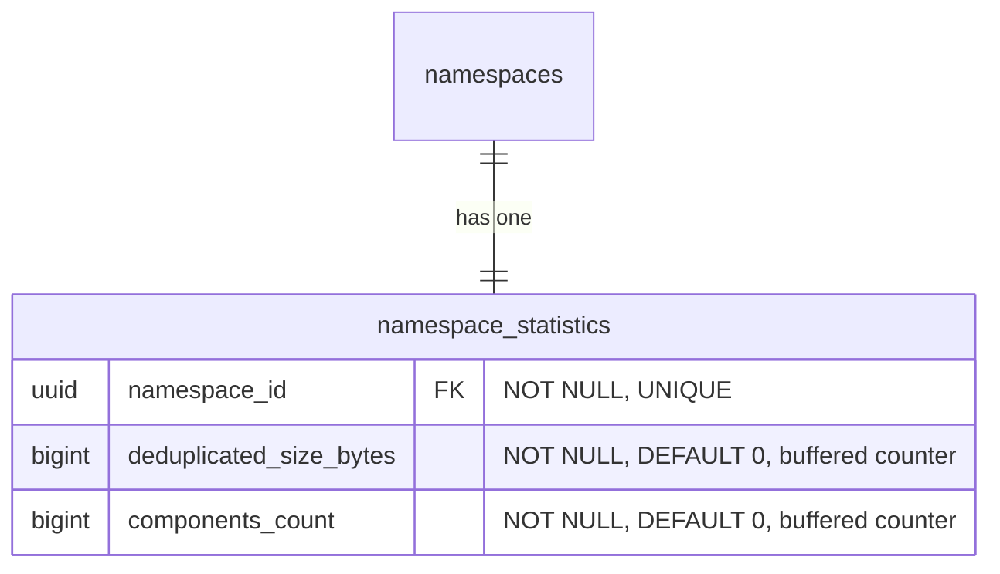

- **namespace_statistics**: 事前計算された名前空間レベルのカウンターを格納し、バッファリングされたカウンター（非同期フラッシャー）を介して維持されます。これは、表示パスと課金システムが読み取るテーブルであり、サブミリ秒のレスポンスを提供します（[ベンチマークテーブル](#namespace-level-storage-accounting-reconciliation) を参照してください）。[調整メカニズム](#namespace-level-storage-accounting-reconciliation) は、ドリフトが疑われる場合にこれらのカウンターを検証し修正するために存在します。
  - `deduplicated_size_bytes`: 名前空間が使用する合計ストレージで、blob の重複排除がすでに適用されたものです（[ADR-002](002_storage_deduplication_scope.md) を参照してください）。このカラムは、将来の生の、または論理的なサイズメトリクスと区別するために、前方互換性を持たせて（`size_bytes` ではなく）このように名付けられています。
  - `components_count`: 名前空間のローカルおよびリモートのリポジトリに格納されたアーティファクトバージョンの総数:
    - Container: `container_manifests` + `container_remote_manifests`。
    - Maven: `maven_versions` + `maven_remote_versions`。
    - npm: `npm_versions` + `npm_remote_versions`。

    ソフト削除済みの行は、[ソフト削除ウィンドウ](010_data_retention.md#soft-delete) の期限が切れた後にガベージコレクションがハード削除するまで、引き続きカウントされます。これは、ガベージコレクションが基になる blob を回収するまでソフト削除済みアーティファクトのバイトを保持する `deduplicated_size_bytes` と一致します。仮想リポジトリは、自身のバージョンテーブルを持たないため別途カウントされません。仮想リポジトリは、順序付けられた upstream のリストを通じてリクエストを解決し（[`container_virtual_repository_upstreams`](#virtual-container-repositories) とその Maven および npm の同等物を参照してください）、各 upstream はそれ自体がローカルまたはリモートのリポジトリであり、そのバージョンは上記のテーブルを介してすでに含まれています。仮想リポジトリをその上にカウントすると、その upstream を二重にカウントすることになります。これは、`deduplicated_size_bytes` を補完する、消費ベースの価格設定と計測のための名前空間レベルの次元です。ストレージ使用量とともに名前空間の概要に表示されます。

#### 名前空間レベルのストレージ集計の調整 {#namespace-level-storage-accounting-reconciliation}

`namespace_statistics.deduplicated_size_bytes` カウンターとリポジトリレベルの `repositories.size_bytes` カウンターは、サブミリ秒の読み取りで表示パスに対応します。しかし、2 つの調整シナリオでは、キャッシュされたカウンターではなくソースデータから正確なストレージを計算する必要があります。

1. **オンデマンドの検証**: 顧客が「私の請求は正確か？」と尋ね、ソースデータから正確な名前空間ストレージを計算する必要がある場合。これは、64 個の `sha256` パーティションすべてにわたる `SUM(size) FROM blob_storage_blobs WHERE namespace_id = ?` を意味します。
2. **ドリフトの修正**: 失敗した GC の実行、部分的なフラッシュ、またはその他のイベントがキャッシュされたカウンターを非同期化し、それを修正するために正確な値を再計算する必要がある場合。

`blob_storage_blobs` は `HASH(sha256)` でパーティショニングされているため、`namespace_id` のみのクエリはいずれも 64 パーティションすべてにファンアウトします。CloudSQL PostgreSQL 18 インスタンス上の [ベンチマーク](https://gitlab.com/gitlab-com/content-sites/handbook/-/merge_requests/18456#note_3166018048)（[シードされた](https://gitlab.com/jdrpereira/artifact-registry-poc/-/tree/main/cmd/seed) データセット: 64 個の `sha256` パーティションにわたる約 160 万の blob、Zipf 分布の blob 所有権を持つ 50 万の名前空間、blob が最も多い名前空間は 353K blob）では、最も重い名前空間でベースラインが 78 ミリ秒、約 3K 以上のバッファヒットを示しています。2 つの追加的な保険策がこれを改善できます。

**オプション A — `blob_storage_blobs` のカバリングインデックス**: 各パーティションの既存の `namespace_id` インデックスに `INCLUDE (size)` を追加します。これにより、64 パーティションのファンアウトが、最小限またはゼロのヒープフェッチを伴う 64 個のインデックスオンリースキャンに変わります。スペースのオーバーヘッドは無視できます（既存のインデックスのリーフページに `size` カラムが追加されるだけです）。

**オプション B — 名前空間パーティショニングされたシャドウテーブル**: `HASH(namespace_id)` で 64 パーティションにパーティショニングされた専用の `blob_storage_blobs_by_namespace` テーブルで、`blob_storage_blobs` の `AFTER INSERT`/`DELETE` トリガーを介して維持されます。これにより、調整クエリが単一パーティションのインデックスオンリースキャンに縮約されます。スペースのオーバーヘッドは中程度です（blob データの最小限のサブセット（`namespace_id`、`sha256`、`size`）を 64 個の新しいパーティションとインデックスにわたって重複させ、blob 数に応じて線形に増加します）。トレードオフは、すべての blob の `INSERT`/`DELETE` での書き込み増幅ですが、調整の負荷をメインの `blob_storage_blobs` テーブル（ホットパス）から遠ざけます。

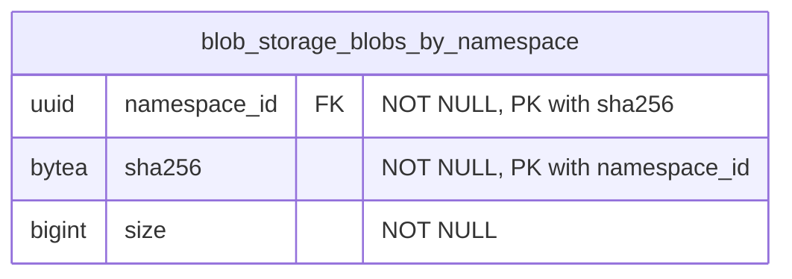

`blob_storage_blobs` のトリガーがこのテーブルを維持します。`AFTER INSERT` は `(namespace_id, sha256, size)` をシャドウテーブルにコピーし、`AFTER DELETE` は一致する行を削除します。`blob_storage_blobs` の行は不変であるため、`AFTER UPDATE` トリガーは不要です。コンテンツアドレス可能なストレージは、コンテンツへの変更が新しい `sha256`、ひいては新しい行を生成することを意味します（[ADR-008](008_content_addressable_storage.md) を参照してください）。主キー `(namespace_id, sha256)` はパーティションキー（`namespace_id`）を含まなければならず、`blob_storage_blobs` の一意キーを反映します。このテーブルは、他の `HASH(namespace_id)` テーブルと同じ 64 パーティション数を使用します。`(namespace_id) INCLUDE (size)` のカバリングインデックスがインデックスオンリースキャンを可能にします。

| アプローチ | タイミング | バッファ | スキャンされるパーティション | 書き込みオーバーヘッド |
|---|---|---|---|---|
| `namespace_statistics` カウンター（表示パス） | 0.013 ms | 1 | 0 | 非同期フラッシャー |
| シャドウテーブル + カバリングインデックス（オプション B） | 29 ms | 1,361 | 1 | トリガー |
| blob のカバリングインデックス（オプション A） | 43 ms | 1,599 | 64 | なし |
| ベースライン（変更なし） | 78 ms | 約 3K 以上 | 64 | なし |

両方のオプションは純粋に追加的であり（`blob_storage_blobs` 自体への変更はありません）、独立して追加または削除できます。これらは相互排他的ではなく、両方が初期スキーマに含まれています。より多くのカバレッジで始め、本番メトリクスがそれらが不要であることを確認したら後でインデックスや補助テーブルをドロップするほうが容易です。

#### 名前空間レベルのコンポーネント数の調整

`namespace_statistics.components_count` カウンターは、表示パスと計測パイプラインに対応します。ストレージカウンターと同様に、2 つのシナリオでソースデータから正確な値を再計算する必要があります。

1. **オンデマンドの検証**: 顧客（または課金）がコンポーネント数が正確かどうかを尋ね、ソース行からそれを導出する必要がある場合。
2. **ドリフトの修正**: 失敗したフラッシュ、部分的なバッファの損失、またはバックグラウンドジョブのバグがカウンターを非同期化し、それを再計算する必要がある場合。

調整は、名前空間の行にスコープされた 6 つの独立したカウントを合計します。3 つのローカル（`container_manifests`、`maven_versions`、`npm_versions`）と 3 つのリモート（`container_remote_manifests`、`maven_remote_versions`、`npm_remote_versions`）です。再計算された値が `components_count` が追跡するものと一致するように、ソフト削除済みの行が含まれます（挿入でインクリメント、ガベージコレクションのハード削除でデクリメント。ソフト削除と復元はノーオペレーションです）。

```sql
SELECT
  (SELECT COUNT(*) FROM container_manifests        WHERE namespace_id = $1)
+ (SELECT COUNT(*) FROM container_remote_manifests WHERE namespace_id = $1)
+ (SELECT COUNT(*) FROM maven_versions             WHERE namespace_id = $1)
+ (SELECT COUNT(*) FROM maven_remote_versions      WHERE namespace_id = $1)
+ (SELECT COUNT(*) FROM npm_versions               WHERE namespace_id = $1)
+ (SELECT COUNT(*) FROM npm_remote_versions        WHERE namespace_id = $1)
  AS components_count;
```

各サブクエリは単一のソーステーブルに対する `namespace_id` によるカウントであり、`soft_deleted_at` 述語がないため、テーブルにまだ存在する行（ライブと、[ソフト削除ウィンドウ](010_data_retention.md#soft-delete) 内のソフト削除済みのもの）が `components_count` が追跡するものと一致します。4 つのパーティショニングされたソーステーブル（`container_manifests`、`container_remote_manifests`、`maven_remote_versions`、`npm_remote_versions`）は単一の `HASH(namespace_id)` パーティションにプルーニングされます。2 つの非パーティショニングの中間層テーブル（`maven_versions`、`npm_versions`）は、名前空間の行についてテーブル全体をスキャンします。既存の部分一意インデックス（`WHERE soft_deleted_at IS NULL`）はライブ行のみをカバーするため、カウントを直接満たすことはできません。名前空間ごとのカーディナリティはデータモデルによって境界付けられており（ファイルや blob 参照ごとではなくバージョンごとに 1 行）、調整は頻繁ではない（ホットパスではなく、オンデマンドまたはドリフトの修正）ため、境界付けられたスキャンは許容されます。追加の保険策（カバリングインデックスやシャドウテーブル）は導入されません。本番メトリクスがこれが遅すぎることを示した場合は、シャドウテーブルを検討する前に、各ソーステーブルの非部分的な `(namespace_id)` インデックスが最も安価な次のステップです。

### インデックス {#indexes}

- **`blob_storage_blobs`**: `(namespace_id, sha256)` の一意インデックス — 重複排除を強制し、Organization 内で sha256 により blob の存在をチェックします。この制約はパーティションキー（`sha256`）を含むため、PostgreSQL はすべてのハッシュパーティションにわたって正しく強制します。`(namespace_id) INCLUDE (size)` のカバリングインデックス — ヒープフェッチなしで [名前空間レベルのストレージ集計の調整](#namespace-level-storage-accounting-reconciliation) のためのインデックスオンリースキャンを可能にします。
- **`blob_storage_attachments`**: `(namespace_id, sha256)` のインデックス — blob のコンテンツハッシュを与えてアタッチメントの存在をチェックします（[クリーンアッププロセス](#cleanup-tasks) が孤立チェックに使用します）。
- **`blob_storage_blobs_by_namespace`**: `(namespace_id, sha256)` の主キー — `blob_storage_blobs` の行との 1 対 1 の対応を強制します。`(namespace_id) INCLUDE (size)` のカバリングインデックス — [名前空間レベルのストレージ集計の調整](#namespace-level-storage-accounting-reconciliation) のための単一パーティションのインデックスオンリースキャンを可能にします。
- **`namespace_statistics`**: `(namespace_id)` の一意インデックス — 名前空間ごとに 1 つの統計レコードです。

ハッシュパーティショニングされたテーブルでは、インデックスはパーティションごとにローカルです。インデックス操作は単一のパーティションにスコープされ、テーブル全体をロックしません。

### Blob ストレージのクエリ例 {#blob-storage-query-examples}

- アーティファクトの pull（読み取りパスのショートカット: `*_files` → `blob_storage_blobs`、アタッチメントをスキップ — 1 パーティション）

  ```sql
  SELECT bsb.object_storage_key, bsb.size
  FROM maven_files mf
  JOIN blob_storage_blobs bsb ON bsb.namespace_id = mf.namespace_id AND bsb.sha256 = mf.blob_sha256
  WHERE mf.namespace_id = '018f4d6f-0e10-7e3a-9bfd-23a4c5d6e7f8' AND mf.maven_version_id = 456 AND mf.file_name = 'myapp-1.0.0.jar'
    AND mf.soft_deleted_at IS NULL;
  ```

- blob アップロード時の重複排除 upsert（1 パーティション、競合なし）

  ```sql
  INSERT INTO blob_storage_blobs (namespace_id, sha256, size, object_storage_key, metadata_sha1)
  VALUES ('018f4d6f-0e10-7e3a-9bfd-23a4c5d6e7f8', 'abcd1234efgh5678...'::bytea, 1048576, 'artifact_registry/.../objects/ab/cd/abcd1234efgh5678...', NULL)
  ON CONFLICT (namespace_id, sha256) DO NOTHING
  RETURNING id, sha256;
  ```

- Organization 内で sha256 により blob の存在をチェックします（1 パーティション）

  ```sql
  SELECT 1 AS one
  FROM blob_storage_blobs
  WHERE namespace_id = '018f4d6f-0e10-7e3a-9bfd-23a4c5d6e7f8' AND sha256 = 'abcd1234efgh5678...'::bytea
  LIMIT 1;
  ```

- 孤立チェック: この blob はまだいずれかのアタッチメントから参照されているか？（1 パーティション）

  ```sql
  SELECT 1 AS one
  FROM blob_storage_attachments
  WHERE namespace_id = '018f4d6f-0e10-7e3a-9bfd-23a4c5d6e7f8' AND sha256 = 'abcd1234efgh5678...'::bytea
  LIMIT 1;
  ```

- blob のカバリングインデックスを介したストレージ集計の調整（オプション A）: ソースデータから正確な名前空間ストレージを計算します（64 パーティション、インデックスオンリースキャン）

  ```sql
  SELECT SUM(size) AS total_size_bytes
  FROM blob_storage_blobs
  WHERE namespace_id = 123;
  ```

- シャドウテーブルを介したストレージ集計の調整（オプション B）: 正確な名前空間ストレージを計算します（1 パーティション、インデックスオンリースキャン）

  ```sql
  SELECT SUM(size) AS total_size_bytes
  FROM blob_storage_blobs_by_namespace
  WHERE namespace_id = 123;
  ```

- 表示パス: 事前計算された名前空間カウンターを読み取ります（単一行のルックアップ）

  ```sql
  SELECT deduplicated_size_bytes, components_count
  FROM namespace_statistics
  WHERE namespace_id = 123;
  ```

## 結果

### メリット {#positive}

1. **各アーティファクトフォーマットに合わせたデータ構成**: 各アーティファクトフォーマットに専用テーブルを使用することで、テーブル構成における最大限の柔軟性が得られます。フォーマットのプロトコルが要求する追加カラムをいくつでも持つことができます。すでに専用テーブルを使用しているため、追加の補助テーブルは不要です。

2. **各フォーマットのデータテーブルが関連する使用パターンを持つ**: 各フォーマットの専用テーブルは、Rest および GraphQL API と関連するアーティファクト管理クライアントから使用パターンを受け取ります。これにより、他のフォーマットの使用パターンからの分離が提供されます。

3. **フォーマット関連データのパフォーマンス分離**: 特定のアーティファクトフォーマットのテーブルでのパフォーマンスのボトルネックは、他のフォーマットに即座に影響を与えることはありません。

4. **透過的なオブジェクトストレージのクリーンアップ**: [オブジェクトストレージのクリーンアップタスク](#cleanup-tasks) が [blob ストレージ](#blob-storage) ドメインに集約されているため、親ドメイン（この場合は各フォーマット固有のドメイン）はこの部分を扱う必要がありません。さらに、このクリーンアップは、削除操作がどのように行われたか（単一要素の破棄、バルク破棄、選択された要素のセットに対して破棄を実行するバックグラウンドのクリーンアップポリシー）に影響されません。

5. **blob ストレージの分離が再利用性を提供する**: blob ストレージのテーブルは、ここで説明している Artifact Registry 機能に縛られていません。そのため、この部分は他の領域でのファイルアップロードのニーズに再利用できます。

6. **効率的なストレージ集計**: Organization スコープの重複排除と Organization ごとの重複排除された blob レコードにより、ストレージ使用量のクエリがシンプルかつ効率的になります。注: `sha256` ベースのパーティショニングでは、Organization レベルの集計は 64 パーティションすべてをスキャンします。これは、遅延インクリメントを介して更新される専用のロールアップテーブルによって緩和されます（[パーティショニング戦略](#blob-storage-partitioning-strategy) を参照してください）。

7. **統合されたクロスフォーマットの一覧表示**: 親の `repositories` テーブルは、名前空間内のすべてのフォーマットおよび種別（ローカル、仮想、リモート）にわたるすべてのリポジトリを一覧表示する単一のソースを提供し、複数のテーブルにわたる `UNION ALL` なしにランディングページのハイブリッドリストを支えます。

8. **スタンドアロンのリモートリポジトリが共有を可能にする**: 独自のライフサイクルを持つスタンドアロンのエンティティとしてのリモートリポジトリは、複数の仮想リポジトリ間で共有でき、設定とキャッシュエントリの重複を削減します。

### デメリット {#negative}

1. **クロスフォーマットの詳細クエリには依然として結合が必要**: 親の `repositories` テーブルがランディングページの一覧表示のユースケースを解決する一方で、フォーマット固有の詳細（例: container イメージ、Maven パッケージ）にアクセスするには、依然としてフォーマット専用のテーブルへの結合が必要です。

2. **blob ストレージのための集約テーブル**: これは 2 つの欠点をもたらします。第一に、これらのテーブルには非常に大量の行が存在することになります。この状況に対処するには、慎重なテーブル設計が必要です。第二に、これらのテーブルの問題（テーブル全体のロックなど）は、すべてのアーティファクト種別に影響を与える可能性があります。

3. **リポジトリごとのストレージ帰属には結合が必要**: リポジトリレベルでの正確なストレージ使用量の帰属は、フォーマット専用のテーブルから `blob_storage_attachments` を経由して `blob_storage_blobs` への結合を通じて導出されます。これにより blob ストレージは汎用的かつ重複排除されたまま保たれますが、非正規化されたリポジトリごとのカウンターと比較していくらかの複雑さが加わります。

4. **2 ステップのリポジトリ作成**: リポジトリの作成には、親の `repositories` テーブルとフォーマット専用のテーブルの両方への挿入が必要です。これは、単一テーブルへの挿入と比較してトランザクションの複雑さを加えます。

## 代替案

### 共通データを集約する

ここでの別のアプローチとして、アーティファクトフォーマットの各領域のすべての共通データを共通かつ集約されたテーブルに格納することが考えられます。

これは、複数のソースを結合することなくそれらのクエリに答えられるため、混在するアーティファクトフォーマットのデータアクセスに大いに役立つでしょう。

このアプローチは [Package Registry 機能](https://docs.gitlab.com/user/packages/package_registry/) ですでに使用されており、この執筆時点では、それらの共通テーブルは予想どおり大量の行を持つだけでなく、多数の専門化されたインデックスも持っています。これらの各インデックスは、アーティファクトフォーマットに固有のアクセスパターンをサポートします。インデックスの量が今日かなり多いため、新しいインデックスを追加すること、たとえば Package Registry 機能に新しいフォーマットのサポートが追加される場合には、より厳しい精査やプッシュバックさえも生じるでしょう。

さらに、各アーティファクトフォーマットには格納する必要のある固有のデータ（例: 正規化されたパッケージ名）があります。この固有のデータは、一部の行でのみ使用されるカラムを生み出すことになるため、共通テーブルには格納できません。これは複数の補助テーブルの作成につながります。それらの補助テーブルは、特定のアーティファクト種別のアクセスパターンに必要な結合の量を増やします。

`repositories` 親テーブルの導入は、このアプローチの限定的なバージョンを採用しています。一覧表示とフィルタリングに必要なクロスフォーマットのメタデータ（名前、可視性、フォーマット、種別、カウンター）のみが集約されます。フォーマット固有のデータは専用テーブルに残り、上記で説明したインデックスの増殖と補助テーブルの問題を回避します。

## 参考資料

- [ADR-001: アンカーポイントとしての Organization](001_organizations_as_anchor_point.md) - レジストリが Organization にアンカーする理由
- [ADR-002: ストレージ重複排除のスコープ](002_storage_deduplication_scope.md) - 重複排除のスコープに関する詳細な意思決定
<!-- - [ADR-010: Data Retention](010_data_retention.md) - Retention policies including soft delete and blob cleanup timing -->
- [Package Registry の共通テーブルの分解](https://gitlab.com/groups/gitlab-org/-/work_items/16000) - 共通のアーティファクト関連データを中央テーブルに格納する際に直面する問題を詳述しています。
