<!-- Design Documents often contain forward-looking statements -->
<!-- vale gitlab.FutureTense = NO -->

## 背景

Artifact Registry は次の点を考慮したデータベース構成を必要とします。

- **異なるアクセスパターン**: アーティファクト管理クライアントは独自のプロトコルを使用し、それはフォーマットごとに大きく異なります。
- **スケーラビリティ**: アーティファクトのストレージは、数百万行が保存される規模にすぐに到達し得ます。
- **パフォーマンス**: 前述の 2 点を踏まえつつ、それでも私たちは操作の大部分を占める読み取りクエリにおいて高速な実行時間を維持したいと考えています。
- **過去の落とし穴**: 現行のコンテナレジストリおよびパッケージレジストリのデータ構成にはいくつかのほころびが見られており（[例](https://gitlab.com/groups/gitlab-org/-/work_items/16000)、[例](https://gitlab.com/groups/gitlab-org/-/epics/9415)）、ここではそれらを回避します。

決定事項に踏み込む前に、以下のスキーマに関するいくつかの注記を述べます。これらは主に、提示するテーブルの数を考慮して可読性を高めるためのものです。

- このドキュメントは機能のコアとなるテーブルについて記述します。サブ機能には追加のテーブルが必要になりますが、ここでは記述しません。例えば、blob ストレージのクリーンアップに必要な補助テーブルの背景については [クリーンアップタスク](#cleanup-tasks) を参照してください。
- テーブル名は可読性のために短縮しています。これらはここには示していない共通のプレフィックスを共有します（例: `artifacts_registry_container_repositories`）。
- Artifact Registry はネームスペースにスコープされます。根拠については [ADR-001](001_organizations_as_anchor_point.md) を参照してください。
- 主キーやタイムスタンプなど、いくつかの共通カラムは明確さのために省略しています。
- すべてのテーブルは `namespace_id` カラムを含みます。[Cells のシャーディングキー要件](https://docs.gitlab.com/ee/development/database/multiple_databases/#guidelines-on-choosing-a-sharding-key) はサテライトサービスのデータベースには適用されません。行はネームスペースのアンカータプル（`platform`、`entity_type`、`entity_id`）を通じて間接的に Organization に帰属します。このカラムは以下のすべてのテーブル定義に明示的に示しています。
- すべての `jsonb` カラムは、無制限なペイロードを防ぎ期待される構造を強制するために、永続化前に厳格な JSON スキーマに対して検証されなければなりません。これはこのドキュメント内のすべての `jsonb` カラムに適用されます（例: `rule_configuration` および `package_json`）。
- テーブルが複数の暗号化された認証情報カラムを持つ場合（例: リモートリポジトリテーブルの `encrypted_username` と `encrypted_password`）、CHECK 制約により、すべての認証情報カラムが設定されているか、いずれも設定されていないかのどちらかを強制しなければなりません。部分的な認証情報（例: パスワードのないユーザー名）は受け付けません。
- リモートリポジトリテーブルの暗号化された認証情報カラム（`encrypted_username`、`encrypted_password`、`encrypted_auth_token`）は、平文の入力を 2048 文字に制限し、暗号化前に Go の検証レイヤーで強制します。この上限は平文に対するものであり、平文はアプリケーションレイヤーにのみ存在します。データベースが見るのは `bytea` の暗号文だけなので、DB 側の CHECK（例: `octet_length(...) <= N`）は、暗号化方式の固定オーバーヘッド（IV、認証タグ、key-id ヘッダー）を介して間接的に平文を制約することしかできず、上限の近似となり、必須の Go チェックと冗長になります。CHECK を省略することで、スキーマを暗号フレーミングから切り離した状態にも保てます。暗号、key-id レイアウト、エンベロープ構造の変更がスキーママイグレーションを必要としません。
- すべての `id` カラムは、Artifact Registry インスタンスのスコープ内で一意でなければなりません。`namespaces.id` は UUIDv7（[RFC 9562](https://datatracker.ietf.org/doc/rfc9562/)）を使用し、すべての Artifact Registry デプロイにまたがるグローバルな一意性を保証します。PostgreSQL バージョン間で利用可能な生成パスを含む完全な根拠については [ネームスペース ID 型](#namespace-id-type) を参照してください。その他すべての `id` カラムは `bigint DEFAULT nextval('<table>_id_seq')` であり、これによりロジカルレプリケーションの互換性が保たれます（[出典](https://gitlab.com/gitlab-com/gl-infra/data-access/dbo/dbo-issue-tracker/-/work_items/691#note_3309931104)）。それらの一意性は単一の Artifact Registry データベース内でローカルに強制されますが、これらは常にネームスペースの下にスコープされるため、それで十分です。

## 決定事項

データの領域は 6 つあります。

- [ネームスペーステーブル](#namespaces)。不変の slug と仮想アンカータプルを持つ内部ネームスペースエンティティを導入することで、Artifact Registry を外部識別子から切り離します。完全な根拠については [ADR-022](022_namespace_decoupling.md) を参照してください。
- [リポジトリコレクションテーブル](#repository-collections)。ネームスペース内のリポジトリの論理的なグループです。スキーマには初日から存在しますが、まだユーザーには公開されていません。すべてのネームスペースには「default」リポジトリコレクションが作成され、すべてのリポジトリが自動的にそこへ割り当てられます。
- ネームスペースレベルのテーブル。これらは [ライフサイクルポリシーの設定とルール](#lifecycle-policies) および [ネームスペースレベルのストレージ統計](#storage-usage-calculation) をネームスペースに直接スコープして扱います。
- [リポジトリ親テーブル](#repositories)。すべてのフォーマットにまたがるすべてのリポジトリ（ホスト型、仮想型、リモート型）の統一されたレジストリであり、ランディングページのハイブリッドリストとクロスフォーマットクエリを支えます。
- アーティファクトフォーマットレベルのテーブル。ここには各フォーマット専用のテーブルがあります。ホスト型リポジトリ（[Container](#container-repositories)、[Maven](#maven-repositories)、[NPM](#npm-repositories)）、リモートリポジトリ（[Container](#container-remote-repositories)、[Maven](#maven-remote-repositories)、[NPM](#npm-remote-repositories)）、仮想リポジトリ（[Container](#virtual-container-repositories)、[Maven](#maven-virtual-repositories)、[NPM](#npm-virtual-repositories)）。それぞれ `repository_id` を介して親の `repositories` テーブルを参照します。
- [blob ストレージレベルのテーブル](#blob-storage)。実際のストレージメタデータと [進行中のアップロードセッションの追跡](#upload-sessions) を扱います。

### ネームスペース {#namespaces}

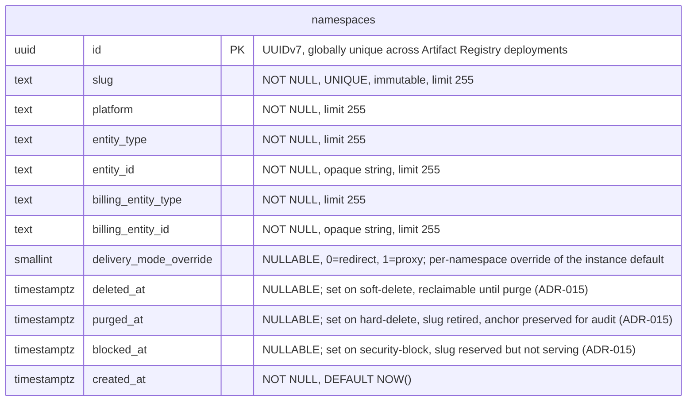

- **namespaces**: 他のすべてのテーブルが `namespace_id` を介して参照するルートエンティティです。各ネームスペースは、URL やクライアント設定で使用される不変かつグローバルに一意な `slug` を持ちます（slug の設計とグローバルな一意性の強制については [ADR-022](022_namespace_decoupling.md) を参照）。`(platform, entity_type, entity_id)` タプルは、そのセマンティクスを解釈することなく、ネームスペースを外部エンティティ（デフォルトでは Organization）にリンクします。`entity_id` は、基となる値が数値であっても `TEXT` として保存され、アンカー型間でスキーマを統一して保ちます。Organizations v1 では、すべての行が `('gitlab', 'organization', '<rails_org_id>')` を持ちます。`billing_entity_type` と `billing_entity_id` は、使用量イベントのための課金アンカーを識別します。外部から提供されるカラム（`platform`、`entity_type`、`entity_id`、`billing_entity_type`、`billing_entity_id`）のいずれもスキーマレベルのデフォルトを持ちません。その根拠については [ADR-022](022_namespace_decoupling.md) を参照してください。`delivery_mode_override` カラムは、[ADR-005](005_artifact_delivery_mode.md) で定義されたネームスペースごとのアーティファクトデリバリーのオーバーライドを保持します。`NULL` はインスタンスのデフォルト（`StorageConfig.delivery_mode`）を継承し、`0`（`redirect`）はこのネームスペースに対してリダイレクトを強制し、`1`（`proxy`）はプロキシを強制します。ダウンロードリクエストの有効なデリバリーパターンは `namespace.delivery_mode_override ?? instance.delivery_mode` です。このカラムは、リクエストハンドラーが認可とルーティングのために実行する既存のネームスペース検索の一環として読み取られるため、別個のクエリやインデックスは必要ありません。カラム型は `SMALLINT` で、整数からラベルへのマッピングは Go アプリケーションで定義されます（`0 = redirect`、`1 = proxy`）。これは enum スタイルのカラムに関する [Artifact Registry のデータベース規約](https://gitlab.com/gitlab-org/ops/artifact-registry/-/blob/main/docs/dev/database.md#enums) に従っています（PostgreSQL の `ENUM` 型は安全に変更するのが難しいため避けています）。アーティファクトデリバリーの選択を保存する将来のカラム（例: S17 がリポジトリごとのオーバーライドを導入する場合）は、同じ整数マッピングを再利用します。
- **ライフサイクルカラム**（`deleted_at`、`purged_at`、`blocked_at`）: [ADR-015（内部）](https://internal.gitlab.com/handbook/engineering/architecture/design-documents/artifact_registry/decisions/015_slug_policy/#slug-lifecycle)で定義された slug ライフサイクルを実装します。`deleted_at` はソフト削除されたネームスペースを示し、[ADR-010](010_data_retention.md#subscription-expiration) のソフト削除期間内は回復可能です。`purged_at` はハード削除されたネームスペースを示し、slug は恒久的に廃止され、アンカーと課金カラムは監査とフォレンジックのため保持されます。`blocked_at` はセキュリティ上ブロックされたネームスペースを示します（slug は予約されますが、リクエストは処理されません）。これらのカラムは状態ではなくイベント記録です。一度設定されると設定されたままになります。purge 済みの行では `deleted_at` と `purged_at` の両方が設定されます。呼び出し元は関心に関連するサブセットでフィルタリングします。リクエストを処理する検索（ルーティング、認可、ダウンロード、push）は 3 つすべてを除外します（`WHERE deleted_at IS NULL AND purged_at IS NULL AND blocked_at IS NULL`）。サブスクリプションライフサイクルのクエリ（課金、保持、スケジュールジョブ）は、セキュリティ上ブロックされたネームスペースもサブスクライブ済みネームスペースのままであるため、`deleted_at` と `purged_at` のみを除外します。

#### slug の不変性 {#slug-immutability}

PostgreSQL にはネイティブな不変カラムのサポートがありません。slug の不変性（[ADR-022](022_namespace_decoupling.md)）は、値が変更された場合に例外を発生させる `BEFORE UPDATE OF slug` トリガーによってデータベースレベルで強制されます。これは、アプリケーションレイヤーをバイパスするあらゆるコードパス（直接的なデータベースアクセス、管理ツール、マイグレーション）を捕捉します。このトリガーは、slug の変更を必要とする緊急操作のために無効化できます（例: `ALTER TABLE namespaces DISABLE TRIGGER trg_namespaces_immutable_slug`）。

#### インデックス {#namespaces-indexes}

- **`namespaces`**: `(slug)` に対するユニークインデックス — slug によってネームスペースを検索します。`(platform, entity_type, entity_id) WHERE purged_at IS NULL` に対する部分ユニークインデックス — purge されていない行の間でアンカーの重複を防ぎます。アクティブな行とソフト削除済みの行は対象になりますが、purge 済みの行は対象外です。そのため、以前 purge された Organization は新しいネームスペース行で再オンボーディングでき、purge 済みの行は監査のためにアンカーデータを保持できます。`delivery_mode_override`、`deleted_at`、`purged_at`、`blocked_at` にはインデックスを設けません。これらのカラムは `id` または `slug` をキーとする既存のネームスペース検索の一環として読み取られ、ライフサイクル述語は取得された単一行に対してフィルタリングします。

[ADR-015（内部）](https://internal.gitlab.com/handbook/engineering/architecture/design-documents/artifact_registry/decisions/015_slug_policy/#reservation-taxonomy)で定義された予約済み slug リストはデータベースには保存しません。

### リポジトリコレクション {#repository-collections}

リポジトリコレクションは、ネームスペース内のリポジトリの論理的なグループであり、チーム、セキュリティドメイン、製品ラインによってアーティファクトを整理します。リポジトリコレクションを UI と API に公開することは MVP のスコープ外です。このエンティティは純粋に将来の互換性のために初日から存在します。MVP の間、すべてのネームスペースには作成時に単一の「default」リポジトリコレクションが作成され、すべてのリポジトリがそこへ割り当てられます。MVP 後にリポジトリコレクションの概念が公開されると、ユーザーは追加のリポジトリコレクションを作成し、リポジトリをそこへ再割り当てできます。

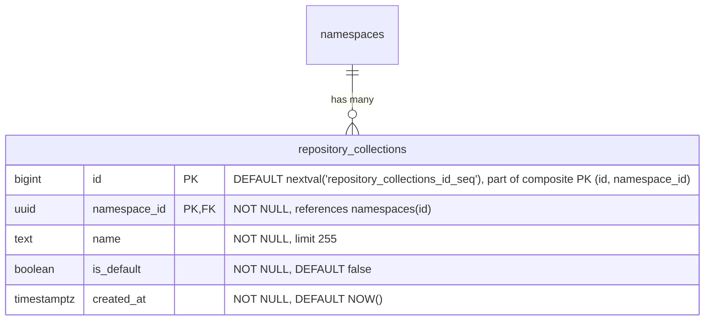

- **repository_collections**: ネームスペース内のリポジトリの論理的なグループです。`name` はネームスペース内で一意な、人間が読めるラベルです。`is_default` は、すべてのネームスペースとともに自動的に作成され、MVP の間にすべてのリポジトリが割り当てられるリポジトリコレクションを示します。`HASH(namespace_id)` で 64 パーティションにパーティショニングされます。

すべてのネームスペース作成時に、デフォルトのリポジトリコレクション行をアトミックに挿入しなければなりません。

```sql
INSERT INTO repository_collections (namespace_id, name, is_default)
VALUES (<new_namespace_id>, 'default', true)
ON CONFLICT (namespace_id, name) DO NOTHING;
```

#### インデックス {#repository-collections-indexes}

- **`repository_collections`**: `(id, namespace_id)` に対する主キー — `HASH(namespace_id)` パーティショニングに必要な複合 PK であり、`repositories` からの複合外部キーのターゲットも兼ねます。`(namespace_id, name)` に対するユニークインデックス — ネームスペース内で名前によってリポジトリコレクションを検索します。`(namespace_id) WHERE is_default IS TRUE` に対する部分ユニークインデックス — ネームスペースごとにデフォルトのリポジトリコレクションが最大 1 つであることを強制します。

#### クエリ例 {#repository-collections-query-examples}

- ネームスペースのデフォルトのリポジトリコレクションを取得する。

  ```sql
  SELECT *
  FROM repository_collections
  WHERE namespace_id = '018f4d6f-0e10-7e3a-9bfd-23a4c5d6e7f8' AND is_default = true;
  ```

- ネームスペースのすべてのリポジトリコレクションを一覧する。

  ```sql
  SELECT id, name, is_default, created_at
  FROM repository_collections
  WHERE namespace_id = '018f4d6f-0e10-7e3a-9bfd-23a4c5d6e7f8'
  ORDER BY created_at;
  ```

- 新しい（デフォルトではない）リポジトリコレクションを作成する。

  ```sql
  INSERT INTO repository_collections (namespace_id, name)
  VALUES ('018f4d6f-0e10-7e3a-9bfd-23a4c5d6e7f8', 'team-backend');
  ```

### リポジトリ {#repositories}

`repositories` テーブルは、フォーマットや種類に関係なくシステム内のすべてのリポジトリを登録する統一された親テーブルです。これはランディングページのハイブリッドリスト、すなわちすべてのフォーマットにまたがるホスト型・仮想型・リモート型のリポジトリを表示する単一のソート可能・フィルター可能・ページネーション可能なビューを支えます。各フォーマット固有のリポジトリテーブル（ホスト型、仮想型、リモート型）は、`repository_id` を介してここの単一の行を参照します。

このモデル（ホスト型、リモート型、仮想型を対等なスタンドアロンの型とし、参照によって構成する）は、JFrog Artifactory、Sonatype Nexus、Google Cloud AR がすべて採用しているものです。ただし各社で型の名前は異なります。


- **repositories**: すべてのリポジトリの親エンティティです。`format` はアーティファクトフォーマット（container、Maven、npm）を識別します。`kind` はリポジトリの種類（ホスト型、仮想型、リモート型）を識別します。リポジトリは [`repository_collection_repositories`](#repository-collection-repositories) 結合テーブルを介してリポジトリコレクションにリンクされ、リポジトリがそのネームスペース内の 1 つ以上のリポジトリコレクションに属することを可能にします。MVP の間、すべてのリポジトリはネームスペースのデフォルトのリポジトリコレクションにリンクされます。`name` はネームスペース内で一意でなければならず、これはすべての競合製品と一致しています。カウンターカラム（`artifacts_count`、`downloads_count`、`size_bytes`）は、ホット行の競合を避けるために [バッファ書き込み/非同期書き込み](#buffered-and-asynchronous-writes) を介して維持されます。`last_updated_at` は、ダウンロードではなくコンテンツの変更（アーティファクトの公開/変更/削除、キャッシュイベント）を追跡します。`gitlab_created_by_user_id` と `gitlab_last_updated_by_user_id` は、どの GitLab ユーザーがリポジトリを作成し最後に変更したかを記録します。どちらも nullable な不透明な参照で、外部キーもアプリケーション側の検証もありません。なぜなら、ユーザーレコードはモノリスに存在するためです。ユーザーハンドルとアバターのレンダリングはコンシューマーの責任であり、AR スキーマは ID のみを保存します。これらは `namespaces.entity_id` と同じ理由で `TEXT` として保存されます。上流のユーザー ID 形式が将来変更されても（例: UUID への変更）、スキーママイグレーションは不要です。`description` は、UI が仮想リポジトリだけでなくすべてのリポジトリ型の説明を表示するため、親テーブルにあります。`soft_deleted_at` タイムスタンプは、リポジトリがソフト削除された時刻を記録し、必要に応じて復元を可能にします。ソフト削除を親テーブルに置くことで、すべてのリポジトリ型（ホスト型、仮想型、リモート型）がフォーマット固有の処理なしに同じ削除セマンティクスを共有します。`HASH(namespace_id)` で 64 パーティションにパーティショニングされます。

#### インデックス {#repositories-indexes}

- **`repositories`**: `(namespace_id, name)` に対するユニークインデックス — アクティブなリポジトリとソフト削除されたリポジトリの両方にまたがって名前の一意性を強制し、名前の衝突によって復元が失敗することがないようにします。名前の再利用にはまずハード削除が必要です。`(namespace_id, name) WHERE soft_deleted_at IS NULL` に対するインデックス — アクティブなリポジトリの検索と名前順の一覧表示のために最適化されたスキャンパスです。`(namespace_id, format) WHERE soft_deleted_at IS NULL` に対するインデックス — アクティブなリポジトリをフォーマットでフィルターします。`(namespace_id, kind) WHERE soft_deleted_at IS NULL` に対するインデックス — アクティブなリポジトリを種類でフィルターします。`(namespace_id, visibility) WHERE soft_deleted_at IS NULL` に対するインデックス — リポジトリを可視性レベルでフィルターします（可視性監査クエリ「このネームスペースで現在公開されているリポジトリはどれか?」を支えます）。ランディングページのソート可能なカラムごとに 1 つずつ、すべて `WHERE soft_deleted_at IS NULL` 付きのインデックス: `(namespace_id, artifacts_count DESC)`、`(namespace_id, downloads_count DESC)`、`(namespace_id, size_bytes DESC)`、`(namespace_id, last_updated_at DESC NULLS LAST)`。`(namespace_id, soft_deleted_at DESC) WHERE soft_deleted_at IS NOT NULL` に対するインデックス — このネームスペース内のソフト削除されたリポジトリを削除時刻順に一覧します（ゴミ箱一覧クエリ「ゴミ箱には何があり、いつ削除されたか?」を支えます）。この逆の部分述語は上記のアクティブ行の部分インデックスを反映したものです。このテーブルの他のすべての部分インデックスはゴミ箱を除外し、完全な `(namespace_id, name)` ユニークインデックスは `soft_deleted_at` をキーにしないため、ゴミ箱の一覧表示はそうでなければフィルターとソートのためにネームスペース内のすべての行を訪れなければならなくなります。GC の適格性は [ADR-010](010_data_retention.md) に従って `soft_deleted_at + retention_window` から導出されます。別個のカラムは不要です。

MVP の間、すべてのリポジトリは単一のデフォルトのリポジトリコレクションにリンクされるため、`(namespace_id, ...)` ソートインデックスはネームスペース全体のクエリとコレクションでフィルターされたクエリの両方に対応します。MVP 後、ネームスペースが複数のリポジトリコレクションを持つようになると、コレクションでフィルターされたクエリは `repository_collection_repositories` を介して JOIN します。追加のサポートインデックスは、リポジトリコレクションが公開される際に評価されます。

#### クエリ例 {#repositories-query-examples}

- ネームスペースのすべてのリポジトリ（すべてのリポジトリコレクション）を最終更新順に一覧する。

  ```sql
  SELECT id, name, description, format, kind, artifacts_count,
         downloads_count, size_bytes, last_updated_at
  FROM repositories
  WHERE namespace_id = '018f4d6f-0e10-7e3a-9bfd-23a4c5d6e7f8' AND soft_deleted_at IS NULL
  ORDER BY last_updated_at DESC NULLS LAST
  LIMIT 20;
  ```

- リポジトリコレクションでフィルターしたネームスペースのリポジトリを最終更新順に一覧する。

  ```sql
  SELECT r.id, r.name, r.description, r.format, r.kind, r.artifacts_count,
         r.downloads_count, r.size_bytes, r.last_updated_at
  FROM repositories r
  JOIN repository_collection_repositories rcr
    ON rcr.namespace_id = r.namespace_id AND rcr.repository_id = r.id
  WHERE r.namespace_id = '018f4d6f-0e10-7e3a-9bfd-23a4c5d6e7f8' AND rcr.repository_collection_id = 456 AND r.soft_deleted_at IS NULL
  ORDER BY r.last_updated_at DESC NULLS LAST
  LIMIT 20;
  ```

- リポジトリコレクションとフォーマットでフィルターしたリポジトリを一覧する。

  ```sql
  SELECT r.id, r.name, r.description, r.format, r.kind, r.artifacts_count,
         r.downloads_count, r.size_bytes, r.last_updated_at
  FROM repositories r
  JOIN repository_collection_repositories rcr
    ON rcr.namespace_id = r.namespace_id AND rcr.repository_id = r.id
  WHERE r.namespace_id = '018f4d6f-0e10-7e3a-9bfd-23a4c5d6e7f8' AND rcr.repository_collection_id = 456 AND r.format = 0
    AND r.soft_deleted_at IS NULL
  ORDER BY r.name
  LIMIT 20;
  ```

- 名前で単一のリポジトリを検索する。

  ```sql
  SELECT *
  FROM repositories
  WHERE namespace_id = '018f4d6f-0e10-7e3a-9bfd-23a4c5d6e7f8' AND name = 'my-repo' AND soft_deleted_at IS NULL;
  ```

- 可視性監査: ネームスペース内のすべての公開リポジトリを一覧する（`(namespace_id, visibility) WHERE soft_deleted_at IS NULL` の部分インデックスを使用）。

  ```sql
  SELECT id, name, format, kind
  FROM repositories
  WHERE namespace_id = '018f4d6f-0e10-7e3a-9bfd-23a4c5d6e7f8' AND visibility = 0 AND soft_deleted_at IS NULL
  ORDER BY name;
  ```

- ゴミ箱一覧: ネームスペース内のすべてのソフト削除されたリポジトリを、最近削除された順に一覧する（`(namespace_id, soft_deleted_at DESC) WHERE soft_deleted_at IS NOT NULL` の部分インデックスを使用）。スコープはネームスペース全体なので、管理者は「今すぐ復元可能なものは何か?」を 1 つのクエリで回答できます。親ごとのゴミ箱ビューは別個の UI の関心事であり、必要であれば後から親をキーとするインデックスを追加することで対応できます。

  ```sql
  SELECT id, name, format, kind, soft_deleted_at
  FROM repositories
  WHERE namespace_id = '018f4d6f-0e10-7e3a-9bfd-23a4c5d6e7f8' AND soft_deleted_at IS NOT NULL
  ORDER BY soft_deleted_at DESC
  LIMIT 50;
  ```

### リポジトリコレクションリポジトリ {#repository-collection-repositories}

`repository_collection_repositories` 結合テーブルは、リポジトリを、それが属するリポジトリコレクションにマッピングします。リポジトリはそのネームスペース内の 1 つ以上のリポジトリコレクションのメンバーになることができ、共通のユーティリティリポジトリを複数のチームのリポジトリコレクションを通じて公開するといった共有アクセスのシナリオを可能にします。

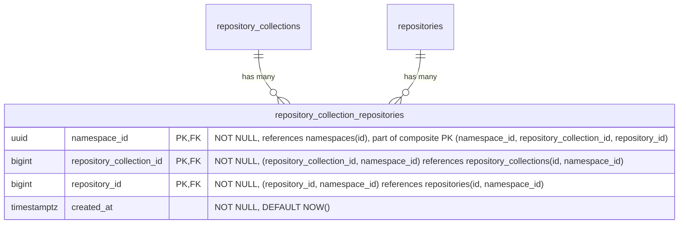

- **repository_collection_repositories**: リポジトリをリポジトリコレクションにリンクします。MVP の間、すべてのリポジトリはちょうど 1 つのリポジトリコレクション（ネームスペースのデフォルト）にリンクされますが、スキーマは複数のリンクを許可するため、MVP 後にリポジトリをリポジトリコレクション間で共有できます。アプリケーションは、すべてのリポジトリが少なくとも 1 つのリポジトリコレクションリンクを持つという不変条件を強制します。Postgres はこれを宣言的に表現できません。複合外部キーにより、リポジトリコレクションとリポジトリは同じネームスペース内でのみリンクできることが保証されます。`HASH(namespace_id)` で 64 パーティションにパーティショニングされます。

#### インデックス {#repository-collection-repositories-indexes}

- **`repository_collection_repositories`**: `(namespace_id, repository_collection_id, repository_id)` に対する主キー — リンクの一意性を強制し、リポジトリコレクションによる検索に対応します。`(namespace_id, repository_id)` に対するインデックス — 特定のリポジトリが属するすべてのリポジトリコレクションを検索します。

#### クエリ例 {#repository-collection-repositories-query-examples}

- リポジトリが属するすべてのリポジトリコレクションを一覧する。

  ```sql
  SELECT repository_collection_id
  FROM repository_collection_repositories
  WHERE namespace_id = '018f4d6f-0e10-7e3a-9bfd-23a4c5d6e7f8' AND repository_id = 789;
  ```

- リポジトリをリポジトリコレクションにリンクする。

  ```sql
  INSERT INTO repository_collection_repositories (namespace_id, repository_collection_id, repository_id)
  VALUES ('018f4d6f-0e10-7e3a-9bfd-23a4c5d6e7f8', 456, 789)
  ON CONFLICT (namespace_id, repository_collection_id, repository_id) DO NOTHING;
  ```

### ライフサイクルポリシー {#lifecycle-policies}

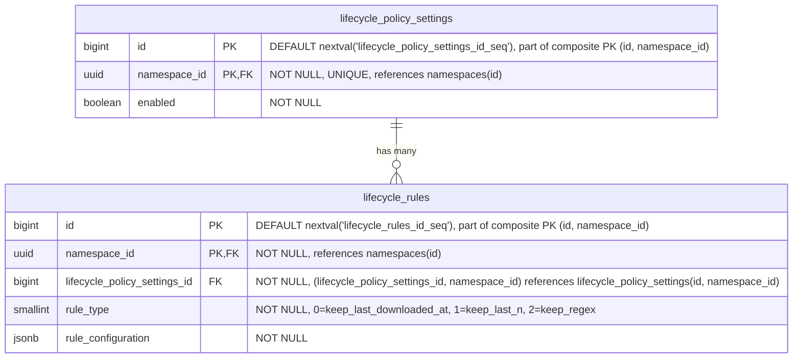

- **lifecycle_policy_settings**: ネームスペースレベルでライフサイクル管理の設定を定義し、すべてのリポジトリのデフォルトポリシーとして機能します。有効化されると、関連するライフサイクルルールがネームスペース全体に適用されます。これらのポリシーはリポジトリレベルのポリシーによって [オーバーライド](#repository-level-overrides) できます。`HASH(namespace_id)` で 64 パーティションにパーティショニングされます。
- **lifecycle_rules**: ネームスペースレベルで特定のアーティファクトのライフサイクル動作を統制する、個々の保持・クリーンアップルールを指定します。これらのルールは、リポジトリレベルで [オーバーライド](#repository-level-overrides) されない限り、すべてのリポジトリに適用されます。ポリシーレコードごとのライフサイクルルールの数は、ルール評価時のパフォーマンス低下を防ぐために制限されます。これは、例えば特定のアーティファクトをどのくらいの期間保持するかをユーザーが指定するために使用されます（例: Maven スナップショットファイルは 1 か月だけ保持するなど）。`HASH(namespace_id)` で 64 パーティションにパーティショニングされます。

#### インデックス {#lifecycle-policies-indexes}

- **`lifecycle_policy_settings`**: `(namespace_id)` に対するユニークインデックス — ネームスペースごとに 1 つのポリシー設定レコード。
- **`lifecycle_rules`**: `(namespace_id, lifecycle_policy_settings_id)` に対するインデックス — 特定のポリシーのすべてのルールを取得します。

リポジトリレベルのオーバーライドテーブルは同じパターンに従います。設定テーブルには `(namespace_id, repository_id)` に対するユニークインデックス、ルールテーブルには `(namespace_id, <format>_repository_lifecycle_policy_settings_id)` に対するインデックスです。

#### クエリ例 {#lifecycle-policies-query-examples}

- 特定のネームスペースのポリシーを取得する

  ```sql
  SELECT lp.*
  FROM lifecycle_policy_settings lp
  WHERE lp.namespace_id = '018f4d6f-0e10-7e3a-9bfd-23a4c5d6e7f8';
  ```

- 特定のアーティファクトリポジトリのポリシーを取得する

  ```sql
  SELECT *
  FROM container_repository_lifecycle_policy_settings
  WHERE container_repository_lifecycle_policy_settings.namespace_id = '018f4d6f-0e10-7e3a-9bfd-23a4c5d6e7f8'
    AND container_repository_lifecycle_policy_settings.repository_id = 123;
  ```

- 新しいライフサイクルルールを作成する

  ```sql
  INSERT INTO lifecycle_rules (namespace_id, lifecycle_policy_settings_id, rule_type, rule_configuration)
  VALUES ('018f4d6f-0e10-7e3a-9bfd-23a4c5d6e7f8', 123, 1, '{"count": 10}'::jsonb);
  ```

- ライフサイクルルールを更新する

  ```sql
  UPDATE lifecycle_rules
  SET rule_configuration = '{"count": 20}'::jsonb
  WHERE namespace_id = '018f4d6f-0e10-7e3a-9bfd-23a4c5d6e7f8'
    AND id = 123;
  ```

- ライフサイクルルールを破棄する

  ```sql
  DELETE FROM lifecycle_rules
  WHERE namespace_id = '018f4d6f-0e10-7e3a-9bfd-23a4c5d6e7f8'
    AND id = 123;
  ```

#### リポジトリレベルのオーバーライド {#repository-level-overrides}

各リポジトリ型（[container](#container-repositories)、[maven](#maven-repositories)、[npm](#npm-repositories)）は、ネームスペースレベルの値に対するオーバーライドを提供する、同様の名前のテーブルを持ちます。これにより優先順位システムが構築されます: ネームスペース（最低）-> リポジトリ（最高）。オーバーライドは `repository_id` を介して親の `repositories` テーブルを参照します。


（各アーティファクトフォーマットにオーバーライドテーブルがあるため、`artifact_type` は `container`、`maven`、`npm` に置き換える必要があります。これらのオーバーライドはホスト型、仮想型、リモート型のリポジトリに同様に適用されます。`repository_id` 外部キーは親の `repositories` テーブルを参照し、フォーマット固有のテーブルはリポジトリの `format` カラムによって決まります。）

これらのテーブルは、ある意味で [カスケード設定](https://docs.gitlab.com/development/cascading_settings/) のように動作します。それらの説明は [ネームスペースレベル](#lifecycle-policies) の同様の名前のテーブルとまったく同じであり、パーティショニングも同様です。すべてのオーバーライドテーブルは `HASH(namespace_id)` で 64 パーティションにパーティショニングされます。現在の 2 層の優先順位システム（ネームスペース → リポジトリ）は、MVP 後にリポジトリコレクションが公開される際に 3 層（ネームスペース → リポジトリコレクション → リポジトリ）に拡張できます。これには同じパターンに従ってリポジトリコレクションレベルのオーバーライドテーブルを追加する必要がありますが、既存のネームスペースレベルやリポジトリレベルのテーブルへの変更は不要です。

### コンテナリポジトリ {#container-repositories}

この部分の課題は、[OCI Distribution Spec v1.1](https://github.com/opencontainers/distribution-spec/blob/main/spec.md) に準拠することです。

<!--TODO This link will not live for long since it's an artifact output-->
このアプローチは [GitLab Container Registry のスキーマ](https://gitlab.com/gitlab-org/container-registry/-/jobs/12449560500/artifacts/file/db-DAG.png) から大きな着想を得ています。


- **container_repositories**: 複数のイメージのコンテナです。各リポジトリは独立したバージョニングを持つ複数のイメージをホストできます。名前、可視性、クロスフォーマットクエリのために `repository_id` を介して親の `repositories` テーブルを参照します。`HASH(namespace_id)` で 64 パーティションにパーティショニングされます。
- **container_images**: リポジトリ内の名前付きコンテナイメージ（例: `myapp`、`backend`）を表します。`last_downloaded_at` はイメージが最後にプルされた時刻を記録し、[バッファ書き込み/非同期書き込み](#buffered-and-asynchronous-writes) を介して維持されます。`keep_last_downloaded_at` ライフサイクルルールによって、ダウンロードベースの保持を評価するために使用されます（[ADR-010](010_data_retention.md)）。`soft_deleted_at` タイムスタンプは、イメージがソフト削除された時刻を記録し、必要に応じて復元を可能にします。`HASH(namespace_id)` で 64 パーティションにパーティショニングされます。
- **container_blobs**: コンテナイメージを構成する、個々のコンテンツアドレス可能なレイヤーと設定オブジェクトを保存します。マニフェストとその構成要素であるレイヤー（blob）の関係は暗黙的であり（実行時にマニフェストの内容を解析することで決定される）、データベースの外部キーとしてはモデル化されません。`soft_deleted_at` タイムスタンプは、blob がソフト削除された時刻を記録し、必要に応じて復元を可能にします。`HASH(namespace_id)` で 64 パーティションにパーティショニングされます。
- **container_manifests**: 特定のイメージバージョンの設定とレイヤーを記述するイメージマニフェストを表します。`size` カラムは、ここをルートとするマニフェストツリーの合計バイトサイズを保持します。すなわち、このマニフェスト自体のペイロードに加えて、そこから到達可能なすべての blob（マニフェストリストや OCI インデックスの場合は子マニフェストを通じて推移的に到達するものを含む）です。`gitlab_user_id` はどの GitLab ユーザーがこのマニフェストをプッシュしたかを記録します。nullable な不透明なテキスト参照で外部キーはなく、[repositories](#repositories) の同等のカラムと同じ根拠によります。ユーザーレコードはモノリスに存在し、ユーザーハンドルとアバターのレンダリングはコンシューマーの責任であり、AR スキーマは ID のみを保存し、`TEXT` はスキーマを上流のユーザー ID 形式の将来の変更から隔離します。`gitlab_project_id` と `gitlab_git_commit_sha` は、その帰属に公開コンテキストの残りを加えて拡張します。`gitlab_project_id` はプッシュ元の GitLab プロジェクト（例: `CI_PROJECT_ID`）であり、`gitlab_user_id` と同じモノリス参照の理由から nullable な不透明テキストとして保存されます。`gitlab_git_commit_sha` は公開時の Git コミット（例: `CI_COMMIT_SHA`）で、ハッシュカラムのスキーマ規約に従って nullable な `bytea` として保存されます。可変長で、SHA-1（20 バイト）と SHA-256（32 バイト）の両方に収まります。これはモノリス参照ではなく公開時の事実なので、外部キーは不要です。両方とも、CI コンテキストなしでプッシュが到着した場合（例: 開発者のワークステーションからの手動プッシュ）には NULL になります。`soft_deleted_at` タイムスタンプは、マニフェストがソフト削除された時刻を記録し、必要に応じて復元を可能にします。`created_at` はマニフェストが最初にプッシュされた時刻を記録します。ネームスペースごとの時刻順インデックスと組み合わせることで、公開履歴と時間範囲のアーティファクト出所クエリ（例: 「午前 2 時から午前 8 時の間にこのネームスペースにプッシュされたものは何か?」）を支えます。公開イベント自体は削除によって消去されないため、ソフト削除された行も公開履歴に引き続き表示されます。`HASH(namespace_id)` で 64 パーティションにパーティショニングされます。
- **container_manifest_relationships**: Docker マニフェストリストと OCI インデックス（マルチアーキテクチャイメージなど）を扱います。ここでは親マニフェストが複数の他のマニフェストを参照できます。`HASH(namespace_id)` で 64 パーティションにパーティショニングされます。
- **container_tags**: 特定のマニフェストを指す、人間が読める名前（例: `latest`、`v1.2.3`）を提供します。`HASH(namespace_id)` で 64 パーティションにパーティショニングされます。
- **blob_storage_attachments**: 詳細は [blob ストレージ](#blob-storage) セクションを参照してください。

`container_blobs` テーブルは、他のコンテナレジストリアーキテクチャがそうするかもしれない方法で、コンテナレジストリの物理的な blob を直接保存することはしません。ここでの違いは、blob ストレージが [blob ストレージ](#blob-storage) テーブルで処理される（重複排除とガベージコレクションも含む）ことです。したがって、`container_*` レベルでは、単に `blob_storage_attachments` レコードへの参照を保存するだけで済みます。

#### インデックス {#container-repositories-indexes}

- **`container_repositories`**: `(namespace_id, repository_id)` に対するユニークインデックス — 親リポジトリ参照によってコンテナリポジトリを検索します。
- **`container_images`**: `(namespace_id, container_repository_id, name) WHERE soft_deleted_at IS NULL` に対するユニークインデックス — イメージ名はリポジトリ内で一意なイメージを識別します。重複すると OCI の名前ベースの検索が壊れます。部分条件により、ソフト削除後に同じ名前のイメージを再作成できます。`(namespace_id, container_repository_id, last_downloaded_at NULLS FIRST) WHERE soft_deleted_at IS NULL` に対するインデックス — `keep_last_downloaded_at` ライフサイクルルールの評価をサポートします。リポジトリ内のすべてのイメージをスキャンして行ごとにフィルターするのではなく、境界のある範囲スキャンによって期限切れになったイメージのみを返します。`NULLS FIRST` は、一度もダウンロードされていないイメージを最も古い行とグループ化し、両方が同じ範囲スキャンで返されるようにします。
- **`container_blobs`**: `(namespace_id, container_image_id, digest) WHERE soft_deleted_at IS NULL` に対するユニークインデックス — blob のダイジェストはコンテンツアドレス指定です。同じイメージ内の同じダイジェストは定義上同じ blob です。部分条件により、ソフト削除後に同じダイジェストを再プッシュできます。`(namespace_id, blob_storage_attachment_id)` に対するインデックス — ストレージアタッチメントによって blob を検索します。`(namespace_id, blob_sha256)` に対するインデックス — 保存された blob の sha256 から、それを参照するすべてのコンテナ blob への逆引きで、クロスフォーマットのチェックサム検索と脆弱性影響クエリ「この侵害されたダイジェストが与えられたとき、どのイメージがそれを参照しているか?」を支えます。既存の `(namespace_id, container_image_id, digest)` インデックスはイメージをキーとし、1 つのイメージ内でしかスキャンできないため、このインデックスがなければクエリはネームスペースごとのパーティションスキャンにフォールバックします。同じ形状は、この MR の他のすべての逆引きインデックスに適用されます。無条件（`soft_deleted_at` 述語なし）なので、かつて参照されたダイジェストは監査証跡に引き続き表示されます。現在影響を受けているアーティファクトのみを必要とする脆弱性影響は、クエリ時に親テーブル（イメージ/バージョン/パッケージ）に対する JOIN に `soft_deleted_at IS NULL` を追加します。これは小さな中間集合に対する安価な後置フィルターです。
- **`container_manifests`**: `(namespace_id, container_image_id, digest) WHERE soft_deleted_at IS NULL` に対するユニークインデックス — マニフェストのダイジェストはコンテンツアドレス指定です。同じイメージ内の同じダイジェストは定義上同じマニフェストです。部分条件により、ソフト削除後に同じダイジェストを再プッシュできます。`(namespace_id, blob_storage_attachment_id)` に対するインデックス — ストレージアタッチメントによってマニフェストを検索します。`(namespace_id, blob_sha256)` に対するインデックス — マニフェストペイロードの保存された blob の sha256 から、それを参照するすべてのマニフェストへの逆引きで、クロスフォーマットのチェックサム検索を支えます。[`container_blobs`](#container-repositories) インデックスを反映しており、単一の sha256 検索でレイヤーとマニフェストの両方の参照を 1 回の走査で返します。`(namespace_id, soft_deleted_at DESC) WHERE soft_deleted_at IS NOT NULL` に対するインデックス — ソフト削除されたマニフェストを削除時刻順に一覧し、コンテナイメージのアーティファクト粒度のゴミ箱一覧クエリを支えます。`(namespace_id, created_at DESC)` に対するインデックス — ネームスペース全体の時系列スキャンで、公開履歴のページネーションと時間範囲のアーティファクト出所クエリを支えます。無条件（`soft_deleted_at` 述語なし）なので、後でソフト削除された公開イベントも監査証跡に引き続き表示されます。
- **`container_manifest_relationships`**: `(namespace_id, parent_container_manifest_id, child_container_manifest_id)` に対するユニークインデックス — 親子関係の重複を防ぎ、特定の親マニフェストのすべての子を見つけます。`(namespace_id, child_container_manifest_id)` に対するインデックス — 特定の子マニフェストのすべての親を見つけます。`(namespace_id, container_image_id)` に対するインデックス — 特定のイメージのすべてのマニフェスト関係を見つけます。
- **`container_tags`**: `(namespace_id, container_image_id, name)` に対するユニークインデックス — イメージ内で名前によってタグを検索します。`(namespace_id, container_manifest_id)` に対するインデックス — 特定のマニフェストを指すすべてのタグを見つけます。

#### クエリ例 {#container-repositories-query-examples}

- 名前でイメージを取得する

  ```sql
  SELECT *
  FROM container_images
  WHERE namespace_id = '018f4d6f-0e10-7e3a-9bfd-23a4c5d6e7f8' AND container_repository_id = 123 AND name = 'myapp/backend'
    AND soft_deleted_at IS NULL;
  ```

- リポジトリ ID に対してダイジェストで blob を取得する

  ```sql
  SELECT cb.*
  FROM container_blobs cb
  JOIN container_images ci
    ON cb.container_image_id = ci.id AND cb.namespace_id = ci.namespace_id
  WHERE ci.namespace_id = '018f4d6f-0e10-7e3a-9bfd-23a4c5d6e7f8' AND ci.container_repository_id = 123
    AND cb.digest = 'sha256:abcd1234...'::bytea
    AND ci.soft_deleted_at IS NULL AND cb.soft_deleted_at IS NULL;
  ```

- リポジトリ ID に対してダイジェストでマニフェストを取得する

  ```sql
  SELECT cm.*
  FROM container_manifests cm
  JOIN container_images ci
    ON cm.container_image_id = ci.id AND cm.namespace_id = ci.namespace_id
  WHERE ci.namespace_id = '018f4d6f-0e10-7e3a-9bfd-23a4c5d6e7f8' AND ci.container_repository_id = 123
    AND cm.digest = 'sha256:efgh5678...'::bytea
    AND ci.soft_deleted_at IS NULL AND cm.soft_deleted_at IS NULL;
  ```

- チェックサム検索と脆弱性影響: 保存された blob の `sha256` が与えられたとき、それを参照するネームスペース内のすべてのアーティファクトを見つける（各フォーマットテーブルの `(namespace_id, blob_sha256)` インデックスを使用）。`namespace_id` の等価性により、テーブルごとに単一のパーティションに絞り込み、インデックスは一致する行を直接返します（パーティションをスキャンする代わりに）。チェックサム検索はすべての参照を返します。脆弱性影響（「この侵害されたダイジェストによって現在影響を受けているアーティファクトはどれか?」）は、結果をアクティブなアーティファクトに限定するために `soft_deleted_at IS NULL` を追加します。

  ```sql
  -- Single format: container layer/config blobs referencing the digest
  SELECT cb.id, cb.container_image_id, cb.digest
  FROM container_blobs cb
  WHERE cb.namespace_id = '018f4d6f-0e10-7e3a-9bfd-23a4c5d6e7f8'
    AND cb.blob_sha256 = 'sha256:abcd1234...'::bytea;

  -- Cross-format: every artifact referencing the digest, active rows only (vulnerability impact)
  SELECT 'container_blob' AS artifact_kind, cb.id AS artifact_id, cb.container_image_id AS parent_id
  FROM container_blobs cb
  WHERE cb.namespace_id = '018f4d6f-0e10-7e3a-9bfd-23a4c5d6e7f8'
    AND cb.blob_sha256 = 'sha256:abcd1234...'::bytea AND cb.soft_deleted_at IS NULL
  UNION ALL
  SELECT 'container_manifest', cm.id, cm.container_image_id
  FROM container_manifests cm
  WHERE cm.namespace_id = '018f4d6f-0e10-7e3a-9bfd-23a4c5d6e7f8'
    AND cm.blob_sha256 = 'sha256:abcd1234...'::bytea AND cm.soft_deleted_at IS NULL
  UNION ALL
  SELECT 'maven_file', mf.id, mf.maven_version_id
  FROM maven_files mf
  WHERE mf.namespace_id = '018f4d6f-0e10-7e3a-9bfd-23a4c5d6e7f8'
    AND mf.blob_sha256 = 'sha256:abcd1234...'::bytea AND mf.soft_deleted_at IS NULL
  UNION ALL
  SELECT 'npm_file', nf.id, nf.npm_version_id
  FROM npm_files nf
  WHERE nf.namespace_id = '018f4d6f-0e10-7e3a-9bfd-23a4c5d6e7f8'
    AND nf.blob_sha256 = 'sha256:abcd1234...'::bytea AND nf.soft_deleted_at IS NULL;
  ```

  同じ `(namespace_id, blob_sha256)` アクセスパスは、キャッシュ側のテーブル（`container_remote_blobs`、`container_remote_manifests`、`maven_remote_files`、`npm_remote_files`）と、`npm_metadata_files` / `npm_remote_metadata_files` にも適用されます。キャッシュされた参照もカバーするには、`UNION ALL` をそれらのテーブルに拡張してください。

### コンテナリモートリポジトリ {#container-remote-repositories}

リモートリポジトリは、プロキシおよびキャッシュできる外部のコンテナレジストリを表します。これらは独自のライフサイクルを持つスタンドアロンエンティティであり、複数の仮想リポジトリ間で共有できます。これらは親の `repositories` テーブルを介して仮想リポジトリの上流から参照されます。

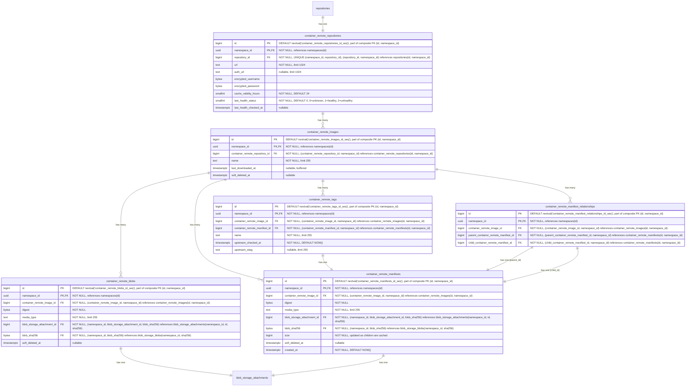

- **container_remote_repositories**: 外部のコンテナレジストリを表します。URL、オプションの認証 URL（`auth_url`）、認証情報、キャッシュ TTL（`cache_validity_hours`）を含みます。ヘルスチェックのステータスは監視のために追跡されます。`repository_id` を介して親の `repositories` テーブルを参照します。リモートリポジトリはスタンドアロンであるため、同じリモートを使用する 2 つの仮想リポジトリは 1 つのキャッシュを共有します。`HASH(namespace_id)` で 64 パーティションにパーティショニングされます。
- **container_remote_images**: リモートリポジトリ内のキャッシュされたコンテナイメージです。`container_images` を反映します。`last_downloaded_at` はキャッシュされたイメージが最後にプルされた時刻を記録し、ホット行の競合を避けるためにバッファ書き込み/非同期書き込み（`repositories.downloads_count` と同じパターン）を介して維持されます。`keep_last_downloaded_at` ライフサイクルルールとキャッシュ保持の評価に使用されます（[ADR-010](010_data_retention.md)）。`HASH(namespace_id)` で 64 パーティションにパーティショニングされます。
- **container_remote_blobs**: キャッシュされたレイヤーまたは設定 blob です。`HASH(namespace_id)` で 64 パーティションにパーティショニングされます。
- **container_remote_manifests**: キャッシュされたイメージマニフェストです。`size` カラムは、このキャッシュが把握しているサブツリーのバイトフットプリントを保持します。すなわち、キャッシュ時のマニフェスト自体のペイロードに加えて、子が到着するにつれて各子の `size` が加わります。イメージマニフェストの場合、値はキャッシュ時に完全です。マニフェストリストと OCI インデックスの場合、子がフェッチされるにつれて段階的にツリー全体のフットプリントに収束し、一部の子が一度もプルされなければ部分的なままになることもあります。この段階的なセマンティクスは遅延リモートキャッシングを反映しています。`size` を完全に保つためだけに積極的に子をフェッチすると、遅延設計が損なわれます。`created_at` はマニフェストが最初にキャッシュされた時刻を記録し、ホスト型の同等のもの（[`container_manifests`](#container-repositories)）と同じ公開履歴・時間範囲出所スキャンを支えます。`HASH(namespace_id)` で 64 パーティションにパーティショニングされます。
- **container_remote_manifest_relationships**: キャッシュされたマルチアーキテクチャのマニフェストリスト関係です。ホスト型の同等のものと同じ構造です。`HASH(namespace_id)` で 64 パーティションにパーティショニングされます。
- **container_remote_tags**: キャッシュされたタグからマニフェストへのマッピングです。タグは可変なポインターであり、キャッシュ再検証時にタグが新しいマニフェストに再ポイントされることがあります。`upstream_checked_at` はタグが上流レジストリに対して最後に検証された時刻を記録し、`cache_validity_hours` と比較して再検証が必要かどうかを判断します。`upstream_etag` は上流が返した ETag を保存し、タグがまだ同じマニフェストを指している場合に完全なマニフェスト解決を回避するための条件付きリクエスト（`If-None-Match`）を可能にします。マニフェストと blob は暗号学的ハッシュによってコンテンツアドレス指定されるため、鮮度の追跡は不要です。保存されたバイトがダイジェストと一致すれば、コンテンツが正しいことが保証されます。`HASH(namespace_id)` で 64 パーティションにパーティショニングされます。
- **blob_storage_attachments**: 詳細は [blob ストレージ](#blob-storage) セクションを参照してください。

#### インデックス {#container-remote-repositories-indexes}

- **`container_remote_repositories`**: `(namespace_id, repository_id)` に対するユニークインデックス — 親参照によってリモートリポジトリを検索します。
- **`container_remote_images`**: `(namespace_id, container_remote_repository_id, name) WHERE soft_deleted_at IS NULL` に対するユニークインデックス — 名前によってキャッシュされたイメージを検索します。部分条件により、ソフト削除後に同じ名前のイメージを再作成できます。
- **`container_remote_blobs`**: `(namespace_id, container_remote_image_id, digest) WHERE soft_deleted_at IS NULL` に対するユニークインデックス — イメージ内でダイジェストによってキャッシュされた blob を検索します。部分条件により、ソフト削除後に同じダイジェストを再キャッシュできます。`(namespace_id, blob_storage_attachment_id)` に対するインデックス — ストレージアタッチメントによって blob を検索します。`(namespace_id, blob_sha256)` に対するインデックス — 保存された blob の sha256 から、それを参照するすべてのキャッシュされた blob への逆引きで、ホスト型の [`container_blobs`](#container-repositories) インデックスを反映し、チェックサム検索と脆弱性影響がキャッシュ側の参照もカバーするようにします。
- **`container_remote_manifests`**: `(namespace_id, container_remote_image_id, digest) WHERE soft_deleted_at IS NULL` に対するユニークインデックス — イメージ内でダイジェストによってキャッシュされたマニフェストを検索します。部分条件により、ソフト削除後に同じダイジェストを再キャッシュできます。`(namespace_id, blob_storage_attachment_id)` に対するインデックス — ストレージアタッチメントによってマニフェストを検索します。`(namespace_id, blob_sha256)` に対するインデックス — マニフェストペイロードの保存された blob の sha256 から、それを参照するすべてのキャッシュされたマニフェストへの逆引きで、ホスト型の [`container_manifests`](#container-repositories) インデックスを反映します。`(namespace_id, soft_deleted_at DESC) WHERE soft_deleted_at IS NOT NULL` に対するインデックス — ソフト削除されたキャッシュ済みマニフェストを削除時刻順に一覧し、キャッシュされたコンテナイメージのアーティファクト粒度のゴミ箱一覧クエリを支えます。`(namespace_id, created_at DESC)` に対するインデックス — ネームスペース全体の時系列スキャンで、ホスト型の [`container_manifests`](#container-repositories) インデックスを反映し、キャッシュ側の公開履歴と出所をカバーします。ホスト型のインデックスと同じ監査証跡の理由から無条件（`soft_deleted_at` 述語なし）です。
- **`container_remote_manifest_relationships`**: `(namespace_id, parent_container_remote_manifest_id, child_container_remote_manifest_id)` に対するユニークインデックス — 親子関係の重複を防ぎます。`(namespace_id, child_container_remote_manifest_id)` に対するインデックス — 特定の子マニフェストのすべての親を見つけます。`(namespace_id, container_remote_image_id)` に対するインデックス — 特定のイメージのすべてのマニフェスト関係を見つけます。
- **`container_remote_tags`**: `(namespace_id, container_remote_image_id, name)` に対するユニークインデックス — イメージ内で名前によってタグを検索します。`(namespace_id, container_remote_manifest_id)` に対するインデックス — 特定のマニフェストを指すすべてのタグを見つけます。

#### クエリ例 {#container-remote-repositories-query-examples}

- リモートリポジトリを作成する

  ```sql
  -- Resolve the default repository collection for the namespace
  SELECT id FROM repository_collections WHERE namespace_id = '018f4d6f-0e10-7e3a-9bfd-23a4c5d6e7f8' AND is_default = true;
  -- Create the parent repository
  INSERT INTO repositories (namespace_id, name, format, kind, visibility)
  VALUES ('018f4d6f-0e10-7e3a-9bfd-23a4c5d6e7f8', 'docker-hub', 0, 2, 1)
  RETURNING id;
  -- Link the repository to the repository collection
  INSERT INTO repository_collection_repositories (namespace_id, repository_collection_id, repository_id)
  VALUES ('018f4d6f-0e10-7e3a-9bfd-23a4c5d6e7f8', <repository_collection_id>, <returned_id>);
  -- Then create the format-specific record
  INSERT INTO container_remote_repositories (namespace_id, repository_id, url, encrypted_username, encrypted_password)
  VALUES ('018f4d6f-0e10-7e3a-9bfd-23a4c5d6e7f8', <returned_id>, 'https://registry.hub.docker.com', $1, $2);
  ```

- キャッシュされたマニフェストが新鮮かどうかを確認する

  ```sql
  SELECT crm.digest
  FROM container_remote_manifests crm
  JOIN container_remote_tags crt
    ON crt.container_remote_manifest_id = crm.id AND crt.namespace_id = crm.namespace_id
  JOIN container_remote_images cri
    ON crt.container_remote_image_id = cri.id AND crt.namespace_id = cri.namespace_id
  WHERE cri.namespace_id = '018f4d6f-0e10-7e3a-9bfd-23a4c5d6e7f8'
    AND cri.container_remote_repository_id = 789
    AND cri.name = 'library/nginx'
    AND crt.name = 'latest'
    AND cri.soft_deleted_at IS NULL AND crm.soft_deleted_at IS NULL;
  ```

- ダイジェストでキャッシュされた blob をプルする（blob ストレージへの読み取りパスのショートカット）

  ```sql
  SELECT bsb.object_storage_key, bsb.size
  FROM container_remote_blobs crb
  JOIN blob_storage_blobs bsb
    ON bsb.namespace_id = crb.namespace_id AND bsb.sha256 = crb.blob_sha256
  WHERE crb.namespace_id = '018f4d6f-0e10-7e3a-9bfd-23a4c5d6e7f8'
    AND crb.container_remote_image_id = 456
    AND crb.digest = 'sha256:abcd1234...'::bytea
    AND crb.soft_deleted_at IS NULL;
  ```

### 仮想コンテナリポジトリ {#virtual-container-repositories}

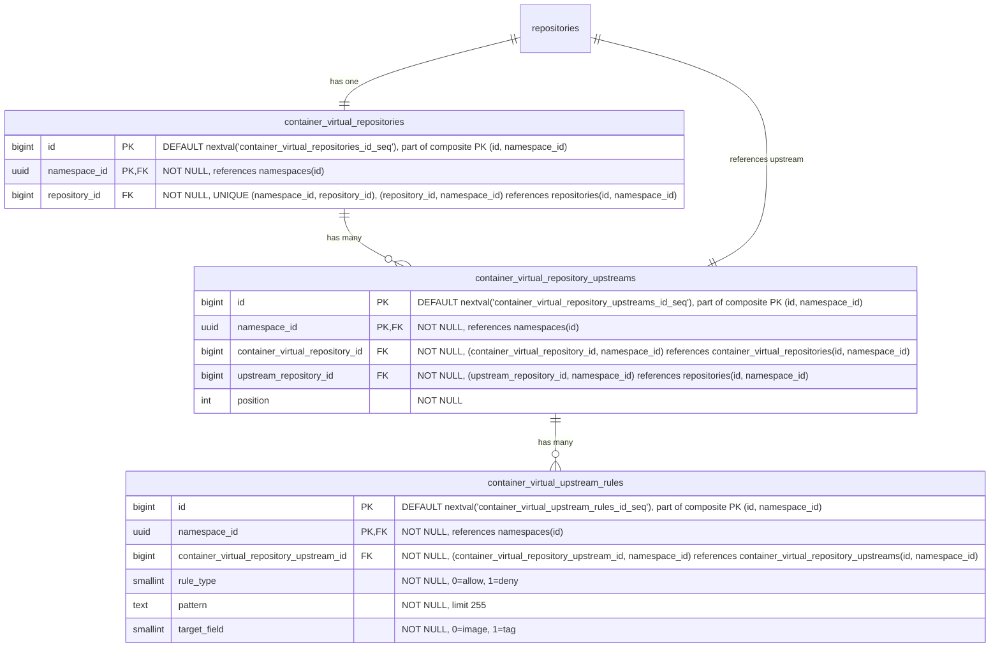

- **container_virtual_repositories**: コンテナイメージの仮想リポジトリです。名前、可視性、クロスフォーマットクエリのために `repository_id` を介して親の `repositories` テーブルを参照します。`HASH(namespace_id)` で 64 パーティションにパーティショニングされます。
- **container_virtual_repository_upstreams**: 仮想リポジトリとその上流を結合するテーブルです。各仮想リポジトリは上流の順序付きリストを持ちます。各エントリは `upstream_repository_id` を介して上流リポジトリを参照し、これは `repositories(namespace_id, id)` を指します。複合外部キー `(namespace_id, upstream_repository_id)` は、上流が同じネームスペース内にあることを強制します。これはレジストリがネームスペースにスコープされること（[ADR-001](001_organizations_as_anchor_point.md)）と一貫しています。`HASH(namespace_id)` で 64 パーティションにパーティショニングされます。
- **container_virtual_upstream_rules**: 上流の許可/拒否フィルタールールを定義します。各ルールは、この上流を通じて解決する際にどのアーティファクトが含まれるか除外されるかを制御するために、ワイルドカードパターンと対象フィールドを指定します。パターンは MVP ではワイルドカードのみです。正規表現のサポートは顧客のフィードバックがそれを正当化するまで延期されます（[ディスカッション](https://gitlab.com/gitlab-org/gitlab/-/work_items/597754#note_3291871207)）。ルールは（リモートリポジトリごとではなく）上流参照ごとのままで、包含/除外パターンが仮想-上流の関連付けごとに設定される JFrog モデルと一致します。`HASH(namespace_id)` で 64 パーティションにパーティショニングされます。

#### インデックス {#virtual-container-repositories-indexes}

- **`container_virtual_repositories`**: `(namespace_id, repository_id)` に対するユニークインデックス — 親参照によって仮想リポジトリを検索します。
- **`container_virtual_repository_upstreams`**: `(namespace_id, container_virtual_repository_id, position) DEFERRABLE INITIALLY DEFERRED` に対するユニークインデックス — 仮想リポジトリの順序付き上流を取得します。トランザクション内での並べ替えを可能にするために遅延可能（deferrable）です。`(namespace_id, container_virtual_repository_id, upstream_repository_id)` に対するユニークインデックス — 同じ上流が仮想リポジトリに二度追加されるのを防ぎます。
- **`container_virtual_upstream_rules`**: `(namespace_id, container_virtual_repository_upstream_id)` に対するインデックス — 特定の上流のすべてのルールを取得します。

#### クエリ例 {#virtual-container-repositories-query-examples}

- 仮想リポジトリを作成する

  ```sql
  -- First create the parent repository
  INSERT INTO repositories (namespace_id, name, format, kind, visibility)
  VALUES ('018f4d6f-0e10-7e3a-9bfd-23a4c5d6e7f8', 'my-virtual-repo', 0, 1, 1)
  RETURNING id;
  -- Link the repository to a repository collection
  INSERT INTO repository_collection_repositories (namespace_id, repository_collection_id, repository_id)
  VALUES ('018f4d6f-0e10-7e3a-9bfd-23a4c5d6e7f8', 456, <returned_id>);
  -- Then create the format-specific record
  INSERT INTO container_virtual_repositories (namespace_id, repository_id)
  VALUES ('018f4d6f-0e10-7e3a-9bfd-23a4c5d6e7f8', <returned_id>);
  ```

- 仮想リポジトリを上流に関連付ける

  ```sql
  INSERT INTO container_virtual_repository_upstreams (namespace_id, container_virtual_repository_id, upstream_repository_id, position)
  VALUES ('018f4d6f-0e10-7e3a-9bfd-23a4c5d6e7f8', 123, 789, 1);
  ```

### Maven リポジトリ {#maven-repositories}

Maven パッケージは、ファイルの集合（`.jar`、`.pom`、`maven-metadata.xml`）を表します。したがって、単一の Maven パッケージのダウンロードは 4 〜 15 個の API リクエストを表すことがあります。

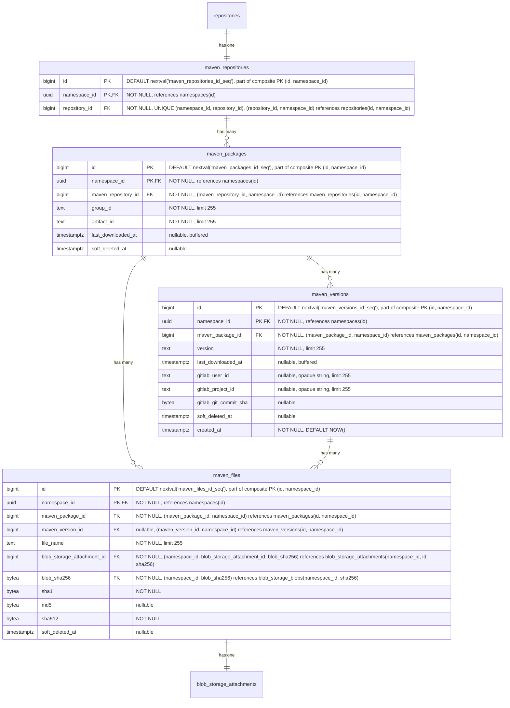

- **maven_repositories**: 複数のパッケージのコンテナです。各リポジトリはグループ ID とアーティファクト ID で識別される複数のパッケージをホストできます。名前、可視性、クロスフォーマットクエリのために `repository_id` を介して親の `repositories` テーブルを参照します。`HASH(namespace_id)` で 64 パーティションにパーティショニングされます。
- **maven_packages**: [そのグループ ID とアーティファクト ID](https://maven.apache.org/pom.html#Maven_Coordinates) で識別される Maven パッケージ（例: `com.example:myapp`）を表します。`last_downloaded_at` はパッケージのいずれかのファイルが最後にダウンロードされた時刻を記録し、[バッファ書き込み/非同期書き込み](#buffered-and-asynchronous-writes) を介して維持されます。`NULL` はパッケージが一度もダウンロードされていないことを意味し、`keep_last_downloaded_at` ライフサイクルルールの評価では可能な限り最も古いダウンロード時刻として扱われます（すなわち、ダウンロードベースの保持の下で削除の対象となります）。`keep_last_downloaded_at` ライフサイクルルールによって、ダウンロードベースの保持を評価するために使用されます（[ADR-010](010_data_retention.md)）。`HASH(namespace_id)` で 64 パーティションにパーティショニングされます。
- **maven_versions**: Maven パッケージの個々の [バージョン](https://maven.apache.org/pom.html#Maven_Coordinates)（例: `1.0.0`、`2.1.3-SNAPSHOT`）を保存します。`last_downloaded_at` はバージョンのいずれかのファイルが最後にダウンロードされた時刻を記録し、[バッファ書き込み/非同期書き込み](#buffered-and-asynchronous-writes) を介して維持されます。`keep_last_downloaded_at` ライフサイクルルールによって使用されます。`gitlab_user_id`、`gitlab_project_id`、`gitlab_git_commit_sha` は、どの GitLab ユーザーがこのバージョンを公開したか、および公開の背後にある CI コンテキスト（プロジェクト、コミット）を記録し、[`container_manifests`](#container-repositories) の同等のカラムと同じ形状・根拠によります。`created_at` はバージョンが最初に公開された時刻を記録し、[`container_manifests`](#container-repositories) と同じ公開履歴・時間範囲出所スキャンを支えます。`HASH(namespace_id)` で 64 パーティションにパーティショニングされます。
- **maven_files**: Maven パッケージに関連付けられた個々のファイルを表します。ファイルは、`maven_version_id` が設定されたバージョン固有のもの（JAR、POM、ソース、Javadoc、チェックサム）か、`maven_version_id` が NULL のパッケージレベルのもの（`maven-metadata.xml` とそのチェックサムなど）のいずれかです。`maven_package_id` は常に設定されており、パッケージからそのすべてのファイルへの直接のパスを提供します。また、レジストリがパフォーマンスのボトルネックを改善するために使用する補助ファイルである場合もあります。`sha1` と `md5` カラムは、整合性検証のために [Maven プロトコルが要求するチェックサム](https://maven.apache.org/resolver/about-checksums.html) を保存します。Maven クライアントは、すべてのアーティファクトとともに `.sha1` と `.md5` のサイドカーファイルを期待します。これらのカラムは `blob_storage_blobs` ではなく `maven_files` にあります。なぜなら、これらは Maven プロトコルの関心事であり、普遍的な blob プロパティではないためです。他のフォーマット（OCI コンテナ）は SHA256 のみを使用します。これらをここに置くことで、`blob_storage_blobs` をフォーマット固有のカラムやインデックスを持たないフォーマット非依存のテーブルとして保ちます。`sha1` は Maven プロトコルがそれを要求するため `NOT NULL` です。`md5` は Maven 3.9+ が [MD5 チェックサムを非推奨にした](https://maven.apache.org/resolver/about-checksums.html) ため nullable です。`sha512` は `NOT NULL` です。なぜなら、Maven プロトコルはレジストリが提供できなければならない `.sha512` サイドカーを公開しており、その値はバイトが永続化される前にハンドラーを通過する際のアップロード中に常に計算可能だからです。`HASH(namespace_id)` で 64 パーティションにパーティショニングされます。
- **blob_storage_attachments**: 詳細は [blob ストレージ](#blob-storage) セクションを参照してください。

私たちは、パッケージ名（この場合はグループ ID とアーティファクト ID）とバージョンを同じテーブルに保存していません。その理由は、UI がこのデータにパッケージ名でアクセスするためです。パッケージ名がフォルダであり、それを開くと各バージョンに 1 つずつサブフォルダがあるツリー状の UI を想像してください。この最初のリクエストはフォルダ、すなわちパッケージ名を一覧する必要があります。フォルダを開くと、すべてのサブフォルダ、すなわちパッケージバージョンを一覧するリクエストがトリガーされます。したがって、このアクセスパターンを容易にするために、2 つの専用テーブル（`maven_packages` と `maven_versions`）を持っています。

#### インデックス {#maven-repositories-indexes}

- **`maven_repositories`**: `(namespace_id, repository_id)` に対するユニークインデックス — 親リポジトリ参照によって Maven リポジトリを検索します。
- **`maven_packages`**: `(namespace_id, maven_repository_id, group_id, artifact_id) WHERE soft_deleted_at IS NULL` に対するユニークインデックス — リポジトリ内で Maven 座標によってパッケージを検索します。部分条件により、ソフト削除後に同じ座標のパッケージを再作成できます。`(namespace_id, maven_repository_id, last_downloaded_at NULLS FIRST) WHERE soft_deleted_at IS NULL` に対するインデックス — `keep_last_downloaded_at` ライフサイクルルールの評価をサポートします。リポジトリ内のすべてのパッケージをスキャンして行ごとにフィルターするのではなく、境界のある範囲スキャンによって期限切れになったパッケージのみを返します。`NULLS FIRST` は、一度もダウンロードされていないパッケージを最も古い行とグループ化し、両方が同じ範囲スキャンで返されるようにします。
- **`maven_versions`**: `(namespace_id, maven_package_id, version) WHERE soft_deleted_at IS NULL` に対するユニークインデックス — パッケージ内で特定のバージョンを検索します。部分条件により、ソフト削除後に同じ識別子のバージョンを再作成できます。`(namespace_id, maven_package_id, last_downloaded_at NULLS FIRST) WHERE soft_deleted_at IS NULL` に対するインデックス — `maven_packages` と同じ範囲スキャン戦略を用いて、パッケージのバージョンにスコープした `keep_last_downloaded_at` ライフサイクルルールの評価をサポートします。`(namespace_id, soft_deleted_at DESC) WHERE soft_deleted_at IS NOT NULL` に対するインデックス — ソフト削除されたバージョンを削除時刻順に一覧し、Maven アーティファクトのアーティファクト粒度のゴミ箱一覧クエリを支えます。`(namespace_id, created_at DESC)` に対するインデックス — ネームスペース全体の時系列スキャンで、公開履歴のページネーションと時間範囲のアーティファクト出所クエリを支えます。ソフト削除された公開イベントも監査証跡に表示されるよう無条件です。
- **`maven_files`**: `(namespace_id, maven_version_id, file_name) WHERE soft_deleted_at IS NULL AND maven_version_id IS NOT NULL` に対するユニークインデックス — バージョン固有のファイル名はバージョン内で一意でなければなりません。部分条件はソフト削除された行とパッケージレベルのファイルを除外します。`(namespace_id, maven_package_id, file_name) WHERE soft_deleted_at IS NULL AND maven_version_id IS NULL` に対するユニークインデックス — パッケージレベルのファイル名（`maven-metadata.xml` など）はパッケージ内で一意でなければなりません。`(namespace_id, blob_storage_attachment_id)` に対するインデックス — ストレージアタッチメントによってファイルを検索します。`(namespace_id, blob_sha256)` に対するインデックス — 保存された blob の sha256 から、それを参照するすべての Maven ファイルへの逆引きで、クロスフォーマットのチェックサム検索を支えます。既存の親をキーとするインデックスはバージョンまたはパッケージをキーとするため、ダイジェストをキーとするスキャンを直接満たすことはできません。

#### クエリ例 {#maven-repositories-query-examples}

- 特定のリポジトリ ID とパッケージ名のパッケージバージョンを取得する。

  ```sql
  SELECT mv.*
  FROM maven_versions mv
  JOIN maven_packages mp
    ON mv.maven_package_id = mp.id AND mv.namespace_id = mp.namespace_id
  WHERE mp.namespace_id = '018f4d6f-0e10-7e3a-9bfd-23a4c5d6e7f8' AND mp.maven_repository_id = 123 AND mp.group_id = 'com.example' AND mp.artifact_id = 'myapp'
    AND mv.version = '1.0.0'
    AND mp.soft_deleted_at IS NULL AND mv.soft_deleted_at IS NULL;
  ```

- バージョン ID とファイル名でファイルを取得する。

  ```sql
  SELECT mf.*
  FROM maven_files mf
  WHERE mf.namespace_id = '018f4d6f-0e10-7e3a-9bfd-23a4c5d6e7f8' AND mf.maven_version_id = 456 AND mf.file_name = 'myapp-1.0.0.jar'
    AND mf.soft_deleted_at IS NULL;
  ```

- 特定のパッケージのパッケージレベルのファイル（例: `maven-metadata.xml`）を取得する。

  ```sql
  SELECT mf.*
  FROM maven_files mf
  WHERE mf.namespace_id = '018f4d6f-0e10-7e3a-9bfd-23a4c5d6e7f8' AND mf.maven_package_id = 123 AND mf.maven_version_id IS NULL
    AND mf.soft_deleted_at IS NULL;
  ```

- ゴミ箱一覧: ネームスペース内のすべてのソフト削除された Maven バージョンを、最近削除された順に一覧する（`(namespace_id, soft_deleted_at DESC) WHERE soft_deleted_at IS NOT NULL` の部分インデックスを使用）。コンプライアンスのユースケースはネームスペース全体（「今ゴミ箱に何があるか?」）です。親にスコープしたビュー（「このパッケージのゴミ箱に入ったバージョン」）には、別個の `(namespace_id, maven_package_id, soft_deleted_at DESC) WHERE soft_deleted_at IS NOT NULL` インデックスが有益で、その UI が構築される場合には後から追加できます。同じパターンは [`npm_versions`](#npm-repositories)、[`container_manifests`](#container-repositories)、およびそれらのリモート版に適用されます。

  ```sql
  SELECT mv.id, mv.maven_package_id, mv.version, mv.soft_deleted_at
  FROM maven_versions mv
  WHERE mv.namespace_id = '018f4d6f-0e10-7e3a-9bfd-23a4c5d6e7f8' AND mv.soft_deleted_at IS NOT NULL
  ORDER BY mv.soft_deleted_at DESC
  LIMIT 50;
  ```

### Maven リモートリポジトリ {#maven-remote-repositories}

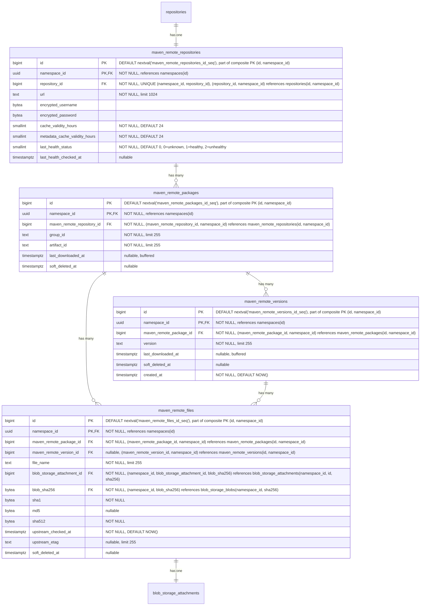

- **maven_remote_repositories**: 外部の Maven リポジトリを表します。URL、認証情報、アーティファクトのキャッシュ TTL（`cache_validity_hours`）、および `maven-metadata.xml` などのメタデータレスポンス用の別個の TTL（`metadata_cache_validity_hours`）を含みます。ヘルスチェックのステータスは監視のために追跡されます。`repository_id` を介して親の `repositories` テーブルを参照します。`HASH(namespace_id)` で 64 パーティションにパーティショニングされます。
- **maven_remote_packages**: グループ ID とアーティファクト ID で識別される、キャッシュされた Maven パッケージです。`maven_packages` を反映します。`last_downloaded_at` はパッケージのいずれかのキャッシュされたファイルが最後にダウンロードされた時刻を記録し、ホット行の競合を避けるためにバッファ書き込み/非同期書き込みを介して維持されます。`keep_last_downloaded_at` ライフサイクルルールとキャッシュ保持の評価に使用されます。`HASH(namespace_id)` で 64 パーティションにパーティショニングされます。
- **maven_remote_versions**: Maven パッケージのキャッシュされたバージョンです。`maven_versions` を反映します。`last_downloaded_at` はバージョンのいずれかのキャッシュされたファイルが最後にダウンロードされた時刻を記録し、ホット行の競合を避けるためにバッファ書き込み/非同期書き込みを介して維持されます。`keep_last_downloaded_at` ライフサイクルルールとキャッシュ保持の評価に使用されます。`created_at` はバージョンが最初にキャッシュされた時刻を記録し、[`maven_versions`](#maven-repositories) を反映してキャッシュ側の公開履歴と出所スキャンを支えます。`HASH(namespace_id)` で 64 パーティションにパーティショニングされます。
- **maven_remote_files**: キャッシュされたファイル（JAR、POM、チェックサム、`maven-metadata.xml`）です。nullable な `maven_remote_version_id` は、ホスト型と同じパターン（バージョン固有のファイル対 `maven-metadata.xml` のようなパッケージレベルのファイル）を保ちます。`sha1` と `md5` は、コンテンツがホストされているかキャッシュされているかに関係なく Maven プロトコルがこれらのチェックサムの提供を要求するため保持されます。`sha512` は、ホスト型の `maven_files` のカラム形状を反映するために整合性の観点から追加され、Maven Virtual 仕様（S14）が単一のクエリパスでどちらのバックエンドからも `.sha512` サイドカーを提供できるようにします。値はプロキシ書き込みステップ中に他のチェックサムとともにキャッシュされたバイトから計算されるため、初日から `NOT NULL` を達成できます。`upstream_checked_at` はファイルが上流リポジトリに対して最後に検証された時刻を記録し、アーティファクトファイルについては `cache_validity_hours`、メタデータファイル（例: `maven-metadata.xml`）については `metadata_cache_validity_hours` と比較して再検証が必要かどうかを判断します。`upstream_etag` は上流が返した ETag を保存し、変更されていないファイルの再ダウンロードを回避するための条件付きリクエスト（`If-None-Match`）を可能にします。`HASH(namespace_id)` で 64 パーティションにパーティショニングされます。
- **blob_storage_attachments**: 詳細は [blob ストレージ](#blob-storage) セクションを参照してください。

#### インデックス {#maven-remote-repositories-indexes}

- **`maven_remote_repositories`**: `(namespace_id, repository_id)` に対するユニークインデックス — 親参照によってリモートリポジトリを検索します。
- **`maven_remote_packages`**: `(namespace_id, maven_remote_repository_id, group_id, artifact_id) WHERE soft_deleted_at IS NULL` に対するユニークインデックス — Maven 座標によってキャッシュされたパッケージを検索します。部分条件により、ソフト削除後に同じ座標のパッケージを再作成できます。
- **`maven_remote_versions`**: `(namespace_id, maven_remote_package_id, version) WHERE soft_deleted_at IS NULL` に対するユニークインデックス — パッケージ内でキャッシュされたバージョンを検索します。部分条件により、ソフト削除後に同じ識別子のバージョンを再作成できます。`(namespace_id, soft_deleted_at DESC) WHERE soft_deleted_at IS NOT NULL` に対するインデックス — ソフト削除されたキャッシュ済みバージョンを削除時刻順に一覧し、キャッシュされた Maven アーティファクトのアーティファクト粒度のゴミ箱一覧クエリを支えます。`(namespace_id, created_at DESC)` に対するインデックス — ネームスペース全体の時系列スキャンで、ホスト型の [`maven_versions`](#maven-repositories) インデックスを反映し、キャッシュ側の公開履歴と出所をカバーします。ホスト型のインデックスと同じ監査証跡の理由から無条件（`soft_deleted_at` 述語なし）です。
- **`maven_remote_files`**: `(namespace_id, maven_remote_version_id, file_name) WHERE soft_deleted_at IS NULL AND maven_remote_version_id IS NOT NULL` に対するユニークインデックス — バージョン固有のファイル名はバージョン内で一意でなければなりません。`(namespace_id, maven_remote_package_id, file_name) WHERE soft_deleted_at IS NULL AND maven_remote_version_id IS NULL` に対するユニークインデックス — パッケージレベルのファイル名はパッケージ内で一意でなければなりません。`(namespace_id, blob_storage_attachment_id)` に対するインデックス — ストレージアタッチメントによってファイルを検索します。`(namespace_id, blob_sha256)` に対するインデックス — 保存された blob の sha256 から、それを参照するすべてのキャッシュされた Maven ファイルへの逆引きで、ホスト型の [`maven_files`](#maven-repositories) インデックスを反映し、チェックサム検索がキャッシュ側の参照もカバーするようにします。

#### クエリ例 {#maven-remote-repositories-query-examples}

- リモートリポジトリを作成する

  ```sql
  -- First create the parent repository
  INSERT INTO repositories (namespace_id, name, format, kind, visibility)
  VALUES ('018f4d6f-0e10-7e3a-9bfd-23a4c5d6e7f8', 'central', 1, 2, 0)
  RETURNING id;
  -- Link the repository to a repository collection
  INSERT INTO repository_collection_repositories (namespace_id, repository_collection_id, repository_id)
  VALUES ('018f4d6f-0e10-7e3a-9bfd-23a4c5d6e7f8', 456, <returned_id>);
  -- Then create the format-specific record
  INSERT INTO maven_remote_repositories (namespace_id, repository_id, url, encrypted_username, encrypted_password)
  VALUES ('018f4d6f-0e10-7e3a-9bfd-23a4c5d6e7f8', <returned_id>, 'https://repo.maven.apache.org/maven2', $1, $2);
  ```

- 座標でキャッシュされた Maven ファイルを検索する

  ```sql
  SELECT mrf.*, bsb.object_storage_key
  FROM maven_remote_files mrf
  JOIN maven_remote_versions mrv
    ON mrf.maven_remote_version_id = mrv.id AND mrf.namespace_id = mrv.namespace_id
  JOIN maven_remote_packages mrp
    ON mrv.maven_remote_package_id = mrp.id AND mrv.namespace_id = mrp.namespace_id
  JOIN blob_storage_blobs bsb
    ON bsb.namespace_id = mrf.namespace_id AND bsb.sha256 = mrf.blob_sha256
  WHERE mrp.namespace_id = '018f4d6f-0e10-7e3a-9bfd-23a4c5d6e7f8'
    AND mrp.maven_remote_repository_id = 789
    AND mrp.group_id = 'com.example'
    AND mrp.artifact_id = 'myapp'
    AND mrv.version = '1.0.0'
    AND mrf.file_name = 'myapp-1.0.0.jar'
    AND mrp.soft_deleted_at IS NULL AND mrv.soft_deleted_at IS NULL AND mrf.soft_deleted_at IS NULL;
  ```

- パッケージのキャッシュされた `maven-metadata.xml` を検索する

  ```sql
  SELECT mrf.*
  FROM maven_remote_files mrf
  JOIN maven_remote_packages mrp
    ON mrf.maven_remote_package_id = mrp.id AND mrf.namespace_id = mrp.namespace_id
  WHERE mrp.namespace_id = '018f4d6f-0e10-7e3a-9bfd-23a4c5d6e7f8'
    AND mrp.maven_remote_repository_id = 789
    AND mrp.group_id = 'com.example'
    AND mrp.artifact_id = 'myapp'
    AND mrf.maven_remote_version_id IS NULL
    AND mrf.file_name = 'maven-metadata.xml'
    AND mrp.soft_deleted_at IS NULL AND mrf.soft_deleted_at IS NULL;
  ```

### Maven 仮想リポジトリ {#maven-virtual-repositories}

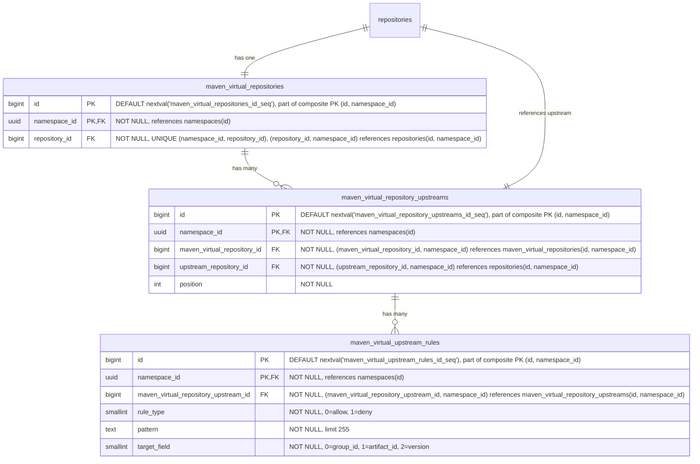

- **maven_virtual_repositories**: Maven パッケージの仮想リポジトリです。名前、可視性、クロスフォーマットクエリのために `repository_id` を介して親の `repositories` テーブルを参照します。`HASH(namespace_id)` で 64 パーティションにパーティショニングされます。
- **maven_virtual_repository_upstreams**: 仮想リポジトリとその上流を結合するテーブルです。各仮想リポジトリは上流の順序付きリストを持ちます。各エントリは `upstream_repository_id` を介して上流リポジトリを参照し、これは `repositories(namespace_id, id)` を指します。複合外部キー `(namespace_id, upstream_repository_id)` は、上流が同じネームスペース内にあることを強制します。これはレジストリがネームスペースにスコープされること（[ADR-001](001_organizations_as_anchor_point.md)）と一貫しています。`HASH(namespace_id)` で 64 パーティションにパーティショニングされます。
- **maven_virtual_upstream_rules**: 上流の許可/拒否フィルタールールを定義します。各ルールは、この上流を通じて解決する際にどのアーティファクトが含まれるか除外されるかを制御するために、ワイルドカードパターンと対象フィールドを指定します。パターンは MVP ではワイルドカードのみです。正規表現のサポートは顧客のフィードバックがそれを正当化するまで延期されます（[ディスカッション](https://gitlab.com/gitlab-org/gitlab/-/work_items/597754#note_3291871207)）。`HASH(namespace_id)` で 64 パーティションにパーティショニングされます。

#### インデックス {#maven-virtual-repositories-indexes}

- **`maven_virtual_repositories`**: `(namespace_id, repository_id)` に対するユニークインデックス — 親参照によって仮想リポジトリを検索します。
- **`maven_virtual_repository_upstreams`**: `(namespace_id, maven_virtual_repository_id, position) DEFERRABLE INITIALLY DEFERRED` に対するユニークインデックス — 仮想リポジトリの順序付き上流を取得します。トランザクション内での並べ替えを可能にするために遅延可能（deferrable）です。`(namespace_id, maven_virtual_repository_id, upstream_repository_id)` に対するユニークインデックス — 同じ上流が仮想リポジトリに二度追加されるのを防ぎます。
- **`maven_virtual_upstream_rules`**: `(namespace_id, maven_virtual_repository_upstream_id)` に対するインデックス — 特定の上流のすべてのルールを取得します。

#### クエリ例 {#maven-virtual-repositories-query-examples}

- 仮想リポジトリを作成する

  ```sql
  -- First create the parent repository
  INSERT INTO repositories (namespace_id, name, format, kind, visibility)
  VALUES ('018f4d6f-0e10-7e3a-9bfd-23a4c5d6e7f8', 'my-virtual-repo', 1, 1, 1)
  RETURNING id;
  -- Link the repository to a repository collection
  INSERT INTO repository_collection_repositories (namespace_id, repository_collection_id, repository_id)
  VALUES ('018f4d6f-0e10-7e3a-9bfd-23a4c5d6e7f8', 456, <returned_id>);
  -- Then create the format-specific record
  INSERT INTO maven_virtual_repositories (namespace_id, repository_id)
  VALUES ('018f4d6f-0e10-7e3a-9bfd-23a4c5d6e7f8', <returned_id>);
  ```

- 仮想リポジトリを上流に関連付ける

  ```sql
  INSERT INTO maven_virtual_repository_upstreams (namespace_id, maven_virtual_repository_id, upstream_repository_id, position)
  VALUES ('018f4d6f-0e10-7e3a-9bfd-23a4c5d6e7f8', 123, 789, 1);
  ```

### NPM リポジトリ {#npm-repositories}

Node パッケージは基本的に `.tar.gz` ファイルであり、各バージョンが単一のアーカイブです。ただし、Node クライアントはより豊富な機能セットを持ち、例えば私たちが扱う必要のあるディストリビューションタグの使用などがあります。

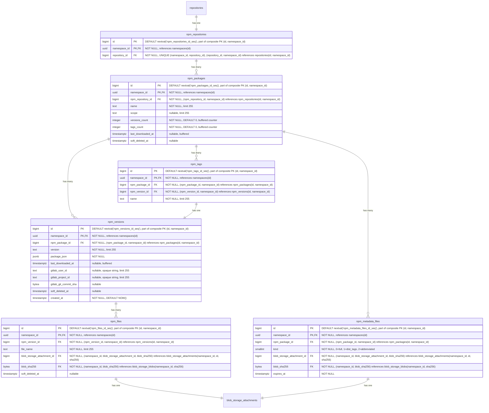

- **npm_repositories**: 複数のパッケージのコンテナです。各リポジトリはオプションのスコープを持つ複数のパッケージをホストできます。名前、可視性、クロスフォーマットクエリのために `repository_id` を介して親の `repositories` テーブルを参照します。`HASH(namespace_id)` で 64 パーティションにパーティショニングされます。
- **npm_packages**: npm パッケージを表します。`name` カラムはスコープを含む完全なパッケージ名（例: `@myorg/mypackage` または `lodash`）を保存します。`versions_count` はソフト削除されたものを含むパッケージの `npm_versions` 行をカウントし、ガベージコレクションが行をハード削除したときにのみデクリメントします。`tags_count` はその `npm_tags` 行をカウントします（`npm_tags` にはソフト削除カラムがないため、その問題は発生しません）。両方とも、[ADR-004](004_data_and_application_limits.md#entity-count-limits) のパッケージごとのエンティティ数制限（25,000 バージョン、1,000 タグ）を強制するバッファカウンターであり、[バッファ書き込み/非同期書き込み](#buffered-and-asynchronous-writes) を介して維持されます。ソフト削除されたバージョンを含めることは `namespace_statistics.deduplicated_size_bytes` の扱いを反映し、不正利用のベクトルを塞ぎます。すなわち、上限からソフト削除された行を除外できる顧客は、繰り返しソフト削除と再公開を行うことで 25,000 バージョンの制限を無期限に下回り続けることができてしまいますが、ソフト削除されたすべての行は依然としてストレージを占有し、復元可能なままです。両方の上限が 32 ビットの上限を十分に下回るため、`bigint` ではなく `integer` 型です。他の場所の上限のないカウンター（`downloads_count`、`size_bytes`）は無制限に増加するため `bigint` が必要です。`last_downloaded_at` はパッケージのいずれかのファイルが最後にダウンロードされた時刻を記録し、[バッファ書き込み/非同期書き込み](#buffered-and-asynchronous-writes) を介して維持されます。`keep_last_downloaded_at` ライフサイクルルールによって使用されます。`HASH(namespace_id)` で 64 パーティションにパーティショニングされます。
- **npm_versions**: 埋め込まれた package.json メタデータとともに、npm パッケージの個々のバージョンを保存します。`last_downloaded_at` はバージョンのいずれかのファイルが最後にダウンロードされた時刻を記録し、[バッファ書き込み/非同期書き込み](#buffered-and-asynchronous-writes) を介して維持されます。`keep_last_downloaded_at` ライフサイクルルールによって使用されます。`gitlab_user_id`、`gitlab_project_id`、`gitlab_git_commit_sha` は、どの GitLab ユーザーがこのバージョンを公開したか、および公開の背後にある CI コンテキスト（プロジェクト、コミット）を記録し、[`container_manifests`](#container-repositories) の同等のカラムと同じ形状・根拠によります。`created_at` はバージョンが最初に公開された時刻を記録し、[`container_manifests`](#container-repositories) と同じ公開履歴・時間範囲出所スキャンを支えます。`HASH(namespace_id)` で 64 パーティションにパーティショニングされます。
- **npm_tags**: 特定のパッケージバージョンを指す [NPM ディストリビューションタグ](https://docs.npmjs.com/cli/v11/commands/npm-dist-tag)（例: `latest`、`next`、`beta`）を提供します。`HASH(namespace_id)` で 64 パーティションにパーティショニングされます。
- **npm_files**: npm パッケージバージョンのファイルを表します。これらは主に tarball アーカイブです。また、レジストリがパフォーマンスのボトルネックを改善するために使用する補助ファイルである場合もあります。`HASH(namespace_id)` で 64 パーティションにパーティショニングされます。
- **npm_metadata_files**: npm パッケージの事前計算されたメタデータファイルを、`kind` ごとに 1 つずつ保存します。`kind` カラムはメタデータのバリアントを区別します。`full`（0）はすべてのバージョンを含む完全な packument を含み、`dist_tags`（1）はディストリビューションタグのマッピングのみを含み、`abbreviated`（2）はリクエストが `Accept: application/vnd.npm.install-v1+json` を持つときに提供されるインストール専用の射影です。適切なファイルは、クライアントのリクエストに基づいて npm メタデータエンドポイントで提供されます。メタデータがパッケージのすべてのバージョンにまたがるため、（`npm_versions` ではなく）`npm_packages` にリンクされます。メタデータファイルは、バージョンが公開または非公開にされた後に非同期で生成されます。`expires_at` カラムはキャッシュの鮮度を駆動します。ライター（公開、非推奨化、非公開化、dist-tag の変更）は、データ書き込みと同じトランザクション内で、影響を受けるパッケージのすべての行に `expires_at = NOW()` を設定することでキャッシュを強制的に期限切れにします。再構築ジョブは、新しく生成された blob で行をアップサートする際に `expires_at = NOW() + npm.packument_cache_ttl` を設定します。リーダーは `expires_at > NOW()` でフィルターし、ミス時にはインラインビルドパスにフォールスルーするため、期限切れの行がクライアントに提供されることはありません。このカラムはハード削除の期限ではなく、キャッシュの鮮度シグナルです。強制的な期限切れは blob とアタッチメントをそのまま残すため、それらに対してすでに解決中のレスポンスは、再構築ジョブがアタッチメントを入れ替えるまで正常に完了します。`HASH(namespace_id)` で 64 パーティションにパーティショニングされます。
- **blob_storage_attachments**: 詳細は [blob ストレージ](#blob-storage) セクションを参照してください。

[Maven](#maven-repositories) と同様に、パッケージ名とバージョンはまったく同じ理由で 2 つの異なるテーブルに保存されます。

#### インデックス {#npm-repositories-indexes}

- **`npm_repositories`**: `(namespace_id, repository_id)` に対するユニークインデックス — 親リポジトリ参照によって NPM リポジトリを検索します。
- **`npm_packages`**: `(namespace_id, npm_repository_id, name) WHERE soft_deleted_at IS NULL` に対するユニークインデックス — リポジトリ内で名前によってパッケージを検索します。部分条件により、ソフト削除後に同じ名前のパッケージを再作成できます。`(namespace_id, npm_repository_id, last_downloaded_at NULLS FIRST) WHERE soft_deleted_at IS NULL` に対するインデックス — `keep_last_downloaded_at` ライフサイクルルールの評価をサポートします。リポジトリ内のすべてのパッケージをスキャンして行ごとにフィルターするのではなく、境界のある範囲スキャンによって期限切れになったパッケージのみを返します。`NULLS FIRST` は、一度もダウンロードされていないパッケージを最も古い行とグループ化し、両方が同じ範囲スキャンで返されるようにします。
- **`npm_versions`**: `(namespace_id, npm_package_id, version) WHERE soft_deleted_at IS NULL` に対するユニークインデックス — パッケージ内で特定のバージョンを検索します。部分条件により、ソフト削除後に同じ識別子のバージョンを再作成できます。`(namespace_id, npm_package_id, last_downloaded_at NULLS FIRST) WHERE soft_deleted_at IS NULL` に対するインデックス — `npm_packages` と同じ範囲スキャン戦略を用いて、パッケージのバージョンにスコープした `keep_last_downloaded_at` ライフサイクルルールの評価をサポートします。`(namespace_id, soft_deleted_at DESC) WHERE soft_deleted_at IS NOT NULL` に対するインデックス — ソフト削除されたバージョンを削除時刻順に一覧し、npm アーティファクトのアーティファクト粒度のゴミ箱一覧クエリを支えます。`(namespace_id, created_at DESC)` に対するインデックス — ネームスペース全体の時系列スキャンで、公開履歴のページネーションと時間範囲のアーティファクト出所クエリを支えます。ソフト削除された公開イベントも監査証跡に表示されるよう無条件です。
- **`npm_tags`**: `(namespace_id, npm_package_id, name)` に対するユニークインデックス — パッケージ内で名前によってディストリビューションタグを検索します。`(namespace_id, npm_version_id)` に対するインデックス — 特定のバージョンを指すすべてのタグを見つけます。
- **`npm_files`**: `(namespace_id, npm_version_id, file_name) WHERE soft_deleted_at IS NULL` に対するユニークインデックス — ファイル名はバージョン内で一意でなければなりません。部分条件により、ソフト削除後に同じ名前のファイルを再作成できます。`(namespace_id, blob_storage_attachment_id)` に対するインデックス — ストレージアタッチメントによってファイルを検索します。`(namespace_id, blob_sha256)` に対するインデックス — 保存された blob の sha256 から、それを参照するすべての npm ファイルへの逆引きで、クロスフォーマットのチェックサム検索を支えます。既存のバージョンをキーとするインデックスは、ダイジェストをキーとするスキャンを直接満たすことはできません。
- **`npm_metadata_files`**: `(namespace_id, npm_package_id, kind)` に対するユニークインデックス — パッケージごと・kind ごとに 1 つのメタデータファイル。`(namespace_id, blob_storage_attachment_id)` に対するインデックス — ストレージアタッチメントによってメタデータファイルを検索します。`(namespace_id, blob_sha256)` に対するインデックス — 保存された blob の sha256 から、それを参照するすべてのメタデータファイルへの逆引きで、[`npm_files`](#npm-repositories) を反映し、単一の sha256 検索で tarball と packument スタイルのメタデータの両方をカバーします。

#### クエリ例 {#npm-repositories-query-examples}

- 特定のリポジトリ ID とパッケージ名のすべてのバージョンを取得する

  ```sql
  SELECT nv.*
  FROM npm_versions nv
  JOIN npm_packages np
    ON nv.npm_package_id = np.id AND nv.namespace_id = np.namespace_id
  WHERE np.namespace_id = '018f4d6f-0e10-7e3a-9bfd-23a4c5d6e7f8' AND np.npm_repository_id = 123 AND np.name = '@myorg/mypackage'
    AND np.soft_deleted_at IS NULL AND nv.soft_deleted_at IS NULL;
  ```

- 公開パスの制限事前チェックのためにパッケージごとのエンティティ数カウンターを読み取る（アドバイザリ。`npm_versions` と `npm_tags` の部分ユニークインデックスが、レースのない信頼できるガードです）。

  ```sql
  SELECT versions_count, tags_count
  FROM npm_packages
  WHERE namespace_id = '018f4d6f-0e10-7e3a-9bfd-23a4c5d6e7f8' AND id = 456 AND soft_deleted_at IS NULL;
  ```

- バージョン ID とファイル名でファイルを取得する

  ```sql
  SELECT nf.*
  FROM npm_files nf
  WHERE nf.namespace_id = '018f4d6f-0e10-7e3a-9bfd-23a4c5d6e7f8' AND nf.npm_version_id = 456 AND nf.file_name = 'mypackage-1.0.0.tgz'
    AND nf.soft_deleted_at IS NULL;
  ```

- パッケージの事前計算された完全メタデータファイルを取得する（npm メタデータエンドポイントで提供）

  ```sql
  SELECT bsb.object_storage_key, bsb.size
  FROM npm_metadata_files nmf
  JOIN blob_storage_blobs bsb ON bsb.namespace_id = nmf.namespace_id AND bsb.sha256 = nmf.blob_sha256
  WHERE nmf.namespace_id = '018f4d6f-0e10-7e3a-9bfd-23a4c5d6e7f8' AND nmf.npm_package_id = 456 AND nmf.kind = 0
    AND nmf.expires_at > NOW();
  ```

  読み取りは `expires_at > NOW()` でフィルターします。ミス（行がない、またはライターが
  強制的に期限切れにしたか TTL が経過したために `expires_at <= NOW()`）はインラインビルドパスに
  フォールスルーします。下記のキャッシュ再構築ジョブが新鮮な行を復元します。

- 書き込み時に packument キャッシュを強制的に期限切れにする

  公開、非推奨化、非公開化、dist-tag の変更は、データ書き込みと同じトランザクション内で、影響を受ける
  パッケージのすべての kind について `expires_at` を `NOW()` に切り替えることでキャッシュを無効化します。
  blob とアタッチメントはそのまま残されるため、すでに進行中のレスポンスは、再構築ジョブが
  アタッチメントを入れ替えるまで既存の blob に対して解決し続けます。

  ```sql
  UPDATE npm_metadata_files
  SET expires_at = NOW()
  WHERE namespace_id = '018f4d6f-0e10-7e3a-9bfd-23a4c5d6e7f8' AND npm_package_id = 456;
  ```

  初回公開の場合はまだ行が存在しないため、`UPDATE` は 0 行に影響します。再構築
  ジョブが最初の実行でキャッシュ行を挿入します。

- バージョンの公開または非公開化の後にメタデータファイルをアップサートする

  キャッシュ再構築ジョブは、パッケージの kind ごとにこれを 1 回実行します。古いアタッチメントは、
  孤立したアタッチメントが blob のガベージコレクションをブロックするのを防ぐために、
  同じトランザクション内で削除しなければなりません（[クリーンアップタスク](#cleanup-tasks) を参照）。

  ```sql
  -- The new blob and attachment (id=789) are created earlier in the same transaction.
  -- The interval below mirrors the configured `npm.packument_cache_ttl` (default 7 days).
  WITH old AS (
    SELECT blob_storage_attachment_id, blob_sha256
    FROM npm_metadata_files
    WHERE namespace_id = '018f4d6f-0e10-7e3a-9bfd-23a4c5d6e7f8' AND npm_package_id = 456 AND kind = 0
  ),
  upsert AS (
    INSERT INTO npm_metadata_files (namespace_id, npm_package_id, kind, blob_storage_attachment_id, blob_sha256, expires_at)
    VALUES ('018f4d6f-0e10-7e3a-9bfd-23a4c5d6e7f8', 456, 0, 789, 'abcd1234...'::bytea, NOW() + interval '7 days')
    ON CONFLICT (namespace_id, npm_package_id, kind)
    DO UPDATE SET blob_storage_attachment_id = EXCLUDED.blob_storage_attachment_id,
                  blob_sha256 = EXCLUDED.blob_sha256,
                  expires_at = EXCLUDED.expires_at
  )
  DELETE FROM blob_storage_attachments bsa
  USING old
  WHERE bsa.namespace_id = '018f4d6f-0e10-7e3a-9bfd-23a4c5d6e7f8'
    AND bsa.id = old.blob_storage_attachment_id
    AND bsa.sha256 = old.blob_sha256;
  ```

  初回挿入時、`old` CTE は行を返さないため、アタッチメントは削除されません。
  競合時（更新）には、以前のアタッチメントが削除されます。他のアタッチメントが
  参照していない場合、古い blob はガベージコレクションされます（重複排除に対して安全:
  各クライアントは独自のアタッチメントを保持するため、1 つを削除しても同じ blob を
  共有する他のものには影響しません）。

### NPM リモートリポジトリ {#npm-remote-repositories}


- **npm_remote_repositories**: 外部の npm レジストリを表します。URL、認証情報、アーティファクトのキャッシュ TTL（`cache_validity_hours`）、およびパッケージメタデータレスポンス用の別個の TTL（`metadata_cache_validity_hours`）を含みます。ヘルスチェックのステータスは監視のために追跡されます。`repository_id` を介して親の `repositories` テーブルを参照します。`HASH(namespace_id)` で 64 パーティションにパーティショニングされます。
- **npm_remote_packages**: キャッシュされた npm パッケージです。`last_downloaded_at` はパッケージのいずれかのキャッシュされたファイルが最後にダウンロードされた時刻を記録し、ホット行の競合を避けるためにバッファ書き込み/非同期書き込みを介して維持されます。`keep_last_downloaded_at` ライフサイクルルールとキャッシュ保持の評価に使用されます。`HASH(namespace_id)` で 64 パーティションにパーティショニングされます。
- **npm_remote_versions**: その `package_json` メタデータを持つキャッシュされたバージョンです。packument がフェッチされたときに（すべてのバージョンのメタデータを含むため）入力されます。`last_downloaded_at` はバージョンのいずれかのキャッシュされたファイルが最後にダウンロードされた時刻を記録し、ホット行の競合を避けるためにバッファ書き込み/非同期書き込みを介して維持されます。`keep_last_downloaded_at` ライフサイクルルールとキャッシュ保持の評価に使用されます。`created_at` はバージョンが最初にキャッシュされた時刻を記録し、[`npm_versions`](#npm-repositories) を反映してキャッシュ側の公開履歴と出所スキャンを支えます。`HASH(namespace_id)` で 64 パーティションにパーティショニングされます。
- **npm_remote_tags**: キャッシュされた dist-tag からバージョンへのマッピング（例: `latest`、`next`）です。packument から入力されます。`HASH(namespace_id)` で 64 パーティションにパーティショニングされます。
- **npm_remote_metadata_files**: 上流レジストリからキャッシュされた事前計算されたメタデータファイルを、パッケージごと・kind ごとに 1 つずつ保存します。`kind` は、すべてのバージョンを含む完全な packument（`0`）と dist-tags のみのマッピング（`1`）を区別します。`upstream_checked_at` はメタデータが上流レジストリに対して最後に検証された時刻を記録し、`metadata_cache_validity_hours` と比較して再検証が必要かどうかを判断します。`upstream_etag` は上流が返した ETag を保存し、変更されていないメタデータの再ダウンロードを回避するための条件付きリクエスト（`If-None-Match`）を可能にします。`HASH(namespace_id)` で 64 パーティションにパーティショニングされます。
- **npm_remote_files**: キャッシュされた tarball です。`upstream_checked_at` はファイルが上流レジストリに対して最後に検証された時刻を記録し、`cache_validity_hours` と比較して再検証が必要かどうかを判断します。`upstream_etag` は上流が返した ETag を保存し、変更されていない tarball の再ダウンロードを回避するための条件付きリクエスト（`If-None-Match`）を可能にします。`HASH(namespace_id)` で 64 パーティションにパーティショニングされます。
- **blob_storage_attachments**: 詳細は [blob ストレージ](#blob-storage) セクションを参照してください。

#### インデックス {#npm-remote-repositories-indexes}

- **`npm_remote_repositories`**: `(namespace_id, repository_id)` に対するユニークインデックス — 親参照によってリモートリポジトリを検索します。
- **`npm_remote_packages`**: `(namespace_id, npm_remote_repository_id, name) WHERE soft_deleted_at IS NULL` に対するユニークインデックス — 名前によってキャッシュされたパッケージを検索します。部分条件により、ソフト削除後に同じ名前のパッケージを再作成できます。
- **`npm_remote_versions`**: `(namespace_id, npm_remote_package_id, version) WHERE soft_deleted_at IS NULL` に対するユニークインデックス — パッケージ内でキャッシュされたバージョンを検索します。部分条件により、ソフト削除後に同じ識別子のバージョンを再作成できます。`(namespace_id, soft_deleted_at DESC) WHERE soft_deleted_at IS NOT NULL` に対するインデックス — ソフト削除されたキャッシュ済みバージョンを削除時刻順に一覧し、キャッシュされた npm アーティファクトのアーティファクト粒度のゴミ箱一覧クエリを支えます。`(namespace_id, created_at DESC)` に対するインデックス — ネームスペース全体の時系列スキャンで、ホスト型の [`npm_versions`](#npm-repositories) インデックスを反映し、キャッシュ側の公開履歴と出所をカバーします。ホスト型のインデックスと同じ監査証跡の理由から無条件（`soft_deleted_at` 述語なし）です。
- **`npm_remote_tags`**: `(namespace_id, npm_remote_package_id, name)` に対するユニークインデックス — 名前によってディストリビューションタグを検索します。`(namespace_id, npm_remote_version_id)` に対するインデックス — 特定のバージョンを指すすべてのタグを見つけます。
- **`npm_remote_metadata_files`**: `(namespace_id, npm_remote_package_id, kind)` に対するユニークインデックス — パッケージごと・kind ごとに 1 つのメタデータファイルを強制します。`(namespace_id, blob_storage_attachment_id)` に対するインデックス — ストレージアタッチメントによってメタデータファイルを検索します。`(namespace_id, blob_sha256)` に対するインデックス — 保存された blob の sha256 から、それを参照するすべてのキャッシュされたメタデータファイルへの逆引きで、ホスト型の [`npm_metadata_files`](#npm-repositories) インデックスを反映します。
- **`npm_remote_files`**: `(namespace_id, npm_remote_version_id, file_name) WHERE soft_deleted_at IS NULL` に対するユニークインデックス — ファイル名はバージョン内で一意でなければなりません。部分条件により、ソフト削除後に同じ名前のファイルを再作成できます。`(namespace_id, blob_storage_attachment_id)` に対するインデックス — ストレージアタッチメントによってファイルを検索します。`(namespace_id, blob_sha256)` に対するインデックス — 保存された blob の sha256 から、それを参照するすべてのキャッシュされた npm ファイルへの逆引きで、ホスト型の [`npm_files`](#npm-repositories) インデックスを反映し、チェックサム検索がキャッシュ側の参照もカバーするようにします。

#### クエリ例 {#npm-remote-repositories-query-examples}

- リモートリポジトリを作成する

  ```sql
  -- First create the parent repository
  INSERT INTO repositories (namespace_id, name, format, kind, visibility)
  VALUES ('018f4d6f-0e10-7e3a-9bfd-23a4c5d6e7f8', 'npm-registry', 2, 2, 0)
  RETURNING id;
  -- Link the repository to a repository collection
  INSERT INTO repository_collection_repositories (namespace_id, repository_collection_id, repository_id)
  VALUES ('018f4d6f-0e10-7e3a-9bfd-23a4c5d6e7f8', 456, <returned_id>);
  -- Then create the format-specific record
  INSERT INTO npm_remote_repositories (namespace_id, repository_id, url, encrypted_auth_token)
  VALUES ('018f4d6f-0e10-7e3a-9bfd-23a4c5d6e7f8', <returned_id>, 'https://registry.npmjs.org', $1);
  ```

- パッケージのすべてのキャッシュされたバージョンを取得する（packument レスポンスを提供）

  ```sql
  SELECT nrv.version, nrv.package_json
  FROM npm_remote_versions nrv
  JOIN npm_remote_packages nrp
    ON nrv.npm_remote_package_id = nrp.id AND nrv.namespace_id = nrp.namespace_id
  WHERE nrp.namespace_id = '018f4d6f-0e10-7e3a-9bfd-23a4c5d6e7f8'
    AND nrp.npm_remote_repository_id = 789
    AND nrp.name = '@myorg/mypackage'
    AND nrp.soft_deleted_at IS NULL AND nrv.soft_deleted_at IS NULL;
  ```

- キャッシュされた tarball をプルする（読み取りパスのショートカット）

  ```sql
  SELECT bsb.object_storage_key, bsb.size
  FROM npm_remote_files nrf
  JOIN blob_storage_blobs bsb
    ON bsb.namespace_id = nrf.namespace_id AND bsb.sha256 = nrf.blob_sha256
  WHERE nrf.namespace_id = '018f4d6f-0e10-7e3a-9bfd-23a4c5d6e7f8'
    AND nrf.npm_remote_version_id = 456
    AND nrf.file_name = 'mypackage-1.0.0.tgz'
    AND nrf.soft_deleted_at IS NULL;
  ```

### NPM 仮想リポジトリ {#npm-virtual-repositories}

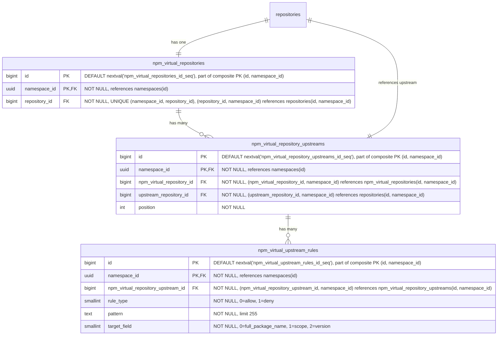

- **npm_virtual_repositories**: npm パッケージの仮想リポジトリです。名前、可視性、クロスフォーマットクエリのために `repository_id` を介して親の `repositories` テーブルを参照します。`HASH(namespace_id)` で 64 パーティションにパーティショニングされます。
- **npm_virtual_repository_upstreams**: 仮想リポジトリとその上流を結合するテーブルです。各仮想リポジトリは上流の順序付きリストを持ちます。各エントリは `upstream_repository_id` を介して上流リポジトリを参照し、これは `repositories(namespace_id, id)` を指します。複合外部キー `(namespace_id, upstream_repository_id)` は、上流が同じネームスペース内にあることを強制します。これはレジストリがネームスペースにスコープされること（[ADR-001](001_organizations_as_anchor_point.md)）と一貫しています。`HASH(namespace_id)` で 64 パーティションにパーティショニングされます。
- **npm_virtual_upstream_rules**: 上流の許可/拒否フィルタールールを定義します。各ルールは、この上流を通じて解決する際にどのアーティファクトが含まれるか除外されるかを制御するために、ワイルドカードパターンと対象フィールドを指定します。パターンは MVP ではワイルドカードのみです。正規表現のサポートは顧客のフィードバックがそれを正当化するまで延期されます（[ディスカッション](https://gitlab.com/gitlab-org/gitlab/-/work_items/597754#note_3291871207)）。`HASH(namespace_id)` で 64 パーティションにパーティショニングされます。

#### インデックス {#npm-virtual-repositories-indexes}

- **`npm_virtual_repositories`**: `(namespace_id, repository_id)` に対するユニークインデックス — 親参照によって仮想リポジトリを検索します。
- **`npm_virtual_repository_upstreams`**: `(namespace_id, npm_virtual_repository_id, position) DEFERRABLE INITIALLY DEFERRED` に対するユニークインデックス — 仮想リポジトリの順序付き上流を取得します。トランザクション内での並べ替えを可能にするために遅延可能（deferrable）です。`(namespace_id, npm_virtual_repository_id, upstream_repository_id)` に対するユニークインデックス — 同じ上流が仮想リポジトリに二度追加されるのを防ぎます。
- **`npm_virtual_upstream_rules`**: `(namespace_id, npm_virtual_repository_upstream_id)` に対するインデックス — 特定の上流のすべてのルールを取得します。

#### クエリ例 {#npm-virtual-repositories-query-examples}

- 仮想リポジトリを作成する

  ```sql
  -- First create the parent repository
  INSERT INTO repositories (namespace_id, name, format, kind, visibility)
  VALUES ('018f4d6f-0e10-7e3a-9bfd-23a4c5d6e7f8', 'my-virtual-repo', 2, 1, 1)
  RETURNING id;
  -- Link the repository to a repository collection
  INSERT INTO repository_collection_repositories (namespace_id, repository_collection_id, repository_id)
  VALUES ('018f4d6f-0e10-7e3a-9bfd-23a4c5d6e7f8', 456, <returned_id>);
  -- Then create the format-specific record
  INSERT INTO npm_virtual_repositories (namespace_id, repository_id)
  VALUES ('018f4d6f-0e10-7e3a-9bfd-23a4c5d6e7f8', <returned_id>);
  ```

- 仮想リポジトリを上流に関連付ける

  ```sql
  INSERT INTO npm_virtual_repository_upstreams (namespace_id, npm_virtual_repository_id, upstream_repository_id, position)
  VALUES ('018f4d6f-0e10-7e3a-9bfd-23a4c5d6e7f8', 123, 789, 1);
  ```

### blob ストレージ {#blob-storage}

blob ストレージのデータ構成は、次の前提の下で行われています。

- blob への一対多の関連付けを扱う必要はありません。これは blob ストレージのクライアント領域で処理されます。したがって、一対一の関連付けのみが必要です。
- 適切な [クリーンアップ処理](#cleanup-tasks) のために、いくつの blob ストレージクライアントが単一の blob を使用しているか（重複排除）を追跡する必要があります。
- さらに、単一の blob に対する各使用の異なる起源を追跡したい場合があります。

ここで提示するスキーマは、データのストレージ側のみを考慮しています。メトリクスや [クリーンアップ](#cleanup-tasks) などの追加の側面のために補助テーブルが必要になる場合がありますが、これらの部分はまだ評価中のためここでは記述しません。アップロードセッションの追跡については [アップロードセッション](#upload-sessions) で記述します。

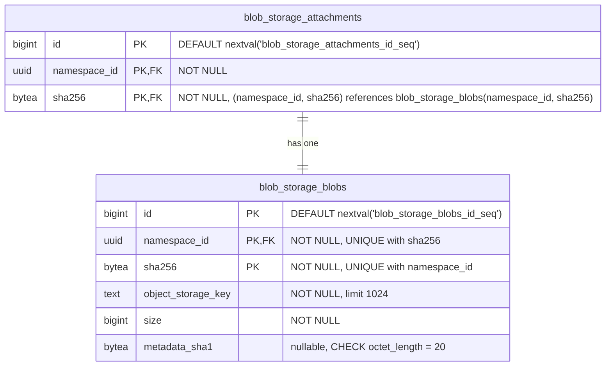

- **blob_storage_attachments**: 特定の blob の使用を追跡します。各クライアント（Container、NPM、または Maven リポジトリテーブル）は、blob レコードを使用（作成または再利用）したいたびに、ここにレコードを作成する必要があります。各使用は、ここに単一のレコードを_持たなければなりません_。クライアントは、参照しているアーティファクトレコード（ファイル、blob、キャッシュエントリ）を削除する際に、アタッチメントレコードを削除する責任があります。両方の削除は、孤立したアタッチメントが blob クリーンアップをブロックするのを防ぐために、同じトランザクション内で行わなければなりません。クライアントテーブルから `blob_storage_attachments` への外部キーは参照整合性を強制しますが（ダングリング参照を防ぐ）、`ON DELETE CASCADE` は使用しません。クリーンアップはアプリケーション管理です。例えば、まったく同じファイルを持つ 2 つの Maven パッケージは、それぞれ異なるアタッチメントレコードを参照し、それが同じ blob レコードを参照する必要があります。`namespace_id` カラムは Cells のシャーディングに必要です。`sha256` カラムは、パーティションプルーニングされた JOIN を可能にするために、参照される `blob_storage_blobs` レコードから伝播されます（[パーティショニング戦略](#blob-storage-partitioning-strategy) を参照）。主キーは、従来の `(id)` ではなく `(id, namespace_id, sha256)` です。`sha256` が必要なのは、PostgreSQL がハッシュパーティショニングされたテーブルのすべてのユニーク制約にパーティションキーを含めることを強制するためであり、`namespace_id` が必要なのは、PK をデプロイ間でグローバルに一意に保つためです。ローカルな `bigint id` は単一の Artifact Registry データベース内でのみ一意なので（[ネームスペース ID 型](#namespace-id-type) を参照）、デプロイ間のネームスペースマイグレーション（[ADR-022](022_namespace_decoupling.md)）では、同じ `(id, sha256)` ペアがターゲットデータベースにすでに存在する可能性があります。UUIDv7 の `namespace_id` を PK に追加することで、その衝突を構造的に排除します。クライアントテーブルは、この複合 PK を `(namespace_id, blob_storage_attachment_id, blob_sha256)` を介して参照します。
- **blob_storage_blobs**: このテーブルは、オブジェクトストレージに存在するすべてのファイルコンテンツ（blob として）を一覧します。オブジェクトストレージキーは専用カラムにすべて保存され、blob が使用されるたびに計算されることはありません。`sha256` は基本的なコンテンツアドレス可能な識別子であり、常に存在します（`NOT NULL`）。`namespace_id` カラムは重複排除を Organization にスコープします。フォーマット固有のチェックサム（例: Maven の SHA1 と MD5）はここではなくフォーマット固有のファイルテーブルに保存され、このテーブルをフォーマット非依存に保ちます。コンテンツタイプも同じ理由で除外されます。それはフォーマットが blob をどう解釈するかのプロパティであり、blob 自体のものではないため、フォーマット固有のテーブルに属します。`metadata_sha1` カラムは、そのフォーマット非依存ルールに対する意図的でスコープされた例外です。これは、コミット時に blob に添付された MVP ユーザーメタデータ許可リストの SHA-1 を反映し、SHA-1 が提供されなかった場合は `NULL` です。これが（フォーマット固有のテーブルではなく）`blob_storage_blobs` に存在するのは、ストレージレイヤーの blob 情報検索が、プッシュとプルのホットパスにおいて契約上、単一の DB ラウンドトリップであるためです。DB のミラーなしでユーザーメタデータを公開すると、ダイジェストごとのオブジェクトストレージ HEAD ファンアウトまたは部分的な API 公開を強いることになります。同じ値は、コミット時にバックエンドネイティブの `x-amz-meta-checksum-sha1` / `x-goog-meta-checksum-sha1` ヘッダーとしてストレージオブジェクトに添付され、行は不変なので、DB とストレージオブジェクトのコピーがずれることはありません。将来の許可リストの追加は、修正によって独自の nullable カラムを追加します。完全な根拠については [Artifact Registry S06 ストレージレイヤー仕様](https://gitlab.com/gitlab-org/ops/artifact-registry/-/blob/main/docs/specs/S06-storage-layer.md) を参照してください。主キーは、上記の `blob_storage_attachments` と同じ理由で `(id, namespace_id, sha256)` です。`sha256` は PostgreSQL のパーティションキー包含ルールを満たし、UUIDv7 の `namespace_id` は PK をデプロイ間でグローバルに一意に保ち、代理の `bigint id` は行識別子の形状をスキーマ内の他のすべてのテーブルと一貫させます。Organization ごとの重複排除は、別個の `UNIQUE (namespace_id, sha256)` 制約によって強制され、これはコンテンツハッシュによる検索インデックスとしても機能し、このテーブルへのすべての外部キーのターゲットです。PK を直接参照する FK はありません。`(namespace_id, sha256)` はすでに行を一意に識別し、UUIDv7 の `namespace_id` によってそれ自体でグローバルに一意なので、呼び出し側は代理の `id` を持たずに自然キーを介して JOIN します。

blob ストレージテーブルは、Artifact Registry の外部でも再利用できるように設計されています。これにより、他の機能が同じ重複排除とストレージインフラを活用できます。

すべてのハッシュカラム（`digest` と `sha256`、`sha1`、`md5`、`sha512` — Maven 固有）は `bytea` として保存されます。正確なエンコーディング戦略（例: [Container Registry](https://gitlab.com/gitlab-org/container-registry) で使用されているインラインアルゴリズムプレフィックス、または別個の `digest_algorithm` カラム）はまだ決定されていません。

### アップロードセッション {#upload-sessions}

アップロードセッションは、[ADR-008](008_content_addressable_storage.md#two-phase-upload-strategy) で記述された 2 フェーズアップロードライフサイクルを通じて、進行中の blob アップロードを追跡します。各セッションは、ネームスペースのストレージパーティション内の `uploads/{upload_id}` にある一時的なストレージオブジェクトにマッピングされます。セッションは、アップロード API（再開可能なアップロード、同時アップロードの解決）をサポートし、オブジェクトストレージの列挙なしに [アップロードパージ](#cleanup-tasks) を可能にするために、初期スキーマからデータベースで追跡されます（[ADR-011](011_data_reconciliation.md)）。

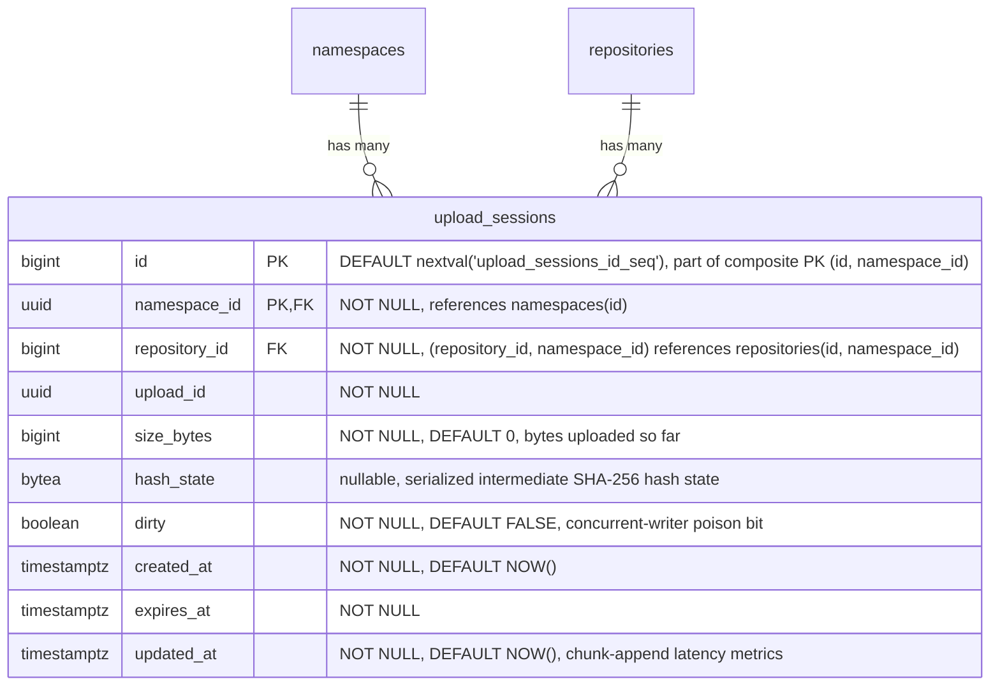

- **upload_sessions**: 各 blob アップロードが進行中の間、それを追跡します。テーブルはバイナリ存在モデルに従い、[コンテナレジストリのパターン](https://gitlab.com/gitlab-org/container-registry/-/blob/master/registry/storage/blobwriter.go) を反映します。行が存在すれば、アップロードは進行中であるかクリーンアップが必要です。存在しなければ、アップロードは完了したかパージされました。完了時、ストレージレイヤーは blob をコンテンツアドレス可能なストアに移動し、その後 `blob_storage_blobs` レコードを作成するのと同じトランザクション内でセッション行を削除します。フォーマット固有の行（`blob_storage_attachments` とフォーマットテーブル）は、その後、呼び出し側のフォーマットサブシステムによって別個のトランザクションで作成されます。これにより、ストレージレイヤーをフォーマット非依存に保ちます。`upload_id`（UUID）は、一時オブジェクトパス（`uploads/{upload_id}`）で使用されるストレージレベルの識別子です。`repository_id` はアップロードを開始したリポジトリを記録します。後続のリクエストでは、サーバーは URL 内のリポジトリが session.repository_id と一致することを検証し、upload_id が漏洩した場合のリポジトリ間の再利用を防ぎます。各リクエストの認可は、URL のリポジトリに対してリクエストミドルウェアによって実行され、このカラムには依存しません。複合外部キー `(namespace_id, repository_id)` は、アップロードがターゲットリポジトリと同じネームスペース内にあることを強制します。`size_bytes` は一時ストレージに書き込まれたバイト数を追跡します。再開可能なアップロードの場合、各チャンクが到着するにつれて更新され、クライアントにどこから再開するかを伝える `Range` レスポンスヘッダーを生成するために使用されます（[OCI Distribution Spec](https://github.com/opencontainers/distribution-spec/blob/main/spec.md)）。モノリシックアップロードの場合、blob データが書き込まれた後に設定されます。`created_at` はアップロードが開始された時刻を記録します。これは、アップロード期間メトリクス（期間と blob サイズの相関）と、アプリケーションの TTL 設定が引き下げられた場合の遡及的な期限切れ（`WHERE created_at < NOW() - :new_ttl`）を可能にします。既存のセッションは元の期限を保持するため、`expires_at` だけではこれをサポートできません。`expires_at` はセッション期限のタイムスタンプで、作成時にアップロードタイプに基づいて `NOW() + :configured_ttl` として計算されます（再開不可能なものは短く、再開可能なアップロードは長く）。期限切れのセッションはアップロードパージの候補です。パージャーは一時ストレージオブジェクトを削除し、行を削除します（[ADR-008](008_content_addressable_storage.md#temporary-object-cleanup)）。再開可能なアップロードのハッシュ状態は、シリアライズされた中間 SHA-256 状態として `hash_state` カラムに保存されます。単一行の `UPDATE` は PATCH ごとのオブジェクトストレージのラウンドトリップよりも単純です（[ADR-008](008_content_addressable_storage.md#resumable-uploads-and-hash-state) を参照）。その `UPDATE` は行ロックを取りません。1 つの `upload_id` に対する同時ライターは、`SELECT ... FOR UPDATE` ロックではなく、`size_bytes` の compare-and-swap と `dirty` ポイズンビットによって調整されます（乖離時に終了）。`dirty` はそのポイズンビットで、CAS の敗者によって設定され、行の削除によってのみクリアされます。失敗ごとのフローは、[Artifact Registry S06 ストレージレイヤー仕様](https://gitlab.com/gitlab-org/ops/artifact-registry/-/blob/main/docs/specs/S06-storage-layer.md) の「Consistency & Crash-Recovery Model」で定義されています。`updated_at` はセッションの最終変更時刻を記録し、チャンク追加レイテンシメトリクスと最終アクティビティの可観測性をサポートします。これはアクセスログから導出するのではなく保存されたカラムです。なぜなら、リクエスト時に同期的な再開パスの決定を支えるためです。書き込みコストは無視できます。既存の `size_bytes`/`hash_state` の `UPDATE` に相乗りするためです。`HASH(namespace_id)` で 64 パーティションにパーティショニングされ、スキーマ内の他のすべての `namespace_id` スコープのテーブルと一貫しています。セッションは短命ですが、アップロードパージャーは延期されている（[ADR-011](011_data_reconciliation.md)）ため、それが出荷されるまで期限切れの行が蓄積され、初日からパーティショニングすることで後のマイグレーションを回避し、`repositories` とのパーティションワイズ JOIN の適格性を保ち、空のパーティションではコストがかかりません。主キーは、従来の `(id)` ではなく `(id, namespace_id)` です。PostgreSQL はハッシュパーティショニングされたテーブルのすべてのユニーク制約にパーティションキーを必要とし、この PK のパーティションキーは UUIDv7 の `namespace_id` なので、すでにデプロイ間でグローバルに一意です。これは、`sha256` でパーティショニングし同じ保証のために `namespace_id` を追加する `blob_storage_attachments` と `blob_storage_blobs` とは異なります。

#### インデックス {#upload-sessions-indexes}

- **`upload_sessions`**: `(namespace_id, upload_id)` に対するユニークインデックス — ネームスペース内でアップロード UUID によってセッションを検索します。`expires_at` に対するインデックス — アップロードパージのために期限切れのセッションを見つけます。`(namespace_id, repository_id)` に対するインデックス — 特定のリポジトリのすべてのセッションを見つけます。認可チェックとリポジトリ削除時のクリーンアップに使用されます。

#### クエリ例 {#upload-sessions-query-examples}

- アップロードセッションを作成する

  ```sql
  INSERT INTO upload_sessions (namespace_id, repository_id, upload_id, expires_at)
  VALUES ('018f4d6f-0e10-7e3a-9bfd-23a4c5d6e7f8', 456, 'a0eebc99-9c0b-4ef8-bb6d-6bb9bd380a11', NOW() + INTERVAL '1 hour')
  RETURNING id, upload_id;
  ```

- チャンクアップロード中にセッションを検索する

  ```sql
  SELECT *
  FROM upload_sessions
  WHERE namespace_id = '018f4d6f-0e10-7e3a-9bfd-23a4c5d6e7f8' AND upload_id = 'a0eebc99-9c0b-4ef8-bb6d-6bb9bd380a11';
  ```

- チャンク追加後にセッション状態を更新する（`hash_state` + `updated_at`、`size_bytes` に対する compare-and-swap）

  ```sql
  UPDATE upload_sessions
  SET size_bytes = 1048576, hash_state = 'a1b2c3...'::bytea, updated_at = NOW()
  WHERE namespace_id = '018f4d6f-0e10-7e3a-9bfd-23a4c5d6e7f8' AND upload_id = 'a0eebc99-9c0b-4ef8-bb6d-6bb9bd380a11'
    AND size_bytes = 524288;  -- CAS: only persist if no concurrent writer advanced the row; a zero-rowcount result is a conflict
  ```

- アップロードパージのために期限切れのセッションを見つける

  ```sql
  SELECT id, namespace_id, upload_id
  FROM upload_sessions
  WHERE expires_at < NOW()
  ORDER BY expires_at
  LIMIT 100;
  ```

  このクエリはパーティションプルーニングされません。述語が `namespace_id` を含まないため、64 パーティションすべてをスキャンします。これはここでは許容できます。パージャーは境界のあるバックグラウンドジョブ（`LIMIT 100`、`expires_at` のインデックスに支えられる）であり、ホットパスのクエリではないため、ファンアウトはパフォーマンス上クリティカルではありません。

- クリーンアップ後にセッションを削除する

  ```sql
  DELETE FROM upload_sessions
  WHERE namespace_id = '018f4d6f-0e10-7e3a-9bfd-23a4c5d6e7f8' AND id = 789;
  ```

### パーティショニングの不変条件 {#partitioning-invariant}

**`namespace_id` を含むすべてのテーブルはパーティショニングされます。** デフォルトのパーティションキーは `HASH(namespace_id)` で 64 パーティションです。特定のテーブルは、文書化された理由がある場合に異なるキーを使用することがあります（`HASH(sha256)` の例外については [blob ストレージのパーティショニング戦略](#blob-storage-partitioning-strategy) を参照）。`namespace_id` を含まないテーブルはパーティショニングされません。

このルールは、テーブルごとの判断ではなく、行のプロパティとして述べられています。`namespace_id` がスキーマの一部であれば、テーブルはパーティショニングされます。「このテーブルは小さい」「このテーブルは親と 1:1 である」「後でパーティショニングを追加できる」といった例外はありません。小さなテーブルも大きなテーブルと同じようにパーティショニングされます。均一性が要点です。低ボリュームのテーブルをパーティショニングするコストは無視できます。64 個のほぼ空の子、計測可能なランタイムオーバーヘッドはありません。一方、後でパーティショニングを_追加する_コストは、本番データが配置された後のテーブルの書き換え、主キーの再構成、カスケードする外部キーの変更によって支配されます。

#### 機械的な帰結 {#mechanical-consequences}

PostgreSQL は、パーティショニングされたテーブルのすべてのユニーク制約にパーティションキーを含めることを要求します。これはスキーマ全体の主キーと外部キーを形作ります。

- **主キー。** すべてのパーティショニングされたテーブルの主キーは `namespace_id` を吸収します。`(id)` は `(id, namespace_id)` になります。パーティショニングされたテーブルのユニークインデックスは、先頭カラムとして `namespace_id` を含みます。
- **パーティショニングされたテーブル間の外部キー。** `namespace_id` で複合になります。子は `(<parent>_id, namespace_id)` を介して親を参照し、親の `(id, namespace_id)` を参照します。このパターンは、`repositories`、`workspaces`、フォーマット固有のリポジトリテーブル、中間層テーブル、ファイルテーブル、リモートキャッシュテーブルにわたって均一です。
- **`namespaces` への外部キー。** 単一カラムです。`namespace_id` は `namespaces(id)` を参照します。`namespaces` は主キーが `(id)` のままである唯一のテーブルです。これはパーティショニングされておらず、独自の `namespace_id` を持ちません（それを_定義する_）ため、子テーブルは複合 PK の小細工なしにそれを参照します。

複合外部キーの形状は、ネームスペース境界をスキーマレベルでエンコードします。任意のパーティショニングされたテーブルの行は、外部キーがそれを禁止するため、異なるネームスペースに属する別のパーティショニングされたテーブルの行を参照できません。これは Cells のシャーディングキー（`namespace_id`）がアプリケーションレベルで引く境界と同じものであり、データベース自体の中で冗長化されています。

#### 例外 {#exceptions}

テーブルは、`namespace_id` を欠いている場合にのみパーティショニングされません。今日の主な例は `namespaces` 自体です。これは `namespace_id` が判明する前に `slug` から解決されるルーティングルートであり、`namespace_id` を定義するため `namespace_id` カラムを持ちません。`namespace_id` を持たない将来のテーブル（例: インスタンス全体の設定、グローバルな cron 状態、デプロイにスコープされたライフサイクルメタデータ）は、このデフォルトを自動的に継承し、パーティショニングされません。

例外の述語は構造的です。行内の `namespace_id` の有無です。それは行数、書き込み頻度、現在のアクセスパターンに依存せず、これらはすべてシステムが進化するにつれて変化し得ます。

シングルテナントデプロイ（Dedicated、Self-Managed、単一 Organization の Cells）も例外ではありません。これらは 64 パーティションすべてを保持し、1 つが入力され 63 が空になります。空のパーティションはこの規模では無視できます（それぞれ数 KB のカタログとインデックスのオーバーヘッド）。パーティションプルーニングは影響を受けず、デプロイ間でのスキーマの均一性は、シングルテナントのバリアントを切り出すことよりも価値があります。病的な「1 つのパーティションがすべてを保持する」ケースは、完全なマルチテナント規模での `blob_storage_blobs` / `blob_storage_attachments` にのみ適用され、これがそれら 2 つのテーブルが代わりに `HASH(sha256)` を使用する理由です。[blob ストレージのパーティショニング戦略](#blob-storage-partitioning-strategy) を参照してください。

### blob ストレージのパーティショニング戦略 {#blob-storage-partitioning-strategy}

[帰結](#negative) で述べたように、`blob_storage_blobs` と `blob_storage_attachments` は、すべての Organization にわたってすべてのアーティファクトフォーマットを提供するため、非常に高い行数を蓄積します。意図的なパーティショニング戦略がなければ、これは次の問題につながります。

- テーブルが数十億行に成長するにつれて、インデックスの肥大化とクエリパフォーマンスの低下。
- すべてのアーティファクトタイプを同時にブロックするテーブル全体のロック（例: インデックス作成やスキーママイグレーション中）。
- 高い書き込みレートでの autovacuum の競合。

念頭に置くべき重要な制約: PostgreSQL は、パーティショニングされたテーブルのすべてのユニーク制約にパーティションキーを含めることを要求します。`blob_storage_blobs` の場合、重複排除制約は `UNIQUE (namespace_id, sha256)` です。パーティションキーがこれらのカラムのサブセットでない戦略は、その制約に追加のカラムを強制することになり、それは同じ Organization 内の同じ blob が異なるパーティションにまたがって二度保存されるのを防げなくなり、重複排除モデルを完全に損ないます。

以下が候補となる戦略です。

#### オプション A: `sha256` によるハッシュパーティショニング {#option-a-hash-partitioning-by-sha256}

両方のテーブルを `PARTITION BY HASH (sha256)` で 64 パーティションにパーティショニングします。

`sha256` はコンテンツアドレス可能なダイジェストなので、その値は本質的に均一に分布します。均等なデータ分布のために追加の作業は不要です。これはシングルテナント問題を解決します。シングルテナントデプロイ（Dedicated、Self-Managed、単一 Organization の Cells）は、`namespace_id` のみを使用すると、すべての行を単一のパーティションに集中させてしまいます。`sha256` をパーティションキーとすると、Organization がいくつ存在するかに関係なく、行は 64 パーティションすべてに均等に広がります。

`[namespace_id, sha256]` に対する既存のユニーク制約はすでに `sha256` を含んでいるため、このスキームと互換性があります。パーティションキーが制約の一部であるため、PostgreSQL はハッシュパーティションにまたがって一意性を強制できます。

このアプローチでは、`blob_storage_blobs` への JOIN が単一のパーティションをターゲットにできるように、`sha256` を `blob_storage_attachments` とフォーマット固有のテーブル（`*_files`、`container_blobs`、`container_manifests`、キャッシュエントリ）に伝播する必要があります。これは、blob 識別子（`namespace_id` + `sha256`）が `*_files` と `blob_storage_attachments` の両方の行に保存され、単純な `bigint` 外部キーよりも多くの物理ストレージを使用することを意味します（`sha256` は `bytea` として 32 バイト、`bigint` は 8 バイト）。しかし、このトレードオフは正当化されます。読み取りパス（アーティファクトプル）、すなわちシステム内で最もホットなクエリは、`(namespace_id, sha256)` を介して `*_files` から `blob_storage_blobs` に直接 JOIN でき、`blob_storage_attachments` を完全にスキップして 1 つの JOIN を排除します。アタッチメントは、[クリーンアップ](#cleanup-tasks) 中に「この blob はまだ誰かに使用されているか?」に答えるライフサイクルパスのために依然として必要です。

5 つの重要なアクセスパターンは次のように動作します。

| # | 操作 | 頻度 | ヒットするパーティション |
|---|-----------|-----------|----------------|
| AP1 | アーティファクトのプル（`namespace_id` + `sha256` を介した `*_files` → `blob_storage_blobs`） | 最高 | 1 |
| AP2 | 孤立チェック（`WHERE namespace_id = ? AND sha256 = ?`） | 高 | 1 |
| AP3 | 重複排除アップサート（`ON CONFLICT (namespace_id, sha256) DO NOTHING`） | 中〜高 | 1 |
| AP4 | アタッチメントの CRUD（blob から伝播された `namespace_id` + `sha256`） | 中 | 1 |
| AP5 | Organization ごとのストレージ会計（`WHERE namespace_id = ?`、`sha256` なし） | 低 | 全 64（緩和済み） |

**ポジティブ**:

- テナントの集中に関係なく均一な分布: シングルテナントデプロイは、1 つに集中させる代わりに、データを 64 パーティションすべてに広げます。
- すべての高頻度アクセスパターン（プル、孤立チェック、重複排除アップサート、アタッチメント CRUD）がちょうど 1 つのパーティションにヒットします。
- ユニーク制約 `(namespace_id, sha256)` はパーティションキーを含みます。重複排除アップサートは単一のパーティションをターゲットにし、外部ロックなしに `ON CONFLICT DO NOTHING` を介して同時アップロードを解決します。
- 読み取りパス（アーティファクトプル）は `blob_storage_attachments` の JOIN を完全にスキップし、`(namespace_id, sha256)` を介して `*_files` から `blob_storage_blobs` に直接進みます。

**ネガティブ**:

- `sha256` をより多くのテーブルに伝播する必要があります。`blob_storage_attachments` とフォーマット固有のテーブル（`*_files`、`container_blobs`、`container_manifests`、キャッシュエントリ）は、`blob_storage_attachment_id` 外部キーに加えて `(namespace_id, sha256)` を保持します。これは blob 識別子を行にわたって複製し、行ごとのストレージを増加させます。
- `namespace_id` のみ（`sha256` なし）のクエリはパーティションをプルーニングできず、64 パーティションすべてをスキャンします。主なケースはストレージ会計（Organization ごとに blob サイズを合計する）です。これは、blob の挿入/削除時に遅延インクリメントを介して更新される専用のロールアップテーブルによって緩和されます。これは GitLab で既に確立されているパターンです（例: プロジェクト統計）。ロールアップテーブルがなくても、64 パーティションにわたる並列集約は数秒で完了します。

#### オプション B: `namespace_id` によるハッシュパーティショニング {#option-b-hash-partitioning-by-namespace-id}

両方のテーブルを `PARTITION BY HASH (namespace_id)` で固定数のパーティションにパーティショニングします。

すべての一般的なアクセスパターンはすでに `WHERE` 句に `namespace_id` を含んでいるため、クエリプランナーはすべての操作に対して単一のパーティションをターゲットにできます。Cells のシャーディングキー（`namespace_id`）がパーティションキーを兼ね、より広範なアーキテクチャと一貫しています。

`[namespace_id, sha256]` に対するユニーク制約はすでに `namespace_id` を含んでいるため、このスキームと変更なしで互換性があります。PostgreSQL はすべてのハッシュパーティションにわたって一意性をグローバルに強制します。

**ポジティブ**:

- すべての Organization スコープのクエリが単一のパーティションにヒットします。クエリプランナーは他のすべてを自動的にプルーニングします。
- パーティションプルーニングはクリーンアップパスに直接適用されます。`blob_storage_attachments` の孤立チェック（`WHERE namespace_id = ? AND sha256 = ?`）は単一のパーティションをターゲットにすることが保証され、検索コストをテーブル全体のボリュームではなくパーティションサイズで境界づけます。
- スキーマ変更とロックは単一のパーティションにスコープされ、他の Organization への影響を軽減します。
- Cells のシャーディングキーと整合します。一般的なアクセスパターンに対してクロスパーティション作業はありません。
- `[namespace_id, sha256]` に対する既存の制約は変更なしで正しく動作します。

**ネガティブ**:

- Organization のサイズが大きく異なる場合、非常に高い blob 数を持つ Organization が自身のハッシュパーティションを支配し得ます。シングルテナントデプロイ（Dedicated、Self-Managed、単一 Organization の Cells）では、すべての行が単一のパーティションに集中します。VACUUM に数時間かかり、インデックスは数百 GB に達します。
- `WHERE` 句から `namespace_id` を省略するクエリは、すべてのパーティションをスキャンします。

#### オプション C: `id`（主キー）による範囲パーティショニング {#option-c-range-partitioning-by-id-primary-key}

両方のテーブルを自動インクリメントする主キーの範囲でパーティショニングします。これは GitLab の既存の [テーブルパーティショニングフレームワーク](https://docs.gitlab.com/ee/development/database/table_partitioning.html) で使用されているアプローチであり、既存のツールによって十分にサポートされています。

**ポジティブ**:

- パーティションサイズは予測可能に成長します。データが蓄積するにつれて新しいパーティションを簡単に追加できます。
- GitLab の既存のパーティション管理インフラと互換性があります。

**ネガティブ**:

- 重複排除の一意性を壊します。PostgreSQL は、パーティショニングされたテーブルのすべてのユニーク制約に `id` を含めることを要求します。`[namespace_id, sha256]` に `id` を追加すると、同じ Organization の同じ sha256 が複数のパーティションに現れ得るようになり、重複排除モデルが完全に壊れます。
- クエリは Organization スコープですが、パーティションは id 範囲ベースなので、すべての Organization スコープのクエリが複数のパーティションにまたがります。
- ロックスコープの削減が Organization 境界と整合しません。

#### オプション D: `created_at` による範囲パーティショニング {#option-d-range-partitioning-by-created-at}

両方のテーブルを時間範囲（例: 月単位または四半期単位のウィンドウ）でパーティショニングします。

**ポジティブ**:

- blob がクリーンアップされた後、古いパーティションを簡単にアーカイブまたはドロップできます。
- パーティションは既知の時間ウィンドウに対応し、明確な運用モデルです。

**ネガティブ**:

- ホットパーティション問題: すべての書き込みが最新のパーティションをターゲットにし、書き込みの競合を集中させます。
- blob は年齢ではなく、すべてのアタッチメントを失ったときに期限切れになります。時間ベースのパーティショニングは実際の blob ライフサイクルと整合しません。
- オプション C と同じユニーク制約の問題: `created_at` をユニーク制約に追加する必要があり、クロスパーティション重複排除を壊します。
- アクセスパターンは時間スコープではなく Organization スコープなので、クエリはすべてのパーティションにまたがります。

#### オプション E: パーティショニングなし {#option-e-no-partitioning}

Cells レベルのシャーディング（`namespace_id`）と標準的なインデックス作成を主要なスケーラビリティメカニズムとして頼ります。パーティショニングは、メトリクスが必要性を示すまで延期されます。

**ポジティブ**:

- 単純なスキーマと運用: パーティション管理のオーバーヘッドがなく、マイグレーションとスキーマ変更が簡単です。
- 初期段階の規模では十分: 行数が単一の Cell 内で扱いやすいうちはうまく機能します。

**ネガティブ**:

- Cell 内での無制限の成長: テーブルが成長するにつれて、テーブルレベルのロックがすべての Organization に同時に影響します。
- 適切に設計されたインデックスでさえ、非常に高い行数ではパフォーマンスの圧力に直面します。

#### 決定 {#blob-storage-partitioning-decision}

**`sha256` によるハッシュパーティショニング（オプション A）が選択されました**。`blob_storage_blobs` と `blob_storage_attachments` の両方について。

これは次のことを満たす唯一のオプションです。

1. すべての高頻度アクセスパターン（アーティファクトプル、孤立チェック、重複排除アップサート、アタッチメント CRUD）を単一のパーティション内に保ちます。
2. テナントの集中に関係なく行を均一に分布させます。これは、`namespace_id` ベースのパーティショニングがすべての行を 1 つのパーティションに集中させるシングルテナントデプロイ（Dedicated、Self-Managed、単一 Organization の Cells）にとってクリティカルです。
3. `[namespace_id, sha256]` に対する既存のユニーク制約と変更なしで互換性があり、`ON CONFLICT (namespace_id, sha256) DO NOTHING` を介してレースのない重複排除アップサートを可能にします。

両方のテーブルについて、初期値として 64 パーティションが選択されています。これは、運用オーバーヘッドを管理可能に保ちつつ、十分な分布とロック分離を提供します。

トレードオフは、`sha256` を `blob_storage_attachments` とフォーマット固有のテーブル（`*_files`、`container_blobs`、`container_manifests`、キャッシュエントリ）に伝播する必要があることです。これは blob 識別子（`namespace_id` + `sha256`）を行にわたって複製し、`bigint` 外部キーのみよりも多くの物理ストレージを使用します。利点は、読み取りパス、すなわちシステム内で最もホットなクエリが、`(namespace_id, sha256)` を介して `*_files` から `blob_storage_blobs` に直接 JOIN し、`blob_storage_attachments` を完全にスキップして 1 つの JOIN を排除することです。アタッチメントは [クリーンアップライフサイクルパス](#cleanup-tasks) のためにのみ残ります。

`namespace_id` のみ（`sha256` なし）のクエリ、例えば Organization レベルのストレージ会計は、パーティションをプルーニングできず、64 パーティションすべてをスキャンします。これは、遅延インクリメントを介して更新される専用のロールアップテーブルによって緩和されます。これは GitLab で既に確立されているパターンです（例: プロジェクト統計）。

### フォーマット固有のテーブルのパーティショニング戦略 {#format-specific-table-partitioning-strategy}

フォーマット固有のテーブル（ホストされたコンテンツテーブルとそのリモートの対応物）は、[パーティショニングの不変条件](#partitioning-invariant) によって確立された `HASH(namespace_id)` デフォルトに従います。各テーブルの箇条書きがそれを明示的に記録します。ホスト型とリモート型は同じアクセス形状を共有するため 1 つの戦略を共有します。すべての主要なアクセスパターンは `namespace_id` スコープです。テーブルごとの違い（キャッシュ TTL、上流メタデータ）はパーティショニングと直交し、テーブルごとの説明に存在します。

このグループに固有の根拠:

- すべての主要なアクセスパターンが `namespace_id` スコープです（リポジトリとアーティファクト座標による検索、パッケージまたはイメージのファイルの一覧表示、上流のキャッシュエントリの一覧表示）。したがって、`HASH(namespace_id)` はすべての操作に対して単一パーティションのプルーニングを与えます。読み取りパスのショートカット（`(namespace_id, sha256)` を介した `*_files` → `blob_storage_blobs`、`blob_storage_attachments` をスキップ）、すなわちシステム内で最もホットなクエリは、このパーティショニングから直接恩恵を受けます。
- `blob_storage_blobs` を `HASH(sha256)` に駆動するシングルテナント集中の懸念は適用されません。各フォーマット固有のテーブルは 1 つのフォーマット（リモートの場合は 1 つの上流）にスコープされるため、ネームスペースごとのフットプリントは構造的に、`blob_storage_blobs` が保持するクロスフォーマット集約の一部にすぎません。
- `(namespace_id, blob_sha256)` を介した `blob_storage_blobs` への JOIN はクロスパーティションスキャンしません。プランナーは `namespace_id` を介してフォーマットテーブルのパーティションを、`sha256` を介して blob のパーティションを、独立してプルーニングします。

### パーティション数の根拠 {#partition-count-rationale}

すべての `HASH(namespace_id)` テーブルは 64 パーティションを使用し、`blob_storage_blobs` と `blob_storage_attachments`（`HASH(sha256)`）に選ばれた 64 パーティションと一致します。この数は、既存の Container Registry と Package Registry のデータベースからの本番データに基づいています。

パーティション数は、最大の想定テーブル（`container_blobs`）によって駆動され、その本番アナログはすでに同等の規模で 64 パーティションを使用しています。他のフォーマット固有のテーブルは大幅に小さく、64 パーティションはそれらすべてにとって余裕があります。

この決定の主要な要因:

- **スキュー耐性**: `HASH(namespace_id)` は均一な分布を保証しません。ネームスペースのサイズは大きく偏っています。少数の大きなネームスペースが不均衡な割合の行を保持します。パーティション数が少ないと、同じパーティションにハッシュされる大きなネームスペースが不均衡を増幅します。64 パーティションでは、最悪のスキューでもパーティションサイズを管理可能に保ちます。
- **アンダーパーティショニングの修正は高コスト**: 後でパーティション数を変更するには、テーブルの完全な再構築が必要です。小さなテーブルをオーバーパーティショニングするオーバーヘッドは無視できますが、大きなテーブルをアンダーパーティショニングすると実際の運用リスクが生じます。
- **パーティションワイズ JOIN**: PostgreSQL は、同じパーティションスキーム（同じキー、同じ方法、同じ数）を共有するテーブル間の JOIN を、一致するパーティションを直接 JOIN することで最適化できます。すべての `HASH(namespace_id)` テーブルが 64 パーティションを使用するため、この最適化が利用可能です。実際には、クエリはすでに `namespace_id = ?` を含むため、プランナーは各側について 1 つのパーティションにプルーニングしますが、パーティションワイズ JOIN は無料の最適化のままです。
- **運用上の一貫性**: すべての `namespace_id` パーティショニングされたテーブルにわたる単一のパーティション数は、特定の `namespace_id` のすべてのテーブルが同じパーティション番号にハッシュされることを意味し、メンテナンススクリプト、監視、一括操作を簡素化します。

どのテーブルがパーティショニングされるかは、ここで列挙されるのではなく [パーティショニングの不変条件](#partitioning-invariant) によって決定されます。

### バッファ書き込みと非同期書き込み {#buffered-and-asynchronous-writes}

いくつかのカラムは、すべてのダウンロードまたはアップロードリクエストで更新されます。`repositories` のカウンターカラム（`artifacts_count`、`downloads_count`、`size_bytes`）、エンティティ数制限チェックに使用される `npm_packages` のパッケージごとのカウンター（`versions_count`、`tags_count`）、`container_images`、`maven_packages`、`maven_versions`、`npm_packages`、`npm_versions` の `last_downloaded_at` タイムスタンプです。これらをリクエストパスで直接書き込むと、同じ行に対する同時リクエストがシリアライズされ（人気のパッケージでのホット行の競合）、リクエストレイテンシがデータベースの書き込みスループットに結合されます。

これを避けるために、これらのカラムはバッファ書き込み/非同期書き込みを介して維持されます。リクエストハンドラーは高速な中間ストア（例: Redis）に更新を記録し、バックグラウンドプロセスが定期的にバッファされたエントリを行にマージし直します。これは GitLab の `ProjectStatistics` と同じパターンを再利用します。

この方法で維持されるカラムは、スキーマ図で `buffered` とフラグ付けされています。

#### マージのセマンティクス {#merge-semantics}

マージ戦略はカラムの種類に依存します。

- **カウンター**（`artifacts_count`、`downloads_count`、`size_bytes`、`versions_count`、`tags_count`）: バッファされたデルタを既存の値に合計します。すべてのインクリメントを保持しなければなりません。インクリメントを失うと永続的なアンダーカウントが生じます。エンティティ数制限チェック（`versions_count`、`tags_count`）については、境界での小さな上限超過は許容されます。制限は（データ整合性ルールではなく）製品の上限であり、ドリフトはバッファウィンドウで境界づけられ、次のフラッシュで再同期されます。重複するバージョン名は、カウンターに関係なく、`npm_versions` と `npm_tags` のユニークインデックスによって別個にブロックされます。
- **タイムスタンプ**（`last_downloaded_at`）: バッファされた値と既存の値の最大値を取ります（最新が勝つ）。最も新しいダウンロード時刻のみが重要です。中間の値は破棄できます。

両方の戦略は同じバッファリングインフラを共有し、書き込み前にバッファされたエントリがどのように削減されるかだけが異なります。

#### トレードオフ {#buffered-writes-trade-offs}

- **古さ**: バッファされたカラムは、最大 1 つのフラッシュ間隔だけ現実から遅れます。これは現在のコンシューマーにとって許容できます。ライフサイクルルールの評価（`keep_last_downloaded_at`）はフラッシュ間隔を十分に上回るスケジュールで実行され、ランディングページのカウンターは短時間の乖離を許容します。これは、自身の書き込みを同期的に観測しなければならない読み取りや、ダウンロードイベントの正確な順序を必要とする決定には_適していません_。
- **バッファ損失**: フラッシュ前にバッファが失われると、最近の更新が失われます。カウンターについてはこれは永続的なアンダーカウントです。タイムスタンプについては、次のダウンロードが正しい（ただしわずかに遅延した）値を復元します。

### ネームスペース ID 型 {#namespace-id-type}

`namespaces.id` カラムの型はスキーマ全体にカスケードします。すべてのパーティショニングされたテーブルがシャーディングキーとして `namespace_id` を保持し、それらのテーブルの本質的にすべての複合主キー、外部キー、複合インデックスがこのカラムを先頭要素として含みます。後で型を変更するには、すべてのパーティショニングされたテーブルとすべての物理的な子リレーションにわたる多段階のマイグレーションが必要であり、スキーマが本番データを保持すると実質的に取り消し不可能な決定になります。

選択を駆動する 3 つのプロパティ:

1. **デプロイモデル間でのグローバルな一意性。** Artifact Registry は、複数の独立したデプロイ（GitLab.com、Dedicated、Self-Managed、Cell ごと、および潜在的には GitLab Rails から独立したスタンドアロン製品）として実行されるように設計されています（[ADR-022](022_namespace_decoupling.md#consequences) を参照）。ローカルなシーケンスから引かれる連続した整数 ID はデプロイ間で衝突し、ネームスペース行が Artifact Registry インスタンス間を移動するあらゆるシナリオ（MVP 後のマイグレーションツール、Cell の統合、デプロイ間の参照）を排除します。
2. **運用上のデバッグ容易性。** `namespace_id = 42` はデプロイ間で曖昧です。同じ整数が、異なる Cell やインストールで無関係なネームスペースを指し得ます。サポートチケット、インシデントの runbook、デプロイ間のログ相関はすべて、識別子が一見して一意であるときに恩恵を受けます。
3. **ID 生成のための調整依存がない。** デプロイ間で重複しない bigint 範囲を割り当てるには、中央権威（Topology サービスまたは同等のもの）が必要です。UUIDv7 はデータベース上でローカルに、調整なしで生成されます。

#### オプション {#namespace-id-options}

##### オプション A: UUIDv7 {#namespace-id-option-a-uuidv7}

`namespaces.id` は UUIDv7 値（[RFC 9562](https://datatracker.ietf.org/doc/rfc9562/)）が入力される `uuid` です。スキーマ全体のすべての `namespace_id` カラムは `uuid` です。生成は、データベース側（PG18 ネイティブの `uuidv7()`、または PG13〜17 の [`pg_uuidv7`](https://pgxn.org/dist/pg_uuidv7/) 拡張）でも、RFC 9562 準拠のライブラリを使用したアプリケーション側でも行えます。カラム型はすべての場合で同じで、パスは後でデータを書き換えることなく変更できます。完全なマトリックスについては下記の決定セクションを参照してください。

**ポジティブ**:

- すべての Artifact Registry デプロイにわたって構造的にグローバルに一意です。調整も、中央アロケーターも、範囲管理もありません。数千のデプロイが同時に生成しても、衝突は暗号学的にあり得ません。
- 時刻順: 新しい ID は各パーティション内の B-tree の右端に追加されます。[credativ による PG18、100 万行の比較](https://www.credativ.de/en/blog/postgresql-en/a-deeper-look-at-old-uuidv4-vs-new-uuidv7-in-postgresql-18/) では、UUIDv7 の主キーインデックスは約 90% のリーフ密度（bigint シーケンスも達成するデフォルトの `fillfactor`）と約 0% のフラグメンテーションを達成しました。同じワークロードでの UUIDv4 の約 71% のリーフ密度と約 50% のフラグメンテーションと比べてです。
- WAL ボリュームは UUIDv4 よりも bigint にはるかに近いです。UUIDv7 のシーケンシャル挿入の局所性は、ランダムな UUID が被るフルページ書き込みの増幅を回避します。挿入スループットは、現実的な複数カラムスキーマで bigint と数パーセント以内で一致します（[kkm-mako、PG18、100 万行・13 カラムの e コマーステーブル: bigint 76.5 秒対 UUIDv7 77.0 秒](https://kkm-mako.com/en/blog/articles/uuid-v4-v7-bigint-primary-key-design/)、[Ardent Performance、PG17-dev、10 個の同時クライアントを持つ 2000 万行のテーブル: bigint 3,480 tps 対 UUIDv7 3,420 tps](https://ardentperf.com/2024/02/03/uuid-benchmark-war/)）。むき出しの 2 カラムのトイスキーマでは差がより顕著です。[kkm-mako の最小スキーマ](https://kkm-mako.com/en/blog/articles/uuid-v4-v7-bigint-primary-key-design/) は同じ行数で bigint 1.63 秒対 UUIDv7 2.16 秒（約 32% 遅い）を計測しました。これは、より幅広い ID カラムが行のより大きな割合を占めるためです。絶対値はワークロード依存です。
- 埋め込まれたミリ秒タイムスタンプにより、ID は BRIN フレンドリーで、診断のために自明に抽出可能です。
- Artifact Registry が実行され得るすべての PostgreSQL バージョンで利用可能です。PG18 は `uuidv7()` をネイティブに出荷します（2025 年 9 月）。PG13〜17 では [`pg_uuidv7` 拡張](https://pgxn.org/dist/pg_uuidv7/BENCHMARKS.html) が公開ベンチマークによればネイティブに対して 2% 未満のオーバーヘッドで `uuid_generate_v7()` を提供し、どのバージョンでも RFC 9562 準拠のライブラリでアプリケーション側生成をサポートします。
- デプロイ間のネームスペースの可搬性を構造的に可能にします。MVP 後のマイグレーションツール（[ADR-011](011_data_reconciliation.md)）、Cell の統合、[ADR-022](022_namespace_decoupling.md) のスタンドアロン製品パスは、関連するすべての行の `namespace_id` を書き換えることなく、Artifact Registry インスタンス間でネームスペース行を移動します。

**ネガティブ**:

- ストレージ: 値ごとに 16 バイト対 bigint の 8 バイト。`namespace_id` はパーティショニングされたテーブルのほぼすべての複合インデックスの先頭カラムなので、この幅広化はすべての物理的な子リレーションにわたって複合的に効きます。[Jamauriceholt の PG 15.4 における 2000 万行の外部キーインデックスのベンチマーク](https://medium.com/@jamauriceholt.com/uuid-v7-vs-bigserial-i-ran-the-benchmarks-so-you-dont-have-to-44d97be6268c) は、UUIDv7 で 847 MB 対 BIGSERIAL で 423 MB（約 2 倍）、1 万行の一括挿入で 1,847 バッファ書き込みページ対 847（約 2.2 倍）を計測しました。エントリごとの幅広化はインデックスタプルの約 20 バイト中の約 8 バイト（約 40%）です。観測された合計インデックスサイズは、そのエントリごとの下限から、インデックスがキーか固定オーバーヘッドかの割合に応じて約 2 倍までの範囲です。Artifact Registry のマルチ TB のメタデータ規模では、これは実際のものですが境界のあるコストであり、テーブル全体ではなく `namespace_id` を先頭とするインデックスに集中します。
- キー幅に実質的に依存するクエリの読み取りレイテンシは、bigint よりも計測可能に遅くなり得ます。[合成的な 500 万ユーザー / 2000 万注文 / 5000 万 audit_log スキーマ（Jamauriceholt）](https://medium.com/@jamauriceholt.com/uuid-v7-vs-bigserial-i-ran-the-benchmarks-so-you-dont-have-to-44d97be6268c) では、1 対多の JOIN が UUIDv7 で BIGSERIAL より約 26 倍遅く、単一行検索が約 15 倍遅く、範囲/ページネーションが約 16 倍遅くなりました。これらの数値は最悪ケースの合成クエリを反映しており、このスキーマに外挿すべきではありません。すべてのホットパスは複合キーに対する単一パーティションの `namespace_id = ?` インデックス付き検索です。それらの条件下では、オーバーヘッドは上記のページごとのバイトコストで境界づけられ、クエリ形状のコストに増幅されません。レビュアーがより強力な経験的下限を望む場合、マージ前に PG18 上の代表的な行幅でのパーティションローカルなインデックス付き検索ベンチマークを依頼するのが適切です。
- 時刻順は `HASH(namespace_id)` テーブルでのパーティションプルーニングを可能にしません。ハッシングはタイムスタンプ成分に関係なく値をパーティションに散らします。パーティション内の B-tree の局所性は保たれますが、これは bigint シーケンスもより低いストレージコストで提供します。UUIDv7 のパーティションプルーニングの利点は `RANGE(uuid)` スキームにのみ適用され、ここでは使用されません。
- クライアントライブラリ、管理ツール、API レスポンスは整数ではなく 36 文字の文字列をレンダリングします。軽微ですが広範です。`namespace_id` を運ぶあらゆるエンドポイントで JSON レスポンスサイズが増加します。

##### オプション B: 調整された範囲割り当てを伴う bigint {#namespace-id-option-b-bigint-with-coordinated-range-allocation}

`namespaces.id` は `bigint DEFAULT nextval('namespaces_id_seq')` のままです。各 Artifact Registry デプロイには、Topology サービスによって重複しない bigint 範囲（例: デプロイ X: 1 〜 10^12、デプロイ Y: 10^12+1 〜 2×10^12）がプロビジョニングされます。Artifact Registry は slug の取得のためにすでに Topology サービスに依存しています（[ADR-022](022_namespace_decoupling.md#cells-routing) を参照）。

**ポジティブ**:

- 現在のドラフトに対してストレージの差分がゼロです。考慮すべきインデックス、WAL、JOIN のコストはありません。
- 既存の依存を再利用します。Topology サービスは slug の取得のためにすでに必要です。
- ID 生成はシーケンスの `nextval` のままです。自明に高速で、拡張は不要です。
- Cells 間で調整された bigint シーケンスという GitLab Rails の確立されたパターンと一致します（[Cells 開発ガイドライン](https://docs.gitlab.com/development/cells/)）。

**ネガティブ**:

- デプロイ間のネームスペースの可搬性が構造的にサポートされません。Y の割り当て範囲がソース ID を含まない場合、デプロイ X からデプロイ Y へネームスペースを移動するには、依然としてすべての行の `namespace_id` を書き換える必要があります。
- 範囲割り当ては、すべての新しい Artifact Registry デプロイにブートストラップステップを追加し、範囲サイズと回収のためのガバナンスモデルを追加します。範囲を重複させてしまう誤割り当ては、早期に検出するのが難しいグローバルな一意性違反です。
- 後でデプロイ間の可搬性をサポートする決定を下すと、この ADR が回避しようとしている bigint から UUID への完全なマイグレーションが必要になります。

##### オプション C: Snowflake パックされた bigint {#namespace-id-option-c-snowflake-packed-bigint}

アプリケーション側で 64 ビットをビットパックします: デプロイ ID（14 ビット、16K デプロイ）+ タイムスタンプ（41 ビット、エポックから 69 年）+ バックエンドごとのシーケンス（9 ビット、512 ID/ms/バックエンド）。小さなライブラリで Go サービスで生成されます。

**ポジティブ**:

- bigint に対してストレージの差分がゼロです。同じインデックス、WAL、JOIN プロファイルです。
- 自己識別: デプロイの起源が任意の `namespace_id` から抽出可能です。
- UUIDv7 のように時刻順で、同じパーティション内の B-tree 局所性の利点を与えます。
- 拡張依存がありません。ID 生成は数個のビット演算です。

**ネガティブ**:

- PostgreSQL プリミティブの代わりに Go サービスで保守されるカスタムジェネレーター。すべてのライターは同じライブラリバージョンとクロックソースを使用しなければなりません。
- クロックスキューに敏感: デプロイごとのカウンターはクロックの巻き戻しとバーストトラフィックを生き延びなければなりません。モノトニッククロックの規律と、ミリ秒内のシーケンスカウンターの慎重な扱いが必要です。
- 業界で広く使用されています（Twitter、Discord、Instagram の 41+13+10 バリアント）が、PostgreSQL ネイティブのパターンではありません。ツール、監査可能性、チーム間の親しみやすさは UUID よりも弱いです。
- ビットフィールドの分割は一度限りの設計上の決定です。デプロイビットが少なすぎたり、タイムスタンプ範囲が狭すぎたりすると、後で変更するのが困難です。
- デプロイ間のマイグレーションを解決しません。デプロイ X で生成された ID は X の 14 ビットプレフィックスを永遠に運ぶため、ネームスペースをデプロイ Y へ再配置しても、依然として書き換えか、起源について嘘をつく ID のいずれかを意味します。

#### 決定 {#namespace-id-decision}

**オプション A（UUIDv7）が選択されました**。`namespaces.id` について、結果としてスキーマ全体のすべての `namespace_id` カラムについて。その他すべての `id` カラム（`repositories.id`、`container_images.id`、`maven_packages.id` など）は `bigint DEFAULT nextval('<table>_id_seq')` です。それらの一意性は単一の Artifact Registry データベース内でのみ保持されればよく、そのストレージフットプリントは数十億行にわたって大きく、デプロイ間の識別子として現れることはありません。ただし、デプロイ間のネームスペースマイグレーション（[ADR-022](022_namespace_decoupling.md)）では、依然としてソースデプロイの `id` 値で行を再挿入する必要があり、これは明示的なシーケンスデフォルトでは簡単ですが、`GENERATED ALWAYS AS IDENTITY` の下ではすべての挿入で `OVERRIDING SYSTEM VALUE` が必要になります。

決定的な要因:

1. **ネームスペースは可搬性の単位です。** 何らかの Artifact Registry 識別子がデプロイ間の移動を生き延びなければならないとすれば、それは `namespace_id` です。ネームスペースより下のすべてはそれとともに移動します。ネームスペースより上のすべては不変の slug とアンカータプルを通じて表現されます（[ADR-022](022_namespace_decoupling.md)）。
2. **コストは集中していて境界があります。** `namespace_id` を 8 バイトから 16 バイトに幅広化することは多くのインデックスの先頭カラムに効きますが、合計ストレージを倍増させません。大きなパーティショニングされたテーブルの行幅は他のカラム（リポジトリ/イメージ/マニフェスト ID、タイムスタンプ、カウンター、32 バイトの `bytea` ダイジェスト）によって支配されます。予備的なサイジングでは、影響を合計メタデータストレージの数十パーセントに置いており、Artifact Registry のキャパシティ範囲内です。
3. **利点はインクリメンタルではなく構造的です。** デプロイ間の移動に触れるすべての MVP 後の機能（[ADR-011](011_data_reconciliation.md) のマイグレーションツール、Cell の統合、[ADR-022](022_namespace_decoupling.md) のスタンドアロン製品パッケージング）は、`namespace_id` が構造的にグローバルに一意であるときに意味のある形で簡単になり、アロケーターの不在は調整依存を取り除きます。
4. **ストレージコストは一度、挿入時に、まだ空のスキーマで支払われます。** オプション B は、デプロイモデルが後でグローバルな一意性を要求する場合、すべてのパーティショニングされたテーブルにわたる取り消し不可能なマイグレーションを必要とします。私たちは、後の無制限なマイグレーションリスクを回避するために、既知の境界のあるコストを今日受け入れます。
5. **UUIDv7 はホットパスのパフォーマンスプロファイルを保ちます。** 単一パーティションの `namespace_id = ?` 検索は単一パーティションのままです。bigint が提供するパーティション内の B-tree 局所性は、UUIDv7 の時刻順プレフィックスによっても提供されます。失われる唯一のプロパティ（UUID 範囲によるパーティションプルーニング、8 バイトのインデックス先頭カラム）は、`HASH` パーティショニングに適用されないか、コストが境界づけられています。

**実装上の注記**:

- 3 つの実行可能な生成パスが存在します。選択はデプロイ時に利用可能な PostgreSQL バージョンに依存し、カラム型とは独立です。
  - **PG18+ ネイティブ**: カラムデフォルト `DEFAULT uuidv7()`。拡張は不要です。
  - **PG13〜17 で [`pg_uuidv7`](https://pgxn.org/dist/pg_uuidv7/) 拡張を使用**: カラムデフォルト `DEFAULT uuid_generate_v7()`。ネイティブパスとの関数名の違いに注意してください。マイグレーションとスキーマダンプは、ターゲット環境に対して正しい名前を参照しなければなりません。
  - **アプリケーション側生成**: 任意の PostgreSQL バージョン、拡張不要。Go サービスが [RFC 9562](https://datatracker.ietf.org/doc/rfc9562/) 準拠のライブラリで値を生成し、`INSERT` で供給します。
- これらのパス間で後から切り替えるのはメタデータのみ（`ALTER COLUMN SET DEFAULT`）であり、すべてのジェネレーターが RFC 9562 準拠の UUIDv7 値を発行する限り、データを書き換えません。これにより、初期パスはスキーマのコミットメントではなくランタイム/運用上の選択になります。
- **未解決の問題（GA に近づいたら解決）**: どの初期パスを取るかは、GA 時点で `.com`、Dedicated、Self-Managed にわたって利用可能な PostgreSQL バージョンに依存します。すべてのインストールタイプにわたって PG18 を保証できない場合、アプリケーション側生成が最も安全な暫定的選択です。カラムデフォルトは、PG18 がどこでも下限になったら、ネイティブの `uuidv7()` に移動できます。
- この ADR のすべての mermaid 図は、`namespaces.id` と `namespace_id` カラムを `uuid` として示します。フォーマット固有の `id` カラムは `bigint` のままです。
- UUIDv7 のモノトニック性は、同じミリ秒内の単一バックエンド（データベース側）またはプロセス（アプリケーション側）内で厳格であり、バックエンドやプロセスをまたいでは厳格ではありません。これはインデックスの局所性とデバッグ容易性には十分です。ホットパスのロジックが接続をまたいだ厳格なグローバル順序を想定することはありません。
- slug から `namespace_id` への検索キャッシュ（[ADR-022](022_namespace_decoupling.md#request-flow) を参照）は影響を受けません。それは不変の slug をキーにします。
- パーティショニングされたテーブルで使用される複合主キーパターン（例: `upload_sessions` の `(id, namespace_id)`、PostgreSQL のパーティショニングされたテーブルの制約ルールで必要）は依然として成り立ちます。PK の `namespace_id` 成分は `uuid` になり、`id` 成分は `bigint` のままです。

### パーティションスキーマの構成 {#partition-schema-organization}

パーティショニングされたテーブルごとに 64 個の HASH パーティションがあり、後で中間層テーブルがパーティショニングされるにつれて成長するパーティションセットがあるため、子リレーションは論理テーブルを大きく上回ります。これらの子がどこに存在するか（`public` で親と並べるか、専用のネームスペースに置くか）は、スキーマの可読性、ツールの整合性、そしてパーティショニングされたテーブルの周りに構築するマイグレーションツールを形作ります。

#### オプション A: パーティション子のための専用スキーマ {#partition-option-a-dedicated-schema-for-partition-children}

親テーブルは `public` に存在し、すべてのパーティション子は専用の `partitions` スキーマに存在します。パーティション DDL は、すべての `CREATE TABLE ... PARTITION OF` で明示的にパーティションスキーマをターゲットにします。そうでなければ PostgreSQL は子を親のスキーマに配置します。

**ポジティブ**:

- カタログの可読性: `\dt public.*`、`information_schema`、ER 図、IDE のスキーマビューは、すべてのパーティション子ではなく論理テーブルのみを表示します。スキーマレビュー、オンボーディング、DB コンソール作業は、エンジニアが実際に推論する抽象化で動作します。
- アプリケーションレイヤーは影響を受けません。アプリケーションは `public` の親テーブルを通じてクエリし、`partitions` スキーマを参照することはありません。マイグレーションツールのみが、明示的な `partitions.<name>` 修飾を使用して子パーティションをターゲットにします。
- パーティションライフサイクル操作のためのクリーンなスコープ化: 権限、`pg_dump -n`、ロジカルレプリケーションパブリケーション、監視エクスポーターは、テーブル名パターンの代わりに単一のネームスペースをターゲットにします。
- 偶発的なパーティションレベルのクエリを抑制します。特定の子に到達するには `partitions.<name>` が必要で、パーティション抽象化をバイパスするのを難しくします。

**ネガティブ**:

- Postgres のデフォルトが規約に反します。`CREATE TABLE ... PARTITION OF parent` は、明示的にオーバーライドされない限り子を親のスキーマに配置するため、強制はデータベース自体ではなくマイグレーションツール、リンター、または CI に存在します。
- パーティショニングヘルパーは子の作成をパーティションスキーマにルーティングしなければならず、サービスのブートストラップはマイグレーション実行前にスキーマとその権限をプロビジョニングしなければなりません（[ADR-006](006_technology_stack.md)）。
- ランタイムの利点はありません。プルーニング、ロック、VACUUM、クエリパフォーマンスは変わりません。このケースは完全に組織的なものです。

#### オプション B: すべてのテーブルを `public` に {#partition-option-b-all-tables-in-public}

親とその子パーティションはデフォルトスキーマに一緒に存在します。これは追加設定なしの PostgreSQL のすぐ使える動作です。

**ポジティブ**:

- 最も単純なブートストラップ: 追加スキーマ、権限の分割、マイグレーションツールのパーティションルーティングヘルパーがありません。ローカル開発、CI、マイグレーションはセットアップなしで動作します。
- Postgres のデフォルトとサードパーティツールの想定（イントロスペクション、ORM、クエリアナライザー）と一致し、ツールごとの設定を回避します。

**ネガティブ**:

- カタログの煩雑さ: すべてのパーティション子が論理テーブルとネームスペースを共有し、すぐにあらゆる `\dt`、`information_schema` クエリ、ER 図を支配します。新しいテーブルがパーティショニングされるにつれて問題は複合的になります。
- パーティションライフサイクルツールのためのスキーマレベルのスコープ化がありません。`pg_dump`、ロジカルレプリケーション、監視はテーブル名パターン（`blob_storage_blobs_*`、`*_files_*` など）として表現しなければなりません。
- パーティションレベルのクエリ（例: `SELECT FROM blob_storage_blobs_37`）は通常のテーブル参照と区別がつかず、パーティション抽象化をバイパスするのを容易にします。

#### 決定 {#partition-schema-decision}

**オプション A（専用の `partitions` スキーマ）が選択されました**。

決定的な要因は、アプリケーション向けのテーブルとパーティショニングの内部の区別です。論理テーブルは、アプリケーションが読み書きする表面積です。パーティション子はパーティショニングメカニズムの内部であり、パーティションライフサイクルツールによってのみ触れられるべきです。両方を単一のスキーマに保つことはその境界をぼかします。スキーマのイントロスペクション、権限、運用ツールはすべて、それらを区別するために名前でフィルターしなければなりません。専用の `partitions` スキーマは、その区別をデータベース自体の中で構造的にします。パーティションライフサイクル操作は 1 つのネームスペースにスコープされ、`public` を読むものはアプリケーションが触れるべき表面積のみを見ます。

可読性の議論がこの選択を補強します。パーティション子は最初のデプロイから論理テーブルを大きく上回り、より多くのテーブルがパーティショニングされるにつれてギャップが広がるため、単一スキーマのレイアウトは最初のデプロイから不格好で、時間とともに悪化します。ブートストラップコスト（マイグレーションツールのパーティションルーティングヘルパー、起動時のスキーマ作成）は一度限りであり、同じマイグレーション抽象化を採用するすべてのサテライトサービスにわたって償却されます（[ADR-006](006_technology_stack.md)）。

このパターンは規模で検証されています。GitLab Rails はパーティション子を専用の [`gitlab_partitions_static` と `gitlab_partitions_dynamic`](https://gitlab.com/gitlab-org/gitlab/-/blob/master/lib/gitlab/database.rb) スキーマに整理しています。

パーティション子のみが専用スキーマに移動します。親テーブルと明示的なパーティショニングのないテーブルは `public` のままです。

### クリーンアップタスク {#cleanup-tasks}

上記のアプローチを理解するには、クリーンアップに関する blob ストレージ部分の課題を理解することが重要です。

一方では、親オブジェクトが破棄される一環として削除される 1 つまたは複数のアタッチメントを持つことができます（パッケージが破棄される、またはクリーンアップポリシーが実行されて数百のファイルを削除する）。

他方では、blob テーブルからレコードを単純に削除することはできません。それらはオブジェクトストレージ上のファイルを参照するためです。したがって、blob レコードを取得し、それを削除し、オブジェクトストレージ上のファイルも削除するクリーンアップタスクが必要です。これはデータベースでは実行できません。バックグラウンドプロセスとして実装されるコールバックが必要です。

blob を破棄のために扱う前に、バックエンドは（重複排除のため）それがもうどの部分にも使用されていないことを確認する必要があります。そこでアタッチメントテーブルが重要な役割を果たします。それは特定の blob の使用を記録します。クリーンアップタスクは、`(namespace_id, sha256)` ペアがアタッチメントテーブルにまだ存在するかどうかを単純に尋ねるだけで済みます（[孤立チェッククエリ](#blob-storage-query-examples) を参照）。それが「いいえ」であれば、blob は削除して問題ありません。

このアプローチは、各 blob ストレージクライアントに取り組むエンジニアにとってクリーンアップ契約を単純に保ちます。アーティファクトレコード（単一ファイル、一括破棄、またはクリーンアップポリシーの実行）を削除する際、アプリケーションは対応する `blob_storage_attachments` レコードも同じトランザクション内で削除しなければなりません。これがクライアントレベルでの唯一のクリーンアップ責任です。オブジェクトストレージとの対話は不要です。その時点から、blob ストレージのバックグラウンドプロセスが引き継ぎます。それは残りのアタッチメントを持たない `blob_storage_blobs` 行を特定し（孤立チェック）、データベースレコードとオブジェクトストレージファイルの両方を削除します。

アップロードセッションのクリーンアップも同様のパターンに従います。`upload_sessions` テーブルはバイナリ存在モデルを使用します。行が存在すれば、アップロードは進行中であるかクリーンアップが必要です。したがって、期限切れのセッション（`expires_at < NOW()` のもの）はパージの候補です。パージャーは一時ストレージオブジェクトを削除し、行を削除します。テーブルは、ストレージ内のオブジェクトを列挙することなく、候補を特定しストレージパス（ネームスペースパーティション下の `uploads/{upload_id}`）を導出するために必要なすべての情報を提供します。アップロードパージの出荷スケジュールについては [ADR-011](011_data_reconciliation.md) を参照してください。

この設計図は、クリーンアッププロセスを可能にし得る高レベルのデータベースプリミティブ（アタッチメント追跡、blob ストレージ構成、アップロードセッション追跡）を確立しますが、具体的な実装の詳細（トリガー、バックグラウンドジョブのロジック、パフォーマンス分析）は、後の詳細な仕様作業に委ねられます。

### ストレージ使用量の計算 {#storage-usage-calculation}

blob ストレージスキーマは、Organization レベルのストレージ使用量の計算と帰属を正確かつ効率的にするように設計されています。

- blob とアタッチメントは Organization にスコープされ、重複排除は Organization _内_でのみ発生します（[ADR-002](002_storage_deduplication_scope.md) を参照）。
- `blob_storage_blobs` は **Organization ごとに一意の保存済み blob ごとに 1 行**を持ちます。オブジェクトストレージ内の各物理オブジェクトは、Organization ごとに一度表現されます。
- 物理 blob と `blob_storage_blobs` レコードは、すべてのアタッチメントを失ったときに（[クリーンアッププロセス](#cleanup-tasks) を通じて）非同期にクリーンアップされるため、`blob_storage_blobs` はまだ使用中（または非同期削除を保留中）の blob のみを参照します。結果として、ストレージ使用量クエリはアタッチメント数でフィルターする必要がありません。

したがって、特定の Organization のストレージ使用量を計算することは、`blob_storage_blobs` に列挙されたその blob のサイズを合計するだけのことです。これはマニフェストごとの `container_manifests.size`（[コンテナリポジトリ](#container-repositories) を参照）とは異なります。後者は「このマニフェストツリーはどのくらいの大きさか」に答え、マニフェスト間やマニフェストリストの子間で共有される blob を二重カウントすることがあるため、Organization レベルの使用量の代替にはなりません。

別個の ADR が、ストレージ使用量の計算と帰属をより詳細に記述します。この ADR は、それらの計算を容易にするデータベースプリミティブを定義します。

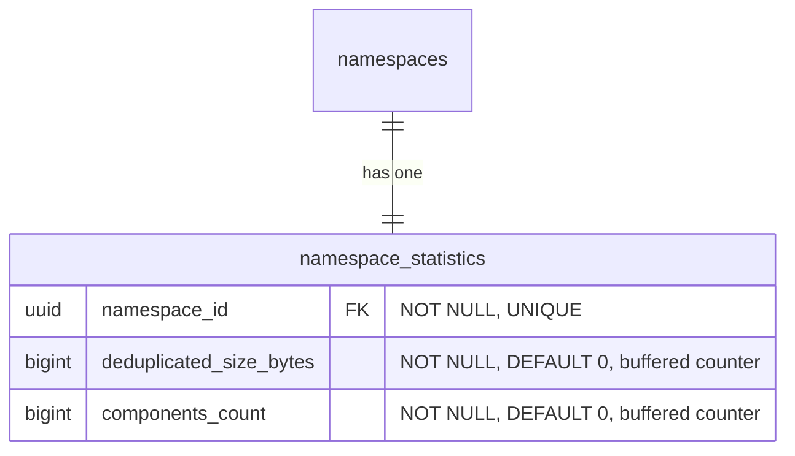

- **namespace_statistics**: バッファカウンター（非同期フラッシャー）を介して維持される、事前計算されたネームスペースレベルのカウンターを保存します。これは、表示パスと課金システムが読み取るテーブルであり、サブミリ秒のレスポンスを提供します（[ベンチマーク表](#namespace-level-storage-accounting-reconciliation) を参照）。[調整メカニズム](#namespace-level-storage-accounting-reconciliation) は、ドリフトが疑われるときにこれらのカウンターを検証・修正するために存在します。
  - `deduplicated_size_bytes`: ネームスペースが使用する合計ストレージで、blob の重複排除がすでに適用されています（[ADR-002](002_storage_deduplication_scope.md) を参照）。このカラムは、将来の生サイズや論理サイズのメトリクスと区別するために、将来の互換性を持たせるべく（`size_bytes` ではなく）このように命名されています。
  - `components_count`: ネームスペースのホスト型およびリモート型リポジトリに保存されたアーティファクトバージョンの合計数:
    - Container: `container_manifests` + `container_remote_manifests`。
    - Maven: `maven_versions` + `maven_remote_versions`。
    - npm: `npm_versions` + `npm_remote_versions`。

    ソフト削除された行は、[ソフト削除ウィンドウ](010_data_retention.md#soft-delete) が期限切れになった後にガベージコレクションがハード削除するまでカウントされ続けます。これは `deduplicated_size_bytes` と一致します。これは、ガベージコレクションが基となる blob を回収するまで、ソフト削除されたアーティファクトのバイトを保持します。仮想リポジトリは、独自のバージョンテーブルを持たないため、別途カウントされません。仮想リポジトリは上流の順序付きリストを通じてリクエストを解決し（[`container_virtual_repository_upstreams`](#virtual-container-repositories) とその Maven および npm の同等のものを参照）、各上流はそれ自体がホスト型またはリモート型のリポジトリであり、そのバージョンは上記のテーブルを介してすでに含まれています。その上で仮想リポジトリをカウントすると、その上流を二重カウントすることになります。これは消費ベースの価格設定とメータリングのためのネームスペースレベルの次元であり、`deduplicated_size_bytes` を補完します。ストレージ使用量とともにネームスペース概要に表示されます。

#### ネームスペースレベルのストレージ会計の調整 {#namespace-level-storage-accounting-reconciliation}

`namespace_statistics.deduplicated_size_bytes` カウンターとリポジトリレベルの `repositories.size_bytes` カウンターは、サブミリ秒の読み取りで表示パスを提供します。しかし、2 つの調整シナリオでは、キャッシュされたカウンターではなくソースデータから正確なストレージを計算する必要があります。

1. **オンデマンドの検証**: 顧客が「私の課金は正確か?」と尋ね、私たちはソースデータからネームスペースの正確なストレージを計算する必要があります。これは、すべての 64 個の `sha256` パーティションにわたる `SUM(size) FROM blob_storage_blobs WHERE namespace_id = ?` を意味します。
2. **ドリフトの修正**: 失敗した GC 実行、部分的なフラッシュ、またはその他のイベントがキャッシュされたカウンターを非同期化し、私たちはそれを修正するために正確な値を再計算する必要があります。

`blob_storage_blobs` は `HASH(sha256)` でパーティショニングされているため、任意の `namespace_id` のみのクエリは 64 パーティションすべてにファンアウトします。CloudSQL PostgreSQL 18 インスタンス上の [ベンチマーク](https://gitlab.com/gitlab-com/content-sites/handbook/-/merge_requests/18456#note_3166018048)（[シード](https://gitlab.com/jdrpereira/artifact-registry-poc/-/tree/main/cmd/seed) されたデータセット: 64 個の `sha256` パーティションにわたる約 160 万個の blob、Zipf 分布の blob 所有権を持つ 50 万のネームスペース、blob が最も重いネームスペースは 35.3 万個の blob）は、最も重いネームスペースについてベースラインで 78 ms と約 3K+ のバッファヒットを示しています。2 つの加算的な保険ポリシーがこれを改善できます。

**オプション A — `blob_storage_blobs` のカバリングインデックス**: 各パーティションの既存の `namespace_id` インデックスに `INCLUDE (size)` を追加します。これは 64 パーティションのファンアウトを、最小限またはゼロのヒープフェッチで 64 個のインデックスオンリースキャンに変えます。スペースのオーバーヘッドは無視できます（既存のインデックスのリーフページに `size` カラムが追加されるだけです）。

**オプション B — ネームスペースパーティショニングされたシャドウテーブル**: `HASH(namespace_id)` で 64 パーティションにパーティショニングされ、`blob_storage_blobs` の `AFTER INSERT`/`DELETE` トリガーを介して維持される専用の `blob_storage_blobs_by_namespace` テーブルです。これは調整クエリを単一パーティションのインデックスオンリースキャンに折りたたみます。スペースのオーバーヘッドは中程度です（blob データの最小サブセット — `namespace_id`、`sha256`、`size` — を 64 個の新しいパーティションとインデックスにわたって複製し、blob 数に比例して線形に成長します）。トレードオフは、すべての blob の `INSERT`/`DELETE` での書き込み増幅ですが、調整負荷をメインの `blob_storage_blobs` テーブル（ホットパス）から遠ざけます。

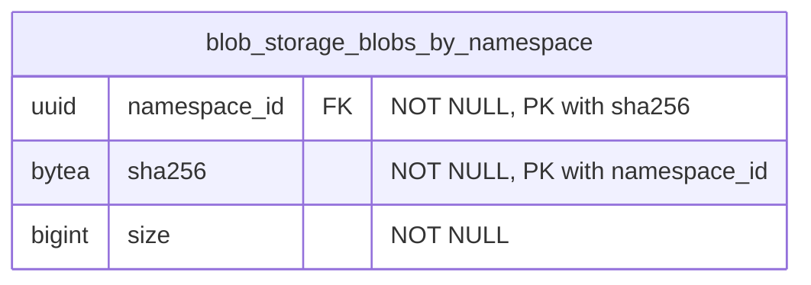

`blob_storage_blobs` のトリガーがこのテーブルを維持します。`AFTER INSERT` は `(namespace_id, sha256, size)` をシャドウテーブルにコピーし、`AFTER DELETE` は一致する行を削除します。`AFTER UPDATE` トリガーは不要です。`blob_storage_blobs` の行は不変だからです。コンテンツアドレス可能なストレージは、コンテンツへの変更が新しい `sha256`、したがって新しい行を生成することを意味します（[ADR-008](008_content_addressable_storage.md) を参照）。主キー `(namespace_id, sha256)` はパーティションキー（`namespace_id`）を含まなければならず、`blob_storage_blobs` のユニークキーを反映します。テーブルは他の `HASH(namespace_id)` テーブルと同じ 64 パーティション数を使用します。`(namespace_id) INCLUDE (size)` のカバリングインデックスがインデックスオンリースキャンを可能にします。

| アプローチ | タイミング | バッファ | スキャンされたパーティション | 書き込みオーバーヘッド |
|---|---|---|---|---|
| `namespace_statistics` カウンター（表示パス） | 0.013 ms | 1 | 0 | 非同期フラッシャー |
| シャドウテーブル + カバリングインデックス（オプション B） | 29 ms | 1,361 | 1 | トリガー |
| blob のカバリングインデックス（オプション A） | 43 ms | 1,599 | 64 | なし |
| ベースライン（変更なし） | 78 ms | ~3K+ | 64 | なし |

両方のオプションは純粋に加算的であり（`blob_storage_blobs` 自体への変更なし）、独立して追加または削除できます。相互排他的ではありません。両方とも初期スキーマに含まれます。より多くのカバレッジで始めて、本番メトリクスが不要だと確認したら後でインデックスや補助テーブルを削除する方が簡単です。

#### ネームスペースレベルのコンポーネント数の調整 {#namespace-level-component-count-reconciliation}

`namespace_statistics.components_count` カウンターは、表示パスとメータリングパイプラインを提供します。ストレージカウンターと同様に、2 つのシナリオでソースデータから正確な値を再計算する必要があります。

1. **オンデマンドの検証**: 顧客（または課金）がコンポーネント数が正確かどうかを尋ね、私たちはそれをソース行から導出する必要があります。
2. **ドリフトの修正**: 失敗したフラッシュ、部分的なバッファ損失、またはバックグラウンドジョブのバグがカウンターを非同期化し、私たちはそれを再計算する必要があります。

調整は、ネームスペースの行にスコープされた 6 つの独立したカウントを合計します。3 つのホスト型（`container_manifests`、`maven_versions`、`npm_versions`）と 3 つのリモート型（`container_remote_manifests`、`maven_remote_versions`、`npm_remote_versions`）です。再計算された値が `components_count` が追跡するものと一致するように、ソフト削除された行も含まれます（挿入はインクリメント、ガベージコレクションのハード削除はデクリメント、ソフト削除と復元は no-op）。

```sql
SELECT
  (SELECT COUNT(*) FROM container_manifests        WHERE namespace_id = $1)
+ (SELECT COUNT(*) FROM container_remote_manifests WHERE namespace_id = $1)
+ (SELECT COUNT(*) FROM maven_versions             WHERE namespace_id = $1)
+ (SELECT COUNT(*) FROM maven_remote_versions      WHERE namespace_id = $1)
+ (SELECT COUNT(*) FROM npm_versions               WHERE namespace_id = $1)
+ (SELECT COUNT(*) FROM npm_remote_versions        WHERE namespace_id = $1)
  AS components_count;
```

各サブクエリは単一のソーステーブルでの `namespace_id` によるカウントであり、`soft_deleted_at` 述語はありません。そのため、テーブルにまだある行（ライブ + [ソフト削除ウィンドウ](010_data_retention.md#soft-delete) 内のソフト削除されたもの）が `components_count` が追跡するものと一致します。4 つのパーティショニングされたソーステーブル（`container_manifests`、`container_remote_manifests`、`maven_remote_versions`、`npm_remote_versions`）は単一の `HASH(namespace_id)` パーティションにプルーニングされます。2 つの非パーティショニングの中間層テーブル（`maven_versions`、`npm_versions`）は、ネームスペースの行についてテーブル全体をスキャンします。既存の部分ユニークインデックス（`WHERE soft_deleted_at IS NULL`）はライブ行のみをカバーするため、カウントを直接満たすことはできません。ネームスペースごとのカーディナリティはデータモデルによって境界づけられ（バージョンごとに 1 行、ファイルや blob 参照ごとではない）、調整は頻繁ではない（オンデマンドまたはドリフト修正であり、ホットパスではない）ため、境界のあるスキャンは許容できます。追加の保険ポリシー（カバリングインデックスやシャドウテーブル）は導入されません。本番メトリクスがこれが遅すぎることを示した場合、各ソーステーブルの非部分的な `(namespace_id)` インデックスが、シャドウテーブルを検討する前の最も安価な次のステップです。

### インデックス {#indexes}

- **`blob_storage_blobs`**: `(namespace_id, sha256)` に対するユニークインデックス — 重複排除を強制し、Organization 内で sha256 によって blob の存在を確認します。この制約はパーティションキー（`sha256`）を含むため、PostgreSQL はすべてのハッシュパーティションにわたって正しく強制します。`(namespace_id) INCLUDE (size)` のカバリングインデックス — ヒープフェッチなしで [ネームスペースレベルのストレージ会計の調整](#namespace-level-storage-accounting-reconciliation) のためのインデックスオンリースキャンを可能にします。
- **`blob_storage_attachments`**: `(namespace_id, sha256)` に対するインデックス — blob のコンテンツハッシュが与えられたときにアタッチメントの存在を確認します（[クリーンアッププロセス](#cleanup-tasks) が孤立チェックに使用）。
- **`blob_storage_blobs_by_namespace`**: `(namespace_id, sha256)` に対する主キー — `blob_storage_blobs` 行との 1:1 対応を強制します。`(namespace_id) INCLUDE (size)` のカバリングインデックス — [ネームスペースレベルのストレージ会計の調整](#namespace-level-storage-accounting-reconciliation) のための単一パーティションのインデックスオンリースキャンを可能にします。
- **`namespace_statistics`**: `(namespace_id)` に対するユニークインデックス — ネームスペースごとに 1 つの統計レコード。

ハッシュパーティショニングされたテーブルでは、インデックスはパーティションごとにローカルです。インデックス操作は単一のパーティションにスコープされ、テーブル全体をロックしません。

### blob ストレージのクエリ例 {#blob-storage-query-examples}

- アーティファクトをプルする（読み取りパスのショートカット: `*_files` → `blob_storage_blobs`、アタッチメントをスキップ — 1 パーティション）

  ```sql
  SELECT bsb.object_storage_key, bsb.size
  FROM maven_files mf
  JOIN blob_storage_blobs bsb ON bsb.namespace_id = mf.namespace_id AND bsb.sha256 = mf.blob_sha256
  WHERE mf.namespace_id = '018f4d6f-0e10-7e3a-9bfd-23a4c5d6e7f8' AND mf.maven_version_id = 456 AND mf.file_name = 'myapp-1.0.0.jar'
    AND mf.soft_deleted_at IS NULL;
  ```

- blob アップロード時の重複排除アップサート（1 パーティション、レースなし）

  ```sql
  INSERT INTO blob_storage_blobs (namespace_id, sha256, size, object_storage_key, metadata_sha1)
  VALUES ('018f4d6f-0e10-7e3a-9bfd-23a4c5d6e7f8', 'abcd1234efgh5678...'::bytea, 1048576, 'artifact_registry/.../objects/ab/cd/abcd1234efgh5678...', NULL)
  ON CONFLICT (namespace_id, sha256) DO NOTHING
  RETURNING id, sha256;
  ```

- Organization 内で sha256 によって blob の存在を確認する（1 パーティション）

  ```sql
  SELECT 1 AS one
  FROM blob_storage_blobs
  WHERE namespace_id = '018f4d6f-0e10-7e3a-9bfd-23a4c5d6e7f8' AND sha256 = 'abcd1234efgh5678...'::bytea
  LIMIT 1;
  ```

- 孤立チェック: この blob はまだいずれかのアタッチメントから参照されているか?（1 パーティション）

  ```sql
  SELECT 1 AS one
  FROM blob_storage_attachments
  WHERE namespace_id = '018f4d6f-0e10-7e3a-9bfd-23a4c5d6e7f8' AND sha256 = 'abcd1234efgh5678...'::bytea
  LIMIT 1;
  ```

- blob のカバリングインデックス（オプション A）を介したストレージ会計の調整: ソースデータからネームスペースの正確なストレージを計算する（64 パーティション、インデックスオンリースキャン）

  ```sql
  SELECT SUM(size) AS total_size_bytes
  FROM blob_storage_blobs
  WHERE namespace_id = 123;
  ```

- シャドウテーブル（オプション B）を介したストレージ会計の調整: ネームスペースの正確なストレージを計算する（1 パーティション、インデックスオンリースキャン）

  ```sql
  SELECT SUM(size) AS total_size_bytes
  FROM blob_storage_blobs_by_namespace
  WHERE namespace_id = 123;
  ```

- 表示パス: 事前計算されたネームスペースカウンターを読み取る（単一行検索）

  ```sql
  SELECT deduplicated_size_bytes, components_count
  FROM namespace_statistics
  WHERE namespace_id = 123;
  ```

## 帰結 {#consequences}

### ポジティブ {#positive}

1. **各アーティファクトフォーマットに合わせたデータ構成**: 各アーティファクトフォーマットに専用のテーブルを使用することで、テーブル構成に最大の柔軟性が得られます。フォーマットプロトコルが要求する任意の数の追加カラムを持つことができます。すでに専用のテーブルを使用しているため、追加の補助テーブルは不要です。

2. **各フォーマットのデータテーブルは関連する使用パターンを持つ**: 各フォーマット専用のテーブルは、REST および GraphQL API と関連するアーティファクト管理クライアントから使用パターンを受け取ります。これにより、他のフォーマットの使用パターンからの分離が提供されます。

3. **フォーマット関連データのパフォーマンスの分離**: 特定のアーティファクトフォーマットのテーブルでのパフォーマンスのボトルネックは、他のフォーマットに即時の影響を与えません。

4. **透過的なオブジェクトストレージのクリーンアップ**: [オブジェクトストレージのクリーンアップタスク](#cleanup-tasks) が [blob ストレージ](#blob-storage) ドメインに集約されているため、親ドメイン（この場合は各フォーマット固有のドメイン）はこの部分を扱う必要がありません。さらに、このクリーンアップは削除操作がどのように発生したか（単一要素の破棄、一括破棄、選択された要素のセットに対して破棄を実行するバックグラウンドクリーンアップポリシー）に影響されません。

5. **blob ストレージの分離が再利用性を提供する**: blob ストレージテーブルは、ここで記述する Artifact Registry 機能に縛られません。したがって、この部分は他の領域でのファイルアップロードのニーズに再利用できます。

6. **効率的なストレージ会計**: Organization スコープの重複排除と Organization ごとの重複排除された blob レコードにより、ストレージ使用量クエリは単純かつ効率的です。注意: `sha256` ベースのパーティショニングでは、Organization レベルの集約は 64 パーティションすべてをスキャンします。これは、遅延インクリメントを介して更新される専用のロールアップテーブルによって緩和されます（[パーティショニング戦略](#blob-storage-partitioning-strategy) を参照）。

7. **統一されたクロスフォーマットの一覧表示**: 親の `repositories` テーブルは、ネームスペース内のすべてのフォーマットと種類（ホスト型、仮想型、リモート型）にわたるすべてのリポジトリを一覧表示する単一のソースを提供し、複数のテーブルにわたる `UNION ALL` なしにランディングページのハイブリッドリストを支えます。

8. **スタンドアロンのリモートリポジトリが共有を可能にする**: 独自のライフサイクルを持つスタンドアロンエンティティとしてのリモートリポジトリは、複数の仮想リポジトリ間で共有でき、設定とキャッシュエントリの重複を減らします。

### ネガティブ {#negative}

1. **クロスフォーマットの詳細クエリは依然として JOIN を必要とする**: 親の `repositories` テーブルはランディングページの一覧表示ユースケースを解決しますが、フォーマット固有の詳細（例: コンテナイメージ、Maven パッケージ）へのアクセスには依然としてフォーマット固有のテーブルへの JOIN が必要です。

2. **blob ストレージのための集約されたテーブル**: これは 2 つの欠点をもたらします。第一に、これらのテーブルには非常に大量の行が存在します。この状況に対処するには慎重なテーブル設計が必要です。第二に、これらのテーブルの問題（テーブル全体のロックなど）は、すべてのアーティファクトタイプに潜在的に影響します。

3. **リポジトリごとのストレージ帰属は JOIN を必要とする**: リポジトリレベルでの正確なストレージ使用量の帰属は、フォーマット固有のテーブルから `blob_storage_attachments` を通じて `blob_storage_blobs` への JOIN を通じて導出されます。これは blob ストレージを汎用的かつ重複排除された状態に保ちますが、非正規化されたリポジトリごとのカウンターと比べていくらかの複雑さを追加します。

4. **2 ステップのリポジトリ作成**: リポジトリの作成には、親の `repositories` テーブルとフォーマット固有のテーブルの両方への挿入が必要です。これは単一テーブルへの挿入と比べてトランザクションの複雑さを追加します。

## 代替案 {#alternatives}

### 共通データの集約 {#centralize-common-data}

ここでの異なるアプローチは、アーティファクトフォーマット領域のすべての共通データを共通の集約されたテーブルに保存することです。

これは、複数のソースを一緒に JOIN することなくそれらのクエリに答えられるため、混在するアーティファクトフォーマットのデータアクセスに非常に役立ちます。

このアプローチは [Package Registry 機能](https://docs.gitlab.com/user/packages/package_registry/) ですでに使用されており、この執筆時点で、それらの共通テーブルは予想どおり大量の行を持つだけでなく、大量の特化したインデックスも持っています。これらのインデックスのそれぞれは、アーティファクトフォーマットに固有のアクセスパターンをサポートします。インデックスの量が今日かなり多いため、新しいインデックスを追加すること（例えば Package Registry 機能に新しいフォーマットサポートが追加される場合）は、より多くの精査や反対さえも受けることになります。

さらに、各アーティファクトフォーマットには保存する必要のある固有のデータがあります（例: 正規化されたパッケージ名）。この固有のデータは、一部の行だけが使用するカラムを作ることになるため、共通テーブルには保存できません。これはいくつかの補助テーブルの作成につながります。これらの補助テーブルは、特定のアーティファクトタイプのアクセスパターンに必要な JOIN の量を増加させます。

`repositories` 親テーブルの導入は、このアプローチの限定版を採用しています。一覧表示とフィルタリングに必要なクロスフォーマットメタデータ（名前、可視性、フォーマット、種類、カウンター）のみが集約されます。フォーマット固有のデータは専用のテーブルに残り、上記で記述したインデックスの増殖と補助テーブルの問題を回避します。

## 参考文献 {#references}

- [ADR-001: アンカーポイントとしての Organization](001_organizations_as_anchor_point.md) - レジストリが Organization にアンカーする理由
- [ADR-002: ストレージ重複排除のスコープ](002_storage_deduplication_scope.md) - 重複排除スコープに関する詳細な決定
<!-- - [ADR-010: データ保持](010_data_retention.md) - ソフト削除と blob クリーンアップのタイミングを含む保持ポリシー -->
- [Package Registry の共通テーブルの分解](https://gitlab.com/groups/gitlab-org/-/work_items/16000) - 共通のアーティファクト関連データを中央テーブルに保存する際に直面する問題の詳細。
