<!-- Design Documents often contain forward-looking statements -->
<!-- vale gitlab.FutureTense = NO -->

## 背景

Artifact Registry は次の点を考慮したデータベース構成を必要とします。

- **異なるアクセスパターン**: アーティファクト管理クライアントは独自のプロトコルを使用し、それらはフォーマット間で大きく異なります。
- **スケーラビリティ**: アーティファクトストレージはすぐに数百万行に達する可能性があります。
- **パフォーマンス**: 上記の 2 点を踏まえても、操作の大部分を占める読み取りクエリで高速な実行時間を維持したいです。
- **過去の落とし穴**: 現在のコンテナレジストリとパッケージレジストリのデータ構成にはほころびが見え始めており（[例](https://gitlab.com/groups/gitlab-org/-/work_items/16000)、[例](https://gitlab.com/groups/gitlab-org/-/epics/9415)）、ここではそれを回避します。

決定に踏み込む前に、以下のスキーマに関するいくつかの注意点を述べます。これらは主に、提示するテーブルの量を踏まえた可読性向上のためです。

- 本ドキュメントは機能のコアテーブルを記述します。サブ機能には追加のテーブルが必要ですが、ここでは記述しません。例えば、Blob ストレージのクリーンアップに必要な補助テーブルの背景については [Cleanup tasks](#cleanup-tasks) を参照してください。
- 可読性のためにテーブル名を短縮しています。これらはここに示されていない共通の接頭辞を共有します（例: `artifacts_registry_container_repositories`）。
- Artifact Registry は namespace にスコープされます。理由は [ADR-001](001_organizations_as_anchor_point.md) を参照してください。
- プライマリキーやタイムスタンプといういくつかの共通カラムは、明確化のため省略されています。
- すべてのテーブルに `namespace_id` カラムが含まれます。[Cells シャーディングキー要件](https://docs.gitlab.com/ee/development/database/multiple_databases/#guidelines-on-choosing-a-sharding-key) はサテライトサービスデータベースには適用されません。行は namespace のアンカータプル（`anchor_vendor`、`anchor_type`、`anchor_id`）を介して間接的に Organization に按分されます。このカラムは以下のすべてのテーブル定義で明示的に示されています。
- すべての `jsonb` カラムは、無制限のペイロードを防ぎ期待される構造を強制するため、永続化前に厳格な JSON スキーマに対して検証する必要があります。これは本ドキュメント内のすべての `jsonb` カラム（例: `rule_configuration` および `package_json`）に適用されます。
- テーブルが複数の暗号化された認証情報カラム（例: リモートリポジトリテーブルの `encrypted_username` と `encrypted_password`）を持つ場合、CHECK 制約により、すべての認証情報カラムが設定されているか、すべて設定されていないかのどちらかを強制する必要があります。部分的な認証情報（例: パスワードなしのユーザー名）は受け入れません。
- デプロイメントモデルにかかわらず、すべての `id` カラムは Artifact Registry インスタンス（例: `artifact-registry.gitlab.com`）のスコープ内で一意でなければなりません。単一データベースデプロイメントではこれは自明（シーケンス）です。マルチセルローカルデプロイメントでは、Topology サービスまたは UUID を介して一意性を確保できます。複数のシャード／セルラーデータベースを持つグローバルサービスでは、戦略は選択されたシャーディングまたはセルラーアーキテクチャに依存します。

## 決定

データには 6 つの領域があります。

- [Namespace テーブル](#namespaces). Artifact Registry を外部識別子から切り離すため、不変なスラグと仮想アンカータプルを持つ内部 namespace エンティティを導入します。完全な根拠については [ADR-022](022_namespace_decoupling.md) を参照してください。
- [Workspace テーブル](#workspaces). Namespace 内のリポジトリの論理的グルーピング。スキーマには初日から存在しますが、ユーザーにはまだ表面化されません。すべての namespace は「default」ワークスペースを取得し、すべてのリポジトリが自動的にそれに割り当てられます。
- Namespace レベルのテーブル。これらは namespace に直接スコープされた [ライフサイクルポリシーの設定とルール](#lifecycle-policies) を扱います。
- [Repositories 親テーブル](#repositories). すべてのフォーマットにわたるすべてのリポジトリ（ローカル、仮想、リモート）の統一レジストリ。ランディングページのハイブリッドリストとフォーマット横断クエリを支えます。
- アーティファクトフォーマットレベルのテーブル。各フォーマット用の専用テーブルがあります: ローカルリポジトリ（[Container](#container-repositories)、[Maven](#maven-repositories)、[NPM](#npm-repositories)）、リモートリポジトリ（[Container](#container-remote-repositories)、[Maven](#maven-remote-repositories)、[NPM](#npm-remote-repositories)）、仮想リポジトリ（[Container](#virtual-container-repositories)、[Maven](#maven-virtual-repositories)、[NPM](#npm-virtual-repositories)）。各々は `repository_id` を介して親 `repositories` テーブルを参照します。
- [Blob ストレージレベルテーブル](#blob-storage). 実際のストレージメタデータと[進行中のアップロードセッション追跡](#upload-sessions)を扱います。

### Namespaces

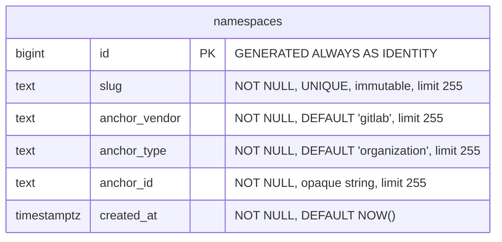
```mermaid
erDiagram
    namespaces {
        bigint id PK "GENERATED ALWAYS AS IDENTITY"
        text slug "NOT NULL, UNIQUE, immutable, limit 255"
        text anchor_vendor "NOT NULL, DEFAULT 'gitlab', limit 255"
        text anchor_type "NOT NULL, DEFAULT 'organization', limit 255"
        text anchor_id "NOT NULL, opaque string, limit 255"
        timestamptz created_at "NOT NULL, DEFAULT NOW()"
    }
```

- **namespaces**: 他のすべてのテーブルが `namespace_id` を介して参照するルートエンティティ。各 namespace は、URL とクライアント設定で使用される不変でグローバルに一意な `slug` を持ちます（スラグ設計とグローバル一意性の強制については [ADR-022](022_namespace_decoupling.md) を参照）。`(anchor_vendor, anchor_type, anchor_id)` タプルは、namespace を外部エンティティ（デフォルトでは Organizations）にリンクし、そのセマンティクスを解釈しません。`anchor_id` は、基礎となる値が数値であっても、anchor タイプ間でスキーマを統一するため `TEXT` として保存されます。Organizations v1 では、すべての行が `('gitlab', 'organization', '<rails_org_id>')` を持ちます。

#### インデックス

- **`namespaces`**: `(slug)` のユニークインデックス — スラグで namespace を検索。`(anchor_vendor, anchor_type, anchor_id)` のユニーク制約 — 重複アンカーを防ぐ。

### Workspaces

ワークスペースは、namespace 内のリポジトリの論理的グルーピングで、チーム、セキュリティドメイン、または製品ラインごとにアーティファクトを整理します。注: このコンテキストの「workspace」は、Artifact Registry namespace 内の論理的グルーピングを指し、[GitLab Workspaces](https://docs.gitlab.com/user/workspace/)（クラウドベースの開発環境）とは無関係です。MVP では UI と API でワークスペースを表面化することはスコープ外です。エンティティは前方互換性のためだけに初日から存在します。MVP 中、各 namespace は作成時に単一の「default」ワークスペースを取得し、すべてのリポジトリがそれに割り当てられます。MVP 後にワークスペース概念が表面化されると、ユーザーは追加のワークスペースを作成し、リポジトリを再割り当てできます。

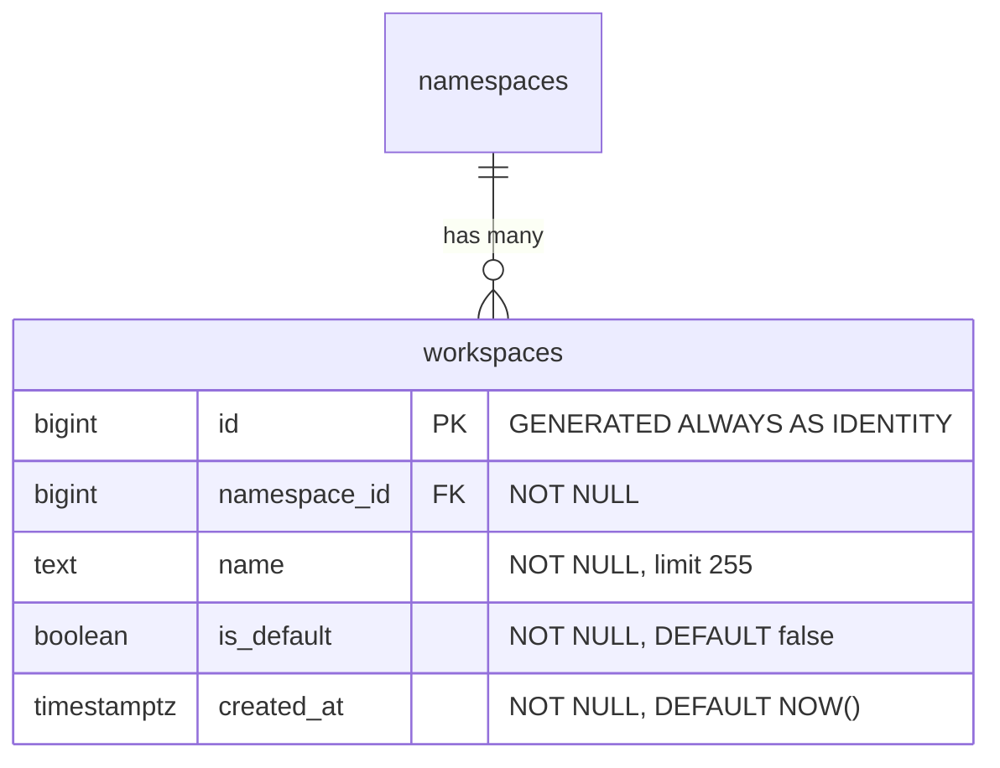
```mermaid
erDiagram
    namespaces ||--o{ workspaces : "has many"

    workspaces {
        bigint id PK "GENERATED ALWAYS AS IDENTITY"
        bigint namespace_id FK "NOT NULL"
        text name "NOT NULL, limit 255"
        boolean is_default "NOT NULL, DEFAULT false"
        timestamptz created_at "NOT NULL, DEFAULT NOW()"
    }
```

- **workspaces**: Namespace 内のリポジトリの論理的グルーピング。`name` は namespace 内で一意な、人間可読のラベル。`is_default` は、各 namespace と一緒に自動作成され MVP 中にすべてのリポジトリが割り当てられるワークスペースをマークします。`HASH(namespace_id)` で 64 パーティションにパーティショニング。

各 namespace 作成時には、デフォルトワークスペース行をアトミックに挿入する必要があります。

```sql
INSERT INTO workspaces (namespace_id, name, is_default)
VALUES (<new_namespace_id>, 'default', true)
ON CONFLICT (namespace_id, name) DO NOTHING;
```

#### インデックス

- **`workspaces`**: `(id, namespace_id)` のプライマリキー — `HASH(namespace_id)` パーティショニングに必要な複合 PK で、`repositories` からの複合外部キーのターゲットとしても機能。`(namespace_id, name)` のユニークインデックス — namespace 内で名前によりワークスペースを検索。`(namespace_id) WHERE is_default IS TRUE` の部分ユニークインデックス — namespace あたり最大 1 つのデフォルトワークスペースを強制。

#### クエリ例

- namespace のデフォルトワークスペースを取得:

  ```sql
  SELECT *
  FROM workspaces
  WHERE namespace_id = 123 AND is_default = true;
  ```

- namespace のすべてのワークスペースをリスト:

  ```sql
  SELECT id, name, is_default, created_at
  FROM workspaces
  WHERE namespace_id = 123
  ORDER BY created_at;
  ```

- 新しい（デフォルトでない）ワークスペースを作成:

  ```sql
  INSERT INTO workspaces (namespace_id, name)
  VALUES (123, 'team-backend');
  ```

### Repositories

`repositories` テーブルは、フォーマットや種別にかかわらずシステム内のすべてのリポジトリを登録する統一された親テーブルです。これはランディングページのハイブリッドリスト（すべてのフォーマットにわたる Local、Virtual、Remote リポジトリを表示する単一のソート可能、フィルタリング可能、ページング可能なビュー）を支えます。各フォーマット固有のリポジトリテーブル（local、virtual、remote）は、`repository_id` を介してここの単一行を参照します。

このモデル（Local、Remote、Virtual を参照によって構成されるピアレベルのスタンドアローンタイプとする）は、JFrog Artifactory、Sonatype Nexus、Google Cloud AR がすべて使用しているものです。

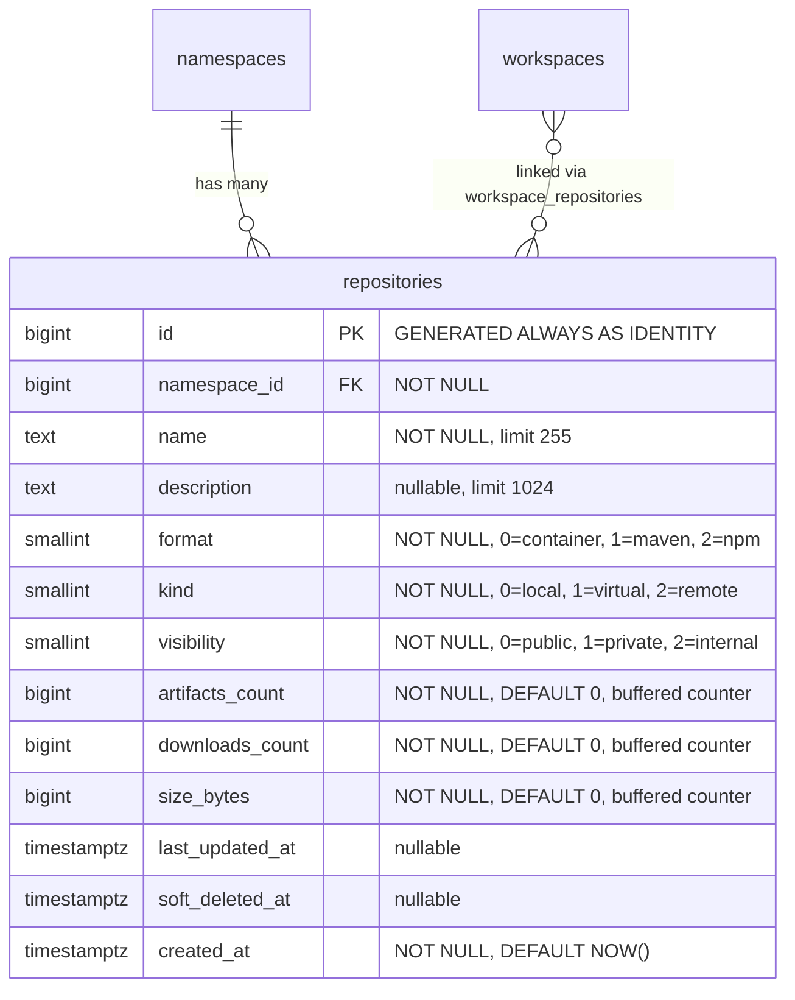
```mermaid
erDiagram
    namespaces ||--o{ repositories : "has many"
    workspaces }o--o{ repositories : "linked via workspace_repositories"

    repositories {
        bigint id PK "GENERATED ALWAYS AS IDENTITY"
        bigint namespace_id FK "NOT NULL"
        text name "NOT NULL, limit 255"
        text description "nullable, limit 1024"
        smallint format "NOT NULL, 0=container, 1=maven, 2=npm"
        smallint kind "NOT NULL, 0=local, 1=virtual, 2=remote"
        smallint visibility "NOT NULL, 0=public, 1=private, 2=internal"
        bigint artifacts_count "NOT NULL, DEFAULT 0, buffered counter"
        bigint downloads_count "NOT NULL, DEFAULT 0, buffered counter"
        bigint size_bytes "NOT NULL, DEFAULT 0, buffered counter"
        timestamptz last_updated_at "nullable"
        timestamptz soft_deleted_at "nullable"
        timestamptz created_at "NOT NULL, DEFAULT NOW()"
    }
```

- **repositories**: すべてのリポジトリの親エンティティ。`format` はアーティファクトフォーマット（container、Maven、npm）を識別。`kind` はリポジトリタイプ（local、virtual、remote）を識別。リポジトリは [`workspace_repositories`](#workspace-repositories) 結合テーブルを介してワークスペースにリンクされ、リポジトリが namespace 内の 1 つ以上のワークスペースに所属できるようにします。MVP 中は、すべてのリポジトリが namespace のデフォルトワークスペースにリンクされます。`name` は namespace 内で一意でなければならず、すべての競合と一致します。カウンターカラム（`artifacts_count`、`downloads_count`、`size_bytes`）は、ホット行の競合を回避するため [バッファ／非同期書き込み](#buffered-and-asynchronous-writes) で維持されます。`last_updated_at` はコンテンツ変更（アーティファクトの公開／変更／削除、キャッシュイベント）を追跡し、ダウンロードは追跡しません。`description` は、UI が仮想だけでなくすべてのリポジトリタイプの説明を表示するため、親にあります。`soft_deleted_at` タイムスタンプは、リポジトリがソフト削除された時を記録し、必要に応じて復元を可能にします。ソフト削除は、すべてのリポジトリタイプ（local、virtual、remote）がフォーマット固有の処理なしに同じ削除セマンティクスを共有できるよう、親テーブルにあります。`HASH(namespace_id)` で 64 パーティションにパーティショニング。

#### インデックス

- **`repositories`**: `(namespace_id, name) WHERE soft_deleted_at IS NULL` のユニークインデックス — namespace 内で名前によりリポジトリを検索。部分条件は、ソフト削除後に同じ名前でリポジトリを再作成できるようにする。`(namespace_id, format) WHERE soft_deleted_at IS NULL` のインデックス — フォーマットでリポジトリをフィルタ。`(namespace_id, kind) WHERE soft_deleted_at IS NULL` のインデックス — 種別でリポジトリをフィルタ。ランディングページのソート可能カラムごとに 1 つのインデックス、すべて `WHERE soft_deleted_at IS NULL` 付き: `(namespace_id, artifacts_count DESC)`、`(namespace_id, downloads_count DESC)`、`(namespace_id, size_bytes DESC)`、`(namespace_id, last_updated_at DESC NULLS LAST)`。

MVP 中、すべてのリポジトリは単一のデフォルトワークスペースにリンクされるため、`(namespace_id, ...)` のソートインデックスは namespace 全体およびワークスペースフィルタリングされたクエリの両方に対応します。MVP 後、namespace が複数のワークスペースを持つようになると、ワークスペースフィルタリングされたクエリは `workspace_repositories` を介して結合します。ワークスペースが表面化されたときに追加のサポートインデックスが評価されます。

#### クエリ例

- 最終更新順で namespace のすべてのリポジトリ（すべてのワークスペース）をリスト:

  ```sql
  SELECT id, name, description, format, kind, artifacts_count,
         downloads_count, size_bytes, last_updated_at
  FROM repositories
  WHERE namespace_id = 123 AND soft_deleted_at IS NULL
  ORDER BY last_updated_at DESC NULLS LAST
  LIMIT 20;
  ```

- 最終更新順で、ワークスペースでフィルタリングされた namespace のリポジトリをリスト:

  ```sql
  SELECT r.id, r.name, r.description, r.format, r.kind, r.artifacts_count,
         r.downloads_count, r.size_bytes, r.last_updated_at
  FROM repositories r
  JOIN workspace_repositories wr
    ON wr.namespace_id = r.namespace_id AND wr.repository_id = r.id
  WHERE r.namespace_id = 123 AND wr.workspace_id = 456 AND r.soft_deleted_at IS NULL
  ORDER BY r.last_updated_at DESC NULLS LAST
  LIMIT 20;
  ```

- ワークスペースとフォーマットでフィルタリングされたリポジトリをリスト:

  ```sql
  SELECT r.id, r.name, r.description, r.format, r.kind, r.artifacts_count,
         r.downloads_count, r.size_bytes, r.last_updated_at
  FROM repositories r
  JOIN workspace_repositories wr
    ON wr.namespace_id = r.namespace_id AND wr.repository_id = r.id
  WHERE r.namespace_id = 123 AND wr.workspace_id = 456 AND r.format = 0
    AND r.soft_deleted_at IS NULL
  ORDER BY r.name
  LIMIT 20;
  ```

- 名前で単一リポジトリを検索:

  ```sql
  SELECT *
  FROM repositories
  WHERE namespace_id = 123 AND name = 'my-repo' AND soft_deleted_at IS NULL;
  ```

### Workspace repositories {#workspace-repositories}

`workspace_repositories` 結合テーブルは、リポジトリを所属するワークスペースにマッピングします。リポジトリは namespace 内の 1 つ以上のワークスペースのメンバーになることができ、複数のチームのワークスペースを通じて共通のユーティリティリポジトリを表面化するなどの共有アクセスシナリオを可能にします。

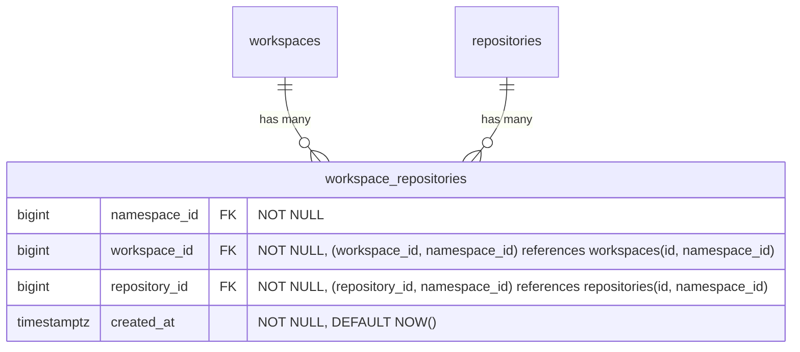
```mermaid
erDiagram
    workspaces ||--o{ workspace_repositories : "has many"
    repositories ||--o{ workspace_repositories : "has many"

    workspace_repositories {
        bigint namespace_id FK "NOT NULL"
        bigint workspace_id FK "NOT NULL, (workspace_id, namespace_id) references workspaces(id, namespace_id)"
        bigint repository_id FK "NOT NULL, (repository_id, namespace_id) references repositories(id, namespace_id)"
        timestamptz created_at "NOT NULL, DEFAULT NOW()"
    }
```

- **workspace_repositories**: リポジトリをワークスペースにリンクします。MVP 中、各リポジトリはちょうど 1 つのワークスペース（namespace のデフォルト）にリンクされますが、スキーマは複数のリンクを許可しているため、MVP 後にリポジトリをワークスペース間で共有できます。アプリケーションは、すべてのリポジトリが少なくとも 1 つのワークスペースリンクを持つという不変条件を強制します — Postgres はこれを宣言的に表現できません。複合 FK は、ワークスペースとリポジトリが同じ namespace 内でのみリンクできることを確保します。`HASH(namespace_id)` で 64 パーティションにパーティショニング。

#### インデックス

- **`workspace_repositories`**: `(namespace_id, workspace_id, repository_id)` のプライマリキー — リンクの一意性を強制し、ワークスペース別の検索に対応。`(namespace_id, repository_id)` のインデックス — 指定されたリポジトリが所属するすべてのワークスペースを検索。

#### クエリ例

- リポジトリが所属するすべてのワークスペースをリスト:

  ```sql
  SELECT workspace_id
  FROM workspace_repositories
  WHERE namespace_id = 123 AND repository_id = 789;
  ```

- リポジトリをワークスペースにリンク:

  ```sql
  INSERT INTO workspace_repositories (namespace_id, workspace_id, repository_id)
  VALUES (123, 456, 789)
  ON CONFLICT (namespace_id, workspace_id, repository_id) DO NOTHING;
  ```

### ライフサイクルポリシー {#lifecycle-policies}

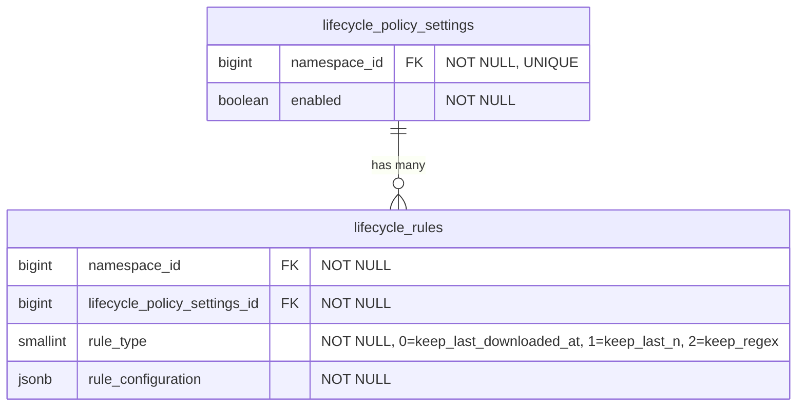
```mermaid
erDiagram
    lifecycle_policy_settings ||--o{ lifecycle_rules : "has many"

    lifecycle_policy_settings {
        bigint namespace_id FK "NOT NULL, UNIQUE"
        boolean enabled "NOT NULL"
    }

    lifecycle_rules {
        bigint namespace_id FK "NOT NULL"
        bigint lifecycle_policy_settings_id FK "NOT NULL"
        smallint rule_type "NOT NULL, 0=keep_last_downloaded_at, 1=keep_last_n, 2=keep_regex"
        jsonb rule_configuration "NOT NULL"
    }
```

- **lifecycle_policy_settings**: Namespace レベルでライフサイクル管理構成を定義し、すべてのリポジトリのデフォルトポリシーとして機能。有効化されると、関連するライフサイクルルールが namespace 全体に適用されます。これらのポリシーはリポジトリレベルポリシーで [オーバーライド](#repository-level-overrides) できます。
- **lifecycle_rules**: Namespace レベルで特定のアーティファクトライフサイクル動作を管理する個別の保持・クリーンアップルールを指定。これらのルールは、リポジトリレベルで [オーバーライド](#repository-level-overrides) されない限り、すべてのリポジトリに適用されます。ルール評価中のパフォーマンス劣化を防ぐため、ポリシーレコードあたりのライフサイクルルール数は制限されます。例えば、ユーザーは特定のアーティファクトをどれくらいの期間保持するか（例: Maven snapshot ファイルは 1 ヶ月だけ保持）を指定するために使用します。

#### インデックス

- **`lifecycle_policy_settings`**: `(namespace_id)` のユニークインデックス — namespace あたり 1 つのポリシー設定レコード。
- **`lifecycle_rules`**: `(namespace_id, lifecycle_policy_settings_id)` のインデックス — 指定されたポリシーのすべてのルールを取得。

リポジトリレベルのオーバーライドテーブルは同じパターンに従います: 設定テーブル用に `(namespace_id, repository_id)` のユニークインデックスと、ルールテーブル用に `(namespace_id, <format>_repository_lifecycle_policy_settings_id)` のインデックス。

#### クエリ例

- 指定された namespace のポリシーを取得

  ```sql
  SELECT lp.*
  FROM lifecycle_policy_settings lp
  WHERE lp.namespace_id = 123;
  ```

- 指定されたアーティファクトリポジトリのポリシーを取得

  ```sql
  SELECT *
  FROM container_repository_lifecycle_policy_settings
  WHERE container_repository_lifecycle_policy_settings.namespace_id = 123
    AND container_repository_lifecycle_policy_settings.repository_id = 123;
  ```

- 新しいライフサイクルルールを作成

  ```sql
  INSERT INTO lifecycle_rules (namespace_id, lifecycle_policy_settings_id, rule_type, rule_configuration)
  VALUES (123, 123, 1, '{"count": 10}'::jsonb);
  ```

- ライフサイクルルールを更新

  ```sql
  UPDATE lifecycle_rules
  SET rule_configuration = '{"count": 20}'::jsonb
  WHERE namespace_id = 123
    AND id = 123;
  ```

- ライフサイクルルールを破棄

  ```sql
  DELETE FROM lifecycle_rules
  WHERE namespace_id = 123
    AND id = 123;
  ```

#### リポジトリレベルオーバーライド {#repository-level-overrides}

各リポジトリタイプ（[container](#container-repositories)、[maven](#maven-repositories)、[npm](#npm-repositories)）は、namespace レベルの値にオーバーライドを提供する同様の名前のテーブルを持ちます。これにより優先システムが作成されます: namespace（最低）→ Repository（最高）。オーバーライドは `repository_id` を介して親 `repositories` テーブルを参照します。

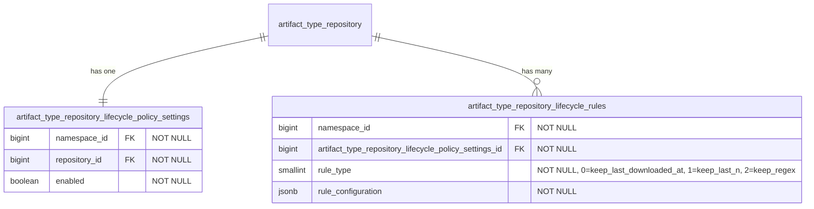
```mermaid
erDiagram
    artifact_type_repository ||--|| artifact_type_repository_lifecycle_policy_settings : "has one"
    artifact_type_repository ||--o{ artifact_type_repository_lifecycle_rules : "has many"

    artifact_type_repository_lifecycle_policy_settings {
        bigint namespace_id FK "NOT NULL"
        bigint repository_id FK "NOT NULL"
        boolean enabled "NOT NULL"
    }

    artifact_type_repository_lifecycle_rules {
        bigint namespace_id FK "NOT NULL"
        bigint artifact_type_repository_lifecycle_policy_settings_id FK "NOT NULL"
        smallint rule_type "NOT NULL, 0=keep_last_downloaded_at, 1=keep_last_n, 2=keep_regex"
        jsonb rule_configuration "NOT NULL"
    }
```

（各アーティファクトフォーマットにオーバーライドテーブルがあるため、`artifact_type` は `container`、`maven`、`npm` に置き換える必要があります。これらのオーバーライドはローカル、仮想、リモートリポジトリにも同じく適用されます — `repository_id` FK は親 `repositories` テーブルを参照し、フォーマット固有のテーブルはリポジトリの `format` カラムによって決定されます。）

これらのテーブルは、いわば [カスケード設定](https://docs.gitlab.com/development/cascading_settings/) として機能します。それらの説明は [namespace レベル](#lifecycle-policies) で同様に名付けられたテーブルとまったく同じです。現在の 2 ティア優先システム（namespace → repository）は、MVP 後にワークスペースが表面化されると 3 ティア（namespace → workspace → repository）に拡張可能です。これには同じパターンに従ってワークスペースレベルのオーバーライドテーブルを追加する必要があり、既存の namespace レベルやリポジトリレベルのテーブルへの変更は不要です。

### Container Repositories {#container-repositories}

ここでの課題は、[OCI Distribution Spec v1.1](https://github.com/opencontainers/distribution-spec/blob/main/spec.md) に準拠することです。

<!--TODO This link will not live for long since it's an artifact output-->
このアプローチは、[GitLab Container Registry スキーマ](https://gitlab.com/gitlab-org/container-registry/-/jobs/12449560500/artifacts/file/db-DAG.png) に大きく着想を得ています。

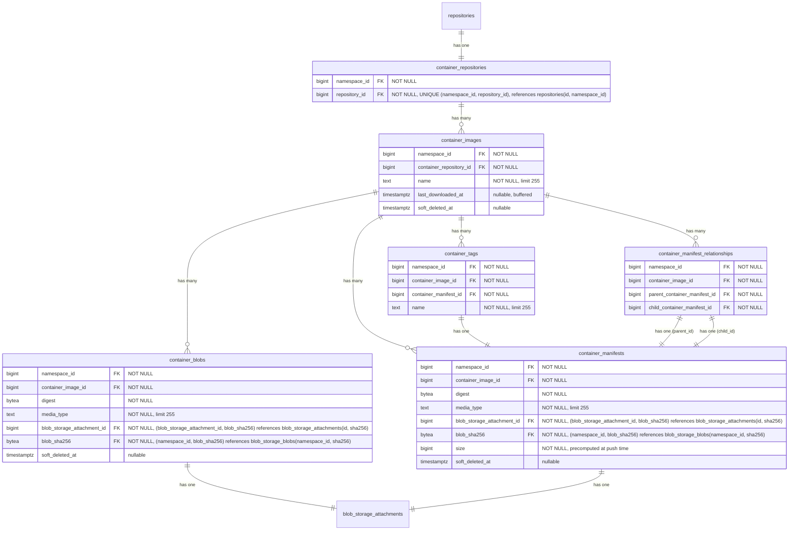
```mermaid
erDiagram
    repositories ||--|| container_repositories : "has one"
    container_repositories ||--o{ container_images : "has many"
    container_images ||--o{ container_blobs : "has many"
    container_images ||--o{ container_manifests : "has many"
    container_images ||--o{ container_manifest_relationships : "has many"
    container_images ||--o{ container_tags : "has many"
    container_tags ||--|| container_manifests : "has one"
    container_blobs ||--|| blob_storage_attachments : "has one"
    container_manifests ||--|| blob_storage_attachments : "has one"
    container_manifest_relationships ||--|| container_manifests : "has one (parent_id)"
    container_manifest_relationships ||--|| container_manifests : "has one (child_id)"

    container_repositories {
        bigint namespace_id FK "NOT NULL"
        bigint repository_id FK "NOT NULL, UNIQUE (namespace_id, repository_id), references repositories(id, namespace_id)"
    }

    container_images {
        bigint namespace_id FK "NOT NULL"
        bigint container_repository_id FK "NOT NULL"
        text name "NOT NULL, limit 255"
        timestamptz last_downloaded_at "nullable, buffered"
        timestamptz soft_deleted_at "nullable"
    }

    container_blobs {
        bigint namespace_id FK "NOT NULL"
        bigint container_image_id FK "NOT NULL"
        bytea digest "NOT NULL"
        text media_type "NOT NULL, limit 255"
        bigint blob_storage_attachment_id FK "NOT NULL, (blob_storage_attachment_id, blob_sha256) references blob_storage_attachments(id, sha256)"
        bytea blob_sha256 FK "NOT NULL, (namespace_id, blob_sha256) references blob_storage_blobs(namespace_id, sha256)"
        timestamptz soft_deleted_at "nullable"
    }

    container_manifests {
        bigint namespace_id FK "NOT NULL"
        bigint container_image_id FK "NOT NULL"
        bytea digest "NOT NULL"
        text media_type "NOT NULL, limit 255"
        bigint blob_storage_attachment_id FK "NOT NULL, (blob_storage_attachment_id, blob_sha256) references blob_storage_attachments(id, sha256)"
        bytea blob_sha256 FK "NOT NULL, (namespace_id, blob_sha256) references blob_storage_blobs(namespace_id, sha256)"
        bigint size "NOT NULL, precomputed at push time"
        timestamptz soft_deleted_at "nullable"
    }

    container_manifest_relationships {
        bigint namespace_id FK "NOT NULL"
        bigint container_image_id FK "NOT NULL"
        bigint parent_container_manifest_id FK "NOT NULL"
        bigint child_container_manifest_id FK "NOT NULL"
    }

    container_tags {
        bigint namespace_id FK "NOT NULL"
        bigint container_image_id FK "NOT NULL"
        bigint container_manifest_id FK "NOT NULL"
        text name "NOT NULL, limit 255"
    }
```

- **container_repositories**: 複数のイメージのコンテナ。各リポジトリは独立したバージョニングを持つ複数のイメージをホストできます。名前、可視性、フォーマット横断クエリのため、`repository_id` を介して親 `repositories` テーブルを参照します。
- **container_images**: リポジトリ内の名前付きコンテナイメージを表します（例: `myapp`、`backend`）。`last_downloaded_at` はイメージが最後にプルされた時を記録し、[バッファ／非同期書き込み](#buffered-and-asynchronous-writes) で維持されます。`keep_last_downloaded_at` ライフサイクルルールが、ダウンロードベース保持を評価するために使用します（[ADR-010](010_data_retention.md)）。`soft_deleted_at` タイムスタンプは、イメージがソフト削除された時を記録し、必要に応じて復元を可能にします。
- **container_blobs**: コンテナイメージを構成する個別のコンテンツアドレッサブルレイヤーと構成オブジェクトを保存します。マニフェストとその構成レイヤー（Blob）の関係は暗黙的で、ランタイムにマニフェストコンテンツを解析することで決定され、データベース外部キーとしてはモデル化されません。`soft_deleted_at` タイムスタンプは、Blob がソフト削除された時を記録し、必要に応じて復元を可能にします。
- **container_manifests**: 特定のイメージバージョンの構成とレイヤーを記述するイメージマニフェストを表します。`size` カラムは、ここをルートとするマニフェストツリーの合計バイトサイズを保持します: このマニフェスト自身のペイロードに加えて、マニフェストリストや OCI インデックスのための任意の子マニフェストを通じて推移的に到達可能なすべての Blob。`soft_deleted_at` タイムスタンプは、マニフェストがソフト削除された時を記録し、必要に応じて復元を可能にします。
- **container_manifest_relationships**: 親マニフェストが他の複数のマニフェストを参照できる Docker マニフェストリストや OCI インデックス（例: マルチアーキテクチャイメージ用）を扱います。
- **container_tags**: 特定のマニフェストを指す人間可読の名前（例: `latest`、`v1.2.3`）を提供します。
- **blob_storage_attachments**: 詳細は [Blob storage](#blob-storage) セクションを参照してください。

`container_blobs` テーブルは、他のコンテナレジストリアーキテクチャが行うようなコンテナレジストリの物理 Blob を直接保存しません。違いは、Blob ストレージが [blob storage](#blob-storage) テーブル（重複排除とガベージコレクションを含む）で扱われることです。したがって、`container_*` レベルでは、`blob_storage_attachments` レコードへの参照を保存するだけで済みます。

#### インデックス

- **`container_repositories`**: `(namespace_id, repository_id)` のユニークインデックス — その親リポジトリ参照によりコンテナリポジトリを検索。
- **`container_images`**: `(namespace_id, container_repository_id, name) WHERE soft_deleted_at IS NULL` のユニークインデックス — イメージ名はリポジトリ内で一意なイメージを識別する。重複は OCI 名前ベースの検索を破壊する。部分条件は、ソフト削除後に同じ名前でイメージを再作成できるようにする。`(namespace_id, container_repository_id, last_downloaded_at NULLS FIRST) WHERE soft_deleted_at IS NULL` のインデックス — `keep_last_downloaded_at` ライフサイクルルール評価をサポート。リポジトリ内のすべてのイメージをスキャンして行ごとにフィルタリングするのではなく、境界のあるレンジスキャンを介して期限切れのイメージのみを返す。`NULLS FIRST` は一度もダウンロードされていないイメージを最も古い行とグループ化するため、両方が同じレンジスキャンで返される。
- **`container_blobs`**: `(namespace_id, container_image_id, digest) WHERE soft_deleted_at IS NULL` のユニークインデックス — Blob ダイジェストはコンテンツアドレッサブル。同じイメージ内の同じダイジェストは定義により同じ Blob。部分条件は、ソフト削除後に同じダイジェストを再プッシュできるようにする。`(namespace_id, blob_storage_attachment_id)` のインデックス — そのストレージアタッチメントにより Blob を検索。
- **`container_manifests`**: `(namespace_id, container_image_id, digest) WHERE soft_deleted_at IS NULL` のユニークインデックス — マニフェストダイジェストはコンテンツアドレッサブル。同じイメージ内の同じダイジェストは定義により同じマニフェスト。部分条件は、ソフト削除後に同じダイジェストを再プッシュできるようにする。`(namespace_id, blob_storage_attachment_id)` のインデックス — そのストレージアタッチメントによりマニフェストを検索。
- **`container_manifest_relationships`**: `(namespace_id, parent_container_manifest_id, child_container_manifest_id)` のユニークインデックス — 重複した親子関係を防ぎ、指定された親マニフェストのすべての子を見つける。`(namespace_id, child_container_manifest_id)` のインデックス — 指定された子マニフェストのすべての親を見つける。`(namespace_id, container_image_id)` のインデックス — 指定されたイメージのすべてのマニフェスト関係を見つける。
- **`container_tags`**: `(namespace_id, container_image_id, name)` のユニークインデックス — イメージ内で名前によりタグを検索。`(namespace_id, container_manifest_id)` のインデックス — 指定されたマニフェストを指すすべてのタグを見つける。

#### クエリ例

- 名前でイメージを取得

  ```sql
  SELECT *
  FROM container_images
  WHERE namespace_id = 123 AND container_repository_id = 123 AND name = 'myapp/backend'
    AND soft_deleted_at IS NULL;
  ```

- リポジトリ ID のダイジェストで Blob を取得

  ```sql
  SELECT cb.*
  FROM container_blobs cb
  JOIN container_images ci
    ON cb.container_image_id = ci.id AND cb.namespace_id = ci.namespace_id
  WHERE ci.namespace_id = 123 AND ci.container_repository_id = 123
    AND cb.digest = 'sha256:abcd1234...'::bytea
    AND ci.soft_deleted_at IS NULL AND cb.soft_deleted_at IS NULL;
  ```

- リポジトリ ID のダイジェストでマニフェストを取得

  ```sql
  SELECT cm.*
  FROM container_manifests cm
  JOIN container_images ci
    ON cm.container_image_id = ci.id AND cm.namespace_id = ci.namespace_id
  WHERE ci.namespace_id = 123 AND ci.container_repository_id = 123
    AND cm.digest = 'sha256:efgh5678...'::bytea
    AND ci.soft_deleted_at IS NULL AND cm.soft_deleted_at IS NULL;
  ```

### Container Remote Repositories {#container-remote-repositories}

リモートリポジトリは、プロキシ・キャッシュできる外部のコンテナレジストリを表します。これらは独自のライフサイクルを持つスタンドアローンエンティティで、複数の仮想リポジトリ間で共有できます。仮想リポジトリのアップストリームから親 `repositories` テーブルを介して参照されます。

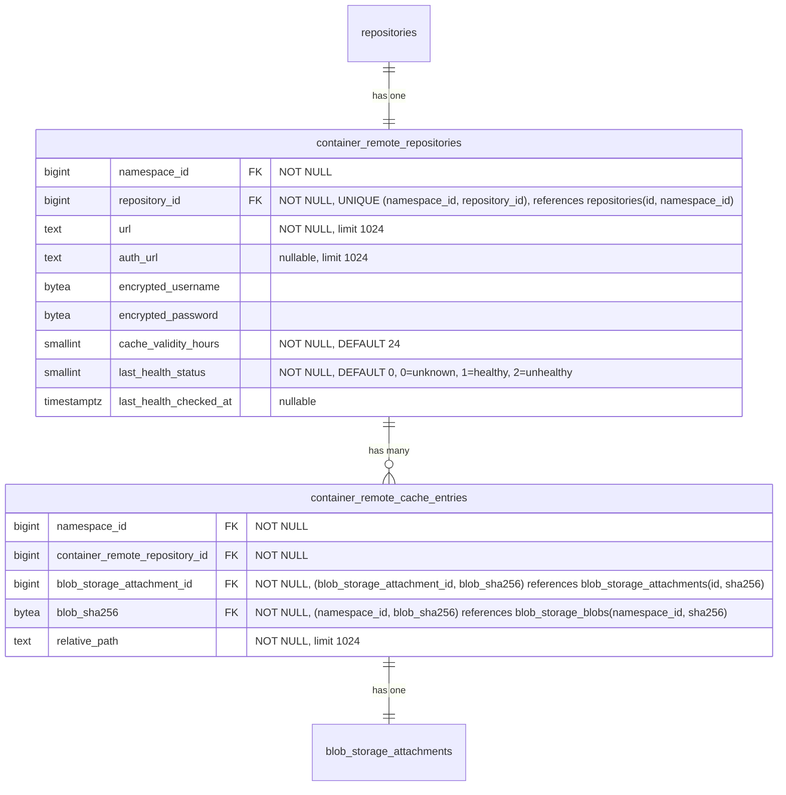
```mermaid
erDiagram
    repositories ||--|| container_remote_repositories : "has one"
    container_remote_repositories ||--o{ container_remote_cache_entries : "has many"
    container_remote_cache_entries ||--|| blob_storage_attachments : "has one"

    container_remote_repositories {
        bigint namespace_id FK "NOT NULL"
        bigint repository_id FK "NOT NULL, UNIQUE (namespace_id, repository_id), references repositories(id, namespace_id)"
        text url "NOT NULL, limit 1024"
        text auth_url "nullable, limit 1024"
        bytea encrypted_username
        bytea encrypted_password
        smallint cache_validity_hours "NOT NULL, DEFAULT 24"
        smallint last_health_status "NOT NULL, DEFAULT 0, 0=unknown, 1=healthy, 2=unhealthy"
        timestamptz last_health_checked_at "nullable"
    }

    container_remote_cache_entries {
        bigint namespace_id FK "NOT NULL"
        bigint container_remote_repository_id FK "NOT NULL"
        bigint blob_storage_attachment_id FK "NOT NULL, (blob_storage_attachment_id, blob_sha256) references blob_storage_attachments(id, sha256)"
        bytea blob_sha256 FK "NOT NULL, (namespace_id, blob_sha256) references blob_storage_blobs(namespace_id, sha256)"
        text relative_path "NOT NULL, limit 1024"
    }
```

- **container_remote_repositories**: 外部のコンテナレジストリを表します。URL、オプショナルな認証 URL（`auth_url`）、認証情報、キャッシュ TTL（`cache_validity_hours`）を含みます。モニタリング用にヘルスチェックステータスを追跡します。`repository_id` を介して親 `repositories` テーブルを参照します。リモートリポジトリはスタンドアローンであるため、同じリモートを使用する 2 つの仮想リポジトリは 1 つのキャッシュを共有します。`HASH(namespace_id)` で 64 パーティションにパーティショニング。
- **container_remote_cache_entries**: リモートレジストリからプルされたファイルのキャッシュコピーを表します。新しい Blob ストレージアタッチメントを作成します。
- **blob_storage_attachments**: 詳細は [Blob storage](#blob-storage) セクションを参照してください。

#### インデックス

- **`container_remote_repositories`**: `(namespace_id, repository_id)` のユニークインデックス — その親参照によりリモートリポジトリを検索。
- **`container_remote_cache_entries`**: `(namespace_id, container_remote_repository_id, relative_path)` のユニークインデックス — キャッシュされたパスの存在をチェック。`(namespace_id, blob_storage_attachment_id)` のインデックス — そのストレージアタッチメントによりキャッシュエントリを検索。

#### クエリ例

- リモートリポジトリを作成

  ```sql
  -- Resolve the default workspace for the namespace
  SELECT id FROM workspaces WHERE namespace_id = 123 AND is_default = true;
  -- Create the parent repository
  INSERT INTO repositories (namespace_id, name, format, kind, visibility)
  VALUES (123, 'docker-hub', 0, 2, 1)
  RETURNING id;
  -- Link the repository to the workspace
  INSERT INTO workspace_repositories (namespace_id, workspace_id, repository_id)
  VALUES (123, <workspace_id>, <returned_id>);
  -- Then create the format-specific record
  INSERT INTO container_remote_repositories (namespace_id, repository_id, url, encrypted_username, encrypted_password)
  VALUES (123, <returned_id>, 'https://registry.hub.docker.com', $1, $2);
  ```

- リモートキャッシュエントリが指定された相対パスを持つかチェック

  ```sql
  SELECT 1 AS one
  FROM container_remote_cache_entries
  WHERE namespace_id = 123 AND container_remote_repository_id = 789 AND relative_path = 'library/nginx/latest'
  LIMIT 1;
  ```

### Virtual Container Repositories {#virtual-container-repositories}

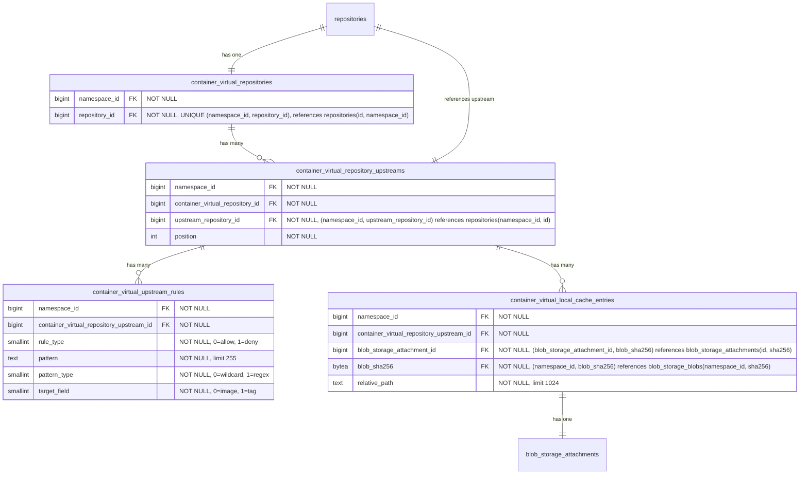
```mermaid
erDiagram
    repositories ||--|| container_virtual_repositories : "has one"
    container_virtual_repositories ||--o{ container_virtual_repository_upstreams : "has many"
    container_virtual_repository_upstreams ||--|| repositories : "references upstream"
    container_virtual_repository_upstreams ||--o{ container_virtual_upstream_rules : "has many"
    container_virtual_repository_upstreams ||--o{ container_virtual_local_cache_entries : "has many"
    container_virtual_local_cache_entries ||--|| blob_storage_attachments : "has one"

    container_virtual_repositories {
        bigint namespace_id FK "NOT NULL"
        bigint repository_id FK "NOT NULL, UNIQUE (namespace_id, repository_id), references repositories(id, namespace_id)"
    }

    container_virtual_repository_upstreams {
        bigint namespace_id FK "NOT NULL"
        bigint container_virtual_repository_id FK "NOT NULL"
        bigint upstream_repository_id FK "NOT NULL, (namespace_id, upstream_repository_id) references repositories(namespace_id, id)"
        int position "NOT NULL"
    }

    container_virtual_upstream_rules {
        bigint namespace_id FK "NOT NULL"
        bigint container_virtual_repository_upstream_id FK "NOT NULL"
        smallint rule_type "NOT NULL, 0=allow, 1=deny"
        text pattern "NOT NULL, limit 255"
        smallint pattern_type "NOT NULL, 0=wildcard, 1=regex"
        smallint target_field "NOT NULL, 0=image, 1=tag"
    }

    container_virtual_local_cache_entries {
        bigint namespace_id FK "NOT NULL"
        bigint container_virtual_repository_upstream_id FK "NOT NULL"
        bigint blob_storage_attachment_id FK "NOT NULL, (blob_storage_attachment_id, blob_sha256) references blob_storage_attachments(id, sha256)"
        bytea blob_sha256 FK "NOT NULL, (namespace_id, blob_sha256) references blob_storage_blobs(namespace_id, sha256)"
        text relative_path "NOT NULL, limit 1024"
    }
```

- **container_virtual_repositories**: コンテナイメージ用の仮想リポジトリ。名前、可視性、フォーマット横断クエリのため、`repository_id` を介して親 `repositories` テーブルを参照します。
- **container_virtual_repository_upstreams**: 仮想リポジトリとそのアップストリームを結合するテーブル。各仮想リポジトリは順序付けられたアップストリームのリストを持ちます。各エントリは `upstream_repository_id` を介してアップストリームリポジトリを参照し、`repositories(namespace_id, id)` を指します。アップストリームのタイプ（local または remote）は `repositories.kind` によって決定されます。複合 FK `(namespace_id, upstream_repository_id)` は、アップストリームが同じ namespace 内にあることを強制します — レジストリが namespace にスコープされていることと一致します（[ADR-001](001_organizations_as_anchor_point.md)）。
- **container_virtual_upstream_rules**: 任意のアップストリーム（local または remote）の許可／拒否フィルタールールを定義します。各ルールは、このアップストリームを通じて解決するときにどのアーティファクトを含めるか除外するかを制御するパターンとターゲットフィールドを指定します。ルールはアップストリーム参照ごとに維持されます（リモートリポジトリごとではない）。これは include/exclude パターンが仮想-アップストリーム関連付けごとに設定される JFrog モデルと一致します。
- **container_virtual_local_cache_entries**: ローカルアップストリームから解決されたアーティファクトへの参照を表します。仮想リポジトリがローカルアップストリーム（GitLab グループまたはプロジェクトをターゲットとする可能性がある）にクエリして成功応答を取得すると、結果はここに記録されます。これにより、同じアーティファクトに対する後続のリクエストでアップストリームリストを再ウォークしないようになります — リモートアップストリームに使用されるのと同じキャッシングパターンです。既存の Blob のこの追加使用を追跡するため、新しい Blob ストレージアタッチメントを作成します。
- **blob_storage_attachments**: 詳細は [Blob storage](#blob-storage) セクションを参照してください。

#### インデックス

- **`container_virtual_repositories`**: `(namespace_id, repository_id)` のユニークインデックス — その親参照により仮想リポジトリを検索。
- **`container_virtual_repository_upstreams`**: `(namespace_id, container_virtual_repository_id, position) DEFERRABLE INITIALLY DEFERRED` のユニークインデックス — 仮想リポジトリの順序付けられたアップストリームを取得。トランザクション内での並べ替えを許可するため deferrable。`(namespace_id, container_virtual_repository_id, upstream_repository_id)` のユニークインデックス — 同じアップストリームが仮想リポジトリに 2 回追加されるのを防ぐ。
- **`container_virtual_upstream_rules`**: `(namespace_id, container_virtual_repository_upstream_id)` のインデックス — 指定されたアップストリームのすべてのルールを取得。
- **`container_virtual_local_cache_entries`**: `(namespace_id, container_virtual_repository_upstream_id, relative_path)` のユニークインデックス — ローカルアップストリーム内のキャッシュされたパスの存在をチェック。`(namespace_id, blob_storage_attachment_id)` のインデックス — そのストレージアタッチメントによりキャッシュエントリを検索。

#### クエリ例

- 仮想リポジトリを作成

  ```sql
  -- First create the parent repository
  INSERT INTO repositories (namespace_id, name, format, kind, visibility)
  VALUES (123, 'my-virtual-repo', 0, 1, 1)
  RETURNING id;
  -- Link the repository to a workspace
  INSERT INTO workspace_repositories (namespace_id, workspace_id, repository_id)
  VALUES (123, 456, <returned_id>);
  -- Then create the format-specific record
  INSERT INTO container_virtual_repositories (namespace_id, repository_id)
  VALUES (123, <returned_id>);
  ```

- 仮想リポジトリをアップストリーム（local または remote）と関連付ける

  ```sql
  INSERT INTO container_virtual_repository_upstreams (namespace_id, container_virtual_repository_id, upstream_repository_id, position)
  VALUES (123, 123, 789, 1);
  ```

- ローカルキャッシュエントリが指定された相対パスを持つかチェック

  ```sql
  SELECT 1 AS one
  FROM container_virtual_local_cache_entries
  WHERE namespace_id = 123 AND container_virtual_repository_upstream_id = 101 AND relative_path = 'library/nginx/latest'
  LIMIT 1;
  ```

### Maven Repositories {#maven-repositories}

Maven パッケージは、ファイルのコレクション（`.jar`、`.pom`、`maven-metadata.xml`）を表します。単一の Maven パッケージのダウンロードは、4〜15 個の API リクエストを表すことができます。

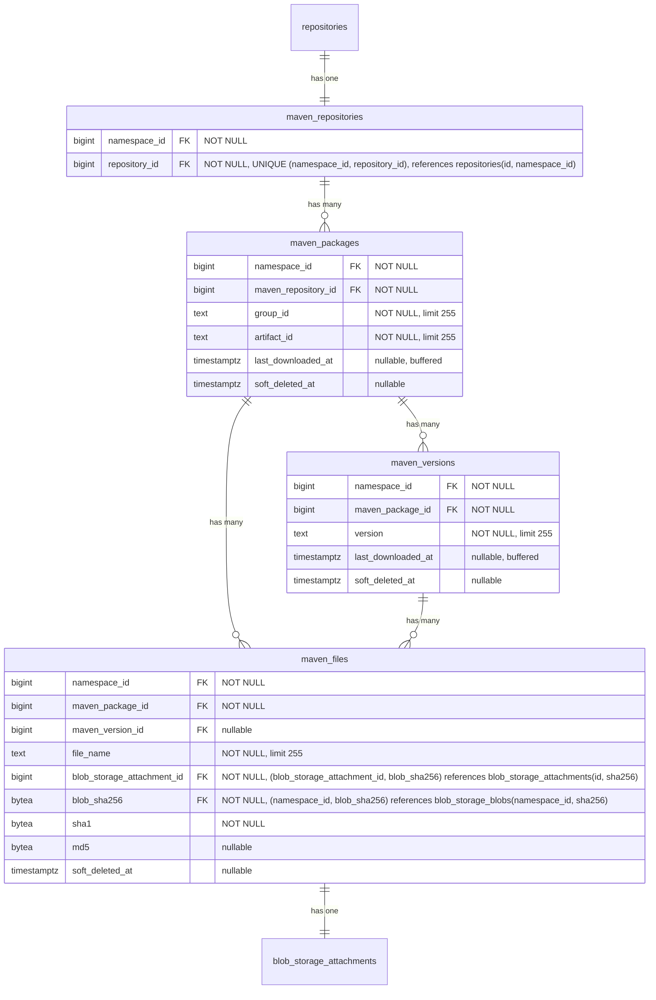
```mermaid
erDiagram
    repositories ||--|| maven_repositories : "has one"
    maven_repositories ||--o{ maven_packages : "has many"
    maven_packages ||--o{ maven_versions : "has many"
    maven_packages ||--o{ maven_files : "has many"
    maven_versions ||--o{ maven_files : "has many"
    maven_files ||--|| blob_storage_attachments : "has one"

    maven_repositories {
        bigint namespace_id FK "NOT NULL"
        bigint repository_id FK "NOT NULL, UNIQUE (namespace_id, repository_id), references repositories(id, namespace_id)"
    }

    maven_packages {
        bigint namespace_id FK "NOT NULL"
        bigint maven_repository_id FK "NOT NULL"
        text group_id "NOT NULL, limit 255"
        text artifact_id "NOT NULL, limit 255"
        timestamptz last_downloaded_at "nullable, buffered"
        timestamptz soft_deleted_at "nullable"
    }

    maven_versions {
        bigint namespace_id FK "NOT NULL"
        bigint maven_package_id FK "NOT NULL"
        text version "NOT NULL, limit 255"
        timestamptz last_downloaded_at "nullable, buffered"
        timestamptz soft_deleted_at "nullable"
    }

    maven_files {
        bigint namespace_id FK "NOT NULL"
        bigint maven_package_id FK "NOT NULL"
        bigint maven_version_id FK "nullable"
        text file_name "NOT NULL, limit 255"
        bigint blob_storage_attachment_id FK "NOT NULL, (blob_storage_attachment_id, blob_sha256) references blob_storage_attachments(id, sha256)"
        bytea blob_sha256 FK "NOT NULL, (namespace_id, blob_sha256) references blob_storage_blobs(namespace_id, sha256)"
        bytea sha1 "NOT NULL"
        bytea md5 "nullable"
        timestamptz soft_deleted_at "nullable"
    }
```

- **maven_repositories**: 複数のパッケージのコンテナ。各リポジトリはグループ ID とアーティファクト ID で識別される複数のパッケージをホストできます。名前、可視性、フォーマット横断クエリのため、`repository_id` を介して親 `repositories` テーブルを参照します。
- **maven_packages**: [そのグループ ID とアーティファクト ID](https://maven.apache.org/pom.html#Maven_Coordinates) で識別される Maven パッケージを表します（例: `com.example:myapp`）。`last_downloaded_at` はパッケージのいずれかのファイルが最後にダウンロードされた時を記録し、[バッファ／非同期書き込み](#buffered-and-asynchronous-writes) で維持されます。`NULL` はパッケージが一度もダウンロードされていないことを意味し、`keep_last_downloaded_at` ライフサイクルルール評価では最も古い可能なダウンロード時刻として扱われます（つまり、ダウンロードベース保持下で削除対象になります）。`keep_last_downloaded_at` ライフサイクルルールが、ダウンロードベース保持を評価するために使用します（[ADR-010](010_data_retention.md)）。
- **maven_versions**: Maven パッケージの個別の[バージョン](https://maven.apache.org/pom.html#Maven_Coordinates)を保存します（例: `1.0.0`、`2.1.3-SNAPSHOT`）。`last_downloaded_at` はバージョンのいずれかのファイルが最後にダウンロードされた時を記録し、[バッファ／非同期書き込み](#buffered-and-asynchronous-writes) で維持されます。`keep_last_downloaded_at` ライフサイクルルールが使用します。
- **maven_files**: Maven パッケージに関連付けられた個別のファイルを表します。ファイルはバージョン固有（JAR、POM、ソース、Javadoc、チェックサム）で `maven_version_id` が設定されているか、パッケージレベル（`maven-metadata.xml` とそのチェックサムなど）で `maven_version_id` が NULL のいずれかです。`maven_package_id` は常に設定されており、パッケージからすべてのファイルへの直接的なパスを提供します。これはレジストリがパフォーマンスのボトルネックを改善するために使用する補助ファイルでもあり得ます。`sha1` と `md5` カラムは、整合性検証のために [Maven プロトコルが要求するチェックサム](https://maven.apache.org/resolver/about-checksums.html) を保存します。Maven クライアントはすべてのアーティファクトと共に `.sha1` と `.md5` のサイドカーファイルを期待します。これらのカラムは、`blob_storage_blobs` ではなく `maven_files` にあります。なぜならこれらは Maven プロトコルの関心事であり、ユニバーサルな Blob プロパティではないからです — 他のフォーマット（OCI コンテナ）は SHA256 のみを使用します。これらをここに保持することで、`blob_storage_blobs` をフォーマット固有のカラムやインデックスのないフォーマット非依存のテーブルとして保持できます。Maven プロトコルが要求するため `sha1` は `NOT NULL` です。Maven 3.9+ で [MD5 チェックサムが非推奨](https://maven.apache.org/resolver/about-checksums.html) になったため `md5` は nullable です。
- **blob_storage_attachments**: 詳細は [Blob storage](#blob-storage) セクションを参照してください。

ここでは、グループ ID とアーティファクト ID というパッケージ名と、バージョンを同じテーブルに保存していません。理由は、UI がこのデータにパッケージ名でアクセスするためです。ツリー状の UI を想像してください: パッケージ名がフォルダで、それを開くとバージョンごとのサブフォルダがあります。最初のリクエストはフォルダ（パッケージ名）をリストする必要があります。フォルダを開くと、すべてのサブフォルダ（パッケージバージョン）をリストするリクエストがトリガーされます。したがって、このアクセスパターンを容易にするために、2 つの専用テーブル（`maven_packages` と `maven_versions`）を持っています。

#### インデックス

- **`maven_repositories`**: `(namespace_id, repository_id)` のユニークインデックス — その親リポジトリ参照により Maven リポジトリを検索。
- **`maven_packages`**: `(namespace_id, maven_repository_id, group_id, artifact_id) WHERE soft_deleted_at IS NULL` のユニークインデックス — リポジトリ内で Maven 座標によりパッケージを検索。部分条件は、ソフト削除後に同じ座標でパッケージを再作成できるようにする。`(namespace_id, maven_repository_id, last_downloaded_at NULLS FIRST) WHERE soft_deleted_at IS NULL` のインデックス — `keep_last_downloaded_at` ライフサイクルルール評価をサポート。リポジトリ内のすべてのパッケージをスキャンして行ごとにフィルタリングするのではなく、境界のあるレンジスキャンを介して期限切れのパッケージのみを返す。`NULLS FIRST` は一度もダウンロードされていないパッケージを最も古い行とグループ化するため、両方が同じレンジスキャンで返される。
- **`maven_versions`**: `(namespace_id, maven_package_id, version) WHERE soft_deleted_at IS NULL` のユニークインデックス — パッケージ内で特定のバージョンを検索。部分条件は、ソフト削除後に同じ識別子でバージョンを再作成できるようにする。`(namespace_id, maven_package_id, last_downloaded_at NULLS FIRST) WHERE soft_deleted_at IS NULL` のインデックス — パッケージのバージョンに範囲を絞った `keep_last_downloaded_at` ライフサイクルルール評価をサポート。`maven_packages` と同じレンジスキャン戦略を使用。
- **`maven_files`**: `(namespace_id, maven_version_id, file_name) WHERE soft_deleted_at IS NULL AND maven_version_id IS NOT NULL` のユニークインデックス — バージョン固有のファイル名はバージョン内で一意でなければならない。部分条件はソフト削除された行とパッケージレベルファイルを除外する。`(namespace_id, maven_package_id, file_name) WHERE soft_deleted_at IS NULL AND maven_version_id IS NULL` のユニークインデックス — パッケージレベルのファイル名（`maven-metadata.xml` など）はパッケージ内で一意でなければならない。`(namespace_id, blob_storage_attachment_id)` のインデックス — そのストレージアタッチメントによりファイルを検索。

#### クエリ例

- 指定されたリポジトリ ID とパッケージ名のパッケージバージョンを取得。

  ```sql
  SELECT mv.*
  FROM maven_versions mv
  JOIN maven_packages mp
    ON mv.maven_package_id = mp.id AND mv.namespace_id = mp.namespace_id
  WHERE mp.namespace_id = 123 AND mp.maven_repository_id = 123 AND mp.group_id = 'com.example' AND mp.artifact_id = 'myapp'
    AND mv.version = '1.0.0'
    AND mp.soft_deleted_at IS NULL AND mv.soft_deleted_at IS NULL;
  ```

- 指定されたバージョン ID とファイル名でファイルを取得。

  ```sql
  SELECT mf.*
  FROM maven_files mf
  WHERE mf.namespace_id = 123 AND mf.maven_version_id = 456 AND mf.file_name = 'myapp-1.0.0.jar'
    AND mf.soft_deleted_at IS NULL;
  ```

- 指定されたパッケージのパッケージレベルファイル（例: `maven-metadata.xml`）を取得。

  ```sql
  SELECT mf.*
  FROM maven_files mf
  WHERE mf.namespace_id = 123 AND mf.maven_package_id = 123 AND mf.maven_version_id IS NULL
    AND mf.soft_deleted_at IS NULL;
  ```

### Maven Remote Repositories {#maven-remote-repositories}

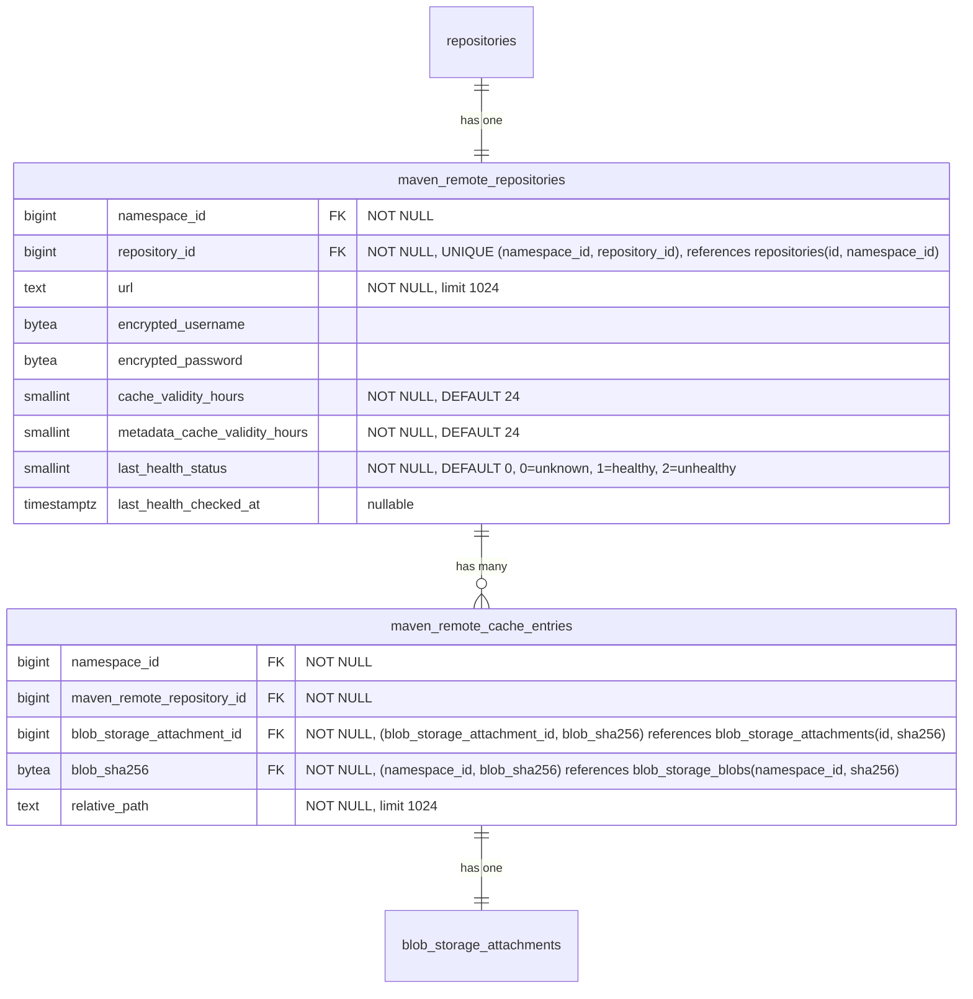
```mermaid
erDiagram
    repositories ||--|| maven_remote_repositories : "has one"
    maven_remote_repositories ||--o{ maven_remote_cache_entries : "has many"
    maven_remote_cache_entries ||--|| blob_storage_attachments : "has one"

    maven_remote_repositories {
        bigint namespace_id FK "NOT NULL"
        bigint repository_id FK "NOT NULL, UNIQUE (namespace_id, repository_id), references repositories(id, namespace_id)"
        text url "NOT NULL, limit 1024"
        bytea encrypted_username
        bytea encrypted_password
        smallint cache_validity_hours "NOT NULL, DEFAULT 24"
        smallint metadata_cache_validity_hours "NOT NULL, DEFAULT 24"
        smallint last_health_status "NOT NULL, DEFAULT 0, 0=unknown, 1=healthy, 2=unhealthy"
        timestamptz last_health_checked_at "nullable"
    }

    maven_remote_cache_entries {
        bigint namespace_id FK "NOT NULL"
        bigint maven_remote_repository_id FK "NOT NULL"
        bigint blob_storage_attachment_id FK "NOT NULL, (blob_storage_attachment_id, blob_sha256) references blob_storage_attachments(id, sha256)"
        bytea blob_sha256 FK "NOT NULL, (namespace_id, blob_sha256) references blob_storage_blobs(namespace_id, sha256)"
        text relative_path "NOT NULL, limit 1024"
    }
```

- **maven_remote_repositories**: 外部の Maven リポジトリを表します。URL、認証情報、アーティファクトキャッシュ TTL（`cache_validity_hours`）、`maven-metadata.xml` などのメタデータレスポンス用の別の TTL（`metadata_cache_validity_hours`）を含みます。モニタリング用にヘルスチェックステータスを追跡します。`repository_id` を介して親 `repositories` テーブルを参照します。`HASH(namespace_id)` で 64 パーティションにパーティショニング。
- **maven_remote_cache_entries**: リモートリポジトリからプルされたファイルのキャッシュコピーを表します。新しい Blob ストレージアタッチメントを作成します。
- **blob_storage_attachments**: 詳細は [Blob storage](#blob-storage) セクションを参照してください。

#### インデックス

- **`maven_remote_repositories`**: `(namespace_id, repository_id)` のユニークインデックス — その親参照によりリモートリポジトリを検索。
- **`maven_remote_cache_entries`**: `(namespace_id, maven_remote_repository_id, relative_path)` のユニークインデックス — キャッシュされたパスの存在をチェック。`(namespace_id, blob_storage_attachment_id)` のインデックス — そのストレージアタッチメントによりキャッシュエントリを検索。

#### クエリ例

- リモートリポジトリを作成

  ```sql
  -- First create the parent repository
  INSERT INTO repositories (namespace_id, name, format, kind, visibility)
  VALUES (123, 'central', 1, 2, 0)
  RETURNING id;
  -- Link the repository to a workspace
  INSERT INTO workspace_repositories (namespace_id, workspace_id, repository_id)
  VALUES (123, 456, <returned_id>);
  -- Then create the format-specific record
  INSERT INTO maven_remote_repositories (namespace_id, repository_id, url, encrypted_username, encrypted_password)
  VALUES (123, <returned_id>, 'https://repo.maven.apache.org/maven2', $1, $2);
  ```

- リモートキャッシュエントリが指定された相対パスを持つかチェック

  ```sql
  SELECT 1 AS one
  FROM maven_remote_cache_entries
  WHERE namespace_id = 123 AND maven_remote_repository_id = 789 AND relative_path = 'com/example/myapp/1.0.0/myapp-1.0.0.jar'
  LIMIT 1;
  ```

### Maven Virtual Repositories {#maven-virtual-repositories}

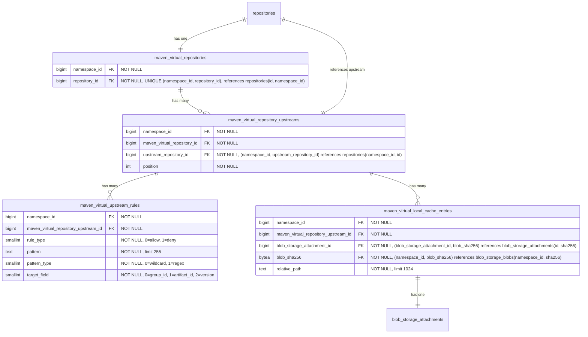
```mermaid
erDiagram
    repositories ||--|| maven_virtual_repositories : "has one"
    maven_virtual_repositories ||--o{ maven_virtual_repository_upstreams : "has many"
    maven_virtual_repository_upstreams ||--|| repositories : "references upstream"
    maven_virtual_repository_upstreams ||--o{ maven_virtual_upstream_rules : "has many"
    maven_virtual_repository_upstreams ||--o{ maven_virtual_local_cache_entries : "has many"
    maven_virtual_local_cache_entries ||--|| blob_storage_attachments : "has one"

    maven_virtual_repositories {
        bigint namespace_id FK "NOT NULL"
        bigint repository_id FK "NOT NULL, UNIQUE (namespace_id, repository_id), references repositories(id, namespace_id)"
    }

    maven_virtual_repository_upstreams {
        bigint namespace_id FK "NOT NULL"
        bigint maven_virtual_repository_id FK "NOT NULL"
        bigint upstream_repository_id FK "NOT NULL, (namespace_id, upstream_repository_id) references repositories(namespace_id, id)"
        int position "NOT NULL"
    }

    maven_virtual_upstream_rules {
        bigint namespace_id FK "NOT NULL"
        bigint maven_virtual_repository_upstream_id FK "NOT NULL"
        smallint rule_type "NOT NULL, 0=allow, 1=deny"
        text pattern "NOT NULL, limit 255"
        smallint pattern_type "NOT NULL, 0=wildcard, 1=regex"
        smallint target_field "NOT NULL, 0=group_id, 1=artifact_id, 2=version"
    }

    maven_virtual_local_cache_entries {
        bigint namespace_id FK "NOT NULL"
        bigint maven_virtual_repository_upstream_id FK "NOT NULL"
        bigint blob_storage_attachment_id FK "NOT NULL, (blob_storage_attachment_id, blob_sha256) references blob_storage_attachments(id, sha256)"
        bytea blob_sha256 FK "NOT NULL, (namespace_id, blob_sha256) references blob_storage_blobs(namespace_id, sha256)"
        text relative_path "NOT NULL, limit 1024"
    }
```

- **maven_virtual_repositories**: Maven パッケージ用の仮想リポジトリ。名前、可視性、フォーマット横断クエリのため、`repository_id` を介して親 `repositories` テーブルを参照します。
- **maven_virtual_repository_upstreams**: 仮想リポジトリとそのアップストリームを結合するテーブル。各仮想リポジトリは順序付けられたアップストリームのリストを持ちます。各エントリは `upstream_repository_id` を介してアップストリームリポジトリを参照し、`repositories(namespace_id, id)` を指します。アップストリームのタイプ（local または remote）は `repositories.kind` によって決定されます。複合 FK `(namespace_id, upstream_repository_id)` は、アップストリームが同じ namespace 内にあることを強制します — レジストリが namespace にスコープされていることと一致します（[ADR-001](001_organizations_as_anchor_point.md)）。
- **maven_virtual_upstream_rules**: 任意のアップストリーム（local または remote）の許可／拒否フィルタールールを定義します。各ルールは、このアップストリームを通じて解決するときにどのアーティファクトを含めるか除外するかを制御するパターンとターゲットフィールドを指定します。
- **maven_virtual_local_cache_entries**: ローカルアップストリームから解決されたアーティファクトへの参照を表します。後続のリクエストでアップストリームリストを再ウォークしないよう、成功した検索を記録します。既存の Blob のこの追加使用を追跡するため、新しい Blob ストレージアタッチメントを作成します。
- **blob_storage_attachments**: 詳細は [Blob storage](#blob-storage) セクションを参照してください。

#### インデックス

- **`maven_virtual_repositories`**: `(namespace_id, repository_id)` のユニークインデックス — その親参照により仮想リポジトリを検索。
- **`maven_virtual_repository_upstreams`**: `(namespace_id, maven_virtual_repository_id, position) DEFERRABLE INITIALLY DEFERRED` のユニークインデックス — 仮想リポジトリの順序付けられたアップストリームを取得。トランザクション内での並べ替えを許可するため deferrable。`(namespace_id, maven_virtual_repository_id, upstream_repository_id)` のユニークインデックス — 同じアップストリームが仮想リポジトリに 2 回追加されるのを防ぐ。
- **`maven_virtual_upstream_rules`**: `(namespace_id, maven_virtual_repository_upstream_id)` のインデックス — 指定されたアップストリームのすべてのルールを取得。
- **`maven_virtual_local_cache_entries`**: `(namespace_id, maven_virtual_repository_upstream_id, relative_path)` のユニークインデックス — ローカルアップストリーム内のキャッシュされたパスの存在をチェック。`(namespace_id, blob_storage_attachment_id)` のインデックス — そのストレージアタッチメントによりキャッシュエントリを検索。

#### クエリ例

- 仮想リポジトリを作成

  ```sql
  -- First create the parent repository
  INSERT INTO repositories (namespace_id, name, format, kind, visibility)
  VALUES (123, 'my-virtual-repo', 1, 1, 1)
  RETURNING id;
  -- Link the repository to a workspace
  INSERT INTO workspace_repositories (namespace_id, workspace_id, repository_id)
  VALUES (123, 456, <returned_id>);
  -- Then create the format-specific record
  INSERT INTO maven_virtual_repositories (namespace_id, repository_id)
  VALUES (123, <returned_id>);
  ```

- 仮想リポジトリをアップストリーム（local または remote）と関連付ける

  ```sql
  INSERT INTO maven_virtual_repository_upstreams (namespace_id, maven_virtual_repository_id, upstream_repository_id, position)
  VALUES (123, 123, 789, 1);
  ```

- ローカルキャッシュエントリが指定された相対パスを持つかチェック

  ```sql
  SELECT 1 AS one
  FROM maven_virtual_local_cache_entries
  WHERE namespace_id = 123 AND maven_virtual_repository_upstream_id = 101 AND relative_path = 'com/example/myapp/1.0.0/myapp-1.0.0.jar'
  LIMIT 1;
  ```

### NPM Repositories {#npm-repositories}

Node パッケージは基本的に `.tar.gz` ファイルで、各バージョンが単一のアーカイブです。ただし、node クライアントはより豊富な機能セットを持ち、例えば、扱う必要がある dist タグの使用などです。

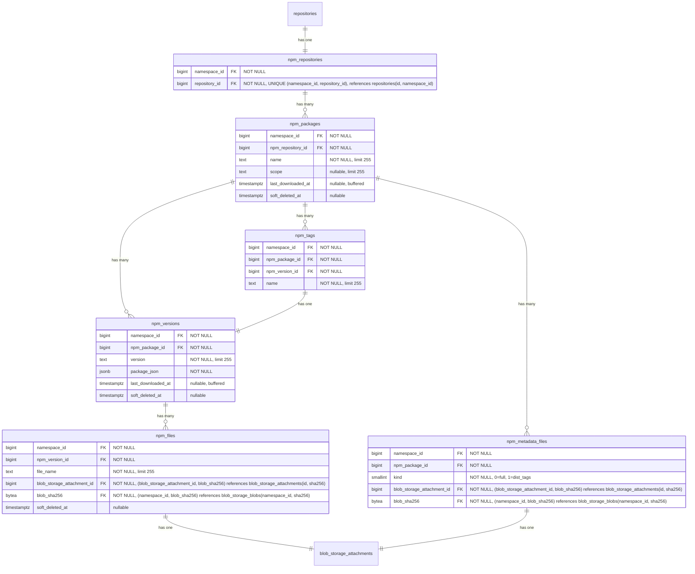
```mermaid
erDiagram
    repositories ||--|| npm_repositories : "has one"
    npm_repositories ||--o{ npm_packages : "has many"
    npm_packages ||--o{ npm_versions : "has many"
    npm_packages ||--o{ npm_tags : "has many"
    npm_versions ||--o{ npm_files : "has many"
    npm_tags ||--|| npm_versions : "has one"
    npm_packages ||--o{ npm_metadata_files : "has many"
    npm_files ||--|| blob_storage_attachments : "has one"
    npm_metadata_files ||--|| blob_storage_attachments : "has one"

    npm_repositories {
        bigint namespace_id FK "NOT NULL"
        bigint repository_id FK "NOT NULL, UNIQUE (namespace_id, repository_id), references repositories(id, namespace_id)"
    }

    npm_packages {
        bigint namespace_id FK "NOT NULL"
        bigint npm_repository_id FK "NOT NULL"
        text name "NOT NULL, limit 255"
        text scope "nullable, limit 255"
        timestamptz last_downloaded_at "nullable, buffered"
        timestamptz soft_deleted_at "nullable"
    }

    npm_versions {
        bigint namespace_id FK "NOT NULL"
        bigint npm_package_id FK "NOT NULL"
        text version "NOT NULL, limit 255"
        jsonb package_json "NOT NULL"
        timestamptz last_downloaded_at "nullable, buffered"
        timestamptz soft_deleted_at "nullable"
    }

    npm_tags {
        bigint namespace_id FK "NOT NULL"
        bigint npm_package_id FK "NOT NULL"
        bigint npm_version_id FK "NOT NULL"
        text name "NOT NULL, limit 255"
    }

    npm_files {
        bigint namespace_id FK "NOT NULL"
        bigint npm_version_id FK "NOT NULL"
        text file_name "NOT NULL, limit 255"
        bigint blob_storage_attachment_id FK "NOT NULL, (blob_storage_attachment_id, blob_sha256) references blob_storage_attachments(id, sha256)"
        bytea blob_sha256 FK "NOT NULL, (namespace_id, blob_sha256) references blob_storage_blobs(namespace_id, sha256)"
        timestamptz soft_deleted_at "nullable"
    }

    npm_metadata_files {
        bigint namespace_id FK "NOT NULL"
        bigint npm_package_id FK "NOT NULL"
        smallint kind "NOT NULL, 0=full, 1=dist_tags"
        bigint blob_storage_attachment_id FK "NOT NULL, (blob_storage_attachment_id, blob_sha256) references blob_storage_attachments(id, sha256)"
        bytea blob_sha256 FK "NOT NULL, (namespace_id, blob_sha256) references blob_storage_blobs(namespace_id, sha256)"
    }
```

- **npm_repositories**: 複数のパッケージのコンテナ。各リポジトリはオプショナルなスコープを持つ複数のパッケージをホストできます。名前、可視性、フォーマット横断クエリのため、`repository_id` を介して親 `repositories` テーブルを参照します。
- **npm_packages**: npm パッケージを表します。`name` カラムはスコープを含むパッケージのフルネームを保存します（例: `@myorg/mypackage` または `lodash`）。`last_downloaded_at` はパッケージのいずれかのファイルが最後にダウンロードされた時を記録し、[バッファ／非同期書き込み](#buffered-and-asynchronous-writes) で維持されます。`keep_last_downloaded_at` ライフサイクルルールが使用します。
- **npm_versions**: 埋め込まれた package.json メタデータと共に npm パッケージの個別のバージョンを保存します。`last_downloaded_at` はバージョンのいずれかのファイルが最後にダウンロードされた時を記録し、[バッファ／非同期書き込み](#buffered-and-asynchronous-writes) で維持されます。`keep_last_downloaded_at` ライフサイクルルールが使用します。
- **npm_tags**: 特定のパッケージバージョンを指す [NPM dist タグ](https://docs.npmjs.com/cli/v11/commands/npm-dist-tag) を提供します（例: `latest`、`next`、`beta`）。
- **npm_files**: npm パッケージバージョンのファイルを表します。これは主に tarball アーカイブです。これはレジストリがパフォーマンスのボトルネックを改善するために使用する補助ファイルでもあり得ます。
- **npm_metadata_files**: npm パッケージのプリコンピュートメタデータファイルを保存します。`kind` ごとに 1 つ。`kind` カラムはメタデータバリアントを区別します: `full` (0) はすべてのバージョンを含む完全な packument を含み、`dist_tags` (1) は dist タグマッピングのみを含みます。クライアントリクエストに基づいて、適切なファイルが npm メタデータエンドポイントで提供されます。メタデータがパッケージのすべてのバージョンにまたがるため、`npm_versions` ではなく `npm_packages` にリンクされています。バージョンが公開または非公開化された後、メタデータファイルは非同期に生成されます。
- **blob_storage_attachments**: 詳細は [Blob storage](#blob-storage) セクションを参照してください。

[Maven](#maven-repositories) と同様、まったく同じ理由でパッケージ名とバージョンは 2 つの異なるテーブルに保存されます。

#### インデックス

- **`npm_repositories`**: `(namespace_id, repository_id)` のユニークインデックス — その親リポジトリ参照により NPM リポジトリを検索。
- **`npm_packages`**: `(namespace_id, npm_repository_id, name) WHERE soft_deleted_at IS NULL` のユニークインデックス — リポジトリ内で名前によりパッケージを検索。部分条件は、ソフト削除後に同じ名前でパッケージを再作成できるようにする。`(namespace_id, npm_repository_id, last_downloaded_at NULLS FIRST) WHERE soft_deleted_at IS NULL` のインデックス — `keep_last_downloaded_at` ライフサイクルルール評価をサポート。リポジトリ内のすべてのパッケージをスキャンして行ごとにフィルタリングするのではなく、境界のあるレンジスキャンを介して期限切れのパッケージのみを返す。`NULLS FIRST` は一度もダウンロードされていないパッケージを最も古い行とグループ化するため、両方が同じレンジスキャンで返される。
- **`npm_versions`**: `(namespace_id, npm_package_id, version) WHERE soft_deleted_at IS NULL` のユニークインデックス — パッケージ内で特定のバージョンを検索。部分条件は、ソフト削除後に同じ識別子でバージョンを再作成できるようにする。`(namespace_id, npm_package_id, last_downloaded_at NULLS FIRST) WHERE soft_deleted_at IS NULL` のインデックス — パッケージのバージョンに範囲を絞った `keep_last_downloaded_at` ライフサイクルルール評価をサポート。`npm_packages` と同じレンジスキャン戦略を使用。
- **`npm_tags`**: `(namespace_id, npm_package_id, name)` のユニークインデックス — パッケージ内で名前により dist タグを検索。`(namespace_id, npm_version_id)` のインデックス — 指定されたバージョンを指すすべてのタグを見つける。
- **`npm_files`**: `(namespace_id, npm_version_id, file_name) WHERE soft_deleted_at IS NULL` のユニークインデックス — ファイル名はバージョン内で一意でなければならない。部分条件は、ソフト削除後に同じ名前でファイルを再作成できるようにする。`(namespace_id, blob_storage_attachment_id)` のインデックス — そのストレージアタッチメントによりファイルを検索。
- **`npm_metadata_files`**: `(namespace_id, npm_package_id, kind)` のユニークインデックス — パッケージあたり kind ごとに 1 つのメタデータファイル。`(namespace_id, blob_storage_attachment_id)` のインデックス — そのストレージアタッチメントによりメタデータファイルを検索。

#### クエリ例

- 指定されたリポジトリ ID とパッケージ名のすべてのバージョンを取得

  ```sql
  SELECT nv.*
  FROM npm_versions nv
  JOIN npm_packages np
    ON nv.npm_package_id = np.id AND nv.namespace_id = np.namespace_id
  WHERE np.namespace_id = 123 AND np.npm_repository_id = 123 AND np.name = '@myorg/mypackage'
    AND np.soft_deleted_at IS NULL AND nv.soft_deleted_at IS NULL;
  ```

- 指定されたバージョン ID とファイル名でファイルを取得

  ```sql
  SELECT nf.*
  FROM npm_files nf
  WHERE nf.namespace_id = 123 AND nf.npm_version_id = 456 AND nf.file_name = 'mypackage-1.0.0.tgz'
    AND nf.soft_deleted_at IS NULL;
  ```

- パッケージのプリコンピュート完全メタデータファイルを取得（npm メタデータエンドポイントで提供）

  ```sql
  SELECT bsb.object_storage_key, bsb.size, bsb.content_type
  FROM npm_metadata_files nmf
  JOIN blob_storage_blobs bsb ON bsb.namespace_id = nmf.namespace_id AND bsb.sha256 = nmf.blob_sha256
  WHERE nmf.namespace_id = 123 AND nmf.npm_package_id = 456 AND nmf.kind = 0;
  ```

- バージョン公開または非公開化後にメタデータファイルを upsert

  孤児化したアタッチメントが Blob ガベージコレクションをブロックするのを防ぐため、古いアタッチメントは同じトランザクションで削除する必要があります（[Cleanup tasks](#cleanup-tasks) を参照）。

  ```sql
  -- The new blob and attachment (id=789) are created earlier in the same transaction.
  WITH old AS (
    SELECT blob_storage_attachment_id, blob_sha256
    FROM npm_metadata_files
    WHERE namespace_id = 123 AND npm_package_id = 456 AND kind = 0
  ),
  upsert AS (
    INSERT INTO npm_metadata_files (namespace_id, npm_package_id, kind, blob_storage_attachment_id, blob_sha256)
    VALUES (123, 456, 0, 789, 'abcd1234...'::bytea)
    ON CONFLICT (namespace_id, npm_package_id, kind)
    DO UPDATE SET blob_storage_attachment_id = EXCLUDED.blob_storage_attachment_id,
                  blob_sha256 = EXCLUDED.blob_sha256
  )
  DELETE FROM blob_storage_attachments bsa
  USING old
  WHERE bsa.id = old.blob_storage_attachment_id
    AND bsa.sha256 = old.blob_sha256;
  ```

  最初の挿入では、`old` CTE は行を返さないので、アタッチメントは削除されません。
  コンフリクト時（更新時）、前のアタッチメントは削除されます。古い Blob は、他のアタッチメントが参照していなければガベージコレクションされます（重複排除安全: 各クライアントが独自のアタッチメントを保持するため、1 つを削除しても同じ Blob を共有する他者には影響しません）。

### NPM Remote Repositories {#npm-remote-repositories}

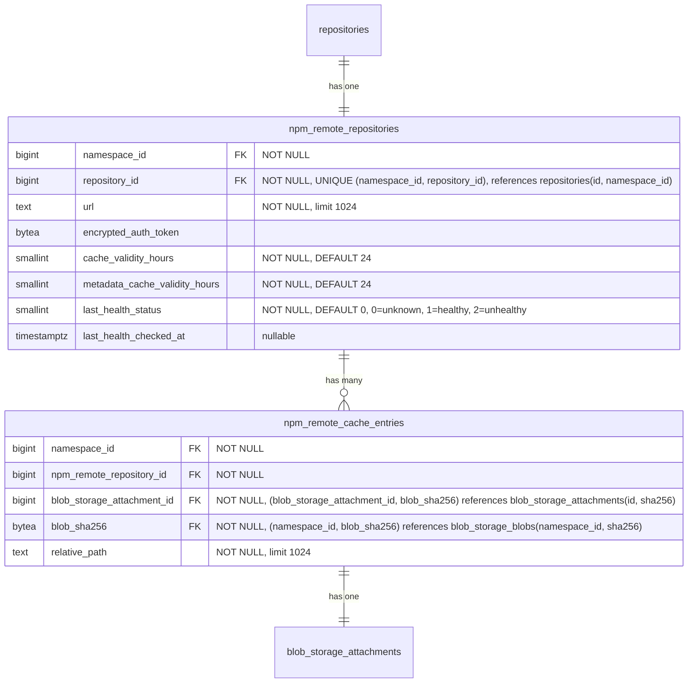
```mermaid
erDiagram
    repositories ||--|| npm_remote_repositories : "has one"
    npm_remote_repositories ||--o{ npm_remote_cache_entries : "has many"
    npm_remote_cache_entries ||--|| blob_storage_attachments : "has one"

    npm_remote_repositories {
        bigint namespace_id FK "NOT NULL"
        bigint repository_id FK "NOT NULL, UNIQUE (namespace_id, repository_id), references repositories(id, namespace_id)"
        text url "NOT NULL, limit 1024"
        bytea encrypted_auth_token
        smallint cache_validity_hours "NOT NULL, DEFAULT 24"
        smallint metadata_cache_validity_hours "NOT NULL, DEFAULT 24"
        smallint last_health_status "NOT NULL, DEFAULT 0, 0=unknown, 1=healthy, 2=unhealthy"
        timestamptz last_health_checked_at "nullable"
    }

    npm_remote_cache_entries {
        bigint namespace_id FK "NOT NULL"
        bigint npm_remote_repository_id FK "NOT NULL"
        bigint blob_storage_attachment_id FK "NOT NULL, (blob_storage_attachment_id, blob_sha256) references blob_storage_attachments(id, sha256)"
        bytea blob_sha256 FK "NOT NULL, (namespace_id, blob_sha256) references blob_storage_blobs(namespace_id, sha256)"
        text relative_path "NOT NULL, limit 1024"
    }
```

- **npm_remote_repositories**: 外部の npm レジストリを表します。URL、認証情報、アーティファクトキャッシュ TTL（`cache_validity_hours`）、パッケージメタデータレスポンス用の別の TTL（`metadata_cache_validity_hours`）を含みます。モニタリング用にヘルスチェックステータスを追跡します。`repository_id` を介して親 `repositories` テーブルを参照します。`HASH(namespace_id)` で 64 パーティションにパーティショニング。
- **npm_remote_cache_entries**: リモートレジストリからプルされたファイルのキャッシュコピーを表します。新しい Blob ストレージアタッチメントを作成します。
- **blob_storage_attachments**: 詳細は [Blob storage](#blob-storage) セクションを参照してください。

#### インデックス

- **`npm_remote_repositories`**: `(namespace_id, repository_id)` のユニークインデックス — その親参照によりリモートリポジトリを検索。
- **`npm_remote_cache_entries`**: `(namespace_id, npm_remote_repository_id, relative_path)` のユニークインデックス — キャッシュされたパスの存在をチェック。`(namespace_id, blob_storage_attachment_id)` のインデックス — そのストレージアタッチメントによりキャッシュエントリを検索。

#### クエリ例

- リモートリポジトリを作成

  ```sql
  -- First create the parent repository
  INSERT INTO repositories (namespace_id, name, format, kind, visibility)
  VALUES (123, 'npm-registry', 2, 2, 0)
  RETURNING id;
  -- Link the repository to a workspace
  INSERT INTO workspace_repositories (namespace_id, workspace_id, repository_id)
  VALUES (123, 456, <returned_id>);
  -- Then create the format-specific record
  INSERT INTO npm_remote_repositories (namespace_id, repository_id, url, encrypted_auth_token)
  VALUES (123, <returned_id>, 'https://registry.npmjs.org', $1);
  ```

- リモートキャッシュエントリが指定された相対パスを持つかチェック

  ```sql
  SELECT 1 AS one
  FROM npm_remote_cache_entries
  WHERE namespace_id = 123 AND npm_remote_repository_id = 789 AND relative_path = '@myorg/mypackage/1.0.0/mypackage-1.0.0.tgz'
  LIMIT 1;
  ```

### NPM Virtual Repositories {#npm-virtual-repositories}

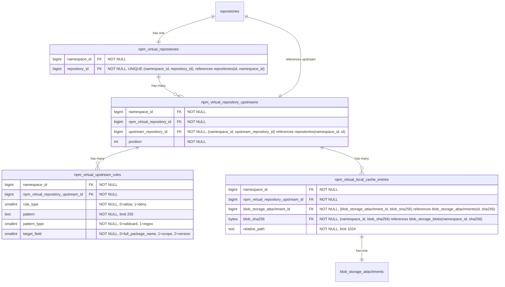
```mermaid
erDiagram
    repositories ||--|| npm_virtual_repositories : "has one"
    npm_virtual_repositories ||--o{ npm_virtual_repository_upstreams : "has many"
    npm_virtual_repository_upstreams ||--|| repositories : "references upstream"
    npm_virtual_repository_upstreams ||--o{ npm_virtual_upstream_rules : "has many"
    npm_virtual_repository_upstreams ||--o{ npm_virtual_local_cache_entries : "has many"
    npm_virtual_local_cache_entries ||--|| blob_storage_attachments : "has one"

    npm_virtual_repositories {
        bigint namespace_id FK "NOT NULL"
        bigint repository_id FK "NOT NULL, UNIQUE (namespace_id, repository_id), references repositories(id, namespace_id)"
    }

    npm_virtual_repository_upstreams {
        bigint namespace_id FK "NOT NULL"
        bigint npm_virtual_repository_id FK "NOT NULL"
        bigint upstream_repository_id FK "NOT NULL, (namespace_id, upstream_repository_id) references repositories(namespace_id, id)"
        int position "NOT NULL"
    }

    npm_virtual_upstream_rules {
        bigint namespace_id FK "NOT NULL"
        bigint npm_virtual_repository_upstream_id FK "NOT NULL"
        smallint rule_type "NOT NULL, 0=allow, 1=deny"
        text pattern "NOT NULL, limit 255"
        smallint pattern_type "NOT NULL, 0=wildcard, 1=regex"
        smallint target_field "NOT NULL, 0=full_package_name, 1=scope, 2=version"
    }

    npm_virtual_local_cache_entries {
        bigint namespace_id FK "NOT NULL"
        bigint npm_virtual_repository_upstream_id FK "NOT NULL"
        bigint blob_storage_attachment_id FK "NOT NULL, (blob_storage_attachment_id, blob_sha256) references blob_storage_attachments(id, sha256)"
        bytea blob_sha256 FK "NOT NULL, (namespace_id, blob_sha256) references blob_storage_blobs(namespace_id, sha256)"
        text relative_path "NOT NULL, limit 1024"
    }
```

- **npm_virtual_repositories**: npm パッケージ用の仮想リポジトリ。名前、可視性、フォーマット横断クエリのため、`repository_id` を介して親 `repositories` テーブルを参照します。
- **npm_virtual_repository_upstreams**: 仮想リポジトリとそのアップストリームを結合するテーブル。各仮想リポジトリは順序付けられたアップストリームのリストを持ちます。各エントリは `upstream_repository_id` を介してアップストリームリポジトリを参照し、`repositories(namespace_id, id)` を指します。アップストリームのタイプ（local または remote）は `repositories.kind` によって決定されます。複合 FK `(namespace_id, upstream_repository_id)` は、アップストリームが同じ namespace 内にあることを強制します — レジストリが namespace にスコープされていることと一致します（[ADR-001](001_organizations_as_anchor_point.md)）。
- **npm_virtual_upstream_rules**: 任意のアップストリーム（local または remote）の許可／拒否フィルタールールを定義します。各ルールは、このアップストリームを通じて解決するときにどのアーティファクトを含めるか除外するかを制御するパターンとターゲットフィールドを指定します。
- **npm_virtual_local_cache_entries**: ローカルアップストリームから解決されたアーティファクトへの参照を表します。後続のリクエストでアップストリームリストを再ウォークしないよう、成功した検索を記録します。既存の Blob のこの追加使用を追跡するため、新しい Blob ストレージアタッチメントを作成します。
- **blob_storage_attachments**: 詳細は [Blob storage](#blob-storage) セクションを参照してください。

#### インデックス

- **`npm_virtual_repositories`**: `(namespace_id, repository_id)` のユニークインデックス — その親参照により仮想リポジトリを検索。
- **`npm_virtual_repository_upstreams`**: `(namespace_id, npm_virtual_repository_id, position) DEFERRABLE INITIALLY DEFERRED` のユニークインデックス — 仮想リポジトリの順序付けられたアップストリームを取得。トランザクション内での並べ替えを許可するため deferrable。`(namespace_id, npm_virtual_repository_id, upstream_repository_id)` のユニークインデックス — 同じアップストリームが仮想リポジトリに 2 回追加されるのを防ぐ。
- **`npm_virtual_upstream_rules`**: `(namespace_id, npm_virtual_repository_upstream_id)` のインデックス — 指定されたアップストリームのすべてのルールを取得。
- **`npm_virtual_local_cache_entries`**: `(namespace_id, npm_virtual_repository_upstream_id, relative_path)` のユニークインデックス — ローカルアップストリーム内のキャッシュされたパスの存在をチェック。`(namespace_id, blob_storage_attachment_id)` のインデックス — そのストレージアタッチメントによりキャッシュエントリを検索。

#### クエリ例

- 仮想リポジトリを作成

  ```sql
  -- First create the parent repository
  INSERT INTO repositories (namespace_id, name, format, kind, visibility)
  VALUES (123, 'my-virtual-repo', 2, 1, 1)
  RETURNING id;
  -- Link the repository to a workspace
  INSERT INTO workspace_repositories (namespace_id, workspace_id, repository_id)
  VALUES (123, 456, <returned_id>);
  -- Then create the format-specific record
  INSERT INTO npm_virtual_repositories (namespace_id, repository_id)
  VALUES (123, <returned_id>);
  ```

- 仮想リポジトリをアップストリーム（local または remote）と関連付ける

  ```sql
  INSERT INTO npm_virtual_repository_upstreams (namespace_id, npm_virtual_repository_id, upstream_repository_id, position)
  VALUES (123, 123, 789, 1);
  ```

- ローカルキャッシュエントリが指定された相対パスを持つかチェック

  ```sql
  SELECT 1 AS one
  FROM npm_virtual_local_cache_entries
  WHERE namespace_id = 123 AND npm_virtual_repository_upstream_id = 101 AND relative_path = '@myorg/mypackage/1.0.0/mypackage-1.0.0.tgz'
  LIMIT 1;
  ```

### Blob ストレージ {#blob-storage}

Blob ストレージのデータ構成は次の前提のもとで行われています。

- Blob への一対多関連を扱う必要はありません。これは Blob ストレージクライアント領域で扱われます。したがって、一対一関連のみが必要です。
- 適切な[クリーンアップ処理](#cleanup-tasks)のために、単一の Blob を使用する Blob ストレージクライアントの数（重複排除）を追跡する必要があります。
- 加えて、単一の Blob に対する各使用の異なる起源を追跡したい場合があります。

ここで提示するスキーマはデータのストレージ側のみを考慮しています。メトリクスや[クリーンアップ](#cleanup-tasks)などの追加の側面のために必要となる補助テーブルが存在する可能性がありますが、これらの部分はまだ評価中であるためここでは記述していません。アップロードセッション追跡は [Upload sessions](#upload-sessions) で記述されています。

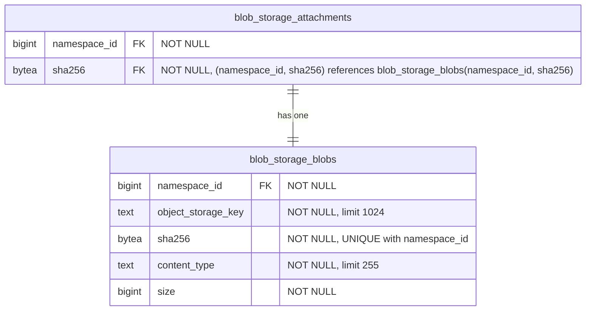
```mermaid
erDiagram
    blob_storage_attachments ||--|| blob_storage_blobs : "has one"

    blob_storage_attachments {
        bigint namespace_id FK "NOT NULL"
        bytea sha256 FK "NOT NULL, (namespace_id, sha256) references blob_storage_blobs(namespace_id, sha256)"
    }

    blob_storage_blobs {
        bigint namespace_id FK "NOT NULL"
        text object_storage_key "NOT NULL, limit 1024"
        bytea sha256 "NOT NULL, UNIQUE with namespace_id"
        text content_type "NOT NULL, limit 255"
        bigint size "NOT NULL"
    }
```

- **blob_storage_attachments**: 指定された Blob の使用を追跡します。各クライアント（コンテナ、NPM、または Maven のリポジトリテーブル）は、Blob レコードを使用（作成または再使用）したいたびにここにレコードを作成する必要があります。各使用は _ここに_ 単一のレコードを持つ必要があります。クライアントは、参照しているアーティファクトレコード（ファイル、Blob、キャッシュエントリ）を削除するときに、アタッチメントレコードを削除する責任があります。両方の削除は、孤児化したアタッチメントが Blob クリーンアップをブロックするのを防ぐため、同じトランザクションで行わなければなりません。クライアントテーブルから `blob_storage_attachments` への外部キーは、参照整合性（ダングリング参照を防ぐ）を強制しますが、`ON DELETE CASCADE` は使用しません — クリーンアップはアプリケーション管理です。例えば、まったく同じファイルを持つ 2 つの Maven パッケージは、それぞれ異なるアタッチメントレコードを参照し、それらは同じ Blob レコードを参照するべきです。`namespace_id` カラムは Cells シャーディングに必要です。`sha256` カラムは、パーティション-プルーンされた結合を可能にするため、参照される `blob_storage_blobs` レコードから伝播されます（[パーティショニング戦略](#blob-storage-partitioning-strategy) を参照）。プライマリキーは慣例の `(id)` ではなく `(id, sha256)` です — PostgreSQL はハッシュ-パーティショニングテーブル上のすべてのユニーク制約にパーティションキーを含むことを要求します。クライアントテーブルは `(blob_storage_attachment_id, blob_sha256)` を介してこの複合 PK を参照します。
- **blob_storage_blobs**: このテーブルは、オブジェクトストレージ上に存在するすべてのファイルコンテンツ（Blob として）をリストします。オブジェクトストレージキーは完全に専用カラムに保存され、Blob が使用されるたびに計算されません。`sha256` は基本的なコンテンツアドレッサブルな識別子であり、常に存在します（`NOT NULL`）。`namespace_id` カラムは重複排除を Organization にスコープし、`[namespace_id, sha256]` のユニーク制約により、各 Organization 内で Blob が重複排除されることを保証します。フォーマット固有のチェックサム（例: Maven の SHA1 と MD5）は、このテーブルではなくフォーマット固有のファイルテーブルに保存され、このテーブルをフォーマット非依存に保ちます。プライマリキーは、ハッシュ-パーティショニングテーブル上のすべてのユニーク制約にパーティションキーを含むという PostgreSQL の要件を満たすため、`(id, sha256)` です。

Blob ストレージテーブルは、Artifact Registry の外で再利用可能になるよう設計されています。これにより、他の機能が同じ重複排除とストレージインフラを活用できます。

すべてのハッシュカラム（`digest` と `sha256`、`sha1` と `md5` — Maven 固有）は `bytea` として保存されます。正確なエンコード戦略（例: [Container Registry](https://gitlab.com/gitlab-org/container-registry) で使用されるインラインアルゴリズムプレフィックス、または別の `digest_algorithm` カラム）は、まだ決定されていません。

### Upload sessions {#upload-sessions}

アップロードセッションは、[ADR-008](008_content_addressable_storage.md#two-phase-upload-strategy) で説明されている 2 フェーズアップロードライフサイクルを通じて、進行中の Blob アップロードを追跡します。各セッションは、namespace のストレージパーティション内の `uploads/{upload_id}` にある一時ストレージオブジェクトにマッピングされます。セッションは、アップロード API（再開可能なアップロード、並行アップロード解決）をサポートし、オブジェクトストレージ列挙なしで [アップロード除去](#cleanup-tasks)（[ADR-011](011_data_reconciliation.md)）を可能にするため、初期スキーマからデータベースで追跡されます。

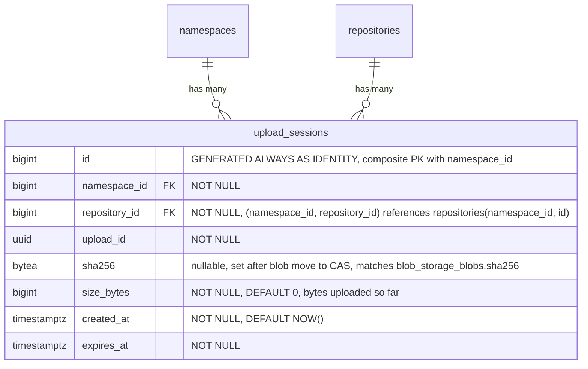
```mermaid
erDiagram
    namespaces ||--o{ upload_sessions : "has many"
    repositories ||--o{ upload_sessions : "has many"

    upload_sessions {
        bigint id "GENERATED ALWAYS AS IDENTITY, composite PK with namespace_id"
        bigint namespace_id FK "NOT NULL"
        bigint repository_id FK "NOT NULL, (namespace_id, repository_id) references repositories(namespace_id, id)"
        uuid upload_id "NOT NULL"
        bytea sha256 "nullable, set after blob move to CAS, matches blob_storage_blobs.sha256"
        bigint size_bytes "NOT NULL, DEFAULT 0, bytes uploaded so far"
        timestamptz created_at "NOT NULL, DEFAULT NOW()"
        timestamptz expires_at "NOT NULL"
    }
```

- **upload_sessions**: 進行中の各 Blob アップロードを追跡します。テーブルは [コンテナレジストリパターン](https://gitlab.com/gitlab-org/container-registry/-/blob/master/registry/storage/blobwriter.go) を反映したバイナリ存在モデルに従います: 行が存在する場合、アップロードは進行中またはクリーンアップが必要です。行が存在しない場合、アップロードは完了したか除去されました。完了時、アプリケーションは Blob をコンテンツアドレッサブルストアに移動し、`blob_storage_blobs` および `blob_storage_attachments` レコードを作成するのと同じトランザクションでセッション行を削除します。`upload_id`（UUID）は、一時オブジェクトパス（`uploads/{upload_id}`）で使用されるストレージレベルの識別子です。`repository_id` はアップロードを開始したリポジトリを記録します。フォローアップリクエスト（PATCH チャンク、PUT コミット、DELETE キャンセル）で、サーバーは URL のリポジトリが session.repository_id と一致することを確認し、upload_id がリークした場合のクロスリポ再利用を防ぎます。各リクエストの認可は URL のリポジトリに対してリクエストミドルウェアによって実行され、このカラムには依存しません。複合 FK `(namespace_id, repository_id)` は、アップロードがターゲットリポジトリと同じ namespace 内にあることを強制します。`sha256` はアップロード中は NULL で、Blob が最終的なコンテンツアドレッサブルパスに移動された後に設定されます。これは外部キーではない普通の値で、アプリケーションが Blob を CAS に移動してからセッション行を削除するまでの間にクラッシュしたケースを処理します — `sha256 IS NOT NULL` は、Blob がすでに移動され、残りのステップはクリーンアップを終了して行を削除することであることを示します。`size_bytes` は一時ストレージに書き込まれたバイト数を追跡します。再開可能なアップロードでは、各チャンクが到着するたびに更新され、クライアントが再開する場所を伝える `Range` レスポンスヘッダーを生成するために使用されます（[OCI Distribution Spec](https://github.com/opencontainers/distribution-spec/blob/main/spec.md)）。モノリシックアップロードでは、Blob データが書き込まれた後に設定されます。`created_at` はアップロードが開始された時を記録します。これによりアップロード期間メトリクス（期間と Blob サイズの相関）を可能にし、アプリケーションの TTL 設定が下げられた場合の遡及的な期限切れ（`WHERE created_at < NOW() - :new_ttl`）を可能にします。これは `expires_at` だけではサポートできません。なぜなら既存セッションは元の期限を保持するからです。`expires_at` はセッション期限切れタイムスタンプで、作成時にアップロードタイプに基づいて `NOW() + :configured_ttl` として計算されます（再開不可アップロードでは短く、再開可能アップロードでは長く）。期限切れセッションはアップロード除去の候補です: 除去機構は一時ストレージオブジェクトを削除し、行を削除します（[ADR-008](008_content_addressable_storage.md#temporary-object-cleanup)）。再開可能アップロードのハッシュ状態は、コンテナレジストリパターンに従って、データベースではなくオブジェクトストレージ内のアップロードデータと共に保存されます（`uploads/{upload_id}/hashstates/{algorithm}/{offset}`、[ADR-008](008_content_addressable_storage.md#resumable-uploads-and-hash-state)）。`HASH(namespace_id)` で 64 パーティションにパーティショニングされ、スキーマ内の他のすべての `namespace_id`-スコープテーブルと一致します。セッションは短命ですが、アップロード除去機構は先送りされている（[ADR-011](011_data_reconciliation.md)）ため、出荷されるまで期限切れ行が蓄積します。初日からのパーティショニングは後のマイグレーションを回避し、`repositories` とのパーティション-ワイズ結合の適格性を保ち、空のパーティションでは何のコストもかかりません。プライマリキーは慣例の `(id)` ではなく `(id, namespace_id)` です — PostgreSQL はハッシュ-パーティショニングテーブル上のすべてのユニーク制約にパーティションキーを含むことを要求します。これは上記の `blob_storage_attachments` 慣例と一致します。

#### インデックス

- **`upload_sessions`**: `(namespace_id, upload_id)` のユニークインデックス — namespace 内でアップロード UUID によりセッションを検索。`expires_at` のインデックス — アップロード除去のため期限切れセッションを見つける。`(namespace_id, repository_id)` のインデックス — 認可チェックとリポジトリ削除時のクリーンアップに使用される、指定されたリポジトリのすべてのセッションを見つける。

#### クエリ例

- アップロードセッションを作成

  ```sql
  INSERT INTO upload_sessions (namespace_id, repository_id, upload_id, expires_at)
  VALUES (123, 456, 'a0eebc99-9c0b-4ef8-bb6d-6bb9bd380a11', NOW() + INTERVAL '1 hour')
  RETURNING id, upload_id;
  ```

- チャンクアップロード中のセッションを検索

  ```sql
  SELECT *
  FROM upload_sessions
  WHERE namespace_id = 123 AND upload_id = 'a0eebc99-9c0b-4ef8-bb6d-6bb9bd380a11';
  ```

- 成功した Blob 移動後に Blob ダイジェストを記録

  ```sql
  UPDATE upload_sessions
  SET sha256 = 'abcd1234...'::bytea, size_bytes = 1048576
  WHERE namespace_id = 123 AND upload_id = 'a0eebc99-9c0b-4ef8-bb6d-6bb9bd380a11';
  ```

- アップロード除去のため期限切れセッションを見つける

  ```sql
  SELECT id, namespace_id, upload_id
  FROM upload_sessions
  WHERE expires_at < NOW()
  ORDER BY expires_at
  LIMIT 100;
  ```

  このクエリはパーティション-プルーンされません — 述語に `namespace_id` が含まれていないため、すべての 64 パーティションをスキャンします。これは許容されます: 除去機構はホットパスクエリではなく境界のあるバックグラウンドジョブ（`expires_at` のインデックスでバックされる `LIMIT 100`）であり、ファンアウトはパフォーマンスにとって重要ではありません。

- クリーンアップ後にセッションを削除

  ```sql
  DELETE FROM upload_sessions
  WHERE namespace_id = 123 AND id = 789;
  ```

### Blob ストレージのパーティショニング戦略 {#blob-storage-partitioning-strategy}

[結果](#negative) で記述されているように、`blob_storage_blobs` と `blob_storage_attachments` は、すべての Organization にわたるすべてのアーティファクトフォーマットを扱うため、非常に高い行数を蓄積します。意図的なパーティショニング戦略がないと、これは次につながります。

- テーブルが数十億行に成長するにつれてのインデックス膨張とクエリパフォーマンス劣化。
- すべてのアーティファクトタイプを同時にブロックする、テーブル全体のロック（例: インデックス作成またはスキーママイグレーション中）。
- 高い書き込みレートでの autovacuum 競合。

念頭に置くべき重要な制約: PostgreSQL はパーティショニングされたテーブル上のすべてのユニーク制約にパーティションキーを含めることを要求します。`blob_storage_blobs` の場合、既存のユニーク制約は `[namespace_id, sha256]` にあります。パーティションキーがそれらのカラムのサブセットでない戦略では、追加のカラム（`id` など）を制約に強制することになり、これは異なるパーティション間で同じ Organization 内に同じ Blob が 2 度保存されるのを防がなくなり、重複排除モデルを完全に損ないます。

以下に候補戦略を示します。

#### オプション A: `sha256` でハッシュパーティショニング

両方のテーブルを `PARTITION BY HASH (sha256)` で 64 パーティションにパーティショニングします。

`sha256` はコンテンツアドレッサブルダイジェストであるため、その値は本質的に均等に分布します — 均等なデータ分布のための追加の労力は不要です。これは単一テナント問題を解決します: 単一テナントデプロイメント（Dedicated、Self-Managed、単一 Organization Cells）は、`namespace_id` のみを使用すると 1 つのパーティションにすべての行を集中させますが、`sha256` をパーティションキーとすると、Organization の数にかかわらず、すべての 64 パーティションに行が均等に分散します。

`[namespace_id, sha256]` の既存のユニーク制約はすでに `sha256` を含んでいるため、このスキームと互換性があります — PostgreSQL はパーティションキーが制約の一部であるため、ハッシュパーティション間で一意性を強制できます。

このアプローチでは、`blob_storage_blobs` への結合が単一パーティションをターゲットにできるよう、`sha256` を `blob_storage_attachments` とフォーマット固有テーブル（`*_files`、`container_blobs`、`container_manifests`、キャッシュエントリ）に伝播する必要があります。これは、Blob 識別子（`namespace_id` + `sha256`）が `*_files` と `blob_storage_attachments` 行の両方に保存され、シンプルな `bigint` 外部キーよりも多くの物理ストレージを使用することを意味します（`sha256` は `bytea` で 32 バイト vs `bigint` で 8 バイト）。ただし、トレードオフは正当化されます: 読み取りパス（アーティファクトプル）— システム内で最もホットなクエリ — は、`*_files` から `blob_storage_blobs` へ `(namespace_id, sha256)` を介して直接結合でき、`blob_storage_attachments` を完全にスキップして 1 つの結合を排除できます。アタッチメントは、ライフサイクルパス — [クリーンアップ](#cleanup-tasks) 中に「この Blob はまだ誰かに使われているか？」に答えるため — に必要なままです。

5 つの重要なアクセスパターンは次のように動作します。

| # | 操作 | 頻度 | ヒットするパーティション |
|---|-----------|-----------|----------------|
| AP1 | アーティファクトプル（`*_files` → `blob_storage_blobs` を `namespace_id` + `sha256` 経由） | 最高 | 1 |
| AP2 | 孤児チェック（`WHERE namespace_id = ? AND sha256 = ?`） | 高 | 1 |
| AP3 | 重複排除 upsert（`ON CONFLICT (namespace_id, sha256) DO NOTHING`） | 中-高 | 1 |
| AP4 | アタッチメント CRUD（Blob から伝播された `namespace_id` + `sha256`） | 中 | 1 |
| AP5 | Organization ごとのストレージアカウンティング（`WHERE namespace_id = ?`、`sha256` なし） | 低 | 64 すべて（緩和あり） |

**ポジティブ**:

- テナントの集中にかかわらず均等な分布: 単一テナントデプロイメントは、1 つに集中するのではなく、すべての 64 パーティションにデータを分散します。
- すべての高頻度アクセスパターン（プル、孤児チェック、重複排除 upsert、アタッチメント CRUD）が正確に 1 つのパーティションにヒットします。
- ユニーク制約 `(namespace_id, sha256)` がパーティションキーを含む — 重複排除 upsert は単一パーティションをターゲットにし、外部ロックなしで `ON CONFLICT DO NOTHING` を介して並行アップロードを解決します。
- 読み取りパス（アーティファクトプル）は `blob_storage_attachments` 結合を完全にスキップし、`*_files` から `blob_storage_blobs` へ `(namespace_id, sha256)` を介して直接行きます。

**ネガティブ**:

- `sha256` をより多くのテーブルに伝播する必要がある: `blob_storage_attachments` とフォーマット固有テーブル（`*_files`、`container_blobs`、`container_manifests`、キャッシュエントリ）は `blob_storage_attachment_id` 外部キーに加えて `(namespace_id, sha256)` を持ちます。これは行間で Blob 識別子を重複させ、行ごとのストレージを増加させます。
- `namespace_id` のみのクエリ（`sha256` なし）はパーティションをプルーンできず、すべての 64 パーティションをスキャンします。主なケースは、ストレージアカウンティング（Organization ごとに Blob サイズを合算）です。これは、Blob の挿入/削除時に遅延インクリメントを介して更新される専用のロールアップテーブルで緩和されます — GitLab で確立されたパターン（例えばプロジェクト統計）です。ロールアップテーブルなしでも、64 パーティションにわたる並列集計は数秒で完了します。

#### オプション B: `namespace_id` でハッシュパーティショニング

両方のテーブルを `PARTITION BY HASH (namespace_id)` で固定数のパーティションにパーティショニングします。

すべての一般的なアクセスパターンはすでに `WHERE` 句に `namespace_id` を含んでいるため、クエリプランナーはあらゆる操作で単一パーティションをターゲットにできます。Cells シャーディングキー（`namespace_id`）はパーティションキーを兼ね、より広いアーキテクチャと一致します。

`[namespace_id, sha256]` のユニーク制約はすでに `namespace_id` を含んでいるため、変更なしでこのスキームと互換性があります — PostgreSQL はすべてのハッシュパーティションにわたってグローバルに一意性を強制します。

**ポジティブ**:

- すべての Organization スコープのクエリは単一パーティションにヒットし、クエリプランナーは他のすべてを自動的にプルーンします。
- パーティションプルーニングはクリーンアップパスに直接適用されます: `blob_storage_attachments` の孤児チェック（`WHERE namespace_id = ? AND sha256 = ?`）は単一パーティションをターゲットにすることが保証され、検索コストは合計テーブル量ではなくパーティションサイズで境界付けられます。
- スキーマ変更とロックは単一パーティションにスコープされ、他の Organization への影響を削減します。
- Cells シャーディングキーと整合します。一般的なアクセスパターンに対するクロスパーティション作業はありません。
- `[namespace_id, sha256]` の既存制約は変更なしで正しく動作します。

**ネガティブ**:

- Blob 数が非常に多い Organization は、Organization のサイズが大きく異なる場合、ハッシュパーティションを支配する可能性があります。単一テナントデプロイメント（Dedicated、Self-Managed、単一 Organization Cells）では、すべての行が単一パーティションに集中します — VACUUM に何時間もかかり、インデックスが数百 GB に達します。
- `WHERE` 句から `namespace_id` を省略するクエリは、すべてのパーティションをスキャンします。

#### オプション C: `id`（プライマリキー）でレンジパーティショニング

両方のテーブルを自動インクリメントするプライマリキーの範囲でパーティショニングします。これは GitLab の既存の[テーブルパーティショニングフレームワーク](https://docs.gitlab.com/ee/development/database/table_partitioning.html)で使用されているアプローチで、既存のツールでよくサポートされています。

**ポジティブ**:

- パーティションサイズは予測可能に成長します。データが蓄積するにつれて新しいパーティションを追加するのが容易です。
- GitLab の既存パーティション管理インフラと互換性があります。

**ネガティブ**:

- 重複排除の一意性を破壊する: PostgreSQL はパーティショニングされたテーブル上のすべてのユニーク制約に `id` を含めることを要求します。`[namespace_id, sha256]` に `id` を追加すると、同じ Organization の同じ sha256 が複数のパーティションに現れる可能性があります — 重複排除モデルが完全に壊れます。
- クエリは Organization スコープですがパーティションは id レンジベースであるため、すべての Organization スコープのクエリが複数のパーティションにまたがります。
- ロックスコープの削減は Organization 境界と整合しません。

#### オプション D: `created_at` でレンジパーティショニング

両方のテーブルを時間範囲（例: 月次または四半期ウィンドウ）でパーティショニングします。

**ポジティブ**:

- 古いパーティションは、その Blob がクリーンアップされた後にアーカイブまたは削除しやすい。
- パーティションは既知の時間ウィンドウに対応し、明確な運用モデル。

**ネガティブ**:

- ホットパーティション問題: すべての書き込みが最新のパーティションをターゲットにし、書き込み競合を集中させます。
- Blob は年齢ではなくすべてのアタッチメントを失ったときに期限切れになります。時間ベースのパーティショニングは実際の Blob ライフサイクルと整合しません。
- オプション C と同じユニーク制約問題: `created_at` をユニーク制約に追加する必要があり、クロスパーティションの重複排除を破壊します。
- アクセスパターンは Organization スコープで、時間スコープではないため、クエリはすべてのパーティションにまたがります。

#### オプション E: パーティショニングなし

主要なスケーラビリティ機構として Cells レベルのシャーディング（`namespace_id`）と標準インデックスに依存します。メトリクスがパーティショニングが必要であることを示すまで、パーティショニングは先送りされます。

**ポジティブ**:

- シンプルなスキーマと運用: パーティション管理オーバーヘッドなし。マイグレーションとスキーマ変更が単純です。
- 初期スケールで十分: 単一の Cell 内で行数が管理可能なままで動作します。

**ネガティブ**:

- Cell 内での無制限の成長: テーブルが成長するにつれてテーブルレベルのロックがすべての Organization に同時に影響します。
- よく設計されたインデックスでも非常に高い行数ではパフォーマンスプレッシャーに直面します。

#### 決定

**`sha256` でのハッシュパーティショニング（オプション A）が選択されます**、`blob_storage_blobs` と `blob_storage_attachments` の両方に対して。

これは次のことが可能な唯一のオプションです。

1. すべての高頻度アクセスパターン（アーティファクトプル、孤児チェック、重複排除 upsert、アタッチメント CRUD）を単一パーティション内に保つ。
2. テナントの集中にかかわらず行を均等に分布させる — `namespace_id` ベースのパーティショニングが 1 つのパーティションにすべての行を集中させる単一テナントデプロイメント（Dedicated、Self-Managed、単一 Organization Cells）にとって重要。
3. `[namespace_id, sha256]` の既存ユニーク制約と変更なしで互換性があり、`ON CONFLICT (namespace_id, sha256) DO NOTHING` を介した競合のない重複排除 upsert を可能にする。

両方のテーブルに対して 64 パーティションの初期値が選択されます。これは、運用オーバーヘッドを管理可能に保ちつつ、十分な分布とロック分離を提供します。

トレードオフは、`sha256` を `blob_storage_attachments` とフォーマット固有テーブル（`*_files`、`container_blobs`、`container_manifests`、キャッシュエントリ）に伝播する必要があることです。これは Blob 識別子（`namespace_id` + `sha256`）を行間で重複させ、`bigint` 外部キーのみよりも多くの物理ストレージを使用します。利益は、読み取りパス — システム内で最もホットなクエリ — が `*_files` から `blob_storage_blobs` へ `(namespace_id, sha256)` を介して直接結合し、`blob_storage_attachments` を完全にスキップして 1 つの結合を排除することです。アタッチメントは [クリーンアップライフサイクルパス](#cleanup-tasks) のためだけに残ります。

`namespace_id` のみ（`sha256` なし）のクエリ、例えば Organization レベルのストレージアカウンティングは、パーティションをプルーンできず、すべての 64 をスキャンします。これは、遅延インクリメントを介して更新される専用ロールアップテーブルで緩和されます — GitLab で確立されたパターン（例えばプロジェクト統計）です。

### キャッシュエントリのパーティショニング戦略

すべてのキャッシュエントリテーブル（`container_remote_cache_entries`、`container_virtual_local_cache_entries`、`maven_remote_cache_entries`、`maven_virtual_local_cache_entries`、`npm_remote_cache_entries`、`npm_virtual_local_cache_entries`）は、`PARTITION BY HASH (namespace_id)` で 64 パーティションにパーティショニングされます。

キャッシュエントリのすべてのプライマリアクセスパターンは `namespace_id` スコープ（アップストリーム／リモートリポジトリと相対パスでの検索、アップストリームのエントリ一覧）であるため、`namespace_id` をパーティションキーとすると、あらゆる操作で単一パーティションプルーニングが保証されます。既存のユニーク制約（例: `(namespace_id, *_remote_repository_id, relative_path)` または `(namespace_id, *_virtual_repository_upstream_id, relative_path)`）はすでに `namespace_id` を含んでいるため、変更なしで互換性があります。

`blob_storage_blobs` とは異なり、単一テナントの集中問題はここでは懸念ではありません — キャッシュエントリは大幅にボリュームが小さい（プルされたアップストリームアーティファクトのキャッシュであり、すべてのフォーマットにわたるすべての Blob コンテンツではない）。キャッシュエントリから `blob_storage_blobs` への `(namespace_id, blob_sha256)` を介した結合は、クロスパーティションスキャンなしで動作します: プランナーは `namespace_id` を介してキャッシュエントリパーティションをプルーンし、`sha256` を介して Blob パーティションを独立してプルーンします。

### アーティファクトファイルテーブルのパーティショニング戦略

すべてのフォーマット固有のファイルテーブル（`maven_files`、`npm_files`、`container_blobs`、`container_manifests`）は、`PARTITION BY HASH (namespace_id)` で 64 パーティションにパーティショニングされます。

ファイルテーブルのすべてのプライマリアクセスパターンは `namespace_id` スコープ（バージョンとファイル名による検索、パッケージまたはイメージのファイル一覧）であるため、`namespace_id` をパーティションキーとすると、あらゆる操作で単一パーティションプルーニングが保証されます。既存のインデックスとユニーク制約はすでに `namespace_id` を含んでいるため、変更なしで互換性があります。特に、読み取りパスのショートカット（`*_files` → `blob_storage_blobs` を `(namespace_id, sha256)` 経由で、`blob_storage_attachments` をスキップ）— システム内で最もホットなクエリ — はこのパーティショニングから直接恩恵を受けます。

キャッシュエントリと同様、単一テナントの集中問題はここでは懸念ではありません — ファイルテーブルは個別のアーティファクトフォーマットにスコープされ、`blob_storage_blobs` のようにすべてのフォーマットにわたって集計されません。ファイルテーブルから `blob_storage_blobs` への `(namespace_id, blob_sha256)` を介した結合は、クロスパーティションスキャンなしで動作します: プランナーは `namespace_id` を介してファイルテーブルパーティションをプルーンし、`sha256` を介して Blob パーティションを独立してプルーンします。

### パーティション数の根拠

すべての `HASH(namespace_id)` テーブルは 64 パーティションを使用し、`blob_storage_blobs` と `blob_storage_attachments`（`HASH(sha256)`）に選ばれた 64 パーティションと一致します。この数は、既存のコンテナレジストリとパッケージレジストリのデータベースの本番データに基づいています。

パーティション数は、最大の予想テーブル（`container_blobs`）によって駆動されます。本番アナログはすでに比較可能なスケールで 64 パーティションを使用しています。他のフォーマット固有のテーブルはかなり小さいため、64 パーティションはそれらすべてに快適です。

この決定の主要な要因:

- **歪みの許容**: `HASH(namespace_id)` は均等な分布を保証しません。namespace のサイズは大きく歪んでいます — 少数の大きな namespace が不釣り合いな割合の行を保持します。パーティション数が少ないと、同じパーティションにハッシュされる大きな namespace が不均衡を増幅します。64 パーティションでは、最悪の歪みでもパーティションサイズは管理可能のままです。
- **パーティション不足は修正に高コスト**: パーティション数を後で変更するには完全なテーブル再構築が必要です。小さなテーブルを過剰にパーティショニングするオーバーヘッドはわずかですが、大きなテーブルをパーティション不足にすると実際の運用リスクが生じます。
- **パーティション-ワイズ結合**: PostgreSQL は、同じパーティションスキーム（同じキー、同じメソッド、同じ数）を共有するテーブル間の JOIN を、マッチするパーティションを直接結合することで最適化できます。すべての `HASH(namespace_id)` テーブルが 64 パーティションを使用しているため、この最適化が利用可能です。実際には、クエリはすでに `namespace_id = ?` を含んでいるため、プランナーは各サイドで 1 つのパーティションにプルーンしますが、パーティション-ワイズ結合は無料の最適化として残ります。
- **運用一貫性**: すべての `namespace_id`-パーティショニングテーブルにわたって単一のパーティション数を持つことは、特定の `namespace_id` に対するすべてのテーブルが同じパーティション番号にハッシュされることを意味し、メンテナンススクリプト、モニタリング、一括操作を簡素化します。

**明示的なパーティショニングのないテーブル**: 次のテーブルはこの初期スキーマでパーティショニングされません: `namespaces`、すべてのライフサイクルテーブル、フォーマット固有のリポジトリテーブル（パーティショニングされた `repositories` 親と 1:1）、中間層テーブル（`container_images`、`container_tags`、`container_manifest_relationships`、`maven_packages`、`maven_versions`、`npm_packages`、`npm_versions`、`npm_tags`、`npm_metadata_files`）。1:1 リポジトリテーブルと namespace レベルの構成テーブルでは、行数が境界付けられパーティショニングは不要です。中間層テーブルでは、すべての子テーブル（ファイル、キャッシュエントリ）がすでに `namespace_id` でパーティショニングされておりすべてのインデックスが先頭カラムとして `namespace_id` を含んでいるため、依存テーブルへのスキーマ変更なしに `HASH(namespace_id)` で 64 パーティションへのパーティショニングを後で追加できます。この決定は、本番メトリクスが利用可能になったら再検討されます。`workspaces` は、よりシンプルなアクセスパターンとより低い書き込み頻度にもかかわらずパーティショニングされます: MVP 後の成長（namespace あたり、すべてのフォーマットにわたる複数のワークスペース）はテーブルを数百万行への道に置き、スキーマ調整は最小限（PK が `(id, namespace_id)` になり、既存のユニークインデックスを吸収）で、すべての他の `namespace_id`-パーティショニングテーブルとの一貫性はメンテナンスを簡素化し、`repositories` とのパーティション-ワイズ結合の適格性を保ちます。

### バッファされた非同期書き込み {#buffered-and-asynchronous-writes}

いくつかのカラムはダウンロードまたはアップロードリクエストごとに更新されます: `repositories` のカウンターカラム（`artifacts_count`、`downloads_count`、`size_bytes`）と、`container_images`、`maven_packages`、`maven_versions`、`npm_packages`、`npm_versions` の `last_downloaded_at` タイムスタンプです。リクエストパスでこれらを直接書くと、同じ行に対する並行リクエストが直列化され（人気のあるパッケージのホット行競合）、リクエストレイテンシがデータベース書き込みスループットに結合されます。

これを避けるため、これらのカラムはバッファ／非同期書き込みで維持されます: リクエストハンドラーは更新を高速な中間ストア（例: Redis）に記録し、バックグラウンドプロセスが定期的にバッファされたエントリを行にマージし戻します。これは GitLab の `ProjectStatistics` と同じパターンを再利用します。

このように維持されるカラムは、スキーマ図で `buffered` とフラグされます。

#### マージセマンティクス

マージ戦略はカラムタイプに依存します。

- **カウンター** (`artifacts_count`、`downloads_count`、`size_bytes`): バッファされたデルタを既存値に合算します。すべてのインクリメントを保持する必要があります — インクリメントを失うと永続的に過小カウントします。
- **タイムスタンプ** (`last_downloaded_at`): バッファされた値と既存値の最大値を取ります（最新が勝つ）。最新のダウンロード時刻のみが重要で、中間値は破棄できます。

両方の戦略は同じバッファインフラを共有し、書き込み前にバッファされたエントリがどう減らされるかでのみ異なります。

#### トレードオフ

- **古さ**: バッファされたカラムは現実から最大 1 フラッシュ間隔遅れます。これは現在のコンシューマーには許容されます — ライフサイクルルール評価（`keep_last_downloaded_at`）はフラッシュ間隔よりずっと上のスケジュールで実行され、ランディングページのカウンターは短い乖離を許容します。同期的に自分の書き込みを観察する必要がある読み取りや、ダウンロードイベントの正確な順序を必要とする決定には _適していません_。
- **バッファ損失**: フラッシュ前にバッファが失われると、最近の更新がドロップされます。カウンターでは永続的な過小カウントです。タイムスタンプでは次のダウンロードが正しい（わずかに遅延した）値を復元します。

### Cleanup tasks {#cleanup-tasks}

上記のアプローチを理解するためには、クリーンアップに関する Blob ストレージ部分の課題を理解することが重要です。

一方では、親オブジェクトが破棄される一部として削除される 1 つまたは多くのアタッチメントを持つことができます（パッケージが破棄される、またはクリーンアップポリシーが実行されて数百のファイルを削除する）。

他方では、Blob テーブルからレコードを単に削除することはできません。これらはオブジェクトストレージ上のファイルを参照しているからです。したがって、Blob レコードを取り、それを削除し、オブジェクトストレージ上のファイルも削除するクリーンアップタスクが必要です。これはデータベースでは行えません。バックグラウンドプロセスとして実装されるコールバックが必要です。

破棄のために Blob を扱う前に、バックエンドはそれが（重複排除のため）どの部分でもまだ使用されていないことを確認する必要があります。それがアタッチメントテーブルが重要な役割を果たす場所です: 指定された Blob の使用を記録します。クリーンアップタスクは、`(namespace_id, sha256)` ペアがアタッチメントテーブルにまだ存在するかどうかを単に尋ねることができます（[孤児チェッククエリ](#blob-storage-query-examples) を参照）。それが no であれば、Blob は削除可能です。

このアプローチは、各 Blob ストレージクライアントで作業するエンジニアにとってクリーンアップ契約をシンプルに保ちます。アーティファクトレコード（単一ファイル、一括破棄、またはクリーンアップポリシー実行）を削除するとき、アプリケーションは同じトランザクションで対応する `blob_storage_attachments` レコードも削除する必要があります。これがクライアントレベルでの唯一のクリーンアップ責任で、オブジェクトストレージとの相互作用は不要です。そこから、Blob ストレージのバックグラウンドプロセスが引き継ぎます: 残りのアタッチメントがない `blob_storage_blobs` 行を識別し（孤児チェック）、データベースレコードとオブジェクトストレージファイルの両方を削除します。

アップロードセッションのクリーンアップは同様のパターンに従います。`upload_sessions` テーブルはバイナリ存在モデルを使用します — 行が存在する場合、アップロードは進行中またはクリーンアップが必要 — そのため期限切れセッション（`expires_at < NOW()`）は除去候補になります。除去機構は一時ストレージオブジェクトを削除し、行を削除します。テーブルは、ストレージ内のオブジェクトを列挙せずに、候補を識別しストレージパス（namespace パーティション下の `uploads/{upload_id}`）を導出するために必要なすべての情報を提供します。アップロード除去の出荷タイムラインは [ADR-011](011_data_reconciliation.md) を参照してください。

このブループリントは、クリーンアッププロセスを可能にする高レベルのデータベースプリミティブ（アタッチメント追跡、Blob ストレージ構成、アップロードセッション追跡）を確立しますが、具体的な実装詳細（トリガー、バックグラウンドジョブロジック、パフォーマンス分析）は後続の詳細仕様作業に残されます。

### ストレージ使用量計算

Blob ストレージスキーマは、Organization レベルのストレージ使用量計算と按分を正確かつ効率的にするよう設計されています。

- Blob とアタッチメントは Organization にスコープされ、重複排除は Organization **内** でのみ発生します（[ADR-002](002_storage_deduplication_scope.md) を参照）。
- `blob_storage_blobs` は **Organization あたり一意な保存 Blob ごとに 1 行** を持ちます: オブジェクトストレージ内の各物理オブジェクトは Organization あたり 1 度表されます。
- 物理 Blob と `blob_storage_blobs` レコードは、すべてのアタッチメントを失ったときに非同期にクリーンアップされる（[クリーンアッププロセス](#cleanup-tasks) を通じて）ため、`blob_storage_blobs` はまだ使用中（または非同期削除待ち）の Blob のみを参照します。結果として、ストレージ使用量クエリはアタッチメント数でフィルタする必要がありません。

したがって、指定された Organization のストレージ使用量を計算することは、`blob_storage_blobs` にリストされたその Blob のサイズを合算する問題です。これはマニフェストごとの `container_manifests.size`（[Container Repositories](#container-repositories) を参照）とは異なります: 後者は「このマニフェストツリーはどれくらい大きいか」に答え、マニフェスト間で共有される、またはマニフェストリストの子間で共有される Blob を二重カウントする可能性があるため、Organization レベルの使用量の代替にはなりません。

別の ADR でストレージ使用量計算と按分の詳細を記述します。本 ADR は、それらの計算を容易にするデータベースプリミティブとその根拠に焦点を当てています。

### インデックス

- **`blob_storage_blobs`**: `(namespace_id, sha256)` のユニークインデックス — 重複排除を強制し、Organization 内で sha256 による Blob 存在をチェック。この制約はパーティションキー（`sha256`）を含むため、PostgreSQL はすべてのハッシュパーティションにわたって正しく強制します。
- **`blob_storage_attachments`**: `(namespace_id, sha256)` のインデックス — Blob のコンテンツハッシュが指定されたアタッチメントの存在をチェック（[クリーンアッププロセス](#cleanup-tasks) で孤児チェックに使用）。

両方のハッシュパーティショニングテーブルでは、インデックスはパーティションごとにローカル — インデックス操作は単一パーティションにスコープされ、テーブル全体をロックしません。

### Blob ストレージのクエリ例 {#blob-storage-query-examples}

- アーティファクトをプル（読み取りパスのショートカット: `*_files` → `blob_storage_blobs`、アタッチメントをスキップ — 1 パーティション）

  ```sql
  SELECT bsb.object_storage_key, bsb.size
  FROM maven_files mf
  JOIN blob_storage_blobs bsb ON bsb.namespace_id = mf.namespace_id AND bsb.sha256 = mf.blob_sha256
  WHERE mf.namespace_id = 123 AND mf.maven_version_id = 456 AND mf.file_name = 'myapp-1.0.0.jar'
    AND mf.soft_deleted_at IS NULL;
  ```

- Blob アップロード時の重複排除 upsert（1 パーティション、競合フリー）

  ```sql
  INSERT INTO blob_storage_blobs (namespace_id, sha256, size, content_type, object_storage_key)
  VALUES (123, 'abcd1234efgh5678...'::bytea, 1048576, 'application/octet-stream', 'key')
  ON CONFLICT (namespace_id, sha256) DO NOTHING
  RETURNING id, sha256;
  ```

- Organization 内で sha256 による Blob 存在をチェック（1 パーティション）

  ```sql
  SELECT 1 AS one
  FROM blob_storage_blobs
  WHERE namespace_id = 123 AND sha256 = 'abcd1234efgh5678...'::bytea
  LIMIT 1;
  ```

- 孤児チェック: この Blob はまだ任意のアタッチメントから参照されているか？（1 パーティション）

  ```sql
  SELECT 1 AS one
  FROM blob_storage_attachments
  WHERE namespace_id = 123 AND sha256 = 'abcd1234efgh5678...'::bytea
  LIMIT 1;
  ```

## 結果

### ポジティブ

1. **各アーティファクトフォーマットに合わせたデータ構成**: 各アーティファクトフォーマットに専用テーブルを使用することで、テーブル構成に最大の柔軟性を提供します。フォーマットプロトコルが必要とする任意の数の追加カラムを持てます。すでに専用テーブルを使用しているため、追加の補助テーブルは不要です。

2. **各フォーマットデータテーブルは関連する利用パターンを持つ**: 各フォーマット専用テーブルは、Rest および GraphQL API および関連するアーティファクト管理クライアントから利用パターンを受け取ります。これは他のフォーマットの利用パターンから分離を提供します。

3. **フォーマット関連データのパフォーマンス分離**: 特定のアーティファクトフォーマットテーブルでのパフォーマンスのボトルネックは、他のフォーマットに即座に影響しません。

4. **透過的なオブジェクトストレージクリーンアップ**: [オブジェクトストレージクリーンアップタスク](#cleanup-tasks) は [Blob ストレージ](#blob-storage) ドメインに集中化されているため、親ドメイン（この場合、各フォーマット固有のドメイン）はこの部分を扱う必要がありません。さらに、このクリーンアップは削除操作がどう発生したか（単一要素の破棄、一括破棄、選択された要素のセットに対して破棄を実行するバックグラウンドクリーンアップポリシー）に影響を受けません。

5. **Blob ストレージ分離は再利用性を提供**: Blob ストレージテーブルは、ここで記述する Artifact Registry 機能に縛られていません。そのため、この部分は他の領域でのファイルアップロードのニーズに再利用できます。

6. **効率的なストレージアカウンティング**: Organization スコープの重複排除と Organization あたりの重複排除された Blob レコードは、ストレージ使用量クエリをシンプルかつ効率的にします。注: `sha256` ベースのパーティショニングでは、Organization レベルの集計はすべての 64 パーティションをスキャンします。これは遅延インクリメントを介して更新される専用ロールアップテーブルで緩和されます（[パーティショニング戦略](#blob-storage-partitioning-strategy) を参照）。

7. **統一されたフォーマット横断リスト**: 親 `repositories` テーブルは、namespace 内のすべてのフォーマットおよび種別（local、virtual、remote）にわたるすべてのリポジトリをリストする単一のソースを提供し、複数のテーブルにわたる `UNION ALL` なしでランディングページのハイブリッドリストを支えます。

8. **スタンドアローンリモートリポジトリは共有を可能にする**: 独自のライフサイクルを持つスタンドアローンエンティティとしてのリモートリポジトリは、複数の仮想リポジトリ間で共有でき、構成とキャッシュエントリの重複を削減します。

### ネガティブ

1. **フォーマット横断詳細クエリは依然として結合が必要**: 親 `repositories` テーブルがランディングページのリストユースケースを解決する一方で、フォーマット固有の詳細（例: コンテナイメージ、Maven パッケージ）にアクセスするには依然としてフォーマット固有のテーブルへの結合が必要です。

2. **Blob ストレージの集中化テーブル**: これは 2 つの欠点をもたらします。第 1 に、これらのテーブルには非常に多くの行があります。この状況を扱うには慎重なテーブル設計が必要です。第 2 に、これらのテーブルの問題（テーブル全体のロックなど）は、すべてのアーティファクトタイプに影響する可能性があります。

3. **リポジトリごとのストレージ按分は結合が必要**: リポジトリレベルでの正確なストレージ使用量按分は、フォーマット固有のテーブルから `blob_storage_attachments` を経由して `blob_storage_blobs` への結合を通じて導かれます。これは Blob ストレージを汎用的かつ重複排除されたままに保ちますが、リポジトリごとの非正規化されたカウンターと比較していくらかの複雑さを追加します。

4. **2 ステップのリポジトリ作成**: リポジトリの作成には、親 `repositories` テーブルとフォーマット固有のテーブルの両方への挿入が必要です。これは単一テーブル挿入と比較してトランザクションの複雑さを追加します。

## 代替案

### 共通データの集中化

ここでの異なるアプローチは、アーティファクトフォーマット領域のすべての共通データを共通の集中化テーブルに保存することです。

これは、複数のソースを結合せずにそれらのクエリに答えることができるため、混合アーティファクトフォーマットデータアクセスに大きく役立ちます。

このアプローチはすでに [Package Registry 機能](https://docs.gitlab.com/user/packages/package_registry/) で使用されており、執筆時点では、それらの共通テーブルは予想どおり高い量の行を持っていますが、特殊化されたインデックスの数も多いです。これらの各インデックスは、アーティファクトフォーマット固有のアクセスパターンをサポートします。インデックスの量が今日かなり高いため、新しいインデックスを追加する（例: 新しいフォーマットサポートが Package Registry 機能に追加される場合）と、より精査され、押し戻しさえあるでしょう。

加えて、各アーティファクトフォーマットには保存する必要のある特定のデータがあります（例: 正規化されたパッケージ名）。この特定のデータは、一部の行のみが使用するカラムを作成するため、共通テーブルに保存できません。これは複数の補助テーブルの作成につながります。これらの補助テーブルは、指定されたアーティファクトタイプのアクセスパターンに必要な結合の量を増やします。

`repositories` 親テーブルの導入は、このアプローチの限定版を採用します: リスティングとフィルタリングに必要なフォーマット横断メタデータ（名前、可視性、フォーマット、種別、カウンター）のみが集中化されます。フォーマット固有のデータは専用テーブルに残り、上記のインデックス増殖と補助テーブルの問題を回避します。

## 参考文献

- [ADR-001: Organizations as Anchor Point](001_organizations_as_anchor_point.md) - レジストリが Organizations をアンカーする理由
- [ADR-002: Storage Deduplication Scope](002_storage_deduplication_scope.md) - 重複排除スコープに関する詳細決定
<!-- - [ADR-010: Data Retention](010_data_retention.md) - Retention policies including soft delete and blob cleanup timing -->
- [Package Registry common tables decomposition](https://gitlab.com/groups/gitlab-org/-/work_items/16000) - 中央テーブルにアーティファクト関連の共通データを保存する際に直面する問題の詳細。
