<!-- Design Documents often contain forward-looking statements -->
<!-- vale gitlab.FutureTense = NO -->

## Context

Artifact Registry には、以下を考慮したデータベース構成が必要です。

- **異なるアクセスパターン**: アーティファクト管理クライアントは、フォーマットごとに大きく異なる独自のプロトコルを使用します。
- **スケーラビリティ**: アーティファクトのストレージは、すぐに数百万行に達する可能性があります。
- **パフォーマンス**: 前述の 2 点を踏まえつつ、操作の大半を占める読み取りクエリでは高速な実行時間を維持したいと考えています。
- **過去の落とし穴**: 現在のコンテナレジストリおよびパッケージレジストリのデータ構成にはいくつかの綻びが見られます（[例](https://gitlab.com/groups/gitlab-org/-/work_items/16000)、[例](https://gitlab.com/groups/gitlab-org/-/epics/9415)）が、ここではそれを回避します。

各決定に入る前に、以下のスキーマについていくつか注記します。これらは主に、提示するテーブル数が多いことを踏まえて可読性を高めるためのものです。

- 本ドキュメントでは、本機能のコアテーブルについて説明します。サブ機能には追加のテーブルが必要となりますが、ここでは説明しません。例として、blob ストレージのクリーンアップに必要な補助テーブルの背景については [クリーンアップタスク](#cleanup-tasks) を参照してください。
- テーブル名は可読性のために短縮しています。実際には、ここに示していない共通のプレフィックス（たとえば `artifacts_registry_container_repositories`）を共有します。
- Artifact Registry は名前空間（namespace）にスコープされます。根拠については [ADR-001](001_organizations_as_anchor_point.md) を参照してください。
- 主キーやタイムスタンプなど、いくつかの共通カラムは明瞭さのために省略しています。
- すべてのテーブルには `namespace_id` カラムが含まれます。[Cells のシャーディングキー要件](https://docs.gitlab.com/ee/development/database/multiple_databases/#guidelines-on-choosing-a-sharding-key) はサテライトサービスのデータベースには適用されません。行は名前空間のアンカータプル（`platform`、`entity_type`、`entity_id`）を通じて間接的に Organization に紐づけられます。このカラムは、以下のすべてのテーブル定義で明示的に示しています。
- すべての `jsonb` カラムは、無制限のペイロードを防ぎ期待される構造を強制するため、永続化前に厳格な JSON スキーマに対して検証する必要があります。これは本ドキュメントのすべての `jsonb` カラム（たとえば `rule_configuration` や `package_json`）に適用されます。
- テーブルが複数の暗号化された認証情報カラム（たとえばリモートリポジトリテーブルの `encrypted_username` と `encrypted_password`）を持つ場合、CHECK 制約によって、すべての認証情報カラムが設定されているか、まったく設定されていないかのいずれかを強制する必要があります。部分的な認証情報（たとえばパスワードなしのユーザー名）は受け付けられません。
- リモートリポジトリテーブルの暗号化された認証情報カラム（`encrypted_username`、`encrypted_password`、`encrypted_auth_token`）は、暗号化前に Go の検証レイヤーで強制される平文入力を 2048 文字に上限設定します。この上限は平文に対するもので、平文はアプリケーションレイヤーにのみ存在します。データベースは `bytea` の暗号文しか参照しないため、DB 側の CHECK（たとえば `octet_length(...) <= N`）は、暗号化スキームの固定オーバーヘッド（IV、認証タグ、key-id ヘッダー）を通じて平文を間接的に制限できるにすぎず、上限の近似値となり、必須の Go チェックと冗長になります。CHECK を省略することで、スキーマを暗号化のフレーミングから切り離しておくこともできます。暗号、key-id のレイアウト、エンベロープ構造の変更があっても、スキーマのマイグレーションは不要です。
- すべての `id` カラムは、Artifact Registry インスタンスのスコープ内で一意でなければなりません。`namespaces.id` は UUIDv7（[RFC 9562](https://datatracker.ietf.org/doc/rfc9562/)）を使用して、すべての Artifact Registry デプロイメントにわたるグローバルな一意性を保証します。完全な根拠（PostgreSQL バージョンをまたぐ利用可能な生成パスを含む）については [Namespace ID type](#namespace-id-type) を参照してください。その他のすべての `id` カラムは `bigint DEFAULT nextval('<table>_id_seq')` であり、論理レプリケーションの互換性が保たれます（[出典](https://gitlab.com/gitlab-com/gl-infra/data-access/dbo/dbo-issue-tracker/-/work_items/691#note_3309931104)）。これらの一意性は単一の Artifact Registry データベース内でローカルに強制されますが、常に名前空間配下にスコープされるため、それで十分です。

## Decisions

データには 6 つの領域があります。

- [Namespace テーブル](#namespaces)。不変のスラッグと仮想アンカータプルを持つ内部的な名前空間エンティティを導入することで、Artifact Registry を外部識別子から切り離します。完全な根拠については [ADR-022](022_namespace_decoupling.md) を参照してください。
- [Repository collections テーブル](#repository-collections)。名前空間内のリポジトリの論理的なグループ化です。スキーマには初日から存在しますが、まだユーザーには公開されていません。すべての名前空間には「default」の repository collection が用意され、すべてのリポジトリが自動的にそこへ割り当てられます。
- Namespace レベルのテーブル。これらは、名前空間に直接スコープされた [ライフサイクルポリシーの設定とルール](#lifecycle-policies) および [名前空間レベルのストレージ統計](#storage-usage-calculation) を扱います。
- [Repositories 親テーブル](#repositories)。すべてのフォーマットにわたるすべてのリポジトリ（ホスト型、仮想、リモート）の統合レジストリで、ランディングページのハイブリッドリストやフォーマット横断クエリを支えます。
- アーティファクトフォーマットレベルのテーブル。ここには各フォーマット専用のテーブルがあります。ホスト型リポジトリ（[Container](#container-repositories)、[Maven](#maven-repositories)、[NPM](#npm-repositories)）、リモートリポジトリ（[Container](#container-remote-repositories)、[Maven](#maven-remote-repositories)、[NPM](#npm-remote-repositories)）、仮想リポジトリ（[Container](#virtual-container-repositories)、[Maven](#maven-virtual-repositories)、[NPM](#npm-virtual-repositories)）です。いずれも `repository_id` を介して親の `repositories` テーブルを参照します。
- [Blob ストレージレベルのテーブル](#blob-storage)。実際のストレージメタデータと [進行中のアップロードセッションの追跡](#upload-sessions) を扱います。

### Namespaces

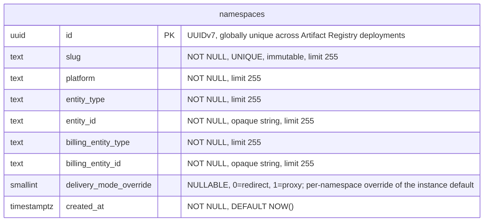

- **namespaces**: 他のすべてのテーブルが `namespace_id` を介して参照するルートエンティティです。各名前空間には、URL やクライアント設定で使用される不変かつグローバルに一意な `slug` があります（スラッグの設計とグローバルな一意性の強制については [ADR-022](022_namespace_decoupling.md) を参照）。`(platform, entity_type, entity_id)` タプルは、そのセマンティクスを解釈することなく、名前空間を外部エンティティ（デフォルトでは Organization）にリンクします。`entity_id` は、基となる値が数値であっても `TEXT` として格納され、アンカータイプ間でスキーマを統一的に保ちます。Organizations v1 では、すべての行が `('gitlab', 'organization', '<rails_org_id>')` を持ちます。`billing_entity_type` と `billing_entity_id` は、使用イベントのための課金アンカーを識別します。外部から提供されるカラム（`platform`、`entity_type`、`entity_id`、`billing_entity_type`、`billing_entity_id`）には、いずれもスキーマレベルのデフォルトがありません。根拠については [ADR-022](022_namespace_decoupling.md) を参照してください。`delivery_mode_override` カラムは、[ADR-005](005_artifact_delivery_mode.md) で定義された名前空間ごとのアーティファクト配信のオーバーライドを保持します。`NULL` はインスタンスのデフォルト（`StorageConfig.delivery_mode`）を継承し、`0`（`redirect`）はこの名前空間に対してリダイレクトを強制し、`1`（`proxy`）はプロキシを強制します。ダウンロードリクエストの実効的な配信パターンは `namespace.delivery_mode_override ?? instance.delivery_mode` です。このカラムは、リクエストハンドラーが認可とルーティングのために実施する既存の名前空間ルックアップの一部として読み取られるため、別のクエリやインデックスは不要です。カラムタイプは `SMALLINT` で、整数からラベルへのマッピングは Go アプリケーション内で定義されます（`0 = redirect`、`1 = proxy`）。これは enum スタイルのカラムに関する [Artifact Registry データベース規約](https://gitlab.com/gitlab-org/ops/artifact-registry/-/blob/main/docs/dev/database.md#enums) に従っています（PostgreSQL の `ENUM` タイプは安全な変更が難しいため避けています）。アーティファクト配信の選択を格納する将来のカラム（たとえば S17 がリポジトリごとのオーバーライドを導入する場合）も、同じ整数マッピングを再利用します。

#### Slug immutability

PostgreSQL には不変カラムのネイティブサポートがありません。スラッグの不変性（[ADR-022](022_namespace_decoupling.md)）は、値が変更された場合に例外を発生させる `BEFORE UPDATE OF slug` トリガーによって、データベースレベルで強制されます。これにより、アプリケーションレイヤーをバイパスするあらゆるコードパス（データベースへの直接アクセス、管理ツール、マイグレーション）を捕捉します。スラッグ変更が必要な緊急操作のために、このトリガーは無効化できます（たとえば `ALTER TABLE namespaces DISABLE TRIGGER trg_namespaces_immutable_slug`）。

#### Indexes

- **`namespaces`**: `(slug)` に対するユニークインデックス — スラッグで名前空間をルックアップします。`(platform, entity_type, entity_id)` に対するユニーク制約 — アンカーの重複を防ぎます。`delivery_mode_override` にはインデックスを設けません。このカラムは `id` をキーとする既存の名前空間ルックアップの一部としてのみ読み取られます（ハンドラーは認可とルーティングのためにすでに名前空間の行を結合しています）。

### Repository collections

repository collection は名前空間内のリポジトリの論理的なグループ化であり、アーティファクトをチーム、セキュリティドメイン、または製品ラインごとに整理します。repository collection を UI や API で公開することは MVP の対象外です。このエンティティは、純粋に前方互換性のために初日から存在します。MVP の間は、すべての名前空間に作成時に単一の「default」repository collection が用意され、すべてのリポジトリがそこに割り当てられます。MVP 後に repository collection の概念が公開されると、ユーザーは追加の repository collection を作成し、リポジトリをそこへ再割り当てできるようになります。

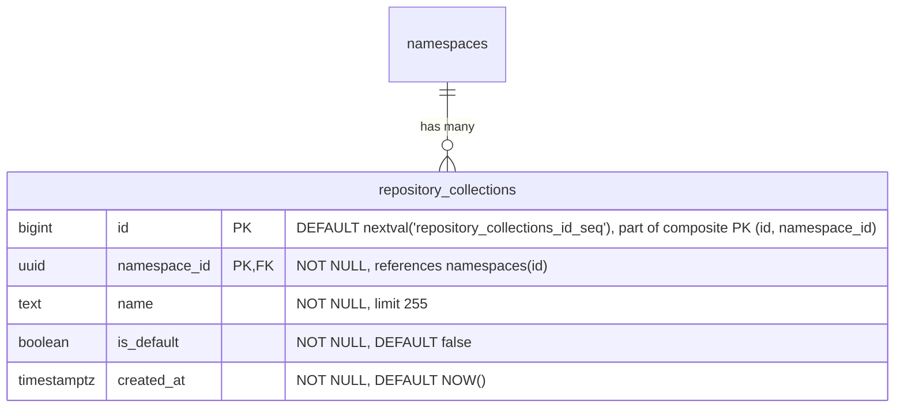

- **repository_collections**: 名前空間内のリポジトリの論理的なグループ化です。`name` は名前空間内で一意な、人間が読めるラベルです。`is_default` は、すべての名前空間とともに自動的に作成され、MVP の間にすべてのリポジトリが割り当てられる repository collection を示します。`HASH(namespace_id)` で 64 個のパーティションにパーティショニングされます。

すべての名前空間作成時に、デフォルトの repository collection の行をアトミックに挿入する必要があります。

```sql
INSERT INTO repository_collections (namespace_id, name, is_default)
VALUES (<new_namespace_id>, 'default', true)
ON CONFLICT (namespace_id, name) DO NOTHING;
```

#### Indexes

- **`repository_collections`**: `(id, namespace_id)` に対する主キー — `HASH(namespace_id)` パーティショニングで必要となる複合 PK。`repositories` からの複合外部キーのターゲットとしても機能します。`(namespace_id, name)` に対するユニークインデックス — 名前空間内で repository collection を名前でルックアップします。`(namespace_id) WHERE is_default IS TRUE` に対する部分ユニークインデックス — 名前空間ごとにデフォルトの repository collection が最大 1 つになるよう強制します。

#### Query examples

- 名前空間のデフォルトの repository collection を取得する。

  ```sql
  SELECT *
  FROM repository_collections
  WHERE namespace_id = '018f4d6f-0e10-7e3a-9bfd-23a4c5d6e7f8' AND is_default = true;
  ```

- 名前空間のすべての repository collection を一覧表示する。

  ```sql
  SELECT id, name, is_default, created_at
  FROM repository_collections
  WHERE namespace_id = '018f4d6f-0e10-7e3a-9bfd-23a4c5d6e7f8'
  ORDER BY created_at;
  ```

- 新しい（デフォルトでない）repository collection を作成する。

  ```sql
  INSERT INTO repository_collections (namespace_id, name)
  VALUES ('018f4d6f-0e10-7e3a-9bfd-23a4c5d6e7f8', 'team-backend');
  ```

### Repositories

`repositories` テーブルは、フォーマットや種別を問わずシステム内のすべてのリポジトリを登録する統合された親テーブルです。これはランディングページのハイブリッドリスト、すなわち、すべてのフォーマットにわたってホスト型、仮想、リモートのリポジトリを表示する単一のソート・フィルタ・ページネーション可能なビューを支えます。フォーマット固有の各リポジトリテーブル（ホスト型、仮想、リモート）は、`repository_id` を介してここの単一の行を参照します。

このモデル（ホスト型、リモート、仮想を対等なスタンドアロンタイプとして扱い、参照によって構成する）は、JFrog Artifactory、Sonatype Nexus、Google Cloud AR がいずれも採用しているものですが、各製品でタイプの名称は異なります。


- **repositories**: すべてのリポジトリの親エンティティです。`format` はアーティファクトフォーマット（container、Maven、npm）を識別します。`kind` はリポジトリタイプ（ホスト型、仮想、リモート）を識別します。リポジトリは [`repository_collection_repositories`](#repository-collection-repositories) 結合テーブルを介して repository collection にリンクされ、リポジトリがその名前空間内の 1 つ以上の repository collection に属することを可能にします。MVP の間は、すべてのリポジトリが名前空間のデフォルトの repository collection にリンクされます。`name` は名前空間内で一意でなければならず、これはすべての競合製品と一致します。カウンターカラム（`artifacts_count`、`downloads_count`、`size_bytes`）は、ホット行の競合を避けるために [バッファード／非同期書き込み](#buffered-and-asynchronous-writes) を介して維持されます。`last_updated_at` は、ダウンロードではなくコンテンツの変更（アーティファクトの公開・変更・削除、キャッシュイベント）を追跡します。`gitlab_created_by_user_id` と `gitlab_last_updated_by_user_id` は、どの GitLab ユーザーがリポジトリを作成し、最後に変更したかを記録します。どちらも外部キーやアプリケーション側の検証を持たない nullable の不透明な参照です。ユーザーレコードはモノリスに存在するためで、ユーザーハンドルとアバターのレンダリングはコンシューマーの責任であり、AR スキーマは ID のみを格納します。これらは `namespaces.entity_id` と同じ理由で `TEXT` として格納されます。上流のユーザー ID フォーマットの将来的な変更（たとえば UUID への変更）があっても、スキーマのマイグレーションは不要です。`description` は親テーブルにあります。UI は仮想リポジトリだけでなくすべてのリポジトリタイプの説明を表示するためです。`soft_deleted_at` タイムスタンプは、リポジトリがソフト削除された時刻を記録し、必要に応じた復元を可能にします。ソフト削除は親テーブルにあり、すべてのリポジトリタイプ（ホスト型、仮想、リモート）がフォーマット固有の処理なしに同じ削除セマンティクスを共有できるようにします。`HASH(namespace_id)` で 64 個のパーティションにパーティショニングされます。

#### Indexes

- **`repositories`**: `(namespace_id, name)` に対するユニークインデックス — アクティブおよびソフト削除済みの両方のリポジトリにわたって名前の一意性を強制し、名前の競合によって復元が失敗しないことを保証します。名前を再利用するには、まずハード削除が必要です。`(namespace_id, name) WHERE soft_deleted_at IS NULL` に対するインデックス — アクティブなリポジトリのルックアップと名前順の一覧表示のための最適化されたスキャンパス。`(namespace_id, format) WHERE soft_deleted_at IS NULL` に対するインデックス — アクティブなリポジトリをフォーマットでフィルタリングします。`(namespace_id, kind) WHERE soft_deleted_at IS NULL` に対するインデックス — アクティブなリポジトリを種別でフィルタリングします。`(namespace_id, visibility) WHERE soft_deleted_at IS NULL` に対するインデックス — リポジトリを可視性レベルでフィルタリングします（可視性監査クエリ「この名前空間で現在公開されているリポジトリはどれか？」を支えます）。ランディングページのソート可能カラムごとに 1 つのインデックスがあり、いずれも `WHERE soft_deleted_at IS NULL` を伴います。`(namespace_id, artifacts_count DESC)`、`(namespace_id, downloads_count DESC)`、`(namespace_id, size_bytes DESC)`、`(namespace_id, last_updated_at DESC NULLS LAST)`。`(namespace_id, soft_deleted_at DESC) WHERE soft_deleted_at IS NOT NULL` に対するインデックス — この名前空間のソフト削除済みリポジトリを削除時刻順に一覧表示します（ゴミ箱一覧クエリ「ゴミ箱には何があり、いつ削除されたか？」を支えます）。この逆向きの部分述語は、上記のアクティブ行の部分インデックスを反映したものです。このテーブルの他のすべての部分インデックスはゴミ箱を除外しており、完全な `(namespace_id, name)` ユニークインデックスは `soft_deleted_at` をキーにしていないため、ゴミ箱の一覧表示はそうでなければフィルタリングとソートのために名前空間内のすべての行を走査しなければならなくなります。GC の適格性は [ADR-010](010_data_retention.md) に従って `soft_deleted_at + retention_window` から導出されます。別途カラムは不要です。

MVP の間は、すべてのリポジトリが単一のデフォルトの repository collection にリンクされるため、`(namespace_id, ...)` のソートインデックスは名前空間全体のクエリと collection でフィルタリングしたクエリの両方に対応します。MVP 後、名前空間が複数の repository collection を持つようになると、collection でフィルタリングしたクエリは `repository_collection_repositories` を介して結合します。repository collection が公開される際には、追加のサポートインデックスが検討されます。

#### Query examples

- 名前空間のすべてのリポジトリ（すべての repository collection）を最終更新順に一覧表示する。

  ```sql
  SELECT id, name, description, format, kind, artifacts_count,
         downloads_count, size_bytes, last_updated_at
  FROM repositories
  WHERE namespace_id = '018f4d6f-0e10-7e3a-9bfd-23a4c5d6e7f8' AND soft_deleted_at IS NULL
  ORDER BY last_updated_at DESC NULLS LAST
  LIMIT 20;
  ```

- 名前空間のリポジトリを repository collection でフィルタリングし、最終更新順に一覧表示する。

  ```sql
  SELECT r.id, r.name, r.description, r.format, r.kind, r.artifacts_count,
         r.downloads_count, r.size_bytes, r.last_updated_at
  FROM repositories r
  JOIN repository_collection_repositories rcr
    ON rcr.namespace_id = r.namespace_id AND rcr.repository_id = r.id
  WHERE r.namespace_id = '018f4d6f-0e10-7e3a-9bfd-23a4c5d6e7f8' AND rcr.repository_collection_id = 456 AND r.soft_deleted_at IS NULL
  ORDER BY r.last_updated_at DESC NULLS LAST
  LIMIT 20;
  ```

- リポジトリを repository collection とフォーマットでフィルタリングして一覧表示する。

  ```sql
  SELECT r.id, r.name, r.description, r.format, r.kind, r.artifacts_count,
         r.downloads_count, r.size_bytes, r.last_updated_at
  FROM repositories r
  JOIN repository_collection_repositories rcr
    ON rcr.namespace_id = r.namespace_id AND rcr.repository_id = r.id
  WHERE r.namespace_id = '018f4d6f-0e10-7e3a-9bfd-23a4c5d6e7f8' AND rcr.repository_collection_id = 456 AND r.format = 0
    AND r.soft_deleted_at IS NULL
  ORDER BY r.name
  LIMIT 20;
  ```

- 単一のリポジトリを名前でルックアップする。

  ```sql
  SELECT *
  FROM repositories
  WHERE namespace_id = '018f4d6f-0e10-7e3a-9bfd-23a4c5d6e7f8' AND name = 'my-repo' AND soft_deleted_at IS NULL;
  ```

- 可視性監査: 名前空間内のすべての公開リポジトリを一覧表示する（`(namespace_id, visibility) WHERE soft_deleted_at IS NULL` に対する部分インデックスを使用）。

  ```sql
  SELECT id, name, format, kind
  FROM repositories
  WHERE namespace_id = '018f4d6f-0e10-7e3a-9bfd-23a4c5d6e7f8' AND visibility = 0 AND soft_deleted_at IS NULL
  ORDER BY name;
  ```

- ゴミ箱一覧: 名前空間内のすべてのソフト削除済みリポジトリを、最近削除されたものから順に一覧表示する（`(namespace_id, soft_deleted_at DESC) WHERE soft_deleted_at IS NOT NULL` に対する部分インデックスを使用）。スコープは名前空間全体であり、管理者は「今復元できるものは何か？」を 1 つのクエリで答えられます。親ごとのゴミ箱ビューは別の UI 上の関心事であり、必要であれば後で親をキーとするインデックスを追加することで対応できます。

  ```sql
  SELECT id, name, format, kind, soft_deleted_at
  FROM repositories
  WHERE namespace_id = '018f4d6f-0e10-7e3a-9bfd-23a4c5d6e7f8' AND soft_deleted_at IS NOT NULL
  ORDER BY soft_deleted_at DESC
  LIMIT 50;
  ```

### Repository collection repositories

`repository_collection_repositories` 結合テーブルは、リポジトリを所属する repository collection にマッピングします。リポジトリは名前空間内の 1 つ以上の repository collection のメンバーになることができ、共通の util リポジトリを複数のチームの repository collection を通じて公開するといった、共有アクセスのシナリオを可能にします。

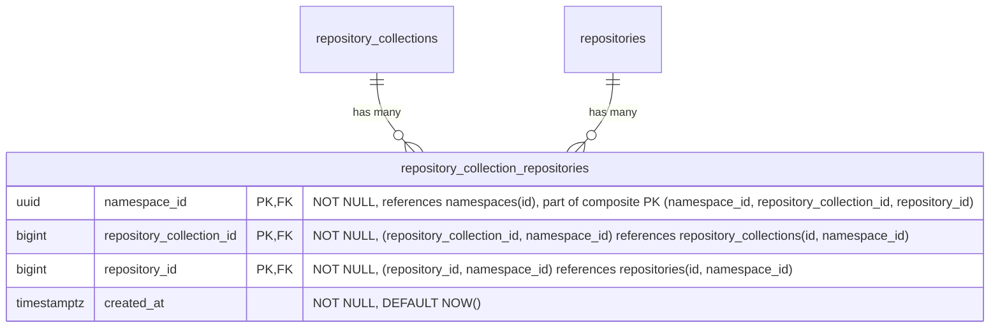

- **repository_collection_repositories**: リポジトリを repository collection にリンクします。MVP の間は、すべてのリポジトリがちょうど 1 つの repository collection（名前空間のデフォルト）にリンクされますが、スキーマは複数のリンクを許容しているため、MVP 後にはリポジトリを複数の repository collection 間で共有できます。すべてのリポジトリが少なくとも 1 つの repository collection リンクを持つという不変条件は、アプリケーションが強制します。Postgres はこれを宣言的に表現できません。複合 FK により、repository collection とリポジトリは同じ名前空間内でのみリンクできます。`HASH(namespace_id)` で 64 個のパーティションにパーティショニングされます。

#### Indexes

- **`repository_collection_repositories`**: `(namespace_id, repository_collection_id, repository_id)` に対する主キー — リンクの一意性を強制し、repository collection によるルックアップに対応します。`(namespace_id, repository_id)` に対するインデックス — 特定のリポジトリが属するすべての repository collection をルックアップします。

#### Query examples

- リポジトリが属するすべての repository collection を一覧表示する。

  ```sql
  SELECT repository_collection_id
  FROM repository_collection_repositories
  WHERE namespace_id = '018f4d6f-0e10-7e3a-9bfd-23a4c5d6e7f8' AND repository_id = 789;
  ```

- リポジトリを repository collection にリンクする。

  ```sql
  INSERT INTO repository_collection_repositories (namespace_id, repository_collection_id, repository_id)
  VALUES ('018f4d6f-0e10-7e3a-9bfd-23a4c5d6e7f8', 456, 789)
  ON CONFLICT (namespace_id, repository_collection_id, repository_id) DO NOTHING;
  ```

### Lifecycle Policies

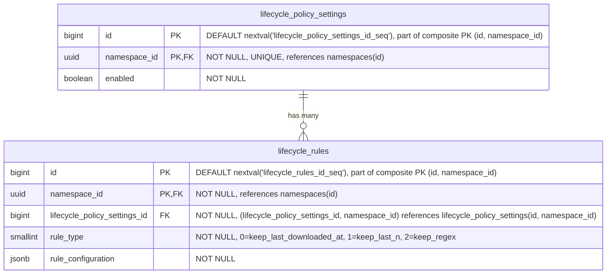

- **lifecycle_policy_settings**: 名前空間レベルでライフサイクル管理の設定を定義し、すべてのリポジトリのデフォルトポリシーとして機能します。有効化されると、関連するライフサイクルルールが名前空間全体に適用されます。これらのポリシーは、リポジトリレベルのポリシーによって [オーバーライド](#repository-level-overrides) できます。`HASH(namespace_id)` で 64 個のパーティションにパーティショニングされます。
- **lifecycle_rules**: 名前空間レベルで、特定のアーティファクトのライフサイクル挙動を管理する個々の保持・クリーンアップルールを指定します。これらのルールは、リポジトリレベルで [オーバーライド](#repository-level-overrides) されない限り、すべてのリポジトリに適用されます。ルール評価時のパフォーマンス低下を防ぐため、ポリシーレコードごとのライフサイクルルール数には上限が設けられます。これは、ユーザーが特定のアーティファクトをどのくらいの期間保持するかを指定するために使われます（たとえば、Maven のスナップショットファイルは 1 か月だけ保持する、など）。`HASH(namespace_id)` で 64 個のパーティションにパーティショニングされます。

#### Indexes

- **`lifecycle_policy_settings`**: `(namespace_id)` に対するユニークインデックス — 名前空間ごとに 1 つのポリシー設定レコード。
- **`lifecycle_rules`**: `(namespace_id, lifecycle_policy_settings_id)` に対するインデックス — 特定のポリシーのすべてのルールを取得します。

リポジトリレベルのオーバーライドテーブルも同じパターンに従います。設定テーブルには `(namespace_id, repository_id)` に対するユニークインデックスを、ルールテーブルには `(namespace_id, <format>_repository_lifecycle_policy_settings_id)` に対するインデックスを設けます。

#### Query examples

- 特定の名前空間のポリシーを取得する。

  ```sql
  SELECT lp.*
  FROM lifecycle_policy_settings lp
  WHERE lp.namespace_id = '018f4d6f-0e10-7e3a-9bfd-23a4c5d6e7f8';
  ```

- 特定のアーティファクトリポジトリのポリシーを取得する。

  ```sql
  SELECT *
  FROM container_repository_lifecycle_policy_settings
  WHERE container_repository_lifecycle_policy_settings.namespace_id = '018f4d6f-0e10-7e3a-9bfd-23a4c5d6e7f8'
    AND container_repository_lifecycle_policy_settings.repository_id = 123;
  ```

- 新しいライフサイクルルールを作成する。

  ```sql
  INSERT INTO lifecycle_rules (namespace_id, lifecycle_policy_settings_id, rule_type, rule_configuration)
  VALUES ('018f4d6f-0e10-7e3a-9bfd-23a4c5d6e7f8', 123, 1, '{"count": 10}'::jsonb);
  ```

- ライフサイクルルールを更新する。

  ```sql
  UPDATE lifecycle_rules
  SET rule_configuration = '{"count": 20}'::jsonb
  WHERE namespace_id = '018f4d6f-0e10-7e3a-9bfd-23a4c5d6e7f8'
    AND id = 123;
  ```

- ライフサイクルルールを破棄する。

  ```sql
  DELETE FROM lifecycle_rules
  WHERE namespace_id = '018f4d6f-0e10-7e3a-9bfd-23a4c5d6e7f8'
    AND id = 123;
  ```

#### Repository level overrides

各リポジトリタイプ（[container](#container-repositories)、[maven](#maven-repositories)、[npm](#npm-repositories)）には、名前空間レベルの値に対するオーバーライドを提供するために、同様の名前のテーブルが用意されます。これにより優先順位システムが生まれます。名前空間（最低）-> リポジトリ（最高）。オーバーライドは `repository_id` を介して親の `repositories` テーブルを参照します。


（各アーティファクトフォーマットにオーバーライドテーブルがあるため、`artifact_type` は `container`、`maven`、`npm` に置き換える必要があります。これらのオーバーライドはホスト型、仮想、リモートのリポジトリにも同様に適用されます。`repository_id` FK は親の `repositories` テーブルを参照し、フォーマット固有のテーブルはリポジトリの `format` カラムによって決まります。）

これらのテーブルは、ある意味で [カスケード設定](https://docs.gitlab.com/development/cascading_settings/) のように動作します。それらの説明は、パーティショニングを含め、[名前空間レベル](#lifecycle-policies) の同様の名前のテーブルとまったく同じです。すべてのオーバーライドテーブルは `HASH(namespace_id)` で 64 個のパーティションにパーティショニングされます。現在の 2 階層の優先順位システム（名前空間 → リポジトリ）は、MVP 後に repository collection が公開される際に 3 階層（名前空間 → repository collection → リポジトリ）に拡張できます。これには、同じパターンに従った repository collection レベルのオーバーライドテーブルを追加する必要がありますが、既存の名前空間レベルやリポジトリレベルのテーブルへの変更は不要です。

### Container Repositories

この部分の課題は、[OCI Distribution Spec v1.1](https://github.com/opencontainers/distribution-spec/blob/main/spec.md) に準拠することです。

<!--TODO This link will not live for long since it's an artifact output-->
このアプローチは [GitLab Container Registry のスキーマ](https://gitlab.com/gitlab-org/container-registry/-/jobs/12449560500/artifacts/file/db-DAG.png) から大きな着想を得ています。

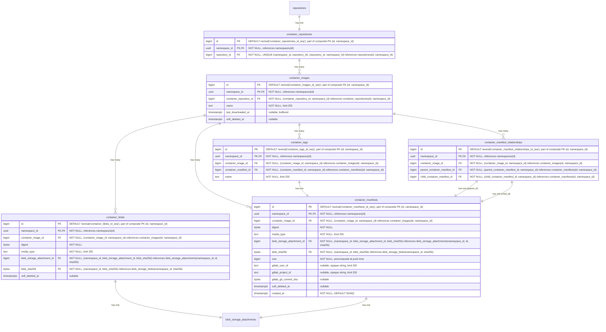

- **container_repositories**: 複数のイメージを保持するコンテナです。各リポジトリは、独立したバージョニングを持つ複数のイメージをホストできます。名前、可視性、フォーマット横断クエリのために、`repository_id` を介して親の `repositories` テーブルを参照します。`HASH(namespace_id)` で 64 個のパーティションにパーティショニングされます。
- **container_images**: リポジトリ内の名前付きコンテナイメージ（たとえば `myapp`、`backend`）を表します。`last_downloaded_at` はイメージが最後にプルされた時刻を記録します。[バッファード／非同期書き込み](#buffered-and-asynchronous-writes) を介して維持されます。`keep_last_downloaded_at` ライフサイクルルールがダウンロードベースの保持を評価するために使用します（[ADR-010](010_data_retention.md)）。`soft_deleted_at` タイムスタンプは、イメージがソフト削除された時刻を記録し、必要に応じた復元を可能にします。`HASH(namespace_id)` で 64 個のパーティションにパーティショニングされます。
- **container_blobs**: コンテナイメージを構成する個々のコンテンツアドレス指定可能なレイヤーと構成オブジェクトを格納します。マニフェストとその構成レイヤー（blob）の関係は暗黙的であり、実行時にマニフェストの内容を解析することで決定され、データベースの外部キーとしてはモデル化されません。`soft_deleted_at` タイムスタンプは、blob がソフト削除された時刻を記録し、必要に応じた復元を可能にします。`HASH(namespace_id)` で 64 個のパーティションにパーティショニングされます。
- **container_manifests**: 特定のイメージバージョンの構成とレイヤーを記述するイメージマニフェストを表します。`size` カラムは、ここをルートとするマニフェストツリーの合計バイトサイズ、すなわちこのマニフェスト自身のペイロードに加え、そこから到達可能なすべての blob（マニフェストリストや OCI インデックスの子マニフェストを介して推移的に到達するものを含む）のサイズを保持します。`gitlab_user_id` は、どの GitLab ユーザーがこのマニフェストをプッシュしたかを記録します。外部キーを持たない nullable の不透明なテキスト参照で、[repositories](#repositories) の同等カラムと同じ根拠です。ユーザーレコードはモノリスに存在し、ユーザーハンドルとアバターのレンダリングはコンシューマーの責任であり、AR スキーマは ID のみを格納し、`TEXT` により上流のユーザー ID フォーマットの将来的な変更からスキーマを隔離します。`gitlab_project_id` と `gitlab_git_commit_sha` は、その帰属情報をプッシュコンテキストの残りで拡張します。`gitlab_project_id` はプッシュが発生した GitLab プロジェクト（たとえば `CI_PROJECT_ID`）で、`gitlab_user_id` と同じモノリス参照の理由から nullable の不透明なテキストとして格納されます。`gitlab_git_commit_sha` はプッシュ時の Git コミット（たとえば `CI_COMMIT_SHA`）で、ハッシュカラムのスキーマ規約に従って nullable の `bytea` として格納されます。可変長で、SHA-1（20 バイト）と SHA-256（32 バイト）の両方に収まります。これはモノリス参照ではなくプッシュ時の事実であるため、外部キーは不要です。どちらも、CI コンテキストなしでプッシュが到着した場合（たとえば開発者のワークステーションからの手動プッシュ）は NULL になります。`soft_deleted_at` タイムスタンプは、マニフェストがソフト削除された時刻を記録し、必要に応じた復元を可能にします。`created_at` はマニフェストが最初にプッシュされた時刻を記録します。名前空間ごとの時刻順インデックスと組み合わせることで、公開履歴や時間範囲のアーティファクト来歴クエリ（たとえば「この名前空間に午前 2 時から午前 8 時の間にプッシュされたものは何か？」）を支えます。ソフト削除済みの行は公開履歴に引き続き表示されます。公開イベント自体は削除によって消去されないためです。`HASH(namespace_id)` で 64 個のパーティションにパーティショニングされます。
- **container_manifest_relationships**: 親マニフェストが他の複数のマニフェストを参照できる Docker マニフェストリストや OCI インデックス（マルチアーキテクチャイメージなど）を扱います。`HASH(namespace_id)` で 64 個のパーティションにパーティショニングされます。
- **container_tags**: 特定のマニフェストを指す、人間が読める名前（たとえば `latest`、`v1.2.3`）を提供します。`HASH(namespace_id)` で 64 個のパーティションにパーティショニングされます。
- **blob_storage_attachments**: 詳細は [Blob storage](#blob-storage) セクションを参照してください。

`container_blobs` テーブルは、他のコンテナレジストリアーキテクチャが行うようにコンテナレジストリの物理 blob を直接格納するわけではありません。ここでの違いは、blob ストレージが [blob storage](#blob-storage) テーブルで（重複排除やガベージコレクションとともに）扱われる点です。したがって `container_*` レベルでは、`blob_storage_attachments` レコードへの参照を格納するだけで済みます。

#### Indexes

- **`container_repositories`**: `(namespace_id, repository_id)` に対するユニークインデックス — コンテナリポジトリを親リポジトリ参照でルックアップします。
- **`container_images`**: `(namespace_id, container_repository_id, name) WHERE soft_deleted_at IS NULL` に対するユニークインデックス — イメージ名はリポジトリ内で一意なイメージを識別します。重複すると OCI の名前ベースのルックアップが壊れます。部分条件により、ソフト削除後に同じ名前のイメージを再作成できます。`(namespace_id, container_repository_id, last_downloaded_at NULLS FIRST) WHERE soft_deleted_at IS NULL` に対するインデックス — `keep_last_downloaded_at` ライフサイクルルールの評価をサポートします。リポジトリ内のすべてのイメージを走査して行ごとにフィルタリングするのではなく、有界の範囲スキャンによって期限切れになったイメージのみを返します。`NULLS FIRST` は一度もダウンロードされていないイメージを最も古い行とグループ化するため、両方が同じ範囲スキャンで返されます。
- **`container_blobs`**: `(namespace_id, container_image_id, digest) WHERE soft_deleted_at IS NULL` に対するユニークインデックス — blob のダイジェストはコンテンツアドレス指定です。同じイメージ内の同じダイジェストは、定義上同じ blob です。部分条件により、ソフト削除後に同じダイジェストを再プッシュできます。`(namespace_id, blob_storage_attachment_id)` に対するインデックス — blob をそのストレージアタッチメントでルックアップします。`(namespace_id, blob_sha256)` に対するインデックス — 格納された blob の sha256 から、それを参照するすべての container blob への逆引きで、フォーマット横断のチェックサム検索と、脆弱性影響範囲クエリ「この侵害されたダイジェストが与えられたとき、どのイメージがそれを参照しているか？」を支えます。既存の `(namespace_id, container_image_id, digest)` インデックスはイメージをキーとしており 1 つのイメージ内でしかスキャンできないため、このインデックスがなければクエリは名前空間ごとのパーティションスキャンにフォールバックします。同じ形は、この MR の他のすべての逆引きインデックスに適用されます。無条件（`soft_deleted_at` 述語なし）であるため、かつて参照されたダイジェストは監査証跡に引き続き表示されます。現在影響を受けているアーティファクトのみを必要とする脆弱性影響範囲では、クエリ時に親テーブル（イメージ／バージョン／パッケージ）に対する結合に `soft_deleted_at IS NULL` を追加します。これは小さな中間集合に対する安価な後続フィルタです。
- **`container_manifests`**: `(namespace_id, container_image_id, digest) WHERE soft_deleted_at IS NULL` に対するユニークインデックス — マニフェストのダイジェストはコンテンツアドレス指定です。同じイメージ内の同じダイジェストは、定義上同じマニフェストです。部分条件により、ソフト削除後に同じダイジェストを再プッシュできます。`(namespace_id, blob_storage_attachment_id)` に対するインデックス — マニフェストをそのストレージアタッチメントでルックアップします。`(namespace_id, blob_sha256)` に対するインデックス — マニフェストペイロードの格納された blob の sha256 から、それを参照するすべてのマニフェストへの逆引きで、フォーマット横断のチェックサム検索を支えます。[`container_blobs`](#container-repositories) のインデックスを反映し、単一の sha256 ルックアップでレイヤーとマニフェストの両方の参照を 1 回の走査で返します。`(namespace_id, soft_deleted_at DESC) WHERE soft_deleted_at IS NOT NULL` に対するインデックス — ソフト削除済みマニフェストを削除時刻順に一覧表示し、コンテナイメージのアーティファクト粒度のゴミ箱一覧クエリを支えます。`(namespace_id, created_at DESC)` に対するインデックス — 名前空間全体の時系列スキャンで、公開履歴のページネーションと時間範囲のアーティファクト来歴クエリを支えます。無条件（`soft_deleted_at` 述語なし）であるため、後でソフト削除された公開イベントも監査証跡に引き続き表示されます。
- **`container_manifest_relationships`**: `(namespace_id, parent_container_manifest_id, child_container_manifest_id)` に対するユニークインデックス — 親子関係の重複を防ぎ、特定の親マニフェストのすべての子を見つけます。`(namespace_id, child_container_manifest_id)` に対するインデックス — 特定の子マニフェストのすべての親を見つけます。`(namespace_id, container_image_id)` に対するインデックス — 特定のイメージのすべてのマニフェスト関係を見つけます。
- **`container_tags`**: `(namespace_id, container_image_id, name)` に対するユニークインデックス — イメージ内でタグを名前でルックアップします。`(namespace_id, container_manifest_id)` に対するインデックス — 特定のマニフェストを指すすべてのタグを見つけます。

#### Query examples

- イメージを名前で取得する。

  ```sql
  SELECT *
  FROM container_images
  WHERE namespace_id = '018f4d6f-0e10-7e3a-9bfd-23a4c5d6e7f8' AND container_repository_id = 123 AND name = 'myapp/backend'
    AND soft_deleted_at IS NULL;
  ```

- リポジトリ ID に対して blob をダイジェストで取得する。

  ```sql
  SELECT cb.*
  FROM container_blobs cb
  JOIN container_images ci
    ON cb.container_image_id = ci.id AND cb.namespace_id = ci.namespace_id
  WHERE ci.namespace_id = '018f4d6f-0e10-7e3a-9bfd-23a4c5d6e7f8' AND ci.container_repository_id = 123
    AND cb.digest = 'sha256:abcd1234...'::bytea
    AND ci.soft_deleted_at IS NULL AND cb.soft_deleted_at IS NULL;
  ```

- リポジトリ ID に対してマニフェストをダイジェストで取得する。

  ```sql
  SELECT cm.*
  FROM container_manifests cm
  JOIN container_images ci
    ON cm.container_image_id = ci.id AND cm.namespace_id = ci.namespace_id
  WHERE ci.namespace_id = '018f4d6f-0e10-7e3a-9bfd-23a4c5d6e7f8' AND ci.container_repository_id = 123
    AND cm.digest = 'sha256:efgh5678...'::bytea
    AND ci.soft_deleted_at IS NULL AND cm.soft_deleted_at IS NULL;
  ```

- チェックサム検索と脆弱性影響範囲: 格納された blob の `sha256` が与えられたとき、それを参照する名前空間内のすべてのアーティファクトを見つけます（各フォーマットテーブルの `(namespace_id, blob_sha256)` インデックスを使用）。`namespace_id` の等価条件により各テーブルで単一パーティションに絞り込まれ、インデックスはパーティションを走査するのではなく一致する行を直接返します。チェックサム検索はすべての参照を返します。脆弱性影響範囲（「この侵害されたダイジェストの影響を現在受けているアーティファクトはどれか？」）では、結果をアクティブなアーティファクトに制限するため `soft_deleted_at IS NULL` を追加します。

  ```sql
  -- Single format: container layer/config blobs referencing the digest
  SELECT cb.id, cb.container_image_id, cb.digest
  FROM container_blobs cb
  WHERE cb.namespace_id = '018f4d6f-0e10-7e3a-9bfd-23a4c5d6e7f8'
    AND cb.blob_sha256 = 'sha256:abcd1234...'::bytea;

  -- Cross-format: every artifact referencing the digest, active rows only (vulnerability impact)
  SELECT 'container_blob' AS artifact_kind, cb.id AS artifact_id, cb.container_image_id AS parent_id
  FROM container_blobs cb
  WHERE cb.namespace_id = '018f4d6f-0e10-7e3a-9bfd-23a4c5d6e7f8'
    AND cb.blob_sha256 = 'sha256:abcd1234...'::bytea AND cb.soft_deleted_at IS NULL
  UNION ALL
  SELECT 'container_manifest', cm.id, cm.container_image_id
  FROM container_manifests cm
  WHERE cm.namespace_id = '018f4d6f-0e10-7e3a-9bfd-23a4c5d6e7f8'
    AND cm.blob_sha256 = 'sha256:abcd1234...'::bytea AND cm.soft_deleted_at IS NULL
  UNION ALL
  SELECT 'maven_file', mf.id, mf.maven_version_id
  FROM maven_files mf
  WHERE mf.namespace_id = '018f4d6f-0e10-7e3a-9bfd-23a4c5d6e7f8'
    AND mf.blob_sha256 = 'sha256:abcd1234...'::bytea AND mf.soft_deleted_at IS NULL
  UNION ALL
  SELECT 'npm_file', nf.id, nf.npm_version_id
  FROM npm_files nf
  WHERE nf.namespace_id = '018f4d6f-0e10-7e3a-9bfd-23a4c5d6e7f8'
    AND nf.blob_sha256 = 'sha256:abcd1234...'::bytea AND nf.soft_deleted_at IS NULL;
  ```

  同じ `(namespace_id, blob_sha256)` アクセスパスは、キャッシュ側のテーブル（`container_remote_blobs`、`container_remote_manifests`、`maven_remote_files`、`npm_remote_files`）と、`npm_metadata_files` / `npm_remote_metadata_files` にも適用されます。キャッシュされた参照もカバーするには、`UNION ALL` をそれらのテーブルにも拡張してください。

### Container Remote Repositories

リモートリポジトリは、プロキシしてキャッシュできる外部コンテナレジストリを表します。独自のライフサイクルを持つスタンドアロンのエンティティであり、複数の仮想リポジトリ間で共有できます。仮想リポジトリの upstream から、親の `repositories` テーブルを介して参照されます。


- **container_remote_repositories**: 外部コンテナレジストリを表します。URL、オプションの認証 URL（`auth_url`）、認証情報、キャッシュ TTL（`cache_validity_hours`）を含みます。ヘルスチェックのステータスは監視のために追跡されます。`repository_id` を介して親の `repositories` テーブルを参照します。リモートリポジトリはスタンドアロンであるため、同じリモートを使用する 2 つの仮想リポジトリは 1 つのキャッシュを共有します。`HASH(namespace_id)` で 64 個のパーティションにパーティショニングされます。
- **container_remote_images**: リモートリポジトリ内のキャッシュされたコンテナイメージです。`container_images` を反映します。`last_downloaded_at` はキャッシュされたイメージが最後にプルされた時刻を記録します。ホット行の競合を避けるため、バッファード／非同期書き込み（`repositories.downloads_count` と同じパターン）を介して維持されます。`keep_last_downloaded_at` ライフサイクルルールとキャッシュ保持の評価に使用されます（[ADR-010](010_data_retention.md)）。`HASH(namespace_id)` で 64 個のパーティションにパーティショニングされます。
- **container_remote_blobs**: キャッシュされたレイヤーまたは構成 blob です。`HASH(namespace_id)` で 64 個のパーティションにパーティショニングされます。
- **container_remote_manifests**: キャッシュされたイメージマニフェストです。`size` カラムは、このキャッシュが把握しているサブツリーのバイトフットプリント、すなわちキャッシュ時のマニフェスト自身のペイロードに加え、子が到着するたびに各子の `size` を保持します。イメージマニフェストの場合、値はキャッシュ時に完全です。マニフェストリストや OCI インデックスの場合、子が取得されるにつれて完全なツリーフットプリントへ漸進的に収束し、一部の子が一度もプルされなければ部分的なままになることがあります。この漸進的なセマンティクスは遅延リモートキャッシングを反映しています。`size` を完全に保つためだけに子を先行取得すると、遅延設計を損なうことになります。`created_at` はマニフェストが最初にキャッシュされた時刻を記録し、ホスト型の同等物（[`container_manifests`](#container-repositories)）と同じ公開履歴・時間範囲来歴スキャンを支えます。`HASH(namespace_id)` で 64 個のパーティションにパーティショニングされます。
- **container_remote_manifest_relationships**: キャッシュされたマルチアーキテクチャマニフェストリストの関係です。ホスト型の同等物と同じ構造です。`HASH(namespace_id)` で 64 個のパーティションにパーティショニングされます。
- **container_remote_tags**: キャッシュされたタグからマニフェストへのマッピングです。タグは可変のポインタであり、キャッシュの再検証時にタグが新しいマニフェストへ再指定されることがあります。`upstream_checked_at` はタグが上流レジストリに対して最後に検証された時刻を記録します。再検証が必要かを判断するために `cache_validity_hours` と比較されます。`upstream_etag` は上流が返した ETag を格納し、条件付きリクエスト（`If-None-Match`）を可能にして、タグが依然として同じマニフェストを指している場合に完全なマニフェスト解決を回避します。マニフェストと blob は、暗号学的ハッシュによってコンテンツアドレス指定されているため、鮮度の追跡を必要としません。格納されたバイトがダイジェストと一致すれば、コンテンツは正しいことが保証されます。`HASH(namespace_id)` で 64 個のパーティションにパーティショニングされます。
- **blob_storage_attachments**: 詳細は [Blob storage](#blob-storage) セクションを参照してください。

#### Indexes

- **`container_remote_repositories`**: `(namespace_id, repository_id)` に対するユニークインデックス — リモートリポジトリを親参照でルックアップします。
- **`container_remote_images`**: `(namespace_id, container_remote_repository_id, name) WHERE soft_deleted_at IS NULL` に対するユニークインデックス — キャッシュされたイメージを名前でルックアップします。部分条件により、ソフト削除後に同じ名前のイメージを再作成できます。
- **`container_remote_blobs`**: `(namespace_id, container_remote_image_id, digest) WHERE soft_deleted_at IS NULL` に対するユニークインデックス — イメージ内でキャッシュされた blob をダイジェストでルックアップします。部分条件により、ソフト削除後に同じダイジェストを再キャッシュできます。`(namespace_id, blob_storage_attachment_id)` に対するインデックス — blob をそのストレージアタッチメントでルックアップします。`(namespace_id, blob_sha256)` に対するインデックス — 格納された blob の sha256 から、それを参照するすべてのキャッシュされた blob への逆引きで、ホスト型の [`container_blobs`](#container-repositories) インデックスを反映し、チェックサム検索と脆弱性影響範囲がキャッシュ側の参照もカバーするようにします。
- **`container_remote_manifests`**: `(namespace_id, container_remote_image_id, digest) WHERE soft_deleted_at IS NULL` に対するユニークインデックス — イメージ内でキャッシュされたマニフェストをダイジェストでルックアップします。部分条件により、ソフト削除後に同じダイジェストを再キャッシュできます。`(namespace_id, blob_storage_attachment_id)` に対するインデックス — マニフェストをそのストレージアタッチメントでルックアップします。`(namespace_id, blob_sha256)` に対するインデックス — マニフェストペイロードの格納された blob の sha256 から、それを参照するすべてのキャッシュされたマニフェストへの逆引きで、ホスト型の [`container_manifests`](#container-repositories) インデックスを反映します。`(namespace_id, soft_deleted_at DESC) WHERE soft_deleted_at IS NOT NULL` に対するインデックス — ソフト削除済みのキャッシュされたマニフェストを削除時刻順に一覧表示し、キャッシュされたコンテナイメージのアーティファクト粒度のゴミ箱一覧クエリを支えます。`(namespace_id, created_at DESC)` に対するインデックス — 名前空間全体の時系列スキャンで、ホスト型の [`container_manifests`](#container-repositories) インデックスを反映してキャッシュ側の公開履歴と来歴をカバーします。ホスト型インデックスと同じ監査証跡の理由から無条件（`soft_deleted_at` 述語なし）です。
- **`container_remote_manifest_relationships`**: `(namespace_id, parent_container_remote_manifest_id, child_container_remote_manifest_id)` に対するユニークインデックス — 親子関係の重複を防ぎます。`(namespace_id, child_container_remote_manifest_id)` に対するインデックス — 特定の子マニフェストのすべての親を見つけます。`(namespace_id, container_remote_image_id)` に対するインデックス — 特定のイメージのすべてのマニフェスト関係を見つけます。
- **`container_remote_tags`**: `(namespace_id, container_remote_image_id, name)` に対するユニークインデックス — イメージ内でタグを名前でルックアップします。`(namespace_id, container_remote_manifest_id)` に対するインデックス — 特定のマニフェストを指すすべてのタグを見つけます。

#### Query examples

- リモートリポジトリを作成する。

  ```sql
  -- Resolve the default repository collection for the namespace
  SELECT id FROM repository_collections WHERE namespace_id = '018f4d6f-0e10-7e3a-9bfd-23a4c5d6e7f8' AND is_default = true;
  -- Create the parent repository
  INSERT INTO repositories (namespace_id, name, format, kind, visibility)
  VALUES ('018f4d6f-0e10-7e3a-9bfd-23a4c5d6e7f8', 'docker-hub', 0, 2, 1)
  RETURNING id;
  -- Link the repository to the repository collection
  INSERT INTO repository_collection_repositories (namespace_id, repository_collection_id, repository_id)
  VALUES ('018f4d6f-0e10-7e3a-9bfd-23a4c5d6e7f8', <repository_collection_id>, <returned_id>);
  -- Then create the format-specific record
  INSERT INTO container_remote_repositories (namespace_id, repository_id, url, encrypted_username, encrypted_password)
  VALUES ('018f4d6f-0e10-7e3a-9bfd-23a4c5d6e7f8', <returned_id>, 'https://registry.hub.docker.com', $1, $2);
  ```

- キャッシュされたマニフェストが新鮮かどうかをチェックする。

  ```sql
  SELECT crm.digest
  FROM container_remote_manifests crm
  JOIN container_remote_tags crt
    ON crt.container_remote_manifest_id = crm.id AND crt.namespace_id = crm.namespace_id
  JOIN container_remote_images cri
    ON crt.container_remote_image_id = cri.id AND crt.namespace_id = cri.namespace_id
  WHERE cri.namespace_id = '018f4d6f-0e10-7e3a-9bfd-23a4c5d6e7f8'
    AND cri.container_remote_repository_id = 789
    AND cri.name = 'library/nginx'
    AND crt.name = 'latest'
    AND cri.soft_deleted_at IS NULL AND crm.soft_deleted_at IS NULL;
  ```

- キャッシュされた blob をダイジェストでプルする（blob ストレージへの読み取りパスのショートカット）。

  ```sql
  SELECT bsb.object_storage_key, bsb.size
  FROM container_remote_blobs crb
  JOIN blob_storage_blobs bsb
    ON bsb.namespace_id = crb.namespace_id AND bsb.sha256 = crb.blob_sha256
  WHERE crb.namespace_id = '018f4d6f-0e10-7e3a-9bfd-23a4c5d6e7f8'
    AND crb.container_remote_image_id = 456
    AND crb.digest = 'sha256:abcd1234...'::bytea
    AND crb.soft_deleted_at IS NULL;
  ```

### Virtual Container Repositories

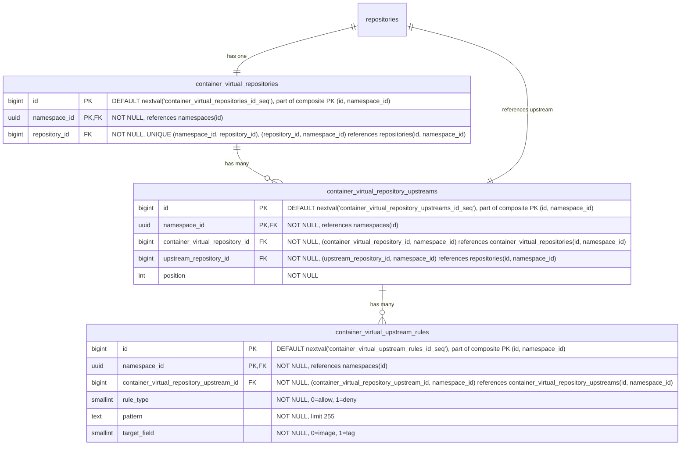

- **container_virtual_repositories**: コンテナイメージ用の仮想リポジトリです。名前、可視性、フォーマット横断クエリのために、`repository_id` を介して親の `repositories` テーブルを参照します。`HASH(namespace_id)` で 64 個のパーティションにパーティショニングされます。
- **container_virtual_repository_upstreams**: 仮想リポジトリとその upstream を結合するテーブルです。各仮想リポジトリは順序付けられた upstream のリストを持ちます。各エントリは `upstream_repository_id` を介して upstream リポジトリを参照し、これは `repositories(namespace_id, id)` を指します。複合 FK `(namespace_id, upstream_repository_id)` は、upstream が同じ名前空間内にあることを強制します。これはレジストリが名前空間にスコープされていること（[ADR-001](001_organizations_as_anchor_point.md)）と一致します。`HASH(namespace_id)` で 64 個のパーティションにパーティショニングされます。
- **container_virtual_upstream_rules**: upstream に対する許可／拒否フィルタルールを定義します。各ルールはワイルドカードパターンとターゲットフィールドを指定し、この upstream を通じて解決する際にどのアーティファクトを含めるか除外するかを制御します。MVP ではパターンはワイルドカードのみです。正規表現のサポートは、顧客のフィードバックがそれを正当化するまで延期されます（[議論](https://gitlab.com/gitlab-org/gitlab/-/work_items/597754#note_3291871207)）。ルールは（リモートリポジトリごとではなく）upstream 参照ごとに保たれ、include/exclude パターンを仮想 upstream の関連付けごとに設定する JFrog モデルと一致します。`HASH(namespace_id)` で 64 個のパーティションにパーティショニングされます。

#### Indexes

- **`container_virtual_repositories`**: `(namespace_id, repository_id)` に対するユニークインデックス — 仮想リポジトリを親参照でルックアップします。
- **`container_virtual_repository_upstreams`**: `(namespace_id, container_virtual_repository_id, position) DEFERRABLE INITIALLY DEFERRED` に対するユニークインデックス — 仮想リポジトリの順序付けられた upstream を取得します。トランザクション内での並べ替えを可能にするため遅延可能（deferrable）です。`(namespace_id, container_virtual_repository_id, upstream_repository_id)` に対するユニークインデックス — 同じ upstream が仮想リポジトリに 2 回追加されるのを防ぎます。
- **`container_virtual_upstream_rules`**: `(namespace_id, container_virtual_repository_upstream_id)` に対するインデックス — 特定の upstream のすべてのルールを取得します。

#### Query examples

- 仮想リポジトリを作成する。

  ```sql
  -- First create the parent repository
  INSERT INTO repositories (namespace_id, name, format, kind, visibility)
  VALUES ('018f4d6f-0e10-7e3a-9bfd-23a4c5d6e7f8', 'my-virtual-repo', 0, 1, 1)
  RETURNING id;
  -- Link the repository to a repository collection
  INSERT INTO repository_collection_repositories (namespace_id, repository_collection_id, repository_id)
  VALUES ('018f4d6f-0e10-7e3a-9bfd-23a4c5d6e7f8', 456, <returned_id>);
  -- Then create the format-specific record
  INSERT INTO container_virtual_repositories (namespace_id, repository_id)
  VALUES ('018f4d6f-0e10-7e3a-9bfd-23a4c5d6e7f8', <returned_id>);
  ```

- 仮想リポジトリを upstream に関連付ける。

  ```sql
  INSERT INTO container_virtual_repository_upstreams (namespace_id, container_virtual_repository_id, upstream_repository_id, position)
  VALUES ('018f4d6f-0e10-7e3a-9bfd-23a4c5d6e7f8', 123, 789, 1);
  ```

### Maven Repositories

Maven パッケージはファイルの集合（`.jar`、`.pom`、`maven-metadata.xml`）を表します。したがって、単一の Maven パッケージのダウンロードは 4 〜 15 個の API リクエストに相当することがあります。

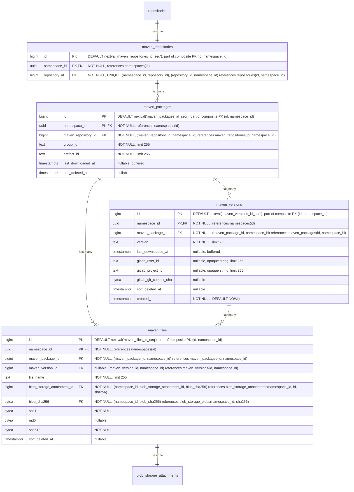

- **maven_repositories**: 複数のパッケージを保持するコンテナです。各リポジトリは、group ID と artifact ID で識別される複数のパッケージをホストできます。名前、可視性、フォーマット横断クエリのために、`repository_id` を介して親の `repositories` テーブルを参照します。`HASH(namespace_id)` で 64 個のパーティションにパーティショニングされます。
- **maven_packages**: [group ID と artifact ID](https://maven.apache.org/pom.html#Maven_Coordinates) で識別される Maven パッケージ（たとえば `com.example:myapp`）を表します。`last_downloaded_at` はパッケージのいずれかのファイルが最後にダウンロードされた時刻を記録します。[バッファード／非同期書き込み](#buffered-and-asynchronous-writes) を介して維持されます。`NULL` はパッケージが一度もダウンロードされていないことを意味し、`keep_last_downloaded_at` ライフサイクルルールの評価では可能な限り古いダウンロード時刻として扱われます（すなわち、ダウンロードベースの保持の下では削除対象となります）。`keep_last_downloaded_at` ライフサイクルルールがダウンロードベースの保持を評価するために使用します（[ADR-010](010_data_retention.md)）。`HASH(namespace_id)` で 64 個のパーティションにパーティショニングされます。
- **maven_versions**: Maven パッケージの個々の [バージョン](https://maven.apache.org/pom.html#Maven_Coordinates)（たとえば `1.0.0`、`2.1.3-SNAPSHOT`）を格納します。`last_downloaded_at` はバージョンのいずれかのファイルが最後にダウンロードされた時刻を記録します。[バッファード／非同期書き込み](#buffered-and-asynchronous-writes) を介して維持されます。`keep_last_downloaded_at` ライフサイクルルールが使用します。`gitlab_user_id`、`gitlab_project_id`、`gitlab_git_commit_sha` は、どの GitLab ユーザーがこのバージョンを公開したか、およびその公開の背後にある CI コンテキスト（プロジェクト、コミット）を記録します。形と根拠は [`container_manifests`](#container-repositories) の同等カラムと同じです。`created_at` はバージョンが最初に公開された時刻を記録し、[`container_manifests`](#container-repositories) と同じ公開履歴・時間範囲来歴スキャンを支えます。`HASH(namespace_id)` で 64 個のパーティションにパーティショニングされます。
- **maven_files**: Maven パッケージに関連付けられた個々のファイルを表します。ファイルは、`maven_version_id` が設定されたバージョン固有のもの（JAR、POM、sources、Javadoc、チェックサム）か、`maven_version_id` が NULL のパッケージレベルのもの（`maven-metadata.xml` とそのチェックサムなど）のいずれかです。`maven_package_id` は常に設定され、パッケージからそのすべてのファイルへの直接的なパスを提供します。レジストリがパフォーマンスのボトルネックを改善するために使用する補助ファイルである場合もあります。`sha1` と `md5` カラムは、整合性検証のために [Maven プロトコルが必要とするチェックサム](https://maven.apache.org/resolver/about-checksums.html) を格納します。Maven クライアントは、すべてのアーティファクトに付随する `.sha1` と `.md5` のサイドカーファイルを期待します。これらのカラムは `blob_storage_blobs` ではなく `maven_files` にあります。これは Maven プロトコルの関心事であり、汎用的な blob のプロパティではないためです。他のフォーマット（OCI コンテナ）は SHA256 のみを使用します。ここに保持することで、`blob_storage_blobs` をフォーマット固有のカラムやインデックスを持たないフォーマット非依存のテーブルとして保ちます。`sha1` は Maven プロトコルが必須とするため `NOT NULL` です。`md5` は、Maven 3.9 以降が [MD5 チェックサムを非推奨化した](https://maven.apache.org/resolver/about-checksums.html) ため nullable です。`sha512` は、Maven プロトコルがレジストリの提供可能な `.sha512` サイドカーを公開しており、値はアップロード中にバイトがハンドラーを通過して永続化される前に常に計算可能であるため `NOT NULL` です。`HASH(namespace_id)` で 64 個のパーティションにパーティショニングされます。
- **blob_storage_attachments**: 詳細は [Blob storage](#blob-storage) セクションを参照してください。

パッケージ名（この場合は group ID と artifact ID）とバージョンは、同じテーブルに格納しません。理由は、UI がこのデータにパッケージ名でアクセスするためです。パッケージ名がフォルダで、それを開くと各バージョンごとにサブフォルダがあるツリー状の UI を想像してください。最初のリクエストはフォルダ（パッケージ名）を一覧表示する必要があります。フォルダを開くと、すべてのサブフォルダ（パッケージバージョン）を一覧表示するリクエストがトリガーされます。したがって、このアクセスパターンを容易にするために、2 つの専用テーブル（`maven_packages` と `maven_versions`）を用意しています。

#### Indexes

- **`maven_repositories`**: `(namespace_id, repository_id)` に対するユニークインデックス — Maven リポジトリを親リポジトリ参照でルックアップします。
- **`maven_packages`**: `(namespace_id, maven_repository_id, group_id, artifact_id) WHERE soft_deleted_at IS NULL` に対するユニークインデックス — リポジトリ内でパッケージを Maven 座標でルックアップします。部分条件により、ソフト削除後に同じ座標のパッケージを再作成できます。`(namespace_id, maven_repository_id, last_downloaded_at NULLS FIRST) WHERE soft_deleted_at IS NULL` に対するインデックス — `keep_last_downloaded_at` ライフサイクルルールの評価をサポートします。リポジトリ内のすべてのパッケージを走査して行ごとにフィルタリングするのではなく、有界の範囲スキャンによって期限切れになったパッケージのみを返します。`NULLS FIRST` は一度もダウンロードされていないパッケージを最も古い行とグループ化するため、両方が同じ範囲スキャンで返されます。
- **`maven_versions`**: `(namespace_id, maven_package_id, version) WHERE soft_deleted_at IS NULL` に対するユニークインデックス — パッケージ内で特定のバージョンをルックアップします。部分条件により、ソフト削除後に同じ識別子のバージョンを再作成できます。`(namespace_id, maven_package_id, last_downloaded_at NULLS FIRST) WHERE soft_deleted_at IS NULL` に対するインデックス — パッケージのバージョンにスコープした `keep_last_downloaded_at` ライフサイクルルールの評価をサポートし、`maven_packages` と同じ範囲スキャン戦略を使用します。`(namespace_id, soft_deleted_at DESC) WHERE soft_deleted_at IS NOT NULL` に対するインデックス — ソフト削除済みバージョンを削除時刻順に一覧表示し、Maven アーティファクトのアーティファクト粒度のゴミ箱一覧クエリを支えます。`(namespace_id, created_at DESC)` に対するインデックス — 名前空間全体の時系列スキャンで、公開履歴のページネーションと時間範囲のアーティファクト来歴クエリを支えます。ソフト削除済みの公開イベントも監査証跡に引き続き表示されるよう無条件です。
- **`maven_files`**: `(namespace_id, maven_version_id, file_name) WHERE soft_deleted_at IS NULL AND maven_version_id IS NOT NULL` に対するユニークインデックス — バージョン固有のファイル名はバージョン内で一意でなければなりません。部分条件はソフト削除済みの行とパッケージレベルのファイルを除外します。`(namespace_id, maven_package_id, file_name) WHERE soft_deleted_at IS NULL AND maven_version_id IS NULL` に対するユニークインデックス — パッケージレベルのファイル名（`maven-metadata.xml` など）はパッケージ内で一意でなければなりません。`(namespace_id, blob_storage_attachment_id)` に対するインデックス — ファイルをそのストレージアタッチメントでルックアップします。`(namespace_id, blob_sha256)` に対するインデックス — 格納された blob の sha256 から、それを参照するすべての Maven ファイルへの逆引きで、フォーマット横断のチェックサム検索を支えます。既存の親をキーとするインデックスはバージョンまたはパッケージをキーとしており、ダイジェストをキーとするスキャンを直接満たすことはできません。

#### Query examples

- 特定のリポジトリ ID とパッケージ名のパッケージバージョンを取得する。

  ```sql
  SELECT mv.*
  FROM maven_versions mv
  JOIN maven_packages mp
    ON mv.maven_package_id = mp.id AND mv.namespace_id = mp.namespace_id
  WHERE mp.namespace_id = '018f4d6f-0e10-7e3a-9bfd-23a4c5d6e7f8' AND mp.maven_repository_id = 123 AND mp.group_id = 'com.example' AND mp.artifact_id = 'myapp'
    AND mv.version = '1.0.0'
    AND mp.soft_deleted_at IS NULL AND mv.soft_deleted_at IS NULL;
  ```

- バージョン ID とファイル名を指定してファイルを取得する。

  ```sql
  SELECT mf.*
  FROM maven_files mf
  WHERE mf.namespace_id = '018f4d6f-0e10-7e3a-9bfd-23a4c5d6e7f8' AND mf.maven_version_id = 456 AND mf.file_name = 'myapp-1.0.0.jar'
    AND mf.soft_deleted_at IS NULL;
  ```

- 特定のパッケージのパッケージレベルのファイル（たとえば `maven-metadata.xml`）を取得する。

  ```sql
  SELECT mf.*
  FROM maven_files mf
  WHERE mf.namespace_id = '018f4d6f-0e10-7e3a-9bfd-23a4c5d6e7f8' AND mf.maven_package_id = 123 AND mf.maven_version_id IS NULL
    AND mf.soft_deleted_at IS NULL;
  ```

- ゴミ箱一覧: 名前空間内のすべてのソフト削除済み Maven バージョンを、最近削除されたものから順に一覧表示する（`(namespace_id, soft_deleted_at DESC) WHERE soft_deleted_at IS NOT NULL` に対する部分インデックスを使用）。コンプライアンスのユースケースは名前空間全体（「今ゴミ箱に何があるか？」）です。親にスコープしたビュー（「このパッケージのゴミ箱に入ったバージョン」）には、別途 `(namespace_id, maven_package_id, soft_deleted_at DESC) WHERE soft_deleted_at IS NOT NULL` インデックスが有益で、その UI が構築される場合に後で追加できます。同じパターンは [`npm_versions`](#npm-repositories)、[`container_manifests`](#container-repositories)、およびそれらのリモート同等物に適用されます。

  ```sql
  SELECT mv.id, mv.maven_package_id, mv.version, mv.soft_deleted_at
  FROM maven_versions mv
  WHERE mv.namespace_id = '018f4d6f-0e10-7e3a-9bfd-23a4c5d6e7f8' AND mv.soft_deleted_at IS NOT NULL
  ORDER BY mv.soft_deleted_at DESC
  LIMIT 50;
  ```

### Maven Remote Repositories

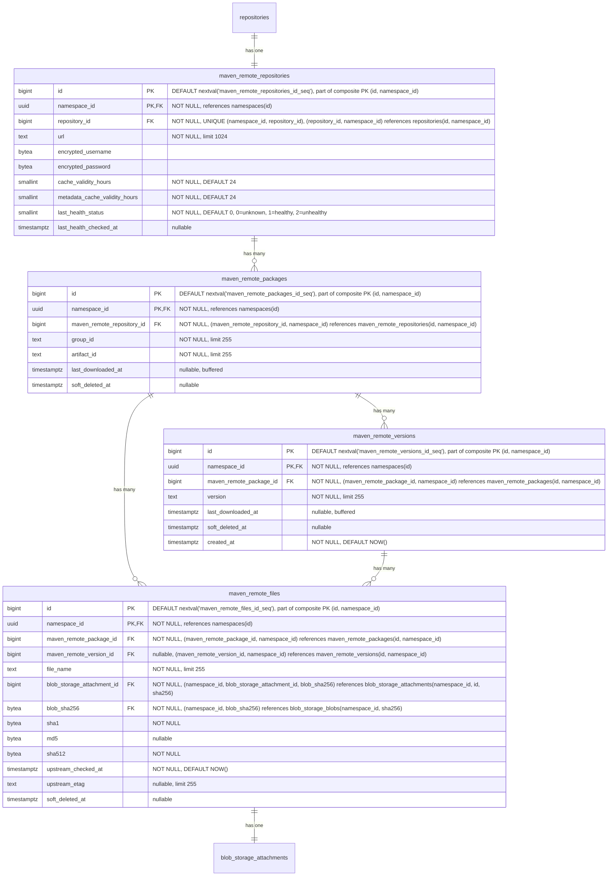

- **maven_remote_repositories**: 外部 Maven リポジトリを表します。URL、認証情報、アーティファクトキャッシュ TTL（`cache_validity_hours`）、および `maven-metadata.xml` のようなメタデータレスポンス用の別の TTL（`metadata_cache_validity_hours`）を含みます。ヘルスチェックのステータスは監視のために追跡されます。`repository_id` を介して親の `repositories` テーブルを参照します。`HASH(namespace_id)` で 64 個のパーティションにパーティショニングされます。
- **maven_remote_packages**: group ID と artifact ID で識別される、キャッシュされた Maven パッケージです。`maven_packages` を反映します。`last_downloaded_at` はパッケージのいずれかのキャッシュされたファイルが最後にダウンロードされた時刻を記録します。ホット行の競合を避けるため、バッファード／非同期書き込みを介して維持されます。`keep_last_downloaded_at` ライフサイクルルールとキャッシュ保持の評価に使用されます。`HASH(namespace_id)` で 64 個のパーティションにパーティショニングされます。
- **maven_remote_versions**: Maven パッケージのキャッシュされたバージョンです。`maven_versions` を反映します。`last_downloaded_at` はバージョンのいずれかのキャッシュされたファイルが最後にダウンロードされた時刻を記録します。ホット行の競合を避けるため、バッファード／非同期書き込みを介して維持されます。`keep_last_downloaded_at` ライフサイクルルールとキャッシュ保持の評価に使用されます。`created_at` はバージョンが最初にキャッシュされた時刻を記録し、[`maven_versions`](#maven-repositories) を反映してキャッシュ側の公開履歴と来歴スキャンを支えます。`HASH(namespace_id)` で 64 個のパーティションにパーティショニングされます。
- **maven_remote_files**: キャッシュされたファイル（JAR、POM、チェックサム、`maven-metadata.xml`）です。nullable の `maven_remote_version_id` はホスト型と同じパターン、すなわちバージョン固有のファイルとパッケージレベルのファイル（`maven-metadata.xml` など）の区別を保持します。`sha1` と `md5` は、コンテンツがホストされているかキャッシュされているかにかかわらず、Maven プロトコルがこれらのチェックサムの提供を必須とするため保持されます。`sha512` はパリティの観点から追加され、ホスト型の `maven_files` のカラム形を反映することで、Maven Virtual 仕様（S14）がいずれのバックエンドからも 1 つのクエリパスで `.sha512` サイドカーを提供できるようにします。値は他のチェックサムとともにプロキシ書き込みステップ中にキャッシュされたバイトから計算されるため、初日から `NOT NULL` が達成可能です。`upstream_checked_at` はファイルが上流リポジトリに対して最後に検証された時刻を記録します。再検証が必要かを判断するために、アーティファクトファイルには `cache_validity_hours` を、メタデータファイル（`maven-metadata.xml` など）には `metadata_cache_validity_hours` を比較します。`upstream_etag` は上流が返した ETag を格納し、条件付きリクエスト（`If-None-Match`）を可能にして、変更されていないファイルの再ダウンロードを回避します。`HASH(namespace_id)` で 64 個のパーティションにパーティショニングされます。
- **blob_storage_attachments**: 詳細は [Blob storage](#blob-storage) セクションを参照してください。

#### Indexes

- **`maven_remote_repositories`**: `(namespace_id, repository_id)` に対するユニークインデックス — リモートリポジトリを親参照でルックアップします。
- **`maven_remote_packages`**: `(namespace_id, maven_remote_repository_id, group_id, artifact_id) WHERE soft_deleted_at IS NULL` に対するユニークインデックス — キャッシュされたパッケージを Maven 座標でルックアップします。部分条件により、ソフト削除後に同じ座標のパッケージを再作成できます。
- **`maven_remote_versions`**: `(namespace_id, maven_remote_package_id, version) WHERE soft_deleted_at IS NULL` に対するユニークインデックス — パッケージ内でキャッシュされたバージョンをルックアップします。部分条件により、ソフト削除後に同じ識別子のバージョンを再作成できます。`(namespace_id, soft_deleted_at DESC) WHERE soft_deleted_at IS NOT NULL` に対するインデックス — ソフト削除済みのキャッシュされたバージョンを削除時刻順に一覧表示し、キャッシュされた Maven アーティファクトのアーティファクト粒度のゴミ箱一覧クエリを支えます。`(namespace_id, created_at DESC)` に対するインデックス — 名前空間全体の時系列スキャンで、ホスト型の [`maven_versions`](#maven-repositories) インデックスを反映してキャッシュ側の公開履歴と来歴をカバーします。ホスト型インデックスと同じ監査証跡の理由から無条件（`soft_deleted_at` 述語なし）です。
- **`maven_remote_files`**: `(namespace_id, maven_remote_version_id, file_name) WHERE soft_deleted_at IS NULL AND maven_remote_version_id IS NOT NULL` に対するユニークインデックス — バージョン固有のファイル名はバージョン内で一意でなければなりません。`(namespace_id, maven_remote_package_id, file_name) WHERE soft_deleted_at IS NULL AND maven_remote_version_id IS NULL` に対するユニークインデックス — パッケージレベルのファイル名はパッケージ内で一意でなければなりません。`(namespace_id, blob_storage_attachment_id)` に対するインデックス — ファイルをそのストレージアタッチメントでルックアップします。`(namespace_id, blob_sha256)` に対するインデックス — 格納された blob の sha256 から、それを参照するすべてのキャッシュされた Maven ファイルへの逆引きで、ホスト型の [`maven_files`](#maven-repositories) インデックスを反映し、チェックサム検索がキャッシュ側の参照もカバーするようにします。

#### Query examples

- リモートリポジトリを作成する。

  ```sql
  -- First create the parent repository
  INSERT INTO repositories (namespace_id, name, format, kind, visibility)
  VALUES ('018f4d6f-0e10-7e3a-9bfd-23a4c5d6e7f8', 'central', 1, 2, 0)
  RETURNING id;
  -- Link the repository to a repository collection
  INSERT INTO repository_collection_repositories (namespace_id, repository_collection_id, repository_id)
  VALUES ('018f4d6f-0e10-7e3a-9bfd-23a4c5d6e7f8', 456, <returned_id>);
  -- Then create the format-specific record
  INSERT INTO maven_remote_repositories (namespace_id, repository_id, url, encrypted_username, encrypted_password)
  VALUES ('018f4d6f-0e10-7e3a-9bfd-23a4c5d6e7f8', <returned_id>, 'https://repo.maven.apache.org/maven2', $1, $2);
  ```

- キャッシュされた Maven ファイルを座標でルックアップする。

  ```sql
  SELECT mrf.*, bsb.object_storage_key
  FROM maven_remote_files mrf
  JOIN maven_remote_versions mrv
    ON mrf.maven_remote_version_id = mrv.id AND mrf.namespace_id = mrv.namespace_id
  JOIN maven_remote_packages mrp
    ON mrv.maven_remote_package_id = mrp.id AND mrv.namespace_id = mrp.namespace_id
  JOIN blob_storage_blobs bsb
    ON bsb.namespace_id = mrf.namespace_id AND bsb.sha256 = mrf.blob_sha256
  WHERE mrp.namespace_id = '018f4d6f-0e10-7e3a-9bfd-23a4c5d6e7f8'
    AND mrp.maven_remote_repository_id = 789
    AND mrp.group_id = 'com.example'
    AND mrp.artifact_id = 'myapp'
    AND mrv.version = '1.0.0'
    AND mrf.file_name = 'myapp-1.0.0.jar'
    AND mrp.soft_deleted_at IS NULL AND mrv.soft_deleted_at IS NULL AND mrf.soft_deleted_at IS NULL;
  ```

- パッケージのキャッシュされた `maven-metadata.xml` をルックアップする。

  ```sql
  SELECT mrf.*
  FROM maven_remote_files mrf
  JOIN maven_remote_packages mrp
    ON mrf.maven_remote_package_id = mrp.id AND mrf.namespace_id = mrp.namespace_id
  WHERE mrp.namespace_id = '018f4d6f-0e10-7e3a-9bfd-23a4c5d6e7f8'
    AND mrp.maven_remote_repository_id = 789
    AND mrp.group_id = 'com.example'
    AND mrp.artifact_id = 'myapp'
    AND mrf.maven_remote_version_id IS NULL
    AND mrf.file_name = 'maven-metadata.xml'
    AND mrp.soft_deleted_at IS NULL AND mrf.soft_deleted_at IS NULL;
  ```

### Maven Virtual Repositories

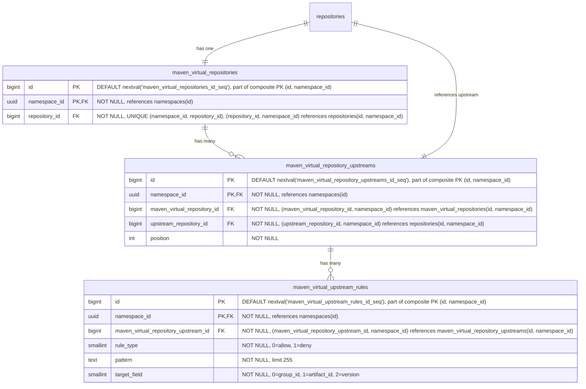

- **maven_virtual_repositories**: Maven パッケージ用の仮想リポジトリです。名前、可視性、フォーマット横断クエリのために、`repository_id` を介して親の `repositories` テーブルを参照します。`HASH(namespace_id)` で 64 個のパーティションにパーティショニングされます。
- **maven_virtual_repository_upstreams**: 仮想リポジトリとその upstream を結合するテーブルです。各仮想リポジトリは順序付けられた upstream のリストを持ちます。各エントリは `upstream_repository_id` を介して upstream リポジトリを参照し、これは `repositories(namespace_id, id)` を指します。複合 FK `(namespace_id, upstream_repository_id)` は、upstream が同じ名前空間内にあることを強制します。これはレジストリが名前空間にスコープされていること（[ADR-001](001_organizations_as_anchor_point.md)）と一致します。`HASH(namespace_id)` で 64 個のパーティションにパーティショニングされます。
- **maven_virtual_upstream_rules**: upstream に対する許可／拒否フィルタルールを定義します。各ルールはワイルドカードパターンとターゲットフィールドを指定し、この upstream を通じて解決する際にどのアーティファクトを含めるか除外するかを制御します。MVP ではパターンはワイルドカードのみです。正規表現のサポートは、顧客のフィードバックがそれを正当化するまで延期されます（[議論](https://gitlab.com/gitlab-org/gitlab/-/work_items/597754#note_3291871207)）。`HASH(namespace_id)` で 64 個のパーティションにパーティショニングされます。

#### Indexes

- **`maven_virtual_repositories`**: `(namespace_id, repository_id)` に対するユニークインデックス — 仮想リポジトリを親参照でルックアップします。
- **`maven_virtual_repository_upstreams`**: `(namespace_id, maven_virtual_repository_id, position) DEFERRABLE INITIALLY DEFERRED` に対するユニークインデックス — 仮想リポジトリの順序付けられた upstream を取得します。トランザクション内での並べ替えを可能にするため遅延可能です。`(namespace_id, maven_virtual_repository_id, upstream_repository_id)` に対するユニークインデックス — 同じ upstream が仮想リポジトリに 2 回追加されるのを防ぎます。
- **`maven_virtual_upstream_rules`**: `(namespace_id, maven_virtual_repository_upstream_id)` に対するインデックス — 特定の upstream のすべてのルールを取得します。

#### Query examples

- 仮想リポジトリを作成する。

  ```sql
  -- First create the parent repository
  INSERT INTO repositories (namespace_id, name, format, kind, visibility)
  VALUES ('018f4d6f-0e10-7e3a-9bfd-23a4c5d6e7f8', 'my-virtual-repo', 1, 1, 1)
  RETURNING id;
  -- Link the repository to a repository collection
  INSERT INTO repository_collection_repositories (namespace_id, repository_collection_id, repository_id)
  VALUES ('018f4d6f-0e10-7e3a-9bfd-23a4c5d6e7f8', 456, <returned_id>);
  -- Then create the format-specific record
  INSERT INTO maven_virtual_repositories (namespace_id, repository_id)
  VALUES ('018f4d6f-0e10-7e3a-9bfd-23a4c5d6e7f8', <returned_id>);
  ```

- 仮想リポジトリを upstream に関連付ける。

  ```sql
  INSERT INTO maven_virtual_repository_upstreams (namespace_id, maven_virtual_repository_id, upstream_repository_id, position)
  VALUES ('018f4d6f-0e10-7e3a-9bfd-23a4c5d6e7f8', 123, 789, 1);
  ```

### NPM Repositories

Node パッケージは基本的に `.tar.gz` ファイルであり、各バージョンが単一のアーカイブになっています。ただし、Node クライアントはより豊富な機能セットを備えており、たとえば、扱う必要のあるディストリビューションタグの使用などがあります。


- **npm_repositories**: 複数のパッケージを保持するコンテナです。各リポジトリは、オプションのスコープを持つ複数のパッケージをホストできます。名前、可視性、フォーマット横断クエリのために、`repository_id` を介して親の `repositories` テーブルを参照します。`HASH(namespace_id)` で 64 個のパーティションにパーティショニングされます。
- **npm_packages**: npm パッケージを表します。`name` カラムは、スコープを含む完全なパッケージ名（たとえば `@myorg/mypackage` や `lodash`）を格納します。`versions_count` はパッケージの `npm_versions` 行（ソフト削除済みのものを含む）を数え、ガベージコレクションが行をハード削除するときにのみデクリメントします。`tags_count` はその `npm_tags` 行を数えます（`npm_tags` にはソフト削除カラムがないため、この問題は生じません）。どちらも [ADR-004](004_data_and_application_limits.md#entity-count-limits) のパッケージごとのエンティティ数の上限（25,000 バージョン、1,000 タグ）を強制するバッファードカウンターで、[バッファード／非同期書き込み](#buffered-and-asynchronous-writes) を介して維持されます。ソフト削除済みのバージョンを含めることは `namespace_statistics.deduplicated_size_bytes` の扱いを反映しており、ゲーミングのベクトルを塞ぎます。ソフト削除済みの行を上限から除外できる顧客は、ソフト削除と再公開を繰り返すことで 25,000 バージョンの上限を無期限に下回り続けられてしまいますが、すべてのソフト削除済みの行は依然としてストレージを占有し復元可能なままです。どちらの上限も 32 ビットの上限を十分下回るため、`bigint` ではなく `integer` 型です。他の箇所の無制限のカウンター（`downloads_count`、`size_bytes`）は際限なく増加するため `bigint` が必要です。`last_downloaded_at` はパッケージのいずれかのファイルが最後にダウンロードされた時刻を記録します。[バッファード／非同期書き込み](#buffered-and-asynchronous-writes) を介して維持されます。`keep_last_downloaded_at` ライフサイクルルールが使用します。`HASH(namespace_id)` で 64 個のパーティションにパーティショニングされます。
- **npm_versions**: package.json メタデータを埋め込んだ npm パッケージの個々のバージョンを格納します。`last_downloaded_at` はバージョンのいずれかのファイルが最後にダウンロードされた時刻を記録します。[バッファード／非同期書き込み](#buffered-and-asynchronous-writes) を介して維持されます。`keep_last_downloaded_at` ライフサイクルルールが使用します。`gitlab_user_id`、`gitlab_project_id`、`gitlab_git_commit_sha` は、どの GitLab ユーザーがこのバージョンを公開したか、およびその公開の背後にある CI コンテキスト（プロジェクト、コミット）を記録します。形と根拠は [`container_manifests`](#container-repositories) の同等カラムと同じです。`created_at` はバージョンが最初に公開された時刻を記録し、[`container_manifests`](#container-repositories) と同じ公開履歴・時間範囲来歴スキャンを支えます。`HASH(namespace_id)` で 64 個のパーティションにパーティショニングされます。
- **npm_tags**: 特定のパッケージバージョンを指す [NPM ディストリビューションタグ](https://docs.npmjs.com/cli/v11/commands/npm-dist-tag)（たとえば `latest`、`next`、`beta`）を提供します。`HASH(namespace_id)` で 64 個のパーティションにパーティショニングされます。
- **npm_files**: npm パッケージバージョンのファイルを表します。これらは主に tarball アーカイブです。レジストリがパフォーマンスのボトルネックを改善するために使用する補助ファイルである場合もあります。`HASH(namespace_id)` で 64 個のパーティションにパーティショニングされます。
- **npm_metadata_files**: npm パッケージの事前計算されたメタデータファイルを `kind` ごとに 1 つずつ格納します。`kind` カラムはメタデータのバリアントを区別します。`full`（0）はすべてのバージョンを含む完全な packument を含み、`dist_tags`（1）はディストリビューションタグのマッピングのみを含み、`abbreviated`（2）はリクエストが `Accept: application/vnd.npm.install-v1+json` を伴う場合に提供されるインストール専用の射影です。クライアントのリクエストに基づいて、npm メタデータエンドポイントで適切なファイルが提供されます。メタデータはパッケージのすべてのバージョンにまたがるため、`npm_versions` ではなく `npm_packages` にリンクされます。メタデータファイルは、バージョンの公開または公開取り消しの後に非同期で生成されます。`expires_at` カラムはキャッシュの鮮度を駆動します。書き込み側（publish、deprecate、unpublish、dist-tag の変更）は、データ書き込みと同じトランザクション内で、対象パッケージのすべての行に `expires_at = NOW()` を設定することでキャッシュを強制的に期限切れにします。再構築ジョブは、新しく生成された blob を持つ行を upsert する際に `expires_at = NOW() + npm.packument_cache_ttl` を設定します。読み取り側は `expires_at > NOW()` でフィルタリングし、ミス時にはインラインビルドのパスにフォールスルーするため、期限切れの行がクライアントに提供されることはありません。このカラムは、ハードな削除期限ではなく、キャッシュの鮮度シグナルです。強制期限切れにしても blob とアタッチメントはそのまま残るため、すでにそれらに対して解決中のレスポンスは、再構築ジョブがアタッチメントを入れ替えるまで正常に完了します。`HASH(namespace_id)` で 64 個のパーティションにパーティショニングされます。
- **blob_storage_attachments**: 詳細は [Blob storage](#blob-storage) セクションを参照してください。

[Maven](#maven-repositories) と同様に、パッケージ名とバージョンはまったく同じ理由で 2 つの異なるテーブルに格納されます。

#### Indexes

- **`npm_repositories`**: `(namespace_id, repository_id)` に対するユニークインデックス — NPM リポジトリを親リポジトリ参照でルックアップします。
- **`npm_packages`**: `(namespace_id, npm_repository_id, name) WHERE soft_deleted_at IS NULL` に対するユニークインデックス — リポジトリ内でパッケージを名前でルックアップします。部分条件により、ソフト削除後に同じ名前のパッケージを再作成できます。`(namespace_id, npm_repository_id, last_downloaded_at NULLS FIRST) WHERE soft_deleted_at IS NULL` に対するインデックス — `keep_last_downloaded_at` ライフサイクルルールの評価をサポートします。リポジトリ内のすべてのパッケージを走査して行ごとにフィルタリングするのではなく、有界の範囲スキャンによって期限切れになったパッケージのみを返します。`NULLS FIRST` は一度もダウンロードされていないパッケージを最も古い行とグループ化するため、両方が同じ範囲スキャンで返されます。
- **`npm_versions`**: `(namespace_id, npm_package_id, version) WHERE soft_deleted_at IS NULL` に対するユニークインデックス — パッケージ内で特定のバージョンをルックアップします。部分条件により、ソフト削除後に同じ識別子のバージョンを再作成できます。`(namespace_id, npm_package_id, last_downloaded_at NULLS FIRST) WHERE soft_deleted_at IS NULL` に対するインデックス — パッケージのバージョンにスコープした `keep_last_downloaded_at` ライフサイクルルールの評価をサポートし、`npm_packages` と同じ範囲スキャン戦略を使用します。`(namespace_id, soft_deleted_at DESC) WHERE soft_deleted_at IS NOT NULL` に対するインデックス — ソフト削除済みバージョンを削除時刻順に一覧表示し、npm アーティファクトのアーティファクト粒度のゴミ箱一覧クエリを支えます。`(namespace_id, created_at DESC)` に対するインデックス — 名前空間全体の時系列スキャンで、公開履歴のページネーションと時間範囲のアーティファクト来歴クエリを支えます。ソフト削除済みの公開イベントも監査証跡に引き続き表示されるよう無条件です。
- **`npm_tags`**: `(namespace_id, npm_package_id, name)` に対するユニークインデックス — パッケージ内でディストリビューションタグを名前でルックアップします。`(namespace_id, npm_version_id)` に対するインデックス — 特定のバージョンを指すすべてのタグを見つけます。
- **`npm_files`**: `(namespace_id, npm_version_id, file_name) WHERE soft_deleted_at IS NULL` に対するユニークインデックス — ファイル名はバージョン内で一意でなければなりません。部分条件により、ソフト削除後に同じ名前のファイルを再作成できます。`(namespace_id, blob_storage_attachment_id)` に対するインデックス — ファイルをそのストレージアタッチメントでルックアップします。`(namespace_id, blob_sha256)` に対するインデックス — 格納された blob の sha256 から、それを参照するすべての npm ファイルへの逆引きで、フォーマット横断のチェックサム検索を支えます。既存のバージョンをキーとするインデックスは、ダイジェストをキーとするスキャンを直接満たすことはできません。
- **`npm_metadata_files`**: `(namespace_id, npm_package_id, kind)` に対するユニークインデックス — パッケージごと・kind ごとに 1 つのメタデータファイル。`(namespace_id, blob_storage_attachment_id)` に対するインデックス — メタデータファイルをそのストレージアタッチメントでルックアップします。`(namespace_id, blob_sha256)` に対するインデックス — 格納された blob の sha256 から、それを参照するすべてのメタデータファイルへの逆引きで、[`npm_files`](#npm-repositories) を反映し、単一の sha256 ルックアップで tarball と packument スタイルのメタデータの両方をカバーします。

#### Query examples

- 特定のリポジトリ ID とパッケージ名のすべてのバージョンを取得する。

  ```sql
  SELECT nv.*
  FROM npm_versions nv
  JOIN npm_packages np
    ON nv.npm_package_id = np.id AND nv.namespace_id = np.namespace_id
  WHERE np.namespace_id = '018f4d6f-0e10-7e3a-9bfd-23a4c5d6e7f8' AND np.npm_repository_id = 123 AND np.name = '@myorg/mypackage'
    AND np.soft_deleted_at IS NULL AND nv.soft_deleted_at IS NULL;
  ```

- 公開パスの上限事前チェックのためにパッケージごとのエンティティ数カウンターを読み取る（参考情報。`npm_versions` と `npm_tags` の部分ユニークインデックスが、レース耐性のある信頼できるガードです）。

  ```sql
  SELECT versions_count, tags_count
  FROM npm_packages
  WHERE namespace_id = '018f4d6f-0e10-7e3a-9bfd-23a4c5d6e7f8' AND id = 456 AND soft_deleted_at IS NULL;
  ```

- バージョン ID とファイル名を指定してファイルを取得する。

  ```sql
  SELECT nf.*
  FROM npm_files nf
  WHERE nf.namespace_id = '018f4d6f-0e10-7e3a-9bfd-23a4c5d6e7f8' AND nf.npm_version_id = 456 AND nf.file_name = 'mypackage-1.0.0.tgz'
    AND nf.soft_deleted_at IS NULL;
  ```

- パッケージの事前計算された完全メタデータファイルを取得する（npm メタデータエンドポイントで提供される）。

  ```sql
  SELECT bsb.object_storage_key, bsb.size
  FROM npm_metadata_files nmf
  JOIN blob_storage_blobs bsb ON bsb.namespace_id = nmf.namespace_id AND bsb.sha256 = nmf.blob_sha256
  WHERE nmf.namespace_id = '018f4d6f-0e10-7e3a-9bfd-23a4c5d6e7f8' AND nmf.npm_package_id = 456 AND nmf.kind = 0
    AND nmf.expires_at > NOW();
  ```

  読み取りは `expires_at > NOW()` でフィルタリングします。ミス（行がない、または書き込み側が強制期限切れにした、もしくは TTL が経過したことで `expires_at <= NOW()` になっている）の場合は、インラインビルドのパスにフォールスルーします。以下のキャッシュ再構築ジョブが新鮮な行を復元します。

- 書き込み時に packument キャッシュを強制的に期限切れにする。

  publish、deprecate、unpublish、dist-tag の変更は、データ書き込みと同じトランザクション内で、対象パッケージのすべての kind に対して `expires_at` を `NOW()` に切り替えることでキャッシュを無効化します。blob とアタッチメントはそのまま残されるため、すでに処理中のレスポンスは、再構築ジョブがアタッチメントを入れ替えるまで既存の blob に対して解決を続けます。

  ```sql
  UPDATE npm_metadata_files
  SET expires_at = NOW()
  WHERE namespace_id = '018f4d6f-0e10-7e3a-9bfd-23a4c5d6e7f8' AND npm_package_id = 456;
  ```

  初回公開では行がまだ存在しないため、`UPDATE` は 0 行に影響します。再構築ジョブが初回実行時にキャッシュ行を挿入します。

- バージョンの公開または公開取り消し後にメタデータファイルを upsert する。

  キャッシュ再構築ジョブは、パッケージの kind ごとにこれを 1 回実行します。orphan なアタッチメントが blob のガベージコレクションをブロックするのを防ぐため、古いアタッチメントは同じトランザクション内で削除する必要があります（[クリーンアップタスク](#cleanup-tasks) を参照）。

  ```sql
  -- The new blob and attachment (id=789) are created earlier in the same transaction.
  -- The interval below mirrors the configured `npm.packument_cache_ttl` (default 7 days).
  WITH old AS (
    SELECT blob_storage_attachment_id, blob_sha256
    FROM npm_metadata_files
    WHERE namespace_id = '018f4d6f-0e10-7e3a-9bfd-23a4c5d6e7f8' AND npm_package_id = 456 AND kind = 0
  ),
  upsert AS (
    INSERT INTO npm_metadata_files (namespace_id, npm_package_id, kind, blob_storage_attachment_id, blob_sha256, expires_at)
    VALUES ('018f4d6f-0e10-7e3a-9bfd-23a4c5d6e7f8', 456, 0, 789, 'abcd1234...'::bytea, NOW() + interval '7 days')
    ON CONFLICT (namespace_id, npm_package_id, kind)
    DO UPDATE SET blob_storage_attachment_id = EXCLUDED.blob_storage_attachment_id,
                  blob_sha256 = EXCLUDED.blob_sha256,
                  expires_at = EXCLUDED.expires_at
  )
  DELETE FROM blob_storage_attachments bsa
  USING old
  WHERE bsa.namespace_id = '018f4d6f-0e10-7e3a-9bfd-23a4c5d6e7f8'
    AND bsa.id = old.blob_storage_attachment_id
    AND bsa.sha256 = old.blob_sha256;
  ```

  初回挿入時は `old` CTE が行を返さないため、アタッチメントは削除されません。競合（更新）時には、以前のアタッチメントが削除されます。古い blob は、他のアタッチメントがそれを参照していなければガベージコレクションされます（重複排除に対して安全。各クライアントは自身のアタッチメントを保持するため、1 つを削除しても同じ blob を共有する他のクライアントには影響しません）。

### NPM Remote Repositories


- **npm_remote_repositories**: 外部 npm レジストリを表します。URL、認証情報、アーティファクトキャッシュ TTL（`cache_validity_hours`）、およびパッケージメタデータレスポンス用の別の TTL（`metadata_cache_validity_hours`）を含みます。ヘルスチェックのステータスは監視のために追跡されます。`repository_id` を介して親の `repositories` テーブルを参照します。`HASH(namespace_id)` で 64 個のパーティションにパーティショニングされます。
- **npm_remote_packages**: キャッシュされた npm パッケージです。`last_downloaded_at` はパッケージのいずれかのキャッシュされたファイルが最後にダウンロードされた時刻を記録します。ホット行の競合を避けるため、バッファード／非同期書き込みを介して維持されます。`keep_last_downloaded_at` ライフサイクルルールとキャッシュ保持の評価に使用されます。`HASH(namespace_id)` で 64 個のパーティションにパーティショニングされます。
- **npm_remote_versions**: `package_json` メタデータを伴うキャッシュされたバージョンです。packument が取得されたときに（すべてのバージョンメタデータを含むため）データが投入されます。`last_downloaded_at` はバージョンのいずれかのキャッシュされたファイルが最後にダウンロードされた時刻を記録します。ホット行の競合を避けるため、バッファード／非同期書き込みを介して維持されます。`keep_last_downloaded_at` ライフサイクルルールとキャッシュ保持の評価に使用されます。`created_at` はバージョンが最初にキャッシュされた時刻を記録し、[`npm_versions`](#npm-repositories) を反映してキャッシュ側の公開履歴と来歴スキャンを支えます。`HASH(namespace_id)` で 64 個のパーティションにパーティショニングされます。
- **npm_remote_tags**: キャッシュされた dist-tag からバージョンへのマッピング（たとえば `latest`、`next`）です。packument から投入されます。`HASH(namespace_id)` で 64 個のパーティションにパーティショニングされます。
- **npm_remote_metadata_files**: 上流レジストリからキャッシュされた事前計算済みメタデータファイルを、パッケージごと・kind ごとに 1 つずつ格納します。`kind` は、すべてのバージョンを含む完全な packument（`0`）と dist-tags のみのマッピング（`1`）を区別します。`upstream_checked_at` はメタデータが上流レジストリに対して最後に検証された時刻を記録します。再検証が必要かを判断するために `metadata_cache_validity_hours` と比較されます。`upstream_etag` は上流が返した ETag を格納し、条件付きリクエスト（`If-None-Match`）を可能にして、変更されていないメタデータの再ダウンロードを回避します。`HASH(namespace_id)` で 64 個のパーティションにパーティショニングされます。
- **npm_remote_files**: キャッシュされた tarball です。`upstream_checked_at` はファイルが上流レジストリに対して最後に検証された時刻を記録します。再検証が必要かを判断するために `cache_validity_hours` と比較されます。`upstream_etag` は上流が返した ETag を格納し、条件付きリクエスト（`If-None-Match`）を可能にして、変更されていない tarball の再ダウンロードを回避します。`HASH(namespace_id)` で 64 個のパーティションにパーティショニングされます。
- **blob_storage_attachments**: 詳細は [Blob storage](#blob-storage) セクションを参照してください。

#### Indexes

- **`npm_remote_repositories`**: `(namespace_id, repository_id)` に対するユニークインデックス — リモートリポジトリを親参照でルックアップします。
- **`npm_remote_packages`**: `(namespace_id, npm_remote_repository_id, name) WHERE soft_deleted_at IS NULL` に対するユニークインデックス — キャッシュされたパッケージを名前でルックアップします。部分条件により、ソフト削除後に同じ名前のパッケージを再作成できます。
- **`npm_remote_versions`**: `(namespace_id, npm_remote_package_id, version) WHERE soft_deleted_at IS NULL` に対するユニークインデックス — パッケージ内でキャッシュされたバージョンをルックアップします。部分条件により、ソフト削除後に同じ識別子のバージョンを再作成できます。`(namespace_id, soft_deleted_at DESC) WHERE soft_deleted_at IS NOT NULL` に対するインデックス — ソフト削除済みのキャッシュされたバージョンを削除時刻順に一覧表示し、キャッシュされた npm アーティファクトのアーティファクト粒度のゴミ箱一覧クエリを支えます。`(namespace_id, created_at DESC)` に対するインデックス — 名前空間全体の時系列スキャンで、ホスト型の [`npm_versions`](#npm-repositories) インデックスを反映してキャッシュ側の公開履歴と来歴をカバーします。ホスト型インデックスと同じ監査証跡の理由から無条件（`soft_deleted_at` 述語なし）です。
- **`npm_remote_tags`**: `(namespace_id, npm_remote_package_id, name)` に対するユニークインデックス — ディストリビューションタグを名前でルックアップします。`(namespace_id, npm_remote_version_id)` に対するインデックス — 特定のバージョンを指すすべてのタグを見つけます。
- **`npm_remote_metadata_files`**: `(namespace_id, npm_remote_package_id, kind)` に対するユニークインデックス — パッケージごと・kind ごとに 1 つのメタデータファイルを強制します。`(namespace_id, blob_storage_attachment_id)` に対するインデックス — メタデータファイルをそのストレージアタッチメントでルックアップします。`(namespace_id, blob_sha256)` に対するインデックス — 格納された blob の sha256 から、それを参照するすべてのキャッシュされたメタデータファイルへの逆引きで、ホスト型の [`npm_metadata_files`](#npm-repositories) インデックスを反映します。
- **`npm_remote_files`**: `(namespace_id, npm_remote_version_id, file_name) WHERE soft_deleted_at IS NULL` に対するユニークインデックス — ファイル名はバージョン内で一意でなければなりません。部分条件により、ソフト削除後に同じ名前のファイルを再作成できます。`(namespace_id, blob_storage_attachment_id)` に対するインデックス — ファイルをそのストレージアタッチメントでルックアップします。`(namespace_id, blob_sha256)` に対するインデックス — 格納された blob の sha256 から、それを参照するすべてのキャッシュされた npm ファイルへの逆引きで、ホスト型の [`npm_files`](#npm-repositories) インデックスを反映し、チェックサム検索がキャッシュ側の参照もカバーするようにします。

#### Query examples

- リモートリポジトリを作成する。

  ```sql
  -- First create the parent repository
  INSERT INTO repositories (namespace_id, name, format, kind, visibility)
  VALUES ('018f4d6f-0e10-7e3a-9bfd-23a4c5d6e7f8', 'npm-registry', 2, 2, 0)
  RETURNING id;
  -- Link the repository to a repository collection
  INSERT INTO repository_collection_repositories (namespace_id, repository_collection_id, repository_id)
  VALUES ('018f4d6f-0e10-7e3a-9bfd-23a4c5d6e7f8', 456, <returned_id>);
  -- Then create the format-specific record
  INSERT INTO npm_remote_repositories (namespace_id, repository_id, url, encrypted_auth_token)
  VALUES ('018f4d6f-0e10-7e3a-9bfd-23a4c5d6e7f8', <returned_id>, 'https://registry.npmjs.org', $1);
  ```

- パッケージのすべてのキャッシュされたバージョンを取得する（packument レスポンスを提供する）。

  ```sql
  SELECT nrv.version, nrv.package_json
  FROM npm_remote_versions nrv
  JOIN npm_remote_packages nrp
    ON nrv.npm_remote_package_id = nrp.id AND nrv.namespace_id = nrp.namespace_id
  WHERE nrp.namespace_id = '018f4d6f-0e10-7e3a-9bfd-23a4c5d6e7f8'
    AND nrp.npm_remote_repository_id = 789
    AND nrp.name = '@myorg/mypackage'
    AND nrp.soft_deleted_at IS NULL AND nrv.soft_deleted_at IS NULL;
  ```

- キャッシュされた tarball をプルする（読み取りパスのショートカット）。

  ```sql
  SELECT bsb.object_storage_key, bsb.size
  FROM npm_remote_files nrf
  JOIN blob_storage_blobs bsb
    ON bsb.namespace_id = nrf.namespace_id AND bsb.sha256 = nrf.blob_sha256
  WHERE nrf.namespace_id = '018f4d6f-0e10-7e3a-9bfd-23a4c5d6e7f8'
    AND nrf.npm_remote_version_id = 456
    AND nrf.file_name = 'mypackage-1.0.0.tgz'
    AND nrf.soft_deleted_at IS NULL;
  ```

### NPM Virtual Repositories

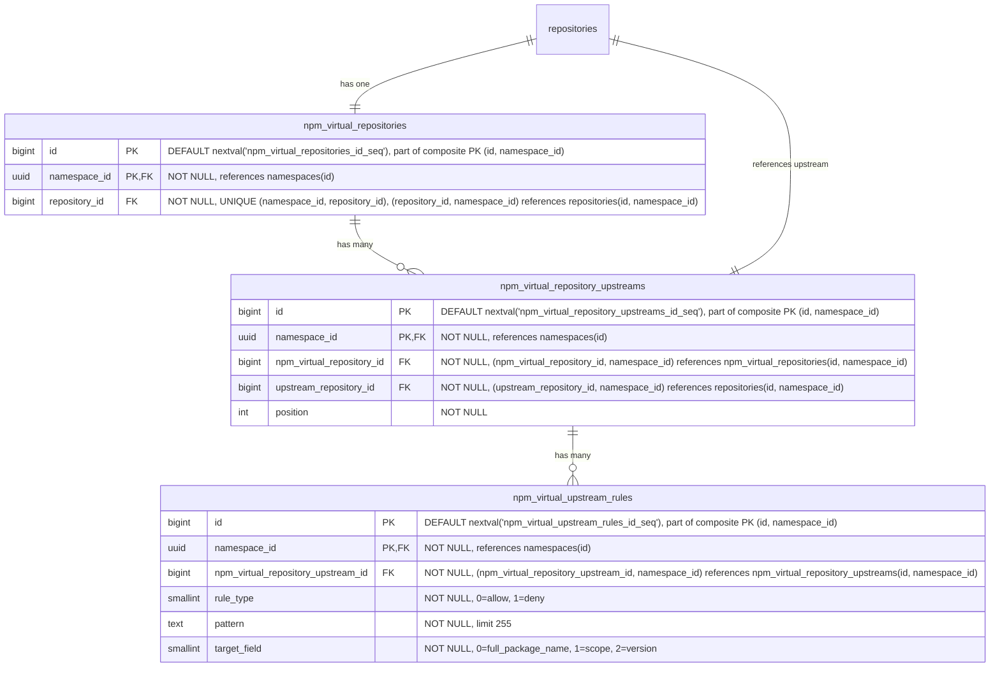

- **npm_virtual_repositories**: npm パッケージ用の仮想リポジトリです。名前、可視性、フォーマット横断クエリのために、`repository_id` を介して親の `repositories` テーブルを参照します。`HASH(namespace_id)` で 64 個のパーティションにパーティショニングされます。
- **npm_virtual_repository_upstreams**: 仮想リポジトリとその upstream を結合するテーブルです。各仮想リポジトリは順序付けられた upstream のリストを持ちます。各エントリは `upstream_repository_id` を介して upstream リポジトリを参照し、これは `repositories(namespace_id, id)` を指します。複合 FK `(namespace_id, upstream_repository_id)` は、upstream が同じ名前空間内にあることを強制します。これはレジストリが名前空間にスコープされていること（[ADR-001](001_organizations_as_anchor_point.md)）と一致します。`HASH(namespace_id)` で 64 個のパーティションにパーティショニングされます。
- **npm_virtual_upstream_rules**: upstream に対する許可／拒否フィルタルールを定義します。各ルールはワイルドカードパターンとターゲットフィールドを指定し、この upstream を通じて解決する際にどのアーティファクトを含めるか除外するかを制御します。MVP ではパターンはワイルドカードのみです。正規表現のサポートは、顧客のフィードバックがそれを正当化するまで延期されます（[議論](https://gitlab.com/gitlab-org/gitlab/-/work_items/597754#note_3291871207)）。`HASH(namespace_id)` で 64 個のパーティションにパーティショニングされます。

#### Indexes

- **`npm_virtual_repositories`**: `(namespace_id, repository_id)` に対するユニークインデックス — 仮想リポジトリを親参照でルックアップします。
- **`npm_virtual_repository_upstreams`**: `(namespace_id, npm_virtual_repository_id, position) DEFERRABLE INITIALLY DEFERRED` に対するユニークインデックス — 仮想リポジトリの順序付けられた upstream を取得します。トランザクション内での並べ替えを可能にするため遅延可能です。`(namespace_id, npm_virtual_repository_id, upstream_repository_id)` に対するユニークインデックス — 同じ upstream が仮想リポジトリに 2 回追加されるのを防ぎます。
- **`npm_virtual_upstream_rules`**: `(namespace_id, npm_virtual_repository_upstream_id)` に対するインデックス — 特定の upstream のすべてのルールを取得します。

#### Query examples

- 仮想リポジトリを作成する。

  ```sql
  -- First create the parent repository
  INSERT INTO repositories (namespace_id, name, format, kind, visibility)
  VALUES ('018f4d6f-0e10-7e3a-9bfd-23a4c5d6e7f8', 'my-virtual-repo', 2, 1, 1)
  RETURNING id;
  -- Link the repository to a repository collection
  INSERT INTO repository_collection_repositories (namespace_id, repository_collection_id, repository_id)
  VALUES ('018f4d6f-0e10-7e3a-9bfd-23a4c5d6e7f8', 456, <returned_id>);
  -- Then create the format-specific record
  INSERT INTO npm_virtual_repositories (namespace_id, repository_id)
  VALUES ('018f4d6f-0e10-7e3a-9bfd-23a4c5d6e7f8', <returned_id>);
  ```

- 仮想リポジトリを upstream に関連付ける。

  ```sql
  INSERT INTO npm_virtual_repository_upstreams (namespace_id, npm_virtual_repository_id, upstream_repository_id, position)
  VALUES ('018f4d6f-0e10-7e3a-9bfd-23a4c5d6e7f8', 123, 789, 1);
  ```

### Blob storage

blob ストレージのデータ構成は、以下の前提のもとで行われています。

- blob への 1 対多の関連を扱う必要はありません。これは blob ストレージクライアント領域で扱われます。したがって、1 対 1 の関連のみが必要です。
- 適切な [クリーンアップ処理](#cleanup-tasks) のために、単一の blob を使用する blob ストレージクライアントの数を追跡する必要があります（重複排除）。
- さらに、単一の blob に対する各使用の異なる出所を追跡したい場合があります。

ここで提示するスキーマは、データのストレージ側のみを考慮しています。メトリクスや [クリーンアップ](#cleanup-tasks) などの追加的な側面に必要となる補助テーブルが存在する可能性がありますが、これらの部分はまだ評価中であるため、ここでは説明しません。アップロードセッションの追跡については [Upload sessions](#upload-sessions) で説明します。

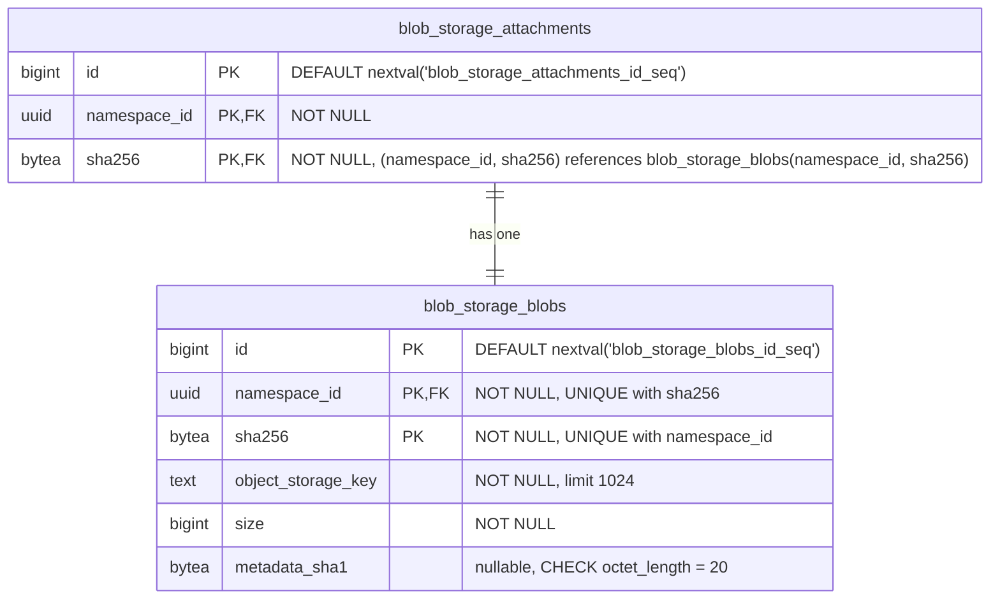

- **blob_storage_attachments**: 特定の blob の使用を追跡します。各クライアント（Container、NPM、Maven のリポジトリテーブル）は、blob レコードを使用（作成または再利用）したいたびに、ここにレコードを作成する必要があります。各使用は、ここに 1 つのレコードを_持つ必要があります_。クライアントは、参照しているアーティファクトレコード（ファイル、blob、キャッシュエントリ）を削除する際に、アタッチメントレコードも削除する責任があります。orphan なアタッチメントが blob のクリーンアップをブロックするのを防ぐため、両方の削除は同じトランザクション内で行う必要があります。クライアントテーブルから `blob_storage_attachments` への外部キーは参照整合性を強制します（ダングリング参照を防ぎます）が、`ON DELETE CASCADE` は使用しません。クリーンアップはアプリケーション管理です。たとえば、まったく同じファイルを持つ 2 つの Maven パッケージは、それぞれ異なるアタッチメントレコードを参照し、それらが同じ blob レコードを参照する必要があります。`namespace_id` カラムは Cells のシャーディングのために必須です。`sha256` カラムは、パーティション枝刈り（partition-pruned）された結合を可能にするために、参照される `blob_storage_blobs` レコードから伝播されます（[パーティショニング戦略](#blob-storage-partitioning-strategy) を参照）。主キーは従来の `(id)` ではなく `(id, namespace_id, sha256)` です。`sha256` が必須なのは、PostgreSQL がハッシュパーティション化テーブルのすべてのユニーク制約にパーティションキーを含めることを強制するためで、`namespace_id` が必須なのは、PK をデプロイメント間でグローバルに一意に保つためです。ローカルの `bigint id` は単一の Artifact Registry データベース内でのみ一意なため（[Namespace ID type](#namespace-id-type) を参照）、デプロイメント間の名前空間移行（[ADR-022](022_namespace_decoupling.md)）では、同じ `(id, sha256)` ペアが移行先のデータベースにすでに存在する可能性があります。UUIDv7 の `namespace_id` を PK に追加することで、その衝突を構造上排除します。クライアントテーブルは、`(namespace_id, blob_storage_attachment_id, blob_sha256)` を介してこの複合 PK を参照します。
- **blob_storage_blobs**: このテーブルは、オブジェクトストレージ上に存在するすべてのファイルコンテンツを（blob として）リストします。オブジェクトストレージキーは専用カラムに完全に格納され、blob が使用されるたびに計算されることはありません。`sha256` は基本的なコンテンツアドレス指定可能な識別子であり、常に存在します（`NOT NULL`）。`namespace_id` カラムは重複排除を Organization のスコープに限定します。フォーマット固有のチェックサム（たとえば Maven の SHA1 と MD5）は、ここではなくフォーマット固有のファイルテーブルに格納され、このテーブルをフォーマット非依存に保ちます。コンテンツタイプも同じ理由で除外されています。それは blob 自体のプロパティではなく、フォーマットが blob をどう解釈するかのプロパティであり、フォーマット固有のテーブルに属します。`metadata_sha1` カラムは、そのフォーマット非依存ルールに対する意図的かつ限定的な例外です。これはコミット時に blob に付加される MVP ユーザーメタデータの allowlist 由来の SHA-1 を反映したもので、SHA-1 が提供されなかった場合は `NULL` です。これが（フォーマット固有のテーブルではなく）`blob_storage_blobs` にあるのは、ストレージレイヤーの blob 情報ルックアップが push と pull のホットパスで契約上単一の DB ラウンドトリップであるためです。DB のミラーなしにユーザーメタデータを公開すると、ダイジェストごとのオブジェクトストレージ HEAD のファンアウトか、部分的な API 公開を強いることになります。同じ値はコミット時にバックエンドネイティブの `x-amz-meta-checksum-sha1` / `x-goog-meta-checksum-sha1` ヘッダーとしてストレージオブジェクトに付加され、行は不変であるため、DB とストレージオブジェクトのコピーが乖離することはありません。将来の allowlist の追加は、改正により独自の nullable カラムを追加します。完全な根拠については [Artifact Registry S06 ストレージレイヤー仕様](https://gitlab.com/gitlab-org/ops/artifact-registry/-/blob/main/docs/specs/S06-storage-layer.md) を参照してください。主キーは、上記の `blob_storage_attachments` と同じ理由で `(id, namespace_id, sha256)` です。`sha256` は PostgreSQL のパーティションキー包含ルールを満たし、UUIDv7 の `namespace_id` は PK をデプロイメント間でグローバルに一意に保ち、サロゲートの `bigint id` はスキーマの他のすべてのテーブルと行識別子の形を一貫させます。Organization ごとの重複排除は、別の `UNIQUE (namespace_id, sha256)` 制約によって強制されます。これはコンテンツハッシュによるルックアップのインデックスとしても機能し、このテーブルへのすべての外部キーのターゲットになります。PK を直接参照する FK はありません。`(namespace_id, sha256)` はすでに行を一意に識別し、UUIDv7 の `namespace_id` によってそれ自体でグローバルに一意であるため、呼び出し側はサロゲート `id` を持ち回らずに自然キーで結合します。

blob ストレージテーブルは、Artifact Registry の外でも再利用できるように設計されています。これにより、他の機能が同じ重複排除とストレージインフラストラクチャを活用できます。

すべてのハッシュカラム（`digest` と `sha256`、および Maven 固有の `sha1`、`md5`、`sha512`）は `bytea` として格納されます。正確なエンコーディング戦略（たとえば [Container Registry](https://gitlab.com/gitlab-org/container-registry) で使用されているインラインのアルゴリズムプレフィックスか、別の `digest_algorithm` カラムか）はまだ未定です。

### Upload sessions

アップロードセッションは、[ADR-008](008_content_addressable_storage.md#two-phase-upload-strategy) で説明されている 2 フェーズのアップロードライフサイクルを通じて、進行中の blob アップロードを追跡します。各セッションは、名前空間のストレージパーティション内の `uploads/{upload_id}` にある一時ストレージオブジェクトにマッピングされます。セッションは、アップロード API（再開可能なアップロード、並行アップロードの解決）をサポートし、オブジェクトストレージの列挙なしに [アップロードのパージ](#cleanup-tasks)（[ADR-011](011_data_reconciliation.md)）を可能にするため、初期スキーマからデータベースで追跡されます。

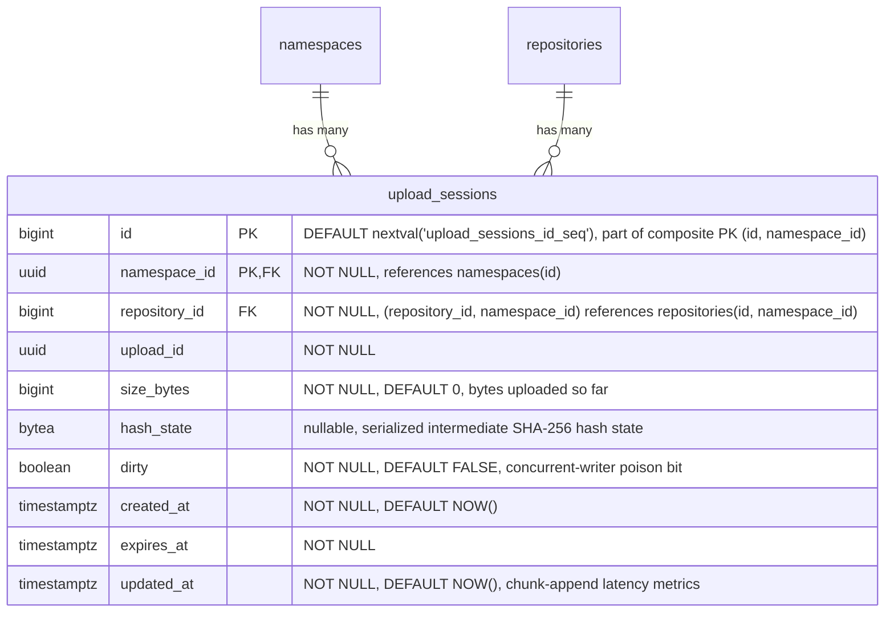

- **upload_sessions**: 各 blob アップロードが進行中である間、それを追跡します。テーブルは [コンテナレジストリのパターン](https://gitlab.com/gitlab-org/container-registry/-/blob/master/registry/storage/blobwriter.go) を反映した二値の存在モデルに従います。行が存在すればアップロードは進行中またはクリーンアップが必要であり、存在しなければアップロードは完了したかパージされています。完了時、ストレージレイヤーは blob をコンテンツアドレス指定ストアへ移動し、`blob_storage_blobs` レコードを作成するのと同じトランザクションでセッション行を削除します。フォーマット固有の行（`blob_storage_attachments` とフォーマットテーブル）は、その後の別のトランザクションで呼び出し元のフォーマットサブシステムによって作成されます。これにより、ストレージレイヤーはフォーマット非依存に保たれます。`upload_id`（UUID）は、一時オブジェクトパス（`uploads/{upload_id}`）で使用されるストレージレベルの識別子です。`repository_id` はアップロードを開始したリポジトリを記録します。後続のリクエストでは、サーバーは URL 内のリポジトリが session.repository_id と一致することを検証し、upload_id が漏洩した場合のリポジトリ横断での再利用を防ぎます。各リクエストの認可は、URL のリポジトリに対してリクエストミドルウェアが実施するもので、このカラムには依存しません。複合 FK `(namespace_id, repository_id)` は、アップロードが対象リポジトリと同じ名前空間内にあることを強制します。`size_bytes` は一時ストレージに書き込まれたバイト数を追跡します。再開可能なアップロードでは、各チャンクが到着するたびに更新され、クライアントに再開位置を伝える `Range` レスポンスヘッダー（[OCI Distribution Spec](https://github.com/opencontainers/distribution-spec/blob/main/spec.md)）を生成するために使用されます。モノリシックなアップロードでは、blob データが書き込まれた後に設定されます。`created_at` はアップロードが開始された時刻を記録します。アップロード時間のメトリクス（時間と blob サイズの相関）を可能にし、アプリケーションの TTL 設定が引き下げられた場合の遡及的な期限切れ（`WHERE created_at < NOW() - :new_ttl`）を可能にします。これは `expires_at` のみでは対応できません。既存のセッションは元の期限を保持するためです。`expires_at` はセッションの期限タイムスタンプで、作成時にアップロードタイプに基づいて `NOW() + :configured_ttl` として計算されます（再開不可のアップロードでは短く、再開可能なアップロードでは長く）。期限切れのセッションはアップロードパージの候補です。パージャーは一時ストレージオブジェクトを削除し、行を削除します（[ADR-008](008_content_addressable_storage.md#temporary-object-cleanup)）。再開可能なアップロードのハッシュ状態は、シリアライズされた SHA-256 の中間状態として `hash_state` カラムに格納されます。単一行の `UPDATE` は、PATCH ごとのオブジェクトストレージのラウンドトリップよりも単純です（[ADR-008](008_content_addressable_storage.md#resumable-uploads-and-hash-state) を参照）。その `UPDATE` は行ロックを取りません。1 つの `upload_id` に対する並行する書き込み側は、`SELECT ... FOR UPDATE` ロックではなく、`size_bytes` に対する compare-and-swap と `dirty` ポイズンビットによって調停されます（divergence 時に終了）。`dirty` はそのポイズンビットで、CAS の敗者が設定し、行の削除によってのみクリアされます。失敗ごとのフローは [Artifact Registry S06 ストレージレイヤー仕様](https://gitlab.com/gitlab-org/ops/artifact-registry/-/blob/main/docs/specs/S06-storage-layer.md) の「Consistency & Crash-Recovery Model」で定義されています。`updated_at` はセッションの最終変更時刻を記録し、チャンク追加のレイテンシメトリクスと最終アクティビティの可観測性をサポートします。アクセスログから導出するのではなく格納カラムであるのは、リクエスト時の同期的な再開パスの判断を支えるためです。書き込みコストは無視できる程度です。既存の `size_bytes`/`hash_state` の `UPDATE` に便乗するためです。`HASH(namespace_id)` で 64 個のパーティションにパーティショニングされ、スキーマ内の他のすべての `namespace_id` スコープのテーブルと一貫しています。セッションは短命ですが、アップロードパージャーは延期されている（[ADR-011](011_data_reconciliation.md)）ため、それが出荷されるまで期限切れの行が蓄積されます。初日からパーティショニングしておくことで後のマイグレーションを回避し、`repositories` とのパーティション単位の結合の適格性を保ち、空のパーティションではコストがかかりません。主キーは従来の `(id)` ではなく `(id, namespace_id)` です。PostgreSQL はハッシュパーティション化テーブルのすべてのユニーク制約にパーティションキーを必要とし、この PK のパーティションキーは UUIDv7 の `namespace_id` であるため、すでにデプロイメント間でグローバルに一意です。これは `sha256` でパーティショニングし、同じ保証のために `namespace_id` を追加する `blob_storage_attachments` や `blob_storage_blobs` とは異なります。

#### Indexes

- **`upload_sessions`**: `(namespace_id, upload_id)` に対するユニークインデックス — 名前空間内でセッションをそのアップロード UUID でルックアップします。`expires_at` に対するインデックス — アップロードパージのために期限切れのセッションを見つけます。`(namespace_id, repository_id)` に対するインデックス — 特定のリポジトリのすべてのセッションを見つけます。認可チェックとリポジトリ削除時のクリーンアップに使用されます。

#### Query examples

- アップロードセッションを作成する。

  ```sql
  INSERT INTO upload_sessions (namespace_id, repository_id, upload_id, expires_at)
  VALUES ('018f4d6f-0e10-7e3a-9bfd-23a4c5d6e7f8', 456, 'a0eebc99-9c0b-4ef8-bb6d-6bb9bd380a11', NOW() + INTERVAL '1 hour')
  RETURNING id, upload_id;
  ```

- チャンク化アップロード中にセッションをルックアップする。

  ```sql
  SELECT *
  FROM upload_sessions
  WHERE namespace_id = '018f4d6f-0e10-7e3a-9bfd-23a4c5d6e7f8' AND upload_id = 'a0eebc99-9c0b-4ef8-bb6d-6bb9bd380a11';
  ```

- チャンク追加後にセッション状態を更新する（`hash_state` + `updated_at`、`size_bytes` に対する compare-and-swap）。

  ```sql
  UPDATE upload_sessions
  SET size_bytes = 1048576, hash_state = 'a1b2c3...'::bytea, updated_at = NOW()
  WHERE namespace_id = '018f4d6f-0e10-7e3a-9bfd-23a4c5d6e7f8' AND upload_id = 'a0eebc99-9c0b-4ef8-bb6d-6bb9bd380a11'
    AND size_bytes = 524288;  -- CAS: only persist if no concurrent writer advanced the row; a zero-rowcount result is a conflict
  ```

- アップロードパージのために期限切れのセッションを見つける。

  ```sql
  SELECT id, namespace_id, upload_id
  FROM upload_sessions
  WHERE expires_at < NOW()
  ORDER BY expires_at
  LIMIT 100;
  ```

  このクエリはパーティション枝刈りされません。述語に `namespace_id` が含まれないため、64 個すべてのパーティションをスキャンします。ここではそれで問題ありません。パージャーは有界のバックグラウンドジョブ（`LIMIT 100`、`expires_at` に対するインデックスに裏付けられる）であり、ホットパスのクエリではないため、ファンアウトはパフォーマンス上重要ではありません。

- クリーンアップ後にセッションを削除する。

  ```sql
  DELETE FROM upload_sessions
  WHERE namespace_id = '018f4d6f-0e10-7e3a-9bfd-23a4c5d6e7f8' AND id = 789;
  ```

### Partitioning invariant

**`namespace_id` を含むすべてのテーブルはパーティショニングされます。** デフォルトのパーティションキーは `HASH(namespace_id)` で 64 個のパーティションです。文書化された理由がある場合、特定のテーブルは異なるキーを使用することがあります（`HASH(sha256)` の例外については [Blob storage partitioning strategy](#blob-storage-partitioning-strategy) を参照）。`namespace_id` を含まないテーブルはパーティショニングされません。

このルールは、テーブルごとの判断ではなく行のプロパティとして述べられています。`namespace_id` がスキーマの一部であれば、そのテーブルはパーティショニングされます。「このテーブルは小さい」「このテーブルは親と 1:1 だ」「あとでパーティショニングを追加できる」といった例外はありません。小さいテーブルも大きいテーブルと同じようにパーティショニングされます。一貫性こそが重要です。低ボリュームのテーブルをパーティショニングするコストは無視できます（ほぼ空の 64 個の子、測定可能な実行時オーバーヘッドなし）。一方、後でパーティショニングを_追加する_コストは、本番データが配置された後ではテーブルの書き換え、主キーの再構成、外部キーの連鎖的な変更が支配的になります。

#### Mechanical consequences

PostgreSQL は、パーティション化テーブルのすべてのユニーク制約にパーティションキーを含めることを要求します。これがスキーマ全体の主キーと外部キーを形作ります。

- **主キー。** すべてのパーティション化テーブルの主キーは `namespace_id` を吸収します。`(id)` は `(id, namespace_id)` になります。パーティション化テーブルのユニークインデックスは、先頭カラムとして `namespace_id` を含みます。
- **パーティション化テーブル間の外部キー。** `namespace_id` に対して複合になります。子は `(<parent>_id, namespace_id)` を介して親を参照し、それが親の `(id, namespace_id)` を参照します。このパターンは、`repositories`、`workspaces`、フォーマット固有のリポジトリテーブル、中間層テーブル、ファイルテーブル、リモートキャッシュテーブルにわたって統一されています。
- **`namespaces` への外部キー。** 単一カラムです。`namespace_id` が `namespaces(id)` を参照します。`namespaces` は主キーが `(id)` のままである唯一のテーブルです。パーティショニングされておらず、自身の `namespace_id` を持たない（それを_定義する_）ため、子テーブルは複合 PK の操作なしにそれを参照します。

複合外部キーの形は、名前空間の境界をスキーマレベルでエンコードします。あるパーティション化テーブルの行は、別の名前空間に属する別のパーティション化テーブルの行を参照できません。外部キーがそれを禁止するためです。これは Cells のシャーディングキー（`namespace_id`）がアプリケーションレベルで引く境界と同じもので、データベース自体で冗長に表現されています。

#### Exceptions

テーブルがパーティショニングされないのは、`namespace_id` を欠いている場合のみです。現在の主要な例は `namespaces` 自体です。これは `namespace_id` が判明する前に `slug` から解決されるルーティングのルートであり、`namespace_id` カラムを持ちません（それを定義するため）。`namespace_id` を持たない将来のテーブル（たとえばインスタンス全体の設定、グローバルな cron 状態、デプロイメントスコープのライフサイクルメタデータ）は、このデフォルトを自動的に継承し、パーティショニングされません。

例外の述語は構造的です。すなわち、行内の `namespace_id` の有無です。これは行数、書き込み頻度、現在のアクセスパターンには依存しません。これらはすべてシステムの進化とともに変化しうるものです。

シングルテナントのデプロイメント（Dedicated、Self-Managed、単一 Organization の Cells）も例外ではありません。64 個すべてのパーティションを保持し、1 つにデータが入り、63 個が空になります。空のパーティションはこの規模では無視できます（それぞれカタログとインデックスのオーバーヘッドが数 KB）。パーティション枝刈りには影響せず、デプロイメント間のスキーマの一貫性は、シングルテナントのバリアントを切り出すよりも価値があります。「1 つのパーティションがすべてを保持する」という病的なケースは、フルなマルチテナント規模での `blob_storage_blobs` / `blob_storage_attachments` にのみ当てはまります。これがこの 2 つのテーブルが代わりに `HASH(sha256)` を使用する理由です（[Blob storage partitioning strategy](#blob-storage-partitioning-strategy) を参照）。

### Blob storage partitioning strategy

[Consequences](#negative) で述べたとおり、`blob_storage_blobs` と `blob_storage_attachments` は、すべての Organization にわたるすべてのアーティファクトフォーマットを処理するため、非常に多くの行数を蓄積します。意図的なパーティショニング戦略がなければ、これは以下につながります。

- テーブルが数十億行へと成長するにつれて、インデックスの肥大化とクエリパフォーマンスの低下が起こります。
- テーブル全体のロック（たとえばインデックス作成やスキーマ移行の際）が、すべてのアーティファクトタイプを同時にブロックします。
- 高い書き込みレートでの autovacuum の競合が起こります。

念頭に置くべき重要な制約: PostgreSQL は、パーティション化テーブルのすべてのユニーク制約にパーティションキーを含めることを要求します。`blob_storage_blobs` の場合、重複排除制約は `UNIQUE (namespace_id, sha256)` です。パーティションキーがこれらのカラムのサブセットでないどんな戦略も、その制約に追加のカラムを強いることになります。すると、同じ Organization 内の同じ blob が異なるパーティションにまたがって 2 回格納されるのを防げなくなり、重複排除モデルが完全に損なわれてしまいます。

以下が候補となる戦略です。

#### Option A: Hash partitioning by `sha256`

両テーブルを `PARTITION BY HASH (sha256)` で 64 個のパーティションにパーティショニングします。

`sha256` はコンテンツアドレス指定のダイジェストであるため、その値は本質的に一様に分布します。均等なデータ分布のための追加の労力は不要です。これはシングルテナントの問題を解決します。シングルテナントのデプロイメント（Dedicated、Self-Managed、単一 Organization の Cells）は、`namespace_id` のみを使用するとすべての行を単一のパーティションに集中させてしまいます。`sha256` をパーティションキーにすると、Organization の数にかかわらず、行は 64 個すべてのパーティションに均等に分散します。

`[namespace_id, sha256]` に対する既存のユニーク制約はすでに `sha256` を含んでいるため、このスキームと互換性があります。パーティションキーが制約の一部であるため、PostgreSQL はハッシュパーティションをまたいで一意性を強制できます。

このアプローチでは、`blob_storage_blobs` への結合が単一のパーティションをターゲットにできるよう、`sha256` を `blob_storage_attachments` とフォーマット固有のテーブル（`*_files`、`container_blobs`、`container_manifests`、キャッシュエントリ）へ伝播させる必要があります。つまり、blob 識別子（`namespace_id` + `sha256`）が `*_files` と `blob_storage_attachments` の両方の行に格納され、単純な `bigint` 外部キーよりも多くの物理ストレージを使用します（`sha256` は `bytea` として 32 バイト、`bigint` は 8 バイト）。しかし、このトレードオフは正当化されます。読み取りパス（アーティファクトのプル）、すなわちシステムで最もホットなクエリは、`*_files` から `blob_storage_blobs` へ `(namespace_id, sha256)` を介して直接結合でき、`blob_storage_attachments` を完全にスキップして 1 つの結合を排除します。アタッチメントは、[クリーンアップ](#cleanup-tasks) 時に「この blob はまだ誰かに使われているか？」に答えるライフサイクルパスのために依然として必要です。

5 つの重要なアクセスパターンは次のように振る舞います。

| # | 操作 | 頻度 | ヒットするパーティション |
|---|-----------|-----------|----------------|
| AP1 | アーティファクトのプル（`*_files` → `blob_storage_blobs`、`namespace_id` + `sha256` 経由） | 最高 | 1 |
| AP2 | orphan チェック（`WHERE namespace_id = ? AND sha256 = ?`） | 高 | 1 |
| AP3 | 重複排除 upsert（`ON CONFLICT (namespace_id, sha256) DO NOTHING`） | 中〜高 | 1 |
| AP4 | アタッチメントの CRUD（blob から伝播された `namespace_id` + `sha256`） | 中 | 1 |
| AP5 | Organization 別のストレージ集計（`WHERE namespace_id = ?`、`sha256` なし） | 低 | 64 個すべて（緩和済み） |

**Positive**:

- テナントの集中度に関わらず一様な分布: シングルテナントのデプロイメントは、データを 1 つに集中させるのではなく 64 個すべてのパーティションに分散させます。
- すべての高頻度アクセスパターン（プル、orphan チェック、重複排除 upsert、アタッチメント CRUD）が、ちょうど 1 つのパーティションにヒットします。
- ユニーク制約 `(namespace_id, sha256)` がパーティションキーを含むため、重複排除 upsert は単一のパーティションをターゲットにし、外部ロックなしで `ON CONFLICT DO NOTHING` を介して並行アップロードを解決します。
- 読み取りパス（アーティファクトのプル）は `blob_storage_attachments` の結合を完全にスキップし、`*_files` から `blob_storage_blobs` へ `(namespace_id, sha256)` を介して直接進みます。

**Negative**:

- `sha256` をより多くのテーブルに伝播させる必要があります。`blob_storage_attachments` とフォーマット固有のテーブル（`*_files`、`container_blobs`、`container_manifests`、キャッシュエントリ）は、`blob_storage_attachment_id` 外部キーに加えて `(namespace_id, sha256)` を持ちます。これは blob 識別子を行間で重複させ、行ごとのストレージを増やします。
- `namespace_id` のみ（`sha256` なし）のクエリは、パーティションを枝刈りできず 64 個すべてをスキャンします。主なケースはストレージ集計（Organization ごとの blob サイズの合計）です。これは、blob の挿入／削除時に遅延インクリメントを介して更新される専用のロールアップテーブルによって緩和されます。これは GitLab ですでに確立されたパターンです（たとえばプロジェクト統計）。ロールアップテーブルがなくても、64 個のパーティションにわたる並列集計は数秒で完了します。

#### Option B: Hash partitioning by `namespace_id`

両テーブルを `PARTITION BY HASH (namespace_id)` で固定数のパーティションにパーティショニングします。

すべての一般的なアクセスパターンはすでに `WHERE` 句に `namespace_id` を含んでいるため、クエリプランナーはすべての操作で単一のパーティションをターゲットにできます。Cells のシャーディングキー（`namespace_id`）がパーティションキーを兼ね、より広範なアーキテクチャと一貫します。

`[namespace_id, sha256]` に対するユニーク制約はすでに `namespace_id` を含んでいるため、変更なしでこのスキームと互換性があります。PostgreSQL はすべてのハッシュパーティションにわたってグローバルに一意性を強制します。

**Positive**:

- すべての Organization スコープのクエリが単一のパーティションにヒットします。クエリプランナーは他のすべてを自動的に枝刈りします。
- パーティション枝刈りはクリーンアップパスに直接適用されます。`blob_storage_attachments` の orphan チェック（`WHERE namespace_id = ? AND sha256 = ?`）は単一のパーティションをターゲットにすることが保証され、ルックアップコストをテーブル全体のボリュームではなくパーティションサイズに束縛します。
- スキーマの変更とロックが単一のパーティションにスコープされ、他の Organization への影響が減ります。
- Cells のシャーディングキーと整合します。一般的なアクセスパターンでパーティション横断の作業はありません。
- `[namespace_id, sha256]` に対する既存の制約が、変更なしで正しく機能します。

**Negative**:

- Organization のサイズが大きく異なる場合、blob 数が非常に多い Organization が自身のハッシュパーティションを支配する可能性があります。シングルテナントのデプロイメント（Dedicated、Self-Managed、単一 Organization の Cells）では、すべての行が単一のパーティションに集中します。VACUUM に数時間かかり、インデックスは数百 GB に達します。
- `WHERE` 句から `namespace_id` を省略するクエリは、すべてのパーティションをスキャンします。

#### Option C: Range partitioning by `id` (primary key)

両テーブルを自動増分する主キーの範囲でパーティショニングします。これは GitLab の既存の [テーブルパーティショニングフレームワーク](https://docs.gitlab.com/ee/development/database/table_partitioning.html) で使われているアプローチで、既存のツールによって十分にサポートされています。

**Positive**:

- パーティションサイズが予測可能に成長します。データが蓄積するにつれて新しいパーティションを簡単に追加できます。
- GitLab の既存のパーティション管理インフラストラクチャと互換性があります。

**Negative**:

- 重複排除の一意性を壊します。PostgreSQL はパーティション化テーブルのすべてのユニーク制約に `id` を含めることを要求します。`[namespace_id, sha256]` に `id` を追加すると、同じ Organization の同じ sha256 が複数のパーティションに現れる可能性があり、重複排除モデルが完全に壊れます。
- クエリは Organization スコープですが、パーティションは id 範囲ベースであるため、すべての Organization スコープのクエリが複数のパーティションにまたがります。
- ロックスコープの削減が Organization の境界と整合しません。

#### Option D: Range partitioning by `created_at`

両テーブルを時間範囲（たとえば月次または四半期のウィンドウ）でパーティショニングします。

**Positive**:

- blob がクリーンアップされた後、古いパーティションをアーカイブまたは削除するのが容易です。
- パーティションが既知の時間ウィンドウに対応し、明確な運用モデルになります。

**Negative**:

- ホットパーティション問題: すべての書き込みが最新のパーティションをターゲットにし、書き込みの競合を集中させます。
- blob は年齢ではなく、すべてのアタッチメントを失ったときに期限切れになります。時間ベースのパーティショニングは実際の blob ライフサイクルと整合しません。
- Option C と同じユニーク制約の問題: `created_at` をユニーク制約に追加する必要があり、パーティション横断の重複排除を壊します。
- アクセスパターンは時間スコープではなく Organization スコープであるため、クエリがすべてのパーティションにまたがります。

#### Option E: No partitioning

主要なスケーラビリティの仕組みとして、Cells レベルのシャーディング（`namespace_id`）と標準的なインデックスに依存します。パーティショニングは、メトリクスが必要であることを示すまで延期します。

**Positive**:

- シンプルなスキーマと運用: パーティション管理のオーバーヘッドがありません。マイグレーションとスキーマの変更が容易です。
- 初期の規模では十分: 行数が単一の Cell 内で扱える範囲にとどまる限り、十分に機能します。

**Negative**:

- Cell 内での際限のない成長: テーブルが成長するにつれて、テーブルレベルのロックがすべての Organization に同時に影響します。
- よく設計されたインデックスでも、非常に多い行数ではパフォーマンスの圧力にさらされます。

#### Decision

**Hash partitioning by `sha256`（Option A）が選択されました**。`blob_storage_blobs` と `blob_storage_attachments` の両方に対してです。

これは唯一、以下を満たすオプションです。

1. すべての高頻度アクセスパターン（アーティファクトのプル、orphan チェック、重複排除 upsert、アタッチメント CRUD）を単一のパーティション内に保ちます。
2. テナントの集中度に関わらず行を一様に分散させます。これは `namespace_id` ベースのパーティショニングがすべての行を 1 つのパーティションに集中させてしまうシングルテナントのデプロイメント（Dedicated、Self-Managed、単一 Organization の Cells）にとって重要です。
3. `[namespace_id, sha256]` に対する既存のユニーク制約と変更なしで互換性があり、`ON CONFLICT (namespace_id, sha256) DO NOTHING` を介してレース耐性のある重複排除 upsert を可能にします。

両テーブルとも初期値として 64 個のパーティションが選択されています。これは、運用オーバーヘッドを管理可能に保ちつつ、十分な分散とロックの分離を提供します。

トレードオフは、`sha256` を `blob_storage_attachments` とフォーマット固有のテーブル（`*_files`、`container_blobs`、`container_manifests`、キャッシュエントリ）へ伝播させる必要があることです。これは blob 識別子（`namespace_id` + `sha256`）を行間で重複させ、`bigint` 外部キー単独よりも多くの物理ストレージを使用します。利点は、読み取りパス（システムで最もホットなクエリ）が `*_files` から `blob_storage_blobs` へ `(namespace_id, sha256)` を介して直接結合し、`blob_storage_attachments` を完全にスキップして 1 つの結合を排除することです。アタッチメントは [クリーンアップライフサイクルパス](#cleanup-tasks) のためにのみ残ります。

`namespace_id` のみ（`sha256` なし）のクエリ、たとえば Organization レベルのストレージ集計は、パーティションを枝刈りできず 64 個すべてをスキャンします。これは遅延インクリメントを介して更新される専用のロールアップテーブルによって緩和されます。これは GitLab ですでに確立されたパターンです（たとえばプロジェクト統計）。

### Format-specific table partitioning strategy

フォーマット固有のテーブル（ホスト型コンテンツテーブルとそのリモート対応物）は、[Partitioning invariant](#partitioning-invariant) で確立された `HASH(namespace_id)` のデフォルトに従います。各テーブルの箇条書きでそれを明示的に記録しています。ホスト型とリモートが 1 つの戦略を共有するのは、同じアクセス形を共有するためです。すべての主要なアクセスパターンが `namespace_id` スコープです。テーブルごとの違い（キャッシュ TTL、上流メタデータ）はパーティショニングとは直交し、テーブルごとの説明に記載されています。

このグループに固有の根拠:

- すべての主要なアクセスパターンが `namespace_id` スコープです。リポジトリとアーティファクト座標によるルックアップ、パッケージやイメージのファイル一覧、upstream のキャッシュエントリ一覧など。そのため `HASH(namespace_id)` はすべての操作に単一パーティションの枝刈りをもたらします。読み取りパスのショートカット（`*_files` → `blob_storage_blobs`、`(namespace_id, sha256)` 経由、`blob_storage_attachments` をスキップ）、すなわちシステムで最もホットなクエリは、このパーティショニングから直接恩恵を受けます。
- `blob_storage_blobs` を `HASH(sha256)` に駆り立てるシングルテナントの集中の懸念は当てはまりません。各フォーマット固有のテーブルは 1 つのフォーマット（リモートの場合は 1 つの upstream）にスコープされているため、その名前空間ごとのフットプリントは、`blob_storage_blobs` が保持するフォーマット横断の集計のごく一部です。
- `(namespace_id, blob_sha256)` を介した `blob_storage_blobs` への結合はパーティション横断スキャンになりません。プランナーは `namespace_id` でフォーマットテーブルのパーティションを、`sha256` で blob のパーティションを、独立して枝刈りします。

### Partition count rationale

すべての `HASH(namespace_id)` テーブルは 64 個のパーティションを使用し、`blob_storage_blobs` と `blob_storage_attachments`（`HASH(sha256)`）に選ばれた 64 個のパーティションと一致します。このカウントは、既存の Container Registry と Package Registry のデータベースの本番データに基づいています。

パーティション数は、最大と予想されるテーブル（`container_blobs`）によって駆動されます。その本番アナログはすでに同等の規模で 64 個のパーティションを使用しています。他のフォーマット固有のテーブルは著しく小さいため、64 個のパーティションはそれらすべてにとって余裕があります。

この決定の主要な要因:

- **スキューの許容度**: `HASH(namespace_id)` は一様な分布を保証しません。名前空間のサイズは大きくスキューしています。少数の大きな名前空間が、不釣り合いな割合の行を保持します。パーティションが少ないと、同じパーティションにハッシュされる大きな名前空間が不均衡を増幅します。64 個のパーティションでは、最悪ケースのスキューでもパーティションサイズが管理可能に保たれます。
- **過少パーティショニングは修正に高くつく**: 後でパーティション数を変更するには、テーブル全体の再構築が必要です。小さいテーブルを過剰にパーティショニングするオーバーヘッドは無視できますが、大きいテーブルの過少パーティショニングは実際の運用リスクを生みます。
- **パーティション単位の結合**: PostgreSQL は、同じパーティションスキーム（同じキー、同じ方式、同じカウント）を共有するテーブル間の JOIN を、一致するパーティションを直接結合することで最適化できます。すべての `HASH(namespace_id)` テーブルが 64 個のパーティションを使用するため、この最適化が利用可能です。実際には、クエリにはすでに `namespace_id = ?` が含まれており、プランナーは各側を 1 つのパーティションに枝刈りしますが、パーティション単位の結合は無料の最適化として残ります。
- **運用の一貫性**: すべての `namespace_id` パーティション化テーブルにわたる単一のパーティション数は、特定の `namespace_id` のすべてのテーブルが同じパーティション番号にハッシュされることを意味し、メンテナンススクリプト、監視、一括操作を簡素化します。

どのテーブルがパーティショニングされるかは、ここで列挙するのではなく [Partitioning invariant](#partitioning-invariant) で確定します。

### Buffered and asynchronous writes

いくつかのカラムは、すべてのダウンロードまたはアップロードリクエストで更新されます。`repositories` のカウンターカラム（`artifacts_count`、`downloads_count`、`size_bytes`）、エンティティ数の上限チェックに使用される `npm_packages` のパッケージごとのカウンター（`versions_count`、`tags_count`）、そして `container_images`、`maven_packages`、`maven_versions`、`npm_packages`、`npm_versions` の `last_downloaded_at` タイムスタンプです。これらをリクエストパスで直接書き込むと、同じ行に対する並行リクエストが直列化され（人気のあるパッケージでのホット行の競合）、リクエストのレイテンシがデータベースの書き込みスループットに結びついてしまいます。

これを避けるため、これらのカラムはバッファード／非同期書き込みを介して維持されます。リクエストハンドラーは更新を高速な中間ストア（たとえば Redis）に記録し、バックグラウンドプロセスがバッファされたエントリを定期的に行へマージし戻します。これは GitLab の `ProjectStatistics` と同じパターンを再利用しています。

この方法で維持されるカラムは、スキーマ図で `buffered` とフラグ付けされています。

#### Merge semantics

マージ戦略はカラムのタイプによって異なります。

- **カウンター**（`artifacts_count`、`downloads_count`、`size_bytes`、`versions_count`、`tags_count`）: バッファされたデルタを既存の値に合計します。すべてのインクリメントを保存する必要があります。インクリメントを失うと永続的な過少カウントが生じます。エンティティ数の上限チェック（`versions_count`、`tags_count`）では、境界での小さな上限超過は許容されます。上限は製品の上限であり（データ整合性のルールではなく）、ドリフトはバッファウィンドウによって有界で、次のフラッシュで再同期されます。重複するバージョン名は、カウンターとは別に `npm_versions` と `npm_tags` のユニークインデックスによってブロックされます。
- **タイムスタンプ**（`last_downloaded_at`）: バッファされた値と既存の値の最大値を取ります（最新が勝つ）。最も新しいダウンロード時刻のみが重要であり、中間値は破棄できます。

両方の戦略は同じバッファリングインフラストラクチャを共有し、書き込み前にバッファされたエントリをどう縮約するかだけが異なります。

#### Trade-offs

- **古さ（Staleness）**: バッファされたカラムは、最大 1 回のフラッシュ間隔だけ現実より遅れます。これは現在のコンシューマーにとって許容範囲です。ライフサイクルルールの評価（`keep_last_downloaded_at`）はフラッシュ間隔よりもはるかに長いスケジュールで実行され、ランディングページのカウンターは一時的な乖離を許容します。自身の書き込みを同期的に観測しなければならない読み取りや、ダウンロードイベントの正確な順序を必要とする判断には_適しません_。
- **バッファの喪失**: フラッシュ前にバッファが失われると、最近の更新が失われます。カウンターの場合これは永続的な過少カウントになります。タイムスタンプの場合、次のダウンロードが正しい（ただしわずかに遅延した）値を復元します。

### Namespace ID type

`namespaces.id` カラムのタイプは、スキーマ全体にカスケードします。すべてのパーティション化テーブルが `namespace_id` をシャーディングキーとして持ち、それらのテーブルのほぼすべての複合主キー、外部キー、複合インデックスがこのカラムを先頭要素として含みます。後でタイプを変更するには、すべてのパーティション化テーブルとすべての物理的な子リレーションにわたる多段階のマイグレーションが必要になります。スキーマが本番データを持つようになると、実質的に取り返しのつかない決定です。

選択を駆動する 3 つのプロパティ:

1. **デプロイメントモデルをまたぐグローバルな一意性。** Artifact Registry は、複数の独立したデプロイメント（GitLab.com、Dedicated、Self-Managed、Cell ごと、そして将来的には GitLab Rails から独立したスタンドアロン製品）として稼働するよう設計されています（[ADR-022](022_namespace_decoupling.md#consequences) を参照）。ローカルのシーケンスから引き出される連番の整数 ID はデプロイメント間で衝突し、名前空間の行が Artifact Registry インスタンス間を移動するシナリオ（MVP 後の移行ツール、Cell の統合、デプロイメント間の参照）を阻みます。
2. **運用上のデバッグのしやすさ。** `namespace_id = 42` はデプロイメント間で曖昧です。同じ整数が、異なる Cell やインストールで無関係な名前空間を指すことがあります。サポートチケット、インシデントの runbook、デプロイメント間のログ相関は、識別子が一目で一意であることから恩恵を受けます。
3. **ID 生成に調整の依存がない。** デプロイメント間で重複しない bigint の範囲を割り当てるには、中央の権限（Topology service など）が必要です。UUIDv7 は調整なしにデータベース上でローカルに生成されます。

#### Options

##### Option A: UUIDv7

`namespaces.id` は UUIDv7 値で投入される `uuid` です（[RFC 9562](https://datatracker.ietf.org/doc/rfc9562/)）。スキーマ全体のすべての `namespace_id` カラムが `uuid` です。生成はデータベース側（PG18 ネイティブの `uuidv7()`、または PG13〜17 での [`pg_uuidv7`](https://pgxn.org/dist/pg_uuidv7/) 拡張）でも、RFC 9562 準拠のライブラリを使ったアプリケーション側でも行えます。カラムタイプはいずれの場合も同じで、データを書き換えることなく後でパスを変更できます。完全なマトリクスについては以下の Decision セクションを参照してください。

**Positive**:

- すべての Artifact Registry デプロイメントにわたって構造上グローバルに一意です。調整、中央のアロケーター、範囲管理は不要です。数千のデプロイメントが同時に生成しても、衝突は暗号学的にあり得ないほど低い確率です。
- 時刻順: 新しい ID は各パーティション内の B-tree の右端に追加されます。[credativ による PG18・100 万行の比較](https://www.credativ.de/en/blog/postgresql-en/a-deeper-look-at-old-uuidv4-vs-new-uuidv7-in-postgresql-18/) では、UUIDv7 の主キーインデックスは約 90% のリーフ密度（bigint シーケンスも達成するデフォルトの `fillfactor`）と約 0% のフラグメンテーションを達成し、同じワークロードでの UUIDv4 の約 71% のリーフ密度と約 50% のフラグメンテーションと対照的でした。
- WAL のボリュームは UUIDv4 よりも bigint にずっと近いです。UUIDv7 の順次挿入の局所性は、ランダムな UUID が被るフルページ書き込みの増幅を回避します。挿入スループットは、現実的な複数カラムのスキーマでは bigint と数パーセント以内で一致します（[kkm-mako、PG18、100 万行・13 カラムの e コマーステーブル: bigint 76.5 秒 vs UUIDv7 77.0 秒](https://kkm-mako.com/en/blog/articles/uuid-v4-v7-bigint-primary-key-design/)、[Ardent Performance、PG17-dev、10 クライアント並行の 2000 万行テーブル: bigint 3,480 tps vs UUIDv7 3,420 tps](https://ardentperf.com/2024/02/03/uuid-benchmark-war/)）。素の 2 カラムのトイスキーマではギャップがより顕著で、[kkm-mako の最小スキーマ](https://kkm-mako.com/en/blog/articles/uuid-v4-v7-bigint-primary-key-design/) は同じ行数で bigint 1.63 秒 vs UUIDv7 2.16 秒（約 32% 遅い）を測定しました。これは幅広い ID カラムが行のより大きな割合を占めるためです。絶対的な数値はワークロードに依存します。
- 埋め込まれたミリ秒タイムスタンプにより、ID は BRIN フレンドリーで、診断のために簡単に抽出できます。
- Artifact Registry が稼働しうるすべての PostgreSQL バージョンで利用可能です。PG18 はネイティブの `uuidv7()` を提供します（2025 年 9 月）。PG13〜17 では [`pg_uuidv7` 拡張](https://pgxn.org/dist/pg_uuidv7/BENCHMARKS.html) が公開されたベンチマークによればネイティブに対して 2% 未満のオーバーヘッドで `uuid_generate_v7()` を提供します。そして、どのバージョンも RFC 9562 準拠のライブラリでアプリケーション側生成をサポートします。
- デプロイメント間の名前空間の移植性を構造的に可能にします。MVP 後の移行ツール（[ADR-011](011_data_reconciliation.md)）、Cell の統合、[ADR-022](022_namespace_decoupling.md) のスタンドアロン製品パスは、関連するすべての行で `namespace_id` を書き換えることなく、名前空間の行を Artifact Registry インスタンス間で移動します。

**Negative**:

- ストレージ: 値ごとに 16 バイト（bigint は 8 バイト）。`namespace_id` はパーティション化テーブルのほぼすべての複合インデックスの先頭カラムであるため、この幅の拡大はすべての物理的な子リレーションにわたって複合的に効きます。[Jamauriceholt の PG 15.4 での 2000 万行の外部キーインデックスのベンチマーク](https://medium.com/@jamauriceholt.com/uuid-v7-vs-bigserial-i-ran-the-benchmarks-so-you-dont-have-to-44d97be6268c) は、UUIDv7 で 847 MB、BIGSERIAL で 423 MB（約 2 倍）、そして 1 万行の一括挿入で 1,847 のバッファ書き込みページ vs 847（約 2.2 倍）を測定しました。エントリごとの拡大は、インデックスタプルの約 20 バイト中の約 8 バイト（約 40%）です。観測された総インデックスサイズは、そのエントリごとの下限から、インデックスのどれだけがキーで固定オーバーヘッドかに応じて約 2 倍までの範囲です。Artifact Registry のマルチ TB のメタデータ規模では、これは実在するが有界のコストであり、テーブル全体ではなく `namespace_id` を先頭とするインデックスに集中します。
- キー幅に実質的に依存するクエリの読み取りレイテンシは、bigint よりも測定可能なほど遅くなる可能性があります。[合成された 500 万ユーザー / 2000 万注文 / 5000 万監査ログのスキーマ（Jamauriceholt）](https://medium.com/@jamauriceholt.com/uuid-v7-vs-bigserial-i-ran-the-benchmarks-so-you-dont-have-to-44d97be6268c) では、1 対多の JOIN が約 26 倍遅く、単一行のルックアップが約 15 倍遅く、範囲／ページネーションが UUIDv7 で BIGSERIAL より約 16 倍遅く実行されました。これらの数値は最悪ケースの合成クエリを反映したもので、このスキーマに外挿すべきではありません。すべてのホットパスは複合キーに対する単一パーティションの `namespace_id = ?` のインデックスルックアップです。その条件下では、オーバーヘッドは上記のページごとのバイトコストによって有界であり、クエリ形のコストには増幅されません。レビュアーがより強い経験的な下限を望むなら、PG18 での代表的な行幅に対するパーティションローカルのインデックスルックアップのベンチマークを、マージ前に発注するのが適切です。
- 時刻順は `HASH(namespace_id)` テーブルでのパーティション枝刈りを可能にしません。ハッシングはタイムスタンプ成分に関わらず値をパーティション全体に散らします。パーティション内の B-tree の局所性は保たれますが、これは bigint シーケンスもより低いストレージコストで提供します。UUIDv7 のパーティション枝刈りの利点は、ここでは使用されない `RANGE(uuid)` スキームにのみ適用されます。
- クライアントライブラリ、管理ツール、API レスポンスは、整数ではなく 36 文字の文字列をレンダリングします。些細だが広範です。`namespace_id` を運ぶあらゆるエンドポイントで JSON レスポンスサイズが増加します。

##### Option B: Bigint with coordinated range allocation

`namespaces.id` は `bigint DEFAULT nextval('namespaces_id_seq')` のままです。各 Artifact Registry デプロイメントには、重複しない bigint の範囲（たとえばデプロイメント X: 1 〜 10^12、デプロイメント Y: 10^12+1 〜 2×10^12）が Topology service によってプロビジョニングされます。Artifact Registry はスラッグの請求のためにすでに Topology service に依存しています（[ADR-022](022_namespace_decoupling.md#cells-routing) を参照）。

**Positive**:

- 現在のドラフトに対してストレージの差分がゼロです。インデックス、WAL、JOIN のコストを考慮する必要がありません。
- 既存の依存を再利用します。Topology service はスラッグの請求のためにすでに必要です。
- ID 生成はシーケンスの `nextval` のままです。極めて高速で、拡張は不要です。
- Cells にわたる調整された bigint シーケンスという GitLab Rails の確立されたパターンと一致します（[Cells 開発ガイドライン](https://docs.gitlab.com/development/cells/)）。

**Negative**:

- デプロイメント間の名前空間の移植性が構造的にサポートされません。デプロイメント X から Y へ名前空間を移動するには、Y の割り当てられた範囲がソース ID を含まない場合、すべての行の `namespace_id` を書き換える必要があります。
- 範囲の割り当ては、すべての新しい Artifact Registry デプロイメントにブートストラップステップを追加し、範囲サイズと回収のガバナンスモデルを追加します。範囲を重複させてしまう誤割り当ては、早期に検出するのが難しいグローバルな一意性の違反です。
- デプロイメント間の移植性をサポートするという後の決定は、この ADR が回避しようとしている bigint から UUID への完全なマイグレーションを必要とします。

##### Option C: Snowflake-packed bigint

アプリケーション側で 64 ビットをビットパックします。デプロイメント ID（14 ビット、16K デプロイメント）+ タイムスタンプ（41 ビット、エポックから 69 年）+ バックエンドごとのシーケンス（9 ビット、512 ID/ms/バックエンド）。小さなライブラリを使って Go サービスで生成します。

**Positive**:

- bigint に対してストレージの差分がゼロです。同じインデックス、WAL、JOIN のプロファイルです。
- 自己識別可能: デプロイメントの出所が任意の `namespace_id` から抽出できます。
- UUIDv7 のように時刻順で、同じパーティション内の B-tree の局所性の利点を与えます。
- 拡張への依存がありません。ID 生成は数個のビット演算です。

**Negative**:

- PostgreSQL のプリミティブではなく Go サービスで保守されるカスタムジェネレーター。すべての書き込み側が同じライブラリバージョンとクロックソースを使用する必要があります。
- クロックスキューに敏感: デプロイメントごとのカウンターはクロックの巻き戻しとバーストトラフィックを生き延びる必要があります。モノトニッククロックの規律と、ミリ秒内のシーケンスカウンターの慎重な扱いを要します。
- 業界で広く使われています（Twitter、Discord、Instagram の 41+13+10 バリアント）が、PostgreSQL ネイティブのパターンではありません。ツール、監査可能性、チーム横断の親しみやすさは UUID より弱いです。
- ビットフィールドの分割は一度きりの設計上の決定です。デプロイメントビットが少なすぎたり、タイムスタンプ範囲が狭すぎたりすると、後で変更するのが難しくなります。
- デプロイメント間の移行を解決しません。デプロイメント X で生成された ID は X の 14 ビットプレフィックスを永遠に持つため、名前空間をデプロイメント Y へ再配置するには、書き換えか、出所を偽る ID のいずれかになります。

#### Decision

**Option A（UUIDv7）が選択されました**。`namespaces.id`、および結果としてスキーマ全体のすべての `namespace_id` カラムに対してです。他のすべての `id` カラム（`repositories.id`、`container_images.id`、`maven_packages.id` など）は `bigint DEFAULT nextval('<table>_id_seq')` です。それらの一意性は単一の Artifact Registry データベース内で保たれればよく、ストレージフットプリントは数十億行にわたって重大で、デプロイメント間の識別子として現れることは決してありません。しかし、デプロイメント間の名前空間移行（[ADR-022](022_namespace_decoupling.md)）では、行をソースデプロイメントの `id` 値で再挿入する必要があり、明示的なシーケンスデフォルトであればこれは簡単ですが、`GENERATED ALWAYS AS IDENTITY` の下ではすべての挿入で `OVERRIDING SYSTEM VALUE` が必要になってしまいます。

決定的な要因:

1. **名前空間が移植性の単位である。** Artifact Registry の識別子のうち、デプロイメント間の移動を生き延びなければならないものがあるとすれば、それは `namespace_id` です。名前空間より下のすべてはそれとともに移動し、名前空間より上のすべては不変のスラッグとアンカータプルを通じて表現されます（[ADR-022](022_namespace_decoupling.md)）。
2. **コストは集中しており有界である。** `namespace_id` を 8 バイトから 16 バイトへ拡大すると多くのインデックスの先頭カラムに効きますが、総ストレージを 2 倍にはしません。大きなパーティション化テーブルの行幅は他のカラム（リポジトリ／イメージ／マニフェストの ID、タイムスタンプ、カウンター、32 バイトの `bytea` ダイジェスト）が支配的です。予備的なサイジングでは、影響は総メタデータストレージの数十パーセントで、Artifact Registry のキャパシティの範囲内です。
3. **利点は段階的ではなく構造的である。** デプロイメント間の移動に関わるすべての MVP 後の機能（[ADR-011](011_data_reconciliation.md) の移行ツール、Cell の統合、[ADR-022](022_namespace_decoupling.md) のスタンドアロン製品パッケージング）は、`namespace_id` が構造上グローバルに一意であるとき意味のある形で単純になり、アロケーターがないことで調整の依存が取り除かれます。
4. **ストレージコストは一度きり、挿入時に、まだ空のスキーマで支払われる。** Option B は、デプロイメントモデルが後でグローバルな一意性を要求した場合、すべてのパーティション化テーブルにわたる取り返しのつかないマイグレーションを必要とします。後の無制限のマイグレーションリスクを避けるため、既知で有界のコストを今日受け入れます。
5. **UUIDv7 はホットパスのパフォーマンスプロファイルを保つ。** 単一パーティションの `namespace_id = ?` のルックアップは単一パーティションのままです。bigint が提供するパーティション内の B-tree の局所性は、UUIDv7 の時刻順プレフィックスによっても提供されます。失われる唯一のプロパティ（UUID 範囲によるパーティション枝刈り、8 バイトのインデックス先頭カラム）は、`HASH` パーティショニングには適用されないか、コストが有界です。

**Implementation notes**:

- 3 つの実用的な生成パスが存在します。選択はデプロイメント時に利用可能な PostgreSQL バージョンに依存し、カラムタイプとは独立です。
  - **PG18 以降ネイティブ**: カラムのデフォルト `DEFAULT uuidv7()`。拡張は不要です。
  - **PG13〜17 で [`pg_uuidv7`](https://pgxn.org/dist/pg_uuidv7/) 拡張を使用**: カラムのデフォルト `DEFAULT uuid_generate_v7()`。ネイティブパスとの関数名の違いに注意してください。マイグレーションとスキーマダンプは、対象環境に応じて正しい名前を参照する必要があります。
  - **アプリケーション側生成**: 任意の PostgreSQL バージョン、拡張不要。Go サービスが [RFC 9562](https://datatracker.ietf.org/doc/rfc9562/) 準拠のライブラリで値を生成し、`INSERT` 時に供給します。
- これらのパス間の後の切り替えはメタデータのみ（`ALTER COLUMN SET DEFAULT`）で、すべてのジェネレーターが RFC 9562 準拠の UUIDv7 値を発行する限り、データを書き換えません。これにより、初期パスはスキーマのコミットメントではなく、ランタイム／運用上の選択になります。
- **オープンな問題（GA に近づいたら解決）**: どの初期パスを取るかは、GA 時に `.com`、Dedicated、Self-Managed にわたって利用可能な PostgreSQL バージョンに依存します。すべてのインストールタイプにわたって PG18 を保証できない場合、アプリケーション側生成が最も安全な暫定的選択です。PG18 がどこでも下限になれば、カラムのデフォルトをネイティブの `uuidv7()` に移せます。
- この ADR のすべての mermaid 図は、`namespaces.id` と `namespace_id` カラムを `uuid` として示しています。フォーマット固有の `id` カラムは `bigint` のままです。
- UUIDv7 のモノトニシティは、同じミリ秒内で単一のバックエンド（データベース側）またはプロセス（アプリケーション側）内で厳密であり、バックエンドやプロセス間では厳密ではありません。これはインデックスの局所性とデバッグのしやすさには十分です。接続をまたいだ厳密なグローバル順序を前提とするホットパスのロジックはありません。
- スラッグから `namespace_id` へのルックアップキャッシュ（[ADR-022](022_namespace_decoupling.md#request-flow) を参照）は影響を受けません。不変のスラッグをキーにするためです。
- パーティション化テーブルで使用される複合主キーのパターン（たとえば `upload_sessions` の `(id, namespace_id)`、PostgreSQL のパーティション化テーブルの制約ルールで必要）は依然として成り立ちます。PK の `namespace_id` 成分は `uuid` になり、`id` 成分は `bigint` のままです。

### Partition schema organization

パーティション化テーブルごとに 64 個の HASH パーティションがあり、後で中間層テーブルがパーティショニングされるにつれて成長するパーティションセットがあるため、子リレーションは論理テーブルを大きく上回ります。これらの子がどこに存在するか（`public` 内の親と並ぶか、専用の名前空間か）は、スキーマの可読性、ツールの整合、そしてパーティション化テーブルの周りに構築する移行ツールを形作ります。

#### Option A: Dedicated schema for partition children

親テーブルは `public` に存在し、すべてのパーティション子は専用の `partitions` スキーマに存在します。パーティションの DDL は、すべての `CREATE TABLE ... PARTITION OF` でパーティションスキーマを明示的にターゲットにします。そうしないと PostgreSQL は子を親のスキーマに配置します。

**Positive**:

- カタログの可読性: `\dt public.*`、`information_schema`、ER 図、IDE のスキーマビューは、すべてのパーティション子ではなく論理テーブルのみを表示します。スキーマレビュー、オンボーディング、DB コンソールの作業は、エンジニアが実際に考える抽象度で行われます。
- アプリケーションレイヤーは影響を受けません。アプリケーションは `public` の親テーブルを通じてクエリし、`partitions` スキーマを参照することは決してありません。移行ツールのみが、明示的な `partitions.<name>` 修飾を使って子パーティションをターゲットにします。
- パーティションライフサイクル操作のクリーンなスコープ設定: 権限、`pg_dump -n`、論理レプリケーションのパブリケーション、監視エクスポーターは、テーブル名のパターンではなく単一の名前空間をターゲットにします。
- 偶発的なパーティションレベルのクエリを抑止します。特定の子に到達するには `partitions.<name>` が必要で、パーティションの抽象をバイパスするのが難しくなります。

**Negative**:

- Postgres のデフォルトはこの慣習に反して働きます。`CREATE TABLE ... PARTITION OF parent` は、明示的に上書きしない限り子を親のスキーマに配置するため、強制は移行ツール、リンター、CI に置かれ、データベース自体ではありません。
- パーティショニングヘルパーは子の作成をパーティションスキーマへルーティングする必要があり、サービスのブートストラップはマイグレーションが実行される前にスキーマとその権限をプロビジョニングする必要があります（[ADR-006](006_technology_stack.md)）。
- ランタイムの利点はありません。枝刈り、ロック、VACUUM、クエリパフォーマンスは変わりません。この件は完全に組織上のものです。

#### Option B: All tables in `public`

親とその子パーティションはデフォルトのスキーマに一緒に存在します。これは追加の設定なしの PostgreSQL の標準的な挙動です。

**Positive**:

- 最もシンプルなブートストラップ: 追加のスキーマ、権限の分割、移行ツールのパーティションルーティングヘルパーが不要です。ローカル開発、CI、マイグレーションがセットアップなしで動作します。
- Postgres のデフォルトとサードパーティツールの前提（イントロスペクション、ORM、クエリアナライザー）に一致し、ツールごとの設定を回避します。

**Negative**:

- カタログの煩雑さ: すべてのパーティション子が論理テーブルと名前空間を共有し、すぐに任意の `\dt`、`information_schema` クエリ、ER 図を支配します。この問題は新しいテーブルがパーティショニングされるにつれて複合的に増大します。
- パーティションライフサイクルツールのためのスキーマレベルのスコープ設定がありません。`pg_dump`、論理レプリケーション、監視はテーブル名のパターン（`blob_storage_blobs_*`、`*_files_*` など）として表現する必要があります。
- パーティションレベルのクエリ（たとえば `SELECT FROM blob_storage_blobs_37`）は通常のテーブル参照と区別がつかず、パーティションの抽象をバイパスしやすくなります。

#### Decision

**Option A（専用の `partitions` スキーマ）が選択されました。**

決定的な要因は、アプリケーション向けのテーブルとパーティショニングの内部の区別です。論理テーブルはアプリケーションが読み書きする表面領域です。パーティション子はパーティショニングの仕組みの内部であり、パーティションライフサイクルツールによってのみ触れられるべきです。両方を単一のスキーマに置くと、その境界が曖昧になります。スキーマのイントロスペクション、権限、運用ツールはすべて、それらを区別するために名前でフィルタリングしなければなりません。専用の `partitions` スキーマは、その区別をデータベース自体で構造的にします。パーティションライフサイクル操作は 1 つの名前空間にスコープされ、`public` を読むものはアプリケーションが触れることになっている表面領域のみを見ます。

可読性の議論はこの選択を補強します。パーティション子は最初のデプロイメントから論理テーブルを大きく上回り、より多くのテーブルがパーティショニングされるにつれてそのギャップは広がるため、単一スキーマのレイアウトは最初のデプロイメントから不格好で、時間とともに悪化します。ブートストラップのコスト（移行ツールのパーティションルーティングヘルパー、起動時のスキーマ作成）は一度きりで、同じ移行抽象を採用するすべてのサテライトサービスにわたって償却されます（[ADR-006](006_technology_stack.md)）。

このパターンは規模で検証済みです。GitLab Rails はパーティション子を専用の [`gitlab_partitions_static` と `gitlab_partitions_dynamic`](https://gitlab.com/gitlab-org/gitlab/-/blob/master/lib/gitlab/database.rb) スキーマに整理しています。

専用スキーマに移されるのはパーティション子のみです。親テーブルと明示的なパーティショニングを持たないテーブルは `public` に残ります。

### Cleanup tasks

上記のアプローチを理解するには、クリーンアップに関する blob ストレージ部分の課題を理解することが重要です。

一方で、親オブジェクトが破棄される際（パッケージが破棄される、またはクリーンアップポリシーが実行されて数百のファイルを削除する）に、1 つまたは多数のアタッチメントが削除されることがあります。

他方で、blob テーブルからレコードを単純に削除することはできません。それらはオブジェクトストレージ上のファイルを参照しているためです。したがって、blob レコードを取得し、それを削除し、さらにオブジェクトストレージ上のファイルも削除するクリーンアップタスクが必要です。これはデータベースでは行えません。バックグラウンドプロセスとして実装されるコールバックが必要です。

blob を破棄のために扱う前に、バックエンドはそれがいずれの部分からも（重複排除のため）もはや使われていないことを確認する必要があります。そこでアタッチメントテーブルが重要な役割を果たします。特定の blob の使用を記録するのです。クリーンアップタスクは、`(namespace_id, sha256)` ペアがアタッチメントテーブルにまだ存在するかを単純に尋ねればよいだけです（[orphan チェッククエリ](#blob-storage-query-examples) を参照）。それが「いいえ」であれば、blob は削除しても問題ありません。

このアプローチは、各 blob ストレージクライアントに取り組むエンジニアにとってクリーンアップの契約を単純に保ちます。アーティファクトレコード（単一ファイル、一括破棄、クリーンアップポリシーの実行）を削除する際、アプリケーションは対応する `blob_storage_attachments` レコードも同じトランザクション内で削除しなければなりません。これがクライアントレベルでの唯一のクリーンアップ責任です。オブジェクトストレージとのやり取りは不要です。そこから先は blob ストレージのバックグラウンドプロセスが引き継ぎます。残りのアタッチメントを持たない `blob_storage_blobs` 行を特定し（orphan チェック）、データベースレコードとオブジェクトストレージファイルの両方を削除します。

アップロードセッションのクリーンアップも同様のパターンに従います。`upload_sessions` テーブルは二値の存在モデルを使用します。行が存在すればアップロードは進行中またはクリーンアップが必要です。そのため、期限切れのセッション（`expires_at < NOW()` のもの）はパージの候補です。パージャーは一時ストレージオブジェクトを削除し、行を削除します。テーブルは、ストレージ内のオブジェクトを列挙することなく、候補を特定しストレージパス（名前空間パーティション配下の `uploads/{upload_id}`）を導出するために必要なすべての情報を提供します。アップロードパージの出荷スケジュールについては [ADR-011](011_data_reconciliation.md) を参照してください。

この設計図は、クリーンアッププロセスを可能にする高レベルのデータベースプリミティブ（アタッチメントの追跡、blob ストレージの構成、アップロードセッションの追跡）を確立しますが、具体的な実装の詳細（トリガー、バックグラウンドジョブのロジック、パフォーマンス分析）は後の詳細な仕様策定作業に委ねられます。

### Storage usage calculation

blob ストレージのスキーマは、Organization レベルのストレージ使用量の計算と帰属を正確かつ効率的にするよう設計されています。

- blob とアタッチメントは Organization にスコープされ、重複排除は Organization _内_でのみ行われます（[ADR-002](002_storage_deduplication_scope.md) を参照）。
- `blob_storage_blobs` は **Organization ごとに一意の格納された blob ごとに 1 行**を持ちます。オブジェクトストレージ内の各物理オブジェクトは、Organization ごとに 1 回表現されます。
- 物理 blob と `blob_storage_blobs` レコードは、すべてのアタッチメントを失ったときに（[クリーンアッププロセス](#cleanup-tasks) を通じて）非同期にクリーンアップされるため、`blob_storage_blobs` はまだ使用中の（または非同期削除待ちの）blob のみを参照します。結果として、ストレージ使用量のクエリはアタッチメント数でフィルタリングする必要がありません。

したがって、特定の Organization のストレージ使用量を計算することは、`blob_storage_blobs` にリストされたその blob のサイズを合計することに帰着します。これはマニフェストごとの `container_manifests.size`（[Container Repositories](#container-repositories) を参照）とは異なります。後者は「このマニフェストツリーはどのくらい大きいか」に答えるもので、複数のマニフェスト間やマニフェストリストの子の間で共有される blob を二重カウントすることがあるため、Organization レベルの使用量の代替にはなりません。

別の ADR が、ストレージ使用量の計算と帰属をより詳細に説明します。この ADR は、それらの計算を容易にするデータベースプリミティブを定義します。

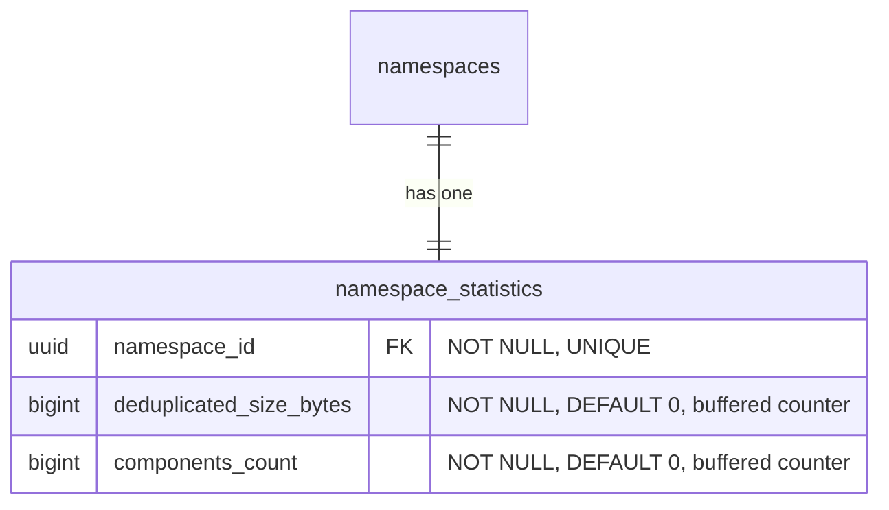

- **namespace_statistics**: 事前計算された名前空間レベルのカウンターを格納し、バッファードカウンター（非同期フラッシャー）を介して維持されます。これは、表示パスと課金システムが読み取るテーブルで、サブミリ秒のレスポンスを提供します（[ベンチマーク表](#namespace-level-storage-accounting-reconciliation) を参照）。[調整（reconciliation）の仕組み](#namespace-level-storage-accounting-reconciliation) は、ドリフトが疑われる場合にこれらのカウンターを検証・修正するために存在します。
  - `deduplicated_size_bytes`: 名前空間が使用する総ストレージで、blob の重複排除がすでに適用されています（[ADR-002](002_storage_deduplication_scope.md) を参照）。このカラムは（`size_bytes` ではなく）この名前で命名され、前方互換性を持たせ、将来の生の、または論理的なサイズメトリクスと区別します。
  - `components_count`: 名前空間のホスト型およびリモートのリポジトリに格納されたアーティファクトバージョンの総数。
    - Container: `container_manifests` + `container_remote_manifests`。
    - Maven: `maven_versions` + `maven_remote_versions`。
    - npm: `npm_versions` + `npm_remote_versions`。

    ソフト削除済みの行は、[ソフト削除ウィンドウ](010_data_retention.md#soft-delete) の経過後にガベージコレクションがハード削除するまでカウントされ続けます。これは `deduplicated_size_bytes` と一致します。後者は、ガベージコレクションが基となる blob を回収するまでソフト削除済みアーティファクトのバイトを保持します。仮想リポジトリは独自のバージョンテーブルを持たないため、別途カウントされません。仮想リポジトリは順序付けられた upstream のリストを通じてリクエストを解決し（[`container_virtual_repository_upstreams`](#virtual-container-repositories) とその Maven・npm 同等物を参照）、各 upstream はそれ自体がホスト型またはリモートのリポジトリで、そのバージョンは上記のテーブルを通じてすでに含まれています。仮想リポジトリをその上にカウントすると、その upstream を二重カウントしてしまいます。これは消費ベースの価格設定と計量のための名前空間レベルの次元であり、`deduplicated_size_bytes` を補完します。ストレージ使用量とともに名前空間の概要に表示されます。

#### Namespace-level storage accounting reconciliation

`namespace_statistics.deduplicated_size_bytes` カウンターとリポジトリレベルの `repositories.size_bytes` カウンターは、サブミリ秒の読み取りで表示パスを支えます。ただし、2 つの調整シナリオでは、キャッシュされたカウンターではなくソースデータから正確なストレージを計算する必要があります。

1. **オンデマンドの検証**: 顧客が「私の課金は正確か？」と尋ね、ソースデータから正確な名前空間ストレージを計算する必要があります。これは 64 個すべての `sha256` パーティションにわたる `SUM(size) FROM blob_storage_blobs WHERE namespace_id = ?` を意味します。
2. **ドリフトの修正**: GC 実行の失敗、部分的なフラッシュ、その他のイベントがキャッシュされたカウンターを非同期化し、それを修正するために正確な値を再計算する必要があります。

`blob_storage_blobs` は `HASH(sha256)` でパーティショニングされているため、`namespace_id` のみのクエリは 64 個すべてのパーティションにファンアウトします。CloudSQL PostgreSQL 18 インスタンスでの [ベンチマーク](https://gitlab.com/gitlab-com/content-sites/handbook/-/merge_requests/18456#note_3166018048)（[シード済み](https://gitlab.com/jdrpereira/artifact-registry-poc/-/tree/main/cmd/seed) データセット: 64 個の `sha256` パーティションにわたる約 160 万 blob、Zipf 分布の blob 所有権を持つ 50 万名前空間、blob が最も多い名前空間は 35.3 万 blob）は、最も重い名前空間でベースラインが 78 ms、約 3K 以上のバッファヒットを示します。2 つの加算的な保険ポリシーがこれを改善できます。

**Option A — `blob_storage_blobs` のカバリングインデックス**: 各パーティションの既存の `namespace_id` インデックスに `INCLUDE (size)` を追加します。これは 64 パーティションのファンアウトを、ヒープフェッチが最小またはゼロの 64 個のインデックスオンリースキャンに変えます。スペースのオーバーヘッドは無視できます（既存のインデックスのリーフページに `size` カラムが追加されるだけ）。

**Option B — 名前空間でパーティショニングされたシャドウテーブル**: `HASH(namespace_id)` で 64 個のパーティションにパーティショニングされた専用の `blob_storage_blobs_by_namespace` テーブルで、`blob_storage_blobs` の `AFTER INSERT`/`DELETE` トリガーを介して維持されます。これは調整クエリを単一パーティションのインデックスオンリースキャンに折りたたみます。スペースのオーバーヘッドは中程度です（blob データの最小限のサブセット — `namespace_id`、`sha256`、`size` — を 64 個の新しいパーティションとインデックスにわたって複製し、blob 数に比例して成長します）。トレードオフは、すべての blob `INSERT`/`DELETE` での書き込み増幅ですが、調整の負荷をメインの `blob_storage_blobs` テーブル（ホットパス）から遠ざけます。

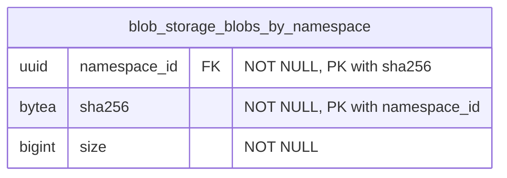

`blob_storage_blobs` のトリガーがこのテーブルを維持します。`AFTER INSERT` は `(namespace_id, sha256, size)` をシャドウテーブルにコピーし、`AFTER DELETE` は一致する行を削除します。`AFTER UPDATE` トリガーは不要です。`blob_storage_blobs` の行は不変だからです。コンテンツアドレス指定ストレージは、コンテンツへのいかなる変更も新しい `sha256`、したがって新しい行を生み出すことを意味します（[ADR-008](008_content_addressable_storage.md) を参照）。主キー `(namespace_id, sha256)` はパーティションキー（`namespace_id`）を含まなければならず、`blob_storage_blobs` のユニークキーを反映します。テーブルは他の `HASH(namespace_id)` テーブルと同じ 64 個のパーティション数を使用します。`(namespace_id) INCLUDE (size)` のカバリングインデックスがインデックスオンリースキャンを可能にします。

| アプローチ | 実行時間 | バッファ | スキャンされたパーティション | 書き込みオーバーヘッド |
|---|---|---|---|---|
| `namespace_statistics` カウンター（表示パス） | 0.013 ms | 1 | 0 | 非同期フラッシャー |
| シャドウテーブル + カバリングインデックス（Option B） | 29 ms | 1,361 | 1 | トリガー |
| blob のカバリングインデックス（Option A） | 43 ms | 1,599 | 64 | なし |
| ベースライン（変更なし） | 78 ms | 約 3K 以上 | 64 | なし |

両方のオプションは純粋に加算的で（`blob_storage_blobs` 自体への変更はなし）、独立して追加または削除できます。相互に排他的ではありません。両方とも初期スキーマに含まれます。最初により多くのカバレッジで始め、本番メトリクスがそれらが不要であることを確認したら後でインデックスや補助テーブルを削除する方が容易です。

#### Namespace-level component count reconciliation

`namespace_statistics.components_count` カウンターは、表示パスと計量パイプラインを支えます。ストレージカウンターと同様に、2 つのシナリオでソースデータから正確な値を再計算する必要があります。

1. **オンデマンドの検証**: 顧客（または課金）がコンポーネント数が正確かを尋ね、ソース行から導出する必要があります。
2. **ドリフトの修正**: フラッシュの失敗、部分的なバッファ喪失、バックグラウンドジョブのバグがカウンターを非同期化し、それを再計算する必要があります。

調整は、名前空間の行にスコープした 6 つの独立したカウントを合計します。ホスト型の 3 つ（`container_manifests`、`maven_versions`、`npm_versions`）とリモートの 3 つ（`container_remote_manifests`、`maven_remote_versions`、`npm_remote_versions`）です。再計算した値が `components_count` が追跡するものと一致するよう、ソフト削除済みの行が含まれます（挿入でインクリメント、ガベージコレクションのハード削除でデクリメント。ソフト削除と復元はノーオペレーションです）。

```sql
SELECT
  (SELECT COUNT(*) FROM container_manifests        WHERE namespace_id = $1)
+ (SELECT COUNT(*) FROM container_remote_manifests WHERE namespace_id = $1)
+ (SELECT COUNT(*) FROM maven_versions             WHERE namespace_id = $1)
+ (SELECT COUNT(*) FROM maven_remote_versions      WHERE namespace_id = $1)
+ (SELECT COUNT(*) FROM npm_versions               WHERE namespace_id = $1)
+ (SELECT COUNT(*) FROM npm_remote_versions        WHERE namespace_id = $1)
  AS components_count;
```

各サブクエリは単一のソーステーブルでの `namespace_id` によるカウントで、`soft_deleted_at` 述語を持ちません。そのため、テーブルにまだある行（ライブ、および [ソフト削除ウィンドウ](010_data_retention.md#soft-delete) 内のソフト削除済み）が `components_count` が追跡するものと一致します。4 つのパーティション化されたソーステーブル（`container_manifests`、`container_remote_manifests`、`maven_remote_versions`、`npm_remote_versions`）は単一の `HASH(namespace_id)` パーティションに枝刈りされます。2 つのパーティション化されていない中間層テーブル（`maven_versions`、`npm_versions`）は、名前空間の行のためにテーブル全体をスキャンします。既存の部分ユニークインデックス（`WHERE soft_deleted_at IS NULL`）はライブ行のみをカバーするため、カウントを直接満たすことはできません。名前空間ごとのカーディナリティはデータモデルによって有界で（ファイルや blob 参照ごとではなくバージョンごとに 1 行）、調整は頻繁ではない（オンデマンドまたはドリフト修正で、ホットパスではない）ため、有界のスキャンは許容範囲です。追加の保険ポリシー（カバリングインデックスやシャドウテーブル）は導入されません。本番メトリクスがこれが遅すぎることを示した場合、各ソーステーブルへの非部分の `(namespace_id)` インデックスが、シャドウテーブルを検討する前の最も安価な次のステップです。

### Indexes

- **`blob_storage_blobs`**: `(namespace_id, sha256)` に対するユニークインデックス — 重複排除を強制し、Organization 内で sha256 による blob の存在をチェックします。この制約はパーティションキー（`sha256`）を含むため、PostgreSQL はすべてのハッシュパーティションにわたって正しく強制します。`(namespace_id) INCLUDE (size)` に対するカバリングインデックス — ヒープフェッチなしで [名前空間レベルのストレージ集計の調整](#namespace-level-storage-accounting-reconciliation) のためのインデックスオンリースキャンを可能にします。
- **`blob_storage_attachments`**: `(namespace_id, sha256)` に対するインデックス — blob のコンテンツハッシュが与えられたときにアタッチメントの存在をチェックします（[クリーンアッププロセス](#cleanup-tasks) の orphan チェックで使用）。
- **`blob_storage_blobs_by_namespace`**: `(namespace_id, sha256)` に対する主キー — `blob_storage_blobs` 行との 1:1 対応を強制します。`(namespace_id) INCLUDE (size)` に対するカバリングインデックス — [名前空間レベルのストレージ集計の調整](#namespace-level-storage-accounting-reconciliation) のための単一パーティションのインデックスオンリースキャンを可能にします。
- **`namespace_statistics`**: `(namespace_id)` に対するユニークインデックス — 名前空間ごとに 1 つの統計レコード。

ハッシュパーティション化テーブルでは、インデックスはパーティションごとにローカルです。インデックス操作は単一のパーティションにスコープされ、テーブル全体をロックしません。

### Blob storage query examples

- アーティファクトのプル（読み取りパスのショートカット: `*_files` → `blob_storage_blobs`、アタッチメントをスキップ — 1 パーティション）

  ```sql
  SELECT bsb.object_storage_key, bsb.size
  FROM maven_files mf
  JOIN blob_storage_blobs bsb ON bsb.namespace_id = mf.namespace_id AND bsb.sha256 = mf.blob_sha256
  WHERE mf.namespace_id = '018f4d6f-0e10-7e3a-9bfd-23a4c5d6e7f8' AND mf.maven_version_id = 456 AND mf.file_name = 'myapp-1.0.0.jar'
    AND mf.soft_deleted_at IS NULL;
  ```

- blob アップロード時の重複排除 upsert（1 パーティション、レース耐性あり）

  ```sql
  INSERT INTO blob_storage_blobs (namespace_id, sha256, size, object_storage_key, metadata_sha1)
  VALUES ('018f4d6f-0e10-7e3a-9bfd-23a4c5d6e7f8', 'abcd1234efgh5678...'::bytea, 1048576, 'artifact_registry/.../objects/ab/cd/abcd1234efgh5678...', NULL)
  ON CONFLICT (namespace_id, sha256) DO NOTHING
  RETURNING id, sha256;
  ```

- Organization 内で sha256 による blob の存在をチェックする（1 パーティション）

  ```sql
  SELECT 1 AS one
  FROM blob_storage_blobs
  WHERE namespace_id = '018f4d6f-0e10-7e3a-9bfd-23a4c5d6e7f8' AND sha256 = 'abcd1234efgh5678...'::bytea
  LIMIT 1;
  ```

- orphan チェック: この blob はまだいずれかのアタッチメントから参照されているか？（1 パーティション）

  ```sql
  SELECT 1 AS one
  FROM blob_storage_attachments
  WHERE namespace_id = '018f4d6f-0e10-7e3a-9bfd-23a4c5d6e7f8' AND sha256 = 'abcd1234efgh5678...'::bytea
  LIMIT 1;
  ```

- blob のカバリングインデックスを介したストレージ集計の調整（Option A）: ソースデータから正確な名前空間ストレージを計算する（64 パーティション、インデックスオンリースキャン）

  ```sql
  SELECT SUM(size) AS total_size_bytes
  FROM blob_storage_blobs
  WHERE namespace_id = 123;
  ```

- シャドウテーブルを介したストレージ集計の調整（Option B）: 正確な名前空間ストレージを計算する（1 パーティション、インデックスオンリースキャン）

  ```sql
  SELECT SUM(size) AS total_size_bytes
  FROM blob_storage_blobs_by_namespace
  WHERE namespace_id = 123;
  ```

- 表示パス: 事前計算された名前空間カウンターを読み取る（単一行のルックアップ）

  ```sql
  SELECT deduplicated_size_bytes, components_count
  FROM namespace_statistics
  WHERE namespace_id = 123;
  ```

## Consequences

### Positive

1. **各アーティファクトフォーマットに合わせたデータ構成**: 各アーティファクトフォーマットに専用のテーブルを使用することで、テーブル構成に最大限の柔軟性が得られます。フォーマットのプロトコルが要求する任意の数の追加カラムを持てます。すでに専用テーブルを使用しているため、追加の補助テーブルは不要です。

2. **各フォーマットのデータテーブルが関連する使用パターンを持つ**: 各フォーマットの専用テーブルは、REST と GraphQL の API、および関連するアーティファクト管理クライアントから使用パターンを受け取ります。これにより、他のフォーマットの使用パターンからの分離が得られます。

3. **フォーマット関連のデータのパフォーマンス分離**: 特定のアーティファクトフォーマットのテーブルでのパフォーマンスのボトルネックは、他のフォーマットに即座の影響を及ぼしません。

4. **透過的なオブジェクトストレージのクリーンアップ**: [オブジェクトストレージのクリーンアップタスク](#cleanup-tasks) が [blob ストレージ](#blob-storage) ドメインに集中化されているため、親ドメイン（この場合は各フォーマット固有のドメイン）はこの部分を扱う必要がありません。さらに、このクリーンアップは削除操作がどのように行われたか（単一要素の破棄、一括破棄、選択された要素のセットに対する破棄を実行するバックグラウンドクリーンアップポリシー）に影響されません。

5. **blob ストレージの分離が再利用性を提供する**: blob ストレージテーブルは、ここで説明する Artifact Registry 機能に縛られません。そのため、この部分は他の領域でのファイルアップロードのニーズに再利用できます。

6. **効率的なストレージ集計**: Organization スコープの重複排除と Organization ごとの重複排除された blob レコードにより、ストレージ使用量のクエリが単純かつ効率的になります。注: `sha256` ベースのパーティショニングでは、Organization レベルの集計は 64 個すべてのパーティションをスキャンします。これは遅延インクリメントを介して更新される専用のロールアップテーブルによって緩和されます（[パーティショニング戦略](#blob-storage-partitioning-strategy) を参照）。

7. **統合されたフォーマット横断の一覧表示**: 親の `repositories` テーブルは、名前空間内のすべてのフォーマットと種別（ホスト型、仮想、リモート）にわたるすべてのリポジトリを一覧表示する単一のソースを提供し、複数のテーブルにわたる `UNION ALL` なしでランディングページのハイブリッドリストを支えます。

8. **スタンドアロンのリモートリポジトリが共有を可能にする**: 独自のライフサイクルを持つスタンドアロンのエンティティとしてのリモートリポジトリは、複数の仮想リポジトリ間で共有でき、設定とキャッシュエントリの重複を減らします。

### Negative

1. **フォーマット横断の詳細クエリは依然として結合を要する**: 親の `repositories` テーブルはランディングページの一覧表示のユースケースを解決しますが、フォーマット固有の詳細（たとえばコンテナイメージ、Maven パッケージ）にアクセスするには依然としてフォーマット固有のテーブルへの結合が必要です。

2. **blob ストレージの集中化されたテーブル**: これは 2 つの欠点をもたらします。第一に、これらのテーブルには非常に多くの行が存在することになります。この状況を扱うには慎重なテーブル設計が必要です。第二に、これらのテーブルの問題（テーブル全体のロックなど）は、すべてのアーティファクトタイプに潜在的に影響します。

3. **リポジトリごとのストレージ帰属は結合を要する**: リポジトリレベルでの正確なストレージ使用量の帰属は、フォーマット固有のテーブルから `blob_storage_attachments` を経由して `blob_storage_blobs` への結合を通じて導出されます。これは blob ストレージを汎用的かつ重複排除されたものに保ちますが、非正規化されたリポジトリごとのカウンターと比べていくらかの複雑さを加えます。

4. **2 ステップのリポジトリ作成**: リポジトリの作成には、親の `repositories` テーブルとフォーマット固有のテーブルの両方への挿入が必要です。これは単一テーブルの挿入と比べてトランザクションの複雑さを加えます。

## Alternatives

### Centralize common data

ここでの別のアプローチとして、アーティファクトフォーマット領域の共通データをすべて共通で集中化されたテーブルに格納することが考えられます。

これは、複数のソースを結合することなくそうしたクエリに答えられるため、混在したアーティファクトフォーマットのデータアクセスを大いに助けます。

このアプローチはすでに [Package Registry 機能](https://docs.gitlab.com/user/packages/package_registry/) で使われており、本稿執筆時点で、それらの共通テーブルは予想どおり多くの行を持つだけでなく、多数の特化したインデックスも持っています。これらのインデックスはそれぞれ、特定のアーティファクトフォーマットに固有のアクセスパターンをサポートします。インデックスの数がかなり多いため、今日では新しいインデックスを追加すること、たとえば Package Registry 機能に新しいフォーマットサポートが追加される場合、より厳しい精査や押し戻しさえも受けることになります。

さらに、各アーティファクトフォーマットには格納する必要のある固有のデータ（たとえば正規化されたパッケージ名）があります。この固有のデータは、一部の行でしか使われないカラムを作り出してしまうため、共通テーブルには格納できません。これはいくつかの補助テーブルの作成につながります。それらの補助テーブルは、特定のアーティファクトタイプのアクセスパターンに必要な結合の数を増やします。

`repositories` 親テーブルの導入は、このアプローチの限定版を採用しています。一覧表示とフィルタリングに必要なフォーマット横断のメタデータ（名前、可視性、フォーマット、種別、カウンター）のみが集中化されます。フォーマット固有のデータは専用テーブルに残り、上記のインデックスの増殖と補助テーブルの問題を回避します。

## References

- [ADR-001: Organizations as Anchor Point](001_organizations_as_anchor_point.md) - レジストリが Organization にアンカーする理由
- [ADR-002: Storage Deduplication Scope](002_storage_deduplication_scope.md) - 重複排除のスコープに関する詳細な決定
<!-- - [ADR-010: Data Retention](010_data_retention.md) - Retention policies including soft delete and blob cleanup timing -->
- [Package Registry common tables decomposition](https://gitlab.com/groups/gitlab-org/-/work_items/16000) - 共通のアーティファクト関連データを中央テーブルに格納する際に直面した問題の詳細。

