<!-- Design Documents often contain forward-looking statements -->
<!-- vale gitlab.FutureTense = NO -->

## 背景

Artifact Registry は次の点を考慮したデータベース構成を必要とします。

- **異なるアクセスパターン**: アーティファクト管理クライアントは、フォーマットごとに大きく異なる独自のプロトコルを使用します。
- **スケーラビリティ**: アーティファクトのストレージは、すぐに数百万行に達する可能性があります。
- **パフォーマンス**: 前述の2点を踏まえても、操作の大半を占める読み取りクエリで高速な実行時間を維持したいと考えています。
- **過去の落とし穴**: 現在のコンテナレジストリおよびパッケージレジストリのデータ構成には、いくつかのほころびが見られます（[例](https://gitlab.com/groups/gitlab-org/-/work_items/16000)、[例](https://gitlab.com/groups/gitlab-org/-/epics/9415)）。ここではそれを回避します。

決定事項に入る前に、以降のスキーマに関するいくつかの注意点を挙げます。これらは主に、提示するテーブル数の多さを踏まえて可読性を高めるためのものです。

- このドキュメントでは、機能のコアとなるテーブルを説明します。サブ機能に必要となる追加のテーブルはここでは説明しません。例として、blob ストレージのクリーンアップに必要な補助テーブルの背景については [クリーンアップタスク](#cleanup-tasks) を参照してください。
- テーブル名は可読性のために短縮しています。実際には、ここに示されていない共通の接頭辞を共有します（例: `artifacts_registry_container_repositories`）。
- Artifact Registry は名前空間にスコープされます。根拠については [ADR-001](001_organizations_as_anchor_point.md) を参照してください。
- 主キーやタイムスタンプなど、いくつかの共通カラムは明確さのために省略しています。
- すべてのテーブルには `namespace_id` カラムが含まれます。[Cells のシャーディングキー要件](https://docs.gitlab.com/ee/development/database/multiple_databases/#guidelines-on-choosing-a-sharding-key) はサテライトサービスのデータベースには適用されません。行は、名前空間のアンカータプル（`platform`、`entity_type`、`entity_id`）を通じて間接的に組織に紐づけられます。このカラムは、以下のすべてのテーブル定義で明示的に示しています。
- すべての `jsonb` カラムは、無制限なペイロードを防ぎ期待される構造を強制するために、永続化の前に厳格な JSON スキーマに対して検証しなければなりません。これはこのドキュメント内のすべての `jsonb` カラム（例: `rule_configuration` および `package_json`）に適用されます。
- テーブルが複数の暗号化された認証情報カラムを持つ場合（例: リモートリポジトリテーブルの `encrypted_username` と `encrypted_password`）、CHECK 制約により、すべての認証情報カラムが設定されるか、いずれも設定されないかのいずれかを強制しなければなりません。部分的な認証情報（例: パスワードなしのユーザー名）は受け付けません。
- リモートリポジトリテーブルの暗号化された認証情報カラム（`encrypted_username`、`encrypted_password`、`encrypted_auth_token`）は、暗号化の前に Go の検証レイヤーで平文の入力を2048文字に制限します。この上限は平文に対するものであり、平文はアプリケーションレイヤーにのみ存在します。データベースが見るのは `bytea` の暗号文だけなので、DB 側の CHECK（例: `octet_length(...) <= N`）は暗号化方式の固定オーバーヘッド（IV、認証タグ、key-id ヘッダー）を介して間接的に平文を制限できるにすぎず、上限の近似となり、必須の Go チェックと冗長になります。CHECK を省略することで、スキーマが暗号フレーミングから切り離された状態も保てます。暗号、key-id レイアウト、エンベロープ構造の変更があってもスキーママイグレーションは不要です。
- すべての `id` カラムは、Artifact Registry インスタンスのスコープ内で一意でなければなりません。`namespaces.id` は UUIDv7（[RFC 9562](https://datatracker.ietf.org/doc/rfc9562/)）を使用し、あらゆる Artifact Registry デプロイメントにまたがるグローバルな一意性を保証します。詳しい根拠（PostgreSQL の各バージョンで利用可能な生成パスを含む）については [名前空間 ID の型](#namespace-id-type) を参照してください。その他のすべての `id` カラムは `bigint DEFAULT nextval('<table>_id_seq')` であり、論理レプリケーションの互換性が保たれます（[出典](https://gitlab.com/gitlab-com/gl-infra/data-access/dbo/dbo-issue-tracker/-/work_items/691#note_3309931104)）。これらの一意性は単一の Artifact Registry データベース内でローカルに強制されますが、それらは常に名前空間より下にスコープされるため、それで十分です。

## 決定事項

データには6つの領域があります。

- [名前空間テーブル](#namespaces)。不変のスラッグと仮想アンカータプルを持つ内部の名前空間エンティティを導入することで、Artifact Registry を外部識別子から切り離します。完全な根拠については [ADR-022](022_namespace_decoupling.md) を参照してください。
- [リポジトリコレクションテーブル](#repository-collections)。名前空間内のリポジトリの論理的なグルーピングです。スキーマには初日から存在しますが、まだユーザーには公開されていません。すべての名前空間は「default」リポジトリコレクションを取得し、すべてのリポジトリが自動的にそこへ割り当てられます。
- 名前空間レベルのテーブル。これらは [ライフサイクルポリシーの設定とルール](#lifecycle-policies) と [名前空間レベルのストレージ統計](#storage-usage-calculation) を扱い、名前空間に直接スコープされます。
- [リポジトリ親テーブル](#repositories)。すべてのフォーマットにまたがるすべてのリポジトリ（ローカル、仮想、リモート）の統一されたレジストリで、ランディングページのハイブリッドリストとフォーマット横断クエリを支えます。
- アーティファクトフォーマットレベルのテーブル。ここには各フォーマット専用のテーブルがあります。ローカルリポジトリ（[Container](#container-repositories)、[Maven](#maven-repositories)、[NPM](#npm-repositories)）、リモートリポジトリ（[Container](#container-remote-repositories)、[Maven](#maven-remote-repositories)、[NPM](#npm-remote-repositories)）、仮想リポジトリ（[Container](#virtual-container-repositories)、[Maven](#maven-virtual-repositories)、[NPM](#npm-virtual-repositories)）。それぞれが `repository_id` を介して親の `repositories` テーブルを参照します。
- [blob ストレージレベルのテーブル](#blob-storage)。実際のストレージメタデータと [進行中のアップロードセッションの追跡](#upload-sessions) を扱います。

### Namespaces テーブル

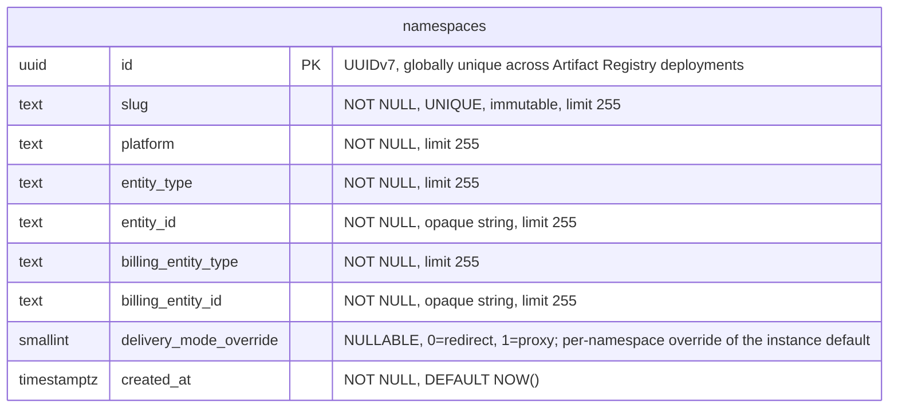

- **namespaces**: 他のすべてのテーブルが `namespace_id` を介して参照するルートエンティティです。各名前空間は、URL やクライアント設定で使用される、不変でグローバルに一意な `slug` を持ちます（スラッグの設計とグローバルな一意性の強制については [ADR-022](022_namespace_decoupling.md) を参照）。`(platform, entity_type, entity_id)` タプルは、そのセマンティクスを解釈することなく名前空間を外部エンティティ（デフォルトでは Organizations）にリンクします。`entity_id` は、基となる値が数値であっても `TEXT` として保存され、アンカータイプ間でスキーマを統一します。Organizations v1 では、すべての行が `('gitlab', 'organization', '<rails_org_id>')` を持ちます。`billing_entity_type` と `billing_entity_id` は、使用量イベントの請求アンカーを識別します。外部から提供されるカラム（`platform`、`entity_type`、`entity_id`、`billing_entity_type`、`billing_entity_id`）はいずれもスキーマレベルのデフォルトを持ちません。その根拠については [ADR-022](022_namespace_decoupling.md) を参照してください。`delivery_mode_override` カラムは、[ADR-005](005_artifact_delivery_mode.md) で定義された名前空間ごとのアーティファクト配信のオーバーライドを保持します。`NULL` はインスタンスのデフォルト（`StorageConfig.delivery_mode`）を継承し、`0`（`redirect`）はこの名前空間に対してリダイレクトを強制し、`1`（`proxy`）はプロキシを強制します。ダウンロードリクエストに対する実効的な配信パターンは `namespace.delivery_mode_override ?? instance.delivery_mode` です。このカラムは、リクエストハンドラーが認可とルーティングのために行う既存の名前空間ルックアップの一部として読み取られるため、別のクエリやインデックスは不要です。カラムの型は `SMALLINT` で、整数からラベルへのマッピングは Go アプリケーションで定義されます（`0 = redirect`、`1 = proxy`）。これは enum スタイルのカラムに関する [Artifact Registry のデータベース規約](https://gitlab.com/gitlab-org/ops/artifact-registry/-/blob/main/docs/dev/database.md#enums) に従っています（PostgreSQL の `ENUM` 型は安全に変更するのが難しいため避けています）。アーティファクト配信の選択を保存する将来のカラム（例: S17 がリポジトリごとのオーバーライドを導入する場合）は、同じ整数マッピングを再利用します。

#### スラッグの不変性

PostgreSQL にはネイティブな不変カラムのサポートはありません。スラッグの不変性（[ADR-022](022_namespace_decoupling.md)）は、値が変更されると例外を発生させる `BEFORE UPDATE OF slug` トリガーによってデータベースレベルで強制されます。これにより、アプリケーションレイヤーをバイパスするあらゆるコードパス（直接のデータベースアクセス、管理ツール、マイグレーション）を捕捉します。スラッグの変更を必要とする緊急操作のために、このトリガーは無効化できます（例: `ALTER TABLE namespaces DISABLE TRIGGER trg_namespaces_immutable_slug`）。

#### インデックス

- **`namespaces`**: `(slug)` に対する一意インデックス — スラッグで名前空間をルックアップします。`(platform, entity_type, entity_id)` に対する一意制約 — 重複するアンカーを防ぎます。`delivery_mode_override` にはインデックスを付けません。このカラムは `id` をキーとする既存の名前空間ルックアップの一部としてのみ読み取られます（ハンドラーは認可とルーティングのために既に名前空間の行を結合しています）。

### リポジトリコレクション

リポジトリコレクションは、名前空間内のリポジトリの論理的なグルーピングであり、チーム、セキュリティドメイン、または製品ラインごとにアーティファクトを整理します。リポジトリコレクションを UI と API に公開することは MVP の範囲外です。このエンティティは初日から純粋に前方互換性のために存在します。MVP の間、すべての名前空間は作成時に単一の「default」リポジトリコレクションを取得し、すべてのリポジトリがそこへ割り当てられます。リポジトリコレクションの概念が MVP 後に公開されると、ユーザーは追加のリポジトリコレクションを作成し、リポジトリをそれらへ再割り当てできるようになります。

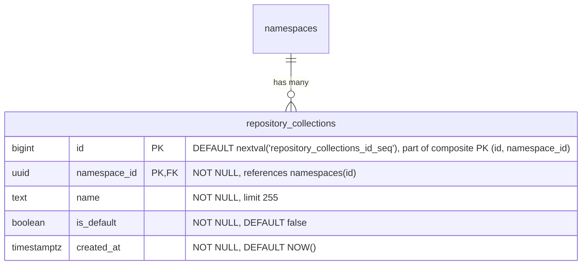

- **repository_collections**: 名前空間内のリポジトリの論理的なグルーピングです。`name` は名前空間内で一意な、人間が読めるラベルです。`is_default` は、すべての名前空間とともに自動的に作成され、MVP の間すべてのリポジトリが割り当てられるリポジトリコレクションを示します。`HASH(namespace_id)` で64パーティションにパーティショニングされます。

すべての名前空間作成時に、デフォルトのリポジトリコレクション行をアトミックに挿入しなければなりません。

```sql
INSERT INTO repository_collections (namespace_id, name, is_default)
VALUES (<new_namespace_id>, 'default', true)
ON CONFLICT (namespace_id, name) DO NOTHING;
```

#### インデックス

- **`repository_collections`**: `(id, namespace_id)` に対する主キー — `HASH(namespace_id)` パーティショニングに必要な複合 PK であり、`repositories` からの複合外部キーのターゲットとしても機能します。`(namespace_id, name)` に対する一意インデックス — 名前空間内で名前によりリポジトリコレクションをルックアップします。`(namespace_id) WHERE is_default IS TRUE` に対する部分一意インデックス — 名前空間ごとに最大1つのデフォルトリポジトリコレクションを強制します。

#### クエリ例

- 名前空間のデフォルトリポジトリコレクションを取得する。

  ```sql
  SELECT *
  FROM repository_collections
  WHERE namespace_id = '018f4d6f-0e10-7e3a-9bfd-23a4c5d6e7f8' AND is_default = true;
  ```

- 名前空間のすべてのリポジトリコレクションを一覧表示する。

  ```sql
  SELECT id, name, is_default, created_at
  FROM repository_collections
  WHERE namespace_id = '018f4d6f-0e10-7e3a-9bfd-23a4c5d6e7f8'
  ORDER BY created_at;
  ```

- 新しい（デフォルトではない）リポジトリコレクションを作成する。

  ```sql
  INSERT INTO repository_collections (namespace_id, name)
  VALUES ('018f4d6f-0e10-7e3a-9bfd-23a4c5d6e7f8', 'team-backend');
  ```

### Repositories テーブル

`repositories` テーブルは、フォーマットや種類を問わずシステム内のすべてのリポジトリを登録する、統一された親テーブルです。これはランディングページのハイブリッドリスト（すべてのフォーマットにまたがる Local、Virtual、Remote リポジトリを表示する、単一のソート・フィルタ・ページネーション可能なビュー）を支えます。各フォーマット固有のリポジトリテーブル（ローカル、仮想、リモート）は、`repository_id` を介してここの単一の行を参照します。

このモデル（Local、Remote、Virtual を対等なスタンドアロンの型とし、参照によって構成する）は、JFrog Artifactory、Sonatype Nexus、Google Cloud AR がいずれも使用しているものです。

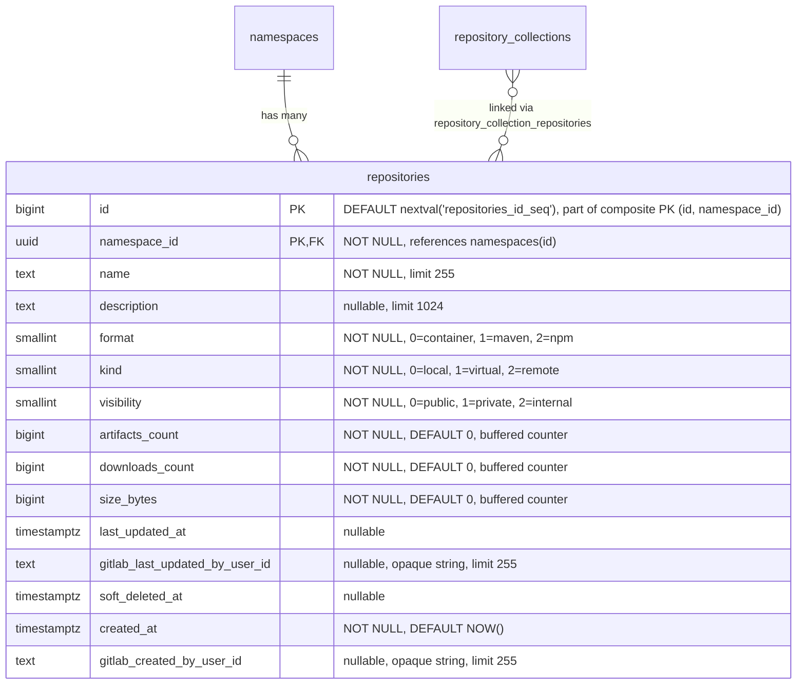

- **repositories**: すべてのリポジトリの親エンティティです。`format` はアーティファクトフォーマット（container、Maven、npm）を識別します。`kind` はリポジトリの種類（local、virtual、remote）を識別します。リポジトリは [`repository_collection_repositories`](#repository-collection-repositories) 結合テーブルを介してリポジトリコレクションにリンクされ、1つのリポジトリがその名前空間内の1つ以上のリポジトリコレクションに属することを可能にします。MVP の間、すべてのリポジトリは名前空間のデフォルトリポジトリコレクションにリンクされます。`name` は名前空間内で一意でなければならず、これはすべての競合製品と一致します。カウンターカラム（`artifacts_count`、`downloads_count`、`size_bytes`）は、ホット行の競合を避けるために [バッファ書き込み／非同期書き込み](#buffered-and-asynchronous-writes) を介して維持されます。`last_updated_at` はコンテンツの変更（アーティファクトの公開・変更・削除、キャッシュイベント）を追跡し、ダウンロードは追跡しません。`gitlab_created_by_user_id` と `gitlab_last_updated_by_user_id` は、どの GitLab ユーザーがリポジトリを作成し最後に変更したかを記録します。どちらも nullable な不透明参照で、外部キーもアプリケーション側の検証もありません。なぜなら、ユーザーレコードはモノリスに存在するからです。ユーザーハンドルとアバターのレンダリングはコンシューマーの責任であり、AR スキーマは ID だけを保存します。`namespaces.entity_id` と同じ理由で `TEXT` として保存されます。上流のユーザー ID 形式の将来的な変更（例: UUID への変更）があってもスキーママイグレーションは不要です。`description` が親にあるのは、UI が仮想リポジトリだけでなくすべてのリポジトリ種類で説明を表示するためです。`soft_deleted_at` タイムスタンプは、リポジトリがソフト削除された時刻を記録し、必要に応じて復元を可能にします。ソフト削除を親テーブルに置くことで、すべてのリポジトリ種類（local、virtual、remote）がフォーマット固有の処理なしで同じ削除セマンティクスを共有できます。`HASH(namespace_id)` で64パーティションにパーティショニングされます。

#### インデックス

- **`repositories`**: `(namespace_id, name)` に対する一意インデックス — アクティブとソフト削除済みの両方のリポジトリにまたがって名前の一意性を強制し、名前の競合によって復元が失敗しないようにします。名前の再利用には、まずハード削除が必要です。`(namespace_id, name) WHERE soft_deleted_at IS NULL` に対するインデックス — アクティブなリポジトリのルックアップと名前順のリスト表示のための最適化されたスキャンパスです。`(namespace_id, format) WHERE soft_deleted_at IS NULL` に対するインデックス — アクティブなリポジトリをフォーマットでフィルタします。`(namespace_id, kind) WHERE soft_deleted_at IS NULL` に対するインデックス — アクティブなリポジトリを種類でフィルタします。リポジトリを可視性レベルでフィルタするための `(namespace_id, visibility) WHERE soft_deleted_at IS NULL` に対するインデックス（可視性監査クエリ「この名前空間で現在 public なリポジトリはどれか」を支えます）。ランディングページのソート可能なカラムごとに1つのインデックスがあり、すべて `WHERE soft_deleted_at IS NULL` を伴います: `(namespace_id, artifacts_count DESC)`、`(namespace_id, downloads_count DESC)`、`(namespace_id, size_bytes DESC)`、`(namespace_id, last_updated_at DESC NULLS LAST)`。

MVP の間、すべてのリポジトリは単一のデフォルトリポジトリコレクションにリンクされるため、`(namespace_id, ...)` ソートインデックスは名前空間全体のクエリとコレクションフィルタクエリの両方を支えます。MVP 後、名前空間が複数のリポジトリコレクションを持つようになると、コレクションフィルタクエリは `repository_collection_repositories` を介して結合します。追加のサポートインデックスは、リポジトリコレクションが公開される時点で評価します。

#### クエリ例

- 名前空間のすべてのリポジトリ（すべてのリポジトリコレクション）を、最終更新順に一覧表示する。

  ```sql
  SELECT id, name, description, format, kind, artifacts_count,
         downloads_count, size_bytes, last_updated_at
  FROM repositories
  WHERE namespace_id = '018f4d6f-0e10-7e3a-9bfd-23a4c5d6e7f8' AND soft_deleted_at IS NULL
  ORDER BY last_updated_at DESC NULLS LAST
  LIMIT 20;
  ```

- 名前空間のリポジトリをリポジトリコレクションでフィルタし、最終更新順に一覧表示する。

  ```sql
  SELECT r.id, r.name, r.description, r.format, r.kind, r.artifacts_count,
         r.downloads_count, r.size_bytes, r.last_updated_at
  FROM repositories r
  JOIN repository_collection_repositories rcr
    ON rcr.namespace_id = r.namespace_id AND rcr.repository_id = r.id
  WHERE r.namespace_id = '018f4d6f-0e10-7e3a-9bfd-23a4c5d6e7f8' AND rcr.repository_collection_id = 456 AND r.soft_deleted_at IS NULL
  ORDER BY r.last_updated_at DESC NULLS LAST
  LIMIT 20;
  ```

- リポジトリをリポジトリコレクションとフォーマットでフィルタして一覧表示する。

  ```sql
  SELECT r.id, r.name, r.description, r.format, r.kind, r.artifacts_count,
         r.downloads_count, r.size_bytes, r.last_updated_at
  FROM repositories r
  JOIN repository_collection_repositories rcr
    ON rcr.namespace_id = r.namespace_id AND rcr.repository_id = r.id
  WHERE r.namespace_id = '018f4d6f-0e10-7e3a-9bfd-23a4c5d6e7f8' AND rcr.repository_collection_id = 456 AND r.format = 0
    AND r.soft_deleted_at IS NULL
  ORDER BY r.name
  LIMIT 20;
  ```

- 名前で単一のリポジトリをルックアップする。

  ```sql
  SELECT *
  FROM repositories
  WHERE namespace_id = '018f4d6f-0e10-7e3a-9bfd-23a4c5d6e7f8' AND name = 'my-repo' AND soft_deleted_at IS NULL;
  ```

- 可視性監査: 名前空間内のすべての public リポジトリを一覧表示する（`(namespace_id, visibility) WHERE soft_deleted_at IS NULL` の部分インデックスを使用）。

  ```sql
  SELECT id, name, format, kind
  FROM repositories
  WHERE namespace_id = '018f4d6f-0e10-7e3a-9bfd-23a4c5d6e7f8' AND visibility = 0 AND soft_deleted_at IS NULL
  ORDER BY name;
  ```

### リポジトリコレクションとリポジトリの結合テーブル

`repository_collection_repositories` 結合テーブルは、リポジトリが属するリポジトリコレクションへリポジトリをマッピングします。1つのリポジトリは、その名前空間内の1つ以上のリポジトリコレクションのメンバーになることができ、複数のチームのリポジトリコレクションを通じて公開される共通のユーティリティリポジトリのような共有アクセスのシナリオを可能にします。

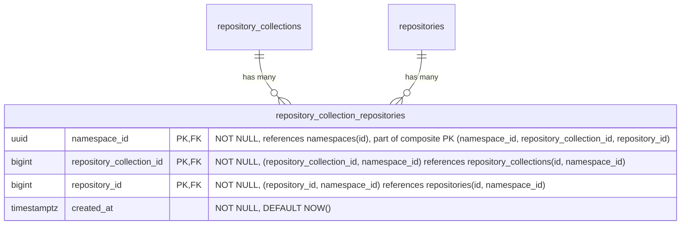

- **repository_collection_repositories**: リポジトリをリポジトリコレクションにリンクします。MVP の間、すべてのリポジトリは正確に1つのリポジトリコレクション（名前空間のデフォルト）にリンクされますが、スキーマは複数のリンクを許可しており、MVP 後にリポジトリをリポジトリコレクション間で共有できます。アプリケーションは、すべてのリポジトリが少なくとも1つのリポジトリコレクションリンクを持つという不変条件を強制します。Postgres はこれを宣言的に表現できません。複合 FK は、リポジトリコレクションとリポジトリが同じ名前空間内でのみリンクできることを保証します。`HASH(namespace_id)` で64パーティションにパーティショニングされます。

#### インデックス

- **`repository_collection_repositories`**: `(namespace_id, repository_collection_id, repository_id)` に対する主キー — リンクの一意性を強制し、リポジトリコレクションによるルックアップを支えます。`(namespace_id, repository_id)` に対するインデックス — 指定したリポジトリが属するすべてのリポジトリコレクションをルックアップします。

#### クエリ例

- リポジトリが属するすべてのリポジトリコレクションを一覧表示する。

  ```sql
  SELECT repository_collection_id
  FROM repository_collection_repositories
  WHERE namespace_id = '018f4d6f-0e10-7e3a-9bfd-23a4c5d6e7f8' AND repository_id = 789;
  ```

- リポジトリをリポジトリコレクションにリンクする。

  ```sql
  INSERT INTO repository_collection_repositories (namespace_id, repository_collection_id, repository_id)
  VALUES ('018f4d6f-0e10-7e3a-9bfd-23a4c5d6e7f8', 456, 789)
  ON CONFLICT (namespace_id, repository_collection_id, repository_id) DO NOTHING;
  ```

### ライフサイクルポリシー

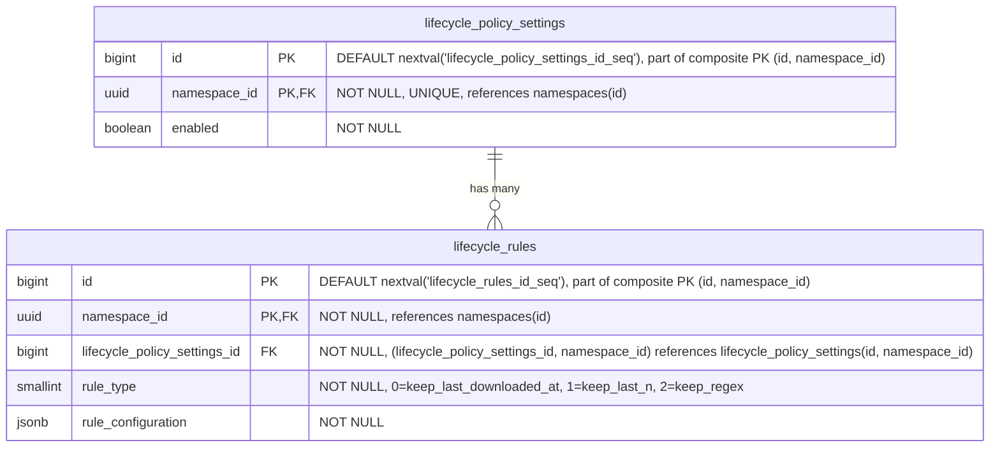

- **lifecycle_policy_settings**: 名前空間レベルでライフサイクル管理の構成を定義し、すべてのリポジトリのデフォルトポリシーとして機能します。有効な場合、関連するライフサイクルルールが名前空間全体に適用されます。これらのポリシーは、リポジトリレベルのポリシーによって [オーバーライド](#repository-level-overrides) できます。`HASH(namespace_id)` で64パーティションにパーティショニングされます。
- **lifecycle_rules**: 名前空間レベルで特定のアーティファクトのライフサイクル動作を制御する、個々の保持・クリーンアップルールを指定します。これらのルールは、リポジトリレベルで [オーバーライド](#repository-level-overrides) されない限り、すべてのリポジトリに適用されます。ポリシーレコードあたりのライフサイクルルール数は、ルール評価時のパフォーマンス低下を防ぐために制限されます。これは、例えば特定のアーティファクトをどのくらいの期間保持するか（例: Maven のスナップショットファイルは1か月だけ保持する）をユーザーが指定するために使用されます。`HASH(namespace_id)` で64パーティションにパーティショニングされます。

#### インデックス

- **`lifecycle_policy_settings`**: `(namespace_id)` に対する一意インデックス — 名前空間ごとに1つのポリシー設定レコードです。
- **`lifecycle_rules`**: `(namespace_id, lifecycle_policy_settings_id)` に対するインデックス — 指定したポリシーのすべてのルールを取得します。

リポジトリレベルのオーバーライドテーブルは同じパターンに従います。設定テーブルには `(namespace_id, repository_id)` に対する一意インデックス、ルールテーブルには `(namespace_id, <format>_repository_lifecycle_policy_settings_id)` に対するインデックスです。

#### クエリ例

- 指定した名前空間のポリシーを取得する

  ```sql
  SELECT lp.*
  FROM lifecycle_policy_settings lp
  WHERE lp.namespace_id = '018f4d6f-0e10-7e3a-9bfd-23a4c5d6e7f8';
  ```

- 指定したアーティファクトリポジトリのポリシーを取得する

  ```sql
  SELECT *
  FROM container_repository_lifecycle_policy_settings
  WHERE container_repository_lifecycle_policy_settings.namespace_id = '018f4d6f-0e10-7e3a-9bfd-23a4c5d6e7f8'
    AND container_repository_lifecycle_policy_settings.repository_id = 123;
  ```

- 新しいライフサイクルルールを作成する

  ```sql
  INSERT INTO lifecycle_rules (namespace_id, lifecycle_policy_settings_id, rule_type, rule_configuration)
  VALUES ('018f4d6f-0e10-7e3a-9bfd-23a4c5d6e7f8', 123, 1, '{"count": 10}'::jsonb);
  ```

- ライフサイクルルールを更新する

  ```sql
  UPDATE lifecycle_rules
  SET rule_configuration = '{"count": 20}'::jsonb
  WHERE namespace_id = '018f4d6f-0e10-7e3a-9bfd-23a4c5d6e7f8'
    AND id = 123;
  ```

- ライフサイクルルールを破棄する

  ```sql
  DELETE FROM lifecycle_rules
  WHERE namespace_id = '018f4d6f-0e10-7e3a-9bfd-23a4c5d6e7f8'
    AND id = 123;
  ```

#### リポジトリレベルのオーバーライド

各リポジトリタイプ（[container](#container-repositories)、[maven](#maven-repositories)、[npm](#npm-repositories)）は、名前空間レベルの値に対するオーバーライドを提供する、同様の名前のテーブルを持ちます。これにより、名前空間（最低）-> リポジトリ（最高）という優先順位システムが作られます。オーバーライドは `repository_id` を介して親の `repositories` テーブルを参照します。


（各アーティファクトフォーマットにオーバーライドテーブルがあるため、`artifact_type` は `container`、`maven`、`npm` に置き換える必要があります。これらのオーバーライドは、ローカル、仮想、リモートのリポジトリに等しく適用されます。`repository_id` FK は親の `repositories` テーブルを参照し、フォーマット固有のテーブルはリポジトリの `format` カラムによって決まります。）

これらのテーブルは、ある意味で [カスケード設定](https://docs.gitlab.com/development/cascading_settings/) のように動作します。それらの説明は、パーティショニングを含めて [名前空間レベル](#lifecycle-policies) の同様の名前のテーブルとまったく同じです。すべてのオーバーライドテーブルは `HASH(namespace_id)` で64パーティションにパーティショニングされます。現在の2層の優先順位システム（名前空間 → リポジトリ）は、MVP 後にリポジトリコレクションが公開される際に3層（名前空間 → リポジトリコレクション → リポジトリ）に拡張できます。これには、同じパターンに従ったリポジトリコレクションレベルのオーバーライドテーブルの追加が必要で、既存の名前空間レベルやリポジトリレベルのテーブルへの変更は不要です。

### Container リポジトリ

この部分での課題は、[OCI Distribution Spec v1.1](https://github.com/opencontainers/distribution-spec/blob/main/spec.md) に準拠することです。

<!--TODO This link will not live for long since it's an artifact output-->
このアプローチは、[GitLab Container Registry のスキーマ](https://gitlab.com/gitlab-org/container-registry/-/jobs/12449560500/artifacts/file/db-DAG.png) から大きな影響を受けています。


- **container_repositories**: 複数のイメージのコンテナです。各リポジトリは、独立したバージョニングを持つ複数のイメージをホストできます。名前、可視性、フォーマット横断クエリのために、`repository_id` を介して親の `repositories` テーブルを参照します。`HASH(namespace_id)` で64パーティションにパーティショニングされます。
- **container_images**: リポジトリ内の名前付きコンテナイメージ（例: `myapp`、`backend`）を表します。`last_downloaded_at` はイメージが最後にプルされた時刻を記録し、[バッファ書き込み／非同期書き込み](#buffered-and-asynchronous-writes) を介して維持されます。ダウンロードベースの保持を評価する `keep_last_downloaded_at` ライフサイクルルールで使用されます（[ADR-010](010_data_retention.md)）。`soft_deleted_at` タイムスタンプは、イメージがソフト削除された時刻を記録し、必要に応じて復元を可能にします。`HASH(namespace_id)` で64パーティションにパーティショニングされます。
- **container_blobs**: コンテナイメージを構成する、個々のコンテンツアドレス可能なレイヤーと設定オブジェクトを保存します。マニフェストとその構成レイヤー（blob）の関係は暗黙的であり（実行時にマニフェストの内容を解析して決定されます）、データベースの外部キーとしてモデル化されていません。`soft_deleted_at` タイムスタンプは、blob がソフト削除された時刻を記録し、必要に応じて復元を可能にします。`HASH(namespace_id)` で64パーティションにパーティショニングされます。
- **container_manifests**: 特定のイメージバージョンの設定とレイヤーを記述するイメージマニフェストを表します。`size` カラムは、ここをルートとするマニフェストツリーの合計バイトサイズを保持します。すなわち、このマニフェスト自身のペイロードに加え、マニフェストリストや OCI インデックスの子マニフェストを通じて推移的に到達可能なすべての blob です。`gitlab_user_id` は、どの GitLab ユーザーがこのマニフェストをプッシュしたかを記録します。外部キーのない nullable な不透明テキスト参照で、[repositories](#repositories) の同等のカラムと同じ根拠です。ユーザーレコードはモノリスに存在し、ユーザーハンドルとアバターのレンダリングはコンシューマーの責任で、AR スキーマは ID だけを保存し、`TEXT` によってスキーマは上流のユーザー ID 形式の将来的な変更から保護されます。`gitlab_project_id` と `gitlab_git_commit_sha` は、その帰属情報を残りの公開コンテキストで拡張します。`gitlab_project_id` はプッシュ元の GitLab プロジェクト（例: `CI_PROJECT_ID`）で、`gitlab_user_id` と同じモノリス参照の理由から nullable な不透明テキストとして保存されます。`gitlab_git_commit_sha` は公開時の Git コミット（例: `CI_COMMIT_SHA`）で、ハッシュカラムに関するスキーマ規約に従って nullable な `bytea` として保存されます。可変長で、SHA-1（20バイト）と SHA-256（32バイト）の両方に対応します。これはモノリス参照ではなく公開時の事実なので、外部キーは不要です。CI コンテキストなしでプッシュが到着した場合（例: 開発者のワークステーションからの手動プッシュ）、両方とも NULL になります。`soft_deleted_at` タイムスタンプは、マニフェストがソフト削除された時刻を記録し、必要に応じて復元を可能にします。`HASH(namespace_id)` で64パーティションにパーティショニングされます。
- **container_manifest_relationships**: 親マニフェストが他の複数のマニフェストを参照できる Docker マニフェストリストと OCI インデックス（マルチアーキテクチャイメージなど）を扱います。`HASH(namespace_id)` で64パーティションにパーティショニングされます。
- **container_tags**: 特定のマニフェストを指す、人間が読める名前（例: `latest`、`v1.2.3`）を提供します。`HASH(namespace_id)` で64パーティションにパーティショニングされます。
- **blob_storage_attachments**: 詳細は [blob ストレージ](#blob-storage) セクションを参照してください。

`container_blobs` テーブルは、他のコンテナレジストリアーキテクチャが行うように、コンテナレジストリの物理 blob を直接保存することはありません。ここでの違いは、blob ストレージが [blob ストレージ](#blob-storage) テーブルで（重複排除とガベージコレクションとともに）処理されることです。したがって、`container_*` レベルでは、`blob_storage_attachments` レコードへの参照を保存するだけで済みます。

#### インデックス

- **`container_repositories`**: `(namespace_id, repository_id)` に対する一意インデックス — 親リポジトリ参照によってコンテナリポジトリをルックアップします。
- **`container_images`**: `(namespace_id, container_repository_id, name) WHERE soft_deleted_at IS NULL` に対する一意インデックス — イメージ名はリポジトリ内で一意なイメージを識別します。重複すると OCI の名前ベースのルックアップが壊れます。部分条件により、ソフト削除後に同じ名前のイメージを再作成できます。`(namespace_id, container_repository_id, last_downloaded_at NULLS FIRST) WHERE soft_deleted_at IS NULL` に対するインデックス — `keep_last_downloaded_at` ライフサイクルルールの評価をサポートします。リポジトリ内のすべてのイメージをスキャンして行ごとにフィルタするのではなく、範囲スキャンで期限切れのイメージのみを返します。`NULLS FIRST` は、一度もダウンロードされていないイメージを最も古い行とグループ化するため、両方が同じ範囲スキャンで返されます。
- **`container_blobs`**: `(namespace_id, container_image_id, digest) WHERE soft_deleted_at IS NULL` に対する一意インデックス — blob のダイジェストはコンテンツアドレス可能です。同じイメージ内の同じダイジェストは、定義上同じ blob です。部分条件により、ソフト削除後に同じダイジェストを再プッシュできます。`(namespace_id, blob_storage_attachment_id)` に対するインデックス — ストレージアタッチメントによって blob をルックアップします。
- **`container_manifests`**: `(namespace_id, container_image_id, digest) WHERE soft_deleted_at IS NULL` に対する一意インデックス — マニフェストのダイジェストはコンテンツアドレス可能です。同じイメージ内の同じダイジェストは、定義上同じマニフェストです。部分条件により、ソフト削除後に同じダイジェストを再プッシュできます。`(namespace_id, blob_storage_attachment_id)` に対するインデックス — ストレージアタッチメントによってマニフェストをルックアップします。
- **`container_manifest_relationships`**: `(namespace_id, parent_container_manifest_id, child_container_manifest_id)` に対する一意インデックス — 重複する親子関係を防ぎ、指定した親マニフェストのすべての子を見つけます。`(namespace_id, child_container_manifest_id)` に対するインデックス — 指定した子マニフェストのすべての親を見つけます。`(namespace_id, container_image_id)` に対するインデックス — 指定したイメージのすべてのマニフェスト関係を見つけます。
- **`container_tags`**: `(namespace_id, container_image_id, name)` に対する一意インデックス — イメージ内で名前によってタグをルックアップします。`(namespace_id, container_manifest_id)` に対するインデックス — 指定したマニフェストを指すすべてのタグを見つけます。

#### クエリ例

- 名前でイメージを取得する

  ```sql
  SELECT *
  FROM container_images
  WHERE namespace_id = '018f4d6f-0e10-7e3a-9bfd-23a4c5d6e7f8' AND container_repository_id = 123 AND name = 'myapp/backend'
    AND soft_deleted_at IS NULL;
  ```

- リポジトリ ID に対してダイジェストで blob を取得する

  ```sql
  SELECT cb.*
  FROM container_blobs cb
  JOIN container_images ci
    ON cb.container_image_id = ci.id AND cb.namespace_id = ci.namespace_id
  WHERE ci.namespace_id = '018f4d6f-0e10-7e3a-9bfd-23a4c5d6e7f8' AND ci.container_repository_id = 123
    AND cb.digest = 'sha256:abcd1234...'::bytea
    AND ci.soft_deleted_at IS NULL AND cb.soft_deleted_at IS NULL;
  ```

- リポジトリ ID に対してダイジェストでマニフェストを取得する

  ```sql
  SELECT cm.*
  FROM container_manifests cm
  JOIN container_images ci
    ON cm.container_image_id = ci.id AND cm.namespace_id = ci.namespace_id
  WHERE ci.namespace_id = '018f4d6f-0e10-7e3a-9bfd-23a4c5d6e7f8' AND ci.container_repository_id = 123
    AND cm.digest = 'sha256:efgh5678...'::bytea
    AND ci.soft_deleted_at IS NULL AND cm.soft_deleted_at IS NULL;
  ```

### Container リモートリポジトリ

リモートリポジトリは、プロキシしてキャッシュできる外部のコンテナレジストリを表します。これらは独自のライフサイクルを持つスタンドアロンのエンティティであり、複数の仮想リポジトリ間で共有可能です。仮想リポジトリの upstream から、親の `repositories` テーブルを介して参照されます。


- **container_remote_repositories**: 外部のコンテナレジストリを表します。URL、オプションの認証 URL（`auth_url`）、認証情報、キャッシュ TTL（`cache_validity_hours`）を含みます。モニタリングのためにヘルスチェックのステータスが追跡されます。`repository_id` を介して親の `repositories` テーブルを参照します。リモートリポジトリはスタンドアロンであるため、同じリモートを使用する2つの仮想リポジトリは1つのキャッシュを共有します。`HASH(namespace_id)` で64パーティションにパーティショニングされます。
- **container_remote_images**: リモートリポジトリ内のキャッシュされたコンテナイメージです。`container_images` をミラーします。`last_downloaded_at` はキャッシュされたイメージが最後にプルされた時刻を記録し、ホット行の競合を避けるためにバッファ書き込み／非同期書き込み（`repositories.downloads_count` と同じパターン）を介して維持されます。`keep_last_downloaded_at` ライフサイクルルールとキャッシュ保持の評価で使用されます（[ADR-010](010_data_retention.md)）。`HASH(namespace_id)` で64パーティションにパーティショニングされます。
- **container_remote_blobs**: キャッシュされたレイヤーまたは config blob です。`HASH(namespace_id)` で64パーティションにパーティショニングされます。
- **container_remote_manifests**: キャッシュされたイメージマニフェストです。`size` カラムは、このキャッシュが認識しているサブツリーのバイトフットプリントを保持します。すなわち、キャッシュ時のマニフェスト自身のペイロードに加え、子が到着するごとの各子の `size` です。イメージマニフェストの場合、この値はキャッシュ時に完全です。マニフェストリストと OCI インデックスの場合、子がフェッチされるにつれて段階的にツリー全体のフットプリントに収束し、一部の子が一度もプルされなければ部分的なままになることがあります。この段階的なセマンティクスは遅延リモートキャッシュを反映しています。`size` を完全に保つためだけに子を積極的にフェッチすると、遅延設計を損なうことになります。`HASH(namespace_id)` で64パーティションにパーティショニングされます。
- **container_remote_manifest_relationships**: キャッシュされたマルチアーキテクチャマニフェストリストの関係です。ローカルと同じ構造です。`HASH(namespace_id)` で64パーティションにパーティショニングされます。
- **container_remote_tags**: キャッシュされたタグからマニフェストへのマッピングです。タグは可変ポインターであり、キャッシュの再検証時に、タグが新しいマニフェストへ指し直されることがあります。`upstream_checked_at` は、タグが upstream レジストリに対して最後に検証された時刻を記録し、再検証が必要かどうかを判断するために `cache_validity_hours` と比較されます。`upstream_etag` は upstream が返した ETag を保存し、タグが依然として同じマニフェストを指している場合に完全なマニフェスト解決を回避するための条件付きリクエスト（`If-None-Match`）を可能にします。マニフェストと blob は、暗号学的ハッシュによってコンテンツアドレス可能であるため、鮮度の追跡は不要です。保存されたバイトがダイジェストと一致すれば、コンテンツが正しいことが保証されます。`HASH(namespace_id)` で64パーティションにパーティショニングされます。
- **blob_storage_attachments**: 詳細は [blob ストレージ](#blob-storage) セクションを参照してください。

#### インデックス

- **`container_remote_repositories`**: `(namespace_id, repository_id)` に対する一意インデックス — 親参照によってリモートリポジトリをルックアップします。
- **`container_remote_images`**: `(namespace_id, container_remote_repository_id, name) WHERE soft_deleted_at IS NULL` に対する一意インデックス — 名前でキャッシュされたイメージをルックアップします。部分条件により、ソフト削除後に同じ名前のイメージを再作成できます。
- **`container_remote_blobs`**: `(namespace_id, container_remote_image_id, digest) WHERE soft_deleted_at IS NULL` に対する一意インデックス — イメージ内でダイジェストによってキャッシュされた blob をルックアップします。部分条件により、ソフト削除後に同じダイジェストを再キャッシュできます。`(namespace_id, blob_storage_attachment_id)` に対するインデックス — ストレージアタッチメントによって blob をルックアップします。
- **`container_remote_manifests`**: `(namespace_id, container_remote_image_id, digest) WHERE soft_deleted_at IS NULL` に対する一意インデックス — イメージ内でダイジェストによってキャッシュされたマニフェストをルックアップします。部分条件により、ソフト削除後に同じダイジェストを再キャッシュできます。`(namespace_id, blob_storage_attachment_id)` に対するインデックス — ストレージアタッチメントによってマニフェストをルックアップします。
- **`container_remote_manifest_relationships`**: `(namespace_id, parent_container_remote_manifest_id, child_container_remote_manifest_id)` に対する一意インデックス — 重複する親子関係を防ぎます。`(namespace_id, child_container_remote_manifest_id)` に対するインデックス — 指定した子マニフェストのすべての親を見つけます。`(namespace_id, container_remote_image_id)` に対するインデックス — 指定したイメージのすべてのマニフェスト関係を見つけます。
- **`container_remote_tags`**: `(namespace_id, container_remote_image_id, name)` に対する一意インデックス — イメージ内で名前によってタグをルックアップします。`(namespace_id, container_remote_manifest_id)` に対するインデックス — 指定したマニフェストを指すすべてのタグを見つけます。

#### クエリ例

- リモートリポジトリを作成する

  ```sql
  -- Resolve the default repository collection for the namespace
  SELECT id FROM repository_collections WHERE namespace_id = '018f4d6f-0e10-7e3a-9bfd-23a4c5d6e7f8' AND is_default = true;
  -- Create the parent repository
  INSERT INTO repositories (namespace_id, name, format, kind, visibility)
  VALUES ('018f4d6f-0e10-7e3a-9bfd-23a4c5d6e7f8', 'docker-hub', 0, 2, 1)
  RETURNING id;
  -- Link the repository to the repository collection
  INSERT INTO repository_collection_repositories (namespace_id, repository_collection_id, repository_id)
  VALUES ('018f4d6f-0e10-7e3a-9bfd-23a4c5d6e7f8', <repository_collection_id>, <returned_id>);
  -- Then create the format-specific record
  INSERT INTO container_remote_repositories (namespace_id, repository_id, url, encrypted_username, encrypted_password)
  VALUES ('018f4d6f-0e10-7e3a-9bfd-23a4c5d6e7f8', <returned_id>, 'https://registry.hub.docker.com', $1, $2);
  ```

- キャッシュされたマニフェストが新鮮かどうかをチェックする

  ```sql
  SELECT crm.digest
  FROM container_remote_manifests crm
  JOIN container_remote_tags crt
    ON crt.container_remote_manifest_id = crm.id AND crt.namespace_id = crm.namespace_id
  JOIN container_remote_images cri
    ON crt.container_remote_image_id = cri.id AND crt.namespace_id = cri.namespace_id
  WHERE cri.namespace_id = '018f4d6f-0e10-7e3a-9bfd-23a4c5d6e7f8'
    AND cri.container_remote_repository_id = 789
    AND cri.name = 'library/nginx'
    AND crt.name = 'latest'
    AND cri.soft_deleted_at IS NULL AND crm.soft_deleted_at IS NULL;
  ```

- ダイジェストでキャッシュされた blob をプルする（blob ストレージへの読み取りパスのショートカット）

  ```sql
  SELECT bsb.object_storage_key, bsb.size
  FROM container_remote_blobs crb
  JOIN blob_storage_blobs bsb
    ON bsb.namespace_id = crb.namespace_id AND bsb.sha256 = crb.blob_sha256
  WHERE crb.namespace_id = '018f4d6f-0e10-7e3a-9bfd-23a4c5d6e7f8'
    AND crb.container_remote_image_id = 456
    AND crb.digest = 'sha256:abcd1234...'::bytea
    AND crb.soft_deleted_at IS NULL;
  ```

### Container 仮想リポジトリ

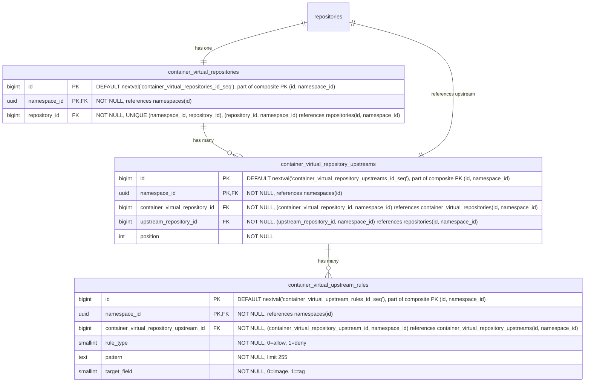

- **container_virtual_repositories**: コンテナイメージ用の仮想リポジトリです。名前、可視性、フォーマット横断クエリのために、`repository_id` を介して親の `repositories` テーブルを参照します。`HASH(namespace_id)` で64パーティションにパーティショニングされます。
- **container_virtual_repository_upstreams**: 仮想リポジトリとその upstream を結合するテーブルです。各仮想リポジトリは、順序付けられた upstream のリストを持ちます。各エントリは `upstream_repository_id` を介して upstream リポジトリを参照し、これは `repositories(namespace_id, id)` を指します。複合 FK `(namespace_id, upstream_repository_id)` は、upstream が同じ名前空間内にあることを強制します。これは、レジストリが名前空間にスコープされること（[ADR-001](001_organizations_as_anchor_point.md)）と一貫しています。`HASH(namespace_id)` で64パーティションにパーティショニングされます。
- **container_virtual_upstream_rules**: upstream に対する許可／拒否のフィルタルールを定義します。各ルールは、この upstream を通じて解決する際にどのアーティファクトを含めるか除外するかを制御するために、ワイルドカードパターンと対象フィールドを指定します。MVP ではパターンはワイルドカードのみで、正規表現のサポートは顧客からのフィードバックが正当化するまで延期されます（[議論](https://gitlab.com/gitlab-org/gitlab/-/work_items/597754#note_3291871207)）。ルールは（リモートリポジトリごとではなく）upstream 参照ごとに保たれ、これは include/exclude パターンが仮想 upstream の関連付けごとに設定される JFrog モデルと一致します。`HASH(namespace_id)` で64パーティションにパーティショニングされます。

#### インデックス

- **`container_virtual_repositories`**: `(namespace_id, repository_id)` に対する一意インデックス — 親参照によって仮想リポジトリをルックアップします。
- **`container_virtual_repository_upstreams`**: `(namespace_id, container_virtual_repository_id, position) DEFERRABLE INITIALLY DEFERRED` に対する一意インデックス — 仮想リポジトリの順序付けられた upstream を取得します。トランザクション内での並べ替えを可能にするために遅延可能です。`(namespace_id, container_virtual_repository_id, upstream_repository_id)` に対する一意インデックス — 同じ upstream が仮想リポジトリに2回追加されるのを防ぎます。
- **`container_virtual_upstream_rules`**: `(namespace_id, container_virtual_repository_upstream_id)` に対するインデックス — 指定した upstream のすべてのルールを取得します。

#### クエリ例

- 仮想リポジトリを作成する

  ```sql
  -- First create the parent repository
  INSERT INTO repositories (namespace_id, name, format, kind, visibility)
  VALUES ('018f4d6f-0e10-7e3a-9bfd-23a4c5d6e7f8', 'my-virtual-repo', 0, 1, 1)
  RETURNING id;
  -- Link the repository to a repository collection
  INSERT INTO repository_collection_repositories (namespace_id, repository_collection_id, repository_id)
  VALUES ('018f4d6f-0e10-7e3a-9bfd-23a4c5d6e7f8', 456, <returned_id>);
  -- Then create the format-specific record
  INSERT INTO container_virtual_repositories (namespace_id, repository_id)
  VALUES ('018f4d6f-0e10-7e3a-9bfd-23a4c5d6e7f8', <returned_id>);
  ```

- 仮想リポジトリを upstream に関連付ける

  ```sql
  INSERT INTO container_virtual_repository_upstreams (namespace_id, container_virtual_repository_id, upstream_repository_id, position)
  VALUES ('018f4d6f-0e10-7e3a-9bfd-23a4c5d6e7f8', 123, 789, 1);
  ```

### Maven リポジトリ

Maven パッケージは、ファイル（`.jar`、`.pom`、`maven-metadata.xml`）の集合を表します。したがって、単一の Maven パッケージのダウンロードは、4〜15 の API リクエストに相当することがあります。

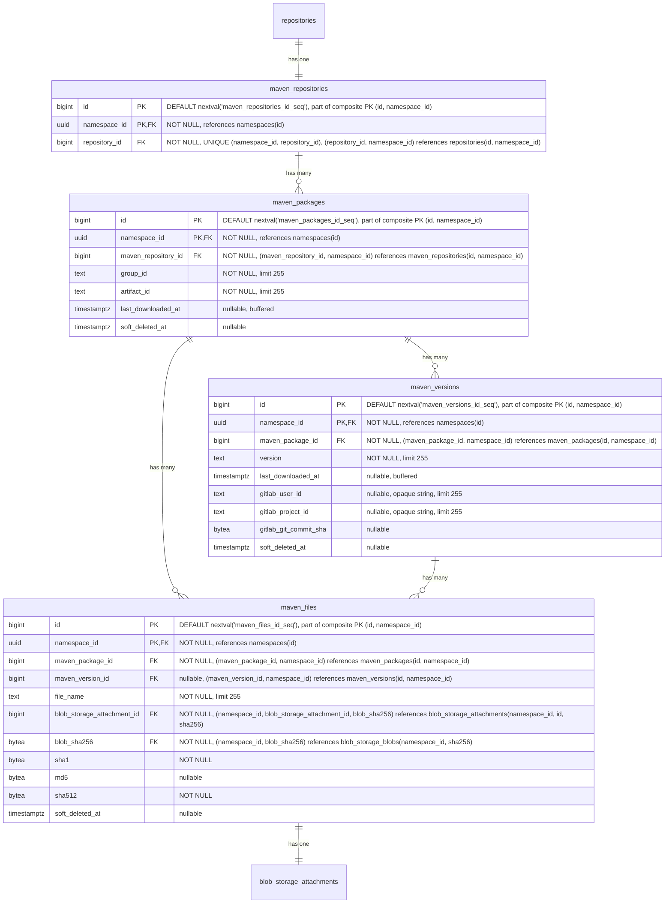

- **maven_repositories**: 複数のパッケージのコンテナです。各リポジトリは、group ID と artifact ID で識別される複数のパッケージをホストできます。名前、可視性、フォーマット横断クエリのために、`repository_id` を介して親の `repositories` テーブルを参照します。`HASH(namespace_id)` で64パーティションにパーティショニングされます。
- **maven_packages**: [group ID と artifact ID](https://maven.apache.org/pom.html#Maven_Coordinates) で識別される Maven パッケージ（例: `com.example:myapp`）を表します。`last_downloaded_at` はパッケージのいずれかのファイルが最後にダウンロードされた時刻を記録し、[バッファ書き込み／非同期書き込み](#buffered-and-asynchronous-writes) を介して維持されます。`NULL` はパッケージが一度もダウンロードされていないことを意味し、`keep_last_downloaded_at` ライフサイクルルールの評価では可能な限り古いダウンロード時刻として扱われます（すなわち、ダウンロードベースの保持で削除対象になります）。ダウンロードベースの保持を評価する `keep_last_downloaded_at` ライフサイクルルールで使用されます（[ADR-010](010_data_retention.md)）。`HASH(namespace_id)` で64パーティションにパーティショニングされます。
- **maven_versions**: Maven パッケージの個々の [バージョン](https://maven.apache.org/pom.html#Maven_Coordinates)（例: `1.0.0`、`2.1.3-SNAPSHOT`）を保存します。`last_downloaded_at` はバージョンのいずれかのファイルが最後にダウンロードされた時刻を記録し、[バッファ書き込み／非同期書き込み](#buffered-and-asynchronous-writes) を介して維持されます。`keep_last_downloaded_at` ライフサイクルルールで使用されます。`gitlab_user_id`、`gitlab_project_id`、`gitlab_git_commit_sha` は、どの GitLab ユーザーがこのバージョンを公開したか、および公開の背後にある CI コンテキスト（プロジェクト、コミット）を記録し、[`container_manifests`](#container-repositories) の同等のカラムと同じ形状・根拠を持ちます。`HASH(namespace_id)` で64パーティションにパーティショニングされます。
- **maven_files**: Maven パッケージに関連付けられた個々のファイルを表します。ファイルは、`maven_version_id` が設定されたバージョン固有のもの（JAR、POM、ソース、Javadoc、チェックサム）か、`maven_version_id` が NULL のパッケージレベルのもの（`maven-metadata.xml` とそのチェックサムなど）のいずれかです。`maven_package_id` は常に設定されており、パッケージからそのすべてのファイルへの直接のパスを提供します。レジストリがパフォーマンスのボトルネックを改善するために使用する補助ファイルである場合もあります。`sha1` と `md5` カラムは、整合性検証のために [Maven プロトコルが要求するチェックサム](https://maven.apache.org/resolver/about-checksums.html) を保存します。Maven クライアントは、すべてのアーティファクトとともに `.sha1` と `.md5` のサイドカーファイルを期待します。これらのカラムが `blob_storage_blobs` ではなく `maven_files` にあるのは、これらが普遍的な blob のプロパティではなく Maven プロトコルの関心事だからです。他のフォーマット（OCI コンテナ）は SHA256 のみを使用します。ここに保持することで、`blob_storage_blobs` をフォーマット固有のカラムやインデックスを持たないフォーマット非依存のテーブルとして保てます。`sha1` は Maven プロトコルが要求するため `NOT NULL` です。`md5` は Maven 3.9+ が [MD5 チェックサムを非推奨にした](https://maven.apache.org/resolver/about-checksums.html) ため nullable です。`sha512` は、Maven プロトコルがレジストリが提供できなければならない `.sha512` サイドカーを公開し、その値はアップロード中にバイトが永続化前にハンドラーを通過する際に常に計算可能であるため、`NOT NULL` です。`HASH(namespace_id)` で64パーティションにパーティショニングされます。
- **blob_storage_attachments**: 詳細は [blob ストレージ](#blob-storage) セクションを参照してください。

ここでは、パッケージ名（この場合は group ID と artifact ID）とバージョンを同じテーブルに保存していません。その理由は、UI がこのデータにパッケージ名でアクセスするためです。パッケージ名がフォルダであるツリー状の UI を想像してください。それを開くと、バージョンごとに1つのサブフォルダがあります。この最初のリクエストはフォルダ、すなわちパッケージ名を一覧表示する必要があります。フォルダを開くと、すべてのサブフォルダ、すなわちパッケージバージョンを一覧表示するリクエストがトリガーされます。したがって、このアクセスパターンを容易にするために、2つの専用テーブル（`maven_packages` と `maven_versions`）を持っています。

#### インデックス

- **`maven_repositories`**: `(namespace_id, repository_id)` に対する一意インデックス — 親リポジトリ参照によって Maven リポジトリをルックアップします。
- **`maven_packages`**: `(namespace_id, maven_repository_id, group_id, artifact_id) WHERE soft_deleted_at IS NULL` に対する一意インデックス — リポジトリ内で Maven 座標によってパッケージをルックアップします。部分条件により、ソフト削除後に同じ座標のパッケージを再作成できます。`(namespace_id, maven_repository_id, last_downloaded_at NULLS FIRST) WHERE soft_deleted_at IS NULL` に対するインデックス — `keep_last_downloaded_at` ライフサイクルルールの評価をサポートします。リポジトリ内のすべてのパッケージをスキャンして行ごとにフィルタするのではなく、範囲スキャンで期限切れのパッケージのみを返します。`NULLS FIRST` は、一度もダウンロードされていないパッケージを最も古い行とグループ化するため、両方が同じ範囲スキャンで返されます。
- **`maven_versions`**: `(namespace_id, maven_package_id, version) WHERE soft_deleted_at IS NULL` に対する一意インデックス — パッケージ内で特定のバージョンをルックアップします。部分条件により、ソフト削除後に同じ識別子のバージョンを再作成できます。`(namespace_id, maven_package_id, last_downloaded_at NULLS FIRST) WHERE soft_deleted_at IS NULL` に対するインデックス — パッケージのバージョンにスコープされた `keep_last_downloaded_at` ライフサイクルルールの評価をサポートし、`maven_packages` と同じ範囲スキャン戦略を使用します。
- **`maven_files`**: `(namespace_id, maven_version_id, file_name) WHERE soft_deleted_at IS NULL AND maven_version_id IS NOT NULL` に対する一意インデックス — バージョン固有のファイル名はバージョン内で一意でなければなりません。部分条件はソフト削除済みの行とパッケージレベルのファイルを除外します。`(namespace_id, maven_package_id, file_name) WHERE soft_deleted_at IS NULL AND maven_version_id IS NULL` に対する一意インデックス — パッケージレベルのファイル名（`maven-metadata.xml` など）はパッケージ内で一意でなければなりません。`(namespace_id, blob_storage_attachment_id)` に対するインデックス — ストレージアタッチメントによってファイルをルックアップします。

#### クエリ例

- 指定したリポジトリ ID とパッケージ名のパッケージバージョンを取得する。

  ```sql
  SELECT mv.*
  FROM maven_versions mv
  JOIN maven_packages mp
    ON mv.maven_package_id = mp.id AND mv.namespace_id = mp.namespace_id
  WHERE mp.namespace_id = '018f4d6f-0e10-7e3a-9bfd-23a4c5d6e7f8' AND mp.maven_repository_id = 123 AND mp.group_id = 'com.example' AND mp.artifact_id = 'myapp'
    AND mv.version = '1.0.0'
    AND mp.soft_deleted_at IS NULL AND mv.soft_deleted_at IS NULL;
  ```

- 指定したバージョン ID とファイル名のファイルを取得する。

  ```sql
  SELECT mf.*
  FROM maven_files mf
  WHERE mf.namespace_id = '018f4d6f-0e10-7e3a-9bfd-23a4c5d6e7f8' AND mf.maven_version_id = 456 AND mf.file_name = 'myapp-1.0.0.jar'
    AND mf.soft_deleted_at IS NULL;
  ```

- 指定したパッケージのパッケージレベルファイル（例: `maven-metadata.xml`）を取得する。

  ```sql
  SELECT mf.*
  FROM maven_files mf
  WHERE mf.namespace_id = '018f4d6f-0e10-7e3a-9bfd-23a4c5d6e7f8' AND mf.maven_package_id = 123 AND mf.maven_version_id IS NULL
    AND mf.soft_deleted_at IS NULL;
  ```

### Maven リモートリポジトリ

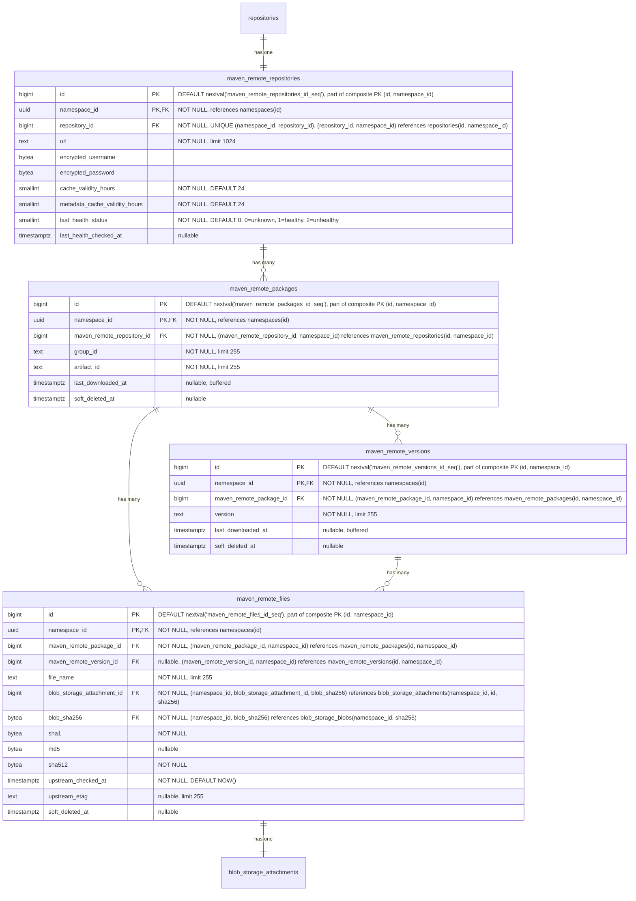

- **maven_remote_repositories**: 外部の Maven リポジトリを表します。URL、認証情報、アーティファクトキャッシュ TTL（`cache_validity_hours`）、および `maven-metadata.xml` などのメタデータレスポンス用の別の TTL（`metadata_cache_validity_hours`）を含みます。モニタリングのためにヘルスチェックのステータスが追跡されます。`repository_id` を介して親の `repositories` テーブルを参照します。`HASH(namespace_id)` で64パーティションにパーティショニングされます。
- **maven_remote_packages**: group ID と artifact ID で識別される、キャッシュされた Maven パッケージです。`maven_packages` をミラーします。`last_downloaded_at` はパッケージのいずれかのキャッシュされたファイルが最後にダウンロードされた時刻を記録し、ホット行の競合を避けるためにバッファ書き込み／非同期書き込みを介して維持されます。`keep_last_downloaded_at` ライフサイクルルールとキャッシュ保持の評価で使用されます。`HASH(namespace_id)` で64パーティションにパーティショニングされます。
- **maven_remote_versions**: Maven パッケージのキャッシュされたバージョンです。`maven_versions` をミラーします。`last_downloaded_at` はバージョンのいずれかのキャッシュされたファイルが最後にダウンロードされた時刻を記録し、ホット行の競合を避けるためにバッファ書き込み／非同期書き込みを介して維持されます。`keep_last_downloaded_at` ライフサイクルルールとキャッシュ保持の評価で使用されます。`HASH(namespace_id)` で64パーティションにパーティショニングされます。
- **maven_remote_files**: キャッシュされたファイル（JAR、POM、チェックサム、`maven-metadata.xml`）です。nullable な `maven_remote_version_id` は、ローカルと同じパターン（バージョン固有のファイル vs. `maven-metadata.xml` のようなパッケージレベルのファイル）を保ちます。`sha1` と `md5` は、コンテンツがローカルかキャッシュかにかかわらず Maven プロトコルがこれらのチェックサムの提供を要求するため保持されます。`sha512` は同等性の観点から追加され、ローカルの `maven_files` のカラム形状をミラーすることで、Maven Virtual の仕様（S14）が単一のクエリパスでどちらのバックエンドからも `.sha512` サイドカーを提供できるようにします。値は他のチェックサムとともにプロキシ書き込みステップ中にキャッシュされたバイトから計算されるため、初日から `NOT NULL` が達成可能です。`upstream_checked_at` は、ファイルが upstream リポジトリに対して最後に検証された時刻を記録し、アーティファクトファイルの場合は `cache_validity_hours`、メタデータファイル（例: `maven-metadata.xml`）の場合は `metadata_cache_validity_hours` と比較されて再検証が必要かどうかを判断します。`upstream_etag` は upstream が返した ETag を保存し、変更されていないファイルの再ダウンロードを回避するための条件付きリクエスト（`If-None-Match`）を可能にします。`HASH(namespace_id)` で64パーティションにパーティショニングされます。
- **blob_storage_attachments**: 詳細は [blob ストレージ](#blob-storage) セクションを参照してください。

#### インデックス

- **`maven_remote_repositories`**: `(namespace_id, repository_id)` に対する一意インデックス — 親参照によってリモートリポジトリをルックアップします。
- **`maven_remote_packages`**: `(namespace_id, maven_remote_repository_id, group_id, artifact_id) WHERE soft_deleted_at IS NULL` に対する一意インデックス — Maven 座標によってキャッシュされたパッケージをルックアップします。部分条件により、ソフト削除後に同じ座標のパッケージを再作成できます。
- **`maven_remote_versions`**: `(namespace_id, maven_remote_package_id, version) WHERE soft_deleted_at IS NULL` に対する一意インデックス — パッケージ内でキャッシュされたバージョンをルックアップします。部分条件により、ソフト削除後に同じ識別子のバージョンを再作成できます。
- **`maven_remote_files`**: `(namespace_id, maven_remote_version_id, file_name) WHERE soft_deleted_at IS NULL AND maven_remote_version_id IS NOT NULL` に対する一意インデックス — バージョン固有のファイル名はバージョン内で一意でなければなりません。`(namespace_id, maven_remote_package_id, file_name) WHERE soft_deleted_at IS NULL AND maven_remote_version_id IS NULL` に対する一意インデックス — パッケージレベルのファイル名はパッケージ内で一意でなければなりません。`(namespace_id, blob_storage_attachment_id)` に対するインデックス — ストレージアタッチメントによってファイルをルックアップします。

#### クエリ例

- リモートリポジトリを作成する

  ```sql
  -- First create the parent repository
  INSERT INTO repositories (namespace_id, name, format, kind, visibility)
  VALUES ('018f4d6f-0e10-7e3a-9bfd-23a4c5d6e7f8', 'central', 1, 2, 0)
  RETURNING id;
  -- Link the repository to a repository collection
  INSERT INTO repository_collection_repositories (namespace_id, repository_collection_id, repository_id)
  VALUES ('018f4d6f-0e10-7e3a-9bfd-23a4c5d6e7f8', 456, <returned_id>);
  -- Then create the format-specific record
  INSERT INTO maven_remote_repositories (namespace_id, repository_id, url, encrypted_username, encrypted_password)
  VALUES ('018f4d6f-0e10-7e3a-9bfd-23a4c5d6e7f8', <returned_id>, 'https://repo.maven.apache.org/maven2', $1, $2);
  ```

- 座標でキャッシュされた Maven ファイルをルックアップする

  ```sql
  SELECT mrf.*, bsb.object_storage_key
  FROM maven_remote_files mrf
  JOIN maven_remote_versions mrv
    ON mrf.maven_remote_version_id = mrv.id AND mrf.namespace_id = mrv.namespace_id
  JOIN maven_remote_packages mrp
    ON mrv.maven_remote_package_id = mrp.id AND mrv.namespace_id = mrp.namespace_id
  JOIN blob_storage_blobs bsb
    ON bsb.namespace_id = mrf.namespace_id AND bsb.sha256 = mrf.blob_sha256
  WHERE mrp.namespace_id = '018f4d6f-0e10-7e3a-9bfd-23a4c5d6e7f8'
    AND mrp.maven_remote_repository_id = 789
    AND mrp.group_id = 'com.example'
    AND mrp.artifact_id = 'myapp'
    AND mrv.version = '1.0.0'
    AND mrf.file_name = 'myapp-1.0.0.jar'
    AND mrp.soft_deleted_at IS NULL AND mrv.soft_deleted_at IS NULL AND mrf.soft_deleted_at IS NULL;
  ```

- パッケージのキャッシュされた `maven-metadata.xml` をルックアップする

  ```sql
  SELECT mrf.*
  FROM maven_remote_files mrf
  JOIN maven_remote_packages mrp
    ON mrf.maven_remote_package_id = mrp.id AND mrf.namespace_id = mrp.namespace_id
  WHERE mrp.namespace_id = '018f4d6f-0e10-7e3a-9bfd-23a4c5d6e7f8'
    AND mrp.maven_remote_repository_id = 789
    AND mrp.group_id = 'com.example'
    AND mrp.artifact_id = 'myapp'
    AND mrf.maven_remote_version_id IS NULL
    AND mrf.file_name = 'maven-metadata.xml'
    AND mrp.soft_deleted_at IS NULL AND mrf.soft_deleted_at IS NULL;
  ```

### Maven 仮想リポジトリ

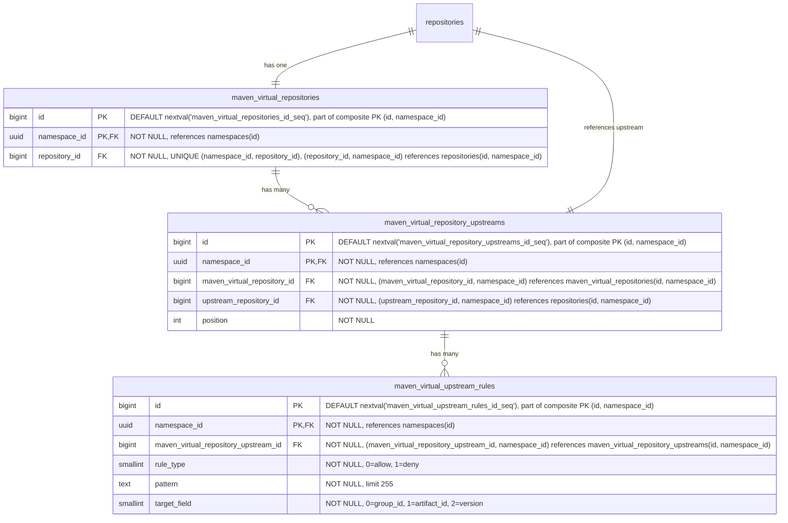

- **maven_virtual_repositories**: Maven パッケージ用の仮想リポジトリです。名前、可視性、フォーマット横断クエリのために、`repository_id` を介して親の `repositories` テーブルを参照します。`HASH(namespace_id)` で64パーティションにパーティショニングされます。
- **maven_virtual_repository_upstreams**: 仮想リポジトリとその upstream を結合するテーブルです。各仮想リポジトリは、順序付けられた upstream のリストを持ちます。各エントリは `upstream_repository_id` を介して upstream リポジトリを参照し、これは `repositories(namespace_id, id)` を指します。複合 FK `(namespace_id, upstream_repository_id)` は、upstream が同じ名前空間内にあることを強制します。これは、レジストリが名前空間にスコープされること（[ADR-001](001_organizations_as_anchor_point.md)）と一貫しています。`HASH(namespace_id)` で64パーティションにパーティショニングされます。
- **maven_virtual_upstream_rules**: upstream に対する許可／拒否のフィルタルールを定義します。各ルールは、この upstream を通じて解決する際にどのアーティファクトを含めるか除外するかを制御するために、ワイルドカードパターンと対象フィールドを指定します。MVP ではパターンはワイルドカードのみで、正規表現のサポートは顧客からのフィードバックが正当化するまで延期されます（[議論](https://gitlab.com/gitlab-org/gitlab/-/work_items/597754#note_3291871207)）。`HASH(namespace_id)` で64パーティションにパーティショニングされます。

#### インデックス

- **`maven_virtual_repositories`**: `(namespace_id, repository_id)` に対する一意インデックス — 親参照によって仮想リポジトリをルックアップします。
- **`maven_virtual_repository_upstreams`**: `(namespace_id, maven_virtual_repository_id, position) DEFERRABLE INITIALLY DEFERRED` に対する一意インデックス — 仮想リポジトリの順序付けられた upstream を取得します。トランザクション内での並べ替えを可能にするために遅延可能です。`(namespace_id, maven_virtual_repository_id, upstream_repository_id)` に対する一意インデックス — 同じ upstream が仮想リポジトリに2回追加されるのを防ぎます。
- **`maven_virtual_upstream_rules`**: `(namespace_id, maven_virtual_repository_upstream_id)` に対するインデックス — 指定した upstream のすべてのルールを取得します。

#### クエリ例

- 仮想リポジトリを作成する

  ```sql
  -- First create the parent repository
  INSERT INTO repositories (namespace_id, name, format, kind, visibility)
  VALUES ('018f4d6f-0e10-7e3a-9bfd-23a4c5d6e7f8', 'my-virtual-repo', 1, 1, 1)
  RETURNING id;
  -- Link the repository to a repository collection
  INSERT INTO repository_collection_repositories (namespace_id, repository_collection_id, repository_id)
  VALUES ('018f4d6f-0e10-7e3a-9bfd-23a4c5d6e7f8', 456, <returned_id>);
  -- Then create the format-specific record
  INSERT INTO maven_virtual_repositories (namespace_id, repository_id)
  VALUES ('018f4d6f-0e10-7e3a-9bfd-23a4c5d6e7f8', <returned_id>);
  ```

- 仮想リポジトリを upstream に関連付ける

  ```sql
  INSERT INTO maven_virtual_repository_upstreams (namespace_id, maven_virtual_repository_id, upstream_repository_id, position)
  VALUES ('018f4d6f-0e10-7e3a-9bfd-23a4c5d6e7f8', 123, 789, 1);
  ```

### NPM リポジトリ

Node のパッケージは基本的に `.tar.gz` ファイルであり、各バージョンが単一のアーカイブです。ただし、node クライアントはより豊富な機能セットを持ち、例えば私たちが扱う必要のある distribution タグの使用などがあります。

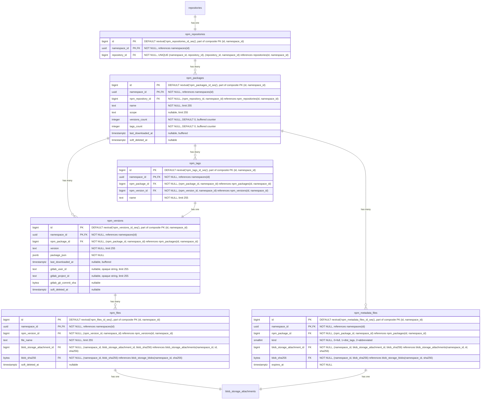

- **npm_repositories**: 複数のパッケージのコンテナです。各リポジトリは、オプションのスコープを持つ複数のパッケージをホストできます。名前、可視性、フォーマット横断クエリのために、`repository_id` を介して親の `repositories` テーブルを参照します。`HASH(namespace_id)` で64パーティションにパーティショニングされます。
- **npm_packages**: npm パッケージを表します。`name` カラムは、スコープを含む完全なパッケージ名（例: `@myorg/mypackage` または `lodash`）を保存します。`versions_count` は、ソフト削除済みのものを含むパッケージの `npm_versions` 行を数え、ガベージコレクションが行をハード削除したときにのみデクリメントします。`tags_count` はその `npm_tags` 行を数えます（`npm_tags` にはソフト削除カラムがないため、この問題は生じません）。どちらも [ADR-004](004_data_and_application_limits.md#entity-count-limits) のパッケージごとのエンティティ数制限（25,000 バージョン、1,000 タグ）を強制するバッファカウンターであり、[バッファ書き込み／非同期書き込み](#buffered-and-asynchronous-writes) を介して維持されます。ソフト削除済みのバージョンを含めることは、`namespace_statistics.deduplicated_size_bytes` の扱いをミラーし、不正利用の経路を塞ぎます。すなわち、ソフト削除済みの行を上限から除外できる顧客が、繰り返しソフト削除して再公開することで、すべてのソフト削除済み行が依然としてストレージを占有し復元可能であるにもかかわらず、25,000 バージョンの制限を無期限に下回り続けられてしまうのを防ぎます。両方の上限が 32 ビットの上限を十分に下回るため、（`bigint` ではなく）`integer` 型です。他の場所の無制限のカウンター（`downloads_count`、`size_bytes`）は無制限に増加するため `bigint` が必要です。`last_downloaded_at` はパッケージのいずれかのファイルが最後にダウンロードされた時刻を記録し、[バッファ書き込み／非同期書き込み](#buffered-and-asynchronous-writes) を介して維持されます。`keep_last_downloaded_at` ライフサイクルルールで使用されます。`HASH(namespace_id)` で64パーティションにパーティショニングされます。
- **npm_versions**: package.json メタデータを埋め込んだ npm パッケージの個々のバージョンを保存します。`last_downloaded_at` はバージョンのいずれかのファイルが最後にダウンロードされた時刻を記録し、[バッファ書き込み／非同期書き込み](#buffered-and-asynchronous-writes) を介して維持されます。`keep_last_downloaded_at` ライフサイクルルールで使用されます。`gitlab_user_id`、`gitlab_project_id`、`gitlab_git_commit_sha` は、どの GitLab ユーザーがこのバージョンを公開したか、および公開の背後にある CI コンテキスト（プロジェクト、コミット）を記録し、[`container_manifests`](#container-repositories) の同等のカラムと同じ形状・根拠を持ちます。`HASH(namespace_id)` で64パーティションにパーティショニングされます。
- **npm_tags**: 特定のパッケージバージョンを指す [NPM distribution タグ](https://docs.npmjs.com/cli/v11/commands/npm-dist-tag)（例: `latest`、`next`、`beta`）を提供します。`HASH(namespace_id)` で64パーティションにパーティショニングされます。
- **npm_files**: npm パッケージバージョンのファイルを表します。これらは主に tarball アーカイブです。レジストリがパフォーマンスのボトルネックを改善するために使用する補助ファイルである場合もあります。`HASH(namespace_id)` で64パーティションにパーティショニングされます。
- **npm_metadata_files**: npm パッケージの事前計算されたメタデータファイルを `kind` ごとに1つ保存します。`kind` カラムはメタデータのバリアントを区別します。`full`（0）はすべてのバージョンを含む完全な packument を含み、`dist_tags`（1）は distribution タグのマッピングのみを含み、`abbreviated`（2）はリクエストが `Accept: application/vnd.npm.install-v1+json` を伴う場合に提供されるインストール専用の射影です。クライアントのリクエストに基づいて、npm メタデータエンドポイントで適切なファイルが提供されます。メタデータはパッケージのすべてのバージョンにまたがるため、（`npm_versions` ではなく）`npm_packages` にリンクされています。メタデータファイルは、バージョンが公開または公開解除された後に非同期で生成されます。`expires_at` カラムはキャッシュの鮮度を駆動します。書き込み側（公開、非推奨化、公開解除、dist-tag の変更）は、データ書き込みと同じトランザクションで、対象のパッケージのすべての行に対して `expires_at = NOW()` を設定することでキャッシュを強制的に期限切れにします。再構築ジョブは、新しく生成された blob を持つ行をアップサートする際に `expires_at = NOW() + npm.packument_cache_ttl` を設定します。読み取り側は `expires_at > NOW()` でフィルタし、ミスの場合はインラインビルドパスにフォールスルーするため、期限切れの行がクライアントに提供されることはありません。このカラムはハード削除の期限ではなく、キャッシュの鮮度シグナルです。強制的な期限切れは blob とアタッチメントをそのまま残すため、すでにそれらに対して解決中のレスポンスは、再構築ジョブがアタッチメントを入れ替えるまで正常に完了します。`HASH(namespace_id)` で64パーティションにパーティショニングされます。
- **blob_storage_attachments**: 詳細は [blob ストレージ](#blob-storage) セクションを参照してください。

[Maven](#maven-repositories) と同様に、まったく同じ理由でパッケージ名とバージョンは2つの異なるテーブルに保存されます。

#### インデックス

- **`npm_repositories`**: `(namespace_id, repository_id)` に対する一意インデックス — 親リポジトリ参照によって NPM リポジトリをルックアップします。
- **`npm_packages`**: `(namespace_id, npm_repository_id, name) WHERE soft_deleted_at IS NULL` に対する一意インデックス — リポジトリ内で名前によってパッケージをルックアップします。部分条件により、ソフト削除後に同じ名前のパッケージを再作成できます。`(namespace_id, npm_repository_id, last_downloaded_at NULLS FIRST) WHERE soft_deleted_at IS NULL` に対するインデックス — `keep_last_downloaded_at` ライフサイクルルールの評価をサポートします。リポジトリ内のすべてのパッケージをスキャンして行ごとにフィルタするのではなく、範囲スキャンで期限切れのパッケージのみを返します。`NULLS FIRST` は、一度もダウンロードされていないパッケージを最も古い行とグループ化するため、両方が同じ範囲スキャンで返されます。
- **`npm_versions`**: `(namespace_id, npm_package_id, version) WHERE soft_deleted_at IS NULL` に対する一意インデックス — パッケージ内で特定のバージョンをルックアップします。部分条件により、ソフト削除後に同じ識別子のバージョンを再作成できます。`(namespace_id, npm_package_id, last_downloaded_at NULLS FIRST) WHERE soft_deleted_at IS NULL` に対するインデックス — パッケージのバージョンにスコープされた `keep_last_downloaded_at` ライフサイクルルールの評価をサポートし、`npm_packages` と同じ範囲スキャン戦略を使用します。
- **`npm_tags`**: `(namespace_id, npm_package_id, name)` に対する一意インデックス — パッケージ内で名前によって distribution タグをルックアップします。`(namespace_id, npm_version_id)` に対するインデックス — 指定したバージョンを指すすべてのタグを見つけます。
- **`npm_files`**: `(namespace_id, npm_version_id, file_name) WHERE soft_deleted_at IS NULL` に対する一意インデックス — ファイル名はバージョン内で一意でなければなりません。部分条件により、ソフト削除後に同じ名前のファイルを再作成できます。`(namespace_id, blob_storage_attachment_id)` に対するインデックス — ストレージアタッチメントによってファイルをルックアップします。
- **`npm_metadata_files`**: `(namespace_id, npm_package_id, kind)` に対する一意インデックス — パッケージごと・kind ごとに1つのメタデータファイルです。`(namespace_id, blob_storage_attachment_id)` に対するインデックス — ストレージアタッチメントによってメタデータファイルをルックアップします。

#### クエリ例

- 指定したリポジトリ ID とパッケージ名のすべてのバージョンを取得する

  ```sql
  SELECT nv.*
  FROM npm_versions nv
  JOIN npm_packages np
    ON nv.npm_package_id = np.id AND nv.namespace_id = np.namespace_id
  WHERE np.namespace_id = '018f4d6f-0e10-7e3a-9bfd-23a4c5d6e7f8' AND np.npm_repository_id = 123 AND np.name = '@myorg/mypackage'
    AND np.soft_deleted_at IS NULL AND nv.soft_deleted_at IS NULL;
  ```

- 公開パスの制限事前チェックのために、パッケージごとのエンティティ数カウンターを読み取る（参考値。`npm_versions` と `npm_tags` の部分一意インデックスが、競合のない権威あるガードです）。

  ```sql
  SELECT versions_count, tags_count
  FROM npm_packages
  WHERE namespace_id = '018f4d6f-0e10-7e3a-9bfd-23a4c5d6e7f8' AND id = 456 AND soft_deleted_at IS NULL;
  ```

- 指定したバージョン ID とファイル名のファイルを取得する

  ```sql
  SELECT nf.*
  FROM npm_files nf
  WHERE nf.namespace_id = '018f4d6f-0e10-7e3a-9bfd-23a4c5d6e7f8' AND nf.npm_version_id = 456 AND nf.file_name = 'mypackage-1.0.0.tgz'
    AND nf.soft_deleted_at IS NULL;
  ```

- パッケージの事前計算された完全なメタデータファイルを取得する（npm メタデータエンドポイントで提供）

  ```sql
  SELECT bsb.object_storage_key, bsb.size, bsb.content_type
  FROM npm_metadata_files nmf
  JOIN blob_storage_blobs bsb ON bsb.namespace_id = nmf.namespace_id AND bsb.sha256 = nmf.blob_sha256
  WHERE nmf.namespace_id = '018f4d6f-0e10-7e3a-9bfd-23a4c5d6e7f8' AND nmf.npm_package_id = 456 AND nmf.kind = 0
    AND nmf.expires_at > NOW();
  ```

  読み取りは `expires_at > NOW()` でフィルタします。ミス（行がない、または書き込み側が
  強制的に期限切れにしたか TTL が経過したために `expires_at <= NOW()`）はインラインビルドパスに
  フォールスルーします。後述のキャッシュ再構築ジョブが新鮮な行を復元します。

- 書き込み時に packument キャッシュを強制的に期限切れにする

  公開、非推奨化、公開解除、dist-tag の変更は、データ書き込みと同じトランザクションで、対象のパッケージの
  すべての kind に対して `expires_at` を `NOW()` に切り替えることでキャッシュを無効化します。blob と
  アタッチメントはそのまま残されるため、すでに処理中のレスポンスは、再構築ジョブがアタッチメントを
  入れ替えるまで既存の blob に対して解決し続けます。

  ```sql
  UPDATE npm_metadata_files
  SET expires_at = NOW()
  WHERE namespace_id = '018f4d6f-0e10-7e3a-9bfd-23a4c5d6e7f8' AND npm_package_id = 456;
  ```

  初回公開の場合はまだ行が存在しないため、`UPDATE` は0行に影響します。再構築
  ジョブが初回実行時にキャッシュ行を挿入します。

- バージョンの公開または公開解除の後にメタデータファイルをアップサートする

  キャッシュ再構築ジョブは、パッケージの kind ごとに1回これを実行します。孤立したアタッチメントが
  blob のガベージコレクションをブロックするのを防ぐため、古いアタッチメントは同じトランザクションで
  削除しなければなりません（[クリーンアップタスク](#cleanup-tasks) を参照）。

  ```sql
  -- The new blob and attachment (id=789) are created earlier in the same transaction.
  -- The interval below mirrors the configured `npm.packument_cache_ttl` (default 7 days).
  WITH old AS (
    SELECT blob_storage_attachment_id, blob_sha256
    FROM npm_metadata_files
    WHERE namespace_id = '018f4d6f-0e10-7e3a-9bfd-23a4c5d6e7f8' AND npm_package_id = 456 AND kind = 0
  ),
  upsert AS (
    INSERT INTO npm_metadata_files (namespace_id, npm_package_id, kind, blob_storage_attachment_id, blob_sha256, expires_at)
    VALUES ('018f4d6f-0e10-7e3a-9bfd-23a4c5d6e7f8', 456, 0, 789, 'abcd1234...'::bytea, NOW() + interval '7 days')
    ON CONFLICT (namespace_id, npm_package_id, kind)
    DO UPDATE SET blob_storage_attachment_id = EXCLUDED.blob_storage_attachment_id,
                  blob_sha256 = EXCLUDED.blob_sha256,
                  expires_at = EXCLUDED.expires_at
  )
  DELETE FROM blob_storage_attachments bsa
  USING old
  WHERE bsa.namespace_id = '018f4d6f-0e10-7e3a-9bfd-23a4c5d6e7f8'
    AND bsa.id = old.blob_storage_attachment_id
    AND bsa.sha256 = old.blob_sha256;
  ```

  初回挿入では `old` CTE が行を返さないため、アタッチメントは削除されません。
  競合（更新）の場合、前のアタッチメントが削除されます。古い blob は、他のアタッチメントが
  それを参照していなければガベージコレクションされます（重複排除に安全です。
  各クライアントは自身のアタッチメントを保持するため、1つを削除しても同じ blob を
  共有する他のものには影響しません）。

### NPM リモートリポジトリ

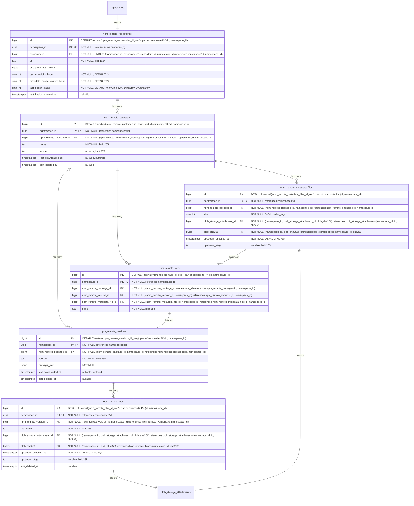

- **npm_remote_repositories**: 外部の npm レジストリを表します。URL、認証情報、アーティファクトキャッシュ TTL（`cache_validity_hours`）、およびパッケージメタデータレスポンス用の別の TTL（`metadata_cache_validity_hours`）を含みます。モニタリングのためにヘルスチェックのステータスが追跡されます。`repository_id` を介して親の `repositories` テーブルを参照します。`HASH(namespace_id)` で64パーティションにパーティショニングされます。
- **npm_remote_packages**: キャッシュされた npm パッケージです。`last_downloaded_at` はパッケージのいずれかのキャッシュされたファイルが最後にダウンロードされた時刻を記録し、ホット行の競合を避けるためにバッファ書き込み／非同期書き込みを介して維持されます。`keep_last_downloaded_at` ライフサイクルルールとキャッシュ保持の評価で使用されます。`HASH(namespace_id)` で64パーティションにパーティショニングされます。
- **npm_remote_versions**: その `package_json` メタデータを持つキャッシュされたバージョンです。packument がフェッチされる際に投入されます（それにはすべてのバージョンメタデータが含まれます）。`last_downloaded_at` はバージョンのいずれかのキャッシュされたファイルが最後にダウンロードされた時刻を記録し、ホット行の競合を避けるためにバッファ書き込み／非同期書き込みを介して維持されます。`keep_last_downloaded_at` ライフサイクルルールとキャッシュ保持の評価で使用されます。`HASH(namespace_id)` で64パーティションにパーティショニングされます。
- **npm_remote_tags**: キャッシュされた dist-tag からバージョンへのマッピング（例: `latest`、`next`）です。packument から投入されます。`HASH(namespace_id)` で64パーティションにパーティショニングされます。
- **npm_remote_metadata_files**: upstream レジストリからキャッシュされた事前計算メタデータファイルを、パッケージごと・kind ごとに1つ保存します。`kind` は、すべてのバージョンを含む完全な packument（`0`）と、dist-tags のみのマッピング（`1`）を区別します。`upstream_checked_at` は、メタデータが upstream レジストリに対して最後に検証された時刻を記録し、再検証が必要かどうかを判断するために `metadata_cache_validity_hours` と比較されます。`upstream_etag` は upstream が返した ETag を保存し、変更されていないメタデータの再ダウンロードを回避するための条件付きリクエスト（`If-None-Match`）を可能にします。`HASH(namespace_id)` で64パーティションにパーティショニングされます。
- **npm_remote_files**: キャッシュされた tarball です。`upstream_checked_at` は、ファイルが upstream レジストリに対して最後に検証された時刻を記録し、再検証が必要かどうかを判断するために `cache_validity_hours` と比較されます。`upstream_etag` は upstream が返した ETag を保存し、変更されていない tarball の再ダウンロードを回避するための条件付きリクエスト（`If-None-Match`）を可能にします。`HASH(namespace_id)` で64パーティションにパーティショニングされます。
- **blob_storage_attachments**: 詳細は [blob ストレージ](#blob-storage) セクションを参照してください。

#### インデックス

- **`npm_remote_repositories`**: `(namespace_id, repository_id)` に対する一意インデックス — 親参照によってリモートリポジトリをルックアップします。
- **`npm_remote_packages`**: `(namespace_id, npm_remote_repository_id, name) WHERE soft_deleted_at IS NULL` に対する一意インデックス — 名前でキャッシュされたパッケージをルックアップします。部分条件により、ソフト削除後に同じ名前のパッケージを再作成できます。
- **`npm_remote_versions`**: `(namespace_id, npm_remote_package_id, version) WHERE soft_deleted_at IS NULL` に対する一意インデックス — パッケージ内でキャッシュされたバージョンをルックアップします。部分条件により、ソフト削除後に同じ識別子のバージョンを再作成できます。
- **`npm_remote_tags`**: `(namespace_id, npm_remote_package_id, name)` に対する一意インデックス — 名前で distribution タグをルックアップします。`(namespace_id, npm_remote_version_id)` に対するインデックス — 指定したバージョンを指すすべてのタグを見つけます。
- **`npm_remote_metadata_files`**: `(namespace_id, npm_remote_package_id, kind)` に対する一意インデックス — パッケージごと・kind ごとに1つのメタデータファイルを強制します。`(namespace_id, blob_storage_attachment_id)` に対するインデックス — ストレージアタッチメントによってメタデータファイルをルックアップします。
- **`npm_remote_files`**: `(namespace_id, npm_remote_version_id, file_name) WHERE soft_deleted_at IS NULL` に対する一意インデックス — ファイル名はバージョン内で一意でなければなりません。部分条件により、ソフト削除後に同じ名前のファイルを再作成できます。`(namespace_id, blob_storage_attachment_id)` に対するインデックス — ストレージアタッチメントによってファイルをルックアップします。

#### クエリ例

- リモートリポジトリを作成する

  ```sql
  -- First create the parent repository
  INSERT INTO repositories (namespace_id, name, format, kind, visibility)
  VALUES ('018f4d6f-0e10-7e3a-9bfd-23a4c5d6e7f8', 'npm-registry', 2, 2, 0)
  RETURNING id;
  -- Link the repository to a repository collection
  INSERT INTO repository_collection_repositories (namespace_id, repository_collection_id, repository_id)
  VALUES ('018f4d6f-0e10-7e3a-9bfd-23a4c5d6e7f8', 456, <returned_id>);
  -- Then create the format-specific record
  INSERT INTO npm_remote_repositories (namespace_id, repository_id, url, encrypted_auth_token)
  VALUES ('018f4d6f-0e10-7e3a-9bfd-23a4c5d6e7f8', <returned_id>, 'https://registry.npmjs.org', $1);
  ```

- パッケージのすべてのキャッシュされたバージョンを取得する（packument レスポンスを提供する）

  ```sql
  SELECT nrv.version, nrv.package_json
  FROM npm_remote_versions nrv
  JOIN npm_remote_packages nrp
    ON nrv.npm_remote_package_id = nrp.id AND nrv.namespace_id = nrp.namespace_id
  WHERE nrp.namespace_id = '018f4d6f-0e10-7e3a-9bfd-23a4c5d6e7f8'
    AND nrp.npm_remote_repository_id = 789
    AND nrp.name = '@myorg/mypackage'
    AND nrp.soft_deleted_at IS NULL AND nrv.soft_deleted_at IS NULL;
  ```

- キャッシュされた tarball をプルする（読み取りパスのショートカット）

  ```sql
  SELECT bsb.object_storage_key, bsb.size
  FROM npm_remote_files nrf
  JOIN blob_storage_blobs bsb
    ON bsb.namespace_id = nrf.namespace_id AND bsb.sha256 = nrf.blob_sha256
  WHERE nrf.namespace_id = '018f4d6f-0e10-7e3a-9bfd-23a4c5d6e7f8'
    AND nrf.npm_remote_version_id = 456
    AND nrf.file_name = 'mypackage-1.0.0.tgz'
    AND nrf.soft_deleted_at IS NULL;
  ```

### NPM 仮想リポジトリ

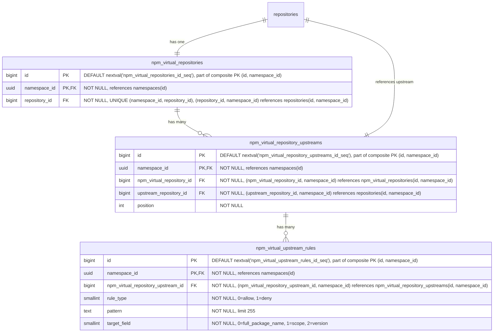

- **npm_virtual_repositories**: npm パッケージ用の仮想リポジトリです。名前、可視性、フォーマット横断クエリのために、`repository_id` を介して親の `repositories` テーブルを参照します。`HASH(namespace_id)` で64パーティションにパーティショニングされます。
- **npm_virtual_repository_upstreams**: 仮想リポジトリとその upstream を結合するテーブルです。各仮想リポジトリは、順序付けられた upstream のリストを持ちます。各エントリは `upstream_repository_id` を介して upstream リポジトリを参照し、これは `repositories(namespace_id, id)` を指します。複合 FK `(namespace_id, upstream_repository_id)` は、upstream が同じ名前空間内にあることを強制します。これは、レジストリが名前空間にスコープされること（[ADR-001](001_organizations_as_anchor_point.md)）と一貫しています。`HASH(namespace_id)` で64パーティションにパーティショニングされます。
- **npm_virtual_upstream_rules**: upstream に対する許可／拒否のフィルタルールを定義します。各ルールは、この upstream を通じて解決する際にどのアーティファクトを含めるか除外するかを制御するために、ワイルドカードパターンと対象フィールドを指定します。MVP ではパターンはワイルドカードのみで、正規表現のサポートは顧客からのフィードバックが正当化するまで延期されます（[議論](https://gitlab.com/gitlab-org/gitlab/-/work_items/597754#note_3291871207)）。`HASH(namespace_id)` で64パーティションにパーティショニングされます。

#### インデックス

- **`npm_virtual_repositories`**: `(namespace_id, repository_id)` に対する一意インデックス — 親参照によって仮想リポジトリをルックアップします。
- **`npm_virtual_repository_upstreams`**: `(namespace_id, npm_virtual_repository_id, position) DEFERRABLE INITIALLY DEFERRED` に対する一意インデックス — 仮想リポジトリの順序付けられた upstream を取得します。トランザクション内での並べ替えを可能にするために遅延可能です。`(namespace_id, npm_virtual_repository_id, upstream_repository_id)` に対する一意インデックス — 同じ upstream が仮想リポジトリに2回追加されるのを防ぎます。
- **`npm_virtual_upstream_rules`**: `(namespace_id, npm_virtual_repository_upstream_id)` に対するインデックス — 指定した upstream のすべてのルールを取得します。

#### クエリ例

- 仮想リポジトリを作成する

  ```sql
  -- First create the parent repository
  INSERT INTO repositories (namespace_id, name, format, kind, visibility)
  VALUES ('018f4d6f-0e10-7e3a-9bfd-23a4c5d6e7f8', 'my-virtual-repo', 2, 1, 1)
  RETURNING id;
  -- Link the repository to a repository collection
  INSERT INTO repository_collection_repositories (namespace_id, repository_collection_id, repository_id)
  VALUES ('018f4d6f-0e10-7e3a-9bfd-23a4c5d6e7f8', 456, <returned_id>);
  -- Then create the format-specific record
  INSERT INTO npm_virtual_repositories (namespace_id, repository_id)
  VALUES ('018f4d6f-0e10-7e3a-9bfd-23a4c5d6e7f8', <returned_id>);
  ```

- 仮想リポジトリを upstream に関連付ける

  ```sql
  INSERT INTO npm_virtual_repository_upstreams (namespace_id, npm_virtual_repository_id, upstream_repository_id, position)
  VALUES ('018f4d6f-0e10-7e3a-9bfd-23a4c5d6e7f8', 123, 789, 1);
  ```

### Blob ストレージ

blob ストレージのデータ構成は、次の前提のもとで行われています。

- blob への一対多の関連付けを扱う必要はありません。これは blob ストレージのクライアント領域で扱われます。したがって、一対一の関連付けだけが必要です。
- 適切な [クリーンアップ処理](#cleanup-tasks) のために、いくつの blob ストレージクライアントが単一の blob を使用しているか（重複排除）を追跡する必要があります。
- さらに、単一の blob に対する各使用の異なる起源を追跡したい場合があります。

ここで提示するスキーマは、データのストレージ側のみを考慮しています。メトリクスや [クリーンアップ](#cleanup-tasks) などの追加の側面に必要な補助テーブルが存在する場合がありますが、これらの部分はまだ評価中であるため、ここでは説明しません。アップロードセッションの追跡については [アップロードセッション](#upload-sessions) で説明します。

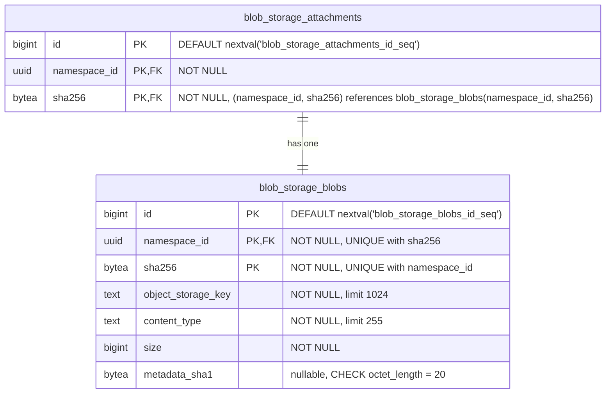

- **blob_storage_attachments**: 指定した blob の使用を追跡します。各クライアント（Container、NPM、または Maven リポジトリのテーブル）は、blob レコードを使用（作成または再利用）したいときに、毎回ここにレコードを作成する必要があります。各使用は、ここに単一のレコードを持つ _必要があります_。クライアントは、参照しているアーティファクトレコード（ファイル、blob、キャッシュエントリ）を削除するときに、アタッチメントレコードを削除する責任があります。両方の削除は、孤立したアタッチメントが blob のクリーンアップをブロックするのを防ぐため、同じトランザクションで行わなければなりません。クライアントテーブルから `blob_storage_attachments` への外部キーは参照整合性を強制します（ダングリング参照を防ぎます）が、`ON DELETE CASCADE` は使用しません。クリーンアップはアプリケーション管理です。例えば、まったく同じファイルを持つ2つの Maven パッケージは、それぞれ異なるアタッチメントレコードを参照し、それが今度は同じ blob レコードを参照します。`namespace_id` カラムは Cells のシャーディングに必要です。`sha256` カラムは、パーティションプルーニングされた結合を可能にするために、参照される `blob_storage_blobs` レコードから伝播されます（[パーティショニング戦略](#blob-storage-partitioning-strategy) を参照）。主キーは従来の `(id)` ではなく `(id, namespace_id, sha256)` です。`sha256` が必要なのは、PostgreSQL がハッシュパーティショニングされたテーブルのすべての一意制約にパーティションキーを含めることを強制するためです。`namespace_id` が必要なのは、デプロイメント間で PK をグローバルに一意に保つためです。ローカルの `bigint id` は単一の Artifact Registry データベース内でのみ一意であるため（[名前空間 ID の型](#namespace-id-type) を参照）、デプロイメント間の名前空間移行（[ADR-022](022_namespace_decoupling.md)）の際に、同じ `(id, sha256)` のペアが移行先のデータベースに既に存在する可能性があります。UUIDv7 の `namespace_id` を PK に追加することで、その衝突を構造的に排除します。クライアントテーブルは `(namespace_id, blob_storage_attachment_id, blob_sha256)` を介してこの複合 PK を参照します。
- **blob_storage_blobs**: このテーブルは、オブジェクトストレージ上に存在するすべてのファイルコンテンツ（blob として）を一覧表示します。オブジェクトストレージキーは専用カラムに完全に保存され、blob が使用されるたびに計算されることはありません。`sha256` は基本的なコンテンツアドレス可能な識別子であり、常に存在します（`NOT NULL`）。`namespace_id` カラムは重複排除を組織にスコープします。フォーマット固有のチェックサム（例: Maven の SHA1 と MD5）は、このテーブルではなくフォーマット固有のファイルテーブルに保存され、このテーブルをフォーマット非依存に保ちます。`metadata_sha1` カラムは、そのフォーマット非依存ルールに対する意図的でスコープされた例外です。これはコミット時に blob に添付された MVP のユーザーメタデータ許可リストの SHA-1 をミラーし、SHA-1 が提供されなかった場合は `NULL` です。これが（フォーマット固有のテーブルではなく）`blob_storage_blobs` にあるのは、ストレージレイヤーの blob 情報ルックアップが、プッシュとプルのホットパスで契約上単一の DB ラウンドトリップであるためです。DB ミラーなしでユーザーメタデータを公開すると、ダイジェストごとのオブジェクトストレージ HEAD ファンアウトや部分的な API 公開を強いることになります。同じ値は、コミット時にバックエンドネイティブの `x-amz-meta-checksum-sha1` / `x-goog-meta-checksum-sha1` ヘッダーとしてストレージオブジェクトに添付され、行は不変なので、DB とストレージオブジェクトのコピーがずれることはありません。将来の許可リストへの追加は、修正によって独自の nullable カラムを追加します。完全な根拠については [Artifact Registry S06 ストレージレイヤー仕様](https://gitlab.com/gitlab-org/ops/artifact-registry/-/blob/main/docs/specs/S06-storage-layer.md) を参照してください。主キーは、上記の `blob_storage_attachments` と同じ理由で `(id, namespace_id, sha256)` です。`sha256` は PostgreSQL のパーティションキー包含ルールを満たし、UUIDv7 の `namespace_id` はデプロイメント間で PK をグローバルに一意に保ち、代理の `bigint id` は行識別子の形状をスキーマ内の他のすべてのテーブルと一貫させます。組織ごとの重複排除は、別の `UNIQUE (namespace_id, sha256)` 制約によって強制され、これはコンテンツハッシュによるルックアップのインデックスとしても機能し、このテーブルへのすべての外部キーのターゲットになります。PK を直接参照する FK はありません。`(namespace_id, sha256)` は既に行を一意に識別し、UUIDv7 の `namespace_id` によってそれ自体でグローバルに一意であるため、呼び出し側は代理の `id` を持たずに自然キーで結合します。

blob ストレージのテーブルは、Artifact Registry の外部でも再利用できるように設計されています。これにより、他の機能が同じ重複排除とストレージのインフラストラクチャを活用できます。

すべてのハッシュカラム（`digest` と `sha256`、ならびに `sha1`、`md5`、`sha512` — Maven 固有）は `bytea` として保存されます。正確なエンコード戦略（例: [Container Registry](https://gitlab.com/gitlab-org/container-registry) が使用するインラインのアルゴリズム接頭辞や、別の `digest_algorithm` カラム）はまだ未定です。

### アップロードセッション

アップロードセッションは、[ADR-008](008_content_addressable_storage.md#two-phase-upload-strategy) で説明されている2フェーズのアップロードライフサイクルを通じて、進行中の blob アップロードを追跡します。各セッションは、名前空間のストレージパーティション内の `uploads/{upload_id}` にある一時的なストレージオブジェクトにマッピングされます。セッションは、アップロード API（再開可能なアップロード、並行アップロードの解決）をサポートし、オブジェクトストレージの列挙なしで [アップロードのパージ](#cleanup-tasks) を可能にするため（[ADR-011](011_data_reconciliation.md)）、初期スキーマからデータベースで追跡されます。

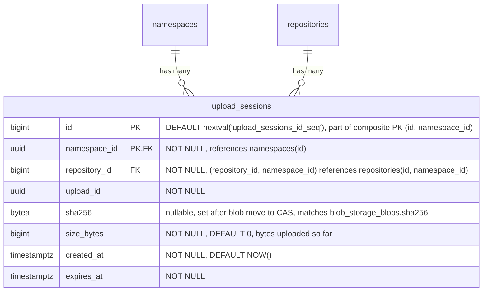

- **upload_sessions**: 進行中の各 blob アップロードを追跡します。このテーブルは、[コンテナレジストリのパターン](https://gitlab.com/gitlab-org/container-registry/-/blob/master/registry/storage/blobwriter.go) をミラーするバイナリ存在モデルに従います。行が存在すれば、アップロードは進行中かクリーンアップが必要であり、存在しなければ、アップロードは完了したかパージされています。完了時、アプリケーションは blob をコンテンツアドレス可能なストアへ移動し、`blob_storage_blobs` と `blob_storage_attachments` のレコードを作成するのと同じトランザクションでセッション行を削除します。`upload_id`（UUID）は、一時オブジェクトパス（`uploads/{upload_id}`）で使用されるストレージレベルの識別子です。`repository_id` は、アップロードを開始したリポジトリを記録します。後続のリクエスト（PATCH チャンク、PUT コミット、DELETE キャンセル）では、サーバーは URL 内のリポジトリが session.repository_id と一致することを検証し、upload_id が漏洩した場合のリポジトリ間での再利用を防ぎます。各リクエストの認可は、URL のリポジトリに対してリクエストミドルウェアによって行われ、このカラムには依存しません。複合 FK `(namespace_id, repository_id)` は、アップロードがターゲットリポジトリと同じ名前空間内にあることを強制します。`sha256` はアップロード中は NULL で、blob が最終的なコンテンツアドレス可能なパスへ移動された後に設定されます。これは（外部キーではなく）プレーンな値で、アプリケーションが blob を CAS へ移動した後・セッション行を削除する前にクラッシュするケースのクラッシュリカバリを扱います。`sha256 IS NOT NULL` は blob が既に移動済みで、残りのステップはクリーンアップを終えて行を削除することであることを示します。`size_bytes` は一時ストレージに書き込まれたバイト数を追跡します。再開可能なアップロードでは、各チャンクが到着するごとに更新され、クライアントに再開位置を伝える `Range` レスポンスヘッダーを生成するために使用されます（[OCI Distribution Spec](https://github.com/opencontainers/distribution-spec/blob/main/spec.md)）。モノリシックなアップロードでは、blob データが書き込まれた後に設定されます。`created_at` はアップロードが開始された時刻を記録します。これにより、アップロード期間のメトリクス（期間と blob サイズの相関）と、アプリケーションの TTL 設定が引き下げられた場合のさかのぼった期限切れ（`WHERE created_at < NOW() - :new_ttl`）が可能になります。既存のセッションは元の期限を保持するため、`expires_at` だけではこれをサポートできません。`expires_at` はセッションの期限タイムスタンプで、作成時にアップロードタイプに基づいて `NOW() + :configured_ttl` として計算されます（再開不可のアップロードでは短く、再開可能なアップロードでは長く）。期限切れのセッションはアップロードパージの候補です。パージャーは一時ストレージオブジェクトを削除し、行を削除します（[ADR-008](008_content_addressable_storage.md#temporary-object-cleanup)）。再開可能なアップロードのハッシュ状態は、コンテナレジストリのパターンに従い、データベースではなくオブジェクトストレージ内のアップロードデータとともに（`uploads/{upload_id}/hashstates/{algorithm}/{offset}`）保存されます（[ADR-008](008_content_addressable_storage.md#resumable-uploads-and-hash-state)）。スキーマ内の他のすべての `namespace_id` スコープのテーブルと一貫して、`HASH(namespace_id)` で64パーティションにパーティショニングされます。セッションは短命ですが、アップロードパージャーは延期されている（[ADR-011](011_data_reconciliation.md)）ため、それが出荷されるまで期限切れの行が蓄積します。初日からのパーティショニングは後のマイグレーションを回避し、`repositories` とのパーティション単位の結合の適格性を保ち、空のパーティションでは何のコストもかかりません。主キーは従来の `(id)` ではなく `(id, namespace_id)` です。PostgreSQL はハッシュパーティショニングされたテーブルのすべての一意制約にパーティションキーを含めることを要求し、この PK には既に UUIDv7 の `namespace_id` が含まれているため、これ以上の追加なしでデプロイメント間でグローバルに一意でもあります（`blob_storage_attachments` と `blob_storage_blobs` では、同じ保証のためにパーティションキーの上に `namespace_id` を追加する必要があったのとは対照的です）。

#### インデックス

- **`upload_sessions`**: `(namespace_id, upload_id)` に対する一意インデックス — 名前空間内でアップロード UUID によってセッションをルックアップします。`expires_at` に対するインデックス — アップロードパージのために期限切れのセッションを見つけます。`(namespace_id, repository_id)` に対するインデックス — 指定したリポジトリのすべてのセッションを見つけます。認可チェックとリポジトリ削除時のクリーンアップに使用されます。

#### クエリ例

- アップロードセッションを作成する

  ```sql
  INSERT INTO upload_sessions (namespace_id, repository_id, upload_id, expires_at)
  VALUES ('018f4d6f-0e10-7e3a-9bfd-23a4c5d6e7f8', 456, 'a0eebc99-9c0b-4ef8-bb6d-6bb9bd380a11', NOW() + INTERVAL '1 hour')
  RETURNING id, upload_id;
  ```

- チャンクアップロード中にセッションをルックアップする

  ```sql
  SELECT *
  FROM upload_sessions
  WHERE namespace_id = '018f4d6f-0e10-7e3a-9bfd-23a4c5d6e7f8' AND upload_id = 'a0eebc99-9c0b-4ef8-bb6d-6bb9bd380a11';
  ```

- blob の移動が成功した後に blob のダイジェストを記録する

  ```sql
  UPDATE upload_sessions
  SET sha256 = 'abcd1234...'::bytea, size_bytes = 1048576
  WHERE namespace_id = '018f4d6f-0e10-7e3a-9bfd-23a4c5d6e7f8' AND upload_id = 'a0eebc99-9c0b-4ef8-bb6d-6bb9bd380a11';
  ```

- アップロードパージのために期限切れのセッションを見つける

  ```sql
  SELECT id, namespace_id, upload_id
  FROM upload_sessions
  WHERE expires_at < NOW()
  ORDER BY expires_at
  LIMIT 100;
  ```

  このクエリはパーティションプルーニングされません。述語に `namespace_id` が含まれないため、64個すべてのパーティションをスキャンします。ここではそれが許容されます。パージャーは境界のあるバックグラウンドジョブ（`LIMIT 100`、`expires_at` のインデックスに支えられる）であり、ホットパスのクエリではないため、ファンアウトはパフォーマンス上重要ではありません。

- クリーンアップ後にセッションを削除する

  ```sql
  DELETE FROM upload_sessions
  WHERE namespace_id = '018f4d6f-0e10-7e3a-9bfd-23a4c5d6e7f8' AND id = 789;
  ```

### パーティショニングの不変条件

**`namespace_id` を含むすべてのテーブルはパーティショニングされます。** デフォルトのパーティションキーは `HASH(namespace_id)` で64パーティションです。特定のテーブルは、文書化された理由がある場合に異なるキーを使用することがあります（`HASH(sha256)` の例外については [blob ストレージのパーティショニング戦略](#blob-storage-partitioning-strategy) を参照）。`namespace_id` を含まないテーブルはパーティショニングされません。

このルールは、テーブルごとの判断ではなく行のプロパティとして述べられます。`namespace_id` がスキーマの一部であれば、そのテーブルはパーティショニングされます。「このテーブルは小さい」「このテーブルは親と 1:1 である」「後でパーティショニングを追加できる」といった除外規定はありません。小さなテーブルも大きなテーブルと同様にパーティショニングされます。均一性が要点です。低ボリュームのテーブルをパーティショニングするコストは無視できます（ほとんど空の64個の子、測定可能な実行時オーバーヘッドなし）が、後からパーティショニングを _追加する_ コストは、本番データが配置された後ではテーブルの書き換え、主キーの再形成、カスケードする外部キーの変更が支配的になります。

#### 機構上の帰結

PostgreSQL は、パーティショニングされたテーブルのすべての一意制約にパーティションキーを含めることを要求します。これがスキーマ全体の主キーと外部キーを形作ります。

- **主キー。** すべてのパーティショニングされたテーブルの主キーは `namespace_id` を吸収します。`(id)` は `(id, namespace_id)` になります。パーティショニングされたテーブルの一意インデックスは、先頭カラムとして `namespace_id` を含みます。
- **パーティショニングされたテーブル間の外部キー。** `namespace_id` に対して複合的になります。子は `(<parent>_id, namespace_id)` を介して親を参照し、これが親の `(id, namespace_id)` を参照します。このパターンは、`repositories`、`workspaces`、フォーマット固有のリポジトリテーブル、中間層テーブル、ファイルテーブル、リモートキャッシュテーブル全体で統一されています。
- **`namespaces` への外部キー。** 単一カラムです。`namespace_id` が `namespaces(id)` を参照します。`namespaces` は、主キーが `(id)` のままである唯一のテーブルです。これはパーティショニングされておらず、自身の `namespace_id` を持ちません（それを _定義する_ ものです）。そのため、子テーブルは複合 PK の小細工なしにこれを参照します。

複合外部キーの形状は、名前空間の境界をスキーマレベルでエンコードします。あらゆるパーティショニングされたテーブル内の行は、外部キーがそれを禁じるため、別の名前空間に属する別のパーティショニングされたテーブル内の行を参照できません。これは、Cells のシャーディングキー（`namespace_id`）がアプリケーションレベルで引くのと同じ境界であり、データベース自体の中で冗長化されています。

#### 例外

テーブルがパーティショニングされないのは、`namespace_id` を欠く場合だけです。今日の主要な例は `namespaces` 自体です。これは `namespace_id` がわかる前に `slug` から解決されるルーティングのルートであり、`namespace_id` カラムを持ちません（それを定義します）。`namespace_id` を持たない将来のテーブル（例: インスタンス全体の構成、グローバルな cron 状態、デプロイメントスコープのライフサイクルメタデータ）は、このデフォルトを自動的に継承し、パーティショニングされません。

例外の述語は構造的です。行内の `namespace_id` の有無です。これは、行数、書き込み頻度、現在のアクセスパターンには依存せず、それらはすべてシステムの進化とともに変わり得ます。

シングルテナントのデプロイメント（Dedicated、Self-Managed、単一組織の Cells）も例外ではありません。これらは64個すべてのパーティションを保持し、1つが投入され63個が空です。空のパーティションはこの規模では無視できます（それぞれ数 KB のカタログとインデックスのオーバーヘッド）。パーティションプルーニングは影響を受けず、デプロイメント間のスキーマの均一性はシングルテナントのバリアントを切り出すよりも価値があります。「1つのパーティションがすべてを保持する」という病的なケースは、フルのマルチテナント規模の `blob_storage_blobs` / `blob_storage_attachments` にのみ当てはまります。だからこそ、それら2つのテーブルは代わりに `HASH(sha256)` を使用します。詳細は [blob ストレージのパーティショニング戦略](#blob-storage-partitioning-strategy) を参照してください。

### Blob ストレージのパーティショニング戦略

[Consequences](#negative) で述べたように、`blob_storage_blobs` と `blob_storage_attachments` は、すべての組織にまたがるすべてのアーティファクトフォーマットを処理するため、非常に高い行数を蓄積します。意図的なパーティショニング戦略がなければ、これは次につながります。

- テーブルが数十億行に成長するにつれての、インデックスの肥大化とクエリパフォーマンスの低下。
- すべてのアーティファクトタイプを同時にブロックする、テーブル全体のロック（例: インデックス作成やスキーママイグレーション中）。
- 高い書き込みレートでの autovacuum の競合。

念頭に置くべき重要な制約: PostgreSQL は、パーティショニングされたテーブルのすべての一意制約にパーティションキーを含めることを要求します。`blob_storage_blobs` では、重複排除の制約は `UNIQUE (namespace_id, sha256)` です。パーティションキーがこれらのカラムのサブセットでない戦略はいずれも、その制約に追加のカラムを強制することになります。それは、異なるパーティションにまたがって同じ組織内に同じ blob が2回保存されるのを防げなくなり、重複排除モデルを完全に損なうことになります。

以下に候補となる戦略を示します。

#### オプション A: `sha256` によるハッシュパーティショニング

両方のテーブルを `PARTITION BY HASH (sha256)` で64パーティションにパーティショニングします。

`sha256` はコンテンツアドレス可能なダイジェストであるため、その値は本質的に均一に分布します。データの均等な分布のために追加の労力は不要です。これはシングルテナントの問題を解決します。シングルテナントのデプロイメント（Dedicated、Self-Managed、単一組織の Cells）は、`namespace_id` だけを使用すると、すべての行を単一のパーティションに集中させます。`sha256` をパーティションキーとすると、組織がいくつ存在するかにかかわらず、行は64個すべてのパーティションに均等に広がります。

`[namespace_id, sha256]` に対する既存の一意制約は既に `sha256` を含んでいるため、このスキームと互換性があります。パーティションキーが制約の一部であるため、PostgreSQL はハッシュパーティション間で一意性を強制できます。

このアプローチでは、`blob_storage_blobs` への結合が単一のパーティションをターゲットにできるよう、`sha256` を `blob_storage_attachments` とフォーマット固有のテーブル（`*_files`、`container_blobs`、`container_manifests`、キャッシュエントリ）に伝播させる必要があります。これは、blob 識別子（`namespace_id` + `sha256`）が `*_files` と `blob_storage_attachments` の両方の行に保存されることを意味し、単純な `bigint` 外部キーよりも多くの物理ストレージを使用します（`sha256` は `bytea` として32バイトで、`bigint` の8バイトに対してより大きい）。しかし、このトレードオフは正当化されます。読み取りパス（アーティファクトのプル）— システム内で最もホットなクエリ — は、`*_files` から `blob_storage_blobs` へ `(namespace_id, sha256)` を介して直接結合でき、`blob_storage_attachments` を完全にスキップして1つの結合を排除します。アタッチメントは、[クリーンアップ](#cleanup-tasks) 中に「この blob はまだ誰かに使用されているか」に答えるライフサイクルパスには依然として必要です。

5つの重要なアクセスパターンは次のように動作します。

| # | 操作 | 頻度 | ヒットするパーティション |
|---|-----------|-----------|----------------|
| AP1 | アーティファクトのプル（`*_files` → `blob_storage_blobs`、`namespace_id` + `sha256` 経由） | 最高 | 1 |
| AP2 | 孤立チェック（`WHERE namespace_id = ? AND sha256 = ?`） | 高 | 1 |
| AP3 | 重複排除アップサート（`ON CONFLICT (namespace_id, sha256) DO NOTHING`） | 中〜高 | 1 |
| AP4 | アタッチメント CRUD（blob から伝播された `namespace_id` + `sha256`） | 中 | 1 |
| AP5 | 組織別のストレージ会計（`WHERE namespace_id = ?`、`sha256` なし） | 低 | 64個すべて（緩和済み） |

**Positive**:

- テナントの集中にかかわらず均一な分布: シングルテナントのデプロイメントは、1つに集中させる代わりに64個すべてのパーティションにデータを広げます。
- すべての高頻度アクセスパターン（プル、孤立チェック、重複排除アップサート、アタッチメント CRUD）が正確に1つのパーティションにヒットします。
- 一意制約 `(namespace_id, sha256)` はパーティションキーを含みます。重複排除アップサートは単一のパーティションをターゲットにし、外部ロックなしで `ON CONFLICT DO NOTHING` を介して並行アップロードを解決します。
- 読み取りパス（アーティファクトのプル）は `blob_storage_attachments` の結合を完全にスキップし、`*_files` から `blob_storage_blobs` へ `(namespace_id, sha256)` を介して直接行きます。

**Negative**:

- `sha256` をより多くのテーブルに伝播させる必要があります。`blob_storage_attachments` とフォーマット固有のテーブル（`*_files`、`container_blobs`、`container_manifests`、キャッシュエントリ）が、`blob_storage_attachment_id` 外部キーに加えて `(namespace_id, sha256)` を保持します。これは行をまたいで blob 識別子を複製し、行ごとのストレージを増やします。
- `namespace_id` のみ（`sha256` なし）のクエリはパーティションをプルーニングできず、64個すべてをスキャンします。主なケースはストレージ会計（組織ごとに blob サイズを合計する）です。これは、blob の挿入／削除時に遅延インクリメントを介して更新される専用のロールアップテーブルによって緩和されます。これは GitLab で既に確立されたパターンです（例: プロジェクト統計）。ロールアップテーブルがなくても、64パーティションにまたがる並列集計は数秒で完了します。

#### オプション B: `namespace_id` によるハッシュパーティショニング

両方のテーブルを `PARTITION BY HASH (namespace_id)` で固定数のパーティションにパーティショニングします。

すべての一般的なアクセスパターンは既に `WHERE` 句に `namespace_id` を含むため、クエリプランナーはすべての操作で単一のパーティションをターゲットにできます。Cells のシャーディングキー（`namespace_id`）がパーティションキーを兼ね、これはより広範なアーキテクチャと一貫しています。

`[namespace_id, sha256]` に対する一意制約は既に `namespace_id` を含むため、このスキームと変更なしで互換性があります。PostgreSQL はすべてのハッシュパーティションにまたがってグローバルに一意性を強制します。

**Positive**:

- すべての組織スコープのクエリが単一のパーティションにヒットします。クエリプランナーは他のすべてを自動的にプルーニングします。
- パーティションプルーニングがクリーンアップパスに直接適用されます。`blob_storage_attachments` の孤立チェック（`WHERE namespace_id = ? AND sha256 = ?`）は単一のパーティションをターゲットにすることが保証され、ルックアップコストを総テーブル容量ではなくパーティションサイズで境界づけます。
- スキーマ変更とロックが単一のパーティションにスコープされ、他の組織への影響を軽減します。
- Cells のシャーディングキーと整合します。一般的なアクセスパターンにパーティション間の作業はありません。
- `[namespace_id, sha256]` に対する既存の制約が変更なしで正しく機能します。

**Negative**:

- 組織のサイズが大きく異なる場合、blob 数が非常に多い組織がそのハッシュパーティションを支配する可能性があります。シングルテナントのデプロイメント（Dedicated、Self-Managed、単一組織の Cells）では、すべての行が単一のパーティションに集中し、VACUUM に数時間かかり、インデックスは数百 GB に達します。
- `WHERE` 句から `namespace_id` を省略するクエリは、すべてのパーティションをスキャンします。

#### オプション C: `id`（主キー）によるレンジパーティショニング

両方のテーブルを、自動インクリメントする主キーの範囲でパーティショニングします。これは GitLab の既存の [テーブルパーティショニングフレームワーク](https://docs.gitlab.com/ee/development/database/table_partitioning.html) が使用するアプローチであり、既存のツールによって十分にサポートされています。

**Positive**:

- パーティションサイズが予測可能に増加します。データが蓄積するにつれて新しいパーティションを簡単に追加できます。
- GitLab の既存のパーティション管理インフラストラクチャと互換性があります。

**Negative**:

- 重複排除の一意性を壊します。PostgreSQL は、パーティショニングされたテーブルのすべての一意制約に `id` を含めることを要求します。`[namespace_id, sha256]` に `id` を追加すると、同じ組織の同じ sha256 が複数のパーティションに現れる可能性があり、重複排除モデルが完全に壊れます。
- クエリは組織スコープですが、パーティションは id の範囲ベースであるため、すべての組織スコープのクエリが複数のパーティションにまたがります。
- ロックスコープの削減が組織の境界と整合しません。

#### オプション D: `created_at` によるレンジパーティショニング

両方のテーブルを時間範囲（例: 月次または四半期のウィンドウ）でパーティショニングします。

**Positive**:

- blob がクリーンアップされた後に、古いパーティションのアーカイブまたは破棄が容易です。
- パーティションが既知の時間ウィンドウに対応し、これは明快な運用モデルです。

**Negative**:

- ホットパーティションの問題: すべての書き込みが最新のパーティションをターゲットにし、書き込みの競合を集中させます。
- blob は経過時間ではなく、すべてのアタッチメントを失ったときに期限切れになります。時間ベースのパーティショニングは実際の blob のライフサイクルと整合しません。
- Option C と同じ一意制約の問題: `created_at` を一意制約に追加する必要があり、パーティション間の重複排除を壊します。
- アクセスパターンは時間スコープではなく組織スコープであるため、クエリがすべてのパーティションにまたがります。

#### オプション E: パーティショニングなし

主要なスケーラビリティのメカニズムとして、Cells レベルのシャーディング（`namespace_id`）と標準のインデックスに依存します。パーティショニングは、メトリクスが必要性を示すまで延期します。

**Positive**:

- スキーマと運用がシンプル: パーティション管理のオーバーヘッドなし。マイグレーションとスキーマ変更が容易です。
- 初期の規模では十分: 単一の Cell 内で行数が管理可能なうちはうまく機能します。

**Negative**:

- Cell 内での無制限の成長: テーブルが成長するにつれて、テーブルレベルのロックがすべての組織に同時に影響します。
- よく設計されたインデックスでさえ、非常に高い行数ではパフォーマンスの圧迫に直面します。

#### 決定

**`sha256` によるハッシュパーティショニング（Option A）が選択されます**。`blob_storage_blobs` と `blob_storage_attachments` の両方に対してです。

これは、次のことを満たす唯一のオプションです。

1. すべての高頻度アクセスパターン（アーティファクトのプル、孤立チェック、重複排除アップサート、アタッチメント CRUD）を単一のパーティション内に保ちます。
2. テナントの集中にかかわらず行を均一に分布させます。これは、`namespace_id` ベースのパーティショニングがすべての行を1つのパーティションに集中させてしまうシングルテナントのデプロイメント（Dedicated、Self-Managed、単一組織の Cells）にとって重要です。
3. `[namespace_id, sha256]` に対する既存の一意制約と変更なしで互換性があり、`ON CONFLICT (namespace_id, sha256) DO NOTHING` を介して競合のない重複排除アップサートを可能にします。

両方のテーブルに対して、初期値として64パーティションが選択されます。これは、運用オーバーヘッドを管理可能に保ちつつ、十分な分布とロックの分離を提供します。

トレードオフは、`sha256` を `blob_storage_attachments` とフォーマット固有のテーブル（`*_files`、`container_blobs`、`container_manifests`、キャッシュエントリ）に伝播させる必要があることです。これは行をまたいで blob 識別子（`namespace_id` + `sha256`）を複製し、`bigint` 外部キー単独よりも多くの物理ストレージを使用します。その利点は、読み取りパス — システム内で最もホットなクエリ — が `*_files` から `blob_storage_blobs` へ `(namespace_id, sha256)` を介して直接結合し、`blob_storage_attachments` を完全にスキップして1つの結合を排除することです。アタッチメントは [クリーンアップのライフサイクルパス](#cleanup-tasks) にのみ残ります。

`namespace_id` のみ（`sha256` なし）のクエリ、例えば組織レベルのストレージ会計は、パーティションをプルーニングできず64個すべてをスキャンします。これは、遅延インクリメントを介して更新される専用のロールアップテーブルによって緩和されます。これは GitLab で既に確立されたパターンです（例: プロジェクト統計）。

### フォーマット固有テーブルのパーティショニング戦略

フォーマット固有のテーブル — ローカルコンテンツテーブルとそのリモートの対応物 — は、[パーティショニングの不変条件](#partitioning-invariant) によって確立された `HASH(namespace_id)` のデフォルトに従います。各テーブルの箇条書きがそれを明示的に記録します。ローカルとリモートが1つの戦略を共有するのは、同じアクセス形状を共有するためです。すべての主要なアクセスパターンが `namespace_id` スコープです。テーブルごとの違い（キャッシュ TTL、upstream メタデータ）はパーティショニングと直交し、テーブルごとの説明に存在します。

このグループに固有の根拠:

- すべての主要なアクセスパターンが `namespace_id` スコープです — リポジトリとアーティファクト座標によるルックアップ、パッケージやイメージのファイルの一覧表示、upstream のキャッシュされたエントリの一覧表示 — そのため、`HASH(namespace_id)` はすべての操作で単一パーティションのプルーニングを与えます。読み取りパスのショートカット（`*_files` → `blob_storage_blobs`、`(namespace_id, sha256)` 経由で `blob_storage_attachments` をスキップ）— システム内で最もホットなクエリ — はこのパーティショニングから直接恩恵を受けます。
- `blob_storage_blobs` を `HASH(sha256)` に駆り立てるシングルテナントの集中の懸念は当てはまりません。各フォーマット固有のテーブルは1つのフォーマット（リモートの場合は1つの upstream）にスコープされるため、その名前空間ごとのフットプリントは、構造的に `blob_storage_blobs` が保持するフォーマット横断の集約のほんの一部です。
- `(namespace_id, blob_sha256)` を介した `blob_storage_blobs` への結合はパーティション間スキャンになりません。プランナーは `namespace_id` でフォーマットテーブルのパーティションを、`sha256` で blob のパーティションを、それぞれ独立してプルーニングします。

### パーティション数の根拠

すべての `HASH(namespace_id)` テーブルは64パーティションを使用し、`blob_storage_blobs` と `blob_storage_attachments`（`HASH(sha256)`）に選ばれた64パーティションと一致します。このカウントは、既存の Container Registry と Package Registry のデータベースの本番データに基づいています。

パーティションカウントは、最大の予想テーブル（`container_blobs`）によって駆動され、その本番アナログは既に同等の規模で64パーティションを使用しています。他のフォーマット固有のテーブルは大幅に小さいため、64パーティションはそれらすべてにとって快適です。

この決定の重要な要因:

- **スキュー耐性**: `HASH(namespace_id)` は均一な分布を保証しません。名前空間のサイズは大きく偏っており、少数の大きな名前空間が不釣り合いな割合の行を保持します。パーティションが少ないと、同じパーティションにハッシュされる大きな名前空間が不均衡を増幅します。64パーティションでは、最悪のスキューでもパーティションサイズは管理可能に保たれます。
- **アンダーパーティショニングは修正が高くつく**: 後でパーティションカウントを変更するには、完全なテーブルの再構築が必要です。小さなテーブルのオーバーパーティショニングのオーバーヘッドは無視できますが、大きなテーブルのアンダーパーティショニングは実際の運用上のリスクを生みます。
- **パーティション単位の結合**: PostgreSQL は、同じパーティションスキーム（同じキー、同じ方法、同じカウント）を共有するテーブル間の JOIN を、一致するパーティションを直接結合することで最適化できます。すべての `HASH(namespace_id)` テーブルが64パーティションを使用するため、この最適化が利用可能です。実際には、クエリは既に `namespace_id = ?` を含むため、プランナーは各側で1つのパーティションにプルーニングしますが、パーティション単位の結合は無料の最適化として残ります。
- **運用の一貫性**: すべての `namespace_id` パーティショニングされたテーブルで単一のパーティションカウントを使うことは、指定した `namespace_id` のすべてのテーブルが同じパーティション番号にハッシュされることを意味し、メンテナンススクリプト、モニタリング、一括操作を簡素化します。

どのテーブルがパーティショニングされるかは、ここで列挙するのではなく [パーティショニングの不変条件](#partitioning-invariant) によって決まります。

### バッファ書き込みと非同期書き込み

いくつかのカラムは、すべてのダウンロードまたはアップロードのリクエストで更新されます。`repositories` のカウンターカラム（`artifacts_count`、`downloads_count`、`size_bytes`）、エンティティ数の制限チェックに使用される `npm_packages` のパッケージごとのカウンター（`versions_count`、`tags_count`）、および `container_images`、`maven_packages`、`maven_versions`、`npm_packages`、`npm_versions` の `last_downloaded_at` タイムスタンプです。これらをリクエストパス上で直接書き込むと、同じ行に対する並行リクエストがシリアライズされ（人気のあるパッケージでのホット行の競合）、リクエストのレイテンシがデータベースの書き込みスループットに結合されます。

これを避けるため、これらのカラムはバッファ書き込み／非同期書き込みを介して維持されます。リクエストハンドラーは更新を高速な中間ストア（例: Redis）に記録し、バックグラウンドプロセスが定期的にバッファされたエントリを行へマージし戻します。これは GitLab の `ProjectStatistics` と同じパターンを再利用します。

この方法で維持されるカラムは、スキーマ図で `buffered` とフラグ付けされています。

#### マージのセマンティクス

マージ戦略はカラムタイプに依存します。

- **カウンター**（`artifacts_count`、`downloads_count`、`size_bytes`、`versions_count`、`tags_count`）: バッファされたデルタを既存の値に合計します。すべてのインクリメントを保持しなければなりません。インクリメントを失うと、恒久的なカウント不足を引き起こします。エンティティ数の制限チェック（`versions_count`、`tags_count`）では、境界での小さな上限超過は許容されます。制限は製品の上限であり（データ整合性のルールではなく）、ドリフトはバッファウィンドウによって境界づけられ、次のフラッシュで再同期します。重複するバージョン名は、カウンターにかかわらず、`npm_versions` と `npm_tags` の一意インデックスによって別途ブロックされます。
- **タイムスタンプ**（`last_downloaded_at`）: バッファされた値と既存の値の最大値を取ります（最新が勝ちます）。最も新しいダウンロード時刻だけが重要で、中間の値は破棄できます。

両方の戦略は同じバッファリングインフラストラクチャを共有し、書き込み前にバッファされたエントリがどのように削減されるかだけが異なります。

#### トレードオフ

- **古さ**: バッファされたカラムは、最大で1フラッシュ間隔だけ現実より遅れます。これは現在のコンシューマーにとって許容されます。ライフサイクルルールの評価（`keep_last_downloaded_at`）はフラッシュ間隔を大きく上回るスケジュールで実行され、ランディングページのカウンターは短期間の乖離を許容します。これは、自身の書き込みを同期的に観測しなければならない読み取りや、ダウンロードイベントの正確な順序を必要とする決定には適して _いません_。
- **バッファの損失**: フラッシュ前にバッファが失われると、最近の更新が削除されます。カウンターの場合これは恒久的なカウント不足です。タイムスタンプの場合、次のダウンロードが正しい（ただしわずかに遅れた）値を復元します。

### 名前空間 ID の型

`namespaces.id` カラムの型は、スキーマ全体にカスケードします。すべてのパーティショニングされたテーブルがシャーディングキーとして `namespace_id` を持ち、それらのテーブルのほぼすべての複合主キー、外部キー、複合インデックスが、このカラムを先頭要素として含みます。後で型を変更するには、すべてのパーティショニングされたテーブルとすべての物理的な子リレーションにまたがる多段階のマイグレーションが必要であり、スキーマが本番データを持つと実質的に不可逆な決定です。

3つのプロパティが選択を駆動します。

1. **デプロイメントモデル間のグローバルな一意性。** Artifact Registry は、複数の独立したデプロイメントとして実行されるように設計されています。GitLab.com、Dedicated、Self-Managed、Cell ごと、そして潜在的に GitLab Rails から独立したスタンドアロン製品として（[ADR-022](022_namespace_decoupling.md#consequences) を参照）。ローカルシーケンスから引き出される連続した整数 ID はデプロイメント間で衝突し、名前空間の行が Artifact Registry インスタンス間を移動するシナリオ（MVP 後の移行ツール、Cell の統合、デプロイメント間の参照）を妨げます。
2. **運用上のデバッグ容易性。** `namespace_id = 42` はデプロイメント間で曖昧です。同じ整数が、異なる Cell やインストールの無関係な名前空間を指すことがあります。サポートチケット、インシデントの runbook、デプロイメント間のログ相関は、識別子が一目で一意であるときに恩恵を受けます。
3. **ID 生成のための調整依存なし。** デプロイメント間で重複しない bigint 範囲を割り当てるには、中央の権威（Topology サービスまたは同等のもの）が必要です。UUIDv7 は調整なしでデータベース上でローカルに生成されます。

#### オプション

##### オプション A: UUIDv7

`namespaces.id` は、UUIDv7 の値（[RFC 9562](https://datatracker.ietf.org/doc/rfc9562/)）で投入される `uuid` です。スキーマ全体のすべての `namespace_id` カラムは `uuid` です。生成は、データベース側（PG18 ネイティブの `uuidv7()`、または PG13〜17 での [`pg_uuidv7`](https://pgxn.org/dist/pg_uuidv7/) 拡張）でも、RFC 9562 準拠のライブラリを使ったアプリケーション側でも行えます。いずれの場合もカラム型は同じで、データを書き換えることなく後でパスを変更できます。完全なマトリックスについては以下の Decision セクションを参照してください。

**Positive**:

- すべての Artifact Registry デプロイメントにまたがって構造的にグローバルに一意です。調整も、中央のアロケーターも、範囲管理もありません。何千ものデプロイメントが同時に生成しても、衝突は暗号学的にあり得ないほど稀です。
- 時間順: 新しい ID は、各パーティション内の B-tree の右端に追加されます。[credativ による PG18、100万行の比較](https://www.credativ.de/en/blog/postgresql-en/a-deeper-look-at-old-uuidv4-vs-new-uuidv7-in-postgresql-18/) では、UUIDv7 の主キーインデックスは約90%のリーフ密度（bigint シーケンスも達成するデフォルトの `fillfactor`）と約0%の断片化を達成したのに対し、同じワークロードでの UUIDv4 は約71%のリーフ密度と約50%の断片化でした。
- WAL のボリュームは UUIDv4 よりも bigint にはるかに近いです。UUIDv7 のシーケンシャル挿入の局所性は、ランダムな UUID が被るフルページ書き込みの増幅を回避します。挿入スループットは、現実的な複数カラムのスキーマでは bigint と数パーセント以内で一致します（[kkm-mako、PG18、100万行・13カラムの e コマーステーブル: bigint 76.5秒 vs UUIDv7 77.0秒](https://kkm-mako.com/en/blog/articles/uuid-v4-v7-bigint-primary-key-design/)、[Ardent Performance、PG17-dev、10並行クライアントの2000万行テーブル: bigint 3,480 tps vs UUIDv7 3,420 tps](https://ardentperf.com/2024/02/03/uuid-benchmark-war/)）。素の2カラムのトイスキーマでは、差はより顕著です。[kkm-mako の最小スキーマ](https://kkm-mako.com/en/blog/articles/uuid-v4-v7-bigint-primary-key-design/) は同じ行数で bigint 1.63秒 vs UUIDv7 2.16秒（約32%遅い）を測定しました。これは、より幅広い ID カラムが行のより大きな割合を占めるためです。絶対的な数値はワークロードに依存します。
- 埋め込まれたミリ秒のタイムスタンプにより、ID は BRIN フレンドリーで、診断のために簡単に抽出できます。
- Artifact Registry が実行され得るすべての PostgreSQL バージョンで利用可能です。PG18 は `uuidv7()` をネイティブで提供します（2025年9月）。PG13〜17 では [`pg_uuidv7` 拡張](https://pgxn.org/dist/pg_uuidv7/BENCHMARKS.html) が、公開されているベンチマークによればネイティブに対して<2%のオーバーヘッドで `uuid_generate_v7()` を提供します。そして、どのバージョンも RFC 9562 準拠のライブラリでのアプリケーション側生成をサポートします。
- デプロイメント間の名前空間のポータビリティを構造的に可能にします。MVP 後の移行ツール（[ADR-011](011_data_reconciliation.md)）、Cell の統合、[ADR-022](022_namespace_decoupling.md) のスタンドアロン製品パスは、すべての関連行の `namespace_id` を書き換えることなく、Artifact Registry インスタンス間で名前空間の行を移動します。

**Negative**:

- ストレージ: 値あたり16バイトで、bigint の8バイトに対して。`namespace_id` は、パーティショニングされたテーブルのほぼすべての複合インデックスの先頭カラムであるため、この幅の拡大はすべての物理的な子リレーションにまたがって複合的に影響します。[Jamauriceholt による PG 15.4 での2000万行の外部キーインデックスのベンチマーク](https://medium.com/@jamauriceholt.com/uuid-v7-vs-bigserial-i-ran-the-benchmarks-so-you-dont-have-to-44d97be6268c) は、UUIDv7 で 847 MB、BIGSERIAL で 423 MB（約2倍）を測定し、1万行の一括挿入で 1,847 のバッファ書き込みページ vs 847（約2.2倍）を測定しました。エントリごとの幅の拡大は、インデックスタプルの約20バイトのうち約8バイト（約40%）です。観測される総インデックスサイズは、インデックスのうちキーが占める割合と固定オーバーヘッドが占める割合に応じて、そのエントリごとの下限から約2倍までの範囲です。Artifact Registry のマルチ TB のメタデータ規模では、これは現実的だが境界のあるコストであり、テーブル全体ではなく `namespace_id` 先頭のインデックスに集中します。
- キー幅に実質的に依存するクエリの読み取りレイテンシは、bigint よりも測定可能なほど遅くなり得ます。[合成的な500万ユーザー / 2000万注文 / 5000万監査ログのスキーマ（Jamauriceholt）](https://medium.com/@jamauriceholt.com/uuid-v7-vs-bigserial-i-ran-the-benchmarks-so-you-dont-have-to-44d97be6268c) では、一対多の JOIN が約26倍遅く、単一行ルックアップが約15倍遅く、範囲／ページネーションが約16倍遅くなりました（UUIDv7 が BIGSERIAL に対して）。これらの数値は最悪ケースの合成クエリを反映しており、このスキーマに外挿すべきではありません。すべてのホットパスは、複合キーに対する単一パーティションの `namespace_id = ?` インデックスルックアップです。それらの条件下では、オーバーヘッドは上記のページごとのバイトコストによって境界づけられ、クエリ形状のコストへ増幅しません。レビュアーがより強力な経験的下限を望む場合、PG18 上の代表的な行幅でのパーティションローカルなインデックスルックアップのベンチマークが、マージ前に委託すべき適切なものです。
- 時間順序は、`HASH(namespace_id)` テーブルでのパーティションプルーニングを可能にしません。ハッシュ化は、タイムスタンプコンポーネントにかかわらず値をパーティション間に散らばらせます。パーティション内の B-tree の局所性は保たれ、bigint シーケンスもより低いストレージコストでそれを提供します。UUIDv7 のパーティションプルーニングの利点は `RANGE(uuid)` スキームにのみ適用され、ここでは使用されません。
- クライアントライブラリ、管理ツール、API レスポンスは、整数ではなく36文字の文字列をレンダリングします。軽微ですが広範です。`namespace_id` を持つあらゆるエンドポイントで JSON レスポンスのサイズが大きくなります。

##### オプション B: 調整されたレンジ割り当てを伴う bigint

`namespaces.id` は `bigint DEFAULT nextval('namespaces_id_seq')` のままです。各 Artifact Registry デプロイメントには、Topology サービスによって重複しない bigint 範囲（例: デプロイメント X: 1 から 10^12、デプロイメント Y: 10^12+1 から 2×10^12）がプロビジョニングされます。Artifact Registry は、スラッグの要求のために既に Topology サービスに依存しています（[ADR-022](022_namespace_decoupling.md#cells-routing) を参照）。

**Positive**:

- 現在のドラフトに対してストレージの差分がゼロです。考慮すべきインデックス、WAL、JOIN のコストがありません。
- 既存の依存を再利用します。Topology サービスはスラッグの要求のために既に必要です。
- ID 生成はシーケンスの `nextval` のままです。簡単で高速で、拡張は不要です。
- Cells 全体で調整された bigint シーケンスという GitLab Rails の確立されたパターンと一致します（[Cells 開発ガイドライン](https://docs.gitlab.com/development/cells/)）。

**Negative**:

- デプロイメント間の名前空間のポータビリティが構造的にサポートされません。デプロイメント X から Y へ名前空間を移動するには、Y の割り当てられた範囲がソース ID を含まない場合、依然としてすべての行の `namespace_id` を書き換える必要があります。
- 範囲の割り当ては、新しい Artifact Registry デプロイメントごとにブートストラップ手順を追加し、範囲のサイズと回収のためのガバナンスモデルを追加します。範囲を重複させてしまう誤割り当ては、早期に検出しにくいグローバルな一意性の違反です。
- デプロイメント間のポータビリティをサポートするという後の決定は、この ADR が回避しようとしている bigint から UUID への完全なマイグレーションを必要とします。

##### オプション C: Snowflake 方式でパックした bigint

アプリケーション側で64ビットをビットパックします。デプロイメント ID（14ビット、16K デプロイメント）+ タイムスタンプ（41ビット、エポックから69年）+ バックエンドごとのシーケンス（9ビット、512 ID/ms/バックエンド）。Go サービスで小さなライブラリを使って生成されます。

**Positive**:

- bigint に対してストレージの差分がゼロです。同じインデックス、WAL、JOIN のプロファイルです。
- 自己識別的: デプロイメントの起源は任意の `namespace_id` から抽出できます。
- UUIDv7 と同様に時間順で、同じパーティション内の B-tree 局所性の利点を与えます。
- 拡張依存なし。ID 生成はわずかなビット演算です。

**Negative**:

- PostgreSQL のプリミティブではなく、Go サービスで維持されるカスタムジェネレーターです。すべての書き込み側が同じライブラリバージョンとクロックソースを使用しなければなりません。
- クロックスキューに敏感: デプロイメントごとのカウンターは、クロックの巻き戻しとバーストトラフィックを乗り切らなければなりません。単調なクロックの規律と、ミリ秒内のシーケンスカウンターの慎重な扱いが必要です。
- 業界で広く使用されています（Twitter、Discord、Instagram の 41+13+10 バリアント）が、PostgreSQL ネイティブのパターンではありません。ツール、監査可能性、チーム間の親しみやすさは、UUID よりも弱いです。
- ビットフィールドの分割は一度きりの設計決定です。デプロイメントビットが少なすぎたり、タイムスタンプ範囲が狭すぎたりすると、後で変更するのが難しくなります。
- デプロイメント間の移行を解決しません。デプロイメント X で生成された ID は X の14ビットの接頭辞を永遠に持つため、名前空間をデプロイメント Y へ移すことは依然として、書き換えか、起源について嘘をつく ID のいずれかを意味します。

#### 決定

**Option A（UUIDv7）が選択されます**。`namespaces.id` に対して、そして結果として、スキーマ全体のすべての `namespace_id` カラムに対してです。他のすべての `id` カラム（`repositories.id`、`container_images.id`、`maven_packages.id` など）は `bigint DEFAULT nextval('<table>_id_seq')` です。それらの一意性は単一の Artifact Registry データベース内で保たれればよく、そのストレージフットプリントは数十億行にまたがって重大で、デプロイメント間の識別子として現れることはありません。しかし、デプロイメント間の名前空間移行（[ADR-022](022_namespace_decoupling.md)）は依然として行をソースデプロイメントの `id` 値で再挿入する必要があり、これは明示的なシーケンスのデフォルトでは簡単ですが、`GENERATED ALWAYS AS IDENTITY` のもとではすべての挿入で `OVERRIDING SYSTEM VALUE` を要するでしょう。

決定的な要因:

1. **名前空間がポータビリティの単位である。** Artifact Registry の識別子がデプロイメント間の移動を生き延びなければならないとすれば、それは `namespace_id` です。名前空間より下のすべてはそれとともに移動します。名前空間より上のすべては、不変のスラッグとアンカータプルを通じて表現されます（[ADR-022](022_namespace_decoupling.md)）。
2. **コストは集中していて境界がある。** `namespace_id` を8バイトから16バイトに広げることは、多くのインデックスの先頭カラムに影響しますが、総ストレージを倍にはしません。大きなパーティショニングされたテーブルの行幅は他のカラム（リポジトリ／イメージ／マニフェストの ID、タイムスタンプ、カウンター、32バイトの `bytea` ダイジェスト）が支配的です。予備的なサイジングは、影響を総メタデータストレージの数十パーセントとしており、Artifact Registry のキャパシティの範囲内です。
3. **利点は増分的ではなく構造的である。** デプロイメント間の移動に触れるすべての MVP 後の機能（[ADR-011](011_data_reconciliation.md) の移行ツール、Cell の統合、[ADR-022](022_namespace_decoupling.md) のスタンドアロン製品パッケージング）は、`namespace_id` が構造的にグローバルに一意であるときに意味のある形で簡素化され、アロケーターの不在が調整依存を取り除きます。
4. **ストレージコストは一度きり、挿入時に、まだ空のスキーマで支払われる。** Option B は、デプロイメントモデルが後でグローバルな一意性を要求した場合、すべてのパーティショニングされたテーブルにまたがる不可逆なマイグレーションを必要とします。後の無制限なマイグレーションリスクを避けるため、今日、既知の境界のあるコストを受け入れます。
5. **UUIDv7 はホットパスのパフォーマンスプロファイルを保つ。** 単一パーティションの `namespace_id = ?` ルックアップは単一パーティションのままです。bigint が提供するパーティション内の B-tree 局所性は、UUIDv7 の時間順の接頭辞によっても提供されます。失われる唯一のプロパティ（UUID 範囲によるパーティションプルーニング、8バイトのインデックス先頭カラム）は、`HASH` パーティショニングに適用できないか、コストが境界づけられています。

**Implementation notes**:

- 実行可能な生成パスは3つ存在します。選択は、デプロイメント時に利用可能な PostgreSQL バージョンに依存し、カラム型とは独立です。
  - **PG18+ ネイティブ**: カラムのデフォルト `DEFAULT uuidv7()`。拡張は不要です。
  - **[`pg_uuidv7`](https://pgxn.org/dist/pg_uuidv7/) 拡張を伴う PG13〜17**: カラムのデフォルト `DEFAULT uuid_generate_v7()`。ネイティブパスとの関数名の違いに注意してください。マイグレーションとスキーマダンプは、ターゲット環境に応じた正しい名前を参照しなければなりません。
  - **アプリケーション側生成**: 任意の PostgreSQL バージョン、拡張不要。Go サービスが [RFC 9562](https://datatracker.ietf.org/doc/rfc9562/) 準拠のライブラリで値を生成し、`INSERT` で供給します。
- これらのパスを後で切り替えることはメタデータのみ（`ALTER COLUMN SET DEFAULT`）であり、すべてのジェネレーターが RFC 9562 準拠の UUIDv7 値を発行する限り、データを書き換えません。これにより、初期パスはスキーマのコミットメントではなく、ランタイム／運用上の選択になります。
- **未解決の問い（GA に近づいたら解決）**: どの初期パスを取るかは、GA 時に `.com`、Dedicated、Self-Managed 全体で利用可能な PostgreSQL バージョンに依存します。PG18 がすべてのインストールタイプで保証できない場合、アプリケーション側生成が最も安全な暫定の選択です。PG18 がどこでも下限になれば、カラムのデフォルトをネイティブの `uuidv7()` に移せます。
- この ADR のすべての mermaid 図は、`namespaces.id` と `namespace_id` カラムを `uuid` として示します。フォーマット固有の `id` カラムは `bigint` のままです。
- UUIDv7 の単調性は、同じミリ秒内で単一のバックエンド（データベース側）またはプロセス（アプリケーション側）内で厳密であり、バックエンドやプロセスをまたいでは厳密ではありません。これはインデックスの局所性とデバッグ容易性には十分であり、ホットパスのロジックが接続をまたいだ厳密なグローバル順序を仮定することはありません。
- スラッグから `namespace_id` へのルックアップキャッシュ（[ADR-022](022_namespace_decoupling.md#request-flow) を参照）は影響を受けません。これは不変のスラッグをキーとします。
- パーティショニングされたテーブルで使用される複合主キーのパターン（例: PostgreSQL のパーティショニングされたテーブルの制約ルールが要求する `upload_sessions` の `(id, namespace_id)`）は依然として成り立ちます。PK の `namespace_id` コンポーネントは `uuid` になり、`id` コンポーネントは `bigint` のままです。

### パーティションのスキーマ構成

パーティショニングされたテーブルごとに64個の HASH パーティションがあり、中間層テーブルが後でパーティショニングされるにつれて成長するパーティションセットがあるため、子リレーションは論理テーブルを大きく上回ります。これらの子がどこに存在するか — `public` 内で親と並ぶか、専用の名前空間にあるか — は、スキーマの可読性、ツールの整合、そしてパーティショニングされたテーブルを取り巻いて構築する移行ツールを形作ります。

#### オプション A: パーティションの子のための専用スキーマ

親テーブルは `public` に存在し、すべてのパーティションの子は専用の `partitions` スキーマに存在します。パーティション DDL は、すべての `CREATE TABLE ... PARTITION OF` で明示的にパーティションスキーマをターゲットにします。さもなければ PostgreSQL は子を親のスキーマに配置します。

**Positive**:

- カタログの可読性: `\dt public.*`、`information_schema`、ER 図、IDE のスキーマビューは、すべてのパーティションの子ではなく論理テーブルのみを表示します。スキーマレビュー、オンボーディング、DB コンソール作業は、エンジニアが実際に推論する抽象レベルで操作します。
- アプリケーションレイヤーは影響を受けません: アプリケーションは `public` の親テーブルを通じてクエリし、`partitions` スキーマを参照することはありません。移行ツールだけが、明示的な `partitions.<name>` 修飾を使ってパーティションの子をターゲットにします。
- パーティションライフサイクル操作のクリーンなスコープ: 権限、`pg_dump -n`、論理レプリケーションのパブリケーション、モニタリングのエクスポーターは、テーブル名のパターンではなく単一の名前空間をターゲットにします。
- 偶発的なパーティションレベルのクエリを抑止します: 特定の子に到達するには `partitions.<name>` が必要であり、パーティションの抽象をバイパスしにくくします。

**Negative**:

- Postgres のデフォルトはこの慣習に反して働きます: `CREATE TABLE ... PARTITION OF parent` は、明示的にオーバーライドされない限り子を親のスキーマに配置するため、強制はデータベース自体ではなく移行ツール、リンター、CI に存在します。
- パーティショニングヘルパーは子の作成をパーティションスキーマへルーティングしなければならず、サービスのブートストラップはマイグレーションが実行される前にスキーマとその権限をプロビジョニングしなければなりません（[ADR-006](006_technology_stack.md)）。
- ランタイムの利点はありません。プルーニング、ロック、VACUUM、クエリパフォーマンスは変わりません。この主張は完全に組織的なものです。

#### オプション B: すべてのテーブルを `public` に置く

親とその子パーティションはデフォルトのスキーマに一緒に存在します。これは追加の設定なしの PostgreSQL のすぐに使える動作です。

**Positive**:

- 最もシンプルなブートストラップ: 追加のスキーマなし、権限の分割なし、移行ツールのパーティションルーティングヘルパーなし。ローカル開発、CI、マイグレーションがセットアップなしで機能します。
- Postgres のデフォルトとサードパーティツールの想定（イントロスペクション、ORM、クエリアナライザー）に一致し、ツールごとの設定を回避します。

**Negative**:

- カタログの煩雑さ: すべてのパーティションの子が論理テーブルと名前空間を共有し、すぐにあらゆる `\dt`、`information_schema` クエリ、ER 図を支配します。新しいテーブルがパーティショニングされるにつれて問題が複合的になります。
- パーティションライフサイクルツールのためのスキーマレベルのスコープがありません: `pg_dump`、論理レプリケーション、モニタリングは、テーブル名のパターン（`blob_storage_blobs_*`、`*_files_*` など）として表現しなければなりません。
- パーティションレベルのクエリ（例: `SELECT FROM blob_storage_blobs_37`）が通常のテーブル参照と区別できず、パーティションの抽象をバイパスしやすくなります。

#### 決定

**Option A（専用の `partitions` スキーマ）が選択されます。**

決定的な要因は、アプリケーション向けのテーブルとパーティショニングの内部との区別です。論理テーブルはアプリケーションが読み書きする対象領域であり、パーティションの子はパーティショニングメカニズムの内部であって、パーティションライフサイクルツールによってのみ触れられるべきです。両方を単一のスキーマに保つと、その境界が曖昧になります。スキーマのイントロスペクション、権限、運用ツールはすべて、それらを区別するために名前でフィルタしなければなりません。専用の `partitions` スキーマは、データベース自体の中でその区別を構造的にします。パーティションライフサイクル操作は1つの名前空間にスコープされ、`public` を読むものはアプリケーションが触れるべき対象領域だけを見ます。

可読性の議論がこの選択を補強します。パーティションの子は最初のデプロイメントから論理テーブルを大きく上回り、より多くのテーブルがパーティショニングされるにつれてその差が広がります。そのため、単一スキーマのレイアウトは最初のデプロイメントから扱いにくく、時間とともに悪化します。ブートストラップのコスト（移行ツールのパーティションルーティングヘルパー、起動時のスキーマ作成）は一度きりであり、同じ移行抽象を採用するすべてのサテライトサービスにまたがって償却されます（[ADR-006](006_technology_stack.md)）。

このパターンは規模で検証済みです。GitLab Rails は、そのパーティションの子を専用の [`gitlab_partitions_static` と `gitlab_partitions_dynamic`](https://gitlab.com/gitlab-org/gitlab/-/blob/master/lib/gitlab/database.rb) スキーマに整理しています。

専用スキーマに移るのはパーティションの子だけです。親テーブルと明示的なパーティショニングのないテーブルは `public` に残ります。

### クリーンアップタスク

上記のアプローチを理解するには、クリーンアップに関する blob ストレージ部分の課題を理解することが重要です。

一方では、親オブジェクトが破棄される一環として削除される1つまたは多数のアタッチメントが存在し得ます（パッケージが破棄される、またはクリーンアップポリシーが実行されて数百のファイルを削除する）。

他方では、blob テーブルからレコードを単純に削除することはできません。それらはオブジェクトストレージ上のファイルを参照しているからです。そのため、blob レコードを取得し、それを削除し、オブジェクトストレージ上のファイルも削除するクリーンアップタスクが必要です。これはデータベースでは実行できません。バックグラウンドプロセスとして実装されるコールバックが必要です。

破棄のために blob を扱う前に、バックエンドはそれが（重複排除のため）もはやどの部分でも使用されていないことを確認する必要があります。そこでアタッチメントテーブルが重要な役割を果たします。それは指定した blob の使用を記録します。クリーンアップタスクは、`(namespace_id, sha256)` のペアがアタッチメントテーブルにまだ存在するかどうかを単純に尋ねるだけです（[孤立チェッククエリ](#blob-storage-query-examples) を参照）。それが「いいえ」であれば、blob は削除して問題ありません。

このアプローチは、各 blob ストレージクライアントに取り組むエンジニアにとってクリーンアップの契約をシンプルに保ちます。アーティファクトレコード（単一ファイル、一括破棄、またはクリーンアップポリシーの実行）を削除するとき、アプリケーションは同じトランザクションで対応する `blob_storage_attachments` レコードも削除しなければなりません。これがクライアントレベルでの唯一のクリーンアップの責任です。オブジェクトストレージとのやり取りは不要です。その時点から、blob ストレージのバックグラウンドプロセスが引き継ぎます。残りのアタッチメントがない `blob_storage_blobs` 行を特定し（孤立チェック）、データベースレコードとオブジェクトストレージのファイルの両方を削除します。

アップロードセッションのクリーンアップも同様のパターンに従います。`upload_sessions` テーブルはバイナリ存在モデルを使用するため — 行が存在すれば、アップロードは進行中かクリーンアップが必要 — 期限切れのセッション（`expires_at < NOW()`）はパージの候補です。パージャーは一時ストレージオブジェクトを削除し、行を削除します。テーブルは、ストレージ内のオブジェクトを列挙することなく、候補を特定しストレージパス（名前空間パーティション下の `uploads/{upload_id}`）を導出するために必要なすべての情報を提供します。アップロードパージの出荷タイムラインについては [ADR-011](011_data_reconciliation.md) を参照してください。

この設計図は、クリーンアッププロセスを可能にし得る高レベルのデータベースプリミティブ（アタッチメントの追跡、blob ストレージの構成、アップロードセッションの追跡）を確立しますが、具体的な実装の詳細（トリガー、バックグラウンドジョブのロジック、パフォーマンス分析）は、後の詳細な仕様作業に委ねられます。

### ストレージ使用量の計算

blob ストレージのスキーマは、組織レベルのストレージ使用量の計算と帰属を、正確かつ効率的にするように設計されています。

- blob とアタッチメントは組織にスコープされ、重複排除は組織 **内** でのみ行われます（[ADR-002](002_storage_deduplication_scope.md) を参照）。
- `blob_storage_blobs` は、**組織ごとに、一意に保存された blob ごとに1行** を持ちます。オブジェクトストレージ内の各物理オブジェクトは、組織ごとに1回表現されます。
- 物理 blob と `blob_storage_blobs` レコードは、すべてのアタッチメントを失ったときに（[クリーンアッププロセス](#cleanup-tasks) を通じて）非同期でクリーンアップされるため、`blob_storage_blobs` はまだ使用中の（または非同期削除待ちの）blob のみを参照します。その結果、ストレージ使用量のクエリはアタッチメント数でフィルタする必要がありません。

したがって、指定した組織のストレージ使用量を計算することは、`blob_storage_blobs` に列挙されたその blob のサイズを合計することにほかなりません。これはマニフェストごとの `container_manifests.size`（[Container Repositories](#container-repositories) を参照）とは区別されます。後者は「このマニフェストツリーはどれくらいの大きさか」に答えるもので、マニフェスト間やマニフェストリストの子の間で共有される blob を二重にカウントすることがあるため、組織レベルの使用量の代替にはなりません。

別の ADR が、ストレージ使用量の計算と帰属をより詳細に説明します。この ADR は、それらの計算を容易にするデータベースプリミティブを定義します。

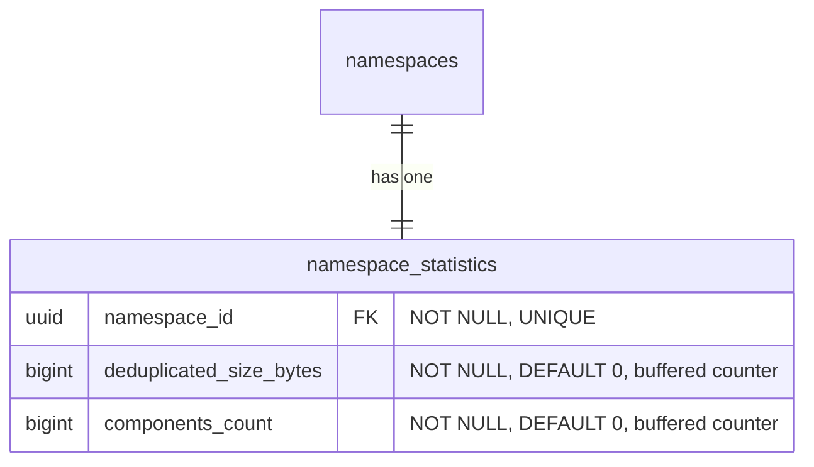

- **namespace_statistics**: 事前計算された名前空間レベルのカウンターを保存し、バッファカウンター（非同期フラッシャー）を介して維持されます。これは、表示パスと請求システムが読み取るテーブルで、サブミリ秒のレスポンスを提供します（[ベンチマークテーブル](#namespace-level-storage-accounting-reconciliation) を参照）。[整合性検証メカニズム](#namespace-level-storage-accounting-reconciliation) は、ドリフトが疑われるときにこれらのカウンターを検証し修正するために存在します。
  - `deduplicated_size_bytes`: blob の重複排除が既に適用された、名前空間が使用する総ストレージです（[ADR-002](002_storage_deduplication_scope.md) を参照）。このカラムは、将来の raw または論理的なサイズメトリクスと区別するために前方互換であるよう、（`size_bytes` ではなく）このように名付けられています。
  - `components_count`: 名前空間のローカルおよびリモートのリポジトリに保存されたアーティファクトバージョンの総数:
    - Container: `container_manifests` + `container_remote_manifests`。
    - Maven: `maven_versions` + `maven_remote_versions`。
    - npm: `npm_versions` + `npm_remote_versions`。

    ソフト削除済みの行は、[ソフト削除ウィンドウ](010_data_retention.md#soft-delete) が経過した後にガベージコレクションがそれらをハード削除するまでカウントされ続けます。これは、ガベージコレクションが基となる blob を回収するまでソフト削除されたアーティファクトのバイトを保持する `deduplicated_size_bytes` と一致します。仮想リポジトリは、独自のバージョンテーブルを持たないため、別途カウントされません。仮想リポジトリは、順序付けられた upstream のリストを通じてリクエストを解決し（[`container_virtual_repository_upstreams`](#virtual-container-repositories) とその Maven および npm の同等物を参照）、各 upstream はそれ自体がローカルまたはリモートのリポジトリで、そのバージョンは上記のテーブルを介して既に含まれています。その上に仮想リポジトリをカウントすると、その upstream を二重にカウントすることになります。これは、消費ベースの価格設定と計量のための名前空間レベルの次元であり、`deduplicated_size_bytes` を補完します。名前空間の概要にストレージ使用量とともに表示されます。

#### 名前空間レベルのストレージ会計の整合性検証

`namespace_statistics.deduplicated_size_bytes` カウンターとリポジトリレベルの `repositories.size_bytes` カウンターは、サブミリ秒の読み取りで表示パスに対応します。しかし、2つの整合性検証のシナリオでは、キャッシュされたカウンターではなくソースデータから正確なストレージを計算する必要があります。

1. **オンデマンドの検証**: 顧客が「私の請求は正確か」と尋ね、ソースデータから正確な名前空間ストレージを計算する必要があります。これは、64個すべての `sha256` パーティションにまたがる `SUM(size) FROM blob_storage_blobs WHERE namespace_id = ?` を意味します。
2. **ドリフトの修正**: 失敗した GC 実行、部分的なフラッシュ、またはその他のイベントがキャッシュされたカウンターを非同期化し、それを修正するために正確な値を再計算する必要があります。

`blob_storage_blobs` は `HASH(sha256)` でパーティショニングされているため、`namespace_id` のみのクエリは64個すべてのパーティションにファンアウトします。CloudSQL PostgreSQL 18 インスタンスでの [ベンチマーク](https://gitlab.com/gitlab-com/content-sites/handbook/-/merge_requests/18456#note_3166018048)（[シード済み](https://gitlab.com/jdrpereira/artifact-registry-poc/-/tree/main/cmd/seed) データセット: 64個の `sha256` パーティションにまたがる約160万 blob、Zipf 分布の blob 所有を持つ50万名前空間、最も blob の多い名前空間は353K blob）は、最も重い名前空間でベースラインを 78 ms、約3K+ のバッファヒットと示しています。2つの追加的な保険ポリシーがこれを改善できます。

**Option A — `blob_storage_blobs` のカバリングインデックス**: 各パーティションの既存の `namespace_id` インデックスに `INCLUDE (size)` を追加します。これにより、64パーティションのファンアウトが、ヒープフェッチが最小限またはゼロの64個のインデックスオンリースキャンになります。スペースのオーバーヘッドは無視できます（既存のインデックスのリーフページに `size` カラムが追加されるだけです）。

**Option B — 名前空間パーティショニングされたシャドウテーブル**: `HASH(namespace_id)` で64パーティションにパーティショニングされた専用の `blob_storage_blobs_by_namespace` テーブルで、`blob_storage_blobs` の `AFTER INSERT`/`DELETE` トリガーを介して維持されます。これにより、整合性検証クエリが単一パーティションのインデックスオンリースキャンに集約されます。スペースのオーバーヘッドは中程度です（blob データの最小限のサブセット — `namespace_id`、`sha256`、`size` — を64個の新しいパーティションとインデックスにまたがって複製し、blob 数とともに線形に増加します）。トレードオフはすべての blob の `INSERT`/`DELETE` での書き込み増幅ですが、整合性検証の負荷をメインの `blob_storage_blobs` テーブル（ホットパス）から遠ざけます。

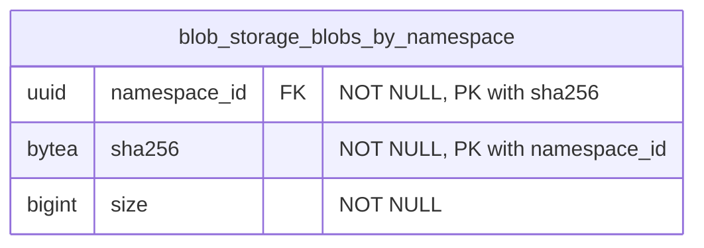

`blob_storage_blobs` のトリガーがこのテーブルを維持します。`AFTER INSERT` は `(namespace_id, sha256, size)` をシャドウテーブルにコピーし、`AFTER DELETE` は一致する行を削除します。`blob_storage_blobs` の行は不変であるため、`AFTER UPDATE` トリガーは不要です。コンテンツアドレス可能なストレージは、コンテンツへのあらゆる変更が新しい `sha256`、したがって新しい行を生み出すことを意味します（[ADR-008](008_content_addressable_storage.md) を参照）。主キー `(namespace_id, sha256)` はパーティションキー（`namespace_id`）を含まなければならず、`blob_storage_blobs` の一意キーをミラーします。このテーブルは、他の `HASH(namespace_id)` テーブルと同じ64パーティションのカウントを使用します。`(namespace_id) INCLUDE (size)` のカバリングインデックスがインデックスオンリースキャンを可能にします。

| アプローチ | タイミング | バッファ | スキャンされたパーティション | 書き込みオーバーヘッド |
|---|---|---|---|---|
| `namespace_statistics` カウンター（表示パス） | 0.013 ms | 1 | 0 | 非同期フラッシャー |
| シャドウテーブル + カバリングインデックス（Option B） | 29 ms | 1,361 | 1 | トリガー |
| blob のカバリングインデックス（Option A） | 43 ms | 1,599 | 64 | なし |
| ベースライン（変更なし） | 78 ms | ~3K+ | 64 | なし |

両方のオプションは純粋に追加的で — `blob_storage_blobs` 自体への変更はなく — 独立して追加または削除できます。それらは相互排他的ではなく、両方が初期スキーマに含まれます。より多くのカバレッジから始め、本番メトリクスが必要ないことを確認した後にインデックスや補助テーブルを削除するほうが容易です。

#### 名前空間レベルのコンポーネント数の整合性検証

`namespace_statistics.components_count` カウンターは、表示パスと計量パイプラインに対応します。ストレージカウンターと同様に、2つのシナリオでソースデータから正確な値を再計算する必要があります。

1. **オンデマンドの検証**: 顧客（または請求）がコンポーネント数が正確かどうかを尋ね、ソース行からそれを導出する必要があります。
2. **ドリフトの修正**: 失敗したフラッシュ、部分的なバッファ損失、またはバックグラウンドジョブのバグがカウンターを非同期化し、それを再計算する必要があります。

整合性検証は、名前空間の行にスコープされた6つの独立したカウントを合計します。3つのローカル（`container_manifests`、`maven_versions`、`npm_versions`）と3つのリモート（`container_remote_manifests`、`maven_remote_versions`、`npm_remote_versions`）です。再計算された値が `components_count` が追跡するものと一致するよう、ソフト削除済みの行が含まれます（挿入でインクリメント、ガベージコレクションのハード削除でデクリメント。ソフト削除と復元は何もしません）。

```sql
SELECT
  (SELECT COUNT(*) FROM container_manifests        WHERE namespace_id = $1)
+ (SELECT COUNT(*) FROM container_remote_manifests WHERE namespace_id = $1)
+ (SELECT COUNT(*) FROM maven_versions             WHERE namespace_id = $1)
+ (SELECT COUNT(*) FROM maven_remote_versions      WHERE namespace_id = $1)
+ (SELECT COUNT(*) FROM npm_versions               WHERE namespace_id = $1)
+ (SELECT COUNT(*) FROM npm_remote_versions        WHERE namespace_id = $1)
  AS components_count;
```

各サブクエリは、単一のソーステーブルでの `namespace_id` によるカウントで、`soft_deleted_at` の述語はありません。そのため、テーブルに残っている行（[ソフト削除ウィンドウ](010_data_retention.md#soft-delete) 内のライブ行とソフト削除済み行）が `components_count` が追跡するものと一致します。4つのパーティショニングされたソーステーブル（`container_manifests`、`container_remote_manifests`、`maven_remote_versions`、`npm_remote_versions`）は単一の `HASH(namespace_id)` パーティションにプルーニングされます。2つの非パーティショニングの中間層テーブル（`maven_versions`、`npm_versions`）は、名前空間の行についてテーブル全体をスキャンします。既存の部分一意インデックス（`WHERE soft_deleted_at IS NULL`）はライブ行のみをカバーするため、カウントを直接満たすことはできません。名前空間ごとのカーディナリティはデータモデルによって境界づけられ（ファイルや blob 参照ごとではなくバージョンごとに1行）、整合性検証は頻繁ではない（オンデマンドまたはドリフト修正で、ホットパスではない）ため、境界のあるスキャンは許容されます。追加の保険ポリシー（カバリングインデックスやシャドウテーブル）は導入されません。本番メトリクスがこれが遅すぎることを示した場合、各ソーステーブルへの非部分の `(namespace_id)` インデックスが、シャドウテーブルを検討する前の最も安価な次のステップです。

### インデックス

- **`blob_storage_blobs`**: `(namespace_id, sha256)` に対する一意インデックス — 重複排除を強制し、組織内で sha256 による blob の存在をチェックします。この制約はパーティションキー（`sha256`）を含むため、PostgreSQL はすべてのハッシュパーティションにまたがってそれを正しく強制します。`(namespace_id) INCLUDE (size)` に対するカバリングインデックス — ヒープフェッチなしで [名前空間レベルのストレージ会計の整合性検証](#namespace-level-storage-accounting-reconciliation) のためのインデックスオンリースキャンを可能にします。
- **`blob_storage_attachments`**: `(namespace_id, sha256)` に対するインデックス — blob のコンテンツハッシュを指定してアタッチメントの存在をチェックします（孤立チェックのために [クリーンアッププロセス](#cleanup-tasks) で使用されます）。
- **`blob_storage_blobs_by_namespace`**: `(namespace_id, sha256)` に対する主キー — `blob_storage_blobs` の行との 1:1 対応を強制します。`(namespace_id) INCLUDE (size)` に対するカバリングインデックス — [名前空間レベルのストレージ会計の整合性検証](#namespace-level-storage-accounting-reconciliation) のための単一パーティションのインデックスオンリースキャンを可能にします。
- **`namespace_statistics`**: `(namespace_id)` に対する一意インデックス — 名前空間ごとに1つの統計レコードです。

ハッシュパーティショニングされたテーブルでは、インデックスはパーティションごとにローカルです。インデックス操作は単一のパーティションにスコープされ、テーブル全体をロックしません。

### Blob ストレージのクエリ例

- アーティファクトのプル（読み取りパスのショートカット: `*_files` → `blob_storage_blobs`、アタッチメントをスキップ — 1パーティション）

  ```sql
  SELECT bsb.object_storage_key, bsb.size
  FROM maven_files mf
  JOIN blob_storage_blobs bsb ON bsb.namespace_id = mf.namespace_id AND bsb.sha256 = mf.blob_sha256
  WHERE mf.namespace_id = '018f4d6f-0e10-7e3a-9bfd-23a4c5d6e7f8' AND mf.maven_version_id = 456 AND mf.file_name = 'myapp-1.0.0.jar'
    AND mf.soft_deleted_at IS NULL;
  ```

- blob アップロード時の重複排除アップサート（1パーティション、競合なし）

  ```sql
  INSERT INTO blob_storage_blobs (namespace_id, sha256, size, content_type, object_storage_key)
  VALUES ('018f4d6f-0e10-7e3a-9bfd-23a4c5d6e7f8', 'abcd1234efgh5678...'::bytea, 1048576, 'application/octet-stream', 'key')
  ON CONFLICT (namespace_id, sha256) DO NOTHING
  RETURNING id, sha256;
  ```

- 組織内で sha256 による blob の存在をチェックする（1パーティション）

  ```sql
  SELECT 1 AS one
  FROM blob_storage_blobs
  WHERE namespace_id = '018f4d6f-0e10-7e3a-9bfd-23a4c5d6e7f8' AND sha256 = 'abcd1234efgh5678...'::bytea
  LIMIT 1;
  ```

- 孤立チェック: この blob はまだどのアタッチメントからも参照されているか?（1パーティション）

  ```sql
  SELECT 1 AS one
  FROM blob_storage_attachments
  WHERE namespace_id = '018f4d6f-0e10-7e3a-9bfd-23a4c5d6e7f8' AND sha256 = 'abcd1234efgh5678...'::bytea
  LIMIT 1;
  ```

- blob のカバリングインデックス（Option A）を介したストレージ会計の整合性検証: ソースデータから正確な名前空間ストレージを計算する（64パーティション、インデックスオンリースキャン）

  ```sql
  SELECT SUM(size) AS total_size_bytes
  FROM blob_storage_blobs
  WHERE namespace_id = 123;
  ```

- シャドウテーブル（Option B）を介したストレージ会計の整合性検証: 正確な名前空間ストレージを計算する（1パーティション、インデックスオンリースキャン）

  ```sql
  SELECT SUM(size) AS total_size_bytes
  FROM blob_storage_blobs_by_namespace
  WHERE namespace_id = 123;
  ```

- 表示パス: 事前計算された名前空間カウンターを読み取る（単一行ルックアップ）

  ```sql
  SELECT deduplicated_size_bytes, components_count
  FROM namespace_statistics
  WHERE namespace_id = 123;
  ```

## 結果

### ポジティブな点

1. **各アーティファクトフォーマットに合わせたデータ構成**: 各アーティファクトフォーマットに専用テーブルを使用することで、テーブル構成に最大限の柔軟性が得られます。フォーマットプロトコルが要求する任意の数の追加カラムを持てます。既に専用テーブルを使用しているため、追加の補助テーブルは不要です。

2. **各フォーマットのデータテーブルが関連する使用パターンを持つ**: 各フォーマットの専用テーブルは、Rest および GraphQL API と関連するアーティファクト管理クライアントから使用パターンを受け取ります。これにより、他のフォーマットの使用パターンからの分離が提供されます。

3. **フォーマット関連のデータパフォーマンスの分離**: 特定のアーティファクトフォーマットテーブルのパフォーマンスのボトルネックは、他のフォーマットに即座に影響を与えません。

4. **透過的なオブジェクトストレージのクリーンアップ**: [オブジェクトストレージのクリーンアップタスク](#cleanup-tasks) が [blob ストレージ](#blob-storage) ドメインに集中化されているため、親ドメイン（この場合は各フォーマット固有のドメイン）はこの部分を扱う必要がありません。さらに、このクリーンアップは削除操作がどのように行われたか（単一要素の破棄、一括破棄、選択された要素のセットに対して破棄を実行するバックグラウンドクリーンアップポリシー）に影響されません。

5. **blob ストレージの分離が再利用性を提供する**: blob ストレージのテーブルは、ここで説明する Artifact Registry 機能に縛られていません。そのため、この部分は他の領域でのファイルアップロードのニーズに再利用できます。

6. **効率的なストレージ会計**: 組織スコープの重複排除と組織ごとの重複排除された blob レコードにより、ストレージ使用量のクエリがシンプルかつ効率的になります。注: `sha256` ベースのパーティショニングでは、組織レベルの集計が64個すべてのパーティションをスキャンします。これは、遅延インクリメントを介して更新される専用のロールアップテーブルによって緩和されます（[パーティショニング戦略](#blob-storage-partitioning-strategy) を参照）。

7. **統一されたフォーマット横断のリスト表示**: 親の `repositories` テーブルは、名前空間内のすべてのフォーマットと種類（ローカル、仮想、リモート）にまたがるすべてのリポジトリを一覧表示するための単一のソースを提供し、複数のテーブルにまたがる `UNION ALL` なしでランディングページのハイブリッドリストを支えます。

8. **スタンドアロンのリモートリポジトリが共有を可能にする**: 独自のライフサイクルを持つスタンドアロンエンティティとしてのリモートリポジトリは、複数の仮想リポジトリ間で共有でき、設定とキャッシュエントリの重複を削減します。

### ネガティブな点

1. **フォーマット横断の詳細クエリは依然として結合を必要とする**: 親の `repositories` テーブルはランディングページのリスト表示のユースケースを解決しますが、フォーマット固有の詳細（例: コンテナイメージ、Maven パッケージ）へのアクセスは依然としてフォーマット固有のテーブルへの結合を必要とします。

2. **blob ストレージのための集中化されたテーブル**: これは2つの欠点をもたらします。第一に、これらのテーブルには非常に大量の行が存在します。この状況を扱うには慎重なテーブル設計が必要です。第二に、これらのテーブルの問題（テーブル全体のロックなど）は、すべてのアーティファクトタイプに影響を与える可能性があります。

3. **リポジトリごとのストレージ帰属は結合を必要とする**: リポジトリレベルでの正確なストレージ使用量の帰属は、フォーマット固有のテーブルから `blob_storage_attachments` を通じて `blob_storage_blobs` への結合によって導出されます。これは blob ストレージを汎用かつ重複排除された状態に保ちますが、非正規化されたリポジトリごとのカウンターと比べていくらかの複雑さを追加します。

4. **2段階のリポジトリ作成**: リポジトリの作成には、親の `repositories` テーブルとフォーマット固有のテーブルの両方への挿入が必要です。これは単一テーブルの挿入と比べてトランザクションの複雑さを追加します。

## 代替案

### 共通データの集中化

ここでの別のアプローチとして、アーティファクトフォーマット領域のすべての共通データを共通の集中化されたテーブルに保存することが考えられます。

これは、複数のソースを結合することなくそれらのクエリに答えられるため、混在するアーティファクトフォーマットのデータアクセスを大いに助けます。

このアプローチは既に [Package Registry 機能](https://docs.gitlab.com/user/packages/package_registry/) で使用されており、本稿執筆時点で、それらの共通テーブルは予想どおり大量の行を持つだけでなく、多数の特殊化されたインデックスも持っています。これらの各インデックスは、アーティファクトフォーマットに固有のアクセスパターンをサポートします。インデックスの数がかなり多いため、今日では新しいインデックスの追加、例えば Package Registry 機能に新しいフォーマットのサポートが追加された場合、より厳しい精査やプッシュバックさえ受けることになります。

さらに、各アーティファクトフォーマットには保存する必要のある固有のデータがあります（例: 正規化されたパッケージ名）。この固有のデータは共通テーブルには保存できません。一部の行のみが使用するカラムを作成することになるからです。これは複数の補助テーブルの作成につながります。それらの補助テーブルは、指定したアーティファクトタイプのアクセスパターンに必要な結合の数を増やします。

`repositories` 親テーブルの導入は、このアプローチの限定的なバージョンを採用しています。リスト表示とフィルタリングに必要なフォーマット横断のメタデータ（name、visibility、format、kind、カウンター）のみが集中化されます。フォーマット固有のデータは専用テーブルに残り、上記で説明したインデックスの増殖と補助テーブルの問題を回避します。

## 参考資料

- [ADR-001: Organizations as Anchor Point](001_organizations_as_anchor_point.md) - なぜレジストリが Organizations にアンカーするか
- [ADR-002: Storage Deduplication Scope](002_storage_deduplication_scope.md) - 重複排除スコープに関する詳細な決定
<!-- - [ADR-010: Data Retention](010_data_retention.md) - Retention policies including soft delete and blob cleanup timing -->
- [Package Registry common tables decomposition](https://gitlab.com/groups/gitlab-org/-/work_items/16000) - 共通のアーティファクト関連データを中央のテーブルに保存する際に直面した問題の詳細。
